# 第四章：使用 React Router 进行路由

如果我们的应用程序有多个页面，我们需要管理不同页面之间的导航。React Router 是一个很棒的库，可以帮助我们做到这一点！

在本章中，我们将构建一个网上商店，我们可以在其中购买一些用于 React 的工具。我们的简单商店将有多个页面，我们将使用 React Router 来管理这些页面。当我们完成时，商店将如下截图所示：

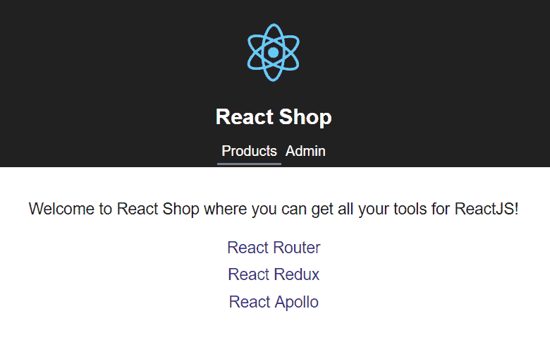

在本章中，我们将学习以下主题：

+   使用路由类型安装 React Router

+   声明路由

+   创建导航

+   路由参数

+   处理未找到的路由

+   实现页面重定向

+   查询参数

+   路由提示

+   嵌套路由

+   动画过渡

+   延迟加载路由

# 技术要求

在本章中，我们将使用以下技术：

+   **Node.js 和** `npm`：TypeScript 和 React 依赖于这些。我们可以从[`nodejs.org/en/download/`](https://nodejs.org/en/download/)安装这些。如果已经安装了这些，请确保`npm`至少是 5.2 版本。

+   **Visual Studio Code**：我们需要一个编辑器来编写我们的 React 和 TypeScript 代码，可以从[`code.visualstudio.com/`](https://code.visualstudio.com/)安装。我们还需要在 Visual Studio Code 中安装 TSLint（由 egamma 提供）和 Prettier（由 Estben Petersen 提供）扩展。

本章中的所有代码片段都可以在[`github.com/carlrip/LearnReact17WithTypeScript/tree/master/04-ReactRouter`](https://github.com/carlrip/LearnReact17WithTypeScript/tree/master/04-ReactRouter)上找到。

# 使用路由安装 React Router

**React Router**及其类型在`npm`中，因此我们可以从那里安装它们。

在安装 React Router 之前，我们需要创建我们的 React 商店项目。让我们通过选择一个空文件夹并打开 Visual Studio Code 来做好准备。要做到这一点，请按照以下步骤进行：

1.  现在让我们打开一个终端并输入以下命令来创建一个新的 React 和 TypeScript 项目：

```jsx
npx create-react-app reactshop --typescript
```

请注意，我们使用的 React 版本至少需要是`16.7.0-alpha.0`。我们可以在`package.json`文件中检查这一点。如果`package.json`中的 React 版本小于`16.7.0-alpha.0`，那么我们可以使用以下命令安装此版本：

```jsx
npm install react@16.7.0-alpha.0
npm install react-dom@16.7.0-alpha.0
```

1.  项目创建后，让我们将 TSLint 作为开发依赖项添加到我们的项目中，并添加一些与 React 和 Prettier 兼容的规则：

```jsx
cd reactshop
npm install tslint tslint-react tslint-config-prettier --save-dev
```

1.  现在让我们添加一个包含一些规则的`tslint.json`文件：

```jsx
{
  "extends": ["tslint:recommended", "tslint-react", "tslint-config-prettier"],
  "rules": {
    "ordered-imports": false,
    "object-literal-sort-keys": false,
    "no-debugger": false,
    "no-console": false,
  },
  "linterOptions": {
    "exclude": [
      "config/**/*.js",
      "node_modules/**/*.ts",
      "coverage/lcov-report/*.js"
    ]
  }
}
```

1.  现在，让我们输入以下命令将 React Router 安装到我们的项目中：

```jsx
npm install react-router-dom
```

1.  让我们还安装 React Router 的 TypeScript 类型，并将它们保存为开发依赖项：

```jsx
npm install @types/react-router-dom --save-dev
```

在进入下一节之前，我们将删除一些我们不需要的`create-react-app`创建的文件：

1.  首先，让我们删除`App`组件。因此，让我们删除`App.css`，`App.test.tsx`和`App.tsx`文件。让我们还在`index.tsx`中删除对`"./App"`的导入引用。

1.  让我们还通过删除`serviceWorker.ts`文件并在`index.tsx`中删除对它的引用来删除服务工作者。

1.  在`index.tsx`中，让我们将根组件从`<App/>`更改为`<div/>`。我们的`index.tsx`文件现在应该包含以下内容：

```jsx
import * as React from 'react';
import * as ReactDOM from 'react-dom';
import './index.css';

ReactDOM.render(
  <div />,
  document.getElementById('root') as HTMLElement
);
```

# 声明路由

我们使用`BrowserRouter`和`Route`组件在应用程序中声明页面。`BrowserRouter`是顶层组件，它查找其下方的`Route`组件以确定所有不同的页面路径。

我们将在本节的后面使用`BrowserRouter`和`Route`声明一些页面，但在此之前，我们需要创建我们的前两个页面。这第一个页面将包含我们在商店中要出售的 React 工具列表。我们使用以下步骤来创建我们的页面：

1.  因此，让我们首先通过创建一个`ProductsData.ts`文件并包含以下内容来为我们的工具列表创建数据：

```jsx
export interface IProduct {
  id: number;
  name: string;
  description: string;
  price: number;
}

export const products: IProduct[] = [
  {
    description:
      "A collection of navigational components that compose  
       declaratively with your app",
    id: 1,
    name: "React Router",
    price: 8
  },
  {
    description: "A library that helps manage state across your app",
    id: 2,
    name: "React Redux",
    price: 12
  },
  {
    description: "A library that helps you interact with a GraphQL backend",
    id: 3,
    name: "React Apollo",
    price: 12
  }
];
```

1.  让我们创建另一个名为`ProductsPage.tsx`的文件，其中包含以下内容来导入 React 以及我们的数据：

```jsx
import * as React from "react";
import { IProduct, products } from "./ProductsData";
```

1.  我们将在组件状态中引用数据，因此让我们为此创建一个接口：

```jsx
interface IState {
  products: IProduct[];
}
```

1.  让我们继续创建名为`ProductsPage`的类组件，将状态初始化为空数组：

```jsx
class ProductsPage extends React.Component<{}, IState> {
  public constructor(props: {}) {
    super(props);
    this.state = {
      products: []
    };
  }
```

```jsx
}

export default ProductsPage;
```

1.  现在让我们实现`componentDidMount`生命周期方法，并从`ProductData.ts`将数据设置为`products`数组：

```jsx
public componentDidMount() {
  this.setState({ products });
}
```

1.  继续实现`render`方法，让我们欢迎我们的用户并在列表中列出产品：

```jsx
public render() {
  return (
    <div className="page-container">
      <p>
        Welcome to React Shop where you can get all your tools for ReactJS!
      </p>
      <ul className="product-list">
        {this.state.products.map(product => (
          <li key={product.id} className="product-list-item">
           {product.name}
          </li>
        ))}
      </ul>
    </div>
  );
}
```

我们已经在`products`数组中使用了`map`函数来迭代元素并为每个产品生成一个列表项标签`li`。我们需要为每个`li`赋予一个唯一的`key`属性，以帮助 React 管理列表项的任何更改，而在我们的情况下是产品的`id`。

1.  我们已经引用了一些 CSS 类，因此让我们将它们添加到`index.css`中：

```jsx
.page-container {
 text-align: center;
 padding: 20px;
 font-size: large;
}

.product-list {
 list-style: none;
 margin: 0;
 padding: 0;
}

.product-list-item {
 padding: 5px;
}
```

1.  现在让我们实现我们的第二个页面，即管理面板。因此，让我们创建一个名为`AdminPage.tsx`的文件，并在其中添加以下功能组件：

```jsx
import * as React from "react";

const AdminPage: React.SFC = () => {
  return (
    <div className="page-container">
      <h1>Admin Panel</h1>
      <p>You should only be here if you have logged in</p>
    </div>
  );
};

export default AdminPage;
```

1.  现在我们的商店中有两个页面，我们可以为它们声明两个路由。让我们创建一个名为`Routes.tsx`的文件，其中包含以下内容，以从 React Router 中导入`React`、`BrowserRouter`和`Route`组件，以及我们的两个页面：

```jsx
import * as React from "react";
import { BrowserRouter as Router, Route } from "react-router-dom";

import AdminPage from "./AdminPage";
import ProductsPage from "./ProductsPage";
```

我们已经在导入语句中将`BrowserRouter`重命名为`Router`，以节省一些按键次数。

1.  接下来，让我们实现一个包含我们两个路由的功能组件：

```jsx
const Routes: React.SFC = () => {
  return (
    <Router>
      <div>
        <Route path="/products" component={ProductsPage} />
        <Route path="/admin" component={AdminPage} />
      </div>
    </Router>
  );
};

export default Routes;
```

在渲染过程中，如果`Route`组件中的`path`与当前路径匹配，那么该组件将被渲染，如果不匹配，则将渲染`null`。在我们的例子中，如果路径是`"/products"`，则将渲染`ProductPage`，如果路径是`"/admin"`，则将渲染`AdminPage`。

1.  以下是将我们的`Routes`作为根组件在`index.tsx`中渲染的最后一步：

```jsx
import * as React from "react";
import * as ReactDOM from "react-dom";
import "./index.css";
import Routes from "./Routes";

ReactDOM.render(<Routes />, document.getElementById("root") as HTMLElement);
```

1.  现在我们应该能够运行我们的应用程序了：

```jsx
npm start
```

应用可能会从根页面开始，因为该路径没有指向任何内容，所以页面会是空白的。

1.  如果我们将路径更改为`"/products"`，我们的产品列表应该呈现如下：

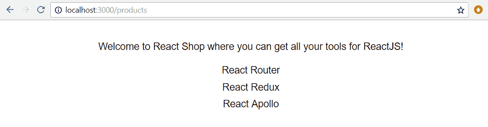

1.  如果我们将路径更改为`"/admin"`，我们的管理面板应该呈现如下：

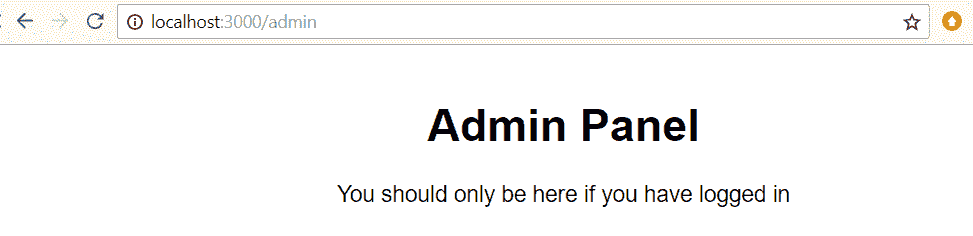

现在我们已经成功创建了一些路由，我们真的需要一个导航组件来使我们的页面更加可发现。我们将在下一节中做到这一点。

# 创建导航

React Router 提供了一些很好的组件来提供导航。我们将使用这些组件来实现应用程序标题中的导航选项。

# 使用 Link 组件

我们将使用 React Router 中的`Link`组件来创建我们的导航选项，具体步骤如下：

1.  让我们从创建一个名为`Header.tsx`的新文件开始，其中包含以下导入：

```jsx
import * as React from "react";
import { Link } from "react-router-dom";

import logo from "./logo.svg";
```

1.  让我们在`Header`功能组件中使用`Link`组件创建两个链接：

```jsx
const Header: React.SFC = () => {
  return (
    <header className="header">
      
      <h1 className="header-title">React Shop</h1>
      <nav>
        <Link to="/products" className="header-
         link">Products</Link>
        <Link to="/admin" className="header-link">Admin</Link>
      </nav>
    </header>
  );
};

export default Header;
```

`Link`组件允许我们定义链接导航到的路径以及要显示的文本。

1.  我们已经引用了一些 CSS 类，所以让我们把它们添加到`index.css`中：

```jsx
.header {
  text-align: center;
  background-color: #222;
  height: 160px;
  padding: 20px;
  color: white;
}

.header-logo {
  animation: header-logo-spin infinite 20s linear;
  height: 80px;
}

@keyframes header-logo-spin {
  from {
    transform: rotate(0deg);
  }
  to {
    transform: rotate(360deg);
  }
}

.header-title {
  font-size: 1.5em;
}

.header-link {
  color: #fff;
  text-decoration: none;
  padding: 5px;
}
```

1.  现在我们的`Header`组件就位了，让我们在`Routes.tsx`中`import`它：

```jsx
import Header from "./Header";
```

1.  然后我们可以在 JSX 中使用它如下：

```jsx
<Router>
  <div>
    <Header />
    <Route path="/products" component={ProductsPage} />
    <Route path="/admin" component={AdminPage} />
  </div>
</Router>
```

1.  如果我们检查正在运行的应用程序，它应该看起来像以下截图，有一个漂亮的标题和两个导航选项，可以转到我们的产品和管理页面：

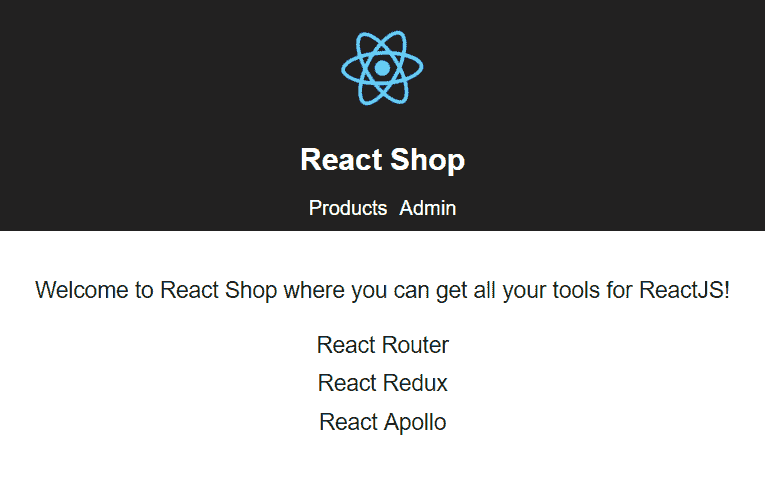

1.  尝试点击导航选项-它们有效！如果我们使用浏览器开发者工具检查产品和管理元素，我们会看到 React Router 已将它们呈现为锚标签：

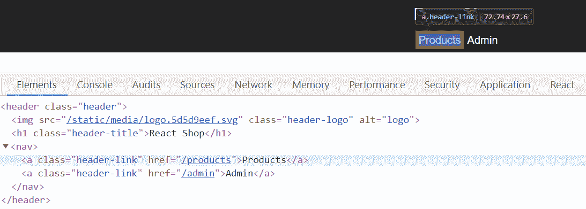

如果我们在点击导航选项时查看开发者工具中的网络选项卡，我们会看到没有网络请求正在被发出来为我们的 React 应用程序提供页面。这表明 React Router 正在处理我们的导航。

# 使用 NavLink 组件

React Router 还提供了另一个用于链接页面的组件，称为`NavLink`。实际上，这更适合我们的需求。以下步骤解释了我们如何重构我们的`Header`组件以使用`NavLink`：

1.  所以，让我们在我们的`Header`组件中用`NavLink`替换`Link`并进行一些改进：

```jsx
import * as React from "react";
import { NavLink } from "react-router-dom";

import logo from "./logo.svg";

const Header: React.SFC = () => {
  return (
    <header className="header">
      
      <h1 className="header-title">React Shop</h1>
      <nav>
        <NavLink to="/products" className="header-
         link">Products</NavLink>
        <NavLink to="/admin" className="header-
         link">Admin</NavLink>
      </nav>
    </header>
  );
};

export default Header;
```

此时，我们的应用程序看起来和行为都完全一样。

1.  `NavLink`公开了一个`activeClassName`属性，我们可以用它来设置活动链接的样式。所以，让我们使用它：

```jsx
<NavLink to="/products" className="header-link" activeClassName="header-link-active">
  Products
</NavLink>
<NavLink to="/admin" className="header-link" activeClassName="header-link-active">
  Admin
</NavLink>
```

1.  让我们将`header-link-active`的 CSS 添加到我们的`index.css`中：

```jsx
.header-link-active {
  border-bottom: #ebebeb solid 2px;
}
```

1.  如果我们现在切换到正在运行的应用程序，活动链接将被下划线划掉：

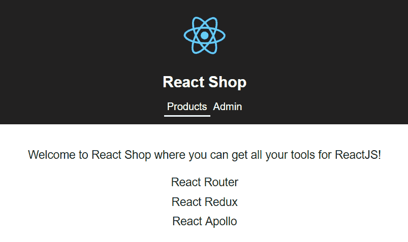

因此，`NavLink`非常适合主应用程序导航，我们希望突出显示活动链接，而`Link`非常适合应用程序中的所有其他链接。

# 路由参数

路由参数是路径的可变部分，在目标组件中可以使用它们来有条件地渲染某些内容。

我们需要向我们的商店添加另一个页面，以显示每个产品的描述和价格，以及将其添加到购物篮的选项。我们希望能够使用`"/products/{id}"`路径导航到此页面，其中`id`是产品的 ID。例如，到达 React Redux 的路径将是`"products/2"`。因此，路径的`id`部分是一个路由参数。我们可以通过以下步骤来完成所有这些：

1.  让我们在两个现有路由之间的`Routes.tsx`中添加此路由。路由的`id`部分将是一个路由参数，我们在其前面用冒号定义它：

```jsx
<Route path="/products" component={ProductsPage} />
<Route path="/products/:id" component={ProductPage} />
<Route path="/admin" component={AdminPage} />
```

1.  当然，`ProductPage`组件还不存在，所以，让我们首先创建一个名为`ProductPage.tsx`的新文件，其中包含以下导入：

```jsx
import * as React from "react";
import { RouteComponentProps } from "react-router-dom";
import { IProduct, products } from "./ProductsData";
```

1.  关键部分在于我们将使用`RouteComponentProps`类型来访问路径中的`id`参数。让我们使用`RouteComponentProps`通用类型来定义我们的`ProductPage`组件的 props 类型别名，并传入一个具有`id`属性的类型：

```jsx
type Props = RouteComponentProps<{id: string}>;
```

如果您不理解`type`表达式中的尖括号，不要担心。这表示一个通用类型，我们将在第五章中探讨*高级类型*。

理想情况下，我们应该将`id`属性指定为数字，以匹配产品数据中的类型。但是，`RouteComponentProps`只允许我们拥有类型为字符串或未定义的路由参数。

1.  `ProductPage`组件将具有状态来保存正在呈现的产品以及它是否已添加到购物篮中，因此让我们为我们的状态定义一个接口：

```jsx
interface IState {
  product?: IProduct;
  added: boolean;
}
```

1.  产品最初将是`undefined`，这就是为什么它被定义为可选的。让我们创建我们的`ProductPage`类并初始化状态，以便产品不在购物篮中：

```jsx
class ProductPage extends React.Component<Props, IState> {
  public constructor(props: Props) {
    super(props);
    this.state = {
      added: false
    };
  }
}

export default ProductPage;
```

1.  当组件加载到 DOM 中时，我们需要使用`Route`参数中的`id`属性从产品数据中找到我们的产品。`RouteComponentProps`给我们一个包含`params`对象的`match`对象，其中包含我们的`id`路由参数。所以，让我们实现这个：

```jsx
public componentDidMount() {
  if (this.props.match.params.id) {
    const id: number = parseInt(this.props.match.params.id, 10);
    const product = products.filter(p => p.id === id)[0];

    this.setState({ product });
  }
}
```

请记住，`id`路由参数是一个字符串，这就是为什么我们在将其与`filter`数组中的产品数据进行比较之前，将其转换为数字使用`parseInt`。

1.  现在我们已经在组件状态中有了我们的产品，让我们继续进行`render`函数：

```jsx
public render() {
  const product = this.state.product;
  return (
    <div className="page-container">
      {product ? (
        <React.Fragment>
          <h1>{product.name}</h1>
          <p>{product.description}</p>
          <p className="product-price">
            {new Intl.NumberFormat("en-US", {
              currency: "USD",
              style: "currency"
            }).format(product.price)}
          </p>
          {!this.state.added && (
            <button onClick={this.handleAddClick}>Add to 
              basket</button>
          )}
        </React.Fragment>
      ) : (
        <p>Product not found!</p>
      )}
    </div>
  );
}
```

在这个 JSX 中有一些有趣的地方：

+   在函数内的第一行，我们将`product`变量设置为产品状态，以节省一些按键，因为我们在 JSX 中引用产品很多。

+   `div`内的三元运算符在有产品时呈现产品。否则，它会通知用户找不到产品。

+   我们在三元运算符的真部分中使用`React.Fragment`，因为三元运算符的每个部分只能有一个父级，`React.Fragment`是一种实现这一点的机制，而不需要渲染像`div`这样的不是真正需要的标记。

+   我们使用`Intl.NumberFormat`将产品价格格式化为带有货币符号的货币。

1.  当单击“添加到购物篮”按钮时，我们还将调用`handleAddClick`方法。我们还没有实现这一点，所以现在让我们这样做，并将`added`状态设置为`true`：

```jsx
private handleAddClick = () => {
  this.setState({ added: true });
};
```

1.  现在我们已经实现了`ProductPage`组件，让我们回到`Routes.tsx`并导入它：

```jsx
import ProductPage from "./ProductPage";
```

1.  让我们打开我们的运行中的应用，输入`"/products/2"`作为路径：

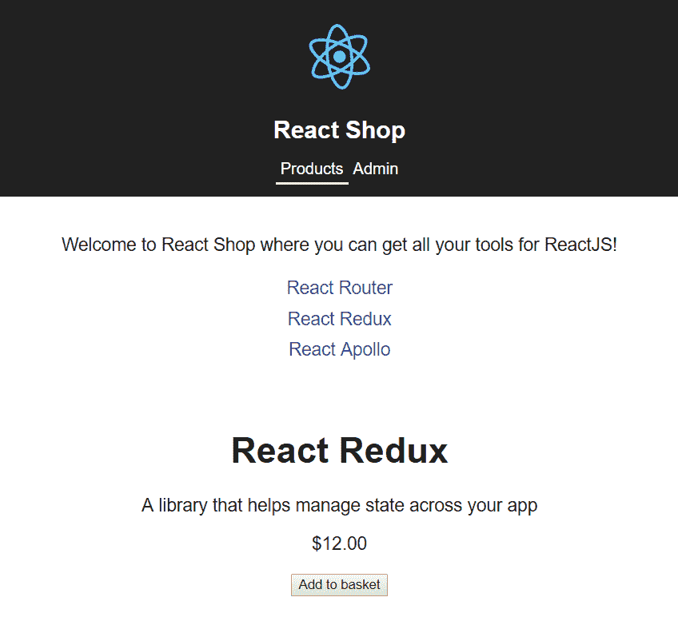

不太符合我们的要求！`ProductsPage`和`ProductPage`都被渲染了，因为`"/products/2"`同时匹配`"/products"`和`"/products/:id"`。

1.  为了解决这个问题，我们可以告诉`"/products"`路由只在有精确匹配时才进行渲染：

```jsx
<Route exact={true} path="/products" component={ProductsPage} />
```

1.  在我们进行这些更改并保存`Routes.tsx`之后，我们的产品页面看起来好多了：

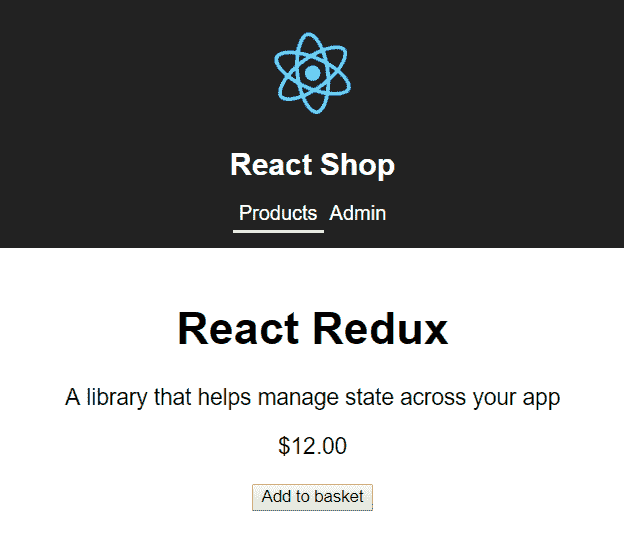

1.  我们不打算让用户输入特定的路径来访问产品！因此，我们将更改`ProductsPage`，使用`Link`组件为每个产品链接到`ProductPage`。首先，让我们从 React Router 中导入`Link`到`ProductsPage`中：

```jsx
import { Link } from "react-router-dom";
```

1.  现在，我们不再在每个列表项中渲染产品名称，而是要渲染一个`Link`组件，用于跳转到我们的产品页面：

```jsx
public render() {
  return (
    <div className="page-container">
      <p>
        Welcome to React Shop where you can get all your tools 
         for ReactJS!
      </p>
      <ul className="product-list">
        {this.state.products.map(product => (
          <li key={product.id} className="product-list-item">
            <Link to={`/products/${product.id}`}>{product.name}
            </Link>
          </li>
        ))}
      </ul>
    </div>
  );
}
```

1.  在我们查看运行中的应用之前，让我们在`index.css`中添加以下 CSS 类：

```jsx
.product-list-item a {
  text-decoration: none;
}
```

现在，如果我们在应用中的产品列表中点击一个列表项，它会带我们到相关的产品页面。

# 处理未找到的路由

如果用户输入了我们应用中不存在的路径会怎么样？例如，如果我们尝试导航到`"/tools"`，我们在标题下面什么都看不到。这是有道理的，因为 React Router 没有找到匹配的路由，所以什么都没有渲染。然而，如果用户导航到无效的路径，我们希望通知他们该路径不存在。以下步骤可以实现这一点：

1.  因此，让我们创建一个名为`NotFoundPage.tsx`的新文件，其中包含以下组件：

```jsx
import * as React from "react";

const NotFoundPage: React.SFC = () => {
  return (
    <div className="page-container">
      <h1>Sorry, this page cannot be found</h1>
    </div>
  );
};

export default NotFoundPage;
```

1.  让我们在`Routes.tsx`中导入这个：

```jsx
import NotFoundPage from "./NotFoundPage";
```

1.  然后让我们在其他路由中添加一个`Route`组件：

```jsx
<Router>
  <div>
    <Header />
    <Route exact={true} path="/products" component={ProductsPage} 
       />
    <Route path="/products/:id" component={ProductPage} />
    <Route path="/admin" component={AdminPage} />
    <Route component={NotFoundPage} />
  </div>
</Router>
```

然而，这将对每个路径进行渲染：

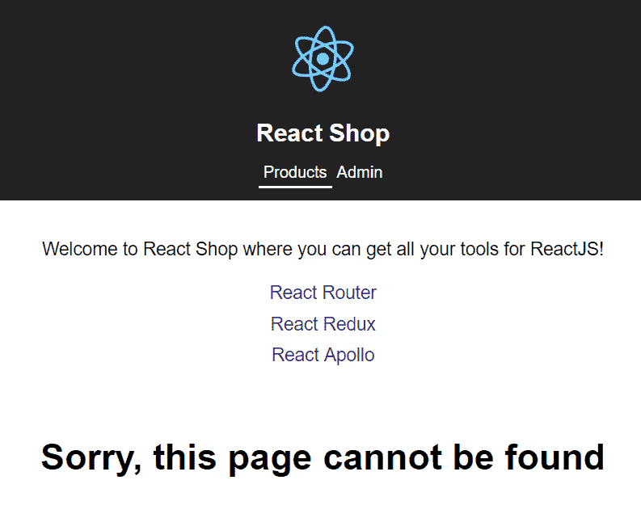

当没有找到其他路由时，我们如何只渲染`NotFoundPage`？答案是在 React Router 中用`Switch`组件包裹路由。

1.  首先在`Routes.tsx`中导入`Switch`：

```jsx
import { BrowserRouter as Router, Route, Switch } from "react-router-dom";
```

1.  现在让我们将`Route`组件包裹在`Switch`组件中：

```jsx
<Switch>
  <Route exact={true} path="/products" component={ProductsPage} />
  <Route path="/products/:id" component={ProductPage} />
  <Route path="/admin" component={AdminPage} />
  <Route component={NotFoundPage} />
</Switch>
```

`Switch`组件只渲染第一个匹配的`Route`组件。如果我们查看运行中的应用，我们会发现我们的问题已经解决了。如果输入一个不存在的路径，我们会得到一个友好的未找到消息：

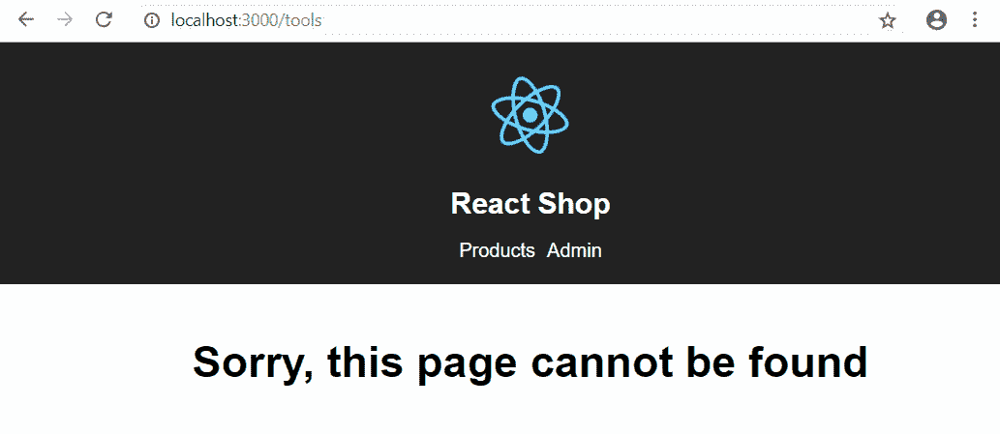

# 实现页面重定向

React Router 有一个名为`Redirect`的组件，我们可以用它来重定向到页面。我们在接下来的几节中使用这个组件来改进我们的商店。

# 简单重定向

如果我们访问`/`路由路径，我们会注意到我们得到了“抱歉，找不到此页面”的消息。让我们把它改成在路径为`/`时重定向到`"/products"`。

1.  首先，我们需要在`Routes.tsx`中导入`Redirect`组件：

```jsx
import { BrowserRouter as Router, Redirect,Route, Switch } from "react-router-dom";
```

1.  现在我们可以使用`Redirect`组件在路径为`/`时重定向到`"/products"`：

```jsx
<Switch>
 <Redirect exact={true} from="/" to="/products" />
  <Route exact={true} path="/products" component={ProductsPage} 
   />
  <Route path="/products/:id" component={ProductPage} />
  <Route path="/admin" component={AdminPage} />
  <Route component={NotFoundPage} />
</Switch>
```

1.  我们在`Redirect`上使用了`exact`属性，以便它只匹配`/`而不匹配`"/products/1"`和`"/admin"`。如果我们尝试在运行的应用程序中输入`/`作为路径，它将立即重定向到`"/products"`。

# 条件重定向

我们可以使用`Redirect`组件来保护未经授权的用户访问页面。在我们的商店中，我们可以使用这个来确保只有已登录的用户可以访问我们的 Admin 页面。我们通过以下步骤来实现这一点：

1.  让我们首先在`Routes.tsx`中的 Admin 页面路由之后添加一个到`LoginPage`的路由：

```jsx
<Route path="/login" component={LoginPage} />
```

1.  当然，`LoginPage`目前不存在，所以让我们创建一个名为`LoginPage.tsx`的文件并输入以下内容：

```jsx
import * as React from "react";

const LoginPage: React.SFC = () => {
  return (
    <div className="page-container">
      <h1>Login</h1>
      <p>You need to login ...</p>
    </div>
  );
};

export default LoginPage;
```

1.  然后我们可以回到`Routes.tsx`并导入`LoginPage`：

```jsx
import LoginPage from "./LoginPage";
```

1.  如果我们去运行的应用程序并导航到`"/login"`，我们会看到我们的登录页面：

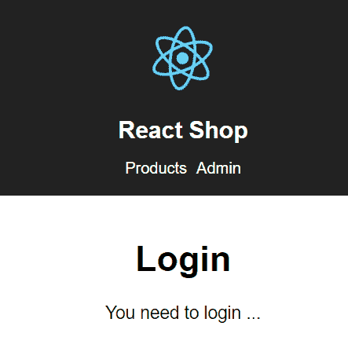

我们不打算完全实现我们的登录页面；我们已经实现的页面足以演示条件重定向。

1.  在我们在`Routes.tsx`中实现`"admin"`路径的条件重定向之前，我们需要在`Routes.tsx`中添加一个关于用户是否已登录的状态：

```jsx
const Routes: React.SFC = () => {
  const [loggedIn, setLoggedIn] = React.useState(false);
  return (
    <Router>
      ...
    </Router>
   );
};
```

因此，我们使用了`useState`钩子来添加一个名为`loggedIn`的状态变量和一个名为`setLoggedIn`的函数。

1.  最后一步是在`"/admin"`路径的`Route`组件内添加以下内容：

```jsx
<Route path="/admin">
 {loggedIn ? <AdminPage /> : <Redirect to="/login" 
 />}
</Route>
```

如果用户已登录，我们有条件地渲染`AdminPage`，否则，我们重定向到`"/login"`路径。如果我们现在在运行的应用程序中点击`admin`链接，我们将被重定向到登录页面。

1.  如果我们将`loggedIn`状态更改为 true，我们就能再次访问我们的 Admin 页面：

```jsx
const [loggedIn, setLoggedIn] = React.useState(true);
```

# 查询参数

查询参数是 URL 的一部分，允许将附加参数传递到路径中。例如，`"/products?search=redux"`有一个名为`search`的查询参数，值为`redux`。

让我们实现这个例子，让商店的用户可以搜索产品：

1.  让我们首先在`ProductsPage.tsx`中的状态中添加一个名为`search`的变量，它将保存搜索条件：

```jsx
interface IState {
  products: IProduct[];
  search: string;
}
```

1.  鉴于我们需要访问 URL，我们需要在`ProductsPage`中使用`RouteComponentProps`作为`props`类型。让我们首先导入这个：

```jsx
import { RouteComponentProps } from "react-router-dom";
```

1.  然后我们可以将其用作`props`类型：

```jsx
class ProductsPage extends React.Component<RouteComponentProps, IState> {
```

1.  我们可以在`constructor`中将`search`状态初始化为空字符串：

```jsx
public constructor(props: RouteComponentProps) {
  super(props);
  this.state = {
    products: [],
    search: ""
  };
}
```

1.  然后我们需要在`componentDidMount`中将`search`状态设置为搜索查询参数。React Router 通过`location.search`在`props`参数中给我们访问所有查询参数。然后我们需要解析该字符串以获取我们的搜索查询字符串参数。我们可以使用`URLSearchParams`JavaScript 函数来做到这一点。我们将使用静态的`getDerivedStateFromProps`生命周期方法来做到这一点，当组件加载时以及其`props`参数发生变化时会调用该方法：

```jsx
public static getDerivedStateFromProps(
  props: RouteComponentProps,
  state: IState
) {
  const searchParams = new URLSearchParams(props.location.search);
  const search = searchParams.get("search") || "";
  return {
    products: state.products,
    search
  };
}
```

1.  不幸的是，`URLSearchParams`在所有浏览器中尚未实现，因此我们可以使用一个名为`url-search-params-polyfill`的 polyfill。让我们安装这个：

```jsx
npm install url-search-params-polyfill
```

1.  让我们将其导入到`ProductPages.tsx`中：

```jsx
import "url-search-params-polyfill";
```

1.  然后我们可以在`render`方法中使用`search`状态，通过在返回的列表项周围包装一个`if`语句，只有在产品名称中包含`search`的值时才返回结果：

```jsx
<ul className="product-list">
  {this.state.products.map(product => {
    if (
 !this.state.search ||
 (this.state.search &&
 product.name
 .toLowerCase()
 .indexOf(this.state.search.toLowerCase()) > -1)
 ) {
      return (
        <li key={product.id} className="product-list-item">
          <Link to={`/products/${product.id}`}>{product.name}
           </Link>
        </li>
      );
    } else {
 return null;
 }
  })}
</ul>
```

1.  如果我们在运行的应用程序中输入`"/products?search=redux"`作为路径，我们将看到我们的产品列表仅包含 React Redux：

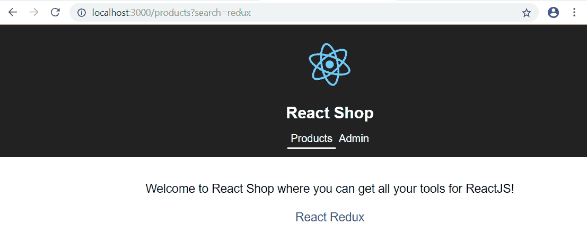

1.  我们将通过在应用程序标题中添加一个搜索输入来完成实现此功能，该输入将设置搜索查询参数。让我们首先在`Header.tsx`中的`Header`组件中创建一些状态来存储搜索值：

```jsx
 const [search, setSearch] = React.useState("");
```

1.  我们还需要通过 React Router 和`URLSearchParams`访问查询字符串，所以让我们导入`RouteComponentProps`，`withRouter`和`URLSearchParams` polyfill：

```jsx
import { NavLink, RouteComponentProps, withRouter} from "react-router-dom";
import "url-search-params-polyfill";
```

1.  让我们向`Header`组件添加一个`props`参数：

```jsx
const Header: React.SFC<RouteComponentProps> = props => { ... }
```

1.  现在我们可以从路径查询字符串中获取搜索值，并在组件首次渲染时将`search`状态设置为该值：

```jsx
const [search, setSearch] = React.useState("");
React.useEffect(() => {
  const searchParams = new URLSearchParams(props.location.search);
 setSearch(searchParams.get("search") || "");
}, []);
```

1.  现在让我们在`render`方法中添加一个`search`输入，让用户输入他们的搜索条件：

```jsx
public render() {
  return (
    <header className="header">
      <div className="search-container">
 <input
 type="search"
 placeholder="search"
 value={search}
 onChange={handleSearchChange}
 onKeyDown={handleSearchKeydown}
 />
 </div>
      
      <h1 className="header-title">React Shop</h1>
      <nav>
        ...
      </nav>
    </header>
  );
}
```

1.  让我们将刚刚引用的`search-container` CSS 类添加到`index.css`中：

```jsx
.search-container {
  text-align: right;
  margin-bottom: -25px;
}
```

1.  回到`Header.tsx`，让我们添加`handleSearchChange`方法，该方法在`render`方法中被引用，并将保持我们的`search`状态与输入的值保持同步：

```jsx
const handleSearchChange = (e: React.ChangeEvent<HTMLInputElement>) => {
  setSearch(e.currentTarget.value);
};
```

1.  现在我们可以实现`handleSearchKeydown`方法，该方法在`render`方法中被引用。当按下`Enter`键时，这需要将`search`状态值添加到路径查询字符串中。我们可以利用`RouteComponentProps`给我们的`history`属性中的`push`方法：

```jsx
const handleSearchKeydown = (e: React.KeyboardEvent<HTMLInputElement>) => {
  if (e.key === "Enter") {
    props.history.push(`/products?search=${search}`);
  }
};
```

1.  我们需要导出使用`withRouter`高阶组件包装的`Header`组件，以便引用`this.props.history`能够工作。所以，让我们这样做并调整我们的`export`表达式：

```jsx
export default withRouter(Header);
```

1.  让我们在运行的应用程序中尝试一下。如果我们在搜索输入中输入`redux`并按下*Enter*键，应用程序应该导航到产品页面并将产品过滤为 React Redux：

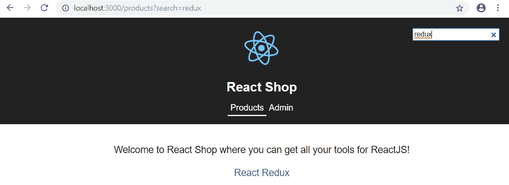

# 路由提示

有时，我们可能希望要求用户确认他们是否要离开页面。如果用户在页面上进行数据输入并在保存数据之前按导航链接转到另一页，这将很有用。React Router 中的`Prompt`组件允许我们执行此操作，如下所述：

1.  在我们的应用程序中，如果用户尚未将产品添加到其购物篮中，我们将提示用户确认是否要离开产品页面。首先，在`ProductPage.tsx`中，让我们从 React Router 中导入`Prompt`组件：

```jsx
import { Prompt, RouteComponentProps } from "react-router-dom";
```

1.  `Prompt`组件在满足某些条件时在导航期间调用确认对话框。我们可以在我们的 JSX 中使用`Prompt`组件如下：

```jsx
<div className="page-container">
  <Prompt when={!this.state.added} message={this.navAwayMessage}
  />
  ...
</div>
```

`when`属性允许我们指定对话框何时出现的表达式。在我们的情况下，这是当产品尚未添加到购物篮时。

`message`属性允许我们指定一个返回要在对话框中显示的消息的函数。

1.  在我们的情况下，我们调用一个`navAwayMessage`方法，接下来我们将实现：

```jsx
private navAwayMessage = () =>
    "Are you sure you leave without buying this product?";
```

1.  让我们尝试一下，通过导航到 React Router 产品，然后在不点击添加到购物篮按钮的情况下离开：

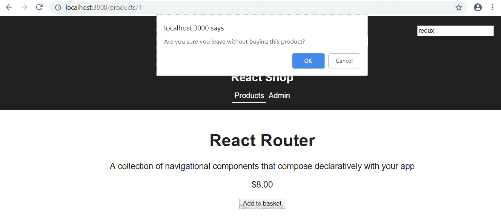

我们被要求确认是否要离开。

# 嵌套路由

嵌套路由是指 URL 超过一个级别，并且呈现多个组件。在本节中，我们将实现一些嵌套路由在我们的管理页面中。我们完成的管理页面将如下截图所示：

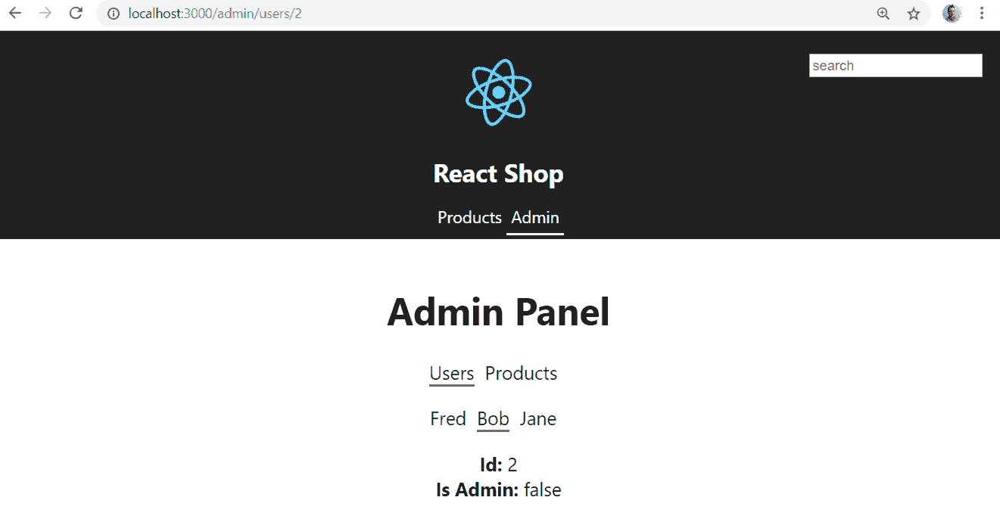

前面截图中的 URL 有 3 个级别，会显示如下内容：

+   包含用户和产品链接的顶级菜单。

+   包含所有用户的菜单。在我们的示例中只有 Fred、Bob 和 Jane。

+   所选用户的信息。

1.  让我们开始打开`AdminPage.tsx`并从`react-router-dom`中为以下内容添加`import`语句：

```jsx
import { NavLink, Route, RouteComponentProps } from "react-router-dom";
```

+   我们将使用`NavLink`组件来呈现菜单。

+   `Route`组件将用于渲染嵌套路由

+   `RouteComponentProps`类型将用于从 URL 获取用户的`id`

1.  我们将用无序列表替换`p`标签，其中包含菜单选项 Users 和 Products：

```jsx
<div className="page-container">
  <h1>Admin Panel</h1>
  <ul className="admin-sections>
 <li key="users">
 <NavLink to={`/admin/users`} activeClassName="admin-link-
        active">
 Users
 </NavLink>
 </li>
 <li key="products">
 <NavLink to={`/admin/products`} activeClassName="admin-link-
       active">
 Products
 </NavLink>
 </li>
 </ul>
</div>
```

我们使用`NavLink`组件导航到两个选项的嵌套路由。

1.  让我们在`index.css`中添加我们刚刚引用的 CSS 类：

```jsx
.admin-sections {
  list-style: none;
  margin: 0px 0px 20px 0px;
  padding: 0;
}

.admin-sections li {
  display: inline-block;
  margin-right: 10px;
}

.admin-sections li a {
  color: #222;
  text-decoration: none;
}

.admin-link-active {
  border-bottom: #6f6e6e solid 2px;
}
```

1.  回到`AdminPage.tsx`，让我们在我们刚刚添加的菜单下面添加两个`Route`组件。这些将处理我们在菜单中引用的`/admin/users`和`/admin/products`路径：

```jsx
<div className="page-container">
  <h1>Admin Panel</h1>
  <ul className="admin-sections">
    ...
  </ul>
 <Route path="/admin/users" component={AdminUsers} />
 <Route path="/admin/products" component={AdminProducts} />
</div>
```

1.  我们刚刚引用了尚不存在的`AdminUsers`和`AdminProducts`组件。让我们首先在`AdminPage.tsx`中的`AdminPage`组件下面输入以下内容来实现`AdminProducts`组件：

```jsx
const AdminProducts: React.SFC = () => {
  return <div>Some options to administer products</div>;
};
```

因此，此组件只在屏幕上呈现一些文本。

1.  现在让我们继续处理`AdminUsers`组件，这更加复杂。我们将从在`AdminPage.tsx`中的`AdminProducts`组件下面定义用户接口以及一些用户数据开始：

```jsx
interface IUser {
  id: number;
  name: string;
  isAdmin: boolean;
}
const adminUsersData: IUser[] = [
  { id: 1, name: "Fred", isAdmin: true },
  { id: 2, name: "Bob", isAdmin: false },
  { id: 3, name: "Jane", isAdmin: true }
];
```

所以，在我们的示例中有 3 个用户。

1.  让我们开始在`AdminPage.tsx`中实现`AdminUsers`组件：

```jsx
const AdminUsers: React.SFC = () => {
  return (
    <div>
      <ul className="admin-sections">
        {adminUsersData.map(user => (
          <li>
            <NavLink
              to={`/admin/users/${user.id}`}
              activeClassName="admin-link-active"
            >
              {user.name}
            </NavLink>
          </li>
        ))}
      </ul>
    </div>
  );
};
```

该组件呈现一个包含每个用户名称的链接。该链接是到一个嵌套路径，最终将显示有关用户的详细信息。

1.  因此，我们需要定义另一个路由，调用一个组件来渲染有关用户的详细信息。我们可以通过使用另一个`Route`组件来实现这一点：

```jsx
<div>
  <ul className="admin-sections">
    ...
  </ul>
 <Route path="/admin/users/:id" component={AdminUser} />
</div>
```

1.  我们刚刚定义的路径路由到一个我们还没有定义的`AdminUser`组件。所以，让我们从`AdminUsers`组件下面开始：

```jsx
const AdminUser: React.SFC<RouteComponentProps<{ id: string }>> = props => {
  return null;
};
```

我们使用`RouteComponentProps`从 URL 路径中获取`id`并在 props 中使其可用。

1.  现在，我们可以使用路径中的`id`来从我们的`adminUsersData`数组中获取用户：

```jsx
const AdminUser: React.SFC<RouteComponentProps<{ id: string }>> = props => {
  let user: IUser;
 if (props.match.params.id) {
 const id: number = parseInt(props.match.params.id, 10);
 user = adminUsersData.filter(u => u.id === id)[0];
 } else {
 return null;
 }
  return null;
};
```

1.  现在我们有了`user`对象，我们可以呈现其中的信息。

```jsx
const AdminUser: React.SFC<RouteComponentProps<{ id: string }>> = props => {
  let user: IUser;
  if (props.match.params.id) {
    const id: number = parseInt(props.match.params.id, 10);
    user = adminUsersData.filter(u => u.id === id)[0];
  } else {
    return null;
  }
  return (
 <div>
 <div>
 <b>Id: </b>
 <span>{user.id.toString()}</span>
 </div>
 <div>
 <b>Is Admin: </b>
 <span>{user.isAdmin.toString()}</span>
 </div>
 </div>
 );
};
```

1.  如果我们转到运行的应用程序，转到管理页面并单击产品菜单项，它将如下所示：


1.  如果我们单击`用户`菜单项，我们将看到我们可以单击以获取有关用户的更多信息的 3 个用户。这将看起来像本节中的第一个截图。

因此，为了实现嵌套路由，我们使用`NavLink`或`Link`组件创建必要的链接，并使用`Route`组件将这些链接路由到要使用`Route`组件呈现内容的组件。在本节之前，我们已经了解了这些组件，所以我们只需要学习如何在嵌套路由的上下文中使用它们。

# 动画过渡

在本节中，当用户导航到不同页面时，我们将添加一些动画。我们使用`react-transition-group npm`包中的`TransitionGroup`和`CSSTransition`组件来实现这一点，如下所示：

1.  因此，让我们首先安装此包及其 TypeScript 类型：

```jsx
npm install react-transition-group
npm install @types/react-transition-group --save-dev
```

`TransitionGroup`跟踪其所有子元素并计算子元素何时进入或退出。`CSSTransition`从`TransitionGroup`获取子元素是离开还是退出，并根据该状态对子元素应用 CSS 类。因此，`TransitionGroup`和`CSSTransition`可以包装我们的路由并调用我们可以创建的 CSS 类，以实现页面的进出动画。

1.  因此，让我们将这些组件导入`Routes.tsx`：

```jsx
import { CSSTransition, TransitionGroup } from "react-transition-group";
```

1.  我们还需要从 React Router 中导入`RouteComponentProps`：

```jsx
import { Redirect, Route, RouteComponentProps, Switch} from "react-router-dom";
```

1.  让我们将`RouteComponentProps`用作`Route`组件的 props 类型：

```jsx
const Routes: React.SFC<RouteComponentProps> = props => {
  ...
}
```

1.  让我们将`CSSTransition`和`TransitionGroup`组件添加到`Switch`组件周围的 JSX 中：

```jsx
<TransitionGroup>
  <CSSTransition
    key={props.location.key}
    timeout={500}
    classNames="animate"
    >
    <Switch>
      ...
    </Switch>
  </CSSTransition>
</TransitionGroup>
```

`TransitionGroup`要求子元素具有唯一的`key`，以确定何时退出和进入。因此，我们已经指定了`CSSTransition`上的`key`属性为`RouteComponentProps`的`location.key`属性。我们已经指定了过渡将在半秒内运行的`timeout`属性。我们还指定了将使用`animate`前缀调用的 CSS 类，通过`classNames`属性。

1.  因此，让我们在`index.css`中添加这些 CSS 类：

```jsx
.animate-enter {
  opacity: 0;
  z-index: 1;
}
.animate-enter-active {
  opacity: 1;
  transition: opacity 450ms ease-in;
}
.animate-exit {
  display: none;
}
```

`CSSTransition`将在其键更改时调用这些 CSS 类。这些 CSS 类最初隐藏了正在过渡的元素，并逐渐缓解了元素的不透明度，以便显示出来。

1.  如果我们转到`index.tsx`，我们会得到一个编译错误，因为它期望我们传递来自路由器的`history`等 props 给`Routes`组件：

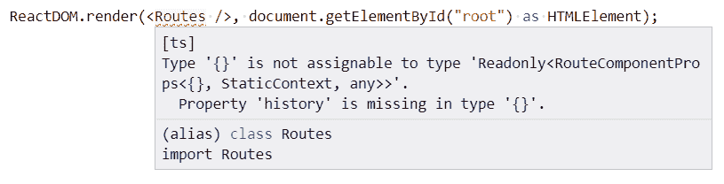

不幸的是，我们无法使用`withRouter`高阶组件，因为这将位于`Router`组件之外。为了解决这个问题，我们可以添加一个名为`RoutesWrap`的新组件，它不接受任何 props，并包装我们现有的`Routes`组件。`Router`将移动到`RoutesWrap`，并包含一个始终渲染我们的`Routes`组件的`Route`组件。

1.  因此，让我们将`RoutesWrap`组件添加到`Routes.tsx`中，并导出`RoutesWrap`而不是`Routes`：

```jsx
const RoutesWrap: React.SFC = () => {
 return (
 <Router>
 <Route component={Routes} />
 </Router>
 );
};

class Routes extends React.Component<RouteComponentProps, IState> { 
  ...
}

export default RoutesWrap;
```

编译错误消失了，这太棒了。

1.  现在让我们从我们的`Routes`组件中删除`Router`，将`div`标签作为其根：

```jsx
public render() {
  return (
    <div>
      <Header />
      <TransitionGroup>
        ...
      </TransitionGroup>
    </div>
  );
}
```

如果我们转到运行的应用程序并导航到不同的页面，您将看到一个很好的淡入淡出动画，当页面进入视图时。

# 延迟加载路由

目前，当应用程序首次加载时，将加载我们应用程序的所有 JavaScript。这包括用户不经常使用的管理页面。如果`AdminPage`组件在应用程序加载时不加载，而是按需加载，那将是很好的。这正是我们将在本节中要做的。这称为“延迟加载”组件。以下步骤允许我们按需加载内容：

1.  首先，我们将从 React 中导入`Suspense`组件，稍后我们将使用它：

```jsx
import { Suspense } from "react";
```

1.  现在，我们将以不同的方式导入`AdminPage`组件：

```jsx
const AdminPage = React.lazy(() => import("./AdminPage"));
```

我们使用一个名为`lazy`的 React 函数，它接受一个返回动态导入的函数，然后将其分配给我们的`AdminPage`组件变量。

1.  在我们这样做之后，我们可能会遇到一个 linting 错误：在 ES5/ES3 中进行动态导入调用需要'Promise'构造函数。确保您有'Promise'构造函数的声明，或在`--lib`选项中包含'ES2015'。因此，在`tsconfig.json`中，让我们添加`lib`编译器选项：

```jsx
"compilerOptions": { 
  "lib": ["es6", "dom"],
  ...
}
```

1.  接下来的部分是在`AdminPage`组件周围包装`Suspense`组件：

```jsx
<Route path="/admin">
  {loggedIn ? (
    <Suspense fallback={<div className="page-container">Loading...</div>}>
      <AdminPage />
    </Suspense>
  ) : (
    <Redirect to="/login" />
  )}
</Route>
```

`Suspense`组件显示一个包含 Loading...的`div`标签，同时加载`AdminPage`。

1.  让我们在运行的应用程序中尝试这个。让我们打开浏览器开发者工具，转到网络选项卡。在我们的应用程序中，让我们转到产品页面并刷新浏览器。然后清除开发者工具中网络选项卡中的内容。如果我们然后转到应用程序中的管理页面并查看网络选项卡中的内容，我们将看到动态加载`AdminPage`组件的 JavaScript *块*：

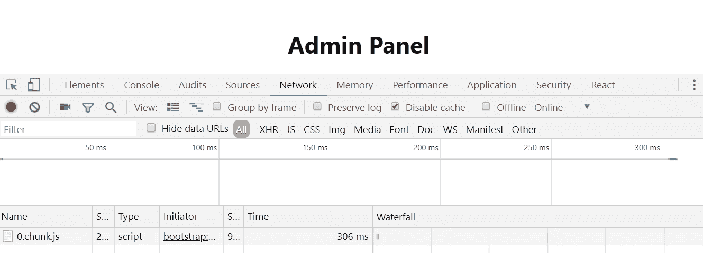

1.  `AdminPage`组件加载非常快，所以我们从来没有真正看到 Loading ... `div`标签。所以，让我们在浏览器开发者工具中减慢连接速度：

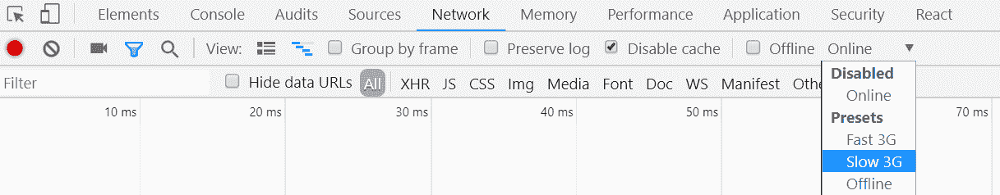

1.  如果我们然后刷新浏览器，再次转到管理页面，我们将看到 Loading ...：

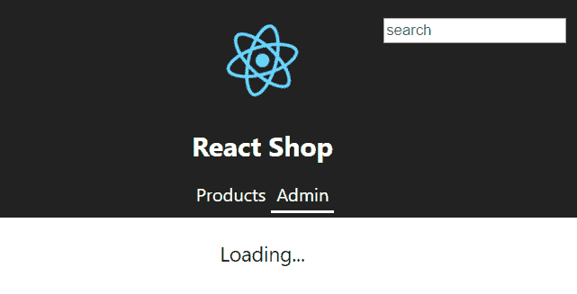

在这个例子中，`AdminPage`组件并不是很大，所以这种方法并没有真正对性能产生积极影响。然而，按需加载更大的组件确实可以帮助提高性能，特别是在慢速连接上。

# 总结

React Router 为我们提供了一套全面的组件，用于管理应用程序中页面之间的导航。我们了解到顶层组件是`Router`，它在其下寻找`Route`组件，我们在其中定义了应该为特定路径呈现哪些组件。

`Link`组件允许我们链接到应用程序中的不同页面。我们了解到`NavLink`组件类似于`Link`，但它包括根据是否为活动路径来设置样式的能力。因此，`NavLink`非常适合应用程序中的主导航元素，而`Link`非常适合出现在页面上的其他链接。

`RouteComponentProps`是一种类型，它使我们能够访问路由参数和查询参数。我们发现 React Router 不会为我们解析查询参数，但可以使用原生 JavaScript `URLSearchParams`接口来为我们做这个。

`Redirect`组件在特定条件下重定向到路径。我们发现这非常适合保护只有特权用户可以访问的页面。

`Prompt`组件允许我们在特定条件下要求用户确认他们是否要离开页面。我们在产品页面上使用它来再次确认用户是否要购买产品。这个组件的另一个常见用例是在输入的数据没有保存时，确认离开数据输入页面的导航。 

我们了解到嵌套路由如何为用户提供进入应用程序特定部分的深链接。我们只需使用`Link`或`NavLink`和`Route`组件来定义相关链接以处理这些链接。

我们使用`react-transition-group npm`包中的`TransitionGroup`和`CSSTransition`组件改进了我们的应用体验。我们将这些组件包裹在定义应用路径的`Route`组件周围，并添加了 CSS 类来实现我们希望页面退出和进入视图时的动画效果。

我们了解到，React 的`lazy`函数以及其`Suspense`组件可以用于按需加载用户很少使用的大型组件。这有助于提高应用程序的启动时间性能。

# 问题

让我们通过以下问题来测试我们对 React Router 的了解：

1.  我们有以下显示客户列表的`Route`组件：

```jsx
<Route path="/customers" component={CustomersPage} />
```

当页面是`"/customers"`时，`CustomersPage`组件会渲染吗？

1.  当页面是`"/customers/24322"`时，`CustomersPage`组件会渲染吗？

1.  我们只希望在路径为`"/customers"`时，`CustomersPage`组件才会渲染。我们如何更改`Route`上的属性来实现这一点？

1.  什么样的`Route`组件可以处理`"/customers/24322"`路径？它应该将`"24322"`放在名为`customerId`的路由参数中。

1.  我们如何捕获不存在的路径，以便通知用户？

1.  我们如何在`CustomersPage`中实现`search`查询参数？因此，`"/customers/?search=Cool Company"`将显示名称为`"Cool Company"`的客户。

1.  过了一会儿，我们决定将`"customer"`路径更改为`"clients"`。我们如何实现这一点，以便用户仍然可以使用现有的`"customer"`路径，但路径会自动重定向到新的`"client"`路径？

# 进一步阅读

+   值得一读的 React Router 文档链接如下：[`reacttraining.com/react-router`](https://reacttraining.com/react-router)

+   也值得查看`react-transition-group`文档，以进一步了解过渡组件：[`reactcommunity.org/react-transition-group/`](https://reactcommunity.org/react-transition-group/)
