# 第五章：高级类型

我们已经学习了相当多的 TypeScript 类型系统知识。在本章中，我们将继续这个旅程，这次深入一些更高级的类型和概念，这将帮助我们在本书后面创建可重用的强类型 React 组件。

我们将学习如何将现有类型组合成联合类型。我们将在[第八章](https://cdp.packtpub.com/learn_react_17_with_typescript_3/wp-admin/post.php?post=31&action=edit#post_31)，*React Redux*中发现，这些类型对于创建强类型的 React Redux 代码至关重要。

我们在[第二章](https://cdp.packtpub.com/learn_react_17_with_typescript_3/wp-admin/post.php?post=31&action=edit#post_31)中简要介绍了类型守卫，*TypeScript 3 有什么新特性*，当时我们学习了`unknown`类型。在本章中，我们将更详细地了解这些内容。

泛型是 TypeScript 的一个特性，许多库使用它允许消费者使用其库创建强类型应用程序。React 本身在类组件中使用它，允许我们在组件中创建强类型的 props 和 states。我们将在本章中详细介绍泛型。

重载签名是一个很好的功能，允许我们的单个函数接受不同组合的参数。我们将在本章中学习如何使用这些内容。

查找和映射类型允许我们从现有类型动态创建新类型。我们将在本章末尾详细了解这些内容。

在本章中，我们将学习以下主题：

+   联合类型

+   类型守卫

+   泛型

+   重载签名

+   查找和映射类型

# 技术要求

在本章中，我们将使用以下技术：

+   **TypeScript playground**：这是一个网站，网址为[`www.typescriptlang.org/play`](http://www.typescriptlang.org/play)，允许我们在不安装 TypeScript 的情况下进行实验和了解其特性。在本章中，我们将大部分时间使用这个网站。

+   **Visual Studio Code**：我们需要一个编辑器来编写我们的 React 和 TypeScript 代码，可以从[`code.visualstudio.com/`](https://code.visualstudio.com/)网站安装。我们还需要在 Visual Studio Code 中安装**TSLint**（由 egamma 提供）和**Prettier**（由 Esben Petersen 提供）扩展。

本章中的所有代码片段都可以在以下网址找到：[`github.com/carlrip/LearnReact17WithTypeScript/tree/master/05-AdvancedTypes.`](https://github.com/carlrip/LearnReact17WithTypeScript/tree/master/05-AdvancedTypes)

# 联合类型

顾名思义，联合类型是我们可以组合在一起形成新类型的类型。联合类型通常与字符串文字类型一起使用，我们将在第一部分中介绍。联合类型可以用于一种称为辨识联合的模式，我们可以在创建通用和可重用的 React 组件时使用它。

# 字符串文字类型

字符串文字类型的变量只能被赋予字符串文字类型中指定的确切字符串值。

在 TypeScript playground 中，让我们通过一个例子来看一下：

1.  让我们创建一个名为`Control`的字符串文字类型，它只能设置为`"Textbox"`字符串：

```jsx
type Control = "Textbox";
```

1.  现在让我们创建一个名为`notes`的变量，使用我们的`Control`类型，并将其设置为`"Textbox"`：

```jsx
let notes: Control;
notes = "Textbox";
```

正如我们所期望的，TypeScript 编译器对此非常满意。

1.  现在让我们将变量设置为不同的值：

```jsx
notes = "DropDown";
```

我们得到了编译错误，类型`"DropDown"`不能赋值给类型`"Textbox"`：

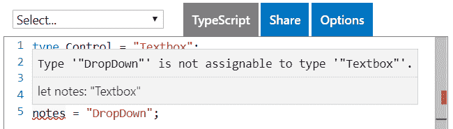

1.  与 TypeScript 中的所有其他类型一样，`null`和`undefined`也是有效的值：

```jsx
notes = null;
notes = undefined;
```

字符串文字类型本身并不那么有用。然而，当它们用于联合类型时，它们变得非常有用，我们将在下一部分中看到。

# 字符串文字联合类型

字符串文字联合类型是指我们将多个字符串文字类型组合在一起。

让我们从上一个例子继续，并通过这个例子来看一下。

1.  让我们增强我们的`Control`类型，使其成为字符串文字的联合类型：

```jsx
type Control = "Textbox" | "DropDown"
```

我们使用`|`在联合类型中组合类型。

1.  现在将我们的`notes`变量设置为`"Textbox"`或`"DropDown"`现在是完全有效的：

```jsx
let notes: Control;
notes = "Textbox";
notes = "DropDown";
```

1.  让我们扩展我们的`Control`类型，以包含更多的字符串文字：

```jsx
type Control = "Textbox" | "DropDown" | "DatePicker" | "NumberSlider";
```

1.  现在我们可以将我们的`notes`变量设置为这些值中的任何一个：

```jsx
notes = "DatePicker";
notes = "NumberSlider";
```

如果我们仔细想一想，这真的很有用。我们本来可以将`notes`变量声明为`string`，但是用包含的特定字符串文字来声明它可以包含的内容，这样就可以使它成为超级类型安全。

# 辨识联合模式

辨识联合模式允许我们处理不同联合类型的逻辑。

让我们通过一个例子来看一下：

1.  让我们首先创建三个接口来表示文本框、日期选择器和数字滑块：

```jsx
interface ITextbox {
  control: "Textbox";
  value: string;
  multiline: boolean;
}

interface IDatePicker {
  control: "DatePicker";
  value: Date;
}

interface INumberSlider {
  control: "NumberSlider";
  value: number;
}
```

它们都有一个名为`control`的属性，这将是模式中的辨识者。

1.  让我们继续将这些接口组合成一个名为`Field`的联合类型：

```jsx
type Field = ITextbox | IDatePicker | INumberSlider;
```

因此，我们可以从任何类型创建联合类型，而不仅仅是字符串文字。在这种情况下，我们已经从三个接口创建了一个联合类型。

1.  现在让我们创建一个函数来初始化`Field`类型中的值：

```jsx
function intializeValue(field: Field) {
  switch (field.control) {
    case "Textbox":
      field.value = "";
      break;
    case "DatePicker":
      field.value = new Date();
      break;
    case "NumberSlider":
      field.value = 0;
      break;
    default:
      const shouldNotReach: never = field;
  }
}
```

我们需要设置的值取决于辨别属性`control`。因此，我们使用了`switch`语句来根据这个属性进行分支。

`switch`语句中的`default`分支是让事情变得有趣的地方。这个分支永远不应该被执行，所以我们在那个分支中放置了一个带有`never`类型的语句。在接下来的步骤之后，我们将看到这样做的价值。

1.  假设时间已经过去，我们对复选框字段有了新的要求。让我们为此实现一个接口：

```jsx
interface ICheckbox {
  control: "Checkbox";
  value: boolean;
}
```

1.  让我们也将这个加入到联合`Field`类型中：

```jsx
type Field = ITextbox | IDatePicker | INumberSlider | ICheckbox;
```

我们会立即看到我们的`initializeValue`函数在`never`声明上抛出编译错误：

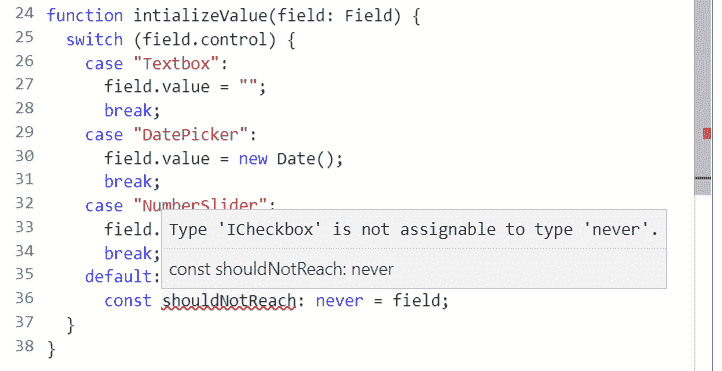

这非常有价值，因为`never`语句确保我们不会忘记为新的复选框要求添加代码分支。

1.  所以，让我们去实现这个额外的分支，针对`"Checkbox"`字段：

```jsx
function intializeValue(field: Field) {
  switch (field.control) {
    case "Textbox":
      field.value = "";
      break;
    case "DatePicker":
      field.value = new Date();
      break;
    case "NumberSlider":
      field.value = 0;
      break;
    case "Checkbox":
 field.value = false;
 break;
    default:
      const shouldNotReach: never = field;
  }
}
```

因此，联合类型允许我们将任何类型组合在一起形成另一个类型。这使我们能够创建更严格的类型，特别是在处理字符串时。辨别联合模式允许我们为联合中的不同类型有逻辑分支，而`never`类型帮助我们捕捉添加新类型到联合类型时需要发生的所有变化。

# 类型守卫

类型守卫允许我们在代码的条件分支中缩小对象的特定类型。当我们需要实现处理联合类型中特定类型的代码分支时，它们非常有用。

在上一节中，当我们实现`intializeValue`函数时，我们已经使用了类型守卫。在辨别属性`control`上的`switch`语句允许我们在联合中的每种类型上设置值。

我们可以实现类型守卫的其他方法。以下部分介绍了不同的方法。

# 使用`typeof`关键字

`typeof`关键字是 JavaScript 中返回表示类型的字符串的关键字。因此，我们可以在条件中使用它来缩小类型。

让我们通过一个例子来说明：

1.  我们有一个可以是字符串或字符串数组的联合类型：

```jsx
type StringOrStringArray = string | string[];
```

1.  我们需要实现一个名为`first`的函数，它接受一个`StringOrStringArray`类型的参数并返回一个`string`：

```jsx
function first(stringOrArray: StringOrStringArray): string {

}
```

1.  如果`stringOrArray`是一个`string`，那么函数需要返回第一个字符；否则，它应该返回第一个数组元素：

```jsx
function first(stringOrArray: StringOrStringArray): string {
  if (typeof stringOrArray === "string") {
    return stringOrArray.substr(0, 1);
  } else {
    return stringOrArray[0];
  }
}
```

在第一个分支中，如果我们悬停在`stringOrArray`上，我们会看到类型已成功缩小为`string`：

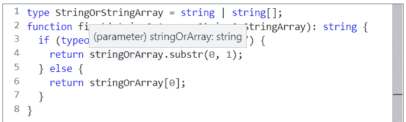

在第二个分支中，如果我们悬停在`stringOrArray`上，我们会看到类型已成功缩小为`string[]`：

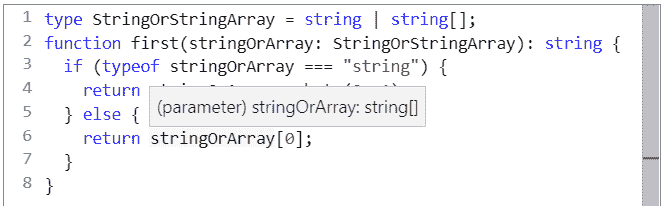

1.  为了检查我们的函数是否有效，我们可以添加以下内容：

```jsx
console.log(first("The"));
console.log(first(["The", "cat"]));
```

如果我们运行程序，**T**和**The**将被输出到控制台。

`typeof`关键字只能与 JavaScript 类型一起使用。为了说明这一点，让我们创建一个增强版本的函数：

1.  我们将我们的函数称为`firstEnhanced`。我们希望第二个分支专门处理`string[]`类型，并将第三个分支标记为永远不会到达的地方。让我们试试看：

```jsx
function firstEnhanced(stringOrArray: StringOrStringArray): string {
  if (typeof stringOrArray === "string") {
    return stringOrArray.substr(0, 1);
  } else if (typeof stringOrArray === "string[]") { 
    return stringOrArray[0];
  } else {
    const shouldNotReach: never = stringOrArray;
  }
}
```

TypeScript 编译器对第二个分支不满意：

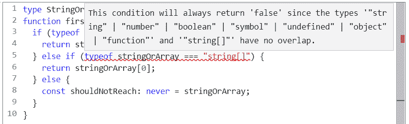

消息给了我们一些线索。JavaScript 的`typeof`关键字适用于 JavaScript 类型，这些类型是`string`、`number`、`boolean`、`symbol`、`undefined`、`object`和`function`；因此错误消息中结合了这些类型的联合类型。因此，我们的第二个分支中的`typeof`实际上会返回`"object"`。

1.  让我们正确地实现这个：

```jsx
function firstEnhanced(stringOrArray: StringOrStringArray): string {
  if (typeof stringOrArray === "string") {
    return stringOrArray.substr(0, 1);
  } else if (typeof stringOrArray === "object") { 
    return stringOrArray[0];
  } else {
    const shouldNotReach: never = stringOrArray;
  }
}
```

TypeScript 编译器现在又高兴了。

因此，`typeof`非常适合根据 JavaScript 类型进行分支，但不太适合于 TypeScript 特定类型。让我们在接下来的部分中找出如何弥合这一差距。

# 使用 instanceof 关键字

`instanceof`关键字是另一个 JavaScript 关键字。它检查对象是否具有特定的构造函数。通常用于确定对象是否是类的实例。

让我们通过一个例子来看一下：

1.  我们有两个表示`Person`和`Company`的类：

```jsx
class Person {
  id: number;
  firstName: string;
  surname: string;
}

class Company {
  id: number;
  name: string;
}
```

1.  我们还有一个结合这两个类的联合类型：

```jsx
type PersonOrCompany = Person | Company;
```

1.  现在我们需要编写一个函数，该函数接受`Person`或`Company`并将它们的名称输出到控制台：

```jsx
function logName(personOrCompany: PersonOrCompany) {
  if (personOrCompany instanceof Person) {
    console.log(`${personOrCompany.firstName} ${personOrCompany.surname}`);
  } else {
    console.log(personOrCompany.name);
  }
}
```

在使用`instanceof`时，我们在它之前有要检查的变量，之后是构造函数名称（类名）。

在第一个分支中，如果我们悬停在`personOrCompany`上，我们会得到`Person`类型：

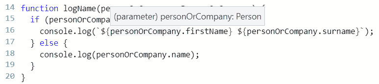

在第二个分支中，如果我们悬停在`personOrCompany`上，我们会得到`Company`类型：

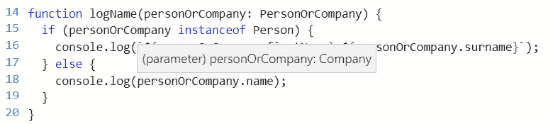

因此，`instanceof`在处理类时非常适用于缩小类型。然而，我们使用许多不是 JavaScript 类型或基于类的 TypeScript 类型。那么，在这些情况下我们该怎么办呢？让我们在接下来的部分中找出答案。

# 使用`in`关键字

`in`关键字是另一个 JavaScript 关键字，可用于检查属性是否在对象中。

让我们使用`in`关键字来实现上一节的示例：

1.  这次，我们使用接口而不是`Person`和`Company`结构的类：

```jsx
interface IPerson {
  id: number;
  firstName: string;
  surname: string;
}

interface ICompany {
  id: number;
  name: string;
}
```

1.  我们再次从`Person`和`Company`结构创建一个联合类型：

```jsx
type PersonOrCompany = IPerson | ICompany;
```

1.  最后，让我们使用`in`关键字来实现我们的函数：

```jsx
function logName(personOrCompany: PersonOrCompany) {
 if ("firstName" in personOrCompany) {
  console.log(`${personOrCompany.firstName} ${personOrCompany.surname}`);
 } else {
  console.log(personOrCompany.name);
 }
}
```

在`in`关键字之前，我们用双引号将属性名称放在一起，然后是要检查的对象。

如果我们在第一个分支上悬停在`personOrCompany`上，我们会得到`IPerson`类型。如果我们在第二个分支上悬停在`personOrCompany`上，我们会得到`ICompany`类型。

因此，`in`关键字非常灵活。它可以与任何对象一起使用，通过检查属性是否存在来缩小其类型。

在下一节中，我们将介绍最后一个类型保护。

# 使用用户定义的类型保护

在无法使用其他类型保护的情况下，我们可以创建自己的类型保护。我们可以通过创建一个返回类型为类型断言的函数来实现这一点。在本书之前，我们实际上在讨论`unknown`类型时使用了用户定义的类型保护。

让我们使用我们自己的类型保护函数来实现上两节的示例：

1.  我们有相同的接口和联合类型：

```jsx
interface IPerson {
  id: number;
  firstName: string;
  surname: string;
}

interface ICompany {
  id: number;
  name: string;
}

type PersonOrCompany = IPerson | ICompany;
```

1.  因此，让我们实现返回对象是否为`IPerson`类型的类型保护函数：

```jsx
function isPerson(personOrCompany: PersonOrCompany): personOrCompany is IPerson {
  return "firstName" in personOrCompany;
}
```

类型断言`personOrCompany`是`IPerson`有助于 TypeScript 编译器缩小类型。要确认这一点，在第一个分支上悬停在`personOrCompany`上应该给出`IPerson`类型。然后，如果我们在第二个分支上悬停在`personOrCompany`上，我们应该得到`ICompany`类型。

创建用户定义的类型保护比其他方法更费力，但它为我们提供了处理其他方法无法解决的情况的灵活性。

# 泛型

泛型可以应用于函数或整个类。这是一种允许消费者使用自己的类型与泛型函数或类一起使用的机制。接下来的部分将介绍这两种情况的示例。

# 泛型函数

让我们通过一个通用函数的示例来进行讲解。我们将创建一个包装函数，用于调用`fetch` JavaScript 函数从 web 服务获取数据：

1.  让我们从创建`function`签名开始：

```jsx
function getData<T>(url: string): Promise<T> {

}
```

我们在函数名后的尖括号中放置一个`T`来表示它是一个通用函数。实际上我们可以使用任何字母，但`T`是常用的。然后我们在类型是通用的地方使用`T`。在我们的示例中，通用部分是返回类型，所以我们返回`Promise<T>`。

如果我们想要使用箭头函数，这将是：

```jsx
const getData = <T>(url: string): Promise<T> => {

};
```

1.  现在让我们实现我们的函数：

```jsx
function getData<T>(url: string): Promise<T> {
  return fetch(url).then(response => {
    if (!response.ok) {
      throw new Error(response.statusText);
    }
    return response.json();
  });
}
```

1.  最后，让我们消费这个函数：

```jsx
interface IPerson {
  id: number;
  name: string;
}

getData<IPerson>("/people/1").then(person => console.log(person));
```

我们在函数名后的尖括号中传递我们想要在函数中使用的类型。在我们的例子中，它是`IPerson`。

如果我们在`then`回调中悬停在`person`上，我们会看到`person`被正确地类型化为`IPerson`：

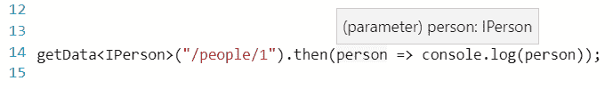

因此，顾名思义，通用函数是与通用类型一起工作的函数。先前示例的另一种实现方式是将`any`作为返回类型，但那不是类型安全的。

# 通用类

我们可以使整个类成为通用的。让我们深入了解一个将数据存储在列表中的通用类的示例：

1.  首先让我们定义我们的类，不包含任何内容：

```jsx
class List<T> {

}
```

我们通过在类名后面加上`<T>`来标记类为通用的。

1.  在类内部，让我们为列表中的数据创建一个`private`属性：

```jsx
private data: T[] = [];
```

我们使用`T`来引用通用类型。在我们的示例中，我们的`data`属性是一个根据类声明的任何类型的数组。

1.  现在让我们添加一个`public`方法来获取列表中的所有数据：

```jsx
public getList(): T[] {
  return this.data;
}
```

我们使用`T[]`来引用通用数组作为返回类型。

1.  让我们实现一个向列表中添加项目的方法：

```jsx
public add(item: T) {
  this.data.push(item);
}
```

我们使用通用类型`T`来引用传入的数据项。该实现简单地使用数组的`push`方法将项目添加到我们的`private`数组中。

1.  让我们也实现一个从列表中移除项目的方法：

```jsx
public remove(item: T) {
  this.data = this.data.filter((dataItem: T) => {
    return !this.equals(item, dataItem);
  });
}
private equals(obj1: T, obj2: T) {
  return Object.keys(obj1).every(key => {
    return obj1[key] === obj2[key];
  });
}
```

我们再次使用通用类型`T`来引用传入的数据项。该实现使用数组的`filter`方法来过滤私有数组中的项目。过滤谓词使用一个检查两个对象是否相等的`private`方法。

1.  因此，现在我们已经实现了我们的通用列表类，让我们创建一个类型和一些数据，以便消费它：

```jsx
interface IPerson {
  id: number;
  name: string;
}
const billy: IPerson = { id: 1, name: "Billy" };
```

1.  现在让我们创建一个通用类的实例：

```jsx
const people = new List<IPerson>();
```

我们在类名后面使用尖括号中的类型来与类交互。

1.  现在我们可以通过添加和删除`billy`来与类交互：

```jsx
people.add(billy);
people.remove(billy);
```

1.  让我们尝试在我们的列表实例中使用不同的类型：

```jsx
people.add({name: "Sally"});
```

我们得到了编译错误，正如我们所预期的那样：

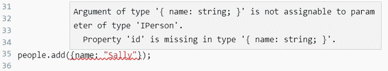

1.  让我们将列表实例中的所有项目保存到一个变量中：

```jsx
const items = people.getList();
```

如果我们悬停在`items`变量上，我们会看到类型已经被正确推断为`IPerson[]`：

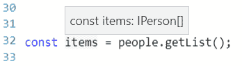

因此，泛型类允许我们使用不同类型的类，但仍然保持强类型。

我们在本书的早些时候使用了泛型类，我们用它来实现了带有 props 和 state 的 React 类组件：

```jsx
interface IProps { ... }
interface IState { ... }
class App extends React.Component<IProps, IState> {
  ...
}
```

在这里，`React.Component`类有两个用于 props 和 state 的泛型参数。

因此，泛型在这本书中是一个非常重要的概念，我们将大量使用它来创建强类型的 React 组件。

# 重载签名

重载签名允许使用不同的签名调用函数。这个特性可以很好地用于简化库向消费者提供的一组函数。如果一个库包含`condenseString`公共函数和`condenseArray`，那么将它们简化为只包含一个公共`condense`函数会很好，不是吗？我们将在本节中做到这一点：

1.  我们有一个从字符串中移除空格的函数：

```jsx
function condenseString(string: string): string {
  return string.split(" ").join("");
}
```

1.  我们有另一个从数组项中移除空格的函数：

```jsx
function condenseArray(array: string[]): string[] {
  return array.map(item => item.split(" ").join(""));
}
```

1.  现在我们想将这两个函数合并为一个单一的函数。我们可以使用联合类型来实现：

```jsx
function condense(stringOrArray: string | string[]): string | string[] {
  return typeof stringOrArray === "string"
    ? stringOrArray.split(" ").join("")
    : stringOrArray.map(item => item.split(" ").join(""));
}
```

1.  让我们使用我们的统一函数：

```jsx
const condensedText = condense("the cat sat on the mat");
```

当我们输入函数参数时，智能感知提醒我们需要输入一个字符串或字符串数组：

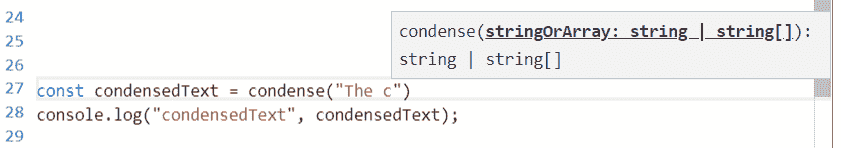

如果我们悬停在`condensedText`变量上，我们会看到推断类型是联合类型：

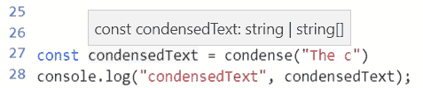

1.  现在是时候添加两个签名重载来改进我们函数的使用了：

```jsx
function condense(string: string): string;
function condense(array: string[]): string[];
function condense(stringOrArray: string | string[]): string | string[] { ... }
```

我们在主函数签名之前添加了函数重载签名。我们为处理字符串时添加了一个重载，为处理字符串数组时添加了第二个重载。

1.  让我们使用我们的重载函数：

```jsx
const moreCondensedText = condense("The cat sat on the mat");
```

现在，当我们输入参数时，我们得到了改进的智能感知。我们还可以使用上下箭头来滚动两个不同的签名：

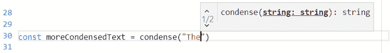

如果我们悬停在`moreCondensedText`变量上，我们会看到我们获得了更好的类型推断：

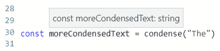

因此，重载签名可以改善开发人员使用我们函数的体验。它们可以提供改进的智能感知和类型推断。

# 查找和映射类型

`keyof`是 TypeScript 中的一个关键字，它创建了对象中所有属性的联合类型。创建的类型称为查找类型。这允许我们根据现有类型的属性动态创建类型。这是一个有用的功能，我们可以用它来针对不同的数据创建通用但强类型的代码。

让我们通过一个例子来说明：

1.  我们有以下`IPerson`接口：

```jsx
interface IPerson {
  id: number;
  name: string;
}
```

1.  让我们在这个接口上使用`keyof`创建一个查找类型：

```jsx
type PersonProps = keyof IPerson;
```

如果我们悬停在`PersonProps`类型上，我们会看到创建了一个包含`"id"`和`"name"`的联合类型：

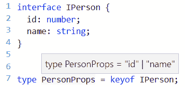

1.  让我们向`IPerson`添加一个新属性：

```jsx
interface IPerson {
  id: number;
  name: string;
  age: number
}
```

如果我们再次悬停在`PersonProps`类型上，我们会看到该类型已自动扩展以包含`"age"`：

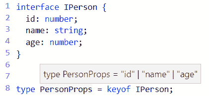

因此，`PersonProps`类型是一个查找类型，因为它查找它需要包含的文字。

现在让我们用查找类型创建一些有用的东西：

1.  我们将创建一个`Field`类，其中包含字段名称、标签和默认值：

```jsx
class Field {
  name: string;
  label: string;
  defaultValue: any;
}
```

1.  这只是一个开始，但我们可以通过使我们的类通用来使`name`更加强类型化：

```jsx
class Field<T, K extends keyof T> {
  name: K;
  label: string;
  defaultValue: any;
}
```

我们在类上创建了两个通用参数。第一个是包含字段的对象类型，第二个是对象内的属性名称。

1.  如果我们创建类的实例，可能会更有意义。让我们使用上一个示例中的`IPerson`，并将`"id"`作为字段名称传递进去：

```jsx
const idField: Field<IPerson, "id"> = new Field();
```

1.  让我们尝试引用在`IPerson`中不存在的属性：

```jsx
const addressField: Field<IPerson, "address"> = new Field();
```

我们得到了编译错误，正如我们所期望的那样：

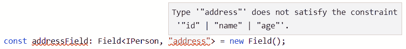

捕捉这样的问题是查找类型的好处，而不是使用`string`类型。

1.  现在让我们把注意力转向`Field`类中的`defaultValue`属性。目前这不是类型安全的。例如，我们可以将`idField`设置为一个字符串：

```jsx
idField.defaultValue = "2";
```

1.  让我们解决这个问题，使`defaultValue`具有类型安全性：

```jsx
class Field<T, K extends keyof T> {
  name: K;
  label: string;
  defaultValue: T[K];
}
```

我们使用`T[K]`查找类型。对于`idField`，这将解析为`IPerson`中`id`属性的类型，即`number`。

现在设置`idField.defaultValue`的代码行会引发编译错误，正如我们所期望的那样：

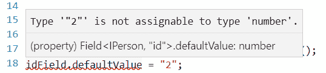

1.  让我们将`"2"`更改为`2`：

```jsx
idField.defaultValue = 2;
```

编译错误消失了。

因此，在创建可变数据类型的通用组件时，查找类型可能会很有用。

现在让我们转到映射类型。同样，这些让我们可以从现有类型的属性中创建新类型。但是，映射类型允许我们通过从现有属性中映射它们来明确定义新类型中的属性。

让我们通过一个示例来看一下：

1.  首先，让我们创建一个类型，我们将在下一步中进行映射：

```jsx
interface IPerson {
  id: number;
  name: string;
}
```

1.  现在让我们创建一个新版本的`interface`，其中所有属性都是使用映射类型`readonly`的：

```jsx
type ReadonlyPerson = { readonly [P in keyof IPerson]: IPerson[P] };
```

创建映射的重要部分是`[P in keyof IPerson]`。这会遍历`IPerson`中的所有属性，并将每个属性分配给`P`以创建类型。因此，在上一个示例中生成的类型如下：

```jsx
type ReadonlyPerson = { 
  readonly id: number
  readonly name: string 
};
```

1.  让我们尝试一下，看看我们的类型是否真的是`readonly`：

```jsx
let billy: ReadonlyPerson = {
  id: 1,
  name: "Billy"
};
billy.name = "Sally";
```

正如我们所期望的，当我们尝试将`readonly`属性设置为新值时，会引发编译错误：

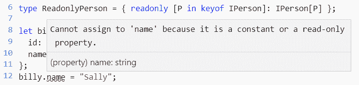

所以我们的映射类型起作用了！这种映射类型的更通用版本实际上是 TypeScript 中的标准类型，即`Readonly<T>`。

1.  现在让我们使用标准的`readonly`类型：

```jsx
let sally: Readonly<IPerson> = {
  id: 1,
  name: "sally"
};
```

1.  让我们尝试更改我们的`readonly`中的值：

```jsx
Sally.name = "Billy";
```

引发编译错误，正如我们所期望的那样：

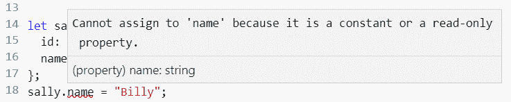

如果我们在 Visual Studio Code 中使用“转到定义”选项来查看`Readonly`类型，我们会得到以下结果：

```jsx
type Readonly<T> = {
    readonly [P in keyof T]: T[P];
};
```

这与我们的`ReadonlyPerson`类型非常相似，但是`IPerson`已被替换为通用类型`T`。

让我们尝试创建我们自己的通用映射类型：

1.  我们将创建一个映射类型，使现有类型的所有属性都是`string`类型：

```jsx
type Stringify<T> = { [P in keyof T]: string };
```

1.  让我们尝试使用我们的映射类型：

```jsx
let tim: Stringify<IPerson> = {
 id: "1",
 name: "Tim"
};
```

1.  让我们尝试将`id`设置为一个数字：

```jsx
tim.id = 1
```

预期的编译错误被引发：

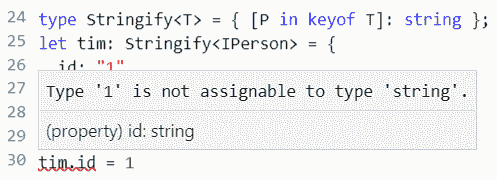

因此，在需要基于现有类型创建新类型的情况下，映射类型非常有用。除了`Readonly<T>`之外，在 TypeScript 中还有许多标准映射类型，例如`Partial<T>`，它创建一个映射类型，使所有属性都是可选的。

# 总结

在本章中，我们学习了 TypeScript 中一些更高级的类型，从联合类型开始。联合类型非常有用，允许我们通过将现有类型联合在一起来创建新类型。我们发现，将字符串字面量联合在一起可以创建比普通`string`更具体和类型安全的类型。

我们探讨了各种实现类型守卫的方式。类型守卫在逻辑分支中帮助编译器缩小联合类型的范围时非常有用。它们在使用`unknown`类型时，在逻辑分支中告诉编译器类型是什么也非常有用。

泛型，顾名思义，允许我们创建通用类型。在详细讨论了这个主题之后，React 组件中的 props 和 state 的类型安全现在更加有意义了。我们将在本书的其余部分大量使用通用类和函数。

我们了解到重载签名允许我们拥有具有不同参数和返回类型的函数。现在我们可以有效地使用这个特性来简化我们在库中公开的公共函数。

我们学习了如何可以使用查找和映射类型从现有类型属性动态创建新类型。我们现在知道，有许多有用的标准 TypeScript 映射类型，如`Readonly<T>`和`Partial<T>`。

学习所有这些特性是对下一章的很好准备，我们将深入探讨在使用 React 组件时的一些常见模式。

# 问题

让我们来试试一些关于高级类型的问题：

1.  我们有一个代表课程结果的`interface`，如下：

```jsx
interface ICourseMark {
  courseName: string;
  grade: string;
}
```

我们可以像这样使用这个`interface`：

```jsx
const geography: ICourseMark = {
  courseName: "Geography",
  grade: "B"
} 
```

成绩只能是 A、B、C 或 D。我们如何创建这个接口中`grade`属性的更强类型版本？

1.  我们有以下函数，用于验证数字和字符串是否有值：

```jsx
function isNumberPopulated(field: number): boolean {
  return field !== null && field !== undefined;
}

function isStringPopulated(field: string): boolean {
  return field !== null && field !== undefined && field !== "";
}
```

我们如何将这些组合成一个名为`isPopulated`的单一函数，带有签名重载？

1.  我们如何可以使用泛型实现一个更灵活的`isPopulated`函数？

1.  我们有一个代表阶段的`type`别名：

```jsx
type Stages = {
  pending: 'Pending',
  started: 'Started',
  completed: 'Completed',
};
```

1.  我们如何可以编程地将这个转换成`'Pending' | 'Started' | 'Completed'`联合类型？

1.  我们有以下联合类型：

```jsx
type Grade = 'gold' | 'silver' | 'bronze';
```

我们如何可以编程地创建以下类型：

```jsx
type GradeMap = {
  gold: string;
  silver: string;
  bronze: string
};
```

# 进一步阅读

TypeScript 文档中有一个关于高级类型的很棒的部分，值得一看：

[`www.typescriptlang.org/docs/handbook/advanced-types.html`](https://www.typescriptlang.org/docs/handbook/advanced-types.html)
