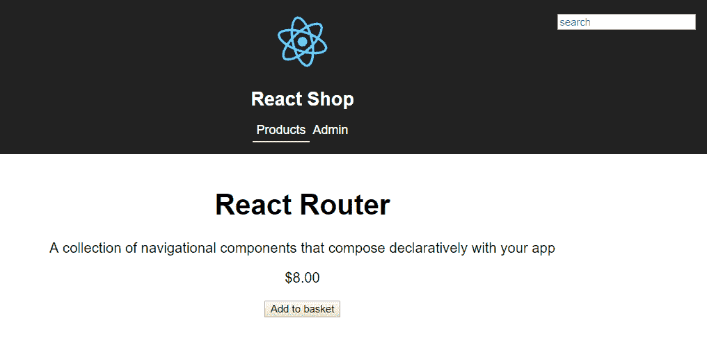
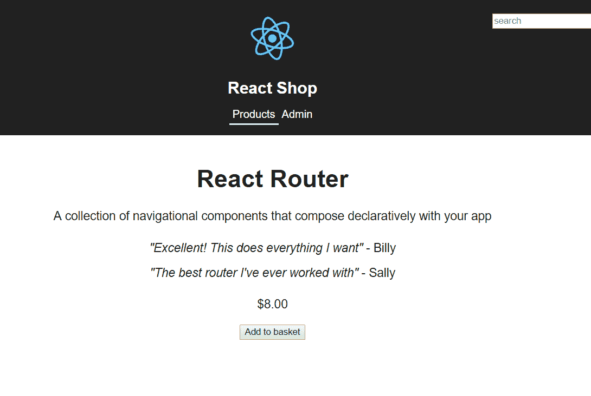
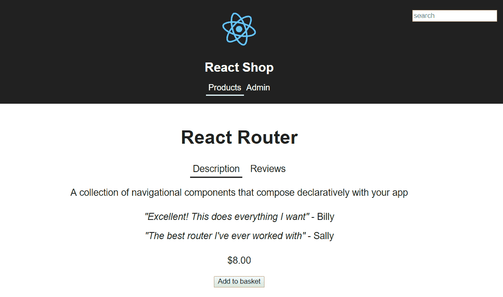
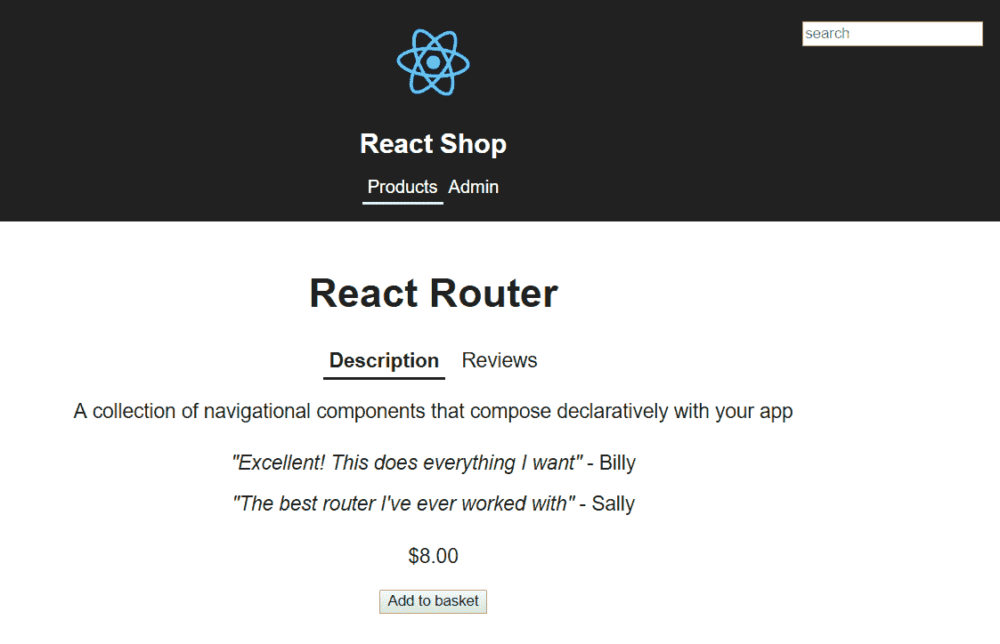
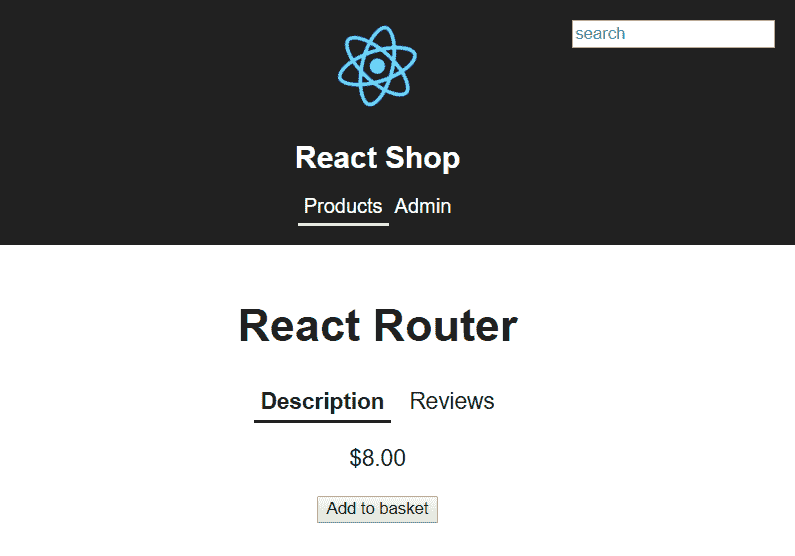
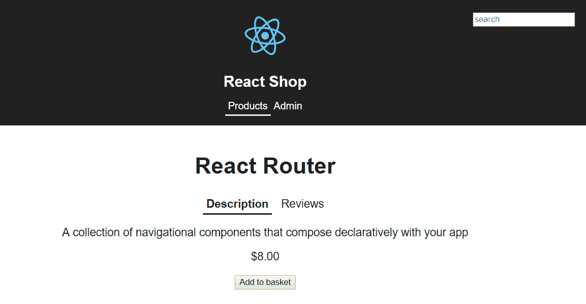
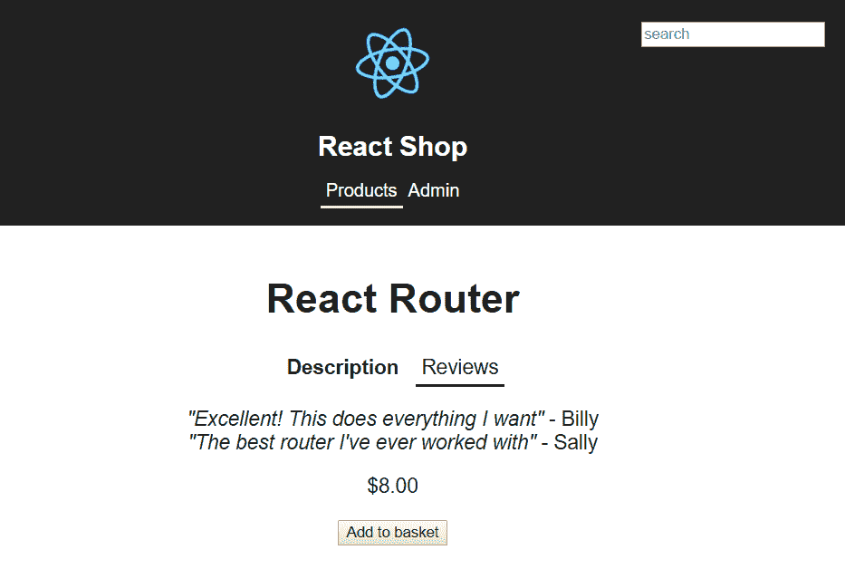
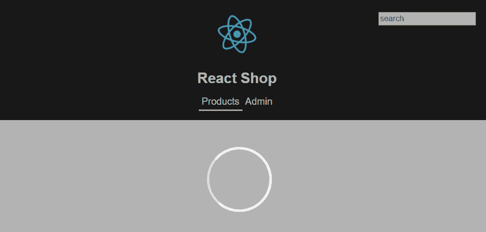
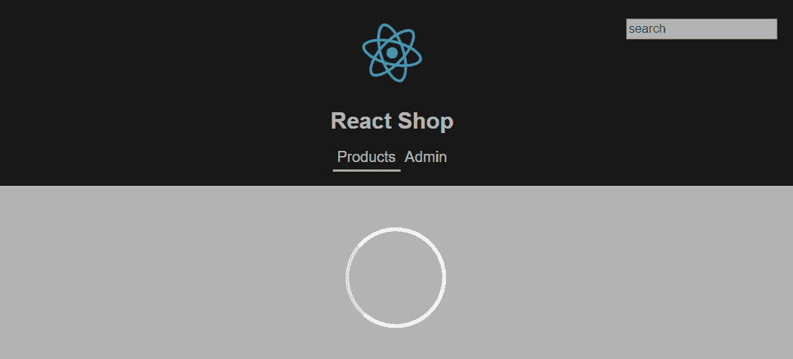

# 第六章：组件模式

在本章中，我们将继续构建之前的 React 商店。我们将构建一个可重用的选项卡组件，以及一个可重用的加载指示器组件，两者都将在商店的产品页面上使用。本章将首先将产品页面分割为容器和展示组件，然后再处理选项卡组件，利用复合组件和渲染属性模式。然后，我们将继续实现一个使用高阶组件模式的加载指示器组件。

在这一章中，我们将学习以下主题：

+   容器和展示组件

+   复合组件

+   渲染属性模式

+   高阶组件

# 技术要求

在本章中，我们将使用以下技术：

+   **Node.js 和** `npm`：TypeScript 和 React 依赖于这些。我们可以从[`nodejs.org/en/download/`](https://nodejs.org/en/download/)安装这些。如果我们已经安装了这些，确保`npm`至少是 5.2 版本。

+   **Visual Studio Code**：我们需要一个编辑器来编写 React 和 TypeScript 代码，可以从[`code.visualstudio.com/`](https://code.visualstudio.com/)安装。我们还需要在 Visual Studio Code 中安装 TSLint（由 egamma 提供）和 Prettier（由 Estben Petersen 提供）扩展。

+   **React 商店**：我们将从我们在查看 React Router 的章节中开始的项目开始。这可以在 GitHub 上找到：[`github.com/carlrip/LearnReact17WithTypeScript/tree/master/04-ReactRouter`](https://github.com/carlrip/LearnReact17WithTypeScript/tree/master/04-ReactRouter)。

本章中的所有代码片段都可以在以下网址找到：[`github.com/carlrip/LearnReact17WithTypeScript/tree/master/06-ComponentPatterns`](https://github.com/carlrip/LearnReact17WithTypeScript/tree/master/06-ComponentPatterns)。

# 容器和展示组件

将页面分割为容器和展示组件可以使展示组件更容易重用。容器组件负责事物的运作，从 Web API 获取数据并管理状态。展示组件负责外观。展示组件通过属性接收数据，同时具有属性事件处理程序，以便其容器可以管理用户交互。

我们将在我们的 React 商店中使用这种模式，将产品页面分成容器和展示组件。`ProductPage`组件将是容器，我们将引入一个名为`Product`的新组件，它将是展示组件：

1.  让我们首先在 Visual Studio Code 中打开我们的商店项目，并在终端中输入以下命令来启动应用程序：

```jsx
npm start
```

1.  如果我们导航到一个产品，让我们回顾一下产品页面是什么样子的：



1.  让我们创建一个名为`Product.tsx`的新文件，其中包含我们的展示组件，内容如下：

```jsx
import * as React from "react";

const Product: React.SFC<{}> = props => {
  return <React.Fragment>TODO</React.Fragment>;
};

export default Product;
```

我们的展示组件是一个函数组件。

1.  展示组件通过 props 接收数据，也通过 props 委托事件处理。因此，让我们为产品数据项、是否已添加到购物篮以及添加到购物篮的处理程序创建 props：

```jsx
import * as React from "react";
import { IProduct } from "./ProductsData";

interface IProps {
 product: IProduct;
 inBasket: boolean;
 onAddToBasket: () => void;
}
const Product: React.SFC<IProps> = props => {
  return <React.Fragment>TODO</React.Fragment>;
};

export default Product;
```

1.  如果我们查看`ProductsPage.tsx`，我们将复制`React.Fragment`部分中有产品时的 JSX。然后我们将其粘贴到`Product`组件的 return 语句中：

```jsx
const Product: React.SFC<IProps> = props => {
  return (
    <React.Fragment>
 <h1>{product.name}</h1>
 <p>{product.description}</p>
 <p className="product-price">
 {new Intl.NumberFormat("en-US", {
 currency: "USD",
 style: "currency"
 }).format(product.price)}
 </p>
 {!this.state.added && (
 <button onClick={this.handleAddClick}>Add to basket</button>
 )}
 </React.Fragment>
  );
};
```

我们现在有一些参考问题需要解决。

1.  让我们在 return 语句之前定义一个产品变量，以解决 JSX 中产品引用的问题：

```jsx
const product = props.product;
return ( 
  ...
)
```

1.  现在通过`inBasket` prop 传递产品是否在购物篮中。因此，让我们改变添加到购物篮按钮周围的条件以使用这个 prop：

```jsx
{!props.inBasket && (
  <button onClick={this.handleAddClick}>Add to basket</button>
)}
```

1.  我们需要解决的最后一个参考问题是点击“添加到购物篮”按钮的处理程序。让我们首先创建一个简单调用`onAddToBasket` prop 的处理程序：

```jsx
const product = props.product;

const handleAddClick = () => {
 props.onAddToBasket();
};

return (
  ...
);
```

1.  我们可以在 JSX 中删除对此处理程序的引用`this`。

```jsx
{!props.inBasket && (
  <button onClick={handleAddClick}>Add to basket</button>
)}
```

这就是我们目前的`Product`展示组件完成了。因此，让我们在`ProductPage`组件中引用我们的`Product`组件。

1.  首先，让我们将我们的`Product`组件导入到`ProductPage.tsx`中：

```jsx
import Product from "./Product";
```

1.  现在，让我们用我们的`Product`组件替换在 JSX 中复制的部分：

```jsx
return (
 <div className="page-container">
   <Prompt when={!this.state.added} message={this.navAwayMessage} />
   {product ? (
     <Product
 product={product}
 inBasket={this.state.added}
 onAddToBasket={this.handleAddClick}
 />
   ) : (<p>Product not found!</p>)}
 </div>
);
```

我们将产品、产品是否已添加到购物篮以及添加到购物篮的处理程序一起作为 props 传递给`Product`组件。

如果我们再次查看商店并转到产品页面，它看起来完全一样。

因此，我们刚刚实现了我们的第一个容器和展示组件。容器组件非常适合作为页面中的顶层组件，从 Web API 获取数据，并管理页面内的所有状态。展示组件只关注需要呈现在屏幕上的内容。这种模式的好处是展示组件可以更容易地在应用程序的其他地方使用。例如，我们的`Product`组件可以相当容易地在商店中创建的其他页面上使用。这种模式的另一个好处是，展示组件通常更容易进行单元测试。在我们的示例中，我们的`Product`组件是一个纯函数，因此对其进行单元测试只是检查不同输入的输出是否正确，因为没有副作用。我们将在本书的后面详细介绍单元测试。

在下一节中，我们将继续增强我们的产品页面，通过向其添加评论并添加选项卡来将产品描述与评论分开。

# 复合组件

复合组件是一组共同工作的组件。我们将使用这种模式在产品页面上创建一个可重用的选项卡组件，以分隔产品描述和评论。

# 为产品添加评论

在创建我们的`Tabs`复合组件之前，让我们在产品页面上添加评论：

1.  首先，我们需要在`ProductsData.ts`中为评论数据结构添加一个接口：

```jsx
export interface IReview {
  comment: string;
  reviewer: string;
}
```

1.  我们现在可以将评论添加到我们的产品接口中：

```jsx
export interface IProduct {
  ...
  reviews: IReview[];
}
```

1.  我们现在可以将评论添加到我们的产品数据数组中：

```jsx
const products: IProduct[] = [
  {
    id: 1,
    ...
    reviews: [
 {
 comment: "Excellent! This does everything I want",
 reviewer: "Billy"
 },
 { comment: "The best router I've ever worked with", reviewer: 
      "Sally" }
 ]
  },
  {
    id: 2,
    ..
    reviews: [
 {
 comment: "I've found this really useful in a large app I'm 
        working on",
 reviewer: "Billy"
 },
 {
 comment: "A bit confusing at first but simple when you get   
        used to it",
 reviewer: "Sally"
 }
 ]
  },
  {
    id: 3,
    ..
    reviews: [
 {
 comment: "I'll never work with a REST API again!",
 reviewer: "Billy"
 },
 {
 comment: "It makes working with GraphQL backends a breeze",
 reviewer: "Sally"
 }
 ]
  }
];
```

因此，我们为每个产品添加了一个`reviews`属性，它是一个评论数组。每个评论都是一个包含`comment`和`reviewer`属性的对象，由`IReview`接口定义。

1.  有了我们的数据，让我们在描述之后将评论添加到我们的`Product`组件中：

```jsx
<p>{product.description}</p>
<div>
 <ul className="product-reviews">
 {product.reviews.map(review => (
 <li key={review.reviewer} className="product-reviews-item">
 <i>"{review.comment}"</i> - {review.reviewer}
 </li>
 ))}
 </ul>
</div>
<p className="product-price">
  ...
</p>
```

因此，我们正在使用`map`函数在`reviews`数组上显示`comment`和`reviewer`。

1.  我们引用了一些新的 CSS 类，因此让我们将它们添加到`index.css`中：

```jsx
.product-reviews {
  list-style: none;
  padding: 0px;
}
.product-reviews .product-reviews-item {
  display: block;
  padding: 8px 0px;
}
```

如果我们查看正在运行的应用程序并转到产品，我们现在将看到评论：



现在我们已经添加了评论，我们可以在下一节中处理我们的`Tabs`组件。

# 创建一个基本的选项卡组件

我们的工作现在是使用我们将要构建的选项卡组件将描述与评论分开。我们将首先创建一个简单的选项卡组件，然后在下一节将其重构为复合组件模式。

是时候开始我们的选项卡组件了：

1.  首先，让我们创建一个名为`Tabs.tsx`的文件，用以下内容作为骨架类组件：

```jsx
import * as React from "react";

interface IProps {}
interface IState {}
class Tabs extends React.Component<IProps, IState> {
  public constructor(props: IProps) {
    super(props);
    this.state = {};
  }
  public render() {
    return;
  }
}

export default Tabs;
```

我们选择创建基于类的组件，因为我们的组件将需要跟踪活动的选项卡标题的状态。

1.  因此，让我们通过添加一个属性来完成我们状态的接口，该属性将给出活动的标题名称：

```jsx
interface IState {
  activeHeading: string;
}
```

1.  我们的组件将接受选项卡标题并将它们显示为属性。因此，让我们完成这个接口：

```jsx
interface IProps {
  headings: string[];
}
```

因此，我们的组件可以接受一个`headings`属性中的标题名称数组。

1.  让我们现在在构造函数中为`activeHeading`状态创建初始值：

```jsx
public constructor(props: IProps) {
  super(props);
  this.state = {
    activeHeading:
 this.props.headings && this.props.headings.length > 0
 ? this.props.headings[0]
 : ""
  };
}
```

因此，活动标题最初将设置为`headings`数组中的第一个元素。三元运算符确保我们的组件在消费者未传递任何选项卡时不会产生错误。

1.  现在转到渲染方法，让我们通过映射`headings`属性在列表中渲染我们的选项卡：

```jsx
    public render() {
      return (
        <ul className="tabs">
          {this.props.headings.map(heading => (
            <li className={heading === this.state.activeHeading ? 
            "active" : ""}
            >
              {heading}
            </li>
          ))}
        </ul>
      );
    }
```

我们引用了一些 CSS 类，包括`active`，它是基于三元运算符设置的，取决于正在呈现的是否是活动选项卡标题。

1.  现在让我们将这些 CSS 类添加到`index.css`中：

```jsx
.tabs {
  list-style: none;
  padding: 0;
}
.tabs li {
  display: inline-block;
  padding: 5px;
  margin: 0px 5px 0px 5px;
  cursor: pointer;
}
.tabs li:focus {
  outline: none;
}
.tabs li.active {
  border-bottom: #222 solid 2px;
}
```

在我们可以看到我们的选项卡组件是什么样子之前，我们需要使用它。

1.  因此，让我们首先导入`Tabs`组件，然后将其添加到`Product`组件中。

```jsx
import Tabs from "./Tabs";
```

1.  现在我们可以在产品名称和描述之间添加`Tabs`组件：

```jsx
<h1>{product.name}</h1>
<Tabs headings={["Description", "Reviews"]} />
<p>{product.description}</p>
```

我们将向`Tabs`组件传递我们要显示的两个选项卡标题，即描述和评论。

让我们看看这是什么样子：



这是一个良好的开始。第一个选项卡下划线是`active` CSS 样式，正如我们所希望的那样。但是，如果我们点击评论选项卡，什么也不会发生。

1.  因此，让我们在`Tabs.tsx`中引用点击处理程序来处理每个选项卡：

```jsx
<li
  onClick={this.handleTabClick}
  className={heading === this.state.activeHeading ? "active" : ""}
>
  {heading}
</li>
```

1.  现在让我们也实现点击处理程序：

```jsx
private handleTabClick = (e: React.MouseEvent<HTMLLIElement>) => {
  const li = e.target as HTMLLIElement;
  const heading: string = li.textContent ? li.textContent : "";
  this.setState({ activeHeading: heading });
};
```

我们首先从`li`的`textContent`中提取标题。然后将`activeHeading`状态设置为此标题。这将导致 React 重新渲染组件，显示所点击的选项卡为活动状态。

请注意，我们使用`as`关键字帮助 TypeScript 编译器将`li`变量声明为`HTMLLIElement`。如果不这样做，编译器将不允许我们访问其中的`textContent`属性。

如果我们再次转到运行的应用程序，现在我们可以单击选项卡并看到活动状态的变化。

目前，我们的选项卡组件只是渲染一些可以单击的选项卡。它还没有与任何内容相关联。直到下一节关于渲染属性模式的部分，我们才会将标题与内容关联起来。但是，现在是时候探索复合组件模式，并在下一节中稍微增强我们的选项卡标题。

# 利用复合组件模式

目前，我们的选项卡标题只能是字符串。如果我们希望允许组件的使用者在标题中定义更丰富的内容怎么办？例如，使用者可能希望在选项卡标题前放置图标或使标题加粗。因此，使用的 JSX 可能如下所示：

```jsx
<Tabs>
  <Tabs.Tab name="Description" initialActive={true}>
    <b>Description</b>
  </Tabs.Tab>
  <Tabs.Tab name="Reviews">
     Reviews
  </Tabs.Tab>
</Tabs>
```

在上一个示例中，`Tabs`和`Tabs.Tab`是复合组件：

+   `Tabs`是渲染其中的`Tabs.Tab`组件的组件。它还管理活动选项卡的状态。

+   `Tabs.Tab`渲染单个标题。它以唯一的选项卡名称作为属性，允许管理活动选项卡。它还接受一个名为`initialActive`的`boolean`属性，该属性在首次加载时设置该选项卡为活动状态。渲染的标题是`Tabs.Tab`标记内的内容。因此，第一个选项卡将以粗体呈现描述。

因此，让我们将我们的基本选项卡组件重构为一个复合组件，可以类似于上一个示例中使用：

1.  我们的`Tabs`组件不再接受任何属性，因此，让我们删除`IProps`接口。我们可以删除构造函数，因为我们不再需要从属性初始化状态。我们还将状态属性的名称从`activeHeading`更改为`activeName`：

```jsx
interface IState {
  activeName: string;
}
class Tabs extends React.Component<{}, IState> {
  public render() {
    ...
  }
  ...
}
```

1.  首先，我们将在`Tabs`中工作`Tab`组件。因此，让我们为其属性创建一个接口：

```jsx
interface ITabProps {
  name: string;
  initialActive?: boolean;
}
```

+   `name`属性是选项卡的唯一名称。稍后将使用它来帮助我们管理活动选项卡。

+   `initialActive`属性指定组件首次加载时选项卡是否处于活动状态。

1.  现在让我们在我们的`Tabs`类组件中添加以下`Tab`函数组件：

```jsx
class Tabs extends React.Component<IProps, IState> {

  public static Tab: React.SFC<ITabProps> = props => <li>TODO - render the nodes child nodes</li>;

  public render() {...}

  ...
}
```

这是将渲染每个标签的组件的开始。`Tab`组件被定义为`Tabs`组件的静态属性。这意味着`Tab`存在于实际的`Tabs`类中，而不是它的实例中。因此，我们必须记住我们无法访问任何`Tabs`实例成员（例如`this`）。但是，现在我们可以在 JSX 中使用`Tabs.Tab`来引用`Tab`，这是我们的要求之一。

目前，`Tab`只是渲染带有提醒的`li`，提醒我们需要以某种方式渲染组件的子节点。请记住，我们希望消费`Tabs`组件的标记如下：

```jsx
<Tabs.Tab name="Description" initialActive={true}>
  <b>Description</b>
/Tabs.Tab>
```

1.  因此，我们的渲染函数需要以某种方式在我们的`li`标签内渲染`<b> Description </b>`。我们该如何做呢？答案是通过一个叫做`children`的特殊属性：

```jsx
public static Tab: React.SFC<ITabProps> = props => <li>{props.children}</li>;
```

React 组件属性可以是任何类型，包括 React 节点。`children`属性是 React 给组件的一个特殊属性，其中包含组件的子节点。我们通过在 JSX 中引用`children`属性来渲染组件的子节点。

我们的`Tab`组件还没有完成，但我们暂时会保持这样。现在我们需要继续进行`Tabs`组件。

1.  `Tabs`类中的`render`方法现在只是简单地渲染其子节点。让我们用以下内容替换这个方法：

```jsx
public render() {
  return (
    <ul className="tabs">{this.props.children}</ul>
  );
}
```

我们再次使用神奇的`children`属性来渲染`Tabs`中的子节点。

我们在复合`Tabs`和`Tab`组件中取得了进展，但是我们的项目不再编译，因为我们有一个标签点击处理程序`handleTabClick`，它不再被引用。当点击标签标题时，我们需要以某种方式从`Tab`组件中引用它，但请记住`Tab`无法访问`Tabs`的成员。那么，我们该如何做呢？我们将在下一节中找到这个问题的答案。

# 使用 React 上下文共享状态

React 上下文允许在组件之间共享状态。它与复合组件非常配合。我们将在`Tabs`和`Tab`组件中使用它来共享状态：

1.  我们的第一个任务是在文件顶部创建一个用于`Tabs.tsx`中使用的上下文接口，就在导入语句的下面：

```jsx
interface ITabsContext {
  activeName?: string;
  handleTabClick?: (name: string) => void;
}
```

因此，我们的上下文将包含活动标签名称以及标签点击处理程序的引用。这些是需要在组件之间共享的两个状态。

1.  接下来，让我们在`ITabsContext`接口下创建上下文：

```jsx
const TabsContext = React.createContext<ITabsContext>({});
```

我们在 React 中使用`createContext`函数创建了我们的上下文，这是一个通用函数，用于创建一个通用类型的上下文，在我们的情况下是`ITabsContext`。

我们需要将默认上下文值作为参数值传递给`createContext`，但在我们的情况下这是没有意义的，所以我们只是传递一个空的`{}`对象，以使 TypeScript 编译器满意。这就是为什么`ITabsContext`中的两个属性都是可选的。

1.  现在是时候在我们的复合组件中使用这个上下文了。我们需要做的第一件事是在`Tabs`的`render`方法中定义上下文提供程序：

```jsx
public render() {
  return (
    <TabsContext.Provider
 value={{
 activeName: this.state ? this.state.activeName : "",
 handleTabClick: this.handleTabClick
 }}
 >
      <ul className="tabs">{this.props.children}</ul>
    </TabsContext.Provider>
  );
}
```

这里有一些事情要处理，所以让我们来分解一下：

+   我们之前声明的上下文常量`TabsContext`在 JSX 中可以作为`<TabsContext />`组件使用。

+   上下文提供程序用值填充上下文。鉴于`Tabs`管理状态和事件处理，将提供程序引用到那里是有意义的。

+   我们使用`<TabsContext.Provider />`引用提供程序。

+   提供程序接受一个名为`value`的属性作为上下文值。我们将其设置为一个包含活动选项卡名称和选项卡点击事件处理程序的对象。

1.  我们需要稍微调整选项卡点击处理程序，因为点击不再直接在`Tabs`中处理。因此，我们只需要将活动选项卡名称作为参数传入，然后在方法中设置活动选项卡名称状态：

```jsx
private handleTabClick = (name: string) => {
  this.setState({ activeName: name });
};
```

1.  现在我们已经向上下文提供了一些数据，是时候在`Tab`组件中使用它了：

```jsx
 public static Tab: React.SFC<ITabProps> = props => (
  <TabsContext.Consumer>
 {(context: ITabsContext) => {
 const activeName = context.activeName
 ? context.activeName
 : props.initialActive
 ? props.name
 : "";
 const handleTabClick = (e: React.MouseEvent<HTMLLIElement>) => 
      {
 if (context.handleTabClick) {
 context.handleTabClick(props.name);
 }
 };
      return (
        <li
          onClick={handleTabClick}
 className={props.name === activeName ? "active" : ""}
        >
          {props.children}
        </li>
      );
    }}
  </TabsContext.Consumer>
);
```

这看起来又有点令人生畏，所以让我们来分解一下：

+   我们可以通过上下文组件内的`Consumer`组件来消费上下文。所以，在我们的情况下是`<TabsContext.Consumer />`。

+   `Consumer`的子代需要是一个具有上下文值参数并返回一些 JSX 的函数。`Consumer`然后将渲染我们返回的 JSX。

如果这仍然有点令人困惑，不要担心。当我们讨论子代属性和渲染属性时，我们将在以后更详细地介绍这种模式。

+   这个上下文函数为我们提供了渲染选项卡所需的一切。我们可以从`context`参数中访问状态，还可以访问`Tab`组件的`props`对象。

+   函数的第一行通过使用上下文中的内容来确定活动选项卡名称。如果上下文中的活动选项卡是空字符串，我们将使用当前选项卡名称，如果已经定义为初始活动选项卡。

+   函数的第二行创建了一个标签点击处理程序，如果已经指定了上下文标签点击处理程序，则调用它。

+   返回语句与以前一样，但我们已经能够添加标签点击处理程序的引用和类名。

所以，这就是我们的标签复合组件。React 上下文的语法一开始可能看起来有点奇怪，但当你习惯了它之后，它真的很简单和优雅。

在我们尝试之前，我们需要在我们的`Product`组件中使用我们的复合组件。让我们用以下突出显示的 JSX 替换我们之前对`Tabs`组件的使用：

```jsx
 <React.Fragment>
  <h1>{product.name}</h1>

  <Tabs>
 <Tabs.Tab name="Description" initialActive={true}>
 <b>Description</b>
 </Tabs.Tab>
 <Tabs.Tab name="Reviews">Reviews</Tabs.Tab>
 </Tabs>

  <p>{product.description}</p>
  ...
</React.Fragment>
```

这正是我们在开始构建复合标签组件时想要实现的 JSX。如果我们转到运行的应用程序并浏览到产品页面，我们的标签组件将完美地工作，描述标签会以粗体显示：



因此，复合组件非常适合相互依赖的组件。`<Tabs.Tab />`的语法真的*强调了*`Tab`需要与`Tabs`一起使用。

React 上下文与复合组件非常配合，允许复合中的组件轻松共享状态。状态甚至可以包括诸如事件处理程序之类的函数。

允许消费者指定要在组件的各个部分中呈现的内容，为消费者提供了极大的灵活性。将此自定义内容指定为组件的子级是直观且自然的。在接下来的部分中，我们将继续使用这种方法来完成我们的标签组件。

# 渲染道具模式

在上一节中，我们使用了渲染道具模式的一种形式，其中我们利用了`children`道具。我们用它来允许`Tab`组件的消费者为标签标题呈现自定义内容。这很好，但是如果我们想允许消费者在组件的不同部分呈现自定义内容怎么办？在我们的`Tabs`组件中，我们还没有允许消费者呈现标签的内容。我们确实希望消费者能够为此指定自定义内容，但是既然我们已经使用了`children`道具来表示标题，那么现在该怎么做呢？

答案很简单，但一开始并不明显。答案是，因为 props 可以是任何东西，它们可以是一个呈现内容的函数 - 就像特殊的`children`prop 一样。这些类型的 prop 被称为渲染 prop。我们可以拥有尽可能多的渲染 prop，从而灵活地允许消费者呈现组件的多个部分。

在上一节中，当我们使用 React 上下文时，实际上使用了渲染 prop。我们消费上下文的方式是通过渲染 prop。

接下来，我们将利用渲染 prop 模式完成我们的`Tabs`组件。

# 使用渲染 prop 完成 Tabs

我们将通过使用渲染 prop 模式来完成我们的 Tabs 组件。在我们实现第一个渲染 prop 之前，让我们考虑一下当`Tabs`组件完成后，我们希望消费者如何消费它。以下的 JSX 是我们理想情况下从`Product`组件中消费`Tabs`组件的方式：

```jsx
<Tabs>
  <Tabs.Tab
    name="Description"
    initialActive={true}
    heading={() => <b>Description</b>}
  >
    <p>{product.description}</p>
  </Tabs.Tab>

  <Tabs.Tab 
    name="Reviews"
    heading={() => "Reviews"} 
  >
    <ul className="product-reviews">
      {product.reviews.map(review => (
        <li key={review.reviewer}>
          <i>"{review.comment}"</i> - {review.reviewer}
        </li>
      ))}
    </ul>
  </Tabs.Tab>
</Tabs>
```

让我们来看看这些关键部分的步骤：

+   我们仍然在使用复合组件。渲染 prop 与这些组件完全兼容。

+   每个选项卡的标题不再在`Tab`组件的子元素中定义。相反，我们使用一个`heading`渲染 prop，在那里我们仍然可以呈现简单的字符串或更丰富的内容。

+   然后指定选项卡内容为`Tab`组件的子元素。

# 使用渲染 prop 来设置选项卡标题

因此，让我们改变选项卡标题的实现，使用渲染 prop：

1.  在`Tabs.tsx`中，让我们首先在选项卡 props 接口中添加一个新的属性用于标题：

```jsx
interface ITabProps {
  name: string;
  initialActive?: boolean;
  heading: () => string | JSX.Element;
}
```

这个属性是一个没有参数的函数，返回一个`string`或一些 JSX。这就是我们的渲染 prop 的定义。

1.  更改实现非常简单。我们只需在`Tab`组件的返回语句中用新的渲染 prop 函数替换对`children`prop 函数的调用：

```jsx
return (
  <li
    onClick={handleTabClick}
    className={props.name === activeName ? "active" : ""}
  >
    {props.heading()}
  </li>
);
```

1.  让我们将`Product.tsx`中`Tabs`的使用切换为以下内容：

```jsx
<Tabs>
  <Tabs.Tab
    name="Description"
    initialActive={true}
    heading={() => <b>Description</b>}
  />
  <Tabs.Tab name="Reviews" heading={() => "Reviews"} />
</Tabs>
```

我们可能会收到一个 TSLint 警告：由于其渲染性能影响，JSX 属性中禁止使用 lambda。知道 lambda 可能会有问题是有用的，这样我们在遇到性能问题时可以记住这一点。然而，我们将在`tslint.json`中关闭此规则，指定`"jsx-no-lambda"`为`false`：

```jsx
{
  "extends": ["tslint:recommended", "tslint-react", "tslint-config-prettier"],
  "rules": {
    ...
    "jsx-no-lambda": false
  },
  ...
}
```

如果我们想要非常关注性能，我们可以引用组件内的方法，而不是使用 lambda 函数。

在保存了新的 TSLint 设置之后，编译器的投诉希望会消失。请注意，我们可能需要杀死终端并再次启动应用程序以消除编译器的投诉。

如果我们尝试在我们的应用程序中使用产品页面，它将表现得和以前一样。

因此，实现渲染属性模式非常简单。使用此模式最耗时的事情是理解它可以做什么以及它是如何工作的。一旦我们掌握了它，它就是一个可以为我们组件的消费者提供渲染灵活性的优秀模式。

在我们的`Tab`组件完成之前，我们还有最后一个部分要完成。

# 使用“children”属性来呈现选项卡内容。

现在我们的`Tab`组件已经接近完成了。最后的任务是允许消费者呈现选项卡内容。我们将使用`children`属性来实现这一点：

1.  首先，在`Tabs.tsx`中，让我们将上下文接口中的`handleTabClick`属性更改为包括要呈现的内容：

```jsx
interface ITabsContext {
  activeName: string;
  handleTabClick?: (name: string, content: React.ReactNode) => void;
}
```

1.  我们还将在状态接口中保存活动内容以及活动选项卡名称。因此，让我们将其添加到`Tabs`的状态接口中：

```jsx
interface IState {
  activeName: string;
  activeContent: React.ReactNode;
}
```

1.  现在让我们在`Tabs`中更改选项卡点击处理程序，以设置活动内容的状态以及活动选项卡名称：

```jsx
private handleTabClick = (name: string, content: React.ReactNode) => {
  this.setState({ activeName: name, activeContent: content });
};
```

1.  在`Tab`组件中，让我们通过传递`children`属性来调用选项卡点击处理程序，以获取选项卡内容的附加参数：

```jsx
const handleTabClick = (e: React.MouseEvent<HTMLLIElement>) => {
  if (context.handleTabClick) {
    context.handleTabClick(props.name, props.children);
  }
};
```

1.  现在让我们在`Tabs``render`方法中呈现我们状态中的活动内容，就在我们呈现选项卡标题的下面：

```jsx
<TabsContext.Provider ...
>
  <ul className="tabs">{this.props.children}</ul>
  <div>{this.state && this.state.activeContent}</div>
</TabsContext.Provider>
```

1.  让我们改变在`Product`组件中使用`Tabs`组件的方式：

```jsx
<h1>{product.name}</h1>

<Tabs>
 <Tabs.Tab
 name="Description"
 initialActive={true}
 heading={() => <b>Description</b>}
 >
 <p>{product.description}</p>
 </Tabs.Tab>

 <Tabs.Tab name="Reviews" heading={() => "Reviews"}>
 <ul className="product-reviews">
 {product.reviews.map(review => (
 <li key={review.reviewer}>
 <i>"{review.comment}"</i> - {review.reviewer}
 </li>
 ))}
 </ul>
 </Tabs.Tab>
</Tabs>

<p className="product-price">
...
</p>
```

现在选项卡内容已经嵌套在每个`Tab`组件中，正如我们所希望的那样。

让我们试一试。如果我们转到产品页面，我们会注意到一个问题：



在页面首次加载时未呈现内容。如果我们单击“Reviews”选项卡或“Description”选项卡，然后内容就会加载。

1.  问题在于当选项卡初始加载时，我们没有任何代码来呈现内容。因此，让我们通过在`Tab`组件中添加高亮显示的行来解决这个问题：

```jsx
public static Tab: React.SFC<ITabProps> = props => (
 <TabsContext.Consumer>
 {(context: ITabsContext) => {
  if (!context.activeName && props.initialActive) {
 if (context.handleTabClick) {
 context.handleTabClick(props.name, props.children);
 return null;
 }
 }
 const activeName = context.activeName
 ? context.activeName
 : props.initialActive
 ? props.name
 : "";
 ...
 }}
 </TabsContext.Consumer>
);
```

高亮显示的行在上下文中没有活动选项卡并且选项卡被标记为初始活动时，调用选项卡点击处理程序。在这种情况下，我们返回 null，因为调用选项卡点击将设置活动选项卡的状态，这将导致另一个渲染周期。

我们的选项卡组件现在应该已经完成了。让我们通过转到产品页面来检查：



内容呈现如我们所期望的那样。 如果我们点击评论选项卡，这也会很好地呈现：



因此，渲染道具和子道具模式非常适合允许消费者渲染自定义内容。 语法一开始可能看起来有点棘手，但当你理解它时，它就变得非常合理和优雅。

在下一节中，我们将看一下本章中的最终模式。

# 高阶组件

**高阶组件**（**HOC**）是一个将组件作为参数并返回增强版本的函数组件。 这可能不太明晰，因此我们将在本节中通过一个示例来说明。 我们的示例创建了一个名为`withLoader`的 HOC，可以应用于任何组件，以在组件忙碌时添加加载旋转器。 我们将在我们的 React 商店（我们在上一节中工作过的）中使用它在产品页面上获取数据时。 完成后将如下所示：



# 添加异步数据获取

目前，我们商店中的数据获取是瞬时的，因为所有数据都是本地的。 因此，在着手处理`withLoader`组件之前，让我们重构数据获取函数，包括延迟和异步。 这将更好地模拟使用 Web API 获取数据的真实数据获取函数：

1.  在`ProductData.ts`中，让我们添加以下箭头函数，用于获取产品：

```jsx
export const getProduct = async (id: number): Promise<IProduct | null> => {
  await wait(1000);
  const foundProducts = products.filter(customer => customer.id === id);
  return foundProducts.length === 0 ? null : foundProducts[0];
};
```

该函数接受产品 ID 并使用`products`数组中的`filter`函数找到产品，然后返回它。

该函数以`async`关键字为前缀，因为它是异步的。

1.  该函数还使用`await`关键字异步调用名为`wait`的函数。 因此，让我们创建`wait`函数：

```jsx
const wait = (ms: number): Promise<void> => {
  return new Promise(resolve => setTimeout(resolve, ms));
};
```

该函数使用标准的 JavaScript `setTimeout`函数等待我们在函数参数中指定的毫秒数。 该函数返回一个在`setTimeout`完成时解析的`Promise`。

如果此刻`async`和`await`关键字以及承诺不太明晰，不要担心。 我们将在本书的后面详细讨论这些。

因此，我们现在有一个异步获取产品的函数，至少需要 1 秒。让我们将其插入到我们的产品页面中。`ProductPage`组件是一个负责获取数据的容器组件，所以让我们在这里插入它。

1.  首先，让我们将`getProduct`函数导入到`ProductPage`中：

```jsx
import { getProduct, IProduct } from "./ProductsData";
```

1.  让我们向`ProductPage`的状态添加一个名为`loading`的属性，以指示数据是否正在加载：

```jsx
interface IState {
  product?: IProduct;
  added: boolean;
  loading: boolean;
}
```

1.  让我们在构造函数中也将这个状态初始化为`true`：

```jsx
public constructor(props: Props) {
  super(props);
  this.state = {
    added: false,
    loading: true
  };
}
```

1.  现在，我们可以在`ProductPage`组件加载时使用`getProduct`函数：

```jsx
public async componentDidMount() {
  if (this.props.match.params.id) {
    const id: number = parseInt(this.props.match.params.id, 10);
    const product = await getProduct(id);
    if (product !== null) {
      this.setState({ product, loading: false });
    }
  }
}
```

我们使用`await`关键字异步调用`getProduct`。为了做到这一点，我们需要使用`async`关键字将`componentDidMount`生命周期方法标记为异步。在获取产品后，我们将其设置在状态中，并将`loading`标志重置为`false`。

1.  如果我们的商店没有运行，让我们运行这个：

```jsx
npm start
```

如果我们转到产品页面，我们会发现产品加载大约需要 1 秒。您可能会注意到在产品加载时显示“产品未找到！”。这是因为产品在初始渲染时未设置。我们暂时忽略这个问题，因为我们的`withLoader`HOC 将解决这个问题。

因此，现在我们正在异步获取数据，大约需要 1 秒，我们准备实现我们的`withLoader`HOC 并在产品页面上使用它。我们将在下一节中完成这个操作。

# 实现`withLoader` HOC

我们将创建一个名为`withLoader`的加载器组件，可以与任何组件一起使用，以指示组件正在忙于执行某些操作：

1.  让我们首先创建一个名为`withLoader.tsx`的新文件，内容如下：

```jsx
import * as React from "react";

interface IProps {
  loading: boolean;
}

const withLoader = <P extends object>(
  Component: React.ComponentType<P>
): React.SFC<P & IProps> => ({ loading, ...props }: IProps) =>
  // TODO - return a loading spinner if loading is true otherwise return the component passed in 

export default withLoader;
```

这里有一些事情正在发生，让我们来分解一下：

+   `withLoader`是一个接受类型为`P`的组件的函数。

+   `withLoader`调用一个函数组件。

+   函数组件的属性被定义为`P & IProps`，这是一个交集类型。

交集类型将多种类型合并为一个。因此，`X`，`Y`和`Z`将`X`，`Y`和`Z`的所有属性和方法合并到一个新类型中。

+   因此，SFC 的属性包括从传入的组件中获取的所有属性，以及我们定义的`loading`布尔属性。

+   使用剩余参数，将 props 解构为一个`loading`变量和一个包含所有其他属性的`props`变量。

1.  因此，我们剩下要做的工作是，如果`loading`为`true`，则返回我们的加载旋转器，否则我们只需要返回传入的组件。我们可以使用下面代码中窗口中突出显示的三元表达式来实现这一点：

```jsx
const withLoader = <P extends object>(
  Component: React.ComponentType<P>
): React.SFC<P & IProps> => ({ loading, ...props }: IProps) =>
  loading ? (
 <div className="loader-overlay">
 <div className="loader-circle-wrap">
 <div className="loader-circle" />
 </div>
 </div>
 ) : (
 <Component {...props} />
 );
```

传入的组件在第二个三元分支中返回。我们使用扩展语法将`props`变量中的属性扩展到组件中。

加载旋转器在第一个三元分支中返回。

1.  加载旋转器引用了一些 CSS 类，所以让我们把它们添加到`index.css`中：

```jsx
.loader-overlay {
  position: fixed;
  top: 0;
  left: 0;
  width: 100%;
  height: 100%;
  background-color: Black;
  opacity: 0.3;
  z-index: 10004;
}
.loader-circle-wrap {
  position: fixed;
  top: 0;
  right: 0;
  bottom: 0;
  left: 0;
  height: 100px;
  width: 100px;
  margin: auto;
}
.loader-circle {
  border: 4px solid #ffffff;
  border-top: 4px solid #899091;
  border-radius: 50%;
  width: 100px;
  height: 100px;
  animation: loader-circle-spin 0.7s linear infinite;
}
```

`loader-overlay`类在整个页面上创建一个黑色的透明覆盖层。`loader-circle-wrap`类在覆盖层的中心创建一个`100px`乘`100px`的正方形。`loader-circle`类创建旋转的圆圈。

我们的`withLoader` HOC 现在已经完成。

供参考，下面的代码块显示了基于类的`withLoader`版本：

```jsx
const withLoader = <P extends object>(Component: React.ComponentType<P>) =>
  class WithLoader extends React.Component<P & IProps> {
    public render() {
      const { loading, ...props } = this.props as IProps;
      return loading ? (
        <div className="loader-overlay">
          <div className="loader-circle-wrap">
            <div className="loader-circle" />
          </div>
        </div>
      ) : (
        <Component {...props} />
      );
    }
  };
```

我们将坚持使用 SFC 版本，因为它不包含任何状态，也不需要访问任何生命周期方法。

在下一节中，我们将在商店应用程序中的产品页面中使用我们的`withLoader`组件。

# 使用 withLoader HOC

使用 HOC 非常简单。我们只需将 HOC 包装在我们想增强的组件周围。这样做的最简单的地方是在导出语句中。

让我们将在上一节中创建的`withLoader` HOC 添加到我们的产品页面中：

1.  因此，我们将使用`withLoader`来包装`Product`组件。首先，让我们将`withLoader`导入到`Product.tsx`中：

```jsx
import withLoader from "./withLoader";
```

1.  现在我们可以在导出语句中将`withLoader`包装在`Product`周围：

```jsx
export default withLoader(Product);
```

现在，在`ProductPage`组件中，我们得到了一个编译错误，因为它期望向`Product`传递一个 loading 属性。

1.  因此，让我们在引用`Product`时，从加载状态中传递 loading 属性：

```jsx
<Product
  loading={this.state.loading}
  product={product}
  inBasket={this.state.added}
  onAddToBasket={this.handleAddClick}
/>
```

1.  在`ProductPage.tsx`中，我们应该修改渲染`Product`组件的条件。现在，如果产品仍在加载，我们希望渲染`Product`。然后将渲染加载旋转器：

```jsx
{product || this.state.loading ? (
  <Product
    loading={this.state.loading}
    product={product}
    inBasket={this.state.added}
    onAddToBasket={this.handleAddClick}
  />
) : (
  <p>Product not found!</p>
)}
```

然而，这会导致另一个编译错误，因为`Product`组件内的`product`属性不希望是`undefined`。然而，在加载产品时它将是`undefined`。

1.  因此，让我们在`IProps`中将这个属性设为可选的，用于`Product`组件：

```jsx
interface IProps {
  product?: IProduct;
  inBasket: boolean;
  onAddToBasket: () => void;
}
```

这样，在`Product`组件中引用`product`属性时，JSX 中会出现进一步的编译错误，因为在加载数据时它现在将是`undefined`。

1.  一个简单的解决方法是，如果我们没有产品，就渲染`null`。`withLoader`高阶组件在这种情况下会渲染一个加载旋转器。所以，我们只是让 TypeScript 编译器在这里很高兴：

```jsx
const handleAddClick = () => {
  props.onAddToBasket();
};
if (!product) {
 return null;
}
return (
  <React.Fragment>
    ...
  </React.Fragment>
);
```

现在 TypeScript 编译器很高兴，如果我们去商店的产品页面，它将在渲染产品之前显示我们的加载旋转器：



因此，高阶组件非常适合增强组件，其中增强是可以应用于许多组件的东西。我们的加载旋转器是高阶组件的一个常见用例。另一个非常常见的 HOC 模式的用法是在使用 React Router 时。在本书的前面，我们使用了 React Router 的`withRouter`高阶组件来访问路径的参数。

# 总结

在本章中，我们学习了容器组件以及它们如何用于管理状态以及展示组件需要做什么。然后展示组件可以专注于它们需要看起来的样子。这使得展示组件可以更容易地在多个地方重复使用并进行单元测试。

我们学到了复合组件是相互依赖的组件。在父类上将复合子项声明为静态成员，可以清楚地告诉消费者这些组件应该一起使用。React 上下文是复合组件共享状态的便捷方式。

我们学到了特殊的 children 属性，可以用来访问和渲染组件的子项。然后我们学到，我们可以创建自己的渲染属性，为消费者提供对组件的自定义渲染部分的极大灵活性。

在上一节中，我们学习了高阶组件以及它们如何用于实现对组件的常见增强。在本书的前面，我们已经使用了 React Router 高阶组件来获取路径参数。

在下一章中，我们将学习如何在 React 中创建表单。在下一章的末尾，我们将使用本章学到的一些模式来以通用的方式处理表单。

# 问题

让我们用一些问题来测试一下我们对组件模式的学习成果：

1.  React 给我们提供了什么特殊属性来访问组件的子项？

1.  有多少组件可以通过 React 上下文共享状态？

1.  在使用 React 上下文时，它使用什么模式来允许我们使用上下文渲染我们的内容？

1.  一个组件中有多少个渲染 props？

1.  一个组件中有多少个 children props？

1.  我们只在产品页面上使用了`withLoader`。我们在`ProductData.ts`中使用以下函数来获取所有产品：

```jsx
export const getProducts = async (): Promise<IProduct[]> => {
  await wait(1000);
  return products;
};
```

你能用这个来通过使用`withLoader`高阶组件在产品页面上实现一个加载器吗？

1.  是否可以使用 children props 模式来创建一个加载器？消费的 JSX 可能如下所示：

```jsx
<Loader loading={this.state.loading}>
  <div>
    The content for my component ...
  </div>
</Loader>
```

如果可以的话，试着去实现它。

# 进一步阅读

+   React 上下文在 React 文档中有详细说明，链接如下：[`reactjs.org/docs/context.html`](https://reactjs.org/docs/context.html)

+   高阶组件在 React 文档中有详细说明，链接如下：[`reactjs.org/docs/higher-order-components.html`](https://reactjs.org/docs/higher-order-components.html)

+   渲染 props 模式在 React 文档中有详细说明，链接如下：[`reactjs.org/docs/render-props.html`](https://reactjs.org/docs/render-props.html)
