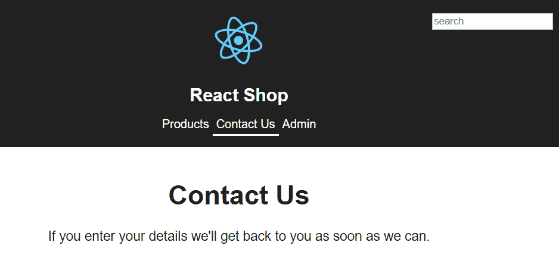
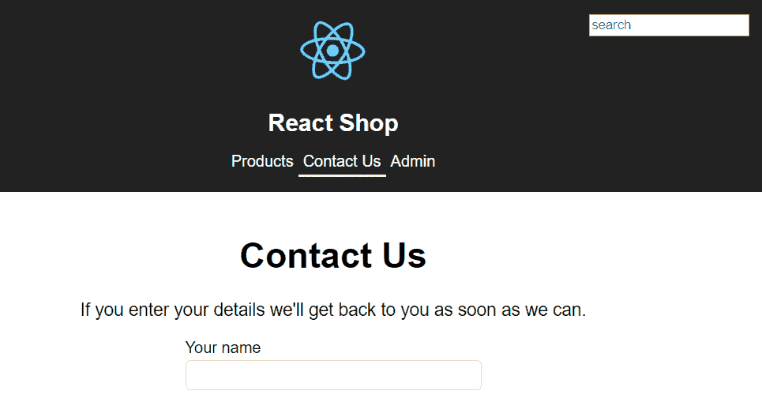
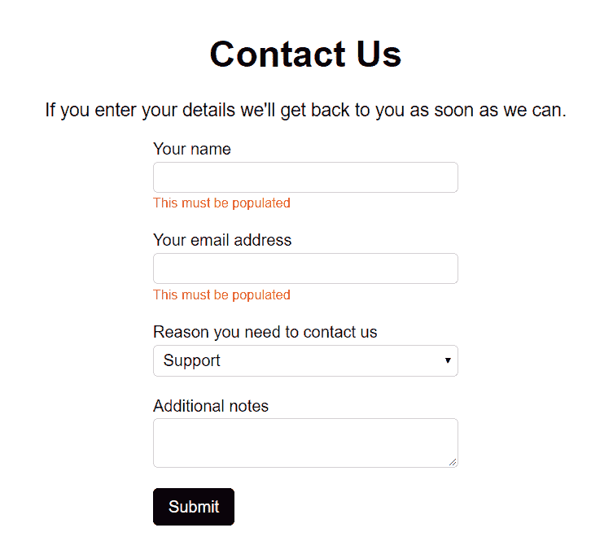
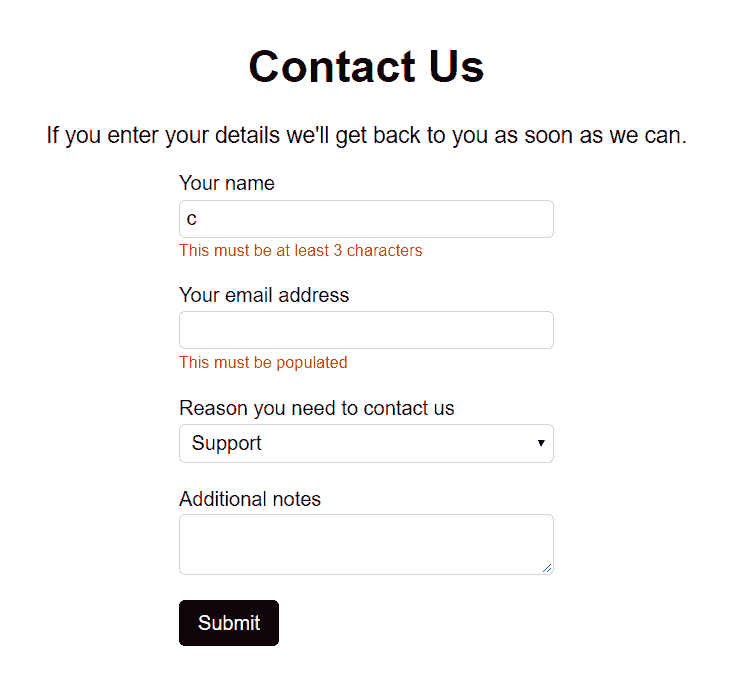
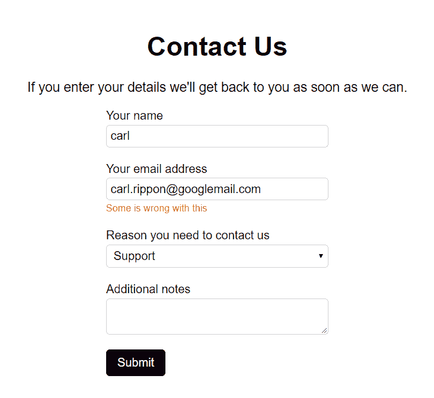
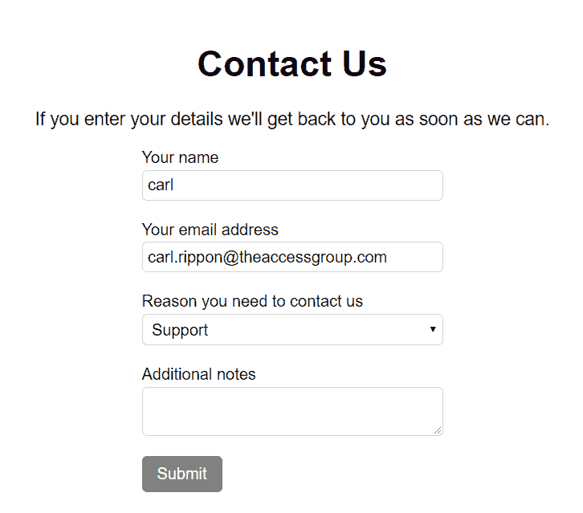

# 第七章：处理表单

表单在我们构建的应用程序中非常常见。在本章中，我们将学习如何在 React 和 TypeScript 中使用受控组件构建表单。作为学习练习，我们将为我们在其他章节中一直在开发的 React 商店构建一个联系我们表单。

我们很快会发现，在创建表单时涉及大量样板代码，因此我们将研究构建通用表单组件以减少样板代码。客户端验证对我们构建的表单的用户体验至关重要，因此我们还将深入讨论这个主题。

最后，表单提交是一个关键考虑因素。我们将介绍如何处理提交错误，以及成功情况。

在本章中，我们将讨论以下主题：

+   使用受控组件创建表单

+   使用通用组件减少样板代码

+   验证表单

+   表单提交

# 技术要求

我们将在本章中使用以下技术：

+   **Node.js**和`npm`：TypeScript 和 React 依赖于这些。可以从以下链接安装它们：[`nodejs.org/en/download/`](https://nodejs.org/en/download)。如果您已经安装了这些，请确保`npm`至少是 5.2 版本。

+   **Visual Studio Code**：我们需要一个编辑器来编写 React 和 TypeScript

代码，可以从[`code.visualstudio.com/`](https://code.visualstudio.com/)安装。我们还需要 TSLint 扩展（由 egamma 提供）和 Prettier 扩展（由 Estben Petersen 提供）。

+   **React 商店**：我们将从第六章完成的 React 商店项目开始，*组件模式*。这可以在 GitHub 上找到：[`github.com/carlrip/LearnReact17WithTypeScript/tree/master/06-ComponentPatterns`](https://github.com/carlrip/LearnReact17WithTypeScript/tree/master/06-ComponentPatterns)。

为了从上一章节恢复代码，可以在[`github.com/carlrip/LearnReact17WithTypeScript`](https://github.com/carlrip/LearnReact17WithTypeScript)上下载`LearnReact17WithTypeScript`存储库。然后可以在 Visual Studio Code 中打开相关文件夹，然后在终端中输入`npm install`来进行恢复。本章中的所有代码片段都可以在[`github.com/carlrip/LearnReact17WithTypeScript/tree/master/07-WorkingWithForms`](https://github.com/carlrip/LearnReact17WithTypeScript/tree/master/07-WorkingWithForms)上找到。

# 使用受控组件创建表单

表单是大多数应用程序的常见部分。在 React 中，创建表单的标准方式是使用所谓的*受控组件*。受控组件的值与 React 中的状态同步。当我们实现了我们的第一个受控组件时，这将更有意义。

我们将扩展我们一直在构建的 React 商店，以包括一个联系我们表单。这将使用受控组件来实现。

# 添加联系我们页面

在我们开始处理表单之前，我们需要一个页面来承载表单。该页面将是一个容器组件，我们的表单将是一个展示组件。我们还需要创建一个导航选项，可以带我们到我们的新页面。

在开始实现我们的表单之前，我们将写下以下代码：

1.  如果还没有，打开在 Visual Studio Code 中的 React 商店项目。在`src`文件夹中创建一个名为`ContactUsPage.tsx`的新文件，其中包含以下代码：

```jsx
import * as React from "react";

class ContactUsPage extends React.Component {
  public render() {
    return (
      <div className="page-container">
        <h1>Contact Us</h1>
        <p>
         If you enter your details we'll get back to you as soon as  
         we can.
        </p>
      </div>
    );
  }
}

export default ContactUsPage;
```

这个组件最终将包含状态，因此我们创建了一个基于类的组件。目前，它只是简单地呈现一个带有一些说明的标题。最终，它将引用我们的表单。

1.  现在让我们将这个页面添加到可用的路由中。打开`Routes.tsx`，并导入我们的页面：

```jsx
import ContactUsPage from "./ContactUsPage";
```

1.  在`Routes`组件的`render`方法中，我们现在可以在`admin`路由的上方添加一个新路由到我们的页面：

```jsx
<Switch>
  <Redirect exact={true} from="/" to="/products" />
  <Route path="/products/:id" component={ProductPage} />
  <Route exact={true} path="/products" component={ProductsPage} />
  <Route path="/contactus" component={ContactUsPage} />
  <Route path="/admin">
    ...
  </Route>
  <Route path="/login" component={LoginPage} />
  <Route component={NotFoundPage} />
</Switch>
```

1.  现在打开`Header.tsx`，其中包含所有的导航选项。让我们在管理员链接的上方添加一个`NavLink`到我们的新页面：

```jsx
<nav>
  <NavLink to="/products" className="header-link" activeClassName="header-link-active">
    Products
  </NavLink>
  <NavLink to="/contactus" className="header-link" activeClassName="header-link-active">
 Contact Us
 </NavLink>
  <NavLink to="/admin" className="header-link" activeClassName="header-link-active">
    Admin
  </NavLink>
</nav>
```

1.  通过在终端中输入以下内容，在开发服务器中运行项目：

```jsx
npm start
```

你应该看到一个新的导航选项，可以带我们到我们的新页面：



现在我们有了新页面，我们准备在表单中实现我们的第一个受控输入。我们将在下一节中完成这个任务。

# 创建受控输入

在这一部分，我们将开始创建包含我们第一个受控输入的表单：

1.  在`src`文件夹中创建一个名为`ContactUs.tsx`的新文件，其中包含以下代码：

```jsx
import * as React from "react";

const ContactUs: React.SFC = () => {
  return (
    <form className="form" noValidate={true}>
      <div className="form-group">
        <label htmlFor="name">Your name</label>
        <input type="text" id="name" />
      </div>
    </form>
  );
};

export default ContactUs;
```

这是一个函数组件，用于呈现一个包含用户姓名标签和输入框的表单。

1.  我们引用了一些 CSS 类，所以让我们把它们添加到`index.css`的底部：

```jsx
.form {
  width: 300px;
  margin: 0px auto 0px auto;
}

.form-group {
  display: flex;
  flex-direction: column;
  margin-bottom: 20px;
}

.form-group label {
  align-self: flex-start;
  font-size: 16px;
  margin-bottom: 3px;
}

.form-group input, select, textarea {
  font-family: Arial;
  font-size: 16px;
  padding: 5px;
  border: lightgray solid 1px;
  border-radius: 5px;
}
```

`form-group`类将包装表单中的每个字段，显示标签在输入框上方，并具有良好的间距。

1.  现在让我们从我们的页面引用我们的表单。转到`ContactUsPage.tsx`并导入我们的组件：

```jsx
import ContactUs from "./ContactUs";
```

1.  然后我们可以在`div`容器底部的`render`方法中引用我们的组件：

```jsx
<div className="page-container">
  <h1>Contact Us</h1>
  <p>If you enter your details we'll get back to you as soon as we can.</p>
  <ContactUs />
</div>
```

如果我们查看正在运行的应用程序并转到联系我们页面，我们将看到我们的名字字段被呈现：



我们可以将我们的名字输入到这个字段中，但目前什么也不会发生。我们希望输入的名字存储在`ContactUsPage`容器组件的状态中。这是因为`ContactUsPage`最终将管理表单提交。

1.  让我们为`ContactUsPage`添加一个状态类型：

```jsx
interface IState {
 name: string;
 email: string;
 reason: string;
 notes: string;
}

class ContactUsPage extends React.Component<{}, IState> { ... }
```

除了人的名字，我们还将捕获他们的电子邮件地址，联系商店的原因以及任何其他附加说明。

1.  让我们还在构造函数中初始化状态：

```jsx
public constructor(props: {}) {
  super(props);
  this.state = {
    email: "",
    name: "",
    notes: "",
    reason: ""
  };
}
```

1.  现在，我们需要将`ContactUsPage`中的名字值传递到`ContactUs`组件中。这将允许我们在输入框中显示该值。我们可以通过首先在`ContactUs`组件中创建 props 来实现这一点：

```jsx
interface IProps {
 name: string;
 email: string;
 reason: string;
 notes: string;
}

const ContactUs: React.SFC<IProps> = props => { ... }
```

我们已为我们最终要捕获的所有数据创建了 props。

1.  现在，我们可以将名字输入值绑定到`name`属性：

```jsx
<div className="form-group">
  <label htmlFor="name">Your name</label>
  <input type="text" id="name" value={props.name} />
</div>
```

1.  现在，我们可以从`ContactUsPage`的状态中传递这些：

```jsx
<ContactUs 
  name={this.state.name} 
 email={this.state.email} 
 reason={this.state.reason} 
 notes={this.state.notes} 
/>
```

让我们去运行的应用程序并转到我们的联系我们页面。尝试在名字输入框中输入一些内容。

似乎什么都没有发生……有什么东西阻止我们输入值。

我们刚刚将输入值设置为一些 React 状态，因此 React 现在控制着输入的值。这就是为什么我们似乎不再能够输入的原因。

我们正在创建我们的第一个受控输入。但是，如果用户无法输入任何内容，受控输入就没有多大用处。那么，我们如何使输入框再次可编辑呢？

答案是我们需要监听输入值的更改，并相应地更新状态。然后 React 将从状态中呈现新的输入值。

1.  让我们通过`onChange`属性监听输入的更改：

```jsx
<input type="text" id="name" value={props.name} onChange={handleNameChange} />
```

1.  让我们也创建我们刚刚引用的处理程序：

```jsx
const ContactUs: React.SFC<IProps> = props => {
  const handleNameChange = (e: React.ChangeEvent<HTMLInputElement>) => {
 props.onNameChange(e.currentTarget.value);
 };
  return ( ... );
};
```

请注意，我们已经使用了通用的`React.ChangeEvent`命令，其类型为我们正在处理的元素（`HTMLInputElement`）。

事件参数中的`currentTarget`属性为我们提供了事件处理程序所附加到的元素的引用。其中的`value`属性为我们提供了输入的最新值。

1.  处理程序引用了一个我们尚未定义的`onNameChange`函数属性。因此，让我们将其添加到我们的接口中，以及其他字段的类似属性：

```jsx
interface IProps {
  name: string;
  onNameChange: (name: string) => void;
  email: string;
  onEmailChange: (email: string) => void;
  reason: string;
  onReasonChange: (reason: string) => void;
  notes: string;
  onNotesChange: (notes: string) => void;
}
```

1.  现在我们可以将这些 props 从`ContactUsPage`传递到`ContactUs`：

```jsx
<ContactUs
  name={this.state.name}
  onNameChange={this.handleNameChange}
  email={this.state.email}
  onEmailChange={this.handleEmailChange}
  reason={this.state.reason}
  onReasonChange={this.handleReasonChange}
  notes={this.state.notes}
  onNotesChange={this.handleNotesChange}
/>
```

1.  让我们在`ContactUsPage`中创建我们刚刚引用的更改处理程序，设置相关状态：

```jsx
private handleNameChange = (name: string) => {
  this.setState({ name });
};
private handleEmailChange = (email: string) => {
  this.setState({ email });
};
private handleReasonChange = (reason: string) => {
  this.setState({ reason });
};
private handleNotesChange = (notes: string) => {
  this.setState({ notes });
};
```

如果我们现在去运行应用程序中的联系我们页面，并输入一些内容到姓名中，这次输入会按预期的方式行为。

1.  让我们在`ContactUs`的`render`方法中添加电子邮件、原因和备注字段：

```jsx
<form className="form" noValidate={true} onSubmit={handleSubmit}>
  <div className="form-group">
    <label htmlFor="name">Your name</label>
    <input type="text" id="name" value={props.name} onChange={handleNameChange} />
  </div>

  <div className="form-group">
 <label htmlFor="email">Your email address</label>
 <input type="email" id="email" value={props.email} onChange={handleEmailChange} />
 </div>

 <div className="form-group">
 <label htmlFor="reason">Reason you need to contact us</label>
 <select id="reason" value={props.reason} onChange={handleReasonChange}>
 <option value="Marketing">Marketing</option>
 <option value="Support">Support</option>
 <option value="Feedback">Feedback</option>
 <option value="Jobs">Jobs</option>
 <option value="Other">Other</option>
 </select>
 </div>

 <div className="form-group">
 <label htmlFor="notes">Additional notes</label>
 <textarea id="notes" value={props.notes} onChange={handleNotesChange} />
 </div>
</form>
```

对于每个字段，我们在`div`容器中呈现一个`label`和适当的编辑器，使用`form-group`类来很好地间隔我们的字段。

所有编辑器都引用处理更改值的处理程序。所有编辑器还从适当的`ContactUs`属性中设置其值。因此，所有字段编辑器都是受控组件。

让我们更仔细地看一下`select`编辑器。我们使用`value`属性在`select`标签中设置值。然而，这在原生的`select`标签中并不存在。通常情况下，我们必须在`select`标签中的相关`option`标签中包含一个`selected`属性：

```jsx
<select id="reason">
  <option value="Marketing">Marketing</option>
  <option value="Support" **selected**>Support</option>
  <option value="Feedback">Feedback</option>
  <option value="Jobs">Jobs</option>
  <option value="Other">Other</option>
</select>
```

React 在`select`标签中添加了`value`属性，并在幕后管理`option`标签上的`selected`属性。这使我们能够一致地在我们的代码中管理`input`、`textarea`和`selected`。

1.  现在让我们为这些字段创建更改处理程序，调用我们之前创建的函数 props：

```jsx
const handleEmailChange = (e: React.ChangeEvent<HTMLInputElement>) => {
  props.onEmailChange(e.currentTarget.value);
};
const handleReasonChange = (e: React.ChangeEvent<HTMLSelectElement>) => {
  props.onReasonChange(e.currentTarget.value);
};
const handleNotesChange = (e: React.ChangeEvent<HTMLTextAreaElement>) => {
  props.onNotesChange(e.currentTarget.value);
};
```

这完成了我们基本的联系我们表单，使用各种受控表单元素。我们还没有实现任何验证或提交表单。我们将在本章后面处理这些问题。

我们已经注意到为每个字段获取字段更改到状态的类似代码。在下一节中，我们将开始开发一个通用表单组件，并切换到使用它来处理我们的联系我们表单。

# 使用通用组件减少样板代码

通用表单组件将有助于减少实现表单所需的代码量。在本节中，我们将对我们在上一节中为`ContactUs`组件所做的事情进行重构。

让我们考虑如何理想地使用通用组件来生成`ContactUs`组件的新版本。它可能是以下 JSX 的样子：

```jsx
<Form
  defaultValues={{ name: "", email: "", reason: "Support", notes: "" }}
>
  <Form.Field name="name" label="Your name" />
  <Form.Field name="email" label="Your email address" type="Email" />
  <Form.Field name="reason" label="Reason you need to contact us" type="Select" options={["Marketing", "Support", "Feedback", "Jobs", "Other"]} />
  <Form.Field name="notes" label="Additional notes" type="TextArea" />
</Form>
```

在这个例子中，有两个通用的复合组件：`Form`和`Field`。以下是一些关键点：

+   `Form`组件是复合组件的容器，管理状态和交互。

+   我们在`Form`组件的`defaultValues`属性中传递字段的默认值。

+   `Field`组件为每个字段渲染标签和编辑器。

+   每个字段都有一个`name`属性，它将确定状态中存储字段值的属性名称。

+   每个字段都有一个`label`属性，用于指定每个字段标签中显示的文本。

+   使用`type`属性指定特定的字段编辑器。默认编辑器是基于文本的`input`。

+   如果编辑器类型是`Select`，那么我们可以使用`options`属性指定出现在其中的选项。

渲染新的`ContactUs`组件的 JSX 比原始版本要短得多，而且可能更容易阅读。状态管理和事件处理程序被隐藏在`Form`组件中并封装起来。

# 创建一个基本的表单组件

是时候开始处理我们的通用`Form`组件了：

1.  让我们首先在`src`文件夹中创建一个名为`Form.tsx`的新文件，其中包含以下内容：

```jsx
import * as React from "react";

interface IFormProps {}

interface IState {}

export class Form extends React.Component<IFormProps, IState> {
  constructor(props: IFormProps) {}
  public render() {}
}
```

`Form`是一个基于类的组件，因为它需要管理状态。我们将 props 接口命名为`IFormProps`，因为以后我们将需要一个字段 props 的接口。

1.  让我们在`IFormProps`接口中添加一个`defaultValues`属性。这将保存表单中每个字段的默认值：

```jsx
export interface IValues {
 [key: string]: any;
}

interface IFormProps {
  defaultValues: IValues;
}
```

我们使用了一个名为`IValues`的额外接口来表示默认值类型。这是一个可索引的键/值类型，具有`string`类型的键和`any`类型的值。键将是字段名称，值将是字段值。

因此，`defaultValues`属性的值可以是这样的：

```jsx
{ name: "", email: "", reason: "Support", notes: "" }
```

1.  现在让我们继续处理`Form`中的状态。我们将在状态属性`values`中存储字段值：

```jsx
interface IState {
  values: IValues;
}
```

请注意，这与`defaultValues`属性的类型相同，即`IValues`。

1.  现在我们将在构造函数中使用默认值初始化状态：

```jsx
constructor(props: IFormProps) {
  super(props);
  this.state = {
    values: props.defaultValues
  };
}
```

1.  在本节中，我们要做的最后一件事是开始实现`Form`组件中的`render`方法：

```jsx
public render() {
 return (
 <form className="form" noValidate={true}>
 {this.props.children}
 </form>
 );
}
```

我们在`form`标签中渲染子组件，使用了我们在上一章中使用的神奇的`children`属性。

这很好地引出了`Field`组件，我们将在下一节中实现它。

# 添加一个基本的 Field 组件

`Field`组件需要渲染标签和编辑器。它将位于`Form`组件内部的静态属性`Field`中。消费者可以使用`Form.Field`来引用此组件：

1.  让我们首先在`Form.tsx`中为字段 props 创建一个接口，就在`IFormProps`上面：

```jsx
interface IFieldProps {
  name: string;
  label: string;
  type?: "Text" | "Email" | "Select" | "TextArea";
  options?: string[];
}
```

+   `name`属性是字段的名称。

+   `label`属性是要在字段标签中显示的文本。

+   `type`属性是要显示的编辑器类型。我们已经为此属性使用了联合类型，包含了我们将要支持的可用类型。请注意，我们已将其定义为可选属性，因此稍后需要为此定义一个默认值。

+   `options`属性仅适用于`Select`编辑器类型，也是可选的。这定义了要在下拉列表中显示的选项列表，是一个`string`数组。

1.  现在，让我们在`Form`中为`Field`组件添加一个骨架静态`Field`属性：

```jsx
public static Field: React.SFC<IFieldProps> = props => {
  return ();
};
```

1.  在我们忘记之前，让我们为字段`type`属性添加默认值。我们将其定义如下，在`Form`类的外部和下方：

```jsx
Form.Field.defaultProps = {
  type: "Text"
};
```

因此，默认的`type`将是基于文本的输入。

1.  现在，让我们尝试渲染字段：

```jsx
public static Field: React.SFC<IFieldProps> = props => {
  const { name, label, type, options } = props;
  return (
    <div className="form-group">
 <label htmlFor={name}>{label}</label>
 <input type={type.toLowerCase()} id={name} />
 </div>
  );
}
```

+   我们首先从 props 对象中解构`name`、`label`、`type`和`options`。

+   该字段被包裹在一个`div`容器中，使用`form-group`类在`index.css`中已经实现的方式在垂直方向上间隔字段。

+   然后，在`div`容器内部渲染`label`，`label`的`htmlFor`属性引用`input`的`id`。

这是一个很好的开始，但并非所有不同的字段编辑器都是输入。实际上，这只适用于`Text`和`Email`类型。

1.  因此，让我们稍微调整一下，并在输入周围包裹一个条件表达式：

```jsx
<label htmlFor={name}>{label}</label>
{(type === "Text" || type === "Email") && (
  <input type={type.toLowerCase()} id={name} />
)}
```

1.  接下来，让我们通过添加高亮的 JSX 来处理`TextArea`类型：

```jsx
{(type === "Text" || type === "Email") ... }

{type === "TextArea" && (
 <textarea id={name} />
)}
```

1.  现在，我们可以渲染我们将要支持的最终编辑器，如下所示：

```jsx
{type === "TextArea" ... } {type === "Select" && (
  <select>
    {options &&
      options.map(option => (
        <option key={option} value={option}>
          {option}
        </option>
      ))}
  </select>
)} 
```

我们渲染一个`select`标签，其中包含使用`options`数组属性中的`map`函数指定的选项。请注意，我们为每个选项分配一个唯一的`key`属性，以便在检测到选项的任何更改时保持 React 的正常运行。

现在，我们已经有了基本的`Form`和`Field`组件，这很棒。但是，实现仍然相当无用，因为我们尚未在状态中管理字段值。让我们在下一节中解决这个问题。

# 与 React 上下文共享状态

字段值的状态存储在`Form`组件中。但是，这些值是通过`Field`组件渲染和更改的。`Field`组件无法访问`Form`中的状态，因为状态存在于`Form`实例中，而`Field`没有。

这与我们在上一章中实现的复合`Tabs`组件非常相似。我们使用 React 上下文在`Tabs`复合组件之间共享状态。

在本节中，我们将使用相同的方法来处理`Forms`组件。

1.  让我们首先在`Form.tsx`中为表单上下文创建一个接口：

```jsx
interface IFormContext {
  values: IValues;
}
```

上下文只包含与我们状态中的`IValues`相同类型的值。

1.  现在让我们在`IFormContext`下方使用`React.createContext`创建上下文组件：

```jsx
const FormContext = React.createContext<IFormContext>({
  values: {}
});
```

通过将初始上下文值设置为空文字值，我们使 TypeScript 编译器满意。

1.  在`Form`的`render`方法中，创建包含状态中的值的上下文值：

```jsx
public render() {
  const context: IFormContext = {
 values: this.state.values
 };
  return ( ... )
}
```

1.  在`render`方法的 JSX 中的`form`标签周围包装上下文提供程序：

```jsx
<FormContext.Provider value={context}>
  <form ... >
    ...
  </form>
</FormContext.Provider>
```

1.  现在我们可以在`Field` SFC 中使用上下文：

```jsx
<FormContext.Consumer>
 {context => (
    <div className="form-group">
    </div>
 )}
</FormContext.Consumer>
```

1.  既然我们可以访问上下文了，让我们在所有三个编辑器中从中呈现值：

```jsx
<div className="form-group">
  <label htmlFor={name}>{label}</label>
  {(type === "Text" || type === "Email") && (
    <input type={type.toLowerCase()} id={name} value={context.values[name]} />
  )}

  {type === "TextArea" && (
    <textarea id={name} value={context.values[name]} />
  )}

  {type === "Select" && (
    <select value={context.values[name]}>
    ...
    </select>
  )}
</div>
```

TypeScript 编译器现在对我们的`Form`和`Field`组件满意了。因此，我们可以开始对新的`ContactUs`实现进行工作。

然而，用户现在还不能输入任何内容到我们的表单中，因为我们还没有处理更改并将新值传递给状态。现在我们需要实现更改处理程序。

1.  让我们首先在`Form`类中创建一个`setValue`方法：

```jsx
private setValue = (fieldName: string, value: any) => {
  const newValues = { ...this.state.values, [fieldName]: value };
  this.setState({ values: newValues });
};
```

这个方法的关键点如下：

+   该方法接受字段名称和新值作为参数。

+   使用一个名为`newValues`的新对象创建`values`对象的新状态，该对象展开了状态中的旧值，然后添加了新的字段名称和值。

+   然后在状态中设置新值。

1.  然后我们在表单上下文中创建对该方法的引用，以便`Field`组件可以访问它。让我们首先将其添加到表单上下文接口中：

```jsx
interface IFormContext {
  values: IValues;
  setValue?: (fieldName: string, value: any) => void;
}
```

我们将属性设置为可选，以便在创建表单上下文组件时使 TypeScript 编译器满意。

1.  然后我们可以在创建上下文值时在`Form`中创建对`setValue`方法的引用：

```jsx
const context: IFormContext = {
  setValue: this.setValue,
  values: this.state.values
};
```

1.  现在我们可以从`Field`组件中访问并调用这个方法。在`Field`中，在我们解构`props`对象之后，让我们创建一个更改处理程序来调用`setValue`方法：

```jsx
const { name, label, type, options } = props;

const handleChange = (
 e:
 | React.ChangeEvent<HTMLInputElement>
 | React.ChangeEvent<HTMLTextAreaElement>
 | React.ChangeEvent<HTMLSelectElement>,
 context: IFormContext
) => {
 if (context.setValue) {
 context.setValue(props.name, e.currentTarget.value);
 }
};
```

让我们来看看这个方法的关键点：

+   TypeScript 更改事件类型为`ChangeEvent<T>`，其中`T`是正在处理的元素的类型。

+   处理程序的第一个参数`e`是 React 的 change 事件处理程序参数。我们将所有不同的编辑器的 change 处理程序类型联合起来，这样我们就可以在一个函数中处理所有的变化。

+   处理程序的第二个参数是表单上下文。

+   我们需要一个条件语句来检查`setValue`方法是否不是`undefined`，以使 TypeScript 编译器满意。

+   然后我们可以使用字段名称和新值调用`setValue`方法。

1.  然后我们可以在`input`标签中引用这个 change handler，如下所示：

```jsx
<input 
  type={type.toLowerCase()} 
  id={name} 
  value={context.values[name]}
  onChange={e => handleChange(e, context)} 
/>
```

请注意，我们使用了一个 lambda 函数，这样我们就可以将上下文值传递给`handleChange`。

1.  我们也可以在`textarea`标签中这样做：

```jsx
<textarea 
  id={name} 
  value={context.values[name]} 
  onChange={e => handleChange(e, context)} 
/>
```

1.  我们也可以在`select`标签中这样做：

```jsx
<select 
 value={context.values[name]}
 onChange={e => handleChange(e, context)} 
>
 ...
</select>
```

因此，我们的`Form`和`Field`组件现在很好地协同工作，渲染字段并管理它们的值。在下一节中，我们将通过实现一个新的`ContactUs`组件来尝试我们的通用组件。

# 实现我们的新 ContactUs 组件

在本节中，我们将使用我们的`Form`和`Field`组件实现一个新的`ContactUs`组件：

1.  让我们首先从`ContactUs.tsx`中删除 props 接口。

1.  `ContactUs` SFC 中的内容将与原始版本非常不同。让我们首先删除内容，使其看起来如下：

```jsx
const ContactUs: React.SFC = () => {
  return ();
};
```

1.  让我们将我们的`Form`组件导入到`ContactUs.tsx`中：

```jsx
import { Form } from "./Form";
```

1.  现在我们可以引用`Form`组件，传递一些默认值：

```jsx
return (
  <Form
 defaultValues={{ name: "", email: "", reason: "Support", notes: "" }}
 >
 </Form>
);
```

1.  让我们添加`name`字段：

```jsx
<Form
  defaultValues={{ name: "", email: "", reason: "Support", notes: "" }}
>
  <Form.Field name="name" label="Your name" />
</Form>
```

请注意，我们没有传递`type`属性，因为这将默认为基于文本的输入，这正是我们需要的。

1.  现在让我们添加`email`，`reason`和`notes`字段：

```jsx
<Form
  defaultValues={{ name: "", email: "", reason: "Support", notes: "" }}
>
  <Form.Field name="name" label="Your name" />
  <Form.Field name="email" label="Your email address" type="Email" />
 <Form.Field
 name="reason"
 label="Reason you need to contact us"
 type="Select"
 options={["Marketing", "Support", "Feedback", "Jobs", "Other"]}
 />
 <Form.Field name="notes" label="Additional notes" type="TextArea" />
</Form>
```

1.  `ContactUsPage`现在会简单得多。它不会包含任何状态，因为现在状态是在`Form`组件中管理的。我们也不需要向`ContactUs`组件传递任何 props：

```jsx
class ContactUsPage extends React.Component<{}, {}> {
  public render() {
    return (
      <div className="page-container">
        <h1>Contact Us</h1>
        <p>
          If you enter your details we'll get back to you as soon as we can.
        </p>
        <ContactUs />
      </div>
    );
  }
}
```

如果我们转到运行中的应用程序并转到联系我们页面，它会按照要求呈现并接受我们输入的值。

我们的通用表单组件正在良好地进展，并且我们已经使用它来实现了`ContactUs`组件，正如我们所希望的那样。在下一节中，我们将通过添加验证进一步改进我们的通用组件。

# 验证表单

在表单中包含验证可以提高用户体验，让他们立即得到关于输入信息是否有效的反馈。在本节中，我们将为我们的`Form`组件添加验证，然后在我们的`ContactUs`组件中使用它。

我们将在`ContactUs`组件中实现的验证规则是这些：

+   名称和电子邮件字段应填写

+   名称字段应至少为两个字符

当字段编辑器失去焦点时，我们将执行验证规则。

在下一节中，我们将向`Form`组件添加一个属性，允许消费者指定验证规则。

# 向表单添加验证规则属性

让我们考虑如何指定验证规则给表单。我们需要能够为一个字段指定一个或多个规则。一些规则可能有参数，比如最小长度。如果我们能够像下面的示例那样指定规则就好了：

```jsx
<Form
  ...
  validationRules={{
 email: { validator: required },
 name: [{ validator: required }, { validator: minLength, arg: 3 }]
 }}
>
  ...
</Form>
```

让我们尝试在`Form`组件上实现`validationRules`属性：

1.  首先在`Form.tsx`中为`Validator`函数定义一个类型：

```jsx
export type Validator = (
  fieldName: string,
  values: IValues,
  args?: any
) => string;
```

`Validator`函数将接受字段名称、整个表单的值和特定于函数的可选参数。将返回包含验证错误消息的字符串。如果字段有效，则返回空字符串。

1.  让我们使用此类型创建一个`Validator`函数，以检查`Validator`类型下名为`required`的字段是否已填写：

```jsx
export const required: Validator = (
  fieldName: string,
  values: IValues,
  args?: any
): string =>
  values[fieldName] === undefined ||
  values[fieldName] === null ||
  values[fieldName] === ""
    ? "This must be populated"
    : "";
```

我们导出该函数，以便稍后在我们的`ContactUs`实现中使用。该函数检查字段值是否为`undefined`、`null`或空字符串，如果是，则返回必须填写此字段的验证错误消息。

如果字段值不是`undefined`、`null`或空字符串，则返回空字符串以指示该值有效。

1.  同样，让我们为检查字段输入是否超过最小长度创建一个`Validator`函数：

```jsx
export const minLength: Validator = (
  fieldName: string,
  values: IValues,
  length: number
): string =>
  values[fieldName] && values[fieldName].length < length
    ? `This must be at least ${length} characters`
    : "";
```

该函数检查字段值的长度是否小于长度参数，如果是，则返回验证错误消息。否则，返回空字符串以指示该值有效。

1.  现在，让我们通过一个属性向`Form`组件传递验证规则的能力：

```jsx
interface IValidation {
 validator: Validator;
 arg?: any;
}

interface IValidationProp {
 [key: string]: IValidation | IValidation[];
}

interface IFormProps {
  defaultValues: IValues;
  validationRules: IValidationProp;
}
```

+   `validationRules`属性是一个可索引的键/值类型，其中键是字段名称，值是一个或多个`IValidation`类型的验证规则。

+   验证规则包含`Validator`类型的验证函数和传递到验证函数的参数。

1.  有了新的`validationRules`属性，让我们将其添加到`ContactUs`组件中。首先导入验证函数：

```jsx
import { Form, minLength, required } from "./Form";
```

1.  现在，让我们将验证规则添加到`ContactUs`组件的 JSX 中：

```jsx
<Form
  defaultValues={{ name: "", email: "", reason: "Support", notes: "" }}
  validationRules={{
 email: { validator: required },
 name: [{ validator: required }, { validator: minLength, arg: 2 }]
 }}
>
  ...
</Form>
```

现在，如果名称和电子邮件已填写，并且名称至少为两个字符长，我们的表单就是有效的。

这就是`validationRules`prop 的完成。在下一节中，我们将跟踪验证错误消息，以准备在页面上呈现它们。

# 跟踪验证错误消息

当用户完成表单并字段变为有效或无效时，我们需要在状态中跟踪验证错误消息。稍后，我们将能够将错误消息呈现到屏幕上。

`Form`组件负责管理所有表单状态，因此我们将错误消息状态添加到其中，如下所示：

1.  让我们将验证错误消息状态添加到表单状态接口中：

```jsx
interface IErrors {
 [key: string]: string[];
}

interface IState {
  values: IValues;
  errors: IErrors;
}
```

`errors`状态是可索引的键/值类型，其中键是字段名称，值是验证错误消息的数组。

1.  让我们在构造函数中初始化`errors`状态：

```jsx
constructor(props: IFormProps) {
  super(props);
  const errors: IErrors = {};
 Object.keys(props.defaultValues).forEach(fieldName => {
 errors[fieldName] = [];
 });
  this.state = {
    errors,
    values: props.defaultValues
  };
}
```

`defaultValues`prop 包含其键中的所有字段名称。我们遍历`defaultValues`键，将适当的`errors`键设置为空数组。因此，当`Form`组件初始化时，没有任何字段包含任何验证错误消息，这正是我们想要的。

1.  `Field`组件最终将呈现验证错误消息，因此我们需要将这些添加到表单上下文中。让我们从将这些添加到表单上下文接口开始：

```jsx
interface IFormContext {
 errors: IErrors;  values: IValues;
  setValue?: (fieldName: string, value: any) => void;
}
```

1.  让我们在创建上下文时将`errors`空文字作为默认值添加。这是为了让 TypeScript 编译器满意：

```jsx
const FormContext = React.createContext<IFormContext>({
  errors: {},
  values: {}
});
```

1.  现在，我们可以在上下文值中包含错误：

```jsx
public render() {
  const context: IFormContext = {
    errors: this.state.errors,
    setValue: this.setValue,
    values: this.state.values
  };
  return (
    ...
  );
}
```

现在，验证错误在表单状态中，也在表单上下文中，以便`Field`组件可以访问。在下一节中，我们将创建一个方法来调用验证规则。

# 调用验证规则

到目前为止，我们可以定义验证规则，并且有状态来跟踪验证错误消息，但是还没有调用规则。这就是我们将在本节中实现的内容：

1.  我们需要在`Form`组件中创建一个方法，该方法将验证字段，调用指定的验证器函数。让我们创建一个名为`validate`的方法，该方法接受字段名称和其值。该方法将返回一个验证错误消息数组：

```jsx
private validate = (
  fieldName: string,
  value: any
): string[] => {

};
```

1.  让我们获取字段的验证规则并初始化一个`errors`数组。当验证器被执行时，我们将在`errors`数组中收集所有的错误。在所有验证器被执行后，我们还将返回`errors`数组：

```jsx
private validate = ( 
  fieldName: string,
  value: any
): string[] => {
  const rules = this.props.validationRules[fieldName];
 const errors: string[] = [];

  // TODO - execute all the validators

  return errors;
}
```

1.  规则可以是一个`IValidation`数组，也可以是一个单独的`IValidation`。让我们检查一下，如果只有一个验证规则，就调用`validator`函数：

```jsx
const errors: string[] = [];
if (Array.isArray(rules)) {
 // TODO - execute all the validators in the array of rules
} else {
  if (rules) {
    const error = rules.validator(fieldName, this.state.values, rules.arg);
    if (error) {
      errors.push(error);
    }
  }
}
return errors;
```

1.  现在让我们处理有多个验证规则时的代码分支。我们可以在规则数组上使用`forEach`函数来遍历规则并执行`validator`函数：

```jsx
if (Array.isArray(rules)) {
  rules.forEach(rule => {
 const error = rule.validator(
 fieldName,
 this.state.values,
 rule.arg
 );
 if (error) {
 errors.push(error);
 }
 });
} else {
  ...
}
return errors;
```

1.  我们需要在`validate`方法中实现的最后一部分代码是设置新的`errors`表单状态：

```jsx
if (Array.isArray(rules)) {
 ...
} else {
 ...
}
const newErrors = { ...this.state.errors, [fieldName]: errors };
this.setState({ errors: newErrors });
return errors;
```

我们将旧的错误状态扩展到一个新对象中，然后为字段添加新的错误。

1.  `Field`组件需要调用这个`validate`方法。我们将在表单上下文中添加对这个方法的引用。让我们先将它添加到`IFormContext`接口中：

```jsx
interface IFormContext {
  values: IValues;
  errors: IErrors;
  setValue?: (fieldName: string, value: any) => void;
  validate?: (fieldName: string, value: any) => void;
}
```

1.  现在我们可以在`Form`的`render`方法中将其添加到上下文值中：

```jsx
public render() {
  const context: IFormContext = {
    errors: this.state.errors,
    setValue: this.setValue,
    validate: this.validate,
    values: this.state.values
  };
  return (
    ...
  );
}
```

我们的表单验证进展顺利，现在我们有一个可以调用的方法来调用字段的所有规则。然而，这个方法还没有被从任何地方调用，因为用户填写表单。我们将在下一节中做这件事。

# 从字段触发验证规则执行

当用户填写表单时，我们希望在字段失去焦点时触发验证规则。我们将在本节中实现这一点：

1.  让我们创建一个函数，来处理三种不同编辑器的`blur`事件：

```jsx
const handleChange = (
  ...
};

const handleBlur = (
 e:
 | React.FocusEvent<HTMLInputElement>
 | React.FocusEvent<HTMLTextAreaElement>
 | React.FocusEvent<HTMLSelectElement>,
 context: IFormContext
) => {
 if (context.validate) {
 context.validate(props.name, e.currentTarget.value);
 }
};

return ( ... )
```

+   TypeScript 的模糊事件类型是`FocusEvent<T>`，其中`T`是正在处理的元素的类型。

+   处理程序的第一个参数`e`是 React 模糊事件处理程序参数。我们将所有不同的处理程序类型联合起来，这样我们就可以在一个函数中处理所有的模糊事件。

+   处理程序的第二个参数是表单上下文。

+   我们需要一个条件语句来检查`validate`方法是否不是`undefined`，以使 TypeScript 编译器满意。

+   然后我们可以使用字段名称和需要验证的新值调用`validate`方法。

1.  现在我们可以在文本和电子邮件编辑器的`Field` JSX 中引用这个处理程序：

```jsx
{(type === "Text" || type === "Email") && (
  <input
    type={type.toLowerCase()}
    id={name}
    value={context.values[name]}
    onChange={e => handleChange(e, context)}
    onBlur={e => handleBlur(e, context)}
  />
)}
```

我们将`onBlur`属性设置为调用我们的`handleBlur`函数的 lambda 表达式，同时传入模糊参数和上下文值。

1.  现在让我们在另外两个编辑器中引用这个处理程序：

```jsx
{type === "TextArea" && (
  <textarea
    id={name}
    value={context.values[name]}
    onChange={e => handleChange(e, context)}
    onBlur={e => handleBlur(e, context)}
  />
)}
{type === "Select" && (
  <select
    value={context.values[name]}
    onChange={e => handleChange(e, context)}
    onBlur={e => handleBlur(e, context)}
  >
    ...
  </select>
)}
```

我们的字段现在在失去焦点时执行验证规则。在我们尝试给我们的联系我们页面一个尝试之前，还有一项任务要做，我们将在下一节中完成。

# 渲染验证错误消息

在这一节中，我们将在`Field`组件中渲染验证错误消息：

1.  让我们在`form-group`的`div`容器底部显示所有错误，使用我们已经实现的`form-error` CSS 类的`span`：

```jsx
<div className="form-group">
  <label htmlFor={name}>{label}</label>
  {(type === "Text" || type === "Email") && (
    ...
  )}
  {type === "TextArea" && (
    ...
  )}
  {type === "Select" && (
    ...
  )}
  {context.errors[name] &&
 context.errors[name].length > 0 &&
 context.errors[name].map(error => (
 <span key={error} className="form-error">
 {error}
 </span>
 ))}
</div>
```

因此，我们首先检查字段名称是否有错误，然后在`errors`数组中使用`map`函数为每个错误渲染一个`span`。

1.  我们已经引用了一个 CSS `form-error`类，所以让我们把它添加到`index.css`中：

```jsx
.form-error {
  font-size: 13px;
  color: red;
  margin: 3px auto 0px 0px;
}
```

现在是时候尝试联系我们页面了。如果我们的应用程序没有启动，请使用`npm start`启动它，然后转到联系我们页面。如果我们通过名称和电子邮件字段进行切换，将触发必填验证规则，并显示错误消息：



这正是我们想要的。如果我们回到名称字段，尝试在切换之前只输入一个字符，那么最小长度验证错误会触发，正如我们所期望的那样：



我们的通用表单组件现在几乎完成了。我们的最后任务是提交表单，我们将在下一节中完成。

# 表单提交

提交表单是表单实现的最后一部分。`Form`组件的消费者将处理实际的提交，这可能会导致调用 Web API。我们的`Form`组件在表单提交时将简单地调用消费者代码中的一个函数。

# 在表单中添加一个提交按钮

在这一节中，我们将向我们的`Form`组件添加一个提交按钮：

1.  让我们在`Form` JSX 中添加一个提交按钮，放在`form-group`中的`div`容器中：

```jsx
<FormContext.Provider value={context}>
  <form className="form" noValidate={true}>
    {this.props.children}
    <div className="form-group">
 <button type="submit">Submit</button>
 </div>
  </form>
</FormContext.Provider>
```

1.  使用以下 CSS 样式为按钮添加样式在`index.css`中：

```jsx
.form-group button {
  font-size: 16px;
  padding: 8px 5px;
  width: 80px;
  border: black solid 1px;
  border-radius: 5px;
  background-color: black;
  color: white;
}
.form-group button:disabled {
  border: gray solid 1px;
  background-color: gray;
  cursor: not-allowed;
}
```

我们现在在表单上有一个黑色的提交按钮，当禁用时是灰色的。

# 添加一个 onSubmit 表单 prop

在我们的`Form`组件中，我们需要一个新的 prop，允许消费者指定要调用的`submit`函数。我们将在这一节中完成这个任务：

1.  让我们首先在`Form` props 接口中创建一个名为`onSubmit`的新 prop 函数：

```jsx
export interface ISubmitResult {
 success: boolean;
 errors?: IErrors;
}

interface IFormProps {
  defaultValues: IValues;
  validationRules: IValidationProp;
  onSubmit: (values: IValues) => Promise<ISubmitResult>;
}
```

该函数将接受字段值，并异步返回提交是否成功，以及在服务器上发生的任何验证错误。

1.  我们将跟踪表单是否正在提交或者在 `Form` 状态中成功提交的情况。

```jsx
interface IState {
  values: IValues;
  errors: IErrors;
  submitting: boolean;
 submitted: boolean;
}
```

1.  让我们在构造函数中初始化这些状态值：

```jsx
constructor(props: IFormProps) {
  ...
  this.state = {
    errors,
    submitted: false,
 submitting: false,
    values: props.defaultValues
  };
}
```

1.  如果表单正在提交或已成功提交，我们现在可以禁用提交按钮：

```jsx
<button
  type="submit"
  disabled={this.state.submitting || this.state.submitted}
>
  Submit
</button>
```

1.  让我们在 `form` 标签中引用一个提交处理程序：

```jsx
<form className="form" noValidate={true} onSubmit={this.handleSubmit}>
  ...
</form>
```

1.  现在我们可以开始实现我们刚刚引用的提交处理程序：

```jsx
private handleSubmit = async (e: React.FormEvent<HTMLFormElement>) => {
  e.preventDefault();

};
```

我们在提交事件参数中调用 `preventDefault` 来阻止浏览器自动发布表单。

1.  在开始表单提交过程之前，我们需要确保所有字段都是有效的。让我们引用并创建一个执行此操作的 `validateForm` 函数：

```jsx
private validateForm(): boolean {
 const errors: IErrors = {};
 let haveError: boolean = false;
 Object.keys(this.props.defaultValues).map(fieldName => {
 errors[fieldName] = this.validate(
 fieldName,
 this.state.values[fieldName]
 );
 if (errors[fieldName].length > 0) {
 haveError = true;
 }
 });
 this.setState({ errors });
 return !haveError;
}

private handleSubmit = async (e: React.FormEvent<HTMLFormElement>) => {
  e.preventDefault();
  if (this.validateForm()) {

 }
};
```

`validateForm` 函数遍历字段，调用已经实现的 `validate` 函数。状态会更新为最新的验证错误，并返回字段中是否有任何错误。

1.  让我们现在实现剩下的提交处理程序：

```jsx
private handleSubmit = async (e: React.FormEvent<HTMLFormElement>) => {
  e.preventDefault();
  if (this.validateForm()) {
    this.setState({ submitting: true });
 const result = await this.props.onSubmit(this.state.values);
 this.setState({
 errors: result.errors || {},
 submitted: result.success,
 submitting: false
 });
  }
};
```

如果表单有效，我们首先将 `submitting` 状态设置为 `true`。然后我们异步调用 `onSubmit` prop 函数。当 `onSubmit` prop 函数完成时，我们将函数中的任何验证错误与提交是否成功一起设置在状态中。我们还在状态中设置提交过程已经完成的事实。

现在，我们的 `Form` 组件有一个 `onSubmit` 函数 prop。在下一节中，我们将在我们的联系我们页面中使用它。

# 使用 onSubmit 表单 prop

在这一节中，我们将在 `ContactUs` 组件中使用 `onSubmit` 表单 prop。`ContactUs` 组件不会管理提交，它只会委托给 `ContactUsPage` 组件来处理提交：

1.  让我们首先导入 `ISubmitResult` 和 `IValues`，并在 `ContactUs` 组件中为 `onSubmit` 函数创建一个 props 接口：

```jsx
import { Form, ISubmitResult, IValues, minLength, required } from "./Form";

interface IProps {
 onSubmit: (values: IValues) => Promise<ISubmitResult>;
} const ContactUs: React.SFC<IProps> = props => { ... }
```

1.  创建一个 `handleSubmit` 函数来调用 `onSubmit` prop：

```jsx
const ContactUs: React.SFC<IProps> = props => {
  const handleSubmit = async (values: IValues): Promise<ISubmitResult> => {
 const result = await props.onSubmit(values);
 return result;
 };
  return ( ... );
};
```

`onSubmit` prop 是异步的，所以我们需要在我们的函数前加上 `async`，并在 `onSubmit` 调用前加上 `await`。

1.  在 JSX 中将此提交处理程序绑定到表单的 `onSubmit` prop 中：

```jsx
return (
  <Form ... onSubmit={handleSubmit}>
    ...
  </Form>
);
```

1.  现在让我们转到 `ContactUsPage` 组件。让我们首先创建提交处理程序：

```jsx
private handleSubmit = async (values: IValues): Promise<ISubmitResult> => {
  await wait(1000); // simulate asynchronous web API call
  return {
    errors: {
      email: ["Some is wrong with this"]
    },
    success: false
  };
};
```

在实践中，这可能会调用一个 web API。在我们的例子中，我们异步等待一秒钟，并返回一个带有 `email` 字段的验证错误。

1.  让我们创建刚刚引用的 `wait` 函数：

```jsx
const wait = (ms: number): Promise<void> => {
 return new Promise(resolve => setTimeout(resolve, ms));
};
```

1.  现在让我们将`handleSubmit`方法与`ContactUs`的`onSubmit`属性连接起来：

```jsx
<ContactUs onSubmit={this.handleSubmit} />
```

1.  我们已经引用了`IValues`和`ISubmitResult`，所以让我们导入它们：

```jsx
import { ISubmitResult, IValues } from "./Form";
```

如果我们转到正在运行的应用程序中的联系我们页面，填写表单并单击提交按钮，我们会收到有关电子邮件字段存在问题的通知，这是我们所期望的：



1.  让我们将`ContactUsPage`中的提交处理程序更改为返回成功的结果：

```jsx
private handleSubmit = async (values: IValues): Promise<ISubmitResult> => {
  await wait(1000); // simulate asynchronous web API call
 return {
 success: true
 };
};
```

现在，如果我们再次转到正在运行的应用程序中的联系我们页面，填写表单并单击提交按钮，提交将顺利进行，并且提交按钮将被禁用：



因此，我们的联系我们页面已经完成，还有我们的通用`Form`和`Field`组件。

# 总结

在本章中，我们讨论了受控组件，这是 React 处理表单数据输入的推荐方法。通过受控组件，我们让 React 通过组件状态控制输入值。

我们研究了构建通用的`Form`和`Field`组件，这些组件包含状态和更改处理程序，因此我们不需要为应用程序中每个表单中的每个字段实现单独的状态和更改处理程序。

然后，我们创建了一些标准验证函数，并在通用`Form`组件中添加了添加验证规则的能力，并在`Field`组件中自动呈现验证错误。

最后，我们添加了在使用通用`Form`组件时处理表单提交的能力。我们的联系我们页面已更改为使用通用的`Form`和`Field`组件。

我们的通用组件只处理非常简单的表单。毫不奇怪，已经有相当多的成熟表单库在外面。一个受欢迎的选择是 Formik，它在某些方面类似于我们刚刚构建的内容，但功能更加强大。

如果您正在构建包含大量表单的应用程序，构建一个通用表单或使用 Formik 等已建立的库来加快开发过程是非常值得的。

# 问题

通过尝试以下实现来检查关于 React 和 TypeScript 中表单的所有信息是否已经掌握：

1.  扩展我们的通用`Field`组件，使用原生数字输入包括一个数字编辑器。

1.  在联系我们表单上实现一个紧急性字段，以指示回复的紧急程度。该字段应为数字。

1.  在通用的`Form`组件中实现一个新的验证器函数，用于验证一个数字是否落在另外两个数字之间。

1.  在紧急字段上实施验证规则，以确保输入是 1 到 10 之间的数字。

1.  我们的验证在用户点击字段而不输入任何内容时触发。当字段失去焦点时如何触发验证，但只有在字段已经被更改时？

# 进一步阅读

以下链接是关于 React 中表单的进一步信息的良好来源：

+   在 React 文档中有一个关于表单的部分，网址是[`reactjs.org/docs/forms.html`](https://reactjs.org/docs/forms.html)。

+   Formik 库是值得深入研究的。可以在[`github.com/jaredpalmer/formik`](https://github.com/jaredpalmer/formik)找到。
