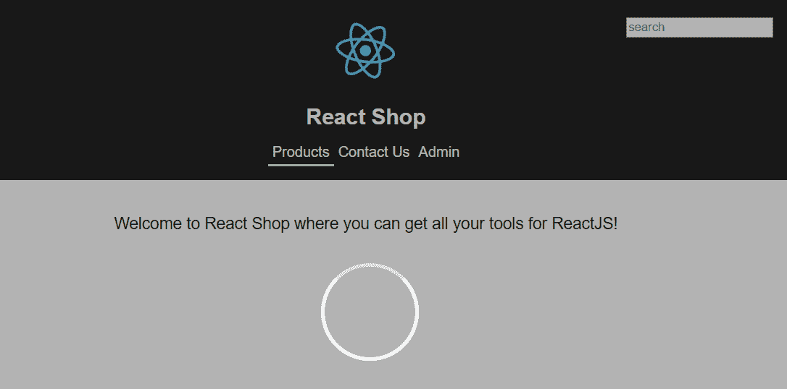
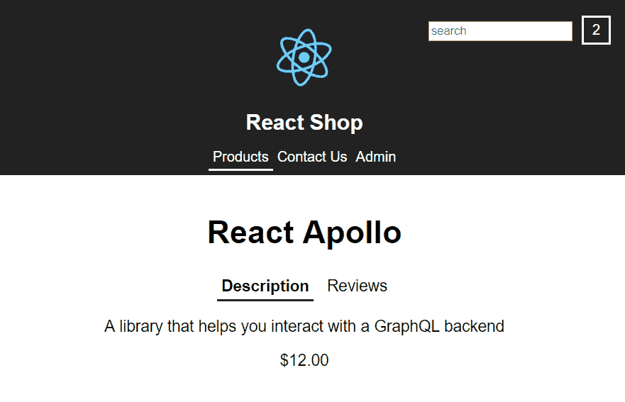
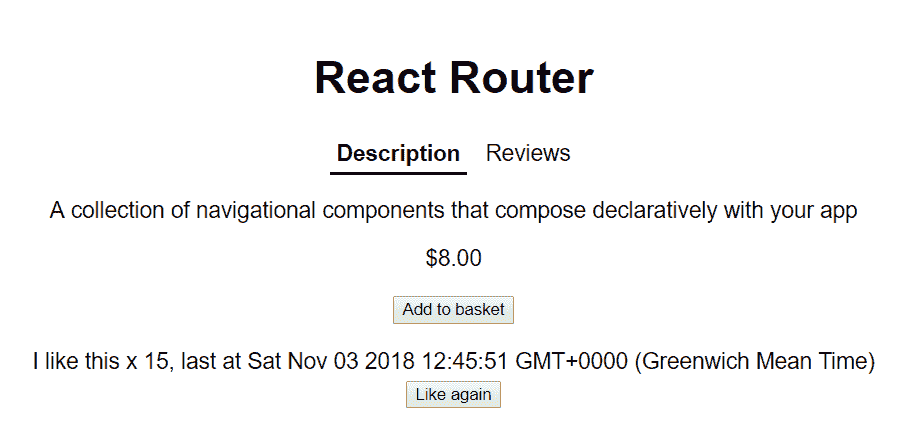

# 第八章：React Redux

到目前为止，在本书中，我们已经在 React 组件内部管理了状态。当状态需要在不同组件之间共享时，我们还使用了 React 上下文。这种方法对许多应用程序都很有效。React Redux 帮助我们强大地处理复杂的状态场景。当用户交互导致状态发生多个变化时，它会发挥作用，也许其中一些是有条件的，特别是当交互导致 web 服务调用时。当应用程序中存在大量共享状态时，它也非常有用。

在本章中，我们将继续构建我们的 React 商店，添加 React Redux 来帮助我们管理状态交互。最终，我们将在商店的页眉中添加一个购物篮摘要组件，通知用户他们的购物篮中有多少件商品。Redux 将帮助我们在商品添加到购物篮时更新此组件。

在本章的最后一节中，我们将探讨一种类似于 Redux 的方法，用于在组件内部管理复杂状态。这是在 Redux 存储中管理状态和仅在组件内部使用`setState`或`useState`之间的中间地带。

在本章中，我们将学习以下主题：

+   原则和关键概念

+   安装 Redux

+   创建 reducers

+   创建动作

+   创建存储

+   将我们的 React 应用连接到存储

+   使用 useReducer 管理状态

# 技术要求

在本章中，我们将使用以下技术：

+   **Node.js 和** `npm`：TypeScript 和 React 依赖于这些。我们可以从[`nodejs.org/en/download/`](https://nodejs.org/en/download/)安装这些。如果我们已经安装了这些，请确保`npm`至少是 5.2 版本。

+   **Visual Studio Code**：我们需要一个编辑器来编写我们的 React 和 TypeScript 代码，可以从[`code.visualstudio.com/`](https://code.visualstudio.com/)安装。我们还需要在 Visual Studio Code 中安装 TSLint（由 egamma 提供）和 Prettier（由 Estben Petersen 提供）扩展。

+   **React 商店**：我们将从上一章完成的 React 商店项目开始。该项目可以在 GitHub 上找到[`github.com/carlrip/LearnReact17WithTypeScript/tree/master/07-WorkingWithForms/04-FormSubmission`](https://github.com/carlrip/LearnReact17WithTypeScript/tree/master/07-WorkingWithForms/04-FormSubmission)。

为了从上一章恢复代码，可以下载[`github.com/carlrip/LearnReact17WithTypeScript`](https://github.com/carlrip/LearnReact17WithTypeScript)上的`LearnReact17WithTypeScript`存储库。然后可以在 Visual Studio Code 中打开相关文件夹，然后在终端中输入`npm install`进行恢复。本章中的所有代码片段都可以在[`github.com/carlrip/LearnReact17WithTypeScript/tree/master/08-ReactRedux%EF%BB%BF`](https://github.com/carlrip/LearnReact17WithTypeScript/tree/master/08-ReactRedux%EF%BB%BF)上找到。

# 原则和关键概念

在本节中，我们将首先介绍 Redux 中的三个原则，然后深入探讨核心概念。

# 原则

让我们来看看 Redux 的三个原则：

+   **唯一数据源**：这意味着整个应用程序状态存储在一个对象中。在真实的应用程序中，该对象可能包含复杂的嵌套对象树。

+   **状态是只读的**：这意味着状态不能直接更改。这有点像说我们不能直接更改组件内的状态。在 Redux 中，更改状态的唯一方法是分派所谓的动作。

+   更改是通过纯函数进行的：负责更改状态的函数称为 reducers。

在接下来的章节中，我们将更深入地了解动作和 reducers，以及管理它们的东西，即所谓的**store**。

# 关键概念

应用程序的整个状态存储在所谓的**store**中。状态存储在一个 JavaScript 对象中，如下所示：

```jsx
{
  products: [{ id: 1, name: "Table", ...}, {...}, ...],
  productsLoading: false,
  currentProduct: { id: 2, xname: "Chair", ... },
  basket: [{ product: { id: 2, xname: "Chair" }, quantity: 1 }],
};
```

在这个例子中，单个对象包含以下内容：

+   产品数组

+   产品是否正在从 Web API 中获取

+   用户正在查看的当前产品

+   用户购物篮中的物品

状态不包含任何函数、设置器或任何获取器。它是一个简单的 JavaScript 对象。存储还协调 Redux 中的所有移动部分。这包括通过 reducers 推送动作来更新状态。

因此，要更新存储中的状态，首先需要分派一个**action**。动作是另一个简单的 JavaScript 对象，如下所示：

```jsx
{
  type: "PRODUCTS/LOADING"
}
```

`type`属性确定需要执行的操作类型。这是操作的一个重要且必需的部分。如果操作对象中没有`type`，reducer 将不知道如何更改状态。在前面的示例中，操作除了`type`属性之外没有包含任何其他内容。这是因为 reducer 不需要其他信息来为此类型的操作更改状态。

以下示例是另一个操作：

```jsx
{
  type: "PRODUCTS/GETSINGLE",
  product: { id: 1, name: "Table", ...}
}
```

这次，在操作中包含了一个`product`属性的额外信息。reducer 需要这些额外信息来为此类型的操作更改状态。

因此，reducer 是实际更改状态的纯函数。

纯函数对于给定的一组参数总是返回相同的结果。因此，这些函数不依赖于函数范围之外的任何状态，而这些状态没有传递到函数中。纯函数也不会改变函数范围之外的任何状态。

以下是 reducer 的一个示例：

```jsx
export const productsReducer = (state = initialProductState, action) => {
  switch (action.type) {
    case "PRODUCTS/LOADING": {
      return {
        ...state,
        productsLoading: true
      };
    }
    case "PRODUCTS/GETSINGLE": {
      return {
        ...state,
        currentProduct: action.product,
        productsLoading: false
      };
    }
    default:
  }
  return state || initialProductState;
};
```

以下是关于 reducer 的一些内容：

+   reducer 接受当前状态和正在执行的操作这两个参数。

+   当首次调用 reducer 时，状态参数默认为初始状态对象

+   在操作类型上使用 switch 语句，并为其每个分支创建一个新的状态对象

+   为了创建新状态，我们将当前状态扩展到一个新对象中，然后用已更改的属性覆盖它

+   新状态是从 reducer 返回的

您会注意到我们刚刚看到的操作和 reducer 没有 TypeScript 类型。显然，在我们在接下来的章节中实现这些时，我们将包含必要的类型。

因此，现在我们已经开始了解 Redux 是什么，是时候在我们的 React 商店中实践这一点了。

# 安装 Redux

在我们可以使用 Redux 之前，我们需要安装它以及 TypeScript 类型。我们还将安装一个名为`redux-thunk`的额外库，这是为了实现异步操作而需要的：

1.  如果我们还没有的话，让我们从上一章结束的地方在 Visual Studio Code 中打开我们的 React 商店项目。因此，让我们在终端中通过`npm`安装核心 Redux 库：

```jsx
npm install redux
```

请注意，核心 Redux 库中包含了 TypeScript 类型。因此，不需要额外安装这些类型。

1.  让我们现在安装 Redux 的 React 特定部分。这些部分允许我们将 React 组件连接到 Redux 存储。让我们通过`npm`安装这些部分：

```jsx
npm install react-redux
```

1.  让我们也安装`react-redux`的 TypeScript 类型：

```jsx
npm install --save-dev @types/react-redux
```

1.  让我们也安装`redux-thunk`：

```jsx
npm install redux-thunk
```

1.  最后，我们可以安装`redux-thunk`的 TypeScript 类型：

```jsx
npm install --save-dev @types/redux-thunk
```

现在所有 Redux 部分都已安装，我们可以在下一节中将 Redux 添加到我们一直在开发的 React 商店中。

# 创建操作

我们将扩展我们在之前章节中构建的 React 商店，并添加 Redux 来管理`Products`页面上的状态。在本节中，我们将创建操作来开始将产品添加到页面的过程。将有一个操作来获取产品。将有另一个操作来改变一些新的加载状态，最终我们将把它与我们项目中已经拥有的`withLoading` HOC 联系起来。

在我们开始编写 Redux 操作之前，让我们在`ProductsData.ts`中创建一个虚拟 API 来获取产品：

```jsx
export const getProducts = async (): Promise<IProduct[]> => {
  await wait(1000);
  return products;
};
```

因此，该函数在返回产品之前会异步等待一秒钟。

我们需要通过创建一些类型来开始实现我们的操作。我们将在下一步完成这个步骤。

# 创建状态和操作类型

现在是时候开始使用 Redux 来增强我们的 React 商店了。我们将首先为 Redux 存储创建一些状态和操作类型：

1.  让我们在`src`文件夹中创建一个名为`ProductsTypes.ts`的新文件，并在顶部添加以下导入语句：

```jsx
import { IProduct } from "./ProductsData";
```

1.  让我们为我们将要实现的两种不同操作类型创建一个枚举：

```jsx
export enum ProductsActionTypes {
  GETALL = "PRODUCTS/GETALL",
  LOADING = "PRODUCTS/LOADING"
}
```

Redux 不规定操作类型字符串的格式。因此，操作类型字符串的格式是我们的选择。但是，我们需要确保这些字符串在存储中的操作类型中是唯一的。因此，我们在字符串中包含了两个信息：

+   操作涉及的存储区域。在我们的情况下，这是`PRODUCTS`。

+   该区域内的特定操作。在我们的情况下，我们有`GETALL`用于获取所有产品，`LOADING`用于指示产品正在被获取。

我们可以选择`PRODUCTS`-`GETALL`或`Get All Products`。我们只需要确保字符串是唯一的。我们使用枚举来在实现操作和减速器时给我们良好的 IntelliSense。

1.  现在我们可以为这两个操作创建接口：

```jsx
export interface IProductsGetAllAction {
  type: ProductsActionTypes.GETALL,
  products: IProduct[]
}

export interface IProductsLoadingAction {
  type: ProductsActionTypes.LOADING
}
```

`IProductsGetAllAction`接口用于在需要获取产品时分派的动作。`IProductsLoadingAction`接口用于导致减速器改变加载状态的动作。

1.  让我们将动作类型与联合类型结合在一起：

```jsx
export type ProductsActions =
  | IProductsGetAllAction
  | IProductsLoadingAction
```

这将是传递给减速器的动作参数的类型。

1.  最后，让我们在存储中为这个状态区域创建一个接口：

```jsx
export interface IProductsState {
  readonly products: IProduct[];
  readonly productsLoading: boolean;
}
```

因此，我们的状态将包含一个产品数组，以及产品是否正在加载。

请注意，属性前缀带有`readonly`关键字。这将帮助我们避免直接更改状态。

现在我们已经为动作和状态准备好了类型，我们可以在下一节中创建一些动作。

# 创建动作

在这一节中，我们将创建两个动作，用于获取产品并指示产品正在加载。

1.  让我们从创建一个带有以下导入语句的`ProductsActions.ts`文件开始：

```jsx
import { ActionCreator, AnyAction, Dispatch } from "redux";
```

这些是我们在实现动作时将要使用的 Redux 中的一些类型。

1.  我们的动作之一将是异步的。因此，让我们从`redux-thunk`中导入一个类型，以便在实现此动作时准备好：

```jsx
import { ThunkAction } from "redux-thunk";
```

1.  让我们添加另一个导入语句，以便我们可以使用我们的虚假 API：

```jsx
import { getProducts as getProductsFromAPI } from "./ProductsData";
```

我们将 API 函数重命名为`getProductsFromAPI`，以避免名称冲突，因为我们将稍后创建一个名为`getProducts`的动作。

1.  让我们还导入上一节中创建的类型：

```jsx
import { IProductsGetAllAction, IProductsLoadingAction, IProductsState, ProductsActionTypes } from "./ProductsTypes";
```

1.  我们现在要创建一个称为动作创建者的东西。动作创建者就像它的名字一样：它是一个创建并返回动作的函数！让我们为创建产品加载动作创建一个动作创建者：

```jsx
const loading: ActionCreator<IProductsLoadingAction> = () => {
  return {
    type: ProductsActionTypes.LOADING
  }
};
```

+   我们使用包含适当动作接口的泛型`ActionCreator`类型来定义函数签名

+   该函数简单地返回所需的动作对象

我们可以使用隐式返回语句更简洁地编写这个函数，如下所示：

```jsx
const loading: ActionCreator<IProductsLoadingAction> = () => ({
  type: ProductsActionTypes.LOADING
});
```

在实现动作创建者时，我们将使用这种更短的语法。

1.  让我们继续实现获取产品的动作创建者。这更复杂，所以让我们从函数签名开始：

```jsx
export const getProducts: ActionCreator<ThunkAction<Promise<AnyAction>, IProductsState, null, IProductsGetAllAction>> = () => {};
```

我们再次使用泛型`ActionCreator`类型，但这次它包含的不仅仅是最终返回的动作接口。这是因为这个特定的动作是异步的。

我们在`ActionCreator`中使用`ThunkAction`进行异步操作，这是一个具有四个参数的泛型类型：

+   第一个参数是返回类型，理想情况下应该是`Promise<IProductsGetAllAction>`。但是，TypeScript 编译器很难解析这一点，因此我们选择了稍微宽松一些的`Promise<AnyAction>`类型。

+   第二个参数是动作所关注的状态接口。

+   第三个参数是传递给动作创建者的参数类型，在我们的情况下是`null`，因为没有参数。

+   最后一个参数是动作的类型。

我们导出此动作创建者，因为最终将从`ProductsPage`组件中调用它。

1.  异步动作需要返回一个最终会分派我们的动作的异步函数：

```jsx
export const getProducts: ActionCreator<ThunkAction<Promise<AnyAction>, IProductsState, null, IProductsGetAllAction>> = () => {
  return async (dispatch: Dispatch) => {

 };
};
```

因此，该函数的第一件事是返回另一个函数，使用`async`关键字标记为异步。内部函数将调度程序从存储中作为参数。

1.  让我们实现内部函数：

```jsx
return async (dispatch: Dispatch) => {
  dispatch(loading());
 const products = await getProductsFromAPI();
 return dispatch({
 products,
 type: ProductsActionTypes.GETALL
 });
};
```

+   我们首先要做的是分派另一个动作，以便加载状态最终由 reducer 相应地更改

+   下一步是从虚拟 API 异步获取产品

+   最后一步是分派所需的动作

现在我们已经创建了一些动作，我们将在下一节中创建一个 reducer。

# 创建 reducer

Reducer 是一个负责为给定动作创建新状态的函数。因此，该函数接受当前状态的动作，并返回新状态。在本节中，我们将为产品创建两个动作的 reducer。

1.  让我们从创建一个名为`ProductsReducer.ts`的文件开始，其中包含以下导入语句：

```jsx
import { Reducer } from "redux";
import { IProductsState, ProductsActions, ProductsActionTypes } from "./ProductsTypes";
```

我们从 Redux 中导入`Reducer`类型以及我们之前创建的动作和状态的类型。

1.  接下来，我们需要定义初始状态是什么：

```jsx
const initialProductState: IProductsState = {
  products: [],
  productsLoading: false
};
```

因此，我们将产品设置为空数组，并将产品加载状态设置为`false`。

1.  我们现在可以开始创建 reducer 函数：

```jsx
export const productsReducer: Reducer<IProductsState, ProductsActions> = (
  state = initialProductState,
  action
) => {
 switch (action.type) {
  // TODO - change the state
 }
 return state;
};
```

+   我们使用 Redux 的`Reducer`泛型类型对函数进行了类型化，传入了我们的状态和动作类型。这为我们提供了很好的类型安全性。

+   该函数根据 Redux 所需的状态和动作参数。

+   状态默认为我们在上一步中设置的初始状态对象。

+   在函数的最后，如果动作类型在 switch 语句中没有被识别，我们将返回默认状态。

1.  让我们继续实现我们的 reducer：

```jsx
switch (action.type) {
  case ProductsActionTypes.LOADING: {
 return {
 ...state,
 productsLoading: true
 };
 }
 case ProductsActionTypes.GETALL: {
 return {
 ...state,
 products: action.products,
 productsLoading: false
 };
 }
}
```

我们为每个 action 实现了一个 switch 分支。两个分支都遵循相同的模式，通过返回一个新的状态对象，其中包含旧状态并合并了适当的属性。

这是我们的第一个 reducer 完成。在下一节中，我们将创建我们的 store。

# 创建一个 store

在本节中，我们将创建一个 store，用于保存我们的状态并管理动作和 reducer：

1.  让我们首先创建一个名为`Store.tsx`的新文件，并使用以下导入语句从 Redux 中获取我们需要的部分：

```jsx
import { applyMiddleware, combineReducers, createStore, Store } from "redux";
```

+   `createStore`是一个我们最终将用来创建我们的 store 的函数

+   我们需要`applyMiddleware`函数，因为我们需要使用 Redux Thunk 中间件来管理我们的异步动作

+   `combineReducers`函数是一个我们可以用来合并我们的 reducers 的函数

+   `Store`是一个我们可以用于 store 的 TypeScript 类型

1.  让我们导入`redux-thunk`：

```jsx
import thunk from "redux-thunk";
```

1.  最后，让我们导入我们的 reducer 和状态类型：

```jsx
import { productsReducer } from "./ProductsReducer";
import { IProductsState } from "./ProductsTypes";
```

1.  store 的一个关键部分是状态。因此，让我们为此定义一个接口：

```jsx
export interface IApplicationState {
  products: IProductsState;
}
```

此时，接口只包含了我们的产品状态。

1.  现在让我们把我们的 reducer 放到 Redux 的`combineReducer`函数中：

```jsx
const rootReducer = combineReducers<IApplicationState>({
  products: productsReducer
});
```

1.  有了状态和根 reducer 定义，我们可以创建我们的 store。实际上，我们要创建一个创建 store 的函数：

```jsx
export default function configureStore(): Store<IApplicationState> {
  const store = createStore(rootReducer, undefined, applyMiddleware(thunk));
  return store;
}
```

+   创建我们的 store 的函数被称为`configureStore`，并返回具有特定 store 状态的通用`Store`类型。

+   该函数使用 Redux 的`createStore`函数来创建并返回 store。我们传入我们的 reducer 以及 Redux Thunk 中间件。我们将`undefined`作为初始状态，因为我们的 reducer 会处理初始状态。

我们已经在我们的 store 上取得了很好的进展。在下一节中，我们将开始连接我们的 React 商店到我们的 store。

# 将我们的 React 应用连接到 store。

在本节中，我们将连接`Products`页面到我们的 store。第一步是添加 React Redux 的`Provider`组件，我们将在下一节中完成。

# 添加 store Provider 组件

`Provider`组件可以将 store 传递给其下的任何级别的组件。因此，在本节中，我们将在组件层次结构的顶部添加`Provider`，以便所有我们的组件都可以访问它：

1.  让我们打开我们现有的`index.tsx`并从 React Redux 中导入`Provider`组件：

```jsx
import { Provider} from "react-redux";
```

1.  让我们还从 React Redux 中导入`Store`类型：

```jsx
import { Store } from "redux";
```

1.  我们需要从我们的商店中导入以下内容：

```jsx
import configureStore from "./Store";
import { IApplicationState } from "./Store";
```

1.  然后我们将在导入语句之后创建一个小的函数组件：

```jsx
interface IProps {
  store: Store<IApplicationState>;
}
const Root: React.SFC<IProps> = props => {
  return ();
};
```

这个`Root`组件将成为我们的新根元素。它将我们的商店作为一个 prop。

1.  因此，我们需要在我们的新根组件中包含旧的根元素`Routes`：

```jsx
const Root: React.SFC<IProps> = props => {
  return (
    <Routes />
  );
};
```

1.  这个组件还需要添加另一件事，那就是来自 React Redux 的`Provider`组件：

```jsx
return (
  <Provider store={props.store}>
    <Routes />
  </Provider>
);
```

我们已经将`Provider`放在了组件树的顶部，并将我们的商店传递给它。

1.  完成我们的新根组件后，让我们更改我们的根渲染函数：

```jsx
const store = configureStore();
ReactDOM.render(<Root store={store} />, document.getElementById(
  "root"
) as HTMLElement);
```

我们首先使用我们的`configureStore`函数创建商店，然后将其传递给我们的`Root`组件。

因此，这是将我们的组件连接到商店的第一步。在下一节中，我们将完成对`ProductPage`组件的连接。

# 将组件连接到商店

我们即将看到我们增强的商店在行动中。在本节中，我们将连接我们的商店到几个组件。

# 将 ProductsPage 连接到商店

我们要连接到商店的第一个组件将是`ProductsPage`组件。

让我们打开`ProductsPage.tsx`并开始重构它：

1.  首先，让我们从 React Redux 中导入`connect`函数：

```jsx
import { connect } from "react-redux";
```

我们将在本节末尾使用`connect`函数将`ProductsPage`组件连接到商店。

1.  让我们从我们的商店中导入存储状态类型和`getProducts`动作创建者：

```jsx
import { IApplicationState } from "./Store";
import { getProducts } from "./ProductsActions";
```

1.  `ProductPage`组件现在不会包含任何状态，因为这将保存在 Redux 存储中。因此，让我们首先删除状态接口、静态`getDerivedStateFromProps`方法，以及构造函数。`ProductsPage`组件现在应该具有以下形状：

```jsx
class ProductsPage extends React.Component<RouteComponentProps> {
  public async componentDidMount() { ... }
  public render() { ... }
}
```

1.  现在，数据将通过 props 从商店中获取。因此，让我们重构我们的 props 接口：

```jsx
interface IProps extends RouteComponentProps {
 getProducts: typeof getProducts;
 loading: boolean;
 products: IProduct[];
}

class ProductsPage extends React.Component<IProps> { ... }
```

因此，我们将从商店传递以下数据到我们的组件：

+   `getProducts`动作创建者

+   一个名为`loading`的标志，指示产品是否正在被获取

+   产品数组

1.  因此，让我们调整`componentDidMount`生命周期方法，以调用`getProducts`动作创建者来开始获取产品的过程：

```jsx
public componentDidMount() {
  this.props.getProducts();
}
```

1.  我们不再直接引用`ProductsData.ts`中的`products`数组。因此，让我们从输入语句中删除它，使其如下所示：

```jsx
import { IProduct } from "./ProductsData";
```

1.  我们仍然看不到我们以前使用的`search`状态。现在我们将在`render`方法开始时获取它，而不是在状态中存储它：

```jsx
public render() {
  const searchParams = new URLSearchParams(this.props.location.search);
 const search = searchParams.get("search") || "";
  return ( ... );
}
```

1.  让我们留在`render`方法中，替换旧的`state`引用：

```jsx
<ul className="product-list">
  {this.props.products.map(product => {
    if (!search || (search && product.name.toLowerCase().indexOf(search.toLowerCase()) > -1)
    ) { ... }
  })}
</ul>
```

1.  在类下面，但在导出语句之前，让我们创建一个函数，将来自存储的状态映射到组件属性：

```jsx
const mapStateToProps = (store: IApplicationState) => {
  return {
    loading: store.products.productsLoading,
    products: store.products.products
  };
};
```

因此，我们正在获取产品是否正在加载以及从存储中获取这些产品并将它们传递给我们的 props。

1.  我们还需要映射到另一个 prop，那就是`getProducts`函数 prop。让我们创建另一个函数，将这个操作从存储映射到组件中的函数 prop：

```jsx
const mapDispatchToProps = (dispatch: any) => {
  return {
    getProducts: () => dispatch(getProducts())
  };
};
```

1.  在文件底部还有一项工作要做。这是在导出之前，将 React Redux 的`connect` HOC 包装在我们的`ProductsPage`组件周围：

```jsx
export default connect(
 mapStateToProps,
 mapDispatchToProps
)(ProductsPage);
```

`connect` HOC 将组件连接到我们的存储，这是由组件树中更高级别的`Provider`组件提供给我们的。`connect` HOC 还调用映射函数，将存储中的状态和操作创建者映射到组件属性中。

1.  现在终于是时候尝试我们增强的页面了。让我们通过终端启动开发服务器和应用程序：

```jsx
npm start
```

我们应该发现页面的行为与以前完全相同。唯一的区别是现在状态是在我们的 Redux 存储中管理的。

在下一节中，我们将通过添加我们项目中已经拥有的加载旋转器来增强我们的产品页面。

# 将 ProductsPage 连接到加载存储状态。

在本节中，我们将向产品页面添加一个加载旋转器。在此之前，我们将把产品列表提取到自己的组件中。然后我们可以将`withLoader` HOC 添加到提取的组件中：

1.  让我们为提取的组件创建一个名为`ProductsList.tsx`的新文件，并导入以下内容：

```jsx
import * as React from "react";
import { Link } from "react-router-dom";
import { IProduct } from "./ProductsData";
import withLoader from "./withLoader";
```

1.  该组件将接受产品数组和搜索字符串的 props：

```jsx
interface IProps {
  products?: IProduct[];
  search: string;
}
```

1.  我们将称该组件为`ProductList`，它将是一个 SFC。让我们开始创建组件：

```jsx
const ProductsList: React.SFC<IProps> = props => {
  const search = props.search;
  return ();
};
```

1.  现在我们可以将`ProductsPage`组件 JSX 中的`ul`标签移动到我们新的`ProductList`组件的返回语句中：

```jsx
return (
  <ul className="product-list">
    {props.products &&
      props.products.map(product => {
        if (
          !search ||
          (search &&
            product.name.toLowerCase().indexOf(search.toLowerCase()) 
            > -1)
        ) {
          return (
            <li key={product.id} className="product-list-item">
              <Link to={`/products/${product.id}`}>{product.name}
              </Link>
            </li>
          );
        } else {
          return null;
        }
      })}
  </ul>
);
```

请注意，在移动 JSX 后，我们会删除对`this`的引用。

1.  完成`ProductList`组件后，让我们将其导出并使用我们的`withLoader`HOC 包装：

```jsx
export default withLoader(ProductsList);
```

1.  让我们更改`ProductPage.tsx`中的返回语句以引用提取的组件：

```jsx
return (
  <div className="page-container">
    <p>
      Welcome to React Shop where you can get all your tools for ReactJS!
    </p>
    <ProductsList
 search={search}
 products={this.props.products}
 loading={this.props.loading}
 />
  </div>
);
```

1.  我们不要忘记引入已引用的`ProductsList`组件：

```jsx
import ProductsList from "./ProductsList";
```

1.  最后，我们可以在`ProductsPage.tsx`中删除导入的`Link`组件，因为它不再被引用。

如果我们转到正在运行的应用程序并浏览到产品页面，我们现在应该看到产品加载时的加载旋转器：



因此，我们的产品页面现在已经很好地连接到了 Redux 存储。在下一节中，我们将把产品页面连接到存储。

# 将产品状态和操作添加到存储

将`ProductPage`组件连接到我们的存储首先需要在我们的存储中进行一些工作。我们需要额外的状态来存储当前产品，以及它是否已添加到购物篮中。我们还需要额外的操作和减速器代码来获取产品并将其添加到购物篮中：

1.  首先，在`ProductsTypes.ts`中为当前产品添加额外的状态：

```jsx
export interface IProductsState {
  readonly currentProduct: IProduct | null;
  ...
}
```

1.  当我们在`ProductTypes.ts`中时，让我们添加获取产品的操作类型：

```jsx
export enum ProductsActionTypes {
  GETALL = "PRODUCTS/GETALL",
  GETSINGLE = "PRODUCTS/GETSINGLE",
  LOADING = "PRODUCTS/LOADING"
}
```

1.  让我们还为获取产品添加操作类型：

```jsx
export interface IProductsGetSingleAction {
  type: ProductsActionTypes.GETSINGLE;
  product: IProduct;
}
```

1.  然后，我们可以将此操作类型添加到我们的联合操作类型中：

```jsx
export type ProductsActions = IProductsGetAllAction| IProductsGetSingleAction | IProductsLoadingAction;
```

1.  让我们继续在`ProductsActions.ts`中创建新的操作创建者。首先，让我们导入我们的虚假 API 以获取产品：

```jsx
import { getProduct as getProductFromAPI, getProducts as getProductsFromAPI} from "./ProductsData";
```

1.  然后我们可以导入我们需要实现的操作创建者的类型：

```jsx
import { IProductsGetAllAction, IProductsGetSingleAction, IProductsLoadingAction, IProductsState, ProductsActionTypes } from "./productsTypes";
```

1.  让我们实现获取产品的操作创建者：

```jsx
export const getProduct: ActionCreator<ThunkAction<Promise<any>, IProductsState, null, IProductsGetSingleAction>> = (id: number) => {
  return async (dispatch: Dispatch) => {
    dispatch(loading());
    const product = await getProductFromAPI(id);
    dispatch({
      product,
      type: ProductsActionTypes.GETSINGLE
    });
  };
};
```

这与`getProducts`操作创建者非常相似。结构上唯一的区别是操作创建者接受产品 ID 的参数。

1.  现在转到`ProductsReducer.ts`中的减速器。首先在初始状态中将当前产品设置为 null：

```jsx
const initialProductState: IProductsState = {
  currentProduct: null,
  ...
};
```

1.  在`productReducer`函数中，让我们为我们的新操作类型在 switch 语句中添加一个分支：

```jsx
switch (action.type) {
  ...
  case ProductsActionTypes.GETSINGLE: {
 return {
 ...state,
 currentProduct: action.product,
 productsLoading: false
 };
 }
}
```

我们将旧状态扩展到一个新对象中，覆盖当前项目，并将加载状态设置为`false`。

因此，这是产品页面在 Redux 存储中需要的一些状态管理。但是，我们还没有在我们的存储中管理购物篮。我们将在下一节中完成这一点。

# 将购物篮状态和操作添加到存储中

在这一部分，我们将为我们的购物篮添加状态管理。我们将在我们的存储中创建一个新的部分。

1.  首先，让我们创建一个名为`BasketTypes.ts`的类型的新文件，内容如下：

```jsx
import { IProduct } from "./ProductsData";

export enum BasketActionTypes {
  ADD = "BASKET/ADD"
}

export interface IBasketState {
  readonly products: IProduct[];
}

export interface IBasketAdd {
  type: BasketActionTypes.ADD;
  product: IProduct;
}

export type BasketActions = IBasketAdd;
```

+   我们的购物篮中只有一个状态，那就是购物篮中产品的数组。

+   同样也只有一个动作。这是将产品添加到购物篮中。

1.  让我们创建一个名为`BasketActions.ts`的文件，内容如下：

```jsx
import { BasketActionTypes, IBasketAdd } from "./BasketTypes";
import { IProduct } from "./ProductsData";

export const addToBasket = (product: IProduct): IBasketAdd => ({
  product,
  type: BasketActionTypes.ADD
});
```

这是用于添加到购物篮的动作创建者。该函数接受一个产品，并在具有适当动作类型的动作中返回它。

1.  现在到了减速器。让我们创建一个名为`BasketReducer.ts`的文件，其中包含以下导入语句：

```jsx
import { Reducer } from "redux";
import { BasketActions, BasketActionTypes, IBasketState } from "./BasketTypes";
```

1.  让我们为初始购物篮状态创建一个对象：

```jsx
const initialBasketState: IBasketState = {
  products: []
};
```

1.  现在让我们创建减速器：

```jsx
export const basketReducer: Reducer<IBasketState, BasketActions> = (state = initialBasketState, action) => {
  switch (action.type) {
    case BasketActionTypes.ADD: {
      return {
        ...state,
        products: state.products.concat(action.product)
      };
    }
  }
  return state || initialBasketState;
};
```

这遵循与`productsReducer`相同的模式。

一个有趣的地方要注意的是，我们如何优雅地将`product`添加到`products`数组中，而不会改变原始数组。我们使用 JavaScript 的`concat`函数，它通过将原始数组与传入的参数合并来创建一个新数组。这是在减速器中使用的一个很好的函数，其中状态变化涉及向数组添加项目。

1.  现在让我们打开`Store.ts`并导入购物篮的新减速器和状态：

```jsx
import { basketReducer } from "./BasketReducer";
import { IBasketState } from "./BasketTypes";
```

1.  让我们将购物篮状态添加到存储中：

```jsx
export interface IApplicationState {
 basket: IBasketState;
```

```jsx
  products: IProductsState;
}
```

1.  现在我们有两个减速器。因此，让我们将购物篮减速器添加到`combineReducers`函数调用中：

```jsx
export const rootReducer = combineReducers<IApplicationState>({
  basket: basketReducer,
  products: productsReducer
});
```

现在我们已经调整了我们的存储，我们可以将我们的`ProductPage`组件连接到它。

# 将 ProductPage 连接到存储

在这一部分，我们将把`ProductPage`组件连接到我们的存储中：

1.  首先将以下内容导入到`ProductPage.tsx`中：

```jsx
import { connect } from "react-redux";
import { addToBasket } from "./BasketActions";
import { getProduct } from "./ProductsActions";
import { IApplicationState } from "./Store";
```

1.  现在我们要引用存储的`getProduct`，而不是来自`ProductsData.ts`的产品。因此，让我们从此导入中删除它，使其看起来像以下内容：

```jsx
import { IProduct } from "./ProductsData";
```

1.  接下来，让我们将状态移入属性：

```jsx
interface IProps extends RouteComponentProps<{ id: string }> {
  addToBasket: typeof addToBasket;
  getProduct: typeof getProduct;
  loading: boolean;
  product?: IProduct;
  added: boolean;
}

class ProductPage extends React.Component<IProps> { ... }
```

因此，在此移动之后，应该删除`IState`接口和`Props`类型。

1.  我们可以移除构造函数，因为我们现在不需要初始化任何状态。这一切都在存储中完成。

1.  让我们将`componentDidMount`生命周期方法更改为调用获取产品的动作创建者：

```jsx
public componentDidMount() {
  if (this.props.match.params.id) {
    const id: number = parseInt(this.props.match.params.id, 10);
    this.props.getProduct(id);
  }
}
```

请注意，我们还移除了`async`关键字，因为该方法不再是异步的。

1.  继续进行`render`函数，让我们将对状态的引用替换为对属性的引用：

```jsx
public render() {
  const product = this.props.product;
  return (
    <div className="page-container">
      <Prompt when={!this.props.added} message={this.navAwayMessage}
      />
      {product || this.props.loading ? (
        <Product
          loading={this.props.loading}
          product={product}
          inBasket={this.props.added}
          onAddToBasket={this.handleAddClick}
        />
      ) : (
        <p>Product not found!</p>
      )}
    </div>
  );
}
```

1.  现在让我们来看点击处理程序，并重构它以调用添加到购物篮的动作创建者：

```jsx
private handleAddClick = () => {
  if (this.props.product) {
    this.props.addToBasket(this.props.product);
  }
};
```

1.  现在进行连接过程的最后几个步骤。让我们实现将存储中的动作创建者映射到组件属性的函数：

```jsx
const mapDispatchToProps = (dispatch: any) => {
  return {
    addToBasket: (product: IProduct) => dispatch(addToBasket(product)),
    getProduct: (id: number) => dispatch(getProduct(id))
  };
};
```

1.  将状态映射到组件 prop 有点复杂。让我们从简单的映射开始：

```jsx
const mapStateToProps = (store: IApplicationState) => {
  return {
    basketProducts: store.basket.products,
    loading: store.products.productsLoading,
    product: store.products.currentProduct || undefined
  };
};
```

请注意，我们将 null 的`currentProduct`映射到`undefined`。

1.  我们需要映射的剩余 prop 是`added`。我们需要检查商店中的当前产品是否在购物篮状态中，以设置这个`boolean`值。我们可以使用产品数组中的`some`函数来实现这一点：

```jsx
const mapStateToProps = (store: IApplicationState) => {
  return {
    added: store.basket.products.some(p => store.products.currentProduct ? p.id === store.products.currentProduct.id : false),
    ...
  };
};
```

1.  最后一步是使用 React Redux 中的`connect` HOC 将`ProductPage`组件连接到商店：

```jsx
export default connect(
  mapStateToProps,
  mapDispatchToProps
)(ProductPage);
```

现在我们可以进入运行的应用程序，访问产品页面，并将其添加到购物篮中。点击“添加到购物篮”按钮后，该按钮应该消失。如果我们浏览到另一个产品，然后回到我们已经添加到购物篮中的产品，那么“添加到购物篮”按钮就不应该出现。

所以，现在我们的产品和产品页面都连接到了 Redux 商店。在下一节中，我们将创建一个购物篮摘要组件并将其连接到商店。

# 创建并连接 BasketSummary 到商店

在本节中，我们将创建一个名为`BasketSummary`的新组件。这将显示购物篮中的物品数量，并位于我们商店的右上角。以下截图显示了购物篮摘要将在屏幕右上角的样子：



1.  让我们创建一个名为`BasketSummary.tsx`的文件，内容如下：

```jsx
import * as React from "react";

interface IProps {
  count: number;
}

const BasketSummary: React.SFC<IProps> = props => {
  return <div className="basket-summary">{props.count}</div>;
};

export default BasketSummary;
```

这是一个简单的组件，它以一个 prop 的形式接收购物篮中产品的数量，并在一个带有`basket-summary` CSS 类的`div`中显示这个值。

1.  让我们在`index.css`中添加我们刚刚引用的 CSS 类：

```jsx
.basket-summary {
  display: inline-block;
  margin-left: 10px;
  padding: 5px 10px;
  border: white solid 2px;
}
```

1.  我们将把我们的购物篮摘要添加到我们的页眉组件中。所以，让我们把它导入到`Header.tsx`中：

```jsx
import BasketSummary from "./BasketSummary";
```

1.  让我们也从 React Redux 中导入`connect`函数：

```jsx
import { connect } from "react-redux";
```

1.  让我们也导入我们商店的状态类型：

```jsx
import { IApplicationState } from "./Store";
```

1.  为`Header`组件添加一个购物篮中产品数量的 prop：

```jsx
interface IProps extends RouteComponentProps {
 basketCount: number;
}

class Header extends React.Component<IProps, IState> { 
   public constructor(props: IProps) { ... }
   ...
}
```

我们将在这个组件中保持搜索状态为本地。

1.  现在让我们将`BasketSummary`组件添加到`Header`组件的 JSX 中：

```jsx
<header className="header">
  <div className="search-container">
    <input ... />
    <BasketSummary count={this.props.basketCount} />
  </div>
  ...
</header>
```

1.  下一步是将商店购物篮中的产品数量映射到`basketCount` prop：

```jsx
const mapStateToProps = (store: IApplicationState) => {
  return {
    basketCount: store.basket.products.length
  };
};
```

1.  最后，我们可以将`Header`组件连接到商店：

```jsx
export default connect(mapStateToProps)(withRouter(Header));
```

现在`Header`组件正在使用`BasketSummary`组件，并且也连接到商店，我们应该能够在运行的应用程序中添加产品到购物篮并看到购物篮摘要增加。

这样，这一部分关于将组件连接到商店的内容就完成了。我们已经将一些不同的组件连接到了商店，所以希望这个过程现在很清晰。

在下一节中，我们将探讨一种类似 Redux 的方法来管理组件内的状态。

# 使用 useReducer 管理状态

Redux 非常适合管理应用程序中的复杂状态。但是，如果我们要管理的状态只存在于单个组件中，那么它可能会有点重。显然，我们可以使用`setState`（对于类组件）或`useState`（对于函数组件）来管理这些情况。但是，如果状态很复杂怎么办？可能会有很多状态片段，状态交互可能涉及很多步骤，其中一些是异步的。在本节中，我们将探讨使用 React 中的`useReducer`函数来管理这些情况的方法。我们的示例将是人为的和简单的，但它将让我们了解这种方法。

我们将在我们的 React 商店的产品页面上添加一个喜欢按钮。用户可以多次喜欢一个产品。`Product`组件将跟踪喜欢的数量以及最后一次喜欢的日期和时间：



1.  我们将首先打开`Product.tsx`并在`Product`组件之前创建一个接口，用于我们的状态，包含喜欢的数量和最后一次喜欢的日期：

```jsx
interface ILikeState {
  likes: number;
  lastLike: Date | null;
}
```

1.  我们将创建一个变量来保存初始状态，也在`Product`之外：

```jsx
const initialLikeState: ILikeState = {
  likes: 0,
  lastLike: null
};
```

1.  现在让我们为这个动作创建一个类型：

```jsx
enum LikeActionTypes {
  LIKE = "LIKE"
}

interface ILikeAction {
  type: LikeActionTypes.LIKE;
  now: Date;
}
```

1.  我们还将创建一个包含所有动作类型的联合类型。在我们的示例中，我们只有一个动作类型，但让我们这样做以了解一个可扩展的方法：

```jsx
type LikeActions = ILikeAction;
```

1.  在`Product`组件内部，让我们在 React 中调用`useReducer`函数来获取我们的状态和`dispatch`函数：

```jsx
const [state, dispatch]: [
    ILikeState,
    (action: ILikeAction) => void
  ] = React.useReducer(reducer, initialLikeState);
```

让我们来分解一下：

+   我们传递给`useReducer`一个名为`reducer`的函数（我们还没有创建）。

+   我们还将我们的初始状态传递给`useReducer`。

+   `useReducer`返回一个包含两个元素的数组。第一个元素是当前状态，第二个是一个`dispatch`函数来调用一个动作。

1.  让我们重构这一行并解构状态，以便我们可以直接引用状态的片段：

```jsx
const [{ likes, lastLike }, dispatch]: [
    ILikeState,
    (action: ILikeAction) => void
  ] = React.useReducer(reducer, initialLikeState);
```

1.  在`Product`组件的 JSX 底部，让我们添加 JSX 来渲染我们有多少个喜欢和一个按钮来添加喜欢：

```jsx
{!props.inBasket && (
  <button onClick={handleAddClick}>Add to basket</button>
)}
<div className="like-container">
 {likes > 0 && (
 <div>{`I like this x ${likes}, last at ${lastLike}`}</div>
 )}
 <button onClick={handleLikeClick}>
 {likes > 0 ? "Like again" : "Like"}
 </button>
</div>
```

1.  让我们将刚刚引用的`like-container` CSS 类添加到`index.css`中：

```jsx
.like-container {
  margin-top: 20px;
}

.like-container button {
  margin-top: 5px;
}
```

1.  让我们也在 Like 按钮上实现点击处理程序：

```jsx
const handleLikeClick = () => {
  dispatch({ type: LikeActionTypes.LIKE, now: new Date() });
};
```

1.  我们的最后任务是在`Product`组件之外实现 reducer 函数，在`LikeActions`类型的下面：

```jsx
const reducer = (state: ILikeState = initialLikeState, action: LikeActions) => {
 switch (action.type) {
 case LikeActionTypes.LIKE:
 return { ...state, likes: state.likes + 1, lastLike: action.now };
 }
 return state;
};
```

如果我们尝试这样做，我们将在导航到产品页面后最初看到一个 Like 按钮。如果我们点击它，按钮文本会变成 Like，上面会出现一段文字，指示有多少个赞和上次点赞的时间。

这个实现感觉非常类似于在 Redux 存储中实现操作和 reducers，但这都是在一个组件内部。对于我们刚刚经历过的例子来说，这有点过度，但在我们需要管理更多状态片段的情况下可能会很有用。

# 总结

我们在本章开始时介绍了 Redux，学习了其原则和关键概念。我们了解到状态存储在一个单一对象中，并在分发 action 时通过称为 reducers 的纯函数进行更改。

我们在我们的 React 商店中创建了自己的 store 来将理论付诸实践。以下是我们在实现中学到的一些关键点：

+   为 action 类型创建枚举在引用它们时给我们提供了很好的智能感知。

+   使用接口定义 actions 可以提供很好的类型安全性，并允许我们创建一个 reducer 可以用于处理的 actions 的联合类型。

+   在状态接口中使用只读属性可以帮助我们避免直接改变状态。

+   同步 action 创建者只是简单地返回所需的 action 对象。

+   异步 action 创建者返回一个最终返回 action 对象的函数。

+   Reducer 包含了它处理的每种 action 类型的逻辑分支，通过将旧状态扩展到一个新对象中，然后用更改后的属性覆盖它来创建新状态。

+   Redux 的`createStore`函数创建了实际的 store。我们将所有的 reducer 合并在一起，还有 Redux Thunk 中间件来管理异步操作。

然后我们将一些组件连接到了 store。以下是这个过程中的关键点：

+   来自 React Redux 的`Provider`组件需要位于所有想要使用 store 的组件之上。它接收一个包含 store 的 prop。

+   然后，来自 React Redux 的`connect`高阶组件将单独的组件连接到 store。它接收两个参数，可以用于将状态和 action 创建者映射到组件 props。

在我们的 React 应用程序中实现 Redux 时，有很多要理解的细节。因为 Redux 强制我们将逻辑分解成易于理解和维护的单独部分，所以在状态管理复杂的情况下，Redux 会发挥作用。

我们学到，我们可以利用 React 的`useReducer`函数在单个组件中使用类似 Redux 的方法。当状态复杂且仅存在于单个组件中时，可以使用这种方法。

Redux 动作经常要做的一个任务是与 REST API 交互。在下一章中，我们将学习如何在基于类和基于函数的组件中与 REST API 交互。我们还将了解一个我们用来调用 REST API 的本地函数，以及一个流行的开源库。

# 问题

在结束本章之前，让我们用一些问题来测试我们的知识：

1.  action 对象中的`type`属性是必需的吗？这个属性需要被称为 type 吗？我们可以称其为其他名称吗？

1.  action 对象可以包含多少个属性？

1.  什么是 action creator？

1.  为什么我们在 React 商店应用程序中的 Redux 存储中需要 Redux Thunk？

1.  除了 Redux Thunk，我们还能用其他东西吗？

1.  在我们刚刚实现的`basketReducer`中，为什么我们不直接使用`push`函数将项目添加到购物篮状态中？也就是说，高亮显示的行有什么问题？

```jsx
export const basketReducer: Reducer<IBasketState, BasketActions> = (
  state = initialBasketState,
  action
) => {
  switch (action.type) {
    case BasketActionTypes.ADD: {
      state.products.push(action.product);
    }
  }
  return state || initialBasketState;
};
```

# 进一步阅读

以下链接是关于 React Redux 的更多信息的好资源：

+   Redux 在线文档非常值得阅读，网址是[`redux.js.org`](https://redux.js.org)。

+   除了这些核心 Redux 文档外，React Redux 文档也值得一看。这些文档位于[`react-redux.js.org/`](https://react-redux.js.org/)。

+   Redux Thunk GitHub 位于[`github.com/reduxjs/redux-thunk`](https://github.com/reduxjs/redux-thunk)。主页包含一些有用的信息和示例。
