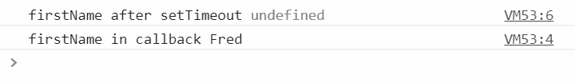
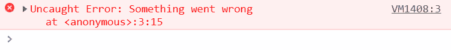
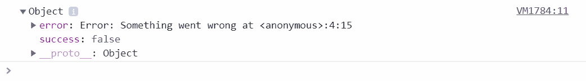
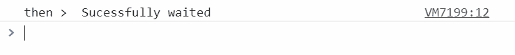
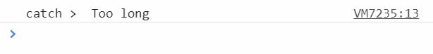
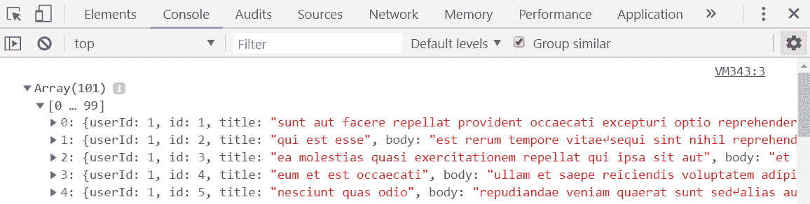
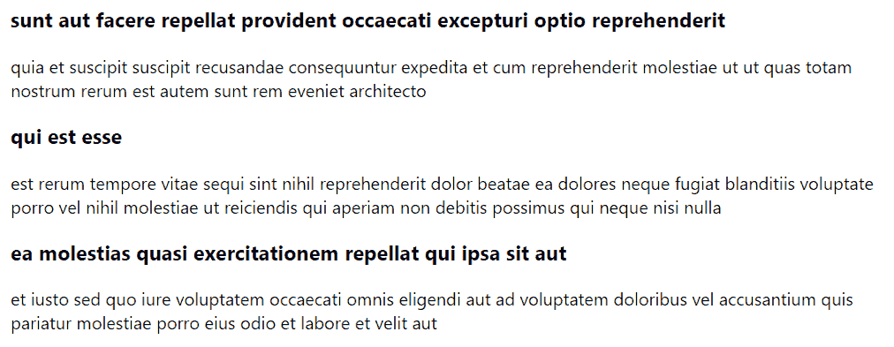

# 第九章：与 RESTful API 交互

与 RESTful API 交互是构建应用程序时我们需要做的非常常见的任务，它总是导致我们必须编写异步代码。因此，在本章的开始，我们将详细了解一般的异步代码。

有许多库可以帮助我们与 REST API 交互。在本章中，我们将看看原生浏览器函数和一个流行的开源库来与 REST API 交互。我们将发现开源库相对于原生函数的额外功能。我们还将看看如何在 React 类和基于函数的组件中与 REST API 交互。

在本章中，我们将学习以下主题：

+   编写异步代码

+   使用 fetch

+   使用 axios 与类组件

+   使用 axios 与函数组件

# 技术要求

在本章中，我们使用以下技术：

+   **TypeScript playground**：这是一个网站，位于[`www.typescriptlang.org/play/`](https://www.typescriptlang.org/play/)，允许我们在不安装任何东西的情况下玩耍异步代码。

+   **Node.js 和** `npm`：TypeScript 和 React 依赖于这些。我们可以从[`nodejs.org/en/download/`](https://nodejs.org/en/download/)安装这些。如果我们已经安装了这些，请确保`npm`至少是 5.2 版本。

+   **TypeScript**：可以通过终端中的以下命令使用`npm`安装：

```jsx
npm install -g typescript
```

+   **Visual Studio Code**。我们需要一个编辑器来编写我们的 React 和 TypeScript 代码，可以从[`code.visualstudio.com/`](https://code.visualstudio.com/)安装。我们还需要在 Visual Studio Code 中安装 TSLint (by egamma) 和 Prettier (by Estben Petersen) 扩展。

+   `jsonplaceholder.typicode.com`：我们将使用这个在线服务来帮助我们学习如何与 RESTful API 交互。

本章中的所有代码片段都可以在[`github.com/carlrip/LearnReact17WithTypeScript/tree/master/09-RestfulAPIs.`](https://github.com/carlrip/LearnReact17WithTypeScript/tree/master/09-RestfulAPIs)上找到

# 编写异步代码

TypeScript 代码默认是同步执行的，每行代码都会依次执行。然而，TypeScript 代码也可以是异步的，这意味着事情可以独立于我们的代码发生。调用 REST API 就是异步代码的一个例子，因为 API 请求是在我们的 TypeScript 代码之外处理的。因此，与 REST API 交互会迫使我们编写异步代码。

在本节中，我们将花时间了解在编写异步代码时可以采取的方法，然后再使用它们与 RESTful API 进行交互。我们将在下一节开始时看一下回调函数。

# 回调函数

回调是我们将作为参数传递给异步函数的函数，在异步函数完成时调用。在下一节中，我们将通过一个使用回调的异步代码示例进行说明。

# 回调执行

让我们在 TypeScript 播放器中通过一个使用回调的异步代码示例来进行说明。让我们输入以下代码：

```jsx
let firstName: string;
setTimeout(() => {
  firstName = "Fred";
  console.log("firstName in callback", firstName);
}, 1000);
console.log("firstName after setTimeout", firstName); 
```

该代码调用了 JavaScript 的`setTimeout`函数，这是一个异步函数。它以回调作为第一个参数，并以执行应等待的毫秒数作为第二个参数。

我们使用箭头函数作为回调函数，在其中将`firstName`变量设置为"Fred"并将其输出到控制台。我们还在调用`setTimeout`后立即在控制台中记录`firstName`。

那么，哪个`console.log`语句会首先执行呢？如果我们运行代码并查看控制台，我们会看到最后一行首先执行：



关键点在于，在调用`setTimeout`之后，执行会继续到下一行代码。执行不会等待回调被调用。这可能会使包含回调的代码比同步代码更难阅读，特别是当我们在回调中嵌套回调时。许多开发人员称之为**回调地狱**！

那么，我们如何处理异步回调代码中的错误？我们将在下一节中找出答案。

# 处理回调错误

在本节中，我们将探讨在使用回调代码时如何处理错误：

1.  让我们从在 TypeScript 播放器中输入以下代码开始：

```jsx
try {
 setTimeout(() => {
 throw new Error("Something went wrong");
 }, 1000);
} catch (ex) {
 console.log("An error has occurred", ex); 
}
```

我们再次使用`setTimeout`来尝试回调。这次，在回调函数内抛出一个错误。我们希望使用`try / catch`来捕获回调外部的错误，围绕`setTimeout`函数。

如果我们运行代码，我们会发现我们没有捕获错误：



1.  我们必须在回调函数内处理错误。因此，让我们将我们的示例调整为以下内容：

```jsx
interface IResult {
  success: boolean;
  error?: any;
}
let result: IResult = { success: true };
setTimeout(() => {
  try {
    throw new Error("Something went wrong");
  } catch (ex) {
    result.success = false;
    result.error = ex;
  }
}, 1000);
console.log(result);
```

这次，`try / catch`在回调函数内。我们使用一个变量`result`来确定回调是否成功执行，以及任何错误。`IResult`接口为我们提供了对结果`变量`的良好类型安全性。

如果我们运行这段代码，我们将看到我们成功处理了错误：



因此，处理错误以及读取基于回调的代码是一个挑战。幸运的是，有替代方法来处理这些挑战，我们将在接下来的部分中介绍。

# 承诺

promise 是一个 JavaScript 对象，它代表异步操作的最终完成（或失败）及其结果值。接下来，我们将看一个消耗基于 promise 的函数的示例，然后创建我们自己的基于 promise 的函数。

# 消耗基于 promise 的函数

让我们快速看一下一些暴露了基于 promise 的 API 的代码：

```jsx
fetch("https://jsonplaceholder.typicode.com/posts")
  .then(response => response.json()) 
  .then(data => console.log(data))
  .catch(json => console.log("error", json));
```

+   这个函数是用于与 RESTful API 交互的本机 JavaScript `fetch`函数

+   该函数接受一个用于请求的 URL。

+   它有一个`then`方法来处理响应和读取响应主体

+   它有一个`catch`方法来处理任何错误

代码执行流程与我们阅读的方式相同。我们还不必在`then`方法中做任何额外的工作来处理错误。因此，这比使用基于回调的异步代码要好得多。

在下一节中，我们将创建我们自己的基于 promise 的函数。

# 创建一个基于 promise 的函数

在本节中，我们将创建一个`wait`函数，以异步等待传递的毫秒数：

1.  让我们在 TypeScript playground 中输入以下内容：

```jsx
const wait = (ms: number) => {
  return new Promise((resolve, reject) => {
    if (ms > 1000) {
      reject("Too long");
    }
    setTimeout(() => {
      resolve("Sucessfully waited");
    }, ms);
  });
};
```

+   该函数开始通过返回一个`Promise`对象，该对象将需要异步执行的函数作为其构造函数参数

+   `promise`函数接受一个`resolve`参数，这是一个在函数执行完成时调用的函数

+   promise 函数还接受一个`reject`参数，这是一个在函数出错时调用的函数

+   在内部，我们使用带有回调的`setTimeout`来进行实际的等待

1.  让我们消费我们基于 promise 的`wait`函数：

```jsx
wait(500)
 .then(result => console.log("then >", result))
 .catch(error => console.log("catch >", error));
```

该函数只是在等待 500 毫秒后将结果或错误输出到控制台。

因此，让我们尝试运行它：



正如我们所看到的，控制台中的输出表明`then`方法被执行了。

1.  如果我们用大于 1000 的参数调用`wait`函数，`catch`方法应该被调用。让我们试一试：

```jsx
wait(1500)
 .then(result => console.log("then >", result))
 .catch(error => console.log("catch >", error));
```

如预期的那样，`catch`方法被执行：



因此，promise 给了我们一种很好的编写异步代码的方式。然而，在本书的早期我们已经使用了另一种方法。我们将在下一节中介绍这种方法。

# 异步和等待

`async`和`await`是两个 JavaScript 关键字，我们可以使用它们使异步代码的阅读几乎与同步代码相同：

1.  让我们看一个例子，消费我们在上一节中创建的`wait`函数，将以下代码输入到 TypeScript playground 中，放在`wait`函数声明之后：

```jsx
const someWork = async () => {
  try {
    const result = await wait(500); 
    console.log(result);
  } catch (ex) {
    console.log(ex);
  }
};

someWork();
```

+   我们创建了一个名为`someWork`的箭头函数，并用`async`关键字标记为异步。

+   然后我们调用带有`await`关键字前缀的`wait`。这会暂停下一行的执行，直到`wait`完成。

+   `try / catch`将捕获任何错误。

因此，代码非常类似于您在同步方式下编写的方式。

如果我们运行这个例子，我们会得到确认，`try`分支中的`console.log`语句等待`wait`函数完全完成后才执行：


1.  让我们将等待时间改为`1500`毫秒：

```jsx
const result = await wait(1500); 
```

如果我们运行这个，我们会看到一个错误被引发并捕获：


因此，`async`和`await`使我们的代码易于阅读。在 TypeScript 中使用这些的一个好处是，代码可以被转译以在旧版浏览器中运行。例如，我们可以使用`async`和`await`编码，同时支持 IE。

现在我们对编写异步代码有了很好的理解，我们将在接下来的章节中将其付诸实践，当我们与 RESTful API 交互时。

# 使用 fetch

`fetch`函数是一个原生的 JavaScript 函数，我们可以用它来与 RESTful API 交互。在本节中，我们将通过`fetch`进行一些常见的 RESTful API 交互，从获取数据开始。在本节中，我们将与出色的`JSONPlaceholder` REST API 进行交互。

# 使用 fetch 获取数据

在本节中，我们将使用`fetch`从`JSONPlaceholder` REST API 获取一些帖子，从基本的`GET`请求开始。

# 基本的 GET 请求

让我们打开 TypeScript playground 并输入以下内容：

```jsx
fetch("https://jsonplaceholder.typicode.com/posts")
  .then(response => response.json())
  .then(data => console.log(data));
```

以下是一些关键点：

+   `fetch`函数中的第一个参数是请求的 URL

+   `fetch`是一个基于承诺的函数

+   第一个`then`方法处理响应

+   第二个`then`方法处理当响应体已解析为 JSON 时

如果我们运行代码，应该会在控制台输出一个帖子数组：



# 获取响应状态

我们经常需要检查请求的状态。我们可以这样做：

```jsx
fetch("https://jsonplaceholder.typicode.com/posts").then(response => {
  console.log(response.status, response.ok); 
});
```

+   响应的`status`属性给出了响应的 HTTP 状态码

+   响应的`ok`属性是一个`boolean`，返回 HTTP 状态码是否在 200 范围内

如果我们运行先前的代码，我们会在控制台得到 200 和 true 的输出。

让我们尝试一个帖子不存在的示例请求：

```jsx
fetch("https://jsonplaceholder.typicode.com/posts/1001").then(response => {
  console.log(response.status, response.ok); 
});
```

如果我们运行上述代码，我们会在控制台得到 404 和 false 的输出。

# 处理错误

使用基于承诺的函数，我们在`catch`方法中处理错误：

```jsx
fetch("https://jsonplaceholder.typicode.com/posts")
  .then(response => response.json())
  .then(data => console.log(data))
  .catch(json => console.log("error", json));
```

然而，`catch`方法不会捕获不在 200 范围内的响应。在先前的示例中，我们得到了响应状态码为 404。因此，HTTP 错误状态码可以在第一个`then`方法中处理，而不是`catch`方法。

那么，`catch`方法是用来做什么的？答案是捕获网络错误。

这就是使用`fetch`获取数据的方法。在下一节中，我们将介绍发布数据。

# 使用 fetch 创建数据

在本节中，我们将使用`fetch`来使用`JSONPlaceholder` REST API 创建一些数据。

# 基本的 POST 请求

通过 REST API 创建数据通常涉及使用 HTTP `POST`方法，并将要创建的数据放在请求体中。

让我们打开 TypeScript playground 并输入以下内容：

```jsx
fetch("https://jsonplaceholder.typicode.com/posts", {
  method: "POST",
  body: JSON.stringify({
    title: "Interesting post",
    body: "This is an interesting post about ...",
    userId: 1
  })
})
  .then(response => {
    console.log(response.status); 
    return response.json();
  })
  .then(data => console.log(data));
```

`fetch`调用与获取数据的方式基本相同。关键区别在于第二个参数，它是一个包含请求的方法和主体的选项对象。还要注意主体需要是一个`string`。

如果我们运行上述代码，我们将在控制台中得到 201 和包含生成的帖子 ID 的对象。

# 请求 HTTP 标头

我们经常需要在请求中包含 HTTP 标头。我们可以在`options`对象中的`headers`属性中指定这些内容：

```jsx

fetch("https://jsonplaceholder.typicode.com/posts", {
 method: "POST",
 headers: {
 "Content-Type": "application/json",
 Authorization: "bearer some-bearer-token"
 },
  body: JSON.stringify({
    title: "Interesting post",
    body: "This is an interesting post about ...",
    userId: 1
  })
})
  .then(response => {
    console.log(response.status); 
    return response.json();
  })
  .then(data => console.log(data));

```

请求标头可以用于任何 HTTP 方法，而不仅仅是 HTTP `POST`。例如，我们可以用于`GET`请求如下：

```jsx
fetch("https://jsonplaceholder.typicode.com/posts/1", {
  headers: {
 "Content-Type": "application/json",
 Authorization: "bearer some-bearer-token"
 }
}).then(...);
```

因此，这就是如何使用`fetch`向 REST API 发布数据。在下一节中，我们将看看如何更改数据。

# 使用 fetch 更改数据

在本节中，我们将使用`fetch`通过 REST API 更改一些数据。

# 基本的 PUT 请求

通过`PUT`请求通常更改数据。让我们打开 TypeScript 播放器并输入以下内容：

```jsx
fetch("https://jsonplaceholder.typicode.com/posts/1", {
  method: "PUT",
  headers: {
    "Content-Type": "application/json"
  },
  body: JSON.stringify({
    title: "Corrected post",
    body: "This is corrected post about ...",
    userId: 1
  })
})
  .then(response => {
    console.log(response.status);
    return response.json();
  })
  .then(data => console.log(data)); 
```

因此，进行 HTTP `PUT`的`fetch`调用的结构与`POST`请求非常相似。唯一的区别是我们在选项对象中指定`method`属性为`PUT`。

如果我们运行上述代码，我们将得到 200 和更新的`POST`对象输出到控制台。

# 基本的 PATCH 请求

一些 REST API 提供`PATCH`请求，允许我们提交对资源部分的更改。让我们打开 TypeScript 播放器并输入以下内容：

```jsx
fetch("https://jsonplaceholder.typicode.com/posts/1", {
  method: "PATCH",
  headers: {
    "Content-type": "application/json"
  },
  body: JSON.stringify({
    title: "Corrected post"
  })
})
 .then(response => {
    console.log(response.status); 
    return response.json();
  })
  .then(data => console.log(data));
```

因此，我们正在使用`PATCH` HTTP 方法提交对帖子标题的更改。如果我们运行上述代码，我们将得到 200 和更新的帖子对象输出到控制台。

因此，这就是如何使用`fetch`进行`PUT`和`PATCH`。在下一节中，我们将删除一些数据。

# 使用 fetch 删除数据

通常，我们通过 REST API 上的`DELETE` HTTP 方法删除数据。在 TypeScript 播放器中输入以下内容：

```jsx
fetch("https://jsonplaceholder.typicode.com/posts/1", {
  method: "DELETE"
}).then(response => {
  console.log(response.status); 
});
```

因此，我们正在请求使用`DELETE`方法删除帖子。

如果我们运行上述代码，我们将在控制台中得到 200 的输出。

因此，我们已经学会了如何使用原生的`fetch`函数与 RESTful API 进行交互。在下一节中，我们将看看如何使用流行的开源库执行相同操作，并了解其相对于`fetch`的优势。

# 使用 axios 与类组件

`axios`是一个流行的开源 JavaScript HTTP 客户端。我们将构建一个小型的 React 应用程序，从`JSONPlaceholder` REST API 中创建、读取、更新和删除帖子。在此过程中，我们将发现`axios`相对于`fetch`的一些优点。在下一节中，我们的第一个任务是安装`axios`。

# 安装 axios

在我们安装`axios`之前，我们将快速创建我们的小型 React 应用程序：

1.  在我们选择的文件夹中，让我们打开 Visual Studio Code 和它的终端，并输入以下命令来创建一个新的 React 和 TypeScript 项目：

```jsx
npx create-react-app crud-api --typescript
```

请注意，我们使用的 React 版本至少需要是`16.7.0-alpha.0`版本。我们可以在`package.json`文件中检查这一点。如果`package.json`中的 React 版本旧于`16.7.0-alpha.0`，那么我们可以使用以下命令安装这个版本：

```jsx
npm install react@16.7.0-alpha.0
npm install react-dom@16.7.0-alpha.0
```

1.  项目创建后，让我们将 TSLint 作为开发依赖项添加到我们的项目中，以及一些与 React 和 Prettier 配合良好的规则：

```jsx
cd crud-api
npm install tslint tslint-react tslint-config-prettier --save-dev
```

1.  现在让我们添加一个包含一些规则的`tslint.json`文件：

```jsx
{
  "extends": ["tslint:recommended", "tslint-react", "tslint-config-prettier"],
  "rules": {
    "ordered-imports": false,
    "object-literal-sort-keys": false,
    "jsx-no-lambda": false,
    "no-debugger": false,
    "no-console": false,
  },
  "linterOptions": {
    "exclude": [
      "config/**/*.js",
      "node_modules/**/*.ts",
      "coverage/lcov-report/*.js"
    ]
  }
}
```

1.  如果我们打开`App.tsx`，会有一个 linting 错误。所以，让我们通过在`render`方法上添加`public`修饰符来解决这个问题：

```jsx
class App extends Component {
  public render() {
    return ( ... );
  }
}
```

1.  现在我们可以使用 NPM 安装`axios`：

```jsx
npm install axios
```

请注意，`axios`中包含 TypeScript 类型，因此我们不需要安装它们。

1.  在继续开发之前，让我们先运行我们的应用程序：

```jsx
npm start
```

应用程序将在浏览器中启动并运行。在下一节中，我们将使用 axios 从 JSONPlaceholder 获取帖子。

# 使用 axios 获取数据

在本节中，我们将在`App`组件中呈现来自`JSONPlaceholder`的帖子。

# 基本的 GET 请求

我们将从`axios`开始，使用基本的 GET 请求获取帖子，然后在无序列表中呈现它们：

1.  让我们打开`App.tsx`并为`axios`添加一个导入语句：

```jsx
import axios from "axios";
```

1.  让我们还为从 JSONPlaceholder 获取的帖子创建一个接口：

```jsx
interface IPost {
  userId: number;
  id?: number;
  title: string;
  body: string;
}
```

1.  我们将把帖子存储在状态中，所以让我们为此添加一个接口：

```jsx
interface IState {
 posts: IPost[];
}
class App extends React.Component<{}, IState> { ... }
```

1.  然后在构造函数中将帖子状态初始化为空数组：

```jsx
class App extends React.Component<{}, IState> {
  public constructor(props: {}) {
 super(props);
 this.state = {
 posts: []
 };
 }
}
```

1.  从 REST API 获取数据时，通常会在`componentDidMount`生命周期方法中进行。所以，让我们使用`axios`来获取我们的帖子：

```jsx
public componentDidMount() {
  axios
    .get<IPost[]>("https://jsonplaceholder.typicode.com/posts")
    .then(response => {
      this.setState({ posts: response.data });
    });
}
```

+   我们使用`axios`中的`get`函数来获取数据，这是一个类似于`fetch`的基于 Promise 的函数

+   这是一个通用函数，它接受响应主体类型作为参数

+   我们将我们请求的 URL 作为参数传递给`get`函数

+   然后我们可以在`then`方法中处理响应

+   我们通过响应对象中的`data`属性获得对响应主体的访问权限，该对象是根据通用参数进行了类型化。

因此，这比`fetch`更好的两种方式：

+   我们可以轻松输入响应

+   有一步（而不是两步）来获取响应主体

1.  既然我们已经在组件状态中有了帖子，让我们在`render`方法中呈现帖子。让我们还删除`header`标签：

```jsx
public render() {
  return (
    <div className="App">
      <ul className="posts">
 {this.state.posts.map(post => (
 <li key={post.id}>
 <h3>{post.title}</h3>
 <p>{post.body}</p>
 </li>
 ))}
 </ul>
    </div>
  );
}
```

我们使用`posts`数组的`map`函数来显示帖子的无序列表。

1.  我们引用了一个`posts` CSS 类，因此让我们将其添加到`index.css`中：

```jsx
.posts {
  list-style: none;
  margin: 0px auto;
  width: 800px;
  text-align: left;
}
```

如果我们查看正在运行的应用程序，它现在将如下所示：



因此，使用`axios`进行基本的`GET`请求非常简单。我们需要在类组件中使用`componentDidMount`生命周期方法，以便进行 REST API 调用，该调用将从响应中呈现数据。

但是我们如何处理错误呢？我们将在下一节中介绍这一点。

# 处理错误

1.  让我们调整我们的请求中的 URL：

```jsx
.get<IPost[]>("https://jsonplaceholder.typicode.com/postsX")
```

如果我们查看正在运行的应用程序，帖子将不再被呈现。

1.  我们希望处理这种情况并给用户一些反馈。我们可以使用`catch`方法来做到这一点：

```jsx
axios
  .get<IPost[]>("https://jsonplaceholder.typicode.com/postsX")
  .then( ... )
  .catch(ex => {
 const error =
 ex.response.status === 404
 ? "Resource not found"
 : "An unexpected error has occurred";
 this.setState({ error });
 });
```

因此，与`fetch`不同，HTTP 状态错误代码可以在`catch`方法中处理。`catch`中的错误对象参数包含一个包含有关响应的信息的`response`属性，包括 HTTP 状态代码。

1.  我们在`catch`方法中引用了一个名为`error`的状态片段。我们将在下一步中使用它来呈现错误消息。但是，我们首先需要将此状态添加到我们的接口并进行初始化：

```jsx
interface IState {
 posts: IPost[];
  error: string;
}
class App extends React.Component<{}, IState> {
  public constructor(props: {}) {
    super(props);
    this.state = {
      posts: [],
      error: "" 
    };
  }
}
```

1.  然后，如果包含值，让我们呈现错误：

```jsx
<ul className="posts">
  ...
</ul>
{this.state.error && <p className="error">{this.state.error}</p>}
```

1.  让我们现在将刚刚引用的`error` CSS 类添加到`index.css`中：

```jsx
.error {
  color: red;
}
```

如果我们现在查看正在运行的应用程序，我们将看到红色的资源未找到。

1.  现在让我们将 URL 更改为有效的 URL，以便我们可以继续查看如何在下一节中包含 HTTP 标头：

```jsx
.get<IPost[]>("https://jsonplaceholder.typicode.com/posts")
```

因此，使用`axios`处理 HTTP 错误与使用`fetch`不同。我们在`fetch`的第一个`then`方法中处理它们，而我们在`axios`的`catch`方法中处理它们。

# 请求 HTTP 标头

为了在请求中包含 HTTP 标头，我们需要向`get`函数添加第二个参数，该参数可以包含各种选项，包括 HTTP 标头。

让我们在我们的请求中添加一个内容类型的 HTTP 标头：

```jsx
.get<IPost[]>("https://jsonplaceholder.typicode.com/posts", {
  headers: {
 "Content-Type": "application/json"
 }
})
```

因此，我们在一个名为`headers`的属性中的对象中定义了 HTTP 标头。

如果我们查看正在运行的应用程序，它将完全相同。JSONPlaceholder REST API 不需要内容类型，但我们与之交互的其他 REST API 可能需要。

在下一节中，我们将看看在`fetch`函数中很难实现的一些东西，即在请求上指定超时的能力。

# 超时

在一定时间后超时请求可以改善我们应用的用户体验：

1.  让我们给我们的请求添加一个超时：

```jsx
.get<IPost[]>("https://jsonplaceholder.typicode.com/posts", {
  headers: {
    "Content-Type": "application/json"
  },
  timeout: 1
})
```

因此，向`axios`请求添加超时非常简单。我们只需在选项对象中添加一个`timeout`属性，并设置适当的毫秒数。我们已经指定了 1 毫秒，这样我们就可以希望看到请求超时。

1.  现在让我们在`catch`方法中处理超时：

```jsx
.catch(ex => {
  const error =
    ex.code === "ECONNABORTED"
 ? "A timeout has occurred"
      : ex.response.status === 404
        ? "Resource not found"
        : "An unexpected error has occurred";
  this.setState({ error });
});
```

因此，我们在捕获的错误对象中检查`code`属性，以确定是否发生了超时。

如果我们查看正在运行的应用程序，我们应该得到确认，即已发生超时，并显示为红色的超时已发生。

1.  现在让我们将超时时间更改为更合理的值，这样我们就可以继续看看如何在下一节中允许用户取消请求：

```jsx
.get<IPost[]>("https://jsonplaceholder.typicode.com/posts", {
  ...
  timeout: 5000
})
```

# 取消请求

允许用户取消请求可以改善我们应用的用户体验。在本节中，我们将借助`axios`来实现这一点：

1.  首先，我们将从`axios`中导入`CancelTokenSource`类型：

```jsx
import axios, { CancelTokenSource } from "axios";
```

1.  让我们在状态中添加一个取消令牌和一个加载标志：

```jsx
interface IState {
 posts: IPost[];
 error: string;
 cancelTokenSource?: CancelTokenSource;
 loading: boolean;
}
```

1.  让我们在构造函数中初始化加载状态：

```jsx
this.state = {
  posts: [],
  error: "",
  loading: true
};
```

我们已将取消令牌定义为可选的，因此我们不需要在构造函数中初始化它。

1.  接下来，我们将生成取消令牌源并将其添加到状态中，就在我们进行`GET`请求之前：

```jsx
public componentDidMount() {
  const cancelToken = axios.CancelToken;
 const cancelTokenSource = cancelToken.source();
 this.setState({ cancelTokenSource });
  axios
    .get<IPost[]>(...)
    .then(...)
    .catch(...);
}
```

1.  然后我们可以在 GET 请求中使用令牌：

```jsx
.get<IPost[]>("https://jsonplaceholder.typicode.com/posts", {
  cancelToken: cancelTokenSource.token,
  ...
})
```

1.  我们可以按照以下方式在`catch`方法中处理取消。让我们还将`loading`状态设置为`false`：

```jsx
.catch(ex => {
  const error = axios.isCancel(ex)
 ? "Request cancelled"
    : ex.code === "ECONNABORTED"
      ? "A timeout has occurred"
      : ex.response.status === 404
        ? "Resource not found"
        : "An unexpected error has occurred";
  this.setState({ error, loading: false });
});
```

因此，我们使用`axios`中的`isCancel`函数来检查请求是否已被取消。

1.  当我们在`componentDidMount`方法中时，让我们在`then`方法中将`loading`状态设置为`false`：

```jsx
.then(response => {
  this.setState({ posts: response.data, loading: false });
})
```

1.  在`render`方法中，让我们添加一个取消按钮，允许用户取消请求：

```jsx
{this.state.loading && (
 <button onClick={this.handleCancelClick}>Cancel</button>
)}
<ul className="posts">...</ul>
```

1.  让我们实现刚刚引用的取消按钮处理程序：

```jsx
private handleCancelClick = () => {
  if (this.state.cancelTokenSource) {
    this.state.cancelTokenSource.cancel("User cancelled operation");
  }
};
```

为了取消请求，在取消令牌源上调用取消方法。

所以，用户现在可以通过点击取消按钮来取消请求。

1.  现在，这将很难测试，因为我们正在使用的 REST API 非常快！因此，为了看到一个被取消的请求，让我们在`componentDidMount`方法中在请求发送后立即取消它：

```jsx
axios
  .get<IPost[]>( ... )
  .then(response => { ... })
  .catch(ex => { ... });

cancelTokenSource.cancel("User cancelled operation");
```

如果我们查看正在运行的应用程序，我们应该看到请求被取消的验证，显示为红色的“请求已取消”。

因此，`axios`使得通过添加取消请求的能力来改善我们应用的用户体验变得非常容易。

在我们继续下一节之前，我们将使用`axios`来创建数据，让我们删除刚刚添加的行，以便在请求后立即取消它。

# 使用 axios 创建数据

现在让我们继续创建数据。我们将允许用户输入帖子标题和正文并保存：

1.  让我们首先为标题和正文创建一个新的状态：

```jsx
interface IState {
  ...
  editPost: IPost;
}
```

1.  让我们也初始化这个新状态：

```jsx
public constructor(props: {}) {
  super(props);
  this.state = {
    ...,
    editPost: {
      body: "",
      title: "",
 userId: 1
 }
  };
}
```

1.  我们将创建一个`input`和`textarea`来从用户那里获取帖子的标题和正文：

```jsx
<div className="App">
  <div className="post-edit">
 <input
 type="text"
 placeholder="Enter title"
 value={this.state.editPost.title}
 onChange={this.handleTitleChange}
 />
 <textarea
 placeholder="Enter body"
 value={this.state.editPost.body}
 onChange={this.handleBodyChange}
 />
 <button onClick={this.handleSaveClick}>Save</button>
 </div>
  {this.state.loading && (
    <button onClick={this.handleCancelClick}>Cancel</button>
  )}
  ...
</div>
```

1.  让我们实现刚刚引用的更改处理程序来更新状态：

```jsx
private handleTitleChange = (e: React.ChangeEvent<HTMLInputElement>) => {
  this.setState({
    editPost: { ...this.state.editPost, title: e.currentTarget.value }
  });
};

private handleBodyChange = (e: React.ChangeEvent<HTMLTextAreaElement>) => {
  this.setState({
    editPost: { ...this.state.editPost, body: e.currentTarget.value }
  });
};
```

1.  我们可以在`index.css`中添加一些 CSS 来使这一切看起来合理：

```jsx
.post-edit {
  display: flex;
  flex-direction: column;
  width: 300px;
  margin: 0px auto;
}
.post-edit input {
  font-family: inherit;
  width: 100%;
  margin-bottom: 5px;
}

.post-edit textarea {
  font-family: inherit;
  width: 100%;
  margin-bottom: 5px;
}

.post-edit button {
  font-family: inherit;
  width: 100px;
}
```

1.  我们还可以开始处理保存点击处理程序，并使用`axios`将新帖子`POST`到 REST API：

```jsx
private handleSaveClick = () => {
  axios
    .post<IPost>(
      "https://jsonplaceholder.typicode.com/posts",
      {
        body: this.state.editPost.body,
        title: this.state.editPost.title,
        userId: this.state.editPost.userId
      },
      {
        headers: {
          "Content-Type": "application/json"
        }
      }
    )
};
```

1.  我们可以使用`then`方法处理响应：

```jsx
.then(response => {
  this.setState({
    posts: this.state.posts.concat(response.data)
  });
});
```

因此，我们将新的帖子与现有帖子连接起来，为状态创建一个新的帖子数组。

`post`函数调用的结构与`get`非常相似。实际上，我们可以像对`get`一样添加错误处理、超时和取消请求的能力。

如果我们在运行的应用程序中添加一个新帖子并单击“保存”按钮，我们会看到它添加到帖子列表的底部。

接下来，我们将允许用户更新帖子。

# 使用 axios 更新数据

现在让我们继续更新数据。我们将允许用户点击现有帖子中的“更新”按钮来更改和保存它：

1.  让我们首先在帖子列表中的每个列表项中创建一个“更新”按钮：

```jsx
<li key={post.id}>
  <h3>{post.title}</h3>
  <p>{post.body}</p>
  <button onClick={() => this.handleUpdateClick(post)}>
 Update
 </button>
</li>
```

1.  我们现在可以实现“更新”按钮的点击处理程序，该处理程序将在组件状态中设置正在编辑的帖子：

```jsx
private handleUpdateClick = (post: IPost) => {
  this.setState({
    editPost: post
  });
};
```

1.  在我们现有的保存点击处理程序中，我们现在需要为现有的`POST`请求和我们需要实现的`PUT`请求编写两个代码分支：

```jsx
private handleSaveClick = () => {
  if (this.state.editPost.id) {
    // TODO - make a PUT request
  } else {
    axios
      .post<IPost>( ... )
      .then( ... );
  }
};
```

1.  现在让我们实现`PUT`请求：

```jsx
if (this.state.editPost.id) {
  axios
 .put<IPost>(
 `https://jsonplaceholder.typicode.com/posts/${
 this.state.editPost.id
 }`,
 this.state.editPost,
 {
 headers: {
 "Content-Type": "application/json"
 }
 }
 )
 .then(() => {
 this.setState({
 editPost: {
 body: "",
 title: "",
 userId: 1
 },
 posts: this.state.posts
 .filter(post => post.id !== this.state.editPost.id)
 .concat(this.state.editPost)
 });
 });
} else {
  ...
}
```

因此，我们过滤并连接更新的帖子，为状态创建一个新的帖子数组。

`put`函数调用的结构与`get`和`post`非常相似。同样，我们可以添加错误处理、超时和取消请求的能力，就像我们为`get`做的那样。

在运行的应用程序中，如果我们点击帖子中的“更新”按钮，更改标题和正文，然后点击“保存”按钮，我们会看到它从原来的位置移除，并以新的标题和正文添加到帖子列表的底部。

如果我们想要`PATCH`一个帖子，我们可以使用`patch` `axios`方法。这与`put`的结构相同，但是我们可以只传递需要更新的值，而不是传递整个被更改的对象。

在下一节中，我们将允许用户删除帖子。

# 使用 axios 删除数据

现在让我们继续删除数据。我们将允许用户点击现有帖子中的“删除”按钮来删除它：

1.  让我们首先在帖子的每个列表项中创建一个“删除”按钮：

```jsx
<li key={post.id}>
  <h3>{post.title}</h3>
  <p>{post.body}</p>
  <button onClick={() => this.handleUpdateClick(post)}>
    Update
  </button>
  <button onClick={() => this.handleDeleteClick(post)}>
 Delete
 </button>
</li>
```

1.  现在我们可以创建删除按钮的点击处理程序：

```jsx
private handleDeleteClick = (post: IPost) => {
  axios
    .delete(`https://jsonplaceholder.typicode.com/posts/${post.id}`)
    .then(() => {
      this.setState({
        posts: this.state.posts.filter(p => p.id !== post.id)
      });
    });
};
```

因此，我们使用`axios`的`delete`方法来发出 HTTP 的`DELETE`请求，其结构与其他方法相同。

如果我们进入运行的应用程序，我们应该在每个帖子中看到一个删除按钮。如果我们点击其中一个按钮，我们会在短暂的延迟后看到它从列表中移除。

因此，这就结束了关于使用类组件的`axios`的部分。我们已经看到，`axios`函数比`fetch`更清晰，而且具有诸如有类型的响应、超时和请求取消等功能，使其成为许多开发人员的首选。在下一节中，我们将重构刚刚实现的`App`组件为函数组件。

# 在函数组件中使用 axios

在本节中，我们将在函数组件中使用`axios`实现 REST API 调用。我们将重构上一节中构建的`App`组件：

1.  首先，我们将声明一个名为`defaultPosts`的常量，它将保存稍后将使用的默认帖子状态。我们将在`IPost`接口之后添加这个常量，并将其设置为空数组：

```jsx
const defaultPosts: IPost[] = [];
```

1.  我们将删除`IState`接口，因为状态现在将被构造为各个状态片段。

1.  我们还将删除之前的`App`类组件。

1.  接下来，让我们在`defaultPosts`常量下开始`App`函数组件：

```jsx
const App: React.SFC = () => {}
```

1.  现在我们可以为帖子、错误、取消令牌、加载标志和正在编辑的帖子创建状态：

```jsx
const App: React.SFC = () => {
  const [posts, setPosts]: [IPost[], (posts: IPost[]) => void] = React.useState(defaultPosts);

  const [error, setError]: [string, (error: string) => void] = React.useState("");

  const cancelToken = axios.CancelToken;
  const [cancelTokenSource, setCancelTokenSource]: [CancelTokenSource,(cancelSourceToken: CancelTokenSource) => void] = React.useState(cancelToken.source());

  const [loading, setLoading]: [boolean, (loading: boolean) => void] = React.useState(false);

  const [editPost, setEditPost]: [IPost, (post: IPost) => void] = React.useState({
    body: "",
    title: "",
    userId: 1
  });
}
```

因此，我们使用`useState`函数来定义和初始化所有这些状态片段。

1.  当组件首次挂载时，我们希望进行 REST API 调用以获取帖子。在状态定义的行之后，我们可以使用`useEffect`函数，将空数组作为第二个参数进行这样的操作：

```jsx
React.useEffect(() => {
  // TODO - get posts
}, []);
```

1.  让我们在箭头函数中调用 REST API 以获取帖子：

```jsx
React.useEffect(() => {
  axios
 .get<IPost[]>("https://jsonplaceholder.typicode.com/posts", {
 cancelToken: cancelTokenSource.token,
 headers: {
 "Content-Type": "application/json"
 },
 timeout: 5000
 });
}, []);
```

1.  让我们处理响应并设置帖子状态，同时将加载状态设置为`false`：

```jsx
React.useEffect(() => {
  axios
    .get<IPost[]>(...)
    .then(response => {
 setPosts(response.data);      setLoading(false);
 });
}, []);
```

1.  让我们也处理任何错误，将错误状态与加载状态设置为`false`：

```jsx
React.useEffect(() => {
  axios
    .get<IPost[]>(...)
    .then(...)
    .catch(ex => {
 const err = axios.isCancel(ex)
 ? "Request cancelled"
 : ex.code === "ECONNABORTED"
 ? "A timeout has occurred"
 : ex.response.status === 404
 ? "Resource not found"
 : "An unexpected error has occurred";
 setError(err);
      setLoading(false);
 });
}, []);
```

1.  现在我们可以继续处理事件处理程序了。这些与类组件实现非常相似，只是用`const`替换了`private`访问修饰符，以及用特定的状态变量和状态设置函数替换了`this.state`和`this.setState`。我们将从取消按钮的点击处理程序开始：

```jsx
const handleCancelClick = () => {
  if (cancelTokenSource) {
    cancelTokenSource.cancel("User cancelled operation");
  }
};
```

1.  接下来，我们可以为标题和正文输入添加更改处理程序：

```jsx
const handleTitleChange = (e: React.ChangeEvent<HTMLInputElement>) => {
  setEditPost({ ...editPost, title: e.currentTarget.value });
};

const handleBodyChange = (e: React.ChangeEvent<HTMLTextAreaElement>) => {
  setEditPost({ ...editPost, body: e.currentTarget.value });
};
```

1.  接下来是保存按钮的点击处理程序：

```jsx
const handleSaveClick = () => {
  if (editPost.id) {
    axios
      .put<IPost>(
        `https://jsonplaceholder.typicode.com/posts/${editPost.id}`,
        editPost,
        {
          headers: {
            "Content-Type": "application/json"
          }
        }
      )
      .then(() => {
        setEditPost({
          body: "",
          title: "",
          userId: 1
        });
        setPosts(
          posts.filter(post => post.id !== editPost.id).concat(editPost)
        );
      });
  } else {
    axios
      .post<IPost>(
        "https://jsonplaceholder.typicode.com/posts",
        {
          body: editPost.body,
          title: editPost.title,
          userId: editPost.userId
        },
        {
          headers: {
            "Content-Type": "application/json"
          }
        }
      )
      .then(response => {
        setPosts(posts.concat(response.data));
      });
  }
};
```

1.  接下来让我们来处理更新按钮：

```jsx
const handleUpdateClick = (post: IPost) => {
  setEditPost(post);
};
```

1.  最后一个处理程序是用于删除按钮：

```jsx
const handleDeleteClick = (post: IPost) => {
  axios
    .delete(`https://jsonplaceholder.typicode.com/posts/${post.id}`)
    .then(() => {
      setPosts(posts.filter(p => p.id !== post.id));
    });
};
```

1.  我们的最后任务是实现返回语句。同样，这与类组件的`render`方法非常相似，只是去掉了对`this`的引用：

```jsx
return (
  <div className="App">
    <div className="post-edit">
      <input
        type="text"
        placeholder="Enter title"
        value={editPost.title}
        onChange={handleTitleChange}
      />
      <textarea
        placeholder="Enter body"
        value={editPost.body}
        onChange={handleBodyChange}
      />
      <button onClick={handleSaveClick}>Save</button>
    </div>
    {loading && <button onClick={handleCancelClick}>Cancel</button>}
    <ul className="posts">
      {posts.map(post => (
        <li key={post.id}>
          <h3>{post.title}</h3>
          <p>{post.body}</p>
          <button onClick={() => handleUpdateClick(post)}>Update</button>
          <button onClick={() => handleDeleteClick(post)}>Delete</button>
        </li>
      ))}
    </ul>
    {error && <p className="error">{error}</p>}
  </div>
);
```

就是这样！我们与 REST API 交互的函数组件已经完成。如果我们尝试这样做，它应该与以前的行为完全一样。

在与 REST API 交互方面的主要区别在于，我们使用`useEffect`函数来进行 REST API 调用以获取需要呈现的数据。当组件已挂载时，我们仍然会这样做，就像在基于类的组件中一样。这只是一种不同的方式来利用组件的生命周期事件。

# 总结

基于回调的异步代码可能很难阅读和维护。谁花了几个小时来追踪回调式异步代码中错误的根本原因？或者只是花了几个小时来理解一段回调式异步代码试图做什么？幸运的是，现在我们有了编写异步代码的替代方法。

基于 Promise 的函数比基于回调的异步代码有了很大的改进，因为代码更易读，错误处理也更容易。`async`和`await`关键字可以说比基于 Promise 的函数代码更容易阅读异步代码，因为它非常接近同步等效代码的样子。

现代浏览器有一个名为`fetch`的很好的函数，用于与 REST API 进行交互。这是一个基于 Promise 的函数，允许我们轻松地发出请求并很好地管理响应。

`axios`是`fetch`的一种流行替代品。该 API 可以说更清晰，并且允许我们更好地处理 HTTP 错误代码。使用`axios`也可以非常简单地处理超时和取消请求。`axios`也非常友好于 TypeScript，因为类型已经内置到库中。在使用过`axios`和`fetch`之后，你更喜欢哪一个？

我们可以在类组件和函数组件中与 REST API 进行交互。当调用 REST API 以获取数据以在第一个组件渲染中显示时，我们需要等到组件挂载后。在类组件中，我们使用`componentDidMount`生命周期方法来实现这一点。在函数组件中，我们使用`useEffect`函数，将空数组作为第二个参数传递。在两种类型的组件中都有与 REST API 交互的经验后，你会在下一个 React 和 TypeScript 项目中使用哪种组件类型？

REST API 并不是我们可能需要交互的唯一类型的 API。GraphQL 是一种流行的替代 API 服务器。我们将在下一章学习如何与 GraphQL 服务器交互。

# 问题

让我们回答以下问题，以帮助我们对刚学到的知识有更深刻的理解：

1.  如果我们在浏览器中运行以下代码，控制台会输出什么？

```jsx
try {
 setInterval(() => {
  throw new Error("Oops");
 }, 1000);
} catch (ex) {
  console.log("Sorry, there is a problem", ex); 
}
```

1.  假设帖子`9999`不存在，如果我们在浏览器中运行以下代码，控制台会输出什么？

```jsx
fetch("https://jsonplaceholder.typicode.com/posts/9999")
  .then(response => {
    console.log("HTTP status code", response.status);
    return response.json();
  })
  .then(data => console.log("Response body", data))
  .catch (error => console.log("Error", error));
```

1.  如果我们用`axios`做类似的练习，当运行以下代码时，控制台会输出什么？

```jsx
axios
  .get("https://jsonplaceholder.typicode.com/posts/9999")
  .then(response => {
    console.log("HTTP status code", response.status);
  })
  .catch(error => {
    console.log("Error", error.response.status);
  });
```

1.  使用原生的`fetch`而不是`axios`有什么好处？

1.  我们如何在以下`axios`请求中添加一个 Bearer 令牌？

```jsx
axios.get("https://jsonplaceholder.typicode.com/posts/1")
```

1.  我们正在使用以下`axios`的`PUT`请求来更新帖子标题？

```jsx
axios.put("https://jsonplaceholder.typicode.com/posts/1", {
  title: "corrected title", 
  body: "some stuff"
});
```

1.  尽管身体没有改变，但我们只是想要更新标题。我们如何将这个转换为`PATCH`请求，以使这个 REST 调用更有效？

1.  我们已经实现了一个函数组件来显示一个帖子。它使用以下代码从 REST API 获取帖子？

```jsx
React.useEffect(() => {
  axios
    .get(`https://jsonplaceholder.typicode.com/posts/${id}`)
    .then(...)
    .catch(...);
});
```

上述代码有什么问题？

# 进一步阅读

以下链接是本章涵盖的主题的进一步信息的好资源：

+   有关 promises 的更多信息可以在 [`developer.mozilla.org/en-US/docs/Web/JavaScript/Reference/Global_Objects/Promise`](https://developer.mozilla.org/en-US/docs/Web/JavaScript/Reference/Global_Objects/Promise) 找到

+   有关 `async` 和 `await` 的其他信息可以在 [`developer.mozilla.org/en-US/docs/Web/JavaScript/Reference/Statements/async_function`](https://developer.mozilla.org/en-US/docs/Web/JavaScript/Reference/Statements/async_function) 找到

+   有关 `fetch` 函数的更多信息可以在 [`developer.mozilla.org/en-US/docs/Web/API/Fetch_API`](https://developer.mozilla.org/en-US/docs/Web/API/Fetch_API) 找到

+   `axios` 的 GitHub 页面在 [`github.com/axios/axios`](https://github.com/axios/axios) 上
