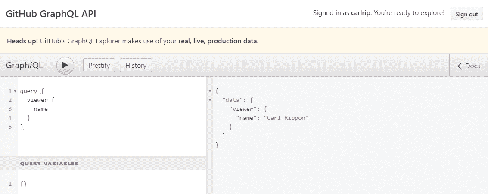
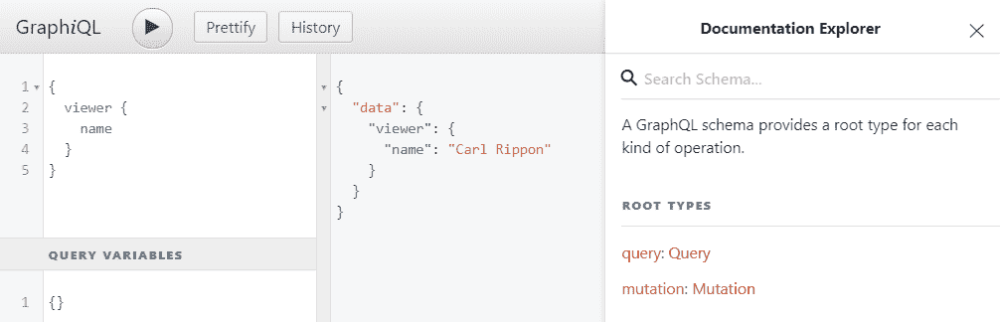
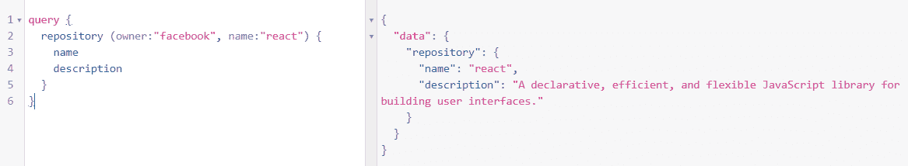
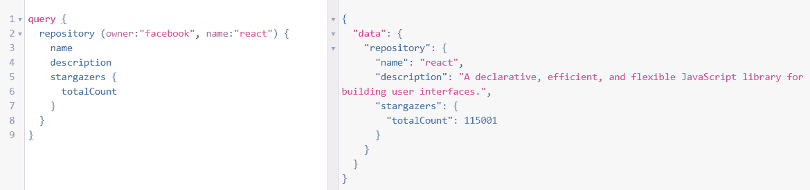
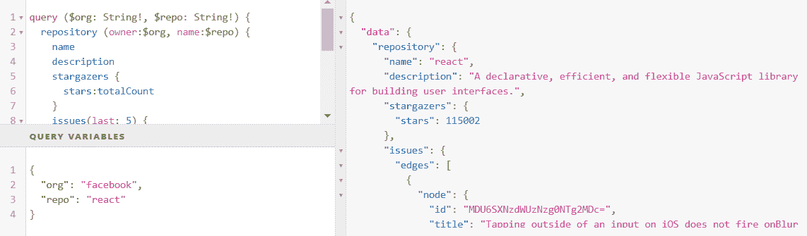
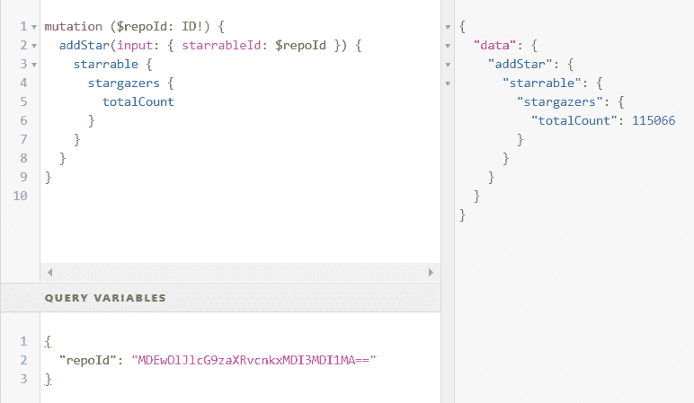
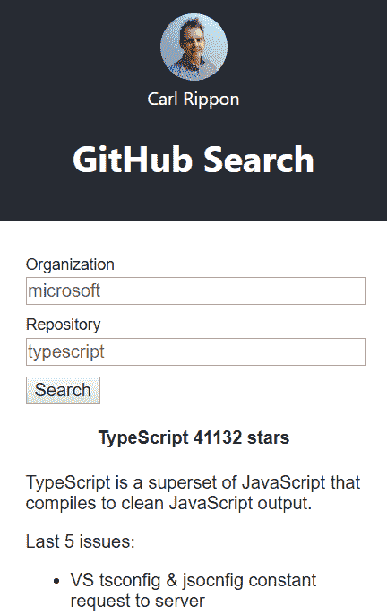
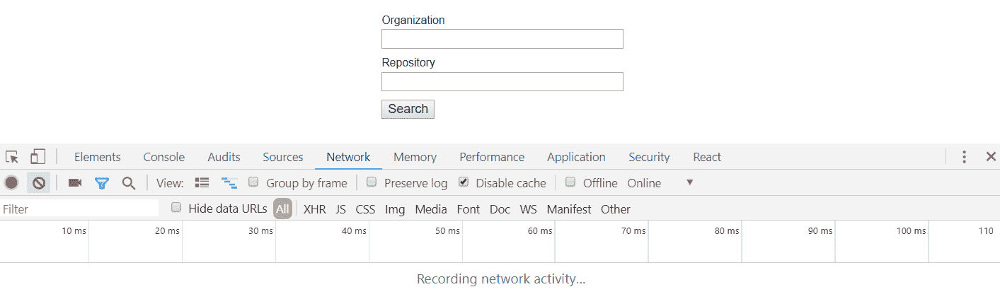
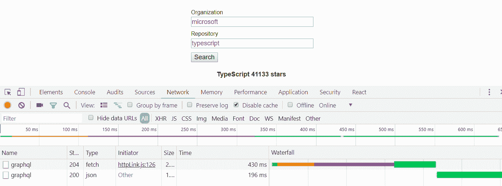

# 第十章：与 GraphQL API 交互

GraphQL 是由 Facebook 维护的用于读取和写入数据的开源 Web API 语言。它允许客户端指定返回的数据，并在单个请求中请求多个数据区域。这种效率和灵活性使其成为 REST API 的一个引人注目的替代方案。GraphQL 还支持读取和写入数据。

在本章中，我们将开始尝试针对 GitHub 进行一些 GraphQL 查询，以熟悉使用*GitHub GraphQL API*资源管理器的语法。我们将探讨如何读取和写入 GraphQL 数据，以及如何精确指定我们希望在响应中返回的数据方式。

然后，我们将在 React 和 TypeScript 应用程序中使用 GitHub GraphQL 服务器，构建一个小应用程序，该应用程序搜索 GitHub 存储库并返回有关其的一些信息。我们将使用上一章关于`axios`的知识与 GitHub GraphQL 服务器进行交互。然后我们将转而使用 Apollo，这是一个使与 GraphQL 服务器交互变得轻而易举的客户端库。

在本章中，我们将涵盖以下主题：

+   GraphQL 查询和变异语法

+   使用 axios 作为 GraphQL 客户端

+   使用 Apollo GraphQL 客户端

+   在 Apollo 中使用缓存数据

# 技术要求

在本章中，我们使用以下技术：

+   **Node.js 和** `npm`：TypeScript 和 React 依赖于这些。我们可以从[`nodejs.org/en/download/`](https://nodejs.org/en/download/)安装它们。如果我们已经安装了这些，请确保`npm`至少是 5.2 版本。

+   **Visual Studio Code**：我们需要一个编辑器来编写 React 和 TypeScript 代码，可以从[`code.visualstudio.com/`](https://code.visualstudio.com/)安装。我们还需要在 Visual Studio Code 中安装 TSLint (by egamma) 和 Prettier (by Estben Petersen) 扩展。

+   **GitHub**：我们需要一个 GitHub 账户。如果我们还没有账户，可以在以下链接注册：[`github.com/join`](https://github.com/join)。

+   **GitHub GraphQL API Explorer**：我们将使用此工具来玩转 GraphQL 查询和变异的语法。该工具位于[`developer.github.com/v4/explorer/`](https://developer.github.com/v4/explorer/)。

本章中的所有代码片段都可以在[`github.com/carlrip/LearnReact17WithTypeScript/tree/master/10-GraphAPIs`](https://github.com/carlrip/LearnReact17WithTypeScript/tree/master/10-GraphAPIs)上找到。

# GraphQL 查询和变异语法

在本节中，我们将使用 GitHub GraphQL API 资源浏览器开始熟悉与 GraphQL 服务器交互的语法，从下一节开始阅读数据。

# 阅读 GraphQL 数据

为了读取 GraphQL 数据，我们进行所谓的查询。在本节中，我们将首先介绍基本的 GraphQL 语法，然后讨论如何在查询结果中包含嵌套对象，以及如何通过允许传递参数来创建可重用的查询。

# 基本查询

在本节中，我们将使用 GitHub GraphQL API 资源浏览器来获取有关我们的 GitHub 用户帐户的信息：

1.  让我们在浏览器中打开以下 URL 以打开工具：

[`developer.github.com/v4/explorer/`](https://developer.github.com/v4/explorer/)。

如果我们还没有登录 GitHub 帐户，我们将需要登录。

1.  在左上角的面板中，让我们输入以下内容，然后点击执行查询按钮：

```jsx
query { 
  viewer { 
    name
  }
}
```

这是我们的第一个 GraphQL 查询。以下是一些关键点：

+   我们使用`query`关键字作为查询的前缀。这实际上是可选的。

+   `viewer`是我们想要获取的对象的名称。

+   `name`是我们想要返回的`viewer`中的一个字段。

查询结果将显示在右侧：



我们请求的数据以 JSON 对象的形式返回。JSON 包含一个包含`name`字段的`viewer`对象的`data`对象。`name`的值应该是我们的名字，因为这是存储在我们的 GitHub 帐户中的名字。

1.  在结果窗格的右侧有一个文档链接。如果我们点击这个链接，会出现一个文档资源浏览器：



如果我们点击查询链接，将显示可以查询的所有对象，包括`viewer`，这是我们刚刚查询的对象。如果我们点击进入这个对象，我们将看到`viewer`中可用的所有字段。

1.  让我们将`avatarUrl`添加到我们的查询中，因为这是我们可以使用的另一个字段：

```jsx
query { 
  viewer { 
    name
    avatarUrl
  }
}
```

因此，我们只需在`name`和`avatarUrl`字段之间加上一个换行符，将`avatarUrl`字段添加到`viewer`对象中。如果我们执行查询，我们将看到`avatarUrl`添加到 JSON 结果中。这应该是我们的图像的路径。

因此，我们已经看到了 GraphQL 的灵活性，可以精确指定我们希望在响应中返回哪些字段。在下一节中，我们将进一步指定我们希望返回的嵌套对象。

# 返回嵌套数据

让我们在本节中进行更复杂的查询。我们将搜索 GitHub 存储库，返回有关它的信息，包括它拥有的星星数量以及最近提出的问题作为嵌套数组：

1.  让我们开始输入以下查询并执行它：

```jsx
query { 
  repository (owner:"facebook", name:"react") {
    name
    description
  }
}
```

这次，我们要求`repository`对象，但传递了`owner`和`name`存储库的两个参数。我们要求返回存储库的`name`和`description`。

我们看到返回了我们请求的存储库和字段：



1.  现在让我们请求存储库的星星数量。为此，我们要求`stargazers`嵌套对象中的`totalCount`字段：

```jsx
query { 
  repository (owner:"facebook", name:"react") {
    name
    description
    stargazers {
 totalCount
 }
  }
}
```

如果我们执行查询，我们会看到返回的结果：



1.  现在让我们给`stargazers`中的`totalCount`添加一个别名：

```jsx
stargazers {
  stars:totalCount
}
```

如果我们执行查询，我们会看到星星数量返回到我们指定的别名：

```jsx
{
  "data": {
    "repository": {
      "name": "react",
      "description": "A declarative, efficient, and flexible JavaScript library for building user interfaces.",
      "stargazers": {
        "stars": 114998
      }
    }
  }
}
```

1.  让我们继续请求存储库中的最后`5`个问题：

```jsx
{ 
  repository (owner:"facebook", name:"react") {
    name
    description
    stargazers {
      stars:totalCount
    }
    issues(last: 5) {
 edges {
 node {
 id
 title
 url
 publishedAt
 }
 }
 }
  }
}
```

我们通过将`5`传递到最后一个参数来请求`issues`对象。然后，我们请求包含我们感兴趣的问题字段的`edges`对象中的`node`对象。

那么，`edges`和`node`对象是什么？为什么我们不能直接请求我们想要的字段？嗯，这种结构是为了方便基于游标的分页。

如果我们执行查询，我们会得到结果中包含的最后`5`个问题。

因此，GraphQL 允许我们为不同的数据部分进行单个网络请求，只返回我们需要的字段。使用 GitHub REST API 进行类似的操作可能需要多个请求，并且我们会得到比我们需要的更多的数据。在这些类型的查询中，GraphQL 比 REST 更出色。

# 查询参数

我们刚刚进行的查询是硬编码的，用于获取特定存储库的数据。在本节中，我们将在查询中定义变量，这些变量基本上允许将参数传递给它：

1.  我们可以在`query`关键字后的括号中添加查询变量，用逗号分隔。每个参数都通过在分号后声明其类型来定义其名称。这类似于在 TypeScript 函数中使用类型注释定义参数。变量名需要以`$`为前缀。类型后面的`!`表示这是必需的。因此，在我们的情况下，为了执行查询，这两个变量都是必需的。然后可以在查询中引用这些变量，在我们的例子中，这是我们请求存储库对象的地方：

```jsx
query ($org: String!, $repo: String!) { 
  repository (owner:$org, name:$repo) {
    ...
  }
}
```

1.  在执行查询之前，我们需要指定变量值。我们在左下角的查询变量窗格中以 JSON 对象的形式进行此操作：

```jsx
{
  "org": "facebook",
  "repo": "react"
}
```

1.  如果我们执行查询，我们将得到我们请求的存储库的结果：



我们现在已经开始习惯从 GraphQL 服务器中读取数据。但是我们如何创建新的数据项或更新数据呢？我们将在下一节中找到答案。

# 编写 GraphQL 数据

现在让我们把注意力转向写入 GraphQL 服务器。我们可以通过所谓的 mutations 来实现这一点。在本节中，我们将创建一个`mutation`来向存储库添加 GitHub 星标：

1.  为了收藏一个存储库，我们需要存储库的`id`。因此，让我们将这个添加到我们一直在工作的查询中：

```jsx
query ($org: String!, $repo: String!) { 
  repository (owner:$org, name:$repo) {
    id
    ...
  }
}
```

1.  让我们复制结果中返回的`id`。React 存储库的`id`如下所示：

```jsx
MDEwOlJlcG9zaXRvcnkxMDI3MDI1MA==
```

1.  现在我们可以写我们的第一个`mutation`：

```jsx
mutation ($repoId: ID!) {
  addStar(input: { starrableId: $repoId }) {
    starrable {
      stargazers {
        totalCount
      }
    }
  }
}
```

以下是关于这个`mutation`的一些关键点：

+   我们用`mutation`关键字作为前缀来定义一个 mutation。

+   我们将要传递给`mutation`的参数放在`mutation`关键字后面的括号中。在我们的例子中，我们为要收藏的存储库`id`设置了一个参数。

+   `addStar`是我们正在调用的`mutation`函数，它有一个名为`input`的参数，我们需要传递给它。

+   `input`实际上是一个对象，其中包含一个名为`starrableId`的字段，我们需要包含它。其值是我们要收藏的存储库`id`，因此我们将其设置为我们的存储库`id`变量`$repoId`。

+   在`mutation`参数之后，我们可以指定我们希望在响应中返回什么。在我们的例子中，我们希望返回存储库上的星星数量。

1.  我们可以在查询变量窗格中指定存储库`id`的参数值：

```jsx
{
  "repoId": "MDEwOlJlcG9zaXRvcnkxMDI3MDI1MA=="
}
```

1.  如果我们执行`mutation`，星星将被添加到存储库中，并且新的总星星数量将被返回：



现在我们对 GraphQL 查询和变异都有了很好的掌握。在下一节中，我们将开始从 React 和 TypeScript 应用程序与 GraphQL 服务器进行交互。

# 使用 axios 作为 GraphQL 客户端

与 GraphQL 服务器的交互是通过 HTTP 完成的。我们在第九章中学到，*与 Restful API 交互*，`axios`是一个很好的 HTTP 客户端。因此，在本章中，我们将介绍如何使用`axios`与 GraphQL 服务器进行交互。

为了帮助我们学习，我们将创建一个 React 和 TypeScript 应用程序来返回有关我们 GitHub 帐户的信息。因此，我们的第一个任务是获取一个令牌，以便我们可以访问查询 GitHub GraphQL 服务器并搭建一个 React 和 TypeScript 应用程序。

# 生成 GitHub 个人访问令牌

GitHub GraphQL 服务器需要一个令牌才能与其进行交互。所以，让我们去生成一个个人访问令牌：

1.  让我们登录到我们的 GitHub 帐户，并通过打开头像下的菜单并选择设置来进入我们的设置页面。

1.  在左侧菜单中，我们需要选择开发者设置选项。这将带我们到开发者设置页面。

1.  然后我们可以在左侧菜单中选择个人访问令牌选项。

1.  然后我们将看到一个生成新令牌的按钮，我们可以点击它来生成我们的令牌。点击按钮后，我们可能会被提示输入密码。

1.  在生成令牌之前，我们被要求指定范围。让我们输入一个令牌描述，选中 repo 和 user，然后点击生成令牌按钮。

1.  然后生成的令牌将显示在页面上供我们复制并在我们的 React 应用程序中使用。

既然我们有了我们的令牌，让我们在下一节中搭建一个 React 和 TypeScript 应用程序。

# 创建我们的应用程序

我们将按照通常的步骤来搭建一个 React 和 TypeScript 应用程序：

1.  让我们在我们选择的文件夹中打开 Visual Studio Code 并打开终端。让我们输入以下命令来创建一个新的 React 和 TypeScript 项目：

```jsx
npx create-react-app repo-search --typescript
```

请注意，我们使用的 React 版本至少需要是`16.7.0-alpha.0`版本。我们可以在`package.json`文件中检查这一点。如果`package.json`中的 React 版本小于`16.7.0-alpha.0`，那么我们可以使用以下命令安装这个版本：

```jsx
npm install react@16.7.0-alpha.0
npm install react-dom@16.7.0-alpha.0
```

1.  项目创建后，让我们将 TSLint 作为开发依赖项添加到我们的项目中，并添加一些适用于 React 和 Prettier 的规则：

```jsx
cd repo-search
npm install tslint tslint-react tslint-config-prettier --save-dev
```

1.  现在让我们添加一个包含一些规则的`tslint.json`文件：

```jsx
{
  "extends": ["tslint:recommended", "tslint-react", "tslint-config-
   prettier"],
  "rules": {
    "ordered-imports": false,
    "object-literal-sort-keys": false,
    "jsx-no-lambda": false,
    "no-debugger": false,
    "no-console": false,
  },
  "linterOptions": {
    "exclude": [
      "config/**/*.js",
      "node_modules/**/*.ts",
      "coverage/lcov-report/*.js"
    ]
  }
}
```

1.  如果打开`App.tsx`，会出现一个 linting 错误。所以，让我们通过在`render`方法上添加`public`作为修饰符来解决这个问题：

```jsx
class App extends Component {
  public render() {
    return ( ... );
  }
}
```

1.  现在我们可以使用`npm`安装`axios`：

```jsx
npm install axios
```

1.  在继续开发之前，让我们先启动我们的应用程序：

```jsx
npm start
```

1.  在我们使用`axios`进行第一个 GraphQL 查询之前，让我们在`src`目录中创建一个名为`Header.tsx`的新文件，其中包含以下`import`：

```jsx
import React from "react";
import axios from "axios";
```

这个组件最终将包含我们从 GitHub 获取的姓名和头像。

1.  暂时让我们的`Header`组件返回空值：

```jsx
export const Header: React.SFC = () => {
  return null;
}
```

1.  现在让我们回到`App.tsx`，并导入我们刚刚创建的`Header`组件：

```jsx
import { Header } from "./Header";
```

1.  现在我们可以调整`App.tsx`中的 JSX，包括我们的`Header`组件：

```jsx
<div className="App">
  <header className="App-header">
    <Header />
  </header>
</div>
```

1.  作为本节的最后一个任务，让我们在`App.css`中更改`App-Header`的 CSS 类，以便标题不那么高：

```jsx
.App-header {
  background-color: #282c34;
  min-height: 200px;
  display: flex;
  flex-direction: column;
  align-items: center;
  justify-content: center;
  font-size: 16px;
  color: white;
}
```

# 查询 GraphQL 服务器

现在我们已经有了我们的 React 和 TypeScript 项目，让我们使用`axios`进行 GraphQL 查询：

1.  在`Header.tsx`中，我们将首先为 GraphQL 查询响应和其中的 viewer 数据创建两个接口：

```jsx
interface IViewer {
  name: string;
  avatarUrl: string;
}

interface IQueryResult {
  data: {
    viewer: IViewer;
  };
}
```

1.  让我们在`Header`组件中创建一些状态变量用于`viewer`：

```jsx
const [viewer, setViewer]: [
  IViewer,
  (viewer: IViewer) => void
] = React.useState({name: "", avatarUrl: ""});
```

1.  现在是时候进行 GraphQL 查询了。我们将在组件刚刚挂载时进行这个操作。我们可以使用`useEffect`函数来实现这一点：

```jsx
React.useEffect(() => {
  // TODO - make a GraphQL query 
}, []);
```

我们将一个空数组作为第二个参数传递，这样查询只会在组件挂载时执行，而不是在每次渲染时执行。

1.  然后让我们使用`axios`进行 GraphQL 查询：

```jsx
React.useEffect(() => {
  axios
 .post<IQueryResult>(
 "https://api.github.com/graphql",
 {
 query: `query { 
 viewer { 
 name
 avatarUrl
 }
 }`
 }
 )
}, []);
```

请注意，尽管我们正在读取数据，但我们正在进行 HTTP `POST`。GraphQL 要求我们使用 HTTP `POST`，因为查询的细节在请求体中。

我们还在使用之前使用的接口`IQueryResult`来处理响应数据。

1.  如前所述，我们需要在 HTTP 授权标头中传递我们的令牌。所以，让我们这样做：

```jsx
axios
  .post<IQueryResult>(
    "https://api.github.com/graphql",
    {
      query: `query { 
        viewer { 
          name
          avatarUrl
        }
      }`
    },
    {
 headers: {
 Authorization: "bearer our-bearer-token"
 }
 }
  )
```

显然，我们需要用我们之前从 GitHub 获取的真实令牌来替换。

1.  我们还没有处理响应，所以让我们设置`viewer`状态变量：

```jsx
axios
  .post<IQueryResult>(
    ...
  )
  .then(response => {
```

```jsx
 setViewer(response.data.data.viewer);
 });
```

1.  现在我们已经从 GraphQL 查询中获取了数据，让我们渲染我们的头像和姓名以及我们的应用程序标题：

```jsx
return (
  <div>
 
 <div className="viewer">{viewer.name}</div>
 <h1>GitHub Search</h1>
 </div>
);
```

1.  让我们将刚刚引用的头像 CSS 类添加到`App.css`中：

```jsx
.avatar {
  width: 60px;
  border-radius: 50%;
}
```

如果我们查看正在运行的应用程序，应该在应用程序标题中看到我们的头像和姓名：


因此，我们刚刚使用了一个 HTTP 库与 GraphQL 服务器进行交互。所有 GraphQL 请求都是使用 HTTP POST 方法进行的，即使是用于读取数据的请求也是如此。所有 GraphQL 请求也都是发送到同一个端点。我们想要从中获取数据的资源不在 URL 中，而是在请求体中。因此，虽然我们可以使用 HTTP 库，比如`axios`，来查询 GraphQL 服务器，但感觉有点奇怪。

在下一节中，我们将看一下一个 GraphQL 客户端，它将帮助我们以更自然的方式查询 GraphQL 服务器。

# 使用 Apollo GraphQL 客户端

Apollo 客户端是一个用于与 GraphQL 服务器交互的客户端库。它比使用通用 HTTP 库如`axios`有许多优点，比如能够在我们的 JSX 中以声明方式读写数据，并且开箱即用地启用缓存。

在本节中，我们将重构上一节中使用`axios`构建的内容，以使用 Apollo，并且稍微扩展我们的应用程序以包括 GitHub 仓库搜索。

# 安装 Apollo 客户端

我们的第一项工作是将 Apollo 安装到我们的项目中。

1.  要将 Apollo 客户端添加到我们的项目中，让我们通过`npm`安装以下包：

```jsx
npm install apollo-boost react-apollo graphql
```

+   `apollo-boost`包含了我们设置 Apollo 客户端所需的一切

+   `react-apollo`包含了我们将用来与 GraphQL 服务器交互的 React 组件

+   `graphql`是一个核心包，我们将用它来解析 GraphQL 查询

1.  我们还将为`graphql`安装一些 TypeScript 类型：

```jsx
npm install @types/graphql --save-dev
```

1.  我们需要确保 TypeScript 在编译我们的代码时包含`es2015`和`esNext`库。因此，让我们在`tsconfig.json`中添加以下`lib`字段：

```jsx
{
  "compilerOptions": {
    "target": "es5",
    "lib": ["es2015", "dom", "esnext"],
    ...
  },
  ...
}
```

现在我们已经准备好开始使用 Apollo 与 GitHub GraphQL 服务器进行交互了。

# 从 axios 迁移到 Apollo

现在我们已经安装了所有 Apollo 的部分，让我们将我们的`axios`代码迁移到 Apollo。

# 添加 Apollo 提供程序

我们将从`App.tsx`开始，在那里我们将定义我们的 Apollo 客户端并*提供*给`App`组件层次结构下的所有组件：

1.  在`App.tsx`中，让我们导入`apollo-boost`，以及从`react-apollo`导入`ApolloProvider`组件：

```jsx
import ApolloClient from "apollo-boost";
import { ApolloProvider } from "react-apollo";
```

1.  在`App`类组件的上方，让我们创建我们的`ApolloClient`：

```jsx
const client = new ApolloClient({
  uri: "https://api.github.com/graphql",
  headers: {
    authorization: `Bearer our-bearer-token`
  }
});
```

显然，我们需要用我们之前从 GitHub 获取的真实令牌来替换它。

1.  最后一步是使用`ApolloProvider`组件将我们创建的`ApolloClient`提供给应用中的所有其他组件。我们通过将`ApolloProvider`作为根组件，并将`ApolloClient`对象传递给它来实现这一点：

```jsx
public render() {
  return (
    <ApolloProvider client={client}>
      <div className="App">
        <header className="App-header">
          <Header />
        </header>
      </div>
    </ApolloProvider>
  );
}
```

现在`ApolloClient`已经设置好了，我们可以开始与 GraphQL 服务器进行交互了。

# 使用查询组件查询 GraphQL

我们现在要使用`Query`组件来获取我们的 GitHub 姓名和头像，替换`axios`代码：

1.  让我们首先删除`axios`导入语句，而不是有以下导入：

```jsx
import gql from "graphql-tag";
import { Query } from "react-apollo";
```

1.  我们的`IViewer`接口将保持不变，但我们需要稍微调整我们的`IQueryResult`接口：

```jsx
interface IQueryResult {
  viewer: IViewer;
}
```

1.  我们接下来要定义我们的 GraphQL 查询：

```jsx
const GET_VIEWER = gql`
  {
    viewer {
      name
      avatarUrl
    }
  }
`;
```

所以，我们将查询设置为`GET_VIEWER`变量，并在模板文字中定义了我们的查询。然而，在模板文字之前的`gql`函数有点奇怪。模板文字不应该在括号中吗？实际上，这被称为标记模板文字，其中来自核心 GraphQL 库的`gql`函数解析其旁边的模板文字。我们最终得到了一个 Apollo 可以使用和执行的`GET-VIEWER`中的查询。

1.  我们现在要开始定义我们的查询。我们可以直接在 JSX 中使用`react-apollo`中的`Query`组件定义我们的查询。然而，为了增加一些类型安全性，我们将创建一个名为`GetViewerQuery`的新组件，该组件继承自`Query`并将结果类型定义为泛型参数：

```jsx
class GetViewerQuery extends Query<IQueryResult> {}
```

1.  我们不再需要任何状态，所以我们可以删除`viewer`和`setViewer`变量。

1.  我们还可以删除使用`useEffect`函数调用`axios`查询的部分，因为我们现在要在 JSX 中进行查询。

1.  所以，让我们使用我们的`GetViewerQuery`组件来调用我们的查询：

```jsx
return (
  <GetViewerQuery query={GET_VIEWER}>
    {({ data }) => {
      if (!data || !data.viewer) {
        return null;
      }
      return (
        <div>
          
          <div className="viewer">{data.viewer.name}</div>
          <h1>GitHub Search</h1>
        </div>
      );
    }}
  </GetViewerQuery>
);
```

+   我们将我们之前创建的查询作为`query`属性传递给`GetViewerQuery`组件。

+   查询结果在`GetViewerQuery`的 children 函数中返回。

+   children 函数参数包含一个包含`data`属性中数据的对象。我们将这些数据解构到一个`data`变量中。

+   如果没有任何数据，我们会提前退出并返回`null`。

+   如果我们有数据，然后返回我们的头像和姓名的 JSX，引用`data`属性。

如果我们查看我们正在运行的应用程序，它应该与`axios`版本完全相同。如果显示错误，我们可能需要再次`npm start`应用程序。

1.  我们可以从 children 函数参数中获取其他信息。一个有用的信息是数据是否正在加载。让我们使用这个来显示一个加载消息：

```jsx
return (
  <GetViewerQuery query={GET_VIEWER}>
    {({ data, loading }) => {
      if (loading) {
 return <div className="viewer">Loading ...</div>;
 }
      ...
    }}
  </GetViewerQuery>
);
```

1.  我们可以从 children 函数参数中获取的另一个有用的信息是有关发生的错误的信息。让我们使用这个来显示错误消息，如果有的话：

```jsx
return (
  <GetViewerQuery query={GET_VIEWER}>
    {({ data, loading, error }) => {
      if (error) {
 return <div className="viewer">{error.toString()}</div>;
 }
      ...
    }}
  </GetViewerQuery>
);
```

这个 Apollo 实现真的很优雅。`Query`组件如何在组件生命周期的正确时刻进行网络请求，并允许我们向其余的组件树提供数据，真是聪明。

在下一节中，我们将继续使用 Apollo 来增强我们的应用程序。

# 添加一个仓库搜索组件

在这一部分，我们将添加一个组件来搜索 GitHub 仓库并返回一些关于它的信息：

1.  让我们首先创建一个名为`RepoSearch.tsx`的新文件，其中包含以下导入：

```jsx
import * as React from "react";
import gql from "graphql-tag";
import { ApolloClient } from "apollo-boost";
```

1.  我们将以`ApolloClient`作为 prop 传入。因此，让我们为此添加一个接口：

```jsx
interface IProps {
  client: ApolloClient<any>;
}
```

1.  接下来，我们将搭建我们的组件：

```jsx
const RepoSearch: React.SFC<IProps> = props => {
  return null;
}

export default RepoSearch;
```

1.  现在让我们在`App.tsx`中引用这个，首先导入它：

```jsx
import RepoSearch from "./RepoSearch";
```

1.  现在我们可以将其添加到应用程序标题下，传入`ApolloClient`：

```jsx
<ApolloProvider client={client}>
  <div className="App">
    <header className="App-header">
      <Header />
    </header>
    <RepoSearch client={client} />
  </div>
</ApolloProvider>
```

我们的仓库`search`组件现在已经很好地设置好了。在下一节中，我们可以实现一个搜索表单。

# 实现搜索表单

让我们实现一个搜索表单，允许用户提供组织名称和仓库名称：

1.  回到`RepoSearch.tsx`，让我们开始定义搜索字段的状态，从接口开始：

```jsx
interface ISearch {
  orgName: string;
  repoName: string;
}
```

1.  现在我们可以创建一个变量来保存我们的`search`状态，以及一个设置它的函数：

```jsx
const RepoSearch: React.SFC<IProps> = props => {
  const [search, setSearch]: [
 ISearch,
 (search: ISearch) => void
 ] = React.useState({
 orgName: "",
 repoName: ""
 });

  return null;
}
```

1.  让我们在 JSX 中定义`search`表单：

```jsx
return (
  <div className="repo-search">
    <form onSubmit={handleSearch}>
      <label>Organization</label>
      <input
        type="text"
        onChange={handleOrgNameChange}
        value={search.orgName}
      />
      <label>Repository</label>
      <input
        type="text"
        onChange={handleRepoNameChange}
        value={search.repoName}
      />
      <button type="submit">Search</button>
    </form>
  </div>
);
```

我们引用了一些尚未实现的部分。因此，我们将逐一实现这些。

1.  让我们添加在`App.css`中引用的`repo-search`类。我们还将为标签和输入以及搜索按钮添加样式：

```jsx
.repo-search {
  margin: 30px auto;
  width: 300px;
  font-family: Arial;
  font-size: 16px;
  text-align: left;
}

.repo-search label {
  display: block;
  margin-bottom: 3px;
  font-size: 14px;
}

.repo-search input {
  display: block;
  margin-bottom: 10px;
  font-size: 16px;
  color: #676666;
  width: 100%;
}

.repo-search button {
  display: block;
  margin-bottom: 20px;
  font-size: 16px;
}
```

1.  接下来，让我们实现简单更新`search`状态的输入更改处理程序：

```jsx
const handleOrgNameChange = (e: React.ChangeEvent<HTMLInputElement>) => {
  setSearch({ ...search, orgName: e.currentTarget.value });
};

const handleRepoNameChange = (e: React.ChangeEvent<HTMLInputElement>) => {
  setSearch({ ...search, repoName: e.currentTarget.value });
};
```

1.  我们需要实现的最后一部分是`search`处理程序：

```jsx
const handleSearch = (e: React.FormEvent<HTMLFormElement>) => {
  e.preventDefault();

  // TODO - make GraphQL query
};
```

我们在事件参数上调用`preventDefault`来阻止发生完整的后退。

所以，搜索表单已经开始了。我们将在下一节中实现 GraphQL 查询。

# 实现搜索查询

我们现在到了需要进行 GraphQL 查询来实际搜索的地步：

1.  让我们首先为我们期望从查询中获取的仓库数据创建一个接口：

```jsx
interface IRepo {
  id: string;
  name: string;
  description: string;
  viewerHasStarred: boolean;
  stargazers: {
    totalCount: number;
  };
  issues: {
    edges: [
      {
        node: {
          id: string;
          title: string;
          url: string;
        };
      }
    ];
  };
}
```

这是我们在之前的部分中从 GitHub GraphQL Explorer 中得到的结构。

1.  我们将需要为这个状态设置一个默认值。所以，让我们定义这个：

```jsx
const defaultRepo: IRepo = {
  id: "",
  name: "",
  description: "",
  viewerHasStarred: false,
  stargazers: {
    totalCount: 0
  },
  issues: {
    edges: [
      {
        node: {
          id: "",
          title: "",
          url: ""
        }
      }
    ]
  }
};
```

1.  我们还可以为整个查询结果定义一个接口：

```jsx
interface IQueryResult {
  repository: IRepo;
}
```

1.  现在我们可以使用标记模板字面量来创建查询本身：

```jsx
const GET_REPO = gql`
  query GetRepo($orgName: String!, $repoName: String!) {
    repository(owner: $orgName, name: $repoName) {
      id
      name
      description
      viewerHasStarred
      stargazers {
        totalCount
      }
      issues(last: 5) {
        edges {
          node {
            id
            title
            url
            publishedAt
          }
        }
      }
    }
  }
`;
```

这是我们在之前的部分中在 GitHub GraphQL Explorer 中进行的查询。与以前的查询不同，这个查询有一些参数，我们需要在稍后执行查询时包含这些参数。

1.  我们需要将从查询中获取的数据存储在状态中。所以，让我们创建一个名为`repo`的状态变量，以及一个设置它的函数：

```jsx
const [repo, setRepo]: [
    IRepo,
    (repo: IRepo) => void
  ] = React.useState(defaultRepo);
```

1.  我们还将在状态中存储`search`的任何问题：

```jsx
const [searchError, setSearchError]: [
  string,
  (searchError: string) => void
] = React.useState("");
```

1.  让我们更新`handleSearch`箭头函数，在进行`search`之前清除任何搜索错误状态：

```jsx
const handleSearch = (e: React.FormEvent<HTMLFormElement>) => {
  e.preventDefault();

  setSearchError("");
};
```

1.  让我们继续使用作为属性传递的`ApolloClient`来进行查询：

```jsx
const handleSearch = (e: React.FormEvent<HTMLFormElement>) => {
  e.preventDefault();

  setSearchError("");

  props.client
 .query<IQueryResult>({
 query: GET_REPO
 });
};
```

1.  这里还有更多的工作要做。首先，我们需要从我们在`search`状态中拥有的值中传递`query`参数，用于组织名称和仓库名称：

```jsx
.query<IQueryResult>({
  query: GET_REPO,
  variables: { orgName: search.orgName, repoName: search.repoName }
})
```

1.  现在是时候在`then`方法中处理响应并将`repo`状态设置为响应中的数据了：

```jsx
props.client
  .query<IQueryResult>( ... )
  .then(response => {
 setRepo(response.data.repository);
 });
```

1.  我们还将在`catch`方法中处理任何错误，并更新`searchError`状态：

```jsx
props.client
  .query<IQueryResult>(...)
  .then(...)
  .catch(error => {
 setSearchError(error.message);
 });
```

如果我们在运行的应用中尝试进行`search`，查询将会正常进行，但我们还没有显示结果。让我们在下一部分中做这件事。

# 渲染搜索结果

让我们渲染从仓库查询中获取的数据：

1.  如果我们有搜索结果，让我们在`search`表单下渲染仓库名称及其星数以及描述：

```jsx
return (
  <div className="repo-search">
    <form ...>
      ...
    </form>
    {repo.id && (
 <div className="repo-item">
 <h4>
 {repo.name}
 {repo.stargazers ? ` ${repo.stargazers.totalCount}
           stars` : ""}
 </h4>
 <p>{repo.description}</p>
 </div>
 )}
  </div>
);
```

1.  我们还将渲染最后的`5`个仓库问题：

```jsx
...
<p>{repo.description}</p>
<div>
 Last 5 issues:
 {repo.issues && repo.issues.edges ? (
 <ul>
 {repo.issues.edges.map(item => (
 <li key={item.node.id}>{item.node.title}</li>
 ))}
 </ul>
 ) : null}
</div>
```

1.  如果出现问题，让我们渲染在状态中捕获的错误消息：

```jsx
{repo.id && (
  ...
)}
{searchError && <div>{searchError}</div>}
```

1.  让我们在`App.css`中为搜索结果中的仓库标题添加一些 CSS：

```jsx
.repo-search h4 {
  text-align: center;
}
```

如果我们搜索一个仓库，现在应该看到有关仓库的信息被渲染出来：



我们现在已经可以使用 Apollo 舒适地查询 GraphQL 服务器了。在下一部分，我们将处理变异。

# 使用 Apollo 实现变异

让我们允许用户在我们的应用中为 GitHub 仓库加星。这将涉及通过 Apollo 发送一个`mutation`：

1.  首先，让我们从`react-apollo`中导入`Mutation`组件：

```jsx
import { Mutation } from "react-apollo";
```

1.  现在让我们创建`mutation`。这是我们之前在 GitHub GraphQL Explorer 中执行的相同查询：

```jsx
const STAR_REPO = gql`
  mutation($repoId: ID!) {
    addStar(input: { starrableId: $repoId }) {
      starrable {
        stargazers {
          totalCount
        }
      }
    }
  }
`;
```

1.  在 JSX 中，在我们渲染描述的地方，让我们放置`Mutation`组件：

```jsx
<p>{repo.description}</p>
<div>
 {!repo.viewerHasStarred && (
 <Mutation
 mutation={STAR_REPO}
 variables={{ repoId: repo.id }}
 >
 {() => (
 // render Star button that invokes the mutation when 
           clicked
 )}
 </Mutation>
 )}
</div> <div>
  Last 5 issues:
  ...
</div>
```

+   只有在`viewer`还没有给存储库添加星标时，我们才渲染`mutation`

+   `Mutation`组件接受我们刚刚定义的 mutation 以及变量，这在我们的情况下是存储库的`id`

1.  `Mutation`组件有一个 children 函数，它给了我们访问`addStar`函数的权限。因此，让我们渲染一个 Star!按钮，当点击时调用`addStar`：

```jsx
<Mutation
    ...
  >
    {(addStar) => (
      <div>
 <button onClick={() => addStar()}>
 Star!
 </button>
 </div>
    )}
  </Mutation>
)}
```

1.  `Mutation`组件还告诉我们`mutation`正在执行，通过 children 函数的第二个参数中的`loading`属性。让我们使用这个来禁用按钮，并通知用户星标正在被添加：

```jsx
<Mutation
  ...
>
  {(addStar, { loading }) => (
    <div>
      <button disabled={loading} onClick={() => addStar()}>
        {loading ? "Adding ..." : "Star!"}
      </button>
    </div>
  )}
</Mutation>
```

1.  `Mutation`组件还告诉我们是否有错误。因此，让我们使用这个并在发生错误时渲染错误：

```jsx
<Mutation
  ...
>
  {(addStar, { loading, error }) => (
    <div>
      <button ...>
        ...
      </button>
      {error && <div>{error.toString()}</div>}
    </div>
  )}
</Mutation>
```

如果我们尝试给存储库添加星标，星标应该会成功添加。我们可以去 GitHub 存储库的[github.com](http://github.com)验证这一点。

现在我们已经实现了查询和`mutation`，我们真正掌握了 Apollo。不过，有一件事情有点奇怪，也许我们已经注意到了。在我们给存储库添加星标后，应用程序中星标的数量没有更新。即使我们再次搜索存储库，星标的数量仍然是我们开始之前的数量。但是，如果我们刷新浏览器并再次搜索存储库，我们会得到正确的星标数量。那么，这是怎么回事呢？我们将在下一节中找出答案。

# 在 Apollo 中使用缓存数据

我们在上一节结束时留下了一个谜。为什么我们在开始搜索后没有得到存储库`search`的最新星标数量？答案是 Apollo 在初始`search`后缓存了存储库数据。当执行相同的查询时，它会从缓存中获取结果，而不是从 GraphQL 服务器获取数据。

让我们再次确认一下：

1.  让我们打开应用程序并在网络选项卡上打开开发者工具，并清除之前的请求：



1.  让我们进行一次搜索。我们会看到向 GitHub GraphQL 服务器发出了几个请求：



1.  在开发者工具中，网络选项卡，让我们清除请求，然后在我们的应用程序中再次点击搜索按钮。我们会看到没有网络请求被发出，但数据被渲染出来。所以，数据一定是来自本地缓存。

所以，我们使用`apollo-boost`配置的`ApolloClient`会自动将查询缓存到内存中。在下一节中，我们将学习如何清除缓存，以便我们的应用程序在仓库被加星后显示正确的星星数量。

# 使用`refetchQueries`清除缓存

在`mutation`发生后，我们需要一种清除缓存查询结果的方法。一种方法是在`Mutation`组件上使用`refetchQueries`属性：

1.  让我们试一试。`refetchQueries`属性接受一个包含应该从缓存中移除的具有相应变量值的查询对象数组：

```jsx
<Mutation
  mutation={STAR_REPO}
  variables={{ repoId: repo.id }}
  refetchQueries={[
 {
 query: GET_REPO,
 variables: {
 orgName: search.orgName,
 repoName: search.repoName
 }
 }
 ]}
>
  ...
</Mutation>
```

1.  如果我们现在给一个仓库加星标，星星的数量不会立即更新。然而，如果按下搜索按钮，星星就会更新。

所以，缓存已经清除，但是体验仍然不理想。理想情况下，我们希望在点击“Star！”按钮后立即更新星星的数量。

如果我们仔细思考刚才做的事情，我们正在试图绕过缓存。然而，缓存的存在是为了帮助我们的应用程序表现良好。

所以，这种方法并不理想。用户体验仍然不理想，我们刚刚使我们的应用程序性能下降了。一定有更好的方法！我们将在下一节中探索另一种方法。

# 在 Mutation 后更新缓存

让我们再次仔细思考一下问题：

+   我们在缓存中有关于仓库的一些信息，包括它拥有的星星数量。

+   当我们给仓库加星标时，我们希望看到星星的数量增加了一个。

+   如果我们可以在缓存中将星星的数量增加一个，那会怎么样？这应该能解决问题。

所以，让我们尝试一下，在`mutation`完成后更新缓存：

1.  首先，让我们移除上一节中实现的`refetchQueries`属性。

1.  `Mutation`组件上有一个`update`属性，我们可以利用它来更新缓存。所以，让我们开始实现这个功能：

```jsx
<Mutation
  mutation={STAR_REPO}
  update={cache => {
 // Get the cached data 
 // update the cached data
 // update our state 
 }}
>
  ...
</Mutation>
```

1.  所以，我们需要实现一个箭头函数，更新可用作参数的缓存：

```jsx
<Mutation
  ...
  update={cache => {
 const data: { repository: IRepo } | null = cache.readQuery({
 query: GET_REPO,
 variables: {
 orgName: search.orgName,
 repoName: search.repoName
 }
 });
 if (data === null) {
 return;
 }
 }}
>
  ...
</Mutation>
```

所以，缓存有一个`readQuery`函数，我们可以使用它来获取缓存的数据。如果在缓存中找不到数据，那么我们可以退出函数而不做其他事情。

1.  因此，现在我们从缓存中获取了数据，我们可以增加星星的数量。为此，我们创建一个新对象，并将缓存存储库的属性扩展到其中，并用增加的星星数量和查看者已经为存储库加星的事实覆盖它：

```jsx
update={cache => {
  ...
  if (data === null) {
    return;
  }
  const newData = {
 ...data.repository,    viewerHasStarred: true,
 stargazers: {
 ...data.repository.stargazers,
 totalCount: data.repository.stargazers.totalCount + 1
 }
 };
}}
```

1.  然后，我们可以使用其`writeQuery`函数更新缓存。我们传入带有变量值的查询和要存储在缓存中的新数据：

```jsx
update={cache => {
  ...
  const newData = {
    ...
  };
 cache.writeQuery({
 query: GET_REPO,
 variables: {
 orgName: search.orgName,
 repoName: search.repoName
 },
 data: { repository: newData }
 });
}}
```

1.  还有一件事要做，那就是更新`repo`状态，以便星星的数量立即在屏幕上更新：

```jsx
update={cache => {
  ...
  cache.writeQuery(...);
  setRepo(newData);
}}
```

就是这样。如果我们再次尝试在应用程序中为存储库加星，我们应该会看到星星的数量立即增加。

缓存是 Apollo 提供的伟大功能之一。`Mutation`组件上的`update`属性为我们提供了一种精确更新缓存的方式。`Mutation`组件上的`refetchQueries`属性是一种更粗暴且效率低下的强制更新缓存的方式。

# 总结

GraphQL 比 REST 更出色，因为它允许我们以更少的努力有效地获取所需的数据。GitHub GraphQL Explorer 是一个很好的工具，可以让我们熟悉语法。我们可以向 GraphQL 服务器发出两种主要类型的请求：

+   我们可以执行`query`来读取数据

+   我们可以执行`mutation`来写入数据

查询允许我们指定响应中需要的对象和字段。我们可以使用别名来重命名它们。我们可以通过定义变量来参数化查询。我们可以给变量类型，并在末尾使用`!`来指定每个变量是否是必需的。本章中我们没有涵盖的查询功能还有条件包含字段和强大的分页功能。总之，这是一种非常强大的查询语言！

变异与查询有一些相同的特性，比如能够向它们传递参数。我们可以控制响应中包含的数据，这真是太棒了。

GraphQL 通过 HTTP 运行，使用 HTTP `POST`请求到单个 URL。HTTP 正文包含查询或`mutation`信息。我们可以使用 HTTP 客户端与 GraphQL 服务器交互，但使用专门与 GraphQL 服务器交互的 Apollo 等库可能会更有效率。

React Apollo 是一组与核心 Apollo 库配合使用的 React 组件。它为我们提供了很好的`Query`和`Mutation`React 组件，用于在我们的 JSX 中包含查询和变更，使我们的代码更易于阅读。在我们使用这些组件之前，我们需要设置我们的`ApolloClient`对象，包括 GraphQL 服务器的 URL 和任何凭据。我们还需要在我们的组件树的顶部包含一个`ApolloProvider`组件，高于所有需要 GraphQL 数据的组件。

当我们使用`apollo-boost`搭建项目时，缓存默认开启。`Mutation`组件给了我们`update`和`refetchQueries`属性来管理缓存更新。

总的来说，GraphQL 是与后端交互的一种非常高效的方式，它与 React 和 TypeScript 应用程序非常配合。

因此，到目前为止，我们在这本书中学到了许多关于 React 和 TypeScript 的不同方面。一个我们尚未涉及的重要主题是如何对我们构建的应用进行健壮的测试。我们将在下一章中介绍这个主题。

# 问题

让我们尝试一些问题，来测试我们刚刚学到的知识：

1.  在 GitHub GraphQL Explorer 中，创建一个查询，返回 React 项目中最后五个未解决的问题。在响应中返回问题标题和 URL。

1.  增强最后一个查询，并使返回的问题数量成为一个参数，并将其默认设置为五。

1.  在 GitHub GraphQL Explorer 中创建一个`mutation`来取消对一个已标星的存储库的标星。`mutation`应该以一个必需的存储库`id`作为参数。

1.  GraphQL 查询的哪一部分放在 HTTP 请求中？

1.  GraphQL `mutation`的哪一部分放在 HTTP 请求中？

1.  如何使`react-apollo`的`Query`组件的响应类型安全？

1.  使用`react-boost`搭建项目时，默认情况下是否开启缓存？

1.  我们可以在`Mutation`组件上使用哪个属性来更新本地缓存？

# 进一步阅读

以下链接是关于 GraphQL、React 和 Apollo 的进一步信息的好资源：

+   GraphQL 文档位于[`graphql.org/learn/`](https://graphql.org/learn/)

+   Apollo 文档位于[`www.apollographql.com/docs/`](https://www.apollographql.com/docs/)

+   Apollo 文档中关于 React 部分的链接是[`www.apollographql.com/docs/react/`](https://www.apollographql.com/docs/react/)
