# 第十一章：使用 Jest 进行单元测试

构建一个强大的单元测试套件，捕捉真正的错误并在重构代码时不会误报阳性，是我们作为软件开发人员所做的最艰巨的任务之一。Jest 是一个很好的测试工具，可以帮助我们应对这一挑战，我们将在本章中了解到。

也许应用程序中最容易进行单元测试的部分是纯函数，因为没有副作用需要处理。我们将重新访问我们在第七章中构建的验证函数，*使用表单*，并对其进行一些单元测试，以便学习如何对纯函数进行单元测试。

在构建应用程序时，单元测试组件是我们将进行的最常见类型的单元测试。我们将详细了解它，并利用一个库来帮助我们实施测试，在重构代码时不会不必要地中断。

我们将学习什么是快照测试，以及如何利用它来更快地实现我们的测试。快照可以用于测试纯函数以及组件，因此它们是我们非常有用的工具。

模拟是一个具有挑战性的话题，因为如果我们模拟得太多，我们实际上并没有测试我们的应用程序。然而，有一些依赖关系是有意义的，比如 REST API。我们将重新访问我们在第九章中构建的应用程序，*与 Restful API 交互*，以便对其实施一些单元测试并学习有关模拟的知识。

在为我们的应用程序实现一套单元测试时，了解我们已经测试过哪些部分以及哪些部分尚未测试是很有用的。我们将学习如何使用代码覆盖工具来帮助我们快速识别需要更多单元测试的应用程序区域。

本章将涵盖以下主题：

+   测试纯函数

+   测试组件

+   使用 Jest 快照测试

+   模拟依赖关系

+   获取代码覆盖率

# 技术要求

我们在本章中使用以下技术：

+   **Node.js 和`npm`**：TypeScript 和 React 依赖于这些。可以从以下链接安装它们：[`nodejs.org/en/download/`](https://nodejs.org/en/download)。如果您已经安装了这些，请确保`npm`至少是 5.2 版本。

+   **Visual Studio Code**：我们需要一个编辑器来编写我们的 React 和 TypeScript 代码，可以从[`code.visualstudio.com/`](https://code.visualstudio.com/)安装。我们还需要 TSLint 扩展（由 egamma 提供）和 Prettier 扩展（由 Estben Petersen 提供）。

+   **React 商店**：我们将在我们创建的 React 商店上实现单元测试。这可以在 GitHub 上的以下链接找到：[`github.com/carlrip/LearnReact17WithTypeScript/tree/master/08-ReactRedux%EF%BB%BF`](https://github.com/carlrip/LearnReact17WithTypeScript/tree/master/08-ReactRedux%EF%BB%BF)。

+   **第九章代码**：我们将在第九章中创建的应用上实现单元测试，*与 RESTful API 交互*。这可以在 GitHub 上的以下链接找到：[`github.com/carlrip/LearnReact17WithTypeScript/tree/master/09-RestfulAPIs/03-AxiosWithClass`](https://github.com/carlrip/LearnReact17WithTypeScript/tree/master/09-RestfulAPIs/03-AxiosWithClass)。

为了从之前的章节中恢复代码，可以下载`LearnReact17WithTypeScript`存储库，网址为[`github.com/carlrip/LearnReact17WithTypeScript`](https://github.com/carlrip/LearnReact17WithTypeScript)。然后可以在 Visual Studio Code 中打开相关文件夹，并在终端中输入`npm install`来进行恢复。本章中的所有代码片段都可以在以下链接找到：[`github.com/carlrip/LearnReact17WithTypeScript/tree/master/11-UnitTesting`](https://github.com/carlrip/LearnReact17WithTypeScript/tree/master/11-UnitTesting)。

# 测试纯函数

我们将在本节中开始我们的单元测试之旅，通过对纯函数实现一个单元测试。

纯函数对于给定的参数值集合具有一致的输出值。纯函数仅依赖于函数参数，不依赖于函数外部的任何东西。这些函数也不会改变传递给它们的任何参数值。

这些函数仅依赖于它们的参数值，这使得它们很容易进行单元测试。

我们将在我们构建的 React 商店中的`Form`组件中创建的`required`验证函数上实现一个单元测试。如果还没有，请在 Visual Studio Code 中打开这个项目。

我们将使用 Jest 作为我们的单元测试框架，这在测试 React 应用中非常流行。幸运的是，`create-react-app`工具在创建项目时已经为我们安装和配置了 Jest。因此，Jest 已经准备好在我们的 React 商店项目中使用。

# 创建一个基本的纯函数测试

让我们在项目中创建我们的第一个单元测试，来测试`Form.tsx`中的`required`函数：

1.  首先在`src`文件夹中创建一个名为`Form.test.tsx`的文件。我们将使用这个文件来编写我们的测试代码，以测试`Form.tsx`中的代码。

`test.tsx`扩展名很重要，因为 Jest 在查找要执行的测试时会自动查找具有此扩展名的文件。请注意，如果我们的测试不包含任何 JSX，我们可以使用`test.ts`扩展名。

1.  让我们导入我们想要测试的函数，以及我们需要用于参数值的 TypeScript 类型：

```jsx
import { required, IValues } from "./Form";
```

1.  让我们开始使用 Jest 的`test`函数创建我们的测试：

```jsx
test("When required is called with empty title, 'This must be populated' should be returned", () => {
  // TODO: implement the test
});
```

`test`函数接受两个参数：

+   第一个参数是告诉我们测试是否通过的消息，将显示在测试输出中

+   第二个参数是包含我们的测试的箭头函数

1.  我们将继续调用`required`函数，并使用包含空`title`属性的`values`参数：

```jsx
test("When required called with title being an empty string, an error should be 'This must be populated'", () => {
  const values: IValues = {
 title: ""
 };
 const result = required("title", values);
  // TODO: check the result is correct
});
```

1.  我们在这个测试中的下一个任务是检查`required`函数的结果是否符合我们的期望。我们可以使用 Jest 的`expect`函数来做到这一点：

```jsx
test("When required called with title being an empty string, an error should be 'This must be populated'", () => {
  const values: IValues = {
    title: ""
  };
  const result = required("title", values);
  expect(result).toBe("This must be populated");
});
```

我们将要检查的变量传递给`expect`函数。然后我们在其后链接一个`toBe`匹配函数，它检查`expect`函数的结果是否与`toBe`函数提供的参数相同。

`toBe`是我们可以用来检查变量值的许多 Jest 匹配函数之一。完整的函数列表可以在[`jestjs.io/docs/en/expect`](https://jestjs.io/docs/en/expect)找到。

1.  现在我们的测试完成了，我们可以在终端中输入以下内容来运行测试：

```jsx
npm test
```

这将启动 Jest 测试运行程序的观察模式，这意味着它将持续运行，在更改源文件时执行测试。

Jest 最终会找到我们的测试文件，执行我们的测试，并将结果输出到终端，如下所示：

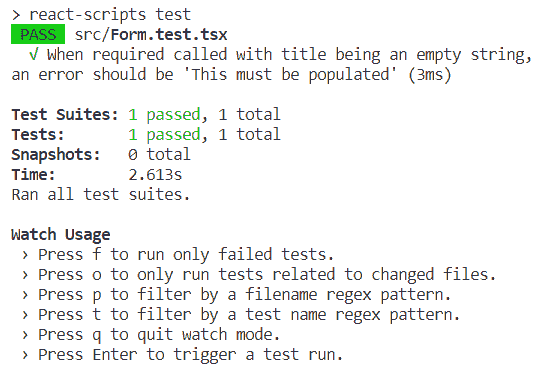

1.  让我们更改测试中的预期结果，使测试失败：

```jsx
expect(result).toBe("This must be populatedX");
```

当我们保存测试文件时，Jest 会自动执行测试，并将失败输出到终端，如下所示：

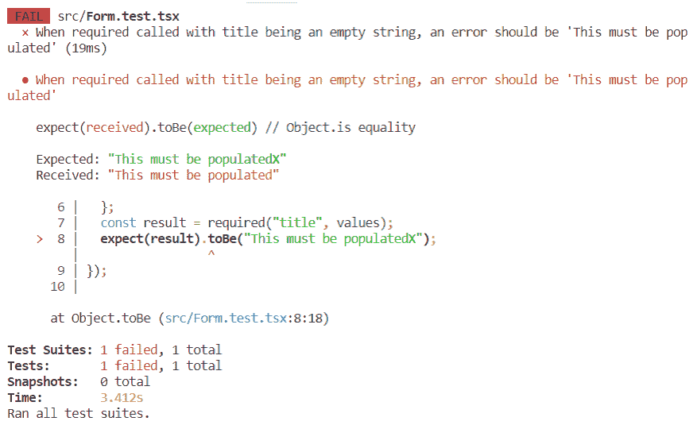

Jest 为我们提供了有关失败的宝贵信息。它告诉我们：

+   哪个测试失败了

+   预期结果与实际结果的比较

+   我们测试代码中发生失败的那一行

这些信息帮助我们快速解决测试失败。

1.  在继续之前，让我们纠正我们的测试代码：

```jsx
expect(result).toBe("This must be populated");
```

当我们保存更改时，测试现在应该通过。

# 了解 Jest 观察选项

在 Jest 执行我们的测试后，它会提供以下选项：

```jsx
> Press f to run only failed tests.
> Press o to only run tests related to changed files.
> Press p to filter by a filename regex pattern.
> Press t to filter by a test name regex pattern.
> Press q to quit watch mode.
> Press Enter to trigger a test run.
```

这些选项让我们指定应该执行哪些测试，这对于测试数量增加时非常有用。让我们探索一些这些选项：

1.  如果我们按下*F*，Jest 将只执行失败的测试。在我们的代码中，我们得到确认我们没有失败的测试：

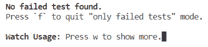

1.  让我们按下*F*键退出此选项，并返回到所有可用的选项。

1.  现在，让我们按下*P*。这允许我们测试特定文件或与正则表达式模式匹配的文件集合。当提示输入文件名模式时，让我们输入`form`：

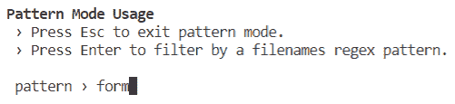

我们在`Form.test.tsx`中的测试将会被执行。

1.  我们将保留文件名过滤器并按*T*。这将允许我们通过测试名称添加额外的过滤器。让我们输入`required`：

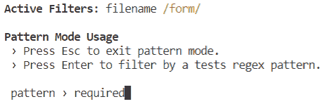

我们对`required`函数的测试将会被执行。

1.  要清除过滤器，我们可以按*C*。

如果我们收到错误信息——watch 不支持没有 git/hg，请使用--watchAll，这是因为我们的项目不在 Git 存储库中。我们可以通过在终端中输入`git init`命令来解决这个问题。

我们已经很好地掌握了可用于执行测试的选项。

# 为单元测试结果添加结构

随着我们实施更多的单元测试，将单元测试结果添加一些结构是很有用的，这样我们就可以更容易地阅读它们。有一个名为`describe`的 Jest 函数，我们可以用它来将某些测试的结果分组在一起。如果一个函数的所有测试都被分组在一起，可能会更容易阅读测试结果。

让我们这样做，并使用 Jest 中的`describe`函数重构我们之前创建的单元测试：

```jsx
describe("required", () => {
  test("When required called with title being an empty string, an error should be 'This must be populated'", () => {
    const values: IValues = {
      title: ""
    };
    const result = required("title", values);
    expect(result).toBe("This must be populated");
  });
});
```

describe 函数接受两个参数：

+   第一个参数是测试组的标题。我们已经为此使用了我们正在测试的函数名称。

+   第二个参数是包含要执行的测试的箭头函数。我们已经将我们的原始测试放在这里。

当我们保存我们的测试文件时，测试将自动运行，并且我们改进的输出将显示在终端上，测试结果显示在`required`标题下：

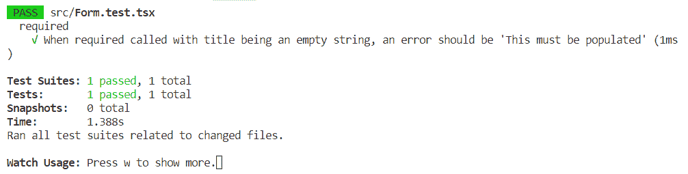

我们开始熟悉 Jest，已经实现并执行了一个单元测试。在下一节中，我们将继续进行更复杂的单元测试组件的主题。

# 测试组件

组件的单元测试是具有挑战性的，因为组件具有依赖项，如浏览器的 DOM 和 React 库。在我们进行必要的检查之前，我们如何在测试代码中渲染组件？在编写用户交互的代码时，如何触发 DOM 事件，比如点击按钮？

我们将在本节中回答这些问题，通过对我们在 React 商店中创建的`ContactUs`组件进行一些测试来实现。

# 创建一个基本组件测试

我们将首先创建一个单元测试，以验证在不填写字段的情况下提交“联系我们”表单会在页面上显示错误：

1.  我们将对`ContactUs`组件进行单元测试。我们将首先在`src`文件夹中创建一个名为`ContactUs.test.tsx`的文件。

1.  我们将使用`ReactDOM`来渲染`ContactUs`组件的测试实例。让我们导入`React`和`ReactDOM`：

```jsx
import React from "react";
import ReactDOM from "react-dom";
```

1.  我们将模拟表单提交事件，因此让我们从 React 测试工具中导入`Simulate`函数：

```jsx
import { Simulate } from "react-dom/test-utils";
```

1.  现在让我们导入需要测试的组件：

```jsx
import ContactUs from "./ContactUs";
```

1.  我们还需要从`Form.tsx`中导入提交结果接口：

```jsx
import { ISubmitResult } from "./Form";
```

1.  让我们开始使用 Jest 的`test`函数创建我们的测试，并将结果输出到`ContactUs`组。

```jsx
describe("ContactUs", () => {
  test("When submit without filling in fields should display errors", () => {
    // TODO - implement the test
  });
});
```

1.  我们测试实现中的第一个任务是在 DOM 中创建我们的 React 组件：

```jsx
test("When submit without filling in fields should display errors", () => {
  const handleSubmit = async (): Promise<ISubmitResult> => {
 return {
 success: true
 };
 };

 const container = document.createElement("div");
 ReactDOM.render(<ContactUs onSubmit={handleSubmit} />, container);

 // TODO - submit the form and check errors are shown

 ReactDOM.unmountComponentAtNode(container);
});
```

首先，我们创建一个容器`div`标签，然后将我们的`ContactUs`组件渲染到其中。我们还为`onSubmit`属性创建了一个处理程序，它返回成功。测试中的最后一行通过移除测试中创建的 DOM 元素来进行清理。

1.  接下来，我们需要获取对表单的引用，然后提交它：

```jsx
ReactDOM.render(<ContactUs onSubmit={handleSubmit} />, container);

const form = container.querySelector("form");
expect(form).not.toBeNull();
Simulate.submit(form!);

// TODO - check errors are shown

ReactDOM.unmountComponentAtNode(container);
```

以下是一步一步的描述：

+   我们使用`querySelector`函数，传入`form`标签来获取对`form`标签的引用。

+   然后我们通过使用 Jest 的`expect`函数和`not`和`toBeNull`函数链式调用来检查表单是否不是`null`。

+   使用 React 测试工具中的`Simulate`函数来模拟`submit`事件。我们在`form`变量后面使用`!`来告诉 TypeScript 编译器它不是`null`。

1.  我们的最终任务是检查验证错误是否显示：

```jsx
Simulate.submit(form!);

const errorSpans = container.querySelectorAll(".form-error");
expect(errorSpans.length).toBe(2);

ReactDOM.unmountComponentAtNode(container);
```

让我们一步一步来看：

+   我们在容器 DOM 节点上使用`querySelectorAll`函数，传入一个 CSS 选择器来查找应该包含错误的`span`标签

+   然后我们使用 Jest 的`expect`函数来验证页面上显示了两个错误

1.  当测试运行时，它应该成功通过，给我们两个通过的测试：

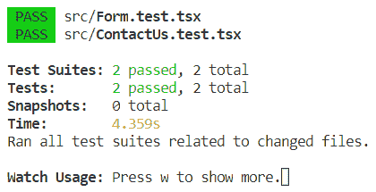

在这个测试中，Jest 在一个虚拟 DOM 中渲染组件。表单`submit`事件也是通过标准的 React 测试工具中的`simulate`函数模拟的。因此，为了方便交互式组件测试，需要进行大量的模拟。

还要注意的是，我们在测试代码中引用了内部实现细节。我们引用了一个`form`标签，以及一个`form-error`CSS 类。如果我们以后将此 CSS 类名称更改为`contactus-form-error`，我们的测试将会失败，而我们的应用可能并没有问题。

这被称为**false positive**，并且可以使具有这些测试的代码库非常耗时。

# 使用 react-testing-library 改进我们的测试

react-testing-library 是一组工具，帮助我们为 React 组件编写可维护的测试。它主要帮助我们从测试代码中删除实现细节。

我们将使用这个库来从我们的测试代码中删除 CSS 类引用，以及与 React 事件系统的紧耦合。 

# 安装 react-testing-library

让我们首先通过终端安装`react-testing-library`作为开发依赖：

```jsx
npm install --save-dev react-testing-library
```

几秒钟后，这将被添加到我们的项目中。

# 从我们的测试中删除 CSS 类引用

我们将通过删除对`form-error`CSS 类的依赖来改进我们的测试。相反，我们将通过错误文本获取错误的引用，这是用户在屏幕上看到的，而不是实现细节：

1.  我们将从`react-testing-library`导入一个`render`函数，现在我们将使用它来渲染我们的组件。我们还将导入一个`cleanup`函数，在测试结束时我们将使用它来从 DOM 中移除测试组件：

```jsx
import { render, cleanup} from "react-testing-library";
```

1.  我们可以使用我们刚刚导入的`render`函数来渲染我们的组件，而不是使用`ReactDOM.render`，如下所示：

```jsx
test("When submit without filling in fields should display errors", () => {
  const handleSubmit = async (): Promise<ISubmitResult> => {
    return {
      success: true
    };
  };
  const { container, getAllByText } = render(
 <ContactUs onSubmit={handleSubmit} />
 );

  const form = container.querySelector("form");
  ...
});
```

我们将容器 DOM 节点存储在`container`变量中，还有一个`getallByText`函数，我们将使用它来获取显示的错误的引用。

1.  现在让我们使用`getAllByText`函数来获取页面上显示的错误：

```jsx
Simulate.submit(form!);

const errorSpans = getAllByText("This must be populated");
expect(errorSpans.length).toBe(2);
```

1.  我们要做的最后一项更改是在测试结束时使用我们刚刚导入的`cleanup`函数清理我们的 DOM，而不是`ReactDOM.unmountComponentAtNode`。我们还将在 Jest 的`afterEach`函数中执行此操作。我们完成的测试现在应该如下所示：

```jsx
afterEach(cleanup);

describe("ContactUs", () => {
  test("When submit without filling in fields should display errors", () => {
    const handleSubmit = async (): Promise<ISubmitResult> => {
      return {
        success: true
      };
    };
    const { container, getAllByText } = render(
      <ContactUs onSubmit={handleSubmit} />
    );

    const form = container.querySelector("form");
    expect(form).not.toBeNull();
    Simulate.submit(form!);

    const errorSpans = getAllByText("This must be populated");
    expect(errorSpans.length).toBe(2);
  });
});
```

当测试运行时，它应该仍然正常执行，并且测试应该通过。

# 使用`fireEvent`进行用户交互

我们现在将转而依赖于本机事件系统，而不是 React 的事件系统，后者位于其之上。这使我们更接近测试用户在使用我们的应用时发生的情况，并增加了我们对测试的信心：

1.  让我们首先通过从`react-testing-library`导入语句中添加`fireEvent`函数：

```jsx
import { render, cleanup, fireEvent } from "react-testing-library";
```

1.  我们将在对`render`函数的调用中解构变量时添加`getByText`函数：

```jsx
const { getAllByText, getByText } = render(
  <ContactUs onSubmit={handleSubmit} />
);
```

我们还可以删除解构的`container`变量，因为它将不再需要。

1.  然后，我们可以使用此函数获取对提交按钮的引用。之后，我们可以使用我们导入的`fireEvent`函数来点击按钮：

```jsx
const { getAllByText, getByText } = render(
  <ContactUs onSubmit={handleSubmit} />
);

const submitButton = getByText("Submit");
fireEvent.click(submitButton);

const errorSpans = getAllByText("This must be populated");
expect(errorSpans.length).toBe(2);
```

之前引用`form`标签的代码现在已经被移除。

当测试运行时，它仍然通过。

因此，我们的测试引用用户看到的项目，而不是实现细节，并且不太可能出现意外中断。

# 为有效的表单提交创建第二个测试

现在我们已经掌握了如何编写健壮测试的要领，让我们添加第二个测试，检查当表单填写不正确时是否不显示验证错误：

1.  我们将从我们的`ContactUs`组中创建一个新的测试：

```jsx
describe("ContactUs", () => {
  test("When submit without filling in fields should display errors", () => {
    ...
  });

  test("When submit after filling in fields should submit okay", () => {
 // TODO - render component, fill in fields, submit the form and check there are no errors
 });
});
```

1.  我们将以与第一个测试相同的方式渲染组件，但是解构稍有不同的变量：

```jsx
test("When submit after filling in fields should submit okay", () => {
  const handleSubmit = async (): Promise<ISubmitResult> => {
 return {
 success: true
 };
 };
 const { container, getByText, getByLabelText } = render(
 <ContactUs onSubmit={handleSubmit} />
 );
});
```

现在：

+   我们将需要`container`对象来检查是否显示了任何错误

+   我们将使用`getByText`函数来定位提交按钮

+   我们将使用`getByLabelText`函数来获取对我们输入的引用

1.  我们现在可以使用`getByLabelText`函数获取对名称输入的引用。之后，我们进行一些检查，以验证名称输入确实存在：

```jsx
const { container, getByText, getByLabelText } = render(
  <ContactUs onSubmit={handleSubmit} />
);

const nameField: HTMLInputElement = getByLabelText(
 "Your name"
) as HTMLInputElement;
expect(nameField).not.toBeNull();
```

1.  然后，我们需要模拟用户填写此输入。我们通过调用本机的`change`事件来实现这一点，传入所需的事件参数，其中包括我们的输入值：

```jsx
const nameField: HTMLInputElement = getByLabelText(
  "Your name"
) as HTMLInputElement;
expect(nameField).not.toBeNull();
fireEvent.change(nameField, {
 target: { value: "Carl" }
});
```

我们已经模拟了用户将名称字段设置为`Carl`。

在调用`getByLabelText`后，我们使用类型断言来通知 TypeScript 编译器返回的元素是`HTMLInputElement`类型，这样我们就不会得到编译错误。

1.  然后我们可以按照相同的模式填写电子邮件字段：

```jsx
const nameField: HTMLInputElement = getByLabelText(
  "Your name"
) as HTMLInputElement;
expect(nameField).not.toBeNull();
fireEvent.change(nameField, {
  target: { value: "Carl" }
});

const emailField = getByLabelText("Your email address") as HTMLInputElement;
expect(emailField).not.toBeNull();
fireEvent.change(emailField, {
 target: { value: "carl.rippon@testmail.com" }
});
```

在这里，我们模拟用户将电子邮件字段设置为`carl.rippon@testmail.com`。

1.  然后，我们可以通过点击提交按钮来提交表单，就像我们第一次测试时一样：

```jsx
fireEvent.change(emailField, {
  target: { value: "carl.rippon@testmail.com" }
});

const submitButton = getByText("Submit");
fireEvent.click(submitButton); 
```

1.  我们的最后任务是验证屏幕上没有显示错误。不幸的是，我们不能像上次测试中使用`getAllByText`函数，因为这个函数期望至少找到一个元素，而在我们的情况下，我们期望没有元素。因此，在进行此检查之前，我们将在错误周围添加一个包装的`div`标签。让我们去`Form.tsx`并做这个：

```jsx
{context.errors[name] && context.errors[name].length > 0 && (
 <div data-testid="formErrors">
    {context.errors[name].map(error => (
      <span key={error} className="form-error">
        {error}
      </span>
    ))}
  </div>
)}
```

我们给`div`标签添加了一个`data-testid`属性，我们将在我们的测试中使用它。

1.  让我们回到我们的测试。我们现在可以使用`data-testid`属性定位围绕错误的`div`标签。然后我们可以验证这个`div`标签是`null`，因为没有显示错误：

```jsx
fireEvent.click(submitButton); 

const errorsDiv = container.querySelector("[data-testid='formErrors']");
expect(errorsDiv).toBeNull();
```

当测试在我们的测试套件中运行时，我们会发现现在有三个通过的测试。

不过，引用`data-testid`属性是一个实现细节，对吗？用户看不到或关心`data-testid`属性，这似乎与我们之前说的相矛盾。

这有点是一个实现细节，但它是专门为我们的测试而设计的。因此，实现重构不太可能意外地破坏我们的测试。

在下一节中，我们将添加另一个测试，这次使用 Jest 快照测试。

# 使用 Jest 快照测试

快照测试是 Jest 将渲染组件的所有元素和属性与先前渲染组件的快照进行比较的测试。如果没有差异，那么测试通过。

我们将添加一个测试来验证`ContactUs`组件是否正常渲染，通过使用 Jest 快照测试来检查 DOM 节点：

1.  我们将在`ContactUs`测试组中创建一个标题为“渲染正常”的测试，以与以前相同的方式渲染组件：

```jsx
describe("ContactUs", () => {
  ...
  test("Renders okay", () => {
 const handleSubmit = async (): Promise<ISubmitResult> => {
 return {
 success: true
 };
 };
 const { container } = render(<ContactUs onSubmit={handleSubmit} />);

 // TODO - do the snapshot test
 });
});
```

1.  现在我们可以添加一行来执行快照测试：

```jsx
test("Renders okay", () => {
  const handleSubmit = async (): Promise<ISubmitResult> => {
    return {
      success: true
    };
  };
  const { container } = render(<ContactUs onSubmit={handleSubmit} />);

  expect(container).toMatchSnapshot();
});
```

进行快照测试非常简单。我们将要比较的 DOM 节点传递给 Jest 的`expect`函数，然后在其后链接`toMatchSnapshot`函数。

当测试运行时，我们将在终端中得到快照已被写入的确认，如下所示：

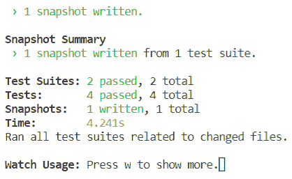

1.  如果我们查看我们的`src`文件夹，我们会看到现在包含一个`__snapshots__`文件夹。如果我们查看这个文件夹，我们会看到一个名为`ContactUs.test.tsx.snap`的文件。打开文件，我们会看到以下内容：

```jsx
// Jest Snapshot v1, https://goo.gl/fbAQLP

exports[`ContactUs Renders okay 1`] = `
<div>
  <form
    class="form"
    novalidate=""
  >
    <div
      class="form-group"
    >
      <label
        for="name"
      >
        Your name
      </label>
      <input
        id="name"
        type="text"
        value=""
      />
    </div>
    ...
  </form>
</div>
`;
```

这个片段中有一些内容被剥离了，但我们明白：我们从传入`toMatchSnapshot`函数的`container`元素中得到了每个 DOM 节点的副本，包括它们的属性。

不过，这个测试与我们的实现紧密耦合。因此，对 DOM 结构或属性的任何更改都将破坏我们的测试。

1.  举个例子，在`Form.tsx`中的`Form`组件中添加一个`div`标签：

```jsx
<form ...>
  <div>{this.props.children}</div>
  ...
</form>
```

当测试运行时，我们将看到确认我们的测试已经失败。Jest 在终端中很好地显示了差异：

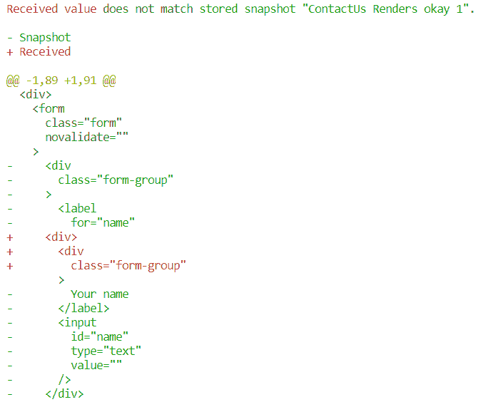

1.  我们很高兴这是一个有效的改变，所以我们可以按*U*让 Jest 更新快照：

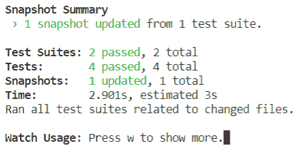

那么，快照测试是好事还是坏事呢？它们是不稳定的，因为它们与组件的实现紧密耦合。但是它们非常容易创建，当它们出现问题时，Jest 会很好地突出显示问题区域，并允许我们有效地纠正测试快照。它们非常值得一试，看看你的团队是否从中获得价值。

在本章中，我们已经学到了很多关于单元测试 React 和 TypeScript 应用程序的知识。接下来，我们将学习如何模拟依赖关系。

# 模拟依赖

模拟组件的依赖关系可以使组件更容易测试。但是，如果我们模拟了太多东西，测试是否真的在验证组件在我们的真实应用程序中是否能正常工作呢？

确定要模拟的内容是编写单元测试时最困难的任务之一。有一些东西是有意义模拟的，比如 REST API。REST API 是前端和后端之间的一个相当固定的契约。模拟 REST API 也可以让我们的测试运行得又快又顺利。

在这一部分，我们最终将学习如何模拟使用`axios`进行的 REST API 调用。不过首先，我们将学习 Jest 的函数模拟功能。

# 在 Jest 中使用模拟函数

我们将对验证提交“联系我们”表单而未填写字段会导致页面显示错误的测试进行另一个改进。我们将添加一个额外的检查，以确保提交处理程序不会被执行：

1.  让我们回到我们编写的第一个组件测试：`ContactUs.test.tsx`。我们手动创建了一个`handleSubmit`函数，我们在`ContactUs`组件的实例中引用了它。让我们将其更改为 Jest 模拟函数：

```jsx
const handleSubmit = jest.fn();
```

我们的测试将像以前一样正确运行，但这次是 Jest 为我们模拟函数。

1.  现在 Jest 正在模拟提交处理程序，我们可以在测试结束时检查它是否被调用。我们使用`not`和`toBeCalled` Jest 匹配函数来做到这一点：

```jsx
const errorSpans = container.querySelectorAll(".form-error");
expect(errorSpans.length).toBe(2);

expect(handleSubmit).not.toBeCalled();
```

这真的很好，因为我们不仅简化了我们的提交处理程序函数，而且还很容易地添加了一个检查来验证它是否被调用。

让我们继续实施的第二个测试，验证`Contact Us`表单是否被正确提交：

1.  我们将再次更改`handleSubmit`变量以引用 Jest 模拟函数：

```jsx
const handleSubmit = jest.fn();
```

1.  让我们验证提交处理程序是否被调用。我们使用`toBeCalledTimes` Jest 函数传入我们期望函数被调用的次数，这在我们的情况下是`1`：

```jsx
const errorsDiv = container.querySelector("[data-testid='formErrors']");
expect(errorsDiv).toBeNull();

expect(handleSubmit).toBeCalledTimes(1);
```

当测试执行时，它仍应该通过。

1.  还有一个有用的检查我们可以做。我们知道提交处理程序正在被调用，但它是否有正确的参数？我们可以使用`toBeCalledWith` Jest 函数来检查这一点：

```jsx
expect(handleSubmit).toBeCalledTimes(1);
expect(handleSubmit).toBeCalledWith({
 name: "Carl",
 email: "carl.rippon@testmail.com",
 reason: "Support",
 notes: ""
});
```

同样，当测试执行时，它仍应该通过。

因此，通过让 Jest 模拟我们的提交处理程序，我们很快为我们的测试添加了一些有价值的额外检查。

# 使用`axios-mock-adapter`模拟 Axios

我们将转移到我们在第九章中创建的项目，*与 Restful API 交互*。我们将添加一个测试，验证帖子是否正确呈现在页面上。我们将模拟 JSONPlaceholder REST API，这样我们就可以控制返回的数据，使我们的测试可以顺利快速地执行：

1.  首先，我们需要安装`axios-mock-adapter`包作为开发依赖：

```jsx
npm install axios-mock-adapter --save-dev
```

1.  我们还将安装`react-testing-library`：

```jsx
npm install react-testing-library --save-dev
```

1.  项目已经有一个测试文件`App.test.tsx`，其中包括对`App`组件的基本测试。我们将删除测试，但保留导入，因为我们需要这些。

1.  此外，我们将从 react-testing-library 导入一些函数，`axios`和一个`MockAdapter`类，我们将使用它来模拟 REST API 调用：

```jsx
import { render, cleanup, waitForElement } from "react-testing-library";
import axios from "axios";
import MockAdapter from "axios-mock-adapter";
```

1.  让我们在每个测试后添加通常的清理行：

```jsx
afterEach(cleanup);
```

1.  我们将使用适当的描述创建我们的测试，并将其放在`App`组下：

```jsx
describe("App", () => {
  test("When page loads, posts are rendered", async () => {

    // TODO - render the app component with a mock API and check that the posts in the rendered list are as expected
```

```jsx
      });
});
```

请注意，`arrow`函数标有`async`关键字。这是因为我们最终会在测试中进行异步调用。

1.  我们在测试中的第一项工作是使用`MockAdapter`类模拟 REST API 调用：

```jsx
test("When page loads, posts are rendered", async () => {
    const mock = new MockAdapter(axios);
 mock.onGet("https://jsonplaceholder.typicode.com/posts").reply(200, [
 {
 userId: 1,
 id: 1,
 title: "title test 1",
 body: "body test 1"
 },
 {
 userId: 1,
 id: 2,
 title: "title test 2",
 body: "body test 2"
 }
 ]);
});
```

我们使用`onGet`方法来定义调用获取帖子的 URL 时所需的响应 HTTP 状态码和主体。因此，对 REST API 的调用应该返回包含我们的测试数据的两个帖子。

1.  我们需要检查帖子是否正确渲染。为了做到这一点，我们将在`App.tsx`中的无序帖子列表中添加`data-testid`属性。我们只在有数据时才会渲染这个。

```jsx
{this.state.posts.length > 0 && (
  <ul className="posts" data-testid="posts">
    ...
  </ul>
)}
```

1.  在我们的测试中，我们现在可以渲染组件并解构`getByTestId`函数：

```jsx
mock.onGet("https://jsonplaceholder.typicode.com/posts").reply(...);
const { getByTestId } = render(<App />);
```

1.  我们需要检查渲染的帖子是否正确，但这很棘手，因为这些是异步渲染的。我们需要在进行检查之前等待帖子列表被添加到 DOM 中。我们可以使用 react-testing-library 中的`waitForElement`函数来实现这一点：

```jsx
const { getByTestId } = render(<App />);
const postsList: any = await waitForElement(() => getByTestId("posts"));
```

`waitForElement`函数接受一个箭头函数作为参数，然后返回我们正在等待的元素。我们使用`getByTestId`函数获取帖子列表，它使用`data-testid`属性找到它。

1.  然后，我们可以使用快照测试来检查帖子列表中的内容是否正确：

```jsx
const postsList: any = await waitForElement(() => getByTestId("posts"));
expect(postsList).toMatchSnapshot();
```

1.  在我们的测试可以成功执行之前，我们需要在`tsconfig.json`中进行更改，以便 TypeScript 编译器知道我们正在使用`async`和`await`：

```jsx
{
  "compilerOptions": {
    "target": "es5",
    "lib": ["dom", "es2015"],
    ...
  },
  "include": ["src"]
}
```

当测试执行时，将创建快照。如果我们检查快照，它将包含两个包含我们告诉 REST API 返回的数据的列表项。

我们已经了解了 Jest 和 react-testing-library 中一些很棒的功能，这些功能帮助我们编写可维护的纯函数和 React 组件的测试。

然而，我们如何知道我们的应用程序的哪些部分由单元测试覆盖了，更重要的是，哪些部分没有覆盖？我们将在下一节中找出答案。

# 获取代码覆盖率

代码覆盖率是指我们的应用代码有多少被单元测试覆盖。当我们编写单元测试时，我们会对覆盖了哪些代码和哪些代码没有覆盖有一个大致的了解，但随着应用的增长和时间的推移，我们会失去对此的追踪。

Jest 带有一个很棒的代码覆盖工具，所以我们不必记住哪些代码被覆盖了。在本节中，我们将使用这个工具来发现我们在上一节中工作的项目中的代码覆盖情况，我们在那里模拟了`axios`：

1.  我们的第一个任务是添加一个`npm`脚本，该脚本将在打开覆盖跟踪工具时运行测试。让我们添加一个名为`test-coverage`的新脚本，其中包括在执行`react-scripts`时使用`--coverage`选项：

```jsx
"scripts": {
  "start": "react-scripts start",
  "build": "react-scripts build",
  "test": "react-scripts test",
  "test-coverage": "react-scripts test --coverage",
  "eject": "react-scripts eject"
},
```

1.  然后我们可以在终端中运行这个命令：

```jsx
npm run test-coverage
```

几秒钟后，Jest 将在终端上呈现每个文件的高级覆盖统计信息：

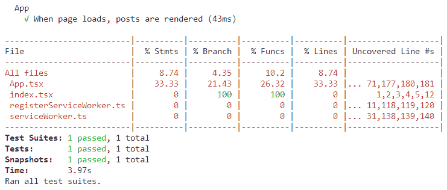

1.  如果我们查看项目文件结构，我们会看到一个`coverage`文件夹已经添加了一个`lcov-report`文件夹。`lcov-report`文件夹中有一个`index.html`文件，其中包含了每个文件的覆盖率的更详细信息。让我们打开它并看一看：

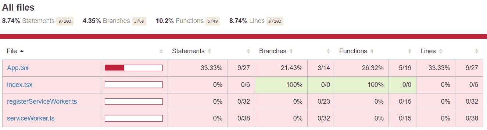

我们看到了与终端中呈现的相同信息。

这四列统计数据的含义是什么？

+   `Statements`列显示了代码中执行了多少个语句

+   `Branches`列显示了代码中条件语句中执行了多少分支

+   `Function`列显示了代码中调用了多少个函数

+   `Line`列显示了代码中执行了多少行。通常，这将与`Statements`数字相同。但是，如果将多个语句放在一行上，它可能会有所不同。例如，以下内容被计为一行，但包含两个语句：

```jsx
let name = "Carl"; console.log(name);
```

1.  我们可以深入到每个文件中找出哪些具体的代码没有被覆盖。让我们点击`App.tsx`链接：

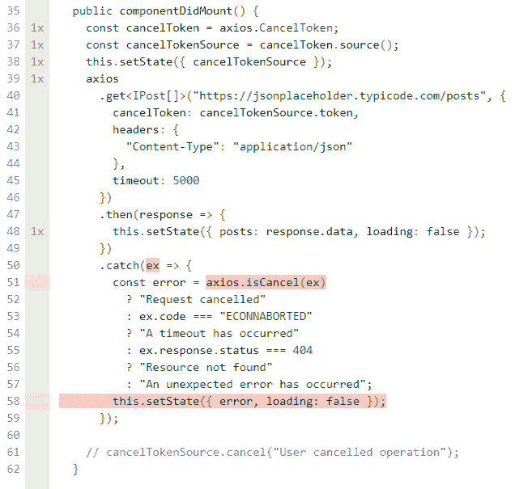

左侧带有绿色背景的`1x`表示这些代码行已被我们的测试执行了一次。红色高亮显示的代码是我们的测试未覆盖到的代码。

因此，获取覆盖率统计信息和确定我们可能想要实现的其他测试是相当容易的。这是非常值得使用的，可以让我们确信我们的应用程序经过了充分的测试。

# 总结

在本章中，我们学会了如何使用 Jest 测试用 TypeScript 编写的纯函数。我们只需使用我们想要测试的参数执行函数，并使用 Jest 的`expect`函数与 Jest 的匹配器函数之一，比如`toBe`，来验证结果。

我们看了如何与 Jest 的测试运行器交互，以及如何应用过滤器，以便只执行我们关注的测试。我们了解到测试 React 和 TypeScript 组件比测试纯函数更复杂，但 Jest 和 react-testing-library 为我们提供了很大的帮助。

我们还学会了如何使用`render`函数渲染组件，以及如何使用各种函数与检查元素进行交互，比如来自 react-testing-library 的`getByText`和`getLabelByText`。

我们学会了如何使用 react-testing-library 中的`waitForElement`函数轻松测试异步交互。我们现在明白了在测试中不引用实现细节的好处，这将帮助我们构建更健壮的测试。

我们还讨论了 Jest 的巧妙快照测试工具。我们看到这些测试经常会出问题，但也知道它们非常容易创建和更改的原因。

模拟和监视函数的能力是另一个我们现在了解的很棒的 Jest 功能。检查组件事件处理程序的函数是否以正确的参数被调用，确实可以为我们的测试增加价值。

我们讨论了`axios-mock-adapter`库，我们可以用它来模拟`axios` REST API 请求。这使我们能够轻松测试与 RESTful API 交互的容器组件。

我们现在知道如何快速确定我们需要实现的额外测试，以确保我们的应用程序经过了充分的测试。我们创建了一个`npm`脚本命令来实现这一点，使用`react-scripts`和`--coverage`选项。

总的来说，我们现在具有知识和工具，可以使用 Jest 为我们的应用程序稳健地创建单元测试。

Jasmine 和 Mocha 是两个流行的替代测试框架，与 Jest 相比的一个巨大优势是它被`create-react-app`配置为开箱即用。如果我们想使用它们，我们将不得不手动配置 Jasmine 和 Mocha。然而，如果您的团队已经熟悉其中任何一个工具，而不是学习另一个测试框架，那么 Jasmine 和 Mocha 也值得考虑。

Enzyme 是另一个与 Jest 一起用于测试 React 应用程序的流行库。它支持浅渲染，这是一种仅渲染组件中顶层元素而不是子组件的方法。这是值得探索的，但请记住，我们模拟得越多，我们离真相就越远，我们对应用程序是否经过充分测试的信心就越少。

# 问题

1.  假设我们正在实施一个 Jest 测试，并且我们有一个名为`result`的变量，我们想要检查它不是`null`。我们如何使用 Jest 匹配器函数来实现这一点？

1.  假设我们有一个名为`person`的变量，类型为`IPerson`：

```jsx
interface IPerson {
  id: number;
  name: string;
}
```

我们想要检查`person`变量是否为`{ id: 1, name: "bob" }`。我们如何使用 Jest 匹配器函数来实现这一点？

1.  在上一个问题中，我们是否可以使用 Jest 快照测试来进行我们的检查？如果可以，如何实现？

1.  我们实现了一个名为`CheckList`的组件，它从数组中呈现文本列表。每个列表项都有复选框，以便用户可以选择列表项。该组件有一个名为`onItemSelect`的函数属性，当用户通过选中复选框选择项目时会调用该函数。我们正在实施一个测试来验证`onItemSelect`属性是否有效。以下代码行在测试中呈现组件：

```jsx
const { container } = render(<SimpleList data={["Apple", "Banana", "Strawberry"]} onItemSelect={handleListItemSelect} />);
```

如何使用 Jest 模拟函数来处理`handleListItemSelect`并检查它是否被调用？

1.  在上一个问题中的`SimpleList`的实现中，`onItemSelect`函数接受一个名为`item`的参数，该参数是用户选择的`string`值。在我们的测试中，假设我们已经模拟了用户选择`Banana`。我们如何检查`onItemSelect`函数是否被调用，并且参数为`Banana`？

1.  在上述两个问题中的`SimpleList`的实现中，文本使用一个标签显示，该标签使用`for`属性与复选框相关联。我们如何使用 react-testing-library 中的函数来首先定位`Banana`复选框，然后检查它？

1.  在本章中，我们发现从 JSONPlaceholder REST API 渲染帖子的代码覆盖率很低。其中一个未覆盖的领域是在从 REST API 获取帖子时，在`componentDidMount`函数中处理 HTTP 错误代码。创建一个测试来覆盖代码的这一部分。

# 进一步阅读

以下资源对于查找有关单元测试 React 和 TypeScript 应用程序的更多信息很有用：

+   官方的 Jest 文档可以在以下链接找到：[`jestjs.io/`](https://jestjs.io/)

+   React Testing Library GitHub 存储库位于以下链接：[`github.com/kentcdodds/react-testing-library`](https://github.com/kentcdodds/react-testing-library)

+   阅读 Enzyme 的文档，请访问以下链接：[`airbnb.io/enzyme/docs/api/`](https://airbnb.io/enzyme/docs/api/)

+   Jasmine GitHub 页面如下：[`jasmine.github.io/index.html`](https://jasmine.github.io/index.html)

+   Mocha 主页可以在以下网址找到：[`mochajs.org/`](https://mochajs.org/)
