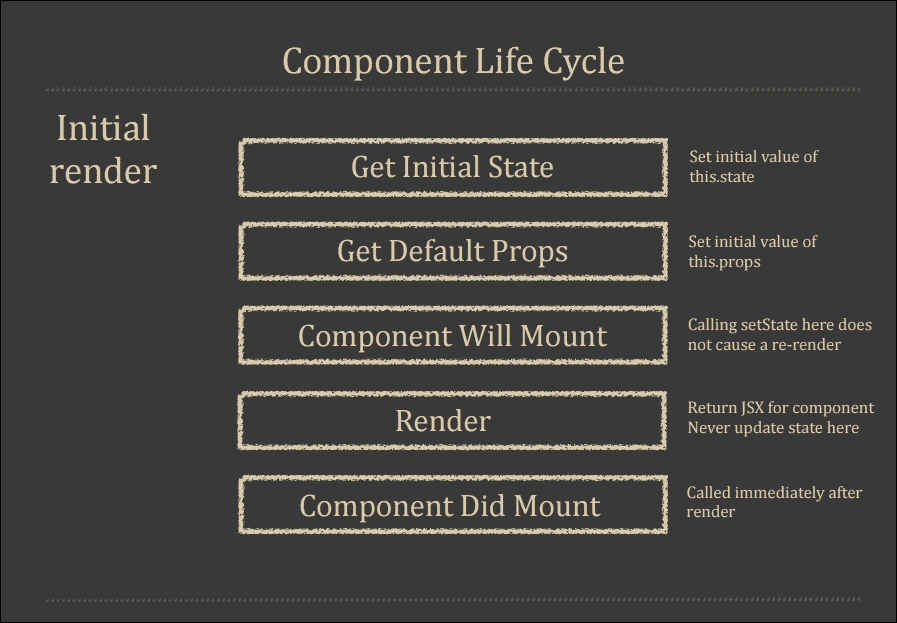
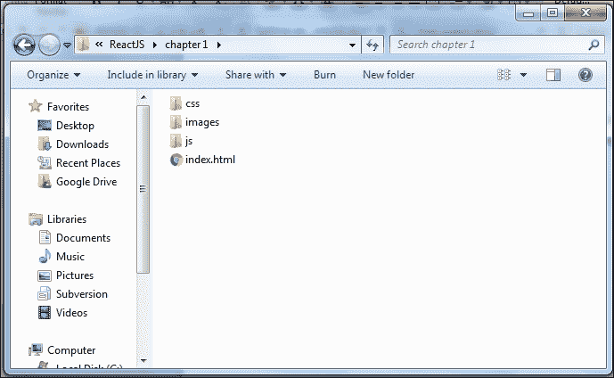
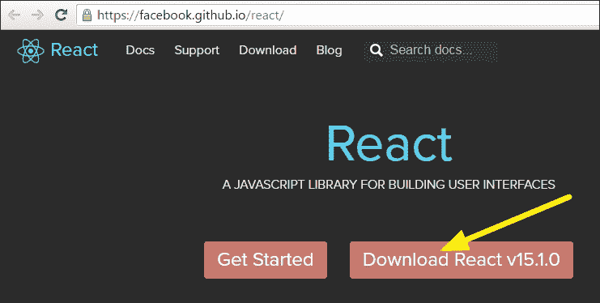
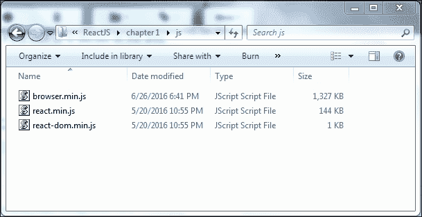
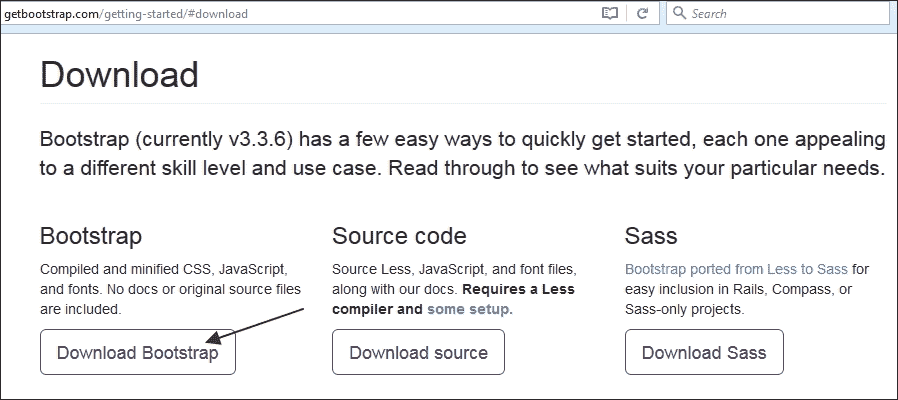
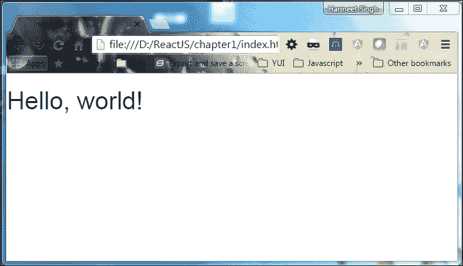
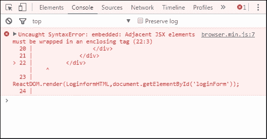
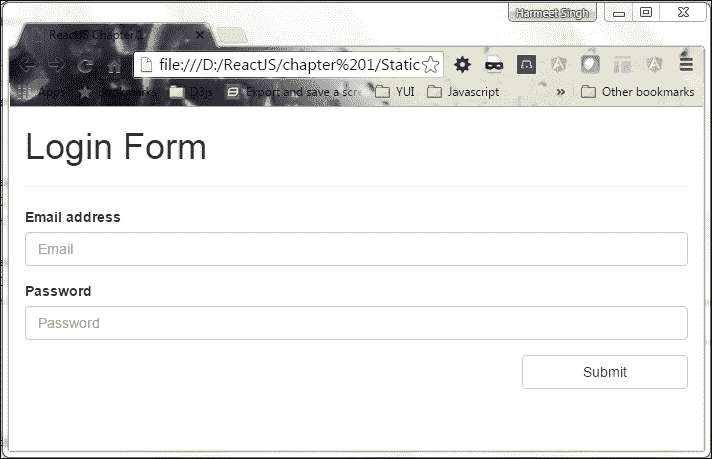
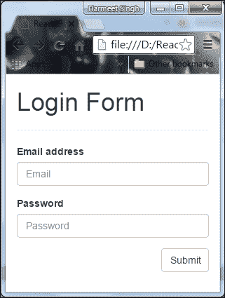

# 第一章：开始使用 React 和 Bootstrap

使用 JavaScript 和 CSS 构建现代 Web 应用程序有许多不同的方法，包括许多不同的工具选择和许多新的理论需要学习。本书向您介绍了 ReactJS 和 Bootstrap，您在学习现代 Web 应用程序开发时可能会遇到它们。它们都用于构建快速和可扩展的用户界面。React 以（视图）而闻名于 MVC。当我们谈论定义*M*和*C*时，我们需要寻找其他地方，或者我们可以使用其他框架如 Redux 和 Flux 来处理远程数据。

学习代码的最佳方法是编写代码，所以我们将立即开始。为了向您展示使用 Bootstrap 和 ReactJS 轻松上手的方法，我们将涵盖理论，并制作一个超级简单的应用程序，可以让我们构建一个表单，并实时在页面上显示它。

您可以以任何您感觉舒适的方式编写代码。尝试创建小组件/代码示例，这将让您更清楚/了解任何技术。现在，让我们看看这本书将如何在涉及 Bootstrap 和 ReactJS 时让您的生活变得更轻松。我们将涵盖一些理论部分，并构建两个简单的实时示例：

+   Hello World！使用 ReactJS

+   使用 React 和 Bootstrap 的简单静态表单应用程序

Facebook 通过引入 React 真正改变了我们对前端 UI 开发的看法。这种基于组件的方法的主要优势之一是易于理解，因为视图只是属性和状态的函数。

我们将涵盖以下主题：

+   设置环境

+   ReactJS 设置

+   Bootstrap 设置

+   为什么要使用 Bootstrap

+   使用 React 和 Bootstrap 的静态表单示例

# ReactJS

React（有时称为 React.js 或 ReactJS）是一个开源的 JavaScript 库，提供了一个将数据呈现为 HTML 的视图。组件通常用于呈现包含自定义 HTML 标记的其他组件的 React 视图。React 为您提供了一个微不足道的虚拟 DOM，强大的视图而无需模板，单向数据流和显式变异。当数据发生变化时，它在更新 HTML 文档方面非常有条理；并在现代单页应用程序上提供了组件的清晰分离。

观察以下示例，我们将清楚地了解普通 HTML 封装和 ReactJS 自定义 HTML 标记。

观察以下 JavaScript 代码片段：

```jsx
<section> 
    <h2>Add your Ticket</h2> 
</section> 
<script> 
    var root = document.querySelector
    ('section').createShadowRoot(); 
    root.innerHTML = '<style>h2{ color: red; }</style>' + 
    '<h2>Hello World!</h2>'; 
</script> 

```

观察以下 ReactJS 代码片段：

```jsx
var sectionStyle = { 
    color: 'red' 
}; 

var AddTicket = React.createClass({ 
    render: function() { 
        return (<section><h2 style={sectionStyle}> 
        Hello World!</h2></section>)} 
}) 
ReactDOM.render(<AddTicket/>, mountNode); 

```

随着应用程序的出现和进一步发展，确保组件以正确的方式使用是有利的。React 应用程序由可重用组件组成，这使得代码重用、测试和关注点分离变得容易。

React 不仅是 MVC 中的*V*，还具有有状态组件（有状态组件记住`this.state`中的所有内容）。它处理输入到状态变化的映射，并渲染组件。在这个意义上，它做了 MVC 所做的一切。

让我们来看一下 React 的组件生命周期及其不同的级别。我们将在接下来的章节中更多地讨论这个问题。观察以下图表：



### 注意

React 不是一个 MVC 框架；它是一个用于构建可组合用户界面和可重用组件的库。React 在 Facebook 的生产阶段使用，并且[instagram.com](https://www.instagram.com/?hl=en)完全基于 React 构建。

# 设置环境

当我们开始使用 ReactJS 制作应用程序时，我们需要进行一些设置，这只涉及一个 HTML 页面和包含一些文件。首先，我们创建一个名为`chapter1`的目录（文件夹）。在任何代码编辑器中打开它。直接在其中创建一个名为`index.html`的新文件，并添加以下 HTML5 样板代码：

```jsx
<!doctype html> 
<html class="no-js" lang=""> 
    <head> 
    <meta charset="utf-8"> 
<title>ReactJS Chapter 1</title> 
    </head> 
    <body> 
        <!--[if lt IE 8]> 
            <p class="browserupgrade">You are using an 
            <strong>outdated</strong> browser.  
            Please <a href="http://browsehappy.com/">
            upgrade your browser</a> to improve your 
            experience.</p> 
        <![endif]--> 
        <!-- Add your site or application content here --> 
        <p>Hello world! This is HTML5 Boilerplate.</p>      
    </body> 
</html> 

```

这是一个标准的 HTML 页面，一旦我们包含了 React 和 Bootstrap 库，就可以更新它。

现在我们需要在`chapter1`文件夹内创建`images`、`css`和`js`（JavaScript）等几个文件夹，以便使应用程序更易管理。完成文件夹结构后，它将如下所示：



# 安装 ReactJS 和 Bootstrap

创建文件夹结构完成后，我们需要安装 ReactJS 和 Bootstrap 两个框架。只需在页面中包含 JavaScript 和 CSS 文件即可。我们可以通过**内容传送网络**（**CDN**）来实现这一点，比如谷歌或微软，但我们将在应用程序中手动获取文件，这样就不必依赖互联网，可以离线工作。

## 安装 React

首先，我们需要转到此网址[`facebook.github.io/react/`](https://facebook.github.io/react/)，然后点击**下载 React v15.1.0**按钮：



这将为您提供最新版本的 ReactJS 的 ZIP 文件，其中包括 ReactJS 库文件和一些 ReactJS 的示例代码。

现在，我们在我们的应用程序中只需要两个文件：从提取的文件夹的`build`目录中的`react.min.js`和`react-dom.min.js`。

以下是我们需要遵循的几个步骤：

1.  将`react.min.js`和`react-dom.min.js`复制到您的项目目录，`chapter1/js`文件夹，并在编辑器中打开您的`index.html`文件。

1.  现在您只需要在页面的`head`标签部分添加以下脚本：

```jsx
        <script type="text/js" src="js/react.min.js"></script>
        <script type="text/js" src="js/react-dom.min.js"></script>
```

1.  现在我们需要在我们的项目中包含编译器来构建代码，因为现在我们正在使用诸如 npm 之类的工具。我们将从以下 CDN 路径下载文件，[`cdnjs.cloudflare.com/ajax/libs/babel-core/5.8.23/browser.min.js`](https://cdnjs.cloudflare.com/ajax/libs/babel-core/5.8.23/browser.min.js)，或者您可以直接给出 CDN 路径。

1.  `head`标签部分将如下所示：

```jsx
        <script type="text/js" src="js/react.min.js"></script>
        <script type="text/js" src="js/react-dom.min.js"></script> 
        <script type="text/js" src="js/browser.min.js"></script>
```

这是您的`js`文件夹的最终结构将是这样的：



# Bootstrap

Bootstrap 是由 Twitter 维护的开源前端框架，用于开发响应式网站和 Web 应用程序。它包括 HTML、CSS 和 JavaScript 代码来构建用户界面组件。这是开发强大的移动优先用户界面的快速简便的方式。

Bootstrap 网格系统允许您创建响应式的 12 列网格、布局和组件。它包括预定义的类，用于简单的布局选项（固定宽度和全宽度）。Bootstrap 有数十个预定义的可重用组件和自定义 jQuery 插件，如按钮、警报、下拉菜单、模态框、工具提示标签、分页、轮播、徽章、图标等等。

## 安装 Bootstrap

现在，我们需要安装 Bootstrap。访问[`getbootstrap.com/getting-started/#download`](http://getbootstrap.com/getting-started/#download)，然后点击**下载 Bootstrap**按钮：



这包括我们应用程序的`css`和`js`的编译和压缩版本；我们只需要 CSS`bootstrap.min.css`和`fonts`文件夹。这个样式表将为您提供所有组件的外观和感觉，并为我们的应用程序提供响应式布局结构。Bootstrap 的早期版本包括图标作为图像，但在 3 版本中，图标已被替换为字体。我们还可以根据应用程序中使用的组件自定义 Bootstrap CSS 样式表：

1.  解压缩 ZIP 文件夹，并将 Bootstrap CSS 从`css`文件夹复制到项目文件夹的 CSS 中。

1.  现在将 Bootstrap 的`fonts`文件夹复制到您的项目根目录中。

1.  在编辑器中打开你的`index.html`，并在`head`部分添加这个`link`标签：

```jsx
        <link rel="stylesheet" href="css/bootstrap.min.css">.
```

就是这样。现在我们可以再次在浏览器中打开`index.html`，看看我们正在处理的内容。以下是我们迄今为止编写的代码：

```jsx
<!doctype html> 
<html class="no-js" lang=""> 
    <head> 
        <meta charset="utf-8"> 
<title>ReactJS Chapter 1</title> 

<link rel="stylesheet" href="css/bootstrap.min.css"> 

<script type="text/javascript" src="js/react.min.js">
</script> 
<script type="text/javascript" src="js/react-dom.min.js">
</script> 
<script src="https://cdnjs.cloudflare.com/ajax/libs/babel-
core/5.8.23/browser.min.js"></script> 
    </head> 
    <body> 
        <!--[if lt IE 8]> 
            <p class="browserupgrade">You are using an
            <strong>outdated</strong> browser.  
            Please <a href="http://browsehappy.com/">upgrade
            your browser</a> to improve your experience.</p> 
        <![endif]--> 
        <!-- Add your site or application content here --> 

    </body> 
</html> 

```

# 使用 React

现在我们已经从 ReactJS 和 Bootstrap 样式表中初始化了我们的应用程序。现在让我们开始编写我们的第一个 Hello World 应用程序，使用`ReactDOM.render()`。

`ReactDOM.render`方法的第一个参数是我们要渲染的组件，第二个参数是它应该挂载（附加）到的 DOM 节点。观察以下代码：

```jsx
ReactDOM.render( ReactElement element, DOMElement container,
[function callback] )
```

为了将其转换为纯 JavaScript，我们在我们的 React 代码中使用包裹，`<script type"text/babel">`，这个标签实际上在浏览器中执行转换。

让我们从在`body`标签中放一个`div`标签开始：

```jsx
<div id="hello"></div>

```

现在，添加带有 React 代码的`script`标签：

```jsx
<script type="text/babel"> 
    ReactDOM.render( 
        <h1>Hello, world!</h1>, 
        document.getElementById('hello') 
    ); 
</script>

```

JavaScript 的 XML 语法称为 JSX。我们将在后续章节中探讨这一点。

让我们在浏览器中打开 HTML 页面。如果你在浏览器中看到**Hello, world!**，那么我们就走在了正确的轨道上。观察以下截图：



在上面的截图中，你可以看到它在你的浏览器中显示了**Hello, world!**。太棒了。我们已经成功完成了我们的设置，并构建了我们的第一个 Hello World 应用程序。以下是迄今为止我们编写的完整代码：

```jsx
<!doctype html> 
<html class="no-js" lang=""> 
    <head> 
        <meta charset="utf-8"> 
    <title>ReactJS Chapter 1</title>           
<link rel="stylesheet" href="css/bootstrap.min.css"> 

<script type="text/javascript" src="js/react.min.js"></script> 
<script type="text/javascript" src="js/react-dom.min.js"></script> 
    <script src="https://cdnjs.cloudflare.com/ajax/libs/babel-
    core/5.8.23/browser.min.js"></script> 
    </head> 
    <body> 
        <!--[if lt IE 8]> 
            <p class="browserupgrade">You are using an
            <strong>outdated</strong> browser.  
            Please <a href="http://browsehappy.com/">upgrade your
            browser</a> to improve your experience.</p> 
    <![endif]--> 
    <!-- Add your site or application content here --> 
    <div id="hello"></div> 
        <script type="text/babel"> 
            ReactDOM.render( 
                <h1>Hello, world!</h1>, 
                document.getElementById('hello') 
            ); 
        </script> 

    </body> 
</html>

```

# 使用 React 和 Bootstrap 创建静态表单

我们已经完成了我们的第一个使用 React 和 Bootstrap 的 Hello World 应用程序，一切看起来都很好，符合预期。现在是时候做更多的事情，创建一个静态登录表单，并将 Bootstrap 的外观和感觉应用到它上面。Bootstrap 是一个很好的方式，可以使您的应用程序成为不同移动设备的响应式网格系统，并在 HTML 元素上应用基本样式，包括一些类和 divs。

### 注意

响应式网格系统是一种简单、灵活、快速的方式，可以使您的 Web 应用程序具有响应性和移动优先性，适当地按设备和视口大小扩展到 12 列。

首先，让我们开始制作一个 HTML 结构，以遵循 Bootstrap 网格系统。

创建一个`div`，并添加一个`className .container`（固定宽度）和`.container-fluid`（全宽度）。使用`className`属性而不是使用`class`：

```jsx
<div className="container-fluid"></div> 

```

正如我们所知，`class`和`for`被不鼓励作为 XML 属性名称。此外，这些在许多 JavaScript 库中都是保留字，因此，为了有一个清晰的区别和相同的理解，我们可以使用`className`和`htmlFor`来代替使用`class`和`for`。创建一个`div`并添加`className="row"`。`row`必须放在`.container-fluid`中：

```jsx
<div className="container-fluid"> 
    <div className="row"></div> 
</div>

```

现在创建必须是行的直接子元素的列：

```jsx
<div className="container-fluid"> 
    <div className="row"> 
<div className="col-lg-6"></div> 
        </div> 
</div>
```

`.row`和`.col-xs-4`是预定义的类，可用于快速创建网格布局。

为页面的标题添加`h1`标签：

```jsx
<div className="container-fluid"> 
    <div className="row"> 
<div className="col-sm-6"> 
<h1>Login Form</h1> 
</div> 
    </div> 
</div>
```

网格列是由给定的`col-sm-*`中的指定数量的 12 个可用列创建的。例如，如果我们使用四列布局，我们需要指定`col-sm-3`以获得相等的列：

| **类名** | **设备** |
| --- | --- |
| `col-sm-*` | 小设备 |
| `col-md-*` | 中等设备 |
| `col-lg-*` | 大设备 |

我们使用`col-sm-*`前缀来调整我们的小设备的列。在列内，我们需要将我们的表单元素`label`和`input`标签包装在具有`form-group`类的`div`标签中：

```jsx
<div className="form-group"> 
    <label for="emailInput">Email address</label> 
    <input type="email" className="form-control" id="emailInput" 
    placeholder="Email"/> 
</div>

```

忘记 Bootstrap 的样式；我们需要在输入元素中添加`form-control`类。如果我们需要在`label`标签中添加额外的填充，那么我们可以在`label`上添加`control-label`类。

让我们快速添加其余的元素。我将添加一个`password`和`submit`按钮。

在 Bootstrap 的早期版本中，表单元素通常包装在具有`form-action`类的元素中。然而，在 Bootstrap 3 中，我们只需要使用相同的`form-group`而不是`form-action`。我们将在第二章中更详细地讨论 Bootstrap 类和响应性，*使用 React-Bootstrap 和 React 构建响应式主题*。

这是我们完整的 HTML 代码：

```jsx
<div className="container-fluid">
    <div className="row">
        <div className="col-lg-6">
            <form>
                <h1>Login Form</h1>
                <hr/>
                <div className="form-group">
                    <label for="emailInput">Email address</label>
                    <input type="email" className="form-control"
                    id="emailInput" placeholder="Email"/>
                </div>
                <div className="form-group">
                    <label for="passwordInput">Password</label>
                    <input type="password" className=
                    "form-control" id="passwordInput" 
                    placeholder="Password"/>
                </div>
                <button type="submit" className="btn btn-default
                col-xs-offset-9 col-xs-3">Submit</button>
            </form>
        </div>
    </div>
</div>
```

现在在`var loginFormHTML`脚本标签内创建一个对象，并将此 HTML 分配给它：

```jsx
Var loginFormHTML = <div className="container-fluid">
<div className="row">
    <div className="col-lg-6">
        <form>
            <h1>Login Form</h1>
            <hr/>
            <div className="form-group">
                <label for="emailInput">Email              
                address</label>
                <input type="email" className="form-control"
                id="emailInput" placeholder="Email"/>
            </div>
            <div className="form-group">
                <label for="passwordInput">Password</label>
                <input type="password" className="form-
                control" id="passwordInput" placeholder="Password"/>
            </div>
            <button type="submit" className="btn btn-default col-xs-
            offset-9 col-xs-3">Submit</button>
        </form>
    </div>
</div>
```

我们将在`React.DOM()`方法中传递这个对象，而不是直接传递 HTML：

```jsx
ReactDOM.render(LoginformHTML,document.getElementById('hello'));
```

我们的表单已经准备好了。现在让我们看看它在浏览器中的样子：



编译器无法解析我们的 HTML，因为我们没有正确地封闭其中一个`div`标签。您可以在我们的 HTML 中看到，我们没有在最后关闭包装器`container-fluid`。现在在最后关闭包装器标签，然后在浏览器中重新打开文件。 

### 提示

每当您手工编写 HTML 代码时，请仔细检查您的起始标记和结束标记。它应该被正确地编写/关闭，否则它将破坏您的 UI/前端外观和感觉。

在关闭`div`标签后的 HTML 如下：

```jsx
<!doctype html>
<html class="no-js" lang="">
    <head>
        <meta charset="utf-8">
        <title>ReactJS Chapter 1</title>
        <link rel="stylesheet" href="css/bootstrap.min.css">
        <script type="text/javascript" src="js/react.min.js"></script>
        <script type="text/javascript" src="js/react-dom.min.js"> 
        </script>
        <script src="js/browser.min.js"></script>
    </head>
    <body>
        <!-- Add your site or application content here -->
        <div id="loginForm"></div>
        <script type="text/babel">
            var LoginformHTML = 
            <div className="container-fluid">
             <div className="row">
            <div className="col-lg-6">
            <form>
              <h1>Login Form</h1>
            <hr/>
            <div className="form-group">
              <label for="emailInput">Email address</label>
              <input type="email" className="form-control" id=
              "emailInput" placeholder="Email"/>
            </div>
            <div className="form-group">
            <label for="passwordInput">Password</label>
            <input type="password" className="form-control"
            id="passwordInput" placeholder="Password"/>
            </div>
            <button type="submit" className="btn btn-default 
            col-xs-offset-9 col-xs-3">Submit</button>
            </form>
             </div>
            </div>
            </div>

ReactDOM.render(LoginformHTML,document.getElementById
('loginForm');

        </script>    
    </body>
</html>
```

现在，您可以在浏览器上检查您的页面，您将能够看到表单的外观和感觉如下屏幕截图所示：



现在它运行良好，看起来不错。Bootstrap 还提供了两个额外的类来使您的元素变小和变大：`input-lg`和`input-sm`。您还可以通过调整浏览器大小来检查响应式行为。观察以下屏幕截图：



看起来不错。我们的小型静态登录表单应用程序已经具备了响应式行为。

由于这是一个介绍性的章节，您可能会想知道 React 如何有益或有利？

这就是你的答案：

+   渲染您的组件非常容易

+   通过 JSX 的帮助，阅读组件的代码将会非常容易

+   JSX 还将帮助您检查布局以及检查组件之间的插件

+   您可以轻松测试您的代码，它还允许其他工具集成以进行增强

+   React 是一个视图层，您还可以将其与其他 JavaScript 框架一起使用。

上述观点是非常高层次的，我们将在接下来的章节中详细了解更多好处。

# 总结

我们简单的静态登录表单应用程序和 Hello World 示例看起来很棒，而且正好按照预期工作，所以让我们回顾一下我们在本章中学到的内容。

首先，我们看到了使用 JavaScript 文件和样式表轻松安装 ReactJS 和 Bootstrap 的方法。我们还看了 React 应用程序是如何初始化的，并开始构建我们的第一个表单应用程序。

我们创建的 Hello World 应用程序和表单应用程序演示了 React 和 Bootstrap 的一些基本功能，例如以下内容：

+   ReactDOM

+   渲染

+   Browserify

+   Bootstrap

使用 Bootstrap，我们努力为不同的移动设备实现响应式网格系统，并应用了一些类和 div 的基本 HTML 元素样式。

我们还看到了框架的新的移动优先响应式设计，而不会在我们的标记中添加不必要的类或元素。

在第二章中，*让我们使用 React-Bootstrap 和 React 构建一个响应式主题*，我们将深入了解 Bootstrap 的特性以及如何使用网格。我们将探索一些更多的 Bootstrap 基础知识，并介绍我们将在本书中构建的项目。
