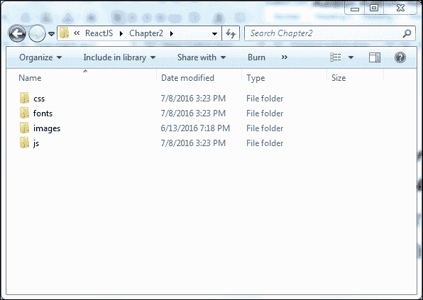
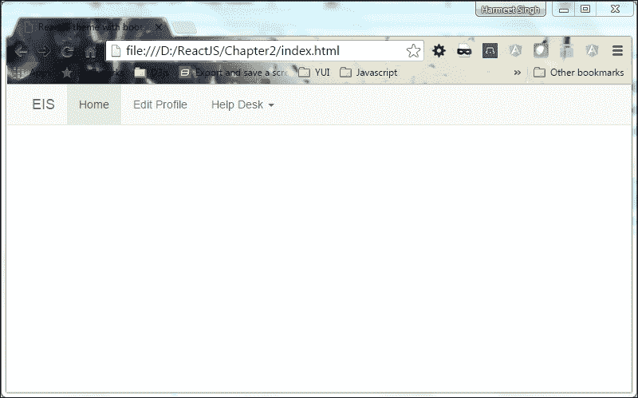
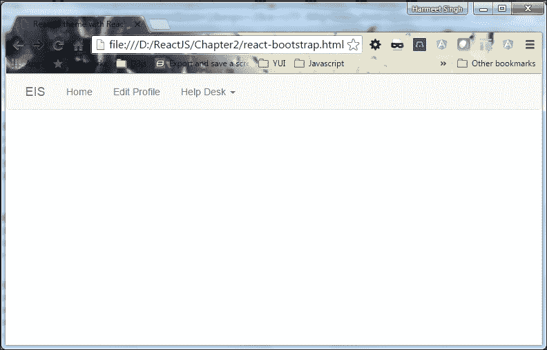
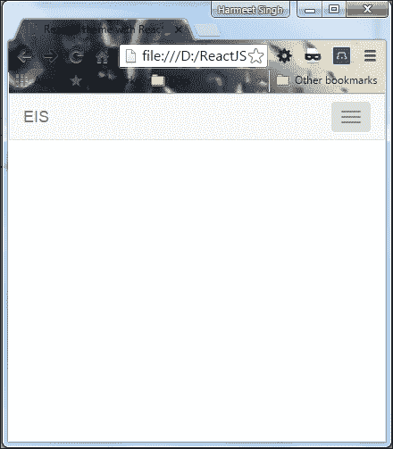
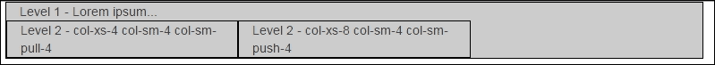
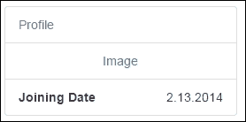
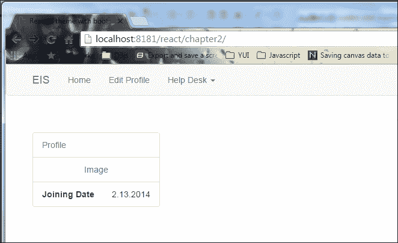

# 第二章：使用 React-Bootstrap 和 React 构建响应式主题

现在，您已经使用 ReactJS 和 Bootstrap 完成了您的第一个 Web 应用程序，我们将使用这两个框架构建您的应用程序的第一个响应式主题。我们还将涉及到两个框架的全部潜力。所以，让我们开始吧！

# 设置

首先，我们需要为我们在第一章中制作的 Hello World 应用创建一个类似的文件夹结构，*使用 React 和 Bootstrap 入门*。

以下屏幕截图描述了文件夹结构：



现在，您需要将 ReactJS 和 Bootstrap 文件从“第一章”复制到“第二章”的重要目录中，并在根目录中创建一个`index.html`文件。以下代码片段只是一个包含 Bootstrap 和 React 的基本 HTML 页面。

这是我们 HTML 页面的标记：

```jsx
<!doctype html>
<html lang="en">
    <head>
        <meta charset="utf-8">
        <title>ReactJS theme with bootstrap</title>
        <link rel="stylesheet" href="css/bootstrap.min.css">
        <script type="text/javascript" src="js/react.min.js">
        </script>
        <script type="text/javascript" src="js/react-dom.min.js">
        </script>
        <script src="js/browser.min.js"></script>
    </head>
    <body>
    </body>
</html>

```

# 脚手架

所以现在我们有了基本文件和文件夹结构。下一步是使用 Bootstrap CSS 开始搭建我们的应用程序。

我相信你有一个问题：什么是脚手架？简单地说，它提供了一个支撑结构，使您的基础更加牢固。

除此之外，我们还将使用 React-Bootstrap JS，其中包含了为 React 重新构建的 Bootstrap 组件集。我们可以在我们的**员工信息系统**（**EIS**）中使用这些组件。Bootstrap 还包括一个非常强大的响应式网格系统，帮助我们为应用程序创建响应式主题布局/模板/结构。

# 导航

导航是任何静态或动态页面的非常重要的元素。所以现在我们将构建一个导航栏（用于导航）来在我们的页面之间切换。它可以放在我们页面的顶部。

这是 Bootstrap 导航的基本 HTML 结构：

```jsx
<nav className="navbar navbar-default navbar-static-top" role="navigation">
    <div className="container">
        <div className="navbar-header">
            <button type="button" className="navbar-toggle"
            data-toggle="collapse" data-target=".navbar-collapse">
            <span className="sr-only">Toggle navigation</span>
            <span className="icon-bar"></span>
            <span className="icon-bar"></span>
            <span className="icon-bar"></span>
            </button>
            <a className="navbar-brand" href="#">EIS</a>
        </div>
        <div className="navbar-collapse collapse">
            <ul className="nav navbar-nav">
                <li className="active"><a href="#">Home</a></li>
                <li><a href="#">Edit Profile</a></li>
                <li className="dropdown">
                    <a href="#" className="dropdown-toggle"
                    data-toggle="dropdown">Help Desk 
                    <b className="caret"></b></a>
                    <ul className="dropdown-menu">
                        <li><a href="#">View Tickets</a></li>
                        <li><a href="#">New Ticket</a></li>
                    </ul>
                </li>
            </ul>
        </div>
    </div>
</nav>

```

用于容纳“导航栏”内的所有内容的`<nav>`标签，而不是分成两个部分：`navbar-header`和`navbar-collapse`，如果您查看导航结构。导航栏是响应式组件，因此`navbar-header`元素专门用于移动导航，并控制导航的展开和折叠，使用`toggle`按钮。按钮上的`data-target`属性直接对应于`navbar-collapse`元素的`id`属性，因此 Bootstrap 知道应该在移动设备中包装哪个元素以控制切换。

现在我们还需要在页面中包含 jQuery，因为 Bootstrap 的 JS 依赖于它。您可以从[`jquery.com/`](http://jquery.com/)获取最新的 jQuery 版本。现在您需要从 Bootstrap 提取的文件夹中复制`bootstrap.min.js`，并将其添加到您的应用程序的`js`目录中，然后在`bootstrap.min.js`之前在页面中包含它。

请确保您的 JavaScript 文件按以下顺序包含：

```jsx
<script type="text/javascript" src="js/react.min.js"></script> 
<script type="text/javascript" src="js/react-dom.min.js"></script> 
<script src="js/browser.min.js"></script> 
<script src="js/jquery-1.10.2.min.js"></script> 
<script src="js/bootstrap.min.js"></script>
```

在集成 React 后，让我们快速查看`navbar`组件代码：

```jsx
<div id="nav"></div>
<script type="text/babel">
    var navbarHTML = 
      <nav className="navbar navbar-default navbar-static-top"
      role="navigation">
      <div className="container">
        <div className="navbar-header">
        <button type="button" className="navbar-toggle"
        data-toggle="collapse" data-target=".navbar-collapse">
          <span className="sr-only">Toggle navigation</span>
          <span className="icon-bar"></span>
          <span className="icon-bar"></span>
          <span className="icon-bar"></span>
        </button>
        <a className="navbar-brand" href="#">EIS</a>
        </div>
        <div className="navbar-collapse collapse">
        <ul className="nav navbar-nav">
          <li className="active"><a href="#">Home</a></li>
          <li><a href="#">Edit Profile</a></li>
          <li className="dropdown">
          <a href="#" className="dropdown-toggle"
          data-toggle="dropdown">Help Desk <b className="caret">
          </b></a>
          <ul className="dropdown-menu">
            <li><a href="#">View Tickets</a></li>
            <li><a href="#">New Ticket</a></li>
          </ul>
          </li>
        </ul>
        </div>
      </div>
      </nav>
      ReactDOM.render(navbarHTML,document.getElementById('nav'));
</script> 

```

在浏览器中打开`index.html`文件以查看`navbar`组件。以下截图显示了我们的导航的外观：



我们直接在`<body>`标签中包含了导航，以覆盖浏览器的整个宽度。现在我们将使用 React-Bootstrap JS 框架来做同样的事情，以了解 Bootstrap JS 和 React-Bootstrap JS 之间的区别。

# React-Bootstrap

React-Bootstrap JavaScript 框架类似于为 React 重建的 Bootstrap。它是 Bootstrap 前端可重用组件在 React 中的完全重新实现。React-Bootstrap 不依赖于任何其他框架，如 Bootstrap JS 或 jQuery。这意味着，如果您使用 React-Bootstrap，则不需要将 jQuery 作为依赖项包含在项目中。使用 React-Bootstrap，我们可以确保不会有外部 JavaScript 调用来渲染组件，这可能与`ReactDOM.render`不兼容。但是，您仍然可以实现与 Twitter Bootstrap 相同的功能、外观和感觉，但代码更清晰。

## 安装 React-Bootstrap

要获取这个 React-Bootstrap，我们可以直接使用 CDN，或者从以下 URL 获取：[`cdnjs.cloudflare.com/ajax/libs/react-bootstrap/0.29.5/react-bootstrap.min.js`](https://cdnjs.cloudflare.com/ajax/libs/react-bootstrap/0.29.5/react-bootstrap.min.js)。打开此 URL 并将其保存在本地目录以获得更快的性能。下载文件时，请确保同时下载源映射（`react-bootstrap.min.js.map`）文件，以便更轻松地进行调试。下载完成后，将该库添加到应用程序的`js`目录中，并在页面的`head`部分包含它，如下面的代码片段所示。您的`head`部分将如下所示：

```jsx
<script type="text/javascript" src="js/react.min.js"></script> 
<script type="text/javascript" src="js/react-dom.min.js"></script> 
<script src="js/browser.min.js"></script> 
<script src="js/react-bootstrap.min.js"></script> 

```

## 使用 React-Bootstrap

现在，你可能会想，既然我们已经有了 Bootstrap 文件，还添加了 React-Bootstrap JS 文件，它们不会冲突吗？不，它们不会。React-Bootstrap 与现有的 Bootstrap 样式兼容，所以我们不需要担心任何冲突。

现在我们要在 React-Bootstrap 中创建相同的`Navbar`组件。

这里是 React-Bootstrap 中`Navbar`组件的结构：

```jsx
var Nav= ReactBootstrap.Nav;
var Navbar= ReactBootstrap.Navbar;
var NavItem= ReactBootstrap.NavItem;
var NavDropdown = ReactBootstrap.NavDropdown;
var MenuItem= ReactBootstrap.MenuItem;
var navbarReact =(
<Navbar>
    <Navbar.Header>
        <Navbar.Brand>
            <a href="#">EIS</a>
        </Navbar.Brand>
        <Navbar.Toggle />
    </Navbar.Header>
    <Navbar.Collapse>
        <Nav>
            <NavItem eventKey={1} href="#">Home</NavItem>
            <NavItem eventKey={2} href="#">Edit Profile</NavItem>
            <NavDropdown eventKey={3}  id="basic-
            nav-dropdown">
                <MenuItem eventKey={3.1}>View Tickets</MenuItem>
                <MenuItem eventKey={3.2}>New Ticket</MenuItem>
            </NavDropdown>
        </Nav>
    </Navbar.Collapse>
</Navbar>
); 

```

以下是前述代码的亮点（顺序已从好处部分下移至上方）。

`<Navbar>`标签是组件的容器，分为两个部分：`<Navbar.Header>`和`<Nav>`。

为了响应式行为，我们添加了`<Navbar.Toggle/>`标签，用于控制展开和折叠，并将`<Nav>`包装到`<Navbar.Collapse>`中以显示和隐藏导航项。

为了捕获事件，我们使用了`eventKey={1}`；当我们选择任何菜单项时，会触发一个回调，它接受两个参数，(`eventKey: any`, `event: object`) => `any`

## React-Bootstrap 的好处

让我们来看看使用 React-Bootstrap 的好处。

正如你在前述代码中所看到的，它看起来比 Twitter Bootstrap 组件更清晰，因为我们可以从 React-Bootstrap 中导入单个组件，而不是包含整个库。

例如，如果我想用 Twitter Bootstrap 构建一个`navbar`，那么代码结构是：

```jsx
<nav class="navbar navbar-default">
    <div class="container-fluid">
        <div class="navbar-header">
            <button type="button" class="navbar-toggle collapsed"
            data-toggle="collapse" data-target="#bs-example-navbar-
            collapse-1" aria-expanded="false">
            <span class="sr-only">Toggle navigation</span>
            <span class="icon-bar"></span>
            <span class="icon-bar"></span>
            <span class="icon-bar"></span>
            </button>
            <a class="navbar-brand" href="#">EIS</a>
        </div>
        <div class="collapse navbar-collapse" id="bs-example-
        navbar-collapse-1">
            <ul class="nav navbar-nav">
                <li class="active"><a href="#">Home <span class=
                "sr-only">(current)</span></a></li>
                <li><a href="#">Edit Profile</a></li>
            </ul>
            <form class="navbar-form navbar-left" role="search">
                <div class="form-group">
                    <input type="text" class="form-control"
                    placeholder="Search">
                </div>
                <button type="submit" class="btn
                btn-default">Submit</button>
            </form>
        </div>
        <!-- /.navbar-collapse -->
    </div>
    <!-- /.container-fluid -->
</nav>
```

现在你可以轻松比较代码，我相信你也会同意使用 React-Bootstrap，因为它非常具体化，而在 Twitter Bootstrap 中，我们需要维护多个元素的正确顺序才能获得类似的结果。

通过这样做，React-Bootstrap 只提取我们想要包含的特定组件，并帮助显著减少应用程序包大小。React-Bootstrap 提供以下一些好处：

+   React-Bootstrap 通过压缩 Bootstrap 代码节省了一些输入并减少了错误

+   它通过压缩 Bootstrap 代码减少了冲突

+   我们不需要考虑 Bootstrap 与 React 采用的不同方法

+   它很容易使用

+   它封装在元素中

+   它使用 JSX 语法

+   它避免了 React 渲染虚拟 DOM

+   很容易检测 DOM 的变化并更新 DOM 而不会发生冲突

+   它不依赖于其他库，比如 jQuery

这里是我们`Navbar`组件的完整代码视图：

```jsx
<div id="nav"></div>
<script type="text/babel">
var Nav= ReactBootstrap.Nav;
var Navbar= ReactBootstrap.Navbar;
var NavItem= ReactBootstrap.NavItem;
var NavDropdown = ReactBootstrap.NavDropdown;
var MenuItem= ReactBootstrap.MenuItem;
var navbarReact =(
    <Navbar>
        <Navbar.Header>
        <Navbar.Brand>
            <a href="#">EIS</a>
        </Navbar.Brand>
        <Navbar.Toggle />
        </Navbar.Header>
        <Navbar.Collapse>
            <Nav>
            <NavItem eventKey={1} href="#">Home</NavItem>
            <NavItem eventKey={2} href="#">Edit Profile</NavItem>
            <NavDropdown eventKey={3}  id="basic-
            nav-dropdown">
                <MenuItem eventKey={3.1}>View Tickets</MenuItem>
                <MenuItem eventKey={3.2}>New Ticket</MenuItem>
            </NavDropdown>
            </Nav>
        </Navbar.Collapse>
    </Navbar>
    );
    ReactDOM.render(navbarReact,document.getElementById('nav')); 

```

哇哦！让我们在浏览器中看看我们的第一个 React-Bootstrap 组件。以下截图显示了组件的外观：



现在来检查`Navbar`，如果你调整浏览器窗口大小，你会注意到 Bootstrap 在 768 像素以下的平板电脑纵向模式下显示移动头部和切换按钮。然而，如果你点击按钮切换导航，你会看到移动端的导航。

以下截图显示了移动导航的外观：



现在我们对 React-Bootstrap 和 Bootstrap 有了主要的了解。React-Bootstrap 正在进行积极的开发工作，以保持更新。

# Bootstrap 网格系统

Bootstrap 基于一个 12 列网格系统，包括强大的响应式结构和移动优先的流体网格系统，允许我们用很少的元素来搭建我们的 Web 应用。在 Bootstrap 中，我们有一系列预定义的类来组成行和列，所以在开始之前，我们需要在我们的行和列周围包含带有`container`类的`<div>`标签。否则，框架不会如预期般响应，因为 Bootstrap 编写了依赖于它的 CSS，我们需要在我们的`navbar`下面添加它：

```jsx
<div class="container"><div> 

```

这将使您的 Web 应用程序成为页面的中心，并控制行和列以响应预期地工作。

有四个类前缀，帮助定义列的行为。所有类都与不同的设备屏幕大小相关，并以熟悉的方式响应。来自[`getbootstrap.com/`](http://getbootstrap.com/)的以下表格定义了所有四个类之间的差异：

|   | **额外小设备****手机（<768px）** | **小设备****平板电脑（≥768px）** | **中等设备****台式电脑（≥992px）** | **大型设备****台式电脑（≥1200px）** |
| --- | --- | --- | --- | --- |
| **网格行为** | **始终水平** | **在断点以上折叠，水平** |
| **容器宽度** | 无（自动） | 750px | 970px | 1170px |
| **类前缀** | .col-xs- | .col-sm- | .col-md- | .col-lg- |
| **列数** | 12 |   |   |   |
| **列宽** | 自动 | ~62px | ~81px | ~97px |
| **间距宽度** | 30px（每列两侧各 15px） |   |   |   |
| **可嵌套** | 是 |   |   |   |
| **偏移** | 是 |   |   |   |
| **列排序** | 是 |   |   |   |

在我们的应用程序中，我们需要为主要内容区域和侧边栏创建一个两列布局。正如我们所知，Bootstrap 有一个 12 列网格布局，所以以一种覆盖整个区域的方式划分您的内容。

### 提示

请理解，Bootstrap 使用`col-*-1`到`col-*-12`类来划分 12 列网格。

我们将把 12 列分为两部分：一部分是主要内容的九列，另一部分是侧边栏的三列。听起来很完美。所以，这是我们如何实现的。

首先，我们需要在我们的`container`内包含`<div>`标签，并添加`class`为`"row"`。根据设计需求，我们可以有多个带有`row`类的`div`标签，每个标签最多可以容纳 12 列。

```jsx
<div class="container"> 
    <div class="row"> 
    </div> 
<div> 

```

众所周知，如果我们希望我们的列在移动设备上堆叠，我们应该使用`col-sm-`前缀。创建列就像简单地取所需的前缀并将要添加的列数附加到它一样简单。

让我们快速看一下我们如何创建一个两列布局：

```jsx
<div class="container">
    <div class="row">
        <div class="col-sm-3">
            Column Size 3 for smaller devices
        </div>
        <div class="col-sm-9">
            Column Size 9 for smaller devices
        </div>
    </div>
</div>

```

如果我们希望我们的列不仅在较小的设备上堆叠，还可以通过向列添加`col-md-*`和`col-xs-*`来使用额外的小和中等网格类：

```jsx
<div class="container"> 
    <div class="row"> 
<div class="col-xs-12 col-md-4"> 

```

在手机视图中，这一列将是全宽，在平板视图中，它将是四个中等网格宽度。

```jsx
</div> 
<div class="col-xs-12 col-md-8"> 
In mobile view, this column will be full width and in tablet view, it will be eight medium grid width.</div> 
</div> 
</div> 

```

因此，当它在比移动设备更大的屏幕上显示时，Bootstrap 将自动在每列之间添加 30 像素的间距（两个元素之间的空间为 15 像素）。如果我们想在列之间添加额外的空间，Bootstrap 将提供一种方法，只需将额外的类添加到列中即可：

```jsx
<div class="container"> 
<div class="row"> 
<div class="col-xs-12 col-md-7 col-md-offset-1"> 

```

手机上的列是一个全宽和另一个半宽，离左边更远：

```jsx
        </div> 
    </div> 
</div> 

```

这次我们使用了`offset`关键字。该类名末尾的数字用于控制要偏移的列数。

### 提示

`offset`列数等于行中的总列数`12`。

现在，让我们创建一些复杂的布局，嵌套额外的行和列：

```jsx
<div class="row">
    <div class="col-sm-9">
        Level 1 - Lorem ipsum...
        <div class="row">
            <div class="col-xs-8 col-sm-4">
                Level 2 - Lorem ipsum...   
            </div>
            <div class="col-xs-4 col-sm-4">
                Level 2 - Lorem ipsum...
            </div>
        </div>
    </div>
</div>

```

如果您在浏览器中打开它，您将看到这将在我们之前创建的主要内容容器`col-sm-9`中创建两列。然而，由于我们的网格是嵌套的，我们可以创建一个新行，并拥有一个单列或两列，无论您的布局需要什么。我已经添加了一些虚拟文本来演示嵌套列。

Bootstrap 还将通过使用`col-md-push-*`和`col-md-pull-*`类在网格系统中提供更改列的顺序的选项。

```jsx
<div class="row">
    <div class="col-sm-9">
        Level 1 - Lorem ipsum...
        <div class="row">
            <div class="col-xs-8 col-sm-4 col-sm-push-4">
                Level 2 - col-xs-8 col-sm-4 col-sm-push-4   
            </div>
            <div class="col-xs-4 col-sm-4 col-sm-pull-4">
                Level 2 - col-xs-8 col-sm-4 col-sm-pull4      
            </div>
        </div>
    </div>
</div>

```

观察以下屏幕截图：



Bootstrap 还包括一些预定义的类，以便在特定屏幕尺寸下显示或隐藏元素。这些类使用与 Bootstrap 网格相同的预定义尺寸。

例如，以下代码将在特定屏幕尺寸下隐藏一个元素：

```jsx
<div class="hidden-md"></div> 

```

这将在中等设备上隐藏元素，但在手机、平板电脑和大型台式机上仍然可见。要在多个设备上隐藏元素，我们需要使用多个类：

```jsx
<div class="hidden-md hidden-lg"></div> 

```

同样，与可见类一样，它们可以反向工作，在特定尺寸下显示元素。

但是，与隐藏类不同，它们还要求我们设置显示值。这可以是`block`，`inline`或`inline-block`：

```jsx
<div class="visible-md-block"></div> 
<div class="visible-md-inline"></div> 
<div class="visible-md-inline-block"></div> 

```

当然，我们可以在一个元素中使用各种类。例如，如果我们想在较小的屏幕上使用`block`级元素，但稍后将其变为`inline-block`，我们将使用以下代码：

```jsx
<div class="visible-sm-block visible-md-inline-block"></div> 

```

如果您记不住各种类的大小，请务必再次查看*了解 Bootstrap 网格*部分，以了解屏幕尺寸。

# 辅助类

Bootstrap 还包括一些辅助类，我们可以用来调整布局。让我们看一些例子。

## 浮动

Bootstrap 的浮动类将帮助您在 Web 上创建一个体面的布局。以下是两个 Bootstrap 类，用于将您的元素向左和向右拉：

```jsx
<div class="pull-left">...</div> 
<div class="pull-right">...</div> 

```

当我们在元素上使用浮动时，我们需要在我们的浮动元素中包装一个`clearfix`类。这将清除元素，您将能够看到容器元素的实际高度：

```jsx
<div class="helper-classes"> 
    <div class="pull-left">...</div> 
    <div class="pull-right">...</div> 
    <div class="clearfix"> 
</div> 

```

如果`float`类直接位于具有`row`类的元素内部，则我们的浮动将被 Bootstrap 自动清除，无需手动应用`clearfix`类。

## 中心元素

要使其居中`block-level`元素，Bootstrap 允许使用`center-block`类：

```jsx
<div class="center-block">...</div> 

```

这将将您的元素属性`margin-left`和`margin-right`属性设置为`auto`，这将使元素居中。

## 显示和隐藏

您可能希望使用 CSS 显示和隐藏元素，Bootstrap 为此提供了一些类：

```jsx
<div class="show">...</div> 
<div class="hidden">...</div> 

```

### 注意

`show`类将`display`属性设置为`block`，因此只将其应用于`block-level`元素，而不是希望以`inline`或`inline-block`显示的元素。

# React 组件

React 基于模块化构建，具有封装的组件，这些组件管理自己的状态，因此当数据发生变化时，它将有效地更新和渲染您的组件。在 React 中，组件的逻辑是用 JavaScript 编写的，而不是模板，因此您可以轻松地通过应用程序传递丰富的数据并管理 DOM 之外的状态。

使用`render()`方法，我们正在在 React 中呈现一个组件，该组件接受输入数据并返回您想要显示的内容。它可以接受 HTML 标签（字符串）或 React 组件（类）。

让我们快速看一下两者的示例：

```jsx
var myReactElement = <div className="hello" />; 
ReactDOM.render(myReactElement, document.getElementById('example')); 

```

在这个例子中，我们将 HTML 作为字符串传递给`render`方法，之前我们已经在创建`<Navbar>`之前使用过它：

```jsx
var ReactComponent = React.createClass({/*...*/}); 
var myReactElement = <ReactComponent someProperty={true} />; 
ReactDOM.render(myReactElement, document.getElementById('example')); 

```

在上面的例子中，我们正在渲染组件，只是为了创建一个以大写约定开头的局部变量。在 React 的 JSX 中使用大写与小写的约定将区分本地组件类和 HTML 标签。

因此，我们可以以两种方式创建 React 元素或组件：一种是使用`React.createElement`的纯 JavaScript，另一种是使用 React 的 JSX。

因此，让我们为应用程序创建侧边栏元素，以更好地理解`React.createElement`。

## React.createElement()

在 React 中使用 JSX 完全是可选的。正如我们所知，我们可以使用`React.createElement`创建元素，它接受三个参数：标签名或组件、属性对象和可变数量的子元素（可选）。观察以下代码：

```jsx
var profile = React.createElement('li',{className:'list-group-item'},
'Profile'); 

var profileImageLink = React.createElement('a',{className:'center-
block text-center',href:'#'},'Image'); 

    var profileImageWrapper = React.createElement('li',
    {className:'list-group-item'}, profileImageLink); 

    var sidebar = React.createElement('ul', { className: 'list-
    group' }, profile, profileImageWrapper); 

    ReactDOM.render(sidebar, document.getElementById('sidebar')); 

```

在上面的例子中，我们使用`React.createElement`生成了一个`ul`-`li`结构。React 已经为常见的 DOM HTML 标签内置了工厂。

以下是一个示例：

```jsx
var Sidebar = React.DOM.ul({ className: 'list-group' }, 
React.DOM.li({className:'list-group-item text-muted'},'Profile'), 
React.DOM.li({className:'list-group-item'}, 
React.DOM.a({className:'center-block text-center',href:'#'},'Image') 
    ), 
React.DOM.li({className:'list-group-item text-right'},'2.13.2014', 
React.DOM.span({className:'pull-left'}, 
React.DOM.strong({className:'pull-left'},'Joining Date') 
    ), 
    React.DOM.div({className:'clearfix'}) 
));                                  
ReactDOM.render(Sidebar, document.getElementById('sidebar'));
```

让我们快速在浏览器中查看我们的代码，它应该类似于以下截图：



到目前为止，这是我们编写的包含`<Navbar>`组件的全部代码：

```jsx
<script type="text/babel">
    var Nav= ReactBootstrap.Nav;
    var Navbar= ReactBootstrap.Navbar;
    var NavItem= ReactBootstrap.NavItem;
    var NavDropdown = ReactBootstrap.NavDropdown;
    var MenuItem= ReactBootstrap.MenuItem;
    var navbarReact =(
    <Navbar>
    <Navbar.Header>
    <Navbar.Brand>
      <a href="#">EIS</a>
    </Navbar.Brand>
    <Navbar.Toggle />
    </Navbar.Header>
    <Navbar.Collapse>
    <Nav>
    <NavItem eventKey={1} href="#">Home</NavItem>
    <NavItem eventKey={2} href="#">Edit Profile</NavItem>
    <NavDropdown eventKey={3}  id="basic-
    nav-dropdown">
      <MenuItem eventKey={3.1}>View Tickets</MenuItem>
      <MenuItem eventKey={3.2}>New Ticket</MenuItem>
    </NavDropdown>
    </Nav>
    </Navbar.Collapse>
    </Navbar>
    );
    ReactDOM.render(navbarReact,document.getElementById('nav'));

    var Sidebar = React.DOM.ul({ className: 'list-group' },
     React.DOM.li({className:'list-group-item text-muted'},'Profile'),
     React.DOM.li({className:'list-group-item'},
      React.DOM.a({className:'center-block
      text-center',href:'#'},'Image')
      ),
    React.DOM.li({className:'list-group-item text-right'},
    '2.13.2014',
    React.DOM.span({className:'pull-left'},
    React.DOM.strong({className:'pull-left'},'Joining Date')
    ),
      React.DOM.div({className:'clearfix'})
    ));            
    ReactDOM.render(Sidebar, document.getElementById('sidebar'));

</script>
<div id="nav"></div>
<div class="container">
    <hr>
    <div class="row">
        <div class="col-sm-3" id="sidebar">
            <!--left col-->
        </div>
        <!--/col-3-->
        <div class="col-sm-9 profile-desc"></div>
        <!--/col-9-->
    </div>
</div>
<!--/row-->

```

我们的应用程序代码看起来非常混乱。现在是时候让我们的代码变得整洁和结构良好。

将`navbar`代码复制到另一个文件中，并将其保存为`navbar.js`。

现在将`sidebar`代码复制到另一个文件中，并保存为`sidebar.js`。

在根目录中创建一个名为 components 的文件夹，并将`navbar.js`和`sidebar.js`都复制到其中。

在`head`部分包含两个`js`文件。

`head`部分将如下所示：

```jsx
<script type="text/javascript" src="js/react.min.js"></script> 
<script type="text/javascript" src="js/react-dom.min.js"></script> 
<script src="js/browser.min.js"></script> 
<script src="js/jquery-1.10.2.min.js"></script> 
<script src="js/react-bootstrap.min.js"></script> 
<script src="components/navbar.js" type="text/babel"></script> 
<script src="components/sidebar.js" type="text/babel"></script> 

```

以下是您的 HTML 代码：

```jsx
<div id="nav"></div>
<div class="container">
    <hr>
    <div class="row">
        <div class="col-sm-3" id="sidebar">
            <!--left col-->
        </div>
        <!--/col-3-->
        <div class="col-sm-9 profile-desc"></div>
        <!--col-9-->
    </div>
</div>
<!--/row--> 

```

现在我们的代码看起来更加清晰。让我们快速查看一下您在浏览器中的代码输出：



### 提示

当我们从外部来源引用 ReactJS 文件时，我们需要一个 Web 服务器或者像 WAMP 或 XAMPP 这样的全栈应用，因为一些浏览器（例如 Chrome）在不通过 HTTP 提供文件的情况下会加载失败。

# 总结

我们已经从本章节中积累了相当多关于 Bootstrap 和 React-Bootstrap 的基础知识，所以让我们快速复习一下我们到目前为止学到的东西。

在了解 Bootstrap 和 React-Bootstrap 的定义和用法时，我们发现 React-Bootstrap 是一个非常有潜力、更灵活、更智能的解决方案。

我们已经看到了如何通过使用 Bootstrap 和 React-Bootstrap 的一些特性来创建移动导航，这些特性在所有预期的设备上以及桌面浏览器上都能很好地工作。

我们还研究了包括 Bootstrap 在内的强大响应式网格系统，并创建了一个简单的两列布局。在做这些的时候，我们学到了四种不同的列类前缀，以及如何嵌套我们的网格。

我们还看到了 Bootstrap 的一些非常好的特性，比如`offset`，`col-md-push-*`，`col-md-pull-*`，`hidden-md`，`hidden-lg`，`visible-sm-block`，`visible-md-inline-block`和`helper-classes`。

我们希望你也已经准备好了响应式布局和导航。现在让我们跳到下一章。
