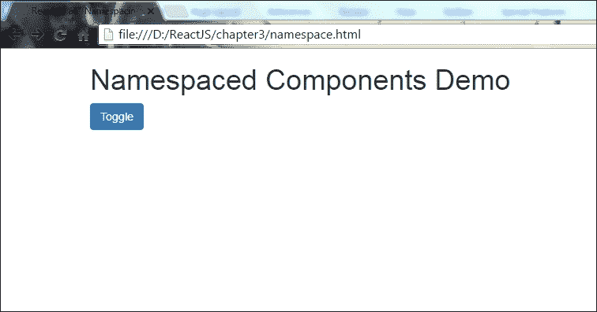
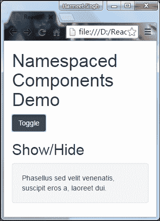
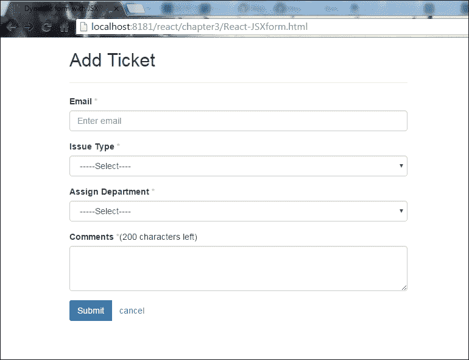
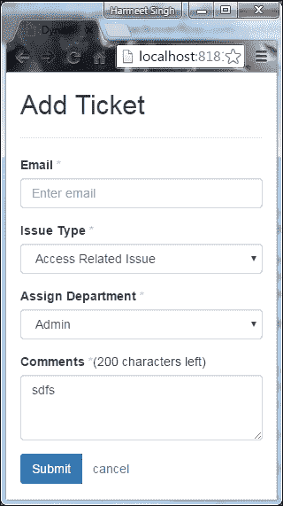

# 第三章：ReactJS-JSX

在上一章中，我们通过使用 React-Bootstrap 和 React 来构建响应式主题的过程。我们看到了它的示例以及 Twitter Bootstrap 和 React-Bootstrap 之间的区别。

我现在非常兴奋，因为我们将深入了解 ReactJS 的核心，即 JSX。那么，你们准备好了吗？让我们深入学习 ReactJS-JSX。

# 在 React 中的 JSX 是什么

JSX 是 JavaScript 语法的扩展，如果您观察 JSX 的语法或结构，您会发现它类似于 XML 编码。

使用 JSX，您可以执行预处理步骤，将 XML 语法添加到 JavaScript 中。虽然您当然可以在没有 JSX 的情况下使用 React，但 JSX 使 React 变得更加整洁和优雅。与 XML 类似，JSX 标记具有标记名称、属性和子级，如果属性值被引号括起来，该值就成为一个字符串。

XML 使用平衡的开放和关闭标记。JSX 类似地工作，它还有助于比 JavaScript 函数和对象更容易地阅读和理解大量的结构。

## 在 React 中使用 JSX 的优点

以下是一些优点的列表：

+   与 JavaScript 函数相比，JSX 非常容易理解和思考

+   JSX 的标记更容易让非程序员熟悉

+   通过使用 JSX，您的标记变得更有语义、有组织和有意义

## 如何使您的代码整洁和干净

正如我之前所说，这种结构/语法非常容易可视化/注意到，这意味着当我们将其与 JavaScript 语法进行比较时，JSX 格式的代码更加清晰和易于理解。

以下是简单的代码片段，将给你一个清晰的想法。让我们看看在渲染时 JavaScript 语法的以下示例中的代码片段：

```jsx
render: function () {
    return React.DOM.div({className:"divider"},
        "Label Text",
        React.DOM.hr()
    );
}  

```

观察以下 JSX 语法：

```jsx
render: function () { 
    return <div className="divider"> 
    Label Text<hr /> 
</div>; 
} 

```

我假设现在很清楚 JSX 对于通常不习惯处理编码的程序员来说是非常容易理解的，并且他们可以学习和执行它，就像执行 HTML 语言一样。

# 熟悉或理解

在开发领域，UI 开发人员、用户体验设计师和质量保证人员并不太熟悉任何编程语言，但 JSX 通过提供简单的语法结构使他们的生活变得更加轻松，这个结构在视觉上类似于 HTML 结构。

JSX 显示了一种路径，以一种坚实而简洁的方式指示和看到您的思维结构。

# 语义/结构化语法

到目前为止，我们已经看到了 JSX 语法是如何易于理解和可视化的，原因在于语义化的语法结构。

JSX 将您的 JavaScript 代码转换为更标准的解决方案，这样可以清晰地设置您的语义化语法和重要组件。借助于 JSX 语法，您可以声明自定义组件的结构和信息，就像在 HTML 语法中一样，这将为您的语法转换为 JavaScript 函数提供魔力。

`React.DOM`命名空间帮助我们使用所有 HTML 元素，借助于 ReactJS：这不是一个令人惊讶的功能吗！而且，好处是您可以使用`React.DOM`命名空间编写自己命名的组件。

请查看以下简单的 HTML 标记以及 JSX 组件如何帮助您创建语义化标记：

```jsx
<div className="divider"> 
<h2>Questions</h2><hr /> 
</div> 

```

正如您在前面的示例中所看到的，我们用`<div>`标记包裹了`<h2>Questions</h2><hr />`，并且`<div>`标记具有`className="divider"`。因此，在 React 复合组件中，您可以创建类似的结构，就像在使用语义化语法的 HTML 编码时一样简单：

```jsx
 <Divider> Questions </Divider>

```

让我们详细了解一下复合组件是什么，以及我们如何构建它。

# 复合组件

正如我们所知，您可以使用 JSX 标记和 JSX 语法创建自定义组件，并将您的组件转换为 JavaScript 语法组件。

让我们设置 JSX：

```jsx
<script type="text/javascript" src="js/react.min.js"></script> 
<script type="text/javascript" src="js/react-dom.min.js"></script> 
<script src="js/browser.min.js"></script> 
<script src="js/divider.js" type="text/babel"></script>

```

在您的 HTML 中包含以下文件：

```jsx
<div>
    <Divider>...</Divider>
    <p>...</p>
</div>

```

将此 HTML 添加到您的`<body>`部分。

现在，我们已经准备好使用 JSX 定义自定义组件了。

要创建自定义组件，我们必须将上述提到的 HTML 标记表达为 React 自定义组件。您只需按照给定的示例执行包装的语法/代码，然后在渲染后，它将给您预期的标记结果。`Divider.js`文件将包含：

```jsx
var Divider = React.createClass({ 
    render: function () { 
        return ( 
            <div className="divider"> 
                <h2>Questions</h2><hr /> 
            </div> 
        ); 
    } 
}); 

```

如果您想将子节点附加到您的组件中，那么在 React-JSX 中是可能的。在前面的代码中，您可以看到我们创建了一个名为`divider`的变量，并且借助于 React-JSX，我们可以将其用作 HTML 标记，就像我们使用定义的 HTML 标记`<div>`，`<span>`等一样。您还记得我们在之前的示例中使用了以下标记吗？如果没有，请再次参考前面的主题，因为它将消除您的疑虑。

```jsx
<Divider>Questions</Divider> 

```

与 HTML 语法一样，在这里，子节点被捕获在开放和关闭标记之间的数组中，您可以将其设置在组件的`props`（属性）中。

在这个例子中，我们将使用`this.props.children` = `["Questions"]`，其中`this.props.children`是 React 的方法：

```jsx
var Divider = React.createClass({ 
    render: function () { 
        return ( 
            <div className="divider"> 
                <h2>{this.props.children}</h2><hr /> 
            </div> 
        ); 
    } 
}); 

```

正如我们在前面的示例中看到的，我们可以像在任何 HTML 编码中一样创建带有开放和关闭标记的组件：

```jsx
<Divider>Questions</Divider>
```

我们将得到以下预期的输出：

```jsx
<div className="divider"> 
    <h2>Questions</h2><hr /> 
</div> 

```

# 命名空间组件

命名空间组件是 React JSX 中可用的另一个功能请求。我知道你会有一个问题：什么是命名空间组件？好的，让我解释一下。

我们知道 JSX 只是 JavaScript 语法的扩展，它还提供了使用命名空间的能力，因此 React 使用 JSX 命名空间模式而不是 XML 命名空间。通过使用标准的 JavaScript 语法方法，即对象属性访问，这个功能对于直接分配组件作为`<Namespace.Component/>`而不是分配变量来访问存储在对象中的组件非常有用。

让我们从以下的显示/隐藏示例开始，以便清楚地了解命名空间组件：

```jsx
var MessagePanel = React.createClass({ 
    render: function() { 
        return <div className='collapse in'> {this.props.children} </div> 
  } 
}); 
var MessagePanelHeading = React.createClass({ 
  render: function() { 
    return <h2>{this.props.text}</h2>} 
}); 

var MessagePanelContent = React.createClass({ 
  render: function() { 
    return <div className='well'> {this.props.children} </div> 
  } 
}); 

```

从以下示例中，我们将看到如何组合`MessagePanel`：

```jsx
<MessagePanel> 
<MessagePanelHeading text='Show/Hide' /> 
<MessagePanelContent> 
     Phasellus sed velit venenatis, suscipit eros a, laoreet dui. 
</MessagePanelContent> 
</MessagePanel> 

```

`MessagePanel`是一个组件，用于在用户界面中呈现消息。

它主要有两个部分：

+   `MessagePanelHeading`：这显示消息的标题

+   `MessagePanelContent`：这是消息的内容

有一种更健康的方式来组成`MessagePanel`，即通过将子组件作为父组件的属性来实现。

让我们看看如何做到这一点：

```jsx
var MessagePanel = React.createClass({ 
    render: function() { 
        return <div className='collapse in'>    
        {this.props.children} </div> 
    } 
}); 

MessagePanel.Heading = React.createClass({ 
    render: function() { 
        return <h2>{this.props.text}</h2> 
    } 
}); 

MessagePanel.Content = React.createClass({ 
    render: function() { 
        return <div className='well'> {this.props.children} </div> 
} 
}); 

```

因此，在前面的代码片段中，您可以看到我们如何通过只添加新的 React 组件`Heading`和`Content`来扩展`MessagePanel`。

现在，让我们看看当我们引入命名空间符号时，组合会发生什么变化：

```jsx
<MessagePanel> 
    <MessagePanel.Heading text='Show/Hide' /> 
    <MessagePanel.Content> 
    Phasellus sed velit venenatis, suscipit eros a, laoreet dui. 
    </MessagePanel.Content> 
</MessagePanel>
```

现在，我们将在 React 中与 Bootstrap 集成后看到命名空间组件代码的实际示例：

```jsx
<!doctype html>
<html>
    <head>
        <title>React JS – Namespacing component</title>
            <link rel="stylesheet" href="css/bootstrap.min.css">
            <link rel="stylesheet" href="css/custom.css">
        <script type="text/javascript" src="js/react.min.js"></script>
        <script type="text/javascript" src="js/JSXTransformer.js">
        </script>
    </head>
    <script type="text/jsx">
    /** @jsx React.DOM */
    var MessagePanel = React.createClass({
        render: function() {
            return <div className='collapse in'> {this.props.children}
            </div>
        }
    });

    MessagePanel.Heading = React.createClass({
        render: function() {
            return <h2>{this.props.text}</h2>
        }
    });

    MessagePanel.Content = React.createClass({
        render: function() {
            return <div className='well'> {this.props.children} </div>
        }
    });

    var MyApp = React.createClass({
        getInitialState: function() {
            return {
                collapse: false
            };
        },
        handleToggle: function(evt){
            var nextState = !this.state.collapse;
            this.setState({collapse: nextState});
        },

        render: function() {
            var showhideToggle = this.state.collapse ?
            (<MessagePanel>
            <MessagePanel.Heading text='Show/Hide' />
            <MessagePanel.Content>
                Phasellus sed velit venenatis, suscipit eros a,
                laoreet dui.
            </MessagePanel.Content>
            </MessagePanel>)
            : null;
            return (<div>
                <h1>Namespaced Components Demo</h1>
                <p><button onClick={this.handleToggle} className="btn
                btn-primary">Toggle</button></p>
                {showhideToggle}
                </div>)
            }
        });

        React.render(<MyApp/>, document.getElementById('toggle-
        example'));
    </script>
    </head>
    <body>
        <div class="container">
            <div class="row">
                <div id="toggle-example" class=”col-sm-12”>
                </div>
            </div>
        </div>
    </body>
</html>

```

让我解释一下前面的代码：

+   `State`属性包含我们组件的`setState`和`getInitialState`设置的状态

+   `setState(changes)`方法将给定的更改应用于此状态并重新呈现它

+   `handleToggle`函数处理我们组件的状态并返回布尔值`true`或`false`

我们还使用了一些 Bootstrap 类来赋予我们的组件外观和感觉：

+   `.collapse`：这是用于隐藏内容的。

+   `.collapse.in`：这是用于显示内容的。

+   `.well`：这是用于内容周围的背景、边框和间距。

+   `.btn .btn-primary`：这是按钮的外观。Bootstrap 还为您提供了一些不同颜色样式的不同类，帮助读者提供视觉指示：

+   `.btn-default`、`.btn-success`、`.btn-info`、`.btn-warning`、`.btn-danger`和`.btn-link`。

+   我们可以使用`<a>`、`<button>`或`<input>`元素。

+   `.col-sm-12`：这是为了使你的组件在小屏幕上响应。

现在，让我们在浏览器中打开你的 HTML 并查看输出：



现在调整屏幕大小，看看效果：



看起来很棒！

## JSXTransformer

**JSXTransformer**是另一个在浏览器中编译 JSX 的工具。在阅读代码时，浏览器将读取你所提到的`<script>`标签中的`attribute type="text/jsx"`，它只会转换那些具有提到`type`属性的脚本，然后执行你的脚本或文件中的函数。代码将以与`react-tools`在服务器上执行的相同方式执行。访问[`facebook.github.io/react/blog/2015/06/12/deprecating-jstransform-and-react-tools.html`](https://facebook.github.io/react/blog/2015/06/12/deprecating-jstransform-and-react-tools.html)了解更多。

JSXTransformer 在当前版本的 React 中已经被弃用，但你可以在任何提供的 CDN 和 Bower 上找到当前版本。依我看来，使用**Babel REPL**([`babeljs.io/repl/#?babili=false&evaluate=true&lineWrap=false&presets=es2015%2Creact%2Cstage-2&code=`](https://babeljs.io/repl/#?babili=false&evaluate=true&lineWrap=false&presets=es2015%2Creact%2Cstage-2&code=))工具来编译 JavaScript 会很棒。它已经被 React 和更广泛的 JavaScript 社区所采用。

### 注意

这个例子在最新版本的 React 中不起作用。使用旧版本，比如 0.13，因为 JSXTransformer 已经被弃用，它被 Babel 所取代，用于在浏览器中转换和运行 JSX 代码。当浏览器具有`type="text/babel"`类型属性时，它才能理解你的`<script>`标签，我们之前在第一章和第二章的例子中使用过这种类型属性。

# 属性表达式

如果您看一下前面的显示/隐藏示例，您会发现我们使用属性表达式来显示消息面板并隐藏它。在 React 中，写属性值有一个小改变，在 JavaScript 表达式中，我们用引号(`""`)来写属性，但在 React 中，我们必须提供一对花括号(`{}`)：

```jsx
var showhideToggle = this.state.collapse ? (<MessagePanel>):null/>; 

```

## 布尔属性

布尔属性有两个值，它们可以是`true`或`false`，如果我们在 JSX 中声明属性时忽略了值，那么默认情况下它会取值为`true`。如果我们想要一个`false`属性值，那么我们必须使用属性表达式。当我们使用 HTML 表单元素时，这种情况经常发生，例如`disabled`属性，`required`属性，`checked`属性和`readOnly`属性。

在 Bootstrap 示例中`aria-haspopup="true"aria-expanded="true"`：

```jsx
// example of writing disabled attribute in JSX 
<input type="button" disabled />; 
<input type="button" disabled={true} />; 

```

## JavaScript 表达式

如前面的示例所示，您可以使用在任何句柄用户习惯的语法中在 JSX 中嵌入 JavaScript 表达式，例如，`style = { displayStyle }`将`displayStyle` JavaScript 变量的值分配给元素的`style`属性。

### 样式

与表达式一样，您可以通过将普通的 JavaScript 对象分配给`style`属性来设置样式。多么有趣。如果有人告诉你不要编写 CSS 语法，您仍然可以编写 JavaScript 代码来实现这一点，而不需要额外的努力。这不是很棒吗！是的，确实如此。

### 事件

有一组事件处理程序，您可以以一种熟悉 HTML 的方式绑定它们。

一些 React 事件处理程序的名称如下：

+   剪贴板事件

+   组合事件

+   键盘事件

+   焦点事件

+   表单事件

+   鼠标事件

+   选择事件

+   触摸事件

+   UI 事件

+   滚轮事件

+   媒体事件

+   图像事件

+   动画事件

+   过渡事件

### 属性

JSX 的一些定义的`PropTypes`如下：

+   `React.PropTypes.array`

+   `React.PropTypes.bool`

+   `React.PropTypes.func`

+   `React.PropTypes.number`

+   `React.PropTypes.object`

+   `React.PropTypes.string`

+   `React.PropTypes.symbol`

如果您提前了解所有属性，那么在使用 JSX 创建组件时会很有帮助：

```jsx
var component = <Component foo={x} bar={y} />; 

```

改变`props`是不好的做法，让我们看看为什么。

通常，根据我们的做法，我们将属性设置为非推荐的标准对象：

```jsx
var component = <Component />; 
component.props.foo = x; // bad 
component.props.bar = y; // also bad 

```

如前面的例子所示，您可以看到反模式，这不是最佳实践。如果您不了解 JSX 属性的属性，则`propTypes`将不会被设置，并且将抛出难以跟踪的错误。

`props`是属性的一个非常敏感的部分，所以您不应该更改它们，因为每个 prop 都有一个预定义的方法，您应该按照其预期的方式使用它，就像我们使用其他 JavaScript 方法或 HTML 标签时一样。这并不意味着不可能更改`props`。这是可能的，但这违反了 React 定义的标准。即使在 React 中，它也会抛出错误。

### 扩展属性

让我们看看 JSX 的特性--扩展属性：

```jsx
  var props = {}; 
  props.foo = x; 
  props.bar = y; 
  var component = <Component {...props} />; 

```

在前面的例子中，您声明的属性也已成为组件的`props`的一部分。

属性的可重用性在这里也是可能的，您还可以将其与其他属性进行映射。但是在声明属性时，您必须非常小心，因为它将覆盖先前声明的属性，最后声明的属性将覆盖之前的属性。

```jsx
var props = { foo: 'default' }; 
var component = <Component {...props} foo={'override'} />; 
console.log(component.props.foo); // 'override' 

```

希望您现在对 JSX、JSX 表达式和属性有了清楚的了解。那么，让我们看看如何使用 JSX 动态构建简单的表单。

## 使用 JSX 构建动态表单的示例

在使用 JSX 构建动态表单之前，我们必须了解 JSX 表单库。

通常，HTML 表单元素输入将其值作为显示文本/值，但在 React JSX 中，它们将相应元素的属性值作为显示文本/值。由于我们已经直观地感知到我们不能直接更改`props`的值，所以输入值不会具有转变后的值作为展示值。

让我们详细讨论一下。要更改表单输入的值，您将使用`value`属性，然后您将看不到任何更改。这并不意味着我们不能更改表单输入的值，但是为此我们需要监听输入事件，然后您将看到值的变化。

以下异常是不言自明的，但非常重要：

+   在 React 中，`Textarea`内容将被视为`value`属性。

+   由于`For`是 JavaScript 的保留关键字，HTML 的`for`属性应该像`htmlFor`prop 一样被绑定

现在是时候学习了，为了在输出中拥有表单元素，我们需要使用以下脚本，并且还需要用先前编写的代码替换它。

现在让我们开始为我们的应用程序构建一个添加工单表单。

在根目录中创建一个`React-JSXform.html`文件。以下代码片段只是一个包含 Bootstrap 和 React 的基本 HTML 页面。

这是我们 HTML 页面的标记：

```jsx
<!doctype html>
<html lang="en">
    <head>
        <meta charset="utf-8">
        <title>Dynamic form with JSX</title>
        <link rel="stylesheet" href="css/bootstrap.min.css">
    </head>
    <body>
        <script type="text/javascript" src="js/react.min.js"></script>
        <script type="text/javascript" src="js/react-dom.min.js">
        </script>
        <script src="js/browser.min.js"></script>
    </body>
</html> 

```

将所有脚本加载到页面底部，在`<body>`标签关闭之前，总是一个良好的做法，这样可以成功加载组件到 DOM 中，因为当脚本在`<head>`部分执行时，文档元素不可用，因为脚本本身在`<head>`部分。解决此问题的最佳方法是将脚本保持在页面底部，在`<body>`标签关闭之前执行，这样在加载所有 DOM 元素后执行，不会引发任何 JavaScript 错误。

现在让我们使用 Bootstrap 和 JSX 创建`<form>`元素：

```jsx
<form> 
    <div className="form-group"> 
        <label htmlFor="email">Email <span style={style}>*</span>
        </label> 
       <input type="text" id="email" className="form-control" 
       placeholder="Enter email" required/> 
    </div> 
</form>
```

在上面的代码中，我们使用`class`作为`className`，`for`作为`htmlFor`，因为 JSX 类似于 JavaScript，而`for`和`class`是 JavaScript 中的标识符。我们应该在`ReactDOM`组件中将`className`和`htmlFor`作为属性名称使用。

所有表单元素`<input>`、`<select>`和`<textarea>`都将使用`.form-control`类获得全局样式，并默认应用`width:100%`。因此，当我们在输入框中使用标签时，我们需要使用`.form-group`类进行包装，以获得最佳间距。

对于我们的添加工单表单，我们需要以下表单字段以及标签：

+   `邮箱：<input>`

+   `问题类型：<select>`

+   `分配部门：<select>`

+   `评论：<textarea>`

+   `按钮：<button>`

为了使其成为响应式表单，我们将使用`*col-*`类。

让我们快速查看一下我们的表单组件代码：

```jsx
var style = {color: "#ffaaaa"};
var AddTicket = React.createClass({
    handleSubmitEvent: function (event) {
        event.preventDefault();
    },
    render: function() {
        return (
            <form onSubmit={this.handleSubmitEvent}>
                <div className="form-group">
                    <label htmlFor="email">Email <span style={style}>*
                    </span></label>
                    <input type="text" id="email" className="form-
                    control" placeholder="Enter email" required/>
                </div>
                <div className="form-group">
                    <label htmlFor="issueType">Issue Type <span style=
                    {style}>*</span></label>
                    <select className="form-control" id="issueType"
                    required>
                        <option value="">-----Select----</option>
                        <option value="Access Related Issue">Access
                        Related Issue</option>
                        <option value="Email Related Issues">Email
                        Related Issues</option>
                        <option value="Hardware Request">Hardware
                        Request</option>
                        <option value="Health & Safety">Health &
                        Safety</option>
                        <option value="Network">Network</option>
                        <option value="Intranet">Intranet</option>
                        <option value="Other">Other</option>
                    </select>
                </div>
                <div className="form-group">
                    <label htmlFor="department">Assign Department
                    <span style={style}>*</span></label>
                    <select className="form-control" id="department"
                    required>
                        <option value="">-----Select----</option>
                        <option value="Admin">Admin</option>
                        <option value="HR">HR</option>
                        <option value="IT">IT</option>
                        <option value="Development">Development
                        </option>
                    </select>
                </div>
                <div className="form-group">
                    <label htmlFor="comments">Comments <span style=
                    {style}>*</span></label>(<span id="maxlength">
                    200</span> characters left)
                <textarea className="form-control" rows="3" 
                id="comments" required></textarea>
            </div>
            <div className="btn-group">
                <button type="submit" className="btn btn-primary">
                Submit</button>
                <button type="reset" className="btn btn-link">
                cancel</button>
            </div>
        </form>
    );
}
});
ReactDOM.render(
<AddTicket />
,
    document.getElementById('form')
);

```

在属性值中应用样式或调用`onSubmit`函数，而不是使用引号(`""`)，我们必须在 JavaScript 表达式中使用一对花括号(`{}`)。现在，创建一个`component`文件夹，并将此文件保存为`form.js`，然后将其包含在您的 HTML 页面中。这是我们页面的样子：

```jsx
<!DOCTYPE html>
<html>
    <head>
        <meta charset="UTF-8" />
        <title>Dynamic form with JSX</title>
        <link rel="stylesheet" href="css/bootstrap.min.css">
    </head>
    <body>
        <div class="container">
            <div class="row">
                <div class="col-sm-12 col-md-6">
                    <h2>Add Ticket</h2>
                    <hr/>
                    <div id="form">
                    </div>
                </div>
            </div>
        </div>
        <script type="text/javascript" src="js/react.min.js"></script>
        <script type="text/javascript" src="js/react-dom.min.js">
        </script>
        <script src="js/browser.min.js"></script>
        <script src="component/form.js" type="text/babel"></script>
    </body>
</html>

```

让我们快速查看一下我们组件在浏览器中的输出：



哦，太酷了！看起来很棒。

在调整浏览器大小时，让我们检查一下表单组件的响应行为：



### 提示

在创建 React 组件时，第一个字符应始终是大写。例如，`AddTicket`。

# 总结

在本章中，我们已经看到了 JSX 在制作自定义组件方面起着重要作用，使它们非常简单易于可视化、理解和编写。

本章中展示的关键示例将帮助您了解 JSX 语法及其实现。

本章的最后一个示例涵盖了响应式的使用 JSX 和 Bootstrap 创建添加工单表单，这给了您关于 JSX 语法执行以及如何创建自定义组件的想法。您可以在与 HTML 交互时轻松使用它并进行调整。

如果您仍然不确定 JSX 及其行为，我建议您再次阅读本章，因为这也将帮助您在查看未来章节时。

如果您完全理解了本章，那么让我们继续阅读第四章，*ReactJS 中的 DOM 交互*，这一章将讨论 DOM 与 React 的交互，我们将看到 DOM 与 ReactJS 的交互。这是一个有趣的章节，因为当我们谈论输入和输出之间的交互时，我们必须考虑后端代码和 DOM 元素。您将看到一些非常有趣的主题，如 props 和 state，受控组件，不受控组件，非 DOM 属性键和引用，以及许多示例。
