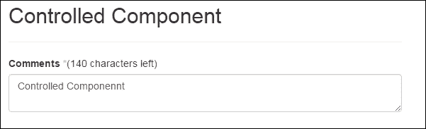
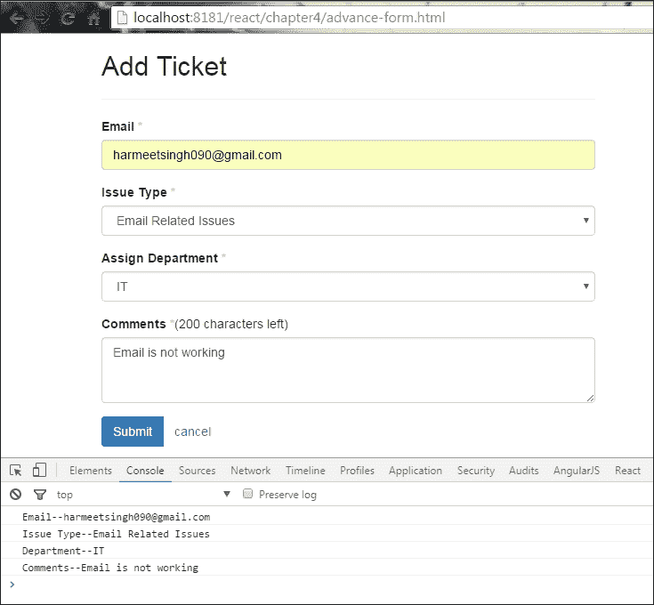
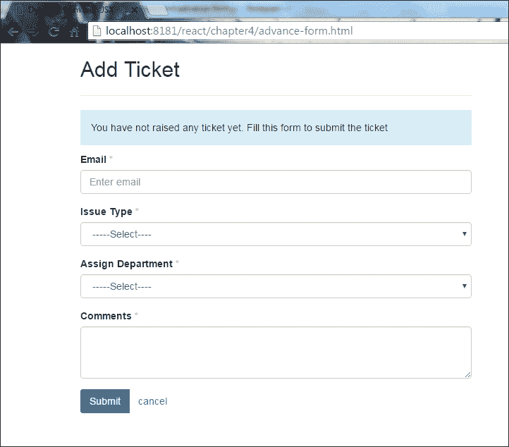
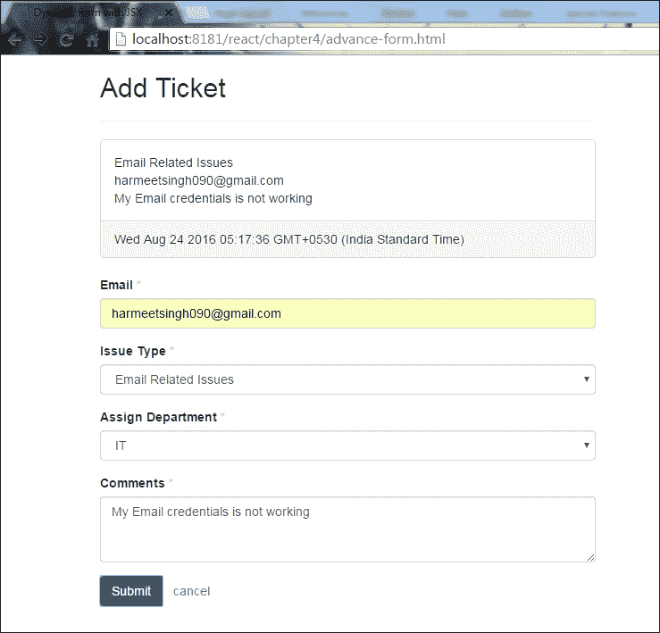
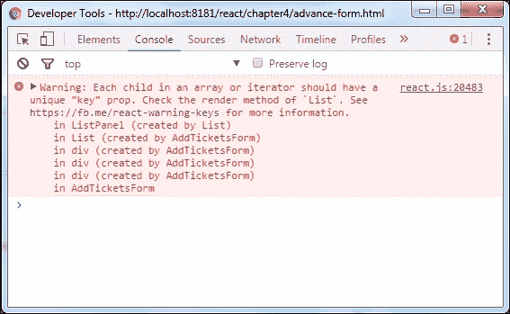

# 第四章. 使用 ReactJS 与 DOM 交互

在上一章中，我们学习了什么是 JSX，以及如何在 JSX 中创建组件。与许多其他框架一样，React 还有其他原型可以帮助我们构建我们的 Web 应用程序。每个框架都有不同的方式与 DOM 元素交互。React 使用快速的内部合成 DOM 来执行差异并为您计算最有效的 DOM 突变，其中您的组件实际上存在。

React 组件类似于接受 props 和 state 的函数（这将在后面的部分中解释）。React 组件只呈现单个根节点。如果我们想呈现多个节点，那么它们必须被包装到单个根节点中。

在我们开始使用表单组件之前，我们应该先看一下 props 和 state。

# Props 和 state

React 组件将您的原始数据转换为丰富的 HTML，props 和 state 一起构建该原始数据以保持您的 UI 一致。

好的，让我们确定它到底是什么：

+   Props 和 state 都是普通的 JS 对象。

+   它们通过`render`更新触发。

+   React 通过调用`setState(data,callback)`来管理组件状态。这种方法将数据合并到此状态中，并重新呈现组件以保持我们的 UI 最新。例如，下拉菜单的状态（可见或隐藏）。

+   React 组件 props（属性）随时间不会改变。例如，下拉菜单项。有时组件只使用这种`props`方法获取一些数据并呈现它，这使得您的组件无状态。

+   同时使用`props`和`state`有助于您创建一个交互式应用程序。

参考第三章中的实时示例，*ReactJS-JSX*。您将更好地理解状态和属性的工作原理。

在这个例子中，我们正在管理切换的状态（显示或隐藏）和切换按钮的文本作为属性。

# 表单组件

在 React 中，表单组件与其他本机组件不同，因为它们可以通过用户交互进行修改，例如`<input>`、`<textarea>`和`<option>`。

以下是支持的事件列表：

+   `onChange`、`onInput`和`onSubmit`

+   `onClick`、`onContextMenu`、`onDoubleClick`、`onDrag`、`onDragEnd`、`onDragEnter`和`onDragExit`

+   `onDragLeave`、`onDragOver`、`onDragStart`、`onDrop`、`onMouseDown`、`onMouseEnter`和`onMouseLeave`

+   `onMouseMove`、`onMouseOut`、`onMouseOver`和`onMouseUp`

可以在官方文档中找到支持的事件的完整列表：[`facebook.github.io/react/docs/events.html#supported-events`](https://facebook.github.io/react/docs/events.html#supported-events)。

## 表单组件中的 Props

正如我们所知，ReactJS 组件有自己的 props 和类似状态的形式，支持通过用户交互受影响的一些 props：

`<input>`和`<textarea>`

| **组件** | **支持的 Props** |
| --- | --- |
| `<input>`和`<textarea>` | Value, defaultValue |
| `<input>`类型的复选框或单选按钮 | Checked, defaultChecked |
| `<select>` | Selected, defaultValue |

### 注意

在 HTML `<textarea>`组件中，值是通过子元素设置的，但在 React 中可以通过`value`设置。`onChange`属性由所有原生组件支持，例如其他 DOM 事件，并且可以监听所有冒泡变化事件。

`onChange`属性在用户交互和更改时在浏览器中起作用：

+   `<input>`和`<textarea>`的`value`

+   `<input>`类型的`radio`和`checkbox`的`checked`状态

+   `<option>`组件的`selected`状态

在本章中，我们将演示如何使用我们刚刚查看的属性（prop）和状态来控制组件。然后，我们将看看如何从组件中应用它们来控制行为。

## 受控组件

我们要看的第一个组件是控制用户输入到`textarea`中的组件，当字符达到最大长度时阻止用户输入；它还会在用户输入时更新剩余字符：

```jsx
render: function() { 
    return <textarea className="form-control" value="fdgdfgd" />; 
}
```

在上述代码中，我们声明了`textarea`的值，因此当用户输入时，它不会对`textarea`的值进行更改。要控制这一点，我们需要使用`onChange`事件：

```jsx
var style = {color: "#ffaaaa"}; 
var max_Char='140'; 
var Teaxtarea = React.createClass({ 
    getInitialState: function() { 
        return {value: 'Controlled!!!', char_Left: max_Char}; 
    }, 
    handleChange: function(event) { 
        var input = event.target.value; 
        this.setState({value: input}); 
    }, 
    render: function() { 
        return ( 
            <form> 
                <div className="form-group"> 
                    <label htmlFor="comments">Comments <span style=
                    {style}>*</span></label>(<span>
                    {this.state.char_Left}</span> characters left) 
                    <textarea className="form-control" value=
                    {this.state.value} maxLength={max_Char} onChange=
                    {this.handleChange} /> 
                </div> 
            </form> 
        ); 
    } 
}) 

```

观察以下截图：



在上述截图中，我们接受并控制用户提供的值，并更新`<textarea>`组件的`prop`值。

### 注意

`this.state()`应该只包含表示 UI 状态所需的最小数据量。

但现在我们还想在`<span>`中更新`textarea`的剩余字符：

```jsx
this.setState({ 
    value: input.substr(0, max_Char),char_Left: max_Char - 
    input.length 
});
```

在上述代码中，`this`将控制`textarea`的剩余值，并在用户输入时更新剩余字符。

## 不受控组件

正如我们在 ReactJS 中所见，使用`value`属性时，我们可以控制用户输入，所以没有`value`属性的`<textarea>`是一个非受控组件：

```jsx
render: function() { 
    return <textarea className="form-control"/> 
}
```

这将渲染一个带有空值的`textarea`，用户可以输入值，这些值会立即反映在渲染的元素上，因为非受控组件有自己的内部状态。如果要初始化默认值，我们需要使用`defaultValue`属性：

```jsx
render:function() { 
    return <textarea className="form-control" defaultValue="Lorem 
    lipsum"/> 
} 

```

看起来像是受控组件，我们之前见过的。

# 在提交时获取表单值

正如我们所见，`state`和`prop`将让您控制组件的值并处理该组件的状态。

好的，现在让我们在我们的添加票务表单中添加一些高级功能，它可以验证用户输入并在 UI 上显示票务。

## Ref 属性

React 提供了`ref`非 DOM 属性来访问组件。`ref`属性可以是一个回调函数，在组件挂载后立即执行。

所以我们将在我们的表单元素中附加`ref`属性来获取值：

```jsx
var AddTicket = React.createClass({ 
    handleSubmitEvent: function (event) { 
        event.preventDefault(); 
        console.log("Email--"+this.refs.email.value.trim()); 
        console.log("Issue Type--"+this.refs.issueType.value.trim()); 
        console.log("Department--"+this.refs.department.value.trim()); 
        console.log("Comments--"+this.refs.comment.value.trim()); 
    }, 
    render: function() { 
        return ( 
        ); 
    } 
});
```

现在，我们将在`return`方法中添加表单元素的 JSX：

```jsx
<form onSubmit={this.handleSubmitEvent}>
    <div className="form-group">
        <label htmlFor="email">Email <span style={style}>*</span>
        </label>
        <input type="text" id="email" className="form-control" 
        placeholder="Enter email" required ref="email"/>
    </div>
    <div className="form-group">
        <label htmlFor="issueType">Issue Type <span style={style}>*
        </span></label>
        <select className="form-control" id="issueType" required
        ref="issueType">
            <option value="">-----Select----</option>
            <option value="Access Related Issue">Access Related 
            Issue</option>
            <option value="Email Related Issues">Email Related
            Issues</option>
            <option value="Hardware Request">Hardware Request</option>
            <option value="Health & Safety">Health & Safety</option>
            <option value="Network">Network</option>
            <option value="Intranet">Intranet</option>
            <option value="Other">Other</option>
        </select>
    </div>
    <div className="form-group">
        <label htmlFor="department">Assign Department <span style=
        {style}>*</span></label>
        <select className="form-control" id="department" required
        ref="department">
            <option value="">-----Select----</option>
            <option value="Admin">Admin</option>
            <option value="HR">HR</option>
            <option value="IT">IT</option>
            <option value="Development">Development</option>
        </select>
    </div>
    <div className="form-group">
        <label htmlFor="comments">Comments <span style={style}>*</span>
        </label>(<span id="maxlength">200</span> characters left)
        <textarea className="form-control" rows="3" id="comments" 
        required ref="comment"></textarea>
    </div>
    <div className="btn-group">
        <button type="submit" className="btn 
        btn-primary">Submit</button>
        <button type="reset" className="btn btn-link">cancel</button>
    </div>
</form>

```

在前面的代码中，我在我们的表单元素上添加了`ref`属性和`onSubmit`，调用了函数名`handleSubmitEvent`。在这个函数内部，我们使用`this.refs`来获取值。

现在，打开你的浏览器，让我们看看我们代码的输出：



我们成功地获取了组件的值。很清楚数据是如何在我们的组件中流动的。在控制台中，我们可以看到用户单击**提交**按钮时表单的值。

现在，让我们在 UI 中显示这张票的信息。

首先，我们需要获取表单的值并管理表单的状态：

```jsx
var AddTicket = React.createClass({ 
    handleSubmitEvent: function (event) { 
        event.preventDefault(); 

        var values  = { 
            date: new Date(), 
            email: this.refs.email.value.trim(), 
            issueType: this.refs.issueType.value.trim(), 
            department: this.refs.department.value.trim(), 
            comment: this.refs.comment.value.trim() 
        }; 
        this.props.addTicketList(values); 
    }, 
)};
```

现在我们将创建 AddTicketsForm 组件，它将负责管理和保存 addTicketList（值）的状态：

```jsx
var AddTicketsForm = React.createClass({  
    getInitialState: function () { 
        return { 
            list: {} 
        }; 
    }, 
    updateList: function (newList) { 
        this.setState({ 
            list: newList 
        }); 
    }, 

    addTicketList: function (item) { 
        var list = this.state.list; 

        list[item] = item; 
        //pass the item.id in array if we are using key attribute. 
        this.updateList(list); 
    }, 
    render: function () { 
        var items = this.state.list; 
        return ( 
            <div className="container"> 
            <div className="row"> 
            <div className="col-sm-6"> 
            <List items={items} /> 
            <AddTicket addTicketList={this.addTicketList} /> 
        </div> 
        </div> 
        </div> 
        ); 
    } 
});
```

让我们看一下前面的代码：

+   `getInitialState`：这个属性初始化了`<List />`组件的默认状态

+   `addTicketList`：这个属性保存数值并传递到`updateList`中的状态

+   `updateList`：这是用于更新票务列表以使我们的 UI 同步

现在我们需要创建`<List items={items} />`组件，当我们提交表单时，它会迭代列表：

```jsx
var List = React.createClass({  
    getListOfIds: function (items) { 
        return Object.keys(items); 
    }, 
    createListElements: function (items) { 
        var item; 
        return ( 
            this 
            .getListOfIds(items) 
            .map(function createListItemElement(itemId) { 
                item = items[itemId]; 
                return (<ListPanel item={item} />);//key={item.id} 
            }.bind(this)) 
            .reverse() 
        ); 
    }, 
    render: function () { 
        var items = this.props.items; 
        var listItemElements = this.createListElements(items); 

        return ( 
            <div className="bg-info"> 
                {listItemElements} 
            </div> 
        ); 
    } 
});
```

让我们了解一下前面的代码：

+   `getListOfIds`：这将遍历项目中的所有键，并返回我们与`<ListPanel item={item}/>`组件映射的列表

+   `.bind(this)`：`this`关键字将作为第二个参数传递，当调用函数时会给出适当的值

在`render`方法中，我们只是渲染元素的列表。此外，我们还可以根据`render`方法内部的长度添加条件：

```jsx
<p className={listItemElements.length > 0 ? "":"bg-info"}> 
    {listItemElements.length > 0 ? listItemElements : "You have not
    raised any ticket yet. Fill this form to submit the ticket"} 
</p> 

```

它将验证长度，并根据返回值 TRUE 或 FALSE 显示消息或应用 Bootstrap 类`.bg-info`。

现在我们需要创建一个`<ListPanel />`组件，以在 UI 中显示票务列表：

```jsx
var ListPanel = React.createClass({ 
    render: function () { 
        var item = this.props.item; 
        return ( 
            <div className="panel panel-default"> 
            <div className="panel-body"> 
            {item.issueType}<br/> 
            {item.email}<br/> 
            {item.comment} 
            </div> 
            <div className="panel-footer"> 
            {item.date.toString()} 
            </div> 
            </div> 
        ); 
    } 
}); 

```

现在，让我们结合我们的代码，看看在浏览器中的结果：

```jsx
var style = {color: "#ffaaaa"}; 
var AddTicketsForm = React.createClass({  
    getInitialState: function () { 
        return { 
            list: {} 
        }; 
    }, 
    updateList: function (newList) { 
        this.setState({ 
            list: newList 
        }); 
    }, 

    addTicketList: function (item) { 
        var list = this.state.list; 
        list[item] = item; 
        this.updateList(list); 
    }, 
    render: function () { 
        var items = this.state.list; 
        return ( 
            <div className="container"> 
            <div className="row"> 
            <div className="col-sm-12"> 
            <List items={items} /> 
            <AddTicket addTicketList={this.addTicketList} /> 
            </div> 
            </div> 
            </div> 
        ); 
    }  
}); 

//AddTicketsForm components code ends here

var ListPanel = React.createClass({
    render: function () {
        var item = this.props.item;
        return (
        <div className="panel panel-default">
            <div className="panel-body">
                {item.issueType}<br/>
                {item.email}<br/>
                {item.comment}
            </div>
        <div className="panel-footer">
            {item.date.toString()}
        </div>
        </div>
        );
    }
});

// We'll wrap ListPanel component in List

var List = React.createClass({
    getListOfIds: function (items) {
        return Object.keys(items);
    },
    createListElements: function (items) {
        var item;
        return (
            this
            .getListOfIds(items)
            .map(function createListItemElement(itemId) {
                item = items[itemId];
                return (
                    <ListPanel item={item} />
                );//key={item.id}
            }.bind(this))
            .reverse()
        );
    },
    render: function () {
        var items = this.props.items;
        var listItemElements = this.createListElements(items);
        return (
            <p className={listItemElements.length > 0 ? "":"bg-info"}>
            {listItemElements.length > 0 ? listItemElements : "You
            have not raised any ticket yet. Fill this form to submit
            the ticket"}
            </p>
        );
    }
});
```

在上述代码中，我们正在迭代项目并将其作为 props 传递给`<Listpanel/>`组件：

```jsx
var AddTicket = React.createClass({
    handleSubmitEvent: function (event) {
        event.preventDefault();
        var values  = {
            date: new Date(),
            email: this.refs.email.value.trim(),
            issueType: this.refs.issueType.value.trim(),
            department: this.refs.department.value.trim(),
            comment: this.refs.comment.value.trim()
        };
        this.props.addTicketList(values);
    },
    render: function() {
    return (

// Form template

ReactDOM.render( 
    <AddTicketsForm />, 
    document.getElementById('form') 
);
```

以下是我们 HTML 页面的标记。

```jsx
<link rel="stylesheet" href="css/bootstrap.min.css">
<style type="text/css">
    div.bg-info {
        padding: 15px;
    }
</style>
</head>
<body>
    <div class="container">
        <div class="row">
            <div class="col-sm-6">
                <h2>Add Ticket</h2>
                <hr/>
            </div>
        </div>
    </div>
    <div id="form">
    </div>
    <script type="text/javascript" src="js/react.js"></script>
    <script type="text/javascript" src="js/react-dom.js"></script>
    <script src="js/browser.min.js"></script>
    <script src="component/advance-form.js" type="text/babel"></script>
</body>

```

打开您的浏览器，让我们在提交之前看看我们表单的输出：



以下截图显示了提交表单后的外观：



看起来不错。我们的第一个完全功能的 React 组件已经准备好了。

### 注意

永远不要在任何组件内部访问`refs`，也不要将它们附加到无状态函数。

观察以下截图：



我们收到此警告消息是因为 React 的`key`（可选）属性，它接受一个唯一的 ID。每当我们提交表单时，它将迭代`List`组件以更新 UI。例如：

```jsx
createListElements: function (items) { 
    var item; 

    return ( 
        this 
        .getListOfIds(items) 
        .map(function createListItemElement(itemId,id) { 
        item = items[itemId]; 
            return (<ListPanel key={id} item={item} />); 
        }.bind(this)) 
        .reverse() 
    ); 
},
```

React 提供了 add-ons 模块来解决这种类型的警告并生成唯一的 ID，但它只在 npm 中可用。在后续章节中，我们将展示如何使用 React npm 模块。以下是一些流行的 add-ons 列表：

+   `TransitionGroup`和`CSSTransitionGroup`：用于处理动画和过渡

+   `LinkedStateMixin`：使用户的表单输入数据和组件状态之间的交互变得容易

+   `cloneWithProps`：更改组件的 props 并进行浅拷贝

+   `createFragment`：用于创建一组外部键控的子元素

+   `Update`：一个帮助函数，使在 JavaScript 中处理数据变得容易

+   `PureRenderMixin:`性能增强器

+   `shallowCompare:` 一个帮助函数，用于对 props 和 state 进行浅比较

## Bootstrap 辅助类

Bootstrap 提供了一些辅助类，以提供更好的用户体验。在`AddTicketsForm`表单组件中，我们使用了 Bootstrap 辅助类`*-info`，它可以帮助屏幕阅读器以颜色传达消息的含义。其中一些是`*-muted`，`*-primary`，`*-success`，`*-info`，`*-warning`和`*-danger`。

要更改文本的颜色，我们可以使用`.text*`：

```jsx
<p class="text-info">...</p>
```

要更改背景颜色，我们可以使用`.bg*`：

```jsx
<p class="bg-info">...</p>
```

### 插入符

要显示指示下拉方向的插入符，我们可以使用：

```jsx
<span class="caret"></span>
```

### 清除浮动

通过在父元素上使用`clearfix`，我们可以清除子元素的浮动：

```jsx
<div class="clearfix">... 
    <div class="pull-left"></div> 
    <div class="pull-right"></div> 
</div> 

```

# 总结

在本章中，我们已经看到 props 和 state 在使组件交互以及在 DOM 交互中发挥重要作用。Refs 是与 DOM 元素交互的好方法。通过流式响应 props 和 state 来做这件事将会很不方便。借助 refs，我们可以调用任何公共方法并向特定的子实例发送消息。

本章中展示的关键示例将帮助您理解和澄清有关 props、state 和 DOM 交互的概念。

最后一个示例涵盖了使用多个 JSX 组件和 Bootstrap 创建高级添加票据表单，这将为您提供更多关于创建 React 组件以及如何使用 refs 与它们交互的想法。您可以像操作 HTML 一样轻松地使用它和调整它。

如果您仍然不确定 state 和 props 的工作原理以及 React 如何与 DOM 交互，我建议您再次阅读本章，这也将在您查看未来章节时帮助您。

如果您已经完成了，那么让我们继续阅读第五章，“React 中的 jQuery Bootstrap 组件”，这一章主要讲述了 React 中的 Redux 架构。
