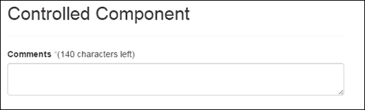
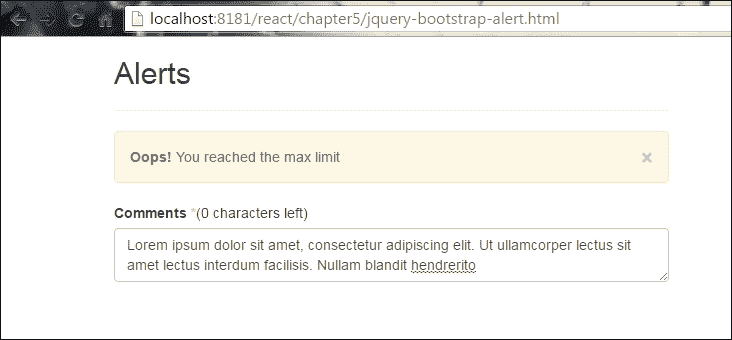
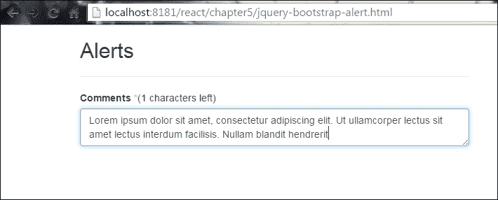
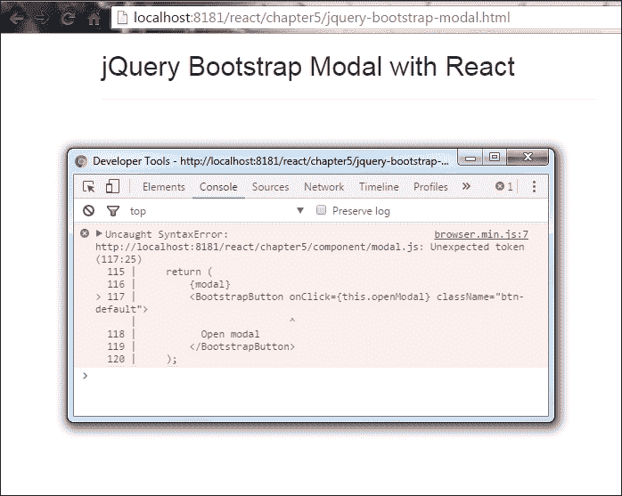
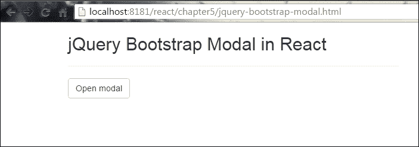
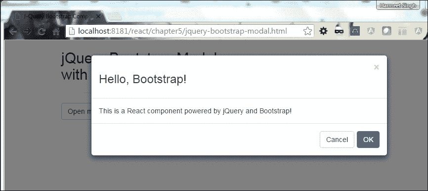
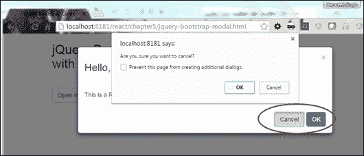
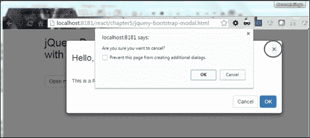
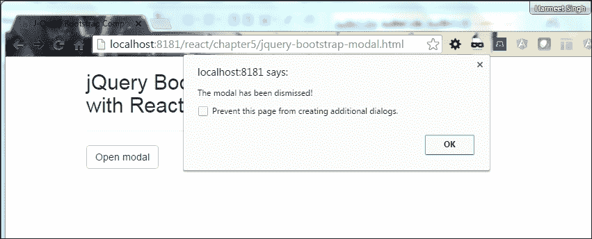

# 第五章：React 中的 jQuery Bootstrap 组件

到目前为止，我们已经介绍了如何创建 DOM 元素以及 DOM 如何与 React 组件交互。正如我们所见，每个框架都有不同的方式与 DOM 元素交互，而 React 使用快速的内部合成 DOM 来执行差异并为您计算最有效的 DOM 变化，这是您的组件实际存在的地方。

在本章中，我们将看看 jQuery Bootstrap 组件在 React 虚拟 DOM 中是如何工作的。我们还将涵盖以下主题：

+   组件生命周期方法

+   组件集成

+   Bootstrap 模态框

+   具体示例

这将让您更好地理解如何处理 React 中的 jQuery Bootstrap 组件。

在 Bootstrap 中，我们有很多可重用的组件，使开发人员的生活更轻松。在第一章和第二章中，我们解释了 Bootstrap 的集成。所以让我们从一个小组件开始，将其集成到 React 中。

# 警报

在 Bootstrap 中，我们有`alert`组件来根据用户操作在 UI 中显示消息，使您的组件更具交互性。

首先，我们需要将文本包裹在包含`close`按钮的`.alert`类中。

Bootstrap 还提供了表示不同颜色的上下文类，根据消息的不同而不同：

+   `.alert-success`

+   `.alert-info`

+   `.alert-warning`

+   `.alert-error`

## 用法

Bootstrap 为我们提供了`alert`组件的预定义结构，这使得将其包含在我们的项目中变得容易：

```jsx
<div class="alert alert-info alert-dismissible fade in" role="alert">
    <button type="button" class="close" data-dismiss="alert"
    aria-label="Close">
    <span aria-hidden="true">&times;</span>
    </button>
</div>

```

当我们将`close`按钮用作我们声明了`alert`类的包装标记的子元素时，我们需要向该元素添加`.alert-dismissible`类，就像前面的示例代码中所示的那样。

添加自定义属性`data-dismiss="alert"`将为我们在`alert`中提供`close`功能。

# 在 React 中的 Bootstrap 警报组件

现在我们将把 Bootstrap `alert`组件与我们在第四章中开发的 React 受控组件（`textarea`）集成起来，*ReactJS 中的 DOM 交互*，在那里我们开发了一个带有受控组件的表单。我们通过一个示例防止用户在`textarea`中写入超过`140`个字符的文本。

在以下示例中，我们将看到如何将警报/警告消息与相同的组件绑定。在这里，我们只是扩展了开发的受控组件。

您可能还在第四章中看到了以下截图，显示了带有`textarea`中注释的受控组件。在括号中，您可以看到定义的字符限制：



添加`alert`组件后，当用户达到最大字符限制时，它将显示在 UI 中。

为此，首先，我们需要将 Bootstrap 组件包装到 React 结构中。让我们通过实际示例来了解一下：

```jsx
var BootstrapAlert = React.createClass({  
    render: function() { 
        return ( 
            <div className={(this.props.className) + ' alert'}
            role="alert" ref="alertMsg"> 
                <button type="button" className="close"
                data-dismiss="alert" aria-label="Close" onClick=
                {this.handleClose}> 
                <span aria-hidden="true">×</span></button> 
                <strong>Ooops!</strong> You reached the max limit  
            </div>     
        ); 
    } 
}); 

```

我们创建了一个名为`BootstrapAlert`的组件，并将 HTML 包装在`render`方法中。

`onClick`调用`handleClose`函数，该函数将处理`close`事件。这是 React 的默认函数，因为我们在 JavaScript 中有`.show()`和`.hide()`默认函数。

在我们集成 jQuery Bootstrap 组件之前，我们必须了解组件中的 React 生命周期方法。

# 组件生命周期方法

在 React 中，每个组件都有自己特定的回调函数。当我们考虑 DOM 操作或在 React（jQuery）中集成其他插件时，这些回调函数起着重要作用。让我们看一些组件生命周期中常用的方法：

+   `getInitialState()`: 此方法将帮助您获取组件的初始状态。

+   `componentDidMount`：此方法在组件在 DOM 中首次渲染或挂载时自动调用。在集成 JavaScript 框架时，我们将使用此方法执行操作，例如`setTimeout`或`setInterval`，或发送 AJAX 请求。

+   `componentWillReceiveProps`：此方法将用于接收新的`props`。

### 注意

没有替代方法，如`componentWillReceiveState`。如果我们需要在`state`更改时执行操作，那么我们使用`componentWillUpdate`。

+   `componentWillUnmount`：此方法在组件从 DOM 中卸载之前调用。清理在`componentDidMount`方法中挂载的 DOM 内存元素。

+   `componentWillUpdate`：此方法在更新新的`props`和`state`之前调用。

+   `componentDidUpdate`：在组件在 DOM 中更新后立即调用此方法。

# 组件集成

我们现在了解了组件的生命周期方法。现在让我们使用这些方法在 React 中集成我们的组件。请观察以下代码：

```jsx
componentDidMount: function() { 
    // When the component is mount into the DOM 
    $(this.refs.alertMsg).hide(); 
          // Bootstrap's alert events 
// functionality. Lets hook into one of them: 
    $(this.refs.alertMsg).on('closed.bs.alert', this.handleClose); 
  }, 
  componentWillUnmount: function() {  
      $(this.refs.alertMsg).off('closed.bs.alert', this.handleClose); 
  }, 
  show: function() { 
      $(this.refs.alertMsg).show(); 
  }, 
  close: function() { 
      $(this.refs.alertMsg).alert('close'); 
  }, 
  hide: function() { 
      $(this.refs.alertMsg).hide(); 
  }, 
  render: function() { 
      return ( 
      <div className={(this.props.className) + ' alert'} role="alert"
      ref="alertMsg"> 
          <button type="button" className="close" data-dismiss="alert"
          aria-label="Close" onClick={this.handleClose}> 
          <span aria-hidden="true">x</span></button> 
          <strong>Oh snap!</strong> You reached the max limit  
      </div>      
    ); 
  }, 
}); 

```

让我们看一下上述代码的解释：

+   `componentDidMount()`默认情况下使用`refs`关键字在组件挂载到 DOM 时隐藏`alert`组件

+   `alert`组件为我们提供了一些在调用`close`方法时被调用的事件

+   当调用`close`方法时，将调用`close.bs.alert`

当我们使用`componentWillUnmount`组件时，也使用 jQuery 的`.off`来移除事件处理程序。当我们点击关闭（x）按钮时，它会调用 Closehandler 并调用 close

我们还创建了一些控制我们组件的自定义事件：

+   `.hide()`: 用于隐藏组件

+   `.show()`: 用于显示组件

+   `.close()`: 用于关闭警报

请观察以下代码：

```jsx
var Teaxtarea = React.createClass({ 
    getInitialState: function() { 
        return {value: 'Controlled!!!', char_Left: max_Char}; 
    }, 
    handleChange: function(event) { 
        var input = event.target.value; 
        this.setState({value: input.substr(0, max_Char),char_Left:   
        max_Char - input.length}); 
        if (input.length == max_Char){ 
            this.refs.alertBox.show(); 
        } 
        else{ 
        this.refs.alertBox.hide(); 
        } 
    }, 
    handleClose: function() { 
        this.refs.alertBox.close(); 
    }, 

    render: function() { 
        var alertBox = null; 
        alertBox = ( 
            <BootstrapAlert className="alert-warning fade in" 
            ref="alertBox" onClose={this.handleClose}/> 
        ); 
        return ( 
            <div className="example"> 
            {alertBox} 
                <div className="form-group"> 
                    <label htmlFor="comments">Comments <span style=
                    {style}>*</span></label(<span{this.state.char_Left}
                    </span> characters left) 
                    <textarea className="form-control" value=
                    {this.state.value} maxLength={max_Char} onChange=
                    {this.handleChange} /> 
                </div> 
            </div> 
        ); 
    } 
}); 
ReactDOM.render( 
    <Teaxtarea />, 
    document.getElementById('alert') 
); 

```

使用`if`条件，根据字符长度隐藏和显示警报。`handleClose()`方法将调用我们之前创建的`close`方法来关闭警报。

在`render`方法中，我们使用`className`属性、`ref`键和`onClose`属性来渲染我们的组件以处理`close`方法。

类中的`.fade`给我们在关闭警报时提供了淡出效果。

现在让我们结合我们的代码，快速在浏览器中查看一下：

```jsx
'use strict'; 
var max_Char='140'; 
var style = {color: "#ffaaaa"}; 

var BootstrapAlert = React.createClass({  
    componentDidMount: function() { 
        // When the component is added 
        $(this.refs.alertMsg).hide();  
        // Bootstrap's alert class exposes a few events for hooking 
        into modal 
        // functionality. Lets hook into one of them: 
        $(this.refs.alertMsg).on('closed.bs.alert', this.handleClose); 
    }, 
    componentWillUnmount: function() { 
        $(this.refs.alertMsg).off('closed.bs.alert', this.
        handleClose); 
    }, 
    show: function() { 
        $(this.refs.alertMsg).show(); 
    }, 
    close: function() { 
        $(this.refs.alertMsg).alert('close'); 
    }, 
    hide: function() { 
        $(this.refs.alertMsg).hide(); 
    },  
    render: function() { 
        return ( 
            <div className={(this.props.className) + ' alert'}
            role="alert" ref="alertMsg"> 
                <button type="button" className="close" 
                data-dismiss="alert" aria-label="Close" onClick=
                {this.handleClose}> 
                <span aria-hidden="true">×</span></button> 
                <strong>oops!</strong> You reached the max limit  
            </div> 

        ); 
    } 
}); 

var Teaxtarea = React.createClass({ 
    getInitialState: function() { 
        return {value: '', char_Left: max_Char}; 
    }, 
    handleChange: function(event) { 
        var input = event.target.value; 
        this.setState({value: input.substr(0, max_Char),char_Left: 
        max_Char - input.length}); 
        if (input.length == max_Char){ 
            this.refs.alertBox.show(); 
        } 
        else{ 
            this.refs.alertBox.hide(); 
        } 
    }, 
    handleClose: function() { 
        this.refs.alertBox.close(); 
    }, 

    render: function() { 
        var alertBox = null; 
        alertBox = ( 
            <BootstrapAlert className="alert-warning fade in"
            ref="alertBox"/> 
        ); 
        return ( 
            <div className="example"> 
            {alertBox} 
                <div className="form-group"> 
                    <label htmlFor="comments">Comments <span style=
                    {style}>*</span></label>(<span
                    {this.state.char_Left}</span> characters left) 
                    <textarea className="form-control" value=
                    {this.state.value} maxLength={max_Char} onChange=
                    {this.handleChange} /> 
                </div> 
            </div> 
        ); 
    } 
}); 
ReactDOM.render( 
    <Teaxtarea />, 
    document.getElementById('alert') 
);
```

请观察以下截图：



当我们点击关闭（**x**）按钮时，它会调用`Closehandler`并调用`close`事件来关闭警报消息。一旦关闭，您将需要刷新页面才能重新打开它。请观察以下截图：



### 注意

使用`console.log()`，我们可以验证我们的组件是否已挂载或卸载。

现在让我们看一下 Bootstrap 组件的另一个示例。

## Bootstrap 模态框

Bootstrap 模态组件向用户显示少量信息，而不会将您带到新页面。

来自 Bootstrap 网站（[`getbootstrap.com/javascript`](http://getbootstrap.com/javascript)）的下表显示了模态框可用的全部选项：

| **名称** | **类型** | **默认** | **描述** |
| --- | --- | --- | --- |
| `backdrop` | 布尔值 | `true` | `backdrop`允许我们在用户点击外部时关闭模态框。它为`backdrop`提供了一个静态值，不会在点击时关闭模态框。 |
| `keyboard` | 布尔值 | `true` | 按下*Esc*键关闭模态框。 |
| `show` | 布尔值 | `true` | 初始化模态框。 |
| `remote` | 路径 | `false` | 自 3.3.0 版本起，此选项已被弃用，并在 4 版本中已删除。建议使用数据绑定框架进行客户端模板化，或者自己调用`jQuery.load`。 |

Bootstrap 网站（[`getbootstrap.com/javascript`](http://getbootstrap.com/javascript)）的以下表格显示了 Bootstrap 模态组件可用的完整事件列表：

| **事件类型** | **描述** |
| --- | --- |
| `show.bs.modal` | 当调用`show`（`$('.modal').show();`）实例方法时，立即触发此事件。 |
| `shown.bs.modal` | 当模态框对用户可见时触发此事件（我们需要等待 CSS 过渡完成）。 |
| `hide.bs.modal` | 当调用`hide`（`$('.modal').hide();`）实例方法时，立即触发此事件。 |
| `hidden.bs.modal` | 当模态框从用户那里隐藏完成时触发此事件（我们需要等待 CSS 过渡完成）。 |
| `loaded.bs.modal` | 当模态框使用`remote`选项加载内容时触发此事件。 |

每当我们集成任何其他组件时，我们必须了解库或插件提供的组件选项和事件。

首先，我们需要创建一个`button`组件来打开一个`modal`弹出窗口：

```jsx
// Bootstrap's button to open the modal 
var BootstrapButton = React.createClass({ 
    render: function() { 
        return ( 
            <button {...this.props} 
            role="button" 
            type="button" 
            className={(this.props.className || '') + ' btn'} /> 
        ); 
    } 
}); 

```

现在，我们需要创建一个`modal-dialog`组件，并将`button`和`dialog`组件挂载到 DOM 中。

我们还将创建一些处理`show`和`hide`模态框事件的事件：

```jsx
var BootstrapModal = React.createClass({ 
    componentDidMount: function() { 
        // When the component is mount into the DOM 
        $(this.refs.root).modal({keyboard: true, show: false}); 

        // capture the Bootstrap's modal events 
        $(this.refs.root).on('hidden.bs.modal', this.handleHidden); 
    }, 
    componentWillUnmount: function() { 
        $(this.refs.root).off('hidden.bs.modal', this.handleHidden); 
    }, 
    close: function() { 
        $(this.refs.root).modal('hide'); 
    }, 
    open: function() { 
        $(this.refs.root).modal('show'); 
    }, 
    render: function() { 
        var confirmButton = null; 
        var cancelButton = null; 

    if (this.props.confirm) { 
        confirmButton = ( 
            <BootstrapButton 
                onClick={this.handleConfirm} 
                className="btn-primary"> 
                {this.props.confirm} 
            </BootstrapButton> 
        ); 
    } 
    if (this.props.cancel) { 
        cancelButton = ( 
            <BootstrapButton onClick={this.handleCancel} className=
            "btn-default"> 
            {this.props.cancel} 
            </BootstrapButton> 
        ); 
    } 

    return ( 
        <div className="modal fade" ref="root"> 
        <div className="modal-dialog"> 
        <div className="modal-content"> 
        <div className="modal-header"> 
        <button 
            type="button" 
            className="close" 
            onClick={this.handleCancel}> 
            &times; 
        </button> 
        <h3>{this.props.title}</h3> 
        </div> 
        <div className="modal-body"> 
            {this.props.children} 
        </div> 
        <div className="modal-footer"> 
            {cancelButton} 
            {confirmButton} 
</div> 
</div> 
</div> 
</div> 
    ); 
  }, 
  handleCancel: function() { 
      if (this.props.onCancel) { 
          this.props.onCancel(); 
      } 
  }, 
  handleConfirm: function() { 
      if (this.props.onConfirm) { 
          this.props.onConfirm(); 
      } 
  }, 
  handleHidden: function() { 
      if (this.props.onHidden) { 
          this.props.onHidden(); 
      } 
  } 
}); 

```

在`componentDidMount()`中，我们正在使用一些选项初始化`modal`组件，并将`hidden.bs.modal`事件注入`modal`中。

`close()`和`show()`函数触发模态框的`hide`/`show`事件。

在`render()`方法中，我们包含了带有`props`和`ref`键的模态框 HTML 模板来操作模板。

`handleCancel()`，`handleConfirm()`和`handleHidden()`处理我们组件的每个状态。

`.modal-*`类为我们提供了 Bootstrap 的样式，使我们的应用更加用户友好。

现在我们需要使用`render`函数来渲染我们的组件：

```jsx
var ReactBootstrapModalDialog = React.createClass({ 
    handleCancel: function() { 
        if (confirm('Are you sure you want to cancel the dialog 
        info?')) { 
            this.refs.modal.close(); 
        } 
    }, 
    render: function() { 
        var modal = null; 
        modal = ( 
            <BootstrapModal 
                ref="modal" 
                confirm="OK" 
                cancel="Cancel" 
                onCancel={this.handleCancel} 
                onConfirm={this.closeModal} 
                onHidden={this.handleModalDidClose} 
                > 
                This is a React component powered by jQuery and                      Bootstrap! 
            </BootstrapModal> 
        ); 
        return ( 
            {modal} 
            <BootstrapButton onClick={this.openModal} className="btn-
            default"> 
            Open modal 
            </BootstrapButton> 
        ); 
    }, 
    openModal: function() { 
        this.refs.modal.open(); 
    }, 
    closeModal: function() { 
        this.refs.modal.close(); 
    }, 
    handleModalDidClose: function() { 
        alert("The modal has been dismissed!"); 
    } 
}); 

```

我们在`<BootstrapModal>`中传递`props`并渲染`<BootstrapButton>`。

使用`this`关键字，我们调用一个函数来调用`modal`事件并在每次事件触发时显示警报：

```jsx
ReactDOM.render(<ReactBootstrapModalDialog />, 
document.getElementById('modal')); 

```

让我们快速在浏览器中查看一下我们的组件：



哎呀！我们出现了一个错误。我认为这可能是因为我们没有将组件包裹在`render`方法内。它应该始终与一个父元素一起包装：

```jsx
return ( 
    <div className="modalbtn"> 
        {modal} 
    <BootstrapButton onClick={this.openModal} className="btn-default"> 
        Open modal 
    </BootstrapButton> 
    </div> 
); 

```

这是我们在做了一些小改动后`ReactBootstrapModalDialog`组件的样子：

```jsx
var ReactBootstrapModalDialog = React.createClass({ 
    handleCancel: function() { 
        if (confirm('Are you sure you want to cancel?')) { 
            this.refs.modal.close(); 
        } 
    }, 
    render: function() { 
        var modal = null; 
        modal = ( 
            <BootstrapModal 
                ref="modal" 
                confirm="OK" 
                cancel="Cancel" 
                onCancel={this.handleCancel} 
                onConfirm={this.closeModal} 
                onHidden={this.handleModalDidClose} 
                > 
                This is a React component powered by jQuery and
                Bootstrap! 
            </BootstrapModal> 
        ); 
        return ( 
            <div className="modalbtn"> 
                {modal} 
                <BootstrapButton onClick={this.openModal} 
                className="btn-default"> 
                    Open modal 
                </BootstrapButton> 
            </div> 
        ); 
    }, 
    openModal: function() { 
        this.refs.modal.open(); 
    }, 
    closeModal: function() { 
        this.refs.modal.close(); 
    }, 
    handleModalDidClose: function() { 
        alert("The modal has been dismissed!"); 
    } 
}); 

ReactDOM.render(<ReactBootstrapModalDialog />, document.getElementById('modal')); 

```

让我们再次在浏览器中快速查看我们的组件：



现在点击**打开模态**按钮查看模态对话框：



如果我们点击**取消**或**确定**按钮，它将显示警报框，如下截图所示：



如果我们点击**X**图标，它将显示警报框，如下截图所示：



所以，现在我们知道我们可以通过点击(**X**)图标来关闭模态对话框。

当模态对话框关闭时，它会显示警报，**模态已被解除！** 请参见下面的截图：



这是我们的 HTML 文件的样子：

```jsx
<!DOCTYPE html>
<html>
    <head>
        <meta charset="UTF-8" />
        <title>J-Query Bootstrap Component with React</title>
        <link rel="stylesheet" href="css/bootstrap.min.css">
    </head>
    <body>
        <div class="container">
            <div class="row">
                <div class="col-sm-6">
                    <h2>jQuery Bootstrap Modal with React</h2>
                    <hr/>
                    <div id="modal">
                    </div>
                </div>
            </div>
        </div>
        <script type="text/javascript" src="js/jquery-1.10.2.min.js">
        </script>
        <script type="text/javascript" src="js/bootstrap.min.js">
        </script>
        <script type="text/javascript" src="js/react.min.js"></script>
        <script type="text/javascript" src="js/react-dom.min.js">
        </script>
        <script src="js/browser.min.js"></script>
        <script src="component/modal.js" type="text/babel"></script>
    </body>
</html>

```

# 摘要

我们已经看到了如何在 React 中集成 jQuery Bootstrap 组件以及在集成任何第三方插件（如 jQuery）时生命周期方法的工作方式。

我们能够通过处理事件的 props 来检查组件状态，并显示具有适当内容的对话框。我们还看了生命周期方法如何帮助我们集成其他第三方插件。

我们现在了解了组件的生命周期方法以及它们在 React 中的工作方式。我们已经学会了如何在 React 中集成 jQuery 组件。我们已经看到了事件处理机制以及警报和模态组件的示例。

本章中展示的关键示例将帮助您了解或澄清在 React 中集成 jQuery Bootstrap 组件的概念。

让我们继续阅读第六章，*Redux 架构*，这一章主要讲述在 React 中使用 Redux 架构。
