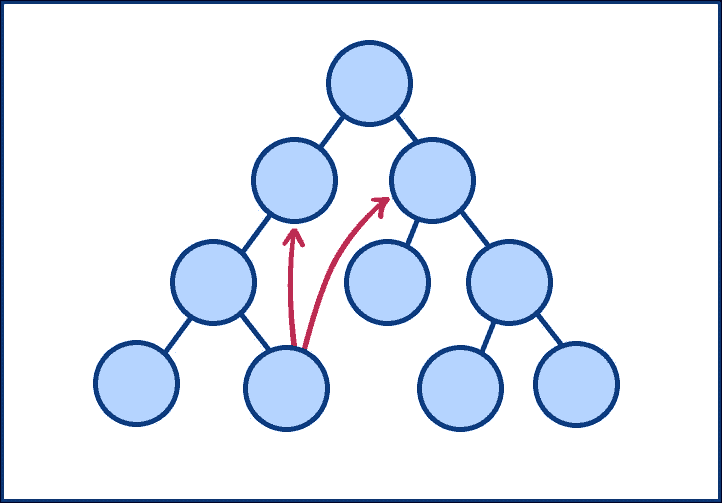
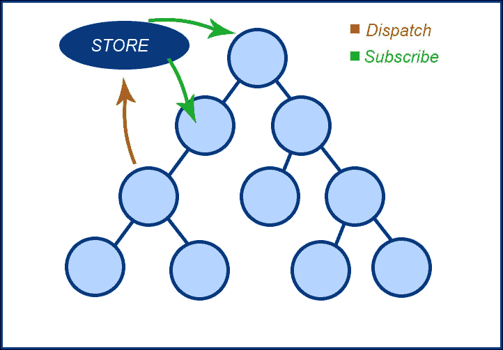
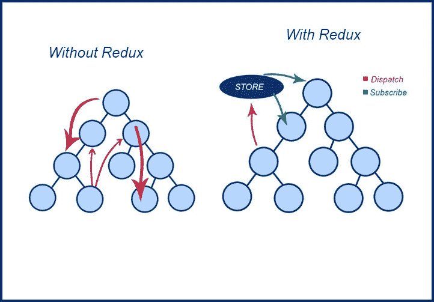
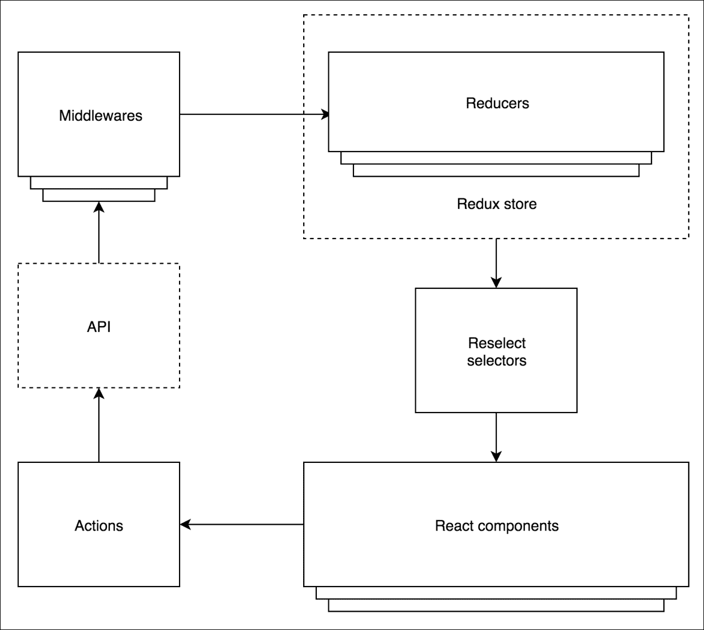
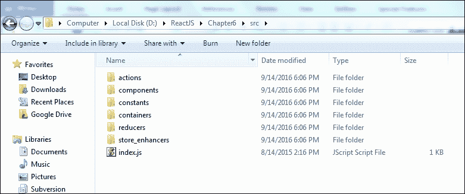
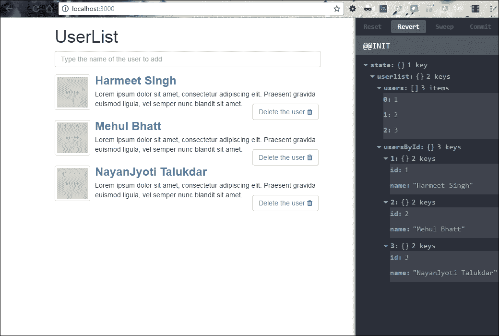
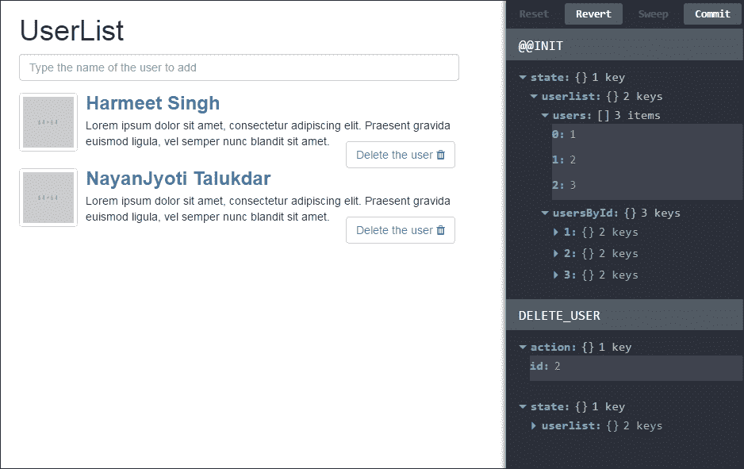
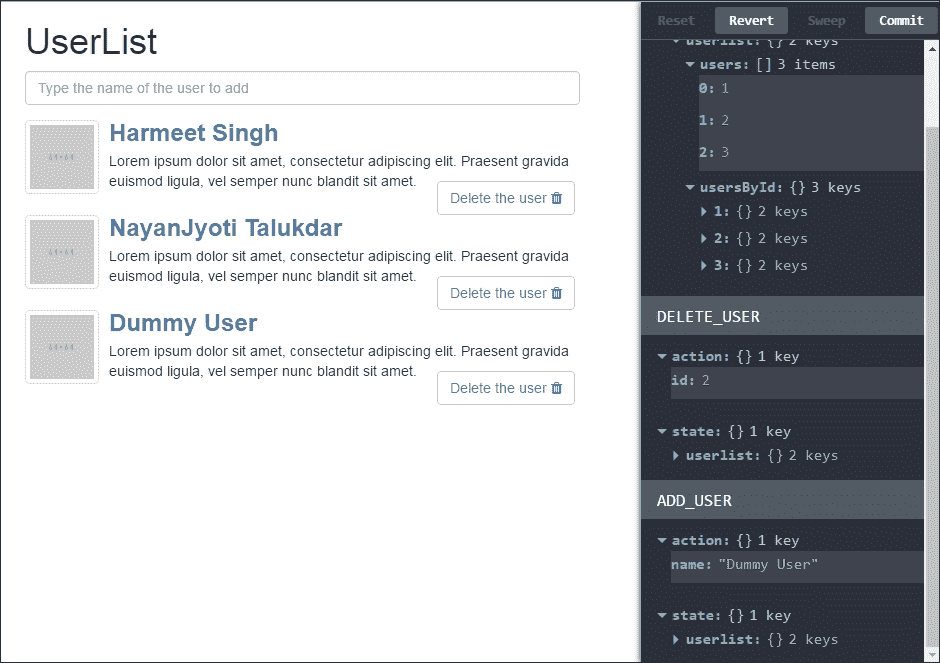

# 第六章：Redux 架构

在之前的章节中，我们学习了如何创建自定义组件，与 React 进行 DOM 交互，以及如何在 React 中使用 JSX，这些都足以让你对 React 及其在不同平台上的变化有足够的了解，例如添加工单表单应用程序的实际示例。现在我们将进入一个高级水平，这将让你进一步了解 JavaScript 应用程序中的状态管理。

# Redux 是什么？

正如我们所知，在**单页面应用程序**（**SPAs**）中，当我们需要处理状态和时间时，很难掌握随时间变化的状态。在这里，Redux 非常有帮助。为什么？因为在 JavaScript 应用程序中，Redux 处理两种状态：一种是数据状态，另一种是 UI 状态，这是 SPAs 的标准选项。此外，请记住，Redux 可以与 AngularJS、jQuery 或 React JS 库或框架一起使用。

Redux 是什么意思？简而言之，Redux 是在开发 JavaScript 应用程序时处理状态的助手。

我们在之前的例子中看到，数据只能从父级流向子级，这被称为*单向数据流*。React 也有相同的数据流方向，从数据到组件，因此在这种情况下，React 中的两个组件之间要进行正确的通信会非常困难。

我们可以在下面的图表中清楚地看到：



正如我们在前面的图表中所看到的，React 并不遵循两个组件之间的直接通信，尽管它具有提供该策略的功能。然而，这被认为是不良实践，因为它可能导致不准确性，而且这是一种很难理解的古老写法。

但这并不意味着在 React 中无法实现，因为它提供了另一种替代方法，但根据你的逻辑和 React 的标准，你必须加以处理。

要实现两个没有父子关系的组件之间的相同效果，你必须定义一个全局事件系统，让它们进行通信；Flux 可能是最好的例子。

这就是 Redux 的作用，它提供了一种将所有状态存储到一个组件可以访问的地方的方法，这个地方被称为**STORE**。简而言之，每当任何组件发现任何更改时，它必须首先分派到存储中，如果其他组件需要访问，它必须从存储中**订阅**。它不能直接授权与该组件的通信，如下图所示：



在前面的图表中，我们可以看到**STORE**假装成为应用程序中所有状态修改的*中介*，Redux 通过**STORE**控制两个组件之间的直接通信，只有一个通信点。

你可能认为组件之间的通信可以通过其他策略实现，但不建议这样做，因为这样做要么会导致错误的代码，要么会难以跟踪：



现在很清楚 Redux 是如何通过将所有状态更改分派到**STORE**而不是在组件内部进行通信来简化生活的。现在组件只需要考虑分派状态更改；所有其他责任将属于**STORE**。

Flux 模式也是这样做的。你可能听说过 Redux 受 Flux 启发，所以让我们看看它们有多相似：

比较 Redux 和 Flux，Redux 是一个工具，而 Flux 只是一个模式，你不能用来即插即用，也不能下载。我不否认 Redux 与 Flux 模式有一些相似之处，但它并不完全与 Flux 相同。

让我们看一些区别。

Redux 遵循三个指导原则，如下面的描述所示，这也将涵盖 Redux 和 Flux 之间的区别。

## 单个存储方法

我们在之前的图表中看到，存储假装成为应用程序中所有状态修改的*中介*，Redux 通过存储控制两个组件之间的直接通信，充当单一的通信点。

这里 Redux 和 Flux 的区别在于：Flux 有多个存储方法，而 Redux 有单个存储方法。

## 只读状态

在 React 应用程序中，组件不能直接更改状态，而必须通过*actions*将更改分派到存储中。

在这里，`store`是一个对象，它有四种方法，如下所示：

+   `store.dispatch` (action)

+   `store.subscribe`（监听器）

+   `store.getState()`

+   `replaceReducer`（下一个 Reducer）

您可能已经了解 JavaScript 中的`get`和`set`属性：`set`属性设置对象，`get`属性获取对象。但是使用`store`方法时，只有`get`方法，因此只有一种方法可以通过*动作*分派更改来设置状态。

以下代码显示了 JavaScript Redux 的示例：

```jsx
var action = { 
    type: 'ADD_USER', 
    user: {name: 'Dan'} 
}; 
// Assuming a store object has been created already 
store.dispatch(action); 

```

在这里，动作意味着`dispatch()`，其中`store`方法将发送一个对象来更新状态。在上述代码片段中，`action`采用`type`数据来更新状态。您可以根据组件的需要设计不同的方式来设置您的动作。

## Reducer 函数用于更改状态

Reducer 函数将处理`dispatch`动作以改变状态，因为 Redux 工具不允许两个组件之间的直接通信，因此它也不会改变状态，而是将`dispatch`动作描述为状态更改。

在下面的代码片段中，您将看到`Reducer`如何通过允许当前状态作为参数并返回新状态来改变`state`：

```jsx
Javscript: 
// Reducer Function 
varsomeReducer = function(state, action) { 
    ... 
    return state; 
} 

```

这里的 Reducer 可以被视为纯函数。以下是编写`Reducer`函数的一些特征：

+   没有外部数据库或网络调用

+   根据其参数返回值

+   参数是*不可变的*

+   相同的参数返回相同的值

Reducer 函数被称为纯函数，因为它们除了根据其设置的参数纯粹返回值之外，什么都不做；它们没有其他后果。

# Redux 的架构

正如我们所讨论的，Redux 受 Flux 模式的启发，因此也遵循其架构。这意味着状态变化将被发送到存储库，并且存储库将处理动作以在组件之间进行通信。

让我们看看数据和逻辑是如何通过以下图表工作的：



观察以下要点以了解 Redux 架构：

+   您可以在上图中看到，在右下方，组件触发动作。

+   状态突变将以与 Flux 请求中相同的方式发生，并且可能会有另一个效果作为**API**请求。

+   中间件在这里扮演着重要角色，比如处理监听承诺状态的操作以及采取新的行动。

+   **Reducers**负责作为中间件处理动作。

+   **Reducer**作为中间件获取所有动作请求，它还与数据相关联。它有权通过定义新状态全局更改应用程序存储中的状态。

+   当我们说状态改变时，这涉及重新选择其选择器并转换数据并通过组件传递。

+   当组件获得更改请求时，相应地，它会将 HTML 呈现给 DOM 元素。

在我们继续之前，我们必须了解流程，以确保结构顺畅。

## Redux 的架构优势

与其他框架相比，Redux 具有更多的优势：

+   它可能没有其他副作用

+   正如我们所知，不需要绑定，因为组件不能直接交互

+   状态是全局管理的，因此出现管理不善的可能性较小

+   有时，对于中间件来说，管理其他副作用可能会很困难

从上述观点来看，Redux 的架构非常强大，而且具有可重用性。让我们看一个实际的例子，看看 Redux 如何与 React 一起工作。

我们将在 Redux 中创建我们的 Add Ticket 表单应用程序。

# Redux 设置

让我们从 Redux 中的`UserList`示例开始。首先，创建一个带有应用程序的目录。我们在这个示例中使用 Node.js 服务器和 npm 包，因为 Redux 模块不能独立使用。

## 安装 Node.js

首先，如果我们尚未在系统中安装 Node.js，我们必须下载并安装 Node.js。我们可以从[`nodejs.org`](http://nodejs.org)下载 Node.js。它包括 npm 包管理器。

设置完成后，我们可以检查 Node.js 是否设置正确。打开命令提示窗口并运行以下命令：

```jsx
**node --version**
```

您应该能够看到版本信息，这可以确保安装成功。

### 设置应用程序

首先，我们需要为我们的项目创建一个`package.json`文件，其中包括项目信息和依赖项。现在，打开命令提示符/控制台，并导航到您创建的目录。运行以下命令：

```jsx
**Npm init**
```

这个命令将初始化我们的应用程序，并询问一些问题，以创建一个名为`package.json`的 JSON 文件。该实用程序将询问有关项目名称、描述、入口点、版本、作者名称、依赖项、许可信息等的问题。一旦执行了该命令，它将在项目的根目录中生成一个`package.json`文件：

```jsx
{ 
  "name": "react-redux add ticket form example", 
  "version": "1.0.0", 
  "description": "", 
  "scripts": { 
    "start": "node server.js", 
    "lint": "eslintsrc" 
  }, 
  "keywords": [ 
    "react", 
   "redux", 
   "redux form", 
    "reactjs", 
    "hot", 
    "reload", 
    "live", 
    "webpack" 
  ], 
  "author": "Harmeet Singh <harmeet.singh090@gmail.com>", 
  "license": "MiIT", 
  "devDependencies": { 
    "babel-core": "⁵.8.3", 
    "babel-eslint": "⁴.0.5", 
    "babel-loader": "⁵.3.2", 
    "css-loader": "⁰.15.6", 
    "cssnext-loader": "¹.0.1", 
    "eslint": "⁰.24.1", 
    "eslint-plugin-react": "³.1.0", 
    "extract-text-webpack-plugin": "⁰.8.2", 
    "html-webpack-plugin": "¹.6.1", 
    "react-hot-loader": "¹.2.7", 
    "redux-devtools": "¹.0.2", 
    "style-loader": "⁰.12.3", 
    "webpack": "¹.9.6", 
    "webpack-dev-server": "¹.8.2" 
  }, 
  "dependencies": { 
    "classnames": "².1.3", 
    "lodash": "³.10.1", 
    "react": "⁰.13.0", 
    "react-redux": "⁰.2.2", 
    "redux": "¹.0.0-rc" 
  } 
} 

```

好的，让我在开始之前向您解释一些主要工具：

+   `webpack-dev-server`：这是用于应用程序实时重新加载的服务器。

+   `babel-loader`：这是我们 JavaScript 的编译器。

+   `redux-devtools`：这是 Redux 开发的强大工具。在开发中使用此工具将帮助我们监视 DOM UI 中的更新。

+   `classnames`：这是一个模块，将帮助我们根据条件应用类。

+   `eslint`：这是类似于 JSHint 和 JSLint 用于解析 JavaScript 的工具。

## 开发工具设置

首先，我们需要创建`webpack.config.js`并添加以下代码以启用`redux-devtools`：

```jsx
var path = require('path'); 
varwebpack = require('webpack'); 
varExtractTextPlugin = require('extract-text-webpack-plugin'); 
vardevFlagPlugin = new webpack.DefinePlugin({ 
  __DEV__: JSON.stringify(JSON.parse(process.env.DEBUG || 'true')) 
}); 

module.exports = { 
  devtool: 'eval', 
  entry: [ 
    'webpack-dev-server/client?http://localhost:3000', 
    'webpack/hot/only-dev-server', 
    './src/index' 
  ], 
  output: { 
    path: path.join(__dirname, 'dist'), 
    filename: 'bundle.js', 
    publicPath: '/static/' 
  }, 
  plugins: [ 
    new webpack.HotModuleReplacementPlugin(), 
    new webpack.NoErrorsPlugin(), 
    devFlagPlugin, 
    new ExtractTextPlugin('app.css') 
  ], 
  module: { 
    loaders: [ 
      { 
        test: /\.jsx?$/, 
        loaders: ['react-hot', 'babel'], 
        include: path.join(__dirname, 'src') 
      }, 
      { test: /\.css$/, loader: ExtractTextPlugin.extract
      ('css-loader?module!cssnext-loader') } 
    ] 
  }, 
  resolve: { 
    extensions: ['', '.js', '.json'] 
  } 
}; 

```

现在，创建一个名为`src`的目录。在其中，我们需要创建一些文件夹，如下面的截图所示：



## Redux 应用程序设置

在每个 Redux 应用程序中，我们都有 actions、reducers、stores 和 components。让我们从为我们的应用程序创建一些 actions 开始。

### Actions

Actions 是从我们的应用程序发送数据到我们的 store 的信息的一部分。

首先，我们需要在 actions 文件夹内创建`UsersActions.js`文件，并将以下代码放入其中：

```jsx
import * as types from '../constants/ActionTypes'; 

export function addUser(name) { 
  return { 
    type: types.ADD_USER, 
    name 
  }; 
} 

export function deleteUser(id) { 
  return { 
    type: types.DELETE_USER, 
    id 
  }; 
} 

```

在上面的代码中，我们创建了两个动作：`addUser`和`deleteUser`。现在我们需要在`constants`文件夹内创建`ActionTypes.js`，定义`type`：

```jsx
export constADD_USER = 'ADD_USER'; 
export constDELETE_USER = 'DELETE_USER';  

```

### Reducers

Reducers 处理描述发生了什么事情的 actions，但管理应用程序状态是 reducers 的责任。它们存储先前的`state`和`action`，并`return`下一个`state`：

```jsx
export default function users(state = initialState, action) { 
  switch (action.type) { 
    case types.ADD_USER: 
    constnewId = state.users[state.users.length-1] + 1; 
      return { 
        ...state, 
        users: state.users.concat(newId), 
        usersById: { 
          ...state.usersById, 
          [newId]: { 
            id: newId, 
            name: action.name 
          } 
        }, 
      } 

     case types.DELETE_USER: 
     return { 
       ...state, 
       users: state.users.filter(id => id !== action.id), 
       usersById: omit(state.usersById, action.id) 
     } 

     default: 
     return state; 
  } 
} 

```

### Store

我们已经定义了 actions 和 reducers，它们代表了关于*发生了什么*的事实，以及何时需要根据这些 actions 更新状态。

`store`是将 actions 和 reducers 结合在一起的对象。store 有以下职责：

+   保存应用程序状态

+   通过`getState()`和`dispatch`（action）允许访问和更新状态。

+   通过`subscribe`（监听器）注册和取消注册监听器

以下是 container 文件夹中`UserListApp.js`的代码：

```jsx
constinitialState = { 
  users: [1, 2, 3], 
  usersById: { 
    1: { 
      id: 1, 
      name: 'Harmeet Singh' 
    }, 
    2: { 
      id: 2, 
      name: 'Mehul Bhatt' 
    }, 
    3: { 
      id: 3, 
      name: 'NayanJyotiTalukdar' 
    } 
  } 
}; 
import React, { Component, PropTypes } from 'react'; 
import { bindActionCreators } from 'redux'; 
import { connect } from 'react-redux'; 

import * as UsersActions from '../actions/UsersActions'; 
import { UserList, AddUserInput } from '../components'; 

@connect(state => ({ 
userlist: state.userlist 
})) 
export default class UserListApp extends Component { 

  static propTypes = { 
    usersById: PropTypes.object.isRequired, 
    dispatch: PropTypes.func.isRequired 
  } 

  render () { 
    const { userlist: { usersById }, dispatch } = this.props; 
    const actions = bindActionCreators(UsersActions, dispatch); 

    return ( 
      <div> 
        <h1>UserList</h1> 
        <AddUserInputaddUser={actions.addUser} /> 
        <UserList users={usersById} actions={actions} /> 
      </div> 
    ); 
  } 
} 

```

在上面的代码中，我们使用`UserList`的静态 JSON 数据初始化组件的状态，并使用`getstate`、`dispatch`（action），然后更新 store 信息。

### 提示

在 Redux 应用程序中，我们只会有一个单一的 store。当我们需要拆分我们的数据处理逻辑时，我们将使用 reducer 组合而不是多个 store。

### Components

这些都是普通的 React JSX 组件，所以我们不需要详细介绍它们。我们已经添加了一些功能状态组件，除非我们需要使用本地状态或生命周期方法，否则我们将使用它们：

在这个（`AddUserInput.js`）文件中，我们正在创建一个 JSX 输入组件，从中获取用户输入：

```jsx
export default class AddUserInput extends Component { 
  static propTypes = { 
    addUser: PropTypes.func.isRequired 
  } 

  render () { 
    return ( 
      <input 
      type="text" 
      autoFocus="true" 
      className={classnames('form-control')} 
        placeholder="Type the name of the user to add" 
        value={this.state.name} 
        onChange={this.handleChange.bind(this)} 
        onKeyDown={this.handleSubmit.bind(this)} /> 
    ); 
  } 

  constructor (props, context) { 
    super(props, context); 
      this.state = { 
        name: this.props.name || '', 
      }; 
  } 
} 

```

在`UserList.js`中，我们正在创建一个列表组件，其中我们迭代`Input`组件的值：

```jsx
export default class UserList extends Component { 
  static propTypes = { 
    users: PropTypes.object.isRequired, 
    actions: PropTypes.object.isRequired 
  } 

  render () { 
    return ( 
      <div className="media"> 
        { 
          mapValues(this.props.users, (users) => { 
            return (<UsersListItem 
              key={users.id} 
              id={users.id} 
              name={users.name} 
               src={users.src} 
              {...this.props.actions} />); 
          }) 
        } 
      </div> 
    ); 
  } 
}

```

在`UserList`组件中迭代值后，我们将在 Bootstrap 的`media`布局中显示该列表：

```jsx
export default class UserListItem extends Component { 
  static propTypes = { 
    id: PropTypes.number.isRequired, 
    name: PropTypes.string.isRequired, 
    onTrashClick: PropTypes.func.isRequired 
  } 

  render () { 
    return ( 
      <div> 
      <div className="clearfix"> 
            <a href="#" className="pull-left"> 
             
            </a> 
            <div className={`media-body ${styles.paddng10}`}> 
                  <h3className="media-heading"> 
                  <strong><a href="#">{this.props.name}</a></strong> 
                  </h3> 
            <p> 
                  Loremipsum dolor sit amet, consecteturadipiscingelit. 
                  Praesentgravidaeuismod ligula,
                  vel semper nuncblandit sit amet.  
            </p> 

            <div className={`pull-right ${styles.userActions}`}> 
            <button className={`btnbtn-default ${styles.btnAction}`} 
            onClick={()=>this.props.deleteUser(this.props.id)} 
            > 
            Delete the user <iclassName="fafa-trash" /> 
            </button> 
            </div> 
          </div> 
        </div> 
      </div> 
    ); 
  } 
}  

```

现在，我们需要将我们的组件包装在容器文件夹中的`UserListApp.js`中：

```jsx
import { UserList, AddUserInput } from '../components'; 
@connect(state => ({ 
  userlist: state.userlist 
})) 
export default class UserListApp extends Component {  
  static propTypes = { 
    usersById: PropTypes.object.isRequired, 
    dispatch: PropTypes.func.isRequired 
  } 

  render () { 
    const { userlist: { usersById }, dispatch } = this.props; 
    const actions = bindActionCreators(UsersActions, dispatch); 

    return ( 
      <div> 
        <h1>UserList</h1> 
        <AddUserInput addUser={actions.addUser} /> 
        <UserList users={usersById} actions={actions} /> 
      </div> 
    ); 
  } 
}
```

现在，让我们将`UserListApp`组件包装到容器文件夹中的`App.js`中的 Redux 存储中：

```jsx
import UserListApp from './UserListApp'; 
import * as reducers from '../reducers'; 

const reducer = combineReducers(reducers); 
const store = createStore(reducer); 

export default class App extends Component { 
  render() { 
    return ( 
      <div> 
        <Provider store={store}> 
          {() => <UserListApp /> } 
        </Provider> 

        {renderDevTools(store)} 
      </div> 
    ); 
  } 
} 

```

现在转到根目录，打开 CMD，并运行以下命令：

要安装此应用程序所需的软件包，请运行以下命令：

```jsx
**Npm install**
```

完成后，运行以下命令：

```jsx
**Npm start**
```

观察以下屏幕截图：



看起来很棒。右侧面板是 Redux DevTool，它提供了 UI 的更新。我们可以轻松地看到在此列表中删除或添加用户的更新。

以下屏幕截图显示了从`UserList`中删除用户：



以下屏幕截图显示了添加用户的过程：



### 注意

请参阅第六章的源代码，*Redux 架构*，以便更好地理解应用程序的流程。

# 总结

我们现在可以看到 Redux 架构的重要性及其在 React 应用程序中的作用。我们还在本章中学习了状态管理，看看存储如何全局处理状态更改请求，Redux 有助于避免组件之间的直接交互。

本章主要讨论 Redux 架构及其细节。为了澄清，我们已经看到了提供对 Redux 架构中数据和逻辑流程理解的图表。Redux 架构受 Flux 的启发，但它有自己的特点和优势。我们希望图表和实际示例有助于让您了解 Redux 架构。

现在，我们将继续进行下一章，讨论如何在 React 中进行路由。
