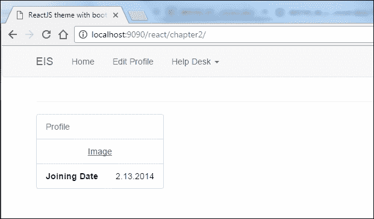
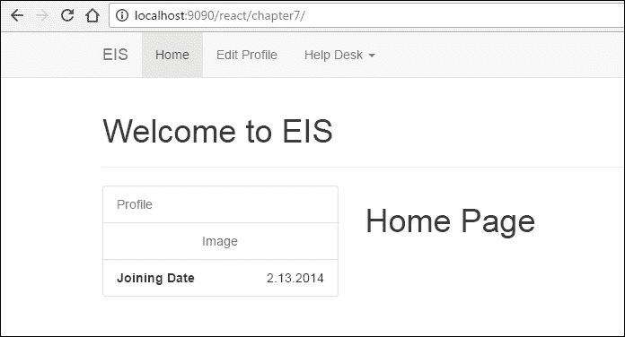
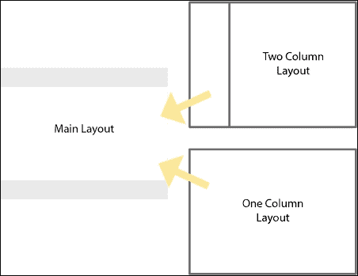
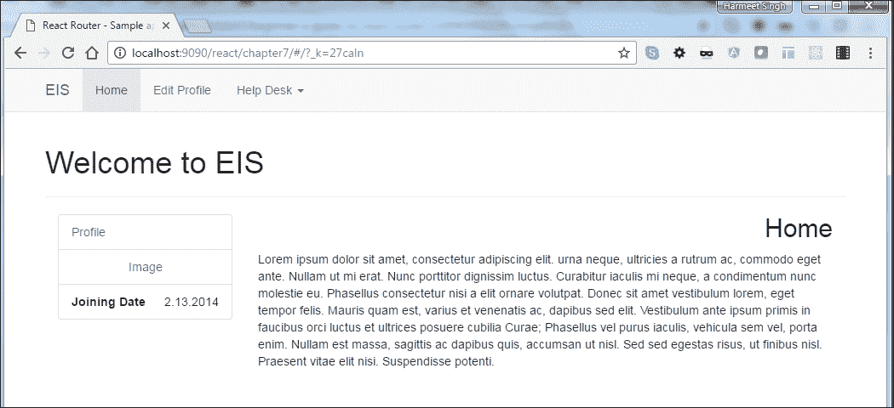
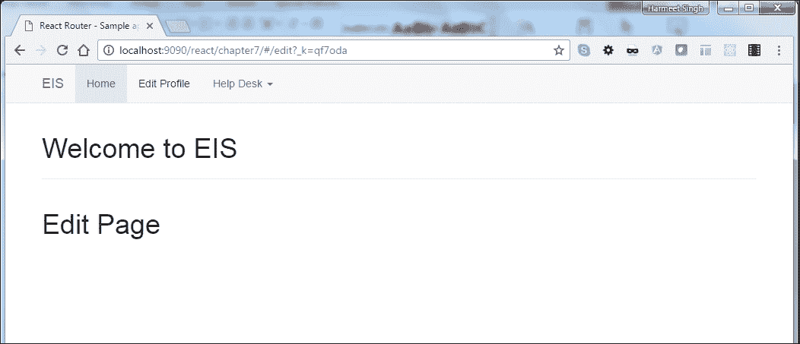
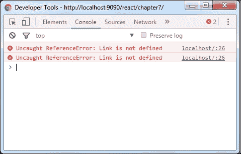
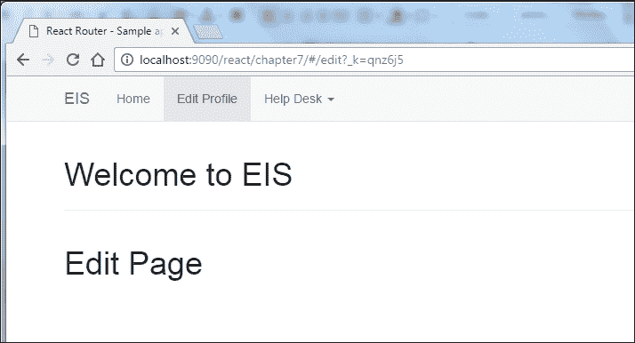
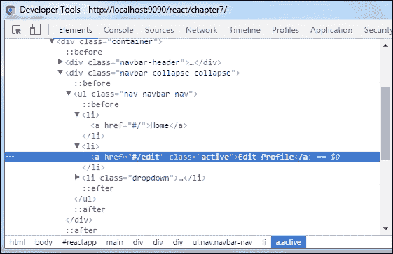
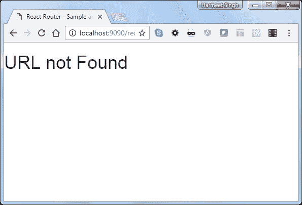
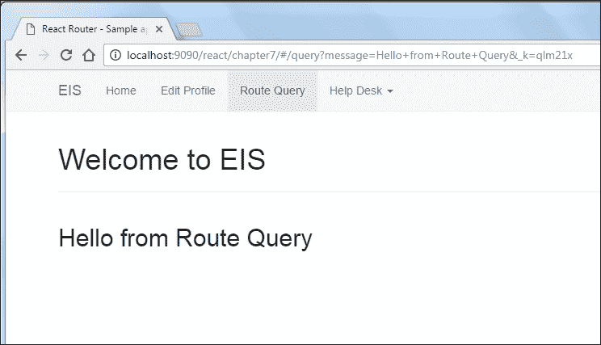

# 第七章：使用 React 进行路由

在之前的章节中，我们已经了解了 Redux 架构以及如何处理两种状态，即数据状态和 UI 状态，以创建单页面应用程序或组件。目前，如果需要，我们的应用程序 UI 将与 URL 同步，我们需要使用 React 路由器使我们的应用程序 UI 同步。

# React 路由器的优势

让我们看一下 React 路由器的一些优势：

+   以标准化结构查看声明有助于我们立即了解我们的应用视图

+   延迟加载代码

+   使用 React 路由器，我们可以轻松处理嵌套视图和渐进式视图分辨率

+   使用浏览历史功能，用户可以向后/向前导航并恢复视图的状态

+   动态路由匹配

+   导航时视图上的 CSS 过渡

+   标准化的应用程序结构和行为，在团队合作时非常有用

### 注意

React 路由器不提供任何处理数据获取的方式；我们需要使用`asyncProps`或另一种 React 数据获取机制。

在本章中，我们将看看如何创建路由，以及包含参数的路由。在开始之前，让我们计划一下我们的**员工信息系统**（**EIS**）需要哪些路由。请查看以下屏幕截图：



上述屏幕截图来自第二章 *使用 React-Bootstrap 和 React 构建响应式主题*供您参考。

在第二章 *使用 React-Bootstrap 和 React 构建响应式主题*中，我们为我们的应用程序创建了响应式主题布局。现在我们将在其中添加路由以导航到每个页面。

+   **主页**：这将是我们的主页，将显示员工的个人资料信息

+   **编辑个人资料**：在这里，我们将能够编辑员工的信息

+   **查看工单**：在这个页面，员工将能够查看他提交的工单

+   **新工单**：在这里，员工可以提交工单

这些都是我们必要的路由；让我们看看如何创建它们。

# 安装路由器

React 路由器已经作为 React 库之外的不同模块打包。我们可以在 React 路由器 CDN 上使用 React 路由器 CDN：[`cdnjs.cloudflare.com/ajax/libs/react-router/4.0.0-0/react-router.min.js`](https://cdnjs.cloudflare.com/ajax/libs/react-router/4.0.0-0/react-router.min.js)。

我们可以像这样将其包含在我们的项目中：

```jsx
var { Router, Route, IndexRoute, Link, browserHistory } = ReactRouter 

```

或者我们可以使用 React 的`npm`包：

```jsx
**$ npm install --save react-router**
```

使用 ES6 转译器，比如 Babel：

```jsx
import { Router, Route, Link } from 'react-router'
```

不使用 ES6 转译器：

```jsx
var Router = require('react-router').Router 
var Route = require('react-router').Route 
var Link = require('react-router').Link 

```

好的，现在让我们设置我们的项目并包括 React 路由器。

# 应用程序设置

React 路由器看起来与其他 JS 路由器不同。它使用 JSX 语法，这使得它与其他路由器不同。首先，我们将创建一个示例应用程序，而不使用`npm`包，以更好地理解路由器的概念。

按照以下说明进行设置：

1.  将`第二章`目录结构和文件复制到`第七章`中。

1.  删除现有的 HTML 文件并创建一个新的`index.html`。

1.  在您的 HTML 中复制此样板代码：

```jsx
        <!doctype html>
        <html lang="en">
            <head>
                <meta charset="utf-8">
                <title>React Router - Sample application with 
                bootstrap</title>
                <link rel="stylesheet" href="css/bootstrap.min.css">
                <link rel="stylesheet" href="css/font-awesome.min.css">
                <link rel="stylesheet" href="css/custom.css">
                <script type="text/javascript" src="js/react.js"></script>
                <script type="text/javascript" src="js/react-dom.min.js">
                </script>
                <script src="js/browser.min.js"></script>
                <script src="js/jquery-1.10.2.min.js"></script>
                <script src="js/bootstrap.min.js"></script>
                <script src="https://unpkg.com/react-router/umd/
                ReactRouter.min.js"></script>
                <script src="components/bootstrap-navbar.js" type=
                "text/babel"></script>
                <script src="components/sidebar.js" type="text/babel">
                </script>
                <script src="components/sidebar.js" type="text/babel">
                </script>
            </head>
            <body>
                <div id="nav"></div>
                <div class="container">
                    <h1>Welcome to EIS</h1>
                    <hr>
                    <div class="row">
                        <div class="col-sm-3" id="sidebar">
                            <!--left col-->
                        </div>
                        <!--/col-3-->
                        <div class="col-sm-9 profile-desc" id="main">
                        </div>
                        <!--/col-9-->
                    </div>
                </div>
                <!--/row-->
            </body>
        </html> 

```

1.  在浏览器中打开`index.html`。确保输出不显示控制台中的任何错误。

# 创建路由

由于我们已经创建了 HTML，现在我们需要在之前创建的`bootstrap-navbar.js`中添加一个 Bootstrap `navbar`组件。

为了配置路由，让我们在`routing.js`中创建一个组件，它将与 URL 同步：

```jsx
var homePage = React.createClass({ 
    render: function() { 
        return (<h1>Home Page</h1>); 
    } 
}); 
ReactDOM.render(( 
    <homePage /> 
), document.getElementById('main')); 

```

在浏览器中打开它，看起来是这样的：



让我们添加`Router`来渲染我们的`homePage`组件与 URL：

```jsx
ReactDOM.render(( 
    <Router> 
        <Route path="/" component={homePage} /> 
    </Router> 
), document.getElementById('main'));  

```

在前面的例子中，使用`<Route>`标签定义了一个规则，访问首页将把`homePage`组件渲染到`'main'`中。正如我们已经知道的那样，React 路由器使用 JSX 来配置路由。`<Router>`和`<Route>`是不同的东西。`<Router>`标签应该始终是包裹多个 URL 的主要父标签，而`<Route>`标签。我们可以声明多个带有属性组件的`<Route>`标签，使您的 UI 同步。当历史记录发生变化时，`<Router>`将使用匹配的 URL 渲染组件：

```jsx
ReactDOM.render(( 
    <Router> 
        <Route path="/" component={homePage} /> 
        <Route path="/edit" component={Edit} /> 
        <Route path="/alltickets" component={allTickets} /> 
        <Route path="/newticket" component={addNewTicket} /> 
    </Router> 
), document.getElementById('main'));
```

看起来非常简单和清晰，路由器将在视图之间切换路由，而不会向服务器发出请求并将它们渲染到 DOM 中。

# 页面布局

让我们假设如果我们需要为每个组件都需要不同的布局，比如首页应该有两列，其他页面应该有一列，但它们都共享头部和页脚等公共资产。

这是我们应用程序的布局草图：



好的，现在让我们创建我们的主要布局：

```jsx
var PageLayout = React.createClass({
    render: function() {
        return ( 
            <div className="container">
                <h1>Welcome to EIS</h1>
                <hr/>
                <div className="row">
                    <div className="col-md-12 col-lg-12">
                        {this.props.children}
                    </div>
                </div>
            </div>
        )
    }
}) 

```

在上面的代码中，我们已经为我们的应用程序创建了主要布局，它使用`this.props.children`来处理子布局组件，而不是硬编码的组件。现在我们将创建在我们的主要布局组件中呈现的子组件：

```jsx
var RightSection = React.createClass({
    render: function() {
        return (
            <div className="col-sm-9 profile-desc" id="main">
                <div className="results">
                    <PageTitle/>
                    <HomePageContent/>
                </div>
            </div>
        )
    }
})
var ColumnLeft = React.createClass({
    render: function() {
        return (
            <div className="col-sm-3" id="sidebar">
                <div className="results">
                    <LeftSection/>
                </div>
            </div>
        )
    }
})

```

在上面的代码中，我们创建了两个组件，`RightSection`和`ColumnLeft`，来包装和分割我们的组件在不同的部分。

所以在响应式设计中，我们应该很容易管理布局：

```jsx
var LeftSection = React.createClass({ 
    render: function() { 
        return ( 
            React.DOM.ul({ className: 'list-group' }, 
            React.DOM.li({className:'list-group-item 
            text-muted'},'Profile'), 
            React.DOM.li({className:'list-group-item'}, 
            React.DOM.a({className:'center-block 
            text-center',href:'#'},'Image') 
        ), 
        React.DOM.li({className:'list-group-item text-right'},'2.13.2014', 
        React.DOM.span({className:'pull-left'}, 
        React.DOM.strong({className:'pull-left'},'Joining Date') 
        ), 
        React.DOM.div({className:'clearfix'}) 
        ))                                                             
      ) 
    } 
}) 
var TwoColumnLayout = React.createClass({ 
    render: function() { 
        return ( 
            <div> 
                <ColumnLeft/> 
                <RightSection/> 
            </div> 
        ) 
    } 
}) 
var PageTitle = React.createClass({ 
    render: function() { 
        return ( 
            <h2>Home</h2> 
        ); 
    } 
}); 

```

在上面的代码中，我们将组件分成了两个部分：`<ColumnLeft/>`和`<RightSection/>`。我们在`<TwoColumnLayout/>`组件中给出了这两个组件的引用。在父组件中，我们有`this.props.children`作为一个 prop，但只有当组件是嵌套的时候才起作用，React 会自动负责填充这个 prop。如果组件不是父组件，`this.props.children`将为 null。

# 嵌套路由

好的，我们已经创建了特定布局组件，但我们仍然需要看看如何为它们创建嵌套路由，以便将组件传递给具有 props 的父组件。这很重要，以便在我们的 EIS 应用程序中实现一定程度的动态性。这是我们的 HTML，显示当前的样子：

```jsx
<!doctype html>
<html lang="en">
    <head>
        <meta charset="utf-8">
        <title>React Router - Sample application with bootstrap</title>
        <link rel="stylesheet" href="css/bootstrap.min.css">
        <link rel="stylesheet" href="css/font-awesome.min.css">
        <link rel="stylesheet" href="css/custom.css">
    </head>
    <body>
        <div id="nav"></div>
        <div id="reactapp"></div>
        <script type="text/javascript" src="js/react.js"></script>
        <script type="text/javascript" src="js/react-dom.min.js"></script>
        <script src="js/browser.min.js"></script>
        <script src="js/jquery-1.10.2.min.js"></script>
        <script src="js/bootstrap.min.js"></script>
        <script src="https://unpkg.com/react-router/umd/
        ReactRouter.min.js"></script>
        <script src="components/bootstrap-navbar.js" 
        type="text/babel"></script>
        <script src="components/router.js" type="text/babel"></script>    
    </body>
</html>  

```

让我们再次看一下我们之前创建的路由器：

```jsx
ReactDOM.render((
    <Router>
        <Route path="/" component={PageLayout}>
            <IndexRoute component={TwoColumnLayout}/>
            <Route path="/edit" component={Edit} />
            <Route path="/alltickets" component={allTickets} />
            <Route path="/newticket" component={addNewTicket} />
        </Route>
    </Router>
), document.getElementById('reactapp'));

```

现在我们已经在与父级的映射中添加了额外的元素`<IndexRoute />`，将其视图设置为我们的`{TwoColumnLayout}`组件。`IndexRoute`元素负责在应用程序初始加载时显示哪个组件。

不要忘记在`{PageLayout}`组件中包装。我们还可以在`<indexRoute>`上定义路径规则，与`<Route>`相同：

```jsx
ReactDOM.render((
<Router>
    <Route component={PageLayout}>
        <IndexRoute path="/" component={TwoColumnLayout}/>
        <Route path="/edit" component={Edit} />
        <Route path="/alltickets" component={allTickets} />
        <Route path="/newticket" component={addNewTicket} />
    </Route>
</Router>
), document.getElementById('reactapp'));

```

观察以下截图：



看起来不错。如我们在`<IndexRoute>`中提到的，它总是在第一次加载页面时加载`<TwoColumnLayout>`。现在让我们导航并查看一些其他页面。

React 还为我们提供了一种使用`<IndexRedirect>`组件重定向路由的方法：

```jsx
<Route path="/" component={App}> 
    <IndexRedirect to="/welcome" /> 
    <Route path="welcome" component={Welcome} /> 
    <Route path="profile" component={profile} /> 
</Route> 

```

观察以下截图：



您可能已经注意到，我点击了**编辑个人资料**页面，它呈现了编辑页面组件，但没有在当前活动链接上添加活动类。为此，我们需要用 React 的`<Link>`标签替换`<a>`标签。

## React 路由

React 路由使用了`<link>`组件，而不是我们在`nav`中使用的`<a>`元素。如果我们使用 React 路由，则必须使用这个。让我们在导航中添加`<link>`而不是`<a>`标签，并替换`href`属性为两个。

`<a>`标签：

```jsx
<li className="active"><a href="#/">Home</a></li> 

```

用这个替换：

```jsx
<li className="active"><Link to="#/">Home</Link></li> 

```

让我们在浏览器中查看`<link>`的行为：



它在控制台中显示错误，因为我们没有在`ReactRouter`对象中添加`Link`组件引用：

```jsx
var { Router, Route, IndexRoute, IndexLink, Link, browserHistory } = ReactRouter 

```

我们还添加了`browserHistory`对象，稍后我们会解释。

这是我们的`PageLayout`组件的样子：

```jsx
var PageLayout = React.createClass({
render: function() {
return ( 
<main>
    <div className="navbar navbar-default navbar-static-top"
    role="navigation">
        <div className="container">
            <div className="navbar-header">
                <button type="button" className="navbar-toggle"
                data-toggle="collapse"
                data-target=".navbar-collapse">
                <span className="sr-only">Toggle navigation</span>
                <span className="icon-bar"></span>
                <span className="icon-bar"></span>
                <span className="icon-bar"></span>
                </button>
                <Link className="navbar-brand" to="/">
                EIS</Link>
            </div>
            <div className="navbar-collapse collapse">
                <ul className="nav navbar-nav">
                    <li className="active">
                        <IndexLink activeClassName="active" to="/">
                        Home</IndexLink>
                    </li>
                    <li>
                        <Link to="/edit" activeClassName="active">
                        Edit Profile</Link>
                    </li>
                    <li className="dropdown">
                        <Link to="#" className="dropdown-toggle"
                        data-toggle="dropdown">
                        Help Desk <b className="caret"></b></Link>
                        <ul className="dropdown-menu">
                            <li>
                                <Link to="/alltickets">
                                View Tickets</Link>
                            </li>
                            <li>
                                <Link to="/newticket">
                                New Ticket</Link>
                            </li>
                        </ul>
                    </li>
                </ul>
            </div>
        </div>
    </div>
    <div className="container">
        <h1>Welcome to EIS</h1>
        <hr/>
        <div className="row">
            <div className="col-md-12 col-lg-12">
                {this.props.children}
            </div>
        </div>
    </div>
</main>
)
}
})
```

为了激活默认链接，我们使用了`<IndexRoute>`。这会自动定义默认链接的活动类。`activeClassName`属性将 URL 与`to`值匹配并将活动类添加到其中。如果我们不使用`activeClassName`，则无法自动在活动链接上添加类。让我们快速看一下浏览器：



它按预期工作。让我们在控制台中查看 DOM HTML：



我们只需要覆盖`<li> .active`上的 Bootstrap 默认样式为`<a>`：

```jsx
.navbar-default .navbar-nav li>.active, .navbar-default
.navbar-nav li>.active:hover, .navbar-default 
.navbar-nav li>.active:focus { 
    color: #555; 
    background-color: #e7e7e7; 
}  

```

我们还可以在路由中传递参数来匹配、验证和渲染 UI：

```jsx
<Link to={`/tickets/${ticket.id}`}>View Tickets</Link>
```

在路由器中，我们需要添加：

```jsx
<Route path="tickets/:ticketId" component={ticketDetail} /> 

```

我们可以添加尽可能多的参数，并且很容易在我们的组件中提取这些参数。我们将以对象的形式访问所有`route`参数。

React 路由支持 IE9+浏览器版本，但对于 IE8，您可以使用 Node `npm`包`react-router-ie8`

### NotFoundRoute

React 路由还提供了一种在客户端显示 404 错误的方法，如果路径与路由不匹配：

```jsx
var NoMatch = React.createClass({ 
   render: function() { 
       return (<h1>URL not Found</h1>); 
   } 
}); 

<Route path="*" component={NoMatch}/>
```

观察以下截图：



我们可以很容易地处理不匹配的 URL，这太棒了。

这是我们的路由器的样子：

```jsx
ReactDOM.render(( 
    <Router> 
        <Route path="/" component={PageLayout}> 
            <IndexRoute component={TwoColumnLayout}/> 
                <Route path="/edit" component={Edit} /> 
                <Route path="/alltickets" component={allTickets} /> 
                <Route path="/newticket" component={addNewTicket} /> 
                </Route> 
        <Route path="*" component={NoMatch}/> 
    </Router> 
), document.getElementById('reactapp')); 

```

以下是我们可以使用的其他`link`属性列表：

+   `activeStyle`：我们可以用这个来自定义内联样式。例如：

```jsx
        <Link activeStyle={{color:'#53acff'}} to='/'>Home</Link>
```

+   `onlyActiveOnIndex`：当我们使用`activeStyle`属性添加自定义内联样式时，我们可以使用这个属性。它只在我们在精确链接上时应用。例如：

```jsx
        <Link onlyActiveOnIndex activeStyle={{color:'#53acff'}} 
        to='/'>Home</Link>
```

### 浏览器历史

React 路由的另一个很酷的功能是它使用`browserHistory` API 来操作 URL 并创建干净的 URL。

使用默认的`hashHistory`：

```jsx
  http://localhost:9090/react/chapter7/#/?_k=j8dlzv
  http://localhost:9090/react/chapter7/#/edit?_k=yqdzh0 http://localhost:9090/react/chapter7/#/alltickets?_k=0zc49r
  http://localhost:9090/react/chapter7/#/newticket?_k=vx8e8c
```

当我们在我们的应用程序中使用`browserHistory`时，URL 看起来很干净：

```jsx
 http://localhost:9090/react/chapter7/
 http://localhost:9090/react/chapter7/edit
 http://localhost:9090/react/chapter7/alltickets
 http://localhost:9090/react/chapter7/newticket
```

现在 URL 看起来干净且用户友好。

### 查询字符串参数

我们还可以将查询字符串作为`props`传递给将在特定路由上呈现的任何组件。要访问这些 prop 参数，我们需要在我们的组件中添加`props.location.query`属性。

要查看这是如何工作的，让我们创建一个名为`RouteQueryString`的新组件：

```jsx
var QueryRoute = React.createClass({ 
    render: function(props) { 
        return (<h2>{this.props.location.query.message}</h2>); 
        // Using this we can read the parameters from the 
        request which are visible in the URL's
    } 
}); 
<IndexLink activeClassName='active' to= 
     {{ pathname: '/query', query: { message: 'Hello from Route Query' } }}> 
         Route Query 
</IndexLink> 

```

在路由器中包含此路由路径：

```jsx
<Route path='/query' component={QueryRoute} /> 

```

让我们在浏览器中看看输出：



很好，它的工作正常。

现在我们的`Router`配置看起来是这样的：

```jsx
ReactDOM.render((
    <Router>
        <Route path="/" component={PageLayout}>
            <IndexRoute component={TwoColumnLayout}/>
            <Route path="/edit" component={Edit} />
            <Route path="/alltickets" component={allTickets} />
            <Route path="/newticket" component={addNewTicket} />
            <Route path='/query' component={QueryRoute} />
        </Route>
        <Route path="*" component={NoMatch}/>
    </Router>
), document.getElementById('reactapp'));

```

## 进一步定制您的历史记录

如果我们想要定制历史选项或使用历史记录中的其他增强器，那么我们需要使用 React 的`useRouterHistory`组件。

`useRouterHistory`已经使用`useQueries`和`useBasename`从历史工厂预增强。示例包括：

```jsx
import { useRouterHistory } from 'react-router' 
import { createHistory } from 'history' 
const history = useRouterHistory(createHistory)({ 
    basename: '/base-path' 
}) 

```

使用`useBeforeUnload`增强器：

```jsx
import { useRouterHistory } from 'react-router' 
import { createHistory,useBeforeUnload } from 'history' 
const history = useRouterHistory(useBeforeUnload(createHistory))() 
history.listenBeforeUnload(function () { 
    return 'Are you sure you want to reload this page?' 
}) 

```

在使用 React 路由之前，我们必须了解 React 路由版本更新。

请访问此链接[`github.com/ReactTraining/react-router/blob/master/upgrade-guides/v2.0.0.md`](https://github.com/ReactTraining/react-router/blob/master/upgrade-guides/v2.0.0.md)以获取更新。

以下是路由器中不推荐使用的语法的简短列表：

```jsx
<Route name="" /> is deprecated. Use <Route path="" /> instead. 
<Route handler="" /> is deprecated. Use <Route component="" /> instead. 
<NotFoundRoute /> is deprecated. See Alternative 
<RouteHandler /> is deprecated. 
willTransitionTo is deprecated. See onEnter 
willTransitionFrom is deprecated. See onLeave 
query={{ the: 'query' }} is deprecated. Use to={{ pathname: '/foo', query: { the: 'query' } }} 

```

`history.isActive`被替换为`router.isActive`。

`RoutingContext`被重命名为`RouterContext`。

# 摘要

在本章中，我们将我们的应用程序从单个页面转换为多个页面和多路由应用程序，我们可以在其上构建我们的 EIS 应用程序。我们首先规划了应用程序中的主要路由，然后创建了一个组件。

然后，我们看了如何使用`<Router>`和`<Route>`方法设置我们的路由。这是通过`var { Router, Route, IndexRoute,IndexLink, Link, browserHistory } = ReactRouter`完成的。我们还看了其他方法：`<Link>`、`<IndexLink>`和`<IndexRoute>`。

这使我们能够设置包含参数的静态和动态路由，使我们的应用程序 UI 与 URL 完美同步。

在下一章中，我们将讨论如何将其他 API 与 React 集成。
