# 第八章：ReactJS API

在之前的章节中，我们学习了 React 路由器，它允许我们创建单页应用程序，并确保我们的 UI 与 URL 同步。我们还介绍了 React 路由器的优势、动态路由匹配以及如何配置路由器中的组件以与匹配的 URL 在 DOM 中呈现。通过 React 路由器浏览器历史功能，用户可以向后/向前导航并恢复应用程序的先前状态。现在我们将检查如何将 React API 与 Facebook、Twitter 和 Git 等其他 API 集成。

# React 顶级 API

当我们谈论 React API 时，这是进入 React 库的第一步。不同的 React 用法会提供不同的输出。例如，使用 React 的`script`标签将使顶级 API 在`React`全局上可用，使用 npm 的 ES6 将允许我们编写`import React from 'react'`，而使用 npm 的 ES5 将允许我们编写`var React = require('react')`，因此有多种不同特性初始化 React 的方式。

# React API 组件

通常，在处理 React 时，我们正在构建适合其他组件的组件，并且我们假设用 React 构建的任何东西都是一个组件。然而，这并不正确。需要有其他一些方法来编写支持代码，以将外部世界与 React 连接起来。观察以下代码片段：

```jsx
ReactDOM.render(reactElement, domContainerNode)
```

`render`方法用于更新组件的属性，然后我们可以声明一个新元素来再次呈现它。

另一种方法是`unmountComponentAtNode`，用于清理你的代码。当我们使用 React 组件构建 SAP 时，我们必须插入`unmountComponentAtNode`以在正确的时间启动，从而清理应用程序的生命周期。观察以下代码片段：

```jsx
ReactDOM.unmountComponentAtNode(domContainerNode)
```

我经常观察到开发人员不调用`unmountComponentAtNode`方法，这导致他们的应用程序出现内存泄漏问题。

## 挂载/卸载组件

在你的 API 中，建议始终使用自定义包装器 API。假设你有一个或多个根，它将在某个时期被删除，那么在这种情况下，你将不会丢失它。Facebook 就有这样的设置，它会自动调用`unmountComponentAtNode`。

我还建议不要每次调用`ReactDOM.render()`，而是通过库来编写或使用它的理想方式。在这种情况下，应用程序将使用挂载和卸载来进行管理。

创建一个自定义包装器将帮助您在一个地方管理配置，比如国际化、路由器和用户数据。每次在不同的地方设置所有配置都会非常痛苦。

# 面向对象编程

如果我们在声明变量下面再次声明它，它将被覆盖，就像`ReactDOM.render`覆盖了它的声明属性一样：

```jsx
ReactDOM.render(<Applocale="en-US"userID={1}/>,container); 
// props.userID == 1
// props.locale == "en-US" 
ReactDOM.render(<AppuserID={2}/>,container); 
// props.userID == 2
// props.locale == undefined ??!?
```

如果我们只覆盖组件中的一个属性，那么建议使用面向对象编程将覆盖所有声明的属性可能会令人困惑。

您可能会认为我们通常使用`setProps`作为辅助函数，以帮助覆盖选择性属性，但由于我们正在使用 React，我们不能使用它；因此，建议在您的 API 中使用自定义包装器。

在下面的代码中，您将看到一个样板，以帮助您更好地理解它：

```jsx
classReactComponentRenderer{ 
    constructor(componentClass,container){ 
        this.componentClass=componentClass; 
        this.container=container; 
        this.props={}; 
        this.component=null; 
    } 

    replaceProps(props,callback){ 
        this.props={}; 
        this.setProps(props,callback); 
    } 

    setProps(partialProps,callback){ 
        if(this.componentClass==null){ 
            console.warn( 
                'setProps(...): Can only update a mounted or '+ 
                'mounting component. This usually means you called 
                setProps() on '+'an unmounted component. This is a no-op.' 
            ); 
            return; 
        } 
        Object.assign(this.props,partialProps); 
        varelement=React.createElement(this.klass,this.props); 
        this.component=ReactDOM.render(element,this.container,callback); 
    } 

    unmount(){ 
        ReactDOM.unmountComponentAtNode(this.container); 
        this.klass=null; 
    }
}
```

在前面的例子中，似乎我们仍然可以在面向对象的 API 中编写更好的代码，但为此我们必须了解自然的面向对象 API 及其在 React 组件中的使用：

```jsx
classReactVideoPlayer{                                 
    constructor(url,container){ 
        this._container=container; 
        this._url=url; 
        this._isPlaying=false; 
        this._render(); 
    } 

    _render(){ 
        ReactDOM.render( 
            <VideoPlayerurl={this._url}playing={this._isPlaying}/>, 
            this._container 
        ); 
    } 

    geturl(){ 
        returnthis._url; 
    } 

    seturl(value){ 
        this._url=value; 
        this._render(); 
    } 

    play(){ 
        this._isPlaying=true; 
        this._render(); 
    } 

    pause(){ 
        this._isPlaying=false; 
        this._render(); 
    } 

    destroy(){ 
        ReactDOM.unmountComponentAtNode(this._container); 
    }
}
```

我们可以从前面的例子中了解到**命令式**API 和**声明式**API 之间的区别。这个例子还展示了我们如何在声明式 API 或反之上提供命令式 API。在使用 React 创建自定义 Web 组件时，我们可以使用声明式 API 作为包装器。

# React 与其他 API 的集成

React 集成只是通过使用 JSX、Redux 和其他 React 方法将 Web 组件转换为 React 组件。

让我们看一个 React 与另一个 API 集成的实际例子。

## React 与 Facebook API 集成

这个应用将帮助您集成 Facebook API，并且您将可以访问您的个人资料图片以及您在好友列表中有多少个朋友。您还将看到在各自朋友列表中有多少个赞、评论和帖子。

首先，您必须安装 Node.js 服务器并在系统中添加 npm 包。

如果您不知道如何安装 Node.js，请参阅以下说明。

### 安装 Node

首先，我们必须下载并安装 Node.js 版本 0.12.10，如果我们还没有在系统上安装它。我们可以从[`nodejs.org`](http://nodejs.org)下载 Node.js，它包括 npm 包管理器。

设置完成后，我们可以检查 Node.js 是否设置正确。打开命令提示符并运行以下命令：

```jsx
**node  -v** 
```

或者

```jsx
**node --version**
```

这将返回 Node.js 安装的版本，如下所示：

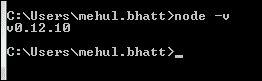

您应该能够看到版本信息，这可以确保安装成功。

安装 Node 后，您将拥有`babel-plugin-syntax-object-rest-spread`和`babel-plugin-transform-object-rest-spread`。

这两者之间有一个基本的区别：`spread`只允许您阅读语法，但`transform`将允许您将语法转换回 ES5。

完成此操作后，您将不得不将插件存储到`.babelrc`文件中，如下所示：

```jsx
{ 
  "plugins": ["syntax-object-rest-spread", "transform-object-rest-spread"] 
} 

```

### 设置应用程序

首先，我们需要为我们的项目创建一个`package.json`文件，其中包括项目信息和依赖项。现在，打开命令提示符/控制台并导航到您创建的目录。运行以下命令：

```jsx
**Npm init**
```

这个命令将初始化我们的应用程序，并在创建一个名为`package.json`的 JSON 文件之前询问几个问题。该实用程序将询问有关项目名称、描述、入口点、版本、作者名称、依赖项、许可信息等的问题。一旦执行了该命令，它将在项目的根目录中生成一个`package.json`文件。

我已经根据我的要求创建了`package.json`文件，如下所示：

```jsx
{ 
  "name": "facebook-api-integration-with-react", 
  "version": "1.2.0", 
  "description": "Web Application to check Like, Comments and
  Post of your Facebook Friends, 

```

在上述代码中，您可以看到应用程序的`name`，您的应用程序的`version`和您的应用程序的`description`。观察以下代码片段：

```jsx
  "scripts": { 
    "lint": "eslint src/ server.js config/ webpack/", 
    "start": "npm run dev", 
    "build": "webpack -p --config webpack/webpack.config.babel.js
    --progress --colors --define process.env.NODE_ENV='"production"'", 
    "clean": "rimraf dist/", 
    "deploy": "npm run clean && npm run build", 
    "dev": "./node_modules/.bin/babel-node server.js" 
  }, 

```

从上述代码中，您可以设置您的`scripts`，以详细说明如何`start`您的服务器，如何`build`，如何`clean`，以及`deploy`和`dev`。请确保您在各自变量中定义的路径是正确的，否则您的应用程序将无法按预期工作。观察以下代码片段：

```jsx
  "author": "Mehul Bhatt <mehu_multimedia@yahoo.com>", 
  "license": "MIT", 
  "keywords": [ 
    "react", 
    "babel", 
    "ES6", 
    "ES7", 
    "async", 
    "await", 
    "webpack", 
    "purecss", 
    "Facebook API" 
  ], 

```

上述代码显示了`author`名称，`license`（如果适用）以及您的应用程序的`keywords`。观察以下代码片段：

```jsx
  "devDependencies": { 
    "babel-cli": "⁶.3.17", 
    "babel-core": "⁶.3.26", 
    "babel-eslint": "⁶.0.0", 
    "babel-loader": "⁶.2.0", 
    "babel-plugin-react-transform": "².0.0-beta1", 
    "babel-plugin-transform-regenerator": "⁶.5.2", 
    "babel-polyfill": "⁶.5.0", 
    "babel-preset-es2015": "⁶.3.13", 
    "babel-preset-react": "⁶.3.13", 
    "babel-preset-stage-0": "⁶.5.0", 
    "css-loader": "⁰.23.0", 
    "enzyme": "².4.1", 
    "eslint": "².12.0", 
    "eslint-config-airbnb": "⁹.0.1", 
    "eslint-plugin-import": "¹.8.1", 
    "eslint-plugin-jsx-a11y": "¹.5.3", 
    "eslint-plugin-react": "⁵.2.0", 
    "express": "⁴.13.3", 
    "file-loader": "⁰.9.0", 
    "imports-loader": "⁰.6.5", 
    "json-loader": "⁰.5.4", 
    "lolex": "¹.4.0", 
    "react-transform-catch-errors": "¹.0.1", 
    "react-transform-hmr": "¹.0.1", 
    "redbox-react": "¹.2.0", 
    "rimraf": "².5.0", 
    "sinon": "¹.17.4", 
    "style-loader": "⁰.13.0", 
    "url-loader": "⁰.5.7", 
    "webpack": "¹.12.9", 
    "webpack-dev-middleware": "¹.4.0", 
    "webpack-hot-middleware": "².6.0", 
    "yargs": "⁴.1.0" 
  }, 
  "dependencies": { 
    "classnames": "².2.5", 
    "jss": "⁵.2.0", 
    "jss-camel-case": "².0.0", 
    "lodash.isequal": "⁴.0.0", 
    "react": "¹⁵.0.2", 
    "react-addons-shallow-compare": "¹⁵.0.2", 
    "react-dom": "¹⁵.0.2", 
    "reqwest": "².0.5", 
    "spin.js": "².3.2" 
  } 
} 

```

最后，您可以在上述代码中看到您的应用程序的`dependencies`，这将帮助您设置所需的组件并获取数据，以及前端内容。您还可以看到定义的`devDependencies`及其版本，这些与您的应用程序相关联。

设置`package.json`文件后，我们有如下所示的 HTML 标记，名为`index.html`：

```jsx
<!doctype html> 
<html lang="en">
    <head>
        <meta charset="UTF-8">
        <title>React Integration with Facebook API</title>
        <meta name="viewport" content="width=device-width, 
        initial-scale=1">
    </head>
    <body>
        <div id=" Api-root"></div>
        <script src="dist/bundle.js"></script> 
    </body>
</html>

```

在`config.js`中使用唯一 ID 配置您的应用程序：

```jsx
export default { 
    appId: '1362753213759665', 
    cookie: true, 
    xfbml: false, 
    version: 'v2.5' 
}; 

```

如前所示，您可以将配置放在一个文件中。您可以将其命名为`index.js`。该文件包括您的`appId`，在本地目录中运行应用程序时非常重要。

要获得您的 ID，您必须在 Facebook 上注册您的应用程序[`developers.facebook.com`](https://developers.facebook.com)，然后您将需要按照以下步骤进行操作：

1.  登录到您的 Facebook 开发者帐户：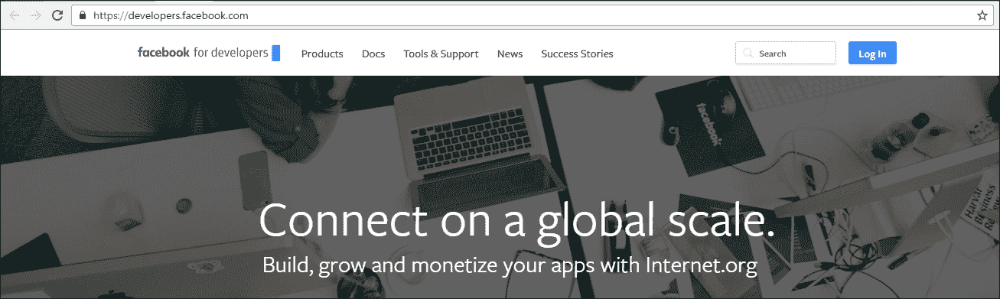

1.  登录后，您将在右侧看到一个名为**我的应用程序**的下拉菜单。点击它并打开列表菜单。在那里，您将找到**添加新应用程序**。点击它将打开一个对话框，显示**创建新应用程序 ID**，如下截图所示：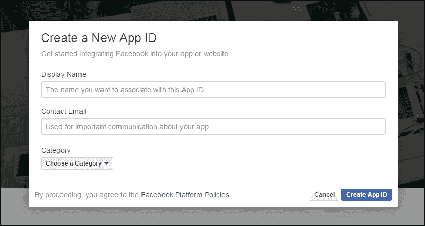

输入所需的详细信息，然后点击**创建应用程序 ID**按钮。

1.  创建应用程序 ID 后，请转到**仪表板**页面，您将看到类似以下的屏幕：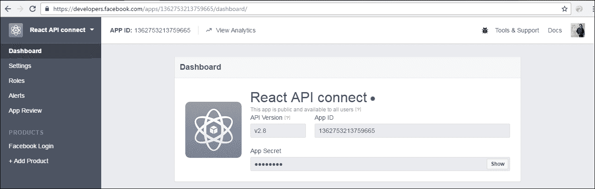

1.  在**仪表板**页面上，您左侧的导航显示**设置**链接。请点击该链接设置应用程序的**基本**和**高级**设置：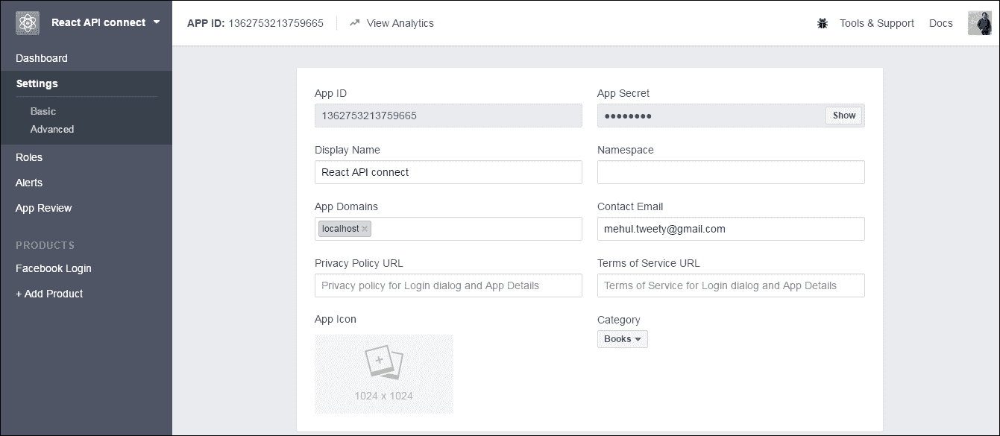

1.  一旦您能够看到前面的屏幕，您将能够看到您动态生成的**应用程序 ID**，**显示名称**类别和**应用程序密钥**自动填充。您还将看到**应用程序域**。在访问应用程序并通知我们需要在此处定义域时，此字段非常重要。但是，如果您直接将您的`localhost`写为域，它将不被接受，您的应用程序将出现错误。

为了使您的本地主机可访问，我们必须定义其平台。现在，请向下滚动一点以访问**+** **添加平台**：

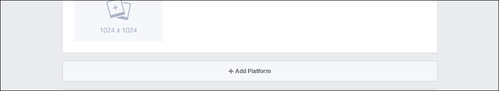

1.  一旦您点击**+添加平台**，您将在屏幕上看到以下选项，并且您必须选择**网站**在本地服务器上运行应用程序：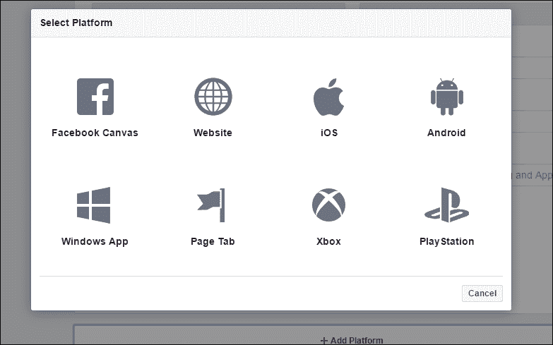

1.  在您选择**网站**作为平台后，将会在屏幕上添加一个字段，如下截图所示：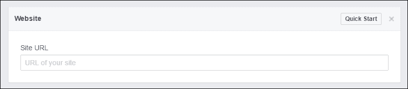

1.  一旦你得到了前面的屏幕，你需要将**站点 URL**定义为`http://localhost:3000/`，然后以类似的方式，在**应用域**字段中定义相同的域，如下面的截图所示：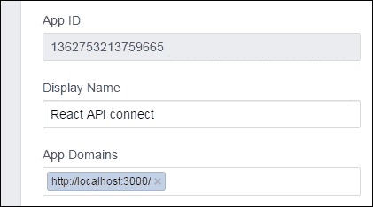

1.  在做了上述更改之后，请通过点击右下角的**保存更改**按钮来保存你的更改：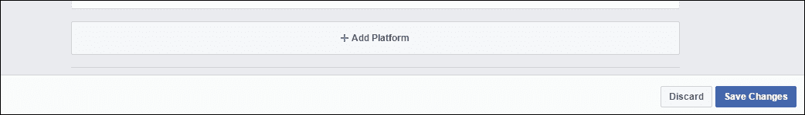

现在你的 ID 已经创建好了，你可以在你的`config.js`文件中使用它来链接你的应用在本地服务器上运行。

在设置好`config.js`文件之后，下一步是在应用程序中设置你所需的文件，并将你的动态内容注入到 HTML ID 中。

你可以在`index.js`文件中导入所需的组件、工具和 CSS，并将其放在不同的文件夹中，这样它就不会与你的配置`index.js`文件冲突：

```jsx
import React from 'react'; 
import { render } from 'react-dom'; 
import App from './components/App'; 

import 'babel-polyfill'; 

// import CSS 

import '../vendor/css/base.css'; 
import '../vendor/css/bootstrap.min.css'; 

render( 
  <App />, 
  document.querySelector('#Api-root') 
); 

```

在前面的代码中，你可以看到我导入了`React`来支持 React 文件，并导入了所需的 CSS 文件。最后一步，`render`方法在定义了你的 HTML ID 之后将为你完成这个技巧。确保`document.querySelector`有正确的选择器，否则你的应用将无法以正确的结构渲染。

你可以在前面的代码中看到，我创建了一个名为`App`的组件并导入了它。

在`App.js`文件中，我导入了几个组件，这些组件帮助我从我的 Facebook 账户中获取数据，借助 Facebook API 集成。

观察一下`App.js`文件的代码结构：

```jsx
/* global Facebook  */ 

import React, { Component } from 'react'; 
import Profile from './Profile'; 
import FriendList from './FriendList'; 
import ErrMsg from './ErrMsg'; 
import config from '../../config'; 
import Spinner from './Spinner'; 
import Login from './Login'; 
import emitter from '../utils/emitter'; 
import { getData } from '../utils/util'; 
import jss from 'jss';

```

前面导入的 JavaScript 文件已经设置好了获取数据的结构，关于它将如何在你的应用程序中执行。

```jsx
const { classes } = jss.createStyleSheet({ 
  wrapper: { 
    display: 'flex' 
  }, 
  '@media (max-width: 1050px)': { 
    wrapper: { 
      'flex-wrap': 'wrap' 
    } 
  } 
}).attach(); 

```

前面的代码定义了常量来为包装器创建样式，在页面在浏览器中渲染时将应用这些样式。

```jsx
class App extends Component { 

  state = { 
    status: 'loading' 
  }; 

  componentWillMount = () => { 
    document.body.style.backgroundColor = '#ffffff'; 
  }; 

  componentWillUnmount = () => { 
    emitter.removeListener('search'); 
  }; 

  componentDidMount = () => { 
    emitter.on('search', query => this.setState({ query })); 

    window.fbAsyncInit = () => { 
      FB.init(config); 

      // show login 
      FB.getLoginStatus( 
        response => response.status !== 'connected' && 
        this.setState({ status: response.status }) 
      ); 

      FB.Event.subscribe('auth.authResponseChange', (response) => { 
        // start spinner 
        this.setState({ status: 'loading' }); 

        (async () => { 
          try { 
            const { profile, myFriends } = await getData(); 
            this.setState({ status: response.status, profile, myFriends }); 
          } catch (e) { 
          this.setState({ status: 'err' }); 
       } 
     })(); 
   }); 
}; 

```

前面的代码扩展了组件，包括挂载/卸载的细节，这些细节我们在之前的章节中已经涵盖过了。如果你对这个领域还不确定，那么请重新查看一下。

`window.fbAsyncInit`将会将 Facebook API 与登录设置同步，并验证登录的状态。

它还将异步获取 Facebook 数据，比如你的个人资料和好友列表，这部分有单独的 JavaScript，将在本章后面进行讲解。

```jsx
    // Load the SDK asynchronously 
    (function (d, s, id) { 
      const fjs = d.getElementsByTagName(s)[0]; 
      if (d.getElementById(id)) { return; } 
      const js = d.createElement(s); js.id = id; 
      js.src = '//connect.facebook.net/en_US/sdk.js'; 
      fjs.parentNode.insertBefore(js, fjs); 
    }(document, 'script', 'facebook-jssdk')); 
  }; 

  _click = () => { 
    FB.login(() => {}, { scope: ['user_posts', 'user_friends'] }); 
  }; 

```

定义一个范围数组意味着我们正在访问用户的 Facebook 好友和帖子。

观察下面的截图：

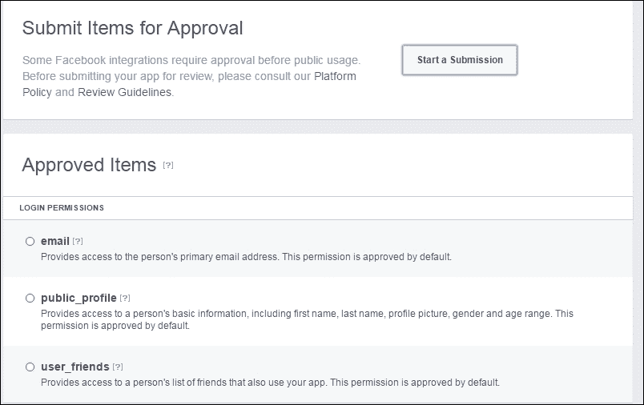

在上述截图中，您可以看到在创建 Facebook 登录应用程序时**App Review**选项卡中的默认登录权限访问。我们可以提交批准以访问任何其他用户信息：

```jsx
  mainRender = () => { 
    const { profile, myFriends, status, query } = this.state; 
    if (status === 'err') { 
      return (<ErrMsg />); 
    } else if (status === 'unknown' || status === 'not_authorized') { 
      return <Login fBLogin={this._click} />; 
    } else if (status === 'connected') { 
      return ( 
        <div className={classes.wrapper}> 
          <Profile {...profile} /> 
          <FriendList myFriends={myFriends} query={query} /> 
        </div> 
      ); 
    } 
    return (<Spinner />); 
  }; 

  render() { 
    return ( 
      <div> 
        {this.mainRender()} 
      </div> 
    ); 
  } 
}  
export default App; 

```

在上述代码中，`mainRender`方法将呈现`Profile`，`myFriends`（好友列表）和`status`，并且它将在`render return`中返回值。您可以在`render`方法中看到一个`<div>`标签；我称之为`{this.mainRender()}`来在其中注入数据。

正如您所知，这里我们正在处理第三方 API 集成。我们不确定我们将连接到该 API 多长时间以及加载内容需要多长时间。最好有一个内容加载器（旋转器），表示用户需要等待一段时间，因此我们使用以下旋转器来显示页面上内容加载的进度。旋转器的代码也包含在`App.js`文件中。以下是旋转器的样子：


您还可以选择自己的自定义旋转器。

一旦您的应用程序页面准备就绪，最终输出应该如下截图所示，您将看到基本的外观和感觉，以及所需的元素：

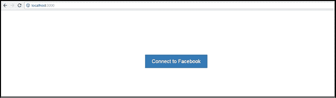

一旦您启动本地服务器，上述屏幕将要求您允许继续登录过程。

一旦您按下**同意**按钮，它将重定向您到 Facebook 登录页面。这可以通过以下代码（`Login.js`）实现：

```jsx
import React, { PropTypes } from 'react'; 
import jss from 'jss'; 
import camelCase from 'jss-camel-case'; 
jss.use(camelCase());  

```

在导入 React `PropTypes`之后，在以下代码中，您将看到我已经定义了一个常量来为登录页面创建样式。您也可以在这里定义样式，并且可以将它们放入一个 CSS 文件中，并且有一个外部文件调用。

```jsx
const { classes } = jss.createStyleSheet({ 
  title: { 
    textAlign: 'center', 
    color: '#008000' 
  }, 
  main: { 
    textAlign: 'center', 
    backgroundColor: 'white', 
    padding: '15px 5px', 
    borderRadius: '3px' 
  },     
  wrapper: { 
    display: 'flex', 
    minHeight: '60vh', 
    alignItems: 'center', 
    justifyContent: 'center' 
  }, 
  '@media (max-width: 600px)': { 
    title: { 
      fontSize: '1em' 
    }, 
    main: { 
      fontSize: '0.9em' 
    } 
  } 
}).attach(); 

```

以下代码显示了登录页面的 HTML 结构，并且还定义了`Login.propTypes`用于登录按钮：

```jsx
const Login = ({ fBLogin }) => ( 
  <div className={classes.wrapper}> 
    <div> 
      <h2 className={classes.title}>Please check your friend list 
      on Facebook</h2> 
        <div className={classes.main}> 
          <h4>Please grant Facebook to access your friend list</h4> 
          <button className="btn btn-primary" 
          onClick={fBLogin}>Agree</button> 
        </div> 
    </div> 
  </div> 
);  

Login.propTypes = { 
  fBLogin: PropTypes.func.isRequired 
}; 

export default Login; 

```

当您点击**同意**按钮时，您的应用程序将被重定向到 Facebook 登录页面。请参考以下截图：

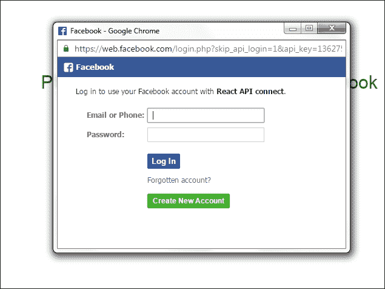

一旦您使用您的凭据登录，它将要求您允许访问您的数据，如下截图所示：

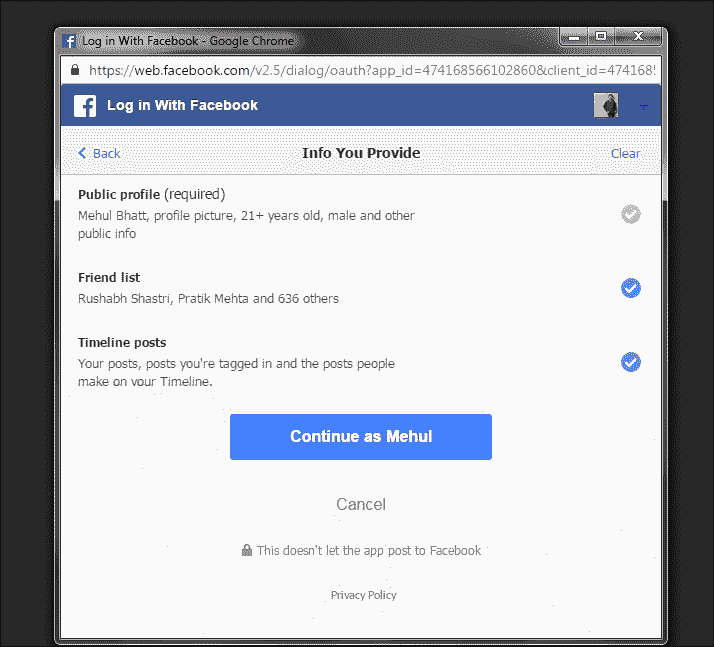

一旦您提供了所需的细节并按下**继续**按钮，它将给您最终屏幕和最终输出。


出于安全原因，我已经模糊了我的朋友的个人资料图片和他们的名字，但是您将在您的 Facebook 账户中获得相同的布局。现在您在考虑在您的应用程序中获取朋友列表，对吧？所以，借助以下代码的帮助，我在我的自定义应用程序中获取了一个列表。

`FriendList.js`被导入到`App.js`文件中：

```jsx
import React, { PropTypes } from 'react'; 
import FriendItem from './FriendItem'; 
import { MAX_OUTPUT } from '../utils/constants'; 
import jss from 'jss'; 
import camelCase from 'jss-camel-case';  

jss.use(camelCase()); 

```

在前面的代码片段中，我们还导入了`React`，`constants`和`FriendItem`来获取数据。在这里，我们只是导入了`FriendItem`，但它将有一个单独的文件来处理这个问题：

```jsx
const { classes } = jss.createStyleSheet({ 
  nodata: { 
    fontSize: '1.5em', 
    display: 'flex', 
    justifyContent: 'center', 
    alignItems: 'center', 
    textAlign: 'center', 
    color: 'white', 
    minHeight: '100vh', 
  }, 
  wrapper: { 
    flex: '3' 
  }, 
  '@media (max-width: 1050px)': { 
    wrapper: { 
      flex: '1 1 100%' 
    }, 
    nodata: { 
      minHeight: 'auto' 
    } 
  } 
}).attach(); 

```

前面的代码定义了朋友列表内容的包装器样式。正如我之前所说，您也可以将它们放在一个单独的 CSS 文件中，并进行外部调用，以便您方便。

```jsx
const emptyResult = (hasFriends, query) => { 
  return ( 
    <div className={classes.nodata}> 
      {hasFriends ? `No results for: "${query}"` : 'No friends to show'} 
    </div> 
  ); 
}; 

```

在前面的代码中，您可以看到一个条件来验证某人是否有朋友或没有朋友。如果某人在他们的 Facebook 账户中没有朋友列表，它将显示上述消息。

```jsx
const renderFriends = ({ myFriends, query }) => { 
  const result = myFriends.reduce((prev, curr, i) => { 
    if (curr.name.match(new RegExp(query, 'i'))) { 
      prev.push(<FriendItem key={i} rank={i + 1} {...curr} />); 
    } 

    return prev; 
    }, []); 
    return result.length > 0 ? result : emptyResult
    (!!myFriends.length, query); 
    }; 

    const FriendList = (props) => ( 
      <div className={classes.wrapper}> 
        {renderFriends(props)} 
      </div> 
    ); 

    FriendList.propTypes = { 
      myFriends: PropTypes.array.isRequired, 
      query: PropTypes.string 
    }; 

export default FriendList; 

```

如果您的账户有朋友，那么您将获得一个包括他们的个人资料图片、点赞、评论和帖子数量的完整朋友列表，因此您也可以通过 React 与 Facebook API 集成。

# 总结

我们已经探索了如何借助 React 集成 Facebook API，您也可以以类似的方式集成其他 API。

我们使用了常量、工具和扩展组件来实现集成并获得预期的输出。

本章中展示的关键示例将帮助您理解或澄清您对将其他 API 与 React 集成的概念。
