# 第九章：React 与 Node.js

在之前的章节中，我们已经学习了关于 React 路由、Facebook API 的集成，以及如何配置和处理应用程序的 URL。我们还学习了如何根据 URL 在 DOM 中注册我们的组件。

在本章中，我们将使用 Node.js 构建我们现有的应用程序。我不打算在这里向您展示如何连接服务器和构建服务器端方面，因为这超出了本书的范围。但是，它包含在随书附带的代码文件中。本章我们将涵盖以下内容：

+   使用 npm 安装所有模块

+   运行编译器和预处理器

+   集成添加票务表单

+   提交表单并将其保存在本地存储中

+   存储和读取本地存储数据

+   运行开发 Web 服务器，文件监视器和浏览器重新加载

+   React 调试工具

到目前为止，我们的应用程序完全基于前端，而且它并没有模块化。当然，这意味着我们的应用程序代码看起来很混乱。我们还使用了 React 的每个依赖库的解包文件，浏览器必须去获取每个 JavaScript 文件并进行编译。

我们将不再需要手动连接和压缩，而是可以设置监视我们的文件进行更改并自动进行更改，比如`webpack`和`webpack-hot-middleware`。

让我们继续对我们的项目进行更改，不断重复这个过程将会很繁琐。

# 安装 Node 和 npm

首先，我们需要下载并安装 Node.js。如果您已经安装并配置了 Node，请随意跳过本节。我们可以从[`nodejs.org`](http://nodejs.org)下载 Node.js，并按照以下说明进行操作：

1.  从[`nodejs.org/`](http://nodejs.org/)下载适用于您操作系统的安装程序。Node.js 根据您的平台提供不同的安装程序。在本章中，我们将使用 Windows 安装程序来设置 Node。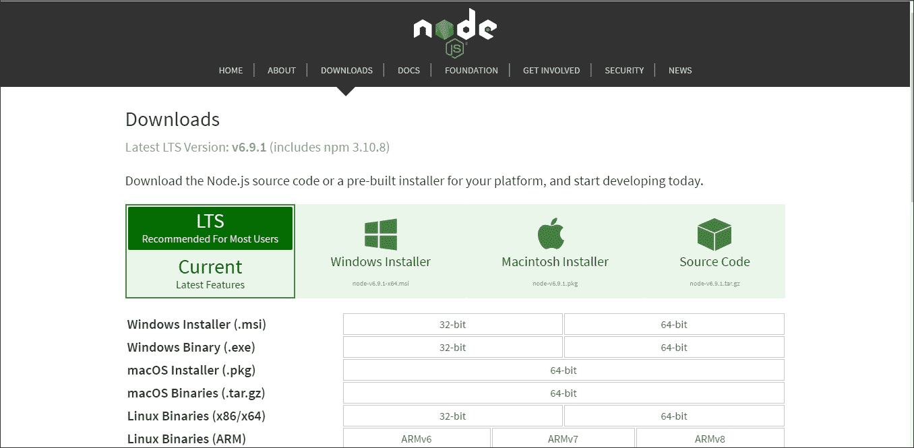

1.  我们还可以从[`nodejs.org/en/download/releases/`](https://nodejs.org/en/download/releases/)下载以前的 Node 版本。在本章中，我们正在使用 Node.js 0.12 分支，所以请确保您正在下载这个版本。

1.  运行我们下载的安装程序和 MSI 文件。

安装向导将询问您要安装的功能选择，并且您可以选择您想要的功能。通常，我们选择默认安装：

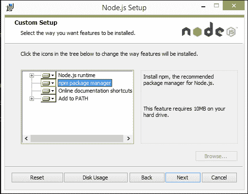

1.  如果安装要求，然后重新启动您的计算机。

系统重新启动后，我们可以检查 Node.js 是否设置正确。

打开命令提示符并运行以下命令：

```jsx
**node --version // will result something like v0.12.10**
```

您应该能够看到版本信息，这可以确保安装成功。

## React 应用程序设置

首先，我们需要为我们的项目创建一个`package.json`文件，其中包括 npm 模块的项目信息和依赖项。npm 对于 JavaScript 开发人员来说非常有用，可以创建和共享他们创建的可重用代码，以构建应用程序并在开发过程中解决特定问题。

现在，打开命令提示符/控制台并导航到您创建的目录。运行以下命令：

```jsx
**Npm init**
```

此命令将初始化我们的应用程序并询问若干问题以创建名为`package.json`的 JSON 文件。该实用程序将询问有关项目名称、描述、入口点、版本、作者名称、依赖项、许可信息等的问题。一旦命令执行，它将在项目的根目录中生成一个`package.json`文件。

```jsx
{ 
    "name": "react-node", 
    "version": "1.0.0", 
    "description": "ReactJS Project with Nodejs", 
    "scripts": { 
        "start": "node server.js", 
        "lint": "eslint src" 
    }, 
    "author": "Harmeet Singh <harmeetsingh090@gmail.com>", 
    "license": "MIT", 
    "bugs": { 
        "url": "" 
    }, 

```

在上述代码中，您可以看到应用程序的`name`，应用程序的入口点（`start`），应用程序的`version`和应用程序的`description`。

## 安装模块

现在我们需要安装一些 Node 模块，这些模块将帮助我们构建一个带有 Node 的 React 应用程序。我们将使用 Babel、React、React-DOM、Router、Express 等。

以下是通过`npm`安装模块的命令：

```jsx
**npm install <package name> --save**
```

当我们使用`<package name>`运行上述命令时，它将在您的`project folder/node_modules`中安装包并将`package name/version`保存在您的`package.json`中，这将帮助我们在任何系统中安装所有项目依赖项并更新模块。

如果您已经有了带有项目依赖项的`package.json`文件，那么您只需要运行以下命令：

```jsx
**npm install**
```

更新我们需要运行以下命令：

```jsx
**npm update**
```

以下是我们应用程序中具有依赖项的模块列表：

```jsx
"devDependencies": { 
    "babel-core": "⁶.0.20", 
    "babel-eslint": "⁴.1.3", 
    "babel-loader": "⁶.0.1", 
    "babel-preset-es2015": "⁶.0.15", 
    "babel-preset-react": "⁶.0.15", 
    "babel-preset-stage-0": "⁶.0.15", 
    "body-parser": "¹.15.2", 
    "eslint": "¹.10.3", 
    "eslint-plugin-react": "³.6.2", 
    "express": "⁴.13.4", 
    "react-hot-loader": "¹.3.0", 
    "webpack": "¹.12.2", 
    "webpack-dev-middleware": "¹.6.1", 
    "webpack-hot-middleware": "².10.0" 
    }, 
    "dependencies": { 
        "mongodb": "².2.11", 
        "mongoose": "⁴.6.8", 
        "react": "⁰.14.6", 
        "react-dom": "⁰.14.6", 
        "react-router": "¹.0.0-rc1", 
        "style-loader": "⁰.13.1", 
        "url-loader": "⁰.5.7", 
        "css-loader": "⁰.26.0",a 
        "file-loader": "⁰.9.0" 
    } 

```

在上述`dependencies`列表中可能有一些您没有听说过或对您来说是新的模块。好的，让我解释一下：

+   `mongoose`和`mongodb`：这些在应用程序或 MongoDB 中作为中间件工作。安装 MongoDB 和 mongoose 对您来说是可选的，因为我们在应用程序中没有使用它们。我只是为了您的参考而添加了它们。

+   `nodemon`：在 Node.js 应用程序中进行开发时，`nodemon`将监视目录中的文件，如果有任何文件更改，它将自动重新启动您的节点应用程序。

+   `react-hot-loader`：这是 Web 开发中最常用的模块，用于实时代码编辑和项目重新加载。`react-hot-loader`本身对其他模块有一些依赖：

+   `webpack`

+   `webpack-hot-middleware`

+   `webpack-dev-middleware`

+   `webpack-hot-middleware`：这允许您在不使用`webpack-dev-server`的情况下将热重载添加到现有服务器中。它将浏览器客户端连接到 webpack 服务器以接收更新，并订阅来自服务器的更改。然后使用 webpack 的**热模块替换**（**HMR**）API 执行这些更改。

+   `webpack-dev-middleware`：这是 webpack 的包装器，并在连接的服务器上提供从 webpack 发出的文件。在开发过程中具有以下优势：

+   文件不会写入磁盘，而是在内存中处理。

+   在开发过程中，如果在监视模式下更改了文件，则不会提供旧的包，而是在编译完成之前请求会延迟。在文件修改后，我们不需要进行页面刷新。

### 注意

`webpack-dev-middlware`仅在开发中使用。请不要在生产中使用它。

`style-loader`、`url-loader`、`css-loader`和`file-loader`有助于加载静态路径、CSS 和文件。

例如：`import '../vendor/css/bootstrap.min.css'`，其中包括字体 URL 和图像路径。

设置`package.json`文件后，我们的 HTML 标记如下所示，命名为`index.html`：

```jsx
<!doctype html> 
<html>
    <head>
        <title>React Application - EIS</title>
        <script src="//ajax.googleapis.com/ajax/libs/jquery/
        1.11.1/jquery.min.js"></script> 
    </head>
    <body>
        <div id='root'> 
        </div>
        <script src="/static/bundle.js"></script> 
    </body>
</html> 

```

现在我们需要在`server.js`中创建一个服务器来运行我们的应用程序：

```jsx
var path = require('path'); 
var webpack = require('webpack'); 
var express = require('express'); 
var config = require('./webpack.config'); 
var app = express(); 
var compiler = webpack(config); 

app.use(require('webpack-dev-middleware')(compiler, { 
    publicPath: config.output.publicPath 
})); 
app.use(require('webpack-hot-middleware')(compiler));
```

在上述代码中，我们正在配置我们应用程序中的`webpack`。它连接到服务器并接收更新通知以重新构建客户端包：

```jsx
app.get('*', function(req, res) { 
    res.sendFile(path.join(__dirname, 'index.html')); 
}); 

app.listen(3000, function(err) { 
    if (err) { 
        return console.error(err); 
    } console.log('Listening at http://localhost:3000/'); 
}) 

```

在上述代码中，我们正在发送一个 HTML 文件并启动服务器。您可以根据需要更改端口号。

现在让我们来看一下`webpack.config.js`，我们刚刚在`server.js`文件的顶部包含了它。

```jsx
module.exports = { 
    devtool: 'cheap-module-eval-source-map', 
    entry: [ 
        'webpack-hot-middleware/client', 
        './src/index' 
    ], 
    output: { 
        path: path.join(__dirname, 'dist'), 
        filename: 'bundle.js', 
        publicPath: '/static/' 
    }, 
    plugins: [ 
        new webpack.HotModuleReplacementPlugin() 
    ], 

```

在上述代码中，我们正在设置`webpack-hot-middleware`插件并添加我们脚本的入口点来编译和运行：

```jsx
module: { 
    loaders: [{ 
        test: /\.js$/, 
        loaders: ['react-hot', 'babel'], 
        include: path.join(__dirname, 'src') 
    }, 
    { 
        test: /\.css$/, 
        loader: 'style!css', 
        exclude: /node_modules/ 
        }, { 
            test: /\.(woff|woff2|ttf|svg)$/, 
            loader: 'url?limit=100000', 
            exclude: /node_modules/ 
        }, 
        { 
            test: /\.(eot|png)$/, 
            loader: 'file', 
            exclude: /node_modules/ 
        } 
        ] 
    } 
}; 

```

在这里，我们根据应用程序中匹配的文件加载模块。

我们还需要配置 Babel，包括 ECMAScript 版本和`eslint`，以添加一些规则、插件信息等。

`.babelrc`文件包括：

```jsx
{ 
    "presets": ["es2015", "stage-0", "react"] 
} 

```

`.eslintrc`文件包括：

```jsx
{ 
    "ecmaFeatures": { 
        "jsx": true, 
        "modules": true 
    }, 
    "env": { 
        "browser": true, 
        "node": true 
    }, 
    "parser": "babel-eslint", 
    "rules": { 
        "quotes": [2, "single"], 
        "strict": [2, "never"], 
        "react/jsx-uses-react": 2, 
        "react/jsx-uses-vars": 2, 
        "react/react-in-jsx-scope": 2 
    }, 
    "plugins": [ 
        "react" 
    ] 
}
```

请查看以下屏幕截图：

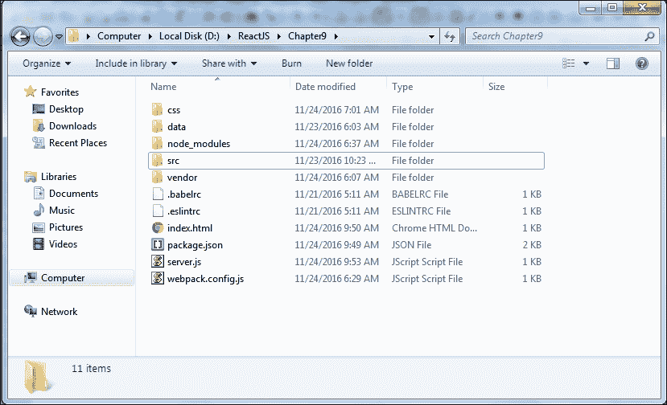

上述屏幕截图显示了我们的根目录的文件夹结构。在`src`目录中，我们有所有的脚本，在 vendor 文件夹中，我们有 Bootstrap 字体和 CSS。

# 使用 React 和 Node 创建响应式 Bootstrap 应用程序

我们将包含并模块化我们迄今为止开发的 Bootstrap 应用程序。在这个应用程序中，我们可以看到静态用户配置文件在线提出帮助台工单，并在服务器端渲染 React 组件。我们没有使用任何数据库，所以我们将我们的工单存储在浏览器的本地存储中。我们可以在查看工单中看到工单的提交。

供您参考，我已经在代码片段中包含了 Mongodb 配置和与 db 的连接设置，您可以随本书一起获取。此外，我还包含了 Add Ticket Form 的 mongoose 模式，这样您就可以使用它们。

首先，让我们打开`src`文件夹中脚本文件`index.js`的入口点，并`import` React 模块。

```jsx
import React from 'react'; 
import ReactDOM from 'react-dom'; 
import { Router, Route, Link, IndexRoute,IndexLink, browserHistory } 
from 'react-router' 

```

在版本 15.4.0 中，`React`和`ReactDOM`被分成不同的包。在 React 0.14 中，`React.render()`已被弃用，推荐使用`ReactDOM.render()`，开发人员还完全从 React 中删除了特定于 DOM 的 API。

在 React 15.4.0 中，他们最终将 ReactDOM 实现移动到了 ReactDOM 包中。React 包现在将只包含与渲染器无关的代码，如`React.Component`和`React.createElement()`。

访问此博客获取有关 React 的最新更新：

[`facebook.github.io/react/blog/`](https://facebook.github.io/react/blog/)

现在我们需要导入 Bootstrap、CSS 和 JS 文件：

```jsx
import '../css/custom.css'; 
import '../vendor/css/base.css'; 
import '../vendor/css/bootstrap.min.css'; 
import '../vendor/js/bootstrap.min.js'; 

```

现在让我们用以下命令启动服务器，看看我们的代码和配置是否能够构建：

```jsx
**nodemon start**
```

它监视应用程序文件的更改并重新启动服务器。

或者如果我们没有安装`nodemon`，那么命令应该是：

```jsx
**node server.js**
```


服务器在 webpack 中启动，将您的代码捆绑到服务器客户端浏览器。如果一切顺利，当构建完成时，您可以获得以下信息：

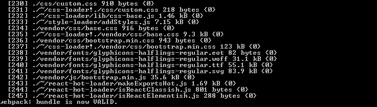

目前我们的页面是空白的。因为我们还没有在页面中包含任何组件，所以没有任何内容可显示。

让我们在组件文件夹中创建一个名为`navbar.js`的 Bootstrap 导航组件。

```jsx
module.exports.PageLayout = React.createClass({ 
}) 

```

`module.exports`是 Node.js 中的一个特殊对象，并且在每个 JS 文件中都包含它。它将您在`module.exports`中编写的函数、变量和任何内容公开为一个模块，使您的代码可重用且易于共享。

让我们在其中添加我们的 Bootstrap 导航组件，使用“容器”布局来呈现页面内容：

```jsx
render: function() { 
    return ( 
        <main> 
        <div className="navbar navbar-default navbar-static-top"
        role="navigation"> 
            <div className="container"> 
                <div className="navbar-header"> 
                    <button type="button" className="navbar-toggle"
                    data-toggle="collapse" data-target=".navbar-collapse"> 
                    <span className="sr-only">Toggle navigation</span> 
                    <span className="icon-bar"></span> 
                    <span className="icon-bar"></span> 
                    <span className="icon-bar"></span> 
                    </button> 
                    <Link className="navbar-brand" to="/">EIS</Link> 
                </div> 
            <div className="navbar-collapse collapse"> 
            <ul className="nav navbar-nav"> 
            <li><IndexLink activeClassName="active" to="/">
            Home</IndexLink></li> 
            <li><Link to="/edit" activeClassName="active">
            Edit Profile</Link></li> 
            <li className="dropdown"> 
                <Link to="#" className="dropdown-toggle"
                data-toggle="dropdown">Help Desk <b className="caret">
                </b></Link> 
            <ul className="dropdown-menu"> 
            <li><Link to="/alltickets">View Tickets</Link></li> 
            <li><Link to="/newticket">New Ticket</Link></li> 
            </ul> 
            </li> 
            </ul> 
        </div> 
    </div> 
</div> 

```

我们的页面导航“容器”到此结束。

在这里，我们开始了页面的主要“容器”，我们可以使用`props`来渲染页面内容：

```jsx
<div className="container"> 
    <h1>Welcome to EIS</h1> 
    <hr/> 
    <div className="row"> 
    <div className="col-md-12 col-lg-12"> 
    **{this.props.children}** 
    </div> 
    </div> 
    </div> 
</main> 
); 
}  

```

让我们继续添加主页内容并准备我们的第一个布局：

```jsx
const RightSection = React.createClass({ 
    render: function() { 
        return (<div className="col-sm-9 profile-desc" id="main">  
        <div className="results">  
        <PageTitle/> 
        <HomePageContent/> 
        </div> 
        </div>) 
    } 
}) 
// include Left section content in ColumnLeft component with the wrapper of bootstrap responsive classes classes    

const ColumnLeft = React.createClass({ 
    render: function() { 
        return ( 
        ) 
    } 
}) 
const LeftSection = React.createClass({ 
    render: function() { 
        return (  
        //Left section content          
        ) 
    } 
}) 
const TwoColumnLayout = React.createClass({ 
    render: function() { 
        return ( 
            <div> 
            <ColumnLeft/> 
            <RightSection/> 
            </div> 
        ) 
    } 
})  

```

在这里，我们在这个组件中包含了页面标题和主页内容：

```jsx
const PageTitle = React.createClass({ 
    render: function() { 
        return ( 
            <h2>//page content</h2> 
        ); 
    } 
}); 
const HomePageContent = React.createClass({ 
    render: function() { 
        return ( 
            <p>//page content</p> 
        ); 
    } 
}); 

```

现在我们需要配置路由以在 UI 中呈现组件：

```jsx
ReactDOM.render(( 
    <Router history={browserHistory}> 
    <Route path="/" component={PageLayout}> 
    <IndexRoute component={TwoColumnLayout}/> 
    </Route> 
    </Router> 
), document.getElementById('root')); 

```

我们需要重复与其他组件和页面相同的流程：

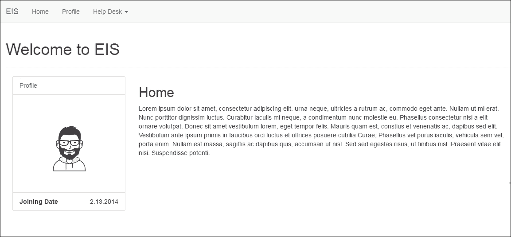

我们的页面看起来很棒；我们已成功将我们的第一个页面与 Node.js 集成。

让我们转到我们的主要组件，并在帮助台部分添加一个工单。

创建一个名为`addTicketForm.js`的文件，并包含以下代码：

```jsx
import React from 'react'; 
import ReactDOM from 'react-dom'; 

```

在每个包含 React 代码的文件中包含 React 模块是很重要的：

```jsx
var max_Char='140'; 
var style = {color: "#ffaaaa"}; 

module.exports.AddTicket = React.createClass({ 
    getInitialState: function() { 
        return {value: '', char_Left: max_Char}; 
    }, 
    handleChange: function(event) { 
        var input = event.target.value; 
        this.setState({value: input.substr(0, max_Char),char_Left:
        max_Char - input.length}); 
        if (input.length == max_Char){ 
            alert("You have reached the max limit") 
        } 
    }, 

```

### 提示

在上述代码中，我们使用与我们在第五章中创建的相同代码来控制`textarea`组件，*使用 React 的 jQuery Bootstrap 组件*。

```jsx
handleSubmitEvent: function (event) { 
    event.preventDefault(); 

var values   = { 
    date: new Date(), 
    email: this.refs.email.value.trim(), 
    issueType: this.refs.issueType.value, 
    department: this.refs.department.value, 
    comment: this.state.value 
}; 
this.props.addTicketList(values); 
localStorage.setItem('Ticket', JSON.stringify(values)); 
}, 

```

之前我们只是在提交表单后在`AddTicket`UI 中显示。现在我们使用本地存储来保存工单。

```jsx
render: function() { 
    return ( 
        <form onSubmit={this.handleSubmitEvent}> 

```

在这里，您需要放入我们之前添加的其他表单元素：

```jsx
<div className="form-group"> 
    <label htmlFor="comments">Comments <span style={style}>*</span>
    </label>(<span>{this.state.char_Left}</span> characters left) 
        <textarea className="form-control" value={this.state.value} 
        maxLength={max_Char} ref="comments" onChange={this.handleChange} /> 
   </div> 
   <div className="btn-group"> 
       <button type="submit" className="btn btn-primary">Submit</button> 
       <button type="reset" className="btn btn-link">cancel</button> 
   </div> 
   </form> 
   ); 
} 
}); 

```

接下来，我们需要创建`addTicketList.js`，在这里我们将这个 JSX 表单包装成组件：

```jsx
<AddTicket addTicketList={this.addTicketList} /> 

```

还需要创建`listView.js`来显示用户提交后的列表：

```jsx
import { AddTicket } from "./addTicketForm.js";
import { List } from "./listView.js";
```

在这里，我们导入了之前创建的`AddTicket`模块，并创建了另一个模块`addTicketForm`来管理更新的表单状态：

```jsx
module.exports.AddTicketsForm = React.createClass({ 
    getInitialState: function () { 
        return { 
            list: {} 
        }; 
    }, 
    updateList: function (newList) { 
        this.setState({ 
            list: newList 
        }); 
    }, 
    addTicketList: function (item) { 
    var list = this.state.list; 
    list[item] = item; 
    this.updateList(list); 
    }, 
    render: function () { 
        var items = this.state.list; 
    return ( 
        <div className="container"> 
        <div className="row"> 
        <div className="col-sm-6"> 
            <List items={items} /> 
            <AddTicket addTicketList={this.addTicketList} /> 
        </div> 
        </div> 
        </div> 
    ); 

```

在`render`方法中，我们将表单和`list`项传递给组件：

```jsx
    } 
}); 
listView.js 
import { ListPanel } from "./ListUI.js"; 

```

在`ListPanel`中，我们有实际的 JSX 代码，用于在用户提交并创建我们在`addTicketList.js`中包含的模块后将票据呈现到 UI 中：

```jsx
module.exports.List = React.createClass({ 
    getListOfIds: function (items) { 
    return Object.keys(items); 
    }, 
    createListElements: function (items) { 
        var item; 
        return ( 
            this 
                .getListOfIds(items) 
                .map(function createListItemElement(itemId,id) { 
                    item = items[itemId]; 
                    return (<ListPanel key={id} item={item} />); 
                    }.bind(this)) 
               .reverse() 
        ); 
    }, 
    render: function () { 
        var items = this.props.items; 
        var listItemElements = this.createListElements(items); 
        return ( 
            <div className={listItemElements.length > 0 ? "":""}> 
            {listItemElements.length > 0 ? listItemElements : ""} 

```

在这里，我们将`listItemElements`呈现到 DOM 中：

```jsx
        </div> 
    ); 
    } 
}); 

```

现在让我们创建`ListUI.js`，最后一个模块，它将完成表单组件的功能：

```jsx
module.exports.ListPanel =  
React.createClass({ 
    render: function () { 
        var item = this.props.item; 
    return ( 
        <div className="panel panel-default"> 
        <div className="panel-body"> 
        Emailid: {item.email}<br/> 
        IssueType: {item.issueType}<br/> 
        IssueType: {item.department}<br/> 
        Message: {item.comment} 
        </div> 
        <div className="panel-footer"> 
       {item.date.toString()} 
       </div> 
       </div> 
    ); 
    } 
}); 

```

让我们看看浏览器中的输出是什么样子的。

确保你已经在你的路由器中包含了以下代码：

```jsx
<Route path="/newticket" component={AddTicketsForm} />
```

观察以下截图：

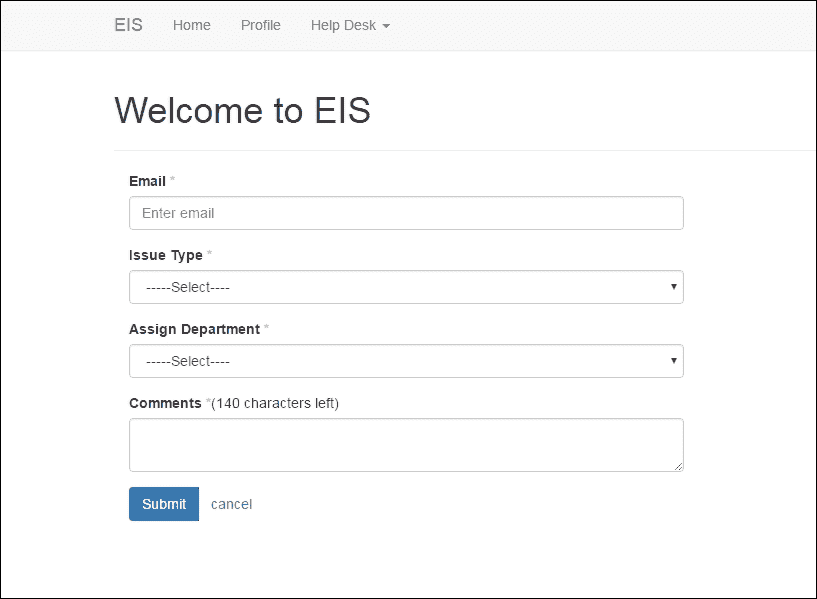

看起来不错。现在让我们填写这个表单，提交它，然后查看输出：

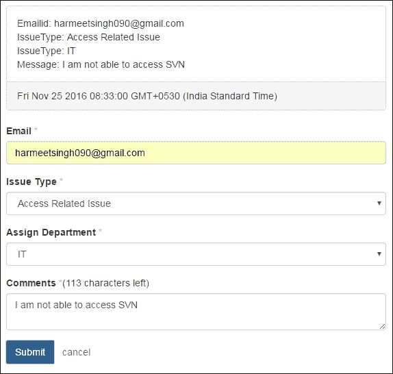

太棒了；我们的表单按预期工作。

你还可以在浏览器的本地存储中看到以 JSON 表示格式的提交**Ticket**的**Key**和**Value**：

**开发者工具** > **应用程序** > **存储** > **本地存储**

观察以下截图：

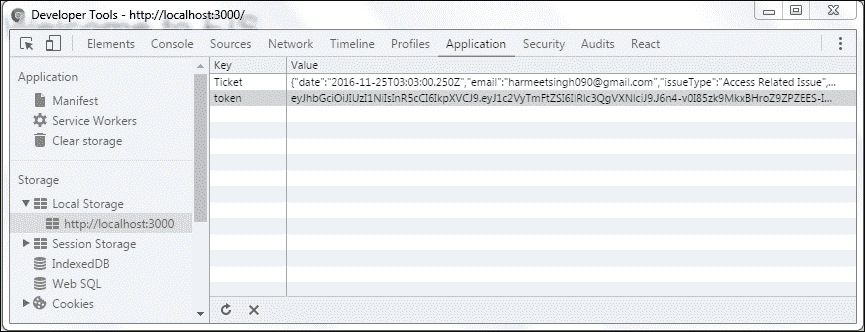

现在我们需要从本地存储中获取这个 JSON **Ticket**并在**查看票据**部分向用户显示。

让我们创建另一个模块来获取票据并将其呈现到 Bootstrap 响应式表格中。文件

`allTickets.js`将如下所示：

```jsx
module.exports.allTickets = React.createClass({ 
    getInitialState: function() { 
        return { 
            value :JSON.parse(localStorage.getItem( 'Ticket' )) || 1}; 
        }, 

```

在组件的初始状态中，我们使用`localStorage.getItem`来获取`tickets`并将它们解析为 JSON 来设置状态：

```jsx
getListOfIds: function (tickets) { 
    return Object.keys(tickets); 
    }, 
    createListElements: function (tickets) { 
    var ticket; 
    return ( 
        this 
        .getListOfIds(tickets) 
        .map(function createListItemElement(ticket,id) { 
        ticket = tickets[ticket]; 
        return (<ticketTable key={id} ticket={ticket}/>) 
        }.bind(this)) 
    ); 
}, 

```

使用我们在添加票据时使用的相同方法，我们通过`props`将`ticket key`和值映射到 React 组件中：

```jsx
render: function() { 
    var ticket = this.state.value;
```

在`render`方法中，我们将`state`的值赋给了我们传递到`createListElements`函数中的`ticket`变量：

```jsx
var listItemElements = this.createListElements(ticket); 
return ( 
    <div> 
        <div className={listItemElements.length > 0 ? "":"bg-info"}> 
            {listItemElements.length > 0 ? "" : "You have not raised any ticket yet."} 

```

我们正在使用 JavaScript 三元运算符来检查是否有任何`ticket`，如果没有，则在 UI 中显示消息。

```jsx
</div> 
    <table className="table table-striped table-responsive"> 
        <thead> 
            <tr> 
                <th>Date</th> 
                <th>Email ID</th> 
                <th>Issue Type</th> 
                <th>Department</th> 
                <th>Message</th> 
            </tr> 
        </thead> 
        <tbody> 
        <tr> 
            {listItemElements.length > 0 ? listItemElements : ""} 
        </tr> 
        </tbody> 
    </table> 
</div> 
// In the preceding code, we are creating the table header and appending the ticket list items.
   ); 
   } 
}); 

```

现在我们需要创建包含`<td>`并继承`ticket`数据的组件。`ticketTable.js`将如下所示：

```jsx
module.exports.ticketTable = React.createClass({ 
    render: function () { 
        var ticket = this.props.ticket; 
        return ( 
            <td>{ticket}</td> 
        ); 
    } 
}); 

```

我们还需要在`allTickets.js`文件中导入此模块：

```jsx
const table = require("./ticketTable.js"); 

```

你可能会注意到我使用了`const`对象，而不是使用`import`。你也可以使用`var`。`const`指的是常量；它们是块作用域的，就像变量一样。常量的值不能改变和重新赋值，也不能重新声明。

例如：

```jsx
const MY_CONST = 10; 
// This will throw an error because we have reassigned again. 
MY_CONST = 20; 

// will print 10 
console.log("my favorite number is: " + MY_CONST); 

// const also works on objects 
const MY_OBJECT = {"key": "value"};  

```

这是我们最终的路由器配置：

```jsx
ReactDOM.render(( 
    <Router history={browserHistory}> 
    <Route path="/" component={PageLayout}> 
    <IndexRoute component={TwoColumnLayout}/> 
    <Route path="/profile" component={Profile} /> 
    <Route path="/alltickets" component={allTickets} /> 
    <Route path="/newticket" component={AddTicketsForm} /> 
    </Route> 
    <Route path="*" component={NoMatch}/> 
    </Router> 
), document.getElementById('root')); 

```

## Bootstrap 表格

让我们看看以下要点：

+   **斑马纹行**：在`<table class="table table-striped">`中使用`.table-striped`来为表格行添加斑马纹

+   **带边框的表格**：添加`.table-bordered`以在整个表格和单元格中添加边框

+   **悬停行**：添加`.table-hover`以在表格行上启用悬停状态

+   **紧凑表格**：添加`.table-condensed`以减少单元格填充

+   **上下文类**：使用上下文类（`.active`、`.success`、`.info`、`.warning`、`.danger`）为表格行或单元格添加背景颜色

在表格上应用这些类，看看它们如何影响表格的外观和感觉。

### Bootstrap 响应式表格

在创建响应式表格时，我们需要将任何`.table`包装在`.table-responsive`中，以便在小设备上（小于 768 像素）水平滚动。当我们在大于 768 像素宽的任何设备上查看它们时，你将不会看到这些表格有任何区别。

让我们再次提交票证并快速查看表格。

转到导航中的帮助台下拉菜单，点击查看票证。

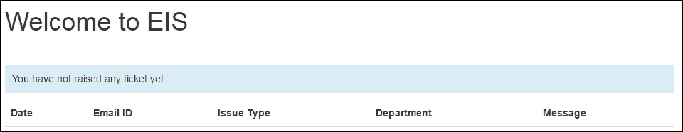

如果你还没有提出任何票证，你将在 UI 中收到适当的消息（**你还没有提出任何票证。**）。

好的，让我们提交新的票证并再次打开这个页面。一旦票证被添加，它将显示在你的表格中：

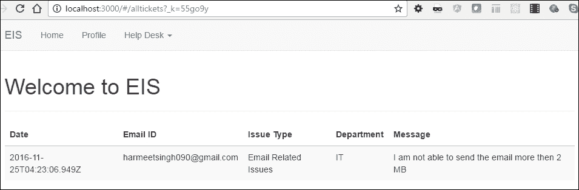

我们现在可以在表格中看到我们提交的票证。

# React 开发者工具

React 为开发者提供了调试 React 代码的工具。它允许我们检查一个由 React 渲染的组件，包括组件层次结构、props 和状态。

## 安装

有两个官方扩展可用于 Chrome 和 Firefox 浏览器。

为 Chrome 下载扩展：

[`chrome.google.com/webstore/detail/react-developer-tools/fmkadmapgofadopljbjfkapdkoienihi?hl=en`](https://chrome.google.com/webstore/detail/react-developer-tools/fmkadmapgofadopljbjfkapdkoienihi?hl=en)

和 Firefox：

[`addons.mozilla.org/en-US/firefox/addon/react-devtools/`](https://addons.mozilla.org/en-US/firefox/addon/react-devtools/)

### 注意

一个独立的应用程序仍在开发中，很快将可用。

## 如何使用

一旦你在浏览器中下载或安装了扩展，打开 React 页面上的**开发者工具**。你应该会看到一个名为**React**的额外选项卡：

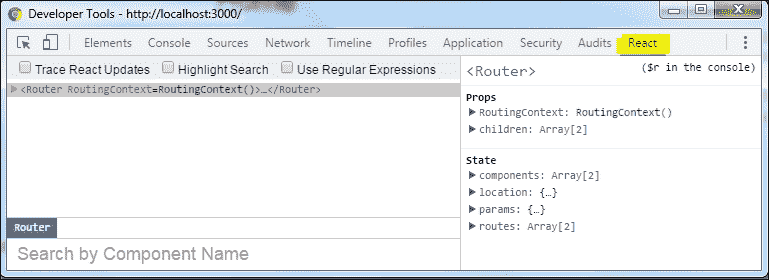

在侧面板中，您可以看到每个 React 组件的**State**和**Props**。如果展开组件的**State**，您将看到组件的完整层次结构，其中包括您在 React 应用程序中使用的组件的名称。

请参阅以下屏幕截图：

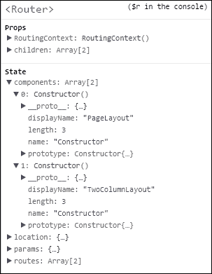

右键单击侧面板，我们可以检查和编辑右侧面板中当前 props 和 state。

我们还可以通过单击**执行函数**来查看代码执行函数：

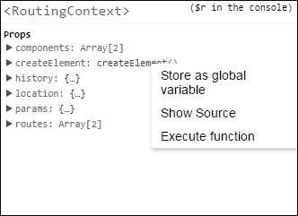

如果您使用 React 工具检查`allTicket`组件，您可以看到`props`流入子元素的数据流：

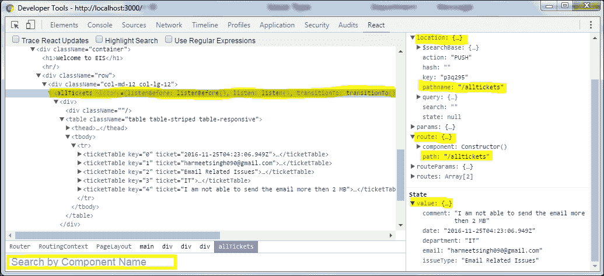

如果您在**元素**选项卡上检查页面中的 React 元素，然后切换到**React**选项卡，该元素将自动在 React 树中被选中。使用搜索选项卡，我们也可以按名称搜索组件。

如果您还需要跟踪组件的更新，您需要选择顶部复选框**跟踪 React 更新**。

# 总结

在本章中，您学习了如何将我们的 React 独立应用程序转换为 Node.js npm 包，并将 React 组件模块化。我们首先安装了 Node.js 并设置了 React 环境。然后，我们看了如何使用`module.export`导入和导出模块。

我们还学习了如何在一个文件中创建和导入多个模块，例如`react-router`，`{ Router, Route, IndexRoute,IndexLink, Link, browserHistory } = ReactRouter`。

我们还看了如何从本地存储中存储和读取数据。使用 Bootstrap 表格，我们将数据显示在表格网格中。我们还学习了 Bootstrap 表格，样式类可以使您的表格响应，并且看起来更好。
