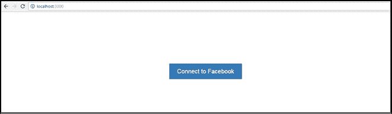

# 第十章：最佳实践

在深入探讨处理 React 时应遵循的最佳实践之前，让我们回顾一下我们在之前章节中所看到的内容。

我们已经涵盖了以下关键点：

+   什么是 ReactJS

+   我们如何使用 React-Bootstrap 和 ReactJS 构建响应式主题

+   与 React 的 DOM 交互

+   ReactJS-JSX

+   React-Bootstrap 组件集成

+   Redux 架构

+   使用 React 进行路由

+   React API 与其他 API 集成

+   与 Node.js 一起使用 React

通过前面的主题，你应该对 ReactJS、响应式主题、自定义组件、JSX、Redux、Flux 以及与其他 API 的集成有了更清晰的理解。希望你喜欢这个旅程。现在我们知道从哪里开始以及如何编写代码，但了解如何遵循最佳实践编写标准代码也很重要。

2015 年，全球范围内有许多关于 React 的新发布和会议，现在我看到很多人在问我们如何在 React 中编写标准代码？

每个人对遵循最佳实践都有自己的看法。到目前为止，我已经与你分享了一些观察和经验，但你可能有不同的看法。

如果你想了解更详细的内容，你可以随时访问 React 的官方网站和教程。

# 在 React 中处理数据

每当我们有具有动态功能的组件时，数据就会出现。同样适用于 React；我们必须处理动态数据，这似乎很容易，但并非总是如此。

听起来有点混乱！

为什么它既容易又困难？因为在 React 组件中，传递属性很容易，构建渲染树的方式有很多，但关于更新视图的清晰度并不多。

2015 年，我们看到了许多 Flux 库，随之而来的是许多功能性和反应性解决方案的发布。

## 使用 Flux

根据我的经验，许多人对 Flux 存在误解，认为它是不必要的。他们使用它是因为他们对它有很好的掌握。

在我们的例子中，我们已经看到 Flux 有一种清晰的方式来存储和更新应用程序的状态，当需要时，它会触发渲染。

我们经常听到这句话：“*每个硬币都有两面*”。同样，Flux 也有利有弊。例如，为应用程序声明全局状态是有益的。假设你必须管理已登录的用户，并且正在定义路由器的状态和活动帐户的状态；当你开始使用 Flux 来管理临时或本地数据时，这将是痛苦的。

从我的角度来看，我不建议仅仅为了管理`/items/:itemIdroute`相关数据而使用 Flux。相反，你可以在你的组件中声明它并将其存储在那里。这有什么好处？答案是，它将依赖于你的组件，所以当你的组件不存在时，它也将不存在。

例如：

```jsx
export default function users(state = initialState, action) { 
    switch (action.type) { 
        case types.ADD_USER: 
            constnewId = state.users[state.users.length-1] + 1; 
            return { 
                ...state, 
                users: state.users.concat(newId), 
                usersById: { 
                    ...state.usersById, 
                    [newId]: { 
                        id: newId, 
                        name: action.name 
                    } 
                }, 
            } 

            case types.DELETE_USER: 
            return { 
                ...state, 
                users: state.users.filter(id => id !== action.id), 
                usersById: omit(state.usersById, action.id) 
            }     

            default: 
            return state; 
    } 
} 

```

在前面基于 Redux 的 reducer 代码中，我们正在管理 reducers 的一部分作为应用程序的`state`。它存储先前的`state`和`action`，并返回下一个状态。

## 使用 Redux

我们知道，在单页应用程序中，当我们必须处理状态和时间时，难以掌握随时间变化的状态。在这里，Redux 非常有帮助。为什么？因为在 JavaScript 应用程序中，Redux 处理两种状态：一种是数据状态，另一种是 UI 状态，这是单页应用程序的标准选项。此外，请记住，Redux 可以与 AngularJS、jQuery 或 React JavaScript 库或框架一起使用。

## Redux 等于 Flux，真的吗？

Redux 是一个工具，而 Flux 只是一个模式，你不能通过即插即用或下载来使用它。我不否认 Redux 从 Flux 模式中获得了一些影响，但我们不能说它与 Flux 完全相似。

让我们继续看一些区别。

Redux 遵循三个指导原则，如下所示。我们还将介绍一些 Redux 和 Flux 之间的区别。

### 单存储方法

我们已经在之前的图表中看到，存储假装是应用程序中所有种类状态修改的*中间人*，而 Redux 通过存储控制两个组件之间的直接通信，具有单一通信点。

Redux 和 Flux 之间的区别在于：Flux 有多个存储方法，而 Redux 有单一存储方法。

### 只读状态

在 React 应用中，组件不能直接改变状态，而必须通过`actions`将更改分派到存储中。

在这里，`store`是一个对象，它有四种方法，如下所示：

+   `store.dispatch(action)`

+   `store.subscribe(listener)`

+   `store.getState()`

+   `replaceReducer(nextReducer)`

Reducer 函数用于改变状态

Reducer 函数将处理`dispatch`动作以改变`state`，因为 Redux 工具不允许两个组件直接通信；因此它也不会改变`state`，而是会描述`state`的改变。

这里的 Reducer 可以被视为纯函数，编写 Reducer 函数的一些特点如下：

+   没有外部数据库或网络调用

+   根据其参数返回值

+   参数是*不可变的*

+   相同的参数返回相同的值

Reducer 函数被称为纯函数，因为它们除了根据其设置的参数返回值之外什么都不做；它们没有任何其他后果。

在 Flux 或 Redux 架构中，总是很难处理 API 返回的嵌套资源，因此建议在组件中使用`normalize`等平面状态。

专业提示：

```jsx
const data = normalize(response,arrayOf(schema.user)) 
state= _.merge(state,data.entities) 

```

## 不可变的 React 状态

在平面状态下，我们可以处理嵌套资源和`不可变`对象的好处，以及声明状态不可修改的好处。

`不可变`对象的另一个好处是，通过它们的引用级别相等检查，我们可以大大改善渲染性能。例如，使用`不可变`对象有`shouldComponentUpdate`：

```jsx
shouldComponentUpdate(nexProps){ 
    // instead of object deep comparsion 
    returnthis.props.immutableFoo!==nexProps.immutableFoo 
} 

```

在 JavaScript 中，使用**不可变深冻结**节点将帮助您在变异之前冻结节点，然后验证结果。以下代码示例显示了相同的逻辑：

```jsx
return{ 
    ...state, 
    foo 
} 

return arr1.concat(arr2) 

```

我希望前面的例子已经阐明了 Immutable.js 及其好处。它也有简单的方法，但并没有被广泛使用：

```jsx
import{fromJS} from 'immutable' 

const state =fromJS({ bar:'biz'}) 
constnewState=foo.set('bar','baz')  

```

在我看来，这是一个非常快速和美丽的功能。

## 可观察和响应式解决方案

我经常听到人们询问 Flux 和 Redux 的替代方案，因为他们想要更多的响应式解决方案。您可以在以下列表中找到一些替代方案：

+   **Cycle.js**：这是一个功能性和响应式的 JavaScript 框架，用于编写更干净的代码。

+   **.rx-flux**：这是带有附加功能 RxJS 的 flux 架构。

+   **redux-rx**：这是用于 Redux 的 RxJS 实用程序。

+   **Mobservable**：这带有三种不同的风味--可观察数据，响应式函数和简单代码。

# React 路由

我们必须在客户端应用程序中使用路由。对于 ReactJS，我们还需要另一个路由库，因此我建议您使用由 React 社区提供的`react-router`。

React 路由的优势包括：

+   在标准化结构中查看声明有助于我们立即识别我们的应用程序视图

+   延迟加载代码

+   使用`react-router`，我们可以轻松处理嵌套视图及其渐进式视图分辨率

+   使用浏览历史功能，用户可以向后/向前导航并恢复视图的状态

+   动态路由匹配

+   导航时的 CSS 过渡

+   标准化的应用程序结构和行为，在团队合作时非常有用

### 注意

React 路由器不提供处理数据获取的任何方法。我们需要使用`async-props`或其他 React 数据获取机制。

## React 如何帮助将您的代码拆分成延迟加载

很少有处理**webpack 模块打包程序**的开发人员知道如何将应用程序代码拆分为多个 JavaScript 文件：

```jsx
require.ensure([],()=>{ 
    const Profile = require('./Profile.js') 
    this.setState({ 
        currentComponent: Profile 
    }) 
}) 

```

为什么需要拆分代码是因为每个代码块并不总是对每个用户有用，并且不需要在每个页面上加载它；这会使浏览器过载。因此，为了避免这种情况，我们应该将应用程序拆分为多个代码块。

现在，您可能会有以下问题：如果我们有更多的代码块，那么我们是否需要更多的 HTTP 请求，这也会影响性能？借助 HTTP/2 多路复用（[`http2.github.io/faq/#why-is-http2-multiplexed`](https://http2.github.io/faq/#why-is-http2-multiplexed)），您的问题将得到解决。观察以下图表：


访问[`stackoverflow.com/questions/10480122/difference-between-http-pipeling-and-http-multiplexing-with-spdy`](http://stackoverflow.com/questions/10480122/difference-between-http-pipeling-and-http-multiplexing-with-spdy) 获取更多信息。

您还可以将您的代码块与代码块哈希组合，这也将在您更改代码时优化您的浏览器缓存比率。

## JSX 组件

JSX 就是简单地说，只是 JavaScript 语法的扩展。如果您观察 JSX 的语法或结构，您会发现它与 XML 编码类似。

JSX 执行预处理步骤，将 XML 语法添加到 JavaScript 中。您当然可以在没有 JSX 的情况下使用 React，但 JSX 使 React 更加整洁和优雅。与 XML 类似，JSX 标签具有标签名称、属性和子元素。JSX 也类似于 XML，如果属性值被引号括起来，那个值就成为字符串。

XML 使用平衡的开放和关闭标记；JSX 类似地工作，并且有助于创建更易于阅读的大型树，而不是*函数调用*或*对象文字*。

在 React 中使用 JSX 的优势包括：

+   JSX 比 JavaScript 函数更容易理解

+   JSX 中的标记对设计师和团队的其他成员更加熟悉

+   您的标记变得更有语义，结构化和有意义

## 有多容易可视化？

正如我所说，结构和语法在 JSX 中非常容易可视化和注意到。与 JavaScript 相比，它们旨在在 JSX 格式中更清晰和可读。

以下简单的代码片段将给您一个更清晰的想法。让我们看一个简单的 JavaScript `render` 语法：

```jsx
render: function () { 
    returnReact.DOM.div({className:"divider"}, 
        "Label Text", 
        React.DOM.hr() 
    ); 
}  

```

让我们看一下以下 JSX 语法：

```jsx
render: function () { 
    return<div className="divider"> 
        Label Text<hr /> 
    </div>; 
} 

```

希望您非常清楚，对于已经熟悉 HTML 的非程序员来说，使用 JSX 比使用 JavaScript 要容易得多。

## 熟人或理解

在开发领域，有许多团队，如非开发人员，UI 开发人员和 UX 设计师熟悉 HTML，以及质量保证团队负责彻底测试产品。

JSX 是一种清晰而简洁地理解这种结构的好方法。

## 语义/结构化语法

到目前为止，我们已经看到 JSX 语法易于理解和可视化。背后有一个具有语义语法结构的重要原因。

JSX 很容易将您的 JavaScript 代码转换为更有语义，有意义和结构化的标记。这使您能够使用类似 HTML 的语法声明组件结构和信息，知道它将转换为简单的 JavaScript 函数。

React 概述了您在`React.DOM`命名空间中期望的所有 HTML 元素。好处是它还允许您在标记中使用自己编写的自定义组件。

请查看以下 HTML 简单标记，并查看 JSX 组件如何帮助您拥有语义标记：

```jsx
<div className="divider"> 
    <h2>Questions</h2><hr /> 
</div>

```

将此包装在`divider` React 复合组件中后，您可以轻松地像使用任何其他 HTML 元素一样使用它，并且具有更好语义标记的附加好处：

```jsx
<Divider> Questions </Divider> 

```

## 使用类

观察以下代码片段：

```jsx
classHelloMessage extends React.Component{
    render(){ 
        return<div>Hello {this.props.name}</div> 
    } 
}
```

您可能已经注意到，在前面的代码中，`React.Component`被用来代替`creatClass`。如果您使用其中任何一个都没有问题，但许多开发人员对此并不清楚，他们错误地同时使用两者。

## 使用 PropType

了解属性是必须的；它将使您能够更灵活地扩展组件并节省时间。请参考以下代码片段：

```jsx
MyComponent.propTypes={ 
    isLoading:PropTypes.bool.isRequired, 
    items:ImmutablePropTypes.listOf( 
        ImmutablePropTypes.contains({ 
            name:PropTypes.string.isRequired, 
        }) 
    ).isRequired 
} 

```

您还可以验证您的属性，就像我们可以使用 React `ImmutablePropTypes`验证 Immutable.js 的属性一样。

## 高阶组件的好处

观察以下代码片段：

```jsx
PassData({ foo:'bar'})(MyComponent) 

```

高阶组件只是原始组件的扩展版本。

使用它们的主要好处是我们可以在多种情况下使用它们，例如在身份验证或登录验证中：

```jsx
requireAuth({ role: 'admin' })(MyComponent)  

```

另一个好处是，通过高阶组件，您可以单独获取数据并设置逻辑，以简单的方式呈现视图。

## Redux 架构的好处

与其他框架相比，Redux 架构有更多的优点：

+   它可能没有其他副作用

+   正如我们所知，不需要绑定，因为组件不能直接交互

+   状态是全局管理的，因此出现管理不善的可能性较小

+   有时，对于中间件，管理其他副作用可能会很困难

从上述观点来看，Redux 架构非常强大，并且具有可重用性。

# 为您的应用程序定制 Bootstrap

在审查 React 的最佳实践时，我们怎么能忘记我们应用程序的外观和感觉呢？当我们谈论响应性和精美的组件时，只有一个名字会浮现在脑海中：Bootstrap。Bootstrap 为我们提供了一个魔法棒，可以在较少的努力下实现最佳效果，并节省金钱。

如今，响应性非常重要，或者我应该说，它是强制性的。在制作应用程序时，您应该在包中包含 Bootstrap，并且可以利用 Bootstrap 类、Bootstrap 网格和 Bootstrap 准备好的组件。此外，Bootstrap 的响应式主题也可用；有些是免费的，有些需要付费，但它们非常有用。以前，我们在 CSS 中编写媒体查询以实现响应性，但 Bootstrap 通过提供精美的现成功能，真正帮助我们节省了时间、精力和客户的金钱。

## Bootstrap 内容 - 排版

您可能已经注意到，在 Bootstrap 包中，Bootstrap 使用的是全球通用的 Helvetica 字体类型。因此，您不仅可以选择使用 Helvetica，还可以使用一些自定义字体，您可以在[`www.google.com/fonts`](https://www.google.com/fonts)找到。例如，如果我想要从 Google 库中选择**Lato**字体，那么我可以从那里选择字体，并在包中选择所需的字体，如下面的截图所示：


现在的问题是：我如何在我的系统中使用这个字体？我应该下载它吗？或者有什么办法？有一个非常简单的方法，正如我们在前面的截图中看到的那样；同一个对话框框有一个名为**EMBED**的选项卡。


当您点击它时，它会显示以下屏幕：


如**@IMPORT**选项卡中所示，您可以从`@import url()`复制该行，并将其添加到您的`bootstrap.less`文件或`bootstrap.scss`文件的所有 CSS 顶部。然后您可以在应用程序中使用 Lato 字体系列。

此外，如果需要，您还可以自定义其他字体属性，例如字体大小、字体颜色和字体样式。

## Bootstrap 组件-导航栏

在任何应用程序中，导航流非常重要，Bootstrap 的`导航栏`为您提供了一种通过多种选项构建响应式导航的方式。您甚至可以通过定义其大小、颜色和类型来自定义它，如下面的代码所示：

```jsx
@navbar-default-bg: # 962D91; 

```

如前面的代码所示，我们可以根据期望的外观定义任何颜色，以符合我们的`导航栏`及其链接：

```jsx
@navbar-default-color: #008bd1;  
@navbar-default-link-color: #008bd1;  
@navbar-default-link-hover-color: # 962D91;  
@navbar-default-link-active-color: #008bd1; 

```

不仅适用于桌面，也适用于移动导航，您可以根据自己的需求自定义“导航栏默认”颜色设置：

```jsx
@navbar-default-toggle-hover-bg: darken(@navbar-default-bg, 10%);  
@navbar-default-toggle-icon-bar-bg: #008bd1;  
@navbar-default-toggle-border-color: #008bd1;

```

您甚至可以设置`导航栏`的`高度`和`边框`设置，如下面的代码所示：

```jsx
@navbar-height: 50px;  
@navbar-border-radius: 5px; 

```

## Bootstrap 组件-表单

表单非常常用于从用户那里获取数据，您可以使用表单元素并创建诸如查询表单、注册表单、登录表单、联系我们表单等组件。Bootstrap 还提供了`form`组件，其好处在于其响应式行为。它也是可定制的。

在 Bootstrap 包中有一些文件，您可以更改与表单相关的 CSS 并获得预期的输出。

例如，更改`input`字段的`border-radius` CSS 属性：

```jsx
@input-border-radius: 2px;

```

更改`input`字段的`border-focus`颜色：

```jsx
@input-border-focus: #002D64; 

```

我非常喜欢 Bootstrap 最新版本的一个特点，它为每个组件/元素都有单独的部分，就像 React 一样。例如，在混合中，您可以看到单独的文件，其中只有各自的 CSS 属性，因此它们易于理解、调试和更改。

表单控件（`.form-control`）是 Bootstrap`form`组件的一个美丽特性，您可以在以下代码中看到自定义更改是多么容易：

```jsx
.form-control-focus(@color: @input-border-focus) {  
    @color-rgba: rgba(red(@color), green(@color), blue(@color), .3);  
    &:focus {  
        border-color: @color;  
        outline: 1;  
        .box-shadow(~"inset 1px0 1px rgba(0,0,0,.055), 0 0 6px 
        @{color-rgba}");  
    }  
}  

```

在前面的示例中，我们已经看到了如何自定义边框颜色、轮廓和框阴影；如果您不想要框阴影，那么可以注释掉那一行代码，看看没有框阴影的输出，如以下代码所示：

```jsx
//.box-shadow(~"inset 1px 0 1px rgba(0,0,0,.055), 0 0 6px @{color-rgba}"); 

```

您可能已经注意到，我用`//`对代码进行了注释，这是我们通常在 JavaScript 中做的，但在这里也是有效的，我们还可以使用 CSS 标准注释`/* */`来注释一行代码或多行代码。

## Bootstrap 组件 - 按钮

Bootstrap 组件还有一个名为`button`的现成组件，因此无论我们在应用程序中组合什么按钮，都可以使用 Bootstrap 类来增强它。Bootstrap 的`button`组件具有不同的大小、颜色和状态，可以根据您的要求进行自定义：


我们还可以通过使用 Bootstrap 的按钮类来实现类似的外观和感觉，如下所定义：

```jsx
.btn-default 
.btn-primary 
.btn-success 
.btn-info 
.btn-warning 
.btn-danger 
.btn-link 

```

在编写按钮的 HTML 代码时，您可以在应用程序的`button`标签中定义 Bootstrap 类：

```jsx
<button type="button" class="btnbtn-default">Default</button> 
<button type="button" class="btnbtn-primary">Primary</button> 
<button type="button" class="btnbtn-success">Success</button> 
<button type="button" class="btnbtn-info">Info</button> 
<button type="button" class="btnbtn-warning">Warning</button> 
<button type="button" class="btnbtn-danger">Danger</button> 
<button type="button" class="btnbtn-link">Link</button>

```

在之前的章节中，我们还使用了 Bootstrap 类来实现响应性和 Bootstrap 的默认组件。您可以在以下截图中看到`button`的一个示例，我在其中定义了以下代码。我们还可以更改所有已定义的`button`状态的颜色：

```jsx
<button type="button" class="btnbtn-primary">Agree</button> 

```

请参考以下截图：



## Bootstrap 主题

正如我之前所说，Bootstrap 还提供了现成的响应式主题，如果需要的话，我们应该使用。有关更多详细信息，您可以查看[`getbootstrap.com/examples/theme/`](http://getbootstrap.com/examples/theme/)。

您还可以访问以下参考资料，了解更多有关 Bootstrap 主题的选项：

+   [`www.blacktie.co/`](http://www.blacktie.co/)

+   [`wrapbootstrap.com/`](https://wrapbootstrap.com/)

+   [`startbootstrap.com/`](http://startbootstrap.com/)

+   [`bootswatch.com/`](http://bootswatch.com/)

## Bootstrap 响应式网格系统

Bootstrap 网格系统有一些预定义的类和行为，因此设置页面布局并为不同的设备和分辨率设置相同布局的不同行为将非常有帮助。

以下截图显示了移动设备和桌面列的设置：


以下截图显示了移动设备、平板和桌面列的设置：


这是如何使用预定义类来设置您的列。在小型和中型设备上，它们将自动调整您的数据以适应分辨率，而不会破坏用户界面。

最后，我想告诉你一些在处理 ReactJS 时需要记住的事情。

# 关于 ReactJS 和 Bootstrap 项目的有趣信息

ReactJS 和 Bootstrap 都被开发者社区广泛使用和关注。有数百万的项目在这两个框架上运行，显然这两个成功框架背后有一个专门的团队。

Bootstrap 总是在他们的最新版本或扩展中推出一些新的有用的东西。我们都知道 Bootstrap 是由 Twitter Bootstrap 拥有的，两位开发者应该得到成功的功劳：Mark Otto (`@mdo`) 和 Jacob Thornton (`@fat`)

有许多关于 Bootstrap 的有用网站，值得在寻找增加知识的过程中访问：

+   [`www.getbootstrap.com`](http://www.getbootstrap.com) | Twitter: `@twbootstrap`

+   [`expo.getbootstrap.com`](http://expo.getbootstrap.com) | Twitter: Mark Otto (`@mdo`)

+   [`www.bootsnipp.com`](http://www.bootsnipp.com) | Twitter: `@BootSnipp` 和 Maksim Surguy (`@msurguy`)

+   [`codeguide.co/`](http://codeguide.co/)

+   [`roots.io/`](http://roots.io/) | Twitter: Ben Word (`@retlehs`)

+   [`www.shoelace.io`](http://www.shoelace.io) | Twitter: Erik Flowers (`@Erik_UX`) 和 Shaun Gilchrist

+   [`github.com/JasonMortonNZ/bs3-sublime-plugin`](https://github.com/JasonMortonNZ/bs3-sublime-plugin) | Twitter: Jason Morton (`@JasonMortonNZ`)

+   [`fortawesome.github.io/Font-Awesome/`](http://fortawesome.github.io/Font-Awesome/) | Twitter: Dave Gandy (`@davegandy`)

+   [`bootstrapicons.com/`](http://bootstrapicons.com/) | Twitter: Brent Swisher (`@BrentSwisher`)

# 有用的 React 项目

在初学者级别，许多开发者发现 React 非常令人困惑，但如果你能够熟练掌握并深入了解它，你会喜欢它。有许多基于 ReactJS 完成的开源项目，我在下面的列表中分享了其中一些；我希望这肯定会帮助你更好地理解 React：

+   **Calypso**：

+   URL：[developer.wordpress.com/calypso](http://developer.wordpress.com/calypso)

+   GitHub：Automattic/wp-calypso

+   开发者：Automattic

+   前端级别技术：React Redux wpcomjs

+   后端级别技术：Node.js ExpressJS

+   **Sentry**：

+   URL：[getsentry.com/welcome](http://getsentry.com/welcome)

+   GitHub：getsentry/sentry

+   前端级别技术：React

+   后端级别技术：Python

+   **SoundRedux**：

+   URL：[soundredux.io/](https://soundredux.io/)

+   GitHub：andrewngu/sound-redux

+   开发者：Andrew Nguyen

+   前端级别技术：React Redux

+   后端级别技术：Node.js

+   **Phoenix Trello**：

+   URL：[phoenix-trello.herokuapp.com/](https://phoenix-trello.herokuapp.com/sign_in)

+   GitHub：bigardone/phoenix-trello

+   开发者：Ricardo García

+   前端级别技术：React Webpack 用于样式表的 Sass React 路由器 Redux ES6/ES7 JavaScript

+   后端级别技术：Elixir Phoenix 框架 Ecto PostgreSQL

+   **Kitematic**：

+   URL：[kitematic.com](https://kitematic.com/)

+   GitHub：docker/kitematic

+   开发者：Docker

+   前端级别技术：React

+   **Google 地图聚类示例**：

+   URL：[istarkov.github.io/google-map-clustering-example](http://istarkov.github.io/google-map-clustering-example/)

+   GitHub：istarkov/google-map-clustering-example

+   开发者：Ivan Starkov

+   前端级别技术：React

+   **Fil**：

+   URL：[fatiherikli.github.io/fil](http://fatiherikli.github.io/fil/)

+   GitHub：fatiherikli/fil

+   开发者：FatihErikli

+   前端级别技术：React Redux

+   **React iTunes 搜索**：

+   URL：[leoj.js.org/react-iTunes-search](http://leoj.js.org/react-iTunes-search/)

+   GitHub：LeoAJ/react-iTunes-search

+   开发者：Leo Hsieh

+   前端级别技术：React 打包组件：Webpack

+   **Sprintly**：

+   URL：[sprintly.ly](https://sprint.ly/)

+   GitHub：sprintly/sprintly-ui

+   开发者：Quick Left

+   前端级别技术：React Flux React Router

+   后端技术：Node.js

+   **Glimpse**：

+   URL：[getglimpse.com/](http://getglimpse.com/)

+   GitHub：Glimpse/Glimpse

+   开发者：Glimpse

+   前端级别技术：React 打包组件：Webpack

+   后端级别技术：Node.js

当您需要对 ReactJS 和 Bootstrap 进行支持时，请参考以下网站：

对于 React：

+   [`facebook.github.io/react/community/support.html`](https://facebook.github.io/react/community/support.html)

对于 Bootstrap：

+   [`getbootstrap.com/`](http://getbootstrap.com/)

+   [`github.com/twbs/bootstrap/issues`](https://github.com/twbs/bootstrap/issues)

# 要记住的事情

请注意以下要记住的要点：

+   在开始使用 React 之前，请始终记住它只是一个视图库，而不是 MVC 框架。

+   建议组件长度较小，以处理类和模块；这也使得在理解代码、单元测试和长期维护组件时更加轻松。

+   React 在其 0.14 版本中引入了 props 函数，建议使用。它也被称为功能组件，有助于拆分您的组件。

+   在处理基于 React 的应用程序时，为了避免痛苦的旅程，请不要使用太多状态。

+   如我之前所说，React 只是一个视图库，因此在处理渲染部分时，我建议使用 Redux 而不是 Flux。

+   如果您想要更多的类型安全性，那么始终使用`PropTypes`，这也有助于早期发现错误并起到文档的作用。

+   我建议使用浅渲染方法来测试 React 组件，这允许渲染单个组件而不触及其子组件。

+   在处理大型 React 应用程序时，始终使用 webpack、NPM、ES6、JSX 和 Babel 来完成您的应用程序。

+   如果您想深入了解 React 的应用程序及其元素，可以使用 Redux-dev 工具。

# 总结

我们在本章中涵盖了很多内容，因此在结束之前让我们回顾一下。

当我们在 React 中处理数据时，每当我们有具有动态功能的组件时，数据就会出现。在 React 中，我们必须处理动态数据，这似乎很容易，但并非总是如此。

从我的个人观点来看，我不建议仅仅为了管理与`/items/:itemIdroute`相关的数据而使用 Flux。相反，您可以在组件内部声明它并将其存储在那里。这有什么好处？答案是：它将依赖于您的组件，因此当您的组件不存在时，它也将不存在。

关于使用 Redux，正如我们所知，在单页应用程序中，当我们必须处理状态和时间时，难以掌握随时间变化的状态。在这里，Redux 非常有帮助。

我们还研究了其他关键因素，如 JSX、平面状态、不可变状态、可观察对象、响应式解决方案、React 路由、React 类、`ReactPropTypes`等等，这些都是 React 应用中最常用的元素。

我们还介绍了 Bootstrap 及其组件的实用性，这将使您在处理不同的浏览器和设备时更加灵活。

最后，我们为您提供了在处理任何 React 应用程序时需要记住的事项，无论是新应用程序还是集成应用程序；这些要点肯定会对您有很大帮助。
