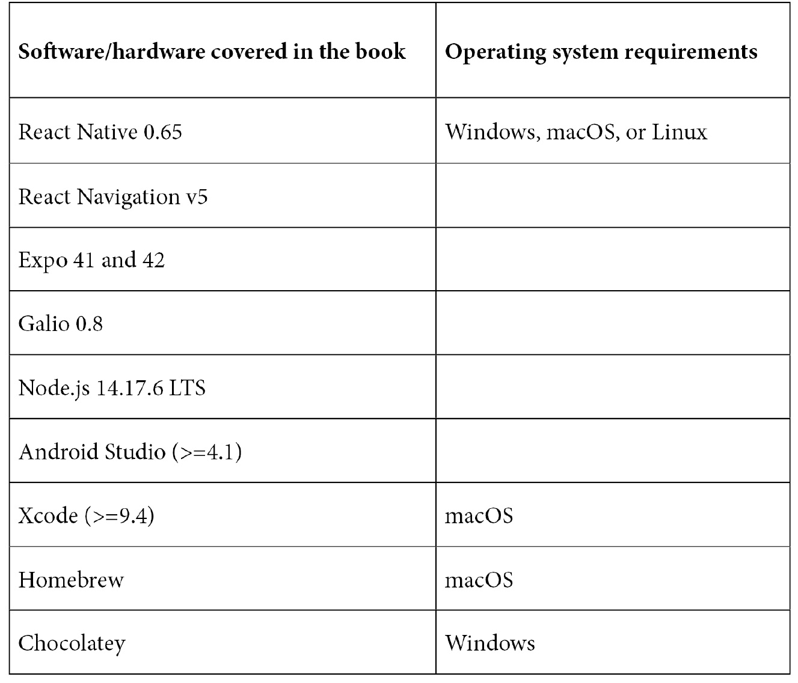

# 前言

本书是 Galio 移动应用程序开发的权威指南，向您展示如何为自己的想法设置 React Native 项目。通过基本概念的逐步解释和实际示例，本书帮助您了解 React Native 的基础知识以及 Galio 的工作原理。

# 本书适合对象

本书适合希望学习新技能或构建个人移动应用程序的开发人员。任何试图改变工作的人以及初学者和中级 Web 开发人员也会发现本书很有用。需要基本的 CSS、HTML 和 JavaScript 的理解才能充分利用本书。

# 本书涵盖内容

在*第一章*中，“React Native 和 Galio 简介”，您将了解 React Native 的强大之处。将简单介绍 React Native 是什么，以及您将发现 Galio 的作用以及它如何节省您的时间和压力。

在*第二章*中，“React Native 基础”，您将了解 React Native 的基本概念，如 JSX 和这个框架提供的基本组件。您还将了解有关应用程序的正确目录结构以及如何充分利用它的更多信息。

*第三章*中，“正确的心态”，涉及任何用户在使用 React 时应该如何看待。这将帮助您养成一些开发移动应用程序和软件的良好习惯。它还作为基础知识和实际创建您的第一个跨平台移动应用程序之间的过渡。

在*第四章*中，“你的第一个跨平台应用程序”，您将学习如何通过实际示例创建您的第一个跨平台应用程序。本章旨在作为打包、如何使用`npm`以及为什么需要 Galio 的介绍。

在*第五章*中，“为什么选择 Galio？”，我们将介绍 Galio 的优势，它如何帮助您，以及如何与社区联系和帮助可以使您受益。这将激励您成为开源社区的积极成员，并更多了解 React Native。

*第六章*，*移动 UI 构建基础*，帮助你理解构建应用基本但美观 UI 的基础知识。你可能已经厌倦了丑陋的应用，如果有机会，你会想要创造出美丽的东西。这一章就是关于你如何做到这一点的。

在*第七章*，*探索我们应用的状态*，你将看到组件是如何并排运行的，并理解如何、为什么以及在哪里使用 Galio 组件。这样做将帮助你培养自己的批判性思维方式。

*第八章*，*创建你自己的自定义组件*，将教你如何基于 Galio 构建你自己的组件。你将发现如何将那些已经存在的美丽组件组合成你在应用中需要的组件。

*第九章*，*调试和寻求帮助*，将教你如何调试你自己的应用，并在需要时寻求帮助。

在*第十章*，*构建引导屏幕*，你将开始创建 React Native 应用；我选择了引导屏幕，因为通常这是你打开应用时看到的第一个屏幕。

在*第十一章*，*让我们构建-秒表应用*，你将学会如何结合你的第一个屏幕，并使用 React Navigation 来连接它与秒表屏幕。这个屏幕会更加困难一些，因为它有一个真实的使用案例，但这将使事情更有回报。

*第十二章*，*接下来做什么？*，在这里你将学到更多关于 React Native、Galio，以及如何转变自己成为一个出色和成功的移动开发者。

# 为了充分利用本书

我假设你已经具备 HTML、CSS 和 JavaScript 的初学者水平知识。有一些 React 的经验肯定是一个优势，但并非必需。你需要一台安装了最新软件的 Windows/Mac 电脑。



**如果您使用的是本书的数字版本，我们建议您自己输入代码或从书的 GitHub 存储库中访问代码（链接在下一节中提供）。这样做将有助于避免与复制和粘贴代码相关的任何潜在错误。**

阅读完本书后，我希望你尝试重新完成书中的所有挑战，而不查看任何代码，同时为每个练习增添自己的个人风格。

# 下载示例代码文件

您可以从 GitHub 上的[`github.com/PacktPublishing/Lightning-Fast-Mobile-App-Development-with-Galio`](https://github.com/PacktPublishing/Lightning-Fast-Mobile-App-Development-with-Galio)下载本书的示例代码文件。如果代码有更新，将在 GitHub 存储库中更新。

我们还提供了来自我们丰富书籍和视频目录的其他代码包，可在[`github.com/PacktPublishing/`](https://github.com/PacktPublishing/)上找到。去看看吧！

# 下载彩色图像

我们还提供了一个 PDF 文件，其中包含本书中使用的屏幕截图和图表的彩色图像。您可以在这里下载：`static.packtcdn.com/downloads/9781801073165_ColorImages.pdf`。

# 使用的约定

本书中使用了许多文本约定。

`文本中的代码`：表示文本中的代码单词、数据库表名、文件夹名、文件名、文件扩展名、路径名、虚拟 URL、用户输入和 Twitter 句柄。例如："现在，对于第二行，让我们进入我们的`styles.row2`对象并添加填充。"

代码块设置如下：

```jsx
const styles = theme => StyleSheet.create({
  container: {
    flex: 1,	
    backgroundColor: theme.COLORS.FACEBOOK
  }
});
```

任何命令行输入或输出都以以下方式编写：

```jsx
npm i galio-framework
```

**粗体**：表示一个新术语、重要单词或屏幕上看到的单词。例如，菜单或对话框中的单词以**粗体**显示。例如："在记录下您的用户名和密码后，您应该收到以下响应：**成功。您现在以 YOUR-USERNAME 登录**。"

提示或重要说明

显示如下。
