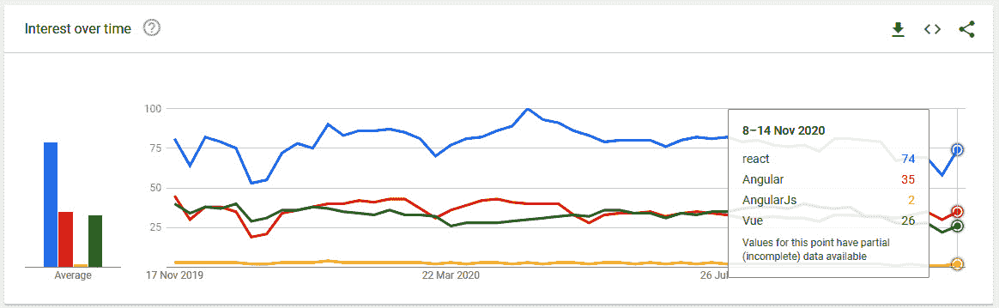
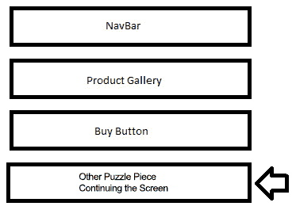
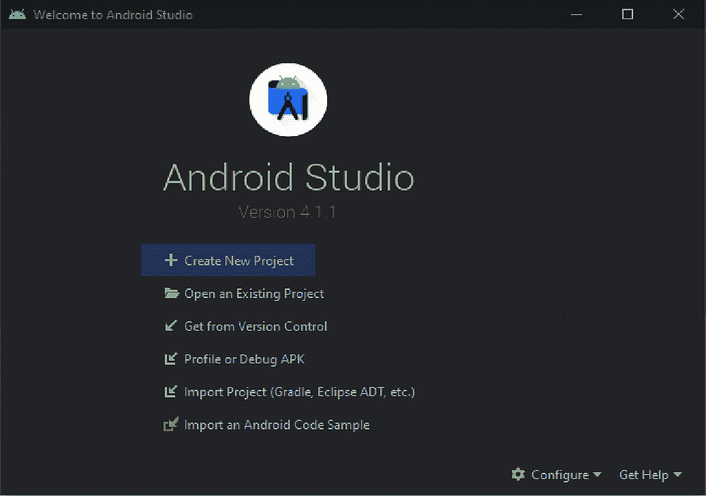
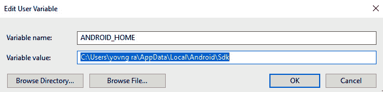
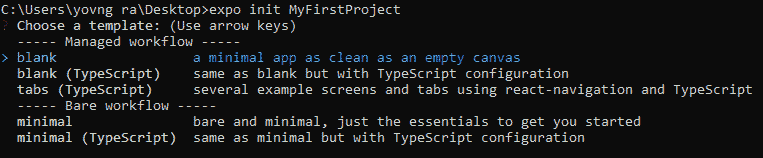
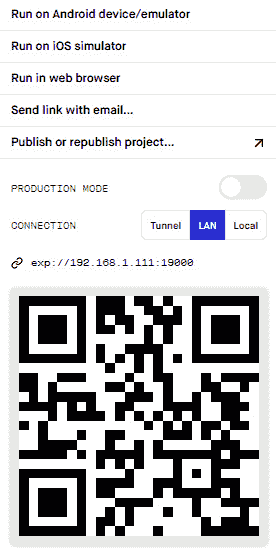
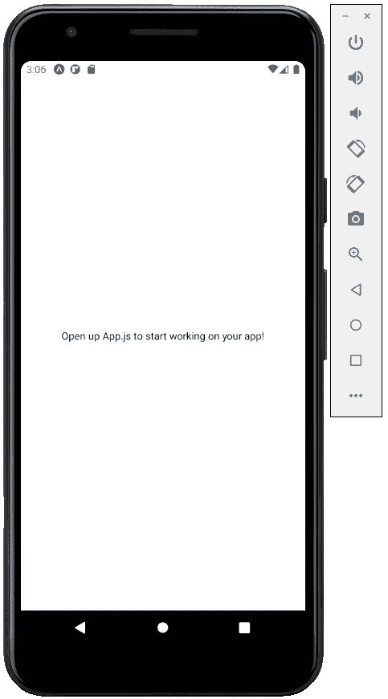

# 第一章：介绍 React Native 和 Galio

让我们首先了解本书的内容以及它如何帮助您学习如何使用 React Native 和 Galio。通过阅读本书，您将了解如何在 macOS 和 Windows 上安装 React Native 以及所有必要的工具。然后，您将了解如何创建一个 Expo 项目以及为什么我们使用 Expo，模板工作流之间的区别以及它们如何方便，以及如何在物理设备和模拟器上启动新项目。事情应该非常容易跟随，所以您可能会发现这种体验是有益的。

了解跨平台移动编程的世界并不容易，但肯定是可行的。购买这本书是您迈出的第一步，第二步正在进行中，因为您正在阅读本书，了解 React Native 的工作原理以及 Galio 如何帮助您更快地构建应用。本书的主要目的是让您熟悉 React Native 的工作原理，如何在项目中使用它，以及 Galio 如何方便并可能节省大量时间。

我能理解一开始这可能不是一项容易的任务，但我强烈建议您尽可能多地查看每个部分。如果有一些东西一开始可能不太容易理解，您可以在 Stack Overflow 或不同的 subreddits 等地方提问。我们将在本书的后面深入了解寻求帮助的地方。

起初，大多数程序员，包括我自己在内，都认为跨平台移动编程框架可能比本地框架慢得多。这只是一种想法，因为我们将看到 React Native 是创建移动应用的一种非常好的方式，因为它们与本地应用相比并不慢。

很快您就会明白，这本书与 Galio 紧密相连，我认为 Galio 是最好看的 UI 库之一。Galio 将帮助我们更快地构建 React Native 应用，并且比我们自己能做的更有风格。

您还将学习许多开发自己 UI 的方法，以及在开发应用程序时如何开始跳出思维定式。这很重要，因为这可能是成功应用和失败应用之间的区别。

学习设计和编程的基本规则只是成为一个完整的前端开发人员过程中的第一步。学会如何打破这些规则将进一步发展你的技能。

有时，会有提示出现在最需要的地方，遵循这些提示将有利于任何试图进入程序员思维的人。

在本书的结尾，你会找到练习和许多关于如何为你的移动应用程序开发更复杂的 UI 的提示。所有这些都有一个很好的目的，那就是在拥有一个良好的基础的同时发展编程风格。

我坚信在读完本书之后，任何人都应该能够创建至少一个基本的跨平台移动应用程序，这将作为个人项目的一个很好的 MVP。学习和体验本书中所写的所有内容不仅对你作为学习使用 React Native 和 Galio 的人很重要，对你作为一个程序员也很重要。

本章将涵盖以下主题：

+   为什么选择 React Native？

+   Galio - 最好的 UI 替代品

+   配置你的 React Native 环境

+   创建你的第一个 React Native 项目

# 为什么选择 React Native？

所以，你可能会想，“为什么选择 React Native？”。市面上有很多跨平台框架，比如 Flutter、Xamarin 和 Cordava 等，所以我们需要了解为什么 React Native 是移动应用程序开发的一个很好的选择。

你需要明白，没有绝对正确的选择。这只是基于当前市场环境和个人欣赏。

编程框架就像画家的画笔。画家有多种画笔，每一种都有不同的用途。你需要尽可能多地了解你正在使用的工具，因为画家对画笔了解得越多，他们就能越好地绘画并将他们的愿景变为现实。

你需要学会如何使用 React Native 快速轻松地开发跨平台应用程序。所以，让我们更深入地了解为什么 React Native 是开发应用程序的一个很好的选择。

## 你只需要学习一次

首先，React Native 是基于 React 的，这意味着你只需要学习一次，就可以在任何地方开发。这是扩展你技能的一个非常好的方式。通过学习 React Native，你将准备好为你的网站编写 React 代码。

这应该让您很容易理解为什么这是一个如此好的选择。想象一下，您已经创建了一个应用程序。您的应用程序很酷 - 人们开始从 App Store 或 Google Play 下载它 - 但更有帮助的是一个落地页。因为您已经学会了 React Native，利用您的 React 技能将变得轻而易举。

## 更大的人才储备

在早期的编程时代，当您有一个应用程序想法并想要开发它时，您必须寻找具有一些 C#或 Java 技能的后端开发人员，具有 Objective-C 技能的 iOS 开发人员，必须了解 Java 的 Android 开发人员，甚至可能还需要一些网页前端开发人员来开发应用程序的网站。

这需要大量的努力和相当大的预算。在项目结束时，您的想法可能在今天的市场上行不通，而您将浪费大量的时间和金钱。

现在，所有这些特定的工作都可以由 JavaScript 工程师来处理 - 我们有多种替代方案来使用与原生框架一样好的 JavaScript 编写的框架，而 JavaScript 是目前最常用的语言之一。市场上甚至有更多的 JavaScript 开发人员，并且从一个框架转移到另一个框架比以往任何时候都更容易。通过雇佣 JavaScript 开发人员，预算减少了一半，应用程序开发速度更快，即使他们有不同的工作，他们也可以互相帮助。

JavaScript 开发人员可以轻松更换团队。后端开发人员可以帮助前端开发人员，甚至移动应用团队。他们可以随时提供帮助，无论您在哪里需要更多的人手来加快开发速度。当您的开发人员因辞职或疾病而缺席时，这一点尤为重要。

拥有更多可供选择的人才对于任何应用程序开发来说都是一个巨大的优势。

## React 的流行

你可能会认为 React 的流行与 React Native 无关，但实际上，就编写代码和方法论而言，React 和 React Native 是密切相关的。我的建议是始终关注 Google 趋势，因为它可以帮助我们了解一个框架是否受欢迎：



图 1.1 - Google 趋势显示了 React 目前的流行程度

React 使开发人员能够轻松构建出色的 Web UI，但基于组件的方法也使应用程序更容易维护。React Native 将所有这些优势带到了移动应用程序开发领域。

那么，这给我们展示了什么？有一个相当庞大的 React 搜索社区，而 React Native 拥有一个最大且最活跃的社区之一。对于您可能遇到的几乎每一个小问题，都有人已经在 GitHub 上撰写了文章或为其提出了问题。GitHub 上的社区也非常庞大，这将会很有帮助，因为您可以与更多开发人员联系，寻求关于您可能在应用程序中使用的任何库的帮助，并为您可能拥有的任何开源想法获得更多帮助，这可能会对许多开发人员有所帮助。

我建议每个人都参与开源项目，因为这将有助于发展您的技能，并扩展您作为程序员的思维方式。社区是如此乐于助人和友好，以至于您可能会发现很难转向任何其他框架，因为这似乎是大多数需求的最佳选择。

## 性能

React Native 在性能方面接近原生应用，但您必须以正确的方式使用它。从技术上讲，您有一个运行缓慢的 JavaScript 线程，与 Android 的 Kotlin 或 iOS 的 Swift 等本地代码相比，速度相当慢。

React Native 的闪光点在于它在 JavaScript 线程和本地线程之间创建了一个桥梁。它旨在将诸如渲染之类的最昂贵和强大的任务移动到本地端。这是异步使用的，因此 JavaScript 线程不必等待本地计算。

假设用户按下按钮-React Native 将把这个转化为 JavaScript 可以处理的事件。之后，通过在本地平台（如 iOS 或 Android）和 JavaScript 代码库之间发送消息，React Native 桥将本地事件转换为 React 组件可以理解和响应的事件。

这里有一些挑战，比如默认组件-这些是 React Native 提供的内置元素-在两个平台上看起来或响应起来并不相同，因为有很多特定于平台的事件。不过不用担心，因为这种桥接架构允许我们使用来自平台、SDK 和 JavaScript 库的所有现有本地视图。

## 语言

JavaScript 是作为客户端语言创建的。它被设计用来使网站具有交互性。如果你想象一个基本的网站布局，你有你的 HTML，描述基本内容和网站结构，然后你有你的 CSS，为 HTML 添加样式并使其美观。这是一个不做太多事情的静态网站，所以我们需要一种编程语言，可以为我们的网站添加功能并使其生动起来。这就是 JavaScript 进入游戏的地方。

时间过去了，人们意识到他们可以用 JavaScript 做更多的事情。JavaScript 最流行的用途是客户端，但自从 Node.js 出现在编程场景中以来，这种语言已经发展得如此之多，以至于这不再是情况。JavaScript 现在是一种多用途的编程语言，意味着你可以用它来构建几乎任何东西。你甚至可以使用 TypeScript 或 Flow 来获得类型化的 JavaScript。代码编辑器内的支持也变得更好了。

说了这么多，React Native 使用 JavaScript 作为其主要编程语言。*随着我们的学习，我们会发现 React Native 也可以使用原生代码来运行得更快，做更好的计算*。

Stack Overflow（程序员最大的社区之一）每年都会进行一项调查，试图更多地了解开发者和使用他们平台的人。你可以问任何开发者关于他们的平台，几乎任何人都会告诉你他们至少浏览过一次。他们 2020 年的研究显示，几乎 70%的用户是使用 JavaScript 的专业开发者。

作为一种多才多艺的语言，学习它用于 React Native 或其他框架只会帮助你扩展作为程序员的领域。React Native 使用它是一个很大的优势，因为它显示了这样做可以让你在不同技术之间轻松移动。

你可以通过访问[`insights.stackoverflow.com/survey/2020`](https://insights.stackoverflow.com/survey/2020)了解更多关于 Stack Overflow 关于 2020 年调查的统计数据。

## 得出结论

阅读了关于 React Native 的所有内容之后，我们需要明白，尽管 React Native 并不像原生应用那样快速，但它几乎可以和原生应用一样快。而且，考虑到这种语言对开发者有如此多的机会，以及社区如此强大友好，我们可能会将 React Native 视为跨平台移动应用开发的最佳框架之一。

为了选择适合你需求的库，你需要考虑对你来说最重要的是什么。我希望你对 React Native 有了一些了解，并且对这个框架是一个好选择有信心。

接下来，我们将更多地了解 UI 库是什么，以及 Galio 是如何像一个伟大的助手一样帮助我们编写代码的。

# Galio - 最佳 UI 替代品

所以，你已经学会了一些关于 React Native 的工作原理，现在你想知道 Galio 如何帮助你。首先，Galio 到底是什么？

简而言之，Galio 是一个 React Native UI 库，因此它是一组资源，旨在帮助开发人员更快、更容易地编写代码。问题是... React Native 没有那么多组件。我们将在本书的后面回到组件的具体含义，但现在，只需将它们视为拼图块。

React Native 有一定数量的拼图块，每个拼图块尽可能简单。Galio 作为这些拼图块的包装器，添加了一些颜色和功能。有时，甚至可以找到通过将更基本的拼图块组合成一个非常大的拼图块的不同拼图块，出于特定原因。

现在，让我们来看看为什么 Galio 可能是你在跨平台移动开发旅程中最好的 UI 库。

## 节省时间

好吧，比喻太多了。事实是，React Native 只有基本外观的组件，这使开发人员需要构建自己的组件。这是耗时的，因为你总是需要为你的新应用构建新组件。

这就是 Galio 派上用场的地方！它拥有许多已经美丽的组件，减轻了一直创建自己的痛苦。

此外，所有组件都更容易定制，仍然适合整个设计布局，而不会给开发人员施加太大压力，让他们考虑如何做以及从哪里开始。从 Galio 定制组件的过程很简单，通常围绕着使用 props，这使整个过程更加可读。

我知道像“组件”和“props”这样的词对你来说完全或可能有些陌生，但重要的是它们可以节省你大量的时间。我们很快就会了解更多关于这些关键词，但我们需要了解一些关于所有这些技术在整体方案中意味着什么。

使用 Galio 构建应用通常更多地取决于您选择创建布局的方式，而不是实际编程 UI。它是通过直接放置每个组件在前一个组件下面的方式来创建移动屏幕。这使我们能够更高效，尽可能少地浪费时间编写代码并思考最终屏幕的样子。

以下图表显示了您可以使用我们讨论的拼图块创建的基本程序结构：



图 1.2 - 添加更多组件如何帮助构建移动屏幕的表示

这是一种很好的思考方式，因为它让您了解了一些最佳的原子设计原则。它还创建了一个更有组织的代码库，您可以将其扩展为更复杂和更完整的应用程序。

## 这真的很美

Galio 已经预先设计了一个设计系统，这意味着所有组件都将遵循相同的设计原则，因此组件之间永远不会有任何差异。

一致的设计是使应用完整的关键。一致的设计将帮助用户更好地理解您的应用流程，您希望在应用中引入的所有符号以及如何使用它。这一切都与您的按钮、文本和设计保持一致有关。

起初您可能不喜欢颜色，这没关系，因为您可以借助`<GalioProvider>`轻松更改它们。我们稍后会在本书中讨论这一点。

现在，我们已经了解了为什么 React Native 是一个如此好的选择，以及为什么 Galio 是一个很好的 UI 库，让我们开始构建应用。下一步是了解如何配置一个良好的环境，以便我们可以开始构建跨平台移动应用。

# 配置您的 React Native 环境

有两件事我们需要了解：**Expo**和**React Native CLI**。

它们都很容易安装，我们将介绍它们，以确保我们覆盖所有可能的情况。我建议不要跳过这部分，因为它将帮助您在开始开发移动项目时做出一个好选择。

在 macOS 上安装东西要比在 Windows 上容易得多，因为 macOS 是基于 UNIX 的系统，所以终端更加强大。但不用担心 - 我们也会解决 Windows 上的这个问题。

在我们继续之前，我们必须考虑一些要求。这些将帮助我们为 Expo 和 React Native CLI 以及一般的 JavaScript 编程创建一个良好的环境。

无论是哪个系统，我们都需要安装以下技术：

+   Homebrew - 仅限 macOS

+   Chocolatey - 仅限 Windows

+   Node.js

+   文本编辑器

+   Android Studio

+   Xcode - 仅限 macOS

我们将从安装 Node.js 开始，这是我们在浏览器之外运行 JavaScript 所需的最重要的技术之一。Node.js 是建立在 Chrome 的 V8 JavaScript 引擎上的，这意味着您可以运行在最新 Chrome 版本（Web 浏览器）上运行的任何 JavaScript 代码。

安装 Node.js 的推荐方式取决于您的操作系统。对于 macOS 用户，最好的方式是使用 Homebrew，而对于 Windows 用户，您将使用 Chocolatey。Homebrew 和 Chocolatey 是包管理器，可以让您更轻松，更快速地安装不同的软件包，如 Node.js，都可以通过命令行或终端进行。您也可以通过官方网站[`nodejs.org`](https://nodejs.org)安装它，但是在本书中我们将使用 Homebrew 或 Chocolatey。

## Homebrew

对于 macOS，我们有 Homebrew，它很容易安装。您可以在他们的官方网站[`brew.sh`](https://brew.sh)上找到更多信息。

要安装它，您应该打开**终端**并输入以下命令：

```jsx
/bin/bash -c "$(curl -fsSL https://raw.githubusercontent.com/Homebrew/install/master/install.sh)"
```

在输入命令后，按*Enter*。将会出现有关即将安装的所有内容的更多信息；只需再次按*Enter*，您就准备好了。

## Chocolatey

对于 Windows，我们有 Chocolatey，它比 Homebrew 更复杂，但是按照这里的步骤，您应该已经准备好了。您可以通过访问它们的官方网站[`chocolatey.org`](https://chocolatey.org)了解更多关于 Chocolatey 的信息。

首先，我们需要以管理员权限使用 PowerShell。要访问它，您只需在键盘上按*Windows 标志+X*。一个新菜单将出现在屏幕的左下角。在这里，选择**Windows Powershell（管理员）**。一个新窗口将打开。

首先，您需要验证`Get-ExecutionPolicy`是否不受限制，因此在 PowerShell 中写入以下内容：

```jsx
Get-ExecutionPolicy
```

如果返回`Restricted`，那么您需要运行以下命令：

```jsx
Set-ExecutionPolicyAllSigned
```

现在，您已经准备好运行以下命令：

```jsx
Set-ExecutionPolicy Bypass -Scope Process -Force; [System.Net.ServicePointManager]::SecurityProtocol = [System.Net.ServicePointManager]::SecurityProtocol -bor 3072; iex ((New-Object System.Net.WebClient).DownloadString('https://chocolatey.org/install.ps1'))
```

现在，等待几分钟让一切都安装好。如果在安装过程中没有遇到任何错误，只需输入`choco`即可返回 Chocolatey 版本。如果返回了版本号，那么你就已经准备好了。

现在我们需要做的就是安装 Node.js，这样我们就可以学习 Expo 和 React Native CLI 了。安装了 Homebrew 或 Chocolatey 后，只需输入以下命令，Node.js 就会开始安装：

+   在 macOS 上使用以下命令：

```jsx
brew install node
```

+   在 Windows 上使用以下命令：

```jsx
choco install -y nodejs
```

恭喜！我们现在已经准备好继续前进了！有了这个，我们已经安装了 Node.js。在设置环境之前，让我们讨论一下文本编辑器-我保证不会花太长时间。

我敢打赌你现在在想，“等等，他说我们可以在 Word 文档中写代码吗？”其实不是。Microsoft Word 不是一个纯文本编辑器，但你可以使用诸如 Notepad 之类的东西来写代码。仅仅因为我们可以使用 Notepad 并不意味着我们会使用它；它看起来并不太专业，对吧？

我们将使用的文本编辑器将具有一些很酷的功能，比如代码语法的颜色方案，以及将帮助我们更快更漂亮地编写代码的不同附加组件。

有许多不同的免费文本编辑器，包括 Sublime、Atom、Visual Studio Code、Notepad++和 Brackets。它们都同样优秀，我建议你至少下载两三个来试试。我个人偏好 Visual Studio Code，并且在本书中将一直使用它。如果你不喜欢某个文本编辑器的外观，你不需要使用相同的文本编辑器，因为你可以使用上述任何一个编辑器来跟随本书。

你可以从[`code.visualstudio.com/`](https://code.visualstudio.com/)下载 Visual Studio Code（或简称 VSCode）。

现在我们已经解决了一些必需品，是时候继续学习 Expo 和 React Native CLI 了。它们都可以用来实现相同的结果-它们只是创建 React Native 应用的不同方式，我们将尽量理解它们。了解它们的一切将帮助我们选择适合我们和我们的应用的正确方式。

## React Native CLI

React Native CLI 是创建 React Native 项目的官方和首选方法。通常比 Expo 更难配置，需要更多时间，但是很值得。毕竟，您需要模拟器来测试您的应用在不同手机上的情况。我建议不要跳过这一部分。

### macOS

拥有 macOS 的一个好处是您可以模拟 iPhone，并查看您的项目在不同的 Apple 技术上的外观。这是在 Windows 上无法做到的，但 Android 可以在两者上运行，因此 macOS 在能够模拟所有类型的平台方面具有优势。

我们应该开始并安装所有必要的依赖项；打开终端并写入以下内容：

```jsx
brew install watchman
```

Watchman 是 Facebook 开发的一个工具，用于监视文件系统内的更改。它还提供更好的性能。

现在，您需要安装 Xcode。前往 Mac App Store，搜索 Xcode，然后点击**安装**。这也将安装 iOS 模拟器和构建 iOS 应用所需的其他工具。您的 Xcode 版本至少需要是 9.4 才能与 React Native 一起使用。

现在，我们需要安装 Xcode 命令行工具包。一旦 Xcode 下载和安装完成，打开它，然后转到**首选项**（在导航栏的 Xcode 菜单下; 或者，只需按*Cmd + ,*）。应该会打开一个新窗口。转到**位置**，通过从下拉菜单中选择最新版本来安装命令行工具：

![图 1.3 - Xcode 中的首选项窗口

]

图 1.3 - Xcode 中的首选项窗口

现在，转到**组件**选项卡，并安装您希望使用的最新模拟器。

重要提示

苹果支持的每个 iOS 版本都有一个模拟器。您应该尝试安装最近的两个主要版本，因为您的应用用户可能始终使用较早的 iOS 版本。

现在，您只需要通过在终端中写入以下内容来安装 CocoaPods：

```jsx
sudo gem install cocoapods
```

这是一个 Ruby gem，用于管理 Xcode 项目的依赖关系。

有了这些，您就可以在 macOS 上创建您的第一个项目了！我们马上就会做到！

### Windows

众所周知，我们无法在 Windows 上安装任何 iOS 模拟器，所以我们不妨只安装 Android 模拟器。

我们已经安装了 Node.js，现在剩下的就是通过转到我们的管理员 PowerShell（我们在安装 Node.js 和 Chocolatey 时解释了如何打开它）来安装 JDK。一旦打开它，写入以下内容：

```jsx
choco install -y openjdk8
```

如果您已经安装了 JDK，请确保至少是 v8。

现在，是时候安装我们的 Android 开发环境了，这可能有点乏味。然而，这是值得的，因为我们将能够在虚拟 Android 模拟器上运行我们的 React Native 应用程序。

前往[`developer.android.com/studio`](https://developer.android.com/studio)下载 Android Studio。安装完成后，启动 Android Studio。打开后，选择您喜欢的主题和适合您计算机的所有首选项。在某个时候，**SDK 组件设置**页面将出现。确保已选择了**Android SDK**、**Android SDK 平台**和**Android 虚拟设备**复选框。

安装完成后，是时候继续了。Android Studio 默认安装最新的 Android SDK。然而，使用本地 Android 代码构建 React Native 应用程序需要**Android 10 (Q) SDK**。要安装它，打开 Android Studio，点击窗口右下角的**配置**，然后选择**SDK Manager**：



图 1.4 – Android Studio 和按钮的位置

现在，选择**SDK 平台**选项卡，并在右下角的复选框中选中**显示包详细信息**。查找并展开 Android 10 (Q)，并确保以下内容已被选中：

+   **Android SDK 平台 29**

+   **Intel x86 Atom_64 系统映像或 Google APIs Intel x86 Atom 系统映像**

接下来，您应该选择**SDK Tools**选项卡，并选中**显示包详细信息**旁边的复选框。查找**Android SDK 构建工具**，并选择**29.0.2**。

点击**应用**并下载所有必要的文件。

现在，是时候配置`ANDROID_HOME`环境变量，以便我们可以使用本地代码。打开**控制面板**，点击**用户帐户**，然后再次点击**用户帐户**。在左侧，您会找到**更改我的环境变量**；点击它。现在，点击**新建…**并写入以下内容：

+   **变量名**：`ANDROID_HOME`。

+   **变量值**：`C:\Users\{name}\AppData\Local\Android\Sdk`，其中`{name}`是您的 PC 用户名：



图 1.5 – Windows 显示我的用户变量

检查环境变量是否已加载，转到 PowerShell 环境并输入以下内容：

```jsx
Get-ChildItem -Path Env:\
```

您应该看到一个列表，其中`ANDROID_HOME`应该是其中的一部分。

之后，我们需要将`platform-tools`添加到**Path**中。我们可以通过转到**控制面板**，点击**用户帐户**，然后再次点击**用户帐户**来实现这一点。点击**更改我的环境变量**，然后查找**Path**。选择**Path**并点击**编辑**。一个新窗口将出现，我们可以点击**新建**。现在，使用与之前相同的变量值，但这次进入`Sdk`文件夹 - 更确切地说是`platform-tools`文件夹：

`C:\Users\{name}\AppData\Local\Android\Sdk\platform-tools`

我们现在已经准备好在 Windows 上开始开发 React Native 应用程序了！

## Expo

Expo 是初学者开始 React Native 项目的最简单方式。它内置了一套为 React Native 构建的大量工具，但我们现在对此不感兴趣。我们只对 Expo 可以在几分钟内让您上手并且不需要您安装模拟器感兴趣，因此您可以在几分钟内玩转您的应用程序。

他们还推出了一个名为 Snack（[`snack.expo.io/`](https://snack.expo.io/)）的东西，如果您希望直接在浏览器中尝试不同的代码想法，这将非常有帮助！这很酷，因为即使只是想快速草拟一些东西，您甚至都不需要启动一个项目。

让我们安装它，看看这是否像我所说的那样简单。打开终端或命令行并输入以下内容：

```jsx
npm install -g expo-cli
```

Expo 现在已经准备就绪！很简单，对吧？

### 准备进一步前进了吗？

现在我们已经安装了所有必要的技术，我们准备创建自己的 React Native 项目并创建一些很棒的应用程序！

但首先，让我们了解 React Native CLI 和 Expo 之间的区别。之前，我告诉过您不要跳过 React Native CLI 部分，即使它比 Expo 大得多。这是因为我们需要安装 Xcode 或 Android Studio，以便直接从我们的 PC 上控制我们的应用程序。

我们还没有使用 React Native CLI 或 Expo 创建项目，因为它们都是以不同的方式创建的。但是，我们已经安装了它们的要求。使用 React Native CLI 创建项目会让开发人员完全从 0 开始创建应用程序。您对应用程序拥有完全的控制权，没有任何东西能够限制您的想象力。您甚至可以使用本地代码 - Kotlin/Java 用于 Android 或 Swift/Objective-C 用于 iOS - 并创建自己完全本地的组件。不过，这都是非常高级的，我们并不需要它。

Expo 内置了许多工具，适合那些想要创建快速强大的应用程序，而不必费心考虑应用程序如何运行并与特定平台连接的所有细节的人。

因此，我们将使用 Expo 来创建本书中的项目。

# 创建您的第一个 React Native 项目

我们准备好了！让我们打开一个终端，直接开始吧！

一旦终端打开，只需移动到您的`Desktop`文件夹或任何您希望在其中创建项目的文件夹。您可以使用`cd`命令在文件夹之间移动。因此，只需输入`cd Desktop`，我们就到达了**Desktop**目录，准备创建我们的 Expo 项目。

我们可以通过以下方式使用 Expo 创建一个新的 React Native 项目：

```jsx
expo init MyFirstProject
```

按下*Enter*键后，Expo 告诉我们可以在多种模板之间进行选择。最大的两个类别是**托管工作流程**和**原始工作流程**：



图 1.6 - 初始化项目后您将看到的表示

我们将在几秒钟内解释这两者是什么。现在，在**托管工作流程**下选择**空白**。等待几秒钟，您将在终端中看到以下消息：

```jsx
Your project is ready!
```

现在，我们准备开始了。在终端中输入以下命令；这将把我们移动到我们项目的文件夹中：

```jsx
cd MyFirstProject
```

既然我们在这里，让我们了解每种类型的模板是如何工作的，这样我们就可以开始玩我们的第一个 React Native 应用程序了。

## 托管工作流程

托管工作流程试图处理几乎所有你必须做的复杂操作。这通常适用于完全的初学者，他们不想用 Xcode 或 Android Studio 复杂化事情，这也正是我们开始创建这种类型工作流程的原因。你可以通过 `app.json` 更改应用的所有信息，比如它的图标或启动画面，并且可以直接、轻松地访问不同的服务，比如推送通知。

然而，这种工作流程也有一些局限性。假设你想使用 Expo SDK 没有通过其 API 提供的特定设备功能。这意味着你需要运行 `eject`，`expo-cli` 将会做所有的工作并将你转移到**裸工作流程**。

## 裸工作流程

裸工作流程为开发者提供了对应用的完全控制。然而，这也伴随着需要处理关于应用的每一个细节的复杂性。现在，轻松配置 `app.json` 的能力已经消失，你只剩下安装了 Expo SDK 并且没有进行预配置。

这使你可以使用本地代码并以任何你想要的方式管理你的依赖。你可能会想，“*嗯...这不就是使用 React Native CLI 一样吗？*”。嗯，其实不是，因为你可以立即访问 Expo SDK 和 Expo 框架，这本身对于开发者来说是一个巨大的优势，因为它仍然简化了你的开发过程。

## 打开我们的项目文件

现在我们已经了解了每个模板的作用以及为什么选择了托管工作流程，让我们看看代码是什么样子的。

还记得我们讨论过文本编辑器吗？继续打开你选择的文本编辑器。我会使用 VSCode，因为我更喜欢它的设计。

点击**文件** | **打开文件夹**，然后搜索项目文件夹。我的在`桌面`文件夹中。打开它让我们看到项目中所有的文件和文件夹。

我很确定你对每个文件的目的感到困惑。我们马上会看一下这个，但现在，花几分钟四处看看，看看你是否可以自己找到一些东西。

提示

调查你找到和创建的任何代码片段是确保你正在学习你所阅读或编码的内容的最佳方式。最优秀的程序员总是那些运用他们的演绎能力的人。

## 为预览准备我们的物理设备

现在是时候准备我们的手机，这样它就可以预览我们的应用了，因为向朋友展示我们的新技能总是很酷的。

所以，让我们去应用商店或 Google Play 搜索 Expo。安装它，你就准备好了。这个应用程序允许我们在手机上测试我们的应用，所以让我们试一试吧！

去你的终端，如果你还没有在项目文件夹中，就前往那里。输入以下命令：

```jsx
npm start
```

之后，按下*Enter*。一个新窗口应该会在你的默认浏览器中打开。一个服务器已经创建，你的应用现在可以在你的物理设备上或者模拟器上预览了。在侧边栏上，有一个 QR 码，上面有一个链接和一些按钮。这是什么，我们怎样利用它呢？



图 1.7 - 屏幕上显示的所有按钮的预览

现在，你可以打开你的智能手机，扫描 QR 码或者将 QR 码上方的链接粘贴到浏览器中。一个消息会出现，询问你是否愿意用 Expo 打开链接。按下**是**，你就成功了 - 你的第一个 React Native 应用在你的物理设备上了。

相当酷，对吧？

让我们看看如果我们按下**在 Android 设备/模拟器上运行**或者**在 iOS 模拟器上运行**会发生什么。一个消息会出现在右上角，告诉你 Expo 正在**尝试打开模拟器**。取决于你在哪个操作系统上启动了你的项目，以及你安装了哪个模拟器，选择适当的按钮。

对于 Android 模拟器，你需要先打开 Android Studio。然后，你必须去右上角，那里写着**配置**，选择**AVD Manager**。现在，一个新窗口会出现，显示所有可用的虚拟设备。如果你没有看到任何设备，去左下角点击**创建虚拟设备**。

在这一点上，你会看到一个 Android 设备列表。我选择了 Pixel 3a，但如果你的 CPU 不是很强大，你可以选择一个旧的设备。之后，点击**下一步**；你将被要求选择一个系统镜像。找到**推荐**旁边的**x86 镜像**选项卡，并选择不需要下载的镜像，名为**Q**。如果所有镜像都需要下载，那么你需要回到 Android Studio 安装部分，重复该过程。选择镜像后，点击**下一步**，并命名 AVD；它可以被称为任何东西，所以要有创意。点击**完成**；你应该在**AVD 管理器**列表中看到你的设备。在同一行的右边，你会找到一个看起来像**播放**符号的小绿色按钮。点击它。

一个新的 Android 模拟器将打开，所以让我们回到浏览器标签，我们的 Expo 服务器正在运行，然后点击**在 Android 设备/模拟器上运行**。如果你看一下终端，你会看到一些文字出现了。我们只需要等待一会儿，Expo 客户端就会被下载并安装到我们的模拟器上。它应该会显示类似这样的内容：

```jsx
Downloading the Expo client app [================================================================] 100% 0.0s
Installing Expo client on device
Opening exp://192.168.1.111:19000 on Pixel_3a_API_30_x86
```

现在，你的 Android 模拟器应该显示你的第一个 React Native 应用的预览。感觉如何？你经历了很多，但最终，能够正确初始化一个项目是相当有回报的：



图 1.8 - Android 模拟器显示一个全新的 React Native 项目

在我们继续之前，我认为我们应该学习如何在终端/命令行中关闭一个项目。回到终端窗口，点击它，使其聚焦。现在，如果你按下*Ctrl + C*，服务器应该停止，你应该能够再次使用终端窗口。

# 总结

本章以对 React Native 和 Galio 的简要介绍开始，然后我们了解了为什么这些库对你的下一个个人跨平台移动应用项目很有好处的主要焦点。在充分理解为什么学习这些库将帮助它们成为未来的重要资产之后，我们开始设置我们的 React Native 环境，并学习关于测试和利用我们即将创建的移动应用的一切。

我们接着创建并测试了我们的第一个 React Native 应用！对于一个新手来说，进入这个美丽的编程世界确实是一次很棒的旅程，相信我，这一切都是值得的。你在这里学到的一切将作为接下来要学习的基础。这一切都很令人兴奋，不是吗？在下一章中，是时候学习 React Native 代码编写的基础知识，并创建更酷的应用了。
