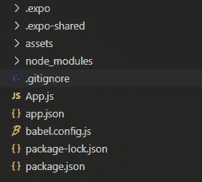
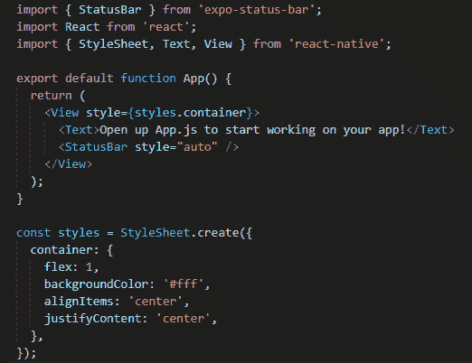
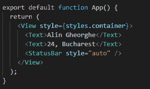
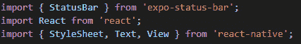
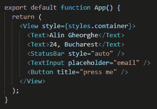
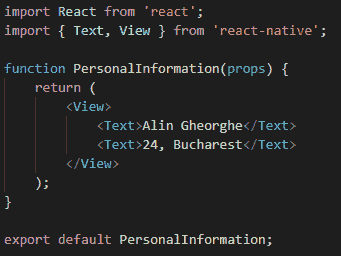
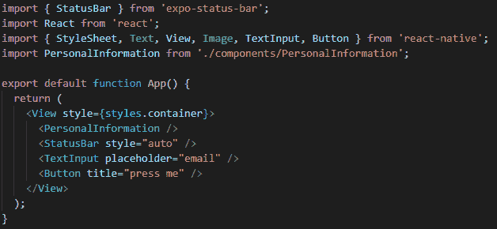
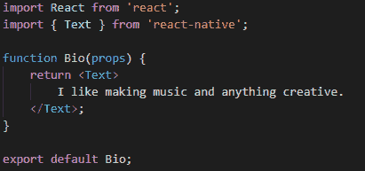
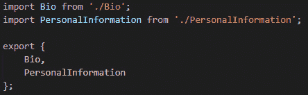
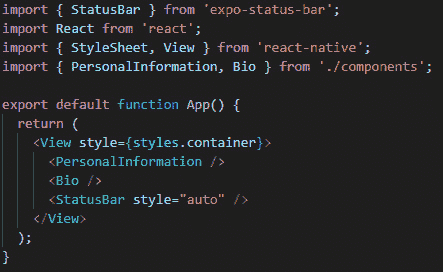

# 第二章：React Native 基础知识

我们首先学习了为什么 React Native 和 Galio 形成了最佳组合，可以帮助我们开始构建我们的第一个跨平台移动应用程序。在设置环境并配置必要文件后，我们使用 Expo 创建了我们的第一个 React Native 项目，并学习了不同的测试应用程序的方法，包括物理和数字化测试。

我相信在学习如何之前先了解为什么有助于建立更好、更健壮的知识基础。经过了解为什么，现在是时候学习 React Native 的工作原理以及如何使用它来创建我们的应用程序了。

这就是为什么我们将从我们的 React Native 项目的文件结构开始这一章，以便我们了解这些文件和文件夹是如何连接的。然后我们将详细介绍`App.js`文件，并解释这对我们作为应用程序的主要入口点是如何工作的。

一旦我们了解了文件结构，就是时候学习**JSX**是什么以及如何使用它了——这是任何 React 应用程序的骨架。我们将经常将 JSX 与 HTML 进行比较，因此您必须事先了解一些 HTML。如果您对 Web 开发了解不多，也不用担心——我们也会介绍一些 HTML 概念，但自己学习一些可能会对您有所帮助。*理解 JSX 的概念*是我们将处理**组件**概念的地方，这是我们在第一章中几乎没有涉及的概念。到本章结束时，这应该是完全理解的。

一旦我们了解了 JSX 的主要概念以及它与 React 和 React Native 的关系，我们将进行我们的第一个组件导入。我们将学习 npm/yarn 是什么以及如何使用它来导入和上传组件或库到网络上。这是令人兴奋的，因为您将看到拥有一个庞大的社区支持一个框架的重要性，以及您如何参与并结交新朋友。

现在是时候学习 React Native 的核心组件了。我们将了解它们的用途和上下文，并讨论改进它们或完全更改它们的不同方法。核心组件是我们在网上找到的所有组件的基础组件。这意味着几乎每个组件都继承自核心组件，这使得了解和理解它们非常重要。

在本章结束时，你将学会如何构建一个组件。你还将学会如何在我们的应用程序或未来的应用程序中使用它，以及如何组织文件，这样你就永远不会迷失在寻找你的组件中。

我相信在本章结束时，你将能够开始构建非常简单的应用程序，这些应用程序可以作为构建更大、更复杂项目的基石。理解这些概念并不仅限于阅读本书 - 它会更进一步，你会看到我一直鼓励你查看我们使用的项目/框架的官方文档，因为文档应该始终是程序员应该感到舒适阅读的东西。学会阅读文档是一个你会通过阅读和对你热衷的项目尽可能感兴趣来发展的技能。

本章将涵盖以下主题：

+   使用`App.js` - 主入口点

+   理解 JSX 的概念

+   导入你的第一个组件

+   核心组件

+   理解和创建一个组件

# 技术要求

你可以通过访问 GitHub 上的[`github.com/PacktPublishing/Lightning-Fast-Mobile-App-Development-with-Galio`](https://github.com/PacktPublishing/Lightning-Fast-Mobile-App-Development-with-Galio)来查看本章的代码。你会发现一个名为`Chapter 02`的文件夹，其中包含我们在本章中编写的所有代码。要使用该项目，请按照`README.md`文件中的说明进行操作。

# 使用 App.js - 主入口点

就像我们所知道的，React Native 是一个用于构建 iOS 和 Android 应用程序的开源框架。它使用 React 来描述 UI，同时通过我们可用的方法访问平台的功能。

理解我们的文件夹结构很重要，因为在开发初期我们不应该触碰一些文件。让我们来看看我们新创建的项目结构。

提示

不要忘记你可以使用任何你喜欢的文本编辑器；我只是使用 VSCode 是因为我喜欢它的外观，并且它有很多我使用的插件，但这并不意味着你不能用任何你感觉舒适的文本编辑器打开项目。当然，这意味着你将无法使用`code.`命令，因为那只能用于 VSCode。

首先，让我们打开我们的终端并导航到我们的文件夹。现在，如果我们到达文件夹后写`code.`，它将打开 Visual Studio Code。

一旦我们的文本编辑器打开，我们将在项目目录中看到以下输出：



图 2.1 – 打开文本编辑器后的项目目录

正如我们所看到的，这里有几个文件夹和文件，它们都旨在在你完成应用程序后帮助捆绑项目。我们将在接下来的几节中查看这些文件夹中的每一个。

## .expo 和.expo-shared 文件夹

我们将从带有点的文件夹开始：`.expo`和`.expo-shared`。点在那里是为了显示一个隐藏文件。这是一个你在打开文件浏览器时无法直接看到的文件；只有在你明确选择查看它时才能看到。这些文件是隐藏的，因为你不需要触碰它们。它们是在你第一次使用`expo start`命令时创建的配置文件。

## 资产文件夹

接下来的文件夹是`assets`文件夹。在里面，你会找到几个`.png`图像，这些图像是 Expo 用于启动屏幕的 – 应用程序加载时出现的屏幕 – 以及应用程序在设备上安装时使用的图标。

## node_modules 文件夹

现在，你会看到一个名为`node_modules`的文件夹。如果你打开这个文件夹，你会看到很多很多的文件夹。所有这些文件夹都是我们用来使这个应用程序工作的包和**依赖项**。你安装或从互联网引入的所有东西都会直接放入这个文件夹。这个文件夹会随着你为应用程序使用的外部包的数量而变得越来越大。

一旦我们通过这些文件夹，我们会发现一些具有一些有趣特征的文件。

## 文件内部

首先，我们可以看到`.gitignore`，它可以帮助我们在 GitHub 上上传时节省空间。如果你打开这个文件，你会看到里面已经写了一些文字。一旦你上传项目到 GitHub，你在里面看到的所有东西都会被忽略。你会发现`.expo`在那里，因为那些文件夹只对程序员有用，不打算共享。你可以通过使用任何你不想转移到在线或者你不打算更改的文件名来编辑这个文件。

重要提示

GitHub 是一个像互联网托管公司一样为开源软件程序提供服务的平台，同时还使用 Git 为程序员提供版本控制。开发人员使用 Git 来跟踪他们项目中的变化，并与他们的团队协调。

现在，我们会忽略`App.js`，因为我们将在本节末尾解释这个文件。所以，让我们直接转到`app.json`文件。这个文件就像是你的应用程序的配置文件 - 基本上，所有与代码无关的东西都会在那里找到。比如，例如，我们想要更改启动画面的图片。除了进入这个文件并编辑启动图片的路径之外，我们没有其他办法。从这里，你可以改变几乎与你的应用程序相关的一切，比如图标或其方向。你会发现自己经常去那里，为最终发布版本配置你的应用程序。

我们不关心`babel.config.js`，但我相信你对那个文件也会感到好奇。Babel 是一个几乎每个人都在使用的 JavaScript 编译器，用于获得对 JavaScript 最新标准的访问权限。编辑这个文件并不是必要的，但如果你想了解更多关于编译器的信息，我建议搜索更多关于 Babel 的信息。

最后两个文件是`package-lock.json`和`package.json`。当你在项目中使用 npm 安装依赖时，第一个文件总是会被创建。我已经告诉过你，我们将在本章学习 npm，但现在不是时候。现在，我希望你熟悉项目目录中的所有文件。通过命令行创建应用程序时，Expo 自动使用 npm 从互联网上获取了许多你在项目中会使用的文件。这些文件存储在`node_modules`文件夹中。你可以在`package.json`中找到更多关于你正在使用的所有直接依赖项的信息。

现在我们终于到了所有文件的末尾，我们应该开始讨论`App.js`。所以，让我们打开那个文件，看看它。

## App.js 文件

打开`App.js`文件后，你会看到以下内容：



图 2.2 - App.js 文件中的代码

你可以立即看到**打开 App.js 开始工作你的应用程序！**文本。我相信你记得，在上一章中，当我们测试我们的应用程序时，这就是出现在屏幕中央的文本。这意味着通过更改文本，我们也应该在我们的应用程序中看到变化。

我们现在不会这样做，因为我们的重点是理解文件和代码，然后根据自己的喜好进行更改。

我相当肯定，在看到这个文件后，你已经连接了其中的内容，并意识到这是我们应用的入口点。入口点是连接所有文件并启动应用程序的主文件。我们使用 Expo 的主要函数是`App()`函数。整个应用程序将存在于该函数内。

当你打开应用程序时看到居中的文本，原因是文本位于`App()`函数内。在这里，我们将开始构建我们的应用程序。为了实现这一点，我们必须理解 JSX 是什么，以及如何在我们的应用程序中使用它。我假设你已经能够阅读一些 JavaScript，并且理解诸如函数和对象之类的概念；我们不会在本书中涉及这个主题。我们将在下一节中掌握 JSX。

# 理解 JSX 的概念

我们终于到了这里，现在准备好审查 JSX 并学习如何在我们的应用程序中使用它。React 非常依赖于 JSX，因为这是构建应用程序布局的主要方式。

首先，我们来看一个包含一些 JSX 代码的变量：

```jsx
const text = <Text>Hi, this is a message</Text>;
```

这种看起来很奇怪的语法看起来有点熟悉，对吧？它看起来像**HTML**。我相当肯定你至少见过一次 HTML 代码是什么样子。如果你还没有，那就打开你最喜欢的浏览器，然后转到[`reactnative.dev`](https://reactnative.dev)之类的网站。一旦你到达那里，右键单击网站的任何位置，然后左键单击**检查**。

一旦你做到了，你会看到大量的 HTML 代码。随机点击其中任何一个 HTML 元素都会带你到网站上的特定元素。所以，你可以看到，HTML 是一种描述事物应该如何看起来的语言，或者更准确地说，它语义地定义了每个元素对于浏览器来说是什么。

不过，我们在 React/React Native 中不使用 HTML。相反，我们使用一种叫做**JavaScript XML**（**JSX**）的东西。

JSX 是 JavaScript 的扩展，允许我们在 JavaScript 中编写 HTML 元素。事实上，React Native 甚至不使用 JSX 的 HTML 部分。它只是使用它的语法，因为这样更容易观察和阅读。它也是基于 React 的，所以很明显它在编写代码方面会非常相似。

我觉得仅仅通过阅读前面的 JSX 代码，我们就可以很容易地理解那里发生了什么。它应该是一个带有消息“*嗨，这是一条消息*”的文本。

我们都知道在 HTML 中“**text**”不是要使用的正确标记，因为它不存在。我们在这里称之为**text**，因为这是一个 React Native **组件**。

太好了！所以，现在终于是时候涉及组件了。

## 发现组件

组件只是 JavaScript 函数。因此，我们可以这样写：

```jsx
function Element(props) {
     return <Text>Welcome to your first component</Text>;
}
```

这个函数被称为组件，因为它返回一个 JSX 元素。我们稍后会讨论**props**，但它们非常重要，因为任何组件都可以在其函数内部接收一个 props 参数。

定义一个组件很容易，但它的使用非常重要。这使我们能够创建尽可能多的组件，它们可以是我们喜欢的任何样子。这是因为它清除了我们的代码，并使事情更容易组织。

让我们看看我们在`App.js`文件中找到的代码。试着观察`App()`函数的样子。它唯一要做的就是返回一大堆 JSX 元素。在这种情况下，我们甚至可以将这个函数称为一个组件，并且我们可以将其视为一个 JSX 标记。

Expo 正在使用此组件来启动您的应用程序，这意味着您的 React Native 应用程序只是一个封装了您将要编写的所有其他组件的大组件。

我所说的通过将此组件用作 JSX 标记是，如果出于某种原因，我们想将此组件带到应用程序的不同部分中，我们可以轻松地转到需要它的文件并在堆栈中写入`<App />`。然后，`App()`函数中的所有内容都将被呈现。

让我们尝试在我们唯一的`App.js`文件中使用一个已经存在的组件。我们知道`<Text>`是一个已经定义的组件，因为当我们第一次测试我们的应用程序时，我们看到它起作用了。

您应该已经打开了项目和终端。让我们继续在终端中写入`expo start`，这样服务器就会开始启动。

一个新的窗口将在您的浏览器中打开，就像在上一章中一样。点击**Run on…**并选择您想要使用的模拟器（或者如果对您来说更容易，可以使用您的物理设备）。我们已经讨论了如何运行应用程序，所以如果有什么东西似乎有点难以理解，请回到*第一章*，*React Native 和 Galio 简介*，以刷新您的记忆。

现在应用程序在您的设备上运行良好，我们看到的是我们已经看到的基本屏幕。让我们通过删除`<Text>`标签之间的文本并用其他内容替换来稍微改变一下。在那里写上你的名字；我也会这样做。

所以，现在，我们有以下行：

```jsx
<Text>Open up App.js to start working on your app!</Text>
```

此时，它应该看起来像这样（但是用您的名字代替我的）：

```jsx
<Text>Alin Gheorghe</Text>
```

在那之后，转到行的末尾并按*Enter*。将创建一个新行，所以让我们添加一些内容，使这个起始应用程序感觉更像是个人的东西，是我们自己的东西。

我们应该添加一些描述我们年龄和家乡的文本。您的`App()`函数现在应该看起来像这样：



图 2.3-您最近修改的代码

现在保存您修改过的文件（通常通过按下*Ctrl* + *S*或*cmd* + *S*），您会突然观察到一些很酷的东西。一旦您这样做了，代码会自动在您的模拟器/物理设备上更改。

这太棒了，对吧？通常，您需要重新启动服务器，但我们只需要保存我们一直在编辑的文件。这被称为**热重载**，是 React Native 自带的一个很棒的功能。

由于我们在我们的`App`函数中添加了一个新的`Text`组件，您可能已经猜到我们需要从某个地方获取这个组件。您不能在文件中使用组件而没有先导入它。所以，让我们学习如何做到这一点。

# 导入您的第一个组件

现在，是时候让我们更多地了解导入组件了。导入很棒，因为我们可以从任何地方获取组件并在我们的应用程序中使用它们。我的意思是-您可以从互联网的任何地方获取组件。

首先，让我们看看我们一直在`App.js`文件中使用的`Text`组件是如何进入的。

如果我们查看`App()`函数上面，我们会看到代码的第一行都是不同组件的导入。让我们看看它们是否那么复杂：



图 2.4-在 App.js 文件中显示的导入

这很容易阅读和理解这里到底发生了什么。让我们以第一行为例。我们从名为`expo-status-bar`的**包**中**导入**`StatusBar`。

为什么我们要这样做？在我们的`App()`函数中，您会看到我们使用了一个名为`StatusBar`的组件。

为了能够使用特定组件，我们需要从软件包或项目内的定义路径中导入它。

我们可以看到来自**React**的导入，但我们在代码中找不到 React 组件；为什么呢？这主要是因为我们需要 React 来能够在创建所有这些组件和编写 JSX 时使用 React 框架。

在下面，我们可以看到有三个来自名为`react-native`的软件包的不同导入。我们可以看到`StyleSheet`，`Text`和`View`。React Native 内置了许多基本但非常重要的本地代码实现，供我们在 React 应用程序中使用。

我们将在下一节更详细地查看这些核心组件，但您必须了解这样一个事实，即这些组件被导入然后在我们的主函数中使用。

您可以在网上找到*软件包*，因此您可以通过使用**npm**轻松将它们导入到您的文件中。这已经与您的 Node.js 配置一起安装好了，所以现在就可以使用了。我们可以在[`npmjs.com`](https://npmjs.com)上搜索软件包，并使用`npm i package-name`命令轻松安装其中任何一个。

现在，我们将专注于我们从`react-native`中收到的组件。我们将在接下来的章节中安装更多组件，但首先，我们需要学习如何使用我们已经拥有的东西，以及如何在此基础上构建。

让我们从导入一些最重要的组件并在我们的应用程序中使用它们开始。因此，让我们转到我们的`App.js`文件中的第三行。在我们导入`StyleSheet`，`Text`和`View`的大括号之间，我们将添加`Image`，`TextInput`和`Button`组件。

现在，我们的行将如下所示：

```jsx
import { StyleSheet, Text, View, Image, TextInput, Button } from 'react-native';
```

让我们试着理解每个组件的目的以及我们如何在应用程序中使用它们。

# 核心组件

在我们继续之前，我们需要了解所有基本组件。这将帮助我们意识到如何混合它们，以便我们可以创建更大更复杂的组件。这也将使我们在规划应用程序时更容易。在*第四章*，*您的第一个跨平台应用程序*中，我们将创建一个功能齐全的应用程序，让我们为之自豪，让我们的朋友仰慕。以下列表显示了核心组件：

+   **视图**：

所以，让我们开始讨论 React Native 中最重要的组件：**View**。这个组件是所有组件的基础。`View`组件非常重要，因为没有它，你无法构建 UI。作为其他组件的容器，如果你想以特定的方式进行样式设置或布局排列，这是你最好的选择。

让我们看一个基本的例子：

```jsx
<View>
      <Text>Hi! Welcome!</Text>
</View>
```

+   **Text**：

我们已经使用了这个组件，它非常直接了当。我们可以使用这个组件在屏幕上显示文本。

让我们看一个基本的例子：

```jsx
<Text>This is a text</Text>
```

+   **Image**：

这很酷，因为它允许我们显示一张图片并按照我们想要的方式进行样式设置。

让我们看一个基本的例子：

```jsx
<Image source={{uri: 'https://via.placeholder.com/300'}} />
```

+   **StyleSheet**

我们可以通过再次查看我们的`App.js`文件找到这个组件的使用示例。它创建了一个类似于 CSS 但具有更少样式规则的样式表。一旦你理解了它，就会发现它真的很容易使用，一旦我们到达我们的第一个实际挑战，我们将创建和设计我们自己的第一个屏幕时，我们将进一步进行样式设置。

让我们看一个基本的例子：

```jsx
const styles = StyleSheet.create({
       logo: {
           backgroundColor: '#fff',
}
});
```

+   **TextInput**

这是一个用于使用键盘将文本输入到应用程序中的组件。它包含了您希望从输入中获得的所有必要方法，比如`onSubmitEditing`和`onFocus`。别担心 - 当我们需要时，我们会使用所有这些方法。

让我们看一个基本的例子：

```jsx
<TextInput placeholder='email' />
```

+   **Button**

这个组件渲染一个处理触摸的基本按钮。

让我们看一个基本的例子：

```jsx
<Button title='Press me' />
```

我相当肯定你已经注意到一些这些组件在它们的标签内有另一个单词。例如，对于我们的`Image`组件，我们有单词“source”，它获取我们提供的链接以知道要显示哪个图像。那个词叫做**prop**，我们将在下一章中更多地了解它们。

在继续之前，让我们在我们的应用程序中使用这里的`Button`和`TextInput`的示例。我们这样做是为了练习，并且在使用这些组件后，习惯于在我们的设备上看到的东西。

让我们去编写一些代码，在我们的`Text`组件下面显示我们的年龄和家乡，使用我们为`TextInput`和`Button`的示例。现在，主要函数将如下所示：



图 2.5 - 导入和使用新组件后的新代码

现在，让我们刷新并查看我们的模拟器/物理设备。我们会看到两个新的东西：一个输入框，如果按下，会打开一个键盘，您可以在其中写东西，以及一个蓝色的按钮，上面写着大写字母的文本。

我们还没有使用`Image`组件，因为它需要样式才能工作。它需要告诉图像应该是什么大小。我们将在下一章更详细地讨论样式。

在这一点上，我们已经稍微详细地讨论了所有这些组件，并解释了每个组件的目的是什么。这些都是**核心组件**，因为它们涉及硬件功能，并且它们需要**本地代码**来运行。通过本地代码，我们指的是为 iOS 或 Android 编写的 Swift 或 Java 代码。开发人员正在构建和设计从这些组件继承的组件。

接下来，我们将学习如何创建组件以及如何组织我们的文件，以便我们永远不会忘记从哪里导入。

理解并创建您自己的组件

我们离我们的目标越来越近：创建一个跨平台的移动应用程序。为了使这成为现实，我们需要学习如何创建组件。

首先，让我们在项目的主目录中创建一个新文件夹，并将其命名为`components`。在这里，我们将创建一个名为`PersonalInformation.js`的新文件。

这个文件夹将作为所有我们组件的安全空间，一个我们可以随时导入我们组件的地方，就像我们通常会在网上找到的任何包一样。

因此，我们已经讨论了组件是如何创建的 - 它们是返回一堆 JSX 代码的 JavaScript 函数。但是，我还没有告诉你这些组件被称为**功能组件**，并且那里有不同类型的组件。

让我们通过在新创建的文件中编写所有必要的代码来构建我们的第一个功能组件。我们将创建一个组件，其主要目的是在屏幕上显示我们已经编写的个人信息。

我们将首先编写我们需要的导入。因此，对于这个组件，我们知道我们需要一个`Text`组件。让我们继续导入。在文件开头写入以下内容：

```jsx
import React from 'react';
import { Text } from 'react-native'; 
```

我们已经导入了 React，因为正如我在本章前面提到的，如果我们想要创建组件并使用 JSX，我们需要它。因为这是最重要和基本的导入，我们将把它放在我们代码的开头。之后，我们从 React Native 导入了`Text`组件。

## 创建函数

让我们继续编写我们的功能组件，就像我们之前学到的那样：

```jsx
function PersonalInformation(props) {
     return <Text>some text</Text>;
}
```

之前，我们提到我们需要它来显示我们之前所做的相同信息（我们的姓名，年龄和家乡），但我还没有写过类似的东西。那是因为我们遇到了我们的第一个问题。

假设我们尝试写这样的东西：

```jsx
function PersonalInformation(props) {
      return (
           <Text>Alin Gheorghe</Text>
           <Text>24, Bucharest</Text>
);
}
```

在这里，我们会看到一堆红线在我们的代码下面。那是因为 JSX 不允许两个标签挨在一起，如果它们没有封装在一个更大的标签中。这就是`View`派上用场的地方。所以，让我们也导入它。我们的第二行代码现在会是这样的：

```jsx
import { Text, View } from 'react-native';
```

因为我们现在有了`View`组件，我们可以在其中编写我们的函数，同时封装我们的`Text`组件，就像这样：

```jsx
function PersonalInformation(props) {
      return (
           <View>
                <Text>Alin Gheorghe</Text>
                <Text>24, Bucharest</Text>
           </View>
);
}
```

有了这个，我们成功地创建了我们的第一个组件。但为什么我们要写相同的东西呢？我们已经在我们的主`App.js`文件中有了这些信息。我们这样做是为了理解为什么组件是如此酷。

## 导出和导入我们的组件

在我们转到主文件之前，我们必须能够**导入**它。在我们**导出**它之前，我们不能这样做。有道理，对吧？让我们继续在文件顶部添加以下行：

```jsx
export default PersonalInformation;
```

现在，你的代码应该是这样的：



图 2.6 - 我们在 PersonalInformation.js 文件中编写的代码

如果一切看起来正确，保存文件并转到`App.js`，这样我们就可以看看组件最有用的特性：**可重用性**和**可读性**。

现在我们在`App.js`中，让我们删除我们自定义组件中已经有的东西 - 我说的是显示我们个人信息的`Text`组件。删除这些之后，我们可以导入我们的新组件。如果你迄今为止一直跟着做，那么导入这个应该很容易 - 你只需要在最后一个导入的下面添加另一行。在那里，你将导入你的组件，就像这样：

```jsx
import PersonalInformation from './components/PersonalInformation';
```

现在，让我们使用这个组件来代替之前已经移除的`Text`组件。这就像写`<PersonalInformation />`一样简单。

现在，你的代码应该是这样的：



图 2.7 - 在所有修改后我们的代码

现在，让我们保存并查看我们的应用程序。正如你所看到的，没有什么改变，但我们已经清理了我们的代码，因为我们只需要写一行代码就可以得到两行输出，这样更容易理解。它更简单易读，因为我们立即知道`Personal Information`组件将输出个人信息，而且，当我们寻找代码的特定部分时，很容易找到我们感兴趣的内容。

因此，如果我们想继续并从我们的主屏幕更改一些东西 - 比如说我们想改变我们的年龄，因为我们现在大了 1 岁 - 你可以很容易地看到你的个人信息在一个叫做`PersonalInformation`的**组件**中，它是从一个叫做`components`的文件夹中**导入**的。现在，你只需要进入那个文件夹，找到那个特定的文件，并修改文本。这很容易理解，对吧？

让我们再创建一个，这样我们就可以看到如何进一步简化和清理这个过程。

## 创建 Bio 组件

现在，让我们从`App.js`中删除`TextInput`和`Button`组件。我们现在不使用它们，而且它们似乎与我们的个人信息无关。

在从主函数中删除它们之后，进入我们的`components`文件夹并创建一个名为`Bio.js`的新文件。这是相当不言自明的，但我觉得个人资料应该在顶部有一个简短的传记，只有你的名字和年龄。

我们已经知道我们想要导入一个`Text`组件并创建我们的功能组件。我不会重复创建新组件的过程；相反，我会在`Text`组件内写一些个人的东西。

重要提示

不要忘记现在不需要`View`组件，因为我们这里只使用了`Text`组件。我们只有一个 JSX 元素的事实意味着我们的组件可以轻松地返回它，而不需要一个封装它的父组件。

新组件应该是这样的：



图 2.8 – 我们的新 Bio 组件

让我们保存并将其导入到我们的主文件`App.js`中。就像之前一样，我们在最后一个导入的下面创建一行新的，并写入以下内容：

```jsx
import Bio from './components/Bio';
```

现在，让我们在我们的应用程序中使用它 - 我把它放在我们的`<PersonalInformation />`组件下面。保存并刷新。现在你应该能够在设备上看到你的年龄和家乡下面的个人简介了。

这很棒，但我们要继续为每个组件都添加一个新行吗？想象一下有 30 个自定义组件。那将变成一个可怕的噩梦，让人难以忍受。

## 为我们的组件创建主文件

我们可以通过进入`PersonalInformation.js`文件并从文件的最后一行删除`default`关键字来轻松解决这个问题。对`Bio.js`做同样的事情。你们两个文件的最后一行应该是这样的：

```jsx
export Component;
```

当然，您将使用实际的函数名称，应该是`PersonalInformation`或`Bio`，而不是`Component`。

因为我们已经这样做了，我们可以在我们的`components`文件夹中创建一个名为`index.js`的新文件。我们将在这里创建所有组件的列表，这将允许我们从一行中导入这些自定义组件。

在我们新创建的文件`index.js`中，我们将导入我们的组件，然后导出它们。这听起来很容易，有点多余，但这很有用，因为这将使事情变得更清晰，更容易阅读和遵循。

在我们的索引文件中写完所有内容后，代码内部应该是这样的：



图 2.9 - index.js 文件中包含的所有代码

现在我们有了存储所有新创建的自定义组件的文件，让我们进入我们的`App.js`文件，并按照应该编写的方式重写我们的导入。

## 重构我们的主要代码

在这里，我们必须删除我们的前两个自定义组件导入，并编写以下代码：

```jsx
import { PersonalInformation, Bio } from './components';
```

这是我们正在做的唯一改变。很容易，对吧？看起来更好，更有组织。

现在，让我们删除未使用的组件，如`Text`和`Image`，并保存我们的文件。在进行所有这些修改后，您的`App.js`文件将如下所示：



图 2.10 - 本章的最终代码

耶！我们已经完成了为我们的应用程序创建两个新组件，同时以一种任何程序员都会为我们感到自豪的方式组织代码。我不相信作业，但我相信锻炼的力量。现在轮到你了。创建尽可能多的组件。不要止步于简单的基于文本的组件；尝试并使用更多 React Native 提供的核心组件。不要害怕出错 - 这是学习的最佳方式：反复试验。

# 总结

在本章中，我们开始学习有关 Expo 基本文件结构的知识，以及所有这些文件是如何连接的，`App.js`是我们应用程序的主要入口点，以及在启动时调用了哪个函数。之后，我们深入了解了 JSX 的主要概念，解释并将 JSX 与其他标记语言进行了比较，并理解 JSX 更像是 JavaScript 的扩展。

我们把理论放在一边，开始导入我们的第一个组件，同时讨论 npm 以及在创建更复杂的应用程序时我们将如何使用它。我们导入了 React Native 的核心组件并对它们进行了解释。使用它们感觉很舒适，而且相当容易，所以我们想，为什么不创建一个组件呢？创建了一个组件后，我们学到了更多关于文件结构以及如何将所有组件索引到单个文件中，这帮助我们进一步清理了我们的代码。

在下一章中，我们将学习 React/React Native 开发者的正确思维方式，并了解如何以 React 的方式思考。这将极大地帮助我们，因为当我们开始一个新项目时，它将节省我们的时间。如果从一开始规划正确，我们在构建项目时就不会遇到任何问题。
