# 第三章：正确的思维方式

我认为我们一起学到了很多东西，希望您会对继续学习过程感到兴奋。在上一章中，我们更多地了解了 React Native 项目的工作原理以及每个文件或文件夹的作用。之后，我们开始学习**JavaScript XML**（**JSX**）以及如何使用它，并且实际上导入了我们的第一个组件。了解您每次创建新项目时要使用的核心组件，使我们开始理解并创建自己的组件。

本章将主要关注 React 架构以及在花费一些时间与框架一起后它如何让我们以一种特定的方式思考。首先，我们将从人们启动 React 应用程序的主要思想开始，或者在我们的情况下，启动 React Native 应用程序，然后我们将轻松过渡到 React 的更高级概念，如 props。

通过掌握 props 的概念，我们将能够为我们的应用程序添加更高级别的复杂性。这将使我们能够创建更酷的组件，释放 React 的更多功能。您会发现自己在几乎每个创建的组件中都在使用 props。

之后，是时候学习如何渲染列表以及如何使用它们来更改组件内的信息。听起来很不错，对吧？我们将能够根据我们想要在组件内进行的任何计算或我们需要展示的项目数量来显示不同的信息。

完成本章将教会您作为 React 开发人员的思考方式。这将为您节省大量时间，特别是在您首次启动任何项目时，了解如何正确地构建文件和代码非常重要。

我们将意识到程序员是如何以一种方式重复使用他们的代码，以至于您会一直对您的家人说：“写一次，到处使用！”

本章将涵盖以下主题：

+   以 React 思考

+   始终首先构建静态版本

+   Props 以及如何使用它们

# 技术要求

你可以通过访问 GitHub 上的[`github.com/PacktPublishing/Lightning-Fast-Mobile-App-Development-with-Galio`](https://github.com/PacktPublishing/Lightning-Fast-Mobile-App-Development-with-Galio)来查看本章的代码。您会发现一个名为`Chapter 03`的文件夹，其中包含本章中编写的所有代码。为了使用该项目，请按照`README.md`文件中的说明进行操作。

# 以 React 思考

让我们不要忘记 Facebook 为他们自己的项目创建了 React，并且它实际上在几乎任何类型的网站（或使用 React Native 的移动应用程序）中都有大规模的可扩展功能。如果 Facebook 可以在他们的平台上使用它，我们肯定可以在我们的应用程序中使用它。

为了充分利用这个框架，我们需要开始思考 React。当我开始我的编程之旅时，框架的概念对我来说似乎有点陌生。我不明白它被称为框架，是因为它带有特定的工作流程。嗯，这不是它被称为框架的唯一原因——它还因为它带有大量的功能和方法来使我们的工作更容易。

让我们想象一下，我们和朋友们一起合作开发一个应用想法，我们打算只是为了好玩而将其称为*PiggyBank*。这个想法是，我们需要始终跟踪我们用信用卡进行的所有交易。因此，基本上意味着我们将在我们的应用程序中的某个地方有一张卡来跟踪我们所有的交易。

我在 Adobe XD 中设计了下面的卡片，我认为这将帮助我们更好地可视化事物：

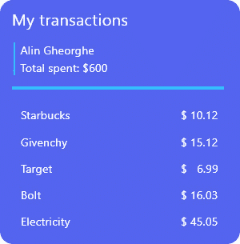

图 3.1 - 显示我们交易的卡组件

因此，我们的朋友设计了这个很酷的卡片，并要求我们在移动应用程序中实现它。很简单，对吧？我们已经看到如何通过使用 JSX 代码从上到下编写所有内容；除此之外，这张卡上有很多文本，这使得事情对我们来说更容易。你甚至可能认为我们不需要任何自定义组件，或者我们可能只需要一个。

嗯，这并不完全正确。这是我们的 React 知识发光的时刻，它帮助我们将一切划分为组件，使代码更容易、更清晰。但问题仍然存在...你如何知道在哪里画矩形，我们如何划分组件？React 推荐的一种技术是**单一责任原则**（**SRP**）。

提示

SRP 是一个编程原则，它规定我们编写的程序中的每个类都应该对程序功能的一个部分负责。这是**SOLID**的一部分，它是软件工程师创建更易于维护、灵活和可理解的代码的五个设计原则的首字母缩写。

使用这个原则，我们现在应该能够将卡分成组件。让我们拿这张卡，并为我们遇到的每个组件在上面画一个矩形，如下所示：

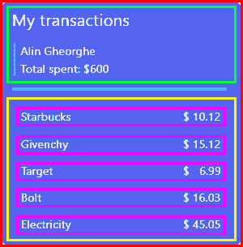

图 3.2 - 绘制矩形以划分组件

因此，我们提取了以下组件：

+   `TransactionCard`（*红色*）- 包含整个卡和所有元素

+   `TransactionCardHeader`（*绿色*）- 代表卡的上半部分，即名称和总花费的部分

+   `TransactionCardList`（*黄色*）- 包含项目列表

+   `TransactionItem`（*粉色*）- 显示交易和价格的单个项目

正如你所看到的，我们成功地将这张卡分成了四个不同的组件，它们将不得不以某种方式相互交流，并最终具有显示有关我们交易的信息的这一目的。

它们每个都只有一个单一的目的，这样就可以检查我们一直在谈论的 SRP。让我们编写它，暂时不要样式 - 我们将在下一章中进行。始终先构建静态版本。

首先，我们需要明白，我们可以开始开发一个应用程序的最简单方法是构建静态页面，然后分离一切并构建逻辑。为此，我们将基本上复制我们在图像中看到的一切，甚至文本 - 这就是为什么我们称其为静态版本。

让我们从打开终端，转到我们项目的文件夹，并输入以下命令来创建一个新项目：

```jsx
expo init TransactionCard
```

我选择了`TransactionCard`作为我的项目名称，但不要忘记你可以随意命名它。接下来，我们将选择空白的托管工作流模板，并等待它开始初始化我们的项目。一旦完成，让我们打开我们的**集成开发环境**（**IDE**）/文本编辑器，并查看项目。

我将打开`App.js`并删除`StatusBar`导入（对于这个练习来说并不重要），以及我们`App`函数中`View`组件内的所有内容。

让我们决定我们需要哪些类型的组件。很容易看到，这张卡只需要一个`View`组件和一个`Text`组件。幸运的是，我们已经在文件中导入了它们，所以让我们使用它们来构建卡的静态版本。

我们将从我们的设计开始，尝试将一切划分为容器。正如我们所看到的，这张卡片有两部分：上半部分是带有一般信息的标题，下半部分则充满了我们最近的所有交易。

所以，让我们写一下那些部分的代码，但首先，我们将专注于我们卡片的上半部分，如下所示：

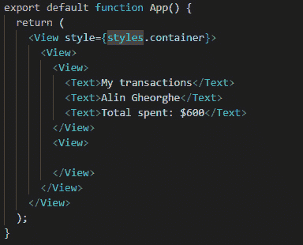

图 3.3 - 我们卡片的上半部分

我们在这里看到了很多`View`组件，但为什么呢？正如我们在上一章中讨论的那样，`View`组件通常用于布局设计和将元素分组在一起。所以，我们将这两部分放在其中，然后为标题编写代码。如果我们保存并打开我们的模拟器，我们应该能够看到我们刚刚写的文本。

重要提示

不要忘记，如果你使用的是安卓模拟器，你首先需要打开安卓工作室，然后转到**安卓虚拟设备**（**AVD**）管理器。运行你的模拟器，然后从 Expo 仪表板启动应用程序。

现在让我们考虑一下我们的交易。我们有两段文本 - 左边是我们购买商品的公司名称，右边是交易的价格。我们该如何做呢？到目前为止，我们看到的元素总是以从上到下的列式样式对齐在屏幕上。

嗯，我们需要为此进行样式设置，但这里的重要一点是，我们需要理解这两个组件在某种程度上是相互连接的，所以我们必须将这些元素放在同一个`View`组件中。

现在让我们这样做，准备好我们的组件来写所有这些交易。首先，试着自己做一下，然后看看你是否得到了和我一样的代码。

我将为每一行创建一个不同的`View`组件，然后在其中添加文本，就像这样：

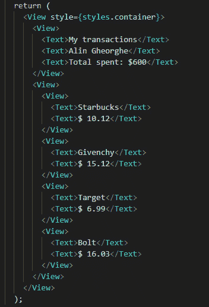

图 3.4 - 静态代码的其余部分

让我们打开我们的应用程序，看看一切的样子。现在，它只是一堆文本，以列的形式显示我们设计中的所有信息。不过，它看起来并不像一张卡片，但我们肯定可以看到与我们的设计相似之处，即以相同的顺序包含相同的信息。因此，我们现在创建了我们卡片的最基本版本。

下一步是最终将这棵大树分解成更小的组件。通过这样做，我们将使代码更易于阅读和理解，同时也更模块化，这基本上意味着我们可以在不同的卡片或其他需要时使用相同的组件。

## 分解我们的代码

所以，记得我们已经将设计分成了四个不同的组件吗？让我们创建一个`components`文件夹，并为每个组件创建四个不同的文件，如下所示：

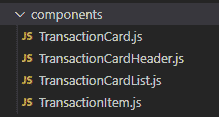

图 3.5 – 我们的文件夹中所有文件的创建

现在，是时候开始编写每一个了。所以，我们知道大卡片——或者第一个组件——应该能够分成两部分，`List`和`Header`组件。让我们将`App.js`中的所有代码复制到`TransactionCard`中，因为这是主要组件。所有的代码，我指的是只有在第一个`View`组件内的代码。

创建完我们的函数后，我们将所有的代码粘贴到其中。让我们导出组件并查看它，如下所示：

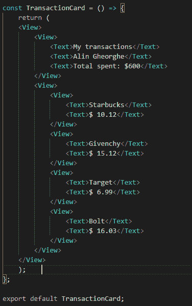

图 3.6 – 以箭头函数形式编写的 TransactionCard 组件

我们将这个组件写成箭头函数，因为这样写起来更容易——至少在我看来是这样的——但老实说，如果你愿意，你甚至可以将其写成类。作为一个经验法则，通常只有在涉及状态时才使用`class`，但状态是我们需要在后面的章节中更深入地讨论的东西。

所以，我们在这里有所有的代码，并且我们已经导出了我们的函数。一切顺利——现在，下一步是更深入地划分我们的组件。让我们将组件的头部部分移到它特定的文件中。

在我们将代码复制到`TransactionCardHeader`组件后，让我们将该组件导入到`TransactionCard`组件中，并在其中使用它，而不是复制的代码。我们应该对我们卡片的第二部分做同样的事情，也就是`TransactionCardList`组件。让我们这样做，看看一切是什么样子。这是结果：

s

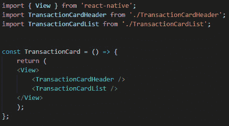

图 3.7 – 我们新创建的 TransactionCard 组件

好的 - 这看起来干净多了。如果我们将这个组件导入到我们的`App.js`文件中，一切应该看起来和我们在开始对代码进行所有这些更改之前一样。

提示

不要忘记我们总是需要运行`import React from 'react';`，这样我们才能使用我们所有的组件。组件需要知道它是一个组件，而不仅仅是文件中的随机写入。这个导入帮助我们的代码识别哪些对象是 React 对象，以及如何渲染一切。

一切都正常，对吧？如果你遇到任何问题，在继续之前停顿 2 秒钟，检查我们到目前为止所做的一切；也许你拼错了什么，或者在你的文件中忘记了一些导出。

如果一切正常，让我们进入我们的`TransactionItem`组件。嗯，顾名思义，这是一个单独的项目，那是什么意思？正如我们在`TransactionCardList`组件中所看到的，我们确实有几个不同的项目。我们要为每一个创建一个不同的组件吗？

实际上不是 - 我们实际上要创建一个单一的组件，根据接收的任何信息来改变显示的信息。听起来很酷，对吧？嗯，这个输入被称为 prop，每个组件在渲染时默认会得到一组 props，但它也可以接收我们创建的自定义 props。让我们深入了解 props，并学习如何在我们的卡片上下文中使用它们。

# Props 及如何使用它们

那么，props 到底是什么？到目前为止，我们只使用普通标签来标识我们的组件，比如`TransactionCardHeader`。然而，正如我们之前展示不同组件时所看到的，这些组件也可以有**props**，用于从更大的组件（**父组件**）传递信息到更小的组件（**子组件**）。

让我们进入`TransactionCardList`并查看我们的代码。据我们所见，就组件的使用而言，有很多重复的代码。因此，我们可以看到这种模式从我们主要的`<View />`标签中出现：

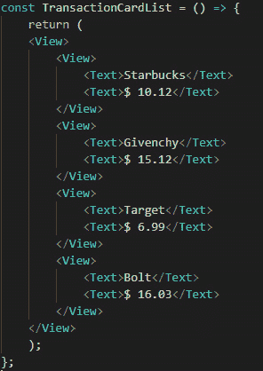

图 3.8 - TransactionCardList 组件准备分解为更小的组件

这个模式很容易看出来——我们有四个完全相同的代码片段，但里面写着不同的信息。基本上我们有四个`View`组件的实例，里面有两个`Text`组件。看到这种重复，我们可以清楚地意识到我们可以为这种特定情况编写一个外部组件。

让我们从在`TransactionItem`组件内编写一个静态组件开始，看看我们如何在列表中实现它。

随便写一个这种模式的片段；我们只需要一个——否则，我们会有点违背单个项目的目的。代码应该是这样的：

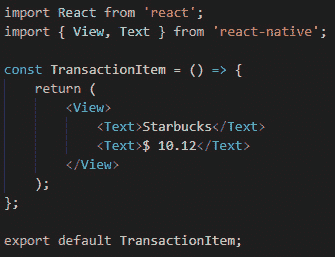

图 3.9 – TransactionItem 的静态版本

现在，让我们使用这个组件来代替我们在列表中使用的所有模式片段。导入文件并用四到五个`TransactionItem`的实例替换所有内容后，我们可以看到数据现在在所有地方都是`Starbucks`和`$ 10.12`。像疯狂重复一样并不是一个伟大的移动应用程序设计，对吧？

那么，我们如何改变这种情况？我们如何让组件显示不同的信息？通过使用 props。让我改变`TransactionItem`组件，并看看 props 需要如何实现。代码应该是这样的：

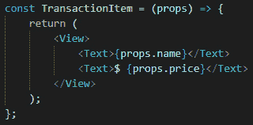

图 3.10 – 将 props 实现到我们的组件中

现在，你的`TransactionCardList`组件包含多个`TransactionItem`的实例。如果你现在保存，除了`$`符号外，这些组件上什么都不显示。为什么呢？

这一切发生是因为我们的组件在这些变量中没有存储任何东西。为了实际在屏幕上显示一些信息，我们需要从`TransactionCardList`向`TransactionItem`组件发送一些信息。让我们进入其中，并使用我们新更新的组件来在手机上显示正确的信息。

在`TransactionCardList`组件中，找到我们的组件，并为每个组件添加以下 props，就像这样：

```jsx
<TransactionItem name={"Starbucks"} price={10.12} />
```

在我们为所有组件添加了 props 之后，下一步是保存。我们将看到我们的模拟器会自动刷新——恭喜！我们成功地从一个**父**组件向我们的**子**组件发送了信息。

提示

从一个组件发送到另一个组件的所有信息都将正式地放在花括号内，就像我们通过为价格 prop 编写数字所看到的那样。即使字符串仍然可以放在花括号内，但它们对于发送信息并不是强制的，所以你甚至可以写`name="Mircea"`。

现在，让我们试着稍微了解一下我们的代码。那么，我们的应用程序内部到底发生了什么？

当应用程序首次运行时，它直接转到`App.js`并开始首先在那里编写的所有组件。对于这一点，那将是我们的`TransactionCard`组件。

React 看到我们的组件实际上有两个不同的组件在其中，并开始渲染下一个组件。现在，其中一个组件实际上是我们的`TransactionCardList`组件，其中包含所有我们的`TransactionItem`组件。

因为第一个组件包含另一个组件，我们将第一个称为**父**，第二个称为第一个的**子**。所以，如果`TransactionItem`是`TransactionCardList`的**子**，试着想一想`TransactionCard`是`TransactionCardHeader`的什么。准备好了吗？`TransactionCard`是`TransactionCardHeader`的**父**，因为它包含了另一个组件。

现在，当 React 到达`TransactionCardList`时，它将通过**props**向每个`TransactionItem`组件发送一些信息。被发送的信息是一个看起来像这样的 JavaScript 对象：`{name: 'Starbucks', price=10.12}`。

这就是为什么我们可以在`TransactionItem`中将 props 作为函数的参数使用，然后通过点来访问我们对象的键，就像这样：`props.name`。你一定想知道 React 如何知道如何处理所有这些过程，因为一个更复杂的应用程序可能有数百个组件嵌套在一起，同时在第一次渲染时向彼此发送 props。

问题是，React 首先渲染表面上的所有内容，当所有信息从一个父组件发送到子组件时，它才会渲染该信息。

现在，为了使我们的组件更加可用和可重用，我们必须使列表中的项目数量更加可变。对于更大的应用程序，我们必须问自己这样的问题："如果用户进行的交易数量比五个更多或更少会怎么样？"; "如果我将来需要更多的卡片，但设计相同，我该如何重用这个卡片组件？"

## 使用 map 函数动态更改组件的数量。

首先，让我们看看如何输出尽可能多的`TransactionItem`组件。我们将进入`TransactionCardList`组件，并在函数外创建一个名为`transactions`的对象常量数组。这个变量将包含所有项目所需的信息。让我们看看这是什么样子，如下所示：

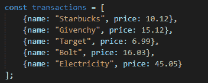

图 3.11 - transactions 变量

一旦我们拥有了包含所有所需信息的这个变量，我们就可以对数组进行**映射**，并为每个项目输出一个不同的组件。如果你对 JavaScript 不太熟悉，这可能听起来有点混乱，但相信我，这其实非常简单。让我们删除`<View />`组件内的所有内容，并用`map`函数替换，如下所示：

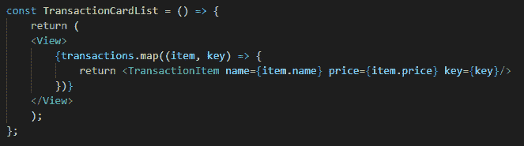

图 3.12 - 在 TransactionCardList 组件内部使用的 map 函数

好了，这可能看起来有点奇怪。别担心，其实很简单。所以，我们在`transactions`数组上使用了`map`函数。这个`map`函数遍历数组的每个元素，并使用其参数内的函数来输出*某些东西*。这个东西就是你要做的，利用这个很酷的函数。

重要提示

在 JSX 内部使用的所有外部代码**必须**放在花括号之间，以便 React 能够理解我们正在进行的操作可能会导致其他元素被输出以进行渲染。

基本上，由于`map`函数，我们正在取数组的第一个项目 - `{name: "Starbucks", price: 10.12}` - 输出一个`TransactionItem`组件，并将我们数组中的值作为 props 传递。但我们还看到了**key prop**，我们都知道我们在组件内部并没有使用 key prop。每个子元素都需要一个 key，以便 React 可以跟踪它们并避免过度重新渲染。这是我们在使用这样的列表时需要理解的 React 规则之一。

但我们说过我们会更进一步，对吧？如果需要，我们需要多次使用这个卡片组件。看到`transactions`只是一个随机变量坐在我们的`TransactionCardList`组件中，也许我们可以将其作为一个**prop**发送？

让我们在我们函数的参数中添加`props`关键字，并从`transactions.map`更改为`props.transactions.map`。如果我们现在保存，我们会得到一个错误 - 我们的组件期望一个名为`transactions`的属性进来，但没有任何东西发送它。

我们必须从我们的父组件 - 即`TransactionCard`发送这个。但尽管如此，这并不真正改变我们仍然无法正确使用这张卡片的事实，所以也许我们需要将这个属性添加到我们的`TransactionCard`组件甚至。

让我们复制我们的`transactions`变量并将其移动到我们的`App.js`文件中。之后，让我们将`transactions`属性添加到我们的`TransactionCard`组件中，就像这样：`<TransactionCard transactions={transactions} />.`

现在，我们需要去我们的`TransactionCard`组件，并使其能够接受这个属性，并将其进一步发送到我们的`TransactionCardList`组件。我们的组件现在需要看起来像这样：

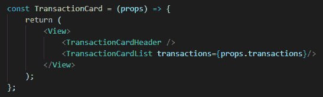

图 3.13 - 我们新创建的 TransactionCard 组件的版本

所以，我们一直从`App.js`文件发送这些信息，一直到我们的`TransactionItem`组件，最终显示这些信息。这对我们有什么帮助？嗯，现在，我们可以有多个具有不同交易的此卡片实例，或者甚至可以根据我们现在在`App.js`文件中声明的常量来增加或减少交易的数量。我们可以完全使用不同的变量；我们可以有一个名为`biggerTransactions`的不同数组，并将其传递给另一个组件。也许这个组件将显示你做过的最大交易。

这里重要的是，我们现在根本不需要触碰我们的卡片组件，而且我们仍然可以在显示不同信息的同时使用它。这比为我们需要的每一条信息创建不同的文件要容易得多，或者也许有一天你需要改变特定的信息，你开始浏览每个文件寻找那个特定的东西。现在你不必这样做 - 只需进入你的主文件并从那里更改所有信息。

让我们做一些作业。你会在我们的 GitHub 存储库的`第三章`文件夹中找到答案。一直在我们的卡上使用相同的名称可能会变得无聊。通过允许自己使用同一张卡组件的多个实例，但用于不同的用户，可以使这变得更容易。完成后，去检查代码并将其与我的进行比较。看看你是否做了同样的事情！

# 总结

在本章中，我们更深入地了解了 React Native。我们学到了许多关于道具和 SRP 等新概念。我们应该能够开始思考使用基于道具的 React 方法论，甚至稍后使用状态。但理解所有这些对你成为真正的 React Native 开发人员是一个很大的进步。

关于道具的处理方式以及我们如何利用 React 的组件这一特殊功能来使代码更具可重用性和更清晰，你应该感到更加舒适。代码永远不会太干净，但同时要记住，有时候并不需要多层道具。也许你的组件只需要一层，或者根本不需要道具。只有在觉得这可能会让你的工作更容易时才使用这个功能。

我们还第一次创建了一个列表，并学会了列表的每个项目都需要一个键，有时甚至可以是我们数组的索引，但总会向我们的每个项目发送一个唯一的键。

在本章结束时，我们完成了一点作业，并对下一章充满了希望，届时我们将终于创建我们的第一个小应用程序来展示给朋友们看。
