# 第四章：你的第一个跨平台应用

我们开始学习如何建立 React Native 开发环境。之后，我们继续学习 JSX、组件和属性。我们已经学到了很多，应该对未来有足够的信心。但如果你仍然觉得有些东西缺失，那么你是对的。我们还没有进行样式设计，也还没有构建一个真正的屏幕。

本章将围绕我之前想到的一个应用点子展开，该应用不断跟踪你的游戏历史。我们不会开始讨论服务器和数据库，因为它们超出了我们的学习范围，特别是因为我们有更重要的事情要学习。我们将从详细介绍我们应用的所有信息开始，同时使用我们在前几章学到的一切。

之后，我们将开始创建应用的静态版本，以便你了解在创建应用之前你的大脑需要如何思考。在前几章学到的所有原则将帮助我们更容易地理解我们的第一个真正的任务，所以如果有任何你仍然不确定的地方，回到前几章，看看你觉得哪些地方可以改进。

下一步是学习样式设计。我们将深入了解样式设计以及它在 React Native 中的工作原理。我们将了解 flex 是什么，以及如何在应用中使用它，同时找出我们可以使用的技巧，使开发更容易。

在为应用添加样式之后，我们将重构我们的代码，同时保持我们迄今为止构建的一切。这就是 Galio 将会发挥作用的地方，帮助我们意识到拥有已构建的组件是多么有用。我们将学习如何使用最重要的组件之一来构建布局，而不必担心为我们的容器创建不同的样式。

之后，我们将在手机上安装应用。这是一个单屏应用，所以我们只会用手机进行测试。我们还将学习一些基本技巧，以确保我们的应用在所有屏幕尺寸上运行顺畅。

一切看起来都很简单和容易，对吧？让我们直接开始构建我们的应用。本章将涵盖以下主题：

+   构建我们的第一个应用

+   创建你的第一个屏幕

+   让我们为它添加样式！

+   超级英雄，Galio

+   让我们在手机上安装它

# 技术要求

您可以通过访问 GitHub [`github.com/PacktPublishing/Lightning-Fast-Mobile-App-Development-with-Galio`](https://github.com/PacktPublishing/Lightning-Fast-Mobile-App-Development-with-Galio) 查看本章的代码。您会发现一个名为`Chapter 04`的文件夹，其中包含本章中编写的所有代码。要使用该项目，请按照`README.md`文件中的说明进行操作。

# 构建我们的第一个应用程序

让我们开始讨论我们应用程序的主要思想以及我们将如何开始构建它。我们将称此应用程序为 MGA，这是 My Gaming History 的缩写。相当聪明，对吧？它只会有一个屏幕，并且将作为用户登录后的欢迎屏幕。我们假装用户已经登录到我们的应用程序中，因此我们只会编写主屏幕，而不会考虑授权，这是一个更高级的概念。

通过清楚地了解我们的屏幕需要看起来像什么，并描述我们组件的目的，我们正在为我们的开发建立一条清晰的道路。最后，如果我们没有做好所有这些准备工作，我们在编程过程中会遇到困难，我们不希望发生这种情况。

我们应该从设计开始，确定其主要目的，以及如何开始将屏幕分成组件：

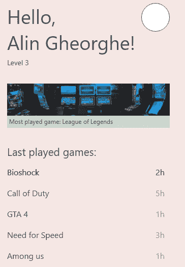

图 4.1 - 我的游戏历史主屏幕

看起来不错，对吧？好吧，应该是的，因为这一次，我们将完全实现屏幕上的所有内容，甚至包括颜色和元素定位。毕竟，这是我们第一个完全创建的屏幕。

让我们试着考虑如何将所有内容分成更小的部分，这是 UI 创建中最重要的步骤之一。请记住，这是强制性的，因为如果我们只是试图在脑海中编写所有内容，而没有任何策略，我们将会遇到一些问题。

我们将使用方块来轻松识别屏幕上的每个元素，让我们来看一下：

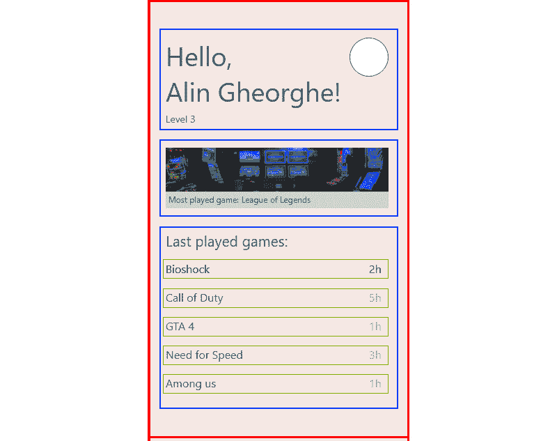

图 4.2 - 组件划分

我在这里将整个屏幕分成了几个部分，并进行了颜色编码，以便您更好地看到它们：

+   主页（红色）：我们的容器组件，也称为我们的屏幕。

+   欢迎页（蓝色）：这将包含有关用户的所有基本信息，例如他们的姓名、级别和个人资料图片。

+   **MostPlayedGame**（*蓝色*）：这将是一个容器，将接收关于最常玩的游戏以及图片的信息。

+   **LastPlayedGameList**（*蓝色*）：这包含一个项目列表。

+   **PlayedGameItem**（*绿色*）：这是显示最常玩的游戏和每个游戏所花费的时间的单个项目。

正如我们所看到的，我们在三个不同的组件中使用了相同的颜色。为什么呢？因为这三个组件在我们的主要更大的名为`Home`的组件中同样重要。它们都位于我们的组件树中的同一级别。即使`Home`组件是一个屏幕，它的定义方式与组件相同，当我们开始编码时，你会明白我的意思。

现在我们已经分割了我们的组件，准备继续并开始编写我们的应用程序。

# 创建你的第一个屏幕

一旦开发计划完成，我们知道每个组件需要放在哪里，以及我们的应用程序将会是什么样子，我们就可以创建一个新项目了。这个项目将为我们成为 React-Native 开发者的创造之路奠定第一块基石。

让我们开始创建一个新项目：

1.  进入你喜欢的目录中的终端，并运行以下命令：

```jsx
expo init mga
```

1.  选择*托管工作流*的空白模板，并打开项目文件夹。

1.  正如我们之前提到的，我们将有五个不同的组件，其中一个将是屏幕本身。所以，让我们创建两个不同的目录，分别叫做`screens`和`components`。这样在有多个不同的屏幕时，更容易组织起来。

在开始编码时，始终在脑海中有一个基本结构是一个好的经验法则，因为你永远不知道何时可能想要为你的应用程序添加更多内容。

1.  在我们的`screens`文件夹中，让我们创建一个名为`Home.js`的文件。这将是我们的主屏幕，所以我们将开始编写组件的最基本代码。这只是一个功能组件的样板。还记得它们是如何创建的吗？我们在*第二章*中做过，*React Native 的基础*。现在，试着自己做一遍，一旦你成功做到了，就回到这里来：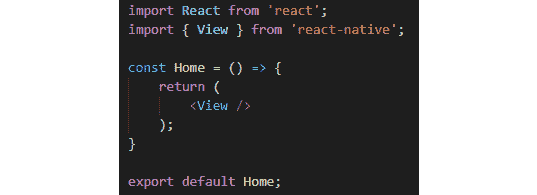

图 4.3 - 基本的主屏幕，除了一个视图组件外没有任何内容要渲染

1.  完成后，我们必须转到我们的主文件`App.js`。

在这里，我们将从主文件中删除所有不必要的内容。我们不需要所有的样式，也不需要`StatusBar`导入，甚至不需要从 React Native 导入的任何组件。

1.  删除所有内容后，我们可以在`React`导入之后立即导入我们的组件，并将其放入我们的主`App`函数中。

所以，我们的新组件现在应该看起来像这样：

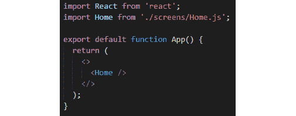

图 4.4-删除所有不必要代码后的 App.js 文件

你可能会想，“嗯，那个奇怪的`<>`语法是什么意思？”。那是**Fragment**的简短语法，这是 React 的一个特性。这样做是为了不向你的组件树添加更多不必要的节点。我们可以使用`<View />`组件，就像我们在之前的例子中看到的那样，但是通过使用**Fragment**，我们创建了一个包装器，而不是一个不必要的包装组件，因为我们不会在我们的主文件中进行任何样式设置。

如果这仍然造成一些问题，你可以很容易地将你的`<Home />`组件包装到一个`<View />`组件中。

现在我们在这里，让我们看看我们的`components`文件夹，并创建我们将要使用的所有必要文件。

1.  创建四个新文件，分别命名为`WelcomeHeader.js`、`MostPlayedGame.js`、`LastPlayedGameList.js`和`PlayedGameItem.js`。

1.  让我们对我们新创建的每个文件都做与`Home.js`相同的事情。你甚至可以从`Home.js`文件中复制代码，然后粘贴到每个文件中；只是不要忘记将名称从**Home**改为你的组件名称。

现在我们已经初始化了所有的文件，我们准备开始进行代码移植。我们应该能够看到这些组件与上一章的组件之间的某些相似之处。几乎是一样的东西，所以你应该对我们如何继续有一个想法。

我们将从`WelcomeHeader.js`开始，然后查看我们的每个文件。如果你现在启动你的应用程序，你会看到一个空白的白屏。我们暂时忽略这一点，只是用一些基本的静态代码来勾勒我们的应用程序，这样当我们开始样式化时，就有一定的基础。

打开你的文件，这样我们就可以开始添加一些新元素。我们从设计中可以观察到什么，我们可能需要在我们的组件内部？嗯，首先，有很多**文本**，但我们还需要一个**个人资料图片**（在组件右侧的圆圈）。知道了这些，我们现在可以开始导入所需的组件，所以继续编辑我们导入`View`组件的第二行，使其看起来像这样：

```jsx
import { View, Text, Image } from 'react-native';
```

还记得我们说过如果它们在同一行上，我们应该将组件分组吗？当我们开始样式化时，这将使事情变得更容易，因为这些组件在同一水平线上。

所以，我首先在我们的主`View`组件内添加了另一个`View`。之后，我将添加坐在同一行上的组件：我们的欢迎*消息*和我们的*个人资料图片*。在这个`View`组件下面，我们将添加另一个`Text`组件，它将呈现我们的`Level`：

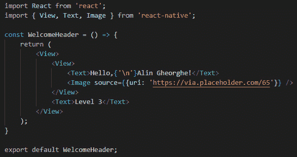

图 4.5 – 我们的 WelcomeHeader 的静态版本

在*第二章*，*React Native 的基础*中，我们讨论了`Image`需要一个源来工作。这就是为什么我们使用了`source`属性并传递了一个占位图像链接。使用占位符更容易，因为我们不需要浪费时间搜索图像，当我们的主要目的只是编写一个静态版本时。

让我们继续并开始编写我们的下一个组件：`MostPlayedGame`。正如我们在之前的组件中所看到的，我们在这里需要与之前的组件相同的东西。所以，让我们导入一切并在我们的组件内使用它。一旦你做到了，我们将使用我们的组件来显示所有信息。现在，你的代码应该是这样的：

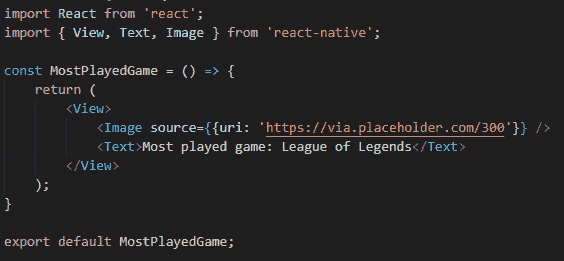

图 4.6 – 我们的 MostPlayedGame 的静态版本

我在我们的占位链接中写了`300`而不是`75`，因为这会改变图像的宽度。但除此之外，这很容易理解。

在这一点上，我们会注意到一些非常有趣的事情。我们有一个遵循我们习惯的相同模式的列表。这是一个项目列表，每个项目都呈现了我们玩过的游戏以及我们玩了多少。我们可以复制我们以前使用的相同模式，它将工作得非常好：

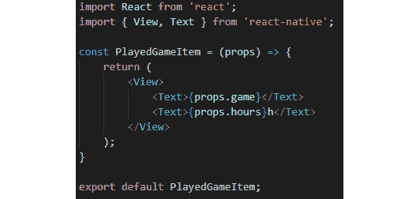

图 4.7 – PlayedGameItem 组件

我相信你还记得如何从父组件传递`props`到子组件是多么容易。如果我们已经知道某些组件应该如何编码，我们就不应该浪费任何时间。现在，是时候创建列表了，就像上次一样，但现在，我们在其中有另一个元素，一个`Text`组件作为我们组件的标题：

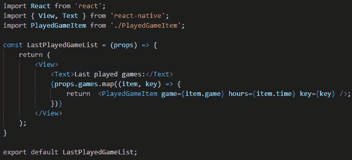

图 4.8 – 我们完成的 LastPlayedGameList 组件

我们走得很快，但那是因为我们已经经历过这个，所以你应该明白这里发生了什么。我们代码目前的问题是我们没有向我们的项目发送任何信息。我们没有`map`函数需要运行的数组。正如你所看到的，数组来自`props`，所以我们的`LastPlayedGameList`组件期望一个名为`games`的**prop**，带有一个数组，这样它就可以开始渲染我们的游戏列表了。

让我们进入我们的**Home**屏幕组件并设置一切。首先，我们将开始导入屏幕所需的所有组件。我们只需要这四个组件中的三个，因为其中一个是`PlayedGameItem`，它已经被我们的`LastPlayedGameList`组件使用和渲染。导入它们很容易，如下所示：

```jsx
import WelcomeHeader from '../components/WelcomeHeader';
import MostPlayedGame from '../components/MostPlayedGame';
import LastPlayedGameList from '../components/LastPlayedGameList';
```

在导入我们需要的一切之后，是时候将组件放置在它们将出现在屏幕上的顺序中，放在我们的主`View`标签内：

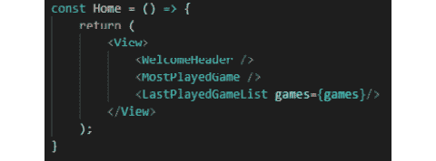

图 4.9 – 我们的 Home 组件与其中的其他组件

正如你所看到的，我已经传递了我们需要的`games`数组给我们的列表，在我们的组件之上。让我们创建一个数组，这样我们就有东西可以传递给我们的`LastPlayedGameList`。

首先，自己尝试一下 - 记住我们需要一个带有`game`和`time`键的**对象数组**。一旦你自己尝试了这个，回到这里看看下面的代码：

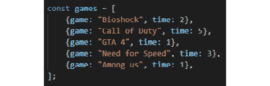

图 4.10 – 游戏对象准备发送到我们的列表组件

这并不难，对吧？在这里，我们编写了整个静态屏幕。我相当肯定，如果您回到模拟器，应该能够看到屏幕上弹出了一些东西。如果没有任何错误，那么我们应该可以继续。如果您在屏幕上遇到任何错误，或者仍然看不到任何东西，请尝试重新阅读一切，并确保您没有漏掉任何单词。我会说，70% 的错误是在开发阶段抛出的，因为我们通常会在变量中漏掉一些字符（不要引用我，这只是个人经验）。JavaScript 作为一种**弱类型语言**，意味着您不必指定变量中将存储什么类型的信息，因此我们不必像**Java**或**C#**开发人员那样担心错误地定义变量，但与此同时，变量在任何地方使用时都需要具有相同的名称。

现在，让我们开始让它变得漂亮起来。

# 让我们来设置样式吧！

在我们开始为应用程序设置样式之前，我们应该了解 React Native 中的样式工作原理。如果您之前有 React 的经验，您会知道样式是通过 CSS 完成的。然而，在 React Native 中，我们不能使用 CSS，所以一切都是通过 StyleSheet 完成的。

StyleSheet 是由 React Native 团队创建的。在这里，您有类似 CSS 的规则，但一切都是通过 JavaScript 完成的。

当将这些样式对象传递给我们的组件时，我们通过一个名为 `style` 的属性来进行。让我们首先直接为我们的**Home**屏幕创建一些样式。

我们可以通过两种方式将这些对象传递给我们的组件 - 我们可以直接在组件中编写它们，或者通过一个新的 StyleSheet 实例传递它们。让我们在行内编写，并为屏幕更改我们的背景颜色。通过转到我们的 `Home.js` 文件，我们可以为包裹其余组件的 `<View />` 组件添加 `style` 属性：

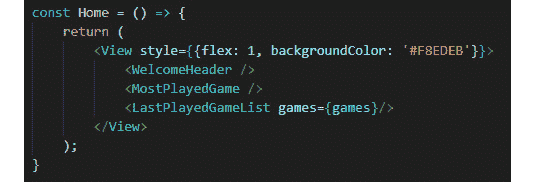

图 4.11 - 为我们的组件添加行内样式

在添加这个并保存文件后，您应该能够看到整个背景颜色如何改变为该十六进制颜色。现在，我们的背景颜色与设计图像的相同。这很酷，对吧？这也很容易阅读，因为本质上这就是 CSS，只是写法有点不同。

如果我们要编写 CSS，我们会说，例如，`background-color: 'red'`，但因为在 React Native 中一切都是 JavaScript，我们无法用破折号在字符之间写变量或对象键，所以我们使用驼峰命名法。

但是关于内联样式存在一个问题；我们可能会有成千上万种样式，在这种情况下，我们会忘记一些东西在哪里，或者如何在我们的应用程序中更改某些东西。这就是为什么我们应该尝试使用更清晰的方式来编写样式。

让我们删除我们的内联样式，并通过在`View`旁边添加`StyleSheet`来更改导入，就像这样：

```jsx
import { View, StyleSheet } from 'react-native';
```

现在我们已经导入了`StyleSheet`，我们准备创建一些样式。为此，我们将使用`.create()`方法。这个方法将返回一个带有所有必要样式信息的对象：

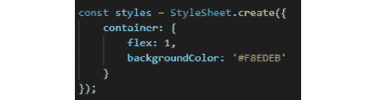

图 4.12 - 样式对象

现在，我们可以回到我们的`<View />`组件，并通过使用`style={styles.container}`将样式注入到我们的样式属性中。现在，一切应该看起来和我们内联样式时一样。我建议使用`.create()`方法来添加样式，因为它更清晰，更容易阅读。

现在，你可能会对`flex`有一些疑问。我的意思是，你在那里看到了它，但你还没有意识到那个属性到底在做什么。这些问题应该延伸到“我能通过以驼峰命名法编写所有 CSS 规则来在 React Native 中使用吗？”

问题是 CSS 有两种布局选项：**网格**和**flexbox**。虽然你无法在 React Native 中使用网格，但整个布局都是基于 flexbox 的，所以你可以使用所有 flexbox 的规则。

你几乎可以以某种形式轻松地使用 CSS 中的所有规则。如果有一些你觉得在驼峰命名法中写不起作用的东西，那就去谷歌一下这个规则。你很容易找到如何使用几乎每一个规则。

`flex: 1`规则意味着“*让* `<View />` *组件尽可能占据尽可能多的空间*”，所以我们的**主页**现在是屏幕的全宽和全高。

让我们向我们的容器对象添加一些新规则：

1.  添加`paddingHorizontal: 32`和`paddingVertical: 64`。这将为我们创建一些美丽的呼吸空间，以便我们继续为我们的组件添加样式。

让我们从我们的`WelcomeHeader`组件开始。

1.  我们将首先将`StyleSheet`添加到我们的导入列表中，然后创建`styles`对象。

1.  之后，我们将创建`upperSide`，`profilePicture`，`welcomeText`和`levelText`样式。

1.  我们仍然看不到我们的图片，所以让我们给它一个`宽度`和`高度`为`55`。为了使它变成圆形，我们将给它一个`borderRadius`为`55/2`。

1.  现在，我们将通过`style`属性向我们的图片添加`profilePicture`样式。

1.  对于我们的`welcomeText`和`levelText`，我们需要指定`fontSize`和颜色，所以让我们继续做。我会用`38`作为`welcomeText`的字体大小，`18`作为`levelText`的字体大小。文本的颜色将设置为`'#707070'`。

我们将继续添加规则，直到我们的`WelcomeHeader`组件看起来像我们设计案例中的样子。一开始你可以自己试试。一旦你做到了，看看下面的代码，看看你是否得到了与我这里类似的东西：

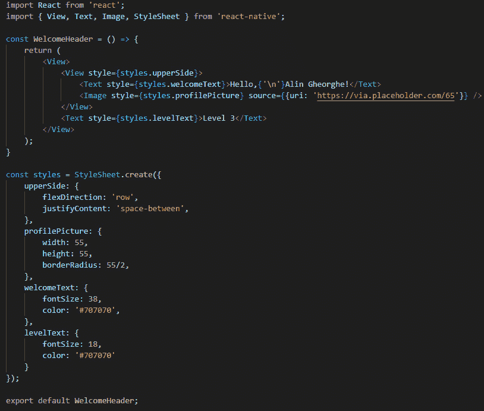

图 4.13 – 我们完全样式化的 WelcomeHeader 组件

有了这个，我们成功地为我们的`WelcomeHeader`组件添加了样式。我使用`justifyContent`将图像和文本推向相反的方向，我还指定了`flexDirection`，因为默认情况下，所有组件都以列的方式呈现。然而，对于这个特定的例子，我们需要一行。

我们不会在这里进一步查看样式规则，因为你可能需要通过练习自己去发现它们。所以，我现在最好的建议就是继续前进，创造一些东西。从你每天使用的应用程序中获得灵感，并创建一些外观类似于你选择的东西的组件。尽量重现尽可能多的组件，并看看哪些对你有视觉吸引力。过一段时间，这将成为你的第二天性。

如果你记不住某个规则，或者无法想出某种方式来以某种方式对某个东西进行样式设置，不要沮丧。事实上，大多数程序员都会忘记，他们中的大多数人会在 Google 上查找非常基本的东西。你现在最重要的事情不是因为某些事情不起作用而感到沮丧，而是把它看作一种挑战——这将百分之百地提高你作为开发者的能力。

我们将停止样式部分，因为我们已经为一个组件做了，我觉得我可以向你展示一些可能会改变你对样式的看法的东西。这是我们从现在开始创建应用程序时将开始使用的东西：加里奥。

# 超级英雄，加里奥

我们在本书开头谈到了 Galio。我们讨论了为什么要使用它，以及它如何为您的应用程序带来价值。现在，是时候使用它，看看这个 UI 库到底是什么。

现在，我们需要为我们使用的每个元素编写不同的样式对象。Galio 可以通过使用`props`来解决这个问题，这将帮助您在开发应用程序时为您的代码添加样式。

让我们从安装 Galio 到我们的应用程序开始。为此，我们需要打开我们的终端并运行以下命令：

```jsx
npm i galio-framework
```

这将安装最新可用版本的 Galio 到我们的项目中。现在我们已经安装了 Galio，让我们从中导入一些组件到我们的`WelcomeHeader`组件中。

让我们去我们的`import`部分并写下以下内容：

```jsx
import { Block, Text } from 'galio-framework';
```

如果你已经写下并保存了你的文件，那么会出现一个错误。那是因为我们从`react-native`和`galio-framework`都导入了`Text`。从`react-native`中删除它，一切应该再次正常工作。

哦，好吧，什么都没有改变。这是因为 Galio 的`Text`组件只是扩展了您通常的`Text`组件。但是，它附带了新的 props，可以让我们删除某些样式。

让我们删除我们两个`Text`元素上的`style`属性，并改为添加`color="#707070"`。现在，我们的文本很小，但它们是相同的颜色，这很酷。这意味着我们的 props 正常工作。如果我们想要改变字体大小，我们只需添加一个 prop。对于我们的第一个`Text`元素，我们将添加`h3`，代表*标题 3*，而对于我们的第二个`Text`元素，我们将添加`p`，代表*段落*。

现在，如果我们点击保存，我们会看到我们的**文本**元素突然有了不同的大小，一切看起来都很好。我们现在可以删除未使用的样式对象；也就是`welcomeText`和`levelText`。

让我们继续看看是否可以删除更多。我们应该用`Block`组件替换包裹我们的`Text`和`Image`元素的`<View />`组件。

现在，让我们向我们新实现的`Block`元素添加以下 props：`row`和`space="between"`。因此，我们可以从我们的`styles`对象中删除`upperSide`对象。现在，一切看起来都一样，但代码更少，更容易注意到。

`Block`组件与`View`组件相同，但它包含了许多可以简化我们开发过程的 props。

一旦我们替换了它，让我们也替换另一个`View`元素。我们还将从导入中删除它，因为我们不再需要它：

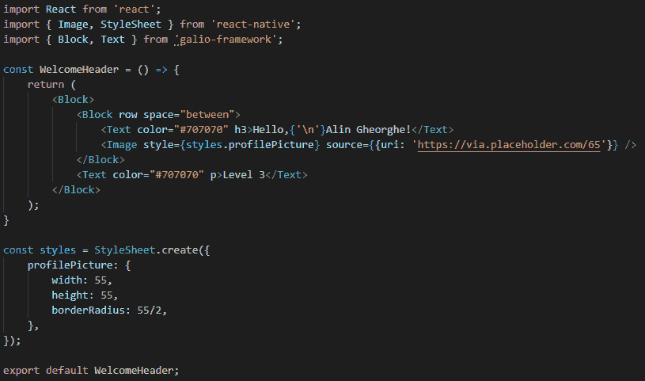

图 4.14–我们的 WelcomeHeader 组件，其中包含了新实现的 Galio 元素

我们现在了解了 Galio 的工作原理，我们将看到它将如何帮助我们继续开发这个应用。所以，让我们继续开始修改其余的组件。

让我们进入我们的`MostPlayedGame`组件，并开始从 Galio 中导入我们需要的任何内容。同样，我们需要使用`Block`和`Text`。在导入这两个组件之后，我们可以从`react-native`中删除`View`和`Text`的导入，因为我们不再需要它们。但是在替换`View`元素之前，不要立即保存，我们需要将函数内部的`View`元素替换为`Block`元素，就像之前一样。现在，您可以继续保存文件，您将看不到任何更改。这很完美–我们现在可以开始为这个组件设置样式了。

让我们继续为我们的`Text`组件添加以下 props：`size={15}`和`color="#707070"`。这将改变我们文本的字体大小和颜色。

现在，我们需要从`react-native`中导入`StyleSheet`并使用它来为`Image`设置样式，以便它可以在我们的屏幕上呈现。我们将使用`StyleSheet.create`方法创建一个新的`styles`对象，并在其中放置`image`对象。

之后，我们还将添加一个`container`对象，以便我们可以在组件之间创建一些空间。这将在我们的`Block`元素中使用。

我们的新`styles`对象应该看起来像这样，并具有以下值：

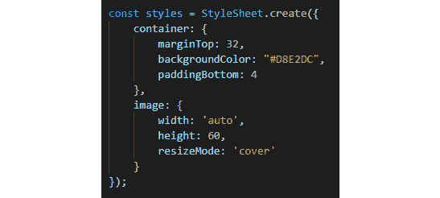

图 4.15–用于我们的 MostPlayedGame 组件的样式

在写下所有这些并将我们的`styles.container`和`styles.image`对象链接到正确的元素（`Block`元素和`Image`元素）之后，我们可以看到我们的屏幕开始越来越像我们在本章开头看到的设计。

顺便说一句，我在我们的容器样式中添加了 4px 的`paddingBottom`，只是因为我觉得我们的`Text`元素需要一些呼吸空间。我们也可以为`Text`创建一个新的样式，并在周围创建一些填充。写样式没有*正确的方法*，只要它的目的，也就是显示你想要显示的内容，得到尊重，那么尽情地玩耍和尝试吧。

不要忘记，我们通过`style`属性将样式链接到每个元素。

噢，好吧 - 我想随着我们已经经历了这么多，使用 Galio 和样式变得更容易了，所以我会休息一下，让你来为其余的组件添加样式。一旦你完成了，回到这本书上来，看看我们是否采取了相同的路径，通过比较你的结果和我的结果。也许你的看起来甚至比我的更好，同时代码更清晰，如果是这样的话，你今晚应该奖励自己。

你完成了吗？很好 - 让我们继续吧！让我们跳到我们的`LastPlayedGameList`组件。这应该很简单，所以让我们从`galio-framework`中导入我们的`Block`和`Text`组件，同时完全删除我们从`react-native`中的导入。没错 - 我们不再需要那些了。

然后，我们将把`View`元素改为`Block`元素。在这里，让我们也添加一些内联样式；即`style={{ marginTop: 32 }}`。我们添加了这个来在组件之间创建更多的空间。

现在，让我们去我们的`Text`组件，并添加`color="#707070"`和`size={18}`属性。就这样，我们完成了。我们创建了这个组件非常快，对吧？嗯，样式并不难，特别是当涉及到 Galio 时。

让我们继续我们的最后一个组件，`PlayedGameItem`。这个将和前一个一样。我们将从`galio-framework`中移除`react-native`的导入，同时添加`Block`和`Text`的导入。

现在，让我们用我们的新`Block`元素替换`View`元素，并为其添加`row`，`space="between"`和`style={{ marginTop: 16}}`属性。之后，我们将为我们的两个`Text`元素添加`color="#707070"`和`size={14}`属性：

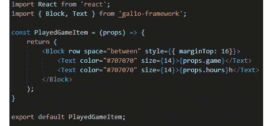

图 4.16 - 在添加 Galio 和样式后，我们的全新组件

有了这个，我们就完成了。保存你的文件，看看你的模拟器。它看起来就像我们想要的样子。在继续之前，花点时间为屏幕增添更多特色。将图片更改为你想要看到的任何图片 - 也许添加一个个人资料图片和你最喜欢的游戏的图片。

还记得我们是如何使用 props 将信息从**父组件**传递到**子组件**的吗？你可以做同样的事情，改变我们的`WelcomeHeader`中的名字，甚至可以更模块化，将所有信息从**Home**屏幕发送到你的组件中。

现在我们已经完成了对我们的应用进行样式设置，让我们看看如何在我们的手机上使用它。

# 让我们在手机上安装它

我们在*第一章*中讨论了为什么 Expo 很棒，*React Native 和 Galio 的介绍*，我认为 Expo 的人们在创建这个框架时做得很好。智能手机的问题在于你不能很容易地在手机上安装应用。

Android 比 iOS 更开放，你可能可以将一个`.apk`文件导出到你的手机上。然而，iOS 不允许你这样做。

当然，我们可以使用**TestFlight**，这是苹果的一个服务，允许你与其他测试人员测试和分享你的应用。但这对我们没有帮助，因为谁会在他们的手机上安装 TestFlight 来看你的一个屏幕应用，特别是当你需要一个苹果开发者账号时？

Expo 为我们提供了一个名为**Expo Go**的小应用。你可以在**App Store**和**Google Play Store**上找到它。下载并登录，或者如果你还没有账号的话就创建一个新账号。在这里，你可以为你的项目创建一个构建，以便以后测试。通过这样做，我们可以向朋友展示我们的应用，而不用太担心其他障碍。

在 Expo 上发布项目很容易；我们只需要按照一些步骤。让我们通过进入终端并按下*Ctrl* + *C*来关闭我们的开发服务器；然后，输入`expo signin`并按*Enter*。会出现一条消息，要求你输入用户名和密码。如果你还没有账号，就跳转到 Expo 的网站上创建一个。在输入用户名和密码后，你应该会得到以下回应：**成功。你现在以 YOUR-USERNAME 的身份登录**。

现在，如果我们想要使用 Expo 发布我们的应用程序，有两个选项可供我们使用。我们将在接下来的章节中讨论它们，因为错误可能随时发生。如果遇到错误，最好尝试另一种方法。

## 通过 Expo 开发者工具发布

现在您已经登录，让我们通过在终端中输入`expo start`并按下*Enter*来再次打开我们的服务器。

开发服务器已启动，并且应该在您的浏览器中加载一个包含 Expo 开发者工具的新选项卡。请记住，在*第一章*中，*介绍 React Native 和 Galio*，我们展示了所有可用的选项；让我们点击**发布或重新发布项目到互联网**：

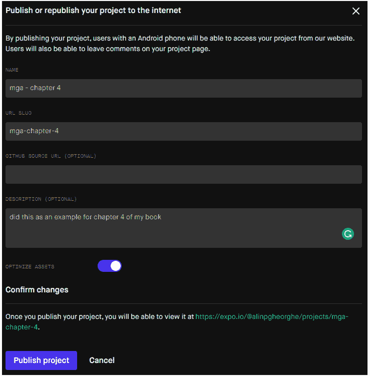

图 4.17 - 单击发布按钮时显示的所有信息

现在，您的应用程序应该已经发布，这意味着您可以在手机上的 Expo Go 应用程序中打开您的应用程序。看？很容易！继续向朋友们展示吧！

## 通过 Expo CLI 发布

现在，第一种选项可能不适用于您，或者您遇到了错误的可能性。有时，错误就会发生，甚至可能不是您的错。在这种情况下，停止我们的开发服务器，并在终端中输入`expo publish`命令。将会出现一条大消息，说明它将开始捆绑您的应用程序并准备发布。过一会儿，您将看到它已成功发布到 Expo。

现在，您的应用程序已经准备好向世界展示了。嗯，有点。您可以登录到 Expo Go 应用程序，然后在个人资料选项卡下的已发布项目类别中查看您的应用程序。问题是……来自互联网的其他人可能会在 Expo 网站上看到它，并在他们的计算机上下载它，但您的朋友们无法在他们的手机上下载该应用程序。这是因为我们还没有在官方商店上发布该应用程序。它甚至不在商店上 - 它保存在云端供其他 Expo 用户查看，当然，您随时都可以访问它。

恭喜！我们终于创建了我们的第一个完整屏幕。我希望您感觉良好，因为还有更多的知识将使开发变得更容易，更有趣！

# 摘要

在本章中，我们经历了为我们的应用程序创建屏幕的过程。我们拿到了一个设计文件，看了一下，然后重新设计了没有功能的设计。这对任何人的职业生涯来说都是一个很大的进步，因为这是你第一次完成一个应用想法。我认为你应该给自己鼓掌，并意识到你在这里所做的并不容易。很多人甚至不会尝试开始学习这个，但你做到了。而且，你甚至创建了一个完全样式化的屏幕。

一旦我们了解了样式，Galio 就出现了。我们学会了如何使用 Galio 构建布局，这让我们的工作变得更容易。我们仍然没有完全摆脱样式的部分，但我们永远不可能不给东西加上样式。毕竟，样式是有趣的。通过使用 Galio，我们看到了如何轻松地排列元素并创建快速原型。

在本章末尾，我们看了两种不同的发布应用想法到 Expo Go 的方法，这是一个移动应用程序，可以帮助我们在不实际推送到商店的情况下玩我们的项目。这很酷，我敢打赌你的朋友和家人会因为看到你取得的进展而感到非常高兴。

现在，是时候进入下一章了，我们将讨论使用 Galio 的好处。
