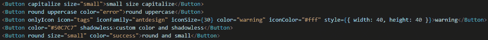
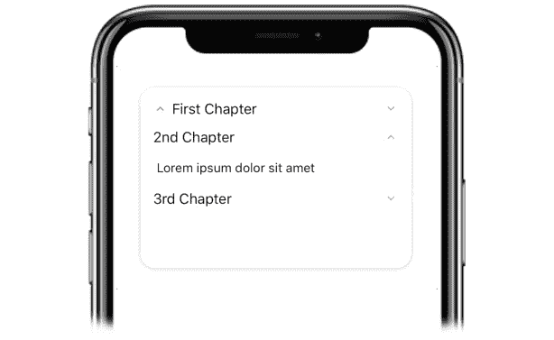
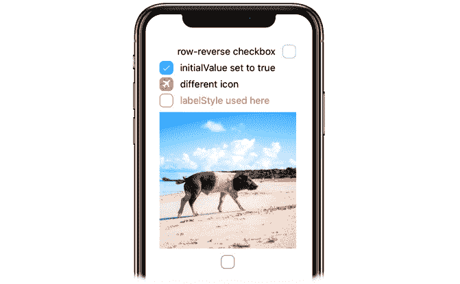
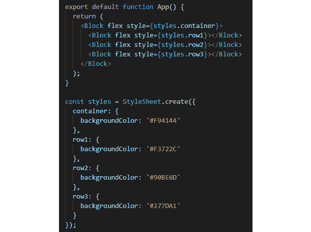
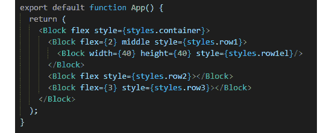
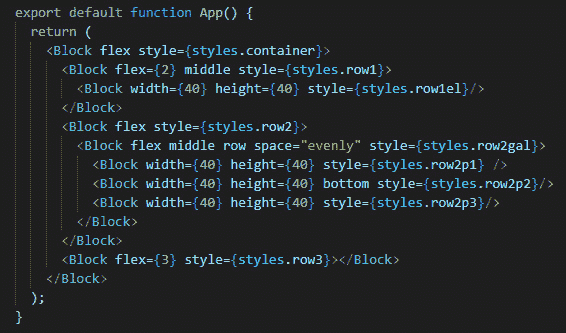
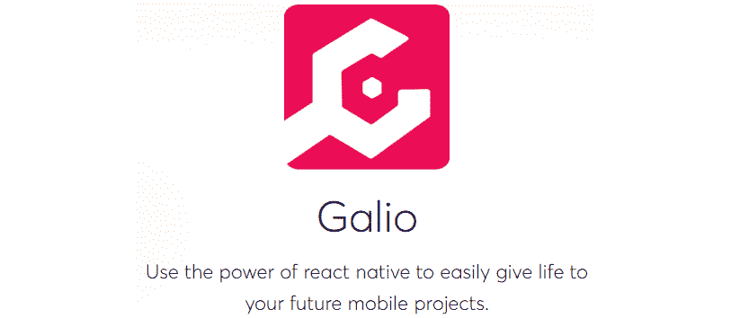

# 第五章：为什么选择 Galio？

在上一章中，我们创建了我们的第一个屏幕。在用普通的 React Native 代码创建它之后，我们继续导入了一些 Galio 组件，这些组件帮助我们以更加简单和轻松的方式进行样式和布局的创建。

本章将更好地介绍 Galio。我们将学习如何使用它，以及为什么大多数程序员寻找类似 Galio 这样的用户界面（UI）解决方案来解决他们大部分的开发过程。正如我们在上一章中看到的，仅仅使用核心的`react-native`组件意味着代码变得非常庞大且难以维护。Galio 组件打包了许多不同的属性，使生活变得更加轻松。

我们还将了解使用开源库的好处，以及如何创建一个愿意互相帮助的人群社区，以及你如何可以根据自己的意愿为库增加价值。

这次对话将打开许多你以前从未想到的新大门。它将创造一种新的心态，扩展你对开发者真正是什么以及他们如何交流的视野。

在本章中，我们将涵盖以下主题：

+   使用 Galio 进行美丽的移动应用开发

+   在你的应用中使用 Galio

+   发现 Galio 的好处

在本章结束时，你应该能够理解人们为什么选择 Galio 来快速开始他们的项目。你将了解如何安装它并在你的应用中使用它，以及某些组件在你的应用中扮演的角色。了解某些组件肯定是有帮助的，但不要躲避——所有程序员都使用 Google 来发现他们的问题的解决方案，我强烈鼓励你在需要进一步解释或在时间过程中发生变化的情况下也这样做。

# 技术要求

你可以通过访问 GitHub 上的[`github.com/PacktPublishing/Lightning-Fast-Mobile-App-Development-with-Galio`](https://github.com/PacktPublishing/Lightning-Fast-Mobile-App-Development-with-Galio)来查看本章的代码。你会发现一个名为`Chapter 05`的文件夹，其中包含了本章中我们编写的所有代码。为了使用该项目，请按照`README.md`文件中的说明进行操作。

# 使用 Galio 进行美丽的移动应用开发

我们有很多移动应用程序的例子，它们看起来并不真的好看。许多不同的社交媒体应用程序都是由随机的人创建的，他们认为他们会像 Facebook 一样大获成功。我发现大多数这些应用程序的最常见问题是设计问题，除了你总是会在初学者开发的应用程序中发现的错误。

布局很快就创建好了，他们并没有注意到他们的设计可能会因为**用户体验**（**UX**）而受到影响。他们认为只要他们有一个好主意，就不需要注意其他任何事情。

我不同意。我真诚地相信只要设计时尚，用户体验一流，你就可以销售任何东西。我之所以这样认为，主要是因为我通常使用*1 分钟规则*。这是我为自己创建的一些个人规则。基本上，一旦我安装了一个应用程序，我只需要大约一分钟的时间来尝试看看这个特定应用程序发生了什么。

为什么要等一分钟呢？嗯，我们使用移动应用程序是因为我们希望事情变得快速和易于使用。我们总是在寻找移动应用程序的替代方案，因为我们希望更轻松和更快速地访问我们的网络相关活动。我们希望能够查看一些信息，甚至可能做一些活动。如果我在 1 分钟内无法弄清楚如何使用你的应用程序，那么我会卸载它。

这对我们应该如何构建我们的应用程序有什么影响？我们应该时刻考虑用户，并且只使用足够的信息，让他们不必考虑如何使用我们的应用程序。

Galio 很方便，因为它使用相同的流程——简单，快速和直接。你不必太在意按钮应该有多宽，或者你的应用程序中像素大小应该是多少。它预先装载了你设计和制作最佳想法所需的所有工具。

让我们先看看按钮的外观和我们为它们提供的许多不同样式。我们几乎在应用程序的任何情况下都会使用按钮，所以我觉得这将是一个很好的开始。看一下以下的截图：

![图 5.1 – 应用程序中显示的按钮

]

图 5.1 – 应用程序中显示的按钮

正如你所看到的，我们有很多不同的方式来显示按钮，从明亮的颜色和阴影到无阴影和简单。你可以有方形，甚至——直截了当地——只是一个圆圈和一个图标。

让我们看看这在我们的应用程序中如何轻松实现。这是图 5.1 中显示的按钮的代码：



图 5.2 - 图 5.1 中按钮的代码

因此，就我们所看到的，我们为所有事情都有 props。有些需要我们更多或更少的工作，但与此同时，只需从组件内部编辑一切的便利性每次都是值得的。只是因为我们想要将按钮大写并使其始终大写，我们可以使用`capitalize` prop。或者也许我们希望文本始终是大写的；那没问题——我们也有一个 prop。这真的使得开发过程变得非常容易，任何人都可以轻松使用。

我们已经讨论过应用程序应该对我们的用户看起来和感觉良好。但这也应该转化到我们的开发过程中。这就是为什么我真诚地相信，清晰而美丽的代码几乎总是等于一个美丽的产品。

现在，让我们来看看 Galio 包中另一个很酷的组件——`Accordion`。你永远不知道何时需要一个外观漂亮的手风琴来为你的内容创建更多的空间。你可以在这里看到它的表示：



图 5.3 - 手机屏幕上显示的手风琴组件

这个组件非常容易使用。它需要一个具有指定高度的`View`（或`Block`）组件和定义组件内部内容的对象数组。以下是与此组件相关的代码：

```jsx
<Accordion dataArray={data} />
```

这基本上对于任何人来说都应该很容易配置和在需要时使用。数组内的对象必须具有特定的键，以便我们的组件可以识别和理解在哪里放置内容。对象可能看起来像这样：

```jsx
{title: "2nd Chapter", content: "Lorem ipsum dolor sit amet"}
```

看起来并不那么难，对吧？如果我们想使用一个图标，就像我们在创建第一个项目时看到的那样（在*第一章**，React Native 和 Galio 简介*），我们所要做的就是在对象内添加`icon`键，其中将包含我们想要使用的指定图标的`name`、`family`和`size`值。

这基本上是 Galio 所有组件的构建方式。它们直截了当，外观良好，可以立即用于在几秒钟内创建新应用程序。

在继续之前，我们应该查看另一个组件，看看使用 Galio 自定义和使用复选框有多容易。看一下以下截图：



图 5.4 - 复选框组件在您的屏幕上显示

如果要使用核心 React Native 组件创建这个布局，看起来会很复杂，但我们很幸运，因为 Galio 使它变得如此简单，只需写一行代码，如下所示：

```jsx
<Checkbox color="primary" flexDirection="row-reverse" label="row-reverse checkbox" />
<Checkbox color="info" initialValue={true} label="initialValue set to true" />
<Checkbox color="error" initialValue={true} label="different icon" iconFamily="font-awesome" iconName="plane" />
<Checkbox color="warning" labelStyle={{ color: '#FF9C09' }} label="labelStyle used here" />
<Checkbox color="success" image="https://images.unsplash.com/photo-1569780655478-ecffea4c165c?ixlib=rb-1.2.1" flexDirection="column-reverse"/>
```

正如我们所看到的，我们可以在我们的组件内设置颜色、方向，甚至图标。它们在没有任何修改的情况下写入和显示都很美丽。这让我们为我们的库感到自豪，因为我们真的为它的外观感到自豪。

现在，让我们看看使用`Block`组件创建基本布局有多容易。我们将仅在布局设计中使用此组件，并为每个方块着色，以便更好地理解每个元素实际显示的内容。

# 在您的应用程序中使用 Galio

现在，让我们看看 Galio 的实际效果。Galio 最大的特点之一是我们的`Block`组件，它基本上是一个带有超能力的`View`组件。为什么说是超能力呢？我们可以轻松使用此组件来创建布局，并且只需使用 props 就可以轻松地为所有内容设置样式。

因此，让我们付诸行动，看看使用`Block`组件创建基本布局有多容易。我将逐步向您展示使用`Block`的最常见方式，并演示布局的最常见排列方式。您可以在我们的 GitHub 存储库中找到该项目，或者可以跟着我一起编码。

我将从创建一个新的 Expo 项目开始。之后，我将通过命令行安装 Galio，写入以下代码：

```jsx
npm i galio-framework
```

现在我们已经安装了所有内容，我将跳过整个组织文件的过程，因为我们只是用于演示目的。因此，我们将直接将代码编写到我们的`App.js`文件中，即我们的入口点 - `App`函数中。

我们将通过`import`函数在其他导入项下导入我们的`Block`组件，就像这样：

```jsx
import { Block } from 'galio-framework';
```

我将删除`App`函数内的所有内容，然后开始创建我的第一个`Block`组件。这将用于将所有元素放在内部，因为我们知道，在函数中我们不能返回多个组件，所以总之，一个组件将必须将其他组件封装在内部。

我们将在其中使用`flex`属性，这将使我们的`Block`具有`flex: 1`的属性，以便它可以水平和垂直拉伸，覆盖整个屏幕。

现在我们完成了这一点，让我们使用`style`属性。正如我们所说，每个`Block`元素都将具有`backgroundColor`属性，以便我们可以更容易地识别哪个是哪个。在我们的`style`属性内，我们将写`styles.container`。

请记住，在下面有一个`styles`对象，其中包含我们可以通过`StyleSheet.create`函数使用的所有样式。我们将删除容器内的所有内容，只写`backgroundColor: '#F94144'`。

保存一下，现在，我们的屏幕应该是一种红色。有趣的是，这种颜色叫做**红色莎莎**。

现在一切都正常运行，让我们继续开始创建我们的盒子布局，看看使用`Block`组件在我们的应用程序中排列元素有多容易。

顺便说一句，您还应该删除不必要的导入，比如`StatusBar`，`Text`和`View`。

我们现在将在主`Block`组件内创建三个`Blocks`。正如我们所知，React Native 中的所有组件都是从上到下排列的，所以我们基本上要创建三行`Blocks`。

这些行中的每一个都将在它们上面使用`style`属性，从上到下的顺序，样式将被称为`styles.row1`，`styles.row2`和`styles.row3`。现在，我们将进入我们的`styles`对象并创建`row1`，`row2`和`row3`样式。它们每个都只有一个属性，那就是`backgroundColor`，值的顺序从`row1`到`row3`，就像这样：`#F3722C`，`#90BE6D`，`#277DA1`。

现在，如果我们保存，我们将看不到任何东西。那是因为我们的`Block`元素没有设置大小，所以它不知道需要占用多少空间。还记得我们上次做的吗？我们使用了`flex`，所以让我们在所有三个组件上使用`flex`属性，如下所示：



图 5.5-我们用来创建三行的代码

点击**保存**，突然间我们从上到下看到了三种颜色：橙色，绿色和蓝色；更确切地说：橙红色，开心果色和 CG 蓝色。

由于使用`flex`属性时应用了`flex: 1`属性，每个组件在主`Block`组件内获得了相等的空间。现在，关于这个`flex`属性的酷炫之处在于我们可以使用它来设置我们需要的空间量。

让我们继续，对于第一行，我们将把它设置为`flex={2}`；对于第二行，我们将保持原样；对于第三行，我们将把它设置为`flex={3}`。现在，我们可以看到每个框都分配了不同的空间。这都归功于 React Native 使用**flex 系统**来创建布局；我们只是利用了 Galio 与之搭配使用的便利性。

现在，让我们看看当我们将所有这些数字设置为`flex`属性时它是如何进行计算的。因为我们将第二个保持原样，当渲染时它将被转换为`flex={1}`。我们将对三个 flex 进行计算，得到以下结果：`2+1+3 = 5`。所以，简而言之，我们可以说*第一行是五份中的两份*，*第二行是一份*，*第三行是三份*。这里使用的数字是特定于我们的应用程序，但你可能有不同的数字。主要的想法是要理解这些数字正在分配它们所拥有的空间——一个更大的数字给我们更多的空间，而一个更小的数字给我们更少的空间。

现在，让我们使用第一行来放置另一组`Block`组件并使用更多的属性。是的——我们确实有很多属性可以与之搭配使用。

我们先只输入一个组件，并创建一个名为`row1el`的样式。将该样式应用到我们的新`Block`上，并使用`#577590`颜色。嗯，是的——什么都没有显示出来，但让我们使用两个更多的属性来让它显示出来。我们将写`width={50}`和`height={50}`。这将以像素为单位设置我们的`Block`组件的宽度和高度。

让我们通过在父组件上使用`middle`属性来使这个元素居中。父组件是我们的第一行。现在你可以看到，我们深蓝色的`block`元素位于第一行的中间：



图 5.6 – 我们的代码中包含最新的元素

现在，对于第二行，让我们进入我们的`styles.row2`对象并添加填充。我们将添加`padding: 30`，我们可以观察到我们的第二行突然变得更高了。那是因为我们整个布局（三行）都是用 flex 构建的，它不是以像素为单位设置绝对大小；组件现在需要更多的空间。

在我们的第二行内，我们将创建另一个具有`flex`、`middle`和`style={styles.row2gal}`属性的`Block`。现在，对于我们的`row2gal`，我们将有`backgroundColor: '#F9844A'`。让我们在其中添加三个`Block`组件。它们每个将具有以下属性：`width={30}`、`height={30}`和`style`。样式将按顺序命名，从上到下依次为`row2p1`、`row2p2`和`row2p3`。按照我们的样式的确切顺序，对于每个样式，我们将设置`backgroundColor`属性为`'#4D908E'`、`'#43AA8B'`和`'#F94144'`。

现在，如果我们点击**保存**，我们会看到我们的`Blocks`被定位在一列中。让我们通过在父组件中使用`row`属性来解决这个问题。现在，我们把它们放在了一行中 - 这很酷，对吧？让我们也使用`middle`属性，以及`space="evenly"`。保存并查看效果。我们的元素现在居中，并且它们与父组件的左右边距之间有均匀的空间。

现在，让我们进入第二个`Block`并使用`bottom`属性。这将使第二个元素位于第一个和第三个元素下方。有点有趣 - 看起来像一张脸，对吧？看看你是否同意：



图 5.7 - 我们填充第二行后的代码

你可以看到仅使用`Block`就可以轻松创建基本布局。现在，在继续之前，你应该花些时间，而不是使用`bottom`，也许在另一个组件上使用`top`属性，看看它是如何工作的。或者，而不是使用`space="evenly"`，你可以使用`space="between"`或`space="around"`。

通过使用这些组件，我们实际上可以完全控制创意。最好的部分是你可以创建一个由`Blocks`组成的全屏幕，然后只需用你想要的组件填充每个`Block`元素。老实说，这些功能本身就足以让我开始喜欢 Galio。幸好我们还有更多功能。

现在我们已经在我们的应用程序中使用了一些 Galio 功能，让我们继续前进，看看 Galio 提供了哪些好处。

# 发现 Galio 的好处。

现在我们已经了解了使用 Galio 的几个好处，比如编写代码的便利性，它的美观程度，以及使用它创建布局的酷炫之处，我们准备看看使用它的其他好处，我觉得我们应该开始我们的旅程的最佳地点是 GitHub。

你可以在这里看到 Galio 的图标：



图 5.8 - 从 Galio 的登陆页面截取的屏幕截图

正如我所说的，我们很幸运有这样一个伟大的社区，总有人伸出援手帮助你。你也可以帮助其他人，我们总是鼓励这样做。我觉得 Galio 的社区可能最好地用“集体”这个词来定义。在音乐行业，这个词通常用来定义一群有着相似兴趣的人，他们一起合作，互相帮助，因为他们知道更多的人意味着更快更容易的发展。

让我们看看你可以如何帮助并成为这个社区的一部分。

首先，我们有 Discord 服务器，这是我们大多数开发者聚集讨论各种事情，包括错误和如何解决特定问题。这个地方基本上是一个大型的聊天室，每个人都在开心地交谈。

任何人都可以加入并提出问题，甚至报告错误或一些不起作用的东西。也许你觉得设计可以改进，想要给 Galio 和它的社区一个全新的外观。你可以在那里做到这一点，不用担心有人会嘲笑你或不认真对待你。

除了 Discord 服务器，我们还有 GitHub 存储库和网站。GitHub 存储库是我们保存所有与代码相关的东西的地方。这是我们维护代码、回答问题、为未来创建新的开发计划、为某些产品创建热修复，并与**pull requests**（**PRs**）一起工作的地方。

PR 是指当有人想要帮助一个库时。所以，他们首先创建一个**fork**，这是克隆某人的存储库的行为。然后，他们进行自己的修改，然后新的存储库副本被提交为**PR**。然后由管理员验证并根据代码是否符合规则以及是否符合开发计划的一部分来接受或拒绝。

我们的网站主要是我们想要展示人们的应用程序和有关 Galio 的新闻的地方。这是我们向世界展示 Galio 的地方，但也是我们保留整个库中非常重要的部分的地方：文档。

文档是您随时想要了解有关特定组件或如何使用 Galio 功能的更多信息的首选位置，例如……**GalioTheme**功能。

与 Galio 相关的所有内容，如颜色、大小和布局规则，都存储在我们的默认主题中。这可以在我们的库内部的`theme`文件夹中找到。每个组件都从该文件中继承其样式规则。最酷的是，您实际上可以使用我们的主题组件，仅重写您想要修改的内容来重写我们的主题文件。

例如，假设您想要为`primary`设置不同的颜色代码。您可以用自己的颜色覆盖我们的主色，并将其与 Galio 一起使用，就好像它一直存在一样。

要使用 GalioTheme 功能，您需要从我们的库中导入`theme`、`withGalio`和`GalioProvider`。让我们举个小例子：

```jsx
const customTheme = {
  SIZES: { BASE: 18, } 
  // this will overwrite the Galio SIZES BASE value 16
  COLORS: { PRIMARY: 'red', } 
  // this will overwrite the Galio COLORS PRIMARY color #B23AFC
};
 <GalioProvider theme={customTheme}>
  <YourComponent />
</GalioProvider>
```

这将创建一个包含两个键`SIZES`和`COLORS`的`customTheme`对象。如果您只想修改颜色，您可以只使用特定的键。然后，您需要使用我们的**高阶组件**（**HoC**）`GalioProvider`来封装您的组件。我们还需要通过`theme`属性将新的`customTheme`对象传递给 Galio。

提示

HoC 是一种高级的 React 功能，可以更容易地定义为返回一个组件并以某种方式改进该组件的函数。假设您是托尼·斯塔克，HoC 就是钢铁侠套装。套装由铁手套、靴子、盔甲和头盔组成，而穿上铁靴的托尼可以飞行。

现在，`customTheme`常量将覆盖默认的 Galio 主题常量。

但是等等——也许您不想改变我们的主题，而是想在样式中使用我们的常量。使用我们的设计系统可能有助于更快地设计布局，我们总是在为客户创建的不同产品中使用 Galio 的常量。

使用`withGalio`函数导出 React 组件使您的组件能够使用 Galio 的 React 上下文，并将主题作为属性或作为`styles`对象的参数传递给您的组件。让我们看看如何做到这一点——我相信您会理解的：

```jsx
const styles = theme => StyleSheet.create({
  container: {
    flex: 1,
    backgroundColor: theme.COLORS.FACEBOOK
  }
});
export default withGalio(App, styles);
```

因为我们使用`withGalio`函数来导出我们的组件，Galio 将向我们选择的对象（在本例中是`styles`）传递我们库中所有的常量主题变量。因此，我们能够在我们的`styles`对象内使用`theme`作为参数，并将`backgroundColor`属性更改为我们库中的 Facebook 颜色。

您可以在我们的文档网站上找到有关我们常量的所有信息的表格，网址为[`galio.io/docs`](https://galio.io/docs)。

正如你所看到的，Galio 充满了许多很酷的功能，将帮助我们极快地开发任何移动应用，并最终使其看起来非常漂亮。那么，为什么不试一试呢？我们将从现在开始使用 Galio 编写所有项目。这将成为本书中每个应用程序开始时的强制导入。我们将使用更多的 Galio 组件，而不是 React Native 的组件。

因此，我们将学会如何使用 Galio，如何设计出色的应用程序，直到我们能够开始编写自己的想法。也许我们中的某个人实际上会创建一个对社会有很大价值的伟大应用程序——这将改变世界。

梦想着我们掌握更多知识后能做多少事情真是件美好的事情。这种白日梦和对目标的持续关注将成为学习编码的最强大武器之一。

# 总结

在本章中，我们已经通过多个示例说明了 Galio 为何是如此出色的库。到最后，你一定已经意识到 Galio 真的应该成为你的库之一——一个库来统治它们所有。这将成为你的主要包，你将用它来创建令人惊叹的应用程序，无论是视觉上对我们的用户，还是对想要帮助我们编写代码的编程伙伴。

不要害怕查看 Galio 的核心代码。你可能会从体验和理解 Galio 的代码中学到很多东西。你甚至可能能够创建自己的库。

因此，我们发现 Galio 真的很酷，因为代码易于使用。我们只有一些可以改变整个世界的属性，无论是编码速度还是对特定参数的轻松访问。我们还看到了 Galio 开箱即用的优势。我的意思是...这个库很华丽。有时，我甚至不会编辑样式；我只会使用 Galio 样式，因为它们看起来很棒。

我们还看到使用`Block`组件创建布局有多么容易，以及只要我们了解与`Block`组件配套的一些属性，放置对象在屏幕上就比我们想象的要容易得多。

之后，我们讨论了 Galio 拥有一个多么伟大的社区，以及我们如何参与其中。虽然这超出了本书的范围，我们并没有深入研究 GitHub，但我们确实学到了很多关于这个社区的运作方式以及我们如何参与其中。

最后，我们讨论了 Galio 的一些更高级的功能，或者更准确地说，使用了 React 的更高级功能，因为如果我们想要从 Galio 中使用它们，它们真的很容易使用。

最后，我们可以说 Galio 为每个人进入移动开发世界创造了一条简单的途径，我想可以说我们都对它的存在表示感激。

接下来的章节将涵盖移动 UI 的基础知识。我们将学习如何为我们的应用构建一个清晰的 UI，同时学习一些关于如何为用户提供最佳用户体验的指导方针和规则。
