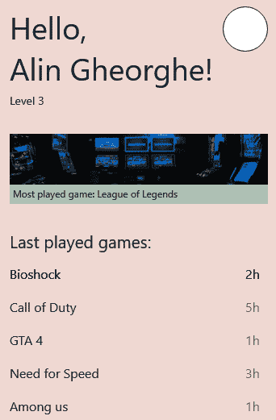
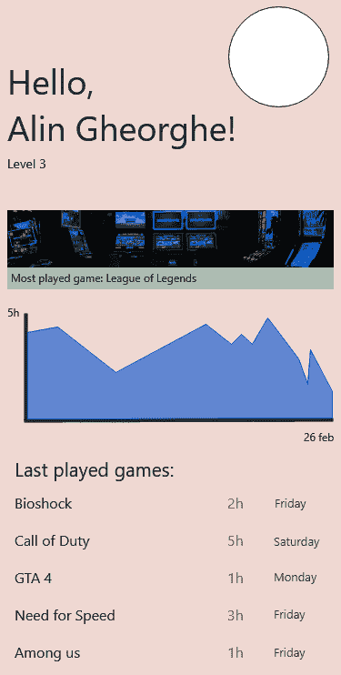

# 第六章：移动 UI 构建的基础知识

既然我们更了解 Galio 如何帮助我们构建跨平台移动应用程序，现在是时候学习一些关于设计的规则，以便我们可以最大限度地利用这个框架。

本章将浅显地介绍一些设计概念和准则，这些将帮助我们至少在设计技能上更有信心。我希望这一章能给你带来信心和动力，去构建/创建一个美观的用户界面（UI）。

我们将首先探讨清晰设计的重要性以及我们应该遵循的一些基本准则，以确保我们的设计尽可能清洁和简约，同时向用户提供最有用的信息。之后，我们将慢慢地进入对用户体验（UX）的基本解释，以及如何找出对我们的用户最好的内容。

一旦我们讨论完所有这些，我们将找出如何最小化用户输入，以便我们的用户不会感觉在填写表单时中途放弃。我们将讨论到到底是什么可能会阻碍我们的用户完成一个表单，以及我们如何改进我们的表单，以便完成率可能会增加。

之后，我们将看到整理我们的设计理念通常是确保我们的应用程序看起来整洁和良好的最佳方式。我们将发现如何做到这一点的准则以及创建呼吸空间的最合适方式。我们还将介绍我的创意过程，从第一次设计草稿到我认为值得实施的最终屏幕。

整理完毕后，是时候谈谈一致性了。我们将学习一致性在移动应用程序中的重要性以及原因。我们还将介绍三种不同 UI 设计工具的主要思想，这样你至少可以知道要研究什么，并形成自己对于原型设计自己应用程序的意见。

本章将涵盖以下主题：

+   探索清晰设计的重要性

+   最小化用户输入

+   为了更好地组织应用程序而进行整理。

+   保持应用程序的一致性

# 探索清晰设计的重要性

既然我们已经到了这一步，现在是时候学习一些关于如何为我们的应用程序创建一个好看设计的规则和准则了。现在，*美是主观的*，我们都知道，但有一些规则可能会在你的移动应用程序甚至你的网站内创造更好的流畅性。

我们并不是试图透过客观的镜头来审视美是什么，但美的某些方面与我们的大脑以及它的构造直接相关。例如，*颜色在不同文化中可能有不同的含义*，这没关系，因为我们不会去选择黄色而不是黑色。

与此同时，我们可以采用*三分法*，这是用于创建视觉艺术作品如电影、绘画或照片的经验法则。关于三分法的一点是，我们发现由于某种原因，当我们将屏幕分成两部分，水平和垂直各占三分之二后，我们的眼睛更加关注照片的主题当它位于两条线的交汇处。你可以现在就尝试一下。你的手机很可能已经在相机应用程序中内置了这个功能，所以试着拍一张主题在中心的照片，然后再拍一张主题在交汇线处的照片。

当然，这并不意味着我们所有的图片都必须遵循三分法，但在大多数情况下这会有所帮助。问题在于还有其他因素需要考虑，比如阴影、对比度、亮度等等。

解释这一切的整个目的是让你明白，设计的某些方面可以向我们的用户展现“美”的概念。

其中一个重要的方面实际上是清晰设计的重要性，以及它如何帮助我们直接传达移动应用程序的目的。我并不是在创造一个热爱极简主义的团体，但我确实觉得在当今时代，极简主义变得更加重要。在一个有如此多选择的世界中，用户喜欢信息直接，他们不想要在网站上滚动浏览大屏幕的信息和干扰，才能找到重点。

“设计不仅仅是外观和感觉。设计是如何运作的。”

- 史蒂夫·乔布斯

那么，拥有清晰的设计到底意味着什么呢？还记得那些在 2000 年代甚至 2010 年代充斥着不必要信息的网站吗，比如随机放置在屏幕右上角的时钟？人们不想看到你的应用或网站上挤满了……东西。他们实际上更喜欢更简约的方式，使其看起来更时尚、更酷，并避免让用户通过多个页面的废话来达到他们的目标，也许只是找出你的公司在哪里。

让我们实施一些规则，这样我们就不必处理那种噩梦般的应用程序。

## 基本要素

专注于基本要素使我们能够保持简洁和直截了当。我们可以通过限制视觉元素和菜单的数量来做到这一点。如果你考虑在你的移动应用中使用下拉菜单，最好现在就停止考虑，也许开始考虑如何将你的应用划分为适用于底部选项卡导航器之类的类别。

## 配色方案

让我们诚实点。我们都喜欢颜色！我们喜欢！它们很漂亮，每当我们和朋友一起出去玩或者只是一般地玩得开心时，我们总是在纠结该穿什么。那是因为并不是所有的颜色都能搭配在一起，有时如果你选择超过 10 种颜色，人们就不知道该把注意力放在哪里了。

网站和移动应用也是如此。我们应该将我们的颜色使用限制在三种颜色之内——当然，在必要时应用不同的色调——但是在我们的应用程序中只有三种主要颜色，我们可以创造一种连贯性。

假设一个屏幕有一个绿色的“提交”按钮。另一个屏幕有一个紫色的“提交”按钮。一旦用户看到这一点，他们会立刻想：“那是正确的按钮吗？”一旦你为某些事物的外观创建了规则，就要坚持下去！

## 可用性和可访问性

这实际上非常关键。你的移动应用设计必须能够在你的目标受众感兴趣的所有分发平台上运行。我实际上会说，现在，在今天的市场上，至少在 iOS 和 Android 上拥有你的产品是强制性的。

问题是，因为这些平台是以不同的方式构建的，并且具有不同的用户体验，你必须为每个平台适应你的产品。你做得越好，越多的人会喜欢使用你的应用。

此外，我们已经进入了 2021 年，因此您应该实现对屏幕阅读器的支持，例如 iOS 的**VoiceOver**或 Android 的**TalkBack**。这将使您对自己感觉更好，因为您不仅为每个人创造了更好的数字世界，而且通过为您的应用程序提供更广泛的受众，您将有更好的机会将您的想法发展成成功的想法。

## 简单

我无法再强调这一点了，但你需要专注于重要的事情。你不需要在一个屏幕上列出你的应用程序可以做的每一件事。尽量保持简短。没有人有时间真正阅读页面上的所有信息，因此尽可能少地提供信息，同时使其尽可能有意义，这是简单的关键。

## 信息架构

每个与您的应用程序交互的用户在首次使用您的应用程序时都会表现出预先构建的行为模式。研究您的竞争对手，并确保这种行为不会妨碍您制作应用程序的创意过程。例如，他们可能期望特定按钮，比如**开始**按钮在闪屏界面内，总是在屏幕底部。您的工作是确保您会利用这些行为，并且如果您想为用户创建某种新的 UX，花时间教他们如何使用您的应用程序。

## 一致性

确保您的设计和信息在整个应用程序中保持一致。通过保持一致，您可以确保您的用户永远不会出现不理解发生了什么或如何使用您的应用程序的时刻。通过保持一致，我们实际上教会了我们的用户使用我们的平台的最佳方式，而无需额外的乏味文本。

## 用户体验

您可能已经注意到了短语**用户体验**（**UX**），但我们并没有真正定义它。UX 指的是产品（网站或移动应用程序）如何满足用户的需求。

我们应该*区分 UX 和可用性*，因为后者是 UI 的质量属性，涵盖了系统学习的容易程度或使用的效率。

在设计移动 UX 设计时，我们可以牢记的一个好的经验法则是问自己以下问题：*移动应用程序有用吗？*

*如果没有，我们可以说对最终用户没有价值。*

*如果答案是肯定的，但不够直观，最终用户不会花时间去学习它。*

移动用户体验设计涵盖了三个重要方面：可访问性、可发现性和效率。这导致了快速、积极和以体验为驱动的最终结果。

*Net Solutions*的*2020 年 B2B 商务状况*报告指出*65.8%的企业将在未来 12 个月内投资于改善移动用户体验设计*。

基于这些数据，我们应该意识到用户体验是一门永无止境的科学。我们永远不会拥有完美的用户体验——随着用户的变化，这将会发生改变。随着时间的推移，我们可能会在使用手机时改变我们的行为，因此您的设计师需要为最终用户设计出一个出色的体验，以满足特定时间的特定用户的期望。

现在自然的问题应该是：*我们应该如何处理这个问题，以便我们始终能够为用户提供高质量的用户体验？*我认为，对于构建出色的用户体验，以下部分提到的方法将为您带来最佳结果。

#### 研究

花费多天时间与最终用户在一起。了解他们的需求，以及他们对目前工作方式的真实感受。倾听他们，因为他们的反馈是整个过程中最重要的部分之一。

例如，如果你看看家里年长的成员在使用应用时，你会注意到他们对应用的某些部分非常容易感到沮丧。观察他们，看看他们期望什么。他们可能会说类似于“为什么通过这个应用订购东西这么难？”然后紧张地随意在屏幕上点按，因为事情并不完全符合他们的期望。你周围的人，尤其是那些被应用所针对的人，可以为你提供最宝贵的信息。

#### 共情

与用户讨论并了解他们的需求后，就是找到解决方案的时候了。使用任何对你最有帮助的方法来整理这些想法，并尝试找到解决用户遇到的问题的方法。你需要注意，以免制造更多问题，所以在找到解决方案后要测试你的应用。

#### 构建

嗯，这是不言而喻的。一旦一切都经过测试，你已经找到了所有问题的解决方案，就该是构建应用的时候了。问题是……根据你的研究，你应该能够意识到你的应用真正需要哪些技术。有时，即使是 React Native 也不够用，所以你可能需要做一些改变。这是成为一名优秀程序员的一部分，所以不要担心！一旦你了解了一种编程语言和一个框架，你就可以学会任何东西。

现在我们已经经历了这一切，并且对为什么清晰的设计对我们的应用非常重要以及 UX 是如何运作有了一些了解，我们应该对为什么某些应用采用极简主义路线并为所有用户提供直接的学习路径有了相当清楚的想法。

现在，让我们讨论为什么最小化用户输入很重要，这是确保我们有清晰设计的另一个部分，以及我们如何做到这一点。

# 最小化用户输入

许多人在填写表单时都有所犹豫，特别是当表单很长，充满了涉及他们必须搜索实际文件并填写看似无关紧要的步骤的个人信息时。

了解这一点，我们有责任为我们的用户创建一个良好的表单，这样他们在填写时不会觉得这是一项琐事。任何表单的主要目标是**完成**。为此，我们首先需要了解有效表单的主要概念。这些内容在这里介绍：

+   **复杂性的感知**：每当我们面对一个表单时，我们首先要做的是视觉扫描，以便估计需要多少时间才能完成。了解这一点，我们几乎可以立即意识到复杂性的感知在完成表单中起着至关重要的作用。看起来越复杂，用户完成的可能性就越小。

+   **交互成本**：这是完成表单所需的所有努力的总和。用户付出的努力越多，他们完成的可能性就越小。想象一下一个有 bug 的表单，你无法添加你的出生日期，或者添加起来不直观。你可能会失去注意力，对表单感到生气，以及它有多难以使用。最终，你可能根本无法完成它。这种有缺陷的交互会让用户对应用程序和表单本身产生负面印象。这种缺陷会让用户忘记设计有多漂亮，或者应用程序的其他部分有多有用。

现在我们知道用户实际上会如何考虑我们的表单，让我们看看我们应该遵循哪些准则，以便我们能够创建一个高效的表单设计，所有用户都能够遵循和完成。考虑以下几点：

+   **通过提出正确的问题减少用户的努力**：表单中的问题应该按直觉的顺序排列，并且从用户的角度看应该是逻辑排序的。在考虑提出问题的顺序时，我们总是从姓名、出生地和个人信息开始。这是因为这就像一次对话。不要只因为你的数据库或应用逻辑有不同的提问顺序而妥协——用户是第一位的。我们作为程序员的工作在用户对应用程序的实际工作方式一无所知时表现得最好。

一个很好的经验法则可能是不断地问自己为什么以及你请求的信息是如何被使用的。

+   **单列布局**：双列布局对我们的表单来说最大的问题是你不知道用户会如何阅读信息。为了使这更容易，只使用单列应该对用户来说是直观的，他们会明白自己首先必须完成屏幕顶部的任何问题。

+   **尽量使用较少的输入字段**：想象一下，你想要订一次航班，但它要求你提供关于整个旅程的所有信息。你只是想查看价格，看看自己是否能负担得起下个月去巴哈马的航班，但你看到的表单却和整个屏幕一样大。你会看着屏幕，也许会觉得自己并不真的想去巴哈马，至少不想和这家预订公司一起去。

尽可能少地使用输入字段不仅意味着从表单中删除不必要的问题；你还应该考虑不同的方式来提出这些问题。例如，不是为出发日期（日、月、年）设置三个输入字段，而是使用一个日期选择器和一个输入字段可能更容易。另一个使用其他类型的表单元素的好例子可能是，不是为乘客人数设置下拉菜单，而是使用一个“+”和“-”按钮。这将使内容更具互动性，对于试图快速填写表单的用户来说更少具威胁性。

+   **输入框的正确宽度**：这种情况经常发生。我正在网上订购东西，然后他们要求我填写街道地址和门牌号码。这显然意味着我应该在一个输入框中写街道名称，然后在另一个输入框中写门牌号码。问题是街道输入框非常大。这让我感到困惑，我在想：“除了街道名称，我还应该写些什么吗？”这种情况不应该发生；如果你知道用户应该写邮政编码，尽量让邮政编码输入框尽可能大。使它比必要的尺寸更大可能会让用户感到困惑，我们不想让用户感到困惑。

+   **顶部的标签**：将输入标签放在文本输入框的顶部可以更容易地跟踪表单。假设我们将它们放在屏幕的左侧；这会使你的眼睛来回移动，这似乎并不是太大的工作，但我们试图设计尽可能清洁和直接的设计，所以任何能帮助用户感觉我们的表单不会太困难的东西都会对我们有利。

+   **可选和必填字段**：我们知道，我们应该尽量避免在表单中使用可选字段，因为它们会使表单变得比必要的更长，但有些情况下，如果我们想要为我们的营销团队获取更多信息，或者可能我们只是需要结账表单的第二个地址，那么一些可选字段是必要的。如果它们对我们来说是必要的，那么我们最好让它们真的明显地表明它们是可选的而不是必填的。你可以在标签旁边写上“可选”，但确保它是可见的，绝对不是隐藏的信息。

+   **高度可见的错误消息**：当我在表单中出错但不知道出了什么问题时，我真的很讨厌这种情况（而且我不是唯一一个）。一切都变成了一个谜题：“是密码吗？”“是邮箱吗？”“我哪里错了？”通过为每个输入表单提供清晰可见的错误消息来避免这种情况。

这些消息必须仅通过扫描屏幕就能看到。为此，您可以使用任何可用的东西，无论是图标、颜色还是文本。

在用户完成表单后通知用户有错误的时间是*在*他们完成表单之后。不要在他们填写表单的过程中打断他们，告诉他们有错误，因为这可能会让一些用户感到非常恼火。

使用这些准则应该确保我们有一个真正好的表单。但这并不止步于此。每种情况都是不同的，所以不要害怕打破规则或想法。设计应用程序的很酷的一点是，你的想法和任何人的想法一样重要。当你试图与众不同时，最好的做法是始终问自己：“这如何改善我的用户体验？”如果找不到答案，最好还是坚持这些主要想法，或者从设计书籍或心理学书籍中找到新的想法。

到目前为止，我们已经讨论了为用户设计一个干净的设计和一个漂亮的表单。我们应该开始考虑创建我们设计的另一个方面——精简。

# 为了更好地组织应用程序而进行精简

在向用户显示相关信息和保持界面尽可能清洁和简洁之间总是存在问题。当我们说精简时，我们指的是设计的视觉和可读性方面。

在桌面网站上，混乱是可怕的，但在移动应用上更糟，因为屏幕尺寸要小得多。摆脱任何绝对不必要的信息是至关重要的。

因此，让我们看看如何在我们的应用程序中做到这一点。我们可以参考我们在*第四章*中创建的第一个屏幕，*您的第一个跨平台应用程序*，如下所示：

图 6.1-我们创建的第一个屏幕

正如你所看到的，我们的应用程序已经填满了用户所需的唯一重要信息：最近玩过的游戏、最常玩的游戏、他们的名字和等级。但当我开始开发这个屏幕的想法时，实际上是从一个充满信息的屏幕开始的。我的屏幕看起来真的很乱，有很多不必要的信息，但出于某种原因，我认为这可能与我们的用户相关。

让我们看看之前的样子，然后试着注意我是如何将它整理成最终形式的，如下所示：

图 6.2 - 我们清理之前的屏幕

我知道，你的第一反应是“呃”，这是完全可以理解的。这个屏幕看起来充满了太多东西。而且，感觉就像没有呼吸空间，信息占据了所有可用的空间。

让我们一步一步来看看我是如何从最初的想法（*图 6.2*）到最终的产品的。我们将尝试理解我的创意过程中到底发生了什么，以及我们是如何清理屏幕的。它是如何演变的：

1.  **空白**

屏幕边缘和主要内容区域之间的空间被称为排版中的“边距”。即使你写一个 Word 文档，也总会有一些空白空间；我们不是把东西从纸的一边写到另一边。尽管我有 8 像素（px）的边距，但它仍然感觉不对劲。我觉得需要更多的空间，所以我将边距增加到 32 像素。

这限制了我们的内容，让我们有更少的空间来工作，但一切看起来都有了更多的呼吸空间。这是一个公平的交换；少一些信息并不总是坏事，特别是在评估屏幕内容之后。

1.  **删除不必要的信息**

一旦我们确定了在这个特定屏幕上用户不绝对需要的信息，就是时候将它们移除了。起初，我认为一个漂亮的小图表会很酷，但看到它占据了多少空间，我意识到对于我的假设应用程序来说，最好是将那个图表视为用户可以通过点击他们感兴趣的游戏来查看的东西。

同样的道理也适用于他们上次玩这些游戏的日期。这些在第一眼看来并不需要，因为一旦他们真正对该游戏的统计数据感兴趣，他们可以在另一个屏幕上看到它们。所有这些信息都可以轻松地在另一个屏幕上实现，那么为什么我们要把它放在第一个屏幕上呢？

1.  对齐

现在我们已经去掉了一些元素，并且我们选择了距离屏幕边缘到内容区域的 32 像素边距，是时候为对齐创建一些规则了。首先，我想我们应该让所有东西对齐到屏幕的左侧。如果我们打破这个规则，突然在屏幕中央有一个标题文本，我们的用户可能会觉得有些不对劲。

现在我们已经选择了文本对齐的位置，是时候在整个应用程序中保持这一点了。

1.  一致性

例如，在*图 6.1*中，我们的三个主要类别（标题，最常玩的游戏和最近玩的游戏）之间有相等的空间，**最近玩的游戏**标题下显示的游戏之间也有相等的空间。所以，我们选择了两种不同的大小，赋予它们意义，然后在需要时使用它们。想象一下，如果一个游戏标题距离底部只有 2 像素；也许你不会立刻注意到，但你会觉得有些不对劲。

颜色也是如此。我们选择了三种主要颜色，赋予它们意义，然后保持一致性。这也适用于其他屏幕——相同的边距、颜色和对齐。这就是我们确保我们的屏幕永远不会对某人显得奇怪的方法。

完成创意过程后，我会看一看之前和之后的版本，试着判断哪个版本更好。另一个好的判断标准可能是亲戚或朋友，所以不要害怕与其他人分享你的作品，看看他们的想法。

我的初始设计总是会与我实际实施的不同，因为在我看来，你对某件事的第一印象总是受到当时周围发生的事情的影响。最好退后一步，让所有信息围绕着你。之后，你可以更准确地评判你的作品。

一旦我们确定了设计，我们应该能够在整个应用程序中保持规则。这就是一致性，这是我收到的最好的建议之一。

# 在应用程序中保持一致性

一致性是一种非常有帮助的东西，无论是在设计还是我们的个人生活中。我已经学会了保持一致对于健康、成功的生活至关重要。保持一致是让我从 A 点到 B 点的关键，我相信这适用于生活的每个方面。保持一致是关于体验的。

从我们的移动应用程序的主屏幕慢慢进展到最后一个屏幕是用户需要享受的体验。只有通过避免混淆和减少用户的学习量，才能享受这种体验。

让我们看看如何在设计中实现一致性以及处理一致性问题的适当方式。

## 设备用户界面指南和行为

iOS 和 Android 有不同的用户界面和不同的可用性指南。你最好熟悉它们。通过识别平台之间的差异，我们可以确保我们的应用在每个特定平台上都能正常工作和运行。尽管设计必须相似，但用户实际使用这些平台的方式有所不同，因此你要确保你的应用不会让用户学习不同的使用模式。

## 意义

有些应用程序的某些方面我们不希望被改变。想象一下，在结账过程中有一个蓝色的**提交**按钮，然后在注册表单中有一个红色的**提交**按钮。这会造成混淆。

一旦我们赋予颜色和按钮意义，重要的是无论用户使用哪个屏幕或平台，都保持相同的意义。如果你来自网页开发行业，你可能知道 Bootstrap。**Bootstrap**是 Twitter 创建的一个带有颜色、**层叠样式表**（**CSS**）类和网页设计指南的 UI 库。例如，他们确定了一种蓝色作为信息的颜色。这就是他们保持一致性的方式。

另一个很好的例子是，在我们在[*第四章*]（B17074_04_epub_Final_SB.xhtml#_idTextAnchor070）中开发的屏幕中，*你的第一个跨平台应用*，我选择了屏幕边缘和主要内容之间的 32 像素的边距。如果我们要开发另一个屏幕，我们必须保持相同的约束。

## 语言

我相信我们都知道收件箱、提交、垃圾邮件和删除这些词的意思。这些词是被所有应用用户普遍接受和了解的。仅仅为了改变而改变这些词需要用户开发另一层理解并学习这些新词。为了保持一致，我们将确保所有这些词在我们的应用中具有相同的含义。

当然，单词列表远不止这些，但一个很好的经验法则是问自己以下问题：“我是否曾经在另一个应用程序的不同上下文中看到过这个单词或图标的使用？”如果答案是“是”，你可能需要重新考虑你设计应用程序的方式，或者至少是语言方面。

在讨论了所有这些一致性和清晰设计的准则之后，我认为我们应该探索一些可能帮助你设计完美移动应用的不同软件产品。众所周知，有 Adobe Photoshop，它几乎在设计的各个方面都被广泛使用，无论是网页、移动还是独立游戏的像素艺术。但我们不会深入探讨 Photoshop 之所以如此重要的原因，因为我们可以使用其他更简单学习和更便宜的产品。

### Figma

Figma 是一个几乎兼容所有浏览器的工具。这使它成为一种独特的设计工具，因为它是基于浏览器的。你不需要担心安装它的最新版本或处理兼容性问题或版本问题。它也是一个协作工具，所以你可以加入设计你的项目的团队。

价格是免费的，但为了获得更好的功能，需要进行月度订阅付款。这是一个非常好的工具，很多人喜欢使用它。

### Adobe XD

**Adobe Experience Design**（**XD**）是 Sketch 的直接竞争对手。因为 Sketch 只在 macOS 上运行，XD 是 Windows 用户的替代选择。当然，它在 macOS 上的运行效果和在 Windows 上一样好。对于初学者来说，它非常快速和易于使用。它拥有 Sketch 的所有功能，比如线框设计、原型设计等等。

这是一个免费工具，但也可以按订阅模式供公司使用。

### Sketch

Sketch 是一款非常轻量级的设计工具，被视为设计师的行业标准原型工具。一旦你想要更深入的关于设计的教程，你会发现 Sketch 比你想象的更常见。它与 Photoshop 非常相似，但它的重点是在图形设计上。

Sketch 现在的价格是 99 美元（USD），还有 30 天的免费试用期。我强烈推荐尝试这个工具，因为它是整个行业中使用的标准工具。

我不得不说，我个人最喜欢的是 Sketch，但在不得不在 Windows 上设计之后，我开始尝试使用 Adobe XD。现在，我用 XD 做所有的事情。我甚至在这本书中找到的屏幕和示例图片中使用了它。我喜欢你可以在上面进行原型设计，我完全推荐在选择你最喜欢的工具之前尝试所有这些工具。

# 总结

本章充满了关于如何为我们的移动应用程序保持良好清洁设计的信息。我希望到最后，你至少理解了一些，因为毕竟，我们不是设计师，我们是程序员。不过，我认为，至少对其他人使用的工具有一点了解，以及一些基本规则和指导方针，将对你成为一个更好、更有准备的程序员有很大帮助。

我们了解了如何最小化用户输入，并创建具有更高完成率的出色表单，以获得出色的用户体验。我们还学习了一些关于如何以更合乎逻辑的方式创建这些表单的规则，以便我们永远不会让用户感到困惑。

之后，我们学习了如何简化我们的设计，使其看起来有更多的空间，我们看到了我从屏幕设计的第一稿到最终结果的创作过程。

在了解一致性以及它的确切含义之后，我们探讨了每个设计工具的主要思想，以便你能够选择最适合你的工具。

希望你对下一章感到兴奋，因为我们正在更接近理解和创建实际的酷小应用程序。我们将开始学习关于我们应用程序的状态以及如何使用它来动态地改变应用程序中的信息。
