# 第七章：探索我们应用程序的状态

在经历了关于如何构建应用的许多不同想法之后，是时候为我们房屋的基础设置最后的石头之一了。在本章中，我们将了解状态是什么，更重要的是，状态在 React 应用程序中是如何工作的。

我们将对状态的基本定义进行讨论，以及它在 React 应用程序中的传统用法。我们还将了解一些新的现代状态使用方式以及它们的工作原理。我们将不得不自己决定哪种状态最适合在我们的特定情况下使用，但当然，我会给出我的建议。

然后，我们将把所有新的信息应用到一个实际的练习中，这将帮助我们巩固我们的大脑中的这些新概念，以便我们能够正确理解我们所涵盖的一切。

在实际练习之后，将是时候看一些不同的钩子以及它们究竟是什么。我们将了解在类组件中使用状态与使用钩子如何帮助我们编写更少的代码之间的区别。我们还将了解另一个处理生命周期函数的钩子。所有这些将帮助我们在 React Native 和 Galio 中创建更复杂的应用程序之前继续学习，并且在创建更复杂的应用程序之前，这对我们来说是必不可少的。

本章将涵盖以下主题：

+   什么是状态？

+   升级我们的屏幕

+   其他钩子及其相关性

# 技术要求

您可以通过访问 GitHub [`github.com/PacktPublishing/Lightning-Fast-Mobile-App-Development-with-Galio`](https://github.com/PacktPublishing/Lightning-Fast-Mobile-App-Development-with-Galio) 来查看本章的代码。您会发现一个名为`Chapter 07`的文件夹，其中包含我们为本章编写的所有代码。为了使用该项目，请按照`README.md`文件中的说明进行操作。

# 什么是状态？

现在我们已经到了这一步，对于我们继续前进来说，了解状态是什么以及它在 React 组件中是如何工作的是至关重要的。一旦我们学会了这一点，我们将完全能够充分利用 React 的能力。这将解开我们迄今为止一直缺少的环节，更确切地说，它将解开使我们的移动应用程序更加动态的关键。

我们在*第三章*中学习了*props*。这是我们用来从一个组件传递数据到另一个组件的技术。将 props 视为组件的第一层。我们需要提升我们的组件创建技能，所以在进入任何实际挑战之前，现在最合乎逻辑的步骤是学习关于状态的知识。

传统上，为了能够在组件中使用状态，我们必须使用*类组件*。在 React 的后续版本中，我们还可以使用一种叫做*hooks*的东西，在函数组件中使用状态。在学习状态的基础知识之后，我们将讨论 hooks，而为此，我们必须从类组件开始。

但是什么是类呢？类是创建对象的模板。对象通常用于面向对象编程。尽管 JavaScript 不是基于类的面向对象语言，但它仍然有使用面向对象编程的方式。

让我们看看在 JavaScript 中如何创建一个类，以及在 React/React Native 项目中它需要什么才能正常运行：

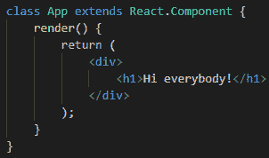

图 7.1 - React 中类组件的代码

这与函数非常相似，但它没有任何*参数*，而且我们可以看到那里的`extends`单词。关键字`extends`基本上是用来让类知道它应该从另一个类继承属性；在这种情况下，另一个类是`React.Component`。所有类都需要从`React.Component`继承，以便该类可以作为 React 组件使用。

我们还看到了`render()`函数。这个函数是 React 组件所必需的。这是我们编写所有 JSX 的地方。现在，还有另一个函数我们应该使用。这是在使用类创建新对象时调用的函数。

现在我们已经学会了如何创建一个类，是时候进入状态了。让我们看看如何将*状态*添加到我们的`App`类组件中。为此，我们需要在`App`类中创建另一个名为`constructor()`的函数：

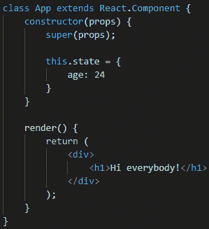

图 7.2 - 添加到我们类中的构造函数

重要提示

在基于类的面向对象编程中，构造函数是一种特殊类型的函数，每当我们创建一个对象时就会被调用。它通常接受参数，以便以任何我们想要的方式自定义初始化一个新对象。

如你所见，这个函数接受一个参数`props`，这使我们能够使用这个组件可能接收的 props。构造函数中的`super()`函数是一个关键字，用于访问并调用对象父级的函数。这个函数必须在使用`this`关键字之前使用。

正如我们所看到的，我们的状态变量前面有一个`this`关键字。这个关键字指的是它所属的对象。它基本上指的是`状态`变量只与*这个*对象相关联，所以你不能直接从另一个对象访问它。

现在让我们看看我们如何在`render`函数中使用它。这与我们使用`props`的方式完全相同：

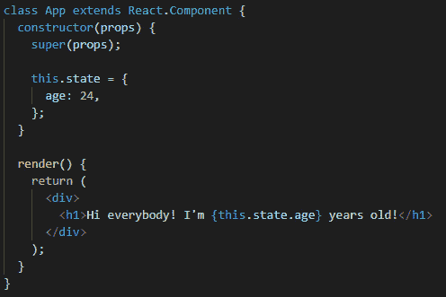

图 7.3 - 在渲染函数中使用的状态

正如我们所看到的，我们仍然使用`this`关键字，以确保`状态`变量在渲染时指的是这个特定的对象。现在应该在屏幕上显示的消息是**大家好！我今年 24 岁了！**。

这与我们一直在使用的`props`非常相似，但到底有什么不同呢？

实际的区别在于`状态`是局部的，而`props`是我们从一个组件传递到另一个组件的东西。另一个区别是，因为`状态`是一个局部变量，我们可以在组件内部改变它，唯一需要重新渲染的是特定的组件。而`props`的情况是，一旦我们更新了一个 prop，使用该 prop 的所有子组件都需要重新渲染，这会给我们的应用程序带来一些压力。

什么是状态？

在计算机科学中，只要系统被设计为记住先前的信息，就被称为有状态的系统。被记住的信息被称为系统的状态。

这并不是说`状态`比`props`更好。它们都有各自的目的，当构建应用程序时，你会使用所有这些概念。有时，你需要状态，我们将看一些使用两者的例子，这样我们就可以更好地理解它们的工作原理。

那么我们如何改变这个变量呢？你们中的一些人可能自然地会想到“嘿，这很容易 - 就像平常一样改变变量”，然后你会尝试像这样做一些事情：

```jsx
state.age = 54;
```

但这并不会真正起作用。你可以尝试在组件内部进行操作，但你不会看到任何变化。状态将保持在你的屏幕上为`24`，组件不会重新渲染。React 状态应该被视为不可变的。在编程世界中，不可变对象是指在创建后无法修改的对象。

实际上，我们有一个 React 函数为我们实现了`setState()`。这有助于我们用另一个状态替换状态，因此我们实际上并没有修改主变量；我们实际上是用另一个变量替换了变量。

因此，如果我们想要改变年龄，我们需要写类似这样的东西：

```jsx
this.setState({ age: 54 });
```

现在，这似乎相当容易，但我们到底在哪里改变状态呢？嗯，有很多地方可以改变状态，但这取决于你的应用程序以及你希望它如何工作。假设我们想在组件在屏幕上渲染时立即改变年龄。React 为我们的类组件提供了一些称为*生命周期函数*的特定函数。

这些函数在组件生命周期的特定时刻被调用。我们将讨论其中的两个：`componentDidMount()`和`componentWillUnmount()`。

这些函数确切地代表了它们的名字所暗示的。第一个函数在我们的组件已经挂载（渲染）到屏幕上后被调用。第二个函数在组件需要从屏幕上移除时被调用。因此，我们在组件生命周期中有这些时刻，我们可以插入代码来确保组件的行为符合我们的期望。

显然，如果我们想要在组件渲染后改变年龄，我们必须使用`componentDidMount()`函数：

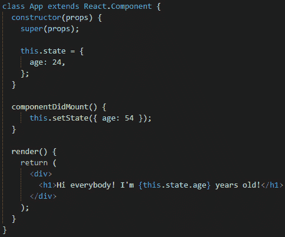

图 7.4 - 在我们的类组件中使用 componentDidMount

现在当我们打开应用程序时，我们会看到**大家好！我今年 54 岁！**。但实际上状态在渲染开始时是`24`，一旦渲染完成，状态就变成了`54`。所以，这真的很酷，我们有很多不同的新功能和属性。我完全建议你阅读更多关于 JavaScript 类如何工作的信息，如果有任何你觉得不太理解的地方。你可以通过访问 Mozilla 的网站来做到这一点，那里充满了有关 JavaScript 的有趣信息：[`developer.mozilla.org/en-US/docs/Web/JavaScript/Reference/Classes`](https://developer.mozilla.org/en-US/docs/Web/JavaScript/Reference/Classes)。只是让你知道，很多人在`this`关键字的工作方式以及状态的确切工作方式上遇到问题或感到困惑。我觉得一旦你更多地了解 JavaScript 的工作原理，这种困惑就会消失。

现在让我们运用到目前为止学到的知识，进行一个有趣的小实践。我们将开始使用状态，使我们的屏幕看起来更加动态，而不仅仅是我们通常的静态屏幕。

# 升级我们的屏幕

让我们看看我们要创建什么样的应用程序。我在想我们可以有一个屏幕，显示我们当前的年龄，包括月份、天数、小时和分钟。我是说，那挺酷的，对吧？每当有人问起你的年龄，你就可以从口袋里拿出手机，展示你创建的屏幕。让我们开始吧：

1.  让我们打开终端，并像往常一样使用以下命令创建一个新的`expo`托管项目：

```jsx
expo init RealAge
```

现在让我们打开项目并开始编写一些代码！

1.  现在让我们直接打开`App.js`文件，除了导入和样式表之外，删除里面的所有内容。我总是保留样式表，因为我喜欢居中的文本。

1.  现在让我们将`App`组件重写为`class`组件。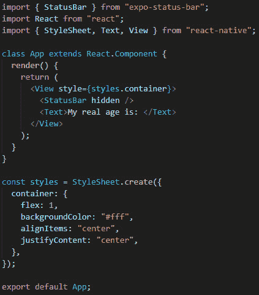

图 7.5 - App.js 重写为类组件

1.  现在让我们通过终端内使用以下命令打开我们的 Expo 应用程序：

```jsx
expo r -c
```

我总是使用这个命令来清除缓存。这样，我就确保缓存不会干扰我的更改。

1.  现在 Expo 服务器已经打开，就像我们学到的那样，打开你选择的模拟器。一旦你的应用程序打开，你应该能在屏幕上看到`我的真实年龄是：`的文字。

1.  现在让我们将我们的年龄作为`App`类组件内的状态集成进去。

就像我们之前看到的那样，我们需要在类组件的所有其他内容之上编写我们的`constructor()`函数。*不要忘记*关于`super(props)`这一行 - 这很重要！然后我们将在`constructor`函数中创建我们的状态：

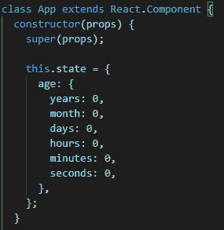

图 7.6 - 带有我们新创建的状态的构造函数

我已经提到我们将以年、月和日的形式显示我们的年龄，一直到秒，所以我在那里放了一个填满零的对象作为占位符。它实际上可以是任何东西，因为我们将在一些快速的数学运算之后更改它。

现在让我们直接进入如何计算年龄的方法。为了这个小技巧，我们将使用 JavaScript 中的`Date()`对象。尽管这个对象对一些人来说可能有点令人困惑，但在你了解更多关于时区的知识之后，它真的只是另一个可以玩耍的对象。别担心，我们不会深入研究 JavaScript 中的日期，因为我们有更好的东西要学习。

因此，我们将创建一个名为`getAge()`的新函数，它将接收您的生日日期。这个函数将获取当前时间，并从中减去您的出生日期。所有这些都将以毫秒为单位完成。之后，我们将取得的结果创建一个新的`Date`对象。从这个新对象中，我们将提取关于我们年龄的所有信息。

最后，我们将使用`setState`来创建一个新的状态，其中包含我们从`Date`对象中计算出的所有信息：

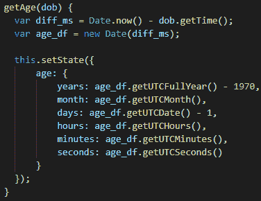

图 7.7 - 我们计算当前年龄的函数

现在，你可能想知道为什么我们要减去`1970`年和`1`天。噢，正如我所说的，`Date`对象有点奇怪。我们必须减去`1970`，因为 UTC 时间从 1970 年开始，所以为了确保我们得到正确的年份值，它必须从我们的方程中消失。至于天数的值，这可能与我真的想确保时区被考虑进去有关，我的时区需要那个`-1`。事实上，即使我们少了 1 天，重要的是要看到这个东西真的起作用。

现在我们有了这个函数，并且我们正在使用`setState`函数来正确地改变状态，是时候从某个地方调用这个函数了。正如你所知，一个普通的函数不会自己调用（尽管有一些函数可以做到这一点）。

所以，让我们做和之前一样的事情 - 让我们在`componentDidMount()`中调用我们的函数，就像这样：

```jsx
this.getAge(new Date("June 29, 1996 03:32 UTC+2"));
```

正如你所看到的，我使用了关键字`this`来确保我们的对象知道我们正在引用它的函数`getAge`。我还在函数内使用了我的生日，但你可以使用你自己的生日来使这更加个人化。

我们的工作还没有完成！让我们进入我们的`render`函数并进行一些修改，以便我们可以正确显示一切：

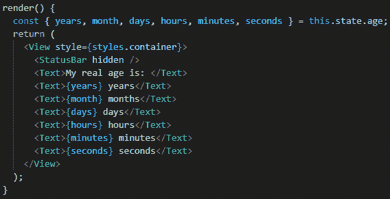

图 7.8 - 在我们实现状态后的渲染函数

我们`render`函数内的第一行可能对你们中的一些人来说有点奇怪。这被称为**对象解构**。这就是我们之前在导入中已经做过的事情。这是一个非常有用的 JavaScript 特性，用于从对象中提取属性，甚至将它们绑定到变量上。

例如，现在我们可以在引用`this.state.age.years`时只说`years`。这节省了我们的写作时间，而且看起来也清晰得多。你会经常看到人们像这样解构变量 - 这是一个非常酷的特性！

现在我们已经确保我们将使用`state`内的所有变量，我们的`componentDidMount`正在调用我们的`getAge`函数，并且`state`是在那个函数内设置的，一切准备就绪。运行你的应用程序并检查结果。你应该能够看到屏幕上显示出你真正的年龄，甚至可以看到最细微的细节。

但有一些问题 - 秒数不会刷新，所以一切都保持不变。你可能会认为我可能欺骗了你，但相信我，我没有。现在，你的真实年龄没有更新，因为我们的`getAge`函数只被调用了一次。正如我们所说，`componentDidMount`在组件首次渲染在屏幕上时调用该函数。我们的组件渲染了，函数被调用了，故事就此结束。

我们不知何故必须让那个函数多次调用；我认为至少每秒一次，这样我们才能确保我们的秒数与真实时间同步。现在让我们来做吧！

在我们的`componentDidMount`函数内部，我们将调用一个很酷的函数叫做`setInterval()`。它接受的第一个参数是一个函数。这个函数将会以一定的时间间隔被调用。它接受的第二个参数实际上是以毫秒为单位的时间，用于执行这个函数的频率。

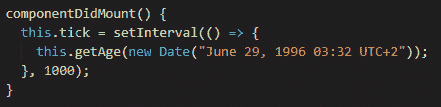

图 7.9 - 使用我们的 setInterval 函数的 componentDidMount

现在我们创建了这个间隔，`getAge()`函数被调用。当我们不再需要它工作时，停止间隔是一个很好的做法。你脑海中现在可能会冒出一个问题：“什么时候我们不需要它运行呢？”嗯...这通常是主观的，但在我们的特定情况下，答案是在组件的生命周期结束时。

记得我们说过还有另一个叫做`componentWillUnmount()`的生命周期函数吗？好吧，这正是我们要结束这个函数的地方：

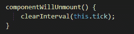

图 7.10 - 在我们的 class 组件中使用的 componentWillUnmount 函数

现在我们已经做到了这一点，我们的应用应该准备好正确显示我们当前的年龄了。保存一切，刷新模拟器，然后检查一下！你的真实年龄现在正确地显示在屏幕上。不过，不要让这些数字毁了你的一天 - 我们都只有自己感觉年轻！

现在我们已经看到了状态在`class`组件中的行为，这在某种程度上是状态的传统用法，是时候看看其他使用状态的方式了。在最近，React 给我们带来了一些很酷的小东西，叫做**hooks**。让我们更多地了解它们，它们与传统状态有什么不同，以及它们为我们带来了什么新功能。

# 其他 hooks 及其相关性

状态的主要问题在于我们只能在`class`组件中使用它。对于一些初学者来说，类组件通常被认为有点丑陋且难以学习，因此 React 团队尝试创建一些新的东西，承诺解决初学者和高级用户在使用传统状态的类组件时可能遇到的问题。这就是**hooks**诞生的原因。

Hooks 是在 React v16.8 和 React Native v0.59 中引入的。它们基本上让你在不编写类的情况下使用状态和其他 React 特性。

那么，这对我们究竟意味着什么？让我们看一个示例，看看我们如何使用新的钩子功能编写状态：

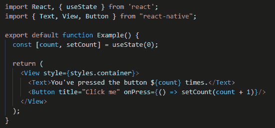

图 7.11 - 使用钩子的示例

哇！这是什么？这真的是我们迄今为止一直在使用的相同状态特性吗？是的，是的。如果你将这段代码复制到一个全新的项目中，你会发现一旦启动你的应用程序，每次你按下那个按钮，数字都会从 0 更新到你按下它的次数。

让我们看看我们到底写了什么。

正如你所看到的，我们创建了一个名为`Example`的函数。只要不是你的主要函数，名字并不重要，主要函数应该总是叫做`App`。函数看起来比类清晰得多，显然更容易编写。

然后我们使用`useState()`钩子在我们的函数中定义了两个变量。这到底是如何工作的呢？

```jsx
const [count, setCount] = useState(0);
```

在这个示例中，`useState`是一个钩子。我们在函数组件中调用这个方法，以便为我们的组件添加本地状态。这个函数返回一对值：*当前*状态值 - `count`，以及一个可以更新该值的函数 - `setCount`。`setCount`函数与类中的`this.setState`函数非常相似，只是它不会合并旧状态和新状态。

`useState`接受的唯一参数是赋给我们的`count`变量的初始状态。请记住，我们的`this.state`变量必须是一个对象，而且一切都在那个对象里。`count`不必是一个对象，尽管如果你愿意的话它也可以是。

现在让我们直接比较使用`this.state`和`useState`钩子。我们将看到相同的状态使用这两个特性写成，这样我们就可以清楚地比较这两者。

首先，我们来看一下`this.state`。我们想象一下有一个应用程序，需要一些关于用户的信息，一些朋友在用户个人资料上留下的评论，还有这个个人资料有多少个赞：

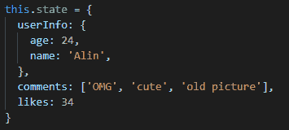

图 7.12 - 在类组件中编写的状态对象

这很容易理解，对吧？我们的`state`有以下值：`userInfo` - 一个对象，`comments` - 一个字符串数组，`likes` - 一个数字。让我们看看使用*hooks*会是什么样子：

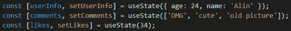

图 7.13 - 我们在功能组件中编写的状态

这和之前的例子完全一样，但我们使用了`useState`钩子。所有的值和之前的例子完全一样，不同之处在于我们的状态不再存在于单个对象中。

现在，举个例子，假设我们想改变喜欢的数量。也许有人点击了喜欢按钮，我们想要更新屏幕上显示的数字。让我们看看在类组件中如何改变它：

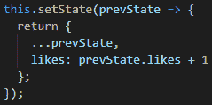

图 7.14 - 在类组件中改变状态

看起来复杂，对吧？除此之外，与我们一直使用的`setState()`函数相比，还有很多新的东西。问题是，因为我们只需要更新喜欢的数量，所以我们使用了一种叫做*previous state*的东西。这就是`prevState`的来源。一旦需要根据先前的状态来改变状态，就像我们在这里需要增加喜欢的数量一样，就必须将一个函数作为参数传递给`this.setState`。这为我们提供了先前状态的快照（`prevState`）。到目前为止，我们一直使用简化版本，因为我们不需要根据先前的状态来更新它。

现在让我们看看如果我们使用钩子会是什么样子：

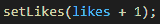

图 7.15 - 在功能组件中改变状态

这显然更加清晰和简单。我们知道我们只想改变喜欢的数量，所以我们使用了`setLikes`。在这里，我们可以取`likes`状态，然后将其增加`1`。

正如你所看到的，钩子使我们的生活变得更加容易。它们非常简单易用，需要写的代码也少得多。

现在问题是，如果我们在进入**hooks**之前创建的应用程序，显示我们真实年龄的应用程序，我们如何能够调用`setInterval`函数，因为生命周期函数 - `componentDidMount`或`componentWillUnmount` - 仅在类组件中可用。

我们很幸运，因为 React 团队为我们提供了除了`setState`之外更多的钩子供我们使用。首先，让我们看看什么是钩子。

正如我们所知，React 是关于代码重用的。现在，我们可以编写简单的函数，并在需要计算某些东西时调用它们，甚至编写组件以便在应用程序的任何部分重用它们，但组件的问题在于它们必须渲染一些 UI。这使得组件有点不方便。React 团队提出了钩子的想法，因为他们希望能够共享复杂的逻辑而不必渲染某种 UI。钩子让你可以通过简单的函数调用从函数中使用 React 功能。我们提供的钩子涵盖了 React 的最重要部分：状态、生命周期和上下文。

那么，让我们看看我们可以用什么类型的钩子来替代`componentDidMount`函数。

## useEffect

`useEffect`钩子使我们能够从函数组件中使用副作用。什么是*副作用*？例如，*数据获取*或*订阅*都是副作用。它们被称为副作用，因为它们可以影响其他组件，并且不能在渲染期间完成。

通常，这些操作是在类组件中使用生命周期函数执行的。你可以把`useEffect`想象成所有这些生命周期函数合并在一个函数中。就像`useState`一样，`useEffect`可以在同一个函数组件中多次使用。

通过使用这个钩子，你基本上告诉 React 你的组件需要在渲染后做一些事情。React 会记住你传递的函数，并在执行所有更新后调用它。`useEffect`在每次渲染后运行。所以基本上，它在第一次渲染后运行，并在你的组件进行每次更新后运行。

好了，那么`componentWillUnmount`呢？我们如何确保我们的函数只在移除组件时才起作用？`useEffect`就足够了，我们不需要另一个钩子。如果我们从我们的 effect 中返回一个函数，React 会确保在组件卸载时调用该函数一次。

Hooks 是 React 的一个非常重要的部分，需要大量的解释，我觉得你最好的学习方式就是阅读文档。还有其他的 hooks，比如`useMemo`、`useRef`和`useReducer`。所以，阅读文档对所有程序员来说都是救命稻草，特别是因为你会在里面找到很多很酷的信息，我敢保证你在任何书中都找不到。当学习一门新技术时，你的第一步应该是阅读文档，然后研究其他更具体、更关键的方法来深入研究你真正想学习的东西。就像这本书一样，我们在这里学习如何构建一些 React Native 跨平台应用，所以让我们继续前进，当我们在下一章节开始使用 hooks 时，我们会更详细地解释。

# 总结

这一章已经涵盖了我们继续前进所需的大部分关于状态的信息。到现在为止，我们应该能够理解状态在类组件和函数组件中是如何工作的。

在学习了关于状态以及状态的确切含义之后，我们了解了一些生命周期函数以及它们的工作原理。学习这些非常重要，因为我们现在明白了一个组件会经历不同的阶段，并且在不同的时刻，我们能够干预一些 JavaScript 代码。

整个冒险给了我们一个想法，真实年龄应用。我们现在能够创建一个动态数字随时间变化的应用。我们学会了如何实现我们到目前为止学到的关于状态的一切，并创造一个展示我们年龄的绝妙想法。

因为类组件看起来有点像需要写太多代码，我们开始学习关于 hooks 的知识。经过仔细分析它们的区别，我们了解了一个叫做`useEffect`的 hook。

长期来看，学习所有这些将会非常有益，特别是在接下来的章节中，那些都是关于实际挑战，我们将学到很多技巧，并创建许多不同类型的 React Native 应用。
