# 第八章：创建您自己的自定义组件

经过所有这些课程的学习，我们现在准备好迎接更多实际挑战，这将使我们为创建完整的 React Native 应用做好准备。我们已经接触了所有基本和一些更高级的信息，所以我们准备好迎接更困难的挑战。

在本章中，我们将进行四个不同的练习。第一个将是一个简单的练习，我们将使用 Galio 的组件来创建新的组件，以适应我们想象中的应用程序。这样做将再次向我们证明 Galio 对于几乎所有编程需求都有多大帮助。

之后，我们将创建自己的个人资料卡。这个练习将主要关注布局和样式，因为我觉得这是任何应用程序创建的一个非常重要的部分。学会这个将使我们离梦想中的应用程序更近一步，因为如今几乎每个应用程序都在某个地方包含个人资料屏幕或卡。

下一个练习将涉及受控输入。除了创建一个简单的注册表单并尽力进行样式设置之外，我们还将了解在处理输入或一般表单时状态是必要的。

我们的最终挑战将是创建一个电子商务卡。这将证明几乎任何东西都可以通过弄清楚它与您已经创建的某些东西的相似之处来创建。这是我们可以理解在一个领域有经验肯定会在另一个领域有所帮助的时刻。没有经验是无用的；一切都帮助我们成为更好的人。

本章将涵盖以下主题：

+   创建您自己的组件！

+   创建您自己的个人资料卡

+   创建您自己的注册表单

+   构建您的电子商务卡

# 技术要求

您可以通过访问 GitHub [`github.com/PacktPublishing/Lightning-Fast-Mobile-App-Development-with-Galio`](https://github.com/PacktPublishing/Lightning-Fast-Mobile-App-Development-with-Galio) 查看本章的代码。您将找到一个名为“第八章”的文件夹，其中包含本章中编写的所有代码。为了使用该项目，请按照`README.md`文件中的说明进行操作。

# 创建您自己的组件！

现在我们已经了解了 React 和 React Native 的基本知识，是时候通过创建许多不同的组件来测试我们的技能了。不用担心，我们也将创建一个更大更复杂的应用程序。但是你知道，一个 React 应用程序是由许多不同的组件组成的，所以通过创建组件，我们实际上是在准备创建应用程序。

我在想，对于我们的第一个组件，我们应该从一个新闻卡开始。这通常会直接进入新闻动态，如果我们要创建一个新闻应用程序，我们会使用多个类似的组件来显示不同的文本。那么，我们该如何开始呢？

就像我们通常做的那样，用以下命令创建一个应用程序：

```jsx
expo init chapter08
```

在本章的所有练习中，我们将使用相同的应用程序，因为这比为每个练习创建一个项目要容易得多。因此，在创建项目后，让我们打开它，然后打开我们的`App.js`文件。

现在，我们要在根文件夹内创建一个新的`components`文件夹。在这里，我们将开始开发我们自己的组件。在本章结束时，你应该在这个文件夹里有四个文件。

因为我们将使用 Galio 来创建我们组件的布局，所以我们现在应该通过终端安装它。记住我们用于安装外部包的命令吗？我们将使用以下命令：

```jsx
npm i galio-framework
```

现在，让我们在`components`文件夹内创建一个名为`NewsCard.js`的新文件。因为我们正在创建一个新闻动态类型的组件，我们需要考虑在这个组件内部究竟需要使用什么。

我们确定需要`StyleSheet`来设置样式和来自**Galio**的`Block`组件。但是我们还需要一个`Text`组件来渲染文本，以及一个`Icon`组件，这样我们就能够拥有某种图标。我觉得每篇帖子也应该有一个头像，所以还需要一个`Image`组件。

所以，我们的导入现在应该是这样的：

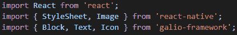

图 8.1 - 用于我们的 NewsCard 组件的导入

现在我们知道了在组件内部要使用的东西，让我们一步一步地开始构建它。我们将首先创建一个名为`NewsCard`的函数组件。这个函数暂时只会返回一个`Block`元素和一个`Text`元素，以便有一些东西可以被渲染出来。

我们还将在文件末尾创建一个`styles`对象。还记得我们应该这样做吗？很好！让我们为我们的主`Block`组件创建一个名为`card`的样式。在样式方面，我想添加一些新的东西，这是我们到目前为止还没有讨论过的：阴影。

阴影实际上并不难使用，但我觉得有些人可能真的不明白它是如何工作的。在添加样式之后，让我们来看看我们的组件到目前为止是什么样子的：

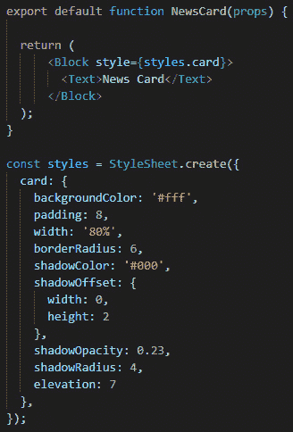

图 8.2 - 我们第一个组件的开始

所以，到目前为止，一切看起来应该相当简单易懂。这里的阴影是我们真正探讨过的唯一主题，但样式应该是不言自明的。首先，我们有`shadowColor`，我们已经分配了`#000`，也就是黑色。然后我们有`shadowOffset`，它告诉我们的阴影如何从我们一直分配给它的对象上落下来。如果事情看起来仍然有点混乱，我们应该像这样考虑`width`和`height`的值：`width`是*x*轴，`height`是*y*轴。说`width: 0`意味着我们的阴影预计会直接落到对象下面的地面上，但将其与`height: 2`结合使用将告诉我们的阴影从中心向下掉落 2 个像素(**px**)。然后，我们有`shadowOpacity`，它做你期望它做的事情：计算我们阴影的不透明度。你可能已经注意到了`elevation`；这是你用来为 Android 设备设置阴影的，它只支持 Android 5.0+。

现在我们已经设置了新组件的基础，让我们将其导入到`App.js`中，这样我们就可以实时看到我们的更改。因此，让我们打开文件并删除`main`函数内除了主`View`组件之外的所有内容。保留样式 - 我喜欢一切都居中。

现在，让我们导入我们新创建的组件并在屏幕上呈现它。我们将在主要导入的下方编写以下代码：

```jsx
import NewsCard from './components/NewsCard';
```

现在我们已经导入了组件，将其放在`View`组件内，像这样：`<NewsCard />`。启动 Expo 服务器，打开模拟器，你应该能够看到带有文本**News Card**的卡片。太棒了！现在，我们可以开始工作了 - 保存文件并实时查看更改。

最终，我们将在我们的`App.js`文件中添加我们创建的每个组件。这应该是一个非常简单的工作流程，可以用来测试我们的组件视觉效果。

现在，让我们回到我们的`NewsCard.js`文件，并开始创建基本布局。

我们将从使用`Block`组件来安排布局开始，所以我们将使用两个。第一个是用于卡片的标题，其中将包含卡片的最右边的“书签”图标，左侧将有头像和关于作者的信息。第二个是用于新闻文章的标题和文本摘要。让我们看看通过实践它看起来如何：

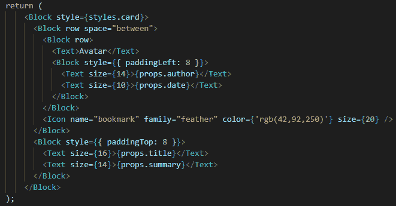

图 8.3 - 编写基本布局

所以，就像你看到的那样，对于`title`、`summary`、`author`和`date`，我们将使用`props`。至于`Avatar`，现在我们将使用一个`Text`组件作为占位符。所以，让我们保存并转到我们的`App.js`文件，以完成将所有 props 发送回我们的`NewsCard`组件，如下所示：

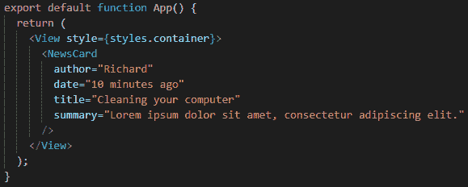

图 8.4 - App.js 文件已完成我们的 NewsCard 组件的 props

好了，现在，我们要保存`App.js`文件，并切换到我们的模拟器。我们应该能够看到我们的`NewsCard`组件正在成形。有标题、摘要、日期，甚至作者。是的，我在摘要中使用了`lorem ipsum`，因为这比实际创建摘要文本更容易更快。我们甚至可以用我们的组件开始一个新闻订阅。但现在，让我们回到我们的`NewsCard`组件，并添加我们还缺少的东西。

当然，我们需要用实际的`Image`组件替换我们一直在使用的占位符。所以，让我们用以下行替换那段文字：

```jsx
<Image style={styles.avatar} source={{uri: props.avatar}}/>
```

你可能记得，图像需要一些样式才能渲染。让我们转到`styles`对象，并做好我们图像所需的所有样式。我想设置`width`和`height`值为`30px`，`borderRadius`值为`15px`。

现在，我们唯一缺少的就是回到我们的`App.js`文件，并向我们的组件添加`avatar`prop。在网上搜索一张图片并粘贴链接进去。现在，刷新一切，恭喜——我们有一张图像渲染了！

我想说的是，现在我们唯一缺少的就是给文本添加一些颜色，但我会让你自己来做。如果你没有和我同时编写代码，不用担心 - 只需转到 GitHub 并搜索`Chapter 08`文件夹。这将包含我们到目前为止所做的所有代码，你还将看到我如何给文本上色。我还解构了`props`对象。

现在，让我们看看这在我的模拟器上是什么样子，这样你就可以确保一旦在 GitHub 上克隆存储库，事情看起来和我们描述的一样。你可以在这里看到结果：

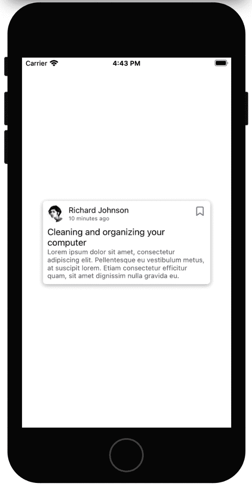

图 8.5 - 模拟器显示我们完成的组件

看起来不错，对吧？我会让你在未来的应用中尽情使用这个组件，所以不要害羞地重复使用你的组件。下一个应该会更酷，所以让我们继续，开始构建我们的第一个个人资料卡。

# 创建你自己的个人资料卡

个人资料卡是任何用户在具有用户系统的应用程序中需要看到的东西。所以，我想创建一个简单的个人资料卡，用于显示我们用户的一些基本信息。我觉得应该显示的主要元素是个人资料图片、用户的姓名、电子邮件和电话号码。

这将在一个应用程序中对我们非常有用，也许我们有一个电话联系人列表，我们想要单独查看每个联系人。现在，让我们开始创建我们的个人资料卡组件。

继续在我们的`components`文件夹中创建一个名为`ProfileCard.js`的新文件。现在，正如你之前所读到的，我已经说明了这个组件将由哪些元素组成。基于此，让我们考虑我们需要什么类型的导入。

你猜对了！和我们上一个组件中使用的相同的导入。既然我们确定了需要什么类型的导入，让我们写一个基本的函数，这样我们就可以在开始工作在组件上时在屏幕上看到一些东西。

正如你在组件的文件名中所看到的，我们的主要`Block`组件应该是一个卡片，所以让我们应用与上一个组件相同的样式。我们会改变背景颜色和一些值，但这个`style`对象应该大部分与上一个相同。

让我们看看我们到目前为止写了什么：

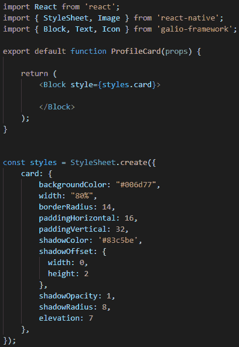

图 8.6 - 我们的 ProfileCard 组件的开始

看起来非常相似，对吧？有一些值已经改变了，但这是因为我觉得不同的颜色可能更适合这张卡片。根据我们为`width`属性分配的`"80%"`值，它应该与我们以前的组件具有相同的宽度。

现在，让我们转到我们的`App.js`文件，注释掉我们的`<NewsCard />`组件，并导入我们的新组件，就像我们以前做过的那样。

现在，我们应该能够在模拟器屏幕上看到这张没有内容的小卡片。让我们回到我们的卡片，继续添加布局的其余部分。

我们的组件左侧应该有一个图标，用户可能想要按下该图标以修改组件的内容。我们暂时不会创建功能，但在那里放一个指向该功能的图标应该已经足够好了。

在这个图标下面，我觉得我们应该有一个头像和联系人的名字居中显示在卡片上。

就在这些下面，电话号码和电子邮件应该可以供我们查看。在这两者之间，我想放一条线来分隔信息。为什么？在我看来，这样看起来更好。因此，让我们继续下一步，添加我们这种布局所需的所有基本组件，如下所示：

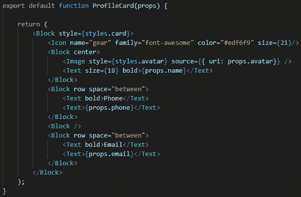

图 8.7 - 我们的 ProfileCard 组件的基本布局

使用 Galio 很容易实现这种布局原型。正如你所看到的，我们只是使用`Block`组件，我们已经可以居中、创建行，并定义每个组件所需的空间。同样，我们正在使用`props`，因为你现在的工作是回到`App.js`，将`props`传递给我们的组件，以便它可以渲染更多信息。

完成了？太棒了！你可能现在想知道我们在创建的两行之间的`<Block />`组件是什么。好吧，那将充当分隔线。因此，让我们为它编写样式，以及我们的`avatar`图像的样式。在这一点上，你甚至可以为每个`Text`组件添加颜色，这样你就可以使其看起来更有趣。我可能会使用白色的文本，但只要你喜欢，任何颜色都可以。让我们看看我们的样式是如何的，如下所示：

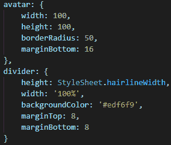

图 8.8 - 我们的分隔线和头像的样式

现在我们已经创建了样式，让我们深入一下。分隔线应该是我们的“电子邮件”和“电话号码”之间的一条白线。因此，我们使用了一个`Block`组件来创建一条直线。这应该让你意识到你可以用`Block`组件有多少种方式。不过，`hairlineWidth`是怎么回事呢？这是由 React Native 定义的特定平台上细线的宽度。它主要用于在两个元素之间创建分隔。

现在，让我们保存一切，看看在模拟器上的效果。输出应该与我这里的类似。也许你改变了一些颜色，但布局应该是相同的：

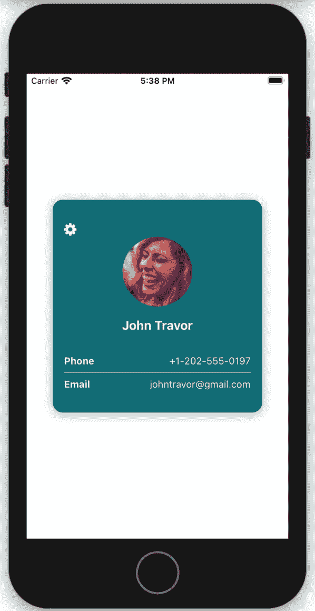

图 8.9 - 我们组件的最终渲染

这真是一次真正的冒险！我们已经创建了两个不同的组件，而且我们还没有停下来。我希望你玩得开心，并且在你面前有一些代码。从记忆中重新创建一切通常是一个好主意，大约 2-3 天。这只是一个很酷的小练习，可以确保你学到了你所阅读的一切。现在，让我们继续前进，因为接下来的内容将会非常酷。

# 创建您自己的注册表单

几乎每个应用程序中都使用注册表单。你可能需要一个，所以让我们看看创建注册表单时发生了什么。这非常酷，因为除了创建一个漂亮的小注册卡之外，我们还将学到有关输入的新知识。

让我们像往常一样开始 - 注释掉`App.js`中的先前组件，并在我们的`components`文件夹中创建一个名为`RegisterForm.js`的新文件。

我们已经创建了两个组件，所以让我们看看你是否可以开始自己创建这个。以下截图中的表单将是我们注册表单的最终渲染版本。我选择让你在实际开始创建之前先看一下，因为我认为你应该能够在没有我的帮助下自己实现类似的结果。当然，我仍然会帮助你，但这是一个很好的机会，花点时间，关闭书本，然后自己开始创建。看看以下截图，然后开始自己创建吧！

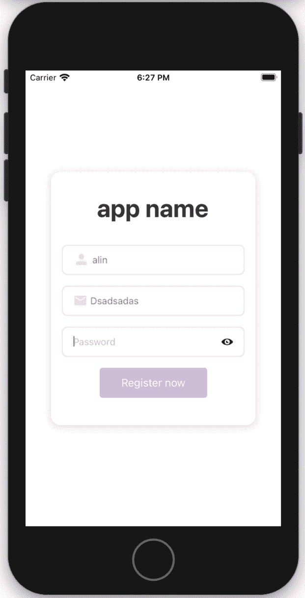

图 8.10 - 我们注册卡的最终渲染版本

看起来相当整洁，对吧？根据我们到目前为止所做的事情，这并不难创建。所以，既然你已经看过了，也许你已经在考虑如何开始处理这个组件了。太好了！如果你还在阅读，也没关系，因为我们将立即开始创建这个组件。

就像我们到目前为止所做的那样，我们将开始考虑我们需要有什么类型的导入。我们不再需要图像，但我们确实需要一个`Input`和一个`Button`组件。不要担心输入框内放置的图标-你可以直接从`Input`组件中做到这一点。Galio 让在输入框内添加图标和样式变得非常容易。

我觉得我们的输入框应该看起来像这样，特别是对于这个特定的组件：

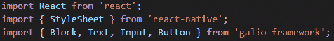

图 8.11-用于我们的注册表单的导入

你已经想到我们应该如何为这个创建布局了吗？我们这里不需要任何行，因为所有的元素都是直接垂直排列的。我们将使用的唯一的`Block`元素是用于创建卡片本身的元素。

让我们开始写我们的主要函数，就像我们以前做过的那样。我们需要一个带有卡片样式的`Block`组件，如下所示：

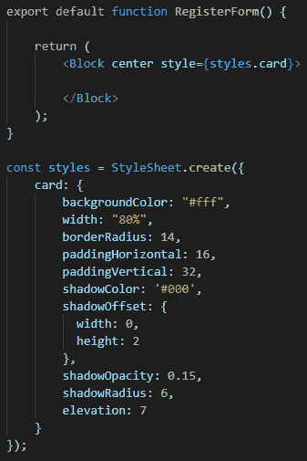

图 8.12-我们的 RegisterForm 组件的开始

现在，让我们进入我们的`App.js`文件，并注释掉以前的组件，以便我们可以导入我们新创建的组件。到目前为止，我们已经做过这个多次了，所以这应该很容易。

现在，让我们继续我们的组件，快速浏览一下布局。由于我们已经做过多次了，这应该不难理解。

显然，我们首先使用一个`Text`组件，然后是三个`Input`组件和一个`Button`组件。所以，让我们写下来，如下所示：

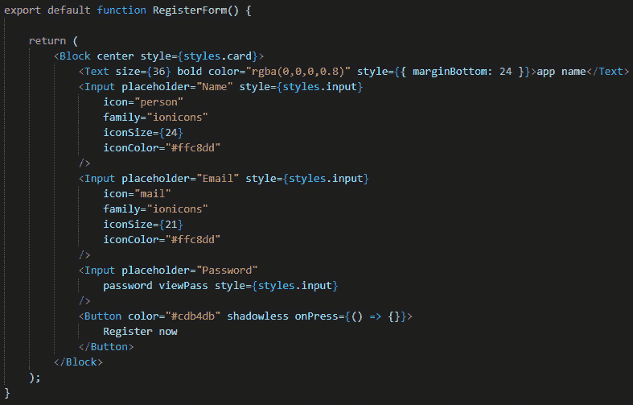

图 8.13-我们几乎完成的组件

好了，所以，一切基本上都是我们到目前为止一直在做的事情。让我们来解决这里发现的新东西。所以，在我们的第三个`Input`组件上，我们可以看到两个 props：`password`和`viewPass`。第一个是为了确保您在输入时看不到密码；它会将您的输入转换为我们在输入密码时经常看到的那些点。第二个是为了在右侧显示那个图标，用户可以按下它以查看他们刚刚输入的密码是否有问题，基本上是将点转换为字母，反之亦然。

我们的`Button`组件也有`shadowless`属性，它的作用正如你所想的那样：使按钮没有阴影。

现在，有趣的部分来了。当然，我们想知道用户在输入什么；否则，我们怎么能验证信息是否正确，或者是否按我们希望的方式输入？也许你要求用户输入电子邮件，但如果输入的是一些随机单词，只是为了不注册就进入应用程序呢？因此，我们必须有一种方法来确保我们知道用户输入了什么，并在用户按下**立即注册**或**提交**按钮后验证文本。

这种技术称为**受控组件**。受控组件通过 props 获取其当前值，并通过回调发送任何更改。父组件通过处理回调并管理自己的状态，然后将新的状态值作为 props 传递给受控组件来“控制”它。

在大多数情况下，甚至是所有情况下，当我们处理表单时，应该使用受控组件。

因为我们在一个函数组件中，我们将使用**钩子**来处理我们的状态。不要忘记导入`useState`钩子，如下所示：

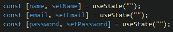

图 8.14 - 在我们的函数组件中使用的钩子

这很容易，因为我们已经学习过钩子和组件的状态。现在，让我们将我们的状态应用到我们的`Input`组件中，如下所示：

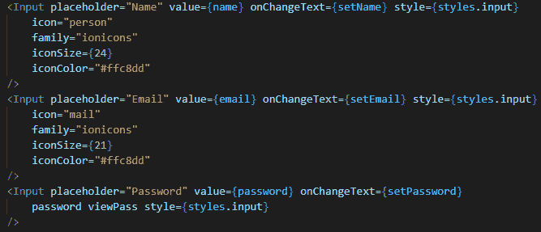

图 8.15 - 应用于我们的输入组件的状态

那么，这里到底发生了什么？一旦用户按下**输入**并开始输入他们的姓名或电子邮件，例如，我们的`onChangeText`属性会触发我们的`setName`属性，这将把`name`状态变量设置为我们输入的当前值。这样，我们确保我们的`RegisterForm`组件*控制*着*输入*，并且始终更新有关我们输入状态的信息。

对于一些人来说，可能有点难以理解为什么我们需要它。事实上，这就是 React 确保我们的输入状态不会出现任何错误的方式，同时还让我们完全控制和了解我们输入的当前状态。

现在，让我们为我们的表单编写一个简单的验证。我们至少需要在用户没有输入任何内容并按下**立即注册**按钮时弹出一条消息。

因此，我们将创建一个名为`registerButton`的函数。您可以按自己的意愿命名，但我称它为这个是因为对我来说有意义。这个函数将验证我们输入值的长度。现在，如果我们没有这个受控组件，我们将无法通过普通变量访问这些值。我们可能需要使用一种叫做`refs`的东西。

这在我们不打算学习`refs`的情况下并不重要，但重要的是要知道有一种叫做`refs`的东西。让我们来看看这个`registerButton`函数，如下所示：

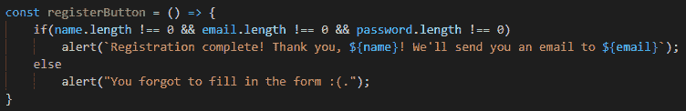

图 8.16 - 我们的表单验证函数

现在我们有了这个函数，我们只需要在用户按下**立即注册**按钮时调用它，所以我们将在我们的`Button`组件上使用`onPress`属性。继续并将此属性应用到我们的`Button`组件中，就像这样：

```jsx
onPress={() => registerButton()}
```

现在，保存并刷新应用程序，然后试一下！很酷，对吧？每当您尝试按下没有输入文本的按钮时，会弹出一条消息，同时在我们使用输入中编写的值时，还会出现另一条很酷的消息。

这并不是一个难以创建的组件，但我们学到了一些真正酷的东西，那就是*受控组件*。我希望这个小练习成功地教会了你一些新东西，从现在开始在处理表单时你会经常使用它。

现在我们已经完成了这个组件，让我们继续开始处理与电子商务移动应用程序相关的另一个组件。

# 构建您的电子商务卡

你知道，每当你在网上购物时，总会有一个装满你选择的产品的购物篮。篮子里的每件物品通常都是一张卡片，上面有关于价格、物品名称、图片以及增加或减少相同类型物品数量的信息。

所以，这也是我们要创建的东西。让我们来看看这里，因为我们已经变得如此先进，现在应该能够想出只用到目前为止学到的东西来创建功能的方法：

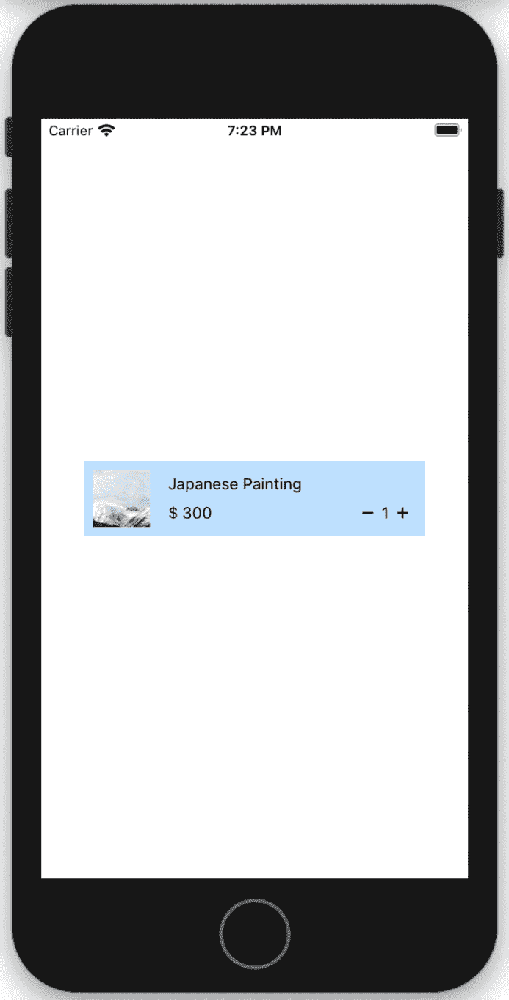

图 8.17 - 我们电子商务卡的最终渲染版本

看起来不错，对吧？老实说，甚至构建起来也不那么难，所以我们将快速通过布局。让我们在`components`文件夹中创建一个名为`CommerceCard.js`的新文件。

现在，让我们想想我们需要哪些类型的导入 - 显然，需要一个`Block`和`Text`组件。我们还需要导入`Icon`组件，因为正如我们在*图 8.17*中看到的，那里有一个减号按钮和一个加号按钮。为了使这些按钮可点击，我们将使用一个名为`TouchableOpacity`的`react-native`组件，所以也让我们导入它。除此之外，正如我们都能看到的，我们还有一个`Image`组件。让我们看看我们所有的导入是什么样子，如下所示：

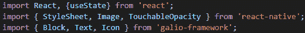

图 8.18 - 我们将用于创建 CommerceCard 组件的导入

我们还导入了`useState`，因为数字将根据我们按下的图标而改变。所以，让我们现在开始创建我们的功能组件，如下所示：

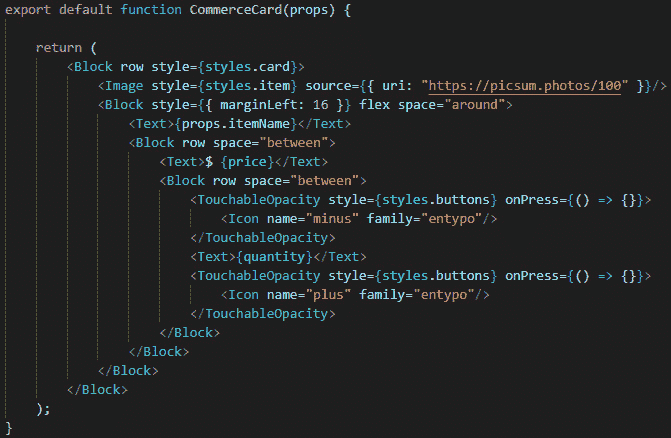

图 8.19 - 我们组件的布局

看起来并不难读，对吧？让我们解释一些，因为我们现在走得有点快。但这是因为我觉得你已经进步了很多，所以你应该尝试挑战自己，看看你的想法是否与我写的组件和我们在*图 8.17*中看到的相匹配。

据我们所见，我们可以有一个包含所有内容并使内容在一行中的大`Block`组件。行中的第一个元素是我们的图像。之后，我们有另一个具有`flex`prop 的`Block`组件，基本上告诉我们的组件尽可能占据空间。

在`Block`组件内部，我们有一个`Text`组件，它接收项目名称作为名为`itemName`的 prop。然后我们有另一个`Block`组件，应用了`row`prop，它将用于分隔价格和数量，这两者都将是状态变量。

现在，让我们看看样式是什么样子的 - 相信我，样式很简单。在这里：

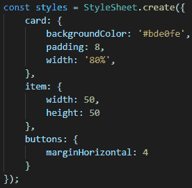

图 8.20 - 组件的样式

如您所见，我们在这里使用的样式实际上并不复杂。因此，让我们继续讨论这个组件的工作原理。

您可能还记得，我说过我们将使用状态来存储我们的价格和数量，所以让我们初始化我们的状态，如下所示：

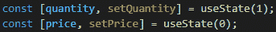

图 8.21 - 初始化组件状态

现在，我在想，我们可以通过 prop 传递价格；这样，这个组件对于将来的情况更具重用性。因为这是通过 prop 完成的，所以我们应该使用生命周期函数，就好像我们在编写类组件一样，因为这是一个函数组件 - 正如我们记得的那样，我们可以使用`useEffect`代替生命周期函数。因此，让我们在导入`useState`的地方同时导入`useEffect`。

现在，让我们看看我们应该如何编写`useEffect`函数，如下所示：

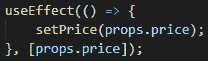

图 8.22 - useEffect 函数用于初始化价格状态变量

因此，当调用`useEffect`时，其中的`setPrice`函数将被调用，这将设置我们的`price`状态变量为 prop 发送的任何数字。但是作为`useEffect`函数的第二个参数使用的`[props.price]`参数是什么意思呢？

这告诉我们的`useEffect`函数仅在`props.price`变量发生变化时才会被调用。

既然我们已经初始化了我们的`price`变量，让我们根据数量来改变价格。我们应该如何做呢？我写了一个名为`quantityMath`的函数，它接收一个名为`action`的字符串变量，这将告诉我们的函数数量是应该下降还是上升。

众所周知，当我们在线购物时，篮子中的每件物品都有一个加号和一个减号，每当按下时，要么增加一个数量，要么减少一个数量。基于此，我们计算该物品的总价格。

现在，让我们来看看这个函数，如下所示：

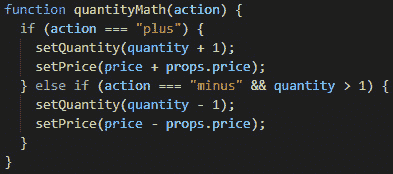

图 8.23 – 用于计算最终价格的 quantityMath 函数

既然我们已经创建了这个函数，让我们确保当用户按下按钮时，这个函数被调用。`TouchableOpacity`是一个用于使其他组件可按压的组件。所以，让我们去其中一个`TouchableOpacity`组件，将`onPress`属性改为`{() => quantityMath("minus")}`。当然，我们将使用`minus`作为`quantityMath`函数的参数，用于减号图标，`plus`用于加号图标。让我们来看看这在我们的代码中是什么样子的：

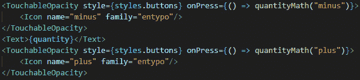

图 8.24 – 实现 quantityMath 函数

现在我们的组件已经完成，让我们进入我们的`App.js`文件并测试一下。注释掉之前的组件，然后导入我们新创建的组件。现在，让我们将这个组件添加到我们的主函数中，就像这样：

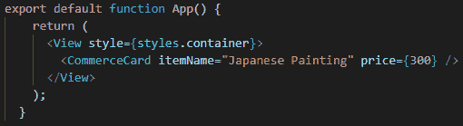

图 8.25 – 主应用程序函数，其中包含我们的 CommerceCard 组件 inside of it

保存所有文件，刷新应用程序，你应该能看到我们的卡片。继续玩加号和减号按钮，你会看到一切都根据你想要的数量准确地改变。

这很酷，对吧？现在我们有了一个很酷的小组件，我们可以在想要为电子商务应用程序进行原型设计时使用。

# 总结

在学习了关于 React 和 React Native 的工作原理之后，我们终于到了更多实际挑战的阶段。我们首先创建了一个简单的组件，主要关注样式和布局。

那是容易的部分，我们下一个组件的第一步是看到一个不同的创建布局的例子，我们加强了大脑肌肉，这样我们就可以更容易地开始自己原型化组件。

接着，我们开始涉及更严肃的组件，那就是注册表单，我们学到了一个叫做受控输入的新概念。这真的很有趣，因为我们学会了如何在 React Native 中实际解决表单问题。

我们的下一个组件甚至更酷，因为我们使用`useEffect`函数来初始化我们组件接收到的一个 prop 变量。现在，这真的很酷，我希望你和我第一次发现这个函数时一样兴奋。

现在我们已经完成了更多的实际挑战，是时候考虑调试的工作原理了，这样我们就可以确保知道如何正确地找出组件的问题所在。当涉及到 React Native 时，我们还会了解一些调试的限制。让我们继续这个酷炫的冒险，更接近创建我们自己的跨平台移动应用程序。
