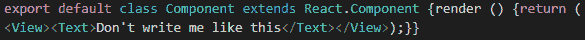
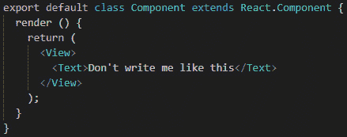
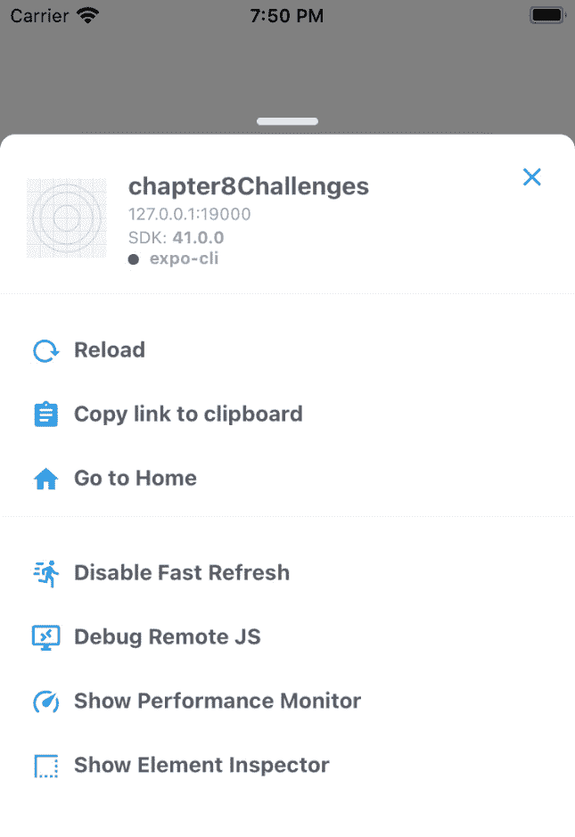
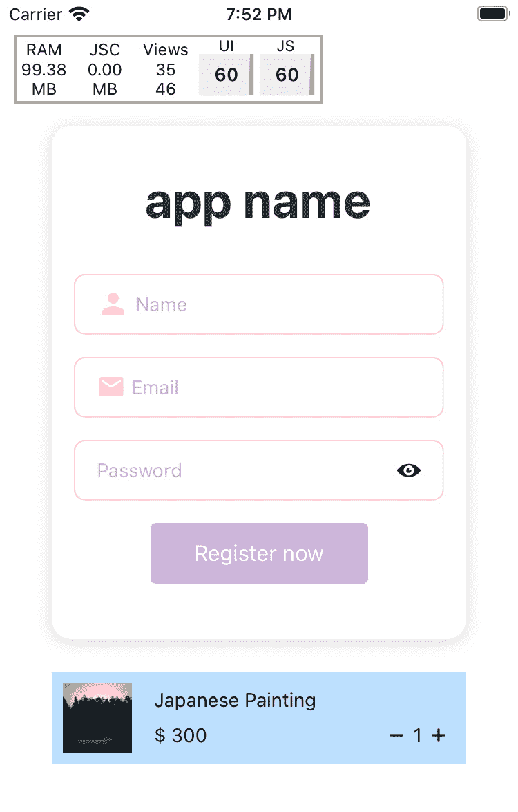
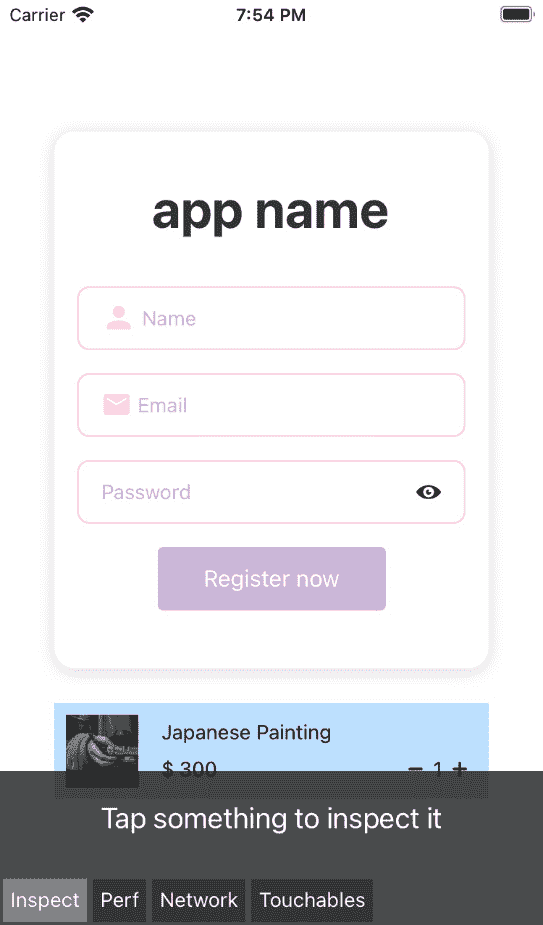
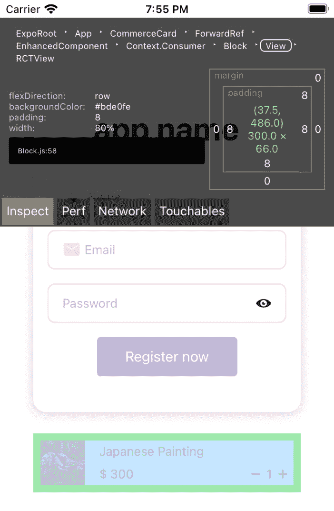
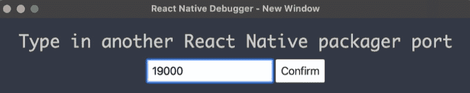
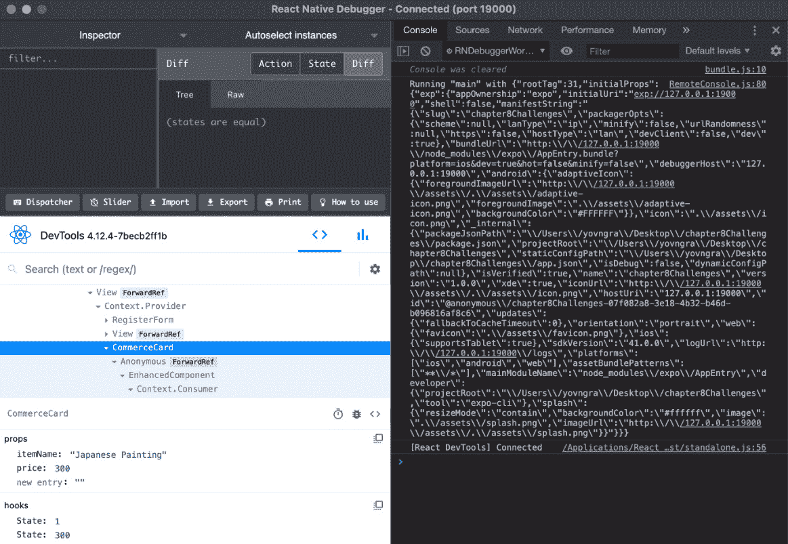
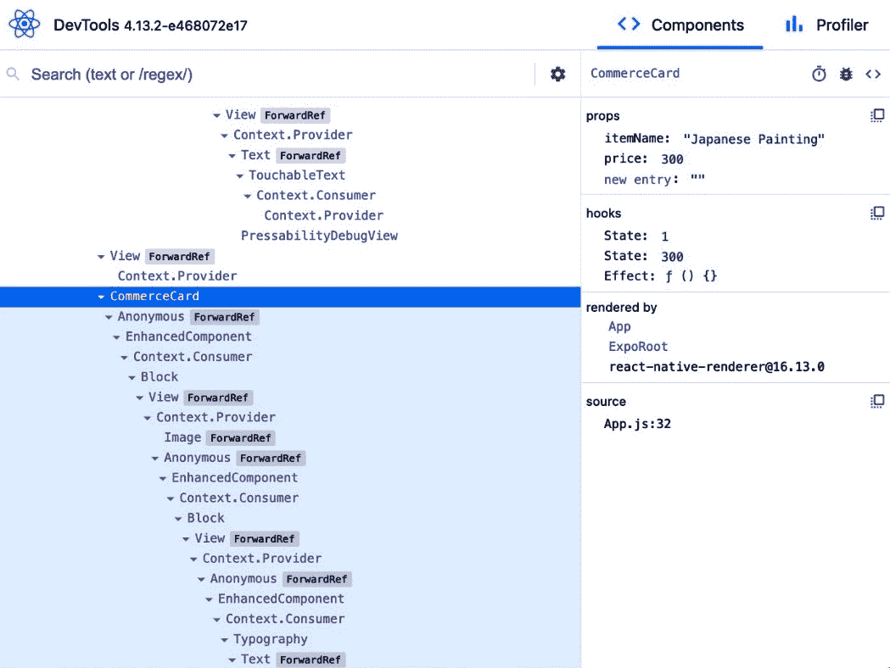

# 第九章：调试和寻求帮助

我们已经经历了很多。我们已经学会了如何创建不同类型的组件；我们已经了解了 props 和 state 以及它们在组件创建中的重要作用。我们还了解了生命周期函数。到目前为止，我们已经获得了很多知识，但我们仍然没有办法测试我们的组件，以查看它们是否具有我们期望的行为。

在本章中，我们将学习调试，并了解最流行的调试选项，如 React DevTools 和 React Native 调试器。我们还将学习一些其他调试替代方案，以便在需要时确保我们使用正确的工具。

我们将学习有趣的概念，如类型检查和 linting。我们还将了解**开发者**菜单以及 React Native 为我们提供的一些功能，以快速发现我们的应用是否存在任何类型的问题。

在本章结束时，我们应该对调试有一些了解，以便在某些东西不按我们的预期工作时做好准备。这将是在创建更复杂的应用程序之前的最后一步。

本章将涵盖以下主题：

+   调试的不同方式

+   React Native 调试器

+   在需要时寻求帮助的地方

# 不同的调试方式

众所周知，开发人员是人类，人类会犯错误。坦率地说，我觉得软件开发人员犯的错误比普通人类要多得多，所以当然，必须有一些方法来解决由于我们的错误而产生的错误。

在计算机编程中，查找和解决错误的过程称为*调试*。在解决错误时，您可以使用许多调试策略，因此我们将尝试并在本节中介绍其中一些。了解它们肯定会在我们的 React Native 之旅中解锁新的成就。

我们将开始这个有趣的探索，找出如何在开发阶段使用不同的格式化工具来确保错误越来越少。

## Linting，类型检查和格式化

作为开发者，我们大多数时候都想把注意力集中在业务逻辑、代码模式和最佳实践等方面。通常情况下，我们不想花时间确保每一行都正确缩进，或者检查某个函数需要接收什么类型的参数。为了简化我们的生活和代码编写过程，我们可以确保所有自动化工作都委托给我们的代码编辑器。我个人非常喜欢**Visual Studio Code**，但在之前的章节中我们已经讨论过，你可以使用任何你喜欢的代码编辑器。

### 类型检查

验证和强制类型约束的过程称为类型检查。这一切都是为了确保类型错误的可能性尽可能地降低。在 JavaScript 中，我们不必指定变量中将存储什么类型的信息，这都是因为 JavaScript 是一种弱类型语言。但对我们的代码加上约束或限制将使我们编写更加深思熟虑的代码，让我们更加小心地思考我们正在编写的代码。

在类型检查方面有两个很棒的工具：**TypeScript**和**Flow**。这两者之间的主要区别在于 Flow 只是一个类型检查器，而 TypeScript 是 JavaScript 的超集，基本上意味着它将包含更多 JavaScript 的下一代特性。

### Linting

Linting 是执行程序以分析潜在程序语法错误的过程。JavaScript 最著名的 linting 插件有**ESLint**、**JSHint**和**JSLint**。我个人使用 ESLint，现在甚至有一个官方的 TypeScript linting 插件。

你会发现大多数人选择 ESLint，但这并不意味着它就是最好的；你需要弄清楚哪种工具对你来说最有效，所以尝试花几分钟去搜索它们。我通常选择拥有最大社区的工具，因为这样更容易找到如何修复某些错误的方法。

### 格式化代码

作为程序员，你大部分时间都将花在阅读代码上，所以你必须确保你正在阅读的代码是可读的。假设我们想快速编写一个类组件；我们已经知道如何做了，所以也许我们甚至不再看屏幕。

因此，我们并不真的关注代码的外观，但这并不重要，因为我们已经是优秀的程序员，我们知道它能工作。这就是未格式化的代码的样子：



图 9.1 – 未格式化的类组件

我的意思是…是的。这看起来不太好。它能工作，但是…我们甚至从何处开始理解这个大香肠中发生了什么？现在让我们看看一旦我们保存文件后我们的代码会发生什么：



图 9.2 – 格式化的类组件

哦！看起来好了十倍，对吧？我们可以很容易地跟踪这里写的代码。当代码格式良好时，阅读和理解代码就变得更容易了。

有多种不同的代码格式化工具，但其中最常用的一个，也是我最喜欢使用的一个是**Prettier**。这很容易与您喜欢的代码编辑器集成和配置。

顺便说一句，您甚至可以配置您的 linter 来使用它来格式化代码，所以也许，如果您真的不喜欢 Prettier，您实际上可以配置 ESLint 来为您执行这项任务。

## 应用内开发者菜单

我们可以从模拟器内部访问一堆不同的工具，React Native 为我们提供了这些工具。这些工具非常酷，所以让我们看看如何在模拟器中测试应用时访问应用内开发者菜单。

访问开发者菜单的第一种方法是摇动设备或在 iOS 模拟器的**硬件**菜单中选择**摇动手势**。

第二种方法是使用键盘快捷键。对于 iOS 上的 Mac，快捷键是*Cmd + D*，对于 Android 则是*Cmd + M*。对于 Windows，Android 模拟器的快捷键是*Ctrl + M*。另外，对于 Android，我们可以运行以下命令来打开开发菜单：

```jsx
adb shell input keyevent 82
```

一旦我们使用了上述方法之一，将打开以下菜单：



图 9.3 – 开发者菜单

正如我们所看到的，这里有一堆选项，所以让我们谈谈每一个。首先，对于调试目的，我们真正感兴趣的是**调试远程 JS**，**显示性能监视器**和**显示元素检查器**。让我们从第一个开始。

### 调试远程 JS

点击此按钮将在我们的 Chrome 浏览器中打开一个新的标签，其中包含以下 URL：[`localhost:8081/debugger-ui`](http://localhost:8081/debugger-ui)。

从 Chrome 菜单中选择**工具** | **开发人员工具**，以打开开发人员工具。React Native 还建议启用**捕获异常时暂停**以获得更好的调试体验。您可以通过转到**源**选项卡来执行此操作，并且您会在右侧的某个位置找到此复选框，紧邻用于断点的常规按钮。

### 显示性能监视器

这个实际上相当酷。一旦您点击此按钮，它将启用性能叠加，以帮助您调试性能问题：



图 9.4 - 性能叠加

让我们看看在前面的截图中我们看到了什么。我们将从左到右开始，解释每一列：

+   **RAM** - 应用程序正在使用的 RAM 量。

+   **JSC** - JavaScript 代码管理堆的大小。它只会在垃圾收集发生时更新。

+   **视图** - 顶部数字是屏幕上视图的数量，底部数字是组件中视图的总数。底部数字通常较大，但通常表示您有一些可以改进/重构的内容。

+   **UI** - 每秒主要帧数。

+   **JS** - JavaScript 每秒帧数。这是业务逻辑所在的 JavaScript 线程。如果 JavaScript 线程在一帧内无响应，它将被视为丢帧。

### 显示元素检查器

就在这里！我们开发菜单中的最后一个选项。让我们点击它，看看会发生什么。我们的屏幕有点改变了：



图 9.5 - 一旦我们启用元素检查器

现在我们已经点击了它，我们可以看到它要求我们点击某些内容以便检查它。与此同时，我们还可以看到下面有四个不同的选项卡，分别称为**检查**，**性能**，**网络**和**可触摸**。

这些都可以像使用 Chrome 开发人员工具一样使用，但有更多限制，因此您可能更喜欢使用开发人员工具。让我们至少点击一个元素，看看我们点击后它是什么样子：



图 9.6 - 一旦我们点击了商务卡，我们的元素检查器

一旦我们点击了商务卡，我们就可以看到它顶部有一个蓝色的覆盖层，周围有一个绿色的边框。那个绿色的边框代表了填充。但让我们把注意力集中在屏幕上部，我们的检查器现在已经移动到那里。

在检查器的上部，我们可以看到组件树，它基本上告诉我们我们点击了哪个组件。所以，我们点击了`Block`组件内的`View`组件，它位于`Context.Consumer`组件中。我想我们甚至可以进一步阅读，看到这都是我们在上一章中创建的`CommerceCard`的一部分。

在组件树下面，我们有应用在我们点击的 View 上的样式。在它的右边，我们有关于*大小*、*填充*和*边距*的信息。

实际上学习如何使用 React 和 Expo 团队为我们提供的所有这些内部工具的最佳方法是实际操作它们。您可能不会像使用以下工具那样经常使用它们，但我非常确定您会想要尝试它们。以下工具是最常用于调试的工具之一。

# React Native Debugger

React Native Debugger 包含了几乎所有调试 React Native 应用程序所需的工具。这就是为什么我完全推荐使用这个，因为它里面包含了您需要的一切。

这基本上是一个基于官方**远程调试器**的独立应用，但实现了更多功能。它还包括**React 检查器**、**Redux 开发工具**和**Apollo 客户端开发工具**。我们现在并不真正关心 Redux 和 Apollo，但您很可能会偶然遇到*Redux*，因为它是最常用的状态管理库之一。

您可以通过以下命令在 macOS 上安装 React Native Debugger：

```jsx
brew install --cask react-native-debugger 
```

如果这个命令不起作用，您应该确保您已经安装了**Homebrew**。Homebrew 是一个模块管理器，您肯定会在不同的编程工具中继续使用它。要安装 Homebrew，请访问[`brew.sh`](https://brew.sh)。

要在 Windows 上安装 React Native Debugger，我们必须转到以下网址：[`github.com/jhen0409/react-native-debugger/releases`](https://github.com/jhen0409/react-native-debugger/releases)。下载`.exe`文件并打开它。

现在软件已经打开，按下 Windows 上的*Ctrl + T*或者 Mac 上的*Cmd + T*。这将打开一个新窗口，您将被提示指定端口。在那里写入`19000`，然后点击**确认**：



图 9.7 - 打开用于更改端口的窗口

现在我们可以使用`expo start`或`expo r -c`来运行我们的项目。之后，打开**开发者**菜单，选择**调试远程 JS**。调试器现在应该会自动连接。

现在，您应该能够看到元素树，以及您选择的任何元素的 props 状态和子元素。在右侧，您将看到 Chrome 控制台：



图 9.8 - React Native Debugger 连接到我们的模拟器

如果您在 React Native Debugger 中的任何地方右键单击，您将看到我们有一些很酷的小快捷方式，可以用来重新加载我们的应用程序，启用元素检查器或网络检查器，同时还可以清除我们的**AsyncStorage**内容。

我们甚至可以使用这个工具来检查我们的网络流量，所以在任何地方右键单击，然后选择**启用网络检查**。这将启用**网络**选项卡，并允许我们检查`fetch`或`XMLHttpRequest`请求。由于使用 React Native Debugger 检查网络存在一些限制，您可能想寻找一些替代方案。它们都需要代理，但是这里有一些您可能想了解的替代方案：*Charles Proxy*，*mitmproxy*和*Fiddler*。

正如我们所知，React Native Debugger 内部实现了 React DevTools，所以也许您不想一次使用所有工具，而是真的很希望看到带有一些属性的组件树。

尽管我们已经安装了 React Native Debugger，但我真的建议至少要记住，我们也可以单独使用其中包含的每个工具。

### React DevTools

这个工具非常适合查看组件树和每个组件的 props 和状态。首先，如果我们想安装它，我们需要使用以下命令通过`npm`进行安装：

```jsx
npm install -g react-devtools
```

这将在您的计算机上全局安装 React DevTools，但您可能只想将其安装为项目依赖项。如果是这种情况，您可以通过以下命令进行安装：

```jsx
npm install –-dev react-devtools
```

现在我们在计算机或项目上安装了 React DevTools，让我们使用通常的`expo start`命令启动我们的项目。在打开项目后，让我们打开一个新的终端窗口，并运行以下命令：

```jsx
react-devtools 
```

这将打开一个新窗口。现在我们需要在模拟器内打开开发者菜单，然后点击**调试远程 JS**。这与之前的过程相同，但我们不需要使用 React DevTools 设置端口，因为它会自动连接到我们的项目。我们可以通过查看以下截图来看应用程序的外观：



图 9.9 – 用于调试远程 JS 的 DevTools 独立应用程序

据我们所见，这与 React Native Debugger 中的左下窗口完全相同。我主要会使用这个，因为这样更容易查看我的组件，但随着应用程序变得更大，你可能会看到我切换到 React Native Debugger。

总的来说，这是一个非常好的工具，我强烈建议如果您对 Chrome 的开发者工具没有太多经验的话，可以尝试一下，因为这些工具与网页开发者所熟悉的非常相似。

现在我们已经了解了一些用于调试 React Native 应用程序的工具，让我们看看如果问题无法通过这些工具进行调试，我们还能做些什么。或者，也许有些人甚至认为这些工具太麻烦，所以让我们看看我们可能会遇到的一些问题的其他解决方案。

# 当您需要帮助时可以寻求帮助的地方

我知道事实上几乎所有程序员在开发产品或已有产品的功能时都会遇到困难。因此，当错误出现时，我们应该知道该怎么办。

有时，您可以通过**堆栈跟踪**准确地知道出了什么问题，但其他错误可能一开始会更难理解。堆栈跟踪是指每当代码出现问题时，在模拟器上弹出的大红色错误消息。

首先，我认为您应该知道，因为我们使用的是 React Native，而且社区如此之大，几乎所有的错误消息都可以在 Google 上搜索到。总会有人有解决您错误的办法。

另一个很好的解决方案是隔离引发错误的代码。您可以通过发现确切引发错误的行，然后注释掉该部分来做到这一点。通过隔离代码，我们可以开始单独尝试该部分，并通过反复试验，找到可行的解决方案。

您应该开始养成的一个非常好的习惯是使用`console.log`。您可以使用它来发现您的代码是如何工作的。例如，通过在我们对状态变量进行操作之前和之后使用它，我们可以通过不断跟踪代码内部的变量来看到变量的确切变化。使用`console.log`而不是调试器中的断点的唯一问题是，当我们有任何类型的`async`代码时，我们可能意识不到一些代码在不同的点上发生了变化，这可能超出了我们的控制。

如果您能尽可能简化您的代码，您可能会比通常更容易地追踪错误。因此，您会发现 GitHub 上的一些存储库要求在其错误报告中提供*最小可重现演示*。这使他们能够看到您正确地识别了问题并将其隔离。因此，如果您正在开发的应用程序有点过大和复杂，请提取功能并尝试识别特定错误。

当然，您可能也会遇到一些生产错误。一些错误和漏洞可能只会在生产模式下出现。因此，不妨偶尔以生产模式运行您的应用程序，通过运行以下命令来测试一下：

```jsx
expo start --no-dev --minify 
```

了解生产错误的最佳第一步是在本地重现它。之后，只需隔离问题并找到一个好的解决方案。

Expo 团队推荐使用 Sentry 等自动化错误记录系统。这个工具将帮助您跟踪、识别和解决生产应用程序中的 JavaScript 错误。它甚至为您提供了*源映射*，这样您就可以获得错误的堆栈跟踪。这个工具每月免费提供 5000 个事件。

让我们想一想，如果我们的生产应用程序崩溃了，我们会怎么做。可能的原因是什么？乍一看，这是一个非常令人沮丧的情景之一。事实是这很容易理解和解决。

您应该做的第一件事是访问*本机设备日志*。您可以按照您使用的平台的说明来做到这一点。我们将在接下来的部分中看到如何在每个平台上检查日志。

## iPhone/iPad 的日志

按照以下步骤检查您的 iPhone 日志：

1.  打开终端并使用以下命令：

```jsx
brew install --HEAD libimobiledevice -g
```

1.  现在，安装了这个软件包，插入您的 iOS 设备并运行以下命令：

```jsx
idevicepair pair
```

1.  在设备上点击**接受**按钮。

1.  返回计算机并运行以下命令：

```jsx
idevicesyslog
```

恭喜！现在你可以查看你的 iPhone 日志了。

## Android 日志

确保你的 Android SDK 已安装。确保 USB 调试已启用。如果没有启用，你应该能在[`developer.android.com`](https://developer.android.com)找到如何做的信息。你要找的信息应该在**用户指南** | **构建和运行应用程序** | **在硬件设备上运行应用程序**下。

现在插入你的设备并在终端内运行`adb logcat`。

恭喜！现在你可以查看你的 Android 日志了。

太棒了！我们已经找到了如何检查我们的日志，这应该能指引你在解决错误的冒险中朝着正确的方向前进。用“fatal exception”这几个词搜索日志，这应该能迅速指出错误。现在重现这些错误！通过重现它们，我们确保我们对它们的行为方式的假设将得到验证。

好的，但如果我的应用程序只在特定或较旧的设备上崩溃怎么办？这有 90%的可能性表明存在性能问题。在这种情况下，你最好的做法是通过性能分析器运行你的应用程序，看看到底是什么导致了你的应用程序崩溃。嗯，我们知道一个好的性能分析器吗？是的，React DevTools 或 React Native Debugger 都包含了性能分析器。我真诚地建议你阅读[`reactnative.dev/docs/profiling`](https://reactnative.dev/docs/profiling)，因为里面有大量关于如何准确识别哪些进程占用大量内存并可能导致应用程序崩溃的信息。

## 仍然无法弄清楚应用程序出了什么问题？

现在是认真考虑休息的绝佳时机。我知道这听起来有点奇怪，但在某些情况下，10 分钟的休息是救命的。有时我甚至会把问题搁置到第二天，一旦我打开 Visual Studio Code，解决方案就会迎刃而解。

你也可以再次尝试谷歌搜索。在 GitHub 的**Issues**部分、Stack Overflow、Reddit 和 Expo 论坛是找到解决方案的最佳地方。

# 总结

这一章不像其他章节那样详尽，但我希望你能找到所有必要的信息，以便开始解决在使用 React Native 和 Galio 开发过程中可能遇到的所有问题。

我们已经学习了一些工具来防止我们编写代码时出现错误。我强烈建议你去了解所有这些工具，并进行更多的研究，因为众所周知，知识就是力量。你了解的工具越多，当你找到适合你的完美匹配时，你会感到越好。

经过这些工具的学习，我们了解了 React Native 内置的调试和性能分析工具。我们学会了如何使用开发者菜单中的功能，希望你明白，尽管这里提供的信息很简要，最重要的是让你去尝试所有这些工具。

我们还了解了 React DevTools 和 React Native Debugger。现在我们知道如何安装和启动这些工具，应该很容易地尝试我们的应用程序，以更多地了解 React Native 的工作原理。

我们还学会了一些找出错误来源的方法和策略。我真的希望我能很好地解释这些话题，因为它们通常伴随着你的编程经验。尽管我明白调试并不是最令人兴奋的体验，但它是工作的一部分，当你真正需要它的时候，学习它确实很酷。

现在让我们继续前进，因为是时候进行一些实际挑战了！我们将从为我们将在本书后面创建的秒表应用程序构建引导屏幕开始。我真的希望你已经准备好了一些巧妙的技巧，因为引导屏幕将教会我们很多关于`FlatList`以及如何使用引用来通过另一个组件控制组件的知识。现在，准备好，开始吧！
