# 第十章：构建入职屏幕

我们经历了很多，可以说现在终于是时候开始构建不仅仅是组件了。我们将首先创建任何应用程序中非常重要的部分，即入职屏幕。

我们将详细介绍入职屏幕到底是什么，以及它在应用程序中的目的。我们将了解到有许多类型的入职屏幕，但我们将专注于创建其中的一种。

通过学习如何创建这种类型的屏幕，我们将学到许多我们到目前为止还没有接触过的新概念。这些新概念将对你未来构建许多不同类型的屏幕非常有帮助。通过学习许多新东西，我们可以超越我们的创造限制，并为未来的挑战做好更充分的准备。

我们将学习动画以及如何为我们的屏幕创建一个酷炫的动画。这将为我们的客户打开创建更流畅用户体验的大门。我们将了解插值和外推的含义，以及如何使用它们来构建动画。

我们还将更深入地了解 Hooks 以及如何使用`useRef`。是的，我们还将学习一个新的惊喜 Hook，它将帮助我们比以往更快地找到屏幕的大小。

最后但并非最不重要的是，我们将学习如何使用一个比我们到目前为止使用的任何工具更高效的酷组件。这个酷组件叫做`FlatList`，它将帮助我们为我们和我们的用户创建一个酷炫的入职体验。

在本章结束时，我们将拥有一个很棒的入职屏幕，我们将把它用作下一章应用项目的主要开屏。

本章将涵盖以下主题：

+   什么是入职屏幕，我们在哪里可以使用它？

+   创建一个新项目

+   分页器

+   添加自动滚动功能

# 技术要求

您可以通过访问 GitHub [`github.com/PacktPublishing/Lightning-Fast-Mobile-App-Development-with-Galio`](https://github.com/PacktPublishing/Lightning-Fast-Mobile-App-Development-with-Galio) 查看本章的代码。您将找到一个名为`Chapter 10`的文件夹，其中包含我们在本章中编写的所有代码。要使用该项目，请按照`README.md`文件中的说明进行操作。

# 什么是入职屏幕，我们在哪里可以使用它？

我们应该从理解入职屏幕的确切含义开始这一章。入职屏幕就像是在应用使用之前对应用的简短介绍。这是欢迎用户的第一个屏幕。

您的应用的入职应该在欢迎用户方面有一个具体的目标。您必须确保您的入职将帮助用户了解他们应该如何使用应用，同时也让他们对他们将能够使用的功能感到兴奋。

如果您确保入职屏幕对用户来说是一次很棒的体验，那么您可以期待在用户开始使用应用的最初几天里获得更多的参与度。高参与度意味着用户很满意，这意味着您的应用正在创造一个非常好的用户体验。

入职屏幕应该只出现在首次使用的用户面前。我们都知道在游戏中重新做教程会有多烦人。即使只需要大约 30 秒到 1 分钟来完成，这也可能让回头用户对体验感到恼火。

我建议阅读更多关于入职的内容，可以去谷歌的 Material 网站，他们推荐了不同的设计理念和指南，用于为安卓手机创建一个好的入职屏幕：[`material.io/design/communication/onboarding.html`](https://material.io/design/communication/onboarding.html)。当然，大部分规则也适用于 iOS。

现在我们已经弄清楚了入职屏幕是什么，以及何时何地使用它，是时候弄清楚对于我们的应用来说，这个入职屏幕究竟会是什么样子了。同时，这也是我们讨论这将是什么类型的应用的好时机。

下一章将专注于我们应用的逻辑部分，而本章将专注于为我们的应用创建所需的入职屏幕。所涉及的应用将是一个秒表/计时器应用。鉴于此，我决定设计一个入职体验，让用户了解应用的实用性。

让我们来看看我们为这个应用设计的入职屏幕会是什么样子：

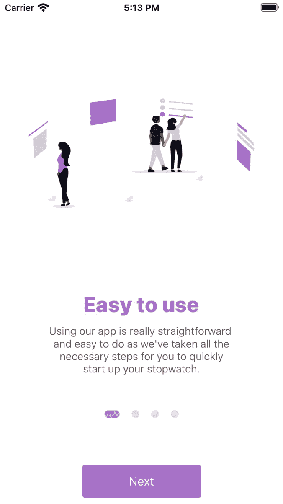

图 10.1 - 我们将创建的入职屏幕

这看起来很酷，对吧？它将由四个不同的屏幕组成，每个屏幕都有不同的图像、标题和描述。我们将能够向左/向右滑动以前进并阅读所有屏幕，同时也可以按下“下一步”按钮，它将为我们滑动。文本后面的四个小点将被动画显示，以告诉我们当前在哪个屏幕上。

老实说，我真的很喜欢它的外观，我迫不及待地想完成这个入门屏幕，这样我们就可以开始创建完整的应用程序了。在本章结束时，你将准备好开始创建入门屏幕。

现在，让我们开始工作在我们的屏幕上。

# 创建一个新项目

现在我们知道了我们的项目将是什么样子，以及为什么需要这个屏幕，是时候开始工作了。

在编码之前，让我们收集我们将在这个项目中使用的图像。我使用了来自[`undraw.co`](https://undraw.co)的图像，该网站提供开源的`.svg`和`.png`图像。我下载了四个不同的`.png`图像，并将它们放在`assets/onboarding`文件夹中。`onboarding`文件夹是我专门为这个屏幕在`assets`文件夹中创建的新文件夹。

让我们从打开终端窗口并移动到你通常用于项目的目录开始。现在，让我们写下我们通常的命令，开始吧：

```jsx
expo init chapter10
```

现在我们有了一个新项目，让我们安装 Galio。我们可以使用以下终端命令来做到这一点：

```jsx
npm i galio-framework
```

现在我们已经设置好了一切，让我们打开我们的项目并开始编码。

首先，我们将从做我们一直在做的老把戏开始，那就是进入我们的`App.js`文件，并删除`App()`函数中`View`内的所有内容。我故意略过了`<StatusBar />`组件，因为你可能希望对其进行样式设置或隐藏。

现在，在我们的主文件夹中，让我们创建一个名为`components`的文件夹。这是我们将放置为这个美丽的应用程序创建的每个组件的地方。在本章结束时，你将在这个文件夹中有三个文件。

现在我们的文件夹已经创建好了，在其中创建一个名为`Onboarding.js`的新文件。这将作为我们的主屏幕。现在，让我们快速创建并导出这个组件，以便我们可以将其导入到我们的主`App.js`文件中。

我们已经做过很多次了，但这一次我们将使用`SafeAreaView`而不是`Block`或`View`组件作为屏幕的父组件。我们使用这个是因为我们希望确保一切都被照顾到，以防我们应用的用户有一个带有刘海的手机：

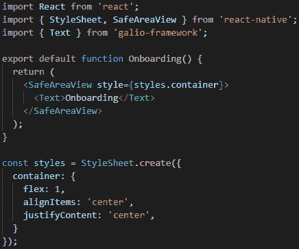

图 10.2 - 准备好导入的入职组件

现在我们已经完成了编写这个函数，让我们继续将其导入到`App.js`中。一旦导入，我们就可以在我们的主函数中使用它。现在，主函数应该看起来像这样：

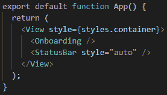

图 10.3 - 导入 Onboarding 的主 App 函数

现在，我们准备继续开发我们的应用。因为我们已经在`App`函数中导入了`Onboarding`组件，所以每次保存文件时，我们都可以看到我们要修改和添加我们的`Onboarding`组件。

让我们回到`Onboarding.js`，考虑一下我们应该如何开始处理我们的入职屏幕。

通过查看*图 10.1*，我们知道这个屏幕有三个主要可识别的部分。还记得我们讨论过需要始终从更大的容器的角度来看待屏幕，以了解如何在开始编码之前创建布局吗？好吧，这就是同样的道理，所以让我们将我们的屏幕分成这三个主要部分：

+   **OnboardingItem**：这个区域是屏幕上部，四个点之前的部分。它将包括一张图片，一个标题和一个描述。这个区域需要被设置为一个大区域，因为它将随着每次滑动而改变。

+   **分页**：四个小点显示了我们在这个大滑块中的位置。这样，我们总是知道还有多少内容要阅读，直到我们到达最后一张幻灯片。

+   **下一步按钮**：这个按钮将移动幻灯片，而无需滑动，同时也是我们需要按下的最后一件事，从入职屏幕转到主屏幕。

知道有三个部分应该会让事情更容易绘制。首先，我们应该从主区域开始，这也是最大的区域。让我们进入我们的`components`文件夹，创建一个名为`OnboardingItem.js`的新文件。

## OnboardingItem

正如我们之前提到的，这个组件应该渲染屏幕顶部，其中包含一张图片、一些文本和描述。让我们就这样做。继续从`'galio-framework'`中导入`Block`和`Text`组件，以及从`'react-native'`中导入`Image`和`StyleSheet`。

一旦我们导入了所有需要的东西，就是开始构建我们的组件的时候了。我们将首先有一个主要的`<Block />`组件，它将被放在我们的`<Image />`中，并且另一个`<Block />`组件。第二个`<Block />`组件将有两个`<Text />`组件作为子元素 - 一个用于标题，一个用于描述。这个第二个`<Block />`组件将被用来将屏幕分成主要区域，它将占用更多的空间，因为它将是一张图片，和次要区域，它应该更小，因为它只包含文本。

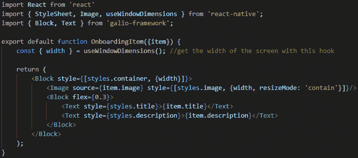

图 10.4 - OnboardingItem 组件

正如你所看到的，这里有一个小惊喜。首先，我导入了`useWindowDimensions`。这是一个返回屏幕宽度或高度的`hook`函数。这是一个简单的方法，可以确保你的组件的宽度等于屏幕的宽度。

我还导入了一个名为`item`的属性。因为这是一个入职屏幕，我们将至少有四个屏幕，每个屏幕都有不同类型的文本或图像。我们将通过这个名为`item`的属性传递一个对象，以及所有必要的信息。这样，我们可以确保一切都会到达我们想要到达的确切位置，而且我们不必再浪费时间为组件的每个部分编写属性。

所有的样式已经应用了，但我们还没有讨论过它们。所以，让我们看一下这些样式：

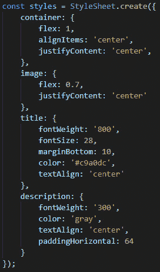

图 10.5 - 我们的 OnboardingItem 组件的样式

正如我们所看到的，容器有一个`flex: 1`的属性，告诉我们的主要`<Block />`组件尽可能占据空间。我们给我们的`image`一个`flex: 0.7`的属性，因为我们希望它占据 70%的空间，而`title`和`description`只需要占据 30%的空间。其他样式只是通常的文本样式，我们设置了`fontSize`和`fontWeight`。

每日提示

我无法再次强调看图片来理解代码的重要性。我相信你应该先看图片，尝试在脑海中建立所有的连接，然后看看你是否*幸运*。不过我不会称之为运气，我会称之为更多的是一个经过深思熟虑的猜测。

现在我们已经创建了`OnboardingItem`组件，我们准备将它导入到我们的`Onboarding.js`文件中，这是我们的主屏幕所在的地方。我们都知道如何导入一个组件，但为了确保，我们必须写下以下行：

```jsx
import OnboardingItem from './OnboardingItem';
```

现在我们已经做到了这一点，我们可以开始使用`FlatList`在屏幕上呈现所有的项目。

## FlatList

正如我们之前提到的，我们不想重复自己，所以我们不会在我们的主要 onboarding 组件内写四次相同的代码。你脑海中可能首先想到的是使用`.map()`函数。这是一个好猜测，但 React Native 有一个组件通常被使用，因为它的性能更好。它还有一些内置的 props，在这种情况下可以拯救生命。这个组件叫做`FlatList`。

要使用这个组件，我们需要用一个元素数组来证明它，这些元素必须映射到我们一直在创建的组件上。我之前提到过，我们的`OnboardingItem`组件将接受一个名为`item`的 prop。这个 prop 将是数组中的一个对象。

如果我们看一下*图 10.4*，我们可以从我们在组件内部使用它的方式来确定我们的对象应该是什么样子的。我们知道它需要有一个`title`，`description`和`image`，但它还需要一个`id`。

让我们在我们的根（主）文件夹中创建一个名为`slides.js`的新文件。这是包含我们 onboarding 需要的所有对象信息的数组所在的地方，如下面的截图所示：

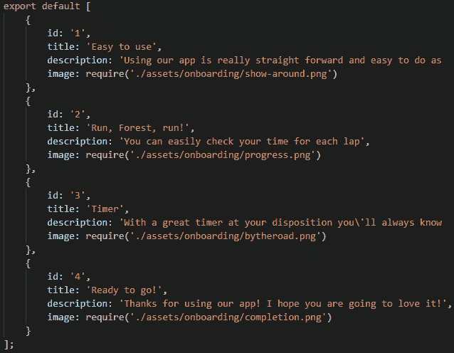

图 10.6 - 包含 FlatList 组件所需信息的数组

不要忘记你可以拥有任何类型的信息。标题、描述或图片不必与我的相同。记住，当我们开始创建我们的应用程序时，我告诉过你要下载一些图片并将它们放在`./assets/onboarding`文件夹中。这些就是我选择的图片，我使用`require`关键字导入它们。

`require`关键字的使用方式与`import`一样，它告诉 JavaScript 引擎需要将文件定位到指定的位置。

现在我们已经准备好了用于`FlatList`的数据数组，是时候回到我们的`Onboarding.js`文件，并像这样导入这个新文件了：

```jsx
import slides from '../slides';
```

现在，让我们确保当我们需要时，我们已经准备好其余的导入，因为我们需要一些更多的组件。首先，我们将删除`Text`导入，并从`'galio-framework'`导入`Block`和`Button`组件。其次，我们将将`FlatList`添加到导入组件的列表中：

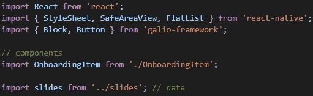

图 10.7-添加到 Onboarding.js 文件的新导入

现在一切都已经导入，我们准备开始开发屏幕。我们将从`<SafeAreaView />`组件中删除我们的`<Text />`组件，并改用带有`flex={3}`属性的`<Block />`组件。

在这个`<Block />`组件内部，我们的`<FlatList />`组件将开始自己的生活。让我们先看看我是如何实现这个组件的，然后再解释它是如何工作的：

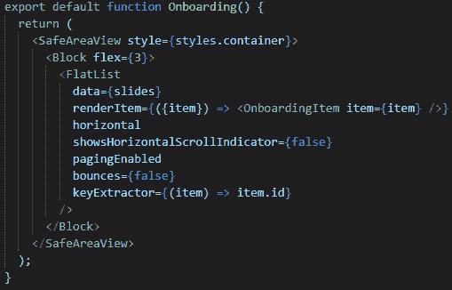

图 10.8-在我们的引导屏幕中实现的 FlatList

正如你所看到的，实现这个似乎非常简单。顺便说一句，如果你现在将这段代码复制到你的编辑器中（假设你之前也一直在跟着做其他事情），并尝试在模拟器上查看你的应用程序，你会看到一个完全工作的引导屏幕。是的，它看起来不像我们在本章开头展示的那样好，但它是工作的-我们可以左右滑动并查看我们在`slides.js`文件中编写的所有信息。

现在，让我们看看这个组件是如何工作的：

1.  首先，我们将从`data`属性开始。这是我们向`FlatList`组件提供数组以开始渲染每个元素的地方。

1.  然后，我们有`renderItem`属性，这是我们使用函数来渲染我们需要的项目的地方。在这种情况下，我们需要多个`<OnboardingItem />`的实例。

记得我说过我们将向这个组件传递一个叫做 `item` 的 prop 吗？这是因为我们只需要从数组中传递一个对象。我们的 `FlatList` 组件将把每个对象传递给不同的 `<OnboardingItem />` 组件。一旦我们做到了这一点，我们就可以捕获那个对象，并以任何我们认为合适的方式使用它。

1.  `keyExtractor` prop 用于提取特定项目在相应索引处的唯一键。

这些键用于缓存，以便 React 可以单独跟踪每个项目，并且只重新渲染必须重新渲染的项目。你还记得我们在使用 `.map()` 函数渲染项目时是如何使用 `key` 属性的吗？这是一样的，但所有的工作都是由这个属性完成的。这就是为什么我们需要在 `slides` 数组的对象中有一个 `id` 键。

1.  其余的 props 主要用于布局目的。我强烈鼓励你们通过打开和关闭这些 props 来玩耍。例如，`horizontal` prop 使我们的列表，嗯，水平。

现在我们已经成功构建了我们的元素列表，这是创建一个出色的入门体验的第一步，让我们开始构建分页器。

# 这四个小点在屏幕上显示分页器。它的主要目的是向用户显示他们当前正在查看的幻灯片，同时显示进度的感觉。这个小组件实现起来并不那么困难，但我们要使用的功能确保这个东西能够正常工作对我们来说是新的。

分页器

我们将为这个组件工作的最重要的对象之一是 `Animated` 对象。这是因为我们要动画化我们的点的宽度和不透明度。这也很重要，因为我们希望确保动画发生在正确的时刻。当然，正确的时刻是当用户与 `FlatList` 交互时。如果你的手指从右向左移动，我们希望动画也以与你的手指相同的速度移动。

我们还将使用一个很酷的新 Hook，叫做 `useRef`。当我们需要一个在组件整个生命周期内持续存在的可变对象时，就会使用这个 Hook。`useRef` 不会导致组件在其值更改时重新渲染，因为它不是一个状态变量，但这确实是一种确保您在每次渲染时都会得到相同 `ref` 对象的好方法。

所以，让我们开始这个很酷的小组件，我相信你会发现它对未来的应用程序很有帮助和可重用性。我们将从`Onboarding.js`开始。让我们首先从`'react'`中导入`useState`和`useRef`。我们还将从`'react-native'`中导入`Animated`。导入所有这些之后，我们就准备好继续了：

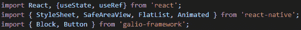

图 10.9 – 我们 Onboarding 组件的全新导入

现在，让我们开始实现我们`Paginator`组件所需的一切。我们将首先创建两个新的引用对象，然后在我们的`FlatList`组件中实现它们：

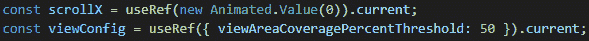

图 10.10 – 我们新创建的引用

让我们解释一下这是如何工作的。首先，我们将从`scrollX`开始。这个变量有很多事情要做，所以让我们从头开始。我们使用`useRef` Hook 创建一个新的引用对象，并用`Animated.Value(0)`初始化这个新变量。

`Animated.Value` 创建一个可以被动画化的值。如果我们只用一个数字比如`0`来初始化这个变量，React Native 在处理动画时就不知道该怎么处理了。

`useRef` Hook 返回一个像这样的对象：

```jsx
{ current: … }
```

要访问`current`中存储的值，我们必须写`scrollX.current`。一个解决方法是让 JavaScript 知道我们想要通过在`useRef` Hook 后面链接`.current`来访问那个值。

`viewConfig`变量的工作方式就像你期望的那样。在这里，我们必须创建一个新的引用对象，并用*图 10.10*中显示的对象`{ viewAreaCoveragePercentThreshold: 50 }`来初始化它。现在，让我们在我们的`FlatList`组件中使用这两个新变量：

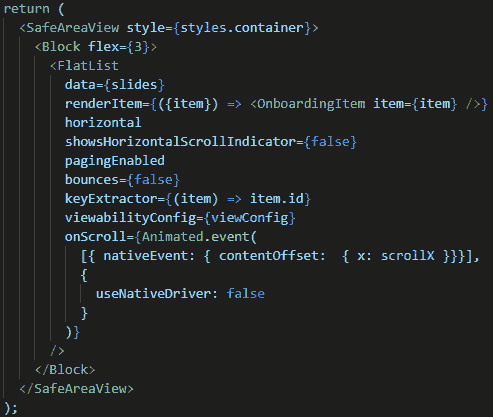

图 10.11 – 在 FlatList 中实现我们的新变量

现在可能看起来有点复杂，但实际上比看起来要简单得多。有了这个，我们为我们的`<FlatList />`组件添加了两个新的 props，分别是`onScroll`和`viewabilityConfig`。

`viewabilityConfig`属性在这里支持我们的`pagingEnabled`属性，它告诉我们的组件列表根据用户滑动的距离移动到下一个或上一个幻灯片。通过将`viewabilityConfig`的`viewAreaCoveragePercentThreshold`值设置为 50，我们告诉我们的组件只有在用户已经滑动了当前幻灯片的 50%或更多时才会转到下一个幻灯片。

`onScroll`属性在用户滚动我们的引导屏幕的幻灯片时触发一个函数。你可能想知道`Animated.event`是什么？它将一个动画值映射到一个事件值。我同意，这个函数看起来很混乱，但如果我们学会如何阅读它，就很容易理解。所以，我们将我们的`scrollX`值映射到`nativeEvent.contentOffset.x`事件值。这个事件值通常传递给`onScroll`回调函数，所以记住你可能会经常看到或使用它。

`Animated.event`函数接受两个参数。第一个参数是我们要映射到我们的**Animated**值的值数组。这个`event()`函数通过在映射的输出上调用`setValue()`函数来实现这一点；在这种情况下，是在`scrollX`上。第二个参数是一个`configuration`对象，我们在这里告诉 React Native 我们不想使用本地驱动程序来进行动画。

你可能会认为通过使用本地驱动程序，我们可能会有更好的性能，这是正确的。我们之所以不想在这种特定的用例中使用本地驱动程序的原因是因为我们将要动画化我们的点的宽度，而现在，React Native 不能使用本地驱动程序来动画化宽度或一般的布局属性。

现在我们知道为什么我们需要`scrollX`和`viewConfig`，我们应该开始构建我们的新组件。在`components/`文件夹内创建一个名为`Paginator.js`的新文件。现在我们已经创建了一个新文件，我们应该开始构建我们的功能组件。

我们将从`'react-native'`中导入所有必要的内容；即`StyleSheet`、`View`、`Animated`和`useWindowDimensions`。下一步是构建我们的函数：

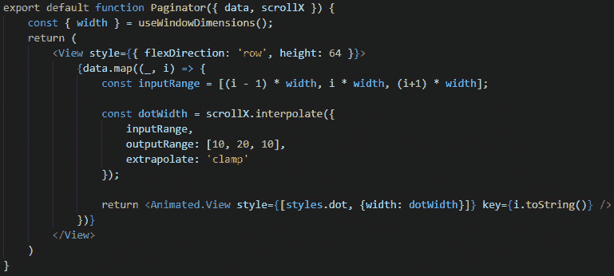

图 10.12 – Paginator 组件几乎完成

这里有很多新东西，所以让我们从上到下开始解释一切。

这个组件，我们称之为`Paginator`，接受两个名为`data`和`scrollX`的 props。`data`是我们传递给`FlatList`的对象数组，而`scrollX`是我们在`Onboarding.js`文件（我们的父组件）中定义的`Animated`值。

我们已经讨论过`useWindowDimensions()` Hook 返回屏幕的`width`和`height`属性，所以这应该很容易理解。

我们给`<View />`组件的样式设置了`flexDirection: 'row'`和`height`为`64px`，这个组件包含了我们组件的*灵魂*。我们这样做是为了确保我们将要创建的点会很好地排列在一行中。

之后，我们使用`.map()`函数来映射数组。正如你所看到的，`map()`函数接受一个回调函数，该函数接受两个参数。第一个参数`_`将是我们的元素，而第二个参数`i`将给出该元素的索引。

因此，对于数组中的每个元素，我们都在创建一个点。我们如何做到这一点呢？让我们直接跳到我们的`return`语句来找出答案。在这里，我们返回一个应用了`styles.dot`的`<View />`组件。我们之所以称它为`<Animated.View />`是因为我们想要动画化这个组件。但在我们开始动画化它之前，这可能只是一个普通的`<View />`组件：

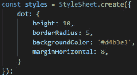

图 10.13 – 我们的点的样式

这些是我们用来创建点的样式。正如你所看到的，没有`width`，这是因为我们想要动画化点的宽度。然而，如果我们永远不想要动画化它，我们本来可以直接给它一个`width`为`10px`。

那么，让我们回到如何动画化我们点的宽度。正如你所看到的，我们有一个名为`inputRange`的变量，它是基于屏幕宽度和我们点的索引的值数组。我们知道，幻灯片占据了屏幕的整个宽度。知道这一点，我们可以理解当`contentOffset.x`等于屏幕宽度时，幻灯片已经改变了。它被称为`contentOffset`，因为它给出了两个元素之间的偏移量。当第一张幻灯片在屏幕上时，它从`0`开始。一旦该幻灯片移出屏幕，下一张幻灯片进入时，最后一张幻灯片和下一张幻灯片之间的差值等于屏幕的宽度。了解`contentOffset`的工作原理使我们能够考虑一种开始创建动画的方法。

*到底是什么构成了动画？* 我觉得这是一个很好的地方，我们可以定义动画是如何工作的。让我们想象屏幕上有一个盒子，每当有人按下按钮，我们希望那个盒子出现。当然，它可以突然出现在屏幕上，但那看起来不太好。这就是动画发挥作用的地方。与其突然出现在屏幕上，不如我们有一个更平滑的过渡。如果盒子在一段时间内过渡到存在状态呢？那看起来更像是一个动画，对吧？

这与我们在这里应用的概念相同：我们希望我们点的移动完全与幻灯片的移动同步。因此，我们需要我们点的宽度在我们在屏幕上移动手指的同时增长，因为这会为我们的用户创造更流畅的体验。

牢记这一点，我们已经将`scrollX`的动画值映射到我们的`nativeEvent.contentOffset.x`事件值。现在，我们可以通过`scrollx`访问水平列表中两个元素之间的确切变化量。根据这个量，我们需要改变宽度。

但是有一个*问题*：我们点的`高度`是`10px`，所以如果我们希望我们的点是一个点，那么我们也需要`宽度`是`10px`。问题是我们的`scrollX`会远远超过`10px`，因为我们屏幕的宽度更大，那么我们如何让 React Native 知道我们希望我们当前的点具有更大的宽度，而其余的点的宽度为`10px`呢？通过**插值**。

## 插值

所以，让我们简要回顾一下。我们希望与我们正在查看的幻灯片对应的点具有比我们视野之外的幻灯片对应的点更大的宽度（假设为`20px`）。我们唯一能做到这一点的方法就是插值。

插值是我们根据提供的输入来估计函数输出的方式。

假设我们有一个函数，我们只知道`f(0) = 0`和`f(10) = 20`。你能猜到`f(5)`将等于多少吗？

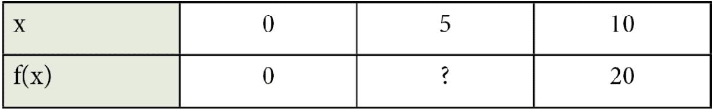

根据这个表格，我们可以建议`10`作为我们问题的答案，因为`5`介于`0`和`10`之间，而我们知道答案应该介于`0`和`20`之间。这种直观的方法就是插值所做的事情。

所以，现在我们知道我们的值需要如何行为，我们可以看一下点宽度的插值函数：

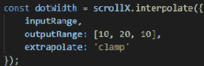

图 10.14 - 插值函数

所以，我们希望这个函数根据用户当前位置返回一个介于`10`和`20`之间的值。我们的`inputRange`变量，正如我们之前提到的，是由特定幻灯片的索引和屏幕宽度定义的。`inputRange`变量中的第一个值由前一个幻灯片表示，第二个值由当前幻灯片表示，第三个值由下一个幻灯片表示。基于这个输入，我们创建了一个`outputRange`，在这个范围内，我们知道前一个幻灯片的点应该有`10px`的宽度，当前幻灯片的点的宽度应该是`20px`，下一个幻灯片的点的宽度应该是`10px`。

根据`inputRange`猜测应返回哪个值是 React Native 的工作，但我们真正感兴趣的是值本身。现在，我们可以去我们的`<Animated.View />`组件，让每个点的宽度等于`dotWidth`，这是插值给我们的值。现在，宽度将随着用户滑动手指而改变。

## 外推

我们还有另一个很酷的小东西叫做`extrapolate`。所以，我们知道我们的`inputRange`只考虑了前一个、当前和下一个幻灯片，但第四个呢？因为我们没有为第四个指定任何值，React Native 可以开始猜测宽度应该是多少。

如果我们在没有外推的情况下运行代码，可能会看到一些奇怪的结果。我鼓励你删除`extrapolate`行，看看发生了什么。

我们可以通过将`extrapolate`添加到我们的`interpolate`函数中来解决这些奇怪的结果。这将告诉 React Native*在我们提供的范围之外应该发生什么*，以及外部值应该遵循什么样的模式。当我们不知道范围的边界时，这非常有用。在这种情况下，解决方案将是**夹紧**你的范围。这意味着无论范围之前或之后发生什么，我们都将保留最后给定的值。

通过使用`extrapolate: 'clamp'`，你将夹紧范围的两侧，但如果特定情况需要，你也可以只夹紧你需要的范围的一侧。这意味着你可以夹紧范围的左侧或右侧。

提示

外推的默认模式是`extend`，这是 React Native 猜测我们范围的值。

太棒了！现在我们已经解释了如何插值和外推，我们已经理解了`dotWidth`变量是如何改变的（以及基于什么）。因为这一切都是用`scrollX`动画值完成的，我们已经将`dotWidth`变量放在了`<Animated.View />`中。现在，我们的宽度根据我们的滚动行为而改变。

还剩下什么？嗯，我觉得看到不透明度也在变化会很酷。当前的点应该具有等于`1`的不透明度，而其他点应该具有`0.4`的不透明度。根据这些信息，试着自己做一下。

如果你做不到，不要担心！这比看起来要容易得多。让我来演示给你看！

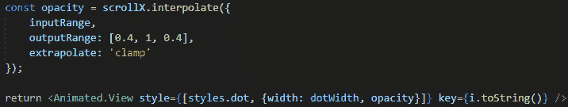

图 10.15 – 动画化我们的点的不透明度

看起来并不难，对吧？我们做了和`dotWidth`一样的事情，但这次我们创建了一个名为`opacity`的新变量。我们知道元素的不透明度在`0`和`1`之间，所以我们改变了`outputRange`以适应我们的需求。

之后，我们在`<Animated.View />`组件的`style`属性中引入了我们的不透明度值。

现在我们已经完成了`Paginator`组件，我们应该在`Onboarding.js`文件中实现它。我们已经知道如何做了：导入组件，然后将其放在具有`flex`为`3`的`<Block />`组件下面。不要忘记传递必要的 props。

通过构建这个`Paginator`组件，我们学到了很多关于动画应该如何工作的东西，对此我必须向你表示祝贺！在本章中，我们取得了一些令人印象深刻的进展。现在，是时候开始为我们的屏幕添加一些功能了。让我们学习如何做到这一点。

# 自动滚动

为了完成这个项目的构建，我们需要创建一个按钮，当我们按下它时移动幻灯片。我们已经从'galio-framework'导入了`<Button />`组件，所以让我们在`<Paginator />`组件下面实现它：

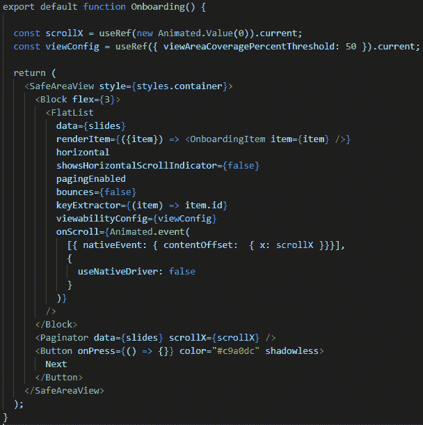

图 10.16 – 将按钮组件添加到我们的引导屏幕上

正如你所看到的，我在`<Paginator />`下面实现了`Button`。我添加了与我们的图像和点相同的颜色，并通过`shadowless`属性去除了阴影。现在我们知道我们的函数需要在按下按钮时被调用，我们需要创建一个函数，然后将其链接到我们的`onPress`属性。

但在这之前，我们需要确保我们已经准备好让我们的按钮在需要时起作用。

首先，我们需要考虑如何在不通过滑动列表的情况下到达下一张幻灯片。嗯，我们需要一个对`FlatList`组件的引用。拥有对该对象的引用允许我们在需要时从外部函数控制它。

其次，我们需要跟踪我们的幻灯片，因为我们需要始终知道我们在哪张幻灯片上。我们可以通过一个状态变量来实现，该变量跟踪当前在屏幕上显示的索引。

现在，让我们先解决这些问题，然后再看看我们需要做什么来确保这个工作。

让我们使用我们已经导入的`useState` Hook 来创建一个状态变量：

```jsx
const [currentIndex, setCurrentIndex] = useState(0);
```

这里是我们将存储当前显示幻灯片的索引。

现在，让我们创建一个 ref 变量：

```jsx
const slidesRef = useRef(null);
```

一旦我们完成创建我们的 ref 变量，我们应该将它应用到我们的`<FlatList />`组件上。我们可以使用`ref={slidesRef}`来做到这一点。

接下来，我们将使用`FlatList`已经提供给我们的一个属性，叫做`onViewableItemsChange`。每当你滚动`FlatList`时，`FlatList`上的项目也会发生变化。当这些项目发生变化时，将调用这个函数，告诉你当前有哪些`viewableItems`。这个属性应该始终与`viewabilityConfig`一起使用。当满足`viewabilityConfig`的相应条件时，`onViewableItemsChange`函数将被调用。

这将帮助我们确保我们始终有正确的索引来显示幻灯片。因此，在函数内部，我们必须确保将当前索引设置为正在显示的索引：

```jsx
const viewableItemsChanged = useRef(({ viewableItems }) => {
    setCurrentIndex(viewableItems[0].index);
}).current;
```

看起来有点奇怪，但正如我们之前讨论的那样，该函数将返回当前的`viewableItems`。

问题是...一次只能显示一个项目，所以`viewableItems`数组将只有一个元素。因为我们感兴趣的是该元素的索引，所以我们设置`currentIndex`状态变量，使其等于`viewableItems[0].index`。

现在我们知道当前显示的幻灯片是哪一个，下一步就是滚动到`currentIndex + 1`。例如，如果我们正在查看第一张幻灯片，那么我们的`currentIndex`应该等于`0`。自然而然，下一张幻灯片将是`currentIndex + 1`，也就是`1`：

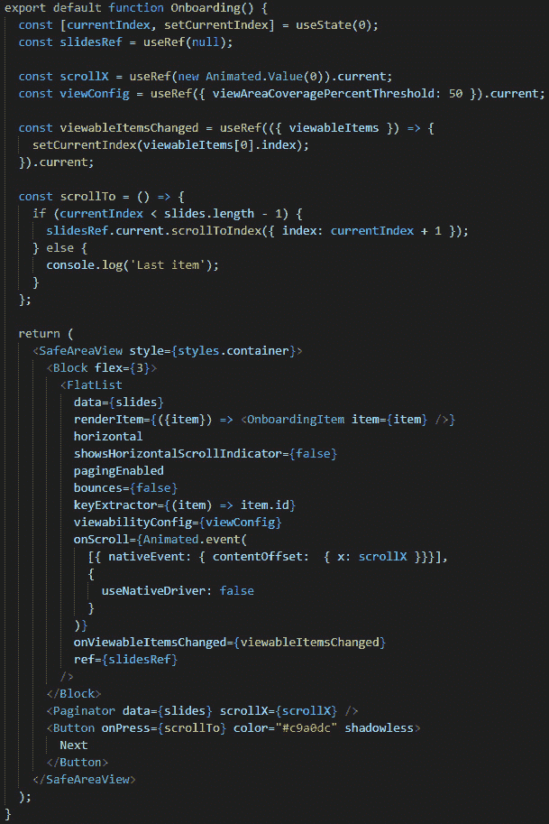

图 10.17 - 最终的 Onboarding 组件

现在我们已经完成了`viewableItemsChanged`，并且使用了我们的`onViewableItemsChange`属性的变量，让我们解释一下`scrollTo`函数是如何工作的。

正如你所看到的，我们创建了一个名为`scrollTo`的函数，每当我们按下按钮时就会调用它。这个函数检查`currentIndex`，因为我们希望基于是否显示最后一张幻灯片来采取不同类型的行为。如果这是最后一张幻灯片，我们暂时不做任何事情，但如果是前三张幻灯片，我们希望它滚动到下一张幻灯片。

正如你所看到的，滚动到下一张幻灯片非常容易 - 我们所要做的就是使用我们对`<FlatList />`组件的引用，并使用`scrollToIndex`函数。该函数需要一个参数，告诉它要跳转到哪个索引。

现在，我们可以点击**保存**，重新加载我们的应用程序，然后我们就拥有了一个漂亮的入职屏幕，带有一些很酷的小动画，以及一个很好的功能，可以在我们除了按钮之外什么都不触摸的情况下滚动幻灯片。这是一个漫长的旅程，但我相信你会觉得这是值得的，现在我们已经看到了我们的能力。

在下一章中，我们将构建我们应用程序的其余部分，但为了获得良好的体验，我们将在我们的应用程序中使用这个入职屏幕。这将确保在幻灯片的末尾，我们的按钮将直接跳转到应用程序。

# 摘要

这一章是我们迄今为止克服的最艰难的挑战之一。我们经历了很多新概念，但最终，我们可以高兴地说，我们成功地为我们的用户创建了一个很棒的入职体验。更好的是，我们创建了一个很好的入职体验，每当我们吹嘘我们的应用程序时，我们都会享受到它。

我们首先发现了这个应用程序的外观，然后经历了所有必要的步骤来制作该应用程序。我们看到了创建一个漂亮的元素列表需要什么，这让我们接触到了`FlatList`。我们在我们的入门屏幕的核心使用了这个组件，将来当你遇到大量元素的列表时，你肯定会继续使用它。

我们还学会了如何创建动画，以及插值是如何工作的。通过这样做，我们成功地创建了一个很酷的小分页器，显示我们的用户正在看到的当前幻灯片。

最后，我们甚至发现我们可以通过按按钮而不是左右滑动来使事情运转。为此，我们使用了一个引用对象，每当我们按下按钮时，它就会从另一个函数中调用。

这一章可能有点多，但我觉得你已经准备好了。我希望你也为下一章做好了准备，因为我们将完成这个移动应用程序！
