# 第十一章：让我们构建 - 秒表应用

在上一章中，我们通过创建引导屏幕构建了我们酷炫的秒表应用的开头。现在，是时候通过构建用户将要使用的其他功能来完成我们的应用程序了。

我们将学到很多新东西，到本章结束时，我们将拥有一个相当酷的应用程序，我希望它能激励你为世界其他地方创建更多有用的应用程序。到目前为止，我们学到的东西以及将继续学习的东西应该为你提供创建简单小型应用程序所需的所有工具，而无需另一个教程。即便如此，有时你会发现自己在互联网上四处寻找解决问题的方法，这没关系。我们都会这样做，所以每当你找到解决方案并使其起作用时，都要感到高兴。

为了构建这个 React Native 移动应用程序，我们将首先通过使用 React Navigation 库将我们的引导屏幕链接到我们的实际应用程序。这将帮助我们轻松地构建屏幕的导航。

之后，我们将开始着手应用的秒表部分。创建秒表功能非常直接，但并不像你想象的那样直观。

一旦我们创建了秒表屏幕，我们将开始着手应用的另一部分，即计时器屏幕。这将教会我们如何播放声音，以及如何利用我们已经通过创建秒表应用学到的知识，但加入了一些小的变化。

最后，我们将学习关于本地存储以及如何使用它来确保我们的引导屏幕不会在每次打开应用程序时出现，因为这有点违背了有引导屏幕的初衷。所以，让我们准备好，享受编码的乐趣吧！

本章将涵盖以下主题：

+   链接到 React Navigation

+   创建秒表

+   创建计时器

+   完成我们的应用程序

# 技术要求

您可以通过访问 GitHub [`github.com/PacktPublishing/Lightning-Fast-Mobile-App-Development-with-Galio`](https://github.com/PacktPublishing/Lightning-Fast-Mobile-App-Development-with-Galio) 查看本章的代码。您会发现一个名为`Chapter 11`的文件夹，其中包含本章中编写的所有代码。要使用该项目，请按照`README.md`文件中的说明进行操作。

# 链接到 React Navigation

我们将通过使用与*第十章*中先前使用的相同项目来开始这个挑战，*构建一个入职屏幕*。你为什么问？嗯，那是因为创建入职屏幕的目的正是这样 - 为我们的主要应用程序提供一些介绍。

所以，打开文件夹，准备好编码。我们将从导入我们需要连接我们的入职屏幕到任何我们将来创建的新屏幕所需的所有必要软件包开始。让我们打开我们的终端并移动到我们的项目文件夹。在那里，我们将开始编写以下命令：

```jsx
npm install @react-navigation/native
```

这将安装我们导航系统的基础。我们还需要安装这个软件包需要的所有依赖项，我们可以通过以下命令来做到这一点：

```jsx
expo install react-native-gesture-handler react-native-reanimated react-native-screens react-native-safe-area-context @react-native-community/masked-view
```

现在我们所有的依赖都已经安装好了，让我们谈谈**React Navigation**库。

对于试图使用 React Native 创建导航系统的人来说，有几个选项，但最常用的是 React Navigation。你可能想知道为什么会这样，我的答案是，这是它们中最受关注和功能齐全的库。我强烈建议深入研究他们的文档，你可以在[`reactnavigation.org/`](https://reactnavigation.org/)找到。

除了作为 React Native 的一个很好的导航库之外，它还有一种非常简单和直接的设置路由的方式，我们将在本章后面讨论。所以，除了易于使用之外，它还是完全可定制的，并且具有对 iOS 和 Android 的本地支持。你还能从一个导航库中要求什么呢？

让我们继续我们的应用程序，并考虑一切应该是什么样子。我想，一旦用户完成我们的入职屏幕，并且他们最后一次点击**下一步**按钮，我们的用户将被传送到另一个屏幕，直接到**秒表**屏幕。这个屏幕将有两个标签页：一个用于秒表，这是我们应用程序的主要用例，另一个用于**计时器**屏幕。

为了使其工作，我们需要从`@react-navigation`中获得两个新组件：`stack`和`bottom-tabs`。让我们用以下命令导入它们：

```jsx
npm install @react-navigation/stack
```

现在，是时候安装我们将要使用的下一个软件包了：

```jsx
npm install @react-navigation/bottom-tabs
```

现在一切都已经安装好了，是时候重新构建我们的项目，以便更好地控制我们的文件放在哪里了。

我们将在项目的根目录内创建一个名为`screens`的新文件夹。接下来，我们必须从`components`文件夹中复制并粘贴我们的`Onboarding.js`文件。

一旦您将该文件移动到正确的目录中，就是时候检查我们的文件，确保它们都链接到我们引导屏幕的新路径。我们还需要查看`Onboarding.js`内部是否有任何需要修改的导入。

我们在`Onboarding.js`内部需要更改的导入是我们在此屏幕内使用的组件：`OnboardingItem`和`Paginator`。因为这些组件不再在同一个文件夹中，我们必须确保它们以正确的路径导入。在我们的情况下，路径更改为`"../components/OnboardingItem"`：

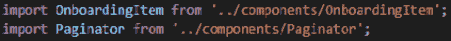

图 11.1-我们引导屏幕的新导入

因为我们已经在这里了，所以去`scrollTo()`函数。在`else`语句内部的`console.log()`行的位置，写入以下行：

```jsx
navigation.navigate('Tab Navigator');
```

这告诉`Button`一旦它到达引导屏幕的末尾，下一步是导航到下一个屏幕，名为`'Tab Navigator'`。当我们创建我们的路由系统时，我们将介绍这个屏幕。因为我们使用了一个名为`navigation`的变量，我们还应该让我们的组件知道从哪里获取它。在我们定义`Onboarding`函数的地方上面直接，并在括号之间，我们将允许我们的函数接收这个属性，称为`navigation`，就像这样：

```jsx
export default function Onboarding({ navigation }) {
```

现在，如果我们想要一个正常运行的应用程序，我们需要去`App.js`并且也更改引导屏幕的导入为正确的路径。一旦我们用正确的导入完成了更改，我们可以保存并运行应用程序。什么都不应该改变；我们所做的只是添加了一个新的目录，这样我们就有了更好的文件夹结构。一些文本编辑器或 IDE 会自动为您更改导入，所以请确保您始终阅读可能弹出的任何消息。

每日提示

我经常刷新我的应用程序并检查更改或错误消息，特别是当应用程序内的所有更改不应该在视觉上改变任何东西时。这样，我就可以确保我始终了解应用程序在重新渲染时发生的任何事情。

现在我们有了一个新的文件夹结构，我们可以开始创建应用程序所需的路由。但首先，我们需要为即将使用的屏幕创建一些占位符。因此，让我们在我们的`screens`文件夹中创建两个新文件：`Stopwatch.js`和`Timer.js`。

对于这两个文件，除了我们的函数名称之外，我们将拥有相同的代码，这些函数将被写在`<Text />`组件内。在我们开始深入了解应用程序的功能之前，我们需要这些文件来测试我们的路由是否正常工作。

让我们看看那个占位屏幕是什么样子的：

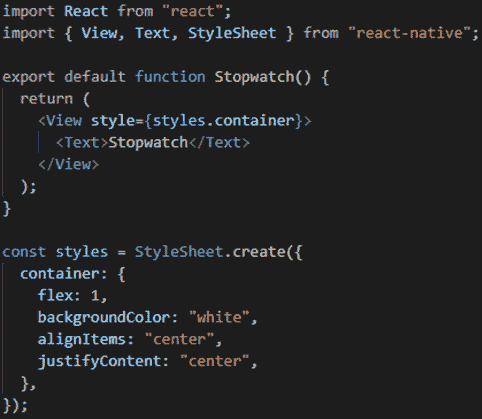

图 11.2 - 用于测试路由的占位屏幕

这个示例是专门为`Stopwatch.js`文件创建的。您还需要为`Timer.js`创建第二个文件。正如我已经指定的，这一个和 Timer 的区别将在函数的名称和`<Text />`组件内的内容上。其余部分应该是相同的，因为我们只是使用这些文件来测试我们的路由。

现在我们在`screens`文件夹中有了这两个新文件，我们可以继续在我们的根目录中创建一个名为`routes.js`的新文件。这是我们将为我们很酷的小应用程序创建路由系统的地方。

创建了新文件之后，我们可以打开它并开始编码。我们将首先导入所有我们将在这个路由系统中需要的必要包和文件。您可以通过查看以下截图来看到我正在导入哪些包：

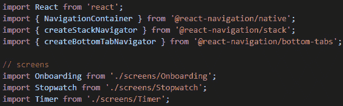

图 11.3 - 用于 routes.js 的导入

现在，正如你所看到的，我们已经从`@react-navigation`中导入了所有主要的包。我们首先导入了 React，因为我们需要它来创建这个基于组件的路由系统。接下来是`NavigationContainer`组件，它是从`@react-navigation/native`中导入的。这个组件处理管理应用的导航状态，并在顶层导航器和应用环境之间创建连接。

在此之后，我们导入了`createStackNavigator`和`createBottomTabNavigator`。要理解**堆栈导航器**的工作原理，我们必须开始将我们的屏幕视为一叠卡片中的卡片。您总是将新卡片放在旧卡片的顶部，以便您可以创建一叠卡片。这基本上就是 React Navigation 的工作方式，总是将一个新屏幕放在另一个屏幕的顶部。

**底部选项卡导航器**创建了通常在应用程序希望您更轻松访问主要功能时遇到的底部栏。这样，我们可以让用户快速在计时器和秒表之间切换，每个屏幕都可以从底部栏轻松访问。

一旦我们导入了创建应用程序路由系统所需的依赖项，就是时候导入我们将在此系统中使用的屏幕了。当然，入门屏幕非常重要，因为这必须是用户在看到的第一个屏幕，之后我们需要秒表和计时器屏幕。

现在我们导入完成了，是时候看看我们如何使用 React Navigation 来创建我们的路由系统了。我们将使用`createStackNavigator`和`createBottomTabNavigator`来创建我们将用作定义屏幕和导航器的组件的变量，所以现在让我们来做吧：

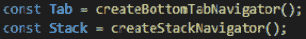

图 11.4 - 从我们的导航函数创建变量

拥有这些变量使我们能够创建易于阅读的路由系统。

让我们首先编写我们主要屏幕的函数；也就是秒表和计时器。这应该是一个普通的 React 函数，返回一个底部选项卡导航器的系统。因此，我们会使用`Tab`变量。让我们看看我们的函数是什么样子的：

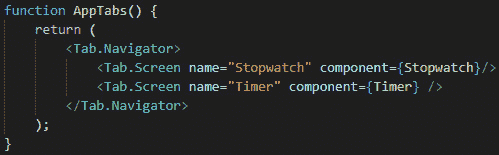

图 11.5 - 秒表和计时器屏幕的主屏幕路由

这看起来很容易理解，对吧？我们有一个`<Tab.Navigator />`组件，它有两个使用`<Tab.Screen />`组件作为子级的屏幕。`Navigator`组件就像胶水，让 React Native 知道这两个屏幕需要成为底部选项卡导航器的一部分。

对于像这样的每个路由系统，我们需要一个`Navigator`组件，然后一些`Screen`组件，让`Navigator`知道哪些屏幕是它的一部分。

我觉得这很简单易懂，任何人都可以开始为他们的应用程序创建路由系统。我鼓励你尽可能多地在应用程序中使用路由，看看你可以改变多少选项和东西。React Navigation 是非常可定制的，所以我相信你会对使用这个库的可能性感到惊讶。

现在，下一步是设置我们的主屏幕堆栈。我们将以与设置`AppTabs()`函数组件相同的方式来做，但这次，我们还将使用`<NavigationContainer />`组件，因为这将是我们的主路由组件：

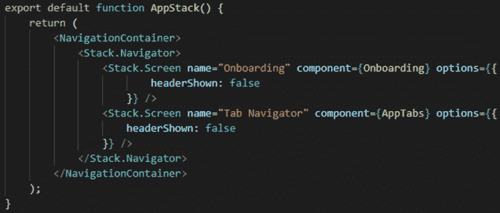

图 11.6-我们应用程序的主路由系统

看着我们的主函数代码可能会让你想知道这里发生了什么。不要担心-这并不难理解。因为这将是我们的主路由系统，我们使用了`<NavigationContainer />`组件。在它里面，我们有一个`<Stack.Navigator />`组件创建了一组可以叠加在一起的屏幕，就像一叠卡片一样。在这里，我们有两个屏幕：`Onboarding`屏幕和`AppTabs`屏幕。

正如我们之前看到的，我们已经将`AppTabs`屏幕组件定义为底部选项卡导航器屏幕，其中包含我们的两个主要屏幕：`Stopwatch`和`Timer`。

我们还有一个叫做`options`的`prop`应用在我们的两个`<Stack.Screen />`组件上。这个`prop`允许我们对我们的屏幕应用自定义特性。因为 React Native 默认在堆栈中的每个屏幕上启用了一个标题栏，我们必须摆脱它，所以我们给它一个值为`false`。如果我们没有指定这个，每次你进入这个屏幕，你会看到屏幕顶部的默认平台标题。

现在我们已经导出了这个函数，我们可以进入我们的`App.js`文件并应用我们的路由系统。但是这个文件里充满了我们不需要的东西，所以让我们清理一下。删除`App.js`中的所有内容，这样我们就可以开始以最佳方式重新编写它以适应我们的用例。

在清空文件内的所有内容后，我们可以开始导入 React。之后，导入我们在`routes.js`文件中之前定义的`AppStack`组件。现在，我们只需要创建一个名为`App()`的函数，它返回我们的`<AppStack />`组件，如下面的截图所示：

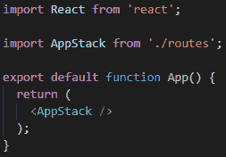

图 11.7 - 在进行所有必要的修改后的 App.js 文件

现在，我们的`App.js`文件看起来干净多了，我们已经成功地将我们的路由系统连接到了我们的 React Native 应用程序。你应该测试你的应用！保存所有内容，启动 Expo 服务器，然后打开你喜欢的模拟器或物理设备。

因为我们已经通过`navigation.navigate()`函数将引导屏幕链接到 Tab 导航器屏幕的`scrollTo()`函数，现在我们有了一个完全功能的路由系统。

现在你应该能够首先看到引导屏幕。点击**下一步**按钮，直到你到达最后一个屏幕。一旦你到达那里，再点击**下一步**一次，哇！你现在在`AppTabs()` Tab 导航器中了。这就是我们在`routes.js`文件中定义的组件。你可以点击**底部标签导航器**按钮快速切换秒表和计时器应用程序。

我们的 React Navigation 实现很成功！现在，是时候开始编写我们的秒表屏幕的功能了。

# 创建一个秒表

一些已经在 JavaScript 上有一些经验的人可能会认为创建一个秒表就像调用`setInterval()`函数并在每次迭代时减去一个数字那样简单。但实际上并不是这样，但不用担心 - 我们会尽可能地让每个人都能轻松理解，无论你在 JavaScript 方面的经验如何。

所以，让我们从打开我们的`Stopwatch.js`文件开始，我们可以在`screens`文件夹中找到它。现在，里面只有一些带有单词 Stopwatch 的文本，因为我们对主要的`<View />`组件进行了样式化。

老实说，我会先从这个文件中删除所有内容，然后从头开始导入。我们将从'react'中导入`React`、`useState`和`useEffect`。之后，我们将从'react-native'中导入`StyleSheet`和`SafeAreaView`。最后，我们将从'galio-framework'中导入`Text`、`Block`和`Button`组件。

在导入我们将用来创建这个屏幕的组件之后，现在是时候为我们建立一个静态屏幕作为起点了。让我们看一下以下代码，并尝试解释一下，因为这将成为我们的主要布局骨架：

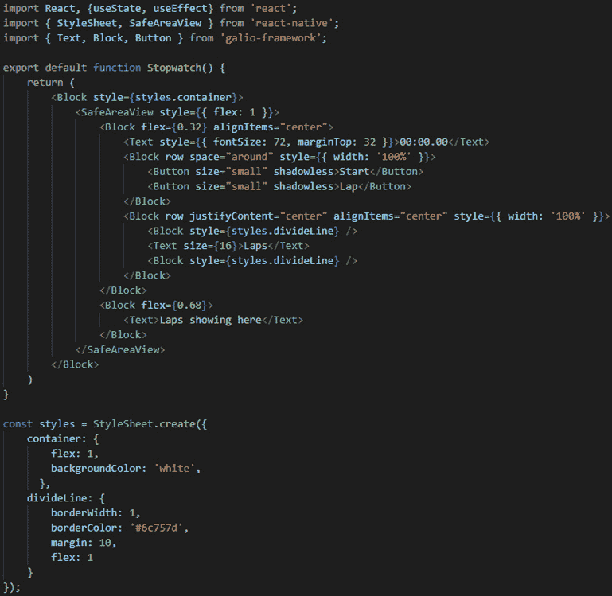

图 11.8 - 我们秒表组件的基本布局

嗯，这是一大块代码，让我们直接深入并解释一下。所以，在导入我们需要的一切之后，我们将开始编写我们的`Stopwatch()`函数组件。在其中，我们可以看到有一个大的`<Block/>`组件，然后是一个`<SafeAreaView />`组件。这些只是为了包含所有内容，并确保如果我们遇到有刘海的手机时不会出现任何问题。

到目前为止，一切都很容易，接下来会发生什么呢？我们必须将屏幕分成两个`<Block />`元素，一个具有`flex`属性为`0.32`，另一个具有`flex`属性为`0.68`。这样我们就可以确保屏幕的上半部分包含所有按钮和功能，然后屏幕的下半部分将显示所有的圈数。

在屏幕的上方，我们可以看到一个带有大字体大小的`<Text />`元素。这将是我们的时间，在添加所有功能后将会改变。之后，我们有另一个带有 row 属性的`<Block />`元素。里面有两个按钮。我们将使用这些按钮来启动/停止秒表，并在有人完成一圈时创建圈数。

之后，我们有另一个`<Block />`元素，其目的是使我们的布局对用户更直观一些。它将指出圈数将显示在该行下方。我们已经为这些线条创建了一些样式，你可以在`divideLine`下的样式对象中找到。

以下截图显示了这在我们的设备上的样子：

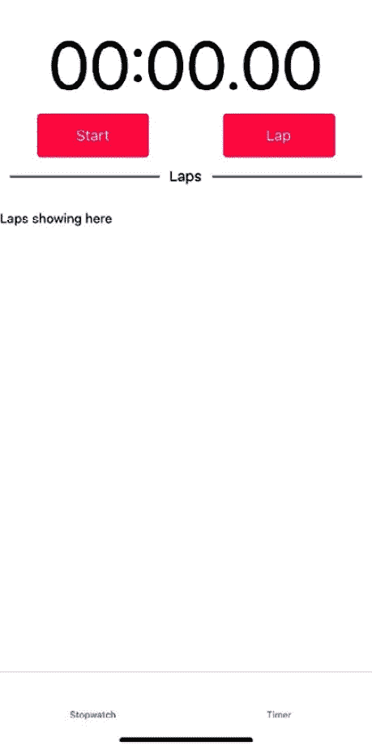

图 11.9 - 秒表屏幕的基本布局

很好！现在我们已经编写了基本布局，是时候开始工作屏幕功能了。我们应该首先定义一些状态变量，这些变量将在整个屏幕上使用。但在此之前，让我们回到一开始，思考一下为什么我说我们不能使用`setInterval()`函数来增加时间。

### 使用 setInterval

所以，`setInterval`是一个函数，它确切地做了你期望它做的事情。你设置一个时间间隔，比如 1,000 毫秒，也就是一秒，然后每秒都会调用一个你要定义的函数。你可能会认为在理论上，我们可以为我们的秒表屏幕功能做如下的事情：

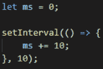

图 11.10 – 在基本示例中使用的 setInterval

这将非常有效。在这里，每 10ms，我们都会触发一个增加 10 的变量的函数。理论上，这很好，因为我们现在有了一个基本的用五行代码构建的秒表。但问题是，`setInterval()`并不那么可靠。

为什么我这么说呢？嗯，如果你看一下前面的函数，我们可以看到我们已经指定了 10ms 作为定时参数，所以我们的函数应该每 10ms 启动一次。然而，它不会在指定的时间执行代码。相反，它会等待*至少*10ms 才执行。因此，我们不能说我们的时间函数是准确的。

我尝试了不同的解决方法，我发现处理时间的最佳方式是使用`Date`对象。

现在我们已经弄清楚了，让我们编写我们的状态变量：

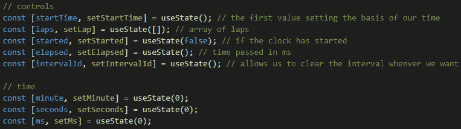

图 11.11 – 在 Stopwatch 组件内部使用的状态变量

我已经解释了每一个，但基本上，我们将有五个控制状态变量，称为`startTime`、`laps`、`started`、`elapsed`和`intervalId`。然后，我们有时间状态变量，我们将使用它们来查看屏幕上的时间变化。这些被称为`minute`、`seconds`和`ms`。

现在，让我们使用时间状态变量，并在屏幕上显示它们。让我们看看应用时间状态变量后，`<Text />`组件现在是什么样子：

```jsx
<Text style={{ fontSize: 72, marginTop: 32 }}>{minute < 10 ? `0${minute}` : minute}:{seconds < 10 ? `0${seconds}`: seconds}.{ms}</Text>
```

因为在某个时间点上我们可能有个位数的数字，通过这样编写我们的变量，我们可以确保如果它们是个位数，我们将在开头添加一个`0`。我们将对`minutes`和`seconds`变量都这样做。

保存文件并刷新屏幕应该不会显示任何变化。这是好事，因为这意味着我们已经正确地在`Stopwatch`组件内部实现了时间状态变量。

现在这些变量已经就位，让我们构建一个函数，一旦我们在屏幕上按下**开始**按钮，它就会被调用。这个按钮需要做几件事情；首先，它需要作为**开始**和**停止**按钮的功能。其次，它需要用一个新的`Date`对象初始化我们刚刚定义的`startTime`控制状态变量。现在让我们来看看这个函数：

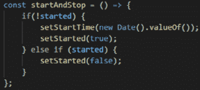

图 11.12 - startAndStop()函数

因此，这个函数可以做两件事情。首先，如果我们的`started`状态变量是`false`，我们将把它设置为`true`，以宣布秒表的开始，然后将`startTime`变量设置为`new Date()`对象。通过在开始时设置日期，我们可以在以后使用它来计算每次迭代之间经过了多少时间，从而使我们能够显示更准确的时间。

现在，一旦`started`变量被改变，我们需要启动`setInterval()`函数。让我们来看看下面的函数，并讨论它的工作原理：

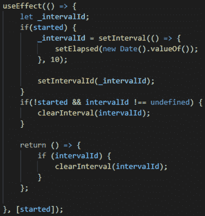

图 11.13 - 用于启动 setInterval()函数的 useEffect()实现

我们实现了这个`useEffect()`函数，因为 React 给了我们这个很酷的小函数，它在组件重新渲染时被调用。最酷的是，我们可以让它在第二个参数中的状态变量改变时才工作。每当`started`变量改变时，这个函数就会被调用。

一旦`started`变量改变，被调用的函数将成为我们秒表功能的核心。这个功能将在`setInterval()`函数内部。在该函数内部，我们将我们的经过的时间变量设置为`new Date()` *每 10ms*。之后，我们获取我们的`setInterval()`函数并将其应用到`intervalId`状态变量中。

`useEffect()`函数内的`return`函数在副作用之后进行清理。这意味着每次`started`变量改变时都会调用此函数，只是为了清理之前的渲染。它还在组件卸载时调用。因为我们正在使用`setInterval()`，我想要确保每当我们的`started`变量设置为`false`（秒表停止）时，我们的间隔都会被清除，以免过重地占用用户的 CPU。

如您所见，清除间隔就像调用`clearInterval()`函数并传递我们要清除的间隔一样简单。

现在我们在 elapsed 变量中有了最新的时间，我们所要做的就是查看`elapsed`时间和`startTime`之间的差异。我们可以使用`useEffect()`来做到这一点。每当`elapsed`状态变量被更改时，另一个`useEffect()`函数将被触发。然后，我们可以在那里进行所有的数学运算。让我们看看我是如何做到这一点的：

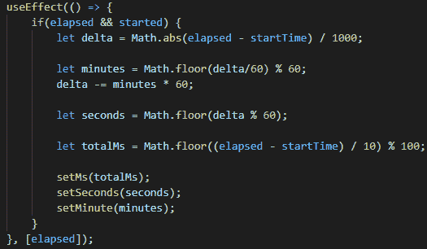

图 11.14 - 第二个 useEffect()函数，它依赖于 elapsed

因此，这个`useEffect()`函数在`elapsed`改变时被调用，这是每 10ms 一次。我们在这里做的是检查`elapsed`是否存在（不是未定义），并且`started`为`true`。如果这两个条件都为真，我们可以使用`elapsed`，其中包含最新的`Date`值，来计算差值并将其转换为毫秒。继续进行，我们对分钟和秒进行数学运算。一旦我们有了所有这些值，我们可以将它们设置为我们之前定义的时间状态变量：`minute`，`seconds`和`ms`。

等等...我们完成了吗？有点，但不完全。让我们去我们的“开始”按钮，稍微改变一下，以便可以使用它。我们将像这样改变它：

```jsx
<Button size="small" color={started ? "#6c757d" : "#c9a0dc" } onPress={() => startAndStop()} shadowless>{started ? "Stop" : "Start"}</Button>
```

这样，我们可以拥有不同的颜色，我们的按钮将根据其当前状态显示不同的文本。这一切都基于我们的`started`状态变量，它告诉我们秒表是否已启动。我选择了这些颜色，因为我们在入职屏幕上也使用了它们，我认为它们很合适，但您可以使用任何您想要的颜色。

现在，我们可以保存和重新加载我们的 JavaScript，并查看我们一直在创建的东西。通过按下“开始”按钮，您将看到它将其文本更改为“停止”按钮的文本，并且其颜色现在是灰色。时间开始增加，我们的秒表正常工作，但如果我们甚至不能注册任何圈数，这是什么类型的秒表呢？

让我们创建一个忙于注册圈数的函数。我们还需要一种方法来显示这些圈数，这是我们完成该功能后将要做的事情。我在想，我们可以像使用`startAndStop()`函数一样使用这个函数，我们应该能够使用同一个按钮注册圈数并清除所有圈数。所以，让我们看看我是如何做到这一点的：

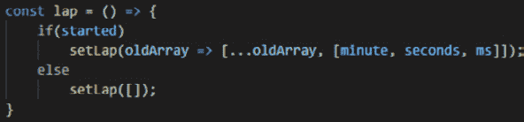

图 11.15 – 使用 setLap 函数来注册和清除所有圈数

这是一个直接的函数；我们的函数可以根据我们的 started 状态变量值做两件不同的事情。如果计时器已经开始，我们可以注册新的圈数，但如果计时器不再工作，我们应该能够清除所有圈数并准备好进行新的计时。

现在我们有了这个函数，让我们将它链接到我们的**Lap**按钮上，就像我们在**Start**按钮上做的那样：

```jsx
<Button size="small" color="#f4d1dc" onPress={() => lap()} shadowless>{started ? "Lap" : "Clear laps"}</Button>
```

现在，让我们来展示屏幕上的圈数。我们将通过从`'react-native'`导入`FlatList`来实现这一点，所以只需滚动到文件的导入部分并添加`FlatList`。我们的新导入应该是这样的：

```jsx
import { StyleSheet, SafeAreaView, FlatList } from 'react-native';
```

### 显示圈数

我们应该在`<Block flex={0.68} />`组件中使用`FlatList`组件，而不是当前存在的`<Text />`组件。因此，删除`<Text />`组件，看看我对`<FlatList />`的实现：

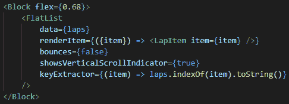

图 11.16 – 使用 FlatList 代替我们的 Text 组件

这里没有什么新东西。我们已经使用了`FlatList`组件来构建引导屏幕，你可能已经注意到我们在那里有一个新组件叫做`<LapItem />`。我已经在我们的主计时器组件下定义了这个组件。你可以随时将它移动并在`components`文件夹下创建一个单独的文件，但我觉得让它靠近主组件对我来说更容易查看。让我们来看看这个组件：

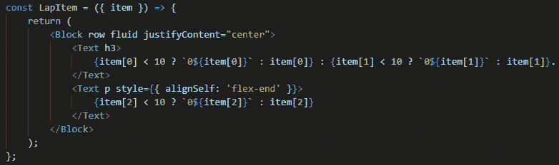

图 11.17 – 在 FlatList 中使用的 LapItem 组件

这个组件接受一个叫做`item`的`prop`，它是一个包含显示圈数所需信息的数组。

有了这个，我们完成了这个漂亮的屏幕。保存并重新加载 JavaScript，然后试一试。以下截图显示了我们的应用现在应该是什么样子的：

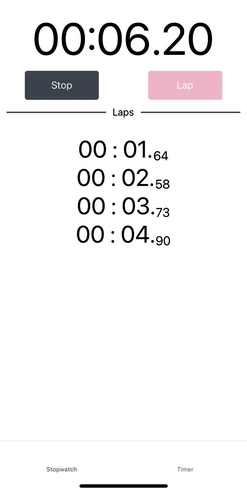

图 11.18 – 完成的计时器组件

它正在工作！看起来很酷，我们在构建过程中度过了愉快的时光。现在，让我们开始在计时器屏幕上工作。

# 创建一个计时器

现在我们已经完成了秒表屏幕，是时候打开`Timer.js`文件，开始处理我们的计时器屏幕了。我们应该立即开始，清空所有内容，并开始导入我们需要的一切。

首先，我们都知道在计时器周期结束时，总会播放一个声音，让你知道它已经停止了。为此，我们需要一个名为`expo-av`的新包。这是一个用于处理音频的 Expo 包。它非常容易使用，所以让我们通过以下命令将其安装到我们的项目中：

```jsx
expo install expo-av
```

现在我们已经安装了这个，我们可以开始导入我们需要构建这个组件的一切。我们将需要一个计时器组件，它与秒表非常相似。我们还需要使用间隔和日期对象来计算一切，因此`useEffect`和`useState`对我们的屏幕至关重要。

不同之处在于，我们需要让用户精确输入他们希望计时器工作的时间。我们可以使用`'react-native'`中的`<TextInput />`组件来实现这一点。因为我们使用了输入，我们还需要一个`<KeyboardAvoidingView />`组件，它可以帮助我们重新组织布局，以便我们的输入永远不会被键盘的打开所隐藏。让我们来看看我们的导入：

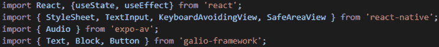

图 11.19 – 计时器屏幕的导入

正如你所看到的，`import`语句与秒表屏幕非常相似。这是因为这些屏幕是相似的。然而，通过让它们做同样的事情，我们可以学会始终通过查看我们过去所做的来激励自己。你编写的所有代码将帮助你解决可能遇到的其他问题。因为我们已经创建了秒表屏幕，现在我们知道了`setInterval()`的不准确性以及如何应对它。

现在，让我们开始为我们的计时器屏幕创建基本功能，以及一个我们可以使用的布局。对于布局，我们将以与我们开始秒表屏幕相同的方式开始一切；也就是说，使用附加了`styles.container`的`<Block />`组件。之后，我们将使用`<SafeAreaView />`，然后使用一个附加了`flex: 1`样式的`<KeyboardAvoidingView />`。

在那个`<KeyboardAvoidingView />`组件内部，我们将有两个`<Block />`元素。第一个将有一个`<TextInput />`组件作为子元素，它将是计时器的标题。我们在这里使用`<TextInput />`是因为你可能希望更改计时器的标题；这只是一个很酷的小功能。第二个将有两个`<TextInput />`元素 - 一个用于分钟，一个用于秒。这样，用户可以输入他们需要的计时器的任何数字。第二个`<Block />`元素还将包含计时器的**开始/停止**按钮。让我们看看它是什么样子的：

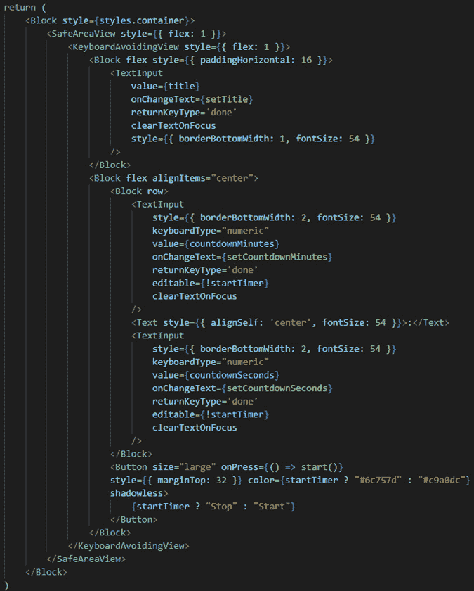

图 11.20 - 为计时器屏幕创建的布局

正如我们之前解释的那样，这并不复杂，但你会注意到我已经为我们的`<TextInput />`组件填写了值。我还确保了一个状态变量适用于我们的**开始/停止**按钮。这是因为我们已经经历了秒表屏幕，这意味着我们已经体验到我们需要某些状态变量以便我们可以改变按钮内的文本。

正如你所看到的，我们还在我们的`<TextInput />`组件上使用了`editable`属性，因为我们只希望在计时器不工作时才能编辑这些值。我们还可以看到另一个新属性，称为`returnKeyType`。这个属性允许我们告诉设备我们希望为用户提供哪种类型的键。我选择了`done`键，因为一旦他们添加他们想要的数字，他们就可以按下那个键并继续向前。

我们还从之前的章节中知道`<TextInput />`是一个受控组件，这意味着它需要一个状态变量来适用于`value`属性，同时也需要一种通过`onChangeText`属性来改变状态的方法。知道了这一切，我建议你多读几遍那段代码，看看你是否能理解它。我们不会再对它进行任何更改，因为这已经足够让我们能够直接进入计时器的功能。

让我们来看看我们为这个计时器定义的状态变量： 

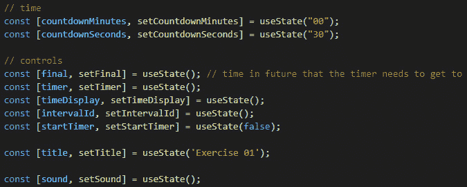

图 11.21 - 为计时器屏幕创建的状态变量

因此，在计时器屏幕的功能组件开始时，我们将编写所有这些状态变量。就像以前一样，我们有一些时间状态变量和一些控制状态变量。我们已经看到了`intervalId`和`startTimer`（在秒表屏幕中我们称其为`started`）。

让我们简要解释一下我们正在使用的其他状态变量。`countdownMinutes`和`countdownSeconds`变量严格用于显示计时器的分钟和秒钟。`final`变量是因为我们将根据用户的输入知道我们希望我们的计时器持续多长时间。一旦我们启动计时器，我们将使用它来计算时间量。

正如你所看到的，我们还有`timer`和`timeDisplay`变量。`timer`变量的作用就像我们在工作台时`elapsed`变量的作用一样。`timeDisplay`变量是为了让我们始终拥有计时器的秒数值。这样，我们可以确保在计时器达到`0`时停止它。

我们的`title`变量是屏幕标题，用户可以随时更改。声音变量是因为我们需要知道声音是否已在屏幕上加载。这将帮助我们使用另一个`useEffect()`函数，以便我们可以在自己之后清理。

太棒了！我喜欢现在我们可以更快地移动，因为我们已经完成了秒表屏幕。这意味着我们正在学习，而经验是最好的老师！让我们来看看`start()`函数，每当我们按下**开始**按钮时我们将调用它：

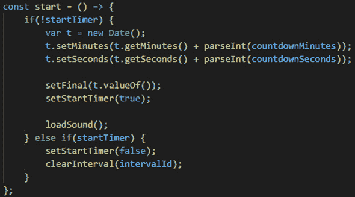

图 11.22 - start()函数用于启动或停止计时器

正如我们所看到的，我们正在遵循我们在秒表屏幕上使用的相同模式。这使我们能够将此函数用作按钮的启动或停止函数。因此，如果`startTimer`状态变量为`false`，那么我们将使用`Date`对象初始化一个新变量。然后，我们将从屏幕上的两个`<TextInput />`组件中获取的分钟和秒钟设置为该日期，将这些添加到当前日期的分钟和秒钟。这意味着我们已经获取了当前日期并添加了用户输入的时间。这是我们试图达到的最终日期，因此下一步是使用我们刚刚计算的日期设置我们的`final`状态变量。

然后，我们必须将`startTimer`变量设置为 true，这将通知我们的组件计时器已经启动。在这一点上，我们还将加载声音。让我们为此定义`loadSound()`函数：

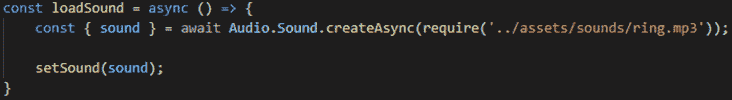

图 11.23 - 带有新关键字 async 的 loadSound()函数

你现在可能已经想到了，这个函数有一个叫做`async`的新关键字。不用担心 - 这是为了确保我们的函数在尝试加载声音时不会停止整个应用程序。如果你没有可以使用的声音，你可以在 GitHub 上找到我在这个项目文件中创建的声音。你也可以创建自己的声音，甚至使用一些没有版权的在线资源。我遵循了`'expo-av'`文档来加载声音。这就是为什么我总是强调，每当有你不理解的东西时，你的第一步应该是查看特定包/库的文档。

现在我们已经加载了声音并启动了计时器，我们应该能够看到我们屏幕背后的所有逻辑存在的地方。就像我们之前做的一样，我们使用`useEffect()`函数来确保它们只在特定状态变量改变时触发。我们要使用的第一个`useEffect()`函数将依赖于`final`状态变量。这是因为这个变量对于所有的数学运算都是必需的，所以自然地，在做任何其他事情之前，我们会检查它：

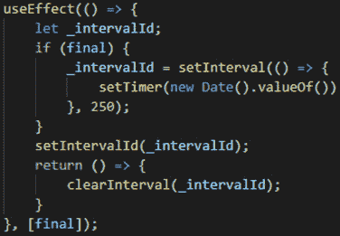

图 11.24 - 第一个 useEffect()函数取决于最终变量

所以，这就像我们之前做的一样。在这里，我们调用了一个`setInterval()`函数 - 这一次是每 250 毫秒一次 - 但只有在最终变量被初始化的情况下才会调用。也就是说，如果用户按下了**开始**/**停止**按钮。这里没有什么奇怪的事情发生，所以我认为我们应该能够继续并查看下面的`useEffect()`函数：

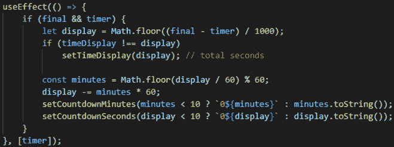

图 11.25 - 第二个 useEffect()函数取决于计时器变量

因为我们在第一个 useEffect()函数中设置了 timer 状态变量，它将作为第二个 useEffect()函数的触发器，以便调用它。这是我们进行计时器所需的所有数学运算的函数。我们正在计算最终日期和从 timer 变量接收到的新日期之间的秒数差。

在计算出秒数差之后，下一步是检查 timeDisplay 变量是否与新计算出的差异不同。如果不同，我们将 timeDisplay 设置为这个新值。我们这样做是为了确保我们始终使用新值计算所有内容。

之后，我们只需按照通常的数学方法计算分钟和秒数。接下来，我们必须通过 countdownMinutes 和 countdownSeconds 变量将我们的<TextInput />组件设置为新计算出的值。我们在这里使用 toString()的原因是因为<TextInput />组件只接受字符串作为值，所以通过这个函数，我们将值从数字转换为字符串。

现在，让我们看看下一个依赖于 timeDisplay 状态变量的 useEffect()函数：

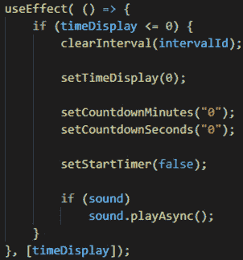

图 11.26 - 第三个 useEffect()函数取决于 timeDisplay 变量

只有当 timeDisplay 为 0 或更少时，这个函数才起作用。一旦达到 0，我们应该停止并重置到目前为止使用的所有变量。在这里，我们要确保我们的间隔将被清除，我们的 timeDisplay 变量回到 0，并且倒计时变量回到 0。这也应该是我们播放声音的地方，所以我们必须检查该声音是否已加载，然后使用 playAsync()函数来启动它。

因为我们在计时器应用程序启动时加载了声音，所以在屏幕卸载时也应该卸载它。实际上，如果我们不使用声音，就没有理由将其保留在设备的内存中。我们将通过在另一个 useEffect()函数中使用清理函数来实现这一点。让我们看看它是什么样子的：

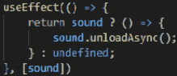

图 11.27 - 仅用于清理函数的第四个 useEffect()函数

所以，再次强调，这直接受到他们文档的启发。一旦组件卸载，我们必须调用这个函数，它会检查声音是否已加载。如果是，那么我们必须在我们的`sound`状态变量上调用`unloadAsync()`函数。

恭喜！我们已经完成了计时器屏幕！让我们看看它的外观和它是否工作：

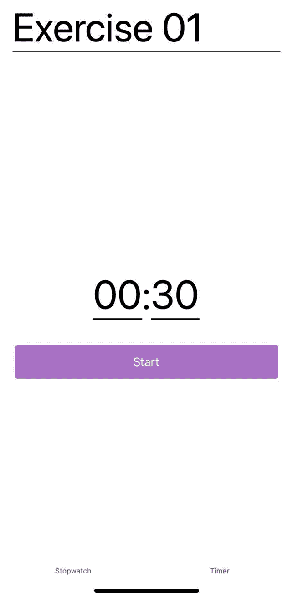

图 11.28 - 完成的计时器屏幕

看起来很棒！在这里，我们可以更改标题；我们还可以更改计时器的值，并且在我们点击开始后它可以工作。等待 30 秒后，会播放一个很酷的小声音！

有了这个，我们就完成了这个应用程序！等等...其实不是 - 底部选项卡导航器看起来有点空，所以我们应该添加一些图标。我们还可以做一些小的事情来增强用户体验。让我们继续并开始添加所有这些小的增强。

# 完成我们的应用程序

在这一点上，我们需要向底部选项卡导航器添加一些图标。但我们应该如何做呢？幸运的是，React Navigation 有一种非常直接的方式来修改其默认组件。

因为我们已经在这里，我们还应该改变我们目前使用的选项卡的焦点颜色。

所以，让我们回到我们的`routes.js`文件。因为我们想要向我们的选项卡添加图标，我们应该从`'galio-framework'`中导入`Icon`组件。在所有导入之后，我们应该写下以下内容：

```jsx
import { Icon } from 'galio-framework';
```

现在我们已经导入了用于显示图标的组件，让我们看看应该如何做。搜索你的`AppTabs()`函数，并找到`<Tab.Navigator />`组件。在这里，我们将添加两个新的属性，称为`screenOptions`和`tabBarOptions`。让我们快速检查它们，并看看我们如何使用它们在底部选项卡导航器中实现图标：

重要提示

截至 2021 年 8 月 14 日，React Navigation 已更新到 v6，并且`tabBarOptions`已被弃用，而是使用了`options`属性，它可以在每个屏幕上进行设置。关于版本和 React Navigation 库的更多信息，我建议阅读文档，可以在[`reactnavigation.org/`](https://reactnavigation.org/)找到。

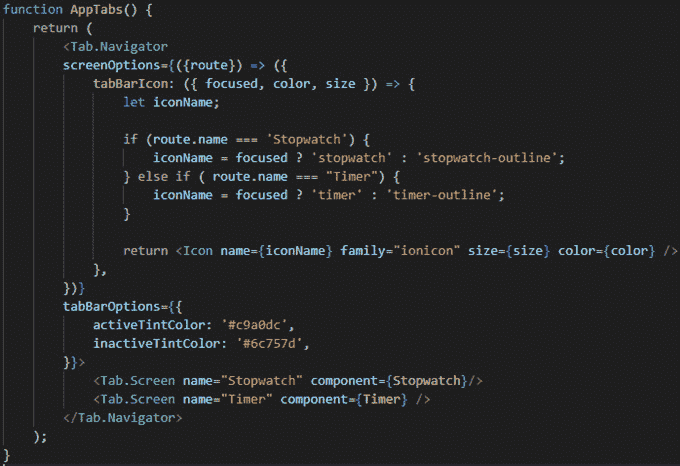

图 11.29 - 我们的新 AppTabs()功能组件已实现图标

因此，我们可以看到，`screenOptions`属性与一个函数一起使用，该函数接受每个屏幕的`navigation`和`route`属性。现在，我们正在使用`route`，因为我们想要检查哪个屏幕等于每个路由。这样，我们就可以为底部选项卡导航器中的每个屏幕设置一个情况。该函数返回一个带有名为`tabBarIcon`的键的对象，其值设置为一个正在收集有关用户当前关注的屏幕的大量信息的函数。

这就是我们检查用户是否关注特定屏幕的地方。根据这一点，我们可以呈现不同类型的图标。因此，如果用户关注秒表屏幕，那么我们将显示填充的图标，而如果他们没有关注，我们将只显示该图标的轮廓。这是一个小细节，可以帮助用户知道他们认为自己在的屏幕。

现在，设置我们图标的颜色就容易多了。为此，我们将使用`tabBarOptions`属性。我们将向其传递一个包含两个键的对象：`activeTintColor`用于当用户当前关注特定屏幕时，以及`inactiveTintColor`用于当用户*不*当前关注特定屏幕时。

让我们保存这个并检查我们的应用程序！我认为我们都可以同意现在看起来好了 10 倍：

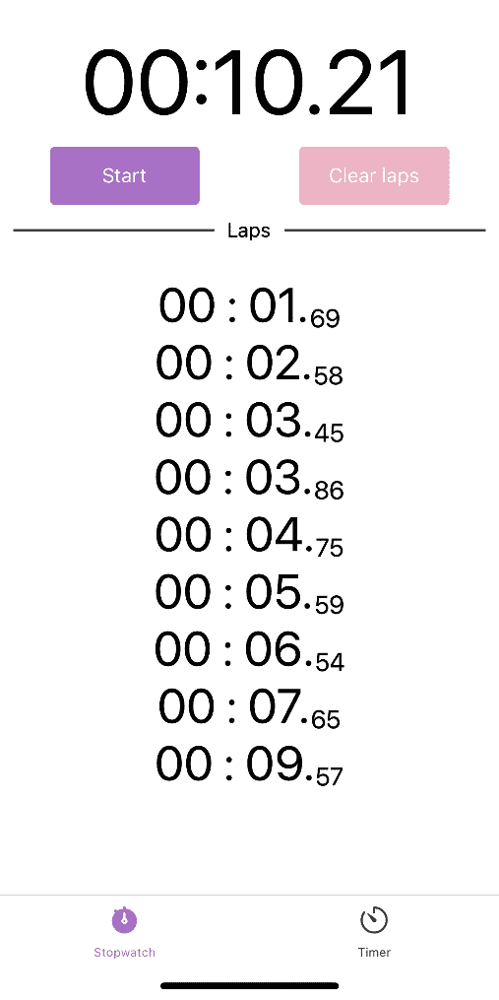

图 11.30 – 在底部选项卡导航器中添加图标后的最终应用程序布局

但是不要关闭`routes.js`文件！我们还有一件事要做。正如我们在*第十章*中讨论的那样，*构建入门屏幕*，入门屏幕应该只在您第一次打开应用程序时出现。没有理由总是看到那个入门屏幕。您的许多用户会说，“好的，我们知道了，这是一个秒表应用程序，让我直接进入秒表部分！”

然而，我们该如何做到呢？这就是`AsyncStorage`派上用场的地方！为了能够使用这个包，我们需要安装它。让我们再次打开我们的终端并输入以下命令：

```jsx
expo install @react-native-async-storage/async-storage
```

既然我们安装了这个很酷的小包，让我们在`routes.js`文件中导入它。在我们的`Icon`导入之后，就像这样：

```jsx
import AsyncStorage from '@react-native-async-storage/async-storage';
```

现在，我们可以在我们的`AppStack()`函数中使用这个`Icon`导入。一旦找到了那个函数，我们应该创建一个名为`viewedOnboarding`的状态变量。这个变量将帮助我们知道用户是否已经看过引导屏幕。

在定义了那个变量之后，我们需要在我们的移动应用程序的开头立即运行一个函数。你还记得我们应该怎么做吗？没错 - 另一个`useEffect()`函数。我打赌你已经厌倦了这些函数，但它们真的很棒！

这个`useEffect()`函数应该调用另一个名为`checkOnboarding()`的函数，其目的是检查用户是否已经看过引导屏幕。根据这一点，我们将设置我们的状态变量`viewedOnboarding`为`true`或`false`：

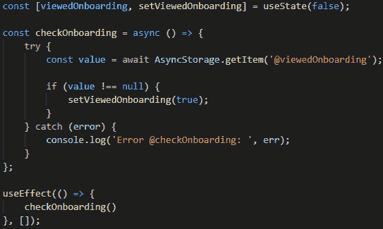

图 11.31 - 为我们的 AppStack()函数编写的逻辑

现在，我们需要另一个`async`函数。但我们只能在`async`函数中使用这个包。我们将尝试看看本地存储是否存储了该项，如果是的话，我们将把`viewedOnboarding`状态变量设置为`true`。

也许你会想知道我们什么时候会将该项添加到我们的本地存储中。嗯，当用户在引导屏幕内最后一次按下**下一步**时，我们应该这样做。所以，让我们继续前进到`Onboarding.js`文件并让它发生。

现在我们在`Onboarding.js`文件中，我们应该先再次导入`AsyncStorage`包。之后，我们应该直接跳转到`scrollTo()`函数。首先，我们会将这个函数改为`async`。之后，我们有一个`if-else`语句。我们将改变*else*部分，在那里我们有一个`console.log()`没有真正原因存在，并且使用`navigation.navigate()`函数代替。让我们看看我们将如何改变它：

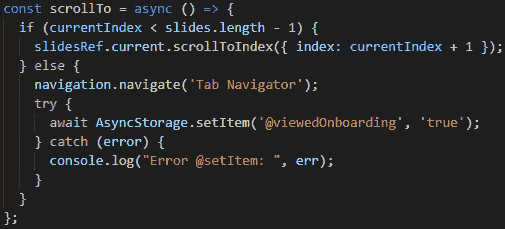

图 11.32 - 我们修改后的 scrollTo()函数

在这里，我们再次尝试使用 try-catch。正如你所看到的，我们正在使用`setItem`将该项设置为本地存储中的`true`。这就是这个库知道这个项目在存储中被设置为 true 的方式。

现在，让我们回到`routes.js`文件。我们已经准备好了，但我们需要确保只有在我们的用户还没有看到入门屏幕时才显示该路由。我们将使用**条件渲染**来实现这一点，这是我们自本章开始以来一直在使用的技术。让我们看看它是什么样子的：

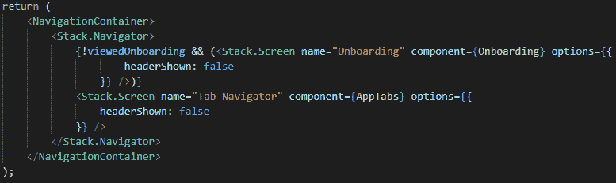

图 11.33 – 条件渲染应用于我们的<Stack.Screen />入门组件

如你所见，我们正在检查我们的状态变量`viewedOnboarding`。如果这个变量被设置为`false`，那意味着我们的用户还没有看到入门屏幕，所以我们的路由应该显示出来。如果设置为`true`，那意味着我们不会显示任何路由，实际上使得入门变得不存在。

至此，我们完成了这个应用程序！保存所有文件，重新加载 JavaScript，然后查看你的应用程序。一开始，你会看到入门屏幕。点击下一步直到它消失，然后在秒表和计时器屏幕上玩耍。之后，再次打开应用程序，你会看到一些惊人的事情 – 入门屏幕不再显示了！相反，你将直接进入秒表屏幕 – 更确切地说，是选项卡导航屏幕。

恭喜！你现在拥有一个相当酷和功能齐全的应用程序。向你的朋友和家人炫耀吧；让他们看看你取得了多大的进步！

# 总结

这一章对我们两个人来说是一段漫长的旅程。不要害怕！挑战越大，回报就越好。你已经完成了一段相当漫长而有趣的旅程。现在你有一个完全功能的应用程序，可以向朋友展示。这些是你成为一名优秀的 React Native 开发人员的第一步。

我们从 React Navigation 开始了这一章。创建路由并将它们链接到入门屏幕是我们做过的最酷的事情之一。这也非常容易，再次证明了 React Native 社区是多么伟大。

将我们的应用程序链接到 React Navigation 库后，我们开始着手处理秒表屏幕。我们发现`setInterval()`函数并不那么准确，因此我们开始使用日期对象，这对于计时来说更加高效。

完成秒表屏幕感觉像是一次重大胜利，因此，创建我们的计时器屏幕进展顺利得多。但是，我们又学到了新的东西，那就是在计时器完成运行后如何播放声音。我希望做这件事为你打开了许多创造力的大门。

在本章末尾，我们专注于用户体验，并确保用户在查看底部选项卡导航器时会看到一些图标。除此之外，我们还使用了一个叫做`AsyncStorage`的库，这样我们就可以让已经有经验的用户远离入门屏幕。

学习这么多东西真是令人耳目一新。是的，这是很多信息，但我希望你意识到尽可能应对多种挑战有多么重要。就像在现实生活中一样，它们帮助我们积累经验，这有助于我们成为优秀的程序员。

现在，让我们为下一章做好准备，我们将讨论作为 React Native 开发人员可以选择的其他路径，以成为一名优秀的程序员。
