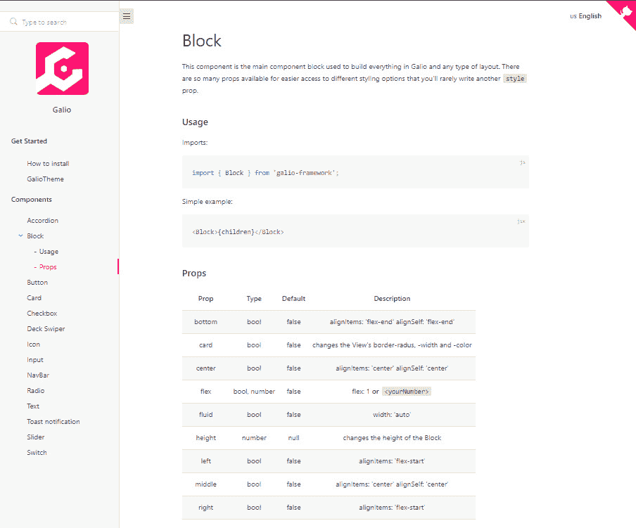
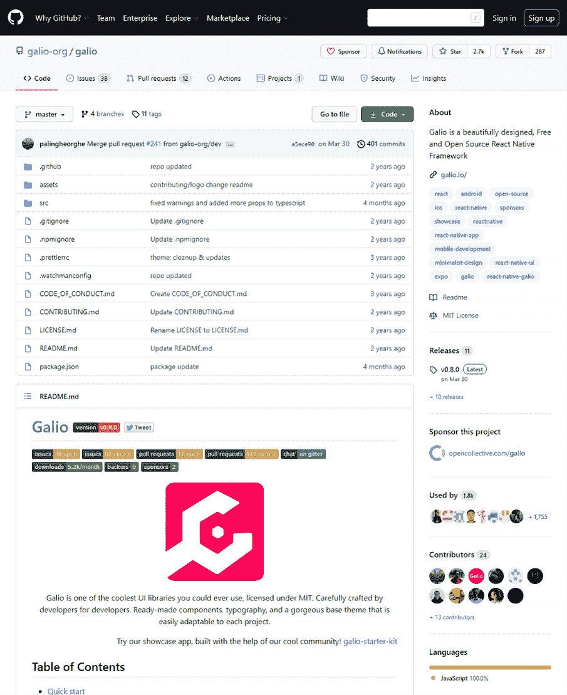

# 第十二章：接下来该去哪里？

在过去的 11 章中，我们学到了很多关于 React Native 以及如何使用它构建跨平台移动应用程序。我们还看到了使用 Galio 等库可以帮助我们快速构建看起来很酷的应用程序，从而节省了大量时间。

在我们的 React Native 之旅中，我们遇到了许多不同的情况，我们学到了用户界面，用户体验，Expo 等等。我希望你喜欢我们学到的一切，并且你会对你可以继续学习和研究 React Native 的许多方式感到兴奋。

本章将重点讨论我们如何开始积累更多的知识。我们将讨论我们应该如何应对未来可能面临的任何新挑战，无论我们想学习新东西还是只是为我们的应用程序开发使用小型库。

我们还将讨论 Galio 社区以及您可以加入和帮助发展 Galio 的内容。我们还将了解开源对程序员社区的重要性，以及它如何可以帮助您的职业发展。

我还会给你一些技巧和窍门，当你开发跨平台移动应用程序时，生活并不容易时，你应该使用这些技巧。我希望你经常回顾这一部分，以获得一些对你的工作有启发和动力。

最后但并非最不重要的是，我们将讨论书籍和阅读的重要性。更具体地，我们将讨论为什么尽可能多地从多种来源尝试学习和了解许多事情是如此重要。

我希望你喜欢这一章，并且它能给你所需的士气提升，让你继续学习和享受 React Native。

本章将涵盖以下主题：

+   始终阅读文档

+   Galio 社区

+   技巧和窍门

# 始终阅读文档

每当您开始新项目或面对新的编程挑战时，重要的是确保在实际着手编码之前做好准备。这种规划和准备可以采取许多形式，但你可以做的最重要的事情之一就是阅读你正在使用的技术的文档。

现在，阅读文档的关键在于学会如何理解它。随着时间的推移，随着经验的积累，你将了解什么是优秀的文档，以及你究竟希望从中获得什么。

阅读技术文档可能并不总是容易的，特别是对于初学者程序员来说。某种语言中使用的一些术语可能与另一种语言中的不同。文档还包含许多术语，这些术语可能在你的学习旅程开始时让你感到不舒服。

不要害怕！我已经列出了阅读和解决你将来面临的挑战的一些提示：

+   **放松！**阅读文档需要时间；就像阅读任何一本书一样。不要急着直接跳到书的中间去读所有的打斗场景；有时候，最好先读一下介绍，这样你就可以熟悉每个角色的能力。所以，准备好享受这段酷炫的旅程，并享受其中的每一部分。如果你累了，就休息一下，看看窗外，稍后再回来，头脑清晰些。

+   **阅读多个来源，就像一名真正的记者**：有时候，你正在阅读的文档可能对你来说有点太高级，或者简单地不完整。有时候，你甚至可能遇到一些你无法理解的段落。因此，你需要学会如何超越官方文档。从不同的来源阅读更多关于该主题的文章。这将通过看到不同的观点和例子来帮助你刷新自己对你正在学习的概念的理解。

+   **复习术语**：你总会看到一些以前从未听说过的新术语。你应该列出所有你不理解的术语，并花些时间复习它们。这将在长远来看对你有所帮助，特别是当你试图学习更多的库时。

+   **版本检查**：你要学习的库总是有多个版本，所以确保你正在阅读正确的文档！

你应该总是先去阅读技术文档，而不是先去看视频教程的原因是，通常后者对解释概念的深度很肤浅。当然，有很棒的视频教程，但直接从源头学习总是更好的，正如我之前提到的，然后再查看其他来源。

在线文档通常分为两部分：*入门*或*指南*和*文档*。第一部分通常会有一些小而简单的示例，说明如何使用包或库。这部分的目的是让你尽可能多地了解包的上下文。*文档*部分更像是电话簿。它很直接，你总是可以找到关于特定事物的具体信息，这意味着这部分不是指导你如何确保正确安装或使用它的指南 - 它更像是一个充满了你需要的每个关键字定义的词典。

既然我们已经谈论了阅读文档，我们应该讨论阅读书籍。一本书有点像一个大型文档项目的*入门*部分，但是有更多的例子和实际挑战。

## 书籍真的很有帮助

书籍的目的是指导你学习特定技能的过程，或者是讲述不同超级英雄为了更美好的世界与坏黑客作斗争的故事。但我们都知道这里说的是技术书籍，所以让我们暂时忽略超级英雄。

通过阅读一本书，你并没有取代文档，因为信息有时可能过时或者太主观。然而，正如我已经提到的，这并不意味着一本书对你没有帮助。

重要的是尽可能多地阅读书籍或文章，特别是你最感兴趣的主题。获取尽可能多的观点和工作流程将使你成为更好的程序员。

为什么我说更好的程序员？我相信程序员生活中最重要的方面是他们通过研究、练习和尝试不同的技术或库积累的经验水平。

书籍可以帮助你实现目标。有很多著名的程序员对你编写代码的方式或者思考方式有着强烈的看法。他们都将自己的知识写入了书籍，因此我们应该确保利用他们的知识来使自己受益。

这正是任何科学领域取得进步的方式。通过吸收他人的想法并在此基础上建立，你将有机会创造出新的东西。

这就是为什么书籍对我们程序员来说真的很有帮助 - 它们是知识的快照。我们用它们来保持与技术和思维方式的联系。

但这并不意味着我们可以通过阅读书籍获得所有必要的知识来推动我们的进步。它们更像是额外的指导。重要的是要尝试从尽可能多的来源获取信息，而书籍是除了原始文档之外可能会激励你的其他来源之一。

# 盖利欧的社区

如果你曾经觉得自己无处容身... 那么你应该尝试一下盖利欧的 Discord。它会帮助你解决任何你可能有的特定问题。

我们在这里不仅仅是讨论 Discord - 我们在这里讨论盖利欧的社区如何帮助你学习帮助开源项目的基础知识，以及帮助盖利欧的整个经验对你所属的社区有何益处。

有多种方式可以参与盖利欧。在这一部分，我们将讨论你可以了解盖利欧的所有方式，与社区互动，以及研究它的工作方式。让我们从讨论盖利欧的网站开始。

## 盖利欧的网站

我们从盖利欧的网站开始，因为这通常是人们在寻找盖利欧时找到的第一件或第二件事情。你可以通过导航到[`galio.io/`](https://galio.io/)找到他们的网站。

首先，这个网站看起来相当酷：


图 12.1 - 盖利欧的网站

正如你所看到的，盖利欧的配色方案也出现在网站上。这是一切的开始，也是关于盖利欧的所有链接的起点。这是人们开始了解盖利欧是如何运作的，以及为什么它被创建的地方。

在导航栏中，你可以找到不同的链接来帮助你的旅程。第二个是**入门套件**。这将带你直接进入一个 GitHub 存储库，你可以在其中尝试一个由盖利欧构建的包含不同屏幕的项目。这将帮助你对盖利欧能够如何帮助你的项目产生灵感。你可以学习很多示例屏幕，甚至在你的项目中使用，因为一切都是开源的，可以自由使用、重用和修改。

第三个链接，**组件**，直接带你到文档，这是我们将在本章后面讨论的内容。然后是第四和第五个链接：**示例**和**高级主题**。第一个的目的是展示其他人用 Galio 库构建了什么；它联系社区并通过展示他们的工作来帮助他们。第二个是为了帮助其他开发人员购买使用 Galio 构建的主题，以最大化他们的工作流程并提高他们的生产力。这是为那些已经使用过 Galio 并想要快速构建高质量内容的开发人员。

你应该访问该网站并四处看看，看看你还能学到什么关于 Galio 的东西。现在，让我们继续阅读 Galio 的文档。

## Galio 的文档

这是每个人都来学习和了解如何使用 Galio 的地方，以及了解 Galio 的每一个细节。尽管 Galio 有一个指南，但这份文档更像是直接的技术文档：


图 12.2 – Galio 的文档网站

当你前往[`galio.io/docs/`](https://galio.io/docs/)时，你会注意到一个包含有关 Galio 的一些信息的大着陆页面。你需要向下滚动以查看导航栏并开始接受 Galio 的文档。

你应该注意导航栏，因为这里你可以找到所有 Galio 的组件，以及关于每个组件的大量信息。

让我们来查看`<Block />`组件的文档：



图 12.3 – 块组件概述

正如你所看到的，每个组件都有一个描述，让你更多地了解它。然后，你会看到如何使用它并将其导入到你的项目中的示例。还有一个包含你可以与感兴趣的组件一起使用的属性的表格。

在这里，你可以找到关于这些属性的信息。还有一个描述告诉你它适用的样式类型或者它的作用。

通过直接深入 Galio 的 GitHub 存储库中的代码，你可以找到关于 Galio 组件的大量信息。

## Galio 的存储库

你可以在[`github.com/galio-org/galio`](https://github.com/galio-org/galio)找到 Galio 的 GitHub 存储库。你可以在这里找到很多东西。在这里，你可以做的最强大的事情就是查看 Galio 的源代码：



图 12.4 - Galio 的 GitHub 存储库

通过这样做，你将了解 Galio 是如何创建的，也可以调试你的代码，以防某些东西不按照你的期望工作。这是汲取 UI 库或开源项目灵感的完美地方。

还有一个**Wiki**标签。这是你可以找到很多额外关于 Galio 的信息的地方。额外的信息，我指的是开发的状态，如何使用它，以及如何为这个开源项目做出贡献的指南。

有很多方法可以为 Galio 做出贡献，我支持你发现自己帮助图书馆的途径。

社区是真正支持 Galio 的力量。没有社区，我们就无法取得我们现在的进展，我们总是在那里欢迎你，如果你需要帮助。

这就是成为社区的一部分的意义。这意味着帮助和得到帮助。这意味着对一个项目有如此大的信心，以至于你愿意尽可能地支持它。如果你觉得 Galio 值得你的支持，那就加入我们的船，让我们一起工作吧！

## Galio 的 Discord

与人们互动的一个很好的地方，除了**Issues**标签外，当寻求帮助或解决错误时，是 Discord。你可以在我们的网站上找到 Discord 链接。

在 Discord 上，每个人都在分享有趣的图片或询问如何使用 Galio 的问题。这就像有一个小的在线家庭，总是在帮助你解决 Galio 的问题。

既然我们已经经历了所有这些，让我们来看一些关于你的 React Native 项目的技巧和窍门。

# 技巧和窍门

React Native 很棒，但所有伟大的事物都有一些小缺陷。因为你永远不知道你可能会遇到什么类型的错误，我决定创建一个最常见的错误和修复方法的列表。让我们开始吧！

## 导入错误

每当你混合了默认导入和命名导入时，通常会出现这个错误。让我们来看看错误信息：

```jsx
Invariant Violation: Element type is invalid: expected a string (for built-in components) or a class/function (for composite components) but got: undefined. You likely forgot to export your component from the file it's defined in, or you might have mixed up default and named imports.
Check the render method of 'App'.
```

正如我们所看到的，这个错误是由于一个组件被导入到主`App.js`文件中引起的。不幸的是，错误消息没有告诉你是哪个组件或哪一行破坏了应用程序。为了确保这种情况不会再次发生，你需要仔细检查你导出/导入的组件，以确保没有错误。现在，让我们看看这是如何发生的。

我们知道有默认导入和命名导入，但让我们讨论一下它们之间的区别。

假设你有以下的输出：

```jsx
export const myComponent;
```

现在，这是一个命名的`export`。因为它是一个命名的`export`，你必须像这样导入它：

```jsx
import { myComponent } from './myComponent';
```

现在，让我们看看默认导出是如何工作的：

```jsx
export default myComponent;
```

作为默认导出，你可以在不使用花括号的情况下导入它。另一件很酷的事情是，名称不再重要：

```jsx
import stillMyComponent from './file';
import myComponent from './file';
```

这两个导入的作用是一样的，尽管我们给它们取了不同的名字。这很酷，对吧？你知道的越多，你就越有准备。

## React Native 版本不匹配

所以，让我们直接进入并查看错误消息：

```jsx
React Native version mismatch.
Javascript version: X.XX.X
Native version: X.XX.X
Make sure you have rebuilt the native code...
```

每当你尝试构建应用程序时都会出现这个问题。这是因为当你在终端内使用`expo start`命令时，你使用的打包工具使用了不同版本的`react-native`。你可能会在升级 React Native 或 Expo SDK 版本后遇到这个问题，甚至在尝试连接到错误的本地开发服务器时也会遇到。

让我们来解决这个问题。首先关闭 Expo 服务器。之后，你应该尝试两件不同的事情：第一件事是从你的`app.json`文件中删除`sdkVersion`文件。第二件事是确保该文件与你的`package.json`文件中的`expo`依赖的值匹配。

通过使用托管工作流项目，你可以通过运行`expo upgrade`命令来确保你的`react-native`版本是正确的。如果你有一个原生工作流项目，请确保你已经正确地升级了所有内容。

一旦你做完所有的事情，你应该通过运行以下命令来清除你的缓存：

```jsx
rm -rf node_modules && npm cache clean --force && npm install && watchman watch-del-all && rm -rf $TMPDIR/haste-map-* && rm -rf $TMPDIR/metro-cache && expo start --clear
```

现在，我们不应该再看到这个错误了 - 那太棒了！

## 无法解析

这个错误消息大致会是这样的：

```jsx
Unable to resolve module <module name> from <path>: Module does not exist in the module map or in these directories
```

这个错误通常是由在你的`package.json`文件中使用`^`或`~`等符号而生成的。

为了解决这个问题，删除这些符号并删除你的`node_modules`文件夹。重新安装所有的包，一切都应该正常工作。

# 总结

在这一章中，我们为成为 React Native 开发者做好了准备。我们讨论了很多东西，这些东西应该帮助你在你的旅程中。我也坚信我已经能够通过激励你尽可能追求知识来帮助你。

首先，我们讨论了文档有多么有用。我们还学会了如何从尽可能多的资源中收集信息。书籍是我们教育的一个非常重要的部分，所以请确保至少尝试阅读更多关于 React Native 的书籍。

然后，我们讨论了 Galio 以及如何与社区取得联系。我们看到了我们可以免费使用的许多资源，而且质量也很高。当我们再次见面时（至少我希望如此），这将会很有帮助，可以在 Galio 的 Discord 或存储库上交流。

之后，我们解决了一些常见的 React Native 问题，并学会了如何解决它们。我希望你会发现这很有帮助，并且希望你以后能回来查看，这样你就可以比进行谷歌搜索更快地解决错误。

此时，你已经准备好开始开发项目了。你终于可以构思一个想法，并努力使其取得巨大成功。我希望这本书对你有所帮助，也希望你尽可能多地学到了东西。我还希望你对未来更加充满希望和热情。保持安全和健康！
