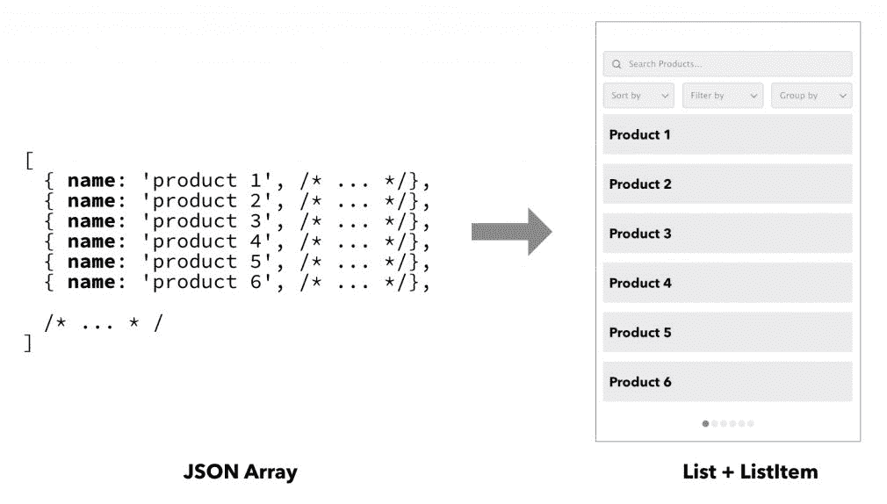
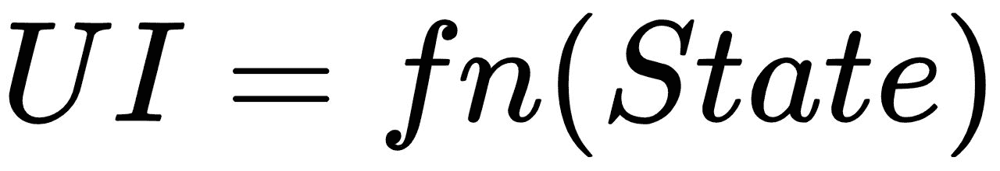
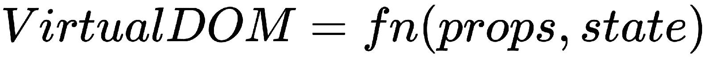
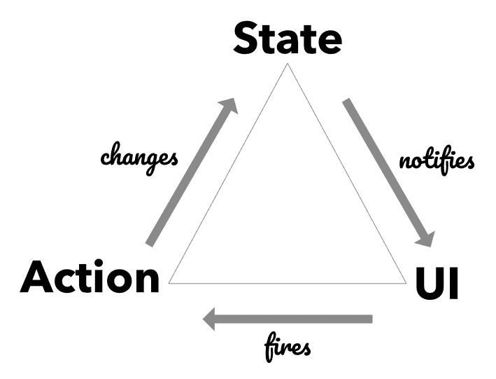
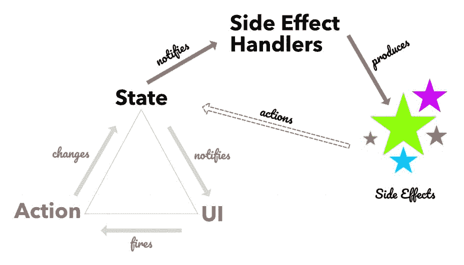
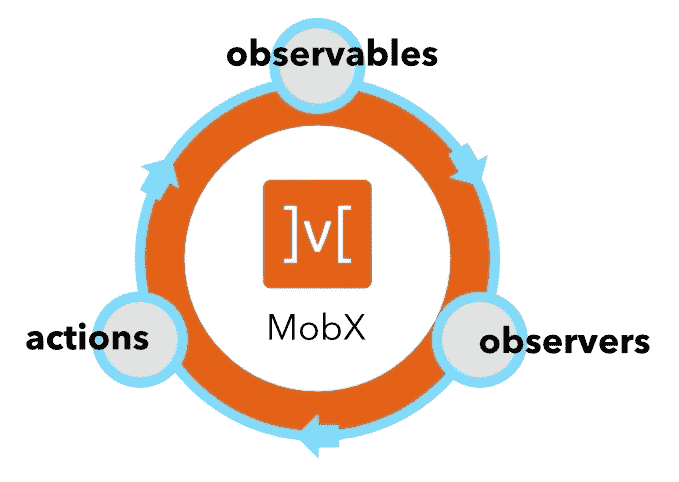
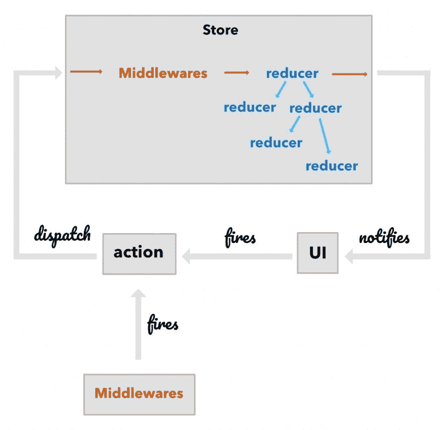

# 第一章：状态管理介绍

您的 React 应用的核心位于客户端状态（数据）中，并通过 React 组件呈现。随着您处理**用户交互**（**UI**）、执行异步操作和处理领域逻辑，管理这种状态可能变得棘手。在本章中，我们将从 UI 中的状态管理的概念模型、副作用的作用和数据流开始。

然后，我们将快速了解 MobX 并介绍其核心概念。这些概念将有助于与 Redux 进行一些比较。您会发现 MobX 实际上是 Redux 的更*声明性*形式！

本章涵盖的主题如下：

+   什么是客户端状态？

+   副作用模型

+   MobX 的快速介绍

# 客户端状态

您在屏幕上看到并可以操作的 UI 是将数据的视觉表示呈现出来的结果。数据的形状暗示了您提供用于可视化和操作这些数据的控件的类型。例如，如果您有一个项目列表，您可能会显示一个具有`ListItems`数组的`List`控件。操作可能包括*搜索、分页、过滤*、*排序*或*分组*列表中的项目。这些操作的状态也被捕获为数据，并通知了视觉表示。

以下图表显示了*数组*与*List*控件之间的直接关系：



简而言之，描述 UI 的关键角色是*数据*。处理结构和管理可能发生在这些数据上的变化通常被称为**状态管理**。状态只是在 UI 上呈现的客户端数据的同义词。

状态管理是定义数据形状和用于操作数据的操作的行为。在 UI 的上下文中，它被称为*客户端*状态管理。

随着 UI 的复杂性增加，客户端上积累了更多的状态。它达到了一个点，状态成为我们在屏幕上看到的一切的最终真相。在 UI 开发中，我们提升了客户端状态的重要性，这是前端世界中最大的转变之一。有一个有趣的方程式捕捉了 UI 和状态之间的关系：



`fn` 是一个应用在状态（数据）上的转换函数，它产生相应的 UI。事实上，这里隐藏的微妙含义是，给定相同的状态，`fn` 总是产生相同的 UI。

在 React 的上下文中，前述等式可以写成如下形式：



唯一的区别在于 `fn` 接受两个输入，`props` 和 `state`，这是 React 组件的约定契约。

# 处理状态变化

然而，前述等式只是 UI 故事的一半。的确，视觉表示是从状态（通过转换函数 `fn`）派生出来的，但它并没有考虑到在 UI 上发生的 *用户操作*。就好像我们在等式中完全忽略了 *用户*。毕竟，界面不仅用于视觉表示数据（状态），还允许对数据进行操作。

这就是我们需要介绍代表这些用户操作的 **actions** 的概念，这些操作会导致状态的改变。Actions 是您根据触发的各种输入事件而调用的命令。这些 actions 导致状态的改变，然后反映在 UI 上。

我们可以在下图中可视化 **State**、**UI** 和 **Actions** 的三元组：



值得注意的是，UI 不会直接改变状态，而是通过 *消息传递* 系统来触发 *actions* 来实现状态的改变。*Action* 封装了触发适当状态改变所需的参数。UI 负责捕获各种用户事件（点击、键盘按键、触摸、语音等），并将其 *转换* 为一个或多个 actions，然后触发这些 actions 来改变状态。

当 **State** 改变时，它会通知所有观察者（订阅者）状态的改变。UI 也是其中一个最重要的订阅者，会收到通知。当发生这种情况时，UI 会重新渲染并更新到新的状态。从 **State** 流向 **UI** 的数据流始终是单向的，已成为现代 UI 开发中状态管理的基石。

这种方法的最大好处之一是很容易理解 UI 如何与变化的数据保持同步。它还清晰地分离了*渲染*和*数据变化*之间的责任。React 框架确实拥抱了这种单向数据流，并且你也会看到这种方法在**MobX**中得到了采纳和扩展。

# 副作用模型

现在我们了解了 UI、状态和操作的角色，我们可以将其扩展到构建 UI 操作的思维模型。回顾`操作` --> `状态` --> `UI`的三元组，我们可以做一些有趣的观察，这些观察并不明确。让我们思考一下如何处理以下操作：

+   从服务器下载数据

+   将数据持久化到服务器

+   运行定时器并定期执行某些操作

+   当某个状态发生变化时执行一些验证逻辑

这些事情并不完全适合我们的数据流三元组。显然，我们在这里缺少了一些东西，对吧？你可能会争辩说，你可以将这些操作放在 UI 本身内部，并在特定时间触发操作。然而，这将给 UI 增加额外的责任，使其操作复杂化，并且也使其难以测试。从更学术的角度来看，这也会违反**单一责任原则**（**SRP**）。SRP 规定一个类或模块应该只有一个变化的原因。如果我们开始在 UI 中处理额外的操作，它将有多个变化的原因。

因此，看起来我们在这里有一些相互对立的力量。我们希望保持数据流三元组的纯度，处理诸如前面列表中提到的辅助操作，并且不向 UI 添加额外的责任。为了平衡所有这些力量，我们需要将辅助操作视为数据流三元组之外的东西。我们称这些为**副作用**。

副作用是某种状态变化的结果，并且是通过响应来自状态的通知来调用的。就像 UI 一样，有一个处理程序，我们可以称之为*副作用处理程序*，它观察（订阅）状态变化通知。当发生匹配的状态变化时，相应的副作用被调用：



系统中可能有许多副作用处理程序，每个处理程序都是状态的观察者。当它们观察的状态的一部分发生变化时，它们将调用相应的副作用。现在，这些副作用也可以通过触发额外的动作来导致状态的改变。

举例来说，你可以从 UI 触发一个动作来下载一些数据。这会导致某个标志的状态改变，从而通知所有观察者。观察标志的副作用处理程序会看到这种改变，并触发网络调用来下载数据。当下载完成时，它会触发一个动作来使用新数据更新状态。

*副作用*也可以触发动作来更新状态，这是一个重要的细节，有助于完成管理状态的循环。因此，不仅 UI 可以引起状态改变，而且外部操作（通过副作用）也可以影响状态改变。这就是*副作用*的心智模型，它可以用来开发 UI 并管理其呈现的状态。这个模型非常强大，随着时间的推移，它的扩展性也非常好。在本章以及整本书中，您将看到 MobX 如何使这个*副作用*模型成为现实并且使用起来很有趣。

有了这些概念，我们现在准备进入 MobX 的世界。

# MobX 的快速介绍

MobX 是一个反应式状态管理库，它使得采用副作用模型变得容易。MobX 中的许多概念直接反映了我们之前遇到的术语。让我们快速浏览一下这些构建块。

# 一个 observable 状态

状态是 UI 中发生的所有事情的中心。MobX 提供了一个核心构建块，称为**observable**，它代表了应用程序的反应式状态。任何 JavaScript 对象都可以用来创建一个 observable。我们可以使用名副其实的`observable()` API，如下所示：

```jsx
import {observable} from 'mobx';

let cart = observable({
    itemCount: 0,
    modified: new Date()
});
```

在前面的例子中，我们创建了一个简单的`cart`对象，它也是一个`observable`。`observable()` API 来自于***mobx*** NPM 包。通过这个简单的`observable`声明，我们现在有了一个反应灵敏的`cart`，它可以跟踪其任何属性的变化：`itemCount`和`modified`。

# 观察状态变化

仅仅使用可观察对象并不能构建一个有趣的系统。我们还需要它们的对应物，**观察者**。MobX 为您提供了三种不同类型的观察者，每一种都专为您在应用程序中遇到的用例量身定制。核心观察者是`autorun`，`reaction`和`when`。我们将在下一章更详细地介绍它们，但现在让我们先介绍`autorun`。

`autorun` API 接受一个函数作为输入并立即执行它。它还跟踪传入函数中使用的可观察对象。当这些被跟踪的可观察对象发生变化时，函数会被重新执行。这个简单的设置真正美丽和优雅的地方在于，不需要额外的工作来跟踪可观察对象并订阅任何变化。这一切都是自动发生的。这并不是魔术，但绝对是一个智能的系统在运作，我们将在后面的章节中介绍。

```jsx
import {observable, autorun} from 'mobx';

let cart = observable({
    itemCount: 0,
    modified: new Date()
});

autorun(() => {
    console.log(`The Cart contains ${cart.itemCount} item(s).`);
});

cart.itemCount++;

// Console output:
The Cart contains 0 item(s).
The Cart contains 1 item(s).
```

在前面的例子中，传递给`autorun`的`arrow-function`在第一次执行时，也在`itemCount`增加时执行。这导致打印了两个控制台日志。`autorun`使传入的函数（*tracking-function*）成为其引用的*observables*的*observer*。在我们的例子中，`cart.itemCount`被观察到，当它增加时，*tracking*函数会自动收到通知，导致打印控制台日志。

# 是时候采取行动了

尽管我们直接改变了`cart.itemCount`，但这绝对不是推荐的方法。记住，状态不应该直接改变，而应该通过*actions*来完成。使用*action*还为可观察状态的操作增加了词汇。

在我们的例子中，我们可以将我们正在进行的状态变化称为`incrementCount`操作。让我们使用 MobX 的`action` API 来封装这个变化：

```jsx
import { observable, autorun, action } from 'mobx';

let cart = observable({
    itemCount: 0,
    modified: new Date(),
});

autorun(() => {
    console.log(`The Cart contains ${cart.itemCount} item(s).`);
});

const incrementCount = action(() => {
 cart.itemCount++;
});

incrementCount();

```

`action` API 接受一个函数作为参数，每当调用该操作时都会调用该函数。当我们可以将变异包装在普通函数中并调用普通函数而不是将函数传递给*action*时，可能会显得多余。这是一个敏锐的想法。好吧，这样做是有充分理由的。在内部，`action`做的远不止是简单的包装。它确保所有状态变化的通知都被触发，但只在`action`函数完成后才触发。

当您在动作中修改大量的可观察对象时，您不希望立即收到每一个小改变的通知。相反，您希望能够等待所有改变完成，然后触发通知。这使系统更加高效，也减少了过多通知的噪音。

回到我们的例子，我们可以看到将其包装在一个动作中也提高了代码的可读性。通过给动作（`incrementCount`）一个具体的名称，我们为我们的领域增加了词汇。这样做，我们可以抽象出实际*增加计数*所需的细节。

可观察对象、观察者和动作是 MobX 的核心。有了这些基本概念，我们可以构建一些最强大和复杂的 React 应用程序。

在 MobX 的文献中，*副作用*也被称为*反应*。与*导致*状态改变的*动作*不同，*反应*是对状态改变做出响应的。

请注意与之前看到的单向数据流的惊人相似之处。**可观察对象**捕获应用程序的状态。**观察者**（也称为*反应*）包括*副作用*处理程序以及 UI。**动作**是，嗯，导致可观察状态改变的动作：



# 与 Redux 的比较

如果我们谈论 React 中的状态管理，却没有提到 Redux，那就是完全的疏忽。Redux 是一个非常流行的状态管理库，它之所以流行，是因为它简化了 Facebook 提出的原始 Flux 架构。它摒弃了 Flux 中的某些角色，比如*调度器*，这导致将所有存储器合并为一个，通常称为**单一状态树**。

在这一部分，我们将与另一个称为**Redux**的状态管理库进行正面比较。如果您以前没有使用过 Redux，可以跳过这一部分，继续阅读本章的总结。

就数据流而言，MobX 在概念上与 Redux 有一些相似之处，但这也是相似之处的尽头。MobX 采用的机制与 Redux 采用的机制截然不同。在我们深入比较之前，让我们简要了解一下 Redux。

# 在简言之中的 Redux

我们之前看到的数据流三角也适用于整个 Redux。Redux 在*状态更新*机制中添加了自己的特色。可以在下图中看到：



当 UI 触发动作时，它会在存储上分派。在存储内部，动作首先经过一个或多个**中间件**，在那里可以对其进行操作并在不进一步传播的情况下被吞噬。如果动作通过中间件，它将被发送到一个或多个**reducers**，在那里可以被处理以产生存储的新状态。

存储的新状态通知给所有订阅者，其中**UI**是其中之一。如果状态与 UI 之前的值不同，UI 将被重新渲染，并与新状态同步。

这里有几件值得强调的事情：

+   从动作进入存储的那一刻起，直到计算出新状态，整个过程都是同步的。

+   Reducers 是纯函数，接受动作和先前状态，并产生新状态。由于它们是纯函数，您不能在 reducer 中放置*副作用*，例如网络调用。

+   中间件是唯一可以执行副作用的地方，最终导致动作在存储上分派。

如果您正在使用 Redux 与 React，这是最有可能的组合，有一个名为`react-redux`的实用库，它可以将存储与 React 组件粘合在一起。它通过一个名为`connect()`的函数来实现这一点，该函数将存储与传入的 React 组件绑定。在`connect()`内部，React 组件订阅存储以接收状态更改通知。通过`connect()`绑定到存储意味着每个状态更改都会通知到每个组件。这需要添加额外的抽象，例如*state-selector*（使用`mapStateToProps`）或实现`shouldComponentUpdate()`来仅接收相关的状态更新：

```jsx
connect(mapStateToProps, mapDispatchToProps, mergeProps, options)(Component)
```

我们故意跳过了一些其他细节，这些细节对于完整的 React-Redux 设置是必需的，但基本要素已经就位，可以更深入地比较 Redux 和 MobX。

# MobX 与 Redux

原则上，MobX 和 Redux 实现了提供单向数据流的相同目标。*store*是管理所有状态更改并通知 UI 和其他观察者状态更改的中心角色。MobX 和 Redux 之间实现这一目标的机制是完全不同的。

Redux 依赖于*immutable*状态快照和两个状态快照之间的引用比较来检查更改。相比之下，MobX 依赖于*mutable*状态，并使用细粒度的通知系统来跟踪状态更改。这种方法上的根本差异对使用每个框架的**开发者体验**（**DX**）有影响。我们将使用构建单个功能的 DX 来执行 MobX 与 Redux 的比较。

让我们先从 Redux 开始。在使用 Redux 时，您需要做的事情如下：


+   定义将封装在存储中的状态树的形状。这通常被称为`initialState`。

+   识别可以执行以更改此状态树的所有操作。每个操作以`{ type: string, payload: any }`的形式定义。`type`属性用于标识操作，`payload`是随操作一起携带的附加数据。操作类型通常作为`string`常量创建并从模块导出。

+   每次需要分派它们时定义原始操作变得非常冗长。相反，惯例是有一个包装操作类型细节并将有效负载作为参数传入的`action-creator`函数。

+   使用`connect`方法将 React 组件与存储连接起来。由于每个状态更改都会通知到每个组件，因此您必须小心，不要不必要地重新渲染组件。只有当组件实际呈现的状态部分发生变化时（通过`mapStateToProps`），渲染才应该发生。由于每个状态更改都会通知到所有*连接的组件*，因此每次计算`mapStateToProps`可能会很昂贵。为了最小化这些计算，建议使用诸如*reselect*之类的状态选择器库。这增加了正确设置高性能 React 组件所需的工作量。如果您不使用这些库，您必须承担编写高效的`shouldComponentUpdate`钩子的责任。

+   在每个 reducer 中，您必须确保在发生更改时始终返回状态的新实例。请注意，通常将 reducers 与`initialState`定义分开，并且需要来回确保在每个 reducer 操作中正确更改状态。

+   您想执行的任何副作用都必须包装在中间件中。对于涉及异步操作的更复杂的副作用，最好依赖于专用中间件库，如`redux-thunk`，`redux-saga`或`redux-observables`。请注意，这也使副作用的构建和执行变得更加复杂。先前提到的每个中间件都有自己的约定和术语。此外，分派动作的位置与处理实际副作用的位置不是共同位置。这导致需要在文件之间跳转，以构建功能如何组合的思维模型。

+   随着功能的复杂性增加，`actions`，`action-creators`，`middlewares`，`reducers`和`initialState`之间的碎片化也越来越多。不共同位置也增加了开发清晰的功能组合思维模型所需的工作量。

在 MobX 世界中，开发者体验是完全不同的。随着我们在本书中探索 MobX，您将看到更多，但这是顶层信息：


+   在存储类中为功能定义可观察状态。可以更改并应该被观察的各种属性都标有`observable` API。

+   定义需要改变可观察状态的`actions`。

+   在同一功能类中定义所有的副作用（`autorun`，`reaction`和`when`）。动作、反应和可观察状态的共同位置使思维模型清晰。MobX 还原生支持异步状态更新，因此不需要额外的中间件库来管理它。

+   使用包含`observer` API 的`mobx-react`包，允许 React 组件连接到可观察存储。您可以在 React 组件树中随处添加*observer*组件，这实际上是调整组件更新的推荐方法。

+   使用*observer*的优势在于不需要额外的工作来使组件高效。在内部，*observer* API 确保组件仅在呈现的可观察状态发生变化时才会更新。

MobX 将您的思维转向可观察状态和相应的 React 组件。您不必过多关注实现这一点所需的连接。它被简单而优雅的 API 所抽象，如`observable`，`action`，`autorun`和`observer`。

我们甚至可以说，MobX 实现了一种更具声明性的 Redux 形式。没有动作创建者、减速器或中间件来处理动作并产生新状态。动作、副作用（反应）和可观察状态都位于类或模块内。没有复杂的`connect()`方法将 React 组件粘合到存储中。一个简单的`observer()`就能完成工作，不需要额外的连接。

MobX 是声明性的 Redux。它接管了与 Redux 相关的工作流程，并大大简化了它。不再需要一些显式的设置，比如在容器组件中使用`connect()`，为记忆化状态选择使用 reselect，动作、减速器，当然还有中间件。

# 摘要

UI 是数据（状态）的视觉等价物，以及交互控件来改变该状态。UI 触发动作，导致状态的改变。*副作用*是由于某种状态改变而触发的外部操作。系统中有*观察者*，它们寻找特定的状态改变并执行相应的副作用。

*动作* --> *状态* --> *UI*的数据流三元组，加上副作用，构成了 UI 的简单心智模型。MobX 强烈遵循这个心智模型，你可以在它的 API 中看到这一点，包括*可观察对象*、*动作*、*反应*和*观察者*。这个 API 的简单性使得它很容易处理 UI 中的一些复杂交互。

如果你以前使用过 Redux，你会发现 MobX 减少了引起状态改变和处理副作用所需的仪式。MobX 努力提供一种声明性和反应性的状态管理 API，而不会牺牲简单性。在本书中，将探讨 MobX 的这种哲学，深入了解其 API 和实际用例。

在下一章中，我们将深入了解 MobX 的核心构建模块。
