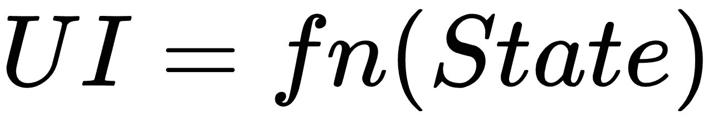

# 第二章：Observables、Actions 和 Reactions

描述客户端状态的结构是 UI 开发的第一步。使用 MobX，您可以通过创建**observables**树来实现这一点。当用户与应用程序交互时，在 observable 状态上调用操作，这将引起反应（也称为副作用）。继续阅读第一章，*状态管理简介*，我们现在将更深入地了解 MobX 的核心概念。

本章涵盖的主题包括：

+   创建各种类型的 observables

+   设置改变 observable 的操作

+   使用反应来处理外部变化

# 技术要求

您将需要使用 JavaScript 编程语言。最后，要使用本书的 Git 存储库，用户需要安装 Git。

本章的代码文件可以在 GitHub 上找到：

[`github.com/PacktPublishing/MobX-Quick-Start-Guide/tree/master/src/Chapter02`](https://github.com/PacktPublishing/MobX-Quick-Start-Guide/tree/master/src/Chapter02)

查看以下视频以查看代码的运行情况：

[`bit.ly/2NEww85`](http://bit.ly/2NEww85)

# Observables

数据是 UI 的命脉。回到定义数据和 UI 之间关系的方程式，我们知道以下是真的：



因此，专注于*定义将驱动 UI 的数据结构*是有意义的。在 MobX 中，我们使用 observable 来做到这一点。看一下这个图表：


*Observables*，顾名思义，是可以被观察的实体。它们跟踪其值发生的变化并通知所有*观察者*。当您开始设计客户端状态的结构时，这种看似简单的行为具有强大的影响。在前面的图表中，每个圆代表一个**Observable**，每个菱形代表一个**Observer**。观察者可以观察一个或多个 observable，并在它们中任何一个值发生变化时得到通知。

# 创建 observables

创建 observable 的最简单方法是使用`observable()`函数。看一下以下内容：

```jsx
const item = observable({
    name: 'Party Balloons',
    itemId: '1234',
    quantity: 2,
    price: 10,
    coupon: {
        code: 'BIGPARTY',
        discountPercent: 50
  }
});
```

`item`现在是一个`observable`对象，并将开始跟踪其属性的变化。您可以将此对象用作常规 JavaScript 对象，而无需任何特殊的 API 来*获取*或*设置*其值。在前面的片段中，您还可以使用`observable.object()`创建一个 observable `item`。

在下面的片段中，我们可以看到对可观察对象进行的简单变化，就像任何常规的 JavaScript 代码一样：

```jsx
// Set values
item.quantity += 3;
item.name = 'Small Balloons';

// Get values
console.log(`Buying ${item.quantity} of ${item.name}`);
```

可观察对象只会跟踪在`observable()`或`observable.object()`中提供的初始值中提供的属性。这意味着如果以后添加新属性，它们不会自动变为可观察的。这是关于可观察对象需要记住的一个重要特性。它们就像具有固定属性集的记录或类。如果你确实需要动态跟踪属性，你应该考虑使用*可观察映射*；这将在本章后面进一步介绍。

在内部，MobX 会透明地跟踪属性的变化并通知相应的观察者。我们将在后面的章节中探讨这种内部行为。

`observable()`函数会自动将*对象*、*数组*或*映射*转换为可观察实体。这种自动转换*不适用*于其他类型的数据，比如 JavaScript 原始类型（数字、字符串、布尔值、null、undefined）、函数，或者类实例（带有原型的对象）。因此，如果你调用`observable(20)`，它将会失败并显示错误，如下所示：

```jsx
Error: [mobx] The provided value could not be converted into an observable. If you want just create an observable reference to the object use 'observable.box(value)'
```

如错误中所建议的，我们必须使用更专门的`observable.box()`将原始值转换为可观察值。包装*原始值*、*函数*或*类实例*的可观察值被称为**包装的可观察值**。看一下这个：

```jsx
const count = observable.box(20);

// Get the count console.log(`Count is ${count.get()}`);

// Change count count.set(22);
```

我们必须使用包装的可观察对象的`get()`和`set()`方法，而不是直接读取或分配给它。这些方法给了我们 MobX 固有的可观察性。

除了对象和单一值，你还可以将数组和映射转换为可观察对象。它们有相应的 API，可以在这个表格中看到：

| 对象 | `observable.object({ })` |
| --- | --- |
| 数组 | `observable.array([ ])` |
| 映射 | `observable.map(value)` |
| 原始值、函数、类实例 | `observable.box(value)` |

正如我们之前提到的，`observable()`会自动将对象、数组或映射转换为可观察对象。它是`observable.object()`、`observable.array()`或`observable.map()`的简写。对于原始值、函数和类实例，你应该使用`observable.box()`API。尽管在实践中，使用`observable.box()`相当罕见。更常见的是使用`observable.object()`、`observable.array()`或`observable.map()`。

MobX 在创建 observable 时应用*深度可观察性*。这意味着 MobX 将自动观察对象树、数组或映射中的每个级别的每个属性。它还会跟踪数组和映射的添加或删除。这种行为对大多数情况都很有效，但在某些情况下可能过于严格。有一些特殊的装饰器可以应用于控制这种可观察性。我们将在第四章中进行探讨，*构建可观察树*。

# Observable arrays

使用`observable.array()`与使用`observable()`非常相似。您可以将数组作为初始值传递，或者从空数组开始。在以下代码示例中，我们从一个空数组开始：

```jsx
const items = observable.array(); // Start with empty array

console.log(items.length); // Prints: 0
 items.push({
    name: 'hats', quantity: 40,
});

// Add one in the front items.unshift({ name: 'Ribbons', quantity: 2 });

// Add at the back items.push({ name: 'balloons', quantity: 1 });

console.log(items.length); // Prints: 3
```

请注意，observable 数组*不是*真正的 JavaScript 数组，尽管它具有与 JS 数组相同的 API。当您将此数组传递给其他库或 API 时，可以通过调用`toJS()`将其转换为 JS 数组，如下所示：

```jsx
import { observable, **toJS** } from 'mobx';

const items = observable.array();

/* Add/remove items*/  const plainArray = toJS(items);
console.log(plainArray);
```

MobX 将对 observable 数组应用*深度可观察性*，这意味着它将跟踪数组中项目的添加和删除，还将跟踪数组中每个项目发生的属性更改。

# Observable maps

您可以使用`observable.map()` API 创建一个 observable map。原则上，它的工作方式与`observable.array()`和`observable.object()`相同，但它适用于 ES6 Maps。observable map 实例与常规的 ES6 Map 共享相同的 API。Observable maps 非常适合跟踪键和值的动态变化。这与 observable objects 形成鲜明对比，后者不会跟踪在创建后添加的属性。

在以下代码示例中，我们正在创建一个动态的 Twitter 句柄到名称的字典。这非常适合使用 observable map，因为我们在创建后*添加*键。看一下这段代码：

```jsx
import { observable } from 'mobx';

// Create an Observable Map const twitterUserMap = observable.map();

console.log(twitterUserMap.size); // Prints: 0   // Add keys twitterUserMap.set('pavanpodila', 'Pavan Podila');
twitterUserMap.set('mweststrate', 'Michel Weststrate');

console.log(twitterUserMap.get('pavanpodila')); // Prints: Pavan Podila console.log(twitterUserMap.has('mweststrate')); // Prints: Michel Weststrate   twitterUserMap.forEach((value, key) => console.log(`${key}: ${value}`));

// Prints: // pavanpodila: Pavan Podila // mweststrate: Michel Weststrate 
```

# 关于可观察性的说明

当您使用`observable()` API 时，MobX 将对 observable 实例应用*深度可观察性*。这意味着它将跟踪发生在 observable 对象、数组或映射上的更改，并且会对每个级别的每个属性进行跟踪。在数组和映射的情况下，它还将跟踪条目的添加和删除。数组或映射中的任何新条目也将成为深度可观察的。这绝对是一个很好的合理默认值，并且适用于大多数情况。但是，在某些情况下，您可能不希望使用这个默认值。

你可以在创建可观察性时改变这种行为。你可以使用兄弟 API（`observable.object()`，`observable.array()`，`observable.map()`）来创建可观察性，而不是使用`observable()`。每个 API 都接受一个额外的参数来设置可观察实例的选项。看一下这个：

```jsx
observable.object(value, decorators, { deep: false });
observable.map(values, { deep: false });
observable.array(values, { deep: false });
```

通过将`{ deep: false }`作为选项传递进去，你可以有效地*修剪*可观察性，只到第一级。这意味着以下内容：

对于可观察对象，MobX 只观察初始属性集。如果属性的值是对象、数组或映射，它不会进行进一步的观察。

请注意，`{ deep: false }`选项是`observable.object()`的第三个参数。第二个参数称为**装饰器**，可以更精细地控制可观察性。我们将在后面的章节中进行介绍。现在，你可以将一个空对象作为第二个参数传递。

对于可观察数组，MobX 只观察数组中项目的添加和移除。如果一个项目是对象、数组或映射，它不会进行进一步的观察。

对于可观察映射，MobX 只观察映射中项目的添加和移除。如果键的值是对象、数组或映射，它不会进行进一步的观察。

现在值得一提的是，`observable()`在内部调用前面的 API 之一，并将选项设置为`{ deep: true }`。这就是`observable()`具有深层可观察性的原因。

# 计算可观察性

到目前为止，我们所见过的可观察性与客户端状态的形状直接对应。如果你要表示一个项目列表，你会在客户端状态中使用一个可观察数组。同样，列表中的每个项目可以是一个可观察对象或可观察映射。故事并不止于此。MobX 还给你另一种可观察性，称为**计算属性**或**计算可观察性**。

计算属性不是客户端状态固有的可观察性。相反，它是一个*从其他可观察性派生其值*的可观察性。现在，*为什么会有用*？你可能会问。让我们举个例子来看看好处。

考虑跟踪项目列表的`cart`可观察性。看一下这个：

```jsx
import { observable } from 'mobx';

const cart = observable.object({
    items: [],
    modified: new Date(),
});
```

假设你想要一个描述`cart`的`description`属性，格式如下：购物车中有{no, one, n}个项目。

对于零个项目，描述如下：购物车中没有项目。

当只有一个项目时，描述变为：*购物车中有一个项目*。

对于两个或更多个项目*(n)*，描述应该是：*购物车中有* *n* *个项目*。

让我们思考一下如何对这个属性进行建模。考虑以下内容：

+   显然，`description`不是购物车的固有属性。它的值取决于`items.length`。

+   我们可以添加一个名为`description`的可观察属性，但是我们必须在`items`或`items.length`发生变化时更新它。这是额外的工作，容易忘记。而且，我们有可能会有人从外部修改描述。

+   描述应该只是一个没有 setter 的 getter。如果有人观察描述，他们应该在任何时候都会收到通知。

从前面的分析可以看出，我们似乎无法将这种行为归类为先前讨论过的任何可观察类型。我们需要的是计算属性。我们可以通过简单地向`cart`可观察对象添加`get-property`来定义一个*computed*描述属性。它将从`items.length`派生其值。看一下这段代码：

```jsx
const cart = observable.object({
    items: [],
    modified: new Date(),

    get description() {
        switch (this.items.length) {
            case 0:
                return 'There are no items in the cart';
            case 1:
                return 'There is one item in the cart';
            default:
                return `There are ${this.items.length} items in the 
                 cart`;
        }
    },
});
```

现在，您只需读取`cart.description`，就可以始终获得最新的描述。任何观察此属性的人在`cart.description`发生变化时都会自动收到通知，如果您向购物车中添加或删除商品，这种情况就会发生。以下是如何使用这个计算属性的示例：

```jsx
cart.items.push({ name: 'Shoes', quantity: 1 });
console.log(cart.description);
```

请注意，它还满足了先前对`description`属性的所有标准的所有标准。我会让您，读者，确认这是否属实。

*Computed properties*，也称为**derivations**，是 MobX 工具箱中最强大的工具之一。通过将客户端状态视为一组最小的可观察对象，并用派生（计算属性）来增强它，您可以轻松地对各种情况进行建模。计算属性的值取决于其他可观察对象。如果其中任何一个依赖的可观察对象发生变化，计算属性也会发生变化。

您还可以使用其他计算属性构建计算属性。MobX 在内部构建依赖树以跟踪可观察对象。它还缓存计算属性的值，以避免不必要的计算。这是一个重要的特性，极大地提高了 MobX 反应性系统的性能。与 JavaScript 的 get 属性不同，后者总是急切地评估，计算属性会记忆（又名缓存）值，并且只在相关的可观察对象发生变化时进行评估。

随着使用 MobX 的经验的积累，您会意识到*计算属性*可能是您最好的可观察对象朋友。

# 更好的装饰器语法

到目前为止，我们所有的示例都使用了 MobX 的*ES5 API*。然而，API 的特殊形式给了我们一种非常方便的表达可观察对象的方式。这是通过`@decorator`语法实现的。

装饰器语法仍然是 JavaScript 语言标准的一个待定提案（截至目前为止）。但这并不妨碍我们使用它，因为我们有**Babel**来帮助我们。通过使用 Babel 插件`transform-decorators-legacy`，我们可以将装饰器语法转译为常规的 ES5 代码。如果您使用 TypeScript，还可以通过在`tsconfig.json`中设置`{ experimentalDecorators: true}`编译器选项来启用装饰器支持。

装饰器语法*仅适用于类*，可用于类声明、属性和方法。以下是使用装饰器表达的等效`Cart`可观察对象：

```jsx
class Cart {
    @observable.shallow items = [];
    @observable modified = new Date();

    @computed get description() {
        switch (this.items.length) {
            case 0:
                return 'There are no items in the cart';
            case 1:
                return 'There is one item in the cart';
            default:
                return `There are ${this.items.length} items in the 
                cart`;
        }
    }
}
```

请注意使用装饰器来*装饰*可观察属性。默认的`@observable`装饰器对值的所有属性进行深度观察。实际上，它是使用`@observable.deep`的简写。

同样，我们有`@observable.shallow`装饰器，它是在可观察对象上设置`{ deep: false }`选项的*粗略*等效。它适用于对象、数组和映射。我们将在第四章中介绍`observable.shallow`的更技术上正确的 ES5 等效。

下面的片段显示了`items`和`metadata`属性，标记为*浅观察对象*：

```jsx
class Cart {
    // Using decorators
    @observable.shallow items = [];
    @observable.shallow metadata = {};
}
```

我们将在后面的章节中介绍更多的装饰器，但我们不想等到那时才讨论装饰器语法。我们认为你应该首选装饰器来声明可观察对象。请注意，它们只在类内部可用。然而，绝大多数情况下，您将使用类来建模您的可观察树，所以装饰器在使其更可读方面非常有帮助。

# 行动

虽然您可以直接更改可观察对象，但强烈建议您使用*actions*来执行。如果您还记得，在上一章中，我们看到动作是导致状态变化的原因。UI 只是触发动作，并期望一些可观察对象被改变。动作隐藏了变异应该如何发生或哪些可观察对象应该受到影响的细节。

下面的图表提醒我们，**UI**只能通过**Action**来修改**State**：


行动在 UI 中引入了*词汇*，并为改变状态的操作提供了声明性的名称。MobX 完全接受了这个想法，并将行动作为*一流*的概念。要创建一个动作，我们只需在`action()`API 中包装变异函数。这会给我们一个可以像原始传入的函数一样调用的函数。看一下这段代码：

```jsx
import { observable, action } from 'mobx';

const cart = observable({
    items: [],
    modified: new Date(),
});

// Create the actions const addItem = action((name, quantity) => {
    const item = cart.items.find(x => x.name === name);
    if (item) {
        item.quantity += 1;
    } else {
        cart.items.push({ name, quantity });
    }

    cart.modified = new Date();
});

const removeItem = action(name => {
    const item = cart.items.find(x => x.name === name);
    if (item) {
        item.quantity -= 1;

        if (item.quantity <= 0) {
            cart.items.remove(item);
        }

        cart.modified = new Date();
    }
});

// Invoke actions addItem('balloons', 2);
addItem('paint', 2);
removeItem('paint');
```

在前面的片段中，我们介绍了两个动作：`addItem()`和`removeItem()`，它们向`cart`可观察对象添加和移除项目。由于`action()`返回一个将参数转发给传入函数的函数，我们可以使用所需的参数调用`addItem()`和`removeItem()`。

除了改善代码的可读性外，动作还提高了 MobX 的性能。默认情况下，当您修改一个可观察对象时，MobX 会*立即*发出更改的通知。如果您一起修改一堆可观察对象，您可能希望在所有这些对象都被修改后再发出更改通知。这将减少太多通知的噪音，并将一组更改视为一个*原子事务*。这实质上是一个`action()`的核心责任。

# 强制使用动作

毫不奇怪，MobX 强烈建议使用*actions*来修改可观察对象。事实上，通过配置 MobX 始终强制执行此策略，也称为**strict mode**，可以使此操作成为强制性的。`configure()`函数可用于将`enforceActions`选项设置为 true。如果尝试在动作之外修改可观察对象，MobX 现在将抛出错误。

回到我们之前关于`cart`的例子，如果我们尝试在*动作*之外*修改*它，MobX 将会出现错误，如下例所示：

```jsx
import { observable, configure } from 'mobx';

configure({
 enforceActions: true,
});

// Modifying outside of an action
cart.items.push({ name: 'test', quantity: 1 });
cart.modified = new Date();

Error: [mobx] Since strict-mode is enabled, changing observed observable values outside actions is not allowed. Please wrap the code in an `action` if this change is intended. Tried to modify: ObservableObject@1.items
```

关于使用`configure({ enforceActions: true })`有一件小事需要记住：它只会在有观察者观察您尝试改变的可观察对象时才会抛出错误。如果没有观察者观察这些可观察对象，MobX 将安全地忽略它。这是因为没有触发反应过早的风险。但是，如果您确实想严格执行此操作，还可以设置`{ enforceActions: 'strict' }`。即使没有观察者附加到变异的可观察对象，这也会抛出错误。

# 装饰动作

装饰器在 MobX 中是无处不在的。动作也通过`@action`装饰器获得特殊处理，以将类方法标记为动作。使用装饰器，`Cart`类可以编写如下所示：

```jsx
class Cart {
    @observable modified = new Date();
    @observable.shallow items = [];

 @action  addItem(name, quantity) {
        this.items.push({ name, quantity });
        this.modified = new Date();
    }

    **@action.bound**
  removeItem(name) {
        const item = this.items.find(x => x.name === name);
        if (item) {
            item.quantity -= 1;

            if (item.quantity <= 0) {
                this.items.remove(item);
            }
        }
    }
}
```

在前面的片段中，我们为`removeItem()`动作使用了`@action.bound`。这是一种特殊形式，可以预先绑定类的实例到该方法。这意味着您可以传递对`removeItem()`的引用，并确保`this`值始终指向 Cart 的实例。

使用类属性和箭头函数预先绑定`this`声明`removeItem`动作的另一种方式是。以下代码中可以看到这一点：

```jsx
class Cart {
    /* ... */
    **@action** removeItem = (name) => {
        const item = this.items.find(x => x.name === name);
        if (item) {
            item.quantity -= 1;

            if (item.quantity <= 0) {
                this.items.remove(item);
            }
        }
    }
}
```

在这里，`removeItem`是一个*类属性*，其值是一个*箭头函数*。由于*箭头函数*，它绑定到*词法*`this`，即`Cart`的实例。

# 反应

**Reactions**确实可以改变您的应用程序世界。它们是对可观察对象变化做出反应的副作用行为。反应完成了 MobX 的核心三部曲，并充当可观察对象的观察者。看一下这个图表：


MobX 为您提供了三种不同的方式来表达您的反应或副作用。这些是`autorun()`，`reaction()`和`when()`。让我们依次看看每一个。

# autorun()

`autorun()` 是一个长时间运行的副作用，它接受一个函数（`effect-function`）作为参数。`effect-function` 函数是你应用所有副作用的地方。现在，这些副作用可能依赖于一个或多个 observables。MobX 将自动跟踪这些 *dependent* observables 的任何变化，并重新执行此函数以应用副作用。在代码中更容易看到这一点，如下所示：

```jsx
import { observable, action, autorun } from 'mobx';

class Cart {
    @observable modified = new Date();
    @observable.shallow items = [];

    constructor() {
        autorun(() => {
            console.log(`Items in Cart: ${this.items.length}`);
        });
    }

    @action
  addItem(name, quantity) {
        this.items.push({ name, quantity });
        this.modified = new Date();
    }
}

const cart = new Cart();
cart.addItem('Power Cable', 1);
cart.addItem('Shoes', 1);

// Prints:
// Items in Cart: 0 // Items in Cart: 1 // Items in Cart: 2
```

在上面的例子中，我们将一个 *observable*（`this.items.length`）记录到控制台。记录会*立即*发生，也会在 observable 变化时发生。这是 `autorun()` 的定义特征；它立即运行，并且在 dependent observables 变化时也会运行。

我们之前提到 `autorun()` 是一个长时间运行的副作用，只要你不明确停止它，它就会继续。但是，你如何实际停止它呢？嗯，`autorun()` 的返回值实际上是一个函数，它实际上是一个 `disposer-function`。通过调用它，你可以取消 `autorun()` 的副作用。看一下这个：

```jsx
import { observable, action, autorun } from 'mobx';

class Cart {
    /* ... */

    cancelAutorun = null;

    constructor() {
        this.cancelAutorun = autorun(() => {
            console.log(`Items in Cart: ${this.items.length}`);
        });
    }

    /* ... */
}

const cart = new Cart();
// 1\. Cancel the autorun side-effect
cart.cancelAutorun();

// 2\. The following will not cause any logging to happen
cart.addItem('Power Cable', 1);
cart.addItem('Shoes', 1);

// Prints:
// Items in Cart: 0
```

在上面的片段中，我们将 `autorun()` 的返回值（一个 `disposer-function`）存储在一个类属性中：`cancelAutorun`。在实例化 `Cart` 后立即调用它，我们取消了副作用。现在 `autorun()` 只打印一次，再也不会打印了。

快速阅读者问题：为什么它只打印一次？因为我们立即取消了，`autorun()` 不应该完全跳过打印吗？对此的答案是刷新 `autorun` 的核心特征。

# reaction()

`reaction()` 是 MobX 中另一种反应的方式。是的，API 名称的选择是有意的。`reaction()` 类似于 `autorun()`，但在执行 `effect-function` 之前等待 observables 的变化。`reaction()` 实际上接受两个参数，如下所示：

```jsx
reaction(tracker-function, effect-function): disposer-function

tracker-function: () => data, effect-function: (data) => {}
```

`tracker-function` 是跟踪所有 observables 的地方。任何时候跟踪的 observables 发生变化，它都会重新执行。它应该返回一个值，用于与上一次运行的 `tracker-function` 进行比较。如果这些返回值不同，就会执行 `effect-function`。

通过将反应的活动分解为一个检测变化的函数（`tracker`函数）和`effect`函数，`reaction()`使我们对何时引起副作用有了更精细的控制。它不再仅仅依赖于`tracker`函数内部跟踪的可观察对象。相反，它现在取决于`tracker`函数返回的数据。`effect`函数接收这些数据作为输入。在效果函数中使用的任何可观察对象都不会被跟踪。

就像`autorun()`一样，你还会得到一个`disposer`函数作为`reaction()`的返回值。这可以用来随时取消副作用。

我们可以通过一个例子来实践这一点。假设你想在你的`购物车`中的任何物品价格变化时得到通知。毕竟，你不想购买突然涨价的东西。与此同时，你也不想错过一个好的交易。因此，当价格变化时得到通知是一个有用的功能。我们可以通过使用`reaction()`来实现这一点，如下所示：

```jsx
import { observable, action, reaction } from 'mobx';

class Cart {
    @observable modified = new Date();
    @observable items = [];

    cancelPriceTracker = null;

    trackPriceChangeForItem(name) {
        if (this.cancelPriceTracker) {
            this.cancelPriceTracker();
        }

 // 1\. Reaction to track price changes
        this.cancelPriceTracker = reaction(
            () => {
                const item = this.items.find(x => x.name === name);
                return item ? item.price : null;
            },
            price => {
                console.log(`Price changed for ${name}: ${price !== 
                null ? price : 0}`);
            },
        );
    }

    @action
  addItem(name, price) {
        this.items.push({ name, price });
        this.modified = new Date();
    }

    @action
  changePrice(name, price) {
        const item = this.items.find(x => x.name === name);
        if (item) {
            item.price = price;
        }
    }
}

const cart = new Cart();

cart.addItem('Shoes', 20);

// 2\. Now track price for "Shoes"
cart.trackPriceChangeForItem('Shoes');

// 3\. Change the price
cart.changePrice('Shoes', 100);
cart.changePrice('Shoes', 50);

// Prints:
// Price changed for Shoes: 100
// Price changed for Shoes: 50
```

在上面的片段中，我们在*注释 1*中设置了一个价格跟踪器，作为*跟踪价格变化的反应*。请注意，它接受两个函数作为输入。第一个函数（`tracker-function`）找到具有给定`name`的物品，并将其价格作为`tracker`函数的输出返回。每当它变化时，相应的`effect`函数就会被执行。

控制台日志也只在价格变化时打印。这正是我们想要的行为，并通过`reaction()`实现了。现在你已经被通知价格变化，你可以做出更好的购买决策。

# 响应式 UI

在谈到反应时，值得一提的是 UI 是应用程序中最辉煌的反应（或副作用）之一。正如我们在前一章中看到的那样，*UI*依赖于数据，并应用转换函数来生成视觉表示。在 MobX 世界中，这个 UI 也是响应式的，它对数据的变化做出反应，并自动重新渲染自己。

MobX 提供了一个名为***mobx-react***的伴侣库，它与 React 绑定。通过使用来自`mobx-react`的装饰器函数（`observer()`***），您可以将 React 组件转换为观察`render()`函数中使用的可观察对象。当它们发生变化时，会触发 React 组件的重新渲染。在内部，`observer()`创建一个包装组件，该组件使用普通的`reaction()`来监视可观察对象并重新渲染为副作用。这就是为什么我们将 UI 视为另一个副作用，尽管是一个非常显而易见的副作用。

下面展示了使用`observer()`的简短示例。我们使用了一个**无状态函数组件**，将其传递给 observer。由于我们正在读取`item`可观察对象，因此组件现在将对`item`的更改做出反应。两秒后，当我们更新`item`时，`ItemComponent`将自动重新渲染。看一下这个：

```jsx
import { observer } from 'mobx-react';
import { observable } from 'mobx';
import ReactDOM from 'react-dom';
import React from 'react';

const item = observable.box(30);

// 1\. Create the component with observer
const ItemComponent = observer(() => {
    // 2\. Read an observable: item
    return <h1>Current Item Value = {item.get()}</h1>;
});

ReactDOM.render(<ItemComponent />, document.getElementById('root'));

// 3\. Update item
setTimeout(() => item.set(50), 2000);
```

我们将在第三章中涵盖`mobx-react`，*使用 MobX 的 React 应用程序*，并且在整本书中都会涉及。

# when()

正如其名称所示，`when()`仅在满足条件时执行`effect-function`，并在此之后自动处置副作用。因此，与`autorun()`和`reaction()`相比，`when()`是一次性副作用。`predicate`函数通常依赖于一些可观察对象来进行条件检查。如果可观察对象发生变化，`predicate`函数将被重新评估。

`when()`接受两个参数，如下所示：

```jsx
when(predicate-function, effect-function): disposer-function

predicate-function: () => boolean, effect-function: ()=>{}
```

`predicate`函数预计返回一个布尔值。当它变为`true`时，执行`effect`函数，并且`when()`会自动处置。请注意，`when()`还会返回一个`disposer`函数，您可以调用它来提前取消副作用。

在下面的代码块中，我们正在监视物品的可用性，并在其重新上架时通知用户。这是一次性效果，您不必持续监视。只有当库存中的物品数量超过零时，您才会执行通知用户的副作用。看一下这个：

```jsx
import { observable, action, when } from 'mobx';

class Inventory {
    @observable items = [];

    cancelTracker = null;

    trackAvailability(name) {

 // 1\. Establish the tracker with when
        this.cancelTracker = when(
            () => {
                const item = this.items.find(x => x.name === name);
                return item ? item.quantity > 0 : false;
            },
            () => {
                console.log(`${name} is now available`);
            },
        );
    }

    @action
  addItem(name, quantity) {
        const item = this.items.find(x => x.name === name);
        if (item) {
            item.quantity += quantity;
        } else {
            this.items.push({ name, quantity });
        }
    }
}

const inventory = new Inventory();

inventory.addItem('Shoes', 0);
inventory.trackAvailability('Shoes');

// 2\. Add two pairs
inventory.addItem('Shoes', 2);

// 3\. Add one more pair
inventory.addItem('Shoes', 1);

// Prints:
// Shoes is now available
```

这里的`when()`接受两个参数。`predicate`函数在`item.quantity`大于零时返回 true。`effect`函数只是通过`console.log`通知物品在商店中可用。当 predicate 变为 true 时，`when()`执行副作用并自动处理自身。因此，当我们将两双鞋子添加到库存时，`when()`执行并记录可用性。

注意，当我们将一双鞋子添加到库存中时，不会打印任何日志。这是因为此时`when()`已被处理并且不再监视*Shoes*的可用性。这是`when()`的一次性效果。

# 带有 promise 的 when()

`when()`还有一个特殊版本，只接受一个参数（`predicate`函数），并返回一个 promise 而不是`disposer`函数。这是一个很好的技巧，您可以跳过使用`effect`函数，而是等待`when()`解析后再执行效果。在代码中更容易看到，如下所示：

```jsx
class Inventory {
    /* ... */    async trackAvailability(name) {
 // 1\. Wait for availability
        await when(() => {
            const item = this.items.find(x => x.name === name);
            return item ? item.quantity > 0 : false;
        });

 // 2\. Execute side-effect
        console.log(`${name} is now available`);
    }

    /* ... */ }
```

在*注释 1*中，我们正在使用只接受`predicate`函数的`when()`来等待物品的可用性。通过使用`async-await`操作符等待 promise，我们可以得到清晰、可读的代码。在`await`语句后面的任何代码都会在 promise 解析后自动安排执行。如果您*不*想传递一个效果回调，这是使用`when()`的更好方式。

`when()`也非常高效，不会轮询`predicate`函数以检查更改。相反，它依赖于 MobX 反应性系统在基础可观察对象发生变化时重新评估`predicate`函数。

# 关于反应的快速回顾

MobX 提供了几种执行副作用的方式，但您必须确定哪种适合您的需求。以下是一个快速总结，可以帮助您做出正确的选择。

我们有三种运行副作用的方式：

1.  `autorun( effect-function: () => {} )`：对于长时间运行的副作用很有用。`effect`函数立即执行，也会在其中使用的依赖可观察对象（在其内部使用）发生变化时执行。它返回一个`disposer`函数，可以随时用于取消。

1.  `reaction( tracker-function: () => data, effect-function: (data) => {} )`: 也用于长时间运行的副作用。只有当`tracker`函数返回的数据不同时，才执行`effect`函数。换句话说，`reaction()`在可观察对象发生变化之前等待。它还返回一个`disposer`函数，以提前取消效果。

1.  `when( predicate-function: () => boolean, effect-function: () => {} )`: 用于一次性效果。`predicate`函数在其依赖的可观察对象发生变化时进行评估。只有当`predicate`函数返回`true`时，才执行`effect`函数。`when()`在运行`effect`函数后会自动处理自身。还有一种特殊形式的`when()`，只接受`predicate`函数并返回一个 promise。可以与`async-await`一起使用以简化`when()`。

# 总结

MobX 的故事围绕着可观察对象展开。操作改变这些可观察对象。派生和反应观察并对这些可观察对象的变化做出反应。可观察对象、操作和反应构成了核心三元组。

我们已经看到了几种用对象、数组、映射和包装可观察对象来塑造你的可观察对象的方法。操作是修改可观察对象的推荐方式。它们增加了操作的词汇量，并通过最小化变更通知来提高性能。反应是观察者，它们对可观察对象的变化做出反应。它们是导致应用程序产生副作用的原因。

反应有三种形式，`autorun()`、`reaction()`和`when()`，它们以长时间运行或一次性运行的方式区分自己。`when()`是唯一的一次性效果器，它有一个更简单的形式，可以在给定`predicate`函数的情况下返回一个 promise。
