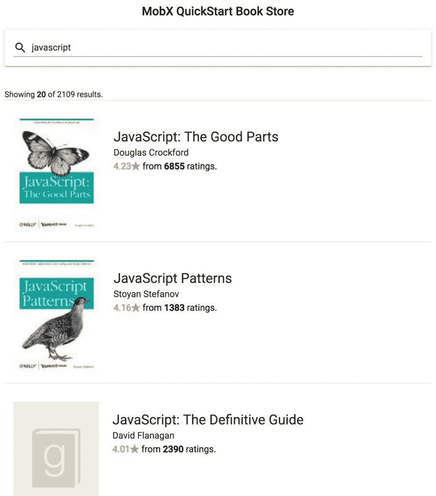
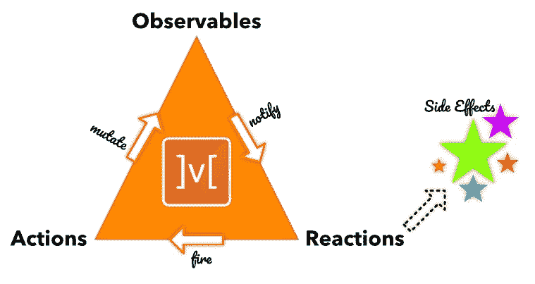
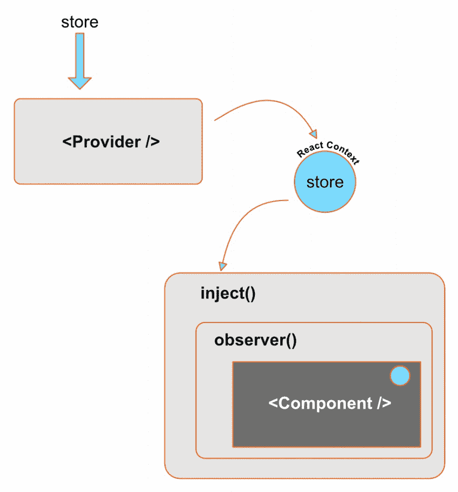
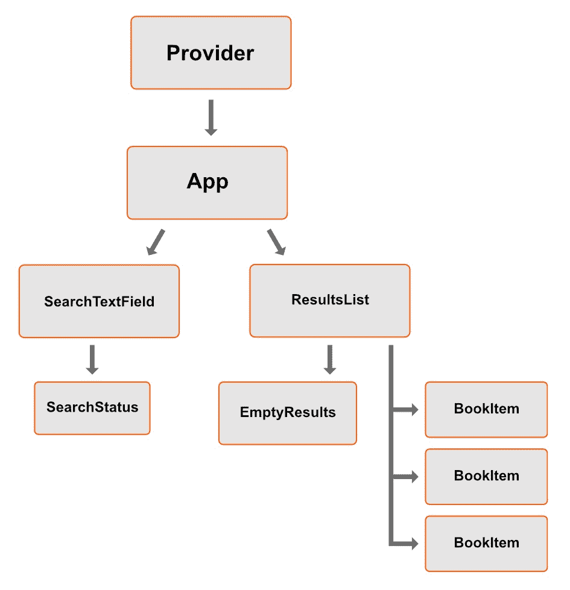

# 第三章：一个带有 MobX 的 React 应用

使用 React 很有趣。现在，再加上 MobX 来满足所有你的状态管理需求，你就有了一个超级组合。基本的 MobX 已经完成，我们现在可以进入使用之前讨论过的想法来构建一个简单的 React 应用。我们将处理定义可观察状态的过程，可以在该状态上调用的操作，以及观察和呈现变化状态的 React UI。

本章涵盖的主题包括以下内容：

+   书籍搜索用例

+   创建可观察状态和操作

+   构建响应式 UI

# 技术要求

你需要有 JavaScript 编程语言。最后，要使用本书的 Git 存储库，用户需要安装 Git。

本章的代码文件可以在 GitHub 上找到：

[`github.com/PacktPublishing/MobX-Quick-Start-Guide/tree/master/src/Chapter03`](https://github.com/PacktPublishing/MobX-Quick-Start-Guide/tree/master/src/Chapter03)

查看以下视频，看看代码是如何运行的：

[`bit.ly/2v0HnkW`](http://bit.ly/2v0HnkW)

# 书籍搜索

我们简单的 React 应用的用例是传统电子商务应用程序之一，即在巨大的库存中搜索产品。在我们的案例中，搜索的是书籍。我们将使用*Goodreads* API 来按标题或作者搜索书籍。Goodreads 要求我们注册一个帐户来使用他们的 API。

通过访问此 URL 创建一个 Goodreads 帐户：[`www.goodreads.com/api/keys`](https://www.goodreads.com/api/keys)。你可以使用你的亚马逊或 Facebook 帐户登录。一旦你有了帐户，你需要生成一个 API 密钥来进行 API 调用。

Goodreads 公开了一组端点，以 XML 格式返回结果。同意，这并不理想，但他们有大量的书籍，将 XML 转换为 JSON 对象是一个小小的代价。事实上，我们将使用一个`npm`包进行此转换。我们将使用的端点是 search-books ([`www.goodreads.com/search/index.xml?key=API_KEY&q=SEARCH_TERM`](https://www.goodreads.com/search/index.xml?key=API_KEY&q=SEARCH_TERM))。

我们应用的 UI 将如下所示：



即使在这个看起来相当简单的界面中，也有一些非常规的用例。由于我们正在进行网络调用来获取结果，所以在显示“结果列表”之前，我们有一个*等待结果*的中间状态。此外，现实世界是严酷的，你的网络调用可能会失败或返回零结果。所有这些状态将在我们的 React UI 中通过 MobX 来处理。

# 可观察状态和操作

UI 只是数据的宏伟转换。它也是这些数据的观察者，并触发操作来改变它。由于数据（又名状态）对 UI 非常重要，因此我们首先从对这种状态进行建模开始是有意义的。使用 MobX，可观察对象表示该状态。回顾之前的 UI 设计，我们可以识别可观察状态的各个部分：

+   用户输入的搜索文本。这是一个字符串类型的可观察字段。

+   有一个可观察的结果数组。

+   有关结果的元信息，例如当前子集和总结果计数。

+   有一些状态来捕获我们将要调用的“async search（）”操作。操作的初始“状态”是“空”。一旦用户调用搜索，我们就处于“挂起”状态。当搜索完成时，我们可能处于“完成”或“失败”状态。这更像是`<empty>`，`pending`，`completed`或`failed`的枚举，并且可以用可观察字段来捕获。

由于所有这些状态属性都相关，我们可以将它们放在一个可观察对象下：

```jsx
const searchState = observable({
    term: '',
    state: '',
    results: [],
    totalCount: 0,
});
```

这肯定是一个很好的开始，似乎捕捉到了我们需要在 UI 上显示的大部分内容。除了状态，我们还需要确定可以在 UI 上执行的操作。对于我们简单的 UI，这包括调用搜索和在用户在文本框中输入字符时更新术语。在 MobX 中，操作被建模为动作，它们在内部改变可观察状态。我们可以将这些作为`searchState`可观察对象上的*操作*添加：

```jsx
const searchState = observable({
    term: '',
    status: '',
    results: [],
    totalCount: 0,

    search: action(function() {
        // invoke search API
  }),

    setTerm: action(function(value) {
        this.term = value;
    }),
});
```

`searchState`可观察对象正在慢慢增长，并且在定义可观察状态时也积累了一些语法噪音。随着我们添加更多的可观察字段、计算属性和操作，这肯定会变得更加难以控制。更好的建模方式是使用类和装饰器。

关于我们为`searchState`可观察定义操作的方式有一个小注意事项。请注意，我们故意避免使用箭头函数来定义操作。这是因为箭头函数在定义操作时捕获**词法 this**。然而，`observable()` API 返回一个新对象，这当然与在`action()`调用中捕获的**词法 this**不同。这意味着您正在改变的`this`不会是从`observable()`返回的对象。您可以尝试通过将箭头函数传递给`action()`调用来验证这一点。

通过将一个普通函数传递给`action()`，我们可以确保`this`指向可观察的正确实例。

让我们看看使用类和装饰器是什么样子的：

```jsx
class BookSearchStore {
    @observable term = '';
    @observable status = '';
    @observable.shallow results = [];

    @observable totalCount = 0;

    @action.bound
  setTerm(value) {
        this.term = value;
    }

    @action.bound
  async search() {
        // invoke search API
    }
}

export const store = new BookSearchStore();
```

使用装饰器使得很容易看到类的可观察字段。事实上，我们有灵活性来混合和匹配可观察字段和常规字段。装饰器还使得调整可观察性的级别变得容易（例如：为结果使用`shallow`可观察）。`BookSearchStore`类利用装饰器捕获可观察字段和操作。由于我们只需要这个类的一个实例，我们将单例实例导出为`store`。

# 管理异步操作

使用`async search()`操作更有趣。我们的 UI 需要在任何时间点知道操作的确切状态。为此，我们有可观察字段：`status`，用于跟踪操作状态。它最初处于`empty`状态，并在操作开始时变为`pending`。一旦操作完成，它可以处于`completed`或`failed`状态。您可以在代码中看到这一点，如下所示：

```jsx
class BookSearchStore {
    @observable term = '';
    @observable status = '';
    @observable.shallow results = [];

    @observable totalCount = 0;

    /* ... */

    @action.bound
  async search() {
        try {
            this.status = 'pending';
            const result = await searchBooks(this.term);

            runInAction(() => {
                this.totalCount = result.total;
                this.results = result.items;
                this.status = 'completed';
            });
        } catch (e) {
            runInAction(() => (this.status = 'failed'));
            console.log(e);
        }
    }
}
```

在前面的代码中有一些值得注意的地方：

+   `async`操作与`sync`操作并没有太大不同。事实上，*async-action 只是在不同时间点上的 sync-actions*。

+   设置可观察状态只是一个赋值的问题。我们在`await`之后的代码中使用`runInAction()`来确保所有可观察值都在一个操作内被改变。当我们为 MobX 打开`enforceActions`配置时，这变得至关重要。

+   因为我们使用了`async-await`，我们在一个地方处理了两种未来的可能性。

+   `searchBooks()`函数只是一个调用 Goodreads API 并获取结果的服务方法。它返回一个 promise，我们在`async`操作中`await`它。

此时，我们已经准备好应用程序的可观察状态，以及可以对这些可观察对象执行的一组操作。我们将创建的 UI 只是简单地绘制这个可观察状态，并公开控件来调用这些操作。让我们直接进入 UI 的观察者领域。

刚刚看到的`async search()`方法中的一个观察是将状态变化包装在`runInAction()`中。如果您在这些调用之间有多个`await`调用并且有状态变化，这可能会变得很繁琐。认真地包装这些状态变化中的每一个可能会很麻烦，甚至可能会忘记包装！

为了避免这种繁琐的仪式，您可以使用一个名为`flow()`的实用函数，它接受一个`generator`函数，而不是`await`，使用`yield`操作符。`flow()`实用程序正确地在`yield`后包装了状态变化，而无需您自己去做。我们将在后面的章节中使用这种方法。

# 响应式 UI

在 MobX 的核心三部曲中，反应起着影响外部世界的作用。在第二章中，*可观察对象、动作和反应*，我们已经看到了一些这些反应的形式，如`autorun()`、`reaction()`和`when()`：



`observer()`是另一种类型的反应，有助于将 React 世界与 MobX 绑定在一起。`observer()`是`mobx-react` NPM 包的一部分，这是一个用于 MobX 和 React 的绑定库。它创建了一个**高阶组件**（**HOC**），用于自动更新可观察状态的变化。在内部，`observer()`跟踪在组件的`render`方法中取消引用的可观察对象。当它们中的任何一个发生变化时，会触发组件的重新渲染。

在 UI 组件树中随处可以添加`observer()`组件是非常常见的。无论何时需要一个可观察对象来渲染组件，都可以使用`observer()`。

我们要构建的 UI 将把`BookSearchStore`的可观察状态映射到各种组件。让我们将 UI 分解为其结构组件，如下图所示。这里的观察者组件包括**SearchTextField**和**ResultsList**：

当您开始将可观察状态映射到 React 组件时，您应该从一个单片组件开始，该组件读取所有必要的状态并将其呈现出来。然后，您可以开始拆分观察者组件，并逐渐创建组件层次结构。建议您尽可能细化观察者组件。这可以确保当只有一小部分组件发生变化时，React 不会不必要地渲染整个组件。

在最高级别上，我们有`App`组件，它组合了`SearchTextField`和`ResultsList`。在代码中，这看起来如下：

```jsx
import {**inject**, observer} from '**mobx-react**'; @inject('store')
@observer class App extends React.Component {
    render() {
        const { store } = this.props;

        return (
            <Fragment>
                <Header />

                <Grid container>
                    <Grid item xs={12}>
                      <Paper elevation={2}  style={{ padding: '1rem' }}>
                            <**SearchTextField**
  onChange={this.updateSearchText}   onEnter={store.search}  />
                        </Paper>
                    </Grid>

                    <ResultsList style={{ marginTop: '2rem' }} />
                </Grid>
            </Fragment>
        );
    }

    updateSearchText = event => {
        this.props.store.setTerm(event.target.value);
    };
}
```

如果您已经注意到了，`App`类上有一个我们以前没有见过的新装饰器：`inject('store')`，也是`mobx-react`包的一部分。这创建了一个将`store`可观察对象绑定到 React 组件的 HOC。这意味着，在`App`组件的`render()`中，我们可以期望在`props`上有一个`store`属性可用。

我们正在使用`material-ui` NPM 包来使用各种 UI 组件。这个组件库为我们的 UI 提供了 Material Design 外观，并提供了许多实用组件，如`TextField`、`LinearProgress`、`Grid`等。

# 到达 store

使用`inject()`，您可以将可观察的`BookSearchStore`连接到您的任何 React 组件。然而，神秘的问题是：*`inject()`*如何知道我们的*`BookSearchStore`*？这就是您需要查看`App`组件上一级发生的事情的地方，我们在那里渲染整个 React 应用程序：

```jsx
import { store } from './BookStore';
import React, { Fragment } from 'react';
import ReactDOM from 'react-dom';
import { Provider } from 'mobx-react';

ReactDOM.render(
    <Provider store={store}>
        <App />
    </Provider>,
    document.getElementById('root'),
);
```

来自`mobx-react`的`Provider`组件与`BookSearchStore`可观察对象建立了真正的连接粘合剂。导出的`BookSearchStore`（名为`store`）的单例实例作为名为`store`的 prop 传递到`Provider`中。在内部，它使用 React Context 将`store`传播到由`inject()`装饰器包装的任何组件。因此，`Provider`提供了`store`可观察对象，而`inject()`连接到*React Context*（由`Provider`公开），并将`store`注入到包装的组件中：



值得注意的是，命名 prop`store`并没有什么特别之处。您可以选择任何您喜欢的名称，甚至可以将多个可观察实例传递给`Provider`。如果我们的简单应用程序需要一个单独的*用户偏好*存储，我们可以这样传递它：

```jsx
import { store } from './BookStore';
import { preferences } from 'PreferencesStore;

<Provider store={store} userPreferences={preferences}>
    <App />
</Provider>
```

当然，这意味着`inject()`也将将其引用为`userPreferences`：

```jsx
@inject('userPreferences')
@observer class PreferencesViewer extends React.Component {
    render() {
        const { userPreferences } = this.props;

        /* ... */
  }
}
```

# `SearchTextField`组件

回到我们最初的例子，我们可以利用`Provider`和`inject()`的功能，在组件树的任何级别访问`store`（`BookSearchStore`的一个实例）。`SearchTextField`组件利用它来成为`store`的观察者：

```jsx
@inject('store')
@observer export class SearchTextField extends React.Component {
    render() {
 const { store, onChange } = this.props;
 const { term } = store;

        return (
            <Fragment>
                <TextField
  placeholder={'Search Books...'}   InputProps={{
                        startAdornment: (
                            <InputAdornment position="start">
                                <Search />
                            </InputAdornment>
                        ),
                    }}   fullWidth={true}  value={term}   onChange={onChange}   onKeyUp={this.onKeyUp}  />

                <SearchStatus />
            </Fragment>
        );
    }

    onKeyUp = event => {
        if (event.keyCode !== 13) {
            return;
        }

        this.props.onEnter();
    };
}
```

`SearchTextField`观察`store`的`term`属性，并在其更改时更新自身。对`term`的更改作为`TextField`的`onChange`处理程序的一部分进行处理。实际的`onChange`处理程序作为一个 prop 传递到`SearchTextField`中，由`App`组件传递。在`App`组件中，我们触发`setTerm()`动作来更新`store.term`属性。

```jsx
@inject('store')
@observer class App extends React.Component {
    render() {
        const { store } = this.props;

        return (
            <Fragment>
                <Header />

                <Grid container>
                    <Grid item xs={12}>
                      <Paper elevation={2}  style={{ padding: '1rem' }}>
                            <SearchTextField
 onChange={this.updateSearchText}  onEnter={store.search}  />
                        </Paper>
                    </Grid>

                    <ResultsList style={{ marginTop: '2rem' }} />
                </Grid>
            </Fragment>
        );
    }

 updateSearchText = event => {
 this.props.store.setTerm(event.target.value);
 };
}
```

现在，`SearchTextField`不仅处理对`store.term`可观察对象的更新，还显示了`SearchStatus`组件的搜索操作状态。我们将这个组件直接包含在`SearchTextField`中，但没有传递任何 props。起初这可能有点不安。`SearchStatus`如何知道当前的`store.status`？嗯，一旦你看到`SearchStatus`的定义，这就显而易见了：

```jsx
import React, { Fragment } from 'react';
import { inject, observer } from 'mobx-react';

export const SearchStatus = inject('store')(
    observer(({ store }) => {
        const { status, term } = store;

        return (
            <Fragment>
                {status === 'pending' ? (
                    <LinearProgress variant={'query'} />
                ) : null}

                {status === 'failed' ? (
                    <Typography
  variant={'subheading'}   style={{ color: 'red', marginTop: '1rem' }}  >
                        {`Failed to fetch results for "${term}"`}
                    </Typography>
                ) : null}
            </Fragment>
        );
    }),
);
```

使用`inject()`，我们可以访问`store`可观察对象，并通过使用`observer()`包装组件，我们可以对可观察状态（`term`，`status`）的变化做出反应。注意嵌套调用`inject('store')(observer( () => {} ))`的使用。这里的顺序很重要。首先调用`inject()`请求要注入的 Provider-prop。这将返回一个以组件为输入的函数。在这里，我们使用`observer()`创建一个高阶组件，并将其传递给`inject()`。

由于`SearchStatus`组件基本上是独立的，`SearchTextField`可以简单地包含它并期望它能正常工作。

当`store.status`改变时，只有`SearchStatus`的虚拟 DOM 发生变化，重新渲染了该组件。`SearchTextField`的其余部分保持不变。这种渲染效率内置在`observer()`中，你不需要额外的工作。在内部，`observer()`会仔细跟踪在`render()`中使用的可观察对象，并设置一个`reaction()`来在任何被跟踪的可观察对象发生变化时更新组件。

# ResultsList 组件

使用`SearchTextField`，当您输入一些文本并按下*Enter*时，搜索操作将被调用。这会改变可观察状态，部分由`SearchTextField`渲染。然而，当结果到达时，与*搜索词*匹配的书籍列表将由`ResultsList`组件显示。正如预期的那样，它是一个*观察者*组件，通过`inject()`连接到`store`可观察对象。但这一次，它使用了稍微不同的方法连接到`store`：

```jsx
import { inject, observer } from 'mobx-react';

@inject(({ store }) => ({ searchStore: store }))
@observer
export class ResultsList extends React.Component {
    render() {
        const { searchStore, style } = this.props;
        const { isEmpty, results, totalCount, status } = searchStore;

        return (
            <Grid spacing={16} container style={style}>
                {isEmpty && status === 'completed' ? (
                    <Grid item xs={12}>
 <EmptyResults />
                    </Grid>
                ) : null}

                {!isEmpty && status === 'completed' ? (
                    <Grid item xs={12}>
                        <Typography>
                            Showing <strong>{results.length}</strong> 
                             of{' '}
                            {totalCount} results.
                        </Typography>
                        <Divider />
                    </Grid>
                ) : null}

                {results.map(x => (
                    <Grid item xs={12} key={x.id}>
 <BookItem book={x} />
                        <Divider />
                    </Grid>
                ))}
            </Grid>
        );
    }
}
```

请注意使用`@inject`装饰器，该装饰器接受一个函数来提取`store`可观察对象。这为您提供了一种更加类型安全的方法，而不是使用字符串属性。您还会看到我们在*提取函数*中将`store`重命名为`searchStore`。因此，`store`可观察对象将以`searchStore`的名称注入。

在`ResultsList`的渲染方法中，我们还在做一些值得注意的其他事情：

+   使用`isEmpty`属性检查搜索结果是否为空。这之前没有声明，但实际上是一个`computed`属性，检查结果数组的长度，如果为零则返回`true`：

```jsx
class BookSearchStore {
    @observable term = 'javascript';
    @observable status = '';
    @observable.shallow results = [];

    @observable totalCount = 0;

 @computed
  get isEmpty() {
 return this.results.length === 0;
 }

    /* ... */
}
```

如果搜索操作已完成并且没有返回结果（`isEmpty = true`），我们将显示`EmptyResults`组件。

+   如果搜索完成并且我们得到了一些结果，我们将显示计数以及结果列表，每个结果都使用`BookItem`组件渲染。

因此，我们应用程序的组件树如下所示：



**Provider**实际上是可观察状态的提供者。它依赖于 React Context 来在组件子树中传播`store`可观察对象。通过使用`inject()`和`observer()`装饰组件，您可以连接到可观察状态并对更改做出反应。**SearchTextField**、**SearchStatus**和**ResultsList**组件依赖于`observer()`和`inject()`为您提供响应式 UI。

随着在 React 16.3+中引入`React.createContext()`，您可以自己创建`Provider`组件。这可能有点冗长，但它实现了相同的目的——在组件子树中传播存储。如果您感到有点冒险，可以尝试一下。

# 总结

`mobx`和`mobx-react`是两个广泛用于构建响应式 UI 的 NPM 包。`mobx`包提供了构建可观察状态、动作和反应的 API。另一方面，`mobx-react`提供了将 React 组件与可观察状态连接并对任何更改做出反应的绑定粘合剂。在我们的示例中，我们利用这些 API 构建了一个图书搜索应用程序。在创建基于*observer*的组件树时，确保使用观察者进行细粒度操作。这样你就可以对你需要渲染 UI 的可观察对象做出反应。

`SearchTextField`、`SearchStatus`和`ResultsList`组件旨在细粒度并对焦点可观察表面做出反应。这是在 React 中使用 MobX 的推荐方式。

在下一章中，我们将深入探讨 MobX，探索可观察对象。
