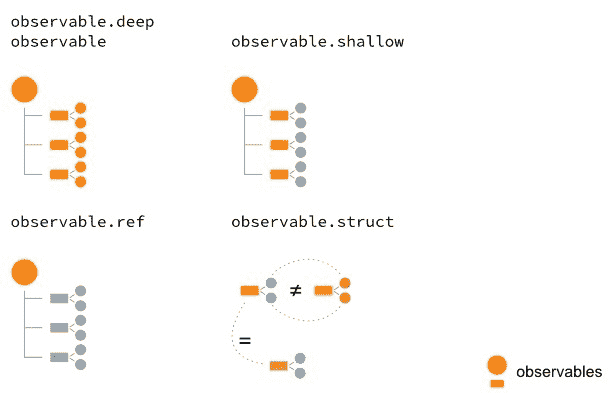
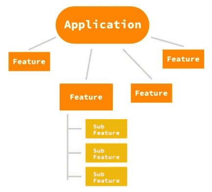

# 第四章：创建可观察树

定义应用程序的响应模型通常是使用 MobX 和 React 时的第一步。我们非常清楚，这都属于以下领域：

+   Observables, which represent the application state

+   操作，改变它

+   Reactions, which produce side effects by observing the changing observables

在定义可观察状态时，MobX 为您提供了各种工具来精确控制可观察性。在本章中，我们将探讨 MobX 的这一方面，并深入研究*创建可观察树*。

本章将涵盖以下主题：

+   数据的形状

+   使用各种装饰器控制可观察性

+   创建计算属性

+   使用类建模 MobX 存储

# 技术要求

您需要掌握 JavaScript 编程语言。最后，要使用本书的 Git 存储库，用户需要安装 Git。

本章的代码文件可以在 GitHub 上找到：

[`github.com/PacktPublishing/MobX-Quick-Start-Guide/tree/master/src/Chapter04`](https://github.com/PacktPublishing/MobX-Quick-Start-Guide/tree/master/src/Chapter04)

查看以下视频以查看代码的实际操作：

[`bit.ly/2uYmln9`](http://bit.ly/2uYmln9)

# 数据的形状

我们在应用程序中处理的数据以各种形状和大小出现。然而，这些不同的形状相当有限，可以列举如下：

+   **Singular values**: These include primitives like numbers, booleans, strings, null, undefined, dates, and so on.

+   **列表**: 您典型的项目列表，其中每个项目都是独一无二的。通常最好避免将不同数据类型的项目放在同一个列表中。这样可以创建易于理解的同质列表。

+   **层次结构**: 我们在 UI 中看到的许多结构都是分层的，比如文件和文件夹的层次结构，父子关系，组和项目等等。

+   **组合**: 一些或所有前述形状的组合。大多数现实世界的数据都是这种形式。

MobX 给了我们 API 来模拟每个形状，我们已经在之前的章节中看到了一些例子。然而，MobX 在单一值和其他类型（如数组和映射）之间做了一个区分。这也反映在 API 中，`observable()`只能用来创建对象、数组和映射。将单一值创建为 observable 需要我们使用`observable.box()`API 来包装它。

# 控制可观察性

默认情况下，MobX 对您的对象、数组和映射应用深度可观察性。这使您可以看到可观察树中任何级别的变化。虽然这是一个很好的默认值，但在某些时候，您将不得不更加关注限制可观察性。减少可观察性也可以提高性能，因为 MobX 需要跟踪的内容更少。

有两种不同的方式可以控制可观察性：

+   通过在类内部使用各种`@decorators`

+   通过使用`decorate()` API

# 使用@decorators

装饰器是一种语法特性，允许您将行为附加到类及其字段上。我们已经在第三章中看到了这一点，*使用 MobX 创建 React 应用*，因此以下代码应该非常熟悉：

```jsx
class BookSearchStore {
    @observable term = 'javascript';
    @observable status = '';
    @observable.shallow results = [];

    @observable totalCount = 0;
}
```

使用`@observable`装饰器，您可以将类的属性变成可观察的。这是开始建模可观察对象的推荐方法。默认情况下，`@observable`应用深度可观察性，但还有一些专门的装饰器可以让您更好地控制。

`@observable`是`@observable.deep`的缩写形式或别名，这是默认的装饰器。它在对象、数组和映射的所有级别上应用*深度可观察性*。然而，深度观察在对象具有*构造函数或原型*的地方停止。这样的对象通常是类的实例，并且预计具有自己的*可观察属性*。MobX 选择在深度观察期间跳过这样的对象。

# 使用@observable.shallow 创建浅观察对象

这个装饰器将可观察性修剪到数据的第一层，也称为**一级深度**观察，对于可观察数组和映射特别有用。对于数组，它将监视数组本身的引用更改（例如，分配一个新数组），以及数组中项目的添加和删除。如果数组中有具有属性的项目，则这些属性不会被视为浅观察。同样，对于映射，只考虑键的添加和删除，以及映射本身的引用更改。可观察映射中键的值保持不变，不被视为观察对象。

以下代码片段展示了`@observable.shallow`装饰器的应用。

```jsx
class BookSearchStore {
    @observable term = 'javascript';
    @observable status = '';
 @observable.shallow results = [];

    @observable totalCount = 0;
}
```

我们选择将这个装饰器应用到`BookSearchStore`的`results`属性上。很明显，我们并不特别观察每个单独结果的属性。事实上，它们是只读对象，永远不会改变值，因此我们只需要将可观察性修剪到项目的添加和移除以及`results`数组中的引用更改。因此，`observable.shallow`在这里是正确的选择。

这里需要记住的一个微妙的点是数组的`length`属性（在地图的情况下是`size`）也是可观察的。你能想出它为什么是可观察的吗？

# 使用@observable.ref 创建仅引用的可观察对象

如果您*不*对数据结构（对象、数组、地图）内发生的任何更改感兴趣，而只对*值的更改*感兴趣，那么`@observable.ref`就是您要找的东西。它只会监视可观察对象的引用更改。

```jsx
import { observable, action } from 'mobx';

class FormData {
 @observable.ref validations = null;

    @observable username = '';
    @observable password = '';

    @action
  validate() {
        const { username, password } = this;
 this.validations = applyValidations({ username, password });
    }
}
```

在前面的例子中，`validations`可观察性总是被分配一个新值。由于我们从未修改此对象的属性，最好将其标记为`@observable.ref`。这样，我们只跟踪`validations`的引用更改，而不跟踪其他任何东西。

# 使用@observable.struct 创建结构可观察对象

MobX 具有内置行为来跟踪值的更改，并且对于诸如字符串、数字、布尔值等基元类型非常有效。但是，在处理*对象*时，它变得不太理想。每当将新对象分配给可观察对象时，它都将被视为更改，并且反应将触发。您真正需要的是*结构检查*，其中比较对象的*属性*而不是*对象引用*，然后决定是否有更改。这就是`@observable.struct`的目的。

它基于*属性值*进行深度比较，而不是依赖顶层引用。您可以将其视为对`observable.ref`装饰器的改进。

让我们看一下以下代码，我们为`location`属性创建一个`@observable.struct`：

```jsx
class Sphere {
 @observable.struct location = { x: 0, y: 0 };

    constructor() {
 autorun(() => {
 console.log(
 `Current location: (${this.location.x}, ${this.location.y})`,
 );
 });
    }

    @action
  moveTo(x, y) {
        this.location = { x, y };
    }
}

let x = new Sphere();

x.moveTo(0, 0);
x.moveTo(20, 30); // Prints
Current location: (0, 0)
Current location: (20, 30)
```

请注意，`autorun()`立即触发一次，然后不会对下一个位置（`{ x: 0, y: 0}`）做出反应。由于结构值相同（0, 0），它不被视为更改，因此不会触发通知。只有当我们将位置设置为不同的（x, y）值时，`autorun()`才会被触发。

现在我们可以表示装饰器的可观察性级别，如下图所示。`@observable`（在这种情况下，`@observable.deep`）是最强大的，其次是`@observable.shallow`，`@observable.ref`，最后是`@observable.struct`。随着可观察装饰器的细化，您可以修剪可观察树中的表面积。这用橙色形状表示。可观察的越多，MobX 的跟踪区域就越大：



# 使用 decorate() API

使用`@decorators`绝对非常方便和可读，但它确实需要一些 Babel 设置（使用*babel-plugin-transform-decorators-legacy*）或在 TypeScript 的编译器选项中打开`experimentalDecorators`标志。MobX 在版本 4 中引入了用于装饰对象或类的可观察属性的*ES5* API。

使用`decorate()` API，您可以有选择地针对属性并指定可观察性。以下代码片段应该可以说明这一点：

```jsx
import { action, computed, decorate, observable } from 'mobx';
 class BookSearchStore {
 term = 'javascript';
 status = '';
 results = [];

 totalCount = 0;

 get isEmpty() {
 return this.results.length === 0;
 }

 setTerm(value) {
 this.term = value;
 }

 async search() {}
}

decorate(BookSearchStore, {
 term: observable,
 status: observable,
 results: observable.shallow,
 totalCount: observable,

 isEmpty: computed,
 setTerm: action.bound,
 search: action.bound,
});
```

```jsx
decorate(target, decorator-object)
```

`target`可以是对象原型或类类型。第二个参数是一个包含要装饰的目标属性的对象。

在前面的示例中，请注意我们将装饰器应用于类类型的方式。从开发人员的角度来看，在没有`@decorators`语法支持时使用它们感觉很自然。事实上，`decorate()` API 也可以用于其他类型的装饰器，如`action`，`action.bound`和`computed`。

# 使用 observable()进行装饰

使用`decorate()` API 时，声明可观察性也适用于`observable()` API。

`observable(properties, decorators, options)`:它的参数如下：

+   `properties`*:* 声明可观察对象的属性

+   `decorators`: 定义属性装饰器的对象

+   `options`: 用于设置默认可观察性和调试友好名称的选项 (`{ deep: false|true, name: string }`)

`observable()`的第二个参数是您在对象中为各种属性指定装饰器的地方。这与`decorate()`调用的工作方式完全相同，如下面的代码片段所示：

```jsx
import { action, computed, observable } from 'mobx';

const cart = observable(
    {
        items: [],
        modified: new Date(),
        get hasItems() {
            return this.items.length > 0;
        },
        addItem(name, quantity) {
            /* ... */
  },
        removeItem(name) {
            /* ... */
  },
    },
 {
 items: observable.shallow,
 modified: observable,

 hasItems: computed,
 addItem: action.bound,
 removeItem: action.bound,
 },
);
```

在第二个参数中，我们已经应用了各种装饰器来控制*可观察性*，应用*操作*，并标记*计算属性*。

在使用`observable()`API 时，不需要显式标记计算属性。MobX 将把传入对象的任何`getter`属性转换为计算属性。

同样，对于`modified`属性，实际上没有必要进行装饰，因为`observable()`默认会使所有内容深度可观察。我们只需要指定需要不同处理的属性。换句话说，只为特殊属性指定装饰器。

# 扩展可观察性

在建模客户端状态时，最好预先定义我们在响应式系统中需要的可观察性。这样可以将领域中的可观察数据的所有约束和范围都固定下来。然而，现实世界总是不可饶恕的，有时您需要在运行时扩展可观察性。这就是`extendObservable()`API 的用武之地。它允许您在运行时混入额外的属性，并使它们也可观察。

在下面的例子中，我们正在扩展`cart`的可观察性以适应节日优惠：

```jsx
import { observable, action, extendObservable } from 'mobx';

const cart = observable({
    /* ... */ });

function applyFestiveOffer(cart) {
    extendObservable(
        cart,
        {
            coupons: ['OFF50FORU'],
            get hasCoupons() {
                return this.coupons && this.coupons.length > 0;
            },
            addCoupon(coupon) {
                this.coupons.push(coupon);
            },
        },
        {
            coupons: observable.shallow,
            addCoupon: action,
        },
    );
}
```

```jsx
extendObservable(target, object, decorators)
```

`extendObservable()`的*第一个*参数是我们要扩展的目标对象。第二个参数是将混入目标对象的可观察属性和操作的列表。第三个参数是将应用于属性的装饰器的列表。

在前面的例子中，我们想要为**购物车**添加更多可观察的内容，以跟踪节日优惠。这只能在运行时根据活动的节日季节来完成。当满足条件时，将调用`applyFestiveOffers()`函数。

`extendObservable()`实际上是`observable()`和`observable.object()`的超集。`observable()`实际上是`extendObservable({}, object)`。这看起来与`decorate()`相似并非巧合。MobX 努力保持 API 一致和直观。虽然`extendObservable()`的第一个参数是实际对象，但`decorate()`要求它是类和对象原型。

*[趣闻]*在引入`decorate()`之前，`extendObservable()`被用来在*类构造函数*内部扩展`this`：`extendObservable(this, { })`。当然，现在推荐的方法是使用`decorate()`，它可以直接应用于类或对象原型。

值得思考的一点是，*observable Map*也可以用于动态添加可观察属性。但是，它们只能是*状态承载*属性，而不是*操作*或*计算属性*。当您想要动态添加*操作*和*计算属性*时，可以使用`extendObservable()`。

# 使用@computed 派生状态

MobX 的一个核心理念是可观察状态应尽可能简化。其他一切都应该通过计算属性***派生***出来。当我们谈论 UI 中的状态管理时，这种观点是有道理的。UI 始终对相同的可观察状态进行微妙的处理，并根据上下文和任务的不同需要状态的不同视图。这意味着在同一个 UI 中有许多可能性来派生基于视图的状态（或表示）。

这种基于视图的状态的一个例子是相同可观察对象列表的表视图和图表视图。两者都在相同的状态上操作，但需要不同的表示来满足 UI（视图）的需求。这样的表示是状态派生的主要候选对象。MobX 认识到了这一核心需求，并提供了***计算属性***，这些计算属性是从其他依赖的可观察对象派生其值的专门的可观察对象。

*计算属性*非常高效并且缓存计算结果。虽然计算属性在依赖的可观察对象发生变化时会重新评估，但如果新值与先前缓存的值匹配，则不会触发通知。此外，如果没有计算属性的观察者，计算属性也会被垃圾回收。这种自动清理也增加了效率。*缓存*和*自动清理*是 MobX 建议大量使用计算属性的主要原因。

使用计算属性，我们可以根据 UI 的需要创建单独的可观察对象。随着应用程序规模的增长，您可能需要更多依赖于核心状态的派生。这些派生（计算属性）可以在需要时使用`extendObservable()`混合进来。

MobX 提供了三种不同的方式来创建计算属性：使用`@computed`装饰器，`decorate()` API，或者使用`computed()`函数。这些可以在以下代码片段中看到：

```jsx
import { observable, computed, decorate } from 'mobx';

// 1\. Using @computed class Cart {
    @observable.shallow items = [];

 @computed
  get hasItems() {
 return this.items.length > 0;
 }
}

// 2\. Using decorate() class Cart2 {
    items = [];

    get hasItems() {
        return this.items.length > 0;
    }
}
decorate(Cart2, {
    items: observable.shallow,
 hasItems: computed,
});

// 3\. Using computed() const cart = new Cart();

const isCartEmpty = computed(() => {
 return cart.items.length === 0;
});

console.log(isCartEmpty.get());

const disposer = isCartEmpty.observe(change => console.log(change.newValue));
```

直接使用`computed()`函数的感觉就像是在使用包装的可观察对象。您必须使用返回的计算函数上的`get()`方法来检索值。

您还可以使用`computed()`函数的`observe()`方法。通过附加观察者，您可以获得更改后的值。这种技术也可以用于处理副作用或反应。

这两个 API 都可以在前面的代码片段中看到。这种用法并不是很常见，但在直接处理装箱可观察对象时可以利用。

# 结构相等

如果计算属性的返回值是一个原始值，那么很容易知道是否有新值。MobX 会将计算属性的先前值与新计算的值进行比较，然后在它们不同时触发通知。因此，值比较变得重要，以确保通知只在*真正的改变*时触发。

对于对象来说，这并不是一件简单的事情。默认比较是基于引用检查进行的（使用`===`运算符）。这会导致对象被视为不同，即使它们内部的值完全相同。

在下面的示例中，`metrics`计算属性每次`start`或`end`属性更改时都会生成一个新对象。由于`autorun`（在构造函数中定义）依赖于`metrics`，它会在每次`metrics`更改时运行副作用：

```jsx
import { observable, computed, action, autorun } from 'mobx';

class DailyPrice {
    @observable start = 0;
    @observable end = 0;

 @computed
  get metrics() {
 const { start, end } = this;
 return {
 delta: end - start,
 };
 }

    @action
  update(start, end) {
        this.start = start;
        this.end = end;
    }

    constructor() {
        autorun(() => {
            const { delta } = this.metrics;
            console.log(`Price Delta = ${delta}`);
        });
    }
}

const price = new DailyPrice();

// Changing start and end, but metrics don't change
price.update(0, 10);
price.update(10, 20);
price.update(20, 30);
```

但是，请注意，即使`start`和`end`属性在更改，`metrics`实际上并没有改变。这可以通过*autorun*副作用来看出，它一直打印相同的增量值。这是因为`metrics`计算属性在每次评估时都返回一个新对象：

```jsx
Price Delta = 0;
Price Delta = 10;
Price Delta = 10;
Price Delta = 10;
```

修复这个问题的方法是使用`@computed.struct`装饰器，它会对对象结构进行深度比较。这确保在重新评估`metrics`属性时返回相同结构时不会触发任何通知。

这是一种保护依赖于这样一个计算可观察对象的昂贵反应的方法。使用`computed.struct`装饰它，以确保只有对象结构的真正改变被视为通知。在概念上，这与我们在本章前一节中看到的`observable.struct`装饰器非常相似：

```jsx
class DailyPrice {
    @observable start = 0;
    @observable end = 0;

 @computed.struct  get metrics() {
        const { start, end } = this;
        return {
            delta: end - start,
        };
    }
    // ... 
}
```

在实践中，很少使用`computed.struct`可观察对象。计算值只有在依赖的可观察对象发生变化时才会改变。当任何依赖的可观察对象发生变化时，必须创建一个新的计算值，在大多数真实世界的应用程序中，它在大多数情况下是不同的。因此，你不需要真的使用`computed.struct`修饰，因为大多数计算值在连续评估中都会非常不同。

# 建模存储

当你开始使用 MobX 为你的 React 应用程序建模客户端状态时，这似乎是一项艰巨的任务。一个可以帮助你在这个过程中的想法是简单地意识到*你的应用程序只是一组特性*，组合在一起形成一个连贯的单元。通过从最简单的特性开始，你可以逐个特性地串联整个应用程序。

这种思维方式指导你首先对特性级别的存储进行建模。应用级别的存储（也称为根存储）只是这些特性存储的组合，具有共享的通信渠道。在 MobX 世界中，你首先使用一个*类*来描述特性存储。根据复杂程度，你可以将特性存储分解为许多子存储。特性存储充当所有子存储的协调者。这是对软件建模的经典*分而治之*方法：



让我们举个例子来说明这种建模响应式客户端状态的方法。在我们之前构建的*图书搜索*应用中，我们想要添加创建愿望清单的功能。愿望清单可以包含你将来想要购买的物品。你应该能够创建任意多个愿望清单。让我们使用 MobX 来建模愿望清单功能。我们不会担心 React 方面的事情，而是专注于使用 MobX 来建模客户端状态。

**愿望清单功能**

这增加了创建愿望清单的能力。愿望清单有一个名称，并包含一个将来要购买的物品列表。可以根据需要创建任意多个愿望清单。愿望清单项具有物品的标题和一个标志来跟踪是否已购买。

使用 MobX 进行建模的第一步是确定*可观察状态*和可以改变它的*操作*。我们现在不会担心*反应*（或*观察者*）。

# 可观察状态

我们将从一个*类*`WishListStore`开始，来跟踪愿望清单功能的所有细节。这是我们的*特性级存储*，其中包含整个特性的可观察状态。根据我们之前看到的描述，让我们提炼核心可观察状态：

+   一个愿望清单数组，其中每个项目都是`WishList`类的一个实例

+   `WishList`有一个*名称*，并包含`WishListItem`实例的数组

+   每个`WishListItem`都有一个*标题*和一个布尔值*purchased*属性

这里值得注意的一件事是，我们从之前的描述中提取了一些词汇。这包括`WishListStore`，`WishList`和`WishListItem`，它们构成了我们特性的支柱。识别这些词汇是困难的部分，可能需要几次迭代才能找到正确的术语。难怪“命名事物”被归类为计算机科学中的两个难题之一！

在代码中，我们现在可以这样捕获这个可观察状态：

```jsx
import { observable } from 'mobx';

class WishListStore {
    @observable.shallow lists = [];
}

class WishList {
    @observable name = '';
    @observable.shallow items = [];
}

class WishListItem {
    @observable title = '';
    @observable purchased = false;
}

const store = new WishListStore();
```

注意数组的`observable.shallow`装饰器的使用。我们不需要对它们进行深层观察。单独的项目（`WishListItem`）有它们自己的可观察属性。愿望清单功能由`WishListStore`（`store`）的单例实例表示。由于我们将创建`WishList`和`WishListItem`的实例，我们可以添加构造函数来使这更容易：

```jsx
class WishList {
    @observable name = '';
    @observable.shallow items = [];

 constructor(name) {
 this.name = name;
 }
}

class WishListItem {
    @observable title = '';
    @observable purchased = false;

 constructor(title) {
 this.title = title;
 }
}
```

# 派生状态

现在核心可观察状态已经建立，我们可以考虑一下派生状态。派生状态（推导）是依赖于其他可观察属性的计算属性。在消费核心可观察状态的上下文中考虑派生状态是有帮助的。

当你有数组时，一个常见的用例是考虑空状态。通常有一些视觉指示列表是空的。与其测试`array.length`，这是相当低级的，不如暴露一个名为`isEmpty`的计算属性。这样的计算属性关注我们存储的*语义*，而不是直接处理核心可观察状态：

```jsx
class WishListStore {
    @observable.shallow lists = [];

 @computed
  get isEmpty() {
 return this.lists.length === 0;
 }
}

class WishList {
    @observable name = '';
    @observable.shallow items = [];

 @computed
  get isEmpty() {
 return this.items.length === 0;
 }

    /* ... */
}
```

同样，如果我们想知道从`WishList`中购买的物品，就不需要定义任何新的可观察状态。它可以从`items`通过过滤`purchased`属性来派生。这就是`purchasedItems`的定义*计算属性*。我将把定义这个计算属性留给读者作为练习。

您应该始终将*observable state*视为最小*core state*和*derived state*的组合。请考虑以下方程式，以确保您没有将太多内容放入核心状态中。可以派生的内容应始终位于*derived state*中：

在现实世界的应用程序中，很可能由于重构而将在一个存储中跟踪的属性移动到另一个存储中。例如，`WishListItem`的`purchased`属性可以由一个单独的存储（例如`ShoppingCartStore`）跟踪。在这种情况下，`WishListItem`可以将其设置为*computed property*并依赖外部存储来跟踪它。这样做不会改变 UI 上的任何内容，因为您读取`purchased`的方式仍然保持不变。此外，由于计算属性隐式创建的依赖关系，MobX 使得保持`purchased`属性始终保持最新变得简单。

# 操作

一旦确定了 observable state，就自然而然地包括可以改变它的*actions*。这些是用户将调用的操作，并由 React 接口公开。在愿望清单功能的情况下，这包括：

+   创建新的`WishList`

+   删除愿望清单

+   重命名愿望清单

+   将项目（`WishListItem`）添加到愿望清单

+   从愿望清单中删除项目

将添加或删除愿望清单的操作放入顶层的`WishListStore`中，而涉及愿望清单中项目的操作将放在`WishList`类中。愿望清单的重命名也可以放在`WishList`类中：

```jsx
import { observable, action } from 'mobx';

class WishListStore {
    @observable.shallow lists = [];

    /* ... */

    @action
  addWishList(name) {
        this.lists.push(new WishList(name));
    }

    @action
  removeWishList(list) {
        this.lists.remove(list);
    }
}

class WishList {
    @observable name = '';
    @observable.shallow items = [];

    /* ... */ 
    @action
  renameWishList(newName) {
        this.name = newName;
    }

    @action
  addItem(title) {
        this.items.push(new WishListItem(title));
    }

    @action
  removeItem(item) {
        this.items.remove(item);
    }
}
```

MobX 为*observable arrays*提供了方便的 API 来移除项目。使用`remove()`方法，您可以删除与值或引用匹配的项目。如果找到并删除了该项目，则该方法将返回*true*。

# 摘要

一旦对 observable state 进行了广泛的切割，就可以使用 observable decorators 进一步定制它。这样可以更好地控制可观察性，并改善 MobX 响应性系统的性能。我们已经看到了两种不同的方法：一种是使用`@decorator`语法，另一种是使用`decorate()`API。

还可以使用`extendObservable()`动态添加新的*observable properties*。实际上，您甚至可以使用`extendObservable()`添加新的*actions*和*computed properties*。

*Observable State = Core State + Derived State*

*核心状态*和*派生状态*是 MobX 中*可观察状态*的两个方面。这很容易用类和装饰器来建模，就像前面的章节中所示的那样。一旦你确定了你的功能的词汇，它们就成为封装*可观察状态*的类名。为了处理功能的复杂性，你可以将其分解为较小的类，并将它们组合在*功能存储*中。然后这些*功能存储*再组合在顶层的*根存储*中。

现在我们对定义和构建*可观察对象*有了更深入的理解，是时候我们来看看 MobX 的其他支柱：*actions*和*reactions*。这就是我们下一章要讨论的内容。
