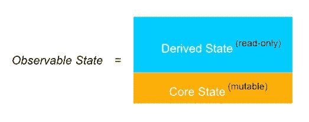
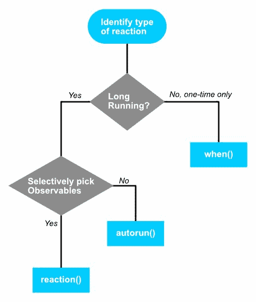

# 第五章：派生、操作和反应

现在，MobX 的基础已经奠定了*可观察*、*操作*和*反应*这三大支柱，是时候深入了解更精妙的细节了。在本章中，我们将探索 MobX API 的核心理念和微妙之处，以及一些特殊的 API 来简化 MobX 中的异步编程。

本章涵盖的主题包括：

+   计算属性（也称为派生）及其各种选项

+   操作，特别关注异步操作

+   反应和规则，控制 MobX 反应的时机

# 技术要求

您需要在系统上安装 Node.js。最后，要使用本书的 Git 存储库，用户需要安装 Git。

本章的代码文件可以在 GitHub 上找到：

[`github.com/PacktPublishing/MobX-Quick-Start-Guide/tree/master/src/Chapter05`](https://github.com/PacktPublishing/MobX-Quick-Start-Guide/tree/master/src/Chapter05)

查看以下视频，了解代码的运行情况：

[`bit.ly/2mAvXk9`](http://bit.ly/2mAvXk9)

# 派生（计算属性）

*派生*是 MobX 术语中经常使用的一个词。在客户端状态建模中特别强调。正如我们在上一章中看到的，可观察状态可以由*核心可变状态*和*派生只读状态*的组合确定：

*可观察状态 = (核心可变状态) + (派生只读状态)*

尽量保持核心状态尽可能精简。这部分预计在应用程序的生命周期内保持稳定并缓慢增长。只有核心状态实际上是可变的，*操作*总是只改变*核心状态*。派生状态取决于核心状态，并由 MobX 反应性系统保持最新。我们知道 *计算属性* 在 MobX 中充当派生状态。它们不仅可以依赖于*核心状态*，还可以依赖于其他派生状态，从而创建一个由 MobX 保持活跃的依赖树：



派生状态的一个关键特征是它是*只读*的。它的工作是生成一个*计算值*（使用*核心状态*），但永远不会改变*核心状态*。MobX 很聪明地缓存这些计算值，并且在没有*计算值*的观察者时不执行任何不必要的计算。强烈建议尽可能利用计算属性，并不用担心性能影响。

让我们举一个例子，你可以拥有一个最小的核心状态和一个派生状态来满足 UI 的需求。考虑一下`Todo`，`TodoList`和`TodoManager`。你可能猜到这些类是做什么的。它们构成了*Todos*应用程序的可观察状态：

```jsx
import { computed, decorate, observable, autorun, action } from 'mobx';

class Todo {
    @observable title = '';
    @observable done = false;

    constructor(title) {
        this.title = title;
    }
}

class TodoList {
    @observable.shallow todos = [];

    **@computed**
  get pendingTodos() {
        return this.todos.filter(x => x.done === false);
    }

    **@computed**
  get completedTodos() {
        return this.todos.filter(x => x.done);
    }

 @computed
    get pendingTodosDescription() {
        const count = this.pendingTodos.length; return `${count} ${count === 1 ? 'todo' : 'todos'} remaining`;
    }

 @action  addTodo(title) {
 const todo = new Todo(title);
 this.todos.push(todo);
    }
}

class TodoManager {
    list = null;

    @observable filter = 'all'; // all, pending, completed
  @observable title = ''; // user-editable title when creating a new 
    todo

    constructor(list) {
        this.list = list;

        autorun(() => {
            console.log(this.list.pendingTodos.length);
        });
    }

    **@computed**
  get visibleTodos() {
        switch (this.filter) {
            case 'pending':
                return this.list.pendingTodos;
            case 'completed':
                return this.list.completedTodos;
            default:
                return this.list.todos;
        }
    }
}
```

从上面的代码中可以看出，核心状态由使用`@observable`标记的属性定义。它们是这些类的可变属性。对于*Todos*应用程序，核心状态主要是`Todo`项目的列表。

派生状态主要是为了满足 UI 的过滤需求，其中包括使用`@computed`标记的属性。特别感兴趣的是`TodoList`类，它只有一个`@observable`：一个`todos`数组。其余的是由`@computed`标记的`pendingTodos`，`pendingTodosDescription`和`completedTodos`组成的派生状态。

通过保持精简的核心状态，我们可以根据 UI 的需要产生许多派生状态的变化。这样的派生状态也有助于保持语义模型的清晰和简单。这也给了你一个机会来*强制执行领域的词汇*，而不是直接暴露原始的核心状态。

# 这是一个副作用吗？

在第一章 *状态管理简介*中，我们谈到了副作用的作用。这些是应用程序的响应性方面，根据状态（也称为数据）的变化产生*外部效果*。如果我们现在通过副作用的角度来看*computed 属性*，你会发现它与 MobX 中的反应非常相似。毕竟，在 MobX 中，反应会查看可观察对象并产生副作用。计算属性也是这样做的！它依赖于可观察对象并产生可观察值作为副作用。那么，*computed 属性*应该被视为副作用吗？

确实是一个非常有力的论点。它可能会出现作为它派生的一种副作用，但它生成*可观察值*的事实将其带回到*客户端状态*的世界，而不是成为外部影响。实际上，计算属性是 UI 和其他状态管理方面的数据。与 MobX 引起副作用的函数（如`autorun()`、`reaction()`和`when()`）不同，计算属性不会引起任何*外部*副作用，并且保持在客户端状态的范围内。

MobX 反应和计算属性之间的另一个明显区别是，*计算属性有一个隐含的期望会返回一个值*，而反应是*即时反应*，没有期望得到一个值。此外，对于计算属性，重新评估（计算属性的*副作用*部分）可以在没有更多观察者时停止。然而，对于反应，何时停止它们并不总是清楚。例如，何时停止记录或网络请求并不总是清楚。

因此，让我们通过说*计算属性*只是*部分副作用*而不是 MobX 的全面、即时反应来结束这个案例。

# computed()还有更多内容

到目前为止，我们已经看到了`@computed`装饰器与`@computed.struct`的使用，其中结构相等非常重要。当然，`computed`函数还有更多内容，还可以采用多个选项进行精细的定制。在使用`decorate()`函数、`@computed`装饰器或创建*boxed-computed observables*时，这些选项都是可用的。

在下面的片段中，我们看到了在`decorate()`函数中的使用，这更常见：

```jsx
class TodoList {
    @observable.shallow todos = [];
    get pendingTodos() {
        return this.todos.filter(x => x.done === false);
    }

    get completedTodos() {
        return this.todos.filter(x => x.done);
    }

    @action
  addTodo(title) {
        const todo = new Todo(title);
        this.todos.push(todo);
    }
}

decorate(TodoList, {
 pendingTodos: computed({ name: 'pending-todos', /* other options */ }),
});

```

可以将`computed()`的选项作为*对象参数*传递，具有多个属性：

+   `name`：与 MobX DevTools（***mobx-react-devtools*** NPM 包的一部分）结合使用时很有用。在日志中使用此处指定的名称，并且在检查呈现的 React 组件的*observables*时也会使用。

+   `context`：计算函数内部的值*“**this**”*。一般情况下，您不需要指定，因为它将默认为装饰实例。

+   `set`：*计算属性*最常用作*getter*。但是，你也可以提供一个 setter。这不是为了替换计算属性的值，而是作为*反向*。考虑以下示例，其中`fullName`的 setter 将其拆分为`firstName`和`lastName`：

```jsx
class Contact {
    @observable firstName = '';
    @observable lastName = '';

 get fullName() {
 return `${this.firstName} ${this.lastName}`;
 }

}

decorate(Contact, {
    fullName: computed({
        // extract firstName and lastName
 set: function(value) {
 const [firstName, lastName] = value.split(' ');

 this.firstName = firstName;
 this.last = lastName;
 },
    }),
});
```

要在类内部执行相同的操作，而不使用`decorate()`，只需添加一个 setter，如下面的代码所示：

```jsx
class Contact {
    @observable firstName = '';
    @observable lastName = '';

    @computed
  get fullName() {
        return `${this.firstName} ${this.lastName}`;
    }

 set fullName(value) {
 const [firstName, lastName] = value.split(' ');

 this.firstName = firstName;
 this.lastName = lastName;
 }
}

const c = new Contact();

c.firstName = 'Pavan';
c.lastName = 'Podila';

console.log(c.fullName); // Prints: Pavan Podila

c.fullName = 'Michel Weststrate';
console.log(c.firstName, c.lastName); // Prints: Michel Weststrate
```

+   `keepAlive`：有时候你需要一个计算值始终可用，即使没有跟踪观察者。这个选项保持计算值的“热度”并始终更新。但要注意的是，这个选项会始终缓存计算值，可能会导致内存泄漏和昂贵的计算。具有`{ keepAlive: true }`的计算属性的对象只有在所有依赖的观察者都被垃圾回收时才能被垃圾回收。因此，请谨慎使用此选项。

+   `requiresReaction`：这是一个旨在防止*昂贵的计算运行频率超出预期*的属性。默认值设置为`false`，这意味着即使没有观察者（也称为反应），它也会在第一次评估。当设置为`true`时，如果没有观察者，它不会执行计算。相反，它会抛出一个错误，告诉您需要一个观察者。可以通过调用`configure({ computedRequiresReaction: Boolean })`来更改全局行为。

+   `equals`：这设置了计算属性的相等检查器。相等检查确定是否需要发出通知以通知所有观察者（也称为反应）。我们知道，只有当*新计算值*与*先前缓存的值*不同时，才会发出通知。默认值为`comparer.identity`，它执行`===`检查。换句话说，值和引用检查。另一种相等检查是使用`comparer.structural`，它执行值的深度比较以确定它们是否相等。在概念上，它类似于`observable.struct`装饰器。这也是`computed.struct`装饰器使用的比较器：

```jsx
import { observable, computed, decorate, comparer } from 'mobx';

class Contact {
    @observable firstName = '';
    @observable lastName = '';

  get fullName() {
        return `${this.firstName} ${this.lastName}`;
    }

}

decorate(Contact, {
    fullName: computed({
  set: function(value) {
            const [firstName, lastName] = value.split(' ');

            this.firstName = firstName;
            this.last = lastName;
        },
 equals: comparer.identity,
    }),

});
```

# 计算内部的错误处理

计算属性具有在计算过程中捕获错误并从中恢复的特殊能力。它们不会立即退出，而是捕获并保留错误。只有当您尝试从*计算属性*中读取时，它才会重新抛出错误。这使您有机会通过重置一些状态并返回到一些默认状态来恢复。

以下示例直接来自 MobX 文档，并恰当地演示了错误恢复：

```jsx
import { observable, computed } from 'mobx';

const x = observable.box(3);
const y = observable.box(1);

const divided = computed(() => {
    if (y.get() === 0) {
        throw new Error('Division by zero');
    }

    return x.get() / y.get();
});

divided.get(); // returns 3   y.set(0); **// OK**   try {
    divided.get(); // Throws: Division by zero
        } catch (ex) {
    // Recover to a safe state
 y.set(2);
}

divided.get(); // Recovered; Returns 1.5 
```

# 操作

*操作*是改变应用程序核心状态的方式。事实上，MobX 强烈建议您始终使用操作，永远不要在操作之外进行任何变化。如果您使用`configure`配置 MobX 为`{ enforceActions: true }`，它甚至会在整个应用程序中强制执行此要求：

```jsx
import { configure } from 'mobx';

configure({ enforceActions: true });
```

让上述代码行成为您的*MobX 驱动*React 应用程序的起点。显然，对于所有状态变异使用操作有一些好处。但到目前为止，这还不太清楚。让我们深入挖掘一下，揭示这些隐藏的好处。

`configure({ enforceActions: true })`并不是保护状态变异的唯一选项。还有一种更严格的形式，即`{ enforceActions: 'strict' }`。差异微妙但值得注意。当设置为`true`时，仍允许在操作之外进行偶发变异，**如果**没有*观察者*跟踪变异的可观察对象。这可能看起来像是 MobX 的一个疏忽。但是，允许这样做是可以的，因为尚未发生任何副作用，因为没有观察者。这不会对 MobX 反应性系统的一致性造成任何伤害。就像古话说的那样，*如果树倒在森林里，没有人在附近，它会发出声音吗？*也许有点哲学，但要点是：没有观察者，没有人跟踪可观察对象并引起副作用，因此您可以安全地应用变异。

但是，如果您确实想要走纯粹的路线，您可以使用`{ enforceActions: 'strict' }`，即使在没有观察者的情况下也可以进行操作。这真的是个人选择。

# 为什么要使用操作？

当可观察对象发生变化时，MobX 立即发出通知，通知每个观察者发生了变化。因此，如果您改变了 10 个可观察对象，将发送 10 个通知。有时，这只是过多的。您不希望一个过于急切地通知的嘈杂系统。最好将通知批量处理并一次性发送。这样可以节省 CPU 周期，使您移动设备上的电池更加愉快，并且通常会导致一个平衡、更健康的应用程序。

当您将所有的变化放在`action()`中时，这正是`action()`所实现的。它用`untracked()`和`transaction()`包装了变异函数，这两个是 MobX 中的特殊用途的低级实用程序。`untracked()`阻止在变异函数内跟踪可观察对象（也称为创建新的*可观察-观察者*关系）；而`transaction()`批处理通知，强制在同一可观察对象上的通知，然后在***action***结束时发送最小的通知集。

有一个核心实用功能被操作使用，即`allowStateChanges(true)`。这确保状态变化确实发生在可观察对象上，并且它们获得它们的新值。*untracked*、*transaction*和*allowStateChanges*的组合构成了一个动作：

*action = untracked(transaction(allowStateChanges(true, <mutating-function>) ) )*

这种组合具有以下预期效果：

+   减少过多的通知

+   通过批量处理最小的通知来提高效率

+   通过批量处理最小的通知来最小化在*动作*中多次改变的可观察对象的*副作用*执行

事实上，动作可以嵌套在彼此之内，这确保通知只在*最外层动作*执行完成后才发出。

*动作*还有助于展现领域的语义，并使您的应用程序变得更具声明性。通过包装可观察对象如何被改变的细节，您为改变状态的操作赋予了一个*独特的名称*。这强调了您领域的*词汇*，并将其编码为您的*状态管理*的一部分。这是对*领域驱动设计*原则的一种赞同，它将普遍语言（您领域的术语）引入客户端代码。

*动作*有助于弥合领域词汇和实际代码中使用的名称之间的差距。除了效率上的好处，您还可以获得保持代码更可读的语义上的好处。

我们之前在*派生（计算属性）*部分看到，您也可以有设置器。这些设置器会被 MobX 自动包装在`action()`中。计算属性的设置器实际上并不直接改变计算属性。相反，它是改变组成计算属性的依赖可观察对象的逆过程。由于我们正在改变可观察对象，将它们包装在一个动作中是有意义的。MobX 足够聪明，可以为您做到这一点。

# 异步操作

JavaScript 中的异步编程无处不在，MobX 完全拥抱了这个想法，而没有增加太多的仪式感。这里有一个小片段展示了一些异步代码与 MobX 状态变化交织在一起：

```jsx
class ShoppingCart {
    @observable asyncState = '';

    @observable.shallow items = [];

    **@action**
  async submit() {
        this.asyncState = 'pending';
        try {
            const response = **await** this.purchaseItems(this.items);

            this.asyncState = 'completed'; // modified outside of 
            action
        } catch (ex) {
            console.error(ex);
            this.asyncState = 'failed'; // modified outside of action
        }
    }

    purchaseItems(items) {
        /* ... */
  return Promise.resolve({});
    }
}
```

看起来很正常，就像任何其他异步代码一样。这正是重点所在。默认情况下，MobX 简单地让步，让您按预期改变可观察对象。然而，如果您将 MobX 配置为`{ enforceActions: 'strict' }`，您将在控制台上得到一个热烈的**红色**欢迎：

```jsx
Unhandled Rejection (Error): [mobx] Since strict-mode is enabled, changing observed observable values outside actions is not allowed. Please wrap the code in an `action` if this change is intended. Tried to modify: **ShoppingCart@14.asyncState**
```

你可能会问，这里有什么问题？这与我们对`async-await`操作符的使用有关。您看，跟在`await`后面的代码*不会*同步执行。它会在`await`承诺实现之后执行。现在，`action()`装饰器只能保护在其块内同步执行的代码。异步运行的代码不被考虑，因此在`action()`之外运行。因此，跟在`await`后面的代码不再是`action`的一部分，导致 MobX 抱怨。

# 使用 runInAction()进行包装

解决这个问题的方法是使用 MobX 提供的一个实用函数，称为`runInAction()`。这是一个方便的函数，它接受一个*变异函数*并在`action()`内执行它。在下面的代码中，您可以看到使用`runInAction()`来*包装*这些变化：

```jsx
import { action, observable, configure, runInAction } from 'mobx';

configure({ enforceActions: 'strict' });

class ShoppingCart {
    @observable asyncState = '';

    @observable.shallow items = [];

    @action
  async submit() {
        this.asyncState = 'pending';
        try {
            const response = await this.purchaseItems(this.items);

 runInAction(() => {
 this.asyncState = 'completed';
 });
        } catch (ex) {
            console.error(ex);

 runInAction(() => {
 this.asyncState = 'failed';
 });
        }
    }

    purchaseItems(items) {
        /* ... */
  return Promise.resolve({});
    }
}

const cart = new ShoppingCart();

cart.submit();
```

请注意，我们已经在跟在`await`后面的代码中应用了`runInAction()`，无论是在*try 块*还是在*catch 块*中。

`runInAction(fn)`只是一个方便的实用程序，相当于`action(fn)()`。

虽然*async-await*提供了一种美观简洁的语法来编写`async`代码，但要注意那些不是同步的代码部分。`action()`块中代码的共同位置可能会让人产生误解。在运行时，并非所有语句都是同步执行的。跟在`await`后面的代码总是以`async`方式运行，等待的 promise 完成后才会执行。将那些`async`部分用`runInAction()`包装起来，可以让我们重新获得`action()`装饰器的好处。现在，当你配置`({ enforceActions: 'strict' })`时，MobX 不再抱怨了。

# flow()

在之前的简单示例中，我们只需要将代码的两个部分用`runInAction()`包装起来。这是相当直接的，不需要太多的努力。然而，有些情况下你会在一个函数中有多个`await`语句。考虑下面展示的`login()`方法，它执行涉及多个*await*的操作：

```jsx
import { observable, action } from 'mobx';

class AuthStore {
    @observable loginState = '';

    @action.bound
  async login(username, password) {
        this.loginState = 'pending';

        **await** this.initializeEnvironment();

        this.loginState = 'initialized';

        **await** this.serverLogin(username, password);

        this.loginState = 'completed';

        **await** this.sendAnalytics();

        this.loginState = 'reported';
    }

    async initializeEnvironment() {}

    async serverLogin(username, password) {}

    async sendAnalytics() {}
}
```

在每个`await`后用`runInAction()`包装状态变化会很快变得繁琐。如果涉及更多条件或者变化分散在多个函数中，甚至可能会忘记包装一些部分。如果有一种方法可以自动将代码的异步部分包装在`action()`中会怎么样呢？

MobX 也为这种情况提供了解决方案。有一个名为`flow()`的实用函数，它以*生成器函数*作为输入。你可以使用`yield`操作符，而不是`await`。在概念上，它与*async-await*类型的代码非常相似，但是使用*生成器函数*和`yield`语句来实现相同的效果。让我们使用`flow()`实用程序重写前面示例中的代码：

```jsx
import { observable, action, flow, configure } from 'mobx';

configure({ enforceActions: 'strict' });

class AuthStore {
    @observable loginState = '';

    login = flow(function*(username, password) {
        this.loginState = 'pending';

        **yield** this.initializeEnvironment();

        this.loginState = 'initialized';

        **yield** this.serverLogin(username, password);

        this.loginState = 'completed';

        **yield** this.sendAnalytics();

        this.loginState = 'reported';

        **yield** this.delay(3000);
    });

}

new AuthStore().login();
```

注意使用生成器`function*()`而不是传递给`flow()`的常规函数。结构上，它与*async-await*风格的代码没有什么不同，但它有一个额外的好处，就是自动将`yield`后面的代码部分用`action()`包装起来。有了`flow()`，你可以更加声明式地编写异步代码。

`flow()`给你另一个好处。它可以*取消异步代码的执行*。

`flow()`的返回值是一个函数，你可以调用它来执行异步代码。这是前面示例中`AuthStore`的`login`方法。当你调用`new AuthStore().login()`时，你会得到一个由 MobX 增强的带有`cancel()`方法的 promise：

```jsx
const promise = new AuthStore().login2();
promise.cancel(); // prematurely cancel the async code
```

这对于通过给予用户级别的控制来取消长时间运行的操作非常有用。

# 反应

可观察对象和操作使事物保持在 MobX 反应系统的范围内。操作改变可观察对象，并通过通知的力量，MobX 系统的其余部分会调整以保持状态一致。要开始在 MobX 系统之外进行更改，您需要*反应*。它是连接 MobX 世界内部发生的*状态变化*与外部世界的桥梁。

*将反应视为 MobX 和外部世界之间的反应桥梁。这也是您的应用程序的副作用产生者。*

我们知道反应有三种类型：`autorun`，`reaction`和`when`。这三种类型具有不同的特征，可以处理应用程序中的各种情况。

确定选择哪一个时，您可以应用这个简单的决策过程：



每个反应都会返回一个*清除函数*，可以用来提前清除反应，如下所示：

```jsx
import { autorun, reaction, when } from 'mobx';

const disposer1 = autorun(() => {
    /* effect function */ });

const disposer2 = reaction(
    () => {
        /* tracking function returning data */
  },
    data => {
        /* effect function */
  },
);

const disposer3 = when(
    () => {
        /* predicate function */
  },
    predicate => {
        /* effect function */
  },
);

// Dispose pre-maturely
disposer1();
disposer2();
disposer3();
```

回到决策树上的前面图表，我们现在可以定义什么是“长时间运行”：反应在第一次执行后不会自动清除。它会继续存在，直到使用“清除函数”明确清除为止。`autorun()`和`reaction()`属于长时间运行的反应，而`when()`是一次性的。请注意，`when()`也会返回一个“清除函数”，可以提前取消`when()`的效果。然而，“一次性”的行为意味着在效果执行后，`when()`将自动清除自身，无需任何清理。

决策树中涵盖的第二个定义特征是关于*选择要跟踪的可观察对象*。这是执行*效果函数*的保护条件。`reaction()`和`when()`有能力决定要用于跟踪的可观察对象，而`autorun()`隐式选择其*效果函数*中的所有可观察对象。在`reaction()`中，这是*跟踪函数*，而在`when()`中，这是*谓词函数*。这些函数应该产生一个值，当它改变时，*效果函数*就会被执行。

`reaction()`和`when()`的*选择器函数*是可观察跟踪发生的地方。*效果函数*仅用于引起没有跟踪的副作用。`autorun()`隐式地将*选择器函数*和*效果函数*合并为一个函数。

使用决策树，您可以对应用程序中的不同*副作用*进行分类。在第六章中，*处理真实用例*，我们将看一些示例，这将使选择过程更加自然。

# 配置 autorun()和 reaction()

`autorun()`和`reaction()`都提供了一个额外的参数来自定义行为。让我们看看可以作为选项传递的最常见属性。

# autorun()的选项

`autorun()`的第二个参数是一个携带*选项*的对象：

```jsx
autorun(() => { /* side effects */}, options)
```

它具有以下属性：

+   `name`：这对于调试目的非常有用，特别是在 MobX DevTools 的上下文中，其中`name`在日志中打印出来。名称也与 MobX 提供的`spy()`实用程序函数一起使用。这两者将在以后的章节中介绍。

+   `delay`：这充当频繁更改的可观察对象的去抖器。*效果函数*将在`delay`期间（以毫秒为单位指定）等待重新执行。在接下来的示例中，我们要小心，不要在每次更改`profile.couponsUsed`时都发出网络请求。使用`delay`选项是一个简单的防护措施：

```jsx
import { autorun } from 'mobx';

const profile = observable({
    name: 'Pavan Podila',
    id: 123,
    couponsUsed: 3,
});

function sendCouponTrackingAnalytics(id, couponsUsed) {
    /* Make network request */ }

autorun(
    () => {
        sendCouponTrackingAnalytics(profile.id, profile.couponsUsed);
    },
    { delay: 1000 },
);
```

+   `onError`：在*效果函数*执行期间抛出的错误可以通过提供`onError`处理程序来安全处理。错误作为输入提供给`onError`处理程序，然后可以用于恢复，并防止*效果函数*的后续运行出现异常状态。请注意，通过提供此处理程序，MobX 即使在发生错误后也会继续跟踪。这使系统保持运行，并允许其他已安排的*副作用*按预期运行，这些副作用可能是不相关的。

在以下示例中，我们有一个`onError`处理程序，用于处理优惠券数量大于两的情况。通过提供此处理程序，保持`autorun()`的运行，而不会干扰 MobX 反应性系统的其余部分。我们还删除多余的优惠券，以防止再次发生这种情况：

```jsx
autorun(
    () => {
        if (profile.couponsUsed > 2) {
            throw new Error('No more than 2 Coupons allowed');
        }
    },
    {
        onError(ex) {
            console.error(ex);
            removeExcessCoupons(profile.id);
        },
    },
);

function removeExcessCoupons(id) {}
```

# reaction()的选项

与`autorun()`类似，我们可以传递一个额外的参数给`reaction()`，其中包含*选项*：

`*reaction(() => {/* tracking data */}, (data) => { /* side effects */}, options)*`

一些选项如下所示，与*autorun*完全相同，保持一致：

+   `name`

+   `delay`

+   `onError`

但是，特别针对`reaction()`，还有其他选项：

+   `fireImmediately`：这是一个布尔值，指示在*跟踪函数*第一次调用后是否立即触发*效果函数*。请注意，这种行为使我们更接近`autorun()`，它也会立即运行。默认情况下，它被设置为`false`。

+   `equals`：请注意，`reaction()`中的*跟踪函数*返回的`data`将与先前产生的值进行比较。对于原始值，默认的*相等比较*（`comparer.default`）基于值的比较效果很好。但是，您可以自由提供结构比较器（`comparer.structural`）来确保执行更深层次的比较。相等检查很重要，因为只有当值（由*跟踪函数*产生）不同时，*效果函数*才会被调用。

# MobX 何时会做出反应？

MobX 的反应性系统始于*可观察对象*的跟踪或观察。这是构建反应性图的重要方面，因此跟踪正确的可观察对象至关重要。通过遵循一套简单的规则，您可以保证跟踪过程的结果，并确保您的反应正确触发。

我们将使用术语*跟踪函数*来指代以下任何一个：

+   传递给`autorun()`的函数。该函数中使用的可观察对象将被 MobX 跟踪。

+   `reaction()`或`when()`的*选择器函数*（第一个参数）。其中使用的可观察对象也将被跟踪。

+   *observer*-React 组件的`render()`方法。在执行`render()`方法时使用的可观察对象将被跟踪。

# 规则

在以下每条规则中，我们将看一个规则在实际中的例子：

+   在*跟踪函数*的执行过程中始终解引用可观察对象。解引用是建立 MobX 跟踪器的关键。

```jsx
const item = observable({
    name: 'Laptop',
    price: 999,
    quantity: 1,
});

autorun(() => {
 showInfo(item);
});

item.price = 1050;
```

在上面的片段中，由于没有可观察属性被解引用，`autorun()`不会再次被调用。为了让 MobX 对更改做出反应，需要在*跟踪函数*内读取可观察属性。一个可能的修复方法是在`autorun()`内部读取`item.price`，这样每当`item.price`发生变化时就会重新触发：

```jsx
autorun(() => {
    showInfo(item.price);
});
```

+   跟踪仅发生在跟踪函数的同步执行代码中：

+   应该直接在跟踪函数中访问 observable，而不是在异步函数中访问。

+   在以下代码中，MobX 永远不会对`item.quantity`的更改做出反应。尽管我们在`autorun()`中取消引用 observable，但这并不是同步进行的。因此，MobX 永远不会重新执行`autorun()`：

```jsx
autorun(() => {
 setTimeout(() => {
        if (item.quantity > 10) {
            item.price = 899;
        }
    }, 500);
});

item.quantity = 24;
```

要修复，我们可以将代码从`setTimeout()`中取出，并直接放入`autorun()`中。如果使用`setTimeout()`是为了添加一些延迟执行，我们可以使用`autorun()`的`delay`选项来实现。以下代码显示了修复：

```jsx
autorun(
    () => {
        if (item.quantity > 10) {
            item.price = 899;
        }
    },
 { delay: 500 },
);
```

+   只有已经存在的 observable 才会被跟踪：

+   在以下示例中，我们正在取消引用一个 observable（一个计算属性），该属性在`autorun()`执行时并不存在于`item`上。因此，MobX 从不跟踪它。在代码的后面，我们改变了`item.quantity`，导致`item.description`发生变化，但`autorun()`仍然不会执行：

```jsx
autorun(() => {
    console.log(`Item Description: ${item.description}`);
});

extendObservable(item, {
    get description() {
        return `Only ${item.quantity} left at $${item.price}`;
    },
});

item.quantity = 10;
```

一个简单的解决方法是确保在`autorun()`执行之前 observable 实际存在。通过改变语句的顺序，我们可以得到期望的行为，如下面的代码片段所示。在实践中，您应该预先声明所有需要的属性。这有助于 MobX 在需要时正确跟踪属性，有助于类型检查器（例如 TypeScript）确保正确的属性被使用，并且还清楚地表达了代码读者的意图：

```jsx
extendObservable(item, {
 get description() {
 return `Only ${item.quantity} left at $${item.price}`;
 },
});

autorun(() => {
    console.log(`Item Description: ${item.description}`);
});

item.quantity = 10;
```

在修复之前的代码片段中，如果我们在`autorun()`中也读取了`item.quantity`，那么这个*跟踪函数*会在`item.quantity`发生变化时重新执行。这是因为 observable 属性在`autorun()`首次执行时存在。第二次`autorun()`执行（由于`item.quantity`的变化），`item.description`也将可用，MobX 也可以开始跟踪它。

+   前一个规则的一个例外是 Observable Maps，其中还跟踪动态键：

```jsx
const twitterUrls = observable.map({
    John: 'twitter.com/johnny',
});

autorun(() => {
    console.log(twitterUrls.get('Sara'));
});

twitterUrls.set('Sara', 'twitter.com/horsejs');
```

在前面的代码片段中，`autorun()`将重新执行，因为`twitterUrls`是一个`observable.map`，它跟踪新键的添加。因此，即使在`autorun()`执行时它不存在，键`Sara`仍然被跟踪。

在 MobX 5 中，它可以跟踪使用`observable()`API 创建的所有对象的*尚不存在的*属性。

# 总结

MobX 应用的思维模型是针对思考*可观察状态*的。这本身分为*最小核心状态*和*派生状态*。派生是我们如何处理核心状态在 UI 上的各种投影以及需要执行特定于领域的操作的地方。在添加更多核心状态之前，考虑它是否可以作为派生状态进行整合。只有在这种情况下，您才应该引入新的核心状态。

我们看到，*异步操作*与常规*操作*非常相似，没有太多的仪式感。唯一的注意事项是当您配置 MobX 为`enforceActions`时。在这种情况下，您必须在异步代码中的*状态变化*中使用`runInAction()`进行包装。当操作中有几个异步部分时，**`flow()`**是一个更好的选择。它采用一个生成器函数（用`function*(){ }`表示），其中插入了对各种*基于 promise*的调用的`yield`。

`reaction()`和`autorun()`提供了额外的选项来控制它们的行为。它们共享大多数选项，例如*名称*、*延迟*和*onError*。`reaction()`还有两个选项：控制如何对*跟踪函数*产生的数据进行比较（`equals`），以及在*跟踪函数*的第一次运行后是否立即触发*效果函数*（`fireImmediately`）。

在第六章中，*处理真实用例*，我们可以开始探索使用 MobX 解决各种常见情况的方法。如果到目前为止的章节看起来像是*科学*，那么下一章就是*应用科学*！
