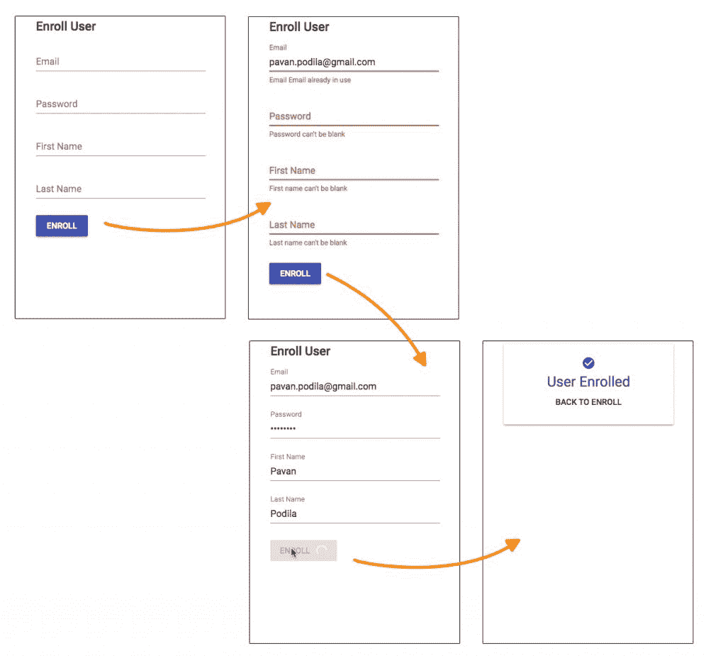
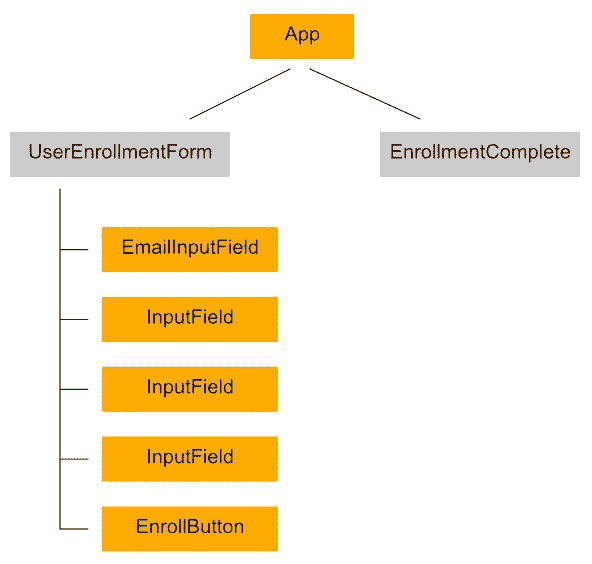
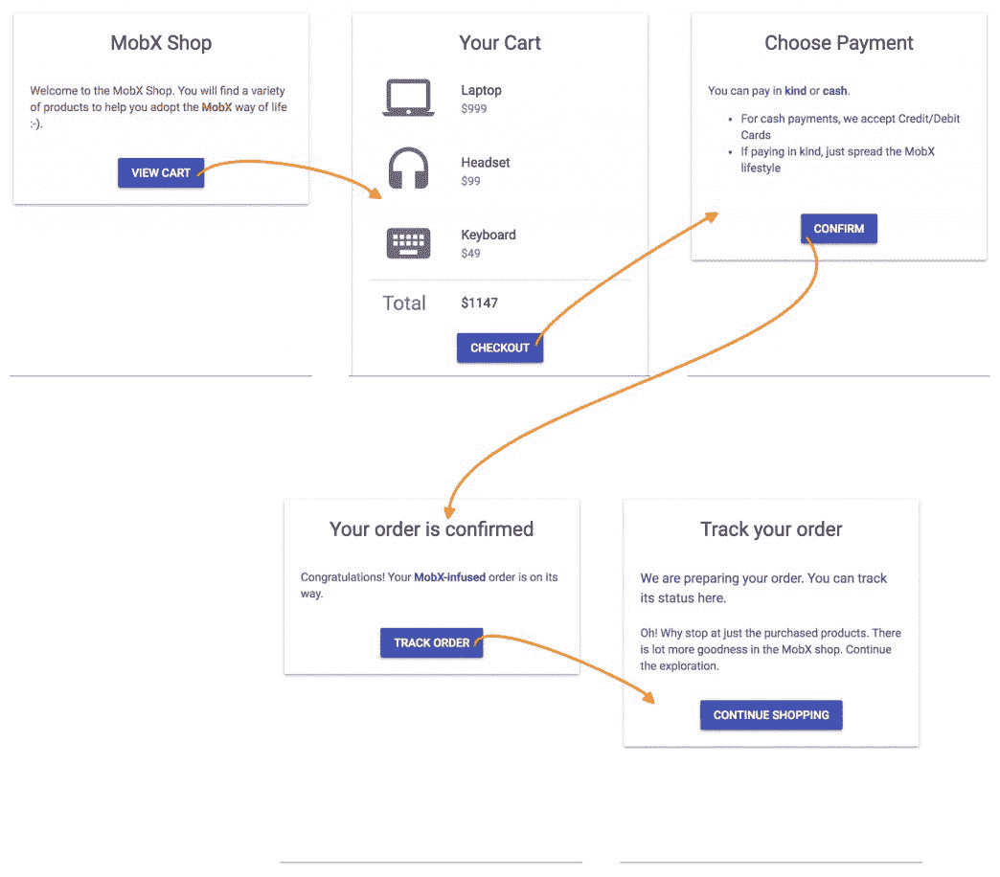
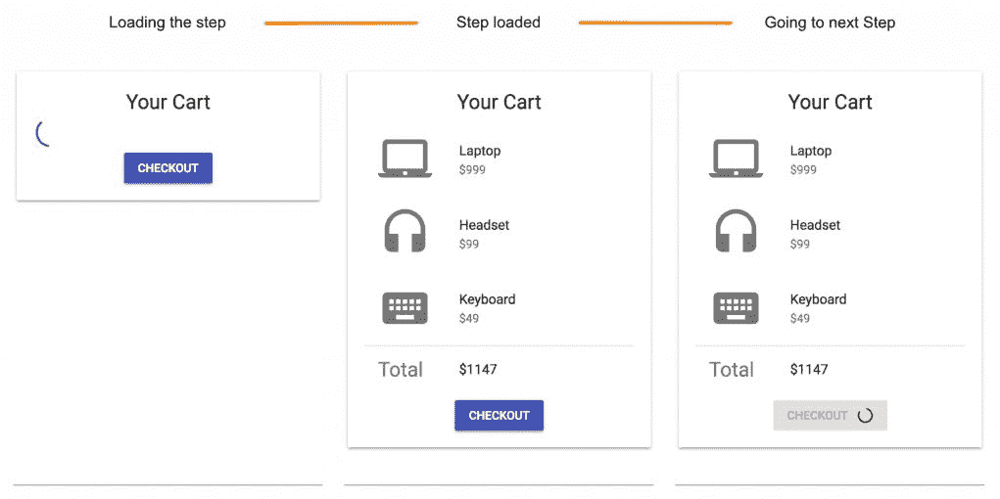
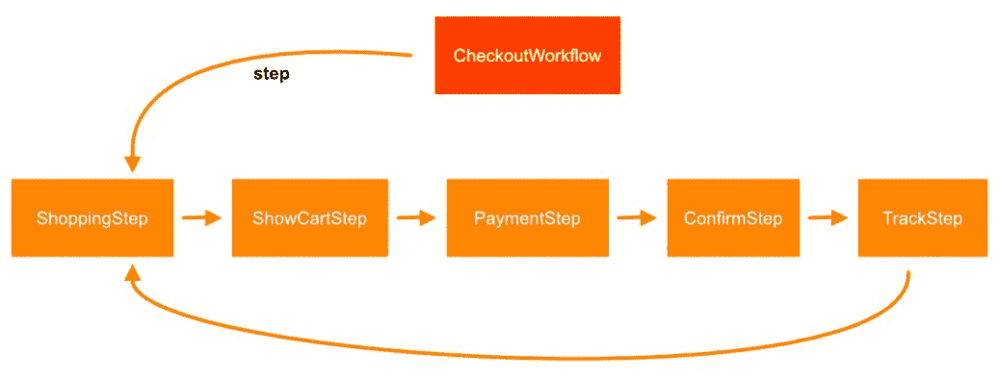
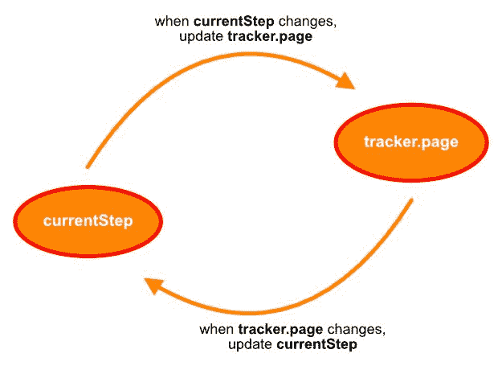
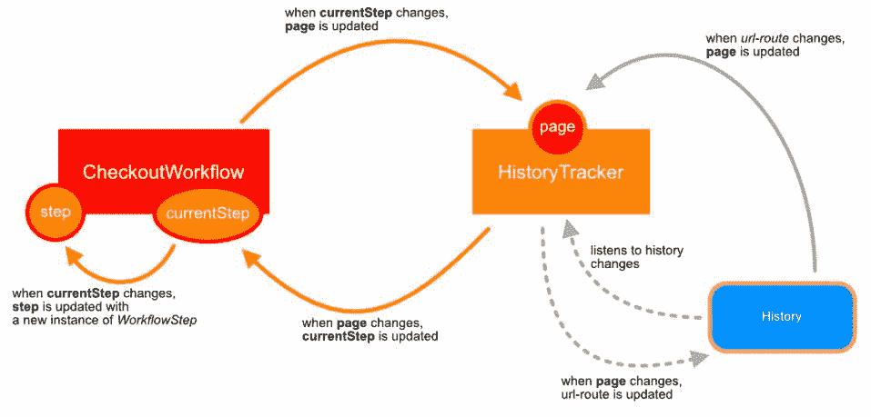

# 第六章：处理真实用例

当您开始使用 MobX 时，应用 MobX 的原则可能会看起来令人生畏。为了帮助您完成这个过程，我们将解决两个非平凡的使用 MobX 三要素*可观察-操作-反应*的示例。我们将涵盖可观察状态的建模，然后确定跟踪可观察对象的操作和反应。一旦您完成这些示例，您应该能够在使用 MobX 处理状态管理时进行心智转变。

本章我们将涵盖以下示例：

+   表单验证

+   页面路由

# 技术要求

您需要具备 JavaScript 编程语言。最后，要使用本书的 Git 存储库，用户需要安装 Git。

本章的代码文件可以在 GitHub 上找到：

[`github.com/PacktPublishing/Mobx-Quick-Start-Guide/tree/master/src/Chapter06`](https://github.com/PacktPublishing/Mobx-Quick-Start-Guide/tree/master/src/Chapter06)

查看以下视频，以查看代码的运行情况：

[`bit.ly/2LDliA9`](http://bit.ly/2LDliA9)

# 表单验证

填写表单和验证字段是 Web 的经典用例。因此，我们从这里开始，并看看 MobX 如何帮助我们简化它。在我们的示例中，我们将考虑一个用户注册表单，其中包含一些标准输入，如名字、姓氏、电子邮件和密码。

注册的各种状态如下图所示：



# 交互

从前面的屏幕截图中，我们可以看到一些标准的交互，例如：

+   输入各种字段的输入

+   对这些字段进行验证

+   单击“注册”按钮执行网络操作

这里还有一些其他交互，不会立即引起注意：

+   基于网络的电子邮件验证，以确保我们不会注册已存在的电子邮件地址

+   显示注册操作的进度指示器

许多这些交互将使用 MobX 中的操作和反应进行建模。状态当然将使用可观察对象进行建模。让我们看看在这个示例中 O*bservables-Actions-Reactions*三要素是如何生动起来的。

# 建模可观察状态

示例的视觉设计已经暗示了我们需要的核心状态。这包括`firstName`、`lastName`、`email`和`password`字段。我们可以将这些字段建模为`UserEnrollmentData`类的*可观察属性*。

此外，我们还需要跟踪将发生在电子邮件上的异步验证。我们使用布尔值`validating`属性来实现这一点。在验证过程中发现的任何错误都将使用`errors`进行跟踪。最后，`enrollmentStatus`跟踪了围绕注册的网络操作。它是一个字符串枚举，可以有四个值之一：`none`、`pending`、`completed`或`failed`。

```jsx
class UserEnrollmentData {
    @observable email = '';
    @observable password = '';
    @observable firstName = '';
    @observable lastName = '';
    @observable validating = false;
    @observable.ref errors = null;
    @observable enrollmentStatus = 'none'; // none | pending | completed | failed
}
```

您会注意到`errors`标记为`@observable.ref`，因为它只需要跟踪引用更改。这是因为验证输出是一个*不透明对象*，除了引用更改之外没有任何可观察的东西。只有当`errors`有一个值时，我们才知道有验证错误。

# 进入操作

这里的操作非常简单。我们需要一个操作来根据用户更改*设置字段值*。另一个是在单击 Enroll 按钮时进行*注册*。这两个可以在以下代码中看到。

作为一般惯例，始终从调用`configure({ enforceActions: 'strict' })`开始。这确保您的可观察对象只在操作内部发生突变，为您提供了我们在第五章中讨论的所有好处，*派生、操作和反应*：

```jsx
import { action, configure, flow } from 'mobx';

**configure({ enforceActions: 'strict' });**

class UserEnrollmentData {
    /* ... */

    @action
  setField(field, value) {
        this[field] = value;
    }

    getFields() {
        const { firstName, lastName, password, email } = this;
        return { firstName, lastName, password, email }
    }

    enroll = flow(function*() {
        this.enrollmentStatus = 'pending';
        try {
            // Validation
            const fields = this.getFields();
 yield this.validateFields(fields);
            if (this.errors) {
                throw new Error('Invalid fields');
            }

            // Enrollment
 yield enrollUser(fields);

            this.enrollmentStatus = 'completed';
        } catch (e) {
            this.enrollmentStatus = 'failed';
        }
    });

}
```

对于`enroll`操作使用`flow()`是故意的。我们在内部处理异步操作，因此在操作完成后发生的突变必须包装在`runInAction()`或`action()`中。手动执行这个操作可能很麻烦，也会给代码增加噪音。

使用`flow()`，您可以通过使用带有`yield`语句的生成器函数来获得清晰的代码，用于`promises`。在前面的代码中，我们有两个`yield`点，一个用于`validateFields()`，另一个用于`enroll()`，两者都返回`promises`。请注意，在这些语句之后我们没有包装代码，这样更容易遵循逻辑。

这里隐含的另一个操作是`validateFields()`。验证实际上是一个副作用，每当字段更改时都会触发，但也可以直接作为一个操作调用。在这里，我们再次使用`flow()`来处理异步验证后的突变：

我们使用`validate.js` ([`validatejs.org`](https://validatejs.org)) NPM 包来处理字段验证。

```jsx
**import Validate from 'validate.js';**

class UserEnrollmentData {

    /* ... */

    validateFields = flow(function*(fields) {
        this.validating = true;
        this.errors = null;

        try {
 yield Validate.async(fields, rules);

            this.errors = null;
        } catch (err) {
            this.errors = err;
        } finally {
            this.validating = false;
        }
    });

    /* ... */
}
```

注意`flow()`如何像常规函数一样接受参数（例如：`fields`）。由于电子邮件的验证涉及异步操作，我们将整个验证作为异步操作进行跟踪。我们使用`validating`属性来实现这一点。当操作完成时，我们在`finally`块中将其设置回`false`。

# 用反应完成三角形

当字段发生变化时，我们需要确保输入的值是有效的。因此，验证是输入各个字段的值的副作用。我们知道 MobX 提供了三种处理这种副作用的方法，它们是`autorun()`、`reaction()`和`when()`。由于验证是应该在每次字段更改时执行的效果，一次性效果的`when()`可以被排除。这让我们只剩下了`reaction()`和`autorun()`。通常，表单只会在字段实际更改时进行验证。这意味着效果只需要在更改后触发。

这将我们的选择缩小到`reaction(<tracking-function>, <effect-function>)`，因为这是唯一一种确保`effect`函数在`tracking`函数返回不同值后触发的反应类型。另一方面，`autorun()`立即执行，这对于执行验证来说太早了。有了这个，我们现在可以在`UserEnrollmentData`类中引入*验证*副作用：

从技术上讲，这也可以通过`autorun()`实现，但需要一个额外的布尔标志来确保第一次不执行验证。任何一种解决方案在这种情况下都可以很好地工作。

```jsx
class UserEnrollmentData {

    disposeValidation = null;

    constructor() {
        this.setupValidation();
    }

    setupValidation() {
        this.disposeValidation = reaction(
            () => {
                const { firstName, lastName, password, email } = this;
                return { firstName, lastName, password, email };
            },
            () => {
 this.validateFields(this.getFields());
            },
        );
    }

    /* ... */

 **cleanup**() {
        this.disposeValidation();
    }
}

```

在前述`reaction()`中的`tracking`函数选择要监视的字段。当它们中的任何一个发生变化时，`tracking`函数会产生一个新值，然后触发验证。我们已经看到了`validateFields()`方法，它也是使用`flow()`的动作。`reaction()`设置在`UserEnrollmentData`的构造函数中，因此监视立即开始。

当调用`this.validateFields()`时，它会返回一个`promise`，可以使用其`cancel()`方法提前取消。如果`validateFields()`被频繁调用，先前调用的方法可能仍在进行中。在这种情况下，我们可以`cancel()`先前返回的 promise 以避免不必要的工作。

我们将把这个有趣的用例留给读者来解决。

我们还跟踪`reaction()`返回的`disposer`函数，我们在`cleanup()`中调用它。这是为了清理和避免潜在的内存泄漏，当不再需要`UserEnrollmentData`时。在反应中始终有一个退出点并调用其*disposer*总是很好的。在我们的情况下，我们从根 React 组件中调用`cleanup()`，在其`componentWillUnmount()`挂钩中。我们将在下一节中看到这一点。

现在，验证不是我们示例的唯一副作用。更宏伟的副作用是 React 组件的 UI。

# React 组件

我们知道的 UI 在 MobX 中是一个副作用，并且通过在 React 组件上使用`observer()`装饰器来识别。这些观察者可以在`render()`方法中读取可观察对象，从而设置跟踪。每当这些可观察对象发生变化时，MobX 将重新渲染组件。这种自动行为与最小的仪式非常强大，使我们能够创建对细粒度可观察状态做出反应的细粒度组件。

在我们的示例中，我们确实有一些细粒度的观察者组件，即输入字段、注册按钮和应用程序组件。它们在以下组件树中用橙色框标记：



每个字段输入都分离成一个观察者组件：**InputField**。电子邮件字段有自己的组件**EmailInputField**，因为它的视觉反馈还涉及在验证期间显示进度条并在检查输入的电子邮件是否已注册时禁用它。同样，**EnrollButton**也有一个旋转器来显示注册操作期间的进度。

我们正在使用**Material-UI**（[`material-ui.com`](https://material-ui.com)）作为组件库。这提供了一组优秀的 React 组件，按照 Google 的 Material Design 指南进行了样式设置。

`InputField`只观察它正在渲染的字段，由`field`属性标识，该属性是从`store`属性（使用`store[field]`）解除引用的。这作为`InputField`的`value`：

```jsx
const InputField = observer(({ store, field, label, type }) => {
    const errors = store.errors && store.errors[field];
    const hasError = !!errors;

    return (
        <TextField
  fullWidth
 type={type}  value={store[field]}  label={label}   error={hasError}  onChange={event => store.setField(field, 
            event.target.value)}  margin={'normal'}   helperText={errors ? errors[0] : null}  />
    );
});
```

用户对此输入进行的编辑（`onChange`事件）将通过`store.setField()`操作通知回存储。`InputField`在 React 术语中是一个*受控组件*。

`InputField`组件的关键思想是传递可观察对象（`store`）而不是值（`store[field]`）。这确保了可观察属性的解引用发生在组件的`render()`内部。这对于一个专门用于渲染和跟踪所需内容的细粒度观察者来说非常重要。在创建 MobX 观察者组件时，您可以将其视为*设计模式*。

# UserEnrollmentForm 组件

我们在`UserEnrollmentForm`组件中使用了几个这些`InputFields`。请注意，`UserEnrollmentForm`组件*不是观察者*。它的目的是通过`inject()`装饰器获取存储并将其传递给一些子*观察者组件*。这里的`inject()`使用了*基于函数的*参数，比`inject('store')`的*基于字符串的*参数更安全。

```jsx
import React from 'react';
import { inject  } from 'mobx-react';
import { Grid, TextField, Typography, } from '@material-ui/core';

@inject(stores => ({ store: stores.store }))
class UserEnrollmentForm extends React.Component {
    render() {
        const { store } = this.props;
        return (
            <form>
                <Grid container direction={'column'}>
                    <CenteredGridItem>
                        <Typography variant={'title'}>Enroll 
                        User</Typography>
                    </CenteredGridItem>

                    <CenteredGridItem>
                        <EmailInputField store={store} />
                    </CenteredGridItem>

                    <CenteredGridItem>
                        <**InputField**
  type={'password'}   field={'password'}   label={'Password'}   store={store}  />
                    </CenteredGridItem>

                    <CenteredGridItem>
                        <**InputField**
  type={'text'}   field={'firstName'}   label={'First Name'}   store={store}  />
                    </CenteredGridItem>

                    <CenteredGridItem>
                        <**InputField**
  type={'text'}   field={'lastName'}   label={'Last Name'}   store={store}  />
                    </CenteredGridItem>

                    <CenteredGridItem>
                        <EnrollButton store={store} />
                    </CenteredGridItem>
                </Grid>
            </form>
        );
    }
}
```

`store`，即`UserEnrollmentData`的一个实例，通过在组件树的根部设置的`Provider`组件传递下来。这是在根组件的`constructor`中创建的。

```jsx
import React from 'react';
import { UserEnrollmentData } from './store';
import { Provider } from 'mobx-react';
import { App } from './components';

export class FormValidationExample extends React.Component {
    constructor(props) {
        super(props);

 this.store = new UserEnrollmentData();
    }

    render() {
        return (
 <Provider store={this.store}>
                <App />
            </Provider>
        );
    }

 componentWillUnmount() {
 this.store.cleanup();
 this.store = null;
 }
}
```

通过`Provider`，任何组件现在都可以`inject()` `store`并访问可观察状态。请注意使用`componentWillUnmount()`钩子来调用`this.store.cleanup()`。这在内部处理了验证反应，如前一部分所述（*“使用反应完成三角形”*）。

# 其他观察者组件

在我们的组件树中还有一些更细粒度的观察者。其中最简单的之一是`App`组件，它提供了一个简单的分支逻辑。如果我们仍在注册过程中，将显示`UserEnrollmentForm`。注册后，`App`将显示`EnrollmentComplete`组件。这里跟踪的可观察对象是`store.enrollmentStatus`：

```jsx
@inject('store')
@observer export class App extends React.Component {
    render() {
        const { store } = this.props;
 return store.enrollmentStatus === 'completed' ? (
 <EnrollmentComplete />
 ) : (
 <UserEnrollmentForm />
 );
    }
}
```

`EmailInputField`相当不言自明，并重用了`InputField`组件。它还包括一个进度条来显示异步验证操作：

```jsx
const EmailInputField = observer(({ store }) => {
    const { validating } = store;

    return (
        <Fragment>
            <InputField
  type={'text'}   store={store}   field={'email'}   label={'Email'}  />
            {validating ? <LinearProgress variant={'query'} /> : null}
        </Fragment>
    );
});
```

最后，最后一个观察者组件是`EnrollButton`，它观察`enrollmentStatus`并在`store`上触发`enroll()`动作。在注册过程中，它还显示圆形旋转器：

```jsx
const EnrollButton = observer(({ store }) => {
 const isEnrolling = store.enrollmentStatus === 'pending';
 const failed = store.enrollmentStatus === 'failed';

    return (
        <Fragment>
            <Button
  variant={'raised'}   color={'primary'}   style={{ marginTop: 20 }}   disabled={isEnrolling}   onClick={() => store.enroll()}  >
                Enroll
                {isEnrolling ? (
                    <CircularProgress
  style={{
                            color: 'white',
                            marginLeft: 10,
                        }}   size={20}   variant={'indeterminate'}  />
                ) : null}
            </Button>
            {failed ? (
                <Typography color={'secondary'}  variant={'subheading'}>
                    Failed to enroll
                </Typography>
            ) : null}{' '}
        </Fragment>
    );
});
```

这些细粒度观察者的集合通过加速 React 的协调过程来提高 UI 的效率。由于更改局限于特定组件，React 只需协调该特定观察者组件的虚拟 DOM 更改。MobX 鼓励在组件树中使用这样的细粒度观察者并将它们分散其中。

如果您正在寻找一个专门用于使用 MobX 进行表单验证的库，请查看*mobx-react-form*（[`github.com/foxhound87/mobx-react-form`](https://github.com/foxhound87/mobx-react-form)）。

# 页面路由

**单页应用程序**（**SPA**）已经成为我们今天看到的许多 Web 应用程序中的常见现象。这些应用程序的特点是在单个页面内使用逻辑的客户端路由。您可以通过修改 URL 而无需完整加载页面来导航到应用程序的各个部分（*路由*）。这是由诸如`react-router-dom`之类的库处理的，它与浏览器历史记录一起工作，以实现*URL*驱动的路由更改。

在 MobX 世界中，路由更改或导航可以被视为*副作用*。可观察对象发生了一些状态变化，导致 SPA 中的导航发生。在这个例子中，我们将构建这个可观察状态，它跟踪浏览器中显示的当前页面。使用`react-router-dom`和`history`包的组合，我们将展示如何路由成为可观察状态变化的副作用。

# 购物车结账工作流

让我们看一个用例，我们可以看到路由更改（导航）作为 MobX 驱动的副作用。我们将使用典型的购物车结账工作流作为示例。如下截图所示，我们从*主页路由*开始，这是工作流的入口点。从那里，我们经历剩下的步骤：*查看购物车*，*选择付款选项*，*查看确认*，然后*跟踪订单*：



我们故意保持各个步骤在视觉上简单。这样我们可以更多地关注导航方面，而不是每个步骤内部发生的细节。然而，工作流的这些步骤中有一些*共同的元素*。

如下截图所示，每个步骤都有一个加载操作，用于获取该步骤的详细信息。加载完成后，您可以单击按钮转到下一步。在导航发生之前，会执行一个异步操作。完成后，我们将导航到工作流程的下一步。由于每个步骤都遵循这个模板，我们将在下一节中对其进行建模：



# 建模可观察状态

这个 SPA 的本质是逐步进行结账工作流程，其中每个步骤都是一个路由。由于路由由 URL 驱动，我们需要一种监视 URL 并在步骤之间移动时有能力更改它的方法。步骤之间的导航是可观察状态的某种变化的副作用。我们将使用包含核心可观察状态的`CheckoutWorkflow`类来对这个工作流程进行建模：

```jsx
const routes = {
    shopping: '/',
    cart: '/cart',
    payment: '/payment',
    confirm: '/confirm',
    track: '/track',
};

export class CheckoutWorkflow {
    static steps = [
        { name: 'shopping', stepClass: ShoppingStep },
        { name: 'cart', stepClass: ShowCartStep },
        { name: 'payment', stepClass: PaymentStep },
        { name: 'confirm', stepClass: ConfirmStep },
        { name: 'track', stepClass: TrackStep },
    ];

 tracker = new HistoryTracker();
    nextStepPromise = null;

 @observable currentStep = null;
 @observable.ref step = null;

}
```

如前面的代码所示，我们用`name`和`stepClass`表示每个步骤。`name`也是我们用来识别该步骤对应路由的方式，存储在单例`routes`对象中。`steps`的有序列表存储为`CheckoutWorkflow`类的静态属性。我们也可以从单独的 JavaScript 文件（模块）中加载这些步骤，但为简单起见，我们将其保留在这里。

核心的可观察状态在这里非常简单：一个存储当前步骤的字符串名称的`currentStep`属性和一个`step`属性，作为`observable.ref`属性存储的`stepClass`的实例。当我们在步骤之间导航时，这两个属性会发生变化以反映当前步骤。我们将看到这些属性在处理路由更改时的使用方式。

# 一条路线对应一步，一步对应一条路线

你可能会想为什么我们需要两个单独的属性来跟踪当前步骤。是的，这似乎多余，但有原因。由于我们的工作流将是一组 url 路由，路由的变化也可以通过浏览器的返回按钮或直接输入 URL 来发生。将路由与步骤相关联的一种方法是使用其*名称*，这正是我们在`currentStep`属性中所做的。请注意，步骤的`name`与`routes`对象的键完全匹配。

当路由在外部发生变化时，我们依赖浏览器历史记录来通知我们 URL 的变化。`tracker`属性是`HistoryTracker`的一个实例（我们将创建一个自定义类），其中包含监听*浏览器历史记录*并跟踪浏览器中当前 URL 的逻辑。它公开了一个被`CheckoutWorkflow`跟踪的 observable 属性。我们稍后将在本章中查看它的实现：



`CheckoutWorkflow`中的每个步骤都是`WorkflowStep`类的子类型。`WorkflowStep`捕获了步骤及其异步操作的详细信息。工作流简单地编排步骤的流程，并在每个步骤的异步操作完成后在它们之间进行转换：

```jsx
class ShowCartStep extends WorkflowStep { /* ... */}

// A mock step to simplify the representation of other steps
class MockWorkflowStep extends WorkflowStep { /* ... */ }

class PaymentStep extends MockWorkflowStep { /* ... */ }
class ConfirmStep extends MockWorkflowStep { /* ... */ }
class TrackStep extends MockWorkflowStep { /* ... */ }
```

对于大多数步骤，我们正在扩展`MockWorkflowStep`，它使用一些内置的默认值来创建一个模板`WorkflowStep`。这使得步骤非常简单，因此我们可以专注于步骤之间的路由。请注意下面的代码片段，我们只是模拟了`load`和`main`操作的网络延迟。`delay()`函数只是一个简单的帮助函数，返回一个在给定毫秒间隔后解析的`Promise`。

我们将在下一节中看到`getLoadOperation()`和`getMainOperation()`方法是如何使用的：

```jsx
class MockWorkflowStep extends WorkflowStep {
    getLoadOperation() {
        return delay(1000);
    }

    getMainOperation() {
        return delay(1000);
    }
}

function delay(ms) {
    return new Promise(resolve => setTimeout(resolve, ms));
}
```

# WorkflowStep

`WorkflowStep`充当了工作流中所有步骤的模板。它包含一些 observable 状态，用于跟踪它执行的两个异步操作：*加载详情*和*执行主要工作*。

```jsx
class WorkflowStep {
    workflow = null; // the parent workflow
 @observable loadState = 'none'; // pending | completed | failed
  @observable operationState = 'none'; // pending | completed | 
     failed    async getLoadOperation() {}
    async getMainOperation() {}

    @action.bound
 async load() {
        doAsync(
            () => this.getLoadOperation(),
            state => (this.loadState = state),
        );
    }

    @action.bound
 async perform() {
        doAsync(
            () => this.getMainOperation(),
            state => (this.operationState = state),
        );
    }
}
```

`load()`和`perform()`是`WorkflowStep`执行的两个异步操作。它们的状态分别通过`loadState`和`operationState` observables 进行跟踪。这两个操作中的每一个都调用一个委托方法，子类重写该方法以提供实际的 promise。`load()`调用`getLoadOperation()`，`perform()`调用`getMainOperation()`，每个方法都会产生一个 promise。

`doAsync()`是一个帮助函数，它接受一个*promise 函数*并使用传入的回调(`setState`)通知状态。请注意这里使用`runInAction()`来确保所有变化发生在一个 action 内部。

`load()`和`perform()`使用`doAsync()`函数适当地更新`loadState`和`operationState` observables：

有一种不同的编写`doAsync()`函数的方法。**提示**：我们在早期的章节中已经看到过。我们将把这留给读者作为一个练习。

```jsx
async function doAsync(getPromise, setState) {
 setState('pending');
    try {
        await getPromise();
        runInAction(() => {
 setState('completed');
        });
    } catch (e) {
        runInAction(() => {
 setState('failed');
        });
    }
}
```

现在我们可以看到可观察状态由`CheckoutWorkflow`和`WorkflowStep`实例承载。可能不清楚的一点是`CheckoutWorkflow`如何执行协调。为此，我们必须看一下动作和反应。

# 工作流的动作和反应

我们已经看到`WorkflowStep`有两个***action***方法，`load()`和`perform()`，处理步骤的异步操作：

```jsx
class WorkflowStep {
    workflow = null;
    @observable loadState = 'none'; // pending | completed | failed
  @observable operationState = 'none'; // pending | completed | 
     failed    async getLoadOperation() {}
    async getMainOperation() {}

    @action.bound
 async load() {
        doAsync(
            () => this.getLoadOperation(),
            state => (this.loadState = state),
        );
    }

    @action.bound
 async perform() {
        doAsync(
            () => this.getMainOperation(),
            state => (this.operationState = state),
        );
    }
}
```

`load()`操作由`CheckoutWorkflow`调用，因为它加载工作流的每个步骤。`perform()`是用户调用的操作，当用户点击暴露在 React 组件上的按钮时发生。一旦`perform()`完成，`operationState`将变为`completed`。`CheckoutWorkflow`跟踪这一点，并自动加载序列中的下一个步骤。换句话说，工作流作为对当前步骤的`operationState`变化的反应（或副作用）而进展。让我们在以下一组代码片段中看到所有这些：

```jsx
export class CheckoutWorkflow {
    /* ... */

    tracker = new HistoryTracker();
    nextStepPromise = null;

    @observable currentStep = null;
    @observable.ref step = null;

    constructor() {
        this.tracker.startListening(routes);

 this.currentStep = this.tracker.page;

 autorun(() => {
            const currentStep = this.currentStep;

            const stepIndex = CheckoutWorkflow.steps.findIndex(
                x => x.name === currentStep,
            );

            if (stepIndex !== -1) {
                this.loadStep(stepIndex);

                this.tracker.page = CheckoutWorkflow.steps[stepIndex].name;
            }
        });

 reaction(
            () => this.tracker.page,
            page => {
                this.currentStep = page;
            },
        );
    }

    @action
  async loadStep(stepIndex) {
        /* ... */
    }
}
```

`CheckoutWorkflow`的构造函数设置了核心副作用。我们需要知道的第一件事是浏览器使用`this.tracker.page`提供的当前页面。请记住，我们正在将工作流的`currentStep`与使用共享名称的基于 URL 的路由相关联。

第一个副作用使用`autorun()`执行，我们知道它立即运行，然后在跟踪的可观察对象发生变化时运行。在`autorun()`内部，我们首先确保加载`currentStep`是有效的步骤。由于我们在`autorun()`内部观察`currentStep`，我们必须确保我们保持`this.tracker.page`同步。成功加载当前步骤后，我们这样做。现在，每当`currentStep`发生变化时，`tracker.page`会自动同步，这意味着 URL 和路由会更新以反映当前步骤。稍后我们将看到，`tracker`，即`HistoryTracker`的实例，实际上是如何在内部处理这一点的。

下一个副作用是对`tracker.page`的变化的`reaction()`。这是对先前副作用的对应部分。每当`tracker.page`发生变化时，我们也必须改变`currentStep`。毕竟，这两个可观察对象必须协同工作。因为我们已经通过一个单独的副作用（`autorun()`）来跟踪`currentStep`，当前的`step`加载了`WorkflowStep`的实例。

这里引人注目的一点是，当`currentStep`改变时，`tracker.page`会更新。同样，当`tracker.page`改变时，`currentStep`也会更新。因此，可能会出现一个无限循环：



然而，MobX 会发现一旦变化在一个方向上传播，另一方向就不会发生更新，因为两者是同步的。这意味着这两个相互依赖的值很快就会达到稳定状态，不会出现无限循环。

# 加载步骤

`WorkflowStep`是步骤变得活跃的地方，唯一能创建实例的是`CheckoutWorkflow`。毕竟，它是整个工作流的所有者。它在`loadStep()`动作方法中执行此操作：

```jsx
export class CheckoutWorkflow {
    /* ... */

    @action
  async loadStep(stepIndex) {
        if (this.nextStepPromise) {
            this.nextStepPromise.cancel();
        }

        const StepClass = CheckoutWorkflow.steps[stepIndex].stepClass;
        this.step = new StepClass();
        this.step.workflow = this;
        this.step.load();
        this.nextStepPromise = when(
            () => this.step.operationState === 'completed',
        );

        await this.nextStepPromise;

        const nextStepIndex = stepIndex + 1;
        if (nextStepIndex >= CheckoutWorkflow.steps.length) {
            return;
        }

        this.currentStep = CheckoutWorkflow.steps[nextStepIndex].name;
    }
}
```

上述代码的有趣部分概述如下：

+   我们通过从步骤列表中检索当前步骤索引的`stepClass`来获得当前步骤索引的`stepClass`。我们创建了这个`stepClass`的实例，并将其分配给可观察的`step`属性。

+   然后触发`WorkflowStep`的`load()`。

+   可能最有趣的部分是等待`step`的`operationState`改变。我们从前面知道，`operationState`跟踪步骤的主要异步操作的状态。一旦它变为`completed`，我们就知道是时候转到下一步了。

+   注意使用带有 promise 的`when()`。这为我们提供了一个很好的方法来标记需要在`when()`解析后执行的代码。还要注意，我们在`nextStepPromise`属性中跟踪 promise。这是为了确保在当前步骤完成之前，我们也要`cancel`掉 promise。值得思考这种情况可能会出现的时候。**提示**：步骤的流程并不总是线性的。步骤也可以通过*路由更改*来更改，比如通过单击浏览器的返回按钮！

# 历史跟踪器

*observable state puzzle*的最后一部分是`HistoryTracker`，这是一个专门用于监视浏览器 URL 和历史记录的类。它依赖于`history` NPM 包（[`github.com/ReactTraining/history`](https://github.com/ReactTraining/history)）来完成大部分工作。*history*包还为我们的 React 组件提供动力，我们将使用`react-router-dom`库。

`HistoryTracker`的核心责任是公开一个名为`page`的 observable，用于跟踪浏览器中的当前 URL（路由）。它还会反向操作，使 URL 与当前`page`保持同步：

```jsx
import createHashHistory from 'history/createHashHistory';
import { observable, action, reaction } from 'mobx';

export class HistoryTracker {
    unsubscribe = null;
    history = createHashHistory();

    @observable page = null;

    constructor() {
        reaction(
            () => this.page,
            page => {
                const route = this.routes[page];
                if (route) {
                    this.history.push(route);
                }
            },
        );
    }

    /* ... */
}
```

在构造函数中设置了`reaction()`，路由更改（URL 更改）实际上是`page` observable 变化的副作用。这是通过将路由（URL）推送到浏览器历史记录中实现的。

`HistoryTracker`的另一个重要方面，正如其名称所示，是跟踪浏览器历史记录。这是通过`startListening()`方法完成的，可以由此类的消费者调用。`CheckoutWorkflow`在其构造函数中调用此方法来设置跟踪器。请注意，`startListening()`接收一个路由映射，其中`key`指向 URL 路径：

```jsx
export class HistoryTracker {
    unsubscribe = null;
    history = createHashHistory();

    @observable page = null;

    startListening(routes) {
        this.routes = routes;
        this.unsubscribe = this.history.listen(location => {
            this.identifyRoute(location);
        });

        this.identifyRoute(this.history.location);
    }

    stopListening() {
        this.unsubscribe && this.unsubscribe();
    }

    @action
  setPage(key) {
        if (!this.routes[key]) {
            throw new Error(`Invalid Page: ${key}`);
        }

        this.page = key;
    }

    @action
  identifyRoute(location) {
        const { pathname } = location;
        const routes = this.routes;

        this.page = Object.keys(routes).find(key => {
            const path = routes[key];
            return path.startsWith(pathname);
        });
    }
}
```

当浏览器中的 URL 更改时，`page` observable 会相应地更新。这发生在`identifyRoute()`方法中，该方法从`history.listen()`的回调中调用。我们已经用 action 修饰它，因为它会*改变*`page` observable。在内部，MobX 会通知所有`page`的观察者，例如`CheckoutWorkflow`，它使用`page` observable 来更新其`currentStep`。这保持了整个路由同步，并确保更改是双向的。

以下图表显示了`currentStep`、`page`和*url-route*之间的双向同步。请注意，与`history`包的交互显示为*灰色*箭头，而 observable 之间的依赖关系显示为橙色箭头。这种颜色上的差异是有意的，并表明*基于 url 的路由*实际上是 observable 状态变化的副作用：



# React 组件

在这个例子中，observable 状态的建模比 React UI 组件更有趣。在 React 方面，我们有设置`Provider`的顶层组件，其中`store`是`CheckoutWorkflow`的实例。`Provider`来自`mobx-react`包，并帮助将`store`注入到任何使用`inject()`装饰的 React 组件中：

```jsx
import React from 'react';
import ReactDOM from 'react-dom';
import { Provider } from 'mobx-react';
import { CheckoutWorkflow } from './CheckoutWorkflow';

const workflow = new CheckoutWorkflow();

export function PageRoutingExample() {
    return (
        <Provider store={workflow}>
            <App />
        </Provider>
    );
}
```

`App`组件只是使用`react-router-dom`包设置所有路由。在`<Route />`组件中使用的路径与我们在`routes`对象中看到的 URL 匹配。请注意，`HistoryTracker`中的`history`用于`Router`。这允许在*react-router*和*mobx*之间共享浏览器历史记录：

```jsx
import React from 'react';
import ReactDOM from 'react-dom';
import { Route, Router, Switch } from 'react-router-dom';
import { CheckoutWorkflow } from './CheckoutWorkflow';
import { Paper } from '@material-ui/core/es/index';
import { ShowCart } from './show-cart';
import {
    ConfirmDescription,
    PaymentDescription,
    ShoppingDescription,
    TemplateStepComponent,
    TrackOrderDescription,
} from './shared';

const workflow = new CheckoutWorkflow();

class App extends React.Component {
    render() {
        return (
            <Paper elevation={2}  style={{ padding: 20 }}>
                <Router history={workflow.tracker.history}>
                    <Switch>
                        <**Route**
  exact
 path={'/'}   component={() => (
                                <TemplateStepComponent
  title={'MobX Shop'}   renderDescription=
                                   {ShoppingDescription}   operationTitle={'View Cart'}  />
                            )}  />
                        <Route exact path={'/cart'}  component=
                            {ShowCart} />
                        <**Route**
  exact
 path={'/payment'}   component={() => (
                                <TemplateStepComponent
  title={'Choose Payment'}   renderDescription=
                                    {PaymentDescription}   operationTitle={'Confirm'}  />
                            )}  />
                        <**Route**
  exact
 path={'/confirm'}   component={() => (
                                <TemplateStepComponent
  title={'Your order is confirmed'}   operationTitle={'Track Order'}   renderDescription=
                                     {ConfirmDescription}  />
                            )}  />
                        <**Route**
  exact
 path={'/track'}   component={() => (
                                <TemplateStepComponent
  title={'Track your order'}   operationTitle={'Continue 
                                      Shopping'}   renderDescription=
                                     {TrackOrderDescription}  />
                            )}  />
                    </Switch>
                </Router>
            </Paper>
        );
    }
}
```

如前所述，我们故意保持了工作流程的各个步骤非常简单。它们都遵循固定的模板，由`WorkflowStep`描述。它的 React 对应物是`TemplateStepComponent`，它呈现步骤并公开按钮，用于导航到下一步。

# TemplateStepComponent

`TemplateStepComponent`为`WorkflowStep`提供了可视化表示。当步骤正在加载时，它会呈现反馈，当主要操作正在执行时也是如此。此外，它会在加载后显示步骤的详细信息。这些细节通过`renderDetails`属性显示，该属性接受一个 React 组件：

```jsx
@inject('store')
export class TemplateStepComponent extends React.Component {
    static defaultProps = {
        title: 'Step Title',
        operationTitle: 'Operation',
        renderDetails: step => 'Some Description', // A render-prop to render details of a step
    };

    render() {
        const { title, operationTitle, renderDetails } = this.props;

        return (
            <Fragment>
                <Typography
  variant={'headline'}   style={{ textAlign: 'center' }}  >
                    {title}
                </Typography>

 <Observer>
 {() => {
 const { step } = this.props.store;

 return (
 <OperationStatus
  state={step.loadState}   render={() => (
 <div style={{ padding: '2rem 0' }}>
 {renderDetails(step)}
 </div>
 )}  />
 );
 }}
 </Observer>

                <Grid justify={'center'}  container>
 <Observer>
                        {() => {
                            const { step } = this.props.store;

                            return (
                                <Button
  variant={'raised'}   color={'primary'}   disabled={step.operationState === 
 'pending'}   onClick={step.perform}>
                                    {operationTitle}
                                    {step.operationState === 'pending'                           
                                         ? (
                                        <CircularProgress
  variant={'indeterminate'}   size={20}   style={{
                                                color: 'black',
                                                marginLeft: 10,
                                            }}  />
                                    ) : null}
                                </Button>
                            );
                        }}
 </Observer>
                </Grid>
            </Fragment>
        );
    }
}
```

`Observer`组件是我们以前没有见过的东西。这是由`mobx-react`包提供的一个特殊组件，简化了粒度观察者的创建。典型的 MobX 观察者组件将要求您创建一个单独的组件，用`observer()`和/或`inject()`装饰它，并确保适当的可观察对象作为 props 传递到该组件中。您可以通过简单地用`<Observer />`包装*虚拟 DOM*的一部分来绕过所有这些仪式。

它接受一个函数作为它唯一的子元素，在其中您可以从周围范围读取可观察对象。MobX 将自动跟踪*函数作为子组件*中使用的可观察对象。仔细观察`Observer`会揭示这些细节：

```jsx
<Observer>
    {() => {
 const { step } = this.props.store;

        return (
            <OperationStatus
  state={step.loadState}   render={() => (
                    <div style={{ padding: '2rem 0' }}>
                        {renderDetails(step)}
                    </div>
                )}  />
        );
    }}
</Observer>
```

在上面的片段中，我们将一个函数作为`<Observer />`的子元素传递。在该函数中，我们使用`step.loadState`可观察对象。当`step.loadState`发生变化时，MobX 会自动呈现*函数作为子组件*。请注意，我们没有将任何 props 传递给`Observer`或子组件。它直接从外部组件的 props 中读取。这是使用`Observer`的优势。您可以轻松创建匿名观察者。

一个微妙的要点是`TemplateStepComponent`本身不是一个观察者。它只是用`inject()`获取`store`，然后在`<Observer />`区域内使用它。

# ShowCart 组件

`ShowCart`是显示购物车中物品列表的组件。在这里，我们正在重用`TemplateStepComponent`和购物车的插件细节，使用`renderDetails`属性。这可以在以下代码中看到。为简单起见，我们不显示`CartItem`和`TotalItem`组件。它们是纯粹的呈现组件，用于呈现单个购物车项目：

```jsx
import React from 'react';
import {
    List,
    ListItem,
    ListItemIcon,
    ListItemText,
    Typography,
} from '@material-ui/core';
import { Divider } from '@material-ui/core/es/index';
import { TemplateStepComponent } from './shared';

export class ShowCart extends React.Component {
    render() {
        return (
            <**TemplateStepComponent**
  title={'Your Cart'}   operationTitle={'Checkout'}  renderDetails={step => {
 const { items, itemTotal } = step;

 return (
 <List>
 {items.map(item => (
 <CartItem key={item.title}  item={item} />
 ))}

 <Divider />

 <TotalItem total={itemTotal} />
 </List>
 );
 }} />
        );
    }
}

function CartItem({ item }) {
    return (
        /* ... */
    );
}

function TotalItem({ total }) {
    return (
        /* ... */
    );
}
```

# 基于状态的路由器

现在您可以看到，所有`WorkflowStep`实例之间的路由纯粹是通过基于状态的方法实现的。所有导航逻辑都在 MobX 存储中，这种情况下是`CheckoutWorkflow`。通过连接可观察对象（`tracker.page`，`currentStep`和`step`）通过一系列反应，我们创建了更新浏览器历史的*副作用*，并创建了`WorkflowStep`的实例，这些实例由`TemplateStepComponent`使用。

由于我们在`react-router-dom`和 MobX 之间共享浏览器历史（通过`HistoryTracker`），我们可以使可观察对象与 URL 更改保持同步。

这种基于状态的路由方法有助于保持清晰的工作流心智模型。您的功能的所有逻辑都留在 MobX Store 中，提高了可读性。为这种基于状态的解决方案编写单元测试也很简单。事实上，在 MobX 应用程序中，大多数单元测试都围绕存储和反应中心。许多 React 组件成为可观察对象的纯粹观察者，并且可以被视为普通的演示组件。

使用 MobX，您可以专注于领域逻辑，并确保 UI 上有适当的可观察状态。通过将所有领域逻辑和状态封装在存储中，并将所有演示内容放在 React 组件中，可以清晰地分离关注点。这极大地改善了开发者体验（DX），并有助于随着时间的推移更好地扩展。这是 MobX 的真正承诺。

要了解更丰富功能的基于状态的路由解决方案，请查看`mobx-state-router`（[`github.com/nareshbhatia/mobx-state-router`](https://github.com/nareshbhatia/mobx-state-router)）。

# 摘要

在本章中，我们应用了我们在过去几章中学到的各种技术和概念。两个示例，表单验证和页面路由，分别提出了一套建模可观察状态的独特方法。我们还看到了如何创建细粒度的观察者组件，以实现 React 组件的高效渲染。

MobX 的实际应用始终以建模*可观察状态*为起点。毕竟，这就是驱动 UI 的数据。下一步是确定改变可观察状态的*动作*。最后，您需要调用*副作用*，并查看这些效果依赖于哪些可观察状态。这就是应用于现实场景的副作用模型，以 MobX 三元组的形式呈现：*可观察状态-动作-反应*。

根据我们迄今积累的所有知识，我们现在准备深入了解 MobX，从第七章开始，*特殊情况的特殊 API*。
