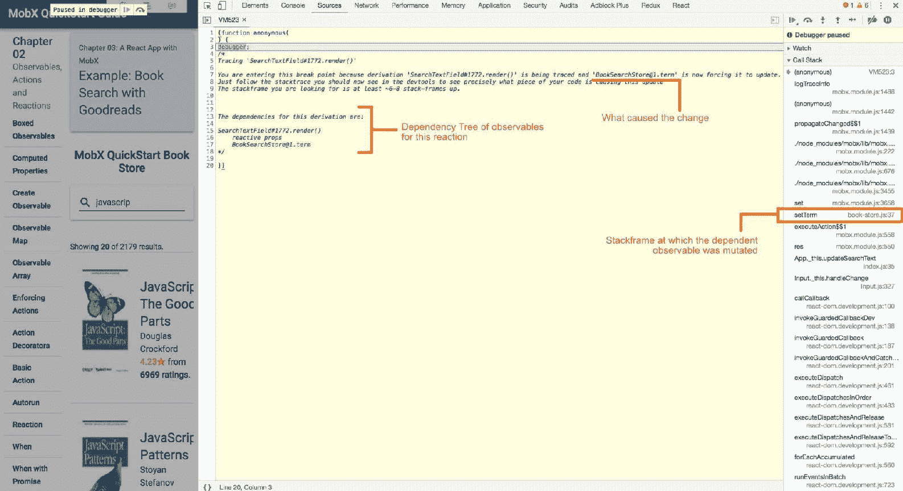

# 第七章：特殊情况的特殊 API

MobX 的 API 表面非常简洁，为处理状态管理逻辑提供了正确的抽象。在大多数情况下，我们已经看到的 API 将足够。然而，总会有一些棘手的边缘情况需要略微偏离常规。正是为了这些特殊情况，MobX 为您提供了一些特殊的 API。我们将在本章中看到其中一些。

本章我们将涵盖以下主题：

+   使用对象 API 进行直接操作

+   使用`inject()`和`observe()`来连接到内部 MobX 事件系统。

+   将有助于调试的特殊实用函数和工具

+   快速提及一些杂项 API

# 技术要求

您需要具备 JavaScript 编程语言。最后，要使用本书的 Git 存储库，用户需要安装 Git。

本章的代码文件可以在 GitHub 上找到：

[`github.com/PacktPublishing/Mobx-Quick-Start-Guide/tree/master/src/Chapter07`](https://github.com/PacktPublishing/Mobx-Quick-Start-Guide/tree/master/src/Chapter07)

查看以下视频，以查看代码的运行情况：

[`bit.ly/2A1Or6V`](http://bit.ly/2A1Or6V)

# 使用对象 API 进行直接操作

在决定可观察状态的数据结构时，您的自然选择应该是使用`observable.object()`、`observable.array()`、`observable.map()`、`observable.box()`，或者使用方便的`observable()`API。操作这些数据结构就像直接改变属性或根据需要添加和删除元素一样简单。

MobX 为您提供了另一种对数据结构进行手术式更改的方法。它公开了一个细粒度的对象 API，可以在运行时改变这些数据结构。事实上，它为您提供了一些原始数据结构甚至不可能的功能。例如，向可观察对象添加新属性，并保持其响应性。

# 细粒度读取和写入

对象 API 专注于对顶层数据结构（对象、数组和映射）的可观察属性进行细粒度控制。通过这样做，它们继续与 MobX 的响应式系统良好地配合，并确保您所做的细粒度更改被*reactions*捕获。以下 API 适用于可观察的对象/数组/映射：

+   `get(thing, key)`: 检索键下的值。这个键甚至可以不存在。当在反应中使用时，当该键变为可用时，它将触发重新执行。

+   `set(thing, key, value)` 或 `set(thing, { key: value })`: 为键设置一个值。第二种形式更适合一次设置多个*键-值*对。在概念上，它与`Object.assign()`非常相似，但增加了响应性。

+   `has(thing, key)`: 返回一个布尔值，指示键是否存在。

+   `remove(thing, key)`: 删除给定的键及其值。

+   `values(thing)`: 给出一个值数组。

+   `keys(thing)`: 返回包含所有键的数组。请注意，这仅适用于可观察对象和映射。

+   `entries(thing)`: 返回一个键值对数组，其中每对是两个元素的数组（`[key, value]`）。

以下代码片段练习了所有这些 API：

```jsx
import {
    autorun,
    observable,
 set,
 get,
 has,
    toJS,
    runInAction,
 remove,
 values,
 entries,
 keys,
} from 'mobx';

class Todo {
    @observable description = '';
    @observable done = false;

    constructor(description) {
        this.description = description;
    }
}

const firstTodo = new Todo('Write Chapter');
const todos = observable.array([firstTodo]);
const todosMap = observable.map({
    'Write Chapter': firstTodo,
});

// Reactions to track changes autorun(() => {
 console.log(`metadata present: ${has(firstTodo, 'metadata')}`);
 console.log(get(firstTodo, 'metadata'), get(firstTodo, 'user'));
 console.log(keys(firstTodo));
});
autorun(() => {
    // Arrays
 const secondTodo = get(todos, 1);
 console.log('Second Todo:', toJS(secondTodo));
 console.log(values(todos), entries(todos));
});

// Granular changes runInAction(() => {
 set(firstTodo, 'metadata', 'new Metadata');
 set(firstTodo, { metadata: 'meta update', user: 'Pavan Podila' });
 set(todos, 1, new Todo('Get it reviewed'));
});

runInAction(() => {
 remove(firstTodo, 'metadata');
 remove(todos, 1);
});
```

通过使用这些 API，您可以针对可观察对象的特定属性并根据需要进行更新。使用对象 API 读取和写入*不存在*的键被认为是有效的。请注意，我们在`autorun()`中读取`firstTodo`的`metadata`属性，这在调用时并不存在。然而，由于使用了`get()`API，MobX 仍然跟踪这个键。当我们在操作中稍后`set()`了`metadata`时，`autorun()`会重新触发以在控制台上打印出它。

这可以在以下控制台输出中看到。请注意，当移除时，`metadata`检查从`false`变为`true`，然后再变回`false`： 

```jsx
metadata present: false undefined undefined (2) ["description", "done"] Second Todo: undefined  [Todo] [Array(2)]    metadata present: true meta update Pavan Podila (4) ["description", "done", "metadata", "user"] Second Todo: {description: "Get it reviewed", done: false}  (2) [Todo, Todo] (2) [Array(2), Array(2)]    metadata present: false undefined "Pavan Podila" (3) ["description", "done", "user"] Second Todo: undefined  [Todo] [Array(2)] 
```

# 从 MobX 到 JavaScript

所有的可观察类型都是由 MobX 创建的特殊类，它们不仅存储数据，还有一堆用来跟踪变化的杂事。我们将在后面的章节中探讨这些杂事，但就我们现在的讨论而言，这些 MobX 类型并不总是与其他第三方 API 兼容，特别是在使用 MobX 4 时。

当与外部库进行接口时，您可能需要发送原始的 JavaScript 值，而不是 MobX 类型的值。这就是您需要`toJS()`函数的地方。它将 MobX 可观察对象转换为原始的 JavaScript 值：

`toJS(source, options?)`

`source`: 任何可观察的盒子、对象、数组、映射或基元。

`options`: 一个可选参数，用于控制行为，例如：

+   `exportMapsAsObject` (*boolean*): 是否将可观察的映射序列化为对象（当为`true`时）或 JavaScript 映射（当为`false`时）。默认为`true`。

+   `detectCycles` (*boolean*): 默认设置为`true`。它在序列化过程中检测循环引用，并重用已经序列化的对象。在大多数情况下，这是一个很好的默认设置，但出于性能原因，当你确定没有循环引用时，可以将其设置为`false`。

`toJS()`的一个重要注意点是它不会序列化*computed properties*。这是有道理的，因为它纯粹是可以随时重新计算的派生信息。`toJS()`的目的是仅序列化核心 observable 状态。同样，observable 的任何不可枚举属性都不会被序列化，也不会递归到任何非 observable 的数据结构中。

在下面的例子中，你可以看到`toJS()` API 是如何应用于 observables 的：

```jsx
const number = observable.box(10);
const cart = observable({
    items: [{ title: 'milk', quantity: 2 }, { title: 'eggs', quantity: 3 }],
});

console.log(toJS(number));

console.log('MobX type:', cart);
console.log('JS type:', toJS(cart));
```

控制台输出显示了在应用`toJS()` API 之前和之后的`cart` observable。

```jsx
10 **MobX type: Proxy {Symbol(mobx administration): ObservableObjectAdministration$$1}** **JS type: {items: Array(2)}** 
```

# 观察事件流动

我们在前几章中看到的 API 允许你创建 observables 并通过*reactions*对变化做出反应。MobX 还提供了一种方法来连接到内部流动的事件，使得响应式系统能够工作。通过将监听器附加到这些事件，你可以微调一些昂贵资源的使用或控制允许应用于 observables 的更新。

# 连接到可观察性

通常，*reactions*是我们读取*observables*并应用一些副作用的地方。这告诉 MobX 开始跟踪 observable 并在变化时重新触发 reaction。然而，如果我们从 observable 的*角度*来看，它如何知道它何时被 reaction 使用？它如何在被 reaction 读取时进行一次性设置，并在不再被使用时进行清理？

我们需要的是能够知道何时 observable 变为*observed*和何时变为*unobserved*：它在 MobX 响应式系统中变为活动和非活动的两个时间点。为此，我们有以下恰如其名的 APIs：

+   `disposer = onBecomeObserved(observable, property?: string, listener: () => void)`

+   `disposer = onBecomeUnobserved(observable, property?: string, listener: () => void)`

`observable`：可以是一个包装的 observable，一个 observable 对象/数组/映射。

`property:` 可观察对象的可选属性。指定属性与直接引用属性有根本的不同。例如，`onBecomeObserved(cart, 'totalPrice', () => {})`与`onBecomeObserved(cart.totalPrice, () => {})`是不同的。在第一种情况下，MobX 将能够跟踪可观察属性，但在第二种情况下，它不会，因为它只接收值而不是属性。事实上，MobX 将抛出一个`Error`，指示在`cart.totalPrice`的情况下没有东西可跟踪：

```jsx
Error: [mobx] Cannot obtain atom from 0 
```

前面的错误现在可能没有太多意义，特别是原子一词。我们将在第九章 *Mobx Internals*中更详细地了解原子。

`disposer`: 这些处理程序的返回值。这是一个函数，可用于处理这些处理程序并清理事件连接。

以下代码片段展示了这些 API 的使用：

```jsx
import {
    onBecomeObserved,
    onBecomeUnobserved,
    observable,
    autorun,
} from 'mobx';

const obj = observable.box(10);
const cart = observable({
    items: [],
    totalPrice: 0,
});

onBecomeObserved(obj, () => {
 console.log('Started observing obj');
});

onBecomeUnobserved(obj, () => {
 console.log('Stopped observing obj');
});

onBecomeObserved(cart, 'totalPrice', () => {
 console.log('Started observing cart.totalPrice');
});
onBecomeUnobserved(cart, 'totalPrice', () => {
 console.log('Stopped observing cart.totalPrice');
});

const disposer = autorun(() => {
    console.log(obj.get(), `Cart total: ${cart.totalPrice}`);
});
setTimeout(disposer);

obj.set(20);
cart.totalPrice = 100;
```

在前面的代码片段中，当`autorun()`第一次执行时，`onBecomeObserved()`处理程序将被调用。调用`disposer`函数后，将调用`onBecomeUnobserved()`处理程序。这可以在以下控制台输出中看到：

```jsx
Started observing obj Started observing cart.totalPrice 10 "Cart total: 0" 20 "Cart total: 0" 20 "Cart total: 100" Stopped observing cart.totalPrice Stopped observing obj 
```

`onBecomeObserved()`和`onBecomeUnobserved()`是延迟设置（和清除）可观察对象的绝佳钩子，可以在首次使用（和最后一次使用）时进行。这在某些情况下非常有用，例如可能需要执行昂贵的操作来设置可观察对象的初始值。此类操作可以通过推迟执行，直到实际上某处使用它时才执行。

# 延迟加载温度

让我们举一个例子，我们将延迟加载城市的*温度*，但只有在访问时才加载。这可以通过使用`onBecomeObserved()`和`onBecomeUnobserved()`的钩子对可观察属性进行建模来实现。以下代码片段展示了这一点：

```jsx
// A mock service to simulate a network call to a weather API const temperatureService = {
    fetch(location) {
        console.log('Invoked temperature-fetch');

        return new Promise(resolve =>
            setTimeout(resolve(Math.round(Math.random() * 35)), 200),
        );
    },
};

class City {
 @observable temperature;
    @observable location;

    interval;
    disposers;

    constructor(location) {
        this.location = location;
 const disposer1 = onBecomeObserved(
 this,
 'temperature',
 this.onActivated,
 );
 const disposer2 = onBecomeUnobserved(
 this,
 'temperature',
 this.onDeactivated,
 );

        this.disposers = [disposer1, disposer2];
    }

    onActivated = () => {
        this.interval = setInterval(() => this.fetchTemperature(), 5000);
        console.log('Temperature activated');
    };

    onDeactivated = () => {
        console.log('Temperature deactivated');
        this.temperature = undefined;
        clearInterval(this.interval);
    };

    fetchTemperature = flow(function*() {
        this.temperature = yield temperatureService.fetch(this.location);
    });

    cleanup() {
        this.disposers.forEach(disposer => disposer());
        this.disposers = undefined;
    }
}

const city = new City('Bengaluru');
const disposer = autorun(() =>
    console.log(`Temperature in ${city.location} is ${city.temperature}ºC`),
);

setTimeout(disposer, 15000);  
```

前面的控制台输出显示了`temperature`可观察对象的激活和停用。它在`autorun()`中被激活，15 秒后被*停用*。我们在`onBecomeObserved()`处理程序中启动定时器来不断更新*温度*，并在`onBecomeUnobserved()`处理程序中清除它。*定时器*是我们管理的资源，只有在访问`temperature`之后才会创建，而不是之前：

```jsx
Temperature activated Temperature in Bengaluru is undefinedºC   Invoked temperature-fetch Temperature in Bengaluru is 22ºC Invoked temperature-fetch Temperature in Bengaluru is 32ºC Invoked temperature-fetch Temperature in Bengaluru is 4ºC   Temperature deactivated
```

# 变化的守门人

您对 observable 所做的更改不会立即应用于 MobX。相反，它们经过一层拦截器，这些拦截器有能力保留变化、修改变化，甚至完全丢弃变化。这一切都可以通过`intercept()`API 实现。签名与`onBecomeObserved`和`onBecomeUnobserved`非常相似，回调函数（*interceptor*）给出了 change 对象：

`disposer = intercept(observable, property?, interceptor: (change) => change | null )`

`observable`：一个封装的 observable 或 observable 对象/数组/映射。

`property`：要拦截的 observable 的可选字符串名称。就像我们之前在`onBecomeObserved`和`onBecomeUnobserved`中看到的那样，对于`intercept(cart, 'totalPrice', (change) => {})`和`intercept(cart.totalPrice, () => {})`有所不同。对于后者（`cart.totalPrice`），您拦截的是一个值而不是 observable 属性。MobX 将抛出错误，指出您未传递正确的类型。

`interceptor`：一个回调函数，接收 change 对象并期望返回最终的变化；原样应用、修改或丢弃（`null`）。在拦截器中抛出错误也是有效的，以通知异常更新。

`disposer`：返回一个函数，当调用时将取消此拦截器。这与我们在`onBecomeObserved()`、`onBecomeUnobserved()`以及`autorun()`、`reaction()`和`when()`中看到的非常相似。

# 拦截变化

接收到的 change 参数具有一些已知字段，提供了详细信息。其中最重要的是`type`字段，它告诉您*变化的类型*，以及`object`，它给出了*发生变化的对象*。根据`type`，一些其他字段为变化添加了更多的上下文：

+   `type`：可以是 add、delete 或 update 之一

+   `object`：一个封装的 observable 或 observable 对象/数组/映射实例

+   `newValue`：当类型为 add 或 update 时，此字段包含新值

+   `oldValue`：当类型为 delete 或 update 时，此字段携带先前的值

在拦截器回调中，您有机会最终确定您实际想要应用的变化类型。您可以执行以下操作之一：

+   返回 null 并丢弃变化

+   使用不同的值进行更新

+   抛出指示异常值的错误

+   原样返回并应用变化

让我们举一个拦截主题更改并确保只应用有效更新的示例。在下面的片段中，您可以看到我们如何拦截主题可观察对象的`color`属性。颜色可以是*light*或*dark*，也可以是`l`或`d`的简写值。对于任何其他值，我们会抛出错误。我们还防止取消颜色的设置，通过返回`null`并丢弃更改：

```jsx
import { intercept, observable } from 'mobx';

const theme = observable({
    color: 'light',
    shades: [],
});

const disposer = intercept(theme, 'color', change => {
    console.log('Intercepting:', change);

    // Cannot unset value, so discard this change
  if (!change.newValue) {
        return **null**;
    }

    // Handle shorthand values
  const newTheme = change.newValue.toLowerCase();
    if (newTheme === 'l' || newTheme === 'd') {
        change.newValue = newTheme === 'l' ? 'light' : 'dark'; // set 
         the correct value
  return change;
    }

    // check for a valid theme
  const allowedThemes = ['light', 'dark'];
    const isAllowed = allowedThemes.includes(newTheme);
    if (!isAllowed) {
        **throw** new Error(`${change.newValue} is not a valid theme`);
    }

    return change; // Correct value so return as-is });
```

# 观察()变化

作为`intercept()`对应的实用程序是`observe()`。正如其名称所示，`observe()`允许您对可观察对象进行细粒度观察：

`observe(observable, property?, observer: (change) => {})`

签名与`intercept()`完全相同，但行为完全不同。`observe()`在可观察对象被应用更改后被调用。

一个有趣的特点是`observe()`对*事务*是免疫的。这意味着*观察者回调*会在突变后立即被调用，而不是等到事务完成。正如您所知，*actions*是发生突变的地方。MobX 通过触发它们来优化通知，但只有在顶层*action*完成后才会触发。使用`observe()`，您可以在突变发生时获得未经过滤的视图。

建议在感觉需要`observe()`时使用`autorun()`。仅在您认为需要立即通知突变时使用它。

以下示例显示了在突变可观察对象时您可以观察到的各种细节。正如您所看到的，`change`参数与`intercept()`完全相同：

```jsx
import { observe, observable } from 'mobx';

const theme = observable({
    color: 'light',
    shades: [],
});

const disposer = observe(theme, 'color', change => {
    console.log(
        `Observing ${change.type}`,
        change.oldValue,
        '-->',
        change.newValue,
        'on',
        change.object,
    );
});

theme.color = 'dark';
```

# 开发工具

随着应用程序功能的增加，了解 MobX 反应系统的使用方式和时间变得必不可少。MobX 配备了一组调试工具，帮助您监视和跟踪其中发生的各种活动。这些工具为您提供了系统内所有可观察变化、操作和反应的实时视图。

# 使用 spy()跟踪反应性

之前，我们看到了`observe()`函数，它允许您对单个可观察对象发生的变化进行*"观察"*。但是，如果您想观察跨所有可观察对象发生的变化，而不必单独设置`observe()`处理程序，该怎么办？这就是`spy()`发挥作用的地方。它让您了解系统中各种可观察对象随时间变化的情况：

`disposer = spy(listener: (event) => { })`

它接受一个*监听函数*，该函数接收携带所有细节的事件对象。*事件*具有与`observe()`处理程序非常相似的属性。有一个`type`字段告诉您事件的类型。类型可以是以下之一：

+   **update**：对于对象、数组、映射

+   **add**：对于对象、数组、映射

+   **delete**：对于映射

+   **create**：对于包装的可观察对象

+   **action**：当动作触发时

+   **reaction**：在执行`autorun()`、`reaction()`或`when()`时

+   **compute**：对于计算属性

+   **error**：在操作或反应内捕获任何异常的情况下

这是一小段设置`spy()`并将输出打印到控制台的代码片段。我们还将在五秒后取消此间谍：

```jsx
import { spy } from 'mobx';

const disposer = spy(event => console.log(event));

setTimeout(disposer, 5000);
```

```jsx
// Console output
{type: "action", name: "<unnamed action>", object: undefined, arguments: Array(0), **spyReportStart**: true} {type: "update", object: BookSearchStore, oldValue: 0, name: "BookSearchStore@1", newValue: 2179, …} {**spyReportEnd**: true} {object: Proxy, type: "splice", index: 0, removed: Array(0), added: Array(20), …} {spyReportEnd: true} {type: "update", object: BookSearchStore, oldValue: Proxy, name: "BookSearchStore@1", newValue: Proxy, …} {spyReportEnd: true} {type: "update", object: BookSearchStore, oldValue: "pending", name: "BookSearchStore@1", newValue: "completed", …} 
```

一些间谍事件可能伴随着`spyReportStart`或`spyReportEnd`属性。这些标记了一组相关的事件。

在开发过程中直接使用`spy()`可能不是最佳选择。最好依赖于可视化调试器（在下一节中讨论），它利用`spy()`来为您提供更可读的日志。请注意，当您将`NODE_ENV`环境变量设置为*"production"*时，对`spy()`的调用在生产构建中将是*无操作*。

# 跟踪反应

虽然`spy()`可以让您观察 MobX 中发生的所有更改，但`trace()`是一个专门针对计算属性、反应和组件渲染的实用程序。您可以通过简单地在其中放置一个`trace()`语句来找出为什么会调用*计算属性*、*反应*或*组件渲染*：

`trace(thing?, property?, enterDebugger?)`

它有三个*可选*参数：

+   `thing`：一个可观察对象

+   `property`：一个可观察属性

+   `enterDebugger`：一个布尔标志，指示您是否希望自动步入调试器

通常会使用`trace(true)`来调用跟踪，这将在调用时暂停在调试器内。对于书搜索示例（来自第三章，*使用 MobX 的 React 应用*），我们可以直接在`SearchTextField`组件的`render()`内放置一个跟踪语句：

```jsx
import { trace } from 'mobx';

@inject('store')
@observer export class SearchTextField extends React.Component {
    render() {
        trace(true);

        /* ... */
    }

}
```

当调试器暂停时，您将获得为什么执行了此计算属性、反应或渲染的完整根本原因分析。在 Chrome 开发工具中，您可以看到这些细节如下：

Chrome 开发工具上的详细信息

# 使用 mobx-react-devtools 进行可视化调试

`spy()`和`trace()`非常适合深入了解 MobX 响应式系统的代码级别。然而，在开始分析性能改进时，可视化调试非常方便。MobX 有一个名为`mobx-react-devtools`的姊妹 NPM 包，它提供了一个简单的`<DevTools />`组件，可以帮助您可视化组件树如何对可观察对象做出反应。通过在应用程序顶部包含此组件，您将在运行时看到一个工具栏：

```jsx
import DevTools from 'mobx-react-devtools';
import React from 'react';

export class MobXBookApp extends React.Component {
    render() {
        return (
            <Fragment>
 <DevTools />
                <RootAppComponent />
            </Fragment>
        );
    }
}
```

下面的屏幕截图显示了 MobX DevTools 工具栏出现在屏幕的*右上角*！[](../images/00036.jpeg)

通过启用按钮，您可以看到哪些组件在可观察值发生变化时进行渲染，查看连接到 DOM 元素的可观察值的依赖树，并在*操作*/*反应*执行时打印控制台日志。组件在渲染时会闪烁一个彩色矩形。矩形的颜色表示渲染所需的时间，*绿色*表示最快，*红色*表示最慢。您可以观察闪烁的矩形，以确保只有您打算更改的部分重新渲染。这是识别不必要渲染的组件并可能创建更精细的观察者的好方法。

`mobx-react-devtools`包依赖于`spy()`来打印执行操作和反应的控制台日志。

# 其他一些 API

MobX 提供了一些不太常用的杂项 API。为了完整起见，这里还是值得一提的。

# 查询响应式系统

在处理 MobX 中的各种抽象（可观察值、操作、反应）时，有时需要知道某个对象、函数或值是否属于某种类型。MobX 有一组*isXXX* API，可以帮助您确定值的类型：

+   `isObservableObject(thing)`, `isObservableArray(thing)`, `isObservableMap(thing)`: 告诉你传入的值是否是可观察的对象、数组或映射

+   `isObservable(thing)`和`isObservableProp(thing, property?)`：类似于前面的点，但更一般化地检查可观察值

+   `isBoxedObservable(thing)`: 值是否是一个包装的可观察值

+   `isAction(func)`: 如果函数被操作包装，则返回`true`

+   `isComputed(thing)`和`isComputedProp(thing, property?)`：检查值是否是计算属性

# 深入了解响应式系统

MobX 在内部构建了一个反应性的结构，保持所有的可观察对象和反应都连接在一起。我们将在第九章 *Mobx Internals*中探索这些内部结构，那里我们将看到某些术语的提及，比如*atoms*。现在，让我们快速看一下这些 API，它们为您提供了可观察对象和反应的内部表示。

+   `getAtom(thing, property?)`：在每个可观察对象的核心是一个`Atom`，它跟踪依赖于可观察值的观察者。它的目的是在任何人读取或写入可观察值时报告。通过此 API，您可以获取支持可观察对象的`Atom`的实例。

+   `getDependencyTree(thing, property?)`：这为您提供了给定对象依赖的依赖树。它可用于获取计算属性或反应的依赖关系。

+   `getObserverTree(thing, property?)`：这是`getDependencyTree()`的对应物，它为您提供了依赖于给定对象的观察者。

# 摘要

尽管 MobX 有一个精简的外层 API，但也有一组 API 用于更精细的观察和变化。我们看到了如何使用 Object API 来对可观察树进行非常精确的更改。通过`observe()`和`intercept()`，您可以跟踪可观察对象中发生的更改，并拦截以修改更改。

`spy()`和`trace()`在调试期间是您的朋友，并与***mobx-react-devtools***配合使用，您可以获得一个用于识别和改进渲染性能的可视化调试器。这些工具和实用程序为您提供了丰富的开发人员体验（DX），在使用 MobX 时非常有用。

在第八章 *探索 mobx-utils 和 mobx-state-tree*中，我们将提高使用 MobX 与特殊包`mobx-utils`和`mobx-state-tree`的水平。
