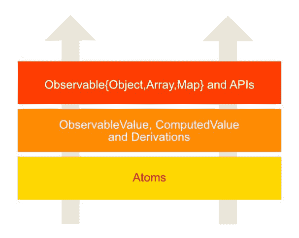
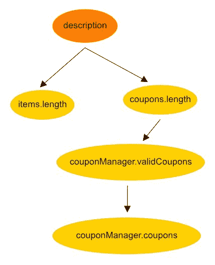
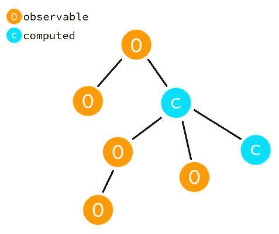
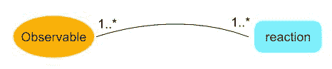

# 第九章：Mobx 内部

到目前为止我们所看到的 MobX 是从消费者的角度出发的，重点是如何使用它，最佳实践以及处理真实用例的 API。本章将向下一层，并揭示 MobX 响应式系统背后的机制。我们将看到支撑和构成*Observables-Actions-Reactions*三元组的核心抽象。

本章将涵盖的主题包括以下内容：

+   MobX 的分层架构

+   Atoms 和 ObservableValues

+   Derivations 和 reactions

+   什么是*透明函数式响应式编程*？

# 技术要求

您需要在系统上安装 Node.js。最后，要使用本书的 Git 存储库，用户需要安装 Git。

本章的代码文件可以在 GitHub 上找到：

[`github.com/PacktPublishing/Mobx-Quick-Start-Guide/tree/master/src/Chapter09`](https://github.com/PacktPublishing/Mobx-Quick-Start-Guide/tree/master/src/Chapter09)

查看以下视频以查看代码的运行情况：

[`bit.ly/2LvAouE`](http://bit.ly/2LvAouE)

# 分层架构

像任何良好的系统一样，MobX 由各个层构建而成，每个层提供了更高层的服务和行为。如果你把这个视角应用到 MobX 上，你可以从下往上看到这些层：



+   **Atoms**：Atoms 是 MobX observables 的基础。顾名思义，它们是可观察依赖树的原子部分。它跟踪它的观察者，但实际上不存储任何值。

+   **ObservableValue，ComputedValue 和 Derivations**：`ObservableValue`扩展了`Atom`并提供了实际的存储。它也是包装 Observables 的核心实现。与此同时，我们有 derivations 和 reactions，它们是原子的*观察者*。它们对原子的变化做出响应并安排反应。`ComputedValue`建立在 derivations 之上，也充当一个 observable。

+   **Observable{Object, Array, Map}和 APIs**：这些数据结构建立在`ObservableValue`之上，并使用它来表示它们的属性和值。这也是 MobX 的 API 层，是与库从消费者角度交互的主要手段。

层的分离也在源代码中可见，不同的抽象层有不同的文件夹。这与我们在这里描述的情况并不是一一对应的，但在概念上，这些层在代码中也有很多相似之处。MobX 中的所有代码都是使用 TypeScript 编写的，并得到了一流的支持。

# 原子

MobX 的响应式系统由存在于可观察对象之间的依赖关系图支持。一个可观察对象的值可能依赖于一组可观察对象，而这些可观察对象又可能依赖于其他可观察对象。例如，一个购物车可以有一个名为`description`的*计算属性*，它依赖于它所持有的`items`数组和应用的任何`coupons`。在内部，`coupons`可能依赖于`CouponManager`类的`validCoupons` *计算属性*。在代码中，这可能看起来像这样：

```jsx
class Coupon {
    @observable isValid = false;

    /*...*/ }

class CouponManager {
    @observable.ref coupons = [];

    @computed
  get validCoupons() {
        return this.coupons.filter(coupon => coupon.isValid);
    }

    /*...*/ }

class ShoppingCart {
    @observable.shallow items = [];

    couponManager = new CouponManager();

    @computed
  get coupons() {
        return this.couponManager.validCoupons;
    }

    @computed
  get description() {
        return `Cart has ${this.items.length} item(s) with ${
            this.coupons.**length**
  } coupon(s) applied.`;
    }

    /*...*/ }
```

可视化这组依赖关系可能会给我们一个简单的图表，如下所示：



在运行时，MobX 将创建一个支持依赖树。这棵树中的每个节点都将由`Atom`的一个实例表示，这是 MobX 的核心构建块。因此，我们可以期望在前面图表中的树中的节点有五个*原子*。

原子有两个目的：

+   当它被*读取*时通知。这是通过调用`reportObserved()`来完成的。

+   当它被*改变*时通知。这是通过调用`reportChanged()`来完成的。

作为 MobX 响应性结构的一个节点，原子扮演着通知每个节点上发生的读取和写入的重要角色。

在内部，原子会跟踪其观察者并通知它们发生的变化。当调用`reportChanged()`时会发生这种情况。这里一个明显的遗漏是原子的实际值并没有存储在`Atom`本身。为此，我们有一个名为`ObservableValue`的子类，它是建立在`Atom`之上的。我们将在下一节中看到它。

因此，原子的核心约定包括我们之前提到的两种方法。它还包含一些像`observers`数组、是否正在被观察等一些管理属性。我们可以在讨论中安全地忽略它们：

```jsx
class Atom {
    observers = [];

 reportObserved() {}
 reportChanged() {}

    /* ... */ }
```

# 在运行时读取原子

MobX 还让你能够在运行时看到后台的原子。回到我们之前的计算`description`属性的例子，让我们探索它的依赖树：

```jsx
import { autorun, **$mobx**, **getDependencyTree** } from 'mobx';

const cart = new ShoppingCart();
const disposer = autorun(() => {
    console.log(cart.description);
});

const descriptionAtom = cart[$mobx].values.get('description'); console.log(getDependencyTree(descriptionAtom));
```

在前面的片段中有一些细节值得注意：

+   MobX 为您提供了一个特殊的符号`$mobx`，其中包含对可观察对象的内部维护结构的引用。`cart`实例使用`cart[$mobx].values`维护其所有可观察属性的映射。通过从此映射中读取，可以获得`description`属性的后备原子：`cart[$mobx].values.get('description')`。

+   我们可以使用 MobX 公开的`getDependencyTree()`函数获取此属性的依赖树。它以`Atom`作为输入，并返回描述依赖树的对象。

这是`description`属性的`getDependencyTree()`的输出。为了清晰起见，已经删除了一些额外的细节。您看到`ShoppingCart@16.items`被提到两次的原因是因为它指向`items`（引用）和`items.length`属性：

```jsx
{
    name: 'ShoppingCart@16.description',
    dependencies: [
        { name: 'ShoppingCart@16.items' },
        { name: 'ShoppingCart@16.items' },
        {
            name: 'ShoppingCart@16.coupons',
            dependencies: [
                {
                    name: 'CouponManager@19.validCoupons',
                    dependencies: [{ name: 'CouponManager@19.coupons' }],
                },
            ],
        },
    ],
};
```

还有一个方便的 API，`getAtom(thing: any, property: string)`，用于从可观察对象和观察者中读取原子。例如，在我们之前的示例中，我们可以使用`getAtom(cart, 'description')`来获取*description*原子，而不是使用特殊符号`$mobx`并读取其内部结构。`getAtom()`是从`mobx`包中导出的。作为练习，找出前一个代码片段中`autorun()`的依赖树。您可以使用`disposer[$mobx]`或`getAtom(disposer)`来获取反应实例。类似地，还有`getObserverTree()`实用程序，它可以给出依赖于给定可观察对象的观察者。看看您是否可以从支持`description`属性的原子找到与`autorun()`的连接。

# 创建一个原子

作为 MobX 用户，您很少直接使用`Atom`。相反，您会依赖 MobX 公开的其他便利 API 或数据结构，如`ObservableObject`、`ObservableArray`或`ObservableMap`。然而，现实世界总是会出现一些情况，您可能需要深入了解一些更深层次的内容。

MobX 确实为您提供了一个方便的工厂函数来创建原子，恰当地命名为`createAtom()`：

**`createAtom(name, onBecomeObservedHandler, onBecomeUnobservedHandler)`**

+   `name`（`string`）：原子的名称，由 MobX 中的调试和跟踪工具使用

+   `onBecomeObservedHandler`（`（）=> {}`）：当原子首次被观察时通知的回调函数

+   `onBecomeUnobservedHandler`（`（）=> {}`）：当原子不再被观察时通知的回调函数

`onBecomeObserved`和`onBecomeUnobserved`是原子在响应系统中变为活动和非活动的两个时间点。这些通常用于资源管理，分别用于设置和拆除。

# 原子钟示例

让我们看一个使用`Atom`的例子，也说明了原子如何参与响应系统。我们将创建一个*简单的时钟*，当原子被观察时开始滴答，并在不再被观察时停止。实质上，我们这里的资源是由`Atom`管理的计时器（时钟）：

```jsx
import { createAtom, autorun } from 'mobx';

class Clock {

    constructor() {
 this.atom = createAtom(
 'Clock',
 () => {
 this.startTicking();
 },
 () => {
 this.stopTicking();
 },
 );

        this.intervalId = null;
    }

    startTicking() {
        console.log('Clock started');
        this.tick();
        this.intervalId = setInterval(() => this.tick(), 1000);
    }

    stopTicking() {
        clearInterval(this.intervalId);
        this.intervalId = null;

        console.log('Clock stopped');
    }

    tick() {
 this.atom.reportChanged();
    }

    get() {
 this.atom.reportObserved();
        return new Date();
    }
}

const clock = new Clock();

const disposer = autorun(() => {
 console.log(clock.get());
});

setTimeout(disposer, 3000);
```

在前面的片段中有许多有趣的细节。让我们在这里列出它们：

+   在调用`createAtom()`时，我们提供了当原子被观察和不再被观察时的处理程序。当原子实际上变得被观察时，这可能看起来有点神秘。这里的秘密在于使用`autorun()`，它设置了一个副作用来读取原子钟的当前值。由于`autorun()`立即运行，调用了`clock.get()`，进而调用了`this.atom.reportObserved()`。这就是原子在响应系统中变为活动的方式。

+   一旦原子被观察，我们就开始时钟计时器，每秒滴答一次。这发生在`onBecomeObserved`回调中，我们在其中调用`this.startTicking()`。

+   每秒，我们调用`this.atom.reportChanged()`，将改变的值传播给所有观察者。在我们的例子中，我们只有一个`autorun()`，它重新执行并打印控制台日志。

+   我们不必存储当前时间，因为我们在每次调用`get()`时返回一个新值。

+   另一个神秘的细节是当原子变得*未被观察*时。这发生在我们在三秒后处理`autorun()`后，导致在原子上调用`onBecomeUnobserved`回调。在回调内部，我们停止计时器并清理资源。

由于`Atoms`只是依赖树的节点，我们需要一个可以存储可观察值的构造。这就是`ObservableValue`类的用处。将其视为带有值的`Atom`。MobX 在内部区分两种可观察值，`ObservableValue`和`ComputedValue`。让我们依次看看它们。

# ObservableValue

`ObservableValue`是`Atom`的子类，它增加了存储可观察值的能力。它还增加了一些功能，比如提供拦截值更改和观察值的钩子。这也是`ObservableValue`的定义的一部分。以下是`ObservableValue`的简化定义：

```jsx
class ObservableValue extends Atom {
    value;

    get() {
        /* ... */
 this.reportObserved();
    }

    set(value) {

        /* Pass through interceptor, which may modify the value (*newValue*) ... */

        this.value = newValue;
 this.reportChanged();
    }

    intercept(handler) {}
    observe(listener, fireImmediately) {}
}
```

请注意`get()`方法中对`reportObserved()`的调用以及`set()`方法中对`reportChanged()`的调用。这些是原子值被读取和写入的地方。通过调用这些方法，`ObservableValue`参与了响应系统。还要注意，`intercept()`和`observe()`实际上并不是响应系统的一部分。它们更像是钩入到可观察值发生的更改的*事件发射器*。这些事件不受事务的影响，这意味着它们不会排队等到批处理结束，而是立即触发。

`ObservableValue`也是 MobX 中所有高级构造的基础。这包括 Boxed Observables、Observable Objects、Observable Arrays 和 Observable Maps。这些数据结构中存储的值都是`ObservableValue`的实例。

包装在`ObservableValue`周围的最薄的包装器是箱式可观察值，您可以使用`observable.box()`创建它。这个 API 实际上会给您一个`ObservableValue`的实例。您可以使用它来调用`ObservableValue`的任何方法，就像在以下代码片段中看到的那样：

```jsx
import {observable} from 'mobx';

const count = observable.box(0);

count.intercept(change => {
    console.log('Intercepted:', change);

    return change; // No change
 // Prints // Intercepted: {object: ObservableValue$$1, type: "update", newValue: 1} // Intercepted: {object: ObservableValue$$1, type: "update", newValue: 2} });

count.observe(change => {
    console.log('Observed:', change);
    // Prints
 // Observed: {object: ObservableValue$$1, type: "update", newValue: 1} // Observed: {object: ObservableValue$$1, type: "update", newValue: 2, oldValue: 1} });

// Increment count.set(count.get() + 1);

count.set(count.get() + 1);
```

# ComputedValue

在可观察树中，您可以拥有的另一种*可观察值*是`ComputedValue`。这与`ObservableValue`在许多方面都不同。`ObservableValue`为基础原子提供存储并具有*自己的值*。MobX 提供的所有数据结构，如 Observable Object/Array/Map，都依赖于`ObservableValue`来存储叶级别的值。`ComputedValue`在某种意义上是特殊的，它没有自己的内在值。其*值*是从其他可观察值（包括其他计算值）计算得出的。



这在`ComputedValue`的定义中变得明显，它不是`Atom`的子类。相反，它具有与`ObservableValue`类似的接口，除了拦截的能力。以下是一个突出显示有趣部分的简化定义：

```jsx
class ComputedValue {
    get() {
        /* ... */
 reportObserved(this);
        /* ... */
    }

    set(value) { /* rarely applicable */ }

    observe(listener, fireImmediately) {}
}
```

在前面的片段中需要注意的一件重要的事情是，由于`ComputedValue`不依赖于`Atom`，它对`reportObserved()`使用了不同的方法。这是一个更低级别的实现，它建立了可观察对象和观察者之间的链接。这也被`Atom`在内部使用，因此行为完全相同。此外，没有调用`reportChanged()`，因为`ComputedValue`的 setter 没有定义得很好。

正如你所看到的，`ComputedValue`主要是一个只读的可观察对象。虽然 MobX 提供了一种*设置*计算值的方法，但在大多数情况下，这并没有太多意义。计算值的 setter 必须对 getter 进行相反的计算。在大多数情况下，这几乎是不可能的。考虑一下本章前面的关于购物车`description`的例子。这是一个从其他可观察对象（如`items`和`coupons`）产生字符串的计算值。这个计算属性的*setter*会是什么样子？它必须解析字符串，并以某种方式得到`items`和`coupons`的值。这显然是不可能的。因此，一般来说，最好将`ComputedValue`视为只读的可观察对象。

由于计算值依赖于其他可观察对象，实际的*值计算*更像是一个副作用。它是依赖对象中任何一个变化的副作用。MobX 将这种计算称为派生。稍后我们将看到，派生与反应是同义词，强调了计算的副作用方面。

`ComputedValue`是依赖树中唯一一种既是可观察的又是观察者的节点。它的值是可观察的，并且由于它依赖于其他可观察值，它也是观察者。

`ObservableValue` = 仅可观察

`Reaction` = 仅观察者

`ComputedValue` = 可观察和观察者

# 高效的计算

`ComputedValue`的派生函数可能是一个昂贵的操作。因此，最好缓存这个值，并尽可能懒惰地计算。这是 MobX 的规范，并且它采用了一堆优化来使这个计算变成懒惰评估：

+   首先，除非明确请求或者有一个依赖于这个`ComputedValue`的反应，否则值永远不会被计算。如预期的那样，当没有观察者时，它根本不会被计算。

+   一旦计算出来，它的值将被缓存以供将来读取。它会一直保持这种状态，直到依赖的可观察对象发出变化信号（通过其`reportChanged()`）并导致推导重新评估。

+   `ComputedValue`可以依赖于其他计算值，从而创建依赖树。除非直接子级发生了变化，否则它不会重新计算。如果依赖树深处发生了变化，它将等待直接依赖项发生变化。这种行为提高了效率，不会进行不必要的重新计算。

正如您所看到的，`ComputedValue`中嵌入了多个级别的优化。强烈建议利用计算属性的强大功能来表示领域逻辑及其 UI 的各种细微差别。

# 推导

到目前为止，我们已经看到了 MobX 的构建模块，它用`Atoms`、`ObservableValue`和`ComputedValue`表示可观察状态。这些都是构建应用程序的反应状态图的良好选择。但是，反应性的真正力量是通过使用推导或反应来释放的。观察对象和反应一起形成了 MobX 的阴阳。它们彼此依赖，以推动反应系统。

推导或反应是跟踪发生的地方。它跟踪在推导或反应的上下文中使用的所有可观察对象。MobX 将监听它们的`reportObserved()`并将它们添加到被跟踪的可观察对象列表（`ObservableValue`或`ComputedValue`）。每当可观察对象调用`reportChanged()`（当它被改变时会发生），MobX 将安排运行所有连接的观察者。

我们将交替使用***推导***和***反应***。两者都旨在传达使用可观察对象产生新值（*推导*）或副作用（*反应*）的副作用执行。这两种类型之间的跟踪行为是共同的，因此我们将它们视为同义词使用。

# 推导的周期

MobX 使用`globalState`来保持对当前执行的*推导*或*反应*的引用。每当反应运行时，所有触发其`reportObserved()`的可观察对象都将被标记为该反应的一部分。事实上，这种关系是双向的。一个*可观察对象*跟踪其所有观察者（反应），而一个*反应*跟踪它当前正在观察的所有可观察对象。当前执行的反应将被添加为每个可观察对象的*观察者*。如果观察者已经被添加，它将被忽略。

当您设置观察者时，它们都会返回一个清理函数。我们已经在`autorun()`，`reaction()`或`when()`的返回值中看到了这一点，它们都是清理函数。调用此清理函数将从连接的可观察对象中删除观察者：



在执行反应时，只有现有的可观察对象才会被考虑进行跟踪。然而，在同一反应的不同运行中，可能会引用一些新的可观察对象。当由于某些分支逻辑而原本被跳过的代码段执行时，这是可能的。由于在跟踪反应时可能会发现新的可观察对象，MobX 会对可观察对象进行检查。新的可观察对象将被添加到可观察对象列表中，而不再使用的可观察对象将被移除。可观察对象的移除不会立即发生；它们将在当前反应完成后排队等待移除。

在可观察对象和反应之间的相互作用中，**操作**似乎是非常缺失的。嗯，并非完全如此。它们确实有一定的作用要发挥。正如本书中多次提到的，操作是改变可观察对象的推荐方式。操作创建一个事务边界，并确保所有更改通知仅在完成后触发。这些操作也可以嵌套，导致嵌套事务。只有当最顶层的*操作*（或事务）完成时，通知才会被触发。这也意味着在事务（嵌套或非嵌套）进行时，*反应*都不会运行。MobX 将此事务边界视为**批处理**，并在内部跟踪嵌套。在批处理期间，所有反应将被排队并在最顶层批处理结束时执行。

当排队的反应执行时，循环再次开始。它将跟踪可观察对象，将它们与执行的派生链接起来，添加任何新发现的可观察对象，并在批处理期间排队任何发现的反应。如果没有更多的批处理，MobX 将认为自己是稳定的，并回到等待任何可观察变化的状态。

关于反应的一个有趣的事情是它们可以重新触发自己。在一个反应中，你可以读取一个可观察对象，并触发一个改变同一个*可观察对象*的动作。这可能发生在同一段代码中，也可能间接地通过从反应中调用的某个函数。唯一的要求是它不应该导致无限循环。MobX 期望反应尽快变得稳定。

如果由于某种原因，迭代超过 100 次并且没有稳定性，MobX 将以异常退出。

反应在 100 次迭代后没有收敛到稳定状态。可能是反应函数中存在循环：`Reaction[Reaction@14]`

如果没有 100 次迭代的上限，它会在运行时导致堆栈溢出，使得更难追踪其原因。MobX 通过**100 次迭代**的限制来保护你免受这种困境的影响。请注意，它并不禁止你使用循环依赖，而是帮助识别导致不稳定（无限循环）的代码。

即使在*100 次反应*之后仍然不稳定的简单片段如下所示。这个反应观察`counter`可观察对象，并通过调用`spinLoop()`动作来修改它。这导致反应一遍又一遍地运行，直到在*100 次迭代后放弃：*

```jsx
class Infinite {
    @observable counter = 0;

    constructor() {
        reaction(
 () => this.counter,
            counterValue => {
                console.log(`Counter is ${counterValue}`);
 this.spinLoop();
            },
        );
    }

    @action
  spinLoop() {
        this.counter = this.counter + 1;
    }
}

new Infinite().spinLoop();

/* Console log:
*Reaction doesn't converge to a stable state after 100 iterations. Probably there is a cycle in the reactive function: Reaction[Reaction@14]* */
```

正如你所知，执行派生或反应对于建立*可观察对象*和*观察者*之间的联系至关重要。没有*反应*，反应性系统中就没有生命。它只会是一组可观察对象。你仍然可以触发动作和改变它们，但它仍然会非常静态和非反应性。反应（派生）完成了*可观察对象-动作-反应*的三元组，并为这个反应性系统注入了生命。

最终，**反应**是*从你的状态中提取值*并启动整个反应过程的关键！

# 异常处理

处理错误被认为是 MobX 反应的一个重要部分。事实上，它为`autorun()`、`reaction()`和`when()`提供了一个提供错误处理程序(`onError`)的选项，在`computed()`的情况下，每当读取计算值时都会将错误抛回给你。在这些情况下，MobX 会像预期的那样继续工作。

在内部，MobX 在执行 reactions 和 derivations 时加入了额外的`try-catch`块。它会捕获这些块内部抛出的错误，并通过`onError`处理程序或在读取计算值时将它们传播回给你。这种行为确保你可以继续运行你的 reactions，并在`onError`处理程序内采取任何恢复措施。

如果对于一个 reaction 没有指定`onError`处理程序，MobX 也有一个全局的`onReactionError()`处理程序，它将被调用来处理 reaction 中抛出的任何异常。你可以注册一个监听器来处理这些全局 reaction 错误，比如错误监控、报告等：

`onReactionError(handler-function: (error, reaction) => { })`

**handler-function**：一个接受错误和 reaction 实例作为参数的函数。

在调用全局`onReactionError`处理程序之前，MobX 首先检查失败的 reaction 是否有一个`onError`处理程序。只有当不存在时，才会调用全局处理程序。

现在，如果出于某种原因，你不希望 MobX 捕获异常并在全局`onReactionError`处理程序上报告它，你有一个出路。通过配置 MobX 为`configure({ disableErrorBoundaries: true })`，你将会在*失败点*得到一个常规异常。现在你需要通过*try-catch*块在 reaction 内部直接处理它。

在正常情况下不应该使用`configure({ disableErrorBoundaries: true })`，因为不处理异常可能会破坏 MobX 的内部状态。然而，打开这个配置可以帮助你调试，因为它会使异常未被捕获。现在你可以在引起异常的确切语句上暂停调试器。

# API 层

这是 MobX 面向消费者的最外层层，建立在前面提到的基础之上。在这一层中，突出的 API 包括本书中遍布的`observable()`、`observable.box()`、`computed()`、`extendObservable()`、`action()`、`reaction()`、`autorun()`、`when()`等。当然，我们还有装饰器，比如`observable.ref`、`observable.deep`、`observable.shallow`、`action.bound`、`computed.struct`等。

核心数据结构，如`ObservableObject`、`ObservableArray`和`ObservableMap`依赖于`ObservableValue`来存储它们的所有值。

对于`ObservableObject...`：

+   键值对的值由`ObservableValue`支持。

+   每个计算属性都由`ComputedValue`支持。

+   `ObservableObject`的`keys()`方法也由`Atom`支持。这是必要的，因为您可能会在其中一个反应中对`keys()`进行迭代。当添加或删除键时，您希望您的反应再次执行。`keys()`的这个原子会对添加和删除触发`reportChanged()`，并确保连接的反应被重新执行。

对于`ObservableArray...`：

+   每个索引值都由`ObservableValue`支持。

+   `length`属性明确由`Atom`支持。请注意，*ObservableArray*具有与 JavaScript 数组相同的接口。在***MobX 4***中，它是一个类似数组的数据结构，在***MobX 5***中成为了真正的 JS 数组（由 ES6 的*Proxy*支持）。对`length`的读取和写入将导致在原子上调用`reportObserved()`和`reportChanged()`。实际上，当使用*map*、*reduce*、*filter*等方法时，将使用支持`Atom`来触发`reportObserved()`。对于任何类似*splice*、*push*、*pop*、*shift*等的变异方法，将触发`reportChanged()`。这确保了连接的反应按预期触发。

对于`ObservableMap...`：

+   *键-值*对的值由`ObservableValue`支持。

+   就像*ObservableObject*一样，它也为`keys()`方法维护了一个`Atom`的实例。任何添加或删除键的操作都会通过原子上的`reportChanged()`通知。调用`keys()`方法本身将在原子上触发`reportObserved()`。

MobX 中的集合，包括对象、数组和映射，本质上是可观察盒子（`ObservableValue`）的集合。它们可以组织为列表或映射，或者组合在一起创建复杂的结构。

所有这些数据结构还公开了`intercept()`和`observe()`方法，允许对值进行细粒度拦截和观察。通过构建在`Atom`、`ObservableValue`和*derivations*的基础上，MobX 为您提供了一个强大的 API 工具箱，用于在应用程序中构建复杂的状态管理解决方案。

# 透明的函数式响应式编程

MobX 被认为是**透明的函数式响应式编程**（**TFRP**）系统。是的，在那一行有太多的形容词！让我们逐字逐句地分解它。

# 它是透明的...

将*可观察对象*连接到*观察者*，使观察者能够对可观察对象的变化做出反应。这是我们对 MobX 的基本期望，我们建立这些连接的方式非常直观。除了使用装饰器和在观察者内部取消引用可观察对象之外，没有明确的连接。由于连接的开销很低，MobX 变得非常*声明式*，您可以表达您的意图，而不必担心机制。在*可观察对象*和*观察者*之间建立的自动连接使*反应系统*能够自主运行。这使 MobX 成为一个*透明*的系统，因为连接可观察对象和观察者的工作基本上被取消了。在反应中使用可观察对象就足以连接这两者。

# 它是反应性的...

这种反应性也非常细粒度。可观察对象的依赖树可以尽可能简单，也可以同样深入。有趣的是，您永远不必担心连接的复杂性或效率。MobX 深知您的依赖关系，并通过仅在需要时做出反应来确保效率。没有轮询或过多的事件被触发，因为依赖关系不断变化。因此，MobX 也是一个非常反应灵敏的系统。

# 它是功能性的...

正如我们所知，**功能**编程是利用函数的力量来执行数据流转换。通过使用各种功能操作符，如 map、reduce、filter、compose 等，我们可以对*输入数据*进行转换并产生输出值。在 MobX 的情况下，关键在于*输入数据*是可观察的，是一个随时间变化的值。MobX 结合了反应系统的特性，并确保在输入数据（可观察对象）发生变化时自动应用功能-转换。正如前面讨论的那样，它以一种透明的方式通过建立可观察对象和反应之间的隐式连接来实现这一点。

这些特质的结合使 MobX 成为一个 TFRP 系统。

从作者的角度来看，TFRP 的首字母缩略词的起源来自以下文章：[`github.com/meteor/docs/blob/version-NEXT/long-form/tracker-manual.md`](https://github.com/meteor/docs/blob/version-NEXT/long-form/tracker-manual.md)。

# 价值导向编程

MobX 也涉及**价值导向编程**（VOP），在这里你关注值的变化、它的依赖关系以及在响应系统中的传播。通过 VOP，你关注的是*连接的值是什么？*而不是*值是如何连接的？*它的对应物是**事件导向编程**（EOP），在这里你关注的是一系列事件来通知变化。事件只报告已发生的事情，没有依赖关系的概念。与价值导向编程相比，它在概念上处于较低级别。

VOP 依赖事件在内部执行其工作。当一个值发生变化时，会触发事件来通知变化。这些事件的处理程序将把值传播给所有监听器（***观察者***）的***可观察值***。这通常会导致调用反应/派生。因此，反应和派生，即值变化的副作用，处于值传播事件的尾端。

以 VOP 的方式思考会提高抽象级别，使你更接近正在处理的领域。与其担心值传播的机制，你只需专注于通过可观察值、计算属性和观察者（反应/派生）建立连接。正如我们所知，这就是 MobX 的三位一体：*可观察值-动作-反应*。这种思维方式在本质上非常***声明式***：*值的变化是什么*而不是*如何*。当你更深入地沉浸在这种思维模式中时，许多状态管理中的场景会变得更加可行。你会对这种范式提供的*简单、强大和高效*感到惊讶。

如果你确实需要深入了解事件层，MobX 有`intercept()`和`observe()`的 API。它们允许你钩入当可观察值*添加、更新或删除*时触发的事件。还有来自`mobx-utils` npm 包的`fromStream()`和`toStream()`的 API，它们提供了与 RxJS 兼容的事件流。这些事件不参与 MobX 事务（批处理），永远不会排队，总是立即触发。

在消费者代码中很少使用事件 API；它们主要被工具和实用函数（如`spy()`、`trace()`等）使用，以便深入了解 MobX 的事件层。

# 总结

通过这个深入了解 MobX 的窥视，您可以欣赏到 TFRP 系统的强大之处，它暴露了一个令人惊讶地简单的 API。从 `Atoms` 开始的功能层，由 `ObservableValue` 包装，具有 API 和更高级的数据结构，为您的领域建模提供了全面的解决方案。

在内部，MobX 管理着可观察对象和观察者（反应/推导）之间的所有连接。它会自动完成，几乎不会干扰您通常的编程风格。作为开发者，您编写的代码会感觉很自然，而 MobX 则消除了管理响应式连接的复杂性。

MobX 是一个经过各种领域的实战考验的开源项目，接受来自世界各地开发者的贡献，并在多年来不断成熟。通过这次对 MobX 的内部了解，我们希望能够降低对这个强大的状态管理库的贡献障碍。
