# 第一章：使用 Node.js，Express.js，MongoDB，Mongoose，Falcor 和 Redux 配置全栈

欢迎来到*掌握全栈 React Web 开发*。在这本书中，你将使用 JavaScript 创建一个通用的全栈应用程序。我们将要构建的应用程序是一个类似于目前市场上流行的发布平台，例如：

+   Medium ( [`medium.com/`](https://medium.com/) )

+   WordPress ( [`wordpress.com/`](https://wordpress.com/) )

+   issuu ( [`issuu.com/`](https://issuu.com/) )

还有许多较小的发布平台，当然，我们的应用程序将比上述列表中列出的应用程序功能更少，因为我们只关注主要功能，比如发布文章、编辑文章或删除文章（这些核心功能可以用来实现你自己的想法）。除此之外，我们将专注于构建一个健壮的应用程序，因为这类应用程序最重要的一点就是可扩展性。有时，一篇文章的网络流量远远超过整个网站的流量（在行业中，例如，一篇文章可能通过社交媒体获得疯狂的关注，流量增加了 10000%是正常的）。

这本书的第一章是关于设置项目的主要依赖项。

本章我们的重点将包括以下主题：

+   安装**Node Version Manager**（**NVM**）以便更轻松地管理 Node

+   安装 Node 和 NPM

+   在我们的本地环境中准备 MongoDB

+   Robomongo 用于 Mongo 的 GUI

+   Express.js 设置

+   Mongoose 的安装和配置

+   我们客户端应用程序的初始 React Redux 结构

+   Netflix Falcor 作为后端和前端的粘合剂和旧的 RESTful 方法的替代品

我们将使用在 2015 年和 2016 年获得了很多关注的非常现代的应用程序堆栈-我相信你将在整本书中学到的堆栈在未来几年会更受欢迎，因为我们公司*MobileWebPro.pl*看到了在之前列出的技术中出现了巨大的兴趣激增。你将从这本书中获益良多，并且会掌握构建强大的全栈应用程序的最新方法。


# 关于我们的技术堆栈更多信息

在本书中，我们假设您熟悉 JavaScript（ES5 和 ES6），我们还将向您介绍一些来自 ES7 和 ES8 的机制。

在客户端，您将使用 React.js，这是您必须已经熟悉的，因此我们不会详细讨论 React 的 API。

在客户端的数据管理方面，我们将使用 Redux。我们还将向您展示如何使用 Redux 进行服务器端渲染。

对于数据库，您将学习如何在 MongoDB 中使用 Mongoose。Mongoose 是一个对象数据建模库，为您的数据提供了严格的建模环境。它强制实施结构，同时也允许您保持 MongoDB 强大的灵活性。

Node.js 和 Express.js 是前端开发人员开始全栈开发的标准选择。Express 的框架对**Netflix**创建的创新客户端后端数据获取机制**Falcor.js**提供了最好的支持。我们相信您会喜欢 Falcor，因为它的简单性以及在进行全栈开发时能节省大量时间。我们将在本书后面详细解释为什么使用这个数据获取库比构建 RESTful API 的标准流程更有效率。

通常，我们几乎在任何地方都会使用对象表示法（JSON）--在 React 作为库的情况下，JSON 被广泛用于虚拟 DOM 的差异处理（在幕后）。Redux 还使用 JSON 树作为其单一状态树容器。Netflix Falcor 库还使用了一个称为虚拟 JSON 图的高级概念（我们稍后会详细描述）。最后，MongoDB 也是一个基于文档的数据库。

JSON 随处可见--这种设置将极大地提高我们的生产力，主要是因为 Falcor 将所有内容绑定在一起。

# 环境准备

要启动，您需要在操作系统上安装以下工具：

+   MongoDB

+   Node.js

+   NPM--随 Node.js 自动安装

我们强烈建议开发时使用 Linux 或 OS X。对于 Windows 用户，我们建议设置一个虚拟机，并在其中进行开发。为此，您可以使用 Vagrant（[`www.vagrantup.com/`](https://www.vagrantup.com/)），它在后台创建一个虚拟环境进程，使开发几乎可以在 Windows 上本地进行，或者您可以直接使用 Oracle 的 VirtualBox（[`www.virtualbox.org/`](https://www.virtualbox.org/)），并在虚拟桌面中工作，但性能显著低于本地工作。

# NVM 和 Node 安装

NVM 是一个非常方便的工具，可以在开发过程中在您的机器上保留不同的 Node 版本。如果您的系统尚未安装 NVM，请前往[`github.com/creationix/nvm`](https://github.com/creationix/nvm)获取说明。

在您的系统上安装了 NVM 后，您可以输入以下内容：

```jsx
$ nvm list-remote

```

此命令列出所有可用的 Node 版本。在我们的情况下，我们将使用 Node v4.0.0，因此您需要在终端中输入以下内容：

```jsx
$ nvm install v4.0.0

$ nvm alias default v4.0.0

```

这些命令将安装 Node 版本 4.0.0，并将其设置为默认版本。我们在本书中使用 NPM 2.14.23，您可以使用以下命令检查您的版本：

```jsx
$ npm -v

2.14.23

```

在本地机器上安装相同版本的 Node 和 NPM 后，我们可以开始设置其余的工具。

# MongoDB 安装

您可以在[Tutorials](https://docs.mongodb.org/manual/installation/)部分找到所有 MongoDB 的安装说明。

以下是来自 MongoDB 网站的截图：


安装 Node.js 的说明和准备的软件包可以在[`nodejs.org`](https://nodejs.org)找到。

# Robomongo 用于 MongoDB 的 GUI

Robomongo 是一个跨平台的桌面客户端，可用于 SQL 数据库，类似于 MySQL 或 PostgreSQL。

在开发应用程序时，拥有一个图形用户界面并能够快速查看数据库中的集合是很好的。如果您熟悉使用 shell 进行数据库管理，则这是一个可选步骤，但如果这是您在处理数据库方面的第一步，这将很有帮助。

要获取 Robomongo（适用于所有操作系统），请访问[`robomongo.org/`](https://robomongo.org/)并在您的机器上安装一个。

在我们的情况下，我们将使用 Robomongo 的 0.9.0 RC4 版本。

# 运行 MongoDB 并在 Robomongo GUI 中查看我们的集合

在您的计算机上安装了 MongoDB 和 Robomongo 之后，您需要运行守护进程，该进程监听连接并将它们委派给数据库。要在终端中运行 Mongo 守护进程，请使用以下命令：

```jsx
mongod

```

然后执行以下步骤：

1.  打开 Robomongo 的客户端--将出现以下屏幕：

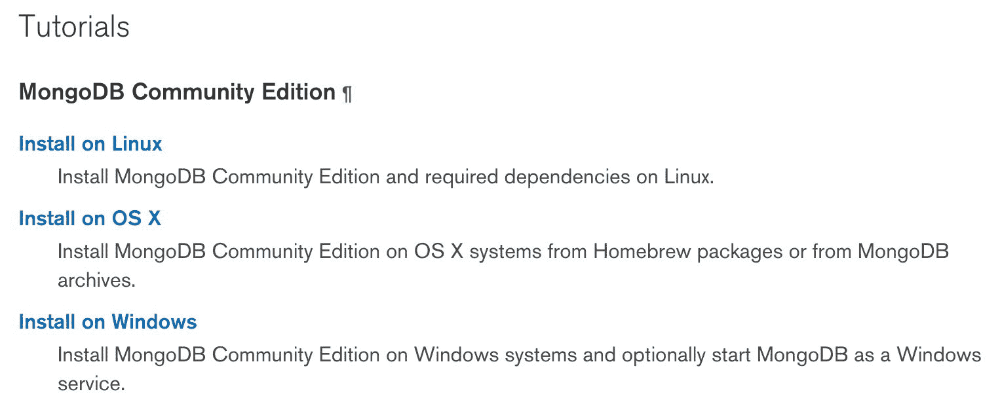

1.  通过单击“创建”链接使用默认值创建连接：

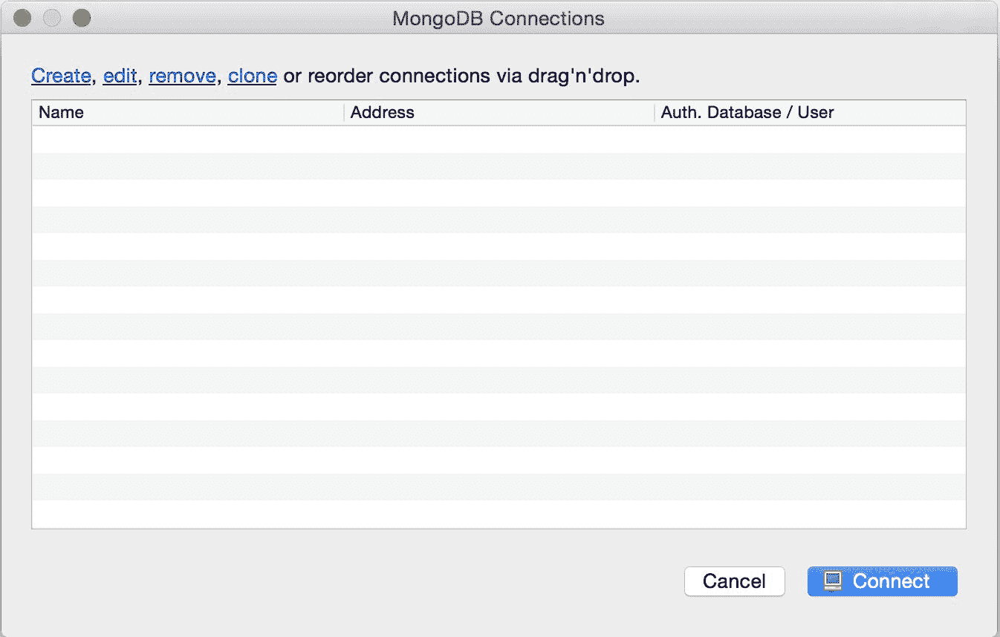

1.  为您的连接选择一个名称，并使用端口`27017`，这是数据库的默认端口，然后单击“保存”。

此时，您已经完成了本地主机数据库的设置，并且可以使用 GUI 客户端预览其内容。

# 将第一个示例集合导入数据库

在项目目录中，创建一个名为`initData.js`的文件：

```jsx
touch initData.js

```

在我们的情况下，我们正在构建发布应用程序，因此它将是一系列文章。在以下代码中，我们有一个 JSON 格式的两篇文章的示例集合：

```jsx
[ 

    { 

        articleId: '987654', 

        articleTitle: 'Lorem ipsum - article one', 

        articleContent: 'Here goes the content of the article' 

    }, 

    { 

        articleId: '123456', 

        articleTitle: 'Lorem ipsum - article two', 

        articleContent: 'Sky is the limit, the content goes here.' 

    } 

]

```

一般来说，我们从一组模拟的文章开始--稍后我们将添加一个功能来将更多文章添加到 MongoDB 的集合中，但现在为了简洁起见，我们将只使用两篇文章。

要列出您的本地主机数据库，请输入以下命令打开 Mongo shell：

```jsx
$ mongo

```

在 Mongo shell 中，输入：

```jsx
show dbs

```

查看以下完整示例：

```jsx
Welcome to the MongoDB shell. 

For interactive help, type "help". 

For more comprehensive documentation, see 

 http://docs.mongodb.org/ 

Questions? Try the support group 

 http://groups.google.com/group/mongodb-user 

Server has startup warnings: 

2016-02-25T13:31:05.896+0100 I CONTROL  [initandlisten] 

2016-02-25T13:31:05.896+0100 I CONTROL  [initandlisten] ** WARNING: soft rlimits too low. Number of files is 256, should be at least 1000 

> show dbs 

local  0.078GB 

>

```

在我们的示例中，它显示我们在本地主机上有一个名为`local`的数据库。

# 将文章导入 MongoDB

接下来，我们将使用终端（命令提示符）来导入文章到数据库。或者，您也可以使用 Robomongo 通过 GUI 来完成：

```jsx
mongoimport --db local --collection articles --jsonArray initData.js --host=127.0.0.1

```

请记住，您需要在终端中打开一个新标签，并且在 Mongo shell 中使用`mongo import`（不要将其与`mongod`进程混淆）。

然后您将在终端中看到以下信息：

```jsx
connected to: 127.0.0.1

imported 2 documents

```

如果您收到错误消息`Failed: error connecting to db server: no reachable servers`，请确保您在给定的主机 IP（`127.0.0.1`）上运行`mongod`。

通过命令行导入这些文章后，您还将在 Robomongo 中看到这一点：

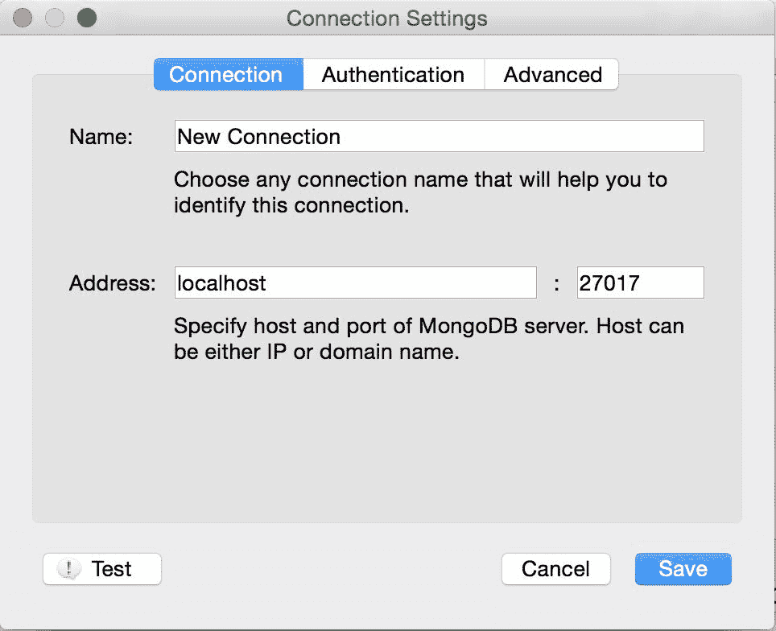

# 使用 Node.js 和 Express.js 设置服务器

一旦我们在 MongoDB 中有了我们的文章集合，我们就可以开始在 Express.js 服务器上工作，以便处理这个集合。

首先，在我们的目录中需要一个 NPM 项目：

```jsx
npm init --yes

```

`--yes`标志表示我们将使用`package.json`的默认设置。

接下来，在`server`目录中创建一个`index.js`文件：

```jsx
mkdir server

cd server

touch index.js

```

在`index.js`中，我们需要添加一个 Babel/register，以便更好地支持 ECMAScript 2015 和 2016 规范。这将使我们能够支持诸如`async`和`generator`函数之类的结构，这些在当前版本的 Node.js 中默认情况下是不可用的。

请参阅`index.js`文件内容（我们稍后将安装 Babel 的`dev`依赖项）：

```jsx
// babel-core and babel-polyfill to be installed later in that  

//chapter 

require('babel-core/register'); 

require('babel-polyfill'); 

require('./server');

```

安装`express`和其他初始依赖项：

```jsx
npm i express@4.13.4  cors@2.7.1 body-parser@1.15.0--save

```

在命令中，您可以在`express`和其他之后看到`@4.13.4`。这些是我们要安装的库的版本，我们故意选择它们以确保它们能够很好地与 Falcor 一起工作，但很可能您可以跳过这些，更新的版本应该同样有效。

我们还需要安装`dev`依赖项（我们已经将所有`npm install`命令分开以提高可读性）：

```jsx
npm i --save-dev babel@6.5.2 

npm i --save-dev babel-core@6.6.5 

npm i --save-dev babel-polyfill@6.6.1 

npm i --save-dev babel-loader@6.2.4 

npm i --save-dev babel-preset-es2015@6.6.0 

npm i --save-dev babel-preset-react@6.5.0 

npm i --save-dev babel-preset-stage-0@6.5.0

```

我们需要`babel-preset-stage-0`来支持 ES7 功能。`babel-preset-es2015`和`babel-preset-react`是为了支持 JSX 和 ES6。

还要注意，我们安装 Babel 是为了让我们的 Node 服务器能够使用 ES6 功能。我们需要添加`.babelrc`文件，因此创建以下内容：

```jsx
$ [[[you are in the main project's directory]]] 

$ touch .babelrc 

```

然后打开`.babelrc`文件，并填写以下内容：

```jsx
{ 

'presets': [ 

'es2015', 

'react', 

'stage-0' 

  ] 

}

```

请记住，`.babelrc` 是一个隐藏文件。最好的编辑`.babelrc` 的方法可能是在诸如 Sublime Text 之类的文本编辑器中打开整个项目。然后您应该能够看到所有隐藏文件。

我们还需要以下库：

+   `babel`和`babel-core/register`：这是将新的 ECMAScript 函数转译为现有版本的库

+   `cors`：这个模块负责以一种简单的方式创建跨域请求到我们域的请求

+   `body-parser`：这是用于解析请求体的中间件

完成后，您的项目文件结构应该如下所示：

```jsx
&boxvr;&boxh;&boxh; node_modules 

&boxv;   &boxvr;&boxh;&boxh; *** 

&boxvr;&boxh;&boxh; initData.js 

&boxvr;&boxh;&boxh; package.json 

&boxur;&boxh;&boxh; server 

    &boxur;&boxh;&boxh; index.js

```

`***`是一个通配符，意味着我们的项目需要这些文件，但我们没有在这里列出，因为列表会太长。

# 处理我们的服务器（server.js）

我们将开始处理`server/server.js`文件，这是我们项目中的新文件，所以我们首先需要使用以下命令在项目的`server`目录中创建它：

```jsx
touch server.js

```

`server/server.js`文件的内容如下：

```jsx
import http from 'http'; 

import express from 'express'; 

import cors from 'cors'; 

import bodyParser from 'body-parser'; 

const app = express(); 

app.server = http.createServer(app); 

// CORS - 3rd party middleware 

app.use(cors()); 

// This is required by falcor-express middleware  

//to work correctly with falcor-browser 

app.use(bodyParser.json({extended: false})); 

app.get('/', (req, res) => res.send('Publishing App Initial Application!')); 

app.server.listen(process.env.PORT || 3000); 

console.log(&grave;Started on port ${app.server.address().port}&grave;); 

export default app;

```

这些文件使用`babel/register`库，以便我们可以在代码中使用 ES6 语法。在`index.js`文件中，我们有一个来自 Node.js 的`http`模块（[`nodejs.org/api/http.html#http_http`](https://nodejs.org/api/http.html#http_http)）。接下来，我们有`express`，`cors`和`body-parser`。

Cors 是 Express 应用程序中用于动态或静态启用**跨源资源共享**（**CORS**）的中间件--在我们的开发环境中它将很有用（我们将在生产服务器中删除它）。

Body-parser 是用于 HTTP 请求体解析的中间件。它有一些花哨的设置，可以帮助我们更快地构建应用程序。

这是我们应用程序在开发的这个阶段的样子：

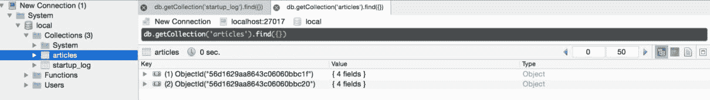

# Mongoose 和 Express.js

目前，我们有一个简单的工作 Express.js 服务器。现在我们需要将 Mongoose 添加到我们的项目中：

```jsx
npm i mongoose@4.4.5 --save

```

一旦我们安装了 Mongoose 并在后台运行了 MongoDB 数据库，我们就可以将其导入到我们的`server.js`文件中并进行编码：

```jsx
import http from 'http'; 

import express from 'express'; 

import cors from 'cors'; 

import bodyParser from 'body-parser'; 

import mongoose from 'mongoose'; 

mongoose.connect('mongodb://localhost/local'); 

const articleSchema = { 

    articleTitle:String, 

    articleContent:String 

}; 

const Article = mongoose.model('Article', articleSchema,  'articles');

const app = express(); 

app.server = http.createServer(app); 

// CORS - 3rd party middleware 

app.use(cors()); 

// This is required by falcor-express middleware to work correctly  

//with falcor-browser 

app.use(bodyParser.json({extended: false})); 

app.use(express.static('dist')); 

app.get('/', (req, res) => {  

    Article.find( (err, articlesDocs) => { 

      const ourArticles = articlesDocs.map((articleItem) => { 

        return &grave;<h2>${articleItem.articleTitle}</h2>            

        ${articleItem.articleCon tent}&grave;; 

      }).join('<br/>'); 

      res.send(&grave;<h1>Publishing App Initial Application!</h1>        

      ${ourArticles}&grave;); 

    }); 

}); 

app.server.listen(process.env.PORT || 3000); 

console.log(&grave;Started on port ${app.server.address().port}&grave;); 

export default app;

```

# 如何运行项目的摘要

确保您在计算机上使用以下命令在后台运行 MongoDB：

```jsx
mongod

```

在终端（或 Windows 上的 PowerShell）中运行`mongod`命令后，您应该在控制台中看到以下内容：

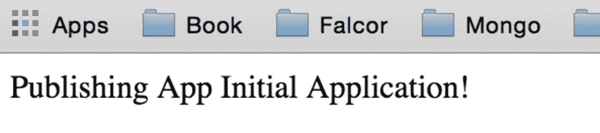

在运行服务器之前，请确保您的`package.json`文件中的`devDependencies`如下所示：

```jsx
"devDependencies": { 

"babel": "6.5.2", 

"babel-core": "6.6.5", 

"babel-loader": "6.2.4", 

"babel-polyfill": "6.6.1", 

"babel-preset-es2015": "6.6.0", 

"babel-preset-react": "6.5.0", 

"babel-preset-stage-0": "6.5.0" 

  }

```

在运行服务器之前，请确保您的`package.json`中的依赖项如下所示：

```jsx
"dependencies": { 

"body-parser": "1.15.0", 

"cors": "2.7.1", 

"express": "4.13.4", 

"mongoose": "4.4.5" 

  }

```

在主目录中，使用以下命令运行 Node：

```jsx
node server/index.js 

```

之后，您的终端应该显示以下内容：

```jsx
$ node server/index.js

Started on port 3000

```

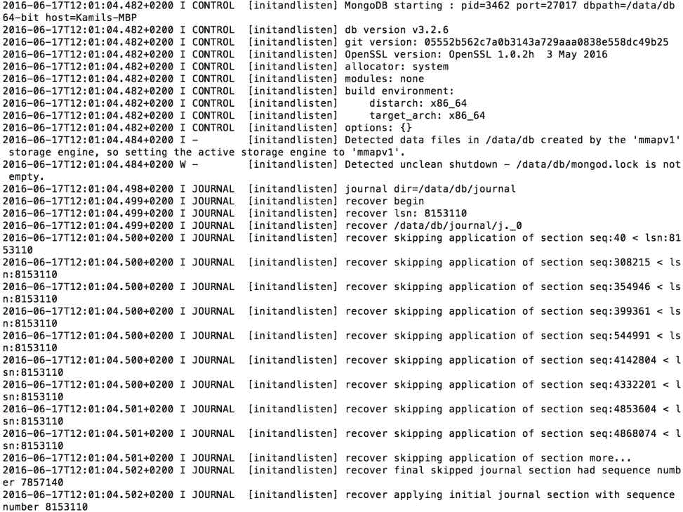

# Redux 基本概念

在本节中，我们将仅涵盖 Redux 的最基本概念，这将帮助我们制作我们的简单发布应用程序。本章中的应用程序将仅处于*只读*模式；在本书的后面，我们将添加更多功能，如添加/编辑文章。您将在后面的章节中发现有关 Redux 的所有重要规则和原则。

涵盖的基本主题包括：

+   什么是状态树？

+   不可变性在 Redux 中是如何工作的

+   减速器的概念和基本用法

让我们从基础知识开始。

# 单一的不可变状态树

Redux 最重要的原则是，您将把应用程序的整个状态表示为一个单一的 JavaScript 对象。

Redux 中的所有变化（action）都是显式的，因此你可以通过开发工具跟踪应用程序中所有操作的历史记录。

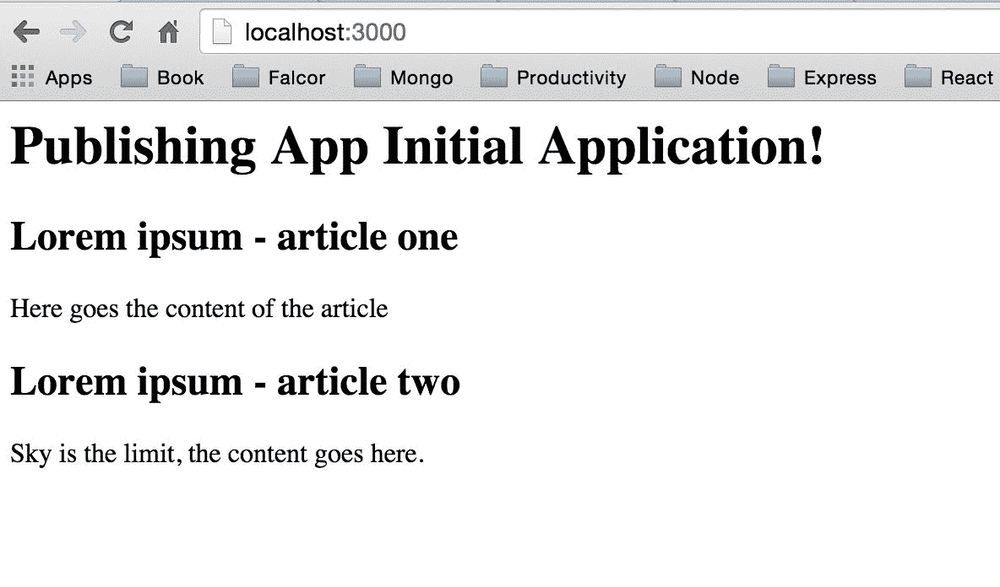

上面的截图是一个简单的开发工具使用案例，你将在开发环境中使用它。它将帮助你跟踪应用程序中状态的变化。这个例子展示了我们如何通过*+1*三次增加了我们状态中的计数器值。当然，我们的发布应用结构会比这个例子复杂得多。你将在本书的后面学到更多关于那个开发工具的知识。

# 不可变性- action 和状态树都是只读的

由于 Redux 基于函数式编程范式，你不能以与 Facebook（和其他）FLUX 实现相同的方式修改/改变状态树中的值。

与其他 FLUX 实现一样，action 是一个描述变化的普通对象--比如添加一篇文章（在下面的代码中，我们为了简洁起见模拟了 payload）：

```jsx
{ 

    type: 'ADD_ARTICLE', 

    payload: '_____HERE_GOES_INFORMATION_ABOUT_THE_CHANGE_____' 

}

```

action 是我们应用状态树变化的最小表示。让我们为我们的发布应用准备一些 action。

# 纯函数和不纯函数

纯函数是指没有任何副作用的函数，比如，I/O（读取文件或 HTTP 请求）。不纯的函数会产生副作用，比如，如果你发起一个 HTTP 请求，它可能会针对完全相同的参数*Y,Z（function(X,Y)*返回不同的值，因为端点会返回一个随机值，或者因为服务器错误而宕机。

对于相同的*X,Y*参数，纯函数总是可预测的。在 Redux 中，我们只在 reducer 和 action 中使用纯函数（否则 Redux 的`lib`将无法正常工作）。

在本书中，你将学习整个结构以及何时进行 API 调用。因此，如果你遵循本书，那么你就不必太担心 Redux 中的这个原则。

# reducer 函数

Redux 中的 reducer 可以与 Facebook 的 Flux 中的单个 store 进行比较。重要的是，reducer 始终接受先前的状态并返回一个新对象的新引用（使用`Object.assign`等方法），因此我们可以使用不可变的 JS 来帮助我们构建一个更可预测的应用程序状态，与旧的 Flux 实现相比，它们会改变存储中的变量。

因此，创建一个新的引用是最佳的，因为 Redux 使用来自未更改的 reducer 值的旧引用。这意味着即使每个操作通过 reducer 创建一个全新的对象，那些不变的值在内存中仍具有先前的引用，因此我们不会过度使用计算机的计算能力。一切都很快。

在我们的应用程序中，我们将有一个文章 reducer，它将帮助我们从视图层列出、添加、编辑和删除文章。

# 首个 reducer 和 webpack 配置

首先，让我们为我们的发布应用程序创建一个 reducer：

```jsx
mkdir src 

cd src 

mkdir reducers 

cd reducers 

touch article.js 

```

因此，我们第一个 reducer 的位置是`src/reducers/article.js`，我们的`reducers/article.js`的内容如下：

```jsx
const articleMock = { 

'987654': { 

        articleTitle: 'Lorem ipsum - article one', 

        articleContent: 'Here goes the content of the article' 

    }, 

'123456': { 

        articleTitle: 'Lorem ipsum - article two', 

        articleContent: 'Sky is the limit, the content goes here.' 

    } 

}; 

const article = (state = articleMock, action) => { 

    switch (action.type) { 

        case 'RETURN_ALL_ARTICLES': 

            return Object.assign({}, state); 

        default: 

            return state; 

    } 

} 

export default article;

```

在前面的代码中，我们将我们的`articleMock`保存在浏览器内存中（与`initData.js`中的内容相同）-稍后，我们将从后端数据库中获取这些数据。

箭头函数`const article`正在获取`action.type`，它将以与 Facebook 的 FLUX 实现相同的方式来自常量（我们稍后将创建它们）。

对于`switch`语句中的默认`return`，我们从`state = articleMock`（上面的 return state;部分）提供状态。这将在任何其他操作发生之前，在首次启动我们的发布应用程序时返回初始状态。确切地说，在我们的情况下，默认情况将与`RETURN_ALL_ARTICLES`操作完全相同，然后我们开始从后端获取数据（在实现了从后端获取文章的机制之后，然后默认情况将返回一个空对象）。

由于我们的 webpack 配置（在此处描述），我们需要`dist`中的`index.html`。让我们创建一个`dist/index.html`文件：

```jsx
pwd 

/Users/przeor/Desktop/React-Convention-Book/src/reducers 

cd ../.. 

mkdir dist 

cd dist 

touch index.html 

```

`dist/index.html`文件的内容如下：

```jsx
<!doctype html> 

<html lang="en"> 

<head> 

<title>Publishing App</title> 

<meta charset="utf-8"> 

</head> 

<body> 

<div id="publishingAppRoot"></div> 

<script src="app.js"></script> 

</body> 

</html>

```

我们有一个文章`reducer`和`dist/index.html`，但在开始构建 Redux 发布应用程序之前，我们需要为我们的构建自动化配置 webpack。

首先安装 webpack（您可能需要`sudo`根访问权限）：

```jsx
npm i --save-dev webpack@1.12.14 webpack-dev-server@1.14.1 

```

然后，在`package.json`和`initData.js`文件旁的主目录中，输入以下内容：

```jsx
touch webpack.config.js

```

然后创建 webpack 配置：

```jsx
module.exports = { 

    entry: ['babel-polyfill', './src/app.js'], 

    output: { 

        path: './dist', 

        filename: 'app.js', 

        publicPath: '/' 

    }, 

    devServer: { 

        inline: true, 

        port: 3000, 

        contentBase: './dist' 

    }, 

    module: { 

        loaders: [ 

            { 

                test: /.js$/, 

                exclude: /(node_modules|bower_components)/, 

                loader: 'babel', 

        query: { 

                    presets: ['es2015', 'stage-0', 'react'] 

                } 

            } 

        ] 

    } 

}

```

简单地说，webpack 配置表示 CommonJS 模块的入口在`'./src/app.js'`。webpack 构建整个应用程序，遵循从`app.js`导入的所有内容，最终输出位于路径`'./dist'`。我们的应用程序位于`contentBase: './dist'`，将位于端口`3000`。我们还配置了 ES2015 和 React 的使用，以便 webpack 将 ES2015 编译为 ES5，并将 React 的 JSX 编译为 JavaScript。如果您对 webpack 的配置选项感兴趣，请阅读其文档。

# 其余重要依赖项的安装和 npm dev 脚本

安装 webpack 使用的 Babel 工具（检查配置文件）：

```jsx
npm i --save react@0.14.7 react-dom@0.14.7 react-redux@4.4.0 redux@3.3.1

```

我们还需要更新我们的`package.json`文件（添加`scripts`）：

```jsx
"scripts": { 

"dev": "webpack-dev-server" 

  },

```

我们完整的`package.json`应该如下所示，包括所有前端依赖项：

```jsx
01{ 

"name": "project", 

"version": "1.0.0", 

"description": "", 

"scripts": { 

"dev": "webpack-dev-server" 

  }, 

"dependencies": { 

"body-parser": "1.15.0", 

"cors": "2.7.1", 

"express": "4.13.4", 

"mongoose": "4.4.5", 

"react": "0.14.7", 

"react-dom": "0.14.7", 

"react-redux": "4.4.0", 

"redux": "3.3.1" 

  }, 

"devDependencies": { 

"babel": "6.5.2", 

"babel-core": "6.6.5", 

"babel-loader": "6.2.4", 

"babel-polyfill": "6.6.1", 

"babel-preset-es2015": "6.6.0", 

"babel-preset-react": "6.5.0", 

"babel-preset-stage-0": "6.5.0", 

"webpack": "1.12.14", 

"webpack-dev-server": "1.14.1" 

  } 

}

```

正如您可能意识到的，上述`package.json`没有`^`符号，因为我们希望使用每个软件包的确切版本，以确保所有软件包都安装了包中给出的正确和确切的版本。否则，您可能会遇到一些困难，例如，如果您添加`"mongoose": "4.4.5"`，然后它将安装一个新版本，导致控制台中出现一些额外的警告。让我们坚持书中提到的版本，以避免我们正在构建的应用程序出现不必要的问题。我们要尽一切努力避免 NPM 依赖地狱。

# 在 src/app.js 和 src/layouts/PublishingApp.js 上工作

让我们创建我们的`app.js`文件，我们的应用程序的主要部分将位于`src/app.js`：

```jsx
//[[your are in the main directory of the project]] 

cd src

touch app.js

```

我们新的`src/app.js`文件的内容如下：

```jsx
import React from 'react'; 

import { render } from 'react-dom'; 

import { Provider } from 'react-redux'; 

import { createStore } from 'redux'; 

import article from './reducers/article'; 

import PublishingApp from './layouts/PublishingApp'; 

const store = createStore(article); 

render( 

<Provider store={store}> 

<PublishingApp /> 

</Provider>, 

    document.getElementById('publishingAppRoot') 

);

```

新的部分是`store = createStore(article)`部分--Redux 中的这个实用程序允许您保持应用程序状态对象，分派动作，并允许您将一个减速器作为参数，告诉您应用程序如何通过动作进行更新。

`react-redux`是 Redux 与 React 的有用绑定（这样我们将编写更少的代码并且更加高效）：

```jsx
<Provider store>

```

`Provider store`帮助我们使 Redux 存储可用于子组件中的`connect()`调用（如下所示）：

```jsx
connect([mapStateToProps], [mapDispatchToProps], [mergeProps], [options])

```

`connect`将在任何需要监听我们应用程序中减速器变化的组件中使用。您将在本章后面看到如何使用它。

对于商店，我们使用`const store = createStore(article)`-- 仅仅为了简洁起见，我将提到商店中有几种方法，我们将在接下来的构建应用程序的步骤中使用。

```jsx
store.getState();

```

`getState` 函数会给你当前应用程序的状态：

```jsx
store.dispatch({ type: 'RETURN_ALL_ARTICLES' });

```

`dispatch` 函数可以帮助你改变应用程序的状态：

```jsx
store.subscribe(() => { 

});

```

订阅允许你注册一个回调，Redux 每次分发动作时都会调用它，这样视图层就可以了解应用程序状态的变化并刷新其视图。

# 封装 React-Redux 应用程序

让我们完成我们的第一个 React-Redux 应用程序。总结一下，让我们看看我们当前的目录结构：

```jsx
&boxvr;&boxh;&boxh; dist 

&boxv;   &boxur;&boxh;&boxh; index.html 

&boxvr;&boxh;&boxh; initData.js 

&boxvr;&boxh;&boxh; node_modules 

&boxv;   &boxvr;&boxh;&boxh; ********** (A LOT OF LIBRARIES HERE) 

&boxvr;&boxh;&boxh; package.json 

&boxvr;&boxh;&boxh; server 

&boxv;   &boxvr;&boxh;&boxh; index.js 

&boxv;   &boxur;&boxh;&boxh; server.js 

&boxvr;&boxh;&boxh; src 

&boxv;   &boxvr;&boxh;&boxh; app.js 

&boxv;   &boxur;&boxh;&boxh; reducers 

&boxv;       &boxur;&boxh;&boxh; article.js 

&boxur;&boxh;&boxh; webpack.config.js

```

现在我们需要创建应用程序的主视图。我们将把这放在我们第一个版本的布局目录中：

```jsx
pwd

/Users/przeor/Desktop/React-Convention-Book/src

mkdir layouts

cd layouts

touch PublishingApp.js

```

`PublishingApp.js` 的内容是：

```jsx
import React from 'react'; 

import { connect } from 'react-redux'; 

const mapStateToProps = (state) => ({ 

  ...state 

}); 

const mapDispatchToProps = (dispatch) => ({ 

}); 

class PublishingApp extends React.Component { 

  constructor(props) { 

    super(props); 

  } 

  render () { 

    console.log(this.props);     

    return ( 

<div> 

          Our publishing app 

</div> 

    ); 

  } 

} 

export default connect(mapStateToProps, mapDispatchToProps)(PublishingApp);

```

上面介绍了 ES7 语法 `...` 旁边的 `...`：

```jsx
const mapStateToProps = (state) => ({ 

  ...state 

});

```

`...` 是一个展开运算符，在 Mozilla 的文档中有很好的描述；*一个表达式，在期望多个参数（用于函数调用）或多个元素（用于数组文字）的地方进行展开*。在我们的情况下，这个 `...` 运算符将一个对象状态扩展到第二个对象中（在我们的情况下，空对象 `{ }` ）。它写在这里是因为将来我们将指定多个必须从我们应用程序状态映射到 `this.props` 组件的 reducer。

# 完成我们的第一个静态发布应用程序

在我们的静态应用程序中要做的最后一件事是渲染来自 `this.props` 的文章。

由于 Redux 的存在，可以在 reducer 中模拟的对象是可用的，所以如果你在 `PublishingApp.js` 的渲染函数中检查 `console.log(this.props)` ，那么你将能够访问我们的 `articles` 对象：

```jsx
const articleMock = { 

'987654': { 

        articleTitle: 'Lorem ipsum - article one', 

        articleContent: 'Here goes the content of the article' 

    }, 

"123456": { 

        articleTitle: 'Lorem ipsum - article two', 

        articleContent: 'Sky is the limit, the content goes here.' 

    } 

};

```

在我们的情况下，我们需要更改 React 的渲染函数，如下所示（在 `src/layouts/PublishingApp.js` 中）：

```jsx
 render () { 

    let articlesJSX = []; 

    for(let articleKey in this.props) { 

        const articleDetails = this.props[articleKey]; 

        const currentArticleJSX = ( 

          <div key={articleKey}> 

          <h2>{articleDetails.articleTitle}</h2> 

          <h3>{articleDetails.articleContent}</h3> 

          </div>); 

        articlesJSX.push(currentArticleJSX); 

    } 

    return ( 

      <div> 

      <h1>Our publishing app</h1> 

          {articlesJSX} 

      </div> 

    ); 

  }

```

在上面的代码片段中，我们正在遍历文章 `Mock` 对象（从 reducer 的状态中传递给 `this.props` ）并使用 `articlesJSX.push(currentArticleJSX);` 创建文章的数组（在 JSX 中）。创建完成后，我们将把 `articlesJSX` 添加到 `return` 语句中：

```jsx
<div> 

<h1>Our publishing app</h1> 

          {articlesJSX} 

</div>

```

这个注释将在端口 `3000` 上启动你的项目：

```jsx
npm run dev

```

在检查 `localhost:3000` 后，新的静态 Redux 应用程序应该如下截图所示：

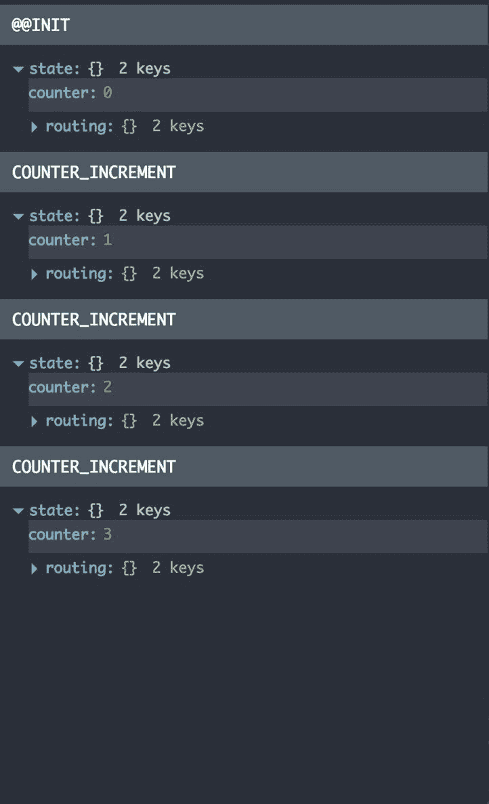

太棒了，我们在 Redux 中有一个静态应用程序！现在是时候使用 Falcor 从我们的 MongoDB 数据库中获取数据了。


# Falcor 的基本概念

Falcor 就像是连接器：

+   后端及其数据库结构（记得将`initData.js`导入到 MongoDB 中）

+   前端 Redux 单状态树容器

它以比为单页面应用构建老式 REST API 更有效的方式将这些部分粘合在一起。

就像*Redux 基本概念*部分一样，在这一部分中，我们将只学习 Falcor 的最基本概念，它们将帮助我们在*只读*模式下构建一个简单的全栈应用程序。在本书的后面，你将学习如何使用 Falcor 添加/编辑文章。

我们将专注于最重要的方面：

+   Falcor 的模型是什么？

+   从 Falcor 中检索值（前端和后端）

+   JSON 图的概念和基本用法

+   哨兵的概念和基本用法

+   如何从后端检索数据

+   如何为 Express.js 配置我们的第一个路由中间件

`falcor-router`

# Falcor 是什么，为什么我们需要在我们的全栈发布应用程序中使用它？

让我们首先考虑一下网页和 Web 应用程序之间的区别是什么：

+   当**万维网**（**WWW**）被发明时，网页提供了大量的大资源（如 HTML、PDF 和 PNG 文件）。例如，你可以从服务器请求 PDF、视频或文本文件。

+   自*大约 2008 年*以来，Web 应用程序的开发越来越受欢迎。Web 应用程序提供大量的小资源。这对我们意味着什么？你需要使用 AJAX 调用向服务器发出大量小的 REST API 调用。许多 API 请求的旧方法会导致延迟，从而减慢移动/Web 应用程序的速度。

为什么我们在 2016 年及以后编写的应用程序中使用旧的 REST API 请求（就像我们在 2005 年所做的那样）？这就是 Falcor 的闪光之处；它解决了后端与前端的耦合和延迟问题。

# 紧耦合和延迟与到处都是一个模型

如果你熟悉前端开发，你就知道如何向 API 发出请求。这种老式的做法总是迫使你将后端 API 与前端 API 工具紧密耦合。它总是这样的：

1.  你可以创建一个 API 端点，比如[`applicationDomain.com/api/recordDetails?id=92`](https://applicationDomain.com/api/recordDetails?id=92)。

1.  你在前端使用 HTTP API 请求来消耗数据：

```jsx
        { 

            id: '92', 

            title: 'example title', 

            content: 'example content' 

        }

```

在大型应用程序中，很难维护真正 DRY 的 RESTful API，这个问题导致了许多未经优化的端点，因此前端有时必须进行多次往返，以获取某个视图所需的数据（有时它获取的数据甚至比它需要的更多，这会导致应用程序的最终用户遇到更多的延迟）。

想象一下，你有一个包含 50 多个不同 API 端点的大型应用程序。在第一个版本的应用程序完成后，你的客户或老板发现了一种更好的方式来构建应用程序中的用户流程。这意味着什么？这意味着你必须修改前端和后端端点，以满足用户界面层的变化。这就是前端和后端之间的紧耦合。

Falcor 在这种情况下带来了什么，以改进使用 RESTful API 时的这两个引起低效的领域？答案是一个模型在任何地方。

如果所有数据都可以在客户端内存中访问，构建 Web 应用程序将会非常容易。

Falcor 提供了一些实用工具，帮助你感觉所有的数据都近在咫尺，而无需编写后端 API 端点和客户端消费工具。

# 不再有客户端和服务器端的紧耦合

Falcor 帮助你将应用程序的所有数据表示为服务器上的一个虚拟 JSON 模型。

在客户端编程时，Falcor 让你感觉好像整个应用程序的 JSON 模型都可以在本地访问，并且允许你以与从内存中的 JSON 读取数据相同的方式读取数据--你很快就会学会的！

由于 Falcor 为浏览器提供了库和`falcor-express`中间件，你可以按需从云端检索模型上的数据。

Falcor 透明地处理所有网络通信，并使你的客户端应用程序与服务器和数据库保持同步。

在本章中，我们还将学习如何使用`falcor-router`。

# 客户端 Falcor

让我们首先从 NPM 安装 Falcor：

```jsx
pwd 

/Users/przeor/Desktop/React-Convention-Book 

npm i --save falcor@0.1\. 

16 falcor-http-datasource@0.1.3 

```

`falcor-http-datasource`帮助我们从服务器端到客户端检索数据，开箱即用（无需担心 HTTP API 请求）--当将客户端模型移至后端时，我们将使用这个。

让我们在客户端创建我们应用的 Falcor 模型：

```jsx
cd src

touch falcorModel.js

```

然后`falcorModel.js`的内容将如下所示：

```jsx
import falcor from 'falcor';  

import FalcorDataSource from 'falcor-http-datasource'; 

let cache = { 

  articles: [ 

    { 

        id: 987654, 

        articleTitle: 'Lorem ipsum - article one', 

        articleContent: 'Here goes the content of the article' 

    }, 

    { 

        id: 123456, 

        articleTitle: 'Lorem ipsum - article two from backend', 

        articleContent: 'Sky is the limit, the content goes here.' 

    } 

  ] 

}; 

const model = new falcor.Model({ 

'cache': cache 

}); 

export default model;

```

在这段代码中，你可以找到我们发布应用程序的一个众所周知、简洁、可读的模型，其中包含两篇文章。

现在我们将从前端 Falcor 的模型中获取这些数据，在我们的`src/layouts/PublishingApp.js` React 组件中，我们将添加一个名为`_fetch()`的新函数，它将负责在应用启动时获取所有文章。

我们需要先导入我们的 Falcor 模型，因此在`PublishingApp.js`文件的顶部，我们需要添加以下内容：

```jsx
import falcorModel from '../falcorModel.js';

```

在我们的`PublishingApp`类中，我们需要添加以下两个函数；`componentWillMount`和`_fetch`（更多解释如下）：

```jsx
class PublishingApp extends React.Component { 

  constructor(props) { 

    super(props); 

  } 

  componentWillMount() { 

    this._fetch(); 

  } 

  async _fetch() { 

    const articlesLength = await falcorModel. 

      getValue('articles.length'). 

      then((length) => length ); 

    const articles = await falcorModel. 

      get(['articles', {from: 0, to: articlesLength-1},  

      ['id','articleTitle', 'articleContent']])  

      .then((articlesResponse) => articlesResponse.json.articles); 

  } 

  // below here are next methods o the PublishingApp

```

在这里，您可以看到名为`_fetch`的异步函数。这是一种特殊的语法，允许您像在使用`let articlesLength = await falcorModel`和`let articles = await falcorModel`时一样使用`await`关键字。

使用`async await`覆盖 Promises 意味着我们的代码更易读，并避免了回调地狱的情况，其中嵌套多个回调使代码非常难以阅读和扩展。

`async`/`await`功能取自 ECMAScript 7，受 C#启发。它允许您编写函数，这些函数在等待结果之前似乎被阻塞在每个异步操作上，然后才继续进行下一个操作。

在我们的示例中，代码将执行如下：

1.  首先，它将调用 Falcor 的模式来获取文章计数，如下所示：

```jsx
        const articlesLength = await falcorModel. 

          getValue('articles.length'). 

          then( (length) =>  length );

```

1.  在文章的`Length`变量中，我们将从我们的模型中获得`articles.length`的计数（在我们的情况下将是数字二）。

1.  在我们知道我们的模型中有两篇文章之后，下一块代码执行如下：

```jsx
        let articles = await falcorModel. 

          get(['articles', {from: 0, to: articlesLength-1},

          ['id','articleTitle', 'articleContent']]).  

          then( (articlesResponse) => articlesResponse.json.articles);

```

`falcorModel.get(['articles', {from: 0, to: articlesLength-1}, ['id','articleTitle', 'articleContent']]).`上的`get`方法也是一个异步操作（与`http 请求`一样）。在`get`方法的参数中，我们提供了我们模型中文章的位置（在`src/falcorModel.js`中），因此我们提供了以下路径：

```jsx
falcorModel.get( 

['articles', {from: 0, to: articlesLength-1}, ['id','articleTitle', 'articleContent']] 

)

```

前面 Falcor 路径的解释是基于我们的模型。让我们再次调用它：

```jsx
{ 

  articles: [ 

    { 

        id: 987654, 

        articleTitle: 'Lorem ipsum - article one', 

        articleContent: 'Here goes the content of the article' 

    }, 

    { 

        id: 123456, 

        articleTitle: 'Lorem ipsum - article two from backend', 

        articleContent: 'Sky is the limit, the content goes here.' 

    } 

  ] 

}

```

我们对 Falcor 说：

1.  首先，我们想使用以下内容从我们的对象中获取`articles`的数据：

```jsx
        ['articles']

```

1.  接下来，从`articles`集合中选择所有文章的子集，范围为`{from: 0, to: articlesLength-1}`（我们之前获取的`articlesLength`），路径如下：

```jsx
        ['articles', {from: 0, to: articlesLength-1}]

```

1.  最后一步是告诉 Falcor，你想从我们的模型中获取对象的哪些属性。因此，在`falcorModel.get`查询中的完整路径如下：

```jsx
        ['articles', {from: 0, to: articlesLength-1},   

        ['id','articleTitle', 'articleContent']]

```

1.  `['id','articleTitle', 'articleContent']`数组表示你想要从每篇文章中获取这三个属性。

1.  最后，我们从 Falcor 中接收到一组文章对象的数组：

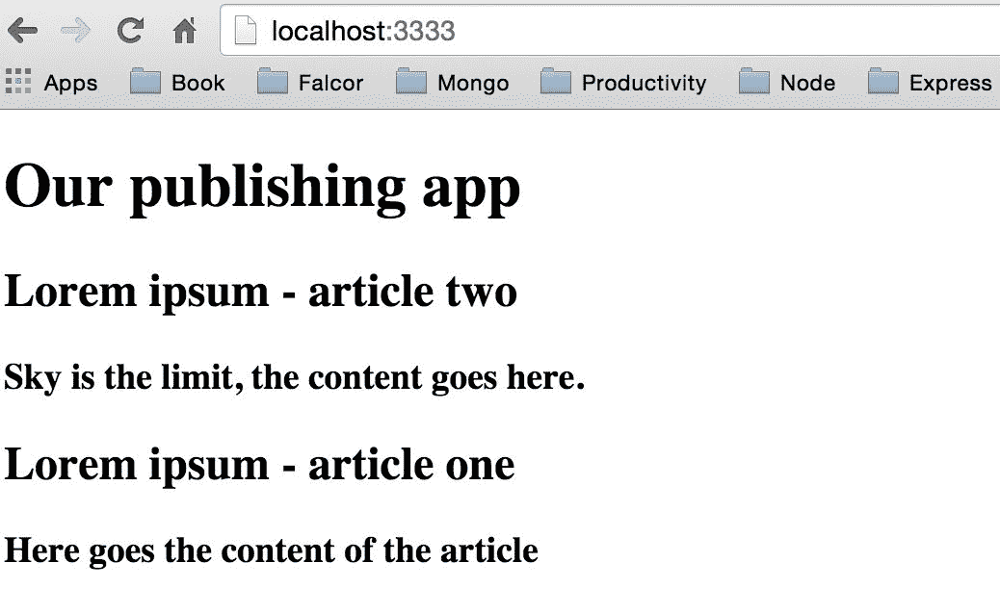

在从我们的 Falcor 模型中获取数据之后，我们需要 dispatch 一个 action，该 action 将相应地改变文章的 reducer，并最终重新渲染我们的文章列表，从`const articleMock`（在`src/reducers/article.js`中）中获取。

但在我们能够 dispatch 一个 action 之前，我们需要做以下事情：

创建`actions`目录，并在其中创建`article.js`：

```jsx
pwd 

$ /Users/przeor/Desktop/React-Convention-Book 

cd src 

mkdir actions 

cd actions 

touch article.js 

```

创建我们的`src/actions/article.js`文件的内容如下：

```jsx
export default { 

  articlesList: (response) => { 

    return { 

      type: 'ARTICLES_LIST_ADD', 

      payload: { response: response } 

    } 

  } 

}

```

在`actions/article.js`文件中并没有太多内容。如果你已经熟悉了 FLUX，那么它非常相似。Redux 中一个重要的规则是 actions 必须是纯函数。现在，我们将在`actions/article.js`中硬编码一个名为`ARTICLES_LIST_ADD`的常量。

在`src/layouts/PublishingApp.js`文件中，我们需要在文件顶部添加一个新的 import 代码：

```jsx
import {bindActionCreators} from 'redux'; 

import articleActions from '../actions/article.js';

```

当你在我们的`PublishingApp`中添加了上述两个之后，然后修改同一文件中现有的函数如下：

```jsx
const mapDispatchToProps = (dispatch) => ({ 

});

```

添加`articleActions: bindActionCreators(articleActions, dispatch)`，这样我们就能将文章的 actions 绑定到我们的`this.props`组件中：

```jsx
const mapDispatchToProps = (dispatch) => ({ 

  articleActions: bindActionCreators(articleActions, dispatch) 

});

```

由于在我们的组件中进行了上述更改（`articleActions: bindActionCreators(articleActions, dispatch)`），我们现在能够从 props 中 dispatch 一个 action，因为现在当你使用`this.props.articleActions.articlesList(articles)`时，从 Falcor 获取的`articles`对象将在我们的 reducer 中可用（从那里，我们只需一步就能让我们的应用程序获取数据工作）。

现在，在完成这些更改后，在`_fetch`函数中为我们的组件添加一个 action：

```jsx
this.props.articleActions.articlesList(articles);

```

我们的整个获取函数将如下所示：

```jsx
 async _fetch() { 

    const articlesLength = await falcorModel. 

      getValue('articles.length'). 

      then( (length) => length); 

    let articles = await falcorModel. 

      get(['articles', {from: 0, to: articlesLength-1},  

      ['id','articleTitle', 'articleContent']]).  

      then( (articlesResponse) => articlesResponse.json.articles); 

    this.props.articleActions.articlesList(articles); 

  }

```

同时，不要忘记从`ComponentWillMount`中调用`_fetch`：

```jsx
 componentWillMount() { 

    this._fetch(); 

  }

```

在这一点上，我们应该能够在 Redux 的 reducer 中接收一个 action。让我们改进我们的`src/reducers/article.js`文件：

```jsx
const article = (state = {}, action) => { 

    switch (action.type) { 

        case 'RETURN_ALL_ARTICLES': 

            return Object.assign({}, state); 

        case 'ARTICLES_LIST_ADD': 

            return Object.assign({}, action.payload.response); 

        default: 

            return state; 

    } 

} 

export default article

```

正如你所看到的，我们不再需要`articleMock`，所以我们已经从`src/reducers/article.js`中删除了它。

我们添加了一个新的 case，`ARTICLES_LIST_ADD`：

```jsx
   case 'ARTICLES_LIST_ADD': 

        let articlesList = action.payload.response; 

        return Object.assign({}, articlesList);

```

它返回一个新的`articlesList`对象（通过`Object.assign`得到一个新的内存引用）。

不要混淆两个具有相同名称和其他位置的文件，比如：

`reducers/article.js`

`actions/article.js`

您需要确保您正在编辑正确的文件，否则应用程序将无法正常工作。

# 客户端 Falcor + Redux 的摘要

如果您运行`http://localhost:3000/index.html`，您将看到，目前我们有两个单独的应用程序：

+   一个在前端使用 Redux 和客户端 Falcor

+   一个在后端使用 MongoDB，Mongoose 和 Express

我们需要将它们合并在一起，这样我们就有了一个应用程序的状态来源（来自 MongoDB）。

# 将 Falcor 的模型移至后端

我们还需要更新我们的`package.json`文件：

```jsx
"scripts": { 

  "dev": "webpack-dev-server", 

  "start": "npm run webpack; node server", 

  "webpack": "webpack --config ./webpack.config.js" 

},

```

因为我们正在开始全栈开发部分，我们需要在`package.json`的脚本中添加`npm start` --这将帮助编译客户端代码，将它们放入`dist`文件夹（通过 webpack 生成），并在`dist`中创建静态文件，然后使用此文件夹作为静态文件的来源（检查`server/server.js`中的`app.use(express.static('dist'));`）。

下一个重要的事情是安装后端所需的新依赖项：

```jsx
npm i --save falcor-express@0.1.2 falcor-router@0.2.12

```

当您最终安装了新的依赖项并配置了在同一端口上运行后端和前端的基本脚本后，然后编辑`server/server.js`如下：

1.  在我们的文件顶部，在`server/server.js`中导入新的库：

```jsx
        import falcor from 'falcor'; 

        import falcorExpress from 'falcor-express';

```

1.  然后在以下两者之间：

```jsx
        app.use(bodyParser.json({extended: false})); 

 app.use(express.static('dist'));

```

1.  在后端添加管理 Falcor 的新代码：

```jsx
        app.use(bodyParser.json({extended: false})); 

        let cache = { 

          articles: [ 

            { 

                id: 987654, 

                articleTitle: 'Lorem ipsum - article one', 

                articleContent: 'Here goes the content of the article' 

            }, 

            { 

                id: 123456, 

                articleTitle: 'Lorem ipsum - article two from          

                backend', 

                articleContent: 'Sky is the limit, the content goes          

                here.' 

            } 

          ] 

        }; 

        var model = new falcor.Model({ 

          cache: cache 

        }); 

        app.use('/model.json', falcorExpress.dataSourceRoute((req,               

        res) => { 

            return model.asDataSource(); 

        })); 

        app.use(express.static('dist'));

```

1.  前面的代码几乎与`src/falcorModel.js`文件中的代码相同。唯一的区别是现在 Falcor 将从后端的模拟对象`server.js`中的`cache`中获取数据。

1.  第二部分是在前端更改我们的数据来源，所以在`src/falcorModel.js`文件中，更改以下旧代码：

```jsx
        import falcor from 'falcor'; 

        import FalcorDataSource from 'falcor-http-datasource'; 

        let cache = { 

          articles: [ 

          { 

            id: 987654, 

            articleTitle: 'Lorem ipsum - article one', 

            articleContent: 'Here goes the content of the article' 

          }, 

          { 

            id: 123456, 

            articleTitle: 'Lorem ipsum - article two from backend', 

            articleContent: 'Sky is the limit, the content goes here.' 

          } 

         ] 

        }; 

        const model = new falcor.Model({ 

        'cache': cache 

        }); 

        export default model;

```

1.  将其更改为以下更新后的代码：

```jsx
        import falcor from 'falcor'; 

        import FalcorDataSource from 'falcor-http-datasource'; 

        const model = new falcor.Model({ 

          source: new FalcorDataSource('/model.json') 

        }); 

        export default model;

```

1.  使用以下命令运行您的应用程序：

```jsx
 npm start

```

1.  您将在浏览器的开发工具中看到 Falcor 发出的新的 HTTP 请求--例如，在我们的情况下：

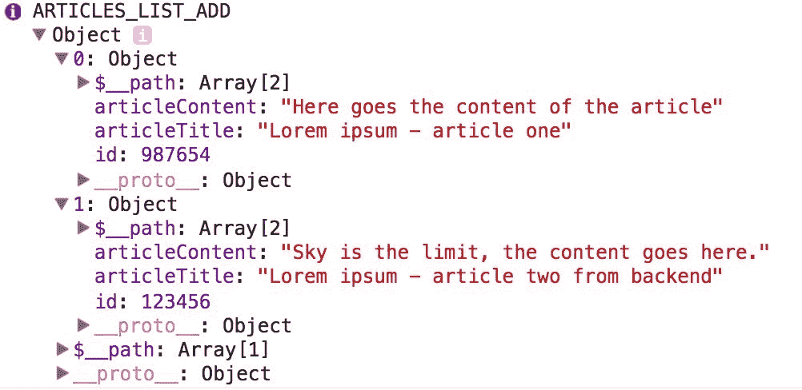

如果您正确地遇到所有指示，那么您也可以通过执行以下操作直接从浏览器向服务器发出请求：

```jsx
http://localhost:3000/model.json?paths=[["articles", {"from":0,"to":1},   

["articleContent","articleTitle","id"]]]&method=get.

```

然后您将在响应中看到`jsonGraph`：

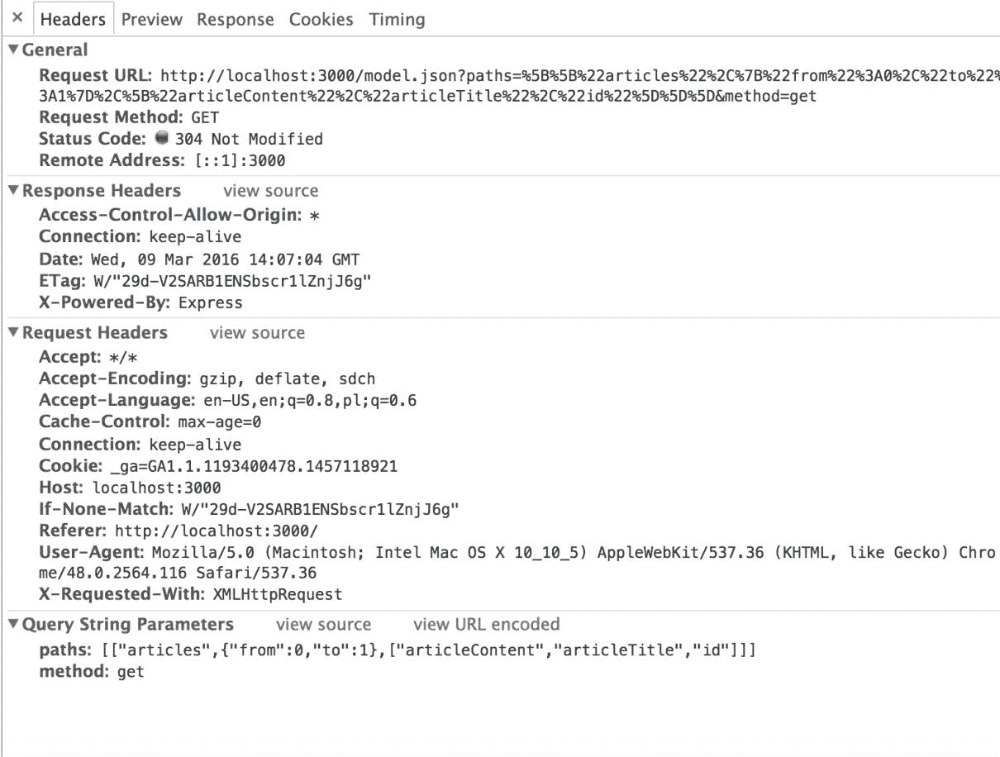

不必担心前两个屏幕截图。它们只是展示了 Falcor 在后端和前端之间如何使用 Falcor 语言进行通信的示例。您不必再担心暴露 API 端点并编程前端以了解后端提供的数据。Falcor 已经在开箱即用中完成了所有这些工作，您将在制作此发布应用程序时了解更多细节。

# 配置 Falcor 的路由器（Express.js）

目前，我们后端的模型是硬编码的，因此它保留在服务器的 RAM 内存中。我们需要添加从我们的 MongoDB 文章集合中读取数据的能力--这就是`falcor-router`派上用场的地方。

我们需要创建将被`falcor-router`库使用的路由定义文件：

```jsx
$ pwd 

/Users/przeor/Desktop/React-Convention-Book 

$ cd server 

$ touch routes.js 

```

我们已经创建了`server/routes.js`文件；该路由器的内容将如下所示：

```jsx
const PublishingAppRoutes = [{ 

  route: 'articles.length', 

  get: () => { 

    const articlesCountInDB = 2; // hardcoded for example 

    return { 

      path: ['articles', 'length'], 

      value: articlesCountInDB 

    }; 

  } 

}]; 

export default PublishingAppRoutes;

```

正如您所看到的，我们已经创建了我们的第一个路线，它将匹配我们在`layouts/PublishingApp.js`中的`_fetch`函数中的`articles.length`。

我们在`articlesCountInDB`中硬编码了数字 2，稍后我们将向数据库发出查询。

这里的新东西是`route: 'articles.length'`，这只是 Falcor 匹配的一个路线。

更准确地说，Falcor 路由的路径与您在`src/layouts/PublishingApp.js（_fetch 函数）`中提供的内容完全相同，例如，为了匹配此前端调用：

```jsx
 // location of that code snippet: src/layouts/PublishingApp.js 

 const articlesLength = await falcorModel. 

    getValue('articles.length'). 

    then((length) => length);

```

+   `path: ['articles', 'length']`：此属性告诉我们 Falcor 的路径（它在后端和前端被 Falcor 使用）。我们需要提供这个，因为有时，一个路线可以返回许多不同的对象作为服务器文章（您将在我们创建的下一个路线中看到）。

+   `value: articlesCountInDB`：这是一个返回值。在这种情况下，它是一个整数，但稍后您还将了解它也可以是一个具有多个属性的对象。

# 返回我们两篇文章的第二条路线

我们的第二条路线（也是本章的最后一条）将是以下内容：

```jsx
{ 

  route: 'articles[{integers}]["id","articleTitle","articleContent"]', 

  get: (pathSet) => { 

    const articlesIndex = pathSet[1]; 

    const articlesArrayFromDB = [{ 

    'articleId': '987654', 

    'articleTitle': 'BACKEND Lorem ipsum - article one', 

    'articleContent': 'BACKEND Here goes the content of the article' 

    }, { 

    'articleId': '123456', 

    'articleTitle': 'BACKEND Lorem ipsum - article two', 

    'articleContent': 'BACKEND Sky is the limit, the content goes here.' 

    }]; // That are our mocked articles from MongoDB 

    let results = []; 

    articlesIndex.forEach((index) => { 

      const singleArticleObject = articlesArrayFromDB[index]; 

      const falcorSingleArticleResult = { 

        path: ['articles', index], 

        value: singleArticleObject 

      }; 

      results.push(falcorSingleArticleResult); 

    }); 

    return results; 

  } 

}

```

第二条路线中的新东西是`pathSet`，如果将其记录到控制台中，那么您将看到，在我们的情况下（尝试运行我们的全栈应用程序时）：

```jsx
[  

'articles', 

  [ 0, 1 ], 

  [ 'articleContent', 'articleTitle', 'id' ]  

]

```

`pathSet`告诉我们客户端请求的索引是什么（在我们的示例中是`[0, 1]`）。

因为在这种情况下，我们返回的是一组文章（多篇文章），我们需要创建一个结果变量：

```jsx
let results = [];

```

遍历请求的索引：

```jsx
articlesIndex.forEach((index) => { 

   const singleArticleObject = articlesArrayFromDB[index]; 

   const falcorSingleArticleResult = { 

     path: ['articles', index], 

     value: singleArticleObject 

   }; 

   results.push(falcorSingleArticleResult); 

 });

```

在上述代码片段中，我们遍历了请求的索引数组（您还记得`{from: 0, to: articlesLength-1}`在`PublishingApp.js`中吗？）。基于索引`([0, 1])`，我们通过`const singleArticleObject = articlesArrayFromDB[index];`获取了模拟数据。稍后，我们将其放入`path`和`index`（`path: ['articles', index]`），这样 Falcor 就知道`singleArticleObject`的值属于我们的 JSON 图对象中的哪个路径。

返回文章数组：

```jsx
console.info(results) 

 return results;

```

`console.info`将向我们显示该路径返回了什么：

```jsx
[{ 

  path: ['articles', 0], 

  value: { 

    articleId: '987654', 

    articleTitle: 'BACKEND Lorem ipsum - article one', 

    articleContent: 'BACKEND Here goes the content of the article' 

  } 

}, { 

  path: ['articles', 1], 

  value: { 

    articleId: '123456', 

    articleTitle: 'BACKEND Lorem ipsum - article two', 

    articleContent: 'BACKEND Sky is the limit, the content goes here.' 

  } 

}]

```

# 最后一步是使全栈 Falcor 运行

目前，我们的路由中仍然有模拟数据，但在我们开始调用 MongoDB 之前，我们需要完成当前的设置，这样您就可以在浏览器中看到它运行。

打开您的`server/server.js`，确保您导入了以下两个内容：

```jsx
import falcorRouter from 'falcor-router'; 

import routes from './routes.js';

```

现在我们已经导入了我们的`falcor-router`和`routes.js`，我们需要使用它们，所以修改这段旧代码：

```jsx
// This is old code, remove it and replace with new 

app.use('/model.json', falcorExpress.dataSourceRoute((req, res) =>  { 

  return model.asDataSource(); 

}));

```

将上述代码替换为：

```jsx
app.use('/model.json', falcorExpress.dataSourceRoute((req, res) => { 

 return new falcorRouter(routes); 

}));

```

这将仅在`falcor-router`已经安装并在`server.js`文件中导入时起作用。这是一个用于在应用服务器上创建虚拟 JSON 图文档的`DataSource`库。正如您在`server.js`中所看到的，到目前为止，我们已经通过我们的硬编码模型提供了`DataSource`，`return model.asDataSource();`。这里的路由器将做同样的事情，但现在您将能够根据应用程序的要求匹配路由。

另外，正如您所看到的，新的`falcorRouter`接受我们的路由作为参数`return new falcorRouter(routes);`。

如果您正确地按照说明操作，您将能够运行该项目：

```jsx
npm start

```

在端口`3000`上，您将看到以下内容：

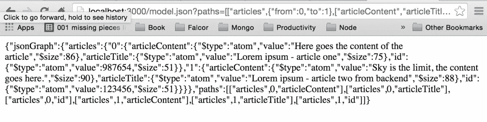

# 基于 Falcor 路由的 MongoDB/Mongoose 调用

让我们回到我们的`server/routes.js`文件。我们需要将以下代码移动（从`server.js`中删除并移动到`routes.js`）：

```jsx
// this goes to server/routes.js 

import mongoose from 'mongoose'; 

mongoose.connect('mongodb://localhost/local'); 

const articleSchema = { 

  articleTitle:String, 

  articleContent:String 

}; 

const Article = mongoose.model('Article', articleSchema, 'articles');

```

在第一个路由`articles.length`中，您需要将模拟的数字 2（文章计数）替换为 Mongoose 的`count`方法：

```jsx
 route: 'articles.length', 

    get: () => { 

    return Article.count({}, (err, count) => count) 

    .then ((articlesCountInDB) => { 

      return { 

        path: ['articles', 'length'], 

        value: articlesCountInDB 

      } 

    }) 

  }

```

在`get`中返回一个 Promise（Mongoose，由于其异步性质，在进行任何数据库请求时总是返回一个 Promise，就像在示例中的`Article.count`一样）。

`Article.count`方法只是从我们的*Article*模型中检索文章计数的整数数字（这是在`MongoDB/Mongoose 子章节`的开始处准备的）。

第二个路由`route: 'articles[{integers}]["id","articleTitle","articleContent"]'`，必须更改如下：

```jsx
{ 

  route: 'articles[{integers}]["id","articleTitle","articleContent"]', 

  get: (pathSet) => { 

    const articlesIndex = pathSet[1]; 

    return Article.find({}, (err, articlesDocs) => articlesDocs) 

    .then ((articlesArrayFromDB) => { 

      let results = []; 

      articlesIndex.forEach((index) => { 

        const singleArticleObject =          

        articlesArrayFromDB[index].toObject(); 

        const falcorSingleArticleResult = { 

          path: ['articles', index], 

          value: singleArticleObject 

        }; 

        results.push(falcorSingleArticleResult); 

      }); 

      return results; 

    }) 

  } 

}

```

我们再次返回一个 Promise，使用`Article.find`。此外，我们已经从数据库中删除了模拟响应，而是使用`Article.find`方法。

文章数组在`}).then((articlesArrayFromDB) => {`中返回，然后我们简单地迭代并创建一个结果数组。

请注意，在`const singleArticleObject = articlesArrayFromDB[index].toObject();`中，我们使用了`.toObject`方法。这对于使其工作非常重要。


# 与服务器/routes.js 和 package.json 双重检查

为了节省您的时间，以防应用程序无法运行，我们可以再次检查后端的 Falcor 路由是否准备正确：

```jsx
import mongoose from 'mongoose'; 

mongoose.connect('mongodb://localhost/local'); 

const articleSchema = { 

  articleTitle:String, 

  articleContent:String 

}; 

const Article = mongoose.model('Article', articleSchema, 'articles'); 

const PublishingAppRoutes = [ 

  { 

    route: 'articles.length', 

      get: () =>  Article.count({}, (err, count) => count) 

        .then ((articlesCountInDB) => { 

          return { 

            path: ['articles', 'length'], 

            value: articlesCountInDB 

          }; 

      }) 

  }, 

  { 

    route: 'articles[{integers}]  

    ["id","articleTitle","articleContent"]', 

    get: (pathSet) => { 

      const articlesIndex = pathSet[1]; 

      return Article.find({}, (err, articlesDocs) =>         

      articlesDocs); 

       .then ((articlesArrayFromDB) => { 

          let results = []; 

          articlesIndex.forEach((index) => { 

            const singleArticleObject =              

            articlesArrayFromDB[index].toObject(); 

            const falcorSingleArticleResult = { 

              path: ['articles', index], 

              value: singleArticleObject 

            }; 

            results.push(falcorSingleArticleResult); 

          }); 

          return results; 

        }) 

      } 

  } 

]; 

export default PublishingAppRoutes;

```

检查您的`server/routes.js`文件是否与前面的代码和您使用的其他代码元素类似。

还要检查您的`package.json`是否与以下内容相似：

```jsx
{ 

"name": "project", 

"version": "1.0.0", 

"scripts": { 

"dev": "webpack-dev-server", 

"start": "npm run webpack; node server", 

"webpack": "webpack --config ./webpack.config.js" 

  }, 

"dependencies": { 

"body-parser": "¹.15.0", 

"cors": "².7.1", 

"express": "⁴.13.4", 

"falcor": "⁰.1.16", 

"falcor-express": "⁰.1.2", 

"falcor-http-datasource": "⁰.1.3", 

"falcor-router": "0.2.12", 

"mongoose": "4.4.5", 

"react": "⁰.14.7", 

"react-dom": "⁰.14.7", 

"react-redux": "⁴.4.0", 

"redux": "³.3.1" 

  }, 

"devDependencies": { 

"babel": "⁶.5.2", 

"babel-core": "⁶.6.5", 

"babel-loader": "⁶.2.4", 

"babel-polyfill": "⁶.6.1", 

"babel-preset-es2015": "⁶.6.0", 

"babel-preset-react": "⁶.5.0", 

"babel-preset-stage-0": "⁶.5.0", 

"webpack": "¹.12.14", 

"webpack-dev-server": "¹.14.1" 

  } 

}

```

关于`package.json`的重要事情是，我们已经从`"mongoose": "4.4.5"`中删除了`^`。我们这样做是因为如果 NPM 安装的版本高于`4.4.5`，那么我们会在 bash/命令行中收到警告。

# 我们的第一个工作的全栈应用程序

之后，您应该有一个完整的全栈应用程序版本运行：

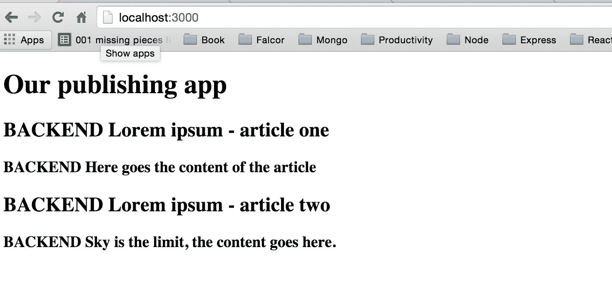

几乎在每一步，我们应用程序的 UI 部分都是相同的。前面的截图是发布应用程序，它执行以下操作：

1.  使用`Falcor-Express`和`Falcor-Router`从数据库中获取数据。

1.  数据从后端（源是 MongoDB）传输到前端。我们填充 Redux 的`src/reducers/article.js`状态树。

1.  我们根据我们的单一状态树渲染 DOM 元素。

1.  所有这些步骤都允许我们从数据库中获取所有全栈应用程序的数据，传输到用户的浏览器（用户可以看到一篇文章）。

# 总结

我们还没有开始设计应用程序，但在我们的书中，我们将使用 Material Design CSS for React（[`material-ui.com`](http://material-ui.com)）。在下一章中，我们将开始使用它进行用户注册和登录。之后，我们将使用 Material Design 的组件重新设计应用程序的主页面。

为了给你一个目标的提示（在阅读本书的过程中），这里有一个应用程序的截图，以及在接下来的章节中发布应用程序将如何改进：

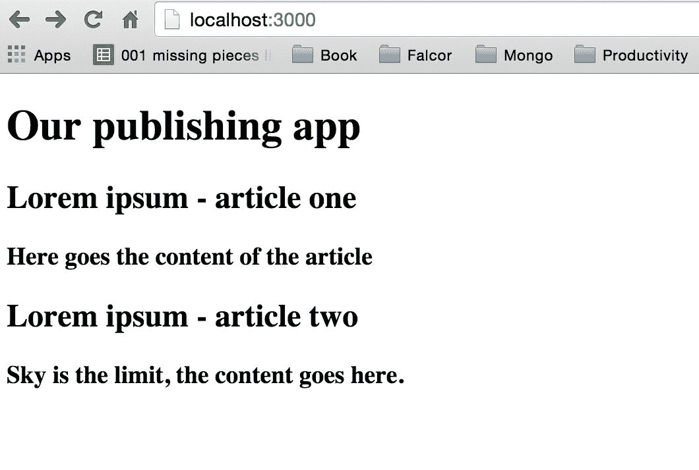

在上面的截图中，有一个来自我们应用程序的示例文章。我们正在使用几个 Material Design 组件，以使我们的工作更轻松，使发布应用程序看起来更专业。你以后会学到的。

你准备好在下一章为我们的发布应用程序开发全栈登录和注册功能了吗？让我们继续乐趣吧。
