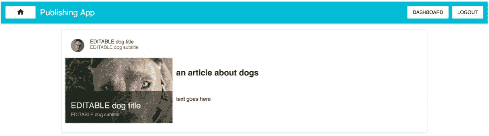
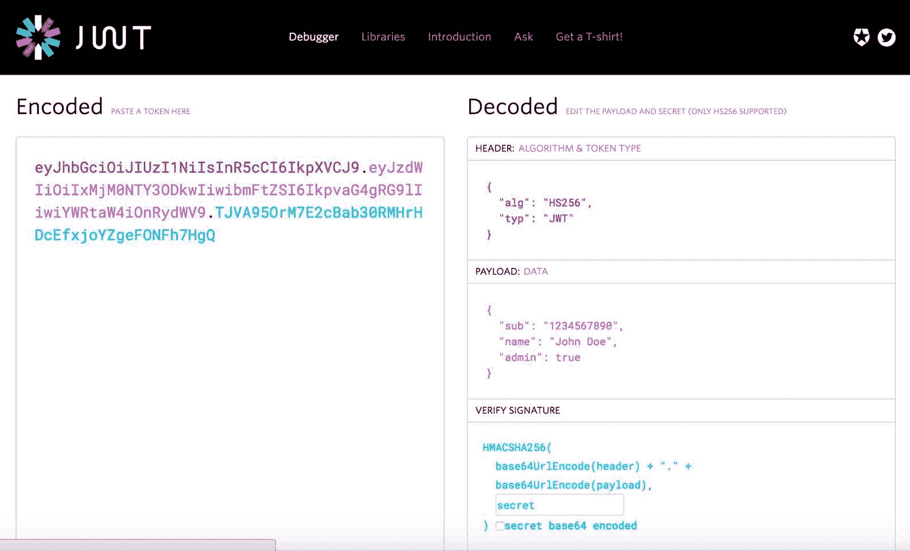
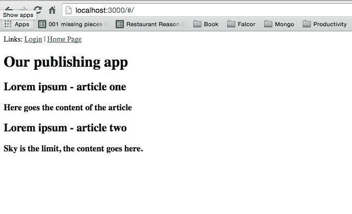
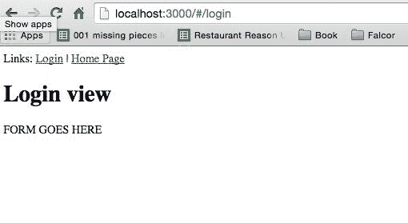
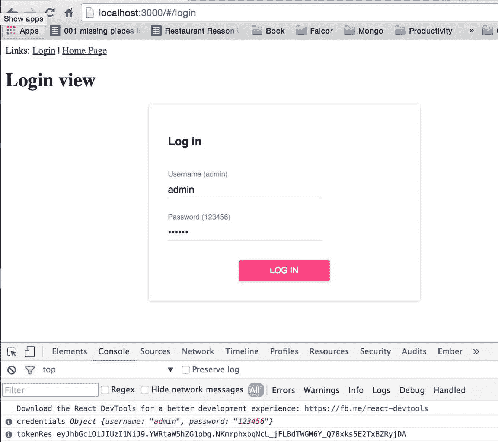
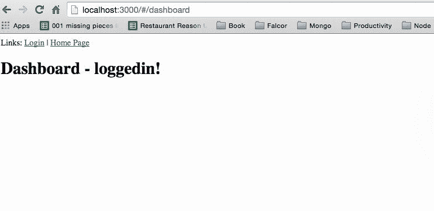

# 第二章：我们发布应用的全栈登录和注册

**JSON Web Token**（**JWT**）是一种相对较新但非常有效的安全令牌格式。它是一个开放标准（RFC 7519），在处理在 Web 应用程序环境中在各方之间传递声明的问题时，改进了 oAuth2 和 OpenID 连接。

在实践中，流程如下：

+   服务器分配一个编码的 JSON 对象

+   客户端收到警报后，将编码的令牌发送到服务器的每个请求

+   基于该令牌，服务器知道谁发送了请求

值得在开始使用之前，先访问[`jwt.io/`](http://jwt.io/)网站并进行操作：



成功登录后，JWT 解决方案会向我们的前端应用程序提供一个关于当前用户授权的对象：

```jsx
{'iss': 'PublishginAppIssuer','name': 'John Doe','admin':true}

```

`iss`是一个发布者属性--在我们的情况下，它将是我们发布应用的后端应用程序。已登录用户的名称是明显的--`John Doe`已成功登录。`admin`属性只是表示已识别用户（使用正确的登录名和密码登录到我们后端应用程序的用户）是管理员`('admin': true flag)`。您将在本章中学习如何使用它。

除了前面的例子中提到的内容，JWT 的响应还包含有关主题/声明、签名的 SHA256 生成的令牌和到期日期的信息。这里的重要规则是您必须确信您令牌的发布者。您需要信任响应中提供的内容。这可能听起来复杂，但在实际应用中非常简单。

重要的是，您需要保护 JWT 生成的令牌--这将在本章后面详细说明。

流程如下：

1.  我们的客户端发布应用从我们的 express 服务器请求令牌。

1.  发布后端应用程序向前端 Redux 应用程序发放令牌。

1.  之后，每次从后端获取数据时，我们都会检查用户是否有权限访问后端请求的资源--资源消耗令牌。

在我们的情况下，资源是 falcor-router 的路由，它与后端有密切关系，但在更分布式的平台上也可以工作。

请记住，JWT 令牌类似于私钥--您必须保护它们！

# JWT 令牌的结构

头部包含了后端需要的信息，用于识别基于该信息的加密操作（元数据、算法和使用的密钥）：

```jsx
{ 

'typ': 'JWT', 

'alg': 'HS256' 

}

```

总的来说，这部分完全是为我们准备好的，所以在实现时我们不必关心头部。

第二部分包括以 JSON 格式提供的声明，例如：

+   **发行人**：这让我们知道谁发行了令牌

+   **受众**：这让我们知道这个令牌必须被我们的应用程序消耗

+   **发布日期**：这让我们知道令牌何时被创建

+   **过期日期**：这让我们知道令牌何时将会过期，因此我们需要生成一个新的令牌

+   **主题**：这让我们知道应用的哪个部分可以使用令牌（在更大的应用程序中很有用）

除了这些声明，我们还可以创建由应用程序的创建者专门定义的自定义声明：

```jsx
{ 

'iss': 'http://theIssuerAddress', 

'exp': '1450819372', 

'aud': 'http://myAppAddress', 

'sub': 'publishingApp', 

'scope': ['read'] 

}

```

# 新的 MongoDB 用户集合

我们需要在数据库中创建一个用户集合。用户将拥有允许他们执行以下操作的特权：

+   在我们发布应用中添加新文章

+   编辑我们发布应用中的现有文章

+   删除我们发布应用中的文章

第一步是我们需要创建一个集合。您可以在 Robomongo 的 GUI 中执行此操作（在本书开头介绍），但我们将使用命令行。

首先，我们需要创建一个名为`initPubUsers.js`的文件：

```jsx
$ [[you are in the root directory of your project]]

$ touch initPubUsers.js

```

然后将以下内容添加到`initPubUsers.js`中：

```jsx
[ 

  { 

'username' : 'admin', 

'password' : 'c5a0df4e293953d6048e78bd9849ec0ddce811f0b29f72564714e474615a7852', 

'firstName' : 'Kamil', 

'lastName' : 'Przeorski', 

'email' : 'kamil@mobilewebpro.pl', 

'role' : 'admin', 

'verified' : false, 

'imageUrl' : 'http://lorempixel.com/100/100/people/' 

  } 

]

```

# 解释

SHA256 字符串`c5a0df4e293953d6048e78bd9849ec0ddce811f0b29f72564714e474615a7852`相当于一个密码 123456，其盐的字符串等于`pubApp`。

如果您想自己生成这个加盐密码哈希值，那么请访问[`www.xorbin.com/tools/sha256-hash-calculator`](http://www.xorbin.com/tools/sha256-hash-calculator)并在他们的网站上输入`123456pubApp`。您将会得到以下屏幕：



这些步骤只在开始时需要。后来我们需要为自己编写一个注册表单，用于对密码进行加盐。

# 将 initPubUsers.js 文件导入到 MongoDB

在我们的`initPubUsers.js`文件中有了正确的内容之后，我们可以运行以下命令行来将新的`pubUsers`集合导入到我们的数据库中：

```jsx
mongoimport --db local --collection pubUsers --jsonArrayinitPubUsers.js --host=127.0.0.1

```

您将获得与我们在第一章中导入文章后获得的相同的终端输出，*使用 Node.js、Express.js、MongoDB、Mongoose、Falcor 和 Redux 配置全栈* ，看起来类似于这样：

```jsx
2009-04-03T11:36:00.566+0200  connected to: 127.0.0.1

2009-04-03T11:36:00.569+0200  imported 1 document

```

# 正在处理登录的 falcor-route

现在我们需要开始使用 falcor-router 来创建一个新的端点，该端点将使用 JWT 库为客户端应用程序提供唯一令牌。

我们需要做的第一件事是在后端提供`secret`。

让我们创建`secret`端点的配置文件：

```jsx
$ cd server

$ touch configSecret.js

```

现在我们需要放入`secret`的内容：

```jsx
export default { 

'secret': process.env.JWT_SECRET || 'devSecretGoesHere' 

}

```

将来，我们将在生产服务器上使用环境变量，因此`process.env.JWT_SECRET || 'devSecretGoesHere'`的表示方式是环境变量`JWT_SECRET`不存在，因此使用默认的`secret`端点的`string,devSecretGoesHere`。在这一点上，我们不需要任何开发环境变量。

# 创建一个 falcor-router 的登录（后端）

为了使我们的代码库更有组织性，我们将创建一个名为`routesSession.js`的新文件，而不是将一个路由添加到我们的`server/routes.js`文件中，并在该文件中保存与当前登录用户会话相关的所有端点。

确保你在`server`目录中：

```jsx
$ cd server

```

首先打开`server.js`文件，以添加一行代码，该代码将允许您将用户名和密码发布到后端。添加这个：

```jsx
app.use(bodyParser.urlencoded({extended: false}));

```

这必须添加在`app.use(bodyParser.json({extended: false}));`下，因此您将得到以下开头的`server.js`代码：

```jsx
import http from 'http'; 

import express from 'express'; 

import cors from 'cors'; 

import bodyParser from 'body-parser'; 

import mongoose from 'mongoose'; 

import falcor from 'falcor'; 

import falcorExpress from 'falcor-express'; 

import Router from 'falcor-router'; 

import routes from './routes.js'; 

var app = express(); 

app.server = http.createServer(app); 

// CORS - 3rd party middleware 

app.use(cors()); 

// This is required by falcor-express middleware to work correctly with falcor-browser 

app.use(bodyParser.json({extended: false})); 

app.use(bodyParser.urlencoded({extended: false})); 

```

最后一行是必须添加的新行，以使其正常工作。然后在同一目录中创建一个新文件：

```jsx
$ touch routesSession.js 

```

并将这个初始内容放入`routesSession.js`文件中：

```jsx
export default [ 

  {  

    route: ['login'] , 

    call: (callPath, args) => 

      { 

      const { username, password } = args[0]; 

      const userStatementQuery = { 

          $and: [ 

              { 'username': username }, 

              { 'password': password } 

          ] 

        } 

      } 

  } 

];

```

# 调用路由的工作原理

我们刚刚在`routesSession.js`文件中创建了一个初始调用登录路由。我们将使用`'call'(**call: async (callPath, args) => **)`而不是使用 GET 方法。这相当于旧的 RESTful 方法中的 POST。

Falcor 路由中调用和获取方法的区别在于我们可以使用`args`提供参数。这允许我们从客户端获取用户名和密码：

计划是在我们收到凭据后：

```jsx
const { username, password } = args[0];

```

然后我们将使用一个用户管理员来检查它们是否与我们的数据库匹配。用户需要知道真实的明文密码是`123456`才能获得正确的登录 JWT 令牌：

在这一步中，我们还准备了一个`userStatementQuery`，在以后查询数据库时将使用它：

```jsx
const userStatementQuery = { 

  $and: [ 

      { 'username': username }, 

      { 'password': password } 

  ] 

}

```


# 分离 DB 配置 - configMongoose.js

我们需要将 DB 配置从`routes.js`中分离出来：

```jsx
$ [[we are in the server/ directory]]

$ touch configMongoose.js

```

以及它的新内容：

```jsx
import mongoose from 'mongoose'; 

const conf = { 

  hostname: process.env.MONGO_HOSTNAME || 'localhost', 

  port: process.env.MONGO_PORT || 27017, 

  env: process.env.MONGO_ENV || 'local', 

}; 

mongoose.connect(&grave;mongodb://${conf.hostname}:  

${conf.port}/${conf.env}&grave;); 

const articleSchema = { 

articleTitle:String, 

articleContent:String 

}; 

const Article = mongoose.model('Article', articleSchema,  

'articles'); 

export default { 

  Article 

};

```

# 解释

我们刚刚引入了以下新的`env`变量：`MONGO_HOSTNAME`，`MONGO_PORT`和`MONGO_ENV`。我们将在准备生产环境时使用它们。

`mongodb://${conf.hostname}:${conf.port}/${conf.env}` 表达式使用了自 EcmaScript6 起可用的模板特性。

`configMongoose.jsconfig`的其余部分将为您所知，因为我们在第一章中介绍过它，*使用 Node.js、Express.js、MongoDB、Mongoose、Falcor 和 Redux 配置全栈*。

# 改进 routes.js 文件

在我们创建了两个新文件`configMongoose.js`和`routesSession.js`之后，我们必须改进我们的`server/routes.js`文件，以使一切协同工作。

第一步是从`routes.js`中删除以下代码：

```jsx
import mongoose from 'mongoose'; 

mongoose.connect('mongodb://localhost/local'); 

const articleSchema = { 

articleTitle:String, 

articleContent:String 

}; 

const Article = mongoose.model('Article', articleSchema,  

'articles');

```

用以下新代码替换它：

```jsx
import configMongoosefrom './configMongoose'; 

import sessionRoutes from './routesSession'; 

const Article = configMongoose.Article;

```

此外，我们需要将`sessionRoutes`扩展到我们当前的`PublishingAppRoutes`中，如下所示：

```jsx
const PublishingAppRoutes =  

    ...sessionRoutes, 

  { 

  route: 'articles.length',

```

在`PublishingAppRoutes`的开头，您需要扩展`...sessionRoutes`，`routes`，以便登录路由可以在整个 Falcor 路由中使用。

# 解释

我们摆脱了帮助我们运行第一个 Mongoose 查询的旧代码，该查询正在获取文章，并将一切移动到`configMongoose`中，以便我们可以在项目中的不同文件中使用它。我们还导入了会话路由，然后使用`...`扩展操作将它们扩展到名为`PublishingAppRoutes`的数组中。

# 在实现 JWT 之前检查应用程序是否正常工作

此时，当执行`npm start`时，应用程序应该正常工作并显示文章列表：

![

当使用`npm start`运行时，您应该获得以下信息，以验证一切是否正常工作：

```jsx
Hash: eeeb09711c820a7978d5 

Version2,: webpack 1.12.14 

Time: 2609ms 

 Asset    Size  Chunks             Chunk Names 

app.js  1.9 MB       0  [emitted]  main 

   [0] multi main 40 bytes {0} [built] 

    + 634 hidden modules 

Started on port 3000

```

# 创建一个 Mongoose 用户模型

在文件`configMongoose.js`中，我们需要创建并导出一个`User`模型。将以下代码添加到该文件中：

```jsx
const userSchema = { 

'username' : String, 

'password' : String, 

'firstName' : String, 

'lastName' : String, 

'email' : String, 

'role' : String, 

'verified' : Boolean, 

'imageUrl' : String 

}; 

const User = mongoose.model('User', userSchema, 'pubUsers'); 

export default { 

  Article, 

  User 

};

```

# 解释

`userSchema`描述了我们用户的 JSON 模型。用户是我们 Mongoose 模型，指向我们 MongoDB 中的`pubUsers`集合。最后，通过将其添加到默认导出对象中，我们导出了`User`模型。

# 在`routesSession.js`文件中实现 JWT

第一步是通过在文件顶部添加一个`import`语句，将我们的`User`模型导出到`routesSession`范围内：

```jsx
import configMongoosefrom './configMongoose'; 

const User = configMongoose.User;

```

安装`jsonwebtoken`和`crypto`（用于 SHA256）：

```jsx
$ npmi --save jsonwebtoken crypto

```

安装了`jsonwebtoken`之后，我们需要将其导入到`routesSession.js`中：

```jsx
import jwt from 'jsonwebtoken'; 

import crypto from 'crypto'; 

import jwtSecret from './configSecret';

```

在`routesSession`中导入了所有内容之后，继续处理`route: ['login']`。

你需要改进`userStatementQuery`，使其具有`saltedPassword`而不是明文：

```jsx
const saltedPassword = password+'pubApp';  

// pubApp is our salt string 

const saltedPassHash = crypto 

.createHash('sha256') 

.update(saltedPassword) 

.digest('hex'); 

const userStatementQuery = { 

  $and: [ 

      { 'username': username }, 

      { 'password': saltedPassHash } 

  ] 

}

```

因此，我们将查询盐化的 SHA256 密码，而不是明文。

在`userStatementQuery`下，返回 Promise，并提供以下细节：

```jsx
return User.find(userStatementQuery, function(err, user) { 

   if (err) throw err; 

 }).then((result) => { 

   if(result.length) { 

     return null;  

     // SUCCESSFUL LOGIN mocked now (will implement next) 

   } else { 

     // INVALID LOGIN 

     return [ 

       { 

         path: ['login', 'token'],  

         value: "INVALID" 

       }, 

       { 

         path: ['login', 'error'],  

         value: "NO USER FOUND, incorrect login  

         information" 

       } 

     ]; 

   } 

   return result; 

 });

```

# 解释

`User.find`是来自 Mongoose 用户模型的 Promise（我们在`configMongoose.js`中创建的）--这是一个标准方法。然后，我们提供`userStatementQuery`作为第一个参数，它是带有用户名和密码的过滤对象：`(*{ username, password } = args[0];)`。

接下来，我们提供一个在查询完成时的回调函数：`(function(err, user) {)`。我们使用`if(result.length) {`来计算结果的数量。

如果`result.length=== 0`，那么我们已经模拟了`return`语句，并且我们正在运行`else`代码，返回如下内容：

```jsx
 return [ 

    { 

      path: ['login', 'token'],  

      value: "INVALID" 

    }, 

    { 

      path: ['login', 'error'],  

      value: 'NO USER FOUND, incorrect login  

      information' 

    } 

  ];

```

正如你将在后面了解到的，我们将在前端请求该令牌的路径，`['login', 'token']`。在这种情况下，我们没有找到正确的用户名和提供的密码，因此我们返回`"INVALID"`字符串，而不是 JWT 令牌。路径`['login', 'error']`更详细地描述了错误的类型，以便可以向提供了无效登录凭据的用户显示消息。

# 在 falcor-route 上成功登录

我们需要改进成功登录路径。我们已经处理了无效登录的情况；我们需要处理一个成功登录的情况，所以替换这段代码：

```jsx
return null; // SUCCESSFUL LOGIN mocked now (will implement next)

```

使用这段代码返回成功登录的详细信息：

```jsx
const role = result[0].role; 

const userDetailsToHash = username+role; 

const token = jwt.sign(userDetailsToHash, jwtSecret.secret); 

return [ 

  { 

    path: ['login', 'token'], 

    value: token 

  }, 

  { 

    path: ['login', 'username'], 

    value: username 

  }, 

  { 

    path: ['login', 'role'], 

    value: role 

  }, 

  { 

    path: ['login', 'error'], 

    value: false 

  } 

];

```

# 解释

正如你所看到的，我们现在从数据库中获取的唯一东西是角色`value === result[0].role`。我们需要将这个添加到哈希中，因为我们不希望我们的应用程序容易受到攻击，以至于普通用户可以通过一些黑客手段获得管理员角色。令牌的值是基于`userDetailsToHash = username+role`计算的---现在就够了。

在我们对此满意之后，后端需要做的唯一事情就是返回带有值的路径：

+   带有`['login', 'token']`的登录令牌

+   用户名为`['login', 'username']`

+   已登录用户的角色为`['login', 'role']`

+   没有任何错误的信息为`['login', 'error']`

下一步是在前端使用这个路由。运行应用程序，如果一切正常，我们可以开始在前端编码。


# 前端和 Falcor

让我们为 Redux 应用程序中的登录创建一个新路由。为此，我们需要引入`react-router`：

```jsx
$ npmi --save react-router@1.0.0redux-simple-router@0.0.10redux-thunk@1.0.0

```

使用正确的 NPM 版本很重要，否则会出现问题！

安装完它们后，我们需要在`src`中添加路由：

```jsx
$ cd src

$ mkdir routes

$ cd routes

$ touch index.js

```

然后将`index.js`文件的内容设置如下：

```jsx
import React  from 'react'; 

import {Route, IndexRoute} from 'react-router'; 

import CoreLayout  from '../layouts/CoreLayout'; 

import PublishingApp  from '../layouts/PublishingApp'; 

import LoginView  from '../views/LoginView'; 

export default ( 

<Route component={CoreLayout} path='/'> 

<IndexRoute component={PublishingApp} name='home' /> 

<Route component={LoginView} path='login' name='login' /> 

</Route> 

);

```

此时，我们的应用程序缺少两个组件，即`CoreLayout`和`LoginView`（我们将在一分钟内实现它们）。

# CoreLayout 组件

`CoreLayout`组件是整个应用程序的包装器。通过执行以下操作创建它：

```jsx
cd ../layouts/ 

touch CoreLayout.js 

```

然后，使用以下内容填充它：

```jsx
import React from 'react'; 

import {Link} from 'react-router'; 

class CoreLayout extends React.Component { 

  static propTypes = { 

    children : React.PropTypes.element 

  } 

  render () { 

    return ( 

<div> 

<span> 

Links: <Link to='/login'>Login</Link> |  

<Link to='/'>Home Page</Link> 

</span> 

<br/> 

          {this.props.children} 

</div> 

    ); 

  } 

} 

export default CoreLayout;

```

如你所知，当前路由的所有内容将进入`{this.props.children}`目标（这是一个你必须事先了解的`basicReact.JS`概念）。我们还创建了两个链接到我们路由的链接作为页眉。

# LoginView 组件

目前，我们将创建一个模拟的`LoginView`组件。让我们创建`views`目录：

```jsx
$ pwd

$ [[[you shall be at the src folder]]]

$ mkdir views

$ cd views

$ touch LoginView.js

```

`LoginView.js`文件的内容如下所示，其中包含`FORM GOES HERE`占位符：

```jsx
import React from 'react'; 

import Falcor from 'falcor'; 

import falcorModel from '../falcorModel.js'; 

import {connect} from 'react-redux'; 

import {bindActionCreators} from 'redux'; 

const mapStateToProps = (state) => ({ 

  ...state 

}); 

// You can add your reducers here 

const mapDispatchToProps = (dispatch) => ({}); 

class LoginView extends React.Component { 

  render () { 

    return ( 

<div> 

<h1>Login view</h1> 

          FORM GOES HERE 

</div> 

    ); 

  } 

} 

export default connect(mapStateToProps, mapDispatchToProps)(LoginView);

```

我们已经完成了`routes/index.js`中所有缺失的部分，但在我们的应用程序与路由开始工作之前，还有一些其他未完成的工作。

# 我们应用程序的根容器

因为我们的应用程序变得更加复杂，我们需要创建一个容器来存放它。为此，让我们在`src`位置执行以下操作：

```jsx
$ pwd

$ [[[you shall be at the src folder]]]

$ mkdir containers

$ cd containers

$ touch Root.js

```

`Root.js`将成为我们的主要根文件。该文件的内容如下：

```jsx
import React  from 'react'; 

import {Provider}  from 'react-redux'; 

import {Router}  from 'react-router'; 

import routes   from '../routes'; 

import createHashHistory  from 'history/lib/createHashHistory'; 

const noQueryKeyHistory = createHashHistory({ 

queryKey: false 

}); 

export default class Root extends React.Component { 

  static propTypes = { 

    history : React.PropTypes.object.isRequired, 

    store   : React.PropTypes.object.isRequired 

  } 

  render () { 

    return ( 

<Provider store={this.props.store}> 

<div> 

<Router history={noQueryKeyHistory}> 

            {routes} 

</Router> 

</div> 

</Provider> 

    ); 

  } 

}

```

目前它只是一个简单的容器，但以后我们将为其实现更多的调试功能、热重载等。`noQueryKeyHistory`告诉路由器，我们不希望在 URL 中有任何随机字符串，因此我们的路由看起来会更好看（这不是什么大问题，你可以将 false 标志更改为 true，看看我在说什么）。

# configureStore 和 rootReducer 的其余配置

让我们首先创建`rootReducer`。为什么我们需要它？因为在更大的应用程序中，您总是会有许多不同的 reducer；例如，在我们的应用程序中，我们将有诸如以下的 reducer：

+   文章的 reducer：保留与文章相关的内容（`返回所有文章`等）

+   会话的 reducer：与我们用户的会话相关（`登录`，`注册`等）

+   编辑器的 reducer：与编辑器的操作相关（`编辑文章`，`删除文章`，`添加新文章`等）

+   路由的 reducer：这将管理我们路由的状态（开箱即用，因为它由 redux-simple-router 的外部库管理）

让我们在我们的`reducers`目录中创建一个`index.js`文件：

```jsx
$ pwd

$ [[[you shall be at the src folder]]]

$ cd reducers

$ touch index.js

```

`index.js`的内容如下：

```jsx
import {combineReducers} from 'redux'; 

import {routeReducer} from 'redux-simple-router'; 

import article  from './article'; 

export default combineReducers({ 

  routing: routeReducer, 

  article 

});

```

这里的新事物是我们引入了 Redux 的`combineReducers`函数。这正是我之前写的。我们将有多个 reducer---在我们的情况下，我们还引入了来自 redux-simple-router 库的`routeReducer`。

下一步是创建`configureStore`，它将管理我们的 store，并且为了在本书后面实现服务器渲染：

```jsx
$ pwd

$ [[[you shall be at the src folder]]]

$ mkdir store

$ cd store

$ touch configureStore.js

```

`configureStore.js`文件的内容如下：

```jsx
import rootReducer  from '../reducers'; 

import thunk  from 'redux-thunk'; 

import {applyMiddleware,compose,createStore} from 'redux'; 

export default function configureStore (initialState, debug =  

false) { 

let createStoreWithMiddleware; 

const middleware = applyMiddleware(thunk); 

createStoreWithMiddleware = compose(middleware); 

const store = createStoreWithMiddleware(createStore)( 

rootReducer, initialState 

  ); 

  return store; 

}

```

在上述代码中，我们正在导入我们最近创建的`rootReducer`。我们还导入了非常适用于服务器端渲染的`redux-thunk`库（稍后在本书中描述）。

最后，我们导出一个由许多不同的 reducer 组成的 store（当前包括路由和文章的 reducer，您可以在`reducer/index.js`中找到），并且能够处理服务器渲染的初始状态。

# 在运行应用程序之前，对 layouts/PublishingApp.js 进行最后的调整

我们应用程序中最后改变的一件事是我们的发布应用程序中有过时的代码。

为什么它已经过时？因为我们引入了`rootReducer`和`combineReducers`。因此，如果您在这里渲染`PublishingApp`的代码，它将无法工作：

```jsx
let articlesJSX = []; 

for(let articleKey in this.props) { 

const articleDetails = this.props[articleKey]; 

const currentArticleJSX = ( 

<div key={articleKey}> 

<h2>{articleDetails.articleTitle}</h2> 

<h3>{articleDetails.articleContent}</h3> 

</div>); 

articlesJSX.push(currentArticleJSX); 

}

```

您需要将其更改为这样：

```jsx
let articlesJSX = []; 

for(let articleKey in this.props.article) { 

const articleDetails = this.props.article[articleKey]; 

const currentArticleJSX = ( 

<div key={articleKey}> 

<h2>{articleDetails.articleTitle}</h2> 

<h3>{articleDetails.articleContent}</h3> 

</div>); 

articlesJSX.push(currentArticleJSX); 

}

```

你看到了区别吗？旧的`for(let articleKey in this.props)`已经改变成了`for(let articleKey in this.props.article)`，而`this.props[articleKey]`已经改变成了`this.props.article[articleKey]`。为什么？我再次提醒：现在每个新的 reducer 都将通过在`routes/index.js`中创建的名称在我们的应用程序中可用。我们将我们的 reducer 命名为 article，所以我们现在必须将其添加到`this.props.article`中，以使这些内容一起工作。

# 在运行应用程序之前，在 src/app.js 中进行的最后更改

最后一件事是改进 `src/app.js`，使其使用根容器。我们需要更改旧代码：

```jsx
// old codebase, to improve: 

import React from 'react' 

import { render } from 'react-dom' 

import { Provider } from 'react-redux' 

import { createStore } from 'redux' 

import article from './reducers/article' 

import PublishingApp from './layouts/PublishingApp' 

const store = createStore(article) 

render( 

<Provider store={store}> 

<PublishingApp store={store} /> 

</Provider>, 

document.getElementById('publishingAppRoot') 

);

```

我们需要将前面的代码更改为以下内容：

```jsx
import React from 'react'; 

import ReactDOM from 'react-dom'; 

import createBrowserHistory from 'history/lib/createBrowserHistory'; 

import {syncReduxAndRouter} from 'redux-simple-router'; 

import Root from './containers/Root'; 

import configureStore from './store/configureStore'; 

const target  = document.getElementById('publishingAppRoot'); 

const history = createBrowserHistory(); 

export const store = configureStore(window.__INITIAL_STATE__); 

syncReduxAndRouter(history, store); 

const node = ( 

<Root 

      history={history} 

      store={store}  /> 

); 

ReactDOM.render(node, target);

```

我们开始使用 `Root` 而不是直接使用 `Provider`，我们需要将 store 和 history 的 props 发送到 `Root` 组件。`***export const store = configureStore(window.__INITIAL_STATE__)***` 部分是为了服务器端渲染，我们将在接下来的章节中添加。我们还使用 history 库来管理浏览器的历史记录。

# 我们运行应用程序的屏幕截图

当前，当您执行 `npm start` 时，您将看到以下两个路由。

# 首页



# 登录视图



# 工作在调用后端进行身份验证的登录表单上

好的，所以在准备工作方面我们做了很多工作，拥有了一个可扩展的项目结构（`routes`，`rootReducer`，`configStores` 等等）。

为了使我们的应用程序从用户角度更加友好，我们将开始使用 Material Design CSS。为了使我们在表单方面的工作更加轻松，我们将开始使用 `formsy-react` 库。让我们安装它：

```jsx
$ npm i --save material-ui@0.14.4formsy-react@0.17.0

```

在撰写本书时，Material UI 的版本 .20.14.4 是最佳选择；我选择了这个版本，因为生态系统变化如此之快，最好在这里标记使用的版本，这样您在遵循本书中的说明时就不会有任何意外。

`formsy-react` 库是一个非常方便的库，它将帮助我们验证发布应用程序中的表单。我们将在登录和注册等页面上使用它，您将在接下来的页面上看到。


# 工作在 LoginForm 和 DefaultInput 组件上

在安装新依赖项后，让我们创建一个文件夹，用于保存与哑组件相关的文件（这些组件没有访问任何存储库；它们通过回调与我们应用程序的其他部分进行通信---您以后会更多了解这一点）：

```jsx
$ pwd

$ [[[you shall be at the src folder]]]

$ mkdir components

$ cd components

$ touch DefaultInput.js

```

然后将此文件的内容设置为如下：

```jsx
import React from 'react'; 

import {TextField} from 'material-ui'; 

import {HOC} from 'formsy-react'; 

class DefaultInput extends React.Component { 

  constructor(props) { 

    super(props); 

    this.changeValue = this.changeValue.bind(this); 

    this.state = {currentText: null} 

  } 

changeValue(e) { 

this.setState({currentText: e.target.value}) 

this.props.setValue(e.target.value); 

this.props.onChange(e); 

  } 

  render() { 

    return ( 

<div> 

<TextField 

          ref={this.props.name} 

          floatingLabelText={this.props.title} 

          name={this.props.name} 

          onChange={this.changeValue} 

          required={this.props.required} 

          type={this.props.type} 

          value={this.state.currentText ?  

          this.state.currentText : this.props.value} 

          defaultValue={this.props.defaultValue} /> 

        {this.props.children} 

</div>); 

  } 

}; 

export default HOC(DefaultInput);

```

# 解释

来自`formsy-react`的`{HOC}`是另一种用于装饰组件的方式（在 React 的 ECMAScript5 中称为`mixin`）通过`export default HOC(DefaultInput)`--您可以在[`github.com/christianalfoni/formsy-react/blob/master/API.md#formsyhoc`](https://github.com/christianalfoni/formsy-react/blob/master/API.md#formsyhoc)找到更多关于此的信息。

我们还使用来自`material-ui`的`TextField`；然后它接受不同的属性。以下是属性：

+   `ref`：我们希望为每个输入与其名称（用户名和电子邮件）设置`ref`。

+   `floatingLabelText`：这是一个漂亮的浮动文本（称为标签）。

+   `onChange`：这告诉函数的名称，在有人在 TextField 中输入时必须调用它。

+   `required`：这有助于我们管理表单中所需的输入。

+   `value`：这当然是我们 TextField 的当前值。

+   `defaultValue`：这是一个初始值。非常重要的是要记住，当组件调用组件的构造函数时，它只调用一次。

当前文本（`this.state.currentText`）是`DefaultInput`组件的值---它会随着`TextFieldonChange`属性中给定的回调在每次`changeValue`事件中的新值而改变。

# LoginForm 并使其与 LoginView 配合使用

下一步是创建`LoginForm`。这将使用`DefaultInput`组件和以下命令：

```jsx
$ pwd

$ [[[you shall be at the components folder]]]

$ touch LoginForm.js

```

然后我们的`src/components/LoginForm.js`文件的内容如下：

```jsx
import React from 'react'; 

import Formsy from 'formsy-react'; 

import {RaisedButton, Paper} from 'material-ui'; 

import DefaultInput from './DefaultInput'; 

export class LoginForm extends React.Component { 

  constructor() { 

    super(); 

  } 

  render() { 

    return ( 

<Formsy.FormonSubmit={this.props.onSubmit}> 

<Paper zDepth={1} style={{padding: 32}}> 

<h3>Log in</h3> 

<DefaultInput 

onChange={(event) => {}}  

name='username' 

title='Username (admin)' 

required /> 

<DefaultInput 

onChange={(event) => {}}  

type='password' 

name='password' 

title='Password (123456)' 

required /> 

<div style={{marginTop: 24}}> 

<RaisedButton 

              secondary={true} 

              type="submit" 

              style={{margin: '0 auto', display: 'block', width:  

              150}} 

              label={'Log in'} /> 

</div> 

</Paper> 

</Formsy.Form> 

    ); 

  } 

}

```

在上述代码中，我们有一个使用`DefaultInput`组件的`LoginForm`组件。这是一个简单的`React.js`表单，提交后调用`this.props.onSubmit` --这个`onSubmit`函数将在稍后在`src/views/LoginView.js`智能组件中定义。我不会过多讨论组件上的附加样式，因为如何样式化取决于您--您将在稍后看到我们应用程序的应用样式的屏幕截图。

# 改进 src/views/LoginView.js

在运行我们的应用程序之前，在这个阶段我们开发的最后一部分是改进`LoginView`组件。

在`src/views/LoginView.js`中进行以下更改。导入我们的新`LoginForm`组件：

```jsx
import {LoginForm} from '../components/LoginForm.js'; 

Add a new constructor of that component: 

 constructor(props) { 

    super(props); 

    this.login = this.login.bind(this); 

    this.state = { 

      error: null 

    }; 

  }

```

然后在导入和构造函数完成后，您需要一个名为`login`的新函数：

```jsx
async login(credentials) { 

console.info('credentials', credentials); 

    await falcorModel 

      .call(['login'],[credentials]) 

      .then((result) =>result); 

const tokenRes = await falcorModel.getValue('login.token'); 

console.info('tokenRes', tokenRes); 

    return; 

  }

```

此时，`login`函数只会将我们的新 JWT 令牌打印到控制台--现在足够了；稍后我们将在此基础上构建更多。

这里的最后一步是改进我们的`render`函数：

```jsx
 render () { 

    return ( 

<div> 

<h1>Login view</h1> 

          FORM GOES HERE 

</div> 

    ); 

  }

```

添加到新的函数中，如下所示：

```jsx
 render () { 

    return ( 

<div> 

<h1>Login view</h1> 

<div style={{maxWidth: 450, margin: '0 auto'}}> 

<LoginForm 

onSubmit={this.login} /> 

</div> 

</div> 

    ); 

  }

```

太棒了！现在我们完成了！运行`npm start`并在浏览器中运行后，您将看到以下内容：



正如您在浏览器控制台中所看到的，我们可以看到提交的凭据对象`(凭据对象{用户名："admin"，密码："123456"})`，还有从后端获取的令牌`(tokenRes eyJhbGciOiJIUzI1NiJ9.YWRtaW5hZG1pbg.NKmrphxbqNcL_jFLBdTWGM6Y_Q78xks5E2TxBZRyjDA)`。所有这些告诉我们，我们正在按照顺序在我们的发布应用程序中实现登录机制。

重要提示：如果出现错误，请确保在创建哈希时使用了`123456`密码。否则，请输入适合您情况的自定义密码。

# 制作 DashboardView 组件

在这一点上，我们有一个尚未完成的登录功能，但在继续工作之前，让我们创建一个简单的`src/views/DashboardView.js`组件，它将在成功登录后显示：

```jsx
$ pwd 

$ [[[you shall be at the views folder]]] 

$ touch DashboardView.js

```

添加一些简单的内容如下：

```jsx
import React from 'react'; 

import Falcor from 'falcor'; 

import falcorModel from '../falcorModel.js'; 

import { connect } from 'react-redux'; 

import { bindActionCreators } from 'redux'; 

import { LoginForm } from '../components/LoginForm.js'; 

const mapStateToProps = (state) => ({ 

  ...state 

}); 

// You can add your reducers here 

const mapDispatchToProps = (dispatch) => ({}); 

class DashboardView extends React.Component { 

render () { 

    return ( 

<div> 

<h1>Dashboard - loggedin!</h1> 

</div> 

    ); 

  } 

} 

export default connect(mapStateToProps, mapDispatchToProps)(DashboardView);

```

这是一个简单的组件，目前是静态的。稍后，我们将为其添加更多功能。

关于仪表板的最后一件事是在`src/routes/index.js`文件中创建一个新的路由：

```jsx
import DashboardView from '../views/DashboardView'; 

export default ( 

<Route component={CoreLayout} path='/'> 

<IndexRoute component={PublishingApp} name='home' /> 

<Route component={LoginView} path='login' name='login' /> 

<Route component={DashboardView} path='dashboard'   name='dashboard' /> 

</Route> 

);

```

我们刚刚添加了第二个路由，使用了 react-router 的配置。它使用位于`../views/DashboardView`文件中的`DashboardView`组件。

# 完成登录机制

在我们发布应用程序的这一点上，关于登录的最后改进仍在`src/views/LoginView.js`位置：

首先，让我们添加处理无效登录：

```jsx
console.info('tokenRes', tokenRes); 

if(tokenRes === 'INVALID') { 

    const errorRes = await falcorModel.getValue('login.error'); 

    this.setState({error: errorRes}); 

    return; 

} 

return;

```

我们添加了`if(tokenRes === 'INVALID')`，以便使用`this.setState({error: errorRes})`更新错误状态。

下一步是在`render`函数中添加`Snackbar`，它将向用户显示一种错误类型。在`LoginView`组件的顶部添加此导入：

```jsx
import { Snackbar } from 'material-ui';

```

然后，您需要按照以下方式更新`render`函数：

```jsx
<Snackbar 

  autoHideDuration={4000} 

  open={!!this.state.error} 

  message={this.state.error || ''}  

  onRequestClose={() => null} />

```

因此，在添加后，`render`函数将如下所示：

```jsx
render () { 

  return ( 

<div> 

<h1>Login view</h1> 

<div style={{maxWidth: 450, margin: '0 auto'}}> 

<LoginForm 

onSubmit={this.login} /> 

</div> 

<Snackbar autoHideDuration={4000} 

          open={!!this.state.error} 

          message={this.state.error || ''}  

onRequestClose={() => null} /> 

</div> 

  ); 

}

```

这里需要`SnackBar onRequestClose`，否则您将从 Material UI 的开发者控制台中收到警告。好的，我们正在处理登录错误，现在让我们处理成功的登录。

# 在 LoginView 组件中处理成功的登录

处理成功令牌的后端响应，添加登录功能：

```jsx
if(tokenRes === 'INVALID') { 

const errorRes = await falcorModel.getValue('login.error'); 

this.setState({error: errorRes}); 

      return; 

    }

```

处理正确响应的新代码如下：

```jsx
if(tokenRes) { 

const username = await falcorModel.getValue('login.username'); 

const role = await falcorModel.getValue('login.role'); 

localStorage.setItem('token', tokenRes); 

localStorage.setItem('username', username); 

localStorage.setItem('role', role); 

this.props.history.pushState(null, '/dashboard'); 

}

```

# 解释

在我们知道`tokenRes`不是`INVALID`并且不是未定义（否则向用户显示致命错误）之后，我们会按照一定的步骤进行：

我们从 Falcor 的模型中获取用户名`(await falcorModel.getValue('login.username'))`。我们获取用户的角色`(await falcorModel.getValue('login.role'))`。然后我们将后端的所有已知变量保存到`localStoragewith`中：

```jsx
localStorage.setItem('token', tokenRes); 

localStorage.setItem('username', username); 

localStorage.setItem('role', role);

```

同时，我们使用`this.props.history.pushState(null, '/dashboard')`将我们的用户发送到`/dashboard`路由。

# 关于 DashboardView 和安全性的一些重要说明

在这一点上，我们不会保护`DashboardView`，因为没有重要的东西需要保护---当我们在这条路线上增加更多资产/功能时，我们会在以后做这个，这本书的最后将是一个编辑者的仪表板，可以控制系统中的所有文章。

我们唯一剩下的步骤是将其变成一个`RegistrationView`组件。在这一点上，这条路线也将对所有人可用。在本书的后面，我们将制定一个机制，只有主管理员才能向系统中添加新的编辑者（并对其进行管理）。

# 开始新编辑者的注册工作

为了完成注册，让我们首先在 Mongoose 的配置文件中对用户方案进行一些更改，位置在`server/configMongoose.js`：

```jsx
const userSchema = { 

'username' : String, 

'password' : String, 

'firstName' : String, 

'lastName' : String, 

'email' : String, 

'role' : String, 

'verified' : Boolean, 

'imageUrl' : String 

};

```

到新方案如下：

```jsx
const userSchema = { 

'username' : { type: String, index: {unique: true, dropDups: true }}, 

'password' : String, 

'firstName' : String, 

'lastName' : String, 

'email' : { type: String, index: {unique: true, dropDups: true }}, 

'role' : { type: String, default: 'editor' }, 

'verified' : Boolean, 

'imageUrl' : String 

};

```

如您所见，我们已经为`username`和`email`字段添加了唯一索引。此外，我们为角色添加了默认值，因为我们集合中的下一个用户将是编辑者（而不是管理员）。

# 添加注册的 falcor-route

在位于`server/routesSession.js`的文件中，您需要添加一个新的路由（在登录路由旁边）：

```jsx
 {  

    route: ['register'], 

    call: (callPath, args) => 

      { 

        const newUserObj = args[0]; 

        newUserObj.password = newUserObj.password+'pubApp'; 

        newUserObj.password = crypto 

          .createHash('sha256') 

          .update(newUserObj.password) 

          .digest('hex'); 

          const newUser = new User(newUserObj); 

          return newUser.save((err, data) => { if (err) return err; }) 

          .then ((newRes) => { 

            /* 

              got new obj data, now let's get count: 

             */ 

             const newUserDetail = newRes.toObject(); 

            if(newUserDetail._id) { 

              return null; // Mocked for now 

            } else { 

              // registration failed 

              return [ 

                { 

                  path: ['register', 'newUserId'],  

                  value: 'INVALID' 

                }, 

                { 

                  path: ['register', 'error'],  

                  value: 'Registration failed - no id has been                                  

                  created' 

                } 

              ]; 

            } 

            return; 

          }).catch((reason) =>console.error(reason)); 

      } 

  }

```

这段代码实际上只是通过`const newUserObj = args[0]`从前端接收新用户的对象。

然后我们对密码进行加盐，我们将在数据库中存储：

```jsx
newUserObj.password = newUserObj.password+'pubApp'; 

newUserObj.password = crypto 

  .createHash('sha256') 

  .update(newUserObj.password) 

  .digest('hex');

```

然后我们通过`const newUser = new User(newUserObj)`从 Mongoose 创建一个新的用户模型，因为`newUser`变量是用户的新模型（尚未保存）。接下来我们需要用这段代码保存它：

```jsx
return newUser.save((err, data) => { if (err) return err; })

```

在保存到数据库并且 Promise 已经解决后，我们首先通过将 Mongoose 结果对象转换为简单的 JSON 结构来管理数据库中的无效条目，使用`const newUserDetail = newRes.toObject();`。

完成后，我们向 Falcor 的模型返回一个`INVALID`信息：

```jsx
 // registration failed 

    return [ 

      { 

        path: ['register', 'newUserId'],  

        value: 'INVALID' 

      }, 

      { 

        path: ['register', 'error'],  

        value: 'Registration failed - no id has been created' 

      }

```

所以，我们已经处理了来自 Falcor 的无效用户注册。下一步是替换这个：

```jsx
// you shall already have this in your codebase, just a recall 

if(newUserDetail._id) { 

  return null; // Mocked for now 

} 

The preceding code needs to be replaced with: 

if(newUserDetail._id) { 

const newUserId = newUserDetail._id.toString(); 

  return [ 

    { 

      path: ['register', 'newUserId'],  

      value: newUserId 

    }, 

    { 

      path: ['register', 'error'],  

      value: false  

    } 

  ]; 

}

```


# 解释

我们需要将新用户的 ID 转换为字符串，`newUserId = newUserDetail._id.toString()`（否则会破坏代码）。

如你所见，我们有一个标准的返回语句，与 Falcor 中的模型相辅相成。

快速回想一下，在后端正确返回后，我们将能够在前端请求这个值，如下所示：`const newUserId = await falcorModel.getValue(['register', 'newUserId']);`（这只是一个在客户端获取新`UserId`的示例--不要在你的代码中写入它，我们马上就会做）。

再多看几个例子，你就会习惯的。

# 前端实现（RegisterView 和 RegisterForm）

让我们首先创建一个组件，在前端管理注册表单，具有以下操作：

```jsx
$ pwd 

$ [[[you shall be at the components folder]]] 

$ touch RegisterForm.js 

```

该文件的内容将是：

```jsx
import React from 'react'; 

import Formsy from 'formsy-react'; 

import {RaisedButton, Paper} from 'material-ui'; 

import DefaultInput from './DefaultInput'; 

export class RegisterForm extends React.Component { 

  constructor() { 

    super(); 

  } 

  render() { 

    return ( 

<Formsy.FormonSubmit={this.props.onSubmit}> 

<Paper zDepth={1} style={{padding: 32}}> 

<h3>Registration form</h3> 

<DefaultInput 

  onChange={(event) => {}}  

  name='username' 

  title='Username' 

  required /> 

<DefaultInput 

  onChange={(event) => {}}  

  name='firstName' 

  title='Firstname' 

  required /> 

<DefaultInput 

  onChange={(event) => {}}  

  name='lastName' 

  title='Lastname' 

  required /> 

<DefaultInput 

  onChange={(event) => {}}  

  name='email' 

  title='Email' 

  required /> 

<DefaultInput 

  onChange={(event) => {}}  

  type='password' 

  name='password' 

  title='Password' 

  required /> 

<div style={{marginTop: 24}}> 

<RaisedButton 

              secondary={true} 

              type="submit" 

              style={{margin: '0 auto', display:                      

              'block', width: 150}} 

              label={'Register'} /> 

</div> 

</Paper> 

</Formsy.Form> 

    ); 

  } 

}

```

前面的注册组件创建了一个与`LoginForm`完全相同的表单。用户点击`Register`按钮后，它会发送一个回调到`src/views/RegisterView.js`组件（我们马上就会创建这个）。

请记住，在组件目录中，我们只保留 DUMB 组件，因此与应用程序的其余部分的所有通信必须通过回调来完成，就像这个例子中一样。

# RegisterView

让我们创建一个`RegisterView`文件：

```jsx
$ pwd 

$ [[[you shall be at the views folder]]] 

$ touch RegisterView.js

```

它的内容是：

```jsx
import React from 'react'; 

import falcorModel from '../falcorModel.js'; 

import { connect } from 'react-redux'; 

import { bindActionCreators } from 'redux'; 

import { Snackbar } from 'material-ui'; 

import { RegisterForm } from '../components/RegisterForm.js'; 

const mapStateToProps = (state) => ({  

  ...state  

}); 

const mapDispatchToProps = (dispatch) => ({});

```

这些是我们在智能组件中使用的标准内容（我们需要`falcorModel`来与后端通信，以及`mapStateToProps`和`mapDispatchToProps`来与我们的 Redux 存储/Reducer 通信）。

好的，注册视图还没有结束，接下来让我们添加一个组件：

```jsx
const mapDispatchToProps = (dispatch) => ({}); 

class RegisterView extends React.Component { 

  constructor(props) { 

    super(props); 

    this.register = this.register.bind(this); 

    this.state = { 

      error: null 

    }; 

  } 

  render () { 

    return ( 

<div> 

<h1>Register</h1> 

<div style={{maxWidth: 450, margin: '0 auto'}}> 

<RegisterForm 

onSubmit={this.register} /> 

</div> 

</div> 

    ); 

  } 

} 

export default connect(mapStateToProps, mapDispatchToProps)(RegisterView);

```

如前面的代码片段所示，我们缺少`register`函数，所以在`constructor`和`render`函数之间添加函数，如下所示：

```jsx
async register (newUserModel) {console.info("newUserModel",  newUserModel); 

    await falcorModel 

      .call(['register'],[newUserModel]) 

      .then((result) =>result); 

      const newUserId = await falcorModel.getValue(['register',  

      'newUserId']); 

    if(newUserId === 'INVALID') { 

      const errorRes = await falcorModel.getValue('register.error'); 

      this.setState({error: errorRes}); 

      return; 

    } 

    this.props.history.pushState(null, '/login'); 

  }

```

如你所见，`async register (newUserModel)`函数是异步的，并且对`await`友好。接下来，我们只是在控制台中记录用户提交的内容，`console.info("newUserModel", newUserModel)`。之后，我们使用调用查询 falcor-router：

```jsx
await falcorModel 

      .call(['register'],[newUserModel]) 

      .then((result) => result);

```

在调用路由器后，我们使用以下代码获取响应：

```jsx
const newUserId = await falcorModel.getValue(['register', 'newUserId']);

```

根据后端的响应，我们执行以下操作：

+   对于`INVALID`，我们正在获取并将错误消息设置到组件的状态中（`this.setState({error: errorRes}))`）

+   如果用户已经正确注册，那么我们有他们的新 ID，并且我们正在要求用户使用历史的 push 状态进行登录`（this.props.history.pushState(null, '/login');)`

我们没有在`routes/index.js`中为`RegisterView`创建路由，`CoreLayout`中也没有链接，因此我们的用户无法使用它。在`routes/index.js`中添加新的导入：

```jsx
import RegisterView from '../views/RegisterView';

```

然后添加一个路由，所以`routes/index.js`中的默认导出将如下所示：

```jsx
export default ( 

<Route component={CoreLayout} path='/'> 

<IndexRoute component={PublishingApp} name='home' /> 

<Route component={LoginView} path='login' name='login' /> 

<Route component={DashboardView} path='dashboard'  name='dashboard' /> 

<Route component={RegisterView} path='register' name='register' /> 

</Route> 

);

```

最后，在`src/layoutsCoreLayout.js`文件的`render`方法中添加一个链接：

```jsx
render () { 

    return ( 

<div> 

<span> 

   Links:<Link to='/register'>Register</Link>

  <Link to='/login'>Login</Link> 

  <Link to='/'>Home Page</Link> 

</span> 

  <br/> 

 {this.props.children} 

</div> 

    ); 

  }

```

在这一点上，我们应该能够使用这个表格进行注册：



# 总结

在下一章中，我们将开始处理应用程序的服务器端渲染。这意味着在每次对 Express 服务器的请求时，我们将根据客户端请求生成 HTML 标记。这个功能对于像我们这样的应用程序非常有用，其中网页加载速度对我们这样的用户非常重要。

您可以想象，大多数新闻网站都是为娱乐而设，这意味着我们潜在用户的注意力很短。加载速度很重要。也有一些观点认为，服务器端渲染也有助于搜索引擎优化的原因。

爬虫有更容易的方法来*读取*我们文章中的文本，因为它们不需要执行 JavaScript 来从服务器获取文本（与非服务器端渲染的单页面应用相比）。

至少有一件事是肯定的：如果您在文章发布应用程序上有服务器端渲染，那么谷歌可能会认为您关心应用程序的快速加载，因此它可能会给您一些不利于不关心服务器端渲染的完整单页面网站。
