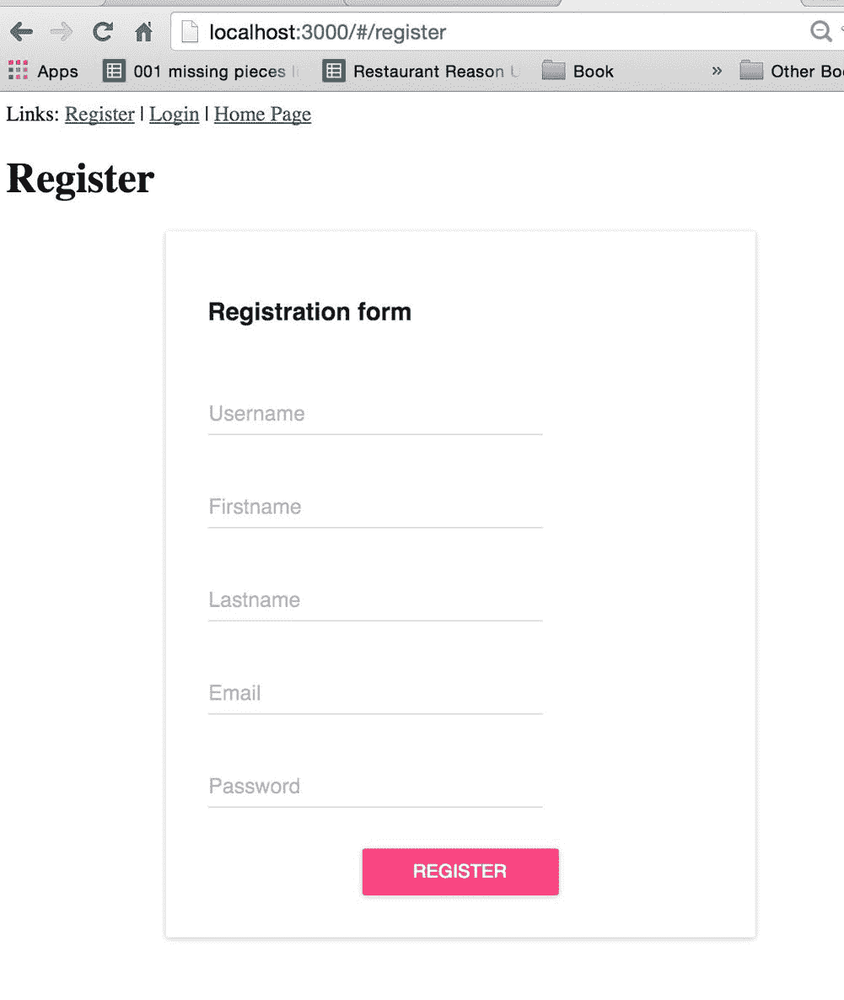
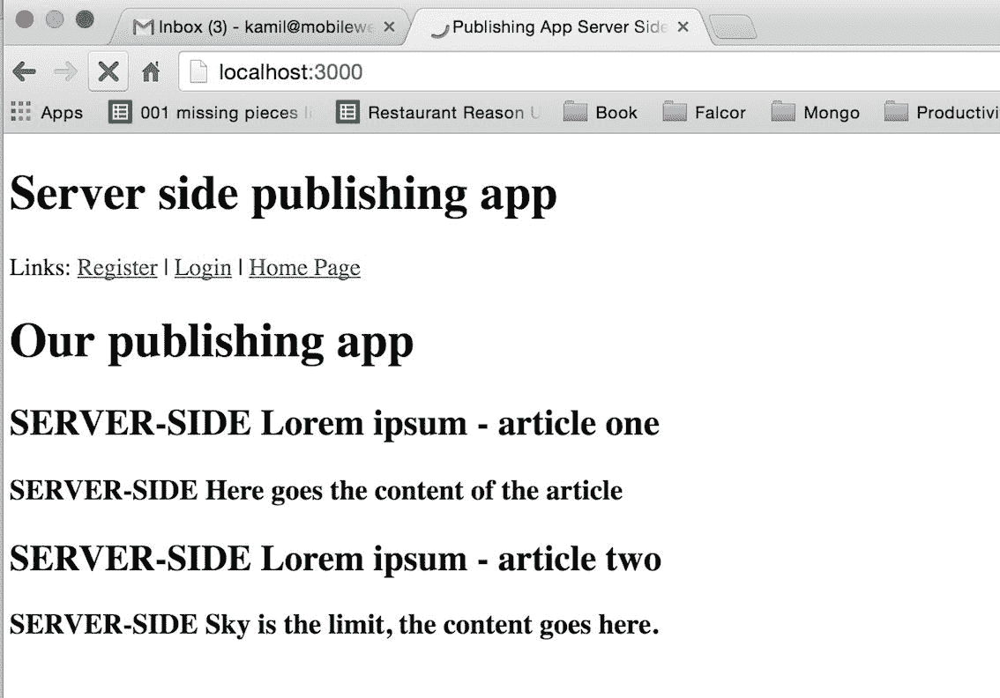
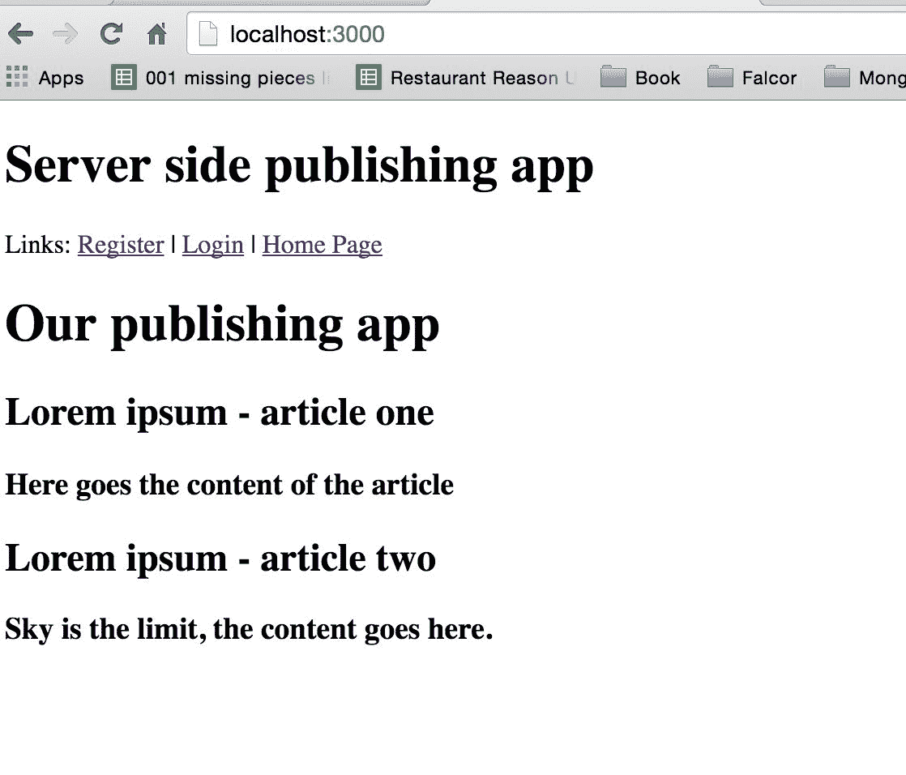

# 第三章：服务器端渲染

通用 JavaScript 或同构 JavaScript 是我们将在本章实现的一个功能的不同名称。更确切地说，我们将开发我们的应用程序，并在服务器端和客户端渲染应用程序的页面。这与主要在客户端渲染的**Angular1**或 Backbone 单页面应用程序不同。我们的方法在技术上更加复杂，因为您需要部署在服务器端渲染上工作的全栈技能，但拥有这种经验将使您成为一个更受欢迎的程序员，因此您可以将自己的职业发展到下一个水平--您将能够在市场上更高价地出售您的技能。

# 何时值得实施服务器端

服务器端渲染是文本内容（如新闻门户）初创公司的一个非常有用的功能，因为它有助于实现不同搜索引擎的更好索引。对于任何新闻和内容丰富的网站来说，这是一个必不可少的功能，因为它有助于增加有机流量。在本章中，我们还将使用服务器端渲染运行我们的应用程序。其他可能需要服务器端渲染的公司包括娱乐企业，用户对加载速度不耐烦，如果网页加载缓慢，他们可能会关闭浏览器。总的来说，所有面向消费者的应用程序都应该使用服务器端渲染来改善访问其网站的人的体验。

本章我们的重点将包括以下内容：

+   对整个服务器端代码进行重新排列，以准备进行服务器端渲染

+   开始使用 react-dom/server 及其`renderToString`方法

+   `RoutingContext`和 react-router 在服务器端的匹配工作

+   优化客户端应用程序，使其适用于同构 JavaScript 应用程序

你准备好了吗？我们的第一步是在后端模拟数据库的响应（在整个服务器端渲染在模拟数据上正常工作后，我们将创建一个真实的数据库查询）。

# 模拟数据库响应

首先，我们将在后端模拟我们的数据库响应，以便直接进行服务器端渲染；我们将在本章后面更改它：

```jsx
$ [[you are in the server directory of your project]]

$ touch fetchServerSide.js

```

`fetchServerSide.js`文件将包括所有从数据库获取数据以使服务器端工作的函数。

如前所述，我们现在将对其进行模拟，在`fetchServerSide.js`中使用以下代码：

```jsx
export default () => { 

    return { 

'article':{ 

      '0': { 

        'articleTitle': 'SERVER-SIDE Lorem ipsum - article one', 

        'articleContent':'SERVER-SIDE Here goes the content of the 

         article' 

      }, 

      '1': { 

        'articleTitle':'SERVER-SIDE Lorem ipsum - article two', 

        'articleContent':'SERVER-SIDE Sky is the limit, the 

         content goes here.' 

      } 

    } 

  } 

} 

```

制作这个模拟对象的目的是，我们将能够在实现后正确查看我们的服务器端渲染是否正常工作，因为你可能已经注意到，我们在每个标题和内容的开头都添加了`SERVER-SIDE`，所以它将帮助我们了解我们的应用是否从服务器端渲染中获取数据。稍后，这个函数将被替换为对 MongoDB 的查询。

帮助我们实现服务器端渲染的下一件事是创建一个`handleServerSideRender`函数，每当请求命中服务器时都会触发。

为了使`handleServerSideRender`在前端调用我们的后端时每次触发，我们需要使用 Express 中间件使用`app.use`。到目前为止，我们已经使用了一些外部库，比如：

```jsx
app.use(cors()); 

app.use(bodyParser.json({extended: false})) 

```

在本书中，我们将首次编写自己的小型中间件函数，其行为类似于`cors`或`bodyParser`（也是中间件的外部`libs`）。

在这之前，让我们导入 React 服务器端渲染所需的依赖项（`server/server.js`）：

```jsx
import React from 'react'; 

import {createStore} from 'redux'; 

import {Provider} from 'react-redux'; 

import {renderToStaticMarkup} from 'react-dom/server'; 

import ReactRouter from 'react-router'; 

import {RoutingContext, match} from 'react-router'; 

import * as hist  from 'history'; 

import rootReducer from '../src/reducers'; 

import reactRoutes from '../src/routes'; 

import fetchServerSide from './fetchServerSide'; 

```

因此，在添加了所有这些`server/server.js`的导入之后，文件将如下所示：

```jsx
import http from 'http'; 

import express from 'express'; 

import cors from 'cors'; 

import bodyParser from 'body-parser'; 

import falcor from 'falcor'; 

import falcorExpress from 'falcor-express'; 

import falcorRouter from 'falcor-router'; 

import routes from './routes.js'; 

import React from 'react' 

import { createStore } from 'redux' 

import { Provider } from 'react-redux' 

import { renderToStaticMarkup } from 'react-dom/server' 

import ReactRouter from 'react-router'; 

import { RoutingContext, match } from 'react-router'; 

import * as hist  from 'history'; 

import rootReducer from '../src/reducers'; 

import reactRoutes from '../src/routes'; 

import fetchServerSide from './fetchServerSide'; 

```

这里解释的大部分内容与前几章的客户端开发类似。重要的是以给定的方式导入 history，就像例子中的`import * as hist from 'history'`一样。`RoutingContext`，`match`是在服务器端使用`React-Router`的一种方式。`renderToStaticMarkup`函数将在服务器端为我们生成 HTML 标记。

在添加了新的导入之后，在 Falcor 的中间件设置下：

```jsx
// this already exists in your codebase 

app.use('/model.json', falcorExpress.dataSourceRoute((req, res) => { 

  return new falcorRouter(routes); // this already exists in your 

   codebase 

})); 

```

在`model.json`代码下面，添加以下内容：

```jsx
let handleServerSideRender = (req, res) => 

{ 

  return; 

}; 

let renderFullHtml = (html, initialState) => 

{ 

  return; 

}; 

app.use(handleServerSideRender); 

```

`app.use(handleServerSideRender)`事件在服务器端每次接收来自客户端应用的请求时触发。然后我们将准备我们将使用的空函数：

+   `handleServerSideRender`：它将使用`renderToString`来创建有效的服务器端 HTML 标记

+   `renderFullHtml`：这是一个辅助函数，将我们新的 React 的 HTML 标记嵌入到整个 HTML 文档中，我们稍后会看到

# `handleServerSideRender`函数

首先，我们将创建一个新的 Redux 存储实例，该实例将在每次调用后端时创建。这样做的主要目的是为我们的应用提供初始状态信息，以便它可以根据当前请求创建有效的标记。

我们将使用`Provider`组件，该组件已经在我们客户端应用程序中使用，将包装`Root`组件。这将使存储可用于我们所有的组件。

这里最重要的部分是`ReactDOMServer.renderToString()`，用于在将标记发送到客户端之前，渲染应用程序的初始 HTML 标记。

下一步是通过使用`store.getState()`函数从 Redux 存储中获取初始状态。初始状态将在我们的`renderFullHtml`函数中传递，您一会儿会了解到。

在我们开始处理两个新功能（`handleServerSideRender` 和 `renderFullHtml`）之前，请在`server.js`中进行以下替换：

```jsx
app.use(express.static('dist')); 

```

用以下替换：

```jsx
app.use('/static', express.static('dist')); 

```

这就是我们`dist`项目中的所有内容。它将作为静态文件在本地主机地址（`http://localhost:3000/static/app.js*`）下可用。这将帮助我们在初始服务器端渲染后创建单页面应用程序。

同时确保`app.use('/static', express.static('dist'));`直接放在`app.use(bodyParser.urlencoded({extended: false }));`下面。否则，如果您将其放错位置在`server/server.js`文件中，可能无法正常工作。

在完成`express.static`的前述工作后，让我们将这个函数做得更完整：

```jsx
let renderFullHtml = (html, initialState) => 

{ 

  return; // this is already in your codebase 

}; 

```

用以下改进版本替换前面的空函数：

```jsx
let renderFullPage = (html, initialState) => 

{ 

  return &grave; 

<!doctype html> 

<html> 

<head> 

<title>Publishing App Server Side Rendering</title> 

</head> 

<body> 

<h1>Server side publishing app</h1> 

<div id="publishingAppRoot">${html}</div> 

<script> 

window.__INITIAL_STATE__ = ${JSON.stringify(initialState)} 

</script> 

<script src="/static/app.js"></script> 

</body> 

</html> 

    &grave; 

}; 

```

简而言之，当用户第一次访问网站时，这段 HTML 代码将由我们的服务器发送，因此我们需要创建带有 body 和 head 的 HTML 标记，以使其正常工作。服务器端发布应用程序的标题只是暂时的，用于检查我们是否正确获取了服务器端 HTML 模板。稍后，您可以通过以下命令找到`$html`：

```jsx
${html}

```

请注意，我们使用 ES6 模板（Google ES6 模板文字）语法与`&grave;`。

在这里，我们将稍后放置由`renderToStaticMarkup`函数生成的值。`renderFullPage`函数的最后一步是在窗口中使用`window.INITIAL_STATE = ${JSON.stringify(initialState)}`提供初始的服务器端渲染状态，以便在第一次向服务器发出请求时，应用程序可以在客户端正确工作并获取后端数据。

好的，接下来让我们专注于`handleServerSideRender`函数，通过以下替换：

```jsx
let handleServerSideRender = (req, res) => 

{ 

  return; 

}; 

```

用以下更完整版本的函数替换：

```jsx
let handleServerSideRender = (req, res, next) => { 

  try { 

    let initMOCKstore = fetchServerSide(); // mocked for now 

    // Create a new Redux store instance 

    const store = createStore(rootReducer, initMOCKstore); 

    const location = hist.createLocation(req.path); 

    match({ 

      routes: reactRoutes, 

      location: location, 

    }, (err, redirectLocation, renderProps) => { 

      if (redirectLocation) { 

        res.redirect(301, redirectLocation.pathname + 

        redirectLocation.search); 

      } else if (err) { 

        console.log(err); 

        next(err); 

        // res.send(500, error.message); 

      } else if (renderProps === null) { 

        res.status(404) 

        .send('Not found'); 

      } else { 

      if  (typeofrenderProps === 'undefined') { 

        // using handleServerSideRender middleware not required; 

        // we are not requesting HTML (probably an app.js or other 

        file) 

        return; 

      } 

        let html = renderToStaticMarkup( 

          <Provider store={store}> 

          <RoutingContext {...renderProps}/> 

          </Provider> 

        ); 

        const initialState = store.getState() 

        let fullHTML = renderFullPage(html, initialState); 

        res.send(fullHTML); 

      } 

    }); 

  } catch (err) { 

      next(err) 

  } 

} 

```

`let initMOCKstore = fetchServerSide();`表达式正在从 MongoDB 获取数据（目前是模拟的，以后会改进）。接下来，我们使用`store = createStore(rootReducer, initMOCKstore)`创建了服务器端的 Redux 存储。我们还需要准备一个正确的位置，供 react-router 在服务器端使用，使用`location = hist.createLocation(req.path)`（在`req.path`中有一个简单的路径，就在浏览器中；`/register`或`/login`或简单地`主页/`）。`match`函数由 react-router 提供，以便在服务器端匹配正确的路由。

当我们在服务器端匹配路由时，我们将看到以下内容：

```jsx
// this is already added to your codebase: 

let html = renderToStaticMarkup( 

<Provider store={store}> 

<RoutingContext {...renderProps}/> 

</Provider> 

); 

const initialState = store.getState(); 

let fullHTML = renderFullPage(html, initialState); 

res.send(fullHTML); 

```

如您在此处所见，我们使用`renderToStaticMarkup`创建了服务器端的 HTML 标记。在这个函数内部，有一个带有之前使用`let initMOCKstore = fetchServerSide()`获取的存储的 Provider。在 Redux Provider 内部，我们有`RoutingContext`，它简单地将所有所需的 props 传递到我们的应用程序中，以便我们可以在服务器端正确创建标记。

在这之后，我们只需要使用`const initialState = store.getState();`准备 Redux Store 的`initialState`，然后使用`let fullHTML = renderFullPage(html, initialState);`来获取发送到客户端所需的一切，使用`res.send(fullHTML)`。

我们已经完成了服务器端的准备工作。

# 再次检查`server/server.js`

在我们继续进行客户端开发之前，我们将再次检查`server/server.js`，因为我们的代码顺序很重要，而这是一个容易出错的文件之一：

```jsx
import http from 'http';

import express from 'express'; 

import cors from 'cors'; 

import bodyParser from 'body-parser'; 

import falcor from 'falcor'; 

import falcorExpress from 'falcor-express'; 

import falcorRouter from 'falcor-router'; 

import routes from './routes.js'; 

import React from 'react' 

import { createStore } from 'redux' 

import { Provider } from 'react-redux' 

import { renderToStaticMarkup } from 'react-dom/server' 

import ReactRouter from 'react-router'; 

import { RoutingContext, match } from 'react-router'; 

import * as hist from 'history'; 

import rootReducer from '../src/reducers'; 

import reactRoutes from '../src/routes'; 

import fetchServerSide from './fetchServerSide'; 

const app = express(); 

app.server = http.createServer(app); 

// CORS - 3rd party middleware 

app.use(cors()); 

// This is required by falcor-express middleware to work correctly 

 with falcor-browser 

app.use(bodyParser.json({extended: false})); 

app.use(bodyParser.urlencoded({extended: false})); 

app.use('/static', express.static('dist')); 

app.use('/model.json', falcorExpress.dataSourceRoute(function(req, res) { 

  return new falcorRouter(routes); 

})); 

let handleServerSideRender = (req, res, next) => { 

  try { 

    let initMOCKstore = fetchServerSide(); // mocked for now 

    // Create a new Redux store instance 

    const store = createStore(rootReducer, initMOCKstore); 

    const location = hist.createLocation(req.path); 

    match({ 

      routes: reactRoutes, 

      location: location, 

      }, (err, redirectLocation, renderProps) => { 

        if (redirectLocation) { 

          res.redirect(301, redirectLocation.pathname +  

          redirectLocation.search); 

        } else if (err) { 

          next(err); 

        // res.send(500, error.message); 

        } else if (renderProps === null) { 

          res.status(404) 

          .send('Not found'); 

        } else { 

            if (typeofrenderProps === 'undefined') { 

            // using handleServerSideRender middleware not 

             required; 

            // we are not requesting HTML (probably an app.js or 

             other file) 

            return; 

          } 

          let html = renderToStaticMarkup( 

            <Provider store={store}> 

            <RoutingContext {...renderProps}/> 

            </Provider> 

          ); 

          const initialState = store.getState() 

          let fullHTML = renderFullPage(html, initialState); 

          res.send(fullHTML); 

        } 

       }); 

    } catch (err) { 

    next(err) 

  } 

} 

let renderFullPage = (html, initialState) => 

{ 

return &grave; 

<!doctype html> 

<html> 

<head> 

<title>Publishing App Server Side Rendering</title> 

</head> 

<body> 

<h1>Server side publishing app</h1> 

<div id="publishingAppRoot">${html}</div> 

<script> 

window.__INITIAL_STATE__ = ${JSON.stringify(initialState)} 

</script> 

<script src="/static/app.js"></script> 

</body> 

</html> 

&grave; 

}; 

app.use(handleServerSideRender); 

app.server.listen(process.env.PORT || 3000); 

console.log(&grave;Started on port ${app.server.address().port}&grave;); 

export default app; 

```

在这里，您拥有了后端服务器端渲染所需的一切。让我们继续进行前端改进。

# 前端调整以使服务器端渲染工作

我们需要对前端进行一些调整。首先，转到`src/layouts/CoreLayout.js`文件并添加以下内容：

```jsx
import React from 'react'; 

import { Link } from 'react-router'; 

import themeDecorator from 'material-ui/lib/styles/theme- 

 decorator'; 

import getMuiTheme from 'material-ui/lib/styles/getMuiTheme'; 

class CoreLayout extends React.Component { 

  static propTypes = { 

    children :React.PropTypes.element 

  } 

```

从上述代码中，要添加的新内容是：

```jsx
import themeDecorator from 'material-ui/lib/styles/theme-decorator'; 

import getMuiTheme from 'material-ui/lib/styles/getMuiTheme'; 

```

除此之外，改进`render`函数并导出`default`到：

```jsx
  render () { 

    return ( 

<div> 

<span> 

    Links:   <Link to='/register'>Register</Link> |  

      <Link to='/login'>Login</Link> |  

      <Link to='/'>Home Page</Link> 

</span> 

<br/> 

   {this.props.children} 

</div> 

    ); 

  } 

export default themeDecorator(getMuiTheme(null, { userAgent: 'all' }))(CoreLayout); 

```

我们需要在`CoreLayout`组件中进行更改，因为 Material UI 设计默认会检查您在哪个浏览器上运行它，正如您可以预测的那样，在服务器端没有浏览器，因此我们需要在我们的应用程序中提供关于`{userAgent: 'all'}`是否设置为`all`的信息。这将有助于避免控制台中关于服务器端 HTML 标记与客户端浏览器生成的标记不同的警告。

我们还需要改进发布应用程序组件`WillMount/_fetch`函数，这样它只会在前端触发。转到`src/layouts/PublishingApp.js`文件，然后用以下旧代码替换它：

```jsx
componentWillMount() { 

  this._fetch(); 

} 

```

用新的改进代码替换它：

```jsx
componentWillMount() { 

  if(typeof window !== 'undefined') { 

    this._fetch(); // we are server side rendering, no fetching 

  } 

} 

```

该`if(typeof window !== 'undefined')`语句检查是否有窗口（在服务器端，窗口将为未定义）。如果是，则它将通过 Falcor 开始获取数据（在客户端时）。

接下来，转到`containers/Root.js`文件，并将其更改为以下内容：

```jsx
import React  from 'react'; 

import {Provider}  from 'react-redux'; 

import {Router}  from 'react-router'; 

import routes  from '../routes'; 

import createHashHistory  from 'history/lib/createHashHistory'; 

export default class Root extends React.Component { 

  static propTypes = { 

    history : React.PropTypes.object.isRequired, 

    store   : React.PropTypes.object.isRequired 

  } 

render () { 

    return ( 

<Provider store={this.props.store}> 

<div> 

<Router history={this.props.history}> 

{routes} 

</Router> 

</div> 

</Provider> 

    ); 

  } 

} 

```

正如您所看到的，我们已删除了代码的这部分：

```jsx
// deleted code from Root.js 

const noQueryKeyHistory = createHashHistory({ 

  queryKey: false 

}); 

```

并且我们已经改变了这个：

```jsx
<Router history={noQueryKeyHistory}> 

```

变成这样：

```jsx
<Router history={this.props.history}> 

```

为什么我们需要做所有这些？这有助于我们摆脱客户端浏览器 URL 中的`/#/`标记，因此下次当我们访问，例如，`http://localhost:3000/register`时，我们的`server.js`可以看到用户当前的 URL，并使用`req.path`（在我们的情况下，当访问`http://localhost:3000/register`时，`req.path`等于`/register`），我们在`handleServerSideRender`函数中使用它。

在完成所有这些之后，您将能够在客户端浏览器中看到以下内容：



1-2 秒后，由于在`PublishingApp.js`中触发了真正的`this._fetch()`函数，它将变成以下内容：



当您查看页面的 HTML 源代码时，当然可以看到服务器渲染的标记：



# 摘要

我们已经完成了基本的服务器端渲染，正如您在屏幕截图中所看到的。服务器端渲染中唯一缺失的部分是从我们的 MongoDB 获取真实数据--这将在下一章中实现（我们将在`server/fetchServerSide.js`中解锁此获取）。

在取消模拟服务器端的数据库查询之后，我们将开始改进应用程序的整体外观，并实现一些对我们重要的关键功能，例如添加/编辑/删除文章。

