# 第四章：客户端上的高级 Redux 和 Falcor

Redux 是我们应用的状态容器，它保存了关于 React 视图层在浏览器中如何渲染的信息。另一方面，Falcor 与 Redux 不同，因为它是替代了过时的 API 端点数据通信方法的全栈工具集。在接下来的页面中，我们将在客户端使用 Falcor，但你需要记住 Factor 是一个全栈库。这意味着我们需要在两端使用它（在后端我们使用一个名为 Falcor-Router 的额外库）。从第五章，*Falcor 高级概念*开始，我们将使用全栈 Falcor。而在当前章节中，我们将只专注于客户端。

# 专注于应用的前端

目前，我们的应用是一个简单的起始套件，是其进一步开发的基础。我们需要更多地专注于面向客户的前端，因为在当前时代拥有一个外观良好的前端非常重要。由于 Material UI，我们可以重用许多东西来使我们的应用看起来更漂亮。

重要的是要注意，响应式网页设计在这本书中（以及总体上）并不在范围内，因此你需要找出如何改进所有样式以适应移动设备。我们将要处理的应用在平板上看起来很好，但小屏幕的手机可能看起来不太好。

在本章中，我们将专注于以下工作：

+   取消对`fetchServerSide.js`的模拟

+   添加一个新的`ArticleCard`组件，这将使我们的主页对我们的用户更专业

+   改善我们应用的整体外观

+   实现注销的功能

+   在`Draft.js`中添加所见即所得的编辑器，这是由 Facebook 团队为 React 创建的富文本编辑框架

+   在我们的 Redux 前端应用程序中添加创建新文章的功能

# 前端改进之前的后端总结

在上一章中，我们进行了服务器端渲染，这将影响我们的用户，使他们能更快地看到他们的文章，并且将改善我们网站的 SEO，因为整个 HTML 标记都是在服务器端渲染的。

让我们的服务器端渲染百分之百生效的最后一件事是取消在`/server/fetchServerSide.js`中对服务器端文章获取的模拟。获取的新代码如下：

```jsx
import configMongoose from './configMongoose'; 

const Article = configMongoose.Article; 

export default () => { 

  return Article.find({}, function(err, articlesDocs) { 

    return articlesDocs; 

  }).then ((articlesArrayFromDB) => { 

    return articlesArrayFromDB; 

  }); 

}

```

正如你在前面的代码片段中找到的，这个函数返回一个带有`Article.find`的 promise（`find`函数来自 Mongoose）。你还可以发现我们正在返回从我们的 MongoDB 中获取的文章数组。

# 改进`handleServerSideRender`

下一步是调整`handleServerSideRender`函数，它目前保存在`/server/server.js`文件中。当前的函数如下所示：

```jsx
// te following code should already be in your codebase: 

let handleServerSideRender = (req, res, next) => { 

try {

    let initMOCKstore = fetchServerSide(); // mocked for now 

    // Create a new Redux store instance 

    const store = createStore(rootReducer, initMOCKstore) 

    const location = hist.createLocation(req.path);

```

我们需要用这个改进后的替换它：

```jsx
// this is an improved version: 

let handleServerSideRender = async (req, res, next) => { 

  try { 

    let articlesArray = await fetchServerSide(); 

    let initMOCKstore = { 

      article: articlesArray 

    } 

  // Create a new Redux store instance 

  const store = createStore(rootReducer, initMOCKstore) 

  const location = hist.createLocation(req.path);

```

我们改进的`handleServerSideRender`中有什么新东西？正如你所看到的，我们添加了`async await`。回想一下，它帮助我们使我们的代码在异步调用（如对数据库的查询）方面变得不那么痛苦（类似生成器风格的同步代码）。这个 ES7 特性帮助我们编写异步调用，就好像它们是同步调用一样——在幕后，`async await`要复杂得多（在转换为 ES5 后，它可以在任何现代浏览器中运行），但我们不会详细介绍`async await`的工作原理，因为它不在本章的范围内。

# 在 Falcor 中更改路由（前端和后端）

您还需要将两个 ID 变量名称更改为`_id`（`_id`是 Mongo 集合中文档的 ID 的默认名称）。

在`server/routes.js`中查找这段旧代码：

```jsx
route: 'articles[{integers}]["id","articleTitle","articleContent"]',

```

将其更改为以下内容：

```jsx
route: 'articles[{integers}]["_id","articleTitle","articleContent"]',

```

唯一的变化是我们将返回`_id`而不是`id`。我们需要在`src/layouts/PublishingApp.js`中获取`_id`的值，所以找到以下代码片段：

```jsx
get(['articles', {from: 0, to: articlesLength-1}, ['id','articleTitle', 'articleContent']]).

```

将其更改为新的带有`_id`的组件：

```jsx
get(['articles', {from: 0, to: articlesLength-1}, ['_id','articleTitle', 'articleContent']]).

```

# 我们的网站标题和文章列表需要改进

自从我们完成了服务器端渲染和从数据库中获取文章的工作之后，让我们从前端开始。

首先，从`server/server.js`中删除以下标题；我们不再需要它：

```jsx
<h1>Server side publishing app</h1>

```

您还可以删除`src/layouts/PublishingApp.js`中的此标题：

```jsx
<h1>Our publishing app</h1>

```

删除注册和登录视图（`src/LoginView.js`）中的`h1`标记：

```jsx
<h1>Login view</h1>

```

删除`src/RegisterView.js`中的注册：

```jsx
<h1>Register</h1>

```

所有这些`h1`行都不需要，因为我们希望拥有一个漂亮的设计，而不是一个过时的设计。

然后，转到`src/CoreLayout.js`，并从 Material UI 导入一个新的`AppBar`组件和两个按钮组件：

```jsx
import AppBar from 'material-ui/lib/app-bar'; 

import RaisedButton from 'material-ui/lib/raised-button'; 

import ActionHome from 'material-ui/lib/svg-icons/action/home';

```

将此`AppBar`与内联样式添加到`render`中：

```jsx
 render () { 

    const buttonStyle = { 

      margin: 5 

    }; 

    const homeIconStyle = { 

      margin: 5, 

      paddingTop: 5 

    }; 

    let menuLinksJSX = ( 

    <span> 

        <Link to='/register'> 

       <RaisedButton label='Register' style={buttonStyle}  /> 

     </Link>  

        <Link to='/login'> 

       <RaisedButton label='Login' style={buttonStyle}  /> 

     </Link>  

      </span>); 

    let homePageButtonJSX = ( 

     <Link to='/'> 

          <RaisedButton label={<ActionHome />} 

           style={homeIconStyle}  /> 

        </Link>); 

    return ( 

      <div> 

        <AppBar 

          title='Publishing App' 

          iconElementLeft={homePageButtonJSX} 

          iconElementRight={menuLinksJSX} /> 

          <br/> 

          {this.props.children} 

      </div> 

    ); 

  }

```

我们为`buttonStyle`和`homeIconStyle`添加了内联样式。`menuLinksJSX`和`homePageButtonJSX`的视觉输出将会改善。在这些`AppBar`更改之后，您的应用程序将如何看起来：

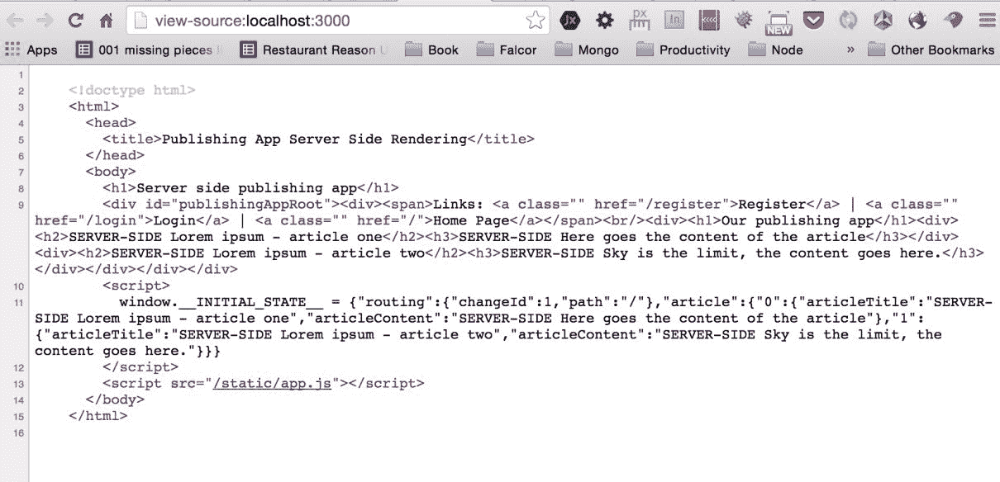

# 新的 ArticleCard 组件

为了改善我们主页的外观，下一步是基于 Material Design CSS 制作文章卡。让我们首先创建一个组件文件：

```jsx
$ [[you are in the src/components/ directory of your project]]

$ touch ArticleCard.js

```

然后，在`ArticleCard.js`文件中，让我们用以下内容初始化`ArticleCard`组件：

```jsx
import React from 'react'; 

import {  

  Card,  

  CardHeader,  

  CardMedia,  

  CardTitle,  

  CardText  

} from 'material-ui/lib/card'; 

import {Paper} from 'material-ui'; 

class ArticleCard extends React.Component { 

  constructor(props) { 

    super(props); 

  } 

  render() { 

    return <h1>here goes the article card</h1>; 

  } 

}; 

export default ArticleCard;

```

正如您在前面的代码中所找到的，我们已经从 material-ui/card 中导入了所需的组件，这将帮助我们的主页文章列表看起来很好。下一步是改进我们文章卡的`render`函数如下：

```jsx
render() { 

  let title = this.props.title || 'no title provided'; 

  let content = this.props.content || 'no content provided'; 

  const paperStyle = { 

    padding: 10,  

    width: '100%',  

    height: 300 

  }; 

  const leftDivStyle = { 

    width: '30%',  

    float: 'left' 

  }; 

  const rightDivStyle = { 

    width: '60%',  

    float: 'left',  

    padding: '10px 10px 10px 10px' 

  }; 

  return ( 

    <Paper style={paperStyle}> 

      <CardHeader 

        title={this.props.title} 

        subtitle='Subtitle' 

        avatar='/static/avatar.png' 

      /> 

      <div style={leftDivStyle}> 

        <Card > 

          <CardMedia 

            overlay={<CardTitle title={title} 

             subtitle='Overlay subtitle' />}> 

             

          </CardMedia> 

        </Card> 

      </div> 

      <div style={rightDivStyle}> 

        {content} 

      </div> 

    </Paper>); 

}

```

正如您在前面的代码中所找到的，我们已经创建了一张文章卡，并为`Paper`组件和左右`div`添加了一些内联样式。如果您愿意，可以随意更改样式。

总的来说，在以前的`render`函数中，我们缺少两个静态图像，即`src='/static/placeholder.png'`和`avatar='/static/avatar.png'`。让我们按照以下步骤添加它们：

1.  在`dist`目录中制作一个名为`placeholder.png`的 PNG 文件。在我的情况下，我的`placeholder.png`文件如下所示：


1.  还在`dist`目录中创建一个`avatar.png`文件，将在`/static/avatar.png`中公开。我不会在这里提供截图，因为里面有我的个人照片。

`express.js`中的`/static/`文件在`/server/server.js`文件中通过`codeapp.use('/static', express.static('dist'));`暴露出来（您已经在那里添加了这个，因为我们在上一章中已经添加了这个）。

最后一件事是，您需要导入`ArticleCard`并将`layouts/PublishingApp.js`的渲染从旧的简单视图修改为新的视图。

在文件顶部添加`import`：

```jsx
import ArticleCard from '../components/ArticleCard';

```

然后，用这个新的渲染替换：

```jsx
render () { 

  let articlesJSX = []; 

  for(let articleKey in this.props.article) { 

    const articleDetails = this.props.article[articleKey]; 

    const currentArticleJSX = ( 

      <div key={articleKey}> 

        <ArticleCard  

          title={articleDetails.articleTitle} 

          content={articleDetails.articleContent} /> 

      </div> 

    ); 

    articlesJSX.push(currentArticleJSX); 

  } 

  return ( 

    <div style={{height: '100%', width: '75%', margin: 'auto'}}> 

        {articlesJSX} 

    </div> 

  ); 

}

```

前面的新代码只在这个新的`ArticleCard`组件中有所不同：

```jsx
<ArticleCard  

  title={articleDetails.articleTitle} 

  content={articleDetails.articleContent} />

```

我们还为`div style={{height: '100%', width: '75%', margin: 'auto'}}`添加了一些样式。

在按照样式的确切步骤后，您将看到以下内容：


这是注册用户视图：

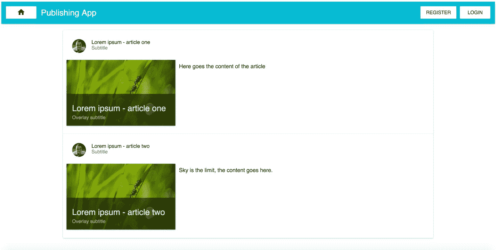

这是登录用户视图：

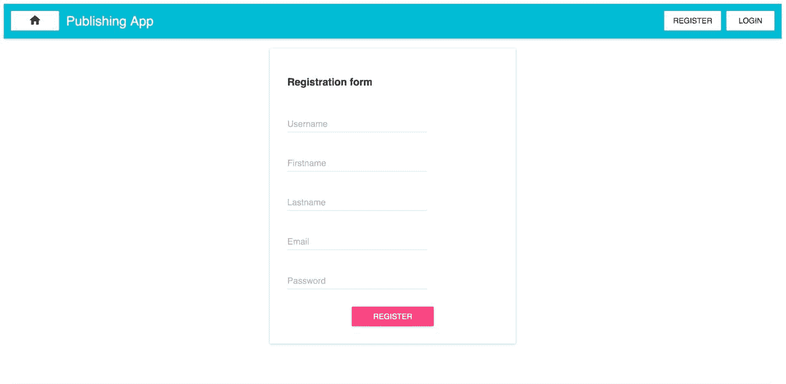

# 仪表板 - 添加文章按钮，注销和标题改进

我们目前的计划是创建注销机制，使我们的标题栏知道用户是否已登录，并根据该信息在标题栏中显示不同的按钮（当用户未登录时显示登录/注册，当用户已登录时显示仪表板/注销）。我们将在仪表板中创建一个添加文章按钮，并创建一个模拟视图和模拟 WYSIWYG（稍后我们将取消模拟）。

**WYSIWYG**代表**所见即所得**，当然。

WYSIWYG 模拟将位于`src/components/articles/WYSIWYGeditor.js`，因此您需要使用以下命令在`components`中创建一个新目录和文件：

```jsx
$ [[you are in the src/components/ directory of your project]]

$ mkdir articles

$ cd articles

$ touch WYSIWYGeditor.js

```

然后我们的`WYSIWYGeditor.js`模拟内容将如下所示：

```jsx
import React from 'react'; 

class WYSIWYGeditor extends React.Component { 

  constructor(props) { 

    super(props); 

  } 

  render() { 

    return <h1>WYSIWYGeditor</h1>; 

  } 

}; 

export default WYSIWYGeditor;

```

下一步是在`src/views/LogoutView.js`中创建一个注销视图。

```jsx
$ [[you should be at src/views/ directory of your project]]

$ touch LogoutView.js

```

`src/views/LogoutView.js`文件的内容如下：

```jsx
import React from 'react'; 

import {Paper} from 'material-ui'; 

class LogoutView extends React.Component { 

  constructor(props) { 

    super(props); 

  } 

  componentWillMount() { 

    if (typeof localStorage !== 'undefined' && localStorage.token) { 

      delete localStorage.token; 

      delete localStorage.username; 

      delete localStorage.role; 

    } 

  } 

  render () { 

    return ( 

      <div style={{width: 400, margin: 'auto'}}> 

        <Paper zDepth={3} style={{padding: 32, margin: 32}}> 

          Logout successful. 

        </Paper> 

      </div> 

    ); 

  } 

} 

export default LogoutView;

```

此处提到的`logout`视图是一个简单的视图，没有与 Redux 连接的功能（与`LoginView.js`相比）。我们使用一些样式使其美观，使用了 Material UI 的`Paper`组件。

当用户登陆到注销页面时，`componentWillMount`函数会从`localStorage`信息中删除。正如您所看到的，它还检查是否有`localStorage`和`**if(typeof localStorage !== 'undefined' && localStorage.token)**`，因为您可以想象，当执行服务器端渲染时，`localStorage`是未定义的（服务器端没有`localStorage`和`window`，像客户端一样）。

# 在创建前端添加文章功能之前的重要说明

我们已经到了需要从文章集合中删除所有文档的地步，否则在执行下一步时可能会遇到一些麻烦，因为我们将使用 draft-js 库和一些其他需要在后端创建新模式的东西。我们将在下一章中创建后端的模式，因为本章重点是前端。

立即删除 MongoDB 文章集合中的所有文档，但保留用户集合（不要从数据库中删除用户）。

# AddArticleView 组件

创建`LogoutView`和`WYSIWYGeditor`组件后，让我们创建我们流程中缺失的最终组件：`src/views/articles/AddArticleView.js`文件。因此，让我们现在创建一个目录和文件：

```jsx
$ [[you are in the src/views/ directory of your project]]

$ mkdir articles

$ cd articles

$ touch AddArticleView.js

```

因此，您将在`views/articles`目录中拥有该文件。我们需要将内容放入其中：

```jsx
import React from 'react'; 

import {connect} from 'react-redux'; 

import WYSIWYGeditor from '../../components/articles/WYSIWYGeditor.js'; 

const mapStateToProps = (state) => ({ 

  ...state 

}); 

const mapDispatchToProps = (dispatch) => ({ 

}); 

class AddArticleView extends React.Component { 

  constructor(props) { 

    super(props); 

  } 

  render () { 

    return ( 

      <div style={{height: '100%', width: '75%', margin: 'auto'}}> 

        <h1>Add Article</h1> 

        <WYSIWYGeditor /> 

      </div> 

    ); 

  } 

} 

export default connect(mapStateToProps, mapDispatchToProps)(AddArticleView);

```

正如你在这里看到的，这是一个简单的 React 视图，并且导入了我们刚刚创建的`WYSIWYGeditor`组件（`import WYSIWYGeditor from '../../components/articles/WYSIWYGeditor.js'`）。我们有一些内联样式，以使视图对我们的用户看起来更好。

让我们通过修改`src/routes/index.js`位置的`routes`文件来创建注销和添加文章功能的两个新路由：

```jsx
import React from 'react'; 

import {Route, IndexRoute} from 'react-router'; 

import CoreLayout from '../layouts/CoreLayout'; 

import PublishingApp from '../layouts/PublishingApp'; 

import LoginView from '../views/LoginView'; 

import LogoutView from '../views/LogoutView'; 

import RegisterView from '../views/RegisterView'; 

import DashboardView from '../views/DashboardView'; 

import AddArticleView from '../views/articles/AddArticleView'; 

export default ( 

  <Route component={CoreLayout} path='/'> 

    <IndexRoute component={PublishingApp} name='home' /> 

    <Route component={LoginView} path='login' name='login' /> 

    <Route component={LogoutView} path='logout' name='logout' /> 

    <Route component={RegisterView} path='register' 

       name='register' /> 

    <Route component={DashboardView} path='dashboard' 

       name='dashboard' /> 

    <Route component={AddArticleView} path='add-article' 

       name='add-article' /> 

  </Route> 

);

```

如我们的`src/routes/index.js`文件中所解释的，我们添加了两个路由：

+   `<Route component={LogoutView} path='logout' name='logout' />`

+   `<Route component={AddArticleView} path='add-article' name='add-article' />`

不要忘记使用以下方式导入这两个视图的组件：

```jsx
import LogoutView from '../views/LogoutView'; 

import AddArticleView from '../views/articles/AddArticleView';

```

现在，我们已经创建了视图并在该视图中创建了路由。最后一件事是在我们的应用程序中显示这两个路由的链接。

首先让我们创建`src/layouts/CoreLayout.js`组件，这样它将具有登录/注销类型的登录，以便已登录用户将看到与未登录用户不同的按钮。将`CoreLayout`组件中的`render`函数修改为以下内容：

```jsx
  render () { 

    const buttonStyle = { 

      margin: 5 

    }; 

    const homeIconStyle = { 

      margin: 5, 

      paddingTop: 5 

    }; 

    let menuLinksJSX; 

    let userIsLoggedIn = typeof localStorage !== 'undefined' &&  

     localStorage.token && this.props.routes[1].name !== 'logout'; 

    if (userIsLoggedIn) { 

      menuLinksJSX = ( 

     <span> 

          <Link to='/dashboard'> 

      <RaisedButton label='Dashboard' style={buttonStyle}  /> 

    </Link>  

          <Link to='/logout'> 

      <RaisedButton label='Logout' style={buttonStyle}  /> 

    </Link>  

      </span>); 

    } else { 

      menuLinksJSX = ( 

     <span> 

         <Link to='/register'> 

      <RaisedButton label='Register' style={buttonStyle}  /> 

    </Link>  

           <Link to='/login'> 

       <RaisedButton label='Login' style={buttonStyle}  /> 

     </Link>  

       </span>); 

    } 

    let homePageButtonJSX = ( 

      <Link to='/'> 

        <RaisedButton label={<ActionHome />} style={homeIconStyle}  

         /> 

      </Link>); 

    return ( 

      <div> 

        <AppBar 

          title='Publishing App' 

          iconElementLeft={homePageButtonJSX} 

          iconElementRight={menuLinksJSX} /> 

          <br/> 

          {this.props.children} 

      </div> 

    ); 

  }

```

你可以看到前面代码中的新部分如下：

```jsx
  let menuLinksJSX; 

  let userIsLoggedIn = typeof localStorage !== 

  'undefined' && localStorage.token && this.props.routes[1].name 

   !== 'logout'; 

  if (userIsLoggedIn) { 

    menuLinksJSX = ( 

  <span> 

        <Link to='/dashboard'> 

    <RaisedButton label='Dashboard' style={buttonStyle}  /> 

  </Link>  

        <Link to='/logout'> 

    <RaisedButton label='Logout'style={buttonStyle}  /> 

  </Link>  

      </span>); 

  } else { 

    menuLinksJSX = ( 

  <span> 

        <Link to='/register'> 

    <RaisedButton label='Register' style={buttonStyle}  /> 

  </Link>  

        <Link to='/login'> 

    <RaisedButton label='Login' style={buttonStyle}  /> 

  </Link>  

      </span>); 

  }

```

我们已经添加了`let userIsLoggedIn = typeof localStorage !== 'undefined' && localStorage.token && this.props.routes[1].name !== 'logout';`。如果我们不在服务器端（那么就没有`localStorage`，如前所述），则会找到`userIsLoggedIn`变量。然后，它检查`localStorage.token`是否为`yes`，还检查用户是否没有点击注销按钮，使用`this.props.routes[1].name !== 'logout'`表达式。`this.props.routes[1].name`的值/信息由`redux-simple-router`和`react-router`提供。这始终是我们当前路由的名称，因此我们可以根据该信息渲染适当的按钮。

# 修改 DashboardView

正如你会发现的，我们添加了`if (userIsLoggedIn)`语句，新部分是仪表板和注销`RaisedButton`实体，链接到正确的路由。

在这个阶段完成的最后一件事是修改`src/views/DashboardView.js`组件。使用从 react-router 导入的`{Link}`组件添加到`/add-article`路由的链接。此外，我们需要导入新的 Material UI 组件，以使`DashboardView`更加美观：

```jsx
import {Link} from 'react-router'; 

import List from 'material-ui/lib/lists/list'; 

import ListItem from 'material-ui/lib/lists/list-item'; 

import Avatar from 'material-ui/lib/avatar'; 

import ActionInfo from 'material-ui/lib/svg-icons/action/info'; 

import FileFolder from 'material-ui/lib/svg-icons/file/folder'; 

import RaisedButton from 'material-ui/lib/raised-button'; 

import Divider from 'material-ui/lib/divider';

```

在你的`src/views/DashboardView.js`文件中导入了所有这些之后，我们需要开始改进`render`函数：

```jsx
render () { 

    let articlesJSX = []; 

    for(let articleKey in this.props.article) { 

      const articleDetails = this.props.article[articleKey]; 

      const currentArticleJSX = ( 

        <ListItem 

          key={articleKey} 

          leftAvatar={} 

          primaryText={articleDetails.articleTitle} 

          secondaryText={articleDetails.articleContent} 

        /> 

      ); 

      articlesJSX.push(currentArticleJSX); 

    } 

    return ( 

      <div style={{height: '100%', width: '75%', margin: 'auto'}}> 

        <Link to='/add-article'> 

          <RaisedButton  

            label='Create an article'  

            secondary={true}  

            style={{margin: '20px 20px 20px 20px'}} /> 

        </Link> 

        <List> 

          {articlesJSX} 

        </List> 

      </div> 

    ); 

  }

```

在这里，我们有我们的`DashboardView`的新`render`函数。我们使用`ListItem`组件来制作我们漂亮的列表。我们还添加了链接和按钮到`/add-article`路由。有一些内联样式，但请随意自行设计此应用程序的样式。

让我们看一下在添加了创建文章按钮并具有新的文章视图后，应用程序经过所有这些更改后的一些屏幕截图：

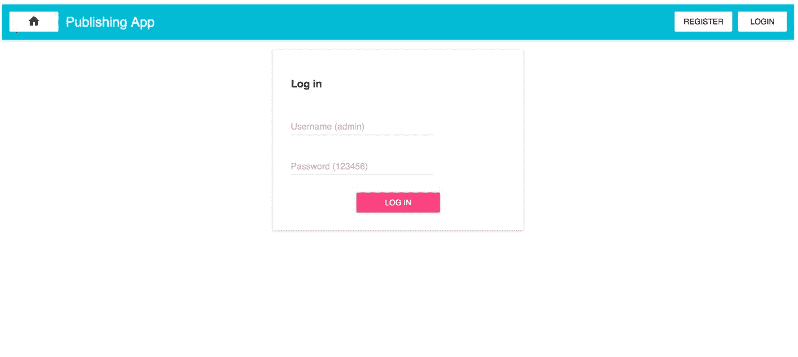

在`/add-article`视图上模拟了 WYSIWYG 之后：

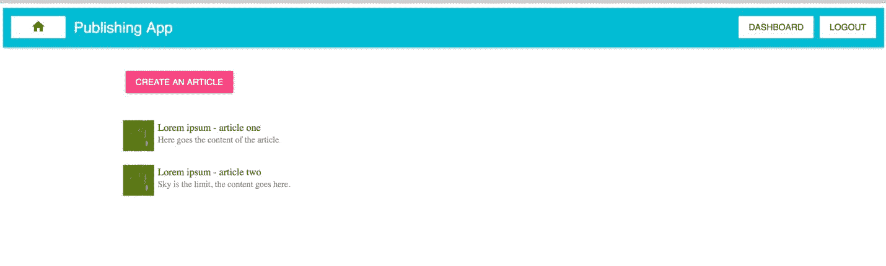

我们的新注销视图页面将是这样的：

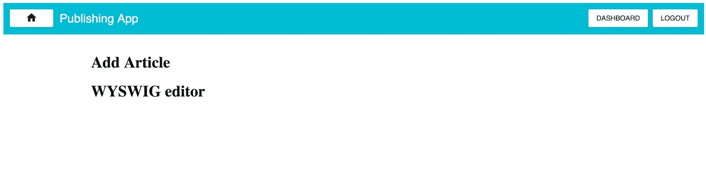


# 开始我们的 WYSIWYG 工作

让我们安装一个 draft-js 库，它是“一个在 React 中构建富文本编辑器的框架，由不可变模型驱动，并抽象了跨浏览器的差异”，正如他们网站上所述。

总的来说，draft-js 是由 Facebook 的朋友们制作的，它帮助我们制作强大的所见即所得工具。在我们的发布应用程序中，它将是有用的，因为我们希望为我们的编辑提供良好的工具，以便在我们的平台上创建有趣的文章。

让我们先安装它：

```jsx
npm i --save draft-js@0.5.0

```

我们将在我们的书中使用 0.5.0 版本的 draft-js。在开始编码之前，让我们安装另一个有用的依赖项，以后在通过 Falcor 从数据库中获取文章时会有帮助。执行以下命令：

```jsx
npm i --save falcor-json-graph@1.1.7

```

总的来说，`falcor-json-graph@1.1.7`语法为我们提供了使用 Falcor 辅助库提供的不同 sentinels 的能力（这将在下一章节中详细描述）。

# draft-js 所需的样式表

为了给 draft-js 编辑器设置样式，我们需要在`dist`文件夹中创建一个新的 CSS 文件，位于`dist/styles-draft-js.css`。这是我们唯一会放置 CSS 样式表的地方：

```jsx
.RichEditor-root { 

  background: #fff; 

  border: 1px solid #ddd; 

  font-family: 'Georgia', serif; 

  font-size: 14px; 

  padding: 15px; 

} 

.RichEditor-editor { 

  border-top: 1px solid #ddd; 

  cursor: text; 

  font-size: 16px; 

  margin-top: 10px; 

  min-height: 100px; 

} 

.RichEditor-editor .RichEditor-blockquote { 

  border-left: 5px solid #eee; 

  color: #666; 

  font-family: 'Hoefler Text', 'Georgia', serif; 

  font-style: italic; 

  margin: 16px 0; 

  padding: 10px 20px; 

} 

.RichEditor-controls { 

  font-family: 'Helvetica', sans-serif; 

  font-size: 14px; 

  margin-bottom: 5px; 

  user-select: none; 

} 

.RichEditor-styleButton { 

  color: #999; 

  cursor: pointer; 

  margin-right: 16px; 

  padding: 2px 0; 

} 

.RichEditor-activeButton { 

  color: #5890ff; 

}

```

创建了位于`dist/styles-draft-js.css`的文件后，我们需要将其导入到`server/server.js`中，我们已经在`server.js`文件中创建了 HTML 头部，因此以下代码已经存在于`server.js`文件中：

```jsx
let renderFullPage = (html, initialState) => 

{ 

  return &grave; 

    <!doctype html> 

    <html> 

      <head> 

        <title>Publishing App Server Side Rendering</title> 

        <link rel="stylesheet" type="text/css" 

         href="/static/styles-draft-js.css" /> 

      </head> 

      <body> 

        <div id="publishingAppRoot">${html}</div> 

        <script> 

          window.__INITIAL_STATE__ = 

           ${JSON.stringify(initialState)} 

        </script> 

        <script src="/static/app.js"></script> 

      </body> 

    </html> 

    &grave; 

};

```

然后您需要包含以下链接到样式表：

```jsx
<link rel="stylesheet" type="text/css" href="/static/styles-draft- 

 js.css" />

```

到目前为止还没有什么花里胡哨的。在为我们的富文本 WYSIWYG 编辑器设置样式之后，让我们来点乐趣。

# 编写 draft-js 骨架

让我们回到`src/components/articles/WYSIWYGeditor.js`文件。它目前是模拟的，但我们现在将对其进行改进。

只是让您知道，我们现在将制作所见即所得的骨架。我们稍后会在书中进行改进。在这一点上，所见即所得不会有任何功能，比如加粗文本或创建带有 OL 和 UL 元素的列表。

```jsx
import React from 'react'; 

import { 

  Editor,  

  EditorState,  

  ContentState,  

  RichUtils,  

  convertToRaw, 

  convertFromRaw 

} from 'draft-js'; 

export default class   WYSIWYGeditor extends React.Component { 

  constructor(props) { 

    super(props); 

    let initialEditorFromProps = 

     EditorState.createWithContent 

     (ContentState.createFromText('')); 

    this.state = { 

      editorState: initialEditorFromProps 

    }; 

    this.onChange = (editorState) => {  

      var contentState = editorState.getCurrentContent(); 

      let contentJSON = convertToRaw(contentState); 

      props.onChangeTextJSON(contentJSON, contentState); 

      this.setState({editorState})  

    }; 

  } 

  render() { 

    return <h1>WYSIWYGeditor</h1>; 

  } 

}

```

在这里，我们只创建了一个新的 draft-js 文件的所见即所得编辑器的构造函数。`let initialEditorFromProps = EditorState.createWithContent(ContentState.createFromText(''));`表达式只是创建了一个空的所见即所得容器。稍后，我们将改进它，以便在需要编辑所见即所得时能够从数据库接收`ContentState`。

`editorState: initialEditorFromProps`是我们当前的状态。我们的`**this.onChange = (editorState) => { **`行在每次更改时触发，因此我们的视图组件在`src/views/articles/AddArticleView.js`将了解所见即所得中的任何更改。

无论如何，您可以在[`facebook.github.io/draft-js/`](https://facebook.github.io/draft-js/)查看 draft-js 的文档。

这只是一个开始；下一步是在`onChange`下添加两个新函数：

```jsx
this.focus = () => this.refs['refWYSIWYGeditor'].focus(); 

this.handleKeyCommand = (command) => this._handleKeyCommand(command);

```

并在我们的`WYSIWYGeditor`类中添加一个新函数：

```jsx
_handleKeyCommand(command) { 

   const {editorState} = this.state; 

   const newState = RichUtils.handleKeyCommand(editorState, 

    command); 

   if (newState) { 

     this.onChange(newState); 

     return true; 

   } 

   return false; 

 }

```

在所有这些更改之后，`WYSIWYGeditor`类的构造应如下所示：

```jsx
export default class   WYSIWYGeditor extends React.Component { 

  constructor(props) { 

    super(props); 

    let initialEditorFromProps = 

     EditorState.createWithContent 

     (ContentState.createFromText('')); 

    this.state = { 

      editorState: initialEditorFromProps 

    }; 

    this.onChange = (editorState) => {  

      var contentState = editorState.getCurrentContent(); 

      let contentJSON = convertToRaw(contentState); 

      props.onChangeTextJSON(contentJSON, contentState); 

      this.setState({editorState}); 

    }; 

    this.focus = () => this.refs['refWYSIWYGeditor'].focus(); 

    this.handleKeyCommand = (command) => 

     this._handleKeyCommand(command); 

  }

```

这个类的其余部分如下：

```jsx
  _handleKeyCommand(command) { 

    const {editorState} = this.state; 

    const newState = RichUtils.handleKeyCommand(editorState, 

     command); 

    if (newState) { 

      this.onChange(newState); 

      return true; 

    } 

    return false; 

  } 

  render() { 

    return <h1> WYSIWYGeditor</h1>; 

  } 

}

```

下一步是使用以下代码改进`render`函数：

```jsx
 render() { 

    const { editorState } = this.state; 

    let className = 'RichEditor-editor'; 

    var contentState = editorState.getCurrentContent(); 

    return ( 

      <div> 

        <h4>{this.props.title}</h4> 

        <div className='RichEditor-root'> 

          <div className={className} onClick={this.focus}> 

            <Editor 

              editorState={editorState} 

              handleKeyCommand={this.handleKeyCommand} 

              onChange={this.onChange} 

              ref='refWYSIWYGeditor' /> 

          </div> 

        </div> 

      </div> 

    ); 

  }

```

在这里，我们所做的只是简单地使用 draft-js API 来制作一个简单的富文本编辑器；稍后，我们将使其更加功能强大，但现在，让我们专注于简单的东西。

# 改进 views/articles/AddArticleView 组件

在继续添加所有所见即所得功能，比如加粗之前，我们需要改进`views/articles/AddArticleView.js`组件，添加一些东西。使用以下内容安装一个将 draft-js 状态转换为纯 HTML 的库：

```jsx
npm i --save draft-js-export-html@0.1.13

```

我们将使用这个库来保存只读的纯 HTML，供我们的常规读者使用。接下来，将其导入到`src/views/articles/AddArticleView.js`中：

```jsx
import { stateToHTML } from 'draft-js-export-html';

```

通过更改构造函数并添加一个名为`_onDraftJSChange`的新函数来改进`AddArticleView`：

```jsx
class AddArticleView extends React.Component { 

  constructor(props) { 

    super(props); 

    this._onDraftJSChange = this._onDraftJSChange.bind(this); 

    this.state = { 

      contentJSON: {}, 

      htmlContent: '' 

    }; 

  } 

  _onDraftJSChange(contentJSON, contentState) { 

    let htmlContent = stateToHTML(contentState); 

    this.setState({contentJSON, htmlContent}); 

  }

```

我们需要在每次更改时保存`this.setState({contentJSON, htmlContent});`的状态。这是因为`contentJSON`将被保存到数据库中，以便对我们的 WYSIWYG 具有不可变的信息，而`htmlContent`将成为我们的读者的服务器。`htmlContent`和`contentJSON`变量将保存在文章集合中。`AddArticleView`类中的最后一件事是将`render`修改为以下新代码：

```jsx
render () { 

   return ( 

     <div style={{height: '100%', width: '75%', margin: 'auto'}}> 

       <h1>Add Article</h1> 

       <WYSIWYGeditor 

         initialValue='' 

         title='Create an article' 

         onChangeTextJSON={this._onDraftJSChange} /> 

     </div> 

   ); 

 }

```

经过所有这些变化，您将看到的新视图是这样的：

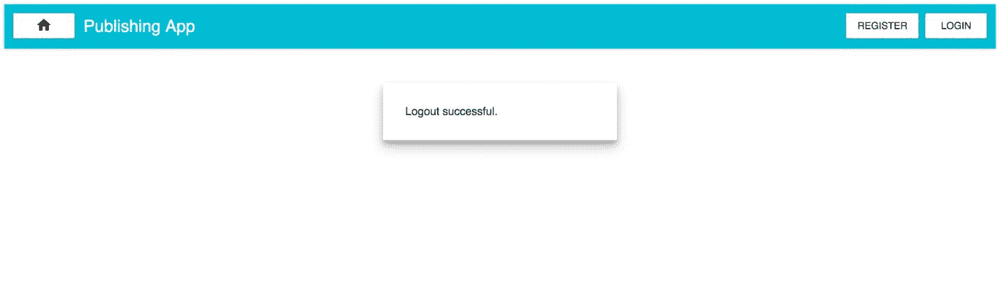

# 为我们的 WYSIWYG 添加更多格式功能

让我们开始着手开发我们的 WYSIWYG 的第二个版本，增加更多选项，如下例所示：

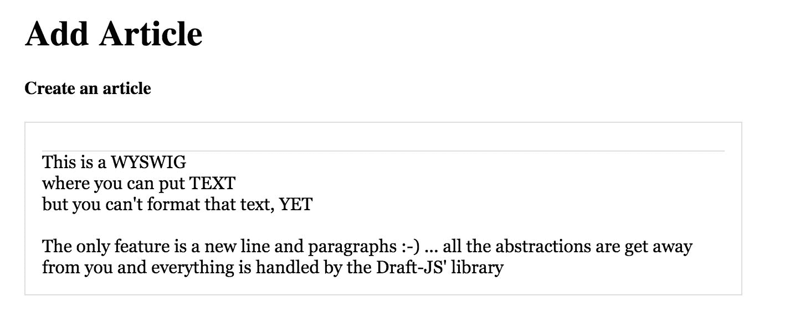

在您按照这里提到的步骤后，您将能够格式化您的文本，并从中提取 HTML 标记，以便我们可以在我们的 MongoDB 文章集合中保存 WYSIWYG 的 JSON 状态和纯 HTML。

在下一个名为`WYSIWYGbuttons.js`的新文件中，我们将导出两个不同的类，并将它们导入到`components/articles/WYSWIWYGeditor.js`中，使用以下内容：

```jsx
// don't write it, this is only an example:

import { BlockStyleControls, InlineStyleControls } from 

 './wysiwyg/WYSIWY

    Gbuttons';

```

总的来说，新文件将有三个不同的 React 组件，如下所示：

+   `StyleButton`：这将是一个通用样式的按钮，将用于`BlockStyleControls`和`InlineStyleControls`。不要被`WYSIWYGbuttons`文件中首先创建`StyleButton` React 组件的事实所困惑。

+   `BlockStyleControls`：这是一个导出的组件，将用于块控件，如`H1`、`H2`、`Blockquote`、`UL`和`OL`。

+   `InlineStyleControls`：此组件用于粗体、斜体和下划线。

现在我们知道在新文件中，您将创建三个单独的 React 组件。

首先，我们需要在`src/components/articles/wysiwyg/WYSIWYGbuttons.js`位置创建 WYSWIG 按钮：

```jsx
$ [[you are in the src/components/articles directory of your project]]

$ mkdir wysiwyg

$ cd wysiwyg

$ touch  WYSIWYGbuttons.js

```

该文件的内容将是按钮组件：

```jsx
import React from 'react'; 

class StyleButton extends React.Component { 

  constructor() { 

    super(); 

    this.onToggle = (e) => { 

      e.preventDefault(); 

      this.props.onToggle(this.props.style); 

    }; 

  } 

  render() { 

    let className = 'RichEditor-styleButton'; 

    if (this.props.active) { 

      className += ' RichEditor-activeButton'; 

    } 

    return ( 

      <span className={className} onMouseDown={this.onToggle}> 

        {this.props.label} 

      </span> 

    ); 

  } 

}

```

上述代码为我们提供了一个可重用的按钮，具有`this.props.label`中的特定标签。如前所述，不要与`WYSIWYGbuttons`混淆；它是一个通用按钮组件，将在内联和块类型按钮控件中重复使用。

接下来，在该组件下，您可以放置以下对象：

```jsx
const BLOCK_TYPES = [ 

  {label: 'H1', style: 'header-one'}, 

  {label: 'H2', style: 'header-two'}, 

  {label: 'Blockquote', style: 'blockquote'}, 

  {label: 'UL', style: 'unordered-list-item'}, 

  {label: 'OL', style: 'ordered-list-item'} 

];

```

这个对象是块类型的，我们可以在我们的 draft-js WYSIWYG 中创建它。它用在以下组件中：

```jsx
export const BlockStyleControls = (props) => { 

  const {editorState} = props; 

  const selection = editorState.getSelection(); 

  const blockType = editorState 

    .getCurrentContent() 

    .getBlockForKey(selection.getStartKey()) 

    .getType(); 

  return ( 

    <div className='RichEditor-controls'> 

      {BLOCK_TYPES.map((type) => 

        <StyleButton 

          key={type.label} 

          active={type.style === blockType} 

          label={type.label} 

          onToggle={props.onToggle} 

          style={type.style} 

        /> 

      )} 

    </div> 

  ); 

};

```

前面的代码是一大堆用于块级样式格式化的按钮。我们将很快将它们导入到`WYSIWYGeditor`中。正如您所看到的，我们使用`export const BlockStyleControls = (props) => {`导出它。

将下一个对象放在`BlockStyleControls`组件下面，但这次是用于内联样式，比如`Bold`：

```jsx
var INLINE_STYLES = [ 

  {label: 'Bold', style: 'BOLD'}, 

  {label: 'Italic', style: 'ITALIC'}, 

  {label: 'Underline', style: 'UNDERLINE'} 

];

```

正如您所看到的，在我们的 WYSIWYG 中，编辑器将能够使用粗体、斜体和下划线。

用于放置所有这些内联样式的最后一个组件是以下内容：

```jsx
export const InlineStyleControls = (props) => { 

  var currentStyle = props.editorState.getCurrentInlineStyle(); 

  return ( 

    <div className='RichEditor-controls'> 

      {INLINE_STYLES.map(type => 

        <StyleButton 

          key={type.label} 

          active={currentStyle.has(type.style)} 

          label={type.label} 

          onToggle={props.onToggle} 

          style={type.style} 

        /> 

      )} 

    </div> 

  ); 

};

```

正如您所看到的，这非常简单。我们每次都在块和内联样式中映射定义的样式，并且根据每次迭代，我们都创建`StyleButton`。

下一步是在我们的`WYSIWYGeditor`组件（`src/components/articles/WYSIWYGeditor.js`）中导入`InlineStyleControls`和`BlockStyleControls`：

```jsx
import { BlockStyleControls, InlineStyleControls } from './wysiwyg/WYSIWYGbuttons';

```

然后，在`WYSIWYGeditor`构造函数中，包括以下代码：

```jsx
this.toggleInlineStyle = (style) => 

this._toggleInlineStyle(style); 

this.toggleBlockType = (type) => this._toggleBlockType(type);

```

将`toggleInlineStyle`和`toggleBlockType`绑定到两个箭头函数，当有人选择切换以在我们的`WYSIWYGeditor`中使用内联或块类型时，这些函数将成为回调（我们将在一会儿创建这些函数）。

创建这两个新函数：

```jsx
 _toggleBlockType(blockType) {

this.onChange(

      RichUtils.toggleBlockType( 

        this.state.editorState, 

        blockType 

      ) 

    ); 

  } 

  _toggleInlineStyle(inlineStyle) { 

    this.onChange( 

      RichUtils.toggleInlineStyle( 

        this.state.editorState, 

        inlineStyle 

      ) 

    ); 

  }

```

在这里，这两个函数都使用 draft-js`RichUtils`来在我们的 WYSIWYG 中设置标志。我们正在使用我们在`import { BlockStyleControls, InlineStyleControls }`中定义的`BLOCK_TYPES`和`INLINE_STYLES`中的某些格式选项，从`'./wysiwg/WYSIWGbuttons'`导入。

在我们改进了`WYSIWYGeditor`的构造和`_toggleBlockType`和`_toggleInlineStyle`函数之后，我们可以开始改进我们的`render`函数：

```jsx
 render() { 

    const { editorState } = this.state; 

    let className = 'RichEditor-editor'; 

    var contentState = editorState.getCurrentContent(); 

    return ( 

      <div> 

        <h4>{this.props.title}</h4> 

        <div className='RichEditor-root'> 

          <BlockStyleControls 

            editorState={editorState} 

            onToggle={this.toggleBlockType} /> 

          <InlineStyleControls 

            editorState={editorState} 

            onToggle={this.toggleInlineStyle} /> 

          <div className={className} onClick={this.focus}> 

            <Editor 

              editorState={editorState} 

              handleKeyCommand={this.handleKeyCommand} 

              onChange={this.onChange} 

              ref='refWYSIWYGeditor' /> 

          </div> 

        </div> 

      </div> 

    ); 

  }

```

正如您可能注意到的，在前面的代码中，我们只添加了`BlockStyleControls`和`InlineStyleControls`组件。还要注意我们在`onToggle={this.toggleBlockType}`和`onToggle={this.toggleInlineStyle}`中使用回调；这是为了在我们的`WYSIWYGbuttons`和 draft-js`RichUtils`之间进行通信，告诉它用户点击了什么，以及他们当前使用的模式（如粗体、标题 1、UL 或 OL）。

# 将新文章推送到文章 reducer

我们需要在`src/actions/article.js`位置创建一个名为`pushNewArticle`的新操作：

```jsx
export default { 

  articlesList: (response) => { 

    return { 

      type: 'ARTICLES_LIST_ADD', 

      payload: { response: response } 

    } 

  }, 

  pushNewArticle: (response) => { 

    return { 

      type: 'PUSH_NEW_ARTICLE', 

      payload: { response: response } 

    } 

  } 

}

```

下一步是通过改进`src/components/ArticleCard.js`组件中的`render`函数来改进它：

```jsx
return ( 

   <Paper style={paperStyle}> 

     <CardHeader 

       title={this.props.title} 

       subtitle='Subtitle' 

       avatar='/static/avatar.png' 

     /> 

     <div style={leftDivStyle}> 

       <Card > 

         <CardMedia 

           overlay={<CardTitle title={title} subtitle='Overlay 

            subtitle' />}> 

            

         </CardMedia> 

       </Card> 

     </div> 

     <div style={rightDivStyle}> 

       <div dangerouslySetInnerHTML={{__html: content}} /> 

     </div> 

   </Paper>); 

}

```

在这里，我们已经将旧的`{content}`变量（它在 content 的变量中接收了一个纯文本值）替换为一个新的变量，它使用`dangerouslySetInnerHTML`在文章卡中显示所有的 HTML：

```jsx
<div dangerouslySetInnerHTML={{__html: content}} />

```

这将帮助我们展示由我们的所见即所得编辑器生成的 HTML 代码。

# MapHelpers 用于改进我们的 reducers

一般来说，所有的 reducers 在改变时*必须*返回一个新的对象引用。在我们的第一个例子中，我们使用了`Object.assign`：

```jsx
// this already exsits in your codebasecase 'ARTICLES_LIST_ADD': 

let articlesList = action.payload.response; 

return Object.assign({}, articlesList);

```

我们将使用 ES6 的 Map 来替换这种`Object.assign`方法：

```jsx
case 'ARTICLES_LIST_ADD': 

  let articlesList = action.payload.response; 

  return mapHelpers.addMultipleItems(state, articlesList);

```

在前面的代码中，您可以找到一个新的`ARTICLES_LIST_ADD`，其中包括`mapHelpers.addMultipleItems(state, articlesList)`。

为了制作我们的地图助手，我们需要创建一个名为`utils`的新目录和一个名为`mapHelpers.js(src/utils/mapHelpers.js)`的文件：

```jsx
$ [[you are in the src/ directory of your project]]

$ mkdir utils

$ cd utils

$ touch mapHelpers.js

```

然后，您可以将这个第一个函数输入到`src/utils/mapHelpers.js`文件中：

```jsx
const duplicate = (map) => { 

  const newMap = new Map(); 

  map.forEach((item, key) => { 

    if (item['_id']) { 

      newMap.set(item['_id'], item); 

    } 

  }); 

  return newMap; 

}; 

const addMultipleItems = (map, items) => { 

  const newMap = duplicate(map); 

  Object.keys(items).map((itemIndex) => { 

    let item = items[itemIndex]; 

    if (item['_id']) { 

      newMap.set(item['_id'], item); 

    } 

  }); 

  return newMap; 

};

```

重复只是在内存中创建一个新的引用，以使我们的不可变性成为 Redux 应用程序中的要求。我们还在检查`if(key === item['_id'])`时，是否存在一个特殊情况，即键与我们的对象 ID 不同（`_id`中的`_`是有意的，因为这是 Mongoose 如何标记我们的 DB 中的 ID）。`addMultipleItems`函数将项目添加到新的重复地图中（例如，在成功获取文章后）。

我们需要的下一个代码更改在相同的文件`src/utils/mapHelpers.js`中：

```jsx
const addItem = (map, newKey, newItem) => { 

  const newMap = duplicate(map); 

  newMap.set(newKey, newItem); 

  return newMap; 

}; 

const deleteItem = (map, key) => { 

  const newMap = duplicate(map); 

  newMap.delete(key); 

  return newMap; 

}; 

export default { 

  addItem, 

  deleteItem, 

  addMultipleItems 

};

```

正如您所看到的，我们添加了一个`add`函数和一个`delete`函数用于单个项目。之后，我们从`src/utils/mapHelpers.js`中导出所有这些。

下一步是，我们需要改进`src/reducers/article.js` reducer，以便在其中使用地图实用程序：

```jsx
import mapHelpers from '../utils/mapHelpers'; 

const article = (state = {}, action) => { 

  switch (action.type) { 

    case 'ARTICLES_LIST_ADD': 

      let articlesList = action.payload.response; 

      return mapHelpers.addMultipleItems(state, articlesList); 

    case 'PUSH_NEW_ARTICLE': 

      let newArticleObject = action.payload.response; 

      return mapHelpers.addItem(state, newArticleObject['_id'], 

       newArticleObject); 

    default: 

      return state; 

  } 

} 

export default article

```

`src/reducers/article.js`文件中有什么新内容？正如您所看到的，我们已经改进了`ARTICLES_LIST_ADD`（已经讨论过）。我们添加了一个新的`PUSH_NEW_ARTICLE`；情况；这将向我们的 reducer 状态树中推送一个新对象。这类似于将项目推送到数组中，但我们使用我们的 reducer 和 maps。

# CoreLayout 的改进

因为我们在前端切换到了 ES6 的 Map，所以我们还需要确保在接收到具有服务器端渲染的对象后，它也是一个 Map（而不是一个普通的 JS 对象）。请查看以下代码：

```jsx
// The following is old codebase: 

import React from 'react'; 

import { Link } from 'react-router'; 

import themeDecorator from 'material-ui/lib/styles/theme- 

 decorator'; 

import getMuiTheme from 'material-ui/lib/styles/getMuiTheme'; 

import RaisedButton from 'material-ui/lib/raised-button'; 

import AppBar from 'material-ui/lib/app-bar'; 

import ActionHome from 'material-ui/lib/svg-icons/action/home';

```

在以下新的代码片段中，您可以找到`CoreLayout`组件中所需的所有导入：

```jsx
import React from 'react'; 

import {Link} from 'react-router'; 

import themeDecorator from 'material-ui/lib/styles/theme- 

 decorator'; 

import getMuiTheme from 'material-ui/lib/styles/getMuiTheme'; 

import RaisedButton from 'material-ui/lib/raised-button'; 

import AppBar from 'material-ui/lib/app-bar'; 

import ActionHome from 'material-ui/lib/svg-icons/action/home'; 

import {connect} from 'react-redux'; 

import {bindActionCreators} from 'redux'; 

import articleActions from '../actions/article.js'; 

const mapStateToProps = (state) => ({ 

  ...state 

}); 

const mapDispatchToProps = (dispatch) => ({ 

  articleActions: bindActionCreators(articleActions, dispatch) 

});

```

在`CoreLayout`组件上面，我们已经添加了 Redux 工具，所以我们将在`CoreLayout`组件中拥有状态树和可用的操作。

此外，在`CoreLayout`组件中，添加`componentWillMount`函数：

```jsx
  componentWillMount() { 

    if (typeof window !== 'undefined' && !this.props.article.get) 

     { 

      this.props.articleActions.articlesList(this.props.article); 

    } 

  }

```

此函数负责检查文章属性是否为 ES6 Map。如果不是，那么我们发送一个操作到`articlesList`来完成工作，之后，我们在`this.props.article`中就有了 Map。

最后一件事是改进`CoreLayout`组件中的`export`：

```jsx
const muiCoreLayout = themeDecorator(getMuiTheme(null, { 

 userAgent: 'all' }))(CoreLayout); 

 export default connect(mapStateToProps, 

 mapDispatchToProps)(muiCoreLayout);

```

上述代码帮助我们连接到 Redux 单状态树和它允许的操作。

# 为什么选择 Map 而不是 JS 对象？

总的来说，ES6 Map 具有一些易于数据操作的功能---诸如`.get`和`.set`等函数，使编程更加愉快。它还有助于拥有更简单的代码，以便保持 Redux 所需的不可变性。

Map 方法比`slice/c-oncat/Object.assign`要容易得多。我相信每种方法都有利弊，但在我们的应用中，我们将使用 ES6 Map-wise 方法来使事情变得更简单。

# 改进 PublishingApp 和 DashboardView

在`src/layouts/PublishingApp.js`文件中，我们需要改进我们的`render`函数：

```jsx
render () { 

  let articlesJSX = []; 

  this.props.article.forEach((articleDetails, articleKey) => { 

    const currentArticleJSX = ( 

      <div key={articleKey}> 

        <ArticleCard  

          title={articleDetails.articleTitle} 

          content={articleDetails.articleContent} /> 

      </div> 

    ); 

    articlesJSX.push(currentArticleJSX); 

  }); 

  return ( 

    <div style={{height: '100%', width: '75%', margin: 'auto'}}> 

        {articlesJSX} 

    </div> 

  ); 

}

```

正如您在前面的代码中所看到的，我们将旧的`for(let articleKey in this.props.article) {`代码切换为`this.props.article.forEach`，因为我们已经从对象切换到使用 Map。

我们需要在`src/views/DashboardView.js`文件的`render`函数中做同样的事情：

```jsx
render () { 

  let articlesJSX = []; 

  this.props.article.forEach((articleDetails, articleKey) => { 

    const currentArticleJSX = ( 

      <ListItem 

        key={articleKey} 

        leftAvatar={} 

        primaryText={articleDetails.articleTitle} 

        secondaryText={articleDetails.articleContent} 

      /> 

    ); 

    articlesJSX.push(currentArticleJSX); 

  }); 

  return ( 

    <div style={{height: '100%', width: '75%', margin: 'auto'}}> 

      <Link to='/add-article'> 

        <RaisedButton  

          label='Create an article'  

          secondary={true}  

          style={{margin: '20px 20px 20px 20px'}} /> 

      </Link> 

      <List> 

        {articlesJSX} 

      </List> 

    </div> 

  ); 

}

```

出于与`PublishingApp`组件相同的原因，我们切换到使用 ES6 的新 Map，并且我们还将使用新的 ES6 `forEach`方法：

```jsx
this.props.article.forEach((articleDetails, articleKey) => {

```

# 对 AddArticleView 进行调整

在我们准备好将新文章保存到文章的 reducer 中之后，我们需要调整`src/views/articles/AddArticleView.js`组件。`AddArticleView.js`中的新导入如下：

```jsx
import {bindActionCreators} from 'redux'; 

import {Link} from 'react-router'; 

import articleActions from '../../actions/article.js'; 

import RaisedButton from 'material-ui/lib/raised-button';

```

正如您在前面的代码中所看到的，我们正在导入`RaisedButton`和`Link`，这对于在成功添加文章后将编辑器重定向到仪表板视图非常有用。然后，我们导入`articleActions`，因为我们需要在文章提交时执行`this.props.articleActions.pushNewArticle(newArticle);`操作。如果您遵循了前几章的说明，`bindActionCreators`将已经在您的`AddArticleView`中导入。

通过替换这段代码，在`AddArticleView`组件中使用`bindActionCreators`来拥有`articleActions`：

```jsx
// this is old code, you shall have it already 

const mapDispatchToProps = (dispatch) => ({ 

});

```

这是新的`bindActionCreators`代码：

```jsx
const mapDispatchToProps = (dispatch) => ({ 

  articleActions: bindActionCreators(articleActions, dispatch) 

});

```

以下是`AddArticleView`组件的更新构造函数：

```jsx
 constructor(props) { 

    super(props); 

    this._onDraftJSChange = this._onDraftJSChange.bind(this); 

    this._articleSubmit = this._articleSubmit.bind(this); 

    this.state = { 

      title: 'test', 

      contentJSON: {}, 

      htmlContent: '', 

      newArticleID: null 

    }; 

  }

```

在编辑者想要添加文章之后，将需要`_articleSubmit`方法。我们还为我们的标题、`contentJSON`（我们将在那里保留 draft-js 文章状态）、`htmlContent`和`newArticleID`添加了一些默认状态。下一步是创建`_articleSubmit`函数：

```jsx
 _articleSubmit() { 

    let newArticle = { 

      articleTitle: this.state.title, 

      articleContent: this.state.htmlContent, 

      articleContentJSON: this.state.contentJSON 

    } 

    let newArticleID = 'MOCKEDRandomid' + Math.floor(Math.random() 

     * 10000); 

    newArticle['_id'] = newArticleID; 

    this.props.articleActions.pushNewArticle(newArticle); 

    this.setState({ newArticleID: newArticleID}); 

  }

```

正如你在这里看到的，我们使用`this.state.title`、`this.state.htmlContent`和`this.state.contentJSON`获取我们当前写作的状态，然后基于此创建一个`newArticle`模型：

```jsx
let newArticle = { 

  articleTitle: this.state.title, 

  articleContent: this.state.htmlContent, 

  articleContentJSON: this.state.contentJSON 

}

```

然后我们用`newArticle['_id'] = newArticleID;`模拟新文章的 ID（稍后，我们将把它保存到数据库中），并用`this.props.articleActions.pushNewArticle(newArticle);`将其推入我们的文章 reducer 中。唯一的事情是用`this.setState({ newArticleID: newArticleID});`设置`newarticleID`。最后一步是更新`AddArticleView`组件中的`render`方法：

```jsx
 render () { 

    if (this.state.newArticleID) { 

      return ( 

        <div style={{height: '100%', width: '75%', margin: 

         'auto'}}> 

          <h3>Your new article ID is 

           {this.state.newArticleID}</h3> 

          <Link to='/dashboard'> 

            <RaisedButton 

              secondary={true} 

              type='submit' 

              style={{margin: '10px auto', display: 'block', 

               width: 150}} 

              label='Done' /> 

          </Link> 

        </div> 

      ); 

    } 

    return ( 

      <div style={{height: '100%', width: '75%', margin: 'auto'}}> 

        <h1>Add Article</h1> 

        <WYSIWYGeditor 

          name='addarticle' 

          onChangeTextJSON={this._onDraftJSChange} /> 

          <RaisedButton 

            onClick={this._articleSubmit} 

            secondary={true} 

            type='submit' 

            style={{margin: '10px auto', display: 'block', width: 

             150}} 

            label={'Submit Article'} /> 

      </div> 

    ); 

  }

```

在`render`方法中，我们有一个语句来检查文章编辑者是否已经创建了一篇文章（点击了提交文章按钮）`if(this.state.newArticleID)`。如果是，编辑者将看到他的新文章 ID 和一个链接到仪表板的按钮（链接是`to='/dashboard'`）。

第二个返回是在编辑模式下；如果是，那么他可以通过点击`RaisedButton`组件并调用`onClick`方法的`_articleSubmit`来提交。


# 编辑文章的能力（EditArticleView 组件）

我们可以添加文章，但还不能编辑。让我们实现这个功能。

首先要做的是在`src/routes/index.js`中创建一个路由：

```jsx
import EditArticleView from '../views/articles/EditArticleView';

```

然后编辑路由：

```jsx
export default ( 

  <Route component={CoreLayout} path='/'> 

    <IndexRoute component={PublishingApp} name='home' /> 

    <Route component={LoginView} path='login' name='login' /> 

    <Route component={LogoutView} path='logout' name='logout' /> 

    <Route component={RegisterView} path='register' 

     name='register' /> 

    <Route component={DashboardView} 

    path='dashboard' name='dashboard' /> 

    <Route component={AddArticleView} 

    path='add-article' name='add-article' /> 

    <Route component={EditArticleView} 

  path='/edit-article/:articleID' name='edit-article' /> 

  </Route> 

);

```

如你所见，我们已经添加了`EditArticleViews`路由，路径为`path='/edit-article/:articleID'`；正如你已经知道的，`articleID`将作为`this.props.params.articleID`的 props 发送给我们（这是`redux-router`的默认功能）。 

下一步是创建`src/views/articles/EditArticleView.js`组件，这是一个新组件（目前是模拟的）：

```jsx
import React from 'react'; 

import Falcor from 'falcor'; 

import {Link} from 'react-router'; 

import falcorModel from '../../falcorModel.js'; 

import {connect} from 'react-redux'; 

import {bindActionCreators} from 'redux'; 

import articleActions from '../../actions/article.js'; 

import WYSIWYGeditor from '../../components/articles/WYSIWYGeditor'; 

import {stateToHTML} from 'draft-js-export-html'; 

import RaisedButton from 'material-ui/lib/raised-button'; 

const mapStateToProps = (state) => ({ 

  ...state 

}); 

const mapDispatchToProps = (dispatch) => ({ 

  articleActions: bindActionCreators(articleActions, dispatch) 

}); 

class EditArticleView extends React.Component { 

  constructor(props) { 

    super(props); 

  } 

  render () { 

    return <h1>An edit article MOCK</h1> 

  } 

} 

export default connect(mapStateToProps, 

 mapDispatchToProps)(EditArticleView);

```

在这里，您可以找到一个带有`render`函数的标准视图组件，它返回一个模拟（我们稍后会对其进行改进）。我们已经放置了所有必需的导入（我们将在`EditArticleView`组件的下一个迭代中使用它们）。

# 让我们在文章的版本中添加一个仪表板链接

在`src/views/DashboardView.js`中进行小的调整：

```jsx
 let articlesJSX = []; 

  this.props.article.forEach((articleDetails, articleKey) => { 

    let currentArticleJSX = ( 

      <Link to={&grave;/edit-article/${articleDetails['_id']}&grave;} 

       key={articleKey}> 

        <ListItem 

          leftAvatar={} 

          primaryText={articleDetails.articleTitle} 

          secondaryText={articleDetails.articleContent} 

        /> 

      </Link> 

    ); 

    articlesJSX.push(currentArticleJSX); 

  });

```

在这里，有两件事需要改变：向`to={/edit-article/${articleDetails['_id']}`添加一个`Link`属性。这将在点击`ListItem`后将用户重定向到文章的编辑视图。我们还需要给`Link`元素一个唯一的 key 属性。

# 创建一个新的操作和减速器

修改`src/actions/article.js`文件并添加名为`EDIT_ARTICLE`的新操作：

```jsx
export default { 

  articlesList: (response) => { 

    return { 

      type: 'ARTICLES_LIST_ADD', 

      payload: { response: response } 

    } 

  }, 

  pushNewArticle: (response) => { 

    return { 

      type: 'PUSH_NEW_ARTICLE', 

      payload: { response: response } 

    } 

  }, 

  editArticle: (response) => { 

    return { 

      type: 'EDIT_ARTICLE', 

      payload: { response: response } 

    } 

  } 

}

```

下一步是改进我们在`src/reducers/article.js`中的减速器：

```jsx
import mapHelpers from '../utils/mapHelpers'; 

const article = (state = {}, action) => { 

  switch (action.type) { 

    case 'ARTICLES_LIST_ADD': 

      let articlesList = action.payload.response; 

      return mapHelpers.addMultipleItems(state, articlesList); 

    case 'PUSH_NEW_ARTICLE': 

      let newArticleObject = action.payload.response; 

      return mapHelpers.addItem(state, newArticleObject['_id'], 

       newArticleObject); 

    case 'EDIT_ARTICLE': 

      let editedArticleObject = action.payload.response; 

      return mapHelpers.addItem(state, editedArticleObject['_id'], 

       editedArticleObject); 

    default: 

      return state; 

  } 

};export default article;

```

正如您在这里找到的那样，我们为`EDIT_ARTICLE`添加了一个新的`switch` case。我们使用我们的`mapHelpers.addItem`；一般来说，如果`_id`存在于 Map 中，那么它将替换一个值（这对编辑操作非常有效）。

# 在 src/components/articles/WYSIWYGeditor.js 中的编辑模式

现在让我们通过改进`WYSIWYGeditor.js`文件中的构造来实现在我们的`WYSIWYGeditor`组件中使用编辑模式的能力：

```jsx
export default class  WYSIWYGeditor extends React.Component { 

  constructor(props) { 

    super(props); 

    let initialEditorFromProps; 

    if (typeof props.initialValue === 'undefined' || typeof 

     props.initialValue !== 'object') { 

      initialEditorFromProps = 

       EditorState.createWithContent 

       (ContentState.createFromText('')); 

    } else { 

      let isInvalidObject = typeof props.initialValue.entityMap 

       === 'undefined' || typeof props.initialValue.blocks === 

       'undefined'; 

      if (isInvalidObject) { 

        alert('Invalid article-edit error provided, exit'); 

        return; 

      } 

      let draftBlocks = convertFromRaw(props.initialValue); 

      let contentToConsume = 

       ContentState.createFromBlockArray(draftBlocks); 

      initialEditorFromProps = 

       EditorState.createWithContent(contentToConsume); 

    } 

    this.state = { 

      editorState: initialEditorFromProps 

    }; 

    this.focus = () => this.refs['refWYSIWYGeditor'].focus(); 

    this.onChange = (editorState) => {  

      var contentState = editorState.getCurrentContent(); 

      let contentJSON = convertToRaw(contentState); 

      props.onChangeTextJSON(contentJSON, contentState); 

      this.setState({editorState})  

    }; 

    this.handleKeyCommand = (command) => 

     this._handleKeyCommand(command); 

      this.toggleInlineStyle = (style) => 

       this._toggleInlineStyle(style); 

      this.toggleBlockType = (type) => 

       this._toggleBlockType(type); 

  }

```

在这里，您可以找出在进行更改后您的构造函数将是什么样子。

正如你已经知道的，draft-js 需要是一个对象，所以我们在第一个`if`语句中检查它是否是一个对象。然后，如果不是，我们将空的所见即所得作为默认值（检查`if(typeof props.initialValue === 'undefined' || typeof props.initialValue !== 'object'))`。

在`else`语句中，我们放置了以下内容：

```jsx
let isInvalidObject = typeof props.initialValue.entityMap === 

 'undefined' || typeof blocks === 'undefined'; 

if (isInvalidObject) { 

  alert('Error: Invalid article-edit object provided, exit'); 

  return; 

} 

let draftBlocks = convertFromRaw(props.initialValue); 

let contentToConsume = 

 ContentState.createFromBlockArray(draftBlocks); 

 initialEditorFromProps = 

 EditorState.createWithContent(contentToConsume);

```

在这里，我们检查是否有一个有效的 draft-js JSON 对象；如果没有，我们需要抛出一个严重的错误并返回，因为否则，错误可能会导致整个浏览器崩溃（我们需要用`withif(isInvalidObject)`处理这种边缘情况）。

在我们有一个有效的对象之后，我们使用 draft-js 库提供的`convertFromRaw`，`ContentState.createFromBlockArray`和`EditorState.createWithContent`函数来恢复我们的所见即所得编辑器的状态。

# 在 EditArticleView 中的改进

在完成文章编辑模式之前的最后一个改进是改进`src/views/articles/EditArticleView.js`：

```jsx
class EditArticleView extends React.Component { 

  constructor(props) { 

    super(props); 

    this._onDraftJSChange = this._onDraftJSChange.bind(this); 

    this._articleEditSubmit = this._articleEditSubmit.bind(this); 

    this._fetchArticleData = this._fetchArticleData.bind(this); 

    this.state = { 

      articleFetchError: null, 

      articleEditSuccess: null, 

      editedArticleID: null, 

      articleDetails: null, 

      title: 'test', 

      contentJSON: {}, 

      htmlContent: '' 

    }; 

  }

```

这是我们的构造函数；我们将有一些状态变量，如`articleFetchError`，`articleEditSuccess`，`editedArticleID`，`articleDetails`，`title`，`contentJSON`和`htmlContent`。

总的来说，所有这些变量都是不言自明的。关于这里的 `articleDetails` 变量，我们将保留从 `reducer/mongoDB` 获取的整个对象。诸如 `title`、`contentHTML` 和 `contentJSON` 等内容都保存在 `articleDetails` 状态中（您一会儿会发现）。

完成 `EditArticleView` 构造函数后，添加一些新函数：

```jsx
 componentWillMount() { 

    this._fetchArticleData(); 

  } 

  _fetchArticleData() { 

    let articleID = this.props.params.articleID; 

    if (typeof window !== 'undefined' && articleID) { 

        let articleDetails = this.props.article.get(articleID); 

        if(articleDetails) { 

          this.setState({  

            editedArticleID: articleID,  

            articleDetails: articleDetails 

          }); 

        } else { 

          this.setState({ 

            articleFetchError: true 

          }) 

        } 

    } 

  } 

  onDraftJSChange(contentJSON, contentState) { 

    let htmlContent = stateToHTML(contentState); 

    this.setState({contentJSON, htmlContent}); 

  } 

  _articleEditSubmit() { 

    let currentArticleID = this.state.editedArticleID; 

    let editedArticle = { 

      _id: currentArticleID, 

      articleTitle: this.state.title, 

      articleContent: this.state.htmlContent, 

      articleContentJSON: this.state.contentJSON 

    } 

    this.props.articleActions.editArticle(editedArticle); 

    this.setState({ articleEditSuccess: true }); 

  }

```

在 `componentWillMount` 中，我们将使用 `_fetchArticleData` 获取有关文章的数据。`_fetchArticleData` 通过 `react-redux` 从 props 中获取文章的 ID（`let articleID = this.props.params.articleID;`）。然后，我们检查是否不在服务器端（`if(typeof window !== 'undefined' && articleID)`）。之后，我们使用 `.get` Map 函数来从 reducer 中获取详细信息（`let articleDetails = this.props.article.get(articleID);`），并根据情况设置组件的状态如下：

```jsx
if (articleDetails) { 

  this.setState({  

    editedArticleID: articleID,  

    articleDetails: articleDetails 

  }); 

} else { 

  this.setState({ 

    articleFetchError: true 

  }) 

}

```

在这里，您可以发现在 `articleDetails` 变量中，我们保留了从 reducer/DB 中获取的所有数据。总的来说，现在我们只有前端部分，因为后端部分获取编辑后的文章将在本书的后面介绍。

`_onDraftJSChange` 函数与 `AddArticleView` 组件中的函数类似。

`_articleEditSubmit` 是非常标准的，所以我会让你自己阅读代码。我只想提到 `_id: currentArticleID` 非常重要，因为它稍后在我们的 `reducer/mapUtils` 中用于正确更新文章的 reducer 中的文章。

# EditArticleView 的渲染改进

最后一部分是改进 `EditArticleView` 组件中的 `render` 函数：

```jsx
render () { 

    if (this.state.articleFetchError) { 

      return <h1>Article not found (invalid article's ID 

       {this.props.params.articleID})</h1>; 

    } else if (!this.state.editedArticleID) { 

        return <h1>Loading article details</h1>; 

    } else if (this.state.articleEditSuccess) { 

      return ( 

        <div style={{height: '100%', width: '75%', margin: 

         'auto'}}> 

          <h3>Your article has been edited successfully</h3> 

          <Link to='/dashboard'> 

            <RaisedButton 

              secondary={true} 

              type='submit' 

              style={{margin: '10px auto', display: 'block', 

               width: 150}} 

              label='Done' /> 

          </Link> 

        </div> 

      ); 

    } 

    let initialWYSIWYGValue = 

     this.state.articleDetails.articleContentJSON; 

    return ( 

      <div style={{height: '100%', width: '75%', margin: 'auto'}}> 

        <h1>Edit an existing article</h1> 

        <WYSIWYGeditor 

          initialValue={initialWYSIWYGValue} 

          name='editarticle' 

          title='Edit an article' 

          onChangeTextJSON={this._onDraftJSChange} /> 

          <RaisedButton 

            onClick={this._articleEditSubmit} 

            secondary={true} 

            type='submit' 

            style={{margin: '10px auto', display: 'block', 

             width: 150}} 

            label={'Submit Edition'} /> 

      </div> 

    ); 

  }

```

我们使用 `if(this.state.articleFetchError)`，`else if(!this.state.editedArticleID)` 和 `else if(this.state.articleEditSuccess)` 来管理组件的不同状态，如下所示：

```jsx
<WYSIWYGeditor 

  initialValue={initialWYSIWYGValue} 

  name='editarticle' 

  title='Edit an article' 

  onChangeTextJSON={this._onDraftJSChange} />

```

在这部分，主要的变化是添加了一个名为 `initialValue` 的新属性，它被传递给 `WYSIWYGeditor`，即 draft-js 的 JSON 对象。

# 删除文章的功能实现

让我们在 `src/actions/article.js` 中为删除创建一个新的动作：

```jsx
deleteArticle: (response) => { 

  return { 

    type: 'DELETE_ARTICLE', 

    payload: { response: response } 

  } 

}

```

接下来，让我们在 `src/reducers/article.js` 中添加一个 `DELETE_ARTICLE` 开关：

```jsx
import mapHelpers from '../utils/mapHelpers'; 

const article = (state = {}, action) => { 

  switch (action.type) { 

    case 'ARTICLES_LIST_ADD': 

      let articlesList = action.payload.response; 

      return mapHelpers.addMultipleItems(state, articlesList); 

    case 'PUSH_NEW_ARTICLE': 

      let newArticleObject = action.payload.response; 

      return mapHelpers.addItem(state, newArticleObject['_id'], 

       newArticleObject); 

    case 'EDIT_ARTICLE': 

      let editedArticleObject = action.payload.response; 

      return mapHelpers.addItem(state, editedArticleObject['_id'], 

       editedArticleObject); 

    case 'DELETE_ARTICLE': 

      let deleteArticleId = action.payload.response; 

      return mapHelpers.deleteItem(state, deleteArticleId); 

    default: 

      return state; 

  } 

export default article

```

实现删除按钮的最后一步是修改 `src/views/articles/EditArticleView.js` 组件中的 `Import PopOver`（它会再次询问您是否确定要删除文章）：

```jsx
import Popover from 'material-ui/lib/popover/popover'; 

Improve the constructor of EditArticleView: 

class EditArticleView extends React.Component { 

  constructor(props) { 

    super(props); 

    this._onDraftJSChange = this._onDraftJSChange.bind(this); 

    this._articleEditSubmit = this._articleEditSubmit.bind(this); 

    this._fetchArticleData = this._fetchArticleData.bind(this); 

    this._handleDeleteTap = this._handleDeleteTap.bind(this); 

    this._handleDeletion = this._handleDeletion.bind(this); 

    this._handleClosePopover = 

     this._handleClosePopover.bind(this); 

    this.state = { 

      articleFetchError: null, 

      articleEditSuccess: null, 

      editedArticleID: null, 

      articleDetails: null, 

      title: 'test', 

      contentJSON: {}, 

      htmlContent: '', 

      openDelete: false, 

      deleteAnchorEl: null 

    }; 

  }

```

这里的新东西是`_handleDeleteTap`，`_handleDeletion`，`_handleClosePopover`和`state（htmlContent，openDelete，deleteAnchorEl）`。然后，在`EditArticleView`中添加三个新函数：

```jsx
 _handleDeleteTap(event) { 

    this.setState({ 

      openDelete: true, 

      deleteAnchorEl: event.currentTarget 

    }); 

  } 

  _handleDeletion() { 

    let articleID = this.state.editedArticleID; 

    this.props.articleActions.deleteArticle(articleID); 

    this.setState({ 

      openDelete: false 

    }); 

    this.props.history.pushState(null, '/dashboard'); 

  } 

  _handleClosePopover() { 

    this.setState({ 

      openDelete: false 

    }); 

  }

```

改进`render`函数中的返回：

```jsx
let initialWYSIWYGValue = 

 this.state.articleDetails.articleContentJSON; 

 return ( 

   <div style={{height: '100%', width: '75%', margin: 'auto'}}> 

     <h1>Edit an exisitng article</h1> 

     <WYSIWYGeditor 

       initialValue={initialWYSIWYGValue} 

       name='editarticle' 

       title='Edit an article' 

       onChangeTextJSON={this._onDraftJSChange} /> 

       <RaisedButton 

         onClick={this._articleEditSubmit} 

         secondary={true} 

         type='submit' 

         style={{margin: '10px auto', display: 'block', 

          width: 150}} 

         label={'Submit Edition'} /> 

     <hr /> 

     <h1>Delete permanently this article</h1> 

       <RaisedButton 

         onClick={this._handleDeleteTap} 

         label='Delete' /> 

       <Popover 

         open={this.state.openDelete} 

         anchorEl={this.state.deleteAnchorEl} 

         anchorOrigin={{horizontal: 'left', vertical: 

          'bottom'}} 

         targetOrigin={{horizontal: 'left', vertical: 'top'}} 

         onRequestClose={this._handleClosePopover}> 

         <div style={{padding: 20}}> 

           <RaisedButton  

             onClick={this._handleDeletion}  

             primary={true}  

             label="Permanent delete, click here"/> 

         </div> 

       </Popover> 

   </div> 

 );

```

关于`render`，新的东西都在新的`hr`标签下：`<h1>:永久删除此文章<h1>`。`RaisedButton: DeletePopover`是 Material-UI 中的一个组件。您可以在[`www.material-ui.com/v0.15.0-alpha.1/#/components/popover`](http://www.material-ui.com/v0.15.0-alpha.1/#/components/popover)找到有关此组件的更多文档。您可以在以下截图中找到它在`browserRaisedButton:永久删除，点击这里`标签中应该是什么样子。`AddArticleView`组件：

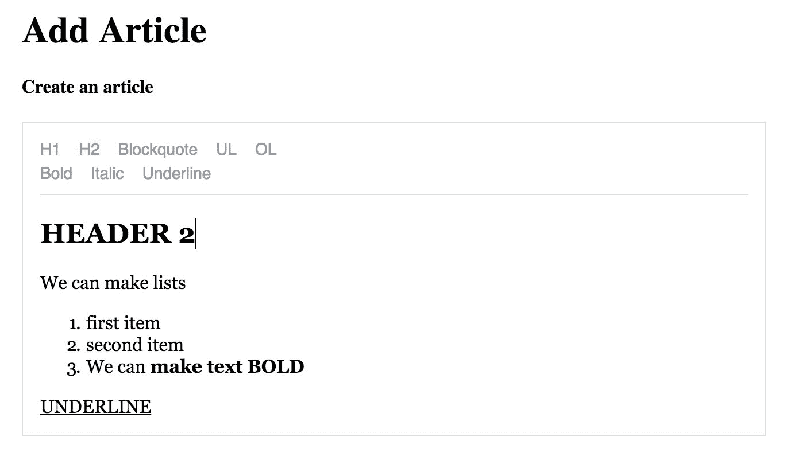

在点击`提交文章`按钮后的`AddArticleView`组件：

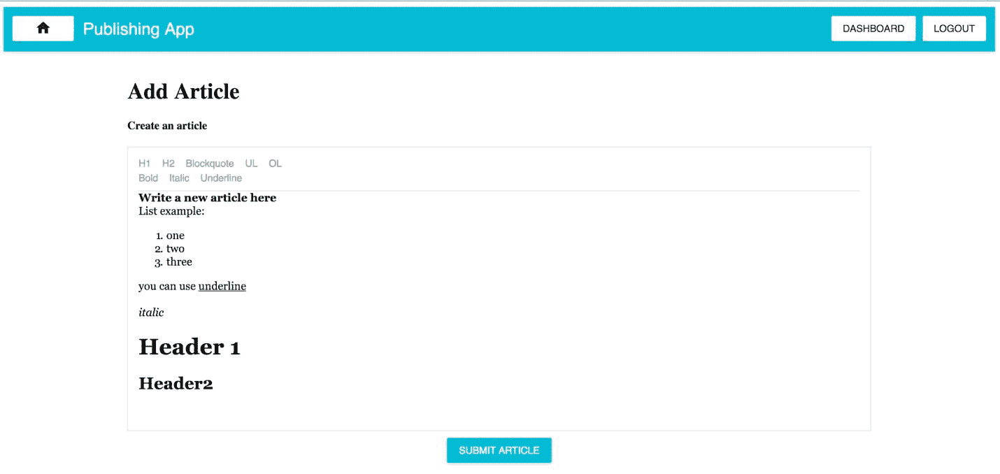

仪表板组件：

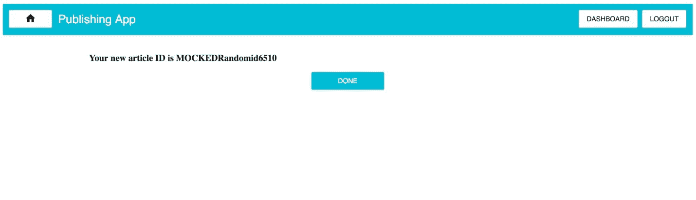

`EditArticleView`组件：

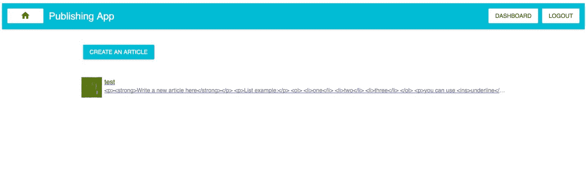

`EditArticleView`组件上的 DELETE 按钮：

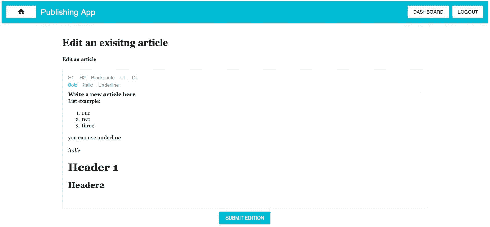

在第一次点击后的`EditArticleView`组件上的 DELETE 按钮（弹出组件）：

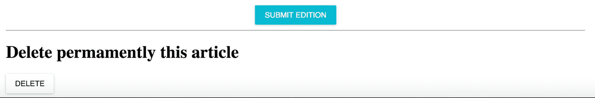

`PublishingApp`组件（主页）：

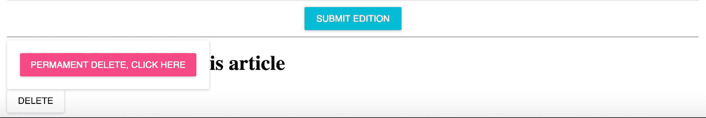

# 总结

目前，我们已经在前端使用 Redux 取得了很大的进展，将应用程序的状态存储在其单一状态树中。重要的缺点是，刷新后所有数据都会消失。

在下一章中，我们将开始实现后端，以便将文章存储在我们的数据库中。

正如您已经知道的那样，Falcor 是我们的胶水，取代了旧的流行的 RESTful 方法；您很快就会掌握与 Falcor 相关的东西。您还将了解 Relay/GraphQL 和 Falcor 之间的区别。它们都试图以非常不同的方式解决类似的问题。

让我们更深入地了解我们的全栈 Falcor 应用程序。我们将使它对我们的最终用户更加强大。
