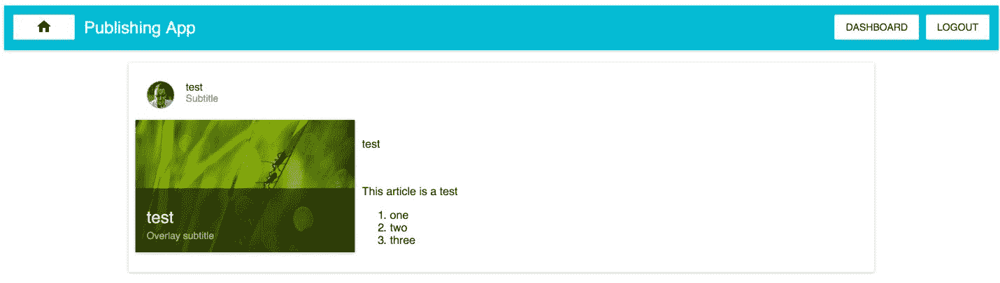
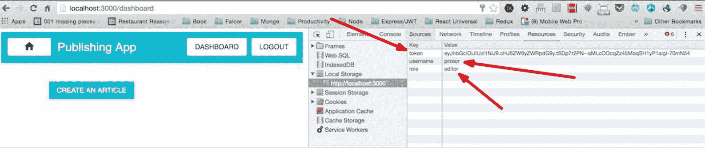
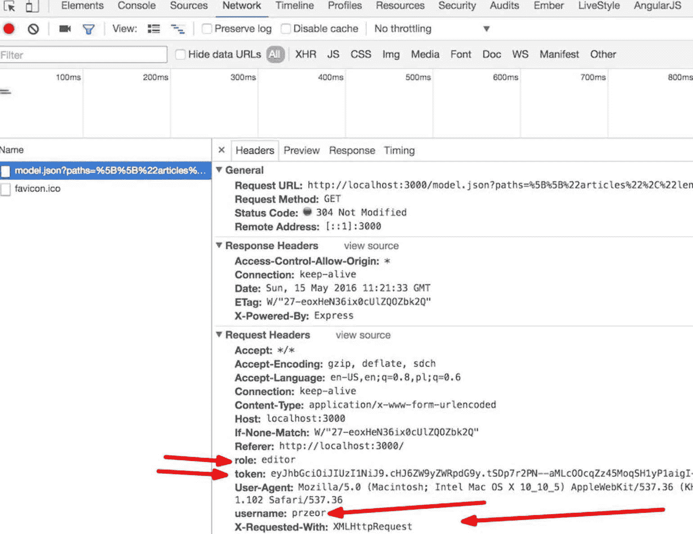
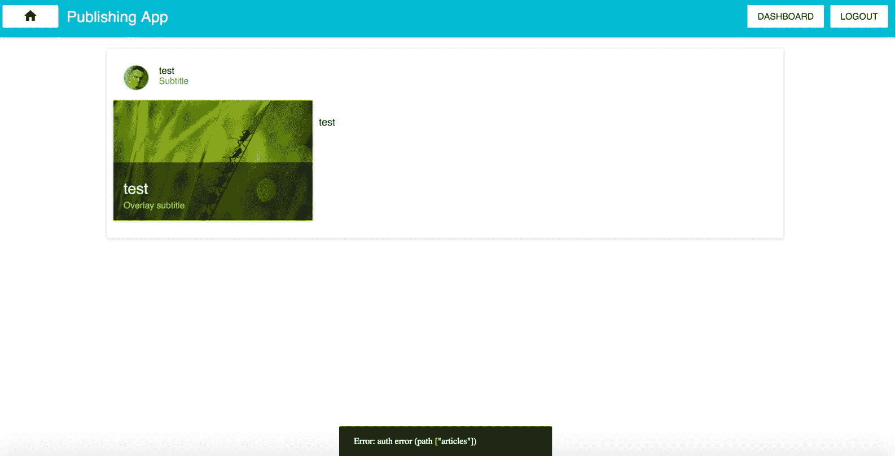

# 第五章：Falcor 的高级概念

目前，我们的应用程序具有添加、编辑和删除文章的功能，但只能在前端借助 Redux 的 reducers 的帮助下进行。我们需要添加一些全栈机制，使其能够在数据库上执行 CRUD 操作。我们还需要在后端添加一些安全功能，以便非经过身份验证的用户无法对 MongoDB 集合执行 CRUD 操作。

让我们暂停一下编码。在开始开发全栈 Falcor 机制之前，让我们更详细地讨论一下我们的 React、Node 和 Falcor 设置。

了解为什么我们选择在技术栈中使用 Falcor 很重要。总的来说，在我工作的定制软件开发公司（您可以在[www.ReactPoland.com](http://www.ReactPoland.com)找到更多信息），我们使用 Falcor，因为它在开发全栈移动/ web 应用程序的生产力方面对我们的客户有很多优势。其中一些如下：

+   这个概念的简单性

+   与 RESTful 方法相比，开发速度提高了 30％以上

+   学习曲线较浅，因此学习 Falcor 的开发人员可以很快变得有效

+   一种相当惊人的从后端到客户端获取数据的有效方式

我将暂时简短地介绍这四点。在本章的后面，您将了解在使用 Falcor 和 Node 时可能遇到的更多问题。

目前，我们已经组装了一个包含 React、Redux、Falcor、Node、Express 和 MongoDB 的全栈起始工具包。它还不完美。我们将把它作为本章的重点，其中将包括以下主题：

+   更好地理解*无 REST 数据获取*解决方案的整体情况，以及 Falcor 与 Relay/GraphQL 之间的相似性和差异

+   如何保护路由以在后端对用户进行身份验证

+   如何在后端处理错误，并借助 errorSelectors 将它们无缝地发送到前端

+   详细了解 Falcor 的 sentinels 以及`$ref`、`$atom`和`$error`在 Falcor 中的工作原理

+   JSON 图是什么以及它是如何工作的

+   Falcor 中虚拟 JSON 概念是什么

# Falcor 旨在解决的问题

在单页面应用程序时代之前，客户端获取数据并没有问题，因为所有数据都是在服务器上获取的，即使是在那时，服务器也会将 HTML 标记发送到客户端。每当有人点击 URL（`href`）时，我们的浏览器会从服务器请求全新的 HTML 标记。

基于非 SPA 应用程序的前述原则，Ruby on Rails 成为了 Web 开发技术栈的王者，但后来情况发生了变化。自 2009-2010 年以来，我们一直在创建越来越多的 JavaScript 客户端应用程序，这些应用程序更有可能从后端获取一次，例如一个`bundle.js`文件。它们被称为 SPA。

由于 SP 应用程序的趋势，出现了一些新问题，这些问题对于非 SP 应用程序的开发人员来说是未知的，比如从后端的 API 端点获取数据，以便在客户端消耗 JSON 数据。

一般来说，RESTful 应用程序的老式工作流程如下：

1.  在后端创建端点。

1.  在前端创建获取机制。

1.  根据 API 规范，在前端编写 POST/GET 请求来从后端获取数据。

1.  当你从后端获取 JSON 到前端时，你可以使用这些数据，并根据特定的用例创建 UI 视图。

如果有人，比如客户或老板改变主意，这个过程有点令人沮丧，因为你正在后端和前端实现整个代码。后来，后端 API 端点变得无关紧要，所以你需要根据更改的要求从头开始工作。

# 虚拟 JSON-一个模型到处都有

对于 Falcor 来说，一个模型到处都有是这个伟大库的主打标语。一般来说，使用它的主要目的是创建一个在前端和后端完全相同的单个 JSON 模型。这对我们意味着什么？这意味着如果有任何变化，我们需要改变模型，这个模型在后端和前端是完全相同的-所以在任何变化的情况下，我们需要调整我们的模型，而不用担心数据在后端是如何提供和在前端是如何获取的。

Falcor 的创新是引入了一个称为虚拟 JSON 的新概念（类似于 React 的虚拟 DOM）。这让你可以将所有远程数据源（例如我们的情况下的 MongoDB）表示为一个单一的领域模型。整个想法是，你以相同的方式编码，而不用关心你的数据在哪里：它是在客户端内存缓存还是在服务器上？你不需要关心，因为 Falcor 以其创新的方法为你做了很多工作（例如，使用`xhr`请求进行查询）。

数据获取对开发人员来说是一个问题。Falcor 在这里帮助简化了这个问题。你可以从后端获取数据到前端，写的代码比以往更少！

现在是 2016 年 5 月，我所看到的唯一可行的竞争对手是 Facebook 的 Relay 库（客户端）和 GraphQL（后端）。

让我们试着比较一下两者。


# Falcor 与 Relay/GraphQL

就像任何工具一样，总会有利弊。

对于小型/中型项目来说，Falcor 总是比 Relay/GraphQL 更好，至少除非你有精通 Relay/GraphQL 的高级开发人员（或者你自己是高手）。为什么呢？

总的来说，Relay（用于前端）和 GrapQL（用于后端）是两种不同的工具，你必须高效地使用才行。

在商业环境中，你通常没有太多时间从零开始学习。这也是 React 成功的原因之一。

为什么 React 取得了成功？React 更容易掌握，以便成为高效的前端开发人员。一个 CTO 或技术总监雇佣了一个懵懂的开发人员，他懂得 jQuery（例如），然后 CTO 可以轻松预测这个初级开发人员在 7 到 14 天内能够有效地使用 React；我曾经教授过一些基本了解 JavaScript/jQuery 的初级前端开发人员，我发现他们很快就能够有效地使用 React 创建客户端应用程序。

我们可以在 Falcor 中找到相同的情况。与 Relay + GraphQL 相比，Falcor 就像 React 的简单性与 Angular 的庞大框架相比一样。

前面几段描述的这个单一因素意味着 Falcor 对于预算有限的小型/中型项目来说更好。

当你有 6 个月的时间来掌握一项技术时，你可能会在像 Facebook 这样预算更大的大公司中找到学习 Relay/GraphQL 的机会。

FalcorJS 可以在两周内有效掌握，但 GraphQL + Relay 不行。

# 大局观的相似之处

这两个工具都在努力解决同样的问题。它们在设计上对开发人员和网络都是高效的（试图优化查询数量，与 RESTful 方法相比）。

它们有能力查询后端服务器以获取数据，并且具有批处理能力（因此您可以通过一次网络请求获取两个不同的数据集）。两者都具有一些缓存能力。

# 技术上的差异-概述

通过技术概述，我们可以发现，总的来说，Relay 允许您从 GraphQL 服务器查询未定义数量的项目。而在 Falcor 中，相比之下，您需要首先询问后端有多少项目，然后才能查询集合对象的详细信息（例如，在我们书中的文章）。

总的来说，这里最大的区别是 GraphQL/Relay 是一种查询语言工具，而 Falcor 不是。什么是查询语言？它是一种可以从前端进行类似于 SQL 的查询的语言，就像这样：

```jsx
post: () => Relay.QL 

  fragment on Articles { 

    title, 

    content 

  } 

```

前面的代码可以通过`Relay.QL`从前端进行查询，然后 GraphQL 会以与 SQL 相同的方式处理查询，就像这样：

```jsx
SELECT title, content FROM Articles 

```

例如，如果数据库中有一百万篇文章，而您没有预料到前端会有这么多，事情可能会变得更加困难。

在 Falcor 中，您会以不同的方式进行操作，就像您已经学到的那样：

```jsx
const articlesLength = await falcorModel. 

  getValue('articles.length'). 

  then((length) => length); 

const articles = await falcorModel. 

  get(['articles', {from: 0, to: articlesLength-1}, 

   ['_id','articleTitle', 'articleContent']]).  

  then((articlesResponse) => articlesResponse.json.articles); 

```

在前面的 Falcor 示例中，您必须首先知道 MongoDB 实例中有多少条记录。

这是最重要的区别之一，并为双方都带来了一些挑战。

对于 GraphQL 和 Relay，问题是这些查询语言的强大是否值得在学习曲线上创建的复杂性，因为对于小型/中型项目来说，这种复杂性可能不值得。

现在基本的差异已经讨论过了，让我们专注于 Falcor 和改进我们当前的发布应用程序。

# 改进我们的应用程序，使其更可靠

我们需要改进以下事项：

+   登录后，我们将在每个请求中发送用户详细信息（令牌、用户名和角色；您可以在*改进我们前端的 Falcor 代码*部分后找到截图）

+   后端需要受到保护，以便在运行后端的添加/编辑/删除操作之前检查授权

+   我们需要提供在后端捕获错误并在前端向用户通知某些功能未正常工作的能力

# 保护所需的路由权限

目前，我们的应用程序具有添加/编辑/删除路由的能力。我们当前实现的问题是我们没有检查客户端进行 CRUD 操作是否具有权限。

保护 Falcor 路由的解决方案需要对我们当前的实现进行一些更改，因此对于每个请求，在执行操作之前，我们将检查我们是否从客户端获得了正确的令牌，以及发出调用的用户是否具有编辑的能力（在我们的情况下，这意味着如果任何人具有编辑角色并且已正确使用用户名和密码进行身份验证，则可以添加/编辑/删除文章）。

# Falcor 中的 JSON 图和 JSON 信封

根据 Falcor 文档的说法，“JSON 图是一种将图信息建模为 JSON 对象的约定。使用 Falcor 的应用程序将其所有领域数据表示为单个 JSON 图对象。”

总的来说，Falcor 中的 JSON 图是有效的 JSON，具有一些新功能。更准确地说，JSON 图除了字符串、数字和布尔值之外，还引入了一种新的数据类型。Falcor 中的新数据类型称为**sentinel**。我将在本章稍后尝试解释它。

一般来说，在 Falcor 中理解的第二个最重要的事情是 JSON 信封。很棒的是它们可以直接使用，所以你不必太担心它们。但是如果你想知道简短而甜美的答案是什么，JSON 信封帮助通过 HTTP 协议发送 JSON 的模型。这是一种从前端到后端传输数据的方式（使用`.call`、`.set`和`.get`方法）。同样，在后端（在处理请求的细节之后），在将改进的模型细节发送到客户端之前，Falcor 将其放入一个*信封*中，以便可以通过网络轻松传输。

关于 JSON 信封的一个好（但不完美）类比是，你将一份书面清单放入一个信封中，因为你不想将一些有价值的信息从 A 点发送到 B 点；网络并不在乎你在信封中发送了什么。最重要的是发送方和接收方知道应用程序模型的上下文。

你可以在[`netflix.github.io/falcor/documentation/jsongraph.html`](http://netflix.github.io/falcor/documentation/jsongraph.html)找到有关 JSON 图和信封的更多信息。

# 改进我们前端的 Falcor 代码

目前，用户授权后，所有数据都保存在本地存储中。我们需要通过每个请求将这些数据（令牌、用户名和角色）发送回后端，以便我们可以再次检查用户是否被正确认证。如果没有，我们需要发送一个带有请求的认证错误，并在前端显示出来。

以下截图中的排列对于安全原因特别重要，以防止未经授权的用户在我们的数据库中添加/编辑/删除文章。



在截图中，你可以找到关于`localStorage`数据的信息。

以下是我们当前在`src/falcorModel.js`中的代码：

```jsx
// this code is already in the codebase 

const falcor = require('falcor'); 

const FalcorDataSource = require('falcor-http-datasource'); 

const model = new falcor.Model({ 

  source: new FalcorDataSource('/model.json') 

}); 

export default model; 

```

我们需要将其更改为一个新的、改进的版本：

```jsx
import falcor from 'falcor'; 

import FalcorDataSource from 'falcor-http-datasource'; 

class PublishingAppDataSource extends FalcorDataSource { 

  onBeforeRequest ( config ) { 

    const token = localStorage.token; 

    const username = localStorage.username; 

    const role = localStorage.role; 

    if (token && username && role) { 

      config.headers['token'] = token; 

      config.headers['username'] = username; 

      config.headers['role'] = role; 

    } 

  } 

} 

const model = new falcor.Model({ 

  source: new PublishingAppDataSource('/model.json') 

}); 

export default model; 

```

在上一个代码片段中我们做了什么？ECMAScript6 中的`extends`关键字展示了类语法的简洁性的一个例子。扩展`FalcorDataSource`意味着`PublishingAppDataSource`继承了`FalcorDataSource`的所有内容，并且它使`onBeforeRequest`方法具有了我们自定义的行为（通过改变`config.headers`）。`onBeforeRequest`方法在我们创建`xhr`实例之前检查了我们改变的配置。这有助于我们通过令牌、用户名和角色修改`XMLHttpRequest`，以防我们应用的用户在此期间注销，我们可以将该信息发送到后端。

在你在`falcorModel.js`中实现了之前的代码并且用户已登录后，这些变量将被添加到每个请求中：



# 改进 server.js 和 routes.js

总的来说，我们目前从`server/routes.js`文件中导出一个对象数组。我们需要改进它，所以我们将返回一个函数，该函数将修改我们的对象数组，以便我们可以控制哪个路由返回给哪个用户，并且如果用户没有有效的令牌或足够的权限，我们将返回一个错误。这将提高我们整个应用的安全性。

在`server/server.js`文件中，找到这段旧代码：

```jsx
// this shall be already in your codebase 

app.use('/model.json', falcorExpress.dataSourceRoute((req, res) 

 => { 

  return new falcorRouter(routes); 

})); 

```

用这个改进的版本替换它：

```jsx
app.use('/model.json', falcorExpress.dataSourceRoute((req, res) 

 => { 

  return new falcorRouter( 

      [] 

        .concat(routes(req, res)) 

    ); 

})); 

```

在我们的新版本中，我们假设`routes`变量是一个带有`req`和`res`变量的函数。

让我们改进路由本身，这样我们就不再返回一个数组，而是返回一个返回数组的函数（这样我们就会有更多的灵活性）。

下一步是改进`server/routes.js`文件，以便创建一个接收`currentSession`对象的函数，该对象存储有关请求的所有信息。我们需要在`routes.js`中进行这些更改：

```jsx
// this code is already in your codebase: 

const PublishingAppRoutes = [ 

    ...sessionRoutes, 

  { 

  route: 'articles.length', 

    get: () => { 

      return Article.count({}, function(err, count) { 

        return count; 

      }).then ((articlesCountInDB) => { 

        return { 

          path: ['articles', 'length'], 

          value: articlesCountInDB 

        } 

      }) 

  } 

}, 

//  

// ...... There is more code between, it has been truncated in 

 //order to save space 

// 

export default PublishingAppRoutes;  

```

我们不再导出路由数组，而是需要导出一个根据当前请求头详情返回路由的函数。

`server/routes.js`文件的顶部部分（包括导入）如下所示：

```jsx
import configMongoose from './configMongoose'; 

import sessionRoutes from './routesSession'; 

import jsonGraph from 'falcor-json-graph'; 

import jwt from 'jsonwebtoken'; 

import jwtSecret from './configSecret'; 

let $atom = jsonGraph.atom; // this will be explained later 

                            //in the chapter 

const Article = configMongoose.Article; 

```

接着导出一个新的函数：

```jsx
export default ( req, res ) => { 

  let { token, role, username } = req.headers; 

  let userDetailsToHash = username+role; 

  let authSignToken = jwt.sign(userDetailsToHash, 

   jwtSecret.secret); 

  let isAuthorized = authSignToken === token; 

  let sessionObject = {isAuthorized, role, username}; 

  console.info(&grave;The ${username} is authorized === &grave;, 

   isAuthorized); 

  const PublishingAppRoutes = [ 

      ...sessionRoutes, 

    { 

    route: 'articles.length', 

      get: () => { 

        return Article.count({}, function(err, count) { 

          return count; 

        }).then ((articlesCountInDB) => { 

          return { 

            path: ['articles', 'length'], 

            value: articlesCountInDB 

          } 

        }) 

    } 

  }]; 

  return PublishingAppRoutes; 

} 

```

首先，我们将`req`（请求详情）和`res`（代表 HTTP 响应的对象）变量传入箭头函数中。根据`req`提供的信息，我们获取头部详情（`let { token, role, username } = req.headers;`）。接下来，我们有`userDetailsToHash`，然后我们检查正确的`authToken`是什么，使用`let authSignToken = jwt.sign(userDetailsToHash, jwtSecret.secret)`。之后，我们检查用户是否经过授权，使用`let isAuthorized = authSign === token`。然后我们创建一个`sessionObject`，它将在以后的所有 Falcor 路由中重复使用（`let sessionObject = {isAuthorized, role, username};`）。

目前，我们有一个路由（`articles.length`），在第二章中描述过，*我们发布应用的全栈登录和注册*（到目前为止没有什么新的）。

正如你在前面的代码中所看到的，我们不再直接导出`PublishingAppRoutes`，而是使用箭头函数`export default (req, res)`导出。

我们需要重新添加（在`articles.length`下面）第二个路由，名为`articles[{integers}]["_id","articleTitle","articleContent"]`，在`server/routes`中加入以下代码：

```jsx
 { 

    route: 

     'articles[{integers}]["_id","articleTitle","articleContent"]', 

    get: (pathSet) => { 

      const articlesIndex = pathSet[1]; 

      return Article.find({}, function(err, articlesDocs) { 

        return articlesDocs; 

      }).then ((articlesArrayFromDB) => { 

        let results = []; 

        articlesIndex.forEach((index) => { 

          const singleArticleObject = 

           articlesArrayFromDB[index].toObject(); 

          const falcorSingleArticleResult = { 

            path: ['articles', index], 

            value: singleArticleObject 

          }; 

          results.push(falcorSingleArticleResult); 

        }); 

        return results; 

      }) 

    } 

  } 

```

这是从数据库获取文章并返回`falcor-route`的路由。它与之前介绍的完全相同；唯一不同的是现在它是函数的一部分（`export default ( req, res ) => { ... }`）。

在我们开始使用`falcor-router`在后端实现添加/编辑/删除之前，我们需要介绍一下 sentinels 的概念，因为这对我们全栈应用的健康非常重要，稍后将会解释原因。

# Falcor 的 sentinel 实现

让我们了解一下 sentinels 是什么。它们是使 Fullstack 的 Falcor 应用程序工作所必需的。这是一套你必须学会的工具。

它们是专门用于使后端和客户端之间的数据传输更加简单和开箱即用的新原始值类型（新的 Falcor 原始值的示例是`$error`和`$ref`）。这里有一个类比：在常规 JSON 中，你有字符串、数字和对象等类型。另一方面，在 Falcor 的虚拟 JSON 中，你还可以使用`$error`、`$ref`或`$atom`等 sentinel，以及之前列出的标准 JSON 类型。

有关 sentinels 的更多信息，请参阅[`netflix.github.io/falcor/documentation/model.html#sentinel-metadata`](https://netflix.github.io/falcor/documentation/model.html#sentinel-metadata)。

在这个阶段，理解 Falcor 的 sentinels 是如何工作的很重要。Falcor 中不同类型的 sentinel 在以下部分有解释。

# $ref sentinel

根据文档，“引用是一个具有`$type`键的 JSON 对象，其值为`ref`，以及一个`value`键，其值为`Path`数组。”

正如文档所述，“引用就像 UNIX 文件系统中的符号链接”，这个比喻非常好。

`$ref`的一个例子如下：

```jsx
{ $type: 'ref', value: ['articlesById', 'STRING_ARTICLE_ID_HERE'] } 

```

如果你使用`$ref(['articlesById','STRING_ARTCILE_ID_HERE'])`，它等同于前面的例子。`$ref` sentinel 是一个函数，它将数组的细节转换成`$type`和值的表示对象。

你可以在任何与 Falcor 相关的项目中找到部署/使用`$ref`的两种方法，但在我们的项目中，我们将坚持使用`$ref(['articlesById','STRING_ARTCILE_ID_HERE'])`的约定。

为了明确起见，这是如何在我们的代码库中导入`$ref` sentinel 的方法：

```jsx
// wait, this is just an example, don't code this here: 

import jsonGraph from 'falcor-json-graph'; 

let $ref = jsonGraph.ref; 

// now you can use $ref([x, y]) function 

```

在导入`falcor-json-graph`之后，你可以使用`$ref` sentinel。你已经安装了`falcor-json-graph`库，因为安装已经在前一章中描述过；如果没有，请使用以下命令：

```jsx
npm i --save falcor-json-graph@1.1.7

```

但是在整个`$ref`中，`articlesById`是什么意思？在前面的例子中，`STRING_ARTICLE_ID_HERE`又是什么意思？让我们看一个来自我们项目的例子，这可能会让你更清楚。

# $ref sentinel 的详细示例

假设我们的 MongoDB 实例中有两篇文章：

```jsx
// this is just explanation example, don't write this here 

// we assume that _id comes from MongoDB 

[ 

  { 

    _id: '987654', 

    articleTitle: 'Lorem ipsum - article one', 

    articleContent: 'Here goes the content of the article' 

  }, 

  { 

    _id: '123456', 

    articleTitle: 'Lorem ipsum - article two', 

    articleContent: 'Sky is the limit, the content goes here.' 

  } 

] 

```

所以根据我们模拟文章的数组示例（ID 为`987654`和`123456`），`$ref`将如下所示：

```jsx
// JSON envelope is an array of two $refs  

// The following is an example, don't write it 

[ 

  $ref([ articlesById,'987654' ]), 

  $ref([ articlesById,'123456' ]) 

] 

```

更详细的答案是这样的：

```jsx
// JSON envelope is an array of two $refs (other notation than 

 //above, but the same end effect) 

[ 

  { $type: 'ref', value: ['articlesById', '987654'] }, 

  { $type: 'ref', value: ['articlesById', '123456'] } 

] 

```

一个重要的事情要注意的是`articlesById`是一个尚未创建的新路由（我们将在一会儿创建）。

但是为什么我们需要在文章中使用`$ref`呢？

一般来说，你可以在许多地方保留对数据库中一个对象的引用（就像在 Unix 中的符号链接）。在我们的情况下，它是文章集合中具有特定`_id`的文章。

`$ref`哨兵什么时候派上用场？想象一下，在我们的发布应用程序模型中，我们添加了一个*最近访问*文章的功能，并提供了喜欢文章的能力（就像 Facebook 上的喜欢）。

根据这两个新功能，我们的新模型将如下所示（这只是一个例子；不要编码）：

```jsx
// this is just explanatory example code: 

let cache = { 

  articles: [ 

    { 

        id: 987654, 

        articleTitle: 'Lorem ipsum - article one', 

        articleContent: 'Here goes the content of the article' 

        numberOfLikes: 0 

    }, 

    { 

        id: 123456, 

        articleTitle: 'Lorem ipsum - article two from backend', 

        articleContent: 'Sky is the limit, the content goes 

         here.', 

        numberOfLikes: 0 

    } 

  ], 

  recentlyVisitedArticles: [ 

    { 

        id: 123456, 

        articleTitle: 'Lorem ipsum - article two from backend', 

        articleContent: 'Sky is the limit, the content goes 

         here.', 

        numberOfLikes: 0 

    } 

  ] 

}; 

```

根据我们之前的例子模型，如果有人喜欢 ID 为`123456`的文章，我们需要在两个地方更新模型。这正是`$ref`派上用场的地方。


# 使用$ref 改进我们文章的喜欢数量

让我们将我们的例子改进为以下内容：

```jsx
let cache = { 

  articlesById: { 

    987654: { 

        _id: 987654, 

        articleTitle: 'Lorem ipsum - article one', 

        articleContent: 'Here goes the content of the article' 

        numberOfLikes: 0 

    }, 

    123456: { 

        _id: 123456, 

        articleTitle: 'Lorem ipsum - article two from backend', 

        articleContent: 'Sky is the limit, the content goes 

         here.', 

        numberOfLikes: 0 

    } 

  }, 

  articles: [ 

    { $type: 'ref', value: ['articlesById', '987654'] }, 

    { $type: 'ref', value: ['articlesById', '123456'] } 

  ], 

  recentlyVisitedArticles: [ 

    { $type: 'ref', value: ['articlesById', '123456'] } 

  ] 

}; 

```

在我们新改进的`$ref`示例中，你可以找到需要告诉 Falcor 你想要在`articles`或`recentlyVisitedArticles`中拥有的文章的 ID 的表示法。Falcor 将自行遵循`$ref`哨兵，知道路由名称（在这种情况下是`articlesById`路由）和我们正在寻找的对象的 ID（在我们的例子中是`123456`或`987654`）。我们将在实践中使用它。

要理解的是，这是它的简化版本的工作方式，但为了理解`$ref`，最好的类比是 UNIX 的符号链接。

# 在我们项目中实际使用$ref

好的，这是很多理论--让我们开始编码吧！我们将改进我们的 Mongoose 模型。

然后我们将之前描述的`$ref`哨兵添加到`server/routes.js`文件中：

```jsx
// example of ref, don't write it yet: 

let articleRef = $ref(['articlesById', currentMongoID]); 

```

我们还将添加两个 Falcor 路由，`articlesById`和`articles.add`。在前端，我们将改进`src/layouts/PublishingApp.js`和`src/views/articles/AddArticleView.js`。

让我们开始吧。

# Mongoose 配置改进

我们要做的第一件事是打开`server/configMongoose.js`中的 Mongoose 模型：

```jsx
// this is old codebase, you already shall have it: 

import mongoose from 'mongoose'; 

const conf = { 

  hostname: process.env.MONGO_HOSTNAME || 'localhost', 

  port: process.env.MONGO_PORT || 27017, 

  env: process.env.MONGO_ENV || 'local', 

}; 

mongoose.connect(&grave;mongodb://${conf.hostname}:${conf.port}/ 

 ${conf.env}&grave;); 

const articleSchema = { 

  articleTitle:String, 

  articleContent:String 

} 

```

我们将把它改进为以下版本：

```jsx
import mongoose from 'mongoose'; 

const Schema = mongoose.Schema; 

const conf = { 

  hostname: process.env.MONGO_HOSTNAME || 'localhost', 

  port: process.env.MONGO_PORT || 27017, 

  env: process.env.MONGO_ENV || 'local', 

}; 

mongoose.connect(&grave;mongodb://${conf.hostname}:${conf.port}/ 

 ${conf.env}&grave;); 

const articleSchema = new Schema({ 

    articleTitle:String, 

    articleContent:String, 

    articleContentJSON: Object 

  },  

  {  

    minimize: false  

  } 

); 

```

在前面的代码中，你会发现我们导入了`new const Schema = mongoose.Schema`。稍后，我们用`articleContentJSON: Object`改进了我们的`articleSchema`。这是必需的，因为 draft-js 的状态将被保存在一个 JSON 对象中。如果用户创建一篇文章，将其保存到数据库，然后想要编辑这篇文章，这将非常有用。在这种情况下，我们将使用`articleContentJSON`来恢复 draft-js 编辑器的内容状态。

第二件事是使用`{ minimize: false }`提供选项。这是必需的，因为默认情况下，Mongoose 会清除所有空对象，比如`{ emptyObject: {}, nonEmptyObject: { test: true } }`，所以如果没有设置`minimize: false`，我们在数据库中会得到不完整的对象（在这里设置这个标志是非常重要的一步）。有一些 draft-js 对象是必需的，但默认情况下是空的（特别是 draft-js 对象的`entityMap`属性）。

# 服务器/routes.js 的改进

在`server/routes.js`文件中，我们需要开始使用`$ref`标志。你在那个文件中的导入应该如下所示：

```jsx
import configMongoose from './configMongoose'; 

import sessionRoutes from './routesSession'; 

import jsonGraph from 'falcor-json-graph'; // this is new 

import jwt from 'jsonwebtoken'; 

import jwtSecret from './configSecret'; 

let $ref = jsonGraph.ref; // this is new 

let $atom = jsonGraph.atom; // this is new 

const Article = configMongoose.Article; 

```

在前面的代码片段中，唯一新的东西是我们从`'falcor-json-graph';`导入`jsonGraph`，然后添加`let $ref = jsonGraph.ref;`和`let` `$atom = jsonGraph.atom`。

我们在我们的`routes.js`范围内添加了`$ref`标志。我们需要准备一个新的路由，`articlesById[{keys}]["_id","articleTitle","articleContent","articleContentJSON"]`，如下所示：

```jsx
 { 

    route: 'articlesById[{keys}]["_id","articleTitle", 

     "articleContent","articleContentJSON"]', 

      get: function(pathSet) { 

      let articlesIDs = pathSet[1]; 

      return Article.find({ 

            '_id': { $in: articlesIDs} 

        }, function(err, articlesDocs) { 

          return articlesDocs; 

        }).then ((articlesArrayFromDB) => { 

          let results = []; 

          articlesArrayFromDB.map((articleObject) => { 

            let articleResObj = articleObject.toObject(); 

            let currentIdString = String(articleResObj['_id']); 

            if (typeof articleResObj.articleContentJSON !== 

             'undefined') { 

              articleResObj.articleContentJSON = 

               $atom(articleResObj.articleContentJSON); 

            } 

            results.push({ 

              path: ['articlesById', currentIdString], 

              value: articleResObj 

            }); 

          }); 

          return results; 

        }); 

    } 

  }, 

```

`articlesById[{keys}]`路由已经定义，键是我们需要在请求中返回的请求 URL 的 ID，就像你在`const articlesIDs = pathSet[1];`中看到的那样。

要更具体地了解`pathSet`，请查看这个例子：

```jsx
// just an example: 

[ 

  { $type: 'ref', value: ['articlesById', '123456'] }, 

  { $type: 'ref', value: ['articlesById', '987654'] } 

] 

```

在这种情况下，`falcor-router`将遵循`articlesById`，在`pathSet`中，你将得到这个（你可以看到`pathSet`的确切值）：

```jsx
['articlesById', ['123456', '987654']] 

```

`const articlesIDs = pathSet[1]`中的`articlesIDs`的值可以在这里找到：

```jsx
['123456', '987654'] 

```

正如你稍后会发现的，我们接下来使用了这个`articlesIDs`值：

```jsx
// this is already in your codebase: 

return Article.find({ 

            '_id': { $in: articlesIDs} 

        }, function(err, articlesDocs) { 

```

正如你在`'_id': { $in: articlesIDs}`中所看到的，我们正在传递一个`articlesIDs`数组。根据这些 ID，我们将收到一组根据 ID 找到的特定文章的数组（相当于 SQL 的`WHERE`）。这里的下一步是遍历接收到的文章：

```jsx
// this already is in your codebase: 

articlesArrayFromDB.map((articleObject) => { 

```

将对象推入`results`数组：

```jsx
// this already is in your codebase: 

let articleResObj = articleObject.toObject(); 

let currentIdString = String(articleResObj['_id']); 

if (typeof articleResObj.articleContentJSON !== 'undefined') { 

  articleResObj.articleContentJSON = 

   $atom(articleResObj.articleContentJSON); 

} 

results.push({ 

  path: ['articlesById', currentIdString], 

  value: articleResObj 

}); 

```

在前面的代码片段中几乎没有什么新的。唯一新的东西是这个声明：

```jsx
// this already is in your codebase: 

if (typeof articleResObj.articleContentJSON !== 'undefined') { 

  articleResObj.articleContentJSON = 

   $atom(articleResObj.articleContentJSON); 

} 

```

我们在这里明确地使用了 Falcor 的`$atom`标记：`$atom(articleResObj.articleContentJSON);`。

# JSON 图原子

`$atom`标记是附加到值的元数据，必须由模型以不同的方式处理。你可以很简单地返回一个数字类型的值或者一个字符串类型的值给 Falcor。对于 Falcor 来说，返回一个对象就更棘手了。为什么呢？

Falcor 在大量使用 JavaScript 的对象和数组进行差异比较，当我们告诉一个对象/数组被`$atom`标记包裹（例如在我们的例子中`$atom(articleResObj.articleContentJSON)`），那么 Falcor 就知道不应该深入到这个数组/对象中。出于性能原因，它是这样设计的。

性能原因是什么？例如，如果你返回一个包含 10,000 个非常深的对象的数组而没有包裹这个数组，构建和比较模型可能需要非常非常长的时间。一般来说，出于性能原因，任何你想通过`falcor-router`返回给前端的对象和数组都必须在这样做之前被`$atom`包裹；否则，你会得到这样的错误（如果你没有用`$atom`包裹这个对象的话）：

```jsx
Uncaught MaxRetryExceededError: The allowed number of retries 

have been exceeded. 

```

这个错误将在客户端显示，当 Falcor 尝试获取那些没有在后端之前被`$atom`标记包裹的更深层对象时。

# 改进`articles[{integers}]`路由

现在我们需要返回一个`$ref`标记给`articlesById`，而不是所有文章的详细信息，所以我们需要改变这段旧代码：

```jsx
// this already shall be in your codebase: 

  { 

    route: 

     'articles[{integers}]["_id","articleTitle","articleContent"]', 

    get: (pathSet) => { 

      const articlesIndex = pathSet[1]; 

      return Article.find({}, function(err, articlesDocs) { 

        return articlesDocs; 

      }).then ((articlesArrayFromDB) => { 

        let results = []; 

        articlesIndex.forEach((index) => { 

          const singleArticleObject = 

           articlesArrayFromDB[index].toObject(); 

          const falcorSingleArticleResult = { 

            path: ['articles', index], 

            value: singleArticleObject 

          }; 

          results.push(falcorSingleArticleResult); 

        }); 

        return results; 

      }) 

    } 

  } 

```

我们将改进为这段新代码：

```jsx
 { 

    route: 'articles[{integers}]', 

    get: (pathSet) => { 

      const articlesIndex = pathSet[1]; 

      return Article.find({}, '_id', function(err, articlesDocs) { 

        return articlesDocs; 

      }).then ((articlesArrayFromDB) => { 

        let results = []; 

        articlesIndex.forEach((index) => { 

          let currentMongoID = 

           String(articlesArrayFromDB[index]['_id']); 

          let articleRef = $ref(['articlesById', currentMongoID]); 

          const falcorSingleArticleResult = { 

            path: ['articles', index], 

            value: articleRef 

          }; 

          results.push(falcorSingleArticleResult); 

        }); 

        return results; 

      }) 

    } 

  }, 

```

有什么改变吗？看看旧代码库中的路由：`articles[{integers}]["_id","articleTitle","articleContent"]`。目前，我们的`articles[{integers}]`路由在新版本中并不直接返回`for["_id","articleTitle","articleContent"]`数据，所以我们必须删除它，以便让 Falcor 知道这个事实（`articlesById`现在返回详细信息）。

下一件改变的事情是我们创建了一个新的`$ref`标记，如下所示：

```jsx
// this is already in your codebase: 

let currentMongoID = String(articlesArrayFromDB[index]['_id']); 

let articleRef = $ref(['articlesById', currentMongoID]); 

```

正如你所看到的，通过这样做，我们正在通知（使用`$ref`）`falcor-router`，如果前端请求关于`article[{integers}]`的更多信息，那么`falcor-router`应该跟随`articlesById`路由来从数据库中检索数据。

之后，查看一下这个旧路径的值：

```jsx
// old version 

const singleArticleObject = articlesArrayFromDB[index].toObject(); 

const falcorSingleArticleResult = { 

  path: ['articles', index], 

  value: singleArticleObject 

}; 

```

你会发现它已经被`articleRef`的值所替代：

```jsx
// new improved version 

let articleRef = $ref(['articlesById', currentMongoID]); 

const falcorSingleArticleResult = { 

  path: ['articles', index], 

  value: articleRef 

}; 

```

您可能已经注意到，在旧版本中，我们返回了有关文章的所有信息（`singleArticleObject` 变量），但在新版本中，我们只返回了 `$ref` 哨兵（`articleRef`）。

`$ref` 哨兵使 `falcor-router` 在后端自动跟随，因此如果在第一个路由中有任何引用，Falcor 将解析所有 `$ref` 哨兵，直到获取所有待定数据；之后，它以单个请求返回数据，这样可以节省大量的延迟（而不是执行多个 HTTP 请求，所有跟随 `$refs` 的内容都在浏览器到后端的一次调用中获取）。

# 在 server/routes.js 中的新路由：articles.add

我们唯一需要做的就是在路由器中添加一个新的 `articles.add` 路由：

```jsx
 { 

    route: 'articles.add', 

    call: (callPath, args) => { 

      const newArticleObj = args[0]; 

      var article = new Article(newArticleObj); 

      return article.save(function (err, data) { 

        if (err) { 

          console.info('ERROR', err); 

          return err; 

        } 

        else { 

          return data; 

        } 

      }).then ((data) => { 

        return Article.count({}, function(err, count) { 

        }).then((count) => { 

          return { count, data }; 

        }); 

      }).then ((res) => { 

        // 

        // we will add more stuff here in a moment, below 

        // 

        return results; 

      }); 

    } 

  } 

```

正如您在这里所看到的，我们从前端接收了一个新文章的详细信息 `const newArticleObj = args[0];`，然后我们用 `var article = new Article(newArticleObj);` 创建了一个新的 `Article` 模型。之后，`article` 变量有一个 `.save` 方法，在下一个查询中调用。我们执行两个从 Mongoose 返回的 promise 查询。这是第一个：

```jsx
return article.save(function (err, data) { 

```

这个 `.save` 方法简单地帮助我们将文档插入数据库。保存文章后，我们需要计算数据库中有多少文章，因此我们运行第二个查询：

```jsx
return Article.count({}, function(err, count) { 

```

保存文章并计数后，我们返回该信息（`return { count, data };`）。最后一件事是将新文章 ID 和计数数字从后端返回到前端，借助 `falcor-router` 的帮助，因此我们替换这个注释：

```jsx
// 

// we will add more stuff here in a moment, below 

// 

```

在其位置，我们将有这段新代码，帮助我们实现这些事情：

```jsx
 let newArticleDetail = res.data.toObject(); 

 let newArticleID = String(newArticleDetail['_id']); 

 let NewArticleRef = $ref(['articlesById', newArticleID]); 

 let results = [ 

   { 

     path: ['articles', res.count-1], 

     value: NewArticleRef 

   }, 

   { 

     path: ['articles', 'newArticleID'], 

     value: newArticleID 

   }, 

   { 

     path: ['articles', 'length'], 

     value: res.count 

   } 

 ]; 

 return results; 

```

正如您在前面的代码片段中所看到的，我们在这里获取了 `newArticleDetail` 的详细信息。接下来，我们用 `newArticleID` 获取新的 ID，并确保它是一个字符串。在所有这些之后，我们用 `let NewArticleRef = $ref(['articlesById', newArticleID]);` 定义了一个新的 `$ref` 哨兵。

在 `results` 变量中，您可以找到三条新路径：

+   `path: ['articles', res.count-1]`：此路径构建模型，因此在客户端接收响应后，我们可以在 Falcor 模型中获取所有信息

+   `path: ['articles', 'newArticleID']`：这有助于我们快速在前端获取新的 ID

+   `path: ['articles', 'length']`：当然，这会更新文章集合的长度，因此在添加新文章后，前端的 Falcor 模型可以获得最新的信息

我们刚刚为添加文章创建了一个后端路由。现在让我们开始在前端工作，这样我们就能将所有新文章推送到数据库中。

# 前端更改以添加文章

在`src/layouts/PublishingApp.js`文件中，找到这段代码：

```jsx
get(['articles', {from: 0, to: articlesLength-1}, ['_id','articleTitle', 'articleContent']]). 

```

将其改为带有`articleContentJSON`的改进版本：

```jsx
get(['articles', {from: 0, to: articlesLength-1}, ['_id','articleTitle', 'articleContent', 'articleContentJSON']]).  

```

下一步是改进我们在`src/views/articles/AddArticleView.js`中的`_submitArticle`函数，并添加一个`falcorModel`导入：

```jsx
// this is old function to replace: 

  _articleSubmit() { 

    let newArticle = { 

      articleTitle: this.state.title, 

      articleContent: this.state.htmlContent, 

      articleContentJSON: this.state.contentJSON 

    } 

    let newArticleID = 'MOCKEDRandomid' + Math.floor(Math.random() *    

    10000); 

    newArticle['_id'] = newArticleID; 

    this.props.articleActions.pushNewArticle(newArticle); 

    this.setState({ newArticleID: newArticleID}); 

  } 

```

用以下改进版本替换此代码：

```jsx
 async _articleSubmit() { 

    let newArticle = { 

      articleTitle: this.state.title, 

      articleContent: this.state.htmlContent, 

      articleContentJSON: this.state.contentJSON 

    } 

    let newArticleID = await falcorModel 

      .call( 

            'articles.add', 

            [newArticle] 

          ). 

      then((result) => { 

        return falcorModel.getValue( 

            ['articles', 'newArticleID'] 

          ).then((articleID) => { 

            return articleID; 

          }); 

      }); 

    newArticle['_id'] = newArticleID; 

    this.props.articleActions.pushNewArticle(newArticle); 

    this.setState({ newArticleID: newArticleID}); 

  } 

```

另外，在`AddArticleView.js`文件的顶部添加此导入；否则，`async_articleSumbit`将无法工作：

```jsx
import falcorModel from '../../falcorModel.js'; 

```

如你所见，我们在函数名之前添加了`async`关键字（`async _articleSubmit()`）。新的东西是这个请求：

```jsx
// this already is in your codebase: 

let newArticleID = await falcorModel 

  .call( 

        'articles.add', 

        [newArticle] 

      ). 

  then((result) => { 

    return falcorModel.getValue( 

        ['articles', 'newArticleID'] 

      ).then((articleID) => { 

        return articleID; 

      }); 

  }); 

```

在这里，我们等待`falcorModel.call`。在`.call`参数中，我们添加`newArticle`。然后，在承诺解决后，我们检查`newArticleID`是什么，如下所示：

```jsx
// this already is in your codebase: 

return falcorModel.getValue( 

        ['articles', 'newArticleID'] 

      ).then((articleID) => { 

        return articleID; 

      }); 

```

之后，我们简单地使用与旧版本完全相同的东西：

```jsx
newArticle['_id'] = newArticleID; 

this.props.articleActions.pushNewArticle(newArticle); 

this.setState({ newArticleID: newArticleID}); 

```

这只是通过`articleActions`将更新的`newArticle`与来自 MongoDB 的真实 ID 推送到文章的 reducer 中。我们还使用`setState`与`newArticleID`，这样你就可以看到新文章已经正确地使用真实的 Mongo ID 创建了。

# 关于路由返回的重要说明

你应该知道，在每个路由中，我们返回一个对象或一个对象数组；即使只有一个路由返回，这两种方法都可以。例如：

```jsx
// this already is in your codebase (just an example) 

    { 

    route: 'articles.length', 

      get: () => { 

        return Article.count({}, function(err, count) { 

          return count; 

        }).then ((articlesCountInDB) => { 

          return { 

            path: ['articles', 'length'], 

            value: articlesCountInDB 

          } 

        }) 

    } 

  },  

```

这也可以返回一个包含一个对象的数组，如下所示：

```jsx
     get: () => { 

        return Article.count({}, function(err, count) { 

          return count; 

        }).then ((articlesCountInDB) => { 

          return [ 

            { 

              path: ['articles', 'length'], 

              value: articlesCountInDB 

            } 

          ] 

        }) 

    } 

```

如你所见，即使只有一个`articles.length`，我们也返回一个数组（而不是单个对象），这也可以工作。

出于先前描述的同样原因，这就是为什么在`articlesById`中，我们将多个路由推送到数组中的原因：

```jsx
// this is already in your codebase 

let results = []; 

articlesArrayFromDB.map((articleObject) => { 

  let articleResObj = articleObject.toObject(); 

  let currentIdString = String(articleResObj['_id']); 

  if (typeof articleResObj.articleContentJSON !== 'undefined') { 

    articleResObj.articleContentJSON = 

     $atom(articleResObj.articleContentJSON); 

  } 

  // pushing multiple routes 

  results.push({ 

    path: ['articlesById', currentIdString], 

    value: articleResObj 

  }); 

}); 

return results; // returning array of routes' objects 

```

这是在 Falcor 章节中值得一提的一件事。

# 全栈 - 编辑和删除文章

让我们在`server/routes.js`文件中创建一个用于更新现有文档（编辑功能）的路由：

```jsx
 { 

  route: 'articles.update', 

  call: async (callPath, args) =>  

    { 

      let updatedArticle = args[0]; 

      let articleID = String(updatedArticle._id); 

      let article = new Article(updatedArticle); 

      article.isNew = false; 

      return article.save(function (err, data) { 

        if (err) { 

          console.info('ERROR', err); 

          return err; 

        } 

      }).then ((res) => { 

        return [ 

          { 

            path: ['articlesById', articleID], 

            value: updatedArticle 

          }, 

          { 

            path: ['articlesById', articleID], 

            invalidate: true 

          } 

        ]; 

      }); 

    } 

  }, 

```

正如你在这里所看到的，我们仍然使用`article.save`方法，类似于`articles.add`路由。需要注意的重要事情是，Mongoose 要求`isNew`标志为`false`（`article.isNew = false;`）。如果你不给出这个标志，那么你将会得到一个类似于这样的 Mongoose 错误：

```jsx
{"error":{"name":"MongoError","code":11000,"err":"insertDocument 

 :: caused by :: 11000 E11000 duplicate key error index: 

 staging.articles.$_id _ dup key: { : 

 ObjectId('1515b34ed65022ec234b5c5f') }"}} 

```

其余的代码非常简单；我们保存文章的模型，然后通过`falcor-router`返回更新后的模型，如下所示：

```jsx
// this is already in your code base: 

return [ 

  { 

    path: ['articlesById', articleID], 

    value: updatedArticle 

  }, 

  { 

    path: ['articlesById', articleID], 

    invalidate: true 

  } 

]; 

```

新的东西是`invalidate`标志。正如文档中所述，“invalidate 方法同步从模型缓存中移除多个路径或路径集。”换句话说，您需要告诉前端的 Falcor 模型，在`["articlesById", articleID]`路径中有些东西已经改变，这样您就可以在后端和前端都有同步的数据。

关于 Falcor 中的`invalidate`更多内容，您可以访问[`netflix.github.io/falcor/doc/Model.html#invalidate`](https://netflix.github.io/falcor/doc/Model.html#invalidate)。

# 删除文章

为了实现`delete`功能，我们需要创建一个新的路由：

```jsx
 { 

  route: 'articles.delete', 

  call: (callPath, args) =>  

    { 

      const toDeleteArticleId = args[0]; 

      return Article.find({ _id: toDeleteArticleId }). 

       remove((err) => { 

        if (err) { 

          console.info('ERROR', err); 

          return err; 

        } 

      }).then((res) => { 

        return [ 

          { 

            path: ['articlesById', toDeleteArticleId], 

            invalidate: true 

          } 

        ] 

      }); 

    } 

  } 

```

这也使用了`invalidate`，但这次，这是我们在这里返回的唯一内容，因为文档已被删除，所以我们需要做的唯一事情就是通知浏览器缓存旧文章已被作废，没有任何需要替换的内容，就像更新示例中一样。


# 前端-编辑和删除

我们已经在后端实现了`update`和`delete`路由。接下来，在`src/views/articles/EditArticleView.js`文件中，您需要找到这段代码：

```jsx
// this is old already in your codebase: 

  _articleEditSubmit() { 

    let currentArticleID = this.state.editedArticleID; 

    let editedArticle = { 

      _id: currentArticleID, 

      articleTitle: this.state.title, 

      articleContent: this.state.htmlContent, 

      articleContentJSON: this.state.contentJSON 

    } 

    this.props.articleActions.editArticle(editedArticle); 

    this.setState({ articleEditSuccess: true }); 

  } 

```

将其替换为这个`async _articleEditSubmit`函数：

```jsx
 async _articleEditSubmit() { 

    let currentArticleID = this.state.editedArticleID; 

    let editedArticle = { 

      _id: currentArticleID, 

      articleTitle: this.state.title, 

      articleContent: this.state.htmlContent, 

      articleContentJSON: this.state.contentJSON 

    } 

    let editResults = await falcorModel 

      .call( 

            ['articles', 'update'], 

            [editedArticle] 

          ). 

      then((result) => { 

        return result; 

      }); 

    this.props.articleActions.editArticle(editedArticle); 

    this.setState({ articleEditSuccess: true }); 

  } 

```

正如您在这里所看到的，最重要的是我们在`_articleEditSubmit`函数中实现了`.call`函数，该函数使用`editedArticle`变量发送编辑对象的详细信息。

在同一文件中，找到`_handleDeletion`方法：

```jsx
// old version 

  _handleDeletion() { 

    let articleID = this.state.editedArticleID; 

    this.props.articleActions.deleteArticle(articleID); 

    this.setState({ 

      openDelete: false 

    }); 

    this.props.history.pushState(null, '/dashboard'); 

  } 

```

将其更改为新的改进版本：

```jsx
 async _handleDeletion() { 

    let articleID = this.state.editedArticleID; 

    let deletetionResults = await falcorModel 

      .call( 

            ['articles', 'delete'], 

            [articleID] 

          ). 

      then((result) => { 

        return result; 

      }); 

    this.props.articleActions.deleteArticle(articleID); 

    this.setState({ 

      openDelete: false 

    }); 

    this.props.history.pushState(null, '/dashboard'); 

  } 

```

与删除类似，唯一的区别是我们只用`.call`发送了被删除文章的`articleID`。

# 保护 CRUD 路由

我们需要实现一种方式来保护所有添加/编辑/删除路由，并且还要以一种通用的**DRY**（**不要重复自己**）的方式通知用户后端发生的错误。例如，在前端可能发生的错误，我们需要在 React 实例的客户端应用程序中用错误消息通知用户：

+   **认证错误**：您无权执行该操作

+   **超时错误**：例如，您使用外部 API 的服务；我们需要通知用户任何潜在的错误

+   **数据不存在**：可能会有一种情况，用户会调用我们数据库中不存在的文章的 ID，所以让我们通知他

总的来说，我们目前的目标是创建一种通用的方式，将后端的所有潜在错误消息传递到客户端，以便我们可以改善使用我们应用程序的一般体验。

# $error 哨兵基础知识

有一个`$error`哨兵（与 Falcor 相关的变量类型），通常是返回错误的一种方法。

通常情况下，正如你应该已经知道的那样，Falcor 会批量处理请求。由于这些请求，你可以在一个 HTTP 请求中从不同的 falcor-routes 获取数据。以下示例是你可以一次性获取的内容：

+   **一个数据集**：完整且准备好检索

+   **第二个数据集**：第二个数据集，可能包含错误

当第二个数据集中存在错误时，我们不希望影响一个数据集的获取过程（需要记住，我们示例中的两个数据集是在一个请求中获取的）。

文档中可能有助于您了解 Falcor 中错误处理的有用部分在这里：

[`netflix.github.io/falcor/doc/Model.html#~errorSelector`](https://netflix.github.io/falcor/doc/Model.html#~errorSelector)

[`netflix.github.io/falcor/documentation/model.html#error-handling`](https://netflix.github.io/falcor/documentation/model.html#error-handling)

[`netflix.github.io/falcor/documentation/router.html`](http://netflix.github.io/falcor/documentation/router.html)（在此页面上搜索`$error`以查找文档中更多示例）

# 在客户端上实现 DRY 错误管理

让我们从对 CoreLayout（`src/layouts/CoreLayout.js`）的改进开始。在`AppBar`下，导入一个新的`snackbar`组件：

```jsx
import AppBar from 'material-ui/lib/app-bar'; 

import Snackbar from 'material-ui/lib/snackbar'; 

```

然后，在导入之外的 CoreLayout 下，创建一个新的函数并导出它：

```jsx
let errorFuncUtil =  (errMsg, errPath) => { 

} 

export { errorFuncUtil as errorFunc }; 

```

然后找到`CoreLayout`构造函数，将其更改为在基本情况下使用导出的名为`errorFuncUtil`的函数作为回调，以处理 Falcor`$error`哨兵返回的错误：

```jsx
// old constructor 

constructor(props) { 

  super(props); 

} 

```

这是新的：

```jsx
constructor(props) { 

  super(props); 

    this.state = { 

      errorValue: null 

    } 

  if (typeof window !== 'undefined') { 

    errorFuncUtil = this.handleFalcorErrors.bind(this); 

  } 

} 

```

正如你在这里找到的那样，我们引入了一个新的`errorValue`状态（默认状态为`null`）。然后，仅在前端（因为`if(typeof window !== 'undefined'`），我们将`this.handleErrors.bind(this)`分配给我们的`errorFuncUtil`。

正如您将在一会儿发现的那样，这是因为导出的`errorFuncUtil`将在我们的`falcorModel.js`中导入，我们将以最佳的 DRY 方式通知我们的 CoreLayout 有关 Falcor 后端发生的任何错误。这样做的好处是我们只需实现一次，但它将是通知我们客户端应用用户任何错误的通用方式（并且还将节省我们将来的开发工作，因为任何错误都将由我们现在正在实现的方法处理）。

我们需要向我们的 CoreLayout 添加一个名为`handleFalcorErrors`的新函数：

```jsx
handleFalcorErrors(errMsg, errPath) { 

  let errorValue = &grave;Error: ${errMsg} (path ${JSON.stringify(errPath)})&grave; 

  this.setState({errorValue}); 

} 

```

`handleFalcorErrors`函数正在设置我们错误的新状态。我们将为用户组合我们的错误与`errMsg`（我们将在后端创建这个，您一会儿会了解）和`errPath`（可选的，但这是发生错误的`falcor-route`路径）。

好的，我们已经准备就绪；`CoreLayout`函数唯一缺少的是改进后的渲染。CoreLayout 的新渲染如下：

```jsx
 render () { 

    let errorSnackbarJSX = null; 

    if (this.state.errorValue) { 

      errorSnackbarJSX = <Snackbar 

        open={true} 

        message={this.state.errorValue} 

        autoHideDuration={8000} 

        onRequestClose={ () => console.log('You can add custom 

         onClose code') } />; 

    } 

    const buttonStyle = { 

      margin: 5 

    }; 

    const homeIconStyle = { 

      margin: 5, 

      paddingTop: 5 

    }; 

    let menuLinksJSX; 

    let userIsLoggedIn = typeof localStorage !== 'undefined' && 

     localStorage.token && this.props.routes[1].name !== 'logout'; 

    if (userIsLoggedIn) { 

      menuLinksJSX = ( 

  <span> 

        <Link to='/dashboard'> 

     <RaisedButton label='Dashboard' style={buttonStyle}  /> 

  </Link>  

        <Link to='/logout'> 

     <RaisedButton label='Logout' style={buttonStyle}  /> 

  </Link>  

      </span>); 

    } else { 

      menuLinksJSX = ( 

  <span> 

          <Link to='/register'> 

      <RaisedButton label='Register' style={buttonStyle}  /> 

  </Link>  

        <Link to='/login'> 

    <RaisedButton label='Login' style={buttonStyle}  /> 

  </Link>  

      </span>); 

    } 

    let homePageButtonJSX = ( 

    <Link to='/'> 

        <RaisedButton label={<ActionHome />} 

         style={homeIconStyle}  /> 

      </Link>); 

    return ( 

        <div> 

          {errorSnackbarJSX} 

          <AppBar 

            title='Publishing App' 

            iconElementLeft={homePageButtonJSX} 

            iconElementRight={menuLinksJSX} /> 

            <br/> 

            {this.props.children} 

        </div> 

    ); 

  } 

```

正如您在这里找到的那样，新部分与 Material-UI 的`snackbar`组件相关。看一下这个：

```jsx
let errorSnackbarJSX = null; 

if (this.state.errorValue) { 

  errorSnackbarJSX = <Snackbar 

    open={true} 

    message={this.state.errorValue} 

    autoHideDuration={8000} />; 

} 

```

这段代码片段正在准备我们的`erroSnackbarJSX`和以下内容：

```jsx
  <div> 

    {errorSnackbarJSX} 

    <AppBar 

      title='Publishing App' 

      iconElementLeft={homePageButtonJSX} 

      iconElementRight={menuLinksJSX} /> 

      <br/> 

      {this.props.children} 

  </div> 

```

确保`{errorSnackbarJSX}`放置在与此示例完全相同的位置。否则，在应用程序的测试运行过程中可能会遇到一些问题。您现在已经完成了与 CoreLayout 改进相关的所有工作。

# 调整 - 前端的 FalcorModel.js

在`src/falcorModel.js`文件中，识别以下代码：

```jsx
// already in your codebase, old code: 

import falcor from 'falcor'; 

import FalcorDataSource from 'falcor-http-datasource'; 

class PublishingAppDataSource extends FalcorDataSource { 

  onBeforeRequest ( config ) { 

    const token = localStorage.token; 

    const username = localStorage.username; 

    const role = localStorage.role; 

    if (token && username && role) { 

      config.headers['token'] = token; 

      config.headers['username'] = username; 

      config.headers['role'] = role; 

    } 

  } 

} 

const model = new falcor.Model({ 

  source: new PublishingAppDataSource('/model.json') 

}); 

export default model; 

```

这段代码必须通过向`falcor.Model`添加一个新选项来改进：

```jsx
import falcor from 'falcor'; 

import FalcorDataSource from 'falcor-http-datasource'; 

import {errorFunc} from './layouts/CoreLayout'; 

class PublishingAppDataSource extends FalcorDataSource { 

  onBeforeRequest ( config ) { 

    const token = localStorage.token; 

    const username = localStorage.username; 

    const role = localStorage.role; 

    if (token && username && role) { 

      config.headers['token'] = token; 

      config.headers['username'] = username; 

      config.headers['role'] = role; 

    } 

  } 

} 

let falcorOptions = { 

  source: new PublishingAppDataSource('/model.json'),    

  errorSelector: function(path, error) { 

    errorFunc(error.value, path); 

    error.$expires = -1000 * 60 * 2; 

    return error; 

  }  

}; 

const model = new falcor.Model(falcorOptions); 

export default model; 

```

我们添加的第一件事是将`errorFunc`导入到该文件的顶部：

```jsx
import {errorFunc} from './layouts/CoreLayout'; 

```

除了`errorFunc`，我们还引入了`falcorOptions`变量。源代码与上一个版本相同。我们添加了`errorSelector`，每当客户端调用后端并且后端的`falcor-router`返回`$error` sentinel 时都会运行它。

有关错误选择器的更多详细信息，请访问[`netflix.github.io/falcor/documentation/model.html#the-errorselector-value`](https://netflix.github.io/falcor/documentation/model.html#the-errorselector-value)。

# $error sentinel 的后端实现

我们将分两步执行后端实现：

1.  一个错误示例，只是为了测试我们的客户端代码。

1.  在我们确保错误处理工作正常之后，我们将适当地保护端点。

# 测试我们与$error 相关的代码

让我们从`server/routes.js`文件中的导入开始：

```jsx
import configMongoose from './configMongoose'; 

import sessionRoutes from './routesSession'; 

import jsonGraph from 'falcor-json-graph'; 

import jwt from 'jsonwebtoken'; 

import jwtSecret from './configSecret'; 

let $ref = jsonGraph.ref; 

let $atom = jsonGraph.atom; 

let $error = jsonGraph.error; 

const Article = configMongoose.Article; 

```

唯一的新内容是你需要从`falcor-json-graph`中导入`$error`标记。

我们的`$error`测试的目标是替换一个负责获取文章的工作路由`(articles[{integers}])`。在我们破坏这个路由之后，我们将能够测试我们的前端和后端设置是否正常工作。在我们测试错误之后（参考下一个截图），我们将从`articles[{integers}]`中删除这个破坏性的`$error`代码。继续阅读以获取详细信息。

用`article`路由进行测试：

```jsx
 { 

    route: 'articles[{integers}]', 

    get: (pathSet) => { 

      const articlesIndex = pathSet[1]; 

      return { 

        path: ['articles'], 

        value: $error('auth error') 

      } 

      return Article.find({}, '_id', function(err, articlesDocs) { 

        return articlesDocs; 

      }).then ((articlesArrayFromDB) => { 

        let results = []; 

        articlesIndex.forEach((index) => { 

          let currentMongoID = 

           String(articlesArrayFromDB[index]['_id']); 

          let articleRef = $ref(['articlesById', currentMongoID]); 

          const falcorSingleArticleResult = { 

            path: ['articles', index], 

            value: articleRef 

          }; 

          results.push(falcorSingleArticleResult); 

        }); 

        return results; 

      }) 

    } 

  }, 

```

正如你所看到的，这只是一个测试。我们将在稍后改进这段代码，但让我们测试一下`$error('auth error')`中的文本是否会显示给用户。

运行 MongoDB：

```jsx
$ mongod 

```

然后，在另一个终端中运行服务器：

```jsx
$ npm start

```

当你运行这两个命令后，将你的浏览器指向`http://localhost:3000`，你将在 8 秒内看到这个错误：



正如你所看到的，在窗口底部有黑色背景上的白色文本：



如果你运行应用，在主页上看到与截图上相同的错误消息，那么它告诉你一切都很好！

# 在成功测试后清理$error

当你确信错误处理对你起作用时，你可以替换旧代码：

```jsx
 { 

    route: 'articles[{integers}]', 

    get: (pathSet) => { 

      const articlesIndex = pathSet[1]; 

      return { 

        path: ['articles'], 

        value: $error('auth error') 

      } 

      return Article.find({}, '_id', function(err, articlesDocs) { 

```

将其更改为以下内容，不返回错误：

```jsx
 { 

    route: 'articles[{integers}]', 

    get: (pathSet) => { 

      const articlesIndex = pathSet[1]; 

      return Article.find({}, '_id', function(err, articlesDocs) { 

```

现在，当你尝试从后端获取文章时，应用将正常工作而不会抛出错误。

# 结束路由的安全性

我们已经在`server/routes.js`中实现了一些逻辑，用于检查用户是否被授权，具体如下：

```jsx
// this already is in your codebase: 

export default ( req, res ) => { 

  let { token, role, username } = req.headers; 

  let userDetailsToHash = username+role; 

  let authSignToken = jwt.sign(userDetailsToHash, jwtSecret.secret); 

  let isAuthorized = authSignToken === token; 

  let sessionObject = {isAuthorized, role, username}; 

  console.info(&grave;The ${username} is authorized === &grave;, isAuthorized); 

```

在这段代码中，你会发现我们可以在每个需要授权和编辑者角色的开头创建以下逻辑：

```jsx
// this is example of falcor-router $errors, don't write it: 

if (isAuthorized === false) { 

  return { 

    path: ['HERE_GOES_THE_REAL_FALCOR_PATH'], 

    value: $error('auth error') 

  } 

} elseif(role !== 'editor') { 

  return { 

    path: ['HERE_GOES_THE_REAL_FALCOR_PATH'], 

    value: $error('you must be an editor in order 

     to perform this action') 

  } 

} 

```

正如你在这里所看到的，这只是一个例子（暂时不要更改它；我们将在稍后实现它），使用`path['HERE_GOES_THE_REAL_FALCOR_PATH']`。

首先，我们检查用户是否被授权，使用`isAuthorized === false`；如果未被授权，他将看到一个错误（使用我们刚刚实现的通用错误机制）：


将来，我们的发布应用可能会有更多的角色，所以如果有人不是编辑者，那么他将在错误中看到以下内容：


# 需要保护的路由

对于需要在我们应用的文章中进行授权的路由（`server/routes.js`），添加以下内容：

```jsx
route: 'articles.add', 

```

以下是旧代码：

```jsx
// this is already in your codebase, old code: 

  { 

    route: 'articles.add', 

    call: (callPath, args) => { 

      const newArticleObj = args[0]; 

      var article = new Article(newArticleObj); 

      return article.save(function (err, data) { 

        if (err) { 

          console.info('ERROR', err); 

          return err; 

        } 

        else { 

          return data; 

        } 

      }).then ((data) => { 

// code has been striped out from here for the sake of brevity, 

 nothing changes below 

```

带有`auth`检查的新代码如下：

```jsx
 { 

    route: 'articles.add', 

    call: (callPath, args) => { 

      if (sessionObject.isAuthorized === false) { 

        return { 

          path: ['articles'], 

          value: $error('auth error') 

        } 

      } else if(sessionObject.role !== 'editor' && 

       sessionObject.role !== 'admin') { 

        return { 

          path: ['articles'], 

          value: $error('you must be an editor 

           in order to perform this action') 

        } 

      } 

      const newArticleObj = args[0]; 

      var article = new Article(newArticleObj); 

      return article.save(function (err, data) { 

        if (err) { 

          console.info('ERROR', err); 

          return err; 

        } 

        else { 

          return data; 

        } 

      }).then ((data) => { 

// code has been striped out from here for 

 //the sake of brevity, nothing changes below 

```

正如你在这里找到的，我们已经添加了两个带有`isAuthorized === false`和`role !== 'editor'`的检查。以下路由内容几乎相同（只是路径有些变化）。

这是`articles`的更新：

```jsx
route: 'articles.update', 

```

这是旧代码：

```jsx
// this is already in your codebase, old code: 

  { 

  route: 'articles.update', 

  call: async (callPath, args) =>  

    { 

      const updatedArticle = args[0]; 

      let articleID = String(updatedArticle._id); 

      let article = new Article(updatedArticle); 

      article.isNew = false; 

      return article.save(function (err, data) { 

        if (err) { 

          console.info('ERROR', err); 

          return err; 

        } 

      }).then ((res) => { 

// code has been striped out from here for the 

 //sake of brevity, nothing changes below 

```

带有`auth`检查的新代码如下：

```jsx
 { 

  route: 'articles.update', 

  call: async (callPath, args) =>  

    { 

      if (sessionObject.isAuthorized === false) { 

        return { 

          path: ['articles'], 

          value: $error('auth error') 

        } 

      } else if(sessionObject.role !== 'editor' && 

       sessionObject.role !== 'admin') { 

        return { 

          path: ['articles'], 

          value: $error('you must be an editor 

           in order to perform this action') 

        } 

      } 

      const updatedArticle = args[0]; 

      let articleID = String(updatedArticle._id); 

      let article = new Article(updatedArticle); 

      article.isNew = false; 

      return article.save(function (err, data) { 

        if (err) { 

          console.info('ERROR', err); 

          return err; 

        } 

      }).then ((res) => { 

// code has been striped out from here 

 //for the sake of brevity, nothing changes below 

articles delete: 

route: 'articles.delete', 

```

找到这段旧代码：

```jsx
// this is already in your codebase, old code: 

  { 

  route: 'articles.delete', 

  call: (callPath, args) =>  

    { 

      let toDeleteArticleId = args[0]; 

      return Article.find({ _id: toDeleteArticleId }).remove((err) => { 

        if (err) { 

          console.info('ERROR', err); 

          return err; 

        } 

      }).then((res) => { 

// code has been striped out from here 

 //for the sake of brevity, nothing changes below 

```

用带有`auth`检查的新代码替换它：

```jsx
 { 

  route: 'articles.delete', 

  call: (callPath, args) =>  

    { 

      if (sessionObject.isAuthorized === false) { 

        return { 

          path: ['articles'], 

          value: $error('auth error') 

        } 

      } else if(sessionObject.role !== 'editor' && 

       sessionObject.role !== 'admin') { 

        return { 

          path: ['articles'], 

          value: $error('you must be an 

           editor in order to perform this action') 

        } 

      } 

      let toDeleteArticleId = args[0]; 

      return Article.find({ _id: toDeleteArticleId }).remove((err) => { 

        if (err) { 

          console.info('ERROR', err); 

          return err; 

        } 

      }).then((res) => { 

// code has been striped out from here 

 //for the sake of brevity, nothing below changes 

```

# 总结

正如你所看到的，返回几乎相同--我们可以减少代码重复。我们可以为它们制作一个辅助函数，这样代码就会更少，但你需要记住，当返回错误时，你需要设置一个类似于你请求的路径。例如，如果你在`articles.update`上，那么你需要在文章路径上返回一个错误（或者如果你在`XYZ.update`上，那么错误就会到`XYZ`路径）。

在下一章中，我们将实现 AWS S3，以便能够上传文章封面照片。除此之外，我们还将通过新功能来一般改进我们的发布应用程序。

# 读累了记得休息一会哦~

公众号：古德猫宁李

+   电子书搜索下载

+   书单分享

+   书友学习交流

网站：沉金书屋 https://www.chenjin5.com

+   电子书搜索下载

+   电子书打包资源分享

+   学习资源分享
