# 第六章：AWS S3 用于图像上传和关键应用程序功能的封装

目前我们有一个可以工作但缺少一些关键功能的应用程序。本章我们的重点将包括以下功能的实现/改进：

+   打开一个新的 AWS 账户

+   为您的 AWS 账户创建**身份和访问管理**（**IAM**）

+   设置 AWS S3 存储桶

+   添加上传文章照片的功能（添加和编辑文章封面）

+   添加设置标题、副标题和“覆盖副标题”的功能（在添加/编辑文章视图中）

仪表板上的文章目前在内容中有 HTML；我们需要改进：

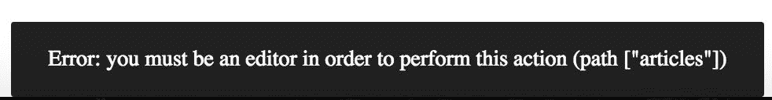

我们需要完成这些事情。在完成这些改进后，我们将进行一些重构。

# AWS S3-简介

亚马逊的 AWS S3 是亚马逊服务器上用于静态资产（如图像）的简单存储服务。它帮助您在云中安全、可靠、高度可扩展地托管对象（如图像）。

在线存储静态资产的这种方法非常方便和简单-这就是为什么我们将在整本书中使用它。

我们将在我们的应用程序中使用它，因为它为我们提供了许多可扩展性功能，在我们自己的 Node.js 服务器上托管图像资产时不容易访问。

一般来说，Node.js 不应该用于托管比我们现在使用的更大的资产。甚至不要考虑在 Node.js 服务器上实现图像上传机制（根本不推荐）-我们将使用亚马逊的服务来实现。

# 生成密钥（访问密钥 ID 和秘密密钥）

在我们开始添加新的 S3 存储桶之前，我们需要为我们的 AWS 账户生成密钥（`accessKeyId`和`secretAccessKey`）。

我们在 Node.js 应用程序中需要保留的一组示例详细信息如下：

```jsx
const awsConfig = { 

  accessKeyId: 'EXAMPLE_LB7XH_KEY_BGTCA', 

  secretAccessKey: 'ExAMpLe+KEY+FYliI9J1nvky5g2bInN26TCU+FiY', 

  region: 'us-west-2', 

  bucketKey: 'your-bucket-name-' 

};

```

在亚马逊 S3 中，什么是存储桶？**存储桶**是 Amazon S3 中文件的一种命名空间。您可以有几个与不同项目相关联的存储桶。正如您所看到的，我们接下来要做的是创建与您的`accountDefine`和`bucketKey`（文章图片的一种命名空间）相关联的`accessKeyId`和`secretAccessKey`。定义一个您希望在其中保留文件的区域。如果您的项目为位置指定了目标，它将加快图像的加载速度，并且通常限制延迟，因为图像将更接近我们发布应用程序的客户/用户。

要创建 AWS 账户，请访问[`aws.amazon.com/`](https://aws.amazon.com/)：

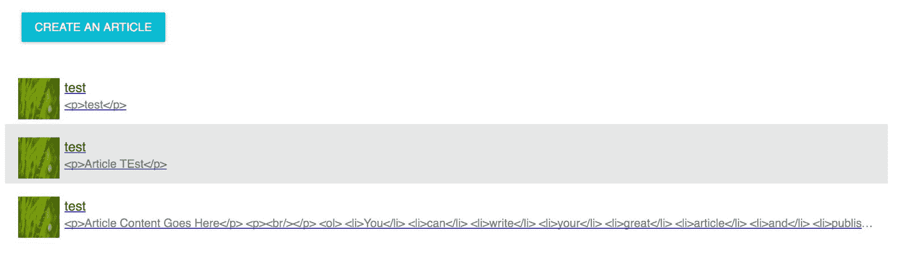

创建一个帐户或登录到您的帐户：

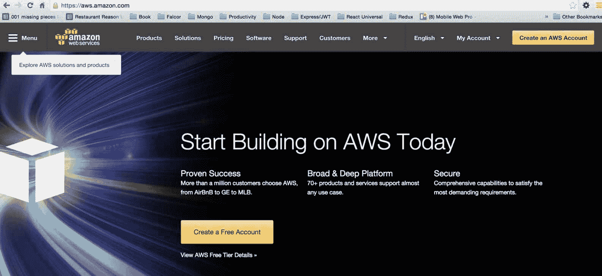

下一步是创建 IAM，在下一节中详细描述。

**关于 AWS 创建** 在为特定区域创建帐户后，如果要创建 S3 存储桶，您需要选择与您的帐户分配的相同区域；否则，在设置 S3 时可能会遇到问题。

# IAM

让我们准备我们的新的 `accessKeyId` 和 `secretAccessKey`。您需要访问您的 Amazon 控制台中的 IAM 页面。您可以在服务列表中找到它：

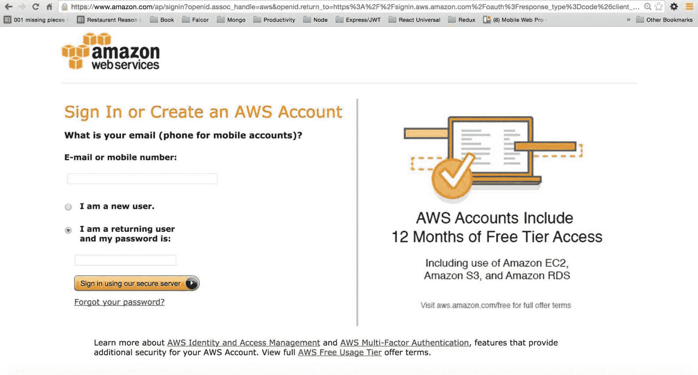

IAM 页面如下（[`console.aws.amazon.com/iam/home?#home`](https://console.aws.amazon.com/iam/home?#home)）：


转到 IAM 资源 | 用户：

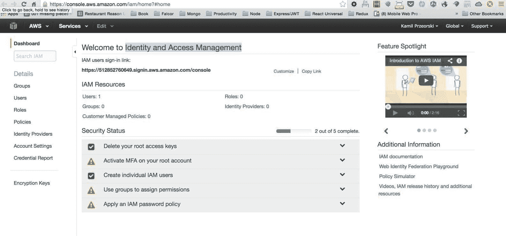

在下一页上，您将看到一个按钮；点击它：

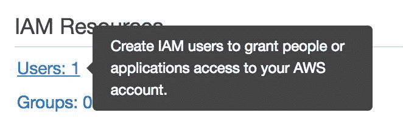

点击后，您将看到一个表格。至少填写一个用户，就像这个屏幕截图中一样（即使 AWS 的 UX 在此期间已经更改，屏幕截图也会给您确切的步骤）：


单击“创建”按钮后，将密钥复制到安全位置（我们将在稍后使用它们）：

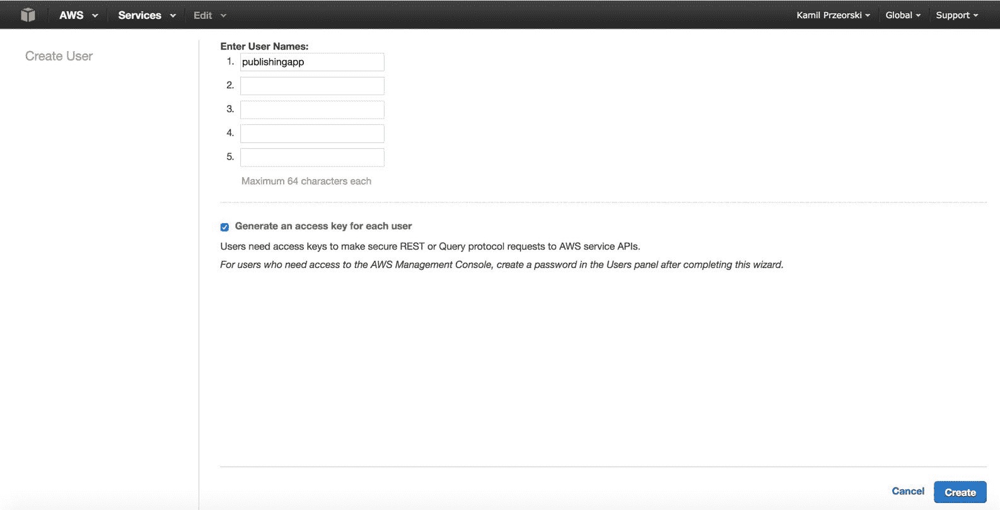不要忘记复制密钥（访问密钥 ID 和秘密访问密钥）。您将在本书后面学习在代码中放置它们以后使用 S3 服务。当然，屏幕截图中的密钥是不活跃的。它们只是示例；您需要拥有自己的密钥。

# 为用户设置 S3 权限

最后一件事是使用以下步骤添加 AmazonS3FullAccess 权限：

1.  转到权限选项卡：

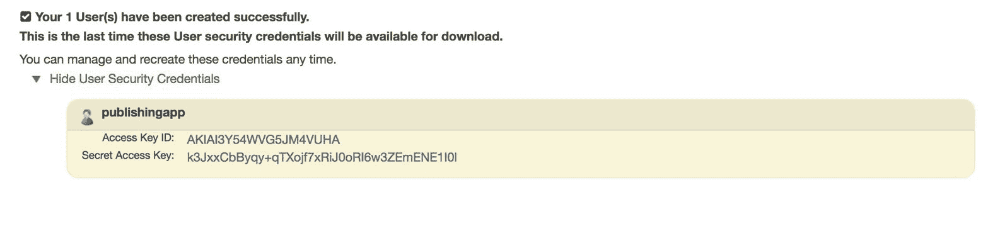

1.  单击附加策略，选择 AmazonS3FullAccess。附加后，它将列在以下示例中：

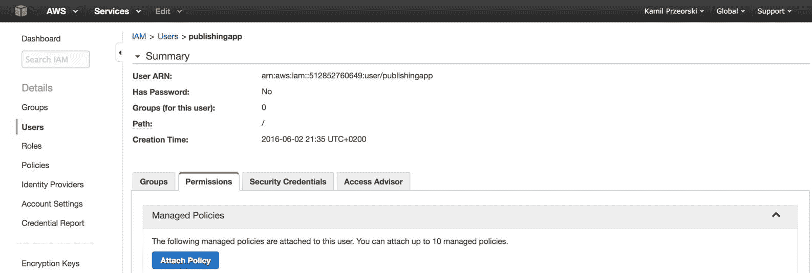

现在我们将继续创建一个新的存储桶用于图像文件。

1.  您已经完成了密钥，并且已经为密钥授予了 S3 策略；现在，我们需要准备将保存图像的存储桶。首先，您需要转到 AWS 控制台的主页，如下所示（[`console.aws.amazon.com/console/home`](https://console.aws.amazon.com/console/home)）：

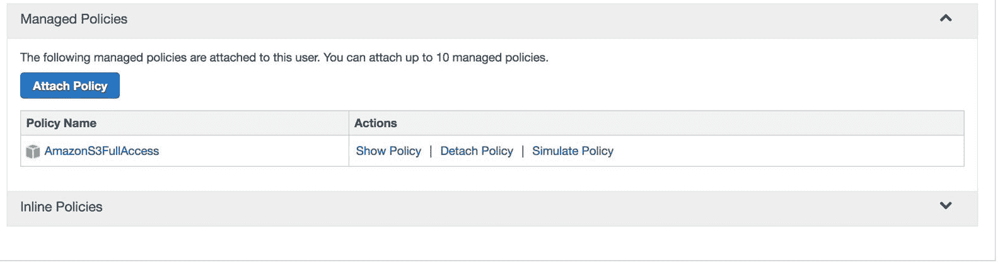

1.  您将看到类似 AWS 服务显示所有服务的东西（或者，从服务列表中找到它，就像 IAM 一样）：


1.  单击 S3 - 云中的可扩展存储（如上一截图中所示）。之后，您将看到类似于此的视图（我有六个存储桶；当您有一个新帐户时，您将看到零个）：

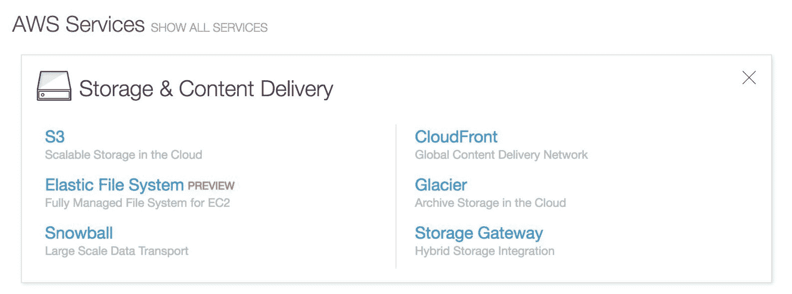

在那个存储桶中，我们将保存文章的静态图像（您将在接下来的页面中学习确切的方法）。

1.  通过单击“创建存储桶”按钮来创建存储桶：

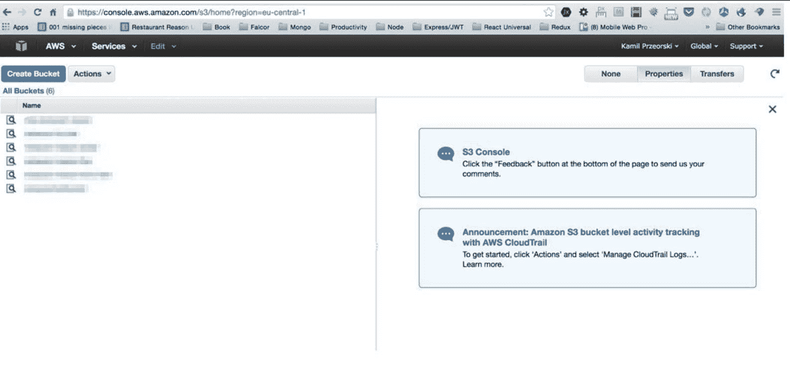

1.  选择 publishing-app 名称（或其他适合您的名称）。

在截图中，我们选择了 Frankfurt。但是，例如，当您创建帐户并且您的 URL 显示`"?region=us-west-2"`时，请选择 Oregon。在分配帐户时，重要的是在正确的区域创建 S3 存储桶。

1.  创建存储桶后，从存储桶列表中点击它：

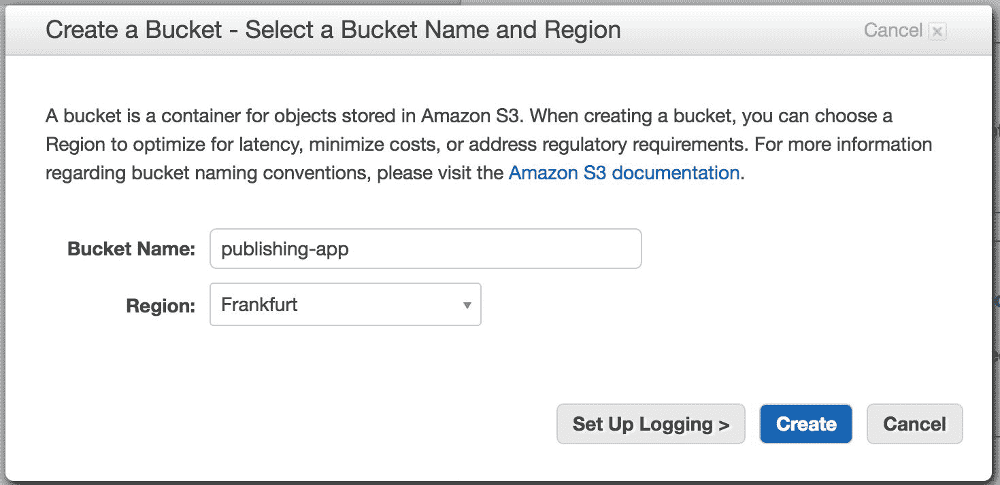

1.  具有 publishing-app 名称的空存储桶将如下所示：

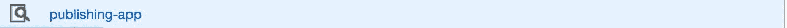

1.  当您在此视图中时，浏览器中的 URL 会告诉您确切的区域和存储桶（因此您以后可以在后端执行配置时使用）：

```jsx
        // just an example link to the bucket 

        https://console.aws.amazon.com/s3/home?region=eu-central-  

        1&bucket=publishing-app&prefix=

```

1.  最后一件事是确保 publishing-app 存储桶的 CORS 配置正确。在该视图中，单击“属性”选项卡，您将获得详细视图：


1.  然后，单击“添加 CORS”按钮：

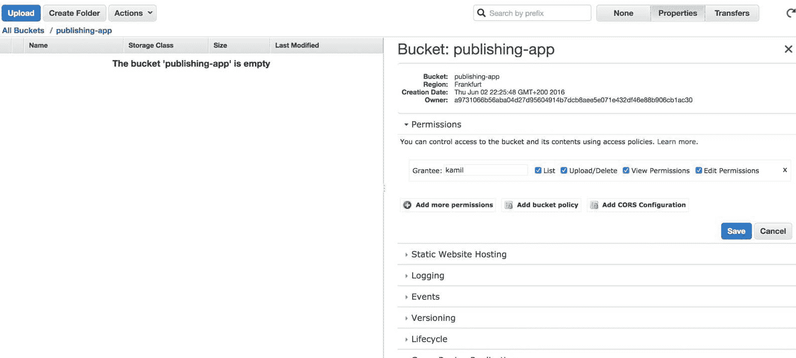

1.  然后，将以下内容粘贴到文本区域中（以下是跨域资源共享定义；它定义了 Pub 应用程序在一个域中加载并与 AWS 服务中不同域中的资源进行交互的方式）：

```jsx
        <?xml version="1.0" encoding="UTF-8"?> 

        <CORSConfiguration xmlns="http://s3.amazonaws.com 

         /doc/2006-03-01/"> 

            <CORSRule> 

                <AllowedOrigin>*</AllowedOrigin> 

                <AllowedMethod>GET</AllowedMethod> 

                <AllowedMethod>POST</AllowedMethod> 

                <AllowedMethod>PUT</AllowedMethod> 

                <MaxAgeSeconds>3000</MaxAgeSeconds> 

                <AllowedHeader>*</AllowedHeader> 

            </CORSRule> 

        </CORSConfiguration>

```

1.  现在它看起来像以下示例：

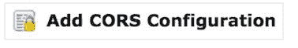

1.  单击“保存”按钮。完成所有步骤后，我们可以开始编写图像上传功能。

# 在 AddArticleView 中编写图像上传功能

在继续之前，您需要拥有在上一页中创建的 S3 存储桶的访问详细信息。`AWS_ACCESS_KEY_ID`来自上一小节，在该小节中我们创建了一个用户：

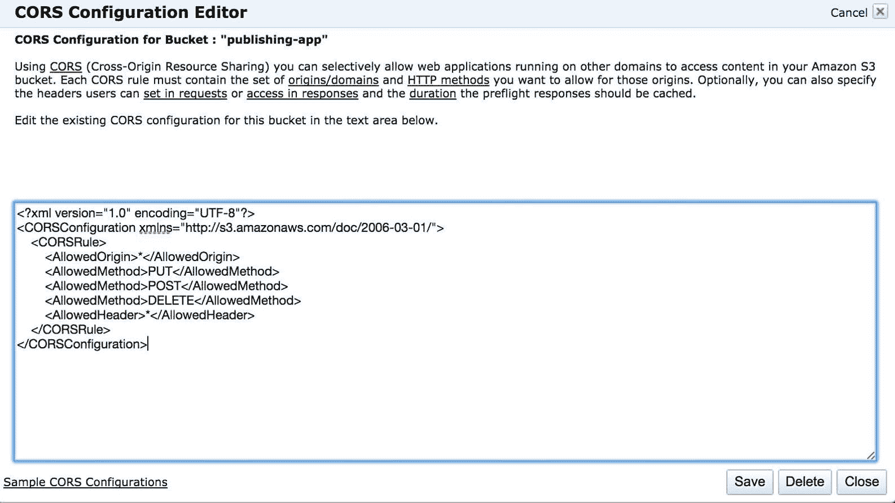

`AWS_SECRET_ACCESS_KEY`与 AWS 访问密钥相同（从名称中就可以猜到）。`AWS_BUCKET_NAME`是您的存储桶名称（在我们的书中，我们称之为 publishing-app）。对于`AWS_REGION_NAME`，我们将使用`eu-central-1`。

找到`AWS_BUCKET_NAME`和`AWS_REGION_NAME`的最简单方法是在该视图中查看 URL（在上一小节中描述）！[](Image00074.jpg)

检查该视图中的浏览器 URL：`https://console.aws.amazon.com/s3/home?region=eu-central-1#&bucket=publishing-app&prefix=`

区域和存储桶名称清楚地显示在 URL 中（我想要非常清楚地说明，因为您的区域和存储桶名称可能会有所不同，这取决于您所在的位置）。

还要确保您的 CORS 设置正确，并且您的权限/附加策略与上述完全相同。否则，您可能会遇到以下各小节中描述的所有问题。

# Node.js 中的环境变量

我们将通过节点的环境变量传递所有四个参数（`AWS_ACCESS_KEY_ID`，`AWS_SECRET_ACCESS_KEY`，`AWS_BUCKET_NAME`和`AWS_REGION_NAME`）。

首先，让我们安装一个节点库，它将从文件中创建环境变量，以便我们能够在本地主机中使用它们：

```jsx
npm i -save node-env-file@0.1.8

```

这些环境变量是什么？一般来说，我们将使用它们来传递一些敏感数据的变量给应用程序--我们在这里特别谈论 AWS 秘钥和 MongoDB 的登录/密码信息，用于当前环境设置（无论是开发还是生产）。

你可以通过访问它们来读取这些环境变量，就像以下示例中所示：

```jsx
// this is how we will access the variables in 

//the server.js for example: 

env.process.AWS_ACCESS_KEY_ID 

env.process.AWS_SECRET_ACCESS_KEY 

env.process.AWS_BUCKET_NAME 

env.process.AWS_REGION_NAME

```

在我们的本地开发环境中，我们将保留该信息在服务器目录中，因此请从命令提示符中执行以下操作：

```jsx
$ [[you are in the server/ directory of your project]]

$ touch .env

```

您已经创建了`server/.env`文件；下一步是在其中放入内容（当我们的应用程序运行时，`node-env-file`将读取环境变量）：

```jsx
AWS_ACCESS_KEY_ID=_*_*_*_*_ACCESS_KEY_HERE_*_*_*_*_ 

AWS_SECRET_ACCESS_KEY=_*_*_*_*_SECRET_KEY_HERE_*_*_*_*_ 

AWS_BUCKET_NAME=publishing-app 

AWS_REGION_NAME=eu-central-1

```

在这里，您可以看到节点环境文件的结构。每一行都有一个键和一个值。在那里，您需要粘贴在阅读本章时创建的键。用您自己的值替换这些值：`*_*_ACCESS_KEY_HERE_*_`和`_*_SECRET_KEY_HERE_**_`。

创建了`server/.env`文件后，在项目目录中使用`npm`安装所需的依赖项，以在图像上传时抽象整个巨大工作：

```jsx
npm i --save react-s3-uploader@3.0.3

```

`react-s3-uploader`组件非常适合我们的用例，并且它很好地抽象了`aws-sdk`的功能。这里的主要问题是我们需要正确配置`.env`文件（具有正确的变量），`react-s3-uploader`将在后端和前端为我们完成工作（很快您将看到）。

# 改进我们的 Mongoose 文章模式

我们需要改进模式，这样我们的文章集合中就会有一个存储图片 URL 的位置。编辑旧的文章模式：

```jsx
// this is old codebase to improve: 

var articleSchema = new Schema({ 

    articleTitle: String, 

    articleContent: String, 

    articleContentJSON: Object 

  },  

  {  

    minimize: false  

  } 

);

```

将其更改为新的、改进的版本：

```jsx
var articleSchema = new Schema({ 

    articleTitle: String, 

    articleContent: String, 

    articleContentJSON: Object, 

    articlePicUrl: { type: String, default: 

     '/static/placeholder.png' } 

  },  

  {  

    minimize: false  

  } 

);

```

如您所见，我们引入了`articlePicUrl`，默认值为`/static/placeholder.png`。现在，我们将能够在文章对象中保存带有图片 URL 变量的文章。

如果您忘记更新 Mongoose 模型，那么它将不允许您将该值保存到数据库中。

# 为 S3 的上传添加路由

我们需要将一个新的库导入到`server/server.js`文件中：

```jsx
import s3router from 'react-s3-uploader/s3router';

```

我们最终会得到类似以下的东西：

```jsx
// don't write it, this is how your server/server.js 

 //file should look like: 

import http from 'http'; 

import express from 'express'; 

import cors from 'cors'; 

import bodyParser from 'body-parser'; 

import falcor from 'falcor'; 

import falcorExpress from 'falcor-express'; 

import FalcorRouter from 'falcor-router'; 

import routes from './routes.js'; 

import React from 'react' 

import { createStore } from 'redux' 

import { Provider } from 'react-redux' 

import { renderToStaticMarkup } from 'react-dom/server' 

import ReactRouter from 'react-router'; 

import { RoutingContext, match } from 'react-router'; 

import * as hist  from 'history'; 

import rootReducer from '../src/reducers'; 

import reactRoutes from '../src/routes'; 

import fetchServerSide from './fetchServerSide'; 

import s3router from 'react-s3-uploader/s3router'; 

var app = express(); 

app.server = http.createServer(app); 

// CORS - 3rd party middleware 

app.use(cors()); 

// This is required by falcor-express middleware 

// to work correctly with falcor-browser 

app.use(bodyParser.json({extended: false})); 

app.use(bodyParser.urlencoded({extended: false}));

```

我把所有这些放在这里，这样您就可以确保您的`server/server.js`文件与此匹配。

还有一件事要做，就是修改`server/index.js`文件。找到这个：

```jsx
require('babel-core/register'); 

require('babel-polyfill'); 

require('./server');

```

将其更改为以下改进版本：

```jsx
var env = require('node-env-file'); 

// Load any undefined ENV variables form a specified file. 

env(__dirname + '/.env'); 

require('babel-core/register'); 

require('babel-polyfill'); 

require('./server');

```

只是为了澄清，`env(__dirname + '/.env');`告诉我们在我们的结构中`.env`文件的位置（您可以从`console.log`中找到`__dirname`变量是服务器文件的系统位置--这必须与真实的`.env`文件的位置匹配，以便系统找到它）。

下一步是将此添加到我们的`server/server.js`文件中：

```jsx
app.use('/s3', s3router({ 

  bucket: process.env.AWS_BUCKET_NAME, 

  region: process.env.AWS_REGION_NAME, 

  signatureVersion: 'v4', 

  headers: {'Access-Control-Allow-Origin': '*'},  

  ACL: 'public-read' 

}));

```

如您在这里所见，我们已经开始使用我们在`server/.env`文件中定义的环境变量。对我来说，`process.env.AWS_BUCKET_NAME`等于`publishing-app`，但如果您定义了不同的值，那么它将从`server/.env`中检索另一个值（感谢我们刚刚定义的`env` express 中间件）。

基于后端配置（环境变量和使用`import s3router from 'react-s3-uploader/s3router'`设置`s3router`），我们将能够使用 AWS S3 存储桶。我们需要准备前端，首先将在添加文章视图上实现。

# 在前端创建 ImgUploader 组件

我们将创建一个名为`ImgUploader`的组件。该组件将使用`react-s3-uploader`库，该库用于将上传抽象到 Amazon S3。在回调中，您将收到`information:onProgress`，并且可以使用该回调找到百分比的进度，以便用户可以查看`uploadonError`的状态。当发生错误时，将触发此回调：当完成时，此回调将向我们发送已上传到 S3 的文件的位置。

您将在本章中进一步了解更多细节；让我们先创建一个文件：

```jsx
    $ [[you are in the src/components/articles directory of your   

    project]]

$ touch ImgUploader.js

```

你已经创建了`src/components/articles/ImgUploader.js`文件，下一步是准备导入。所以在`ImgUploader`文件的顶部添加以下内容：

```jsx
import React from 'react'; 

import ReactS3Uploader from 'react-s3-uploader'; 

import {Paper} from 'material-ui'; 

class ImgUploader extends React.Component { 

  constructor(props) { 

    super(props); 

    this.uploadFinished = this.uploadFinished.bind(this); 

    this.state = { 

      uploadDetails: null, 

      uploadProgress: null, 

      uploadError: null, 

      articlePicUrl: props.articlePicUrl 

    }; 

  } 

  uploadFinished(uploadDetails) { 

    // here will be more code in a moment 

  } 

  render () { 

    return <div>S3 Image uploader placeholder</div>; 

  } 

} 

ImgUploader.propTypes = {  

  updateImgUrl: React.PropTypes.func.isRequired  

}; 

export default ImgUploader;

```

正如你在这里所看到的，我们在`render`函数中用`div`初始化了`ImgUploader`组件，返回一个临时占位符。

我们还准备了一个带有必需属性`updateImgUrl`的`propTypes`。这将是一个回调函数，将发送最终上传的图片位置（必须保存在数据库中--我们将在稍后使用`updateImgUrl`属性）。

在`ImgUploader`组件的状态下，我们有以下内容：

```jsx
// this is already in your codebase: 

this.state = { 

  uploadDetails: null, 

  uploadProgress: null, 

  uploadError: null, 

  articlePicUrl: props.articlePicUrl 

};

```

在这些变量中，我们将根据当前状态和`props.articlePicUrl`存储所有组件的状态，并将 URL 详细信息发送到`AddArticleView`组件（我们将在本章后面完成`ImgUploader`组件后进行）。

# 结束`ImgUploader`组件

下一步是改进我们`ImgUploader`中的`uploadFinished`函数，找到旧的空函数：

```jsx
 uploadFinished(uploadDetails) { 

    // here will be more code in a moment 

  }

```

用以下内容替换：

```jsx
 uploadFinished(uploadDetails) { 

    let articlePicUrl = '/s3/img/'+uploadDetails.filename; 

    this.setState({  

      uploadProgress: null, 

      uploadDetails:  uploadDetails, 

      articlePicUrl: articlePicUrl 

    }); 

    this.props.updateImgUrl(articlePicUrl); 

  }

```

正如你所看到的，`uploadDetails.filename`变量来自于我们在`ImgUploader`文件顶部导入的`ReactS3Uploader`组件。成功上传后，我们将`uploadProgress`设置回`null`，设置我们上传的详细信息，并通过`this.props.updateImgUrl(articlePicUrl)`回调发送详细信息。

下一步是改进我们`ImgUploader`中的`render`函数：

```jsx
 render () { 

    let imgUploadProgressJSX; 

    let uploadProgress = this.state.uploadProgress; 

    if(uploadProgress) { 

      imgUploadProgressJSX = ( 

          <div> 

            {uploadProgress.uploadStatusText} 

({uploadProgress.progressInPercent}%)

          </div> 

        ); 

    } else if(this.state.articlePicUrl) { 

      let articlePicStyles = { 

        maxWidth: 200,  

        maxHeight: 200,  

        margin: 'auto' 

      }; 

      imgUploadProgressJSX = ; 

    } 

    return <div>S3 Image uploader placeholder</div>; 

  }

```

这个渲染是不完整的，但让我们描述一下我们到目前为止添加了什么。这段代码简单地是关于通过`this.state`获取`uploadProgress`的信息（第一个`if`语句）。`else if(this.state.articlePicUrl)`是关于在上传完成后渲染图片。好的，但我们将从哪里获取这些信息呢？这就是剩下的部分：

```jsx
   let uploaderJSX = ( 

        <ReactS3Uploader 

        signingUrl='/s3/sign' 

        accept='image/*' 

          onProgress={(progressInPercent, uploadStatusText) => { 

            this.setState({  

              uploadProgress: { progressInPercent,  

              uploadStatusText },  

              uploadError: null 

            }); 

          }}  

          onError={(errorDetails) => { 

            this.setState({  

              uploadProgress: null, 

              uploadError: errorDetails 

            }); 

          }} 

          onFinish={(uploadDetails) => { 

            this.uploadFinished(uploadDetails); 

          }} /> 

      );

```

`uploaderJSX`变量与我们的`react-s3-uploader`库完全相同。从代码中可以看出，对于进度，我们使用`uploadProgress: { progressInPercent, uploadStatusText }`来设置状态，并设置`uploadError: null`（以防用户收到错误消息）。在出现错误时，我们设置状态，以便告知用户。完成后，我们运行`uploadFinished`函数，该函数之前已经详细描述过。

`ImgUploader`的完整`render`函数如下所示：

```jsx
 render () { 

    let imgUploadProgressJSX; 

    let uploadProgress = this.state.uploadProgress; 

    if(uploadProgress) { 

      imgUploadProgressJSX = ( 

          <div> 

            {uploadProgress.uploadStatusText} 

             ({uploadProgress.progressInPercent}%) 

          </div> 

        ); 

    } else if(this.state.articlePicUrl) { 

      let articlePicStyles = { 

        maxWidth: 200,  

        maxHeight: 200,  

        margin: 'auto' 

      }; 

      imgUploadProgressJSX = ; 

    } 

    let uploaderJSX = ( 

        <ReactS3Uploader 

        signingUrl='/s3/sign' 

        accept='image/*' 

          onProgress={(progressInPercent, uploadStatusText) => { 

            this.setState({  

              uploadProgress: { progressInPercent, 

               uploadStatusText },  

              uploadError: null 

            }); 

          }}  

          onError={(errorDetails) => { 

            this.setState({  

              uploadProgress: null, 

              uploadError: errorDetails 

            }); 

          }} 

          onFinish={(uploadDetails) => { 

            this.uploadFinished(uploadDetails); 

          }} /> 

      ); 

    return ( 

      <Paper zDepth={1} style={{padding: 32, margin: 'auto', 

       width: 300}}> 

        {imgUploadProgressJSX} 

        {uploaderJSX} 

      </Paper> 

    ); 

  }

```

正如你所看到的，这是整个 `ImgUploader` 的渲染。我们使用了内联样式的 `Paper` 组件（来自 `material-ui` ），所以整个东西看起来对文章的最终用户/编辑者更好。


# AddArticleView 的改进

我们需要将 `ImgUploader` 组件添加到 `AddArticleView` 中；首先，我们需要将其导入到 `src/views/articles/AddArticleView.js` 文件中，就像这样：

```jsx
import ImgUploader from '../../components/articles/ImgUploader';

```

接下来，在 `AddArticleView` 的构造函数中，找到这段旧代码：

```jsx
// this is old, don't write it: 

class AddArticleView extends React.Component { 

  constructor(props) { 

    super(props); 

    this._onDraftJSChange = this._onDraftJSChange.bind(this); 

    this._articleSubmit = this._articleSubmit.bind(this); 

    this.state = { 

      title: 'test', 

      contentJSON: {}, 

      htmlContent: '', 

      newArticleID: null 

    }; 

  }

```

将其改为以下改进版本：

```jsx
class AddArticleView extends React.Component { 

  constructor(props) { 

    super(props); 

    this._onDraftJSChange = this._onDraftJSChange.bind(this); 

    this._articleSubmit = this._articleSubmit.bind(this); 

    this.updateImgUrl = this.updateImgUrl.bind(this); 

    this.state = { 

      title: 'test', 

      contentJSON: {}, 

      htmlContent: '', 

      newArticleID: null, 

      articlePicUrl: '/static/placeholder.png' 

    }; 

  }

```

正如你所看到的，我们将这个绑定到 `updateImgUrl` 函数，并添加了一个新的状态变量叫做 `articlePicUrl`（默认情况下，如果用户没有选择封面，我们将指向 `/static/placeholder.png`）。

让我们改进一下这个组件的功能：

```jsx
// this is old codebase, just for your reference: 

  async _articleSubmit() { 

    let newArticle = { 

      articleTitle: this.state.title, 

      articleContent: this.state.htmlContent, 

      articleContentJSON: this.state.contentJSON 

    } 

    let newArticleID = await falcorModel 

      .call( 

            'articles.add', 

            [newArticle] 

          ). 

      then((result) => { 

        return falcorModel.getValue( 

            ['articles', 'newArticleID'] 

          ).then((articleID) => { 

            return articleID; 

          }); 

      }); 

    newArticle['_id'] = newArticleID; 

    this.props.articleActions.pushNewArticle(newArticle); 

    this.setState({ newArticleID: newArticleID}); 

  }

```

将这段代码改为以下内容：

```jsx
 async _articleSubmit() { 

    let newArticle = { 

      articleTitle: this.state.title, 

      articleContent: this.state.htmlContent, 

      articleContentJSON: this.state.contentJSON, 

      articlePicUrl: this.state.articlePicUrl 

    } 

    let newArticleID = await falcorModel 

      .call( 

            'articles.add', 

            [newArticle] 

          ). 

      then((result) => { 

        return falcorModel.getValue( 

            ['articles', 'newArticleID'] 

          ).then((articleID) => { 

            return articleID; 

          }); 

      }); 

    newArticle['_id'] = newArticleID; 

    this.props.articleActions.pushNewArticle(newArticle); 

    this.setState({ newArticleID: newArticleID }); 

  } 

  updateImgUrl(articlePicUrl) { 

    this.setState({  

      articlePicUrl: articlePicUrl 

    }); 

  }

```

正如你所看到的，我们在 `newArticle` 对象中添加了 `articlePicUrl: this.state.articlePicUrl`。我们还引入了一个名为 `updateImgUrl` 的新函数，它只是一个回调函数，用来设置一个新的状态，其中包含 `articlePicUrl` 变量（在 `this.state.articlePicUrl` 中，我们保存了即将保存到数据库中的当前文章的图片 URL）。

`src/views/articles/AddArticleView.js` 中唯一需要改进的是我们当前的渲染。以下是旧的渲染：

```jsx
// your current old codebase to improve: 

    return ( 

      <div style={{height: '100%', width: '75%', margin: 'auto'}}> 

        <h1>Add Article</h1> 

        <WYSIWYGeditor 

          name='addarticle' 

          title='Create an article' 

          onChangeTextJSON={this._onDraftJSChange} /> 

          <RaisedButton 

            onClick={this._articleSubmit} 

            secondary={true} 

            type='submit' 

            style={{margin: '10px auto', display: 'block', 

             width: 150}} 

            label={'Submit Article'} /> 

      </div> 

    ); 

  }

```

我们需要使用 `ImgUploader` 来改进这段代码：

```jsx
   return ( 

      <div style={{height: '100%', width: '75%', margin: 'auto'}}> 

        <h1>Add Article</h1> 

        <WYSIWYGeditor 

          name='addarticle' 

          title='Create an article' 

          onChangeTextJSON={this._onDraftJSChange} /> 

        <div style={{margin: '10px 10px 10px 10px'}}>  

          <ImgUploader  

              updateImgUrl={this.updateImgUrl}  

              articlePicUrl={this.state.articlePicUrl} /> 

        </div> 

        <RaisedButton 

          onClick={this._articleSubmit} 

          secondary={true} 

          type='submit' 

          style={{margin: '10px auto', display: 'block', 

           width: 150}} 

          label={'Submit Article'} /> 

      </div> 

    ); 

  }

```

你可以看到，我们使用属性发送当前的 `articlePicUrl`（这将在以后很方便，也给我们提供了默认的 `placeholder.png` 位置），以及更新 `img` URL 的回调函数，称为 `updateImgUrl`。

如果你访问 `http://localhost:3000/add-article` ，你将会看到一个新的图片选择器，位于所见即所得框和提交文章按钮之间（查看截图）：

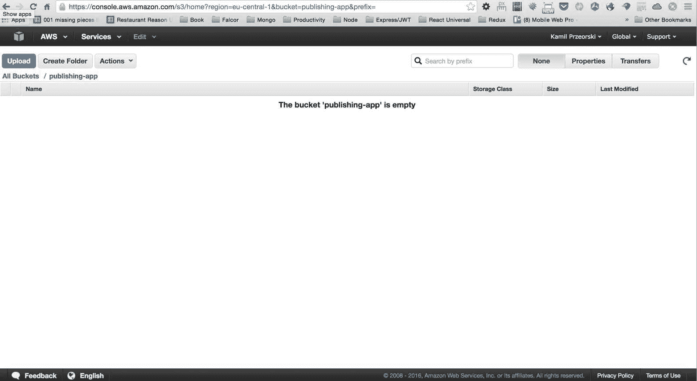

当然，如果你按照所有的说明正确操作，点击“选择文件”后，你将能够上传一个新的图片到 S3 存储桶，缩略图中的图片将被替换，就像下面的例子一样：

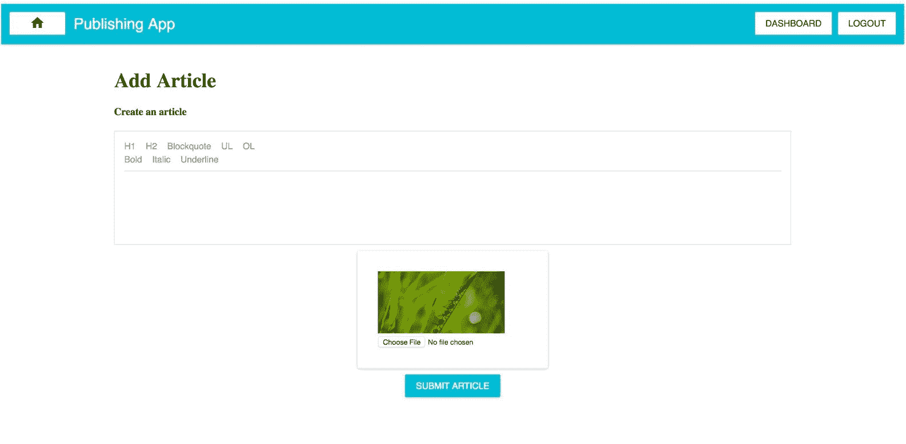

正如你所看到的，我们可以上传一张图片。下一步是取消模拟查看它们，这样我们就可以看到我们的文章封面上有一只狗（狗的图片来自我们在数据库中的文章集合）。

# 对 PublishingApp、ArticleCard 和 DashboardView 进行一些剩余的调整

我们可以添加一篇文章。我们需要在视图中取消模拟图像 URL，这样我们就可以看到来自数据库的真实 URL（而不是在`img src`属性中模拟的）。

让我们从`src/layouts/PublishingApp.js`开始，改进旧的`_fetch`函数：

```jsx
// old codebase to improve: 

  async _fetch() { 

    let articlesLength = await falcorModel. 

      getValue('articles.length'). 

      then((length) =>  length); 

    let articles = await falcorModel. 

      get(['articles', {from: 0, to: articlesLength-1}, 

      ['_id','articleTitle', 'articleContent', 

      'articleContentJSON']]).  

      then((articlesResponse) => {   

        return articlesResponse.json.articles; 

      }).catch(e => { 

        return 500; 

      }); 

    if(articles === 500) { 

      return; 

    } 

    this.props.articleActions.articlesList(articles); 

  }

```

用以下代码替换这段代码：

```jsx
 async _fetch() { 

    let articlesLength = await falcorModel. 

      getValue('articles.length'). 

      then((length) => length); 

    let articles = await falcorModel. 

      get(['articles', {from: 0, to: articlesLength-1}, 

       ['_id','articleTitle', 'articleContent', 

       'articleContentJSON', 'articlePicUrl']]).  

      then((articlesResponse) => {   

        return articlesResponse.json.articles; 

      }).catch(e => { 

        console.debug(e); 

        return 500; 

      }); 

    if(articles === 500) { 

      return; 

    } 

    this.props.articleActions.articlesList(articles); 

  }

```

正如您所看到的，我们已经开始通过`falcorModel.get`方法获取`articlePicUrl`。

接下来，在`PublishingApp`文件中，也是改进`render`函数，所以您需要改进以下代码：

```jsx
// old code: 

    this.props.article.forEach((articleDetails, articleKey) => { 

      let currentArticleJSX = ( 

        <div key={articleKey}> 

          <ArticleCard  

            title={articleDetails.articleTitle} 

            content={articleDetails.articleContent} /> 

        </div> 

      );

```

添加一个新的属性，将传递图像 URL：

```jsx
   this.props.article.forEach((articleDetails, articleKey) => { 

      let currentArticleJSX = ( 

        <div key={articleKey}> 

          <ArticleCard  

            title={articleDetails.articleTitle} 

            content={articleDetails.articleContent}  

            articlePicUrl={articleDetails.articlePicUrl} /> 

        </div> 

      );

```

正如您所看到的，我们正在将获取的`articlePicUrl`传递给`ArticleCard`组件。

# 改进 ArticleCard 组件

在我们通过属性传递`articlePicUrl`变量之后，我们需要改进以下内容（`src/components/ArticleCard.js`）：

```jsx
// old code to improve: 

  render() { 

    let title = this.props.title || 'no title provided'; 

    let content = this.props.content || 'no content provided'; 

    let paperStyle = { 

      padding: 10,  

      width: '100%',  

      height: 300 

    }; 

    let leftDivStyle = { 

      width: '30%',  

      float: 'left' 

    } 

    let rightDivStyle = { 

      width: '60%',  

      float: 'left',  

      padding: '10px 10px 10px 10px' 

    } 

    return ( 

      <Paper style={paperStyle}> 

        <CardHeader 

          title={this.props.title} 

          subtitle='Subtitle' 

          avatar='/static/avatar.png' 

        /> 

        <div style={leftDivStyle}> 

          <Card > 

            <CardMedia 

              overlay={<CardTitle title={title} 

               subtitle='Overlay subtitle' />}> 

               

            </CardMedia> 

          </Card> 

        </div> 

        <div style={rightDivStyle}> 

          <div dangerouslySetInnerHTML={{__html: content}} /> 

        </div> 

      </Paper>); 

  }

```

将其更改为以下内容：

```jsx
 render() { 

    let title = this.props.title || 'no title provided'; 

    let content = this.props.content || 'no content provided'; 

    let articlePicUrl = this.props.articlePicUrl || 

     '/static/placeholder.png'; 

    let paperStyle = { 

      padding: 10,  

      width: '100%',  

      height: 300 

    }; 

    let leftDivStyle = { 

      width: '30%',  

      float: 'left' 

    } 

    let rightDivStyle = { 

      width: '60%',  

      float: 'left',  

      padding: '10px 10px 10px 10px' 

    } 

    return ( 

      <Paper style={paperStyle}> 

        <CardHeader 

          title={this.props.title} 

          subtitle='Subtitle' 

          avatar='/static/avatar.png' 

        /> 

        <div style={leftDivStyle}> 

          <Card > 

            <CardMedia 

              overlay={<CardTitle title={title} 

               subtitle='Overlay subtitle' />}> 

               

            </CardMedia> 

          </Card> 

        </div> 

        <div style={rightDivStyle}> 

          <div dangerouslySetInnerHTML={{__html: content}} /> 

        </div> 

      </Paper>); 

  }

```

在`render`的开始，我们使用`let articlePicUrl = this.props.articlePicUrl || '/static/placeholder.png';`，然后在我们的图片的 JSX 中使用它（`img src={articlePicUrl} height='190'`）。

在这两个更改之后，您可以看到文章有一个真正的封面，就像这样：

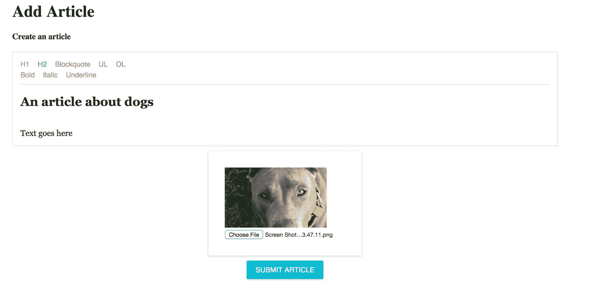

# 改进 DashboardView 组件

让我们通过封面来改进仪表板，所以在`src/views/DashboardView.js`中找到以下代码：

```jsx
// old code: 

  render () { 

    let articlesJSX = []; 

    this.props.article.forEach((articleDetails, articleKey) => { 

      let currentArticleJSX = ( 

        <Link  

          to={&grave;/edit-article/${articleDetails['_id']}&grave;}  

          key={articleKey}> 

          <ListItem 

            leftAvatar={} 

            primaryText={articleDetails.articleTitle} 

            secondaryText={articleDetails.articleContent} 

          /> 

        </Link> 

      ); 

      articlesJSX.push(currentArticleJSX); 

    }); 

    // below is rest of the render's function

```

用以下代码替换它：

```jsx
 render () { 

    let articlesJSX = []; 

    this.props.article.forEach((articleDetails, articleKey) => { 

      let articlePicUrl = articleDetails.articlePicUrl || 

       '/static/placeholder.png'; 

      let currentArticleJSX = ( 

        <Link  

                to={&grave;/edit-article/${articleDetails['_id']}&grave;}  

key={articleKey}>

          <ListItem 

            leftAvatar={} 

            primaryText={articleDetails.articleTitle} 

            secondaryText={articleDetails.articleContent} 

          /> 

        </Link> 

      ); 

      articlesJSX.push(currentArticleJSX); 

    }); 

    // below is rest of the render's function

```

正如您所看到的，我们已经用真实的封面照片替换了模拟的占位符，所以在我们的文章仪表板（在登录后可用）中，我们将在缩略图中找到真实的图像。

# 编辑文章的封面照片

关于文章的照片，我们需要在`src/views/articles/EditArticleView.js`文件中进行一些改进，比如导入`ImgUploader`：

```jsx
import ImgUploader from '../../components/articles/ImgUploader';

```

在导入`ImgUploader`之后，改进`EditArticleView`的构造函数。找到以下代码：

```jsx
// old code to improve: 

class EditArticleView extends React.Component { 

  constructor(props) { 

    super(props); 

    this._onDraftJSChange = this._onDraftJSChange.bind(this); 

    this._articleEditSubmit = this._articleEditSubmit.bind(this); 

    this._fetchArticleData = this._fetchArticleData.bind(this); 

    this._handleDeleteTap = this._handleDeleteTap.bind(this); 

    this._handleDeletion = this._handleDeletion.bind(this); 

    this._handleClosePopover = 

     this._handleClosePopover.bind(this); 

    this.state = { 

      articleFetchError: null, 

      articleEditSuccess: null, 

      editedArticleID: null, 

      articleDetails: null, 

      title: 'test', 

      contentJSON: {}, 

      htmlContent: '', 

      openDelete: false, 

      deleteAnchorEl: null 

    }; 

  }

```

用新的、改进后的构造函数替换它：

```jsx
class EditArticleView extends React.Component { 

  constructor(props) { 

    super(props); 

    this._onDraftJSChange = this._onDraftJSChange.bind(this); 

    this._articleEditSubmit = this._articleEditSubmit.bind(this); 

    this._fetchArticleData = this._fetchArticleData.bind(this); 

    this._handleDeleteTap = this._handleDeleteTap.bind(this); 

    this._handleDeletion = this._handleDeletion.bind(this); 

    this._handleClosePopover = 

     this._handleClosePopover.bind(this); 

    this.updateImgUrl = this.updateImgUrl.bind(this); 

    this.state = { 

      articleFetchError: null, 

      articleEditSuccess: null, 

      editedArticleID: null, 

      articleDetails: null, 

      title: 'test', 

      contentJSON: {}, 

      htmlContent: '', 

      openDelete: false, 

      deleteAnchorEl: null, 

      articlePicUrl: '/static/placeholder.png' 

    }; 

  }

```

正如您所看到的，我们已经将其绑定到新的`updateImgUrl`函数（这将是`ImgUploader`的回调），并为`articlePicUrl`创建了一个新的默认状态。

下一步是改进当前的`_fetchArticleData`函数：

```jsx
// this is old already in your codebase: 

  _fetchArticleData() { 

    let articleID = this.props.params.articleID; 

    if(typeof window !== 'undefined' && articleID) { 

        let articleDetails = this.props.article.get(articleID); 

        if(articleDetails) { 

          this.setState({  

            editedArticleID: articleID,  

            articleDetails: articleDetails 

          }); 

        } else { 

          this.setState({ 

            articleFetchError: true 

          }) 

        } 

    } 

  }

```

用以下改进后的代码替换它：

```jsx
 _fetchArticleData() { 

    let articleID = this.props.params.articleID; 

    if(typeof window !== 'undefined' && articleID) { 

        let articleDetails = this.props.article.get(articleID); 

        if(articleDetails) { 

          this.setState({  

            editedArticleID: articleID,  

            articleDetails: articleDetails, 

            articlePicUrl: articleDetails.articlePicUrl, 

            contentJSON: articleDetails.articleContentJSON, 

            htmlContent: articleDetails.articleContent 

          }); 

        } else { 

          this.setState({ 

            articleFetchError: true 

          }) 

        } 

    } 

  }

```

在这里，我们在初始获取中添加了一些新的`this.setState`变量，比如`articlePicUrl`，`contentJSON`和`htmlContent`。文章获取在这里是因为我们需要在`ImgUploader`中设置当前可能会更改的图片的封面。`contentJSON`和`htmlContent`在用户没有在所见即所得编辑器中编辑任何内容时会用到，我们需要从数据库中获取默认值（否则，编辑按钮会将空值保存到数据库中并破坏整个编辑体验）。

让我们改进`_articleEditSubmit`函数。这是旧代码：

```jsx
// old code to improve: 

  async _articleEditSubmit() { 

    let currentArticleID = this.state.editedArticleID; 

    let editedArticle = { 

      _id: currentArticleID, 

      articleTitle: this.state.title, 

      articleContent: this.state.htmlContent, 

      articleContentJSON: this.state.contentJSON 

    // striped code for our convience

```

更改为以下改进版本：

```jsx
  async _articleEditSubmit() { 

    let currentArticleID = this.state.editedArticleID; 

    let editedArticle = { 

      _id: currentArticleID, 

      articleTitle: this.state.title, 

      articleContent: this.state.htmlContent, 

      articleContentJSON: this.state.contentJSON, 

      articlePicUrl: this.state.articlePicUrl 

    } 

    // striped code for our convenience

```

下一步是向`EditArticleView`组件添加一个新函数：

```jsx
 updateImgUrl(articlePicUrl) { 

    this.setState({  

      articlePicUrl: articlePicUrl 

    }); 

  }

```

完成文章编辑封面的最后一步是改进旧的渲染：

```jsx
// old code to improve: 

    let initialWYSIWYGValue = 

     this.state.articleDetails.articleContentJSON; 

    return ( 

      <div style={{height: '100%', width: '75%', margin: 'auto'}}> 

        <h1>Edit an existing article</h1> 

        <WYSIWYGeditor 

          initialValue={initialWYSIWYGValue} 

          name='editarticle' 

          title='Edit an article' 

          onChangeTextJSON={this._onDraftJSChange} /> 

        <RaisedButton 

          onClick={this._articleEditSubmit} 

          secondary={true} 

          type='submit' 

          style={{margin: '10px auto', 

           display: 'block', width: 150}} 

          label={'Submit Edition'} /> 

        <hr />

```

用以下内容替换它：

```jsx
   let initialWYSIWYGValue = 

    this.state.articleDetails.articleContentJSON; 

    return ( 

      <div style={{height: '100%', width: '75%', margin: 'auto'}}> 

        <h1>Edit an existing article</h1> 

        <WYSIWYGeditor 

          initialValue={initialWYSIWYGValue} 

          name='editarticle' 

          title='Edit an article' 

          onChangeTextJSON={this._onDraftJSChange} /> 

        <div style={{margin: '10px 10px 10px 10px'}}>  

          <ImgUploader updateImgUrl={this.updateImgUrl} 

           articlePicUrl={this.state.articlePicUrl} /> 

        </div> 

        <RaisedButton 

          onClick={this._articleEditSubmit} 

          secondary={true} 

          type='submit' 

          style={{margin: '10px auto', 

           display: 'block', width: 150}} 

          label={'Submit Edition'} /> 

        <hr/>

```

如您所见，我们已经添加了`ImgUploader`并将其样式与`AddArticleView`完全相同。`ImgUploader`的其余部分会帮助我们允许用户编辑文章照片。

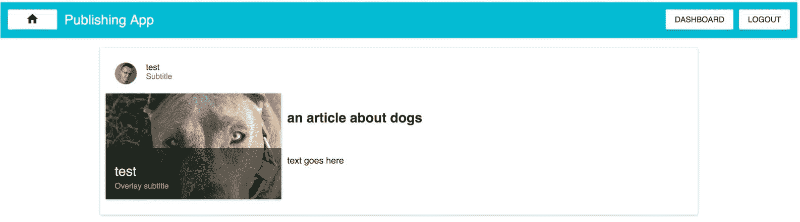在这个截图中，您可以看到所有最近改进后编辑视图应该是什么样子。

# 添加编辑文章标题和副标题的能力

总的来说，我们将在`server/configMongoose.js`文件中改进文章的模型。首先找到以下代码：

```jsx
// old codebase: 

var articleSchema = new Schema({ 

    articleTitle: String, 

    articleContent: String, 

    articleContentJSON: Object, 

    articlePicUrl: { type: String, default: 

     '/static/placeholder.png' } 

  },  

  {  

    minimize: false  

  } 

);

```

用改进后的代码替换它，如下所示：

```jsx
var defaultDraftJSobject = { 

    'blocks' : [], 

    'entityMap' : {} 

} 

var articleSchema = new Schema({ 

    articleTitle: { type: String, required: true, default: 

     'default article title' }, 

    articleSubTitle: { type: String, required: true, default: 

     'default subtitle' }, 

    articleContent: { type: String, required: true, default: 

     'default content' }, 

    articleContentJSON: { type: Object, required: true, default: 

     defaultDraftJSobject }, 

    articlePicUrl: { type: String, required: true, default: 

     '/static/placeholder.png' } 

  },  

  {  

    minimize: false  

  } 

);

```

如您所见，我们在我们的模型中添加了许多必需的属性；这将影响保存不完整对象的能力，因此，总的来说，我们的模型将在我们发布应用程序的整个生命周期中更加一致。

我们还向我们的模型添加了一个名为`articleSubTitle`的新属性，我们将在本章后面使用它。

# AddArticleView 改进

总的来说，我们将添加两个`DefaultInput`组件（标题和副标题），整个表单将使用`formsy-react`，所以在`src/views/articles/AddArticleView.js`中，添加新的导入：

```jsx
import DefaultInput from '../../components/DefaultInput'; 

import Formsy from 'formsy-react';

```

下一步是改进`async _articleSubmit`，所以更改旧代码：

```jsx
// old code to improve: 

  async _articleSubmit() { 

    let newArticle = { 

      articleTitle: articleModel.title, 

      articleContent: this.state.htmlContent, 

      articleContentJSON: this.state.contentJSON, 

      articlePicUrl: this.state.articlePicUrl 

    } 

    let newArticleID = await falcorModel 

      .call( 

            'articles.add', 

            [newArticle] 

          ). 

          // rest code below is striped

```

用以下内容替换它：

```jsx
  async _articleSubmit(articleModel) { 

    let newArticle = { 

      articleTitle: articleModel.title, 

      articleSubTitle: articleModel.subTitle, 

      articleContent: this.state.htmlContent, 

      articleContentJSON: this.state.contentJSON, 

      articlePicUrl: this.state.articlePicUrl 

    } 

    let newArticleID = await falcorModel 

      .call( 

            'articles.add', 

            [newArticle] 

          ).

```

如您所见，我们在`_articleSubmit`参数中添加了`articleModel`；这将来自`formsy-react`，我们在`LoginView`和`RegisterView`中实现的方式相同。我们还向`newArticle`对象添加了`articleSubTitle`属性。

旧的`render`函数返回如下：

```jsx
// old code below: 

    return ( 

      <div style={{height: '100%', width: '75%', margin: 'auto'}}> 

        <h1>Add Article</h1> 

        <WYSIWYGeditor 

          name='addarticle' 

          title='Create an article' 

          onChangeTextJSON={this._onDraftJSChange} /> 

        <div style={{margin: '10px 10px 10px 10px'}}>  

          <ImgUploader updateImgUrl={this.updateImgUrl} 

           articlePicUrl={this.state.articlePicUrl} /> 

        </div> 

        <RaisedButton 

          onClick={this._articleSubmit} 

          secondary={true} 

          type='submit' 

          style={{margin: '10px auto', 

           display: 'block', width: 150}} 

          label={'Submit Article'} /> 

      </div> 

    );

```

将其更改为以下内容：

```jsx
   return ( 

      <div style={{height: '100%', width: '75%', margin: 'auto'}}> 

        <h1>Add Article</h1> 

        <Formsy.Form onSubmit={this._articleSubmit}> 

          <DefaultInput  

            onChange={(event) => {}}  

            name='title'  

            title='Article Title (required)' required /> 

          <DefaultInput  

            onChange={(event) => {}}  

            name='subTitle'  

            title='Article Subtitle' /> 

          <WYSIWYGeditor 

            name='addarticle' 

            title='Create an article' 

            onChangeTextJSON={this._onDraftJSChange} /> 

          <div style={{margin: '10px 10px 10px 10px'}}>  

            <ImgUploader updateImgUrl={this.updateImgUrl} 

             articlePicUrl={this.state.articlePicUrl} /> 

          </div> 

          <RaisedButton 

            secondary={true} 

            type='submit' 

            style={{margin: '10px auto', 

             display: 'block', width: 150}} 

            label={'Submit Article'} /> 

        </Formsy.Form> 

      </div> 

    );

```

在这段代码片段中，我们添加了`Formsy.Form`，方式与`LoginView`中一样，所以我不会详细描述它。最重要的是要注意，通过`onSubmit`，我们调用了`this._articleSubmit`函数。我们还添加了两个`DefaultInput`组件（标题和副标题）：这两个输入框中的数据将在`async _articleSubmit(articleModel)`中使用（根据本书中先前的实现，您已经知道这一点）。

根据 Mongoose 配置和`AddArticleView`组件中的更改，您现在可以向新文章添加标题和副标题，就像以下截图中一样：

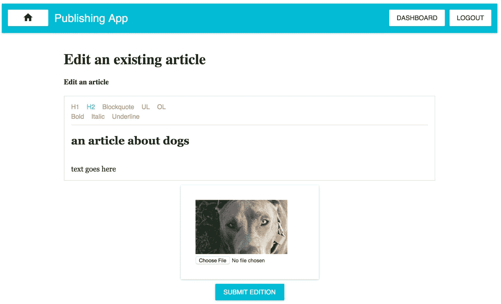

我们仍然缺少编辑标题和副标题的能力，所以现在让我们实现它。

# 编辑文章标题和副标题的能力

转到`src/views/articles/EditArticleView.js`文件，并添加新的导入（类似于`add`视图）：

```jsx
import DefaultInput from '../../components/DefaultInput'; 

import Formsy from 'formsy-react';

```

改进当前版本中的旧`_articleEditSubmit`函数：

```jsx
// old code: 

  async _articleEditSubmit() { 

    let currentArticleID = this.state.editedArticleID; 

    let editedArticle = { 

      _id: currentArticleID, 

      articleTitle: this.state.title, 

      articleContent: this.state.htmlContent, 

      articleContentJSON: this.state.contentJSON, 

      articlePicUrl: this.state.articlePicUrl 

    } 

    // rest of the function has been striped below

```

将其更改为以下内容：

```jsx
 async _articleEditSubmit(articleModel) { 

    let currentArticleID = this.state.editedArticleID; 

    let editedArticle = { 

      _id: currentArticleID, 

      articleTitle: articleModel.title, 

      articleSubTitle: articleModel.subTitle, 

      articleContent: this.state.htmlContent, 

      articleContentJSON: this.state.contentJSON, 

      articlePicUrl: this.state.articlePicUrl 

    } 

    // rest of the function has been striped below

```

正如您所看到的，我们在`AddArticleView`中做了与之相同的事情，所以您应该对此很熟悉。要做的最后一件事是更新`render`，以便我们能够输入标题和副标题，并将它们作为回调发送到`articleModel`中的`_articleEditSubmit`函数。`render`函数中的旧返回值如下：

```jsx
// old code: 

    return ( 

      <div style={{height: '100%', width: '75%', margin: 'auto'}}> 

        <h1>Edit an existing article</h1> 

        <WYSIWYGeditor 

          initialValue={initialWYSIWYGValue} 

          name='editarticle' 

          title='Edit an article' 

          onChangeTextJSON={this._onDraftJSChange} /> 

        <div style={{margin: '10px 10px 10px 10px'}}>  

          <ImgUploader updateImgUrl={this.updateImgUrl} 

           articlePicUrl={this.state.articlePicUrl} /> 

        </div> 

        <RaisedButton 

          onClick={this._articleEditSubmit} 

          secondary={true} 

          type='submit' 

          style={{margin: '10px auto', 

           display: 'block', width: 150}} 

          label={'Submit Edition'} /> 

        <hr /> 

        {/* striped below */}

```

`render`函数中的新改进返回值如下：

```jsx
   return ( 

      <div style={{height: '100%', width: '75%', margin: 'auto'}}> 

        <h1>Edit an existing article</h1> 

        <Formsy.Form onSubmit={this._articleEditSubmit}> 

          <DefaultInput  

            onChange={(event) => {}} 

            name='title'  

            value={this.state.articleDetails.articleTitle} 

            title='Article Title (required)' required /> 

          <DefaultInput  

            onChange={(event) => {}} 

            name='subTitle'  

            value={this.state.articleDetails.articleSubTitle} 

            title='Article Subtitle' /> 

          <WYSIWYGeditor 

            initialValue={initialWYSIWYGValue} 

            name='editarticle' 

            title='Edit an article' 

            onChangeTextJSON={this._onDraftJSChange} /> 

          <div style={{margin: '10px 10px 10px 10px'}}>  

            <ImgUploader updateImgUrl={this.updateImgUrl} 

             articlePicUrl={this.state.articlePicUrl} /> 

          </div> 

          <RaisedButton 

            onClick={this._articleEditSubmit} 

            secondary={true} 

            type='submit' 

            style={{margin: '10px auto', 

             display: 'block', width: 150}} 

            label={'Submit Edition'} /> 

        </Formsy.Form> 

        {/* striped below */}

```

我们在这里做的与`AddArticleView`中所做的事情相同。我们引入了`Formsy.Form`，当用户点击提交按钮（提交编辑）时，它会回调文章的标题和副标题。

以下是应该看起来的样子：

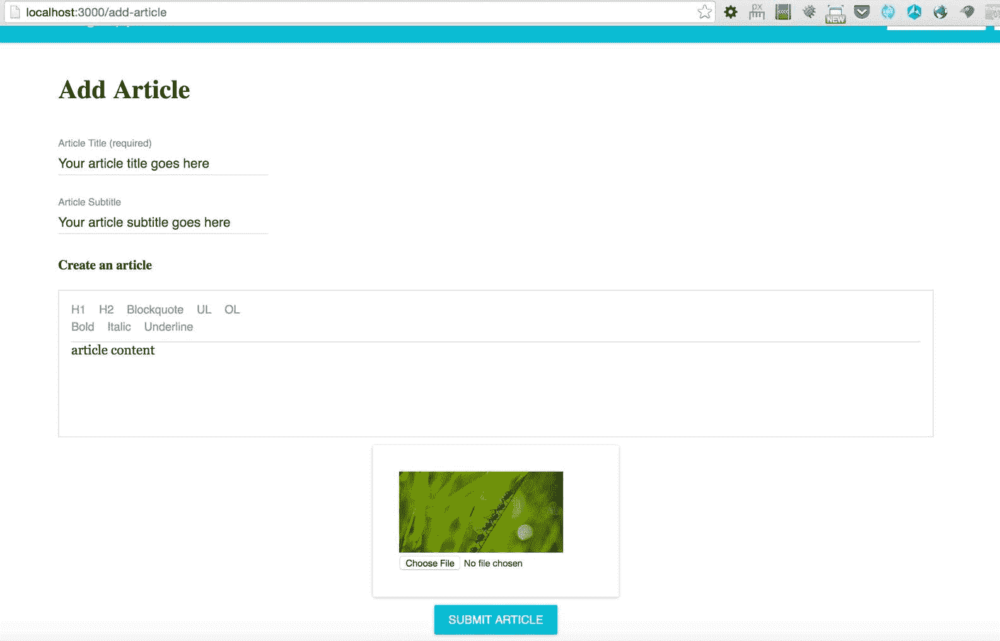

# ArticleCard 和 PublishingApp 的改进

改进`ArticleCard`中的`render`函数，以便它也显示副标题（目前是模拟的）。`src/components/ArticleCard.js`文件的旧内容如下：

```jsx
// old code: 

  render() { 

    let title = this.props.title || 'no title provided'; 

    let content = this.props.content || 'no content provided'; 

    let articlePicUrl = this.props.articlePicUrl || 

     '/static/placeholder.png'; 

    let paperStyle = { 

      padding: 10,  

      width: '100%',  

      height: 300 

    }; 

    let leftDivStyle = { 

      width: '30%',  

      float: 'left' 

    } 

    let rightDivStyle = { 

      width: '60%',  

      float: 'left',  

      padding: '10px 10px 10px 10px' 

    } 

    return ( 

      <Paper style={paperStyle}> 

        <CardHeader 

          title={this.props.title} 

          subtitle='Subtitle' 

          avatar='/static/avatar.png' 

        /> 

        <div style={leftDivStyle}> 

          <Card > 

            <CardMedia 

              overlay={<CardTitle title={title} 

               subtitle='Overlay subtitle' />}> 

               

            </CardMedia> 

          </Card> 

        </div> 

        <div style={rightDivStyle}> 

          <div dangerouslySetInnerHTML={{__html: content}} /> 

        </div> 

      </Paper>); 

  }

```

让我们将其更改为以下内容：

```jsx
 render() { 

    let title = this.props.title || 'no title provided'; 

    let subTitle = this.props.subTitle || ''; 

    let content = this.props.content || 'no content provided'; 

    let articlePicUrl = this.props.articlePicUrl || 

     '/static/placeholder.png'; 

    let paperStyle = { 

      padding: 10,  

      width: '100%',  

      height: 300 

    }; 

    let leftDivStyle = { 

      width: '30%',  

      float: 'left' 

    } 

    let rightDivStyle = { 

      width: '60%',  

      float: 'left',  

      padding: '10px 10px 10px 10px' 

    } 

    return ( 

      <Paper style={paperStyle}> 

        <CardHeader 

          title={this.props.title} 

          subtitle={subTitle} 

          avatar='/static/avatar.png' 

        /> 

        <div style={leftDivStyle}> 

          <Card > 

            <CardMedia 

              overlay={<CardTitle title={title} 

               subtitle={subTitle} />}> 

               

            </CardMedia> 

          </Card> 

        </div> 

        <div style={rightDivStyle}> 

          <div dangerouslySetInnerHTML={{__html: content}} /> 

        </div> 

      </Paper>); 

  }

```

正如您所看到的，我们已经定义了一个新的`subTitle`变量，并在`CardHeader`和`CardMedia`组件中使用它，所以现在它也会显示副标题。

另一件事是让`PublishingApp`也获取在本章中引入的副标题，因此我们需要改进以下旧代码：

```jsx
// old code: 

  async _fetch() { 

    let articlesLength = await falcorModel. 

      getValue('articles.length'). 

      then((length) => length); 

    let articles = await falcorModel. 

      get(['articles', {from: 0, to: articlesLength-1}, 

       ['_id','articleTitle', 'articleContent', 

       'articleContentJSON', 'articlePicUrl']]).  

      then((articlesResponse) => {   

        return articlesResponse.json.articles; 

      }).catch(e => { 

        console.debug(e); 

        return 500; 

      }); 

    // no changes below, striped

```

将其替换为以下内容：

```jsx
 async _fetch() { 

    let articlesLength = await falcorModel. 

      getValue('articles.length'). 

      then((length) => length); 

    let articles = await falcorModel. 

      get(['articles', {from: 0, to: articlesLength-1}, ['_id', 

       'articleTitle', 'articleSubTitle','articleContent', 

       'articleContentJSON', 'articlePicUrl']]).  

      then((articlesResponse) => {   

        return articlesResponse.json.articles; 

      }).catch(e => { 

        console.debug(e); 

        return 500; 

      });

```

正如您所看到的，我们已经开始使用`falcorModel.get`来获取`articleSubTitle`属性。

当然，我们需要将这个`subTitle`属性传递给`PublishingApp`类的`render`函数中的`ArticleCard`组件。

```jsx
// old code: 

    this.props.article.forEach((articleDetails, articleKey) => { 

      let currentArticleJSX = ( 

        <div key={articleKey}> 

          <ArticleCard  

            title={articleDetails.articleTitle} 

            content={articleDetails.articleContent} 

      articlePicUrl={articleDetails.articlePicUrl} /> 

        </div> 

      );

```

最终，我们将得到以下结果：

```jsx
   this.props.article.forEach((articleDetails, articleKey) => { 

      let currentArticleJSX = ( 

        <div key={articleKey}> 

          <ArticleCard  

            title={articleDetails.articleTitle} 

            content={articleDetails.articleContent}  

            articlePicUrl={articleDetails.articlePicUrl} 

      subTitle={articleDetails.articleSubTitle} /> 

        </div> 

      );

```

在主页上所有这些更改之后，你可以找到一个编辑过的文章，包括标题、副标题、封面照片和内容（由我们的所见即所得编辑器创建）：

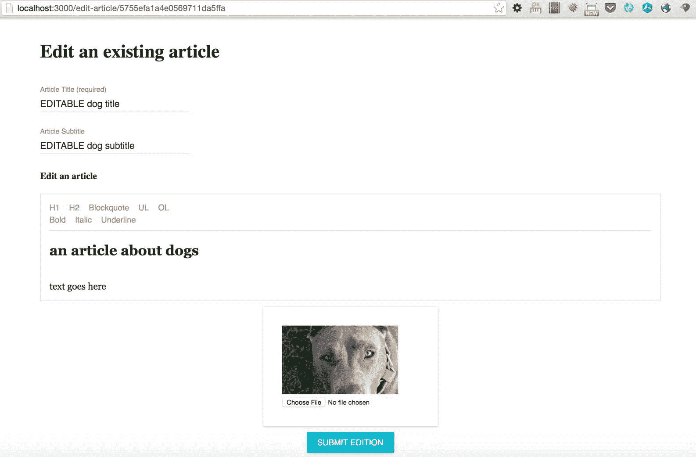

# 仪表板改进（现在我们可以剥离剩余的 HTML）

本章的最后一步是改进仪表板。它将从 props 中提取 HTML，以便在用户浏览我们的应用程序时获得更好的外观和感觉。找到以下代码：

```jsx
// old code: 

    this.props.article.forEach((articleDetails, articleKey) => { 

      let articlePicUrl = articleDetails.articlePicUrl || 

       '/static/placeholder.png'; 

      let currentArticleJSX = ( 

        <Link to={&grave;/edit-article/${articleDetails['_id']}&grave;} 

         key={articleKey}> 

          <ListItem 

            leftAvatar={} 

            primaryText={articleDetails.articleTitle} 

            secondaryText={articleDetails.articleContent} 

          /> 

        </Link> 

      );

```

用以下代码替换：

```jsx
   this.props.article.forEach((articleDetails, articleKey) => { 

      let articlePicUrl = articleDetails.articlePicUrl || 

       '/static/placeholder.png'; 

      let articleContentPlanText = 

       articleDetails.articleContent.replace(/</?[^>]+(>|$)/g, 

       ''); 

      let currentArticleJSX = ( 

        <Link to={&grave;/edit-article/${articleDetails['_id']}&grave;} 

         key={articleKey}> 

          <ListItem 

            leftAvatar={} 

            primaryText={articleDetails.articleTitle} 

            secondaryText={articleContentPlanText} 

          /> 

        </Link> 

      );

```

如你所见，我们只是从 HTML 中剥离 HTML 标签，这样我们将获得更好的`secondaryText`，而不带有 HTML 标记，就像这个例子中一样：

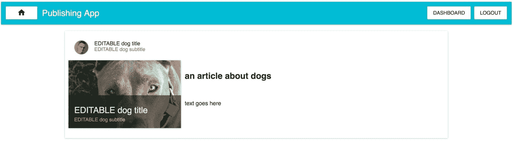

# 总结

我们已经实现了书中涵盖的所有功能。下一步是开始着手部署这个应用程序。

如果你想提高编码技能，最好自己完全实现一些功能。以下是一些我们发布应用程序中仍然缺少的功能的想法。

我们可以有一个单独的链接指向某篇文章，这样你可以与朋友分享。如果你想在数据库中创建一个与某篇文章相关的易读唯一标识，这可能会很有用。因此，用户可以分享类似于[`reactjs.space/an-article-about-a-dog`](http://reactjs.space/an-article-about-a-dog)这样的链接，而不是链接到类似于[`reactjs.space/570b6e26ae357d391c6ebc1d`](http://reactjs.space/570b6e26ae357d391c6ebc1d)（`reactjs.space`是我们在生产服务器上将使用的域名）。

可能有一种方法将一篇文章与发布它的编辑关联起来。目前是模拟的。你可以取消模拟。

用户在登录状态下无法更改其用户详细信息--这可能是练习更全面的全栈开发的好方法。

用户无法设置他们的头像图片--你可以以类似的方式添加这个功能，就像我们实现封面图片一样。

创建一个更强大的 Draft.JS 所见即所得编辑器与插件。强大的插件易于实现提及、贴纸、表情符号、标签、撤销/重做等功能。访问[`www.draft-js-plugins.com/`](https://www.draft-js-plugins.com/)了解更多详情。实现你最喜欢的一个或两个。

在下一章中，我们将开始使用[www.mLab.com](http://www.mLab.com)在线部署我们的 MongoDB 实例，这是一个作为服务提供商，可以帮助我们轻松构建可扩展的 MongoDB 节点。

让我们开始部署的乐趣吧！

# 不要忘记休息一下哦~

**公众号：古德猫宁李**

+   电子书搜索下载

+   书单分享

+   书友学习交流

**网站：**[沉金书屋 https://www.chenjin5.com](https://www.chenjin5.com)

+   电子书搜索下载

+   电子书打包资源分享

+   学习资源分享
