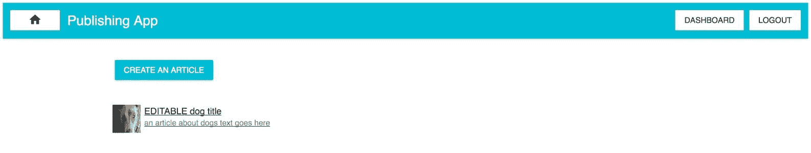
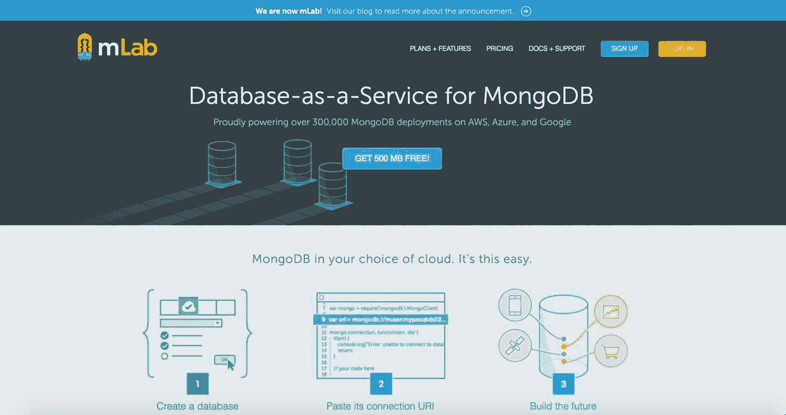
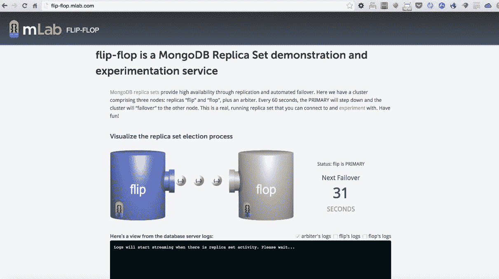
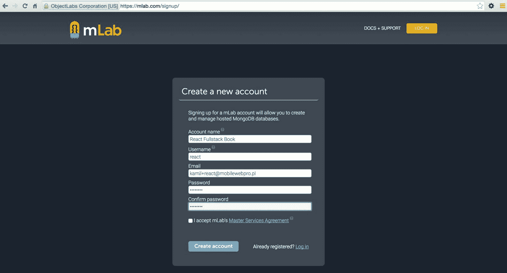
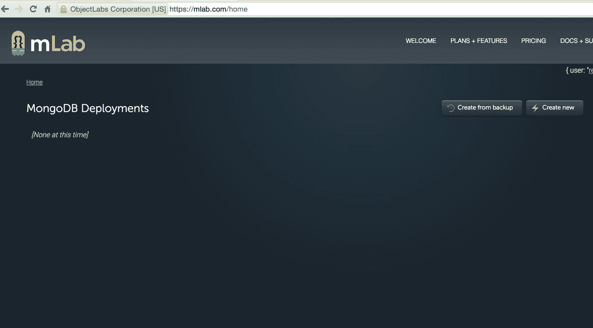
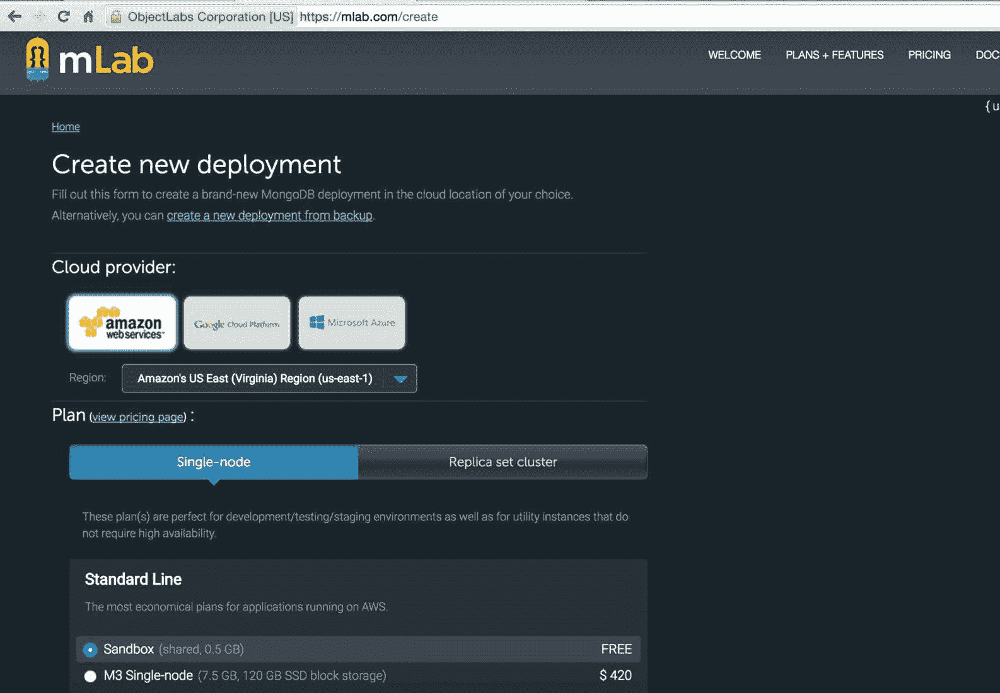
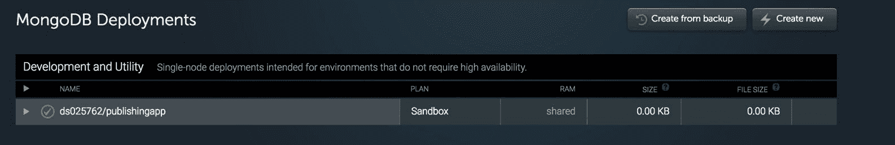
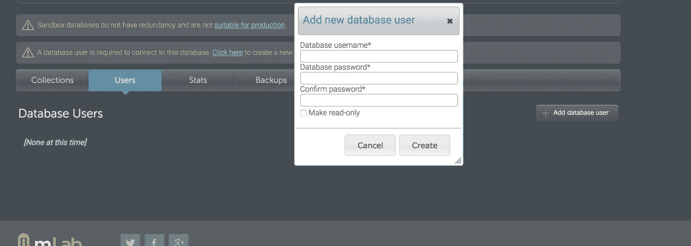
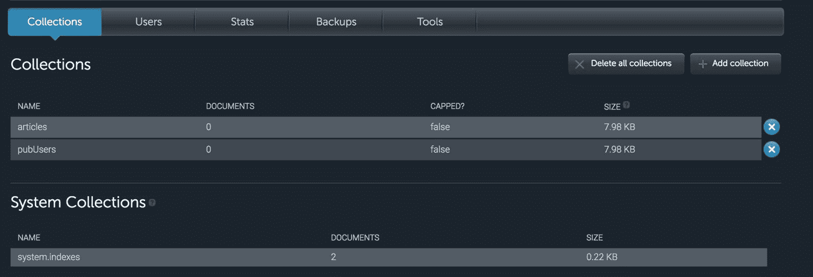

# 第七章：mLab 上的 MongoDB 部署

我们已经到了需要开始规划应用程序部署的时候。我们选择了 MongoDB 作为我们的数据库。有不同的方法可以用于扩展它--您可以自己使用自己的服务器做所有事情（更耗时和要求更多），或者您可以使用为您做复制/扩展的服务，比如数据库即服务提供商。

在本章中，我们将涵盖以下主题：

+   创建 mLab 账户和创建新的 MongoDB 部署

+   MongoDB 中副本集的工作原理以及如何在 mLab 中使用它

+   在现场演示中测试副本集（从 mLab 翻转）

+   设置数据库用户和密码

+   了解在 AWS EC2 上部署所需的准备工作

# mLab 概述

在我们的案例中，我们将使用 mLab，以便花费更少的时间在 MongoDB 上配置低级别的东西，而更多的时间构建一个健壮可扩展的应用程序。

如果我们去[www.mLab.com](http://www.mLab.com)，有一个免费的数据库计划（我们将在本章中使用）和一个付费的数据库计划：



总的来说，mLab 提供了一些有趣的功能，比如：

+   **云自动化工具**：这些工具提供了在 AWS、Azure 或 Google 上的按需配置（准备）；副本集（本章后面将详细描述）和**分片集群**。这些还提供了无缝、零停机的扩展和通过自动故障转移实现高可用性。

+   **备份和恢复工具**：这些提供了自动备份，可以在紧急情况下帮助后期项目阶段。

+   **监控和警报工具**：例如，有一个**慢查询**工具，可以帮助您找到慢查询，通过添加索引进行优化。

+   **在线数据浏览工具**：当您登录到 mLab 的管理面板时，可以通过浏览器浏览 MongoDB 的集合。

# 副本集连接和高可用性

在 MongoDB 中，有一个特性可以使用自动故障转移来确保高可用性。简而言之，故障转移是一个功能，确保如果主服务器（拥有数据库最重要的副本）失败，那么如果原始主服务器不可用，次要成员的数据库将成为主要的。

次要成员的数据库是一个保持所谓的**只读备份**的服务器。

主数据库和次要数据库经常复制自身，以保持始终同步。次要服务器主要用于读操作。

整个副本集功能在没有 mLab 的情况下实施起来非常耗时，但 mLab 提供了这个功能，以便*抽象*这一部分，使我们的整个过程更加自动化。

# MongoDB 故障转移

mLab 还提供了一个用于测试应用程序故障转移场景的强大工具，可在[`flip-flop.mlab.com`](http://flip-flop.mlab.com)上使用。



在这里，我们可以测试 MongoDB 副本集的自动故障转移工作原理。正如我们在前面的截图中所看到的，有三个节点：副本的**flip**和**flop**，以及一个仲裁者。在 flip-flop 的演示中，您可以连接到仲裁服务器，主服务器将下台，集群将故障转移到另一个节点。您可以进行实验--自己尝试并玩得开心！

您可以在[`docs.mlab.com/connecting/#replica-set-connections`](http://docs.mlab.com/connecting/#replica-set-connections)找到有关如何使用 flip-flop 演示的更多文档。

# mLab 中的免费与付费计划

在本书中，我们将指导您使用 mLab 的免费计划。在 mLab 中，副本集在付费计划中可用（从每月 15 美元起），当然，您可以免费使用 flip-flop 演示，以便玩转 MongoDB 的这一非常重要的功能。

# 新的 mLab 帐户和节点

1.  转到[`mlab.com/signup/`](https://mlab.com/signup/)，如下截图所示：



1.  通过单击收件箱中的确认链接来验证您的电子邮件。

1.  单击“创建新”按钮，如下截图所示：



1.  您现在处于创建新部署页面。选择单节点|沙箱（免费），如下截图所示：



1.  当您仍然在[`mlab.com/create`](https://mlab.com/create)（创建新部署）时，将数据库名称设置为`publishingapp`，然后单击“创建新的 MongoDB 部署”按钮，如下截图所示：



1.  按照上述步骤后，您应该能够在仪表板上找到 MongoDB 部署（[`mlab.com/home`](https://mlab.com/home)），如下截图所示：


# 创建数据库的用户/密码和其他配置

现在，数据库已经准备好用于我们的发布应用程序，但它仍然是空的。

有一些步骤我们需要采取来使用它：

1.  创建用户/密码组合。我们需要点击刚刚创建的数据库，并找到一个名为“用户”的选项卡。点击它后，点击“添加新数据库用户”按钮，然后按照下面的屏幕截图中所示的表格填写详细信息。



1.  让我们假设在本书中我们的详细信息如下：

DB 用户名：`usermlab`

DB 密码：`pwdmlab`

在我们将使用用户名和密码的地方，我将使用这些详细信息。

1.  之后，我们需要创建与我们的本地 MongoDB 相同的集合：

集合 | 添加集合 | 文章集合 | 添加集合 | pubUsers

1.  在执行了所有前面的步骤之后，您应该看到类似下面截图的东西：



1.  在这个阶段，最后一件事是记录下来来自下面截图的 Mongo 详细信息：



# 配置总结

我们需要保留并分享来自 mLab 的所有信息以及 AWS S3 的详细信息。这些详细信息将在下一章中部署我们的应用程序到 Amazon AWS EC2 时有用。

在本书的这一阶段，有一些详细信息我们需要分开保存：

```jsx
AWS_ACCESS_KEY_ID=<<access-key-obtained-in-previous-chapter>>

AWS_SECRET_ACCESS_KEY=<<secret-key-obtained-in-previous-chapter>>

AWS_BUCKET_NAME=publishing-app

AWS_REGION_NAME=eu-central-1

MONGO_USER=usermlab

MONGO_PASS=pwdmlab

MONGO_PORT=<<port-from-your-mlab-node>>

MONGO_ENV=publishingapp

MONGO_HOSTNAME=<<hostname-from-your-mlab-node>>

```

确保您已将端口和主机名更换为正确的端口和主机名（如 mLab 在前面的屏幕截图中提供的）。

所有 Mongo`env`变量都可以从 mLab 获取，您可以在那里找到类似以下链接的链接（这是在撰写本章时从创建的帐户中复制的示例）：

```jsx
mongo ds025762.mlab.com:25762/publishingapp -u <dbuser> -p <dbpassword>

```

# 总结

在下一章中，我们将开始在 AWS EC2 平台上的生产服务器上使用这些环境变量。将所有这些详细信息记录在一个易于访问且安全的地方，因为我们很快将使用它们。

最后一件事是检查应用程序是否正常运行，并使用远程 mLab MongoDB（而不是使用`mongd`命令运行的本地 MongoDB）。您可以通过使用`npm start`来运行它，然后您将看到发布应用程序的空白主页。因为我们远离了本地数据库，远程数据库是空的，您需要注册一个新用户，并尝试使用 mLab 在后台存储数据发布新文章。
