# 第八章：Docker 和 EC2 容器服务

我们已经完成了与 mLab 作为后端数据库相关的所有工作。发布应用程序应该完全在 mLab MongoDB 实例上远程工作，因此您不再需要运行`mongod`命令。

现在是时候准备我们的 Docker 容器，并完全使用 ECS（EC2 容器服务）和负载均衡器在 EC2 上部署它了。

什么是 Docker？它是一款非常有用的开源软件，可以帮助您将任何应用程序打包、运输和作为一个轻量级容器运行（例如，与虚拟机相比）。

容器的目标与虚拟机类似--最大的区别在于 Docker 是针对软件开发而创建的，而不是虚拟机。您还需要知道，完全虚拟化的系统有自己分配的资源，这会导致最小的资源共享，这与 Docker 容器不同。当然，在虚拟机中，您会获得更多的隔离，但代价是虚拟机更加沉重（需要更多的磁盘空间、RAM 和其他资源）。Docker 的容器轻巧，并且能够在不同容器之间共享更多的东西，与虚拟机相比。

好处是 Docker 的容器是硬件和平台无关的，因此您不必担心您正在工作的内容是否能在任何地方运行。

总的来说，Docker 的好处是它提高了开发人员的生产力，帮助他们更快地交付软件，帮助将软件从本地开发机器移动到 AWS 上的生产部署等。Docker 还允许对软件进行版本控制（类似于 Git），这在您需要在生产服务器上快速回滚时会很有帮助。

在本章中，您将学到以下内容：

+   在非 Linux 机器上使用 Docker Toolbox 在您的机器上安装 Docker 应用程序

+   测试您的 Docker 设置是否正确

+   准备发布应用程序以使用 mLab Mongo 作为数据库

+   为发布应用程序创建一个新的 Docker 容器

+   创建您的第一个 Dockerfile，它将在 Linux CentOS 上部署发布应用程序

+   EC2 容器服务

+   AWS 负载均衡器

+   使用 Amazon Route 53 进行 DNS 服务

+   AWS 身份和访问管理（IAM）

# 使用 Docker Toolbox 安装 Docker

安装 Docker 非常简单。访问官方安装页面[`docs.docker.com/engine/installation/`](https://docs.docker.com/engine/installation/)，因为它将根据您的操作系统为您提供最佳指导。iOS 和 Windows 有易于遵循的安装程序，以及不同 Linux 发行版的大量说明。

如果您使用的是非 Linux 机器，则还需要为 Windows 或 OS X 安装 Docker Toolbox。这很简单，其安装程序可在[`www.docker.com/products/docker-toolbox`](https://www.docker.com/products/docker-toolbox)找到，如下截图所示：

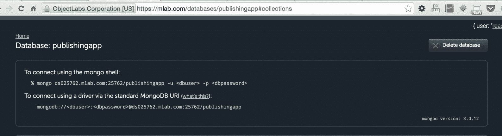

如果您使用的是 Linux，则需要执行一些额外的步骤，因为您需要在 BIOS 中打开虚拟化：

+   按照官方文档中的说明安装 Docker machine，网址为[`docs.docker.com/machine/install-machine/`](https://docs.docker.com/machine/install-machine/)

+   对于 Ubuntu，您需要手动从[`help.ubuntu.com/community/VirtualBox`](https://help.ubuntu.com/community/VirtualBox)安装 VirtualBox [](https://docs.docker.com/machine/install-machine/)

+   对于其他 Linux 发行版，请访问[`www.virtualbox.org/wiki/Linux_Downloads`](https://www.virtualbox.org/wiki/Linux_Downloads)

在您在本地机器上安装了 Docker（与 OS X 和 Windows 上的 Toolbox 一起）之后，在终端中运行以下命令：

```jsx
$ docker info

```

运行此命令后，您将能够看到类似以下截图的内容：

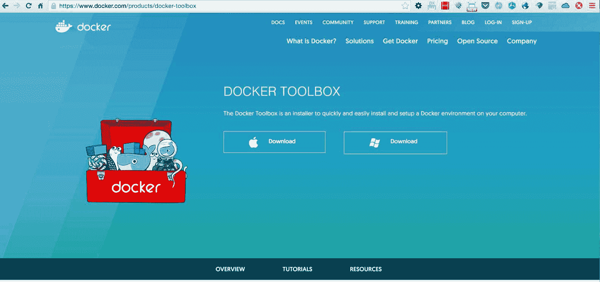

如果您能看到类似这样的东西，那么您的安装是成功的。让我们继续使用 Docker。


# Docker Hub - 一个 hello world 示例

在我们开始创建发布应用程序的 Docker 容器之前，让我们先尝试一下官方的 Docker *hello world*示例，这将让您了解 Docker Hub 的工作原理。

Docker Hub 就像 GitHub 对 Git 存储库一样对应 Docker 容器。您可以在 Docker 中拥有公共和私有容器。Docker Hub 的主页看起来像这样：

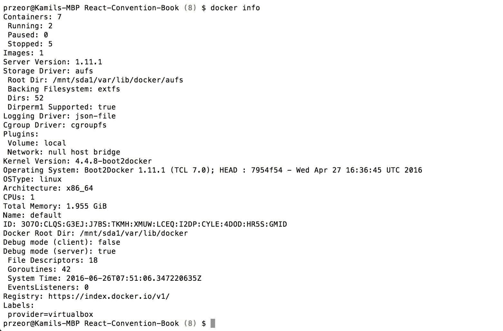

只是为了让您感受一下，如果您访问[`hub.docker.com/explore/`](https://hub.docker.com/explore/)，您可以看到不同的容器已经准备好供使用，例如：

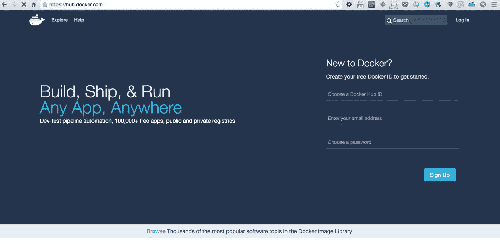

仅供我们的演示练习，我们将使用一个名为`hello world`的容器，该容器可以在[`hub.docker.com/r/library/hello-world/`](https://hub.docker.com/r/library/hello-world/)上公开获取。

为了运行这个`hello-world`示例，在您的终端中运行以下命令：

```jsx
$ docker run hello-world

```

运行后，您将看到类似以下内容：

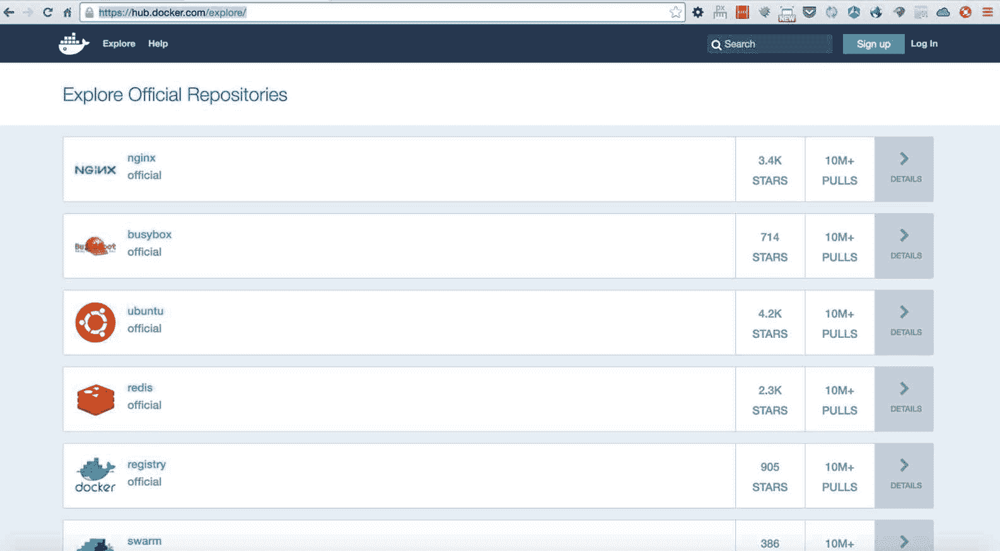

让我们了解刚刚发生了什么：我们使用`docker run`命令启动基于镜像的容器（在我们的示例中，我们使用了 hello world 容器镜像）。在这种情况下，我们执行以下操作：

1.  运行命令告诉 Docker 启动名为`hello-world`的容器，不带额外命令。

1.  按 Enter 后，Docker 将下载 Docker Hub。

1.  然后它将在虚拟机中使用 Docker Toolbox 启动容器，对于非 Linux 系统。

`hello-world`镜像来自之前提到的名为 Docker Hub 的公共注册表（您可以访问[`hub.docker.com/r/library/hello-world/`](https://hub.docker.com/r/library/hello-world/)）。

# Dockerfile 示例

每个镜像都由 Dockerfile 组成。`hello-world`示例的 Dockerfile 如下所示：

```jsx
// source: https://github.com/docker-library/hello-world/blob/master/Dockerfile 

FROM scratch 

COPY hello / 

CMD ["/hello"]

```

Dockerfile 是一组指令，告诉 Docker 如何构建容器镜像。我们将很快创建自己的 Dockerfile。Dockerfile 的类比可以是 Bash 语言，您可以在任何 Linux/Unix 机器上使用。当然，它是不同的，但编写指令以创建作业的一般思想是相似的。

# 修改我们的代码库以创建它

目前，我们确信我们的 Docker 应用程序设置是正确的。

首先，我们需要对当前的代码库进行一些修改，因为有一些小的调整需要使其正常工作。

确保以下文件具有适当的内容。

`server/.env`文件的内容必须如下：

```jsx
AWS_ACCESS_KEY_ID=<<___AWS_ACCESS_KEY_ID__>> 

AWS_SECRET_ACCESS_KEY=<<___AWS_SECRET_ACCESS_KEY__>> 

AWS_BUCKET_NAME=publishing-app 

AWS_REGION_NAME=eu-central-1 

MONGO_USER=<<___your_mlab_mongo_user__>> 

MONGO_PASS=<<___your_mlab_mongo_pass__>> 

MONGO_PORT=<<___your_mlab_mongo_port__>> 

MONGO_ENV=publishingapp 

MONGO_HOSTNAME=<<___your_mlab_mongo_hostname__>>

```

目前，我们将从文件中加载环境变量，但稍后我们将从 AWS 面板中加载它们。将所有秘密数据保留在服务器上并不真正安全。现在我们出于简洁起见使用它；稍后，我们将删除它，采用更安全的方法。

关于 Mongo 环境变量，我们在前一章关于设置 mLab 时学到了它们（如果您错过了此时所需的任何细节，请返回到该章节）。

`server/index.js`文件的内容必须如下：

```jsx
var env = require('node-env-file'); 

// Load any undefined ENV variables form a specified file.  

env(__dirname + '/.env'); 

require("babel-core/register"); 

require("babel-polyfill"); 

require('./server');

```

确保在`server/index.js`的开头从文件中加载`.env`。这是必须的，以便从环境变量（`server/.env`）中加载 mLab Mongo 的详细信息。

`server/configMongoose.js`文件的内容必须被替换。找到以下代码：

```jsx
// this is old code from our codebase: 

import mongoose from 'mongoose'; 

var Schema = mongoose.Schema; 

const conf = { 

  hostname: process.env.MONGO_HOSTNAME || 'localhost', 

  port: process.env.MONGO_PORT || 27017, 

  env: process.env.MONGO_ENV || 'local', 

}; 

mongoose.connect(&grave;mongodb://${conf.hostname}: 

 ${conf.port}/${conf.env}&grave;);

```

同样改进的代码的新版本必须如下：

```jsx
import mongoose from 'mongoose'; 

var Schema = mongoose.Schema; 

const conf = { 

  hostname: process.env.MONGO_HOSTNAME || 'localhost', 

  port: process.env.MONGO_PORT || 27017, 

  env: process.env.MONGO_ENV || 'local', 

}; 

let dbUser 

if(process.env.MONGO_USER && process.env.MONGO_PASS) { 

  dbUser = {user: process.env.MONGO_USER, pass: 

   process.env.MONGO_PASS} 

} else { 

  dbUser = undefined; // on local dev not required 

} 

mongoose.connect(&grave;mongodb://${conf.hostname}:${conf.port}/${conf.env}&grave;, dbUser);

```

正如你所看到的，我们已经添加了连接特定 DB 用户的能力。我们需要它，因为我们之前使用的本地主机不需要任何用户，但是当我们开始使用 mLab MongoDB 时，指定我们数据库的用户是必须的。否则，我们将无法正确进行身份验证。

从这一点开始，您不需要在系统的后台运行`mongod`进程，因为应用程序将连接到您在上一章中创建的 mLab MongoDB 节点。mLab MongoDB（免费版本）全天候运行，但如果您计划将其用于生产就绪的应用程序，那么您需要更新它并开始使用副本集功能（这在上一章中提到过）。

您可以尝试使用以下命令运行项目：

```jsx
npm start

```

然后您应该能够加载应用程序：

！[](Image00098.jpg)

现在的重要区别是所有 CRUD 操作（通过我们的发布应用程序进行读/写）都是在我们的远程 MongoDB 上进行的（而不是在本地的 MongoDB 上）。

发布应用程序使用 mLab MongoDB 后，我们准备准备我们的 Docker 镜像，然后在几个 AWS EC2 实例上部署它，使用 AWS 负载均衡器和 EC2 容器服务。

# 工作在发布应用程序 Docker 镜像上

在继续之前，您应该能够通过使用远程 mLab MongoDB 在本地运行您的项目。这是必需的，因为我们将在 Docker 容器中开始运行我们的发布应用程序。然后我们的应用程序将远程连接到 Mongo。我们不会在任何 Docker 容器中运行任何 MongoDB 进程。这就是在以下步骤中使用 mLab 如此重要的原因。

通过在终端/命令行中执行以下命令来创建 Dockerfile：

```jsx
[[your are in the project main directory]]

$ touch Dockerfile

```

在你的新 Dockerfile 中输入以下内容：

```jsx
FROM centos:centos7 

RUN yum update -y 

RUN yum install -y tar wget 

RUN wget -q https://nodejs.org/dist/v4.0.0/node-v4.0.0-linux-x64.tar.gz -O - | tar xzf - -C /opt/ 

RUN mv /opt/node-v* /opt/node 

RUN ln -s /opt/node/bin/node /usr/bin/node 

RUN ln -s /opt/node/bin/npm /usr/bin/npm 

COPY . /opt/publishing-app/ 

WORKDIR /opt/publishing-app 

RUN npm install 

RUN yum clean all 

EXPOSE 80 

CMD ["npm", "start"]

```

让我们一步一步地看一下我们将在发布应用程序中与 Docker 一起使用的 Dockerfile：

+   `FROM centos:centos7`：这表示我们将使用[`hub.docker.com/r/_/centos/`](https://hub.docker.com/r/_/centos/)公共 Docker 存储库中的 CentOS 7 Linux 发行版作为起点。

您可以使用其他软件包作为起点，例如 Ubuntu，但我们使用 CentOS 7，因为它更轻量级，通常非常适合 Web 应用程序部署。您可以在[`www.centos.org/`](https://www.centos.org/)找到更多详细信息。

所有命令的文档都可以在[`docs.docker.com/engine/reference/builder/`](https://docs.docker.com/engine/reference/builder/)找到。

+   `RUN yum update -y`：这将使用`yum`命令行更新软件包，这对于任何 Linux 设置都是标准的。

+   `RUN yum install -y tar wget`：这将安装两个软件包，`tar`（用于解压文件）和`wget`（用于下载文件）。

+   `RUN wget -q https://nodejs.org/dist/v4.0.0/node-v4.0.0-linux-x64.tar.gz -O - | tar xzf - -C /opt/*`：此命令将`node4.0.0`下载到我们的 CentOS 容器中，解压它，并将所有文件放入`/opt/`目录。

+   `RUN mv /opt/node-v /opt/node*`：这将将我们刚下载并解压（使用`node`）的文件夹重命名为简单的`node`而不带版本命名。

+   `RUN ln -s /opt/node/bin/node /usr/bin/node`：我们正在将`/opt/node/bin/node`位置与`/usr/bin/node`链接，这样我们就可以在终端中使用简单的`$ node`命令。这对于 Linux 用户来说是标准的。

+   `RUN ln -s /opt/node/bin/npm /usr/bin/npm`：与`node`一样，但使用`npm`。我们正在链接它以使使用更容易，并将其链接到我们的 CentOS 7 上的`$ npm`。

+   `COPY . /opt/publishing-app/`：这将复制上下文中的所有文件（`.`（点）符号是您启动容器构建时的位置。我们马上就会做）。它将所有文件复制到容器中的`/opt/publishing-app/`位置。

在我们的情况下，我们已经在发布应用程序的目录中创建了 Dockerfile，因此它将把容器中的所有项目文件复制到指定位置`/opt/publishing-app/`。

+   `WORKDIR /opt/publishing-app`：在我们的 Docker 容器中有了发布应用程序的文件之后，我们需要选择工作目录。这类似于在任何 Unix/Linux 机器上执行`$ cd /opt/publishing-app`。

+   `RUN npm install`：当我们在工作目录`/opt/publishing-app`中时，我们运行标准的`npm install`命令。

+   `RUN yum clean all`：我们清理`yum`缓存。

+   `EXPOSE 80`：我们定义了使用我们发布应用程序的端口。

+   `CMD ["npm", "start"]`：然后，我们指定如何在我们的 Docker 容器中运行应用程序。

我们还将在主项目目录中创建一个 `.dockerignore` 文件：

```jsx
$ [[[in the main directory]]]

$ touch .dockerignore

```

文件内容将如下所示：

```jsx
.git 

node_modules 

.DS_Store

```

我们不想复制提到的文件 `(.DS_Store` 是特定于 OS X)。

# 构建发布应用程序容器

目前，您将能够构建 Docker 的容器。

在项目的主目录中，您需要运行以下命令：

```jsx
docker login

```

`login` 命令将提示您输入您的 Docker 用户名和密码。在您正确验证后，您可以运行 `build` 命令：

```jsx
docker build -t przeor/pub-app-docker .

```

当然，用户名和容器名称的组合必须是您自己的。用您的详细信息替换它。

上述命令将使用 Dockerfile 命令构建容器。这是您将看到的（步骤 1、步骤 2 等）：

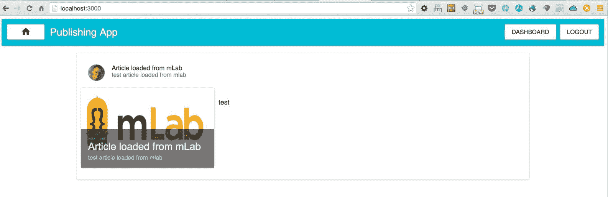

成功构建后，您将在终端/命令行中看到类似于这样的内容：

```jsx
[[[striped from here for the sake of brevity]]]

Step 12 : EXPOSE 80

 ---> Running in 081e0359cbd5

 ---> ce0433b220a0

Removing intermediate container 081e0359cbd5

Step 13 : CMD npm start

 ---> Running in 581df04c8c81

 ---> 1970dde57fec

Removing intermediate container 581df04c8c81

Successfully built 1910dde57fec

```

正如您在 Docker 终端中所看到的，我们已成功构建了一个容器。下一步是在本地测试它，然后学习一些 Docker 的基础知识，最后开始在我们的 AWS 部署上工作。

# 在本地运行发布应用程序容器

为了测试容器是否已正确构建，请执行以下步骤。

运行此命令：

```jsx
$ docker-machine env

```

上述命令将给您类似于这样的输出：

```jsx
export DOCKER_TLS_VERIFY="1"

export DOCKER_HOST="tcp://192.168.99.100:2376"

export DOCKER_CERT_PATH="/Users/przeor/.docker/machine/machines/default"

export DOCKER_MACHINE_NAME="default"

# Run this command to configure your shell: 

# eval $(docker-machine env)

```

我们正在寻找 `DOCKER_HOST` IP 地址；在这种情况下，它是 `192.168.99.100`。

这个 Docker 主机 IP 将用于检查我们的应用程序是否在容器中正确运行。记下来。

下一步是使用以下命令运行我们的本地容器：

```jsx
$ docker run -d -p 80:80  przeor/pub-app-docker npm start

```

关于标志：`d` 标志代表“分离”，因此进程将在后台运行。您可以使用以下命令列出所有正在运行的 Docker 进程：

```jsx
docker ps

```

示例输出如下：

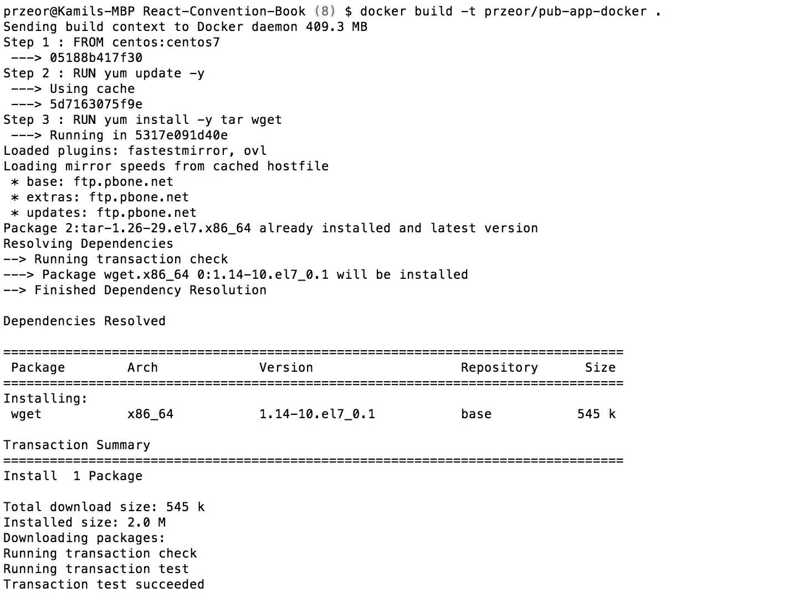

`-p` 标志告诉我们容器的端口 `80` 绑定到 Docker IP 主机的端口 `80`。因此，如果我们在容器中将我们的 Node 应用程序暴露在端口 `80` 上，那么它将能够在 IP 的标准端口 `80` 上运行（在示例中，它将是 `192.168.99.100:80`；显然，端口 `80` 用于所有 HTTP 请求）。

`przeor/pub-app-docker` 命令将指定我们要运行的容器的名称。

使用 `npm start`，我们告诉 Docker 容器在启动后要运行哪个命令（否则，容器将立即运行并停止）。

有关`docker run`的更多参考资料，请访问[`docs.docker.com/engine/reference/run/`](https://docs.docker.com/engine/reference/run/)。

上述命令将运行该应用程序，如下面的屏幕截图所示：

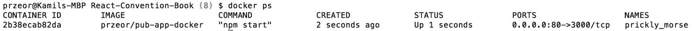

如您所见，浏览器 URL 栏中的 IP 地址为 http://192.168.99.100。这是我们的 Docker 主机 IP。

# 调试容器

如果容器对您不起作用，就像下面的屏幕截图中一样，请使用以下命令进行调试并找出原因：

```jsx
docker run -i -t -p 80:80 przeor/pub-app-docker

```

此带有`-i -t -p`标志的命令将在终端/命令行中显示所有日志，就像下面的屏幕截图中一样（这只是一个示例，以展示您本地调试 Docker 容器的能力）：

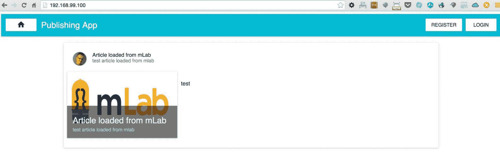

# 将 Docker 容器推送到远程存储库

如果容器在本地运行正常，那么它几乎已经准备好部署到 AWS 了。

在推送容器之前，让我们将`.env`文件添加到`.dockerignore`中，因为其中包含了您不想放入容器中的所有敏感数据。因此，请在`.dockerignore`文件中添加以下内容：

```jsx
.git 

node_modules 

.DS_Store 

.env

```

在将`.env`添加到`.gitignore`后，我们需要更改`server/index.js`文件并添加额外的`if`语句：

```jsx
if(!process.env.PORT) { 

  var env = require('node-env-file'); 

  // Load any undefined ENV variables form a specified file.  

  env(__dirname + '/.env'); 

}

```

此`if`语句检查我们是在本地运行应用程序（使用`.env`文件）还是在 AWS 实例上远程运行（然后我们以更安全的方式传递`env`变量）。

在将`.env`文件添加到`.dockerignore`（并修改`server/index.js`）后，构建容器，准备推送：

```jsx
docker build -t przeor/pub-app-docker

```

关于环境变量，我们将通过 AWS 高级选项添加它们。您将在稍后了解到这一点，但是为了对在本地主机上运行时如何添加它们有一个大致的了解，请查看以下示例（在命令的标志中提供了虚假数据）：

```jsx
$ docker run -i -t -e PORT=80 -e AWS_ACCESS_KEY_ID='AKIMOCKED5JM4VUHA' -e AWS_SECRET_ACCESS_KEY='k3JxMOCKED0oRI6w3ZEmENE1I0l' -e AWS_BUCKET_NAME='publishing-app' -e AWS_REGION_NAME='eu-central-1' -e MONGO_USER='usermlab' -e MONGO_PASS='MOCKEDpassword' -e MONGO_PORT=25732 -e MONGO_ENV='publishingapp' -e MONGO_HOSTNAME='ds025761.mlab.com' -p 80:80 przeor/pub-app-docker

npm start

```

确保您已提供正确的`AWS_REGION_NAME`。我的是`eu-central-1`，但您的可能不同。

如您所见，`server/.env`文件中的所有内容都已移至 Bash 终端中的 Docker 运行命令：

```jsx
AWS_ACCESS_KEY_ID=<<___AWS_ACCESS_KEY_ID__>>

AWS_SECRET_ACCESS_KEY=<<___AWS_SECRET_ACCESS_KEY__>>

AWS_BUCKET_NAME=publishing-app

AWS_REGION_NAME=eu-central-1

MONGO_USER=<<___your_mlab_mongo_user__>>

MONGO_PASS=<<___your_mlab_mongo_pass__>>

MONGO_PORT=<<___your_mlab_mongo_port__>>

MONGO_ENV=publishingapp

MONGO_HOSTNAME=<<___your_mlab_mongo_hostname__>>

PORT=80

```

如您所见，`-e`标志用于`env`变量。最后一件事是将容器推送到由 Docker Hub 托管的远程存储库：

```jsx
docker push przeor/pub-app-docker

```

然后您将能够在 Bash/命令行中找到类似于以下内容的内容：

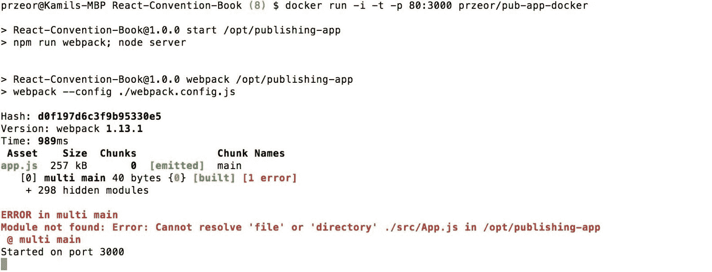

推送的存储库链接将类似于这个：

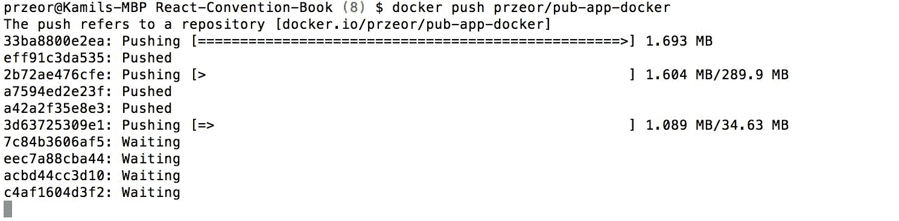

上述屏幕截图是从推送的 Docker 存储库中制作的。

# 有用的 Docker 命令摘要

以下是一些有用的 Docker 命令：

+   此命令将列出所有镜像，`docker rm`可以在您的本地机器上删除 repo，以防您想要删除它：

```jsx
 docker images

 docker rm CONTAINER-ID

```

+   您可以只使用`CONTAINER-ID`的前三个字符。您不需要写下整个容器 ID。这很方便。

+   这个命令用于停止正在运行的 Docker 容器：

```jsx
        docker ps

docker stop CONTAINER-ID

```

+   您可以使用以下方法的容器版本标签：

```jsx
        docker tag przeor/pub-app-docker:latest przeor/pub-app-  

        docker:0.1

docker images

```

+   在列出 Docker 镜像之后，您可能会注意到您有两个容器，一个带有标签`latest`，另一个带有`0.1`。这是一种跟踪更改的方式，因为如果您推送容器，标签也将在 Docker Hub 上列出。

+   检查您容器的本地 IP：

```jsx
        $ docker-machine env

```

+   从 Dockerfile 构建您的容器：

```jsx
        docker build -t przeor/pub-app-docker .

```

+   以“分离”模式运行您的容器：

```jsx
        $ docker run -d -p 80:80 przeor/pub-app-docker npm start

```

+   以调试模式运行容器，而不是分离它，以便您可以在容器的 Bash 终端中找到正在进行的操作：

```jsx
        docker run -i -t -p 80:80 przeor/pub-app-docker

```

# 在 AWS EC2 上介绍 Docker

两章前，我们为静态图像上传实现了 Amazon AWS S3。您应该已经有一个 AWS 账户，因此您准备好进行以下步骤，在 AWS 上创建我们的部署。

一般来说，您可以使用免费的 AWS 层次结构，但在本教程中我们将使用付费版本。在开始本节关于如何在 AWS 上部署 Docker 容器之前，请阅读 AWS EC2 定价。

AWS 还具有名为**EC2 容器服务**（**ECS**）的出色 Docker 容器支持。

如果您购买了这本书，那可能意味着您到目前为止还没有使用 AWS。因此，我们将首先手动在 EC2 上部署 Docker，以向您展示 EC2 实例的工作原理，以便您可以从本书中获得更多知识。

我们的主要目标是使我们的 Docker 容器的部署自动化，但现在我们将从手动方法开始。如果您已经使用过 EC2，可以跳过下一小节，直接进入 ECS。

# 手动方法 - EC2 上的 Docker

我们之前在本地运行了 Docker 容器，使用了以下命令（几页前）：

```jsx
$ docker run -d -p 80:80  przeor/pub-app-docker npm start

```

我们将做同样的事情，不是在本地而是在 EC2 实例上，现在 100%手动进行；稍后，我们将使用 AWS ECS 100%自动化。

在继续之前，让我们了解一下 EC2 是什么。它是位于亚马逊网络服务云中的可扩展计算能力。在 EC2 中，您无需预先投资购买任何硬件。您支付的一切都是使用 EC2 实例的时间。这使您能够更快地部署应用程序。非常快速地，您可以添加新的虚拟服务器（当有更大的网络流量需求时）。有一些机制可以使用**AWS CloudWatch**自动扩展 EC2 实例的数量。亚马逊 EC2 使您能够扩展或缩小以处理变化的需求（例如，流行度的飙升）--这个功能减少了您对流量的预测（并节省了您的时间和金钱）。

目前，我们将只使用一个 EC2 实例（在本书的后面，我们将看到更多带有负载均衡器和 ECS 的 EC2 实例）。


# 基础知识 - 启动 EC2 实例

我们将启动一个 EC2 实例，然后通过 SSH 登录到它（您可以在 Windows 操作系统上使用**Putty**）。

通过访问此链接登录到 AWS 控制台：[`eu-central-1.console.aws.amazon.com/console/home`](https://eu-central-1.console.aws.amazon.com/console/home) 。

点击 EC2 链接：[`eu-central-1.console.aws.amazon.com/ec2/v2/home`](https://eu-central-1.console.aws.amazon.com/ec2/v2/home)

然后点击蓝色的启动实例按钮：

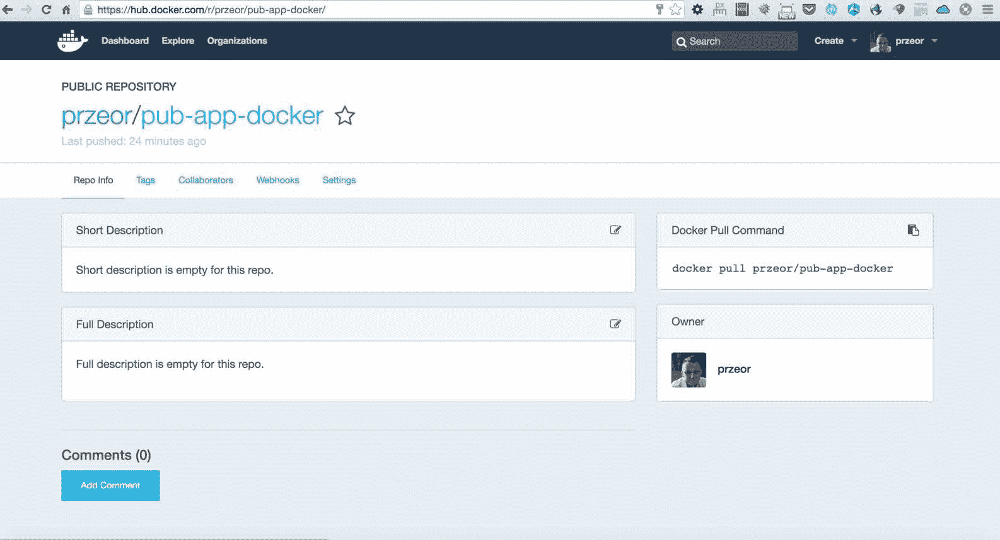

按钮看起来像这样：

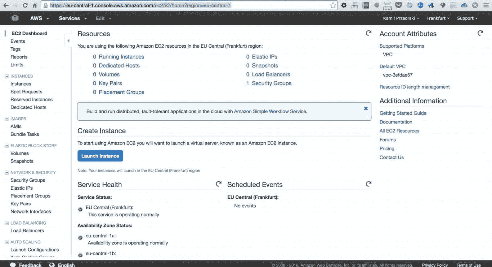

点击按钮后，您将被重定向到**Amazon Machine Image** (**AMI** )页面：

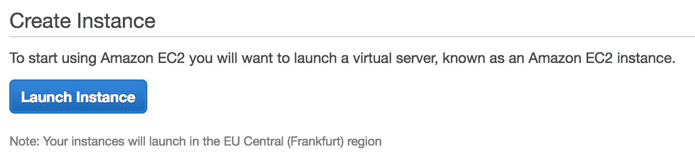

AMI 有一个可以运行 EC2 实例的镜像列表。每个镜像都有一个预安装软件列表。例如，最标准的镜像如下：

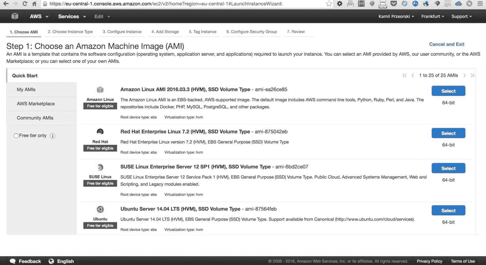

它有预安装的软件；例如，Amazon Linux AMI 是一个 EBS 支持的、由 AWS 支持的镜像。默认镜像包括 AWS 命令行工具、Python、Ruby、Perl 和 Java。存储库包括 Docker、PHP、MySQL、PostgreSQL 和其他软件包。

在同一页上，您还可以在市场上购买其他 AMI，或者由社区创建和共享的免费 AMI。您还可以过滤图像，以便只列出免费层：

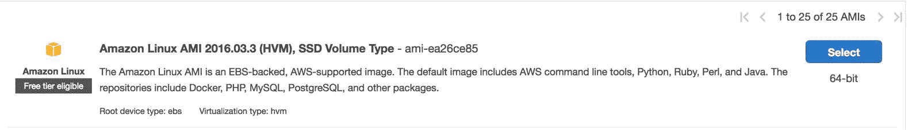

为了使这个分步指南简单，让我们选择前面屏幕截图中的镜像；它的名称将类似于`Amazon Linux AMI 2016.03.3 (HVM), SSD Volume Type`。

图像的名称可能会略有不同；不用担心。

点击蓝色的“选择”按钮。然后您将被转到“步骤 2：选择实例类型”页面，如下面的屏幕截图所示：

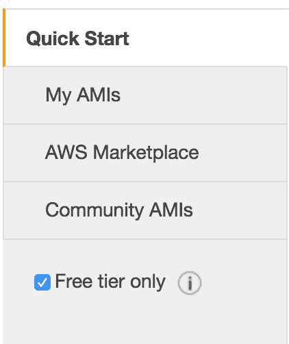

从这个页面，选择以下内容：

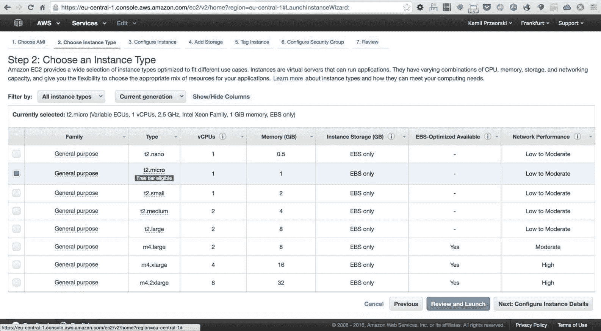

然后，点击这个按钮：

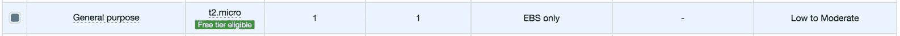

最简单的方法是选择默认选项：

1.  审查。

1.  配置安全组（我们将在此选项卡中进行一些更改）。

1.  标记实例（保持默认选项）。

1.  添加存储（保持默认选项）。

1.  配置实例（保持默认选项）。

1.  选择实例类型。

1.  选择一个 AMI。

1.  通常情况下，一直点击下一步按钮，直到我们到达“配置安全组”。

您可以在顶部找到的进度指示器是这样的：


我们目前的目标是进入安全配置页面，因为我们需要稍微定制允许的端口。安全组由控制 EC2 实例的网络流量的规则组成（也称为防火墙选项）。出于安全考虑，将名称设置为`ssh-and-http-security-group`：


正如您在这里找到的那样，您还需要点击“添加规则”按钮，并添加一个名为 HTTP 的新规则。这将允许我们的新 EC2 实例通过端口 80 对所有 IP 可用。

在您添加了名称和 HTTP 端口 80 作为新规则后，您可以点击“审查和启动”按钮：

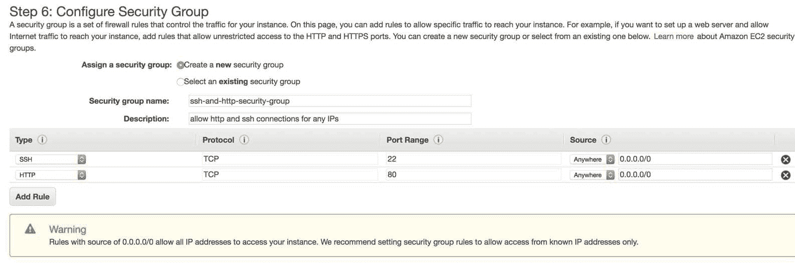

然后，在您满意地审查实例后，在该视图中点击名为“Launch”的蓝色按钮：


点击“启动”按钮后，您将看到一个模态框，上面写着“选择现有密钥对或创建新的密钥对”：

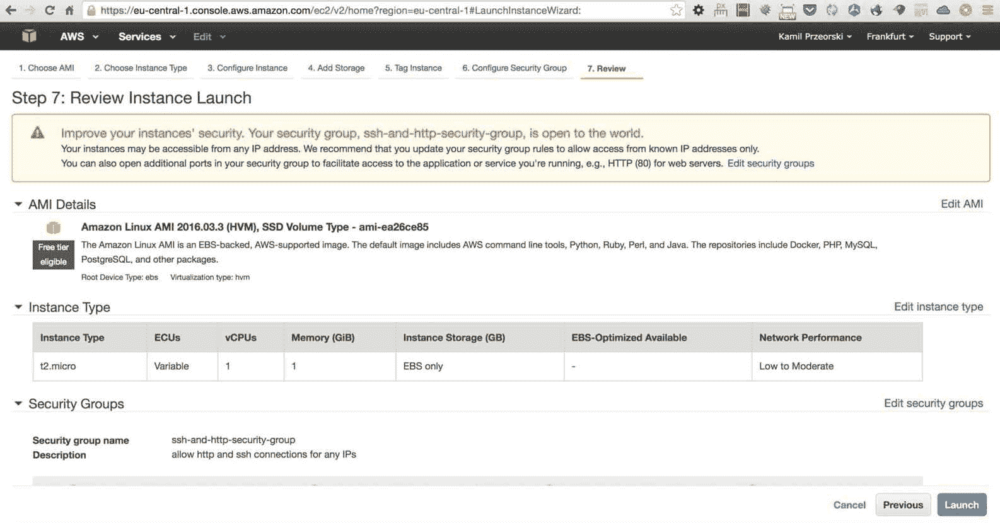

通常，您需要创建一个新的密钥对。给它命名为`pubapp-ec2-key-pair`，然后点击下载按钮，如下面的屏幕截图所示：

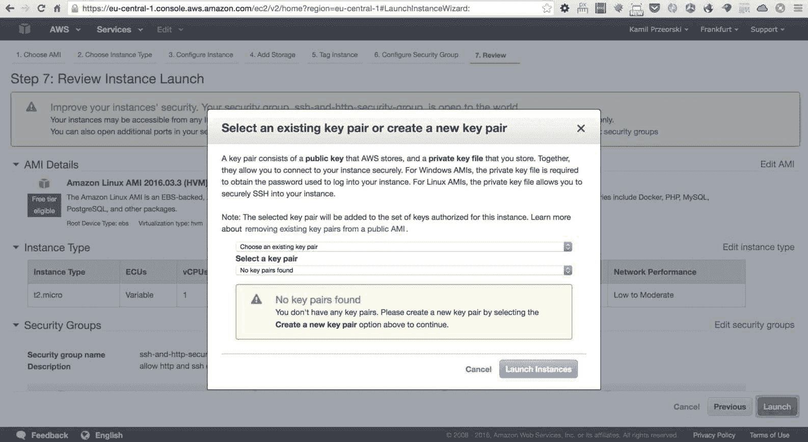

在您下载了`pubapp-ec2-key-pai`之后，您将能够点击蓝色的“启动”按钮。接下来，您将看到以下内容：

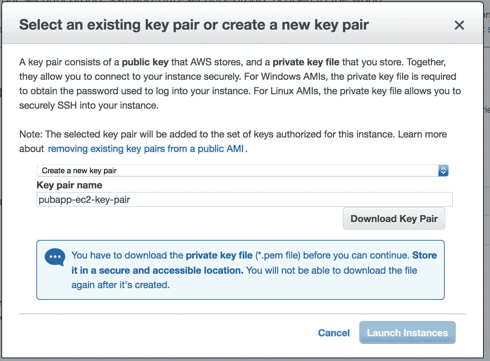

从这个屏幕，您可以直接转到 EC2 启动日志（点击“查看启动日志”链接），这样您就能够找到您的实例列在其中，如下面的屏幕截图所示：

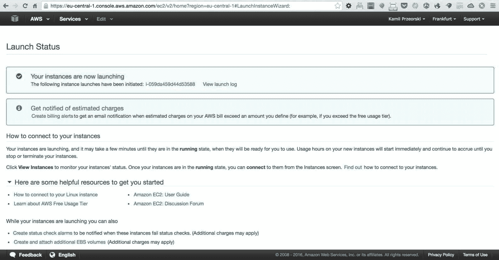

太好了。你的第一个 EC2 已经成功启动！我们需要登录并从那里设置 Docker 容器。

保存你的 EC2 实例的公共 IP。在前面的启动日志中，你可以找到我们刚刚创建的机器的公共 IP 为 52.29.107.244。

你的 IP 会不同（当然，这只是一个例子）。把它保存在某个地方；我们一会儿会用到它，因为你需要用它通过 SSH 登录到服务器并安装 Docker 应用程序。

# PuTTy 通过 SSH 访问-仅限 Windows 用户

如果你不在 Windows 上工作，你可以跳过这一小节。

我们将使用 PuTTy，可以在[`www.chiark.greenend.org.uk/~sgtatham/putty/download.html`](http://www.chiark.greenend.org.uk/~sgtatham/putty/download.html)下载（`putty.exe`，`pageant.exe`和`puttygen.exe`）。

下载 EC2 实例的密钥对，并使用`puttygen.exe`将它们转换为`ppk`：

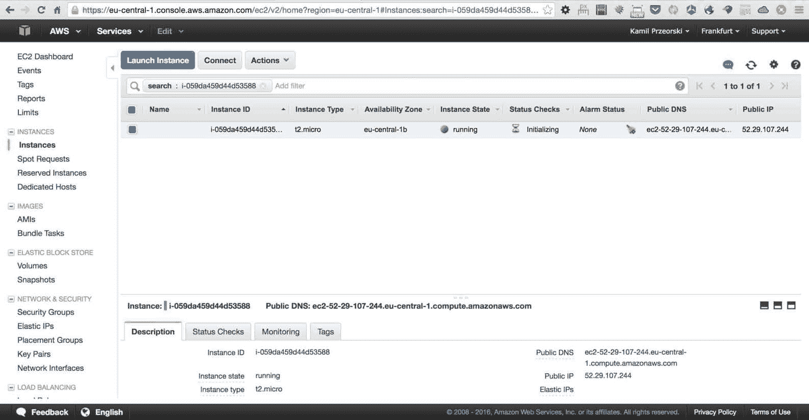

点击“加载”按钮并选择`pubapp-ec2-key-pair.pem`文件，然后将其转换为`ppk`。

然后你需要点击“保存私钥”按钮。你完成了；你可以关闭`puttygen.exe`并打开`pageant.exe`。从中，做以下操作：

+   选择添加密钥

+   然后检查你的密钥是否已正确添加到 Pageant 密钥列表

如果你的私钥在列表中，你就可以使用`putty.exe`了。

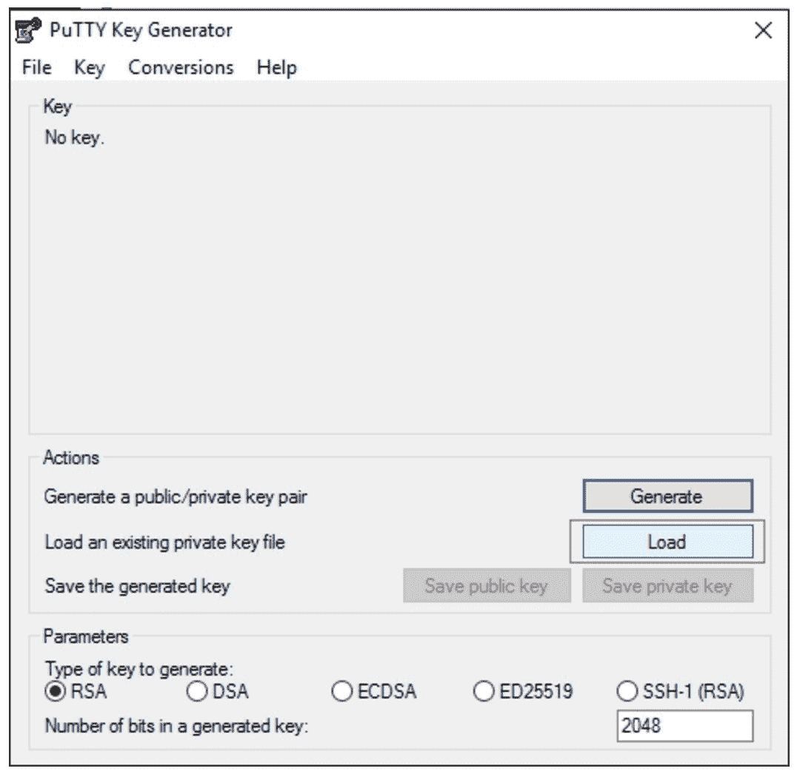

如果你已经打开了 PuTTy 程序，你需要通过输入你的 EC2 实例 IP 并点击“打开”按钮来通过 SSH 登录，就像前面的截图所示。PuTTy 允许在 Windows 上使用 SSH 连接。

# 通过 SSH 连接到 EC2 实例

在之前的一章中，我们启动了 EC2 实例后，发现了我们的公共 IP（记住你的公共 IP 会不同）：`52.29.107.244`。我们需要使用这个公共 IP 连接到远程 EC2 实例。

我已经把`pubapp-ec2-key-pair.pem`保存在我的`Downloads`目录中，所以去到你下载`.pem`文件的目录：

```jsx
$ cd ~/Downloads/

$ chmod 400 pubapp-ec2-key-pair.pem

$ ssh -i pubapp-ec2-key-pair.pem ec2-user@52.29.107.244

```

在 Windows 上的 PuTTy 中，经过这一步后会看起来类似。你需要在 PuTTy 框中提供 IP 和端口，以便正确登录到机器。当你得到一个提示输入用户名时，使用`ec2-user`，就像 SSH 示例中一样。

成功登录后，你将能够看到这个：

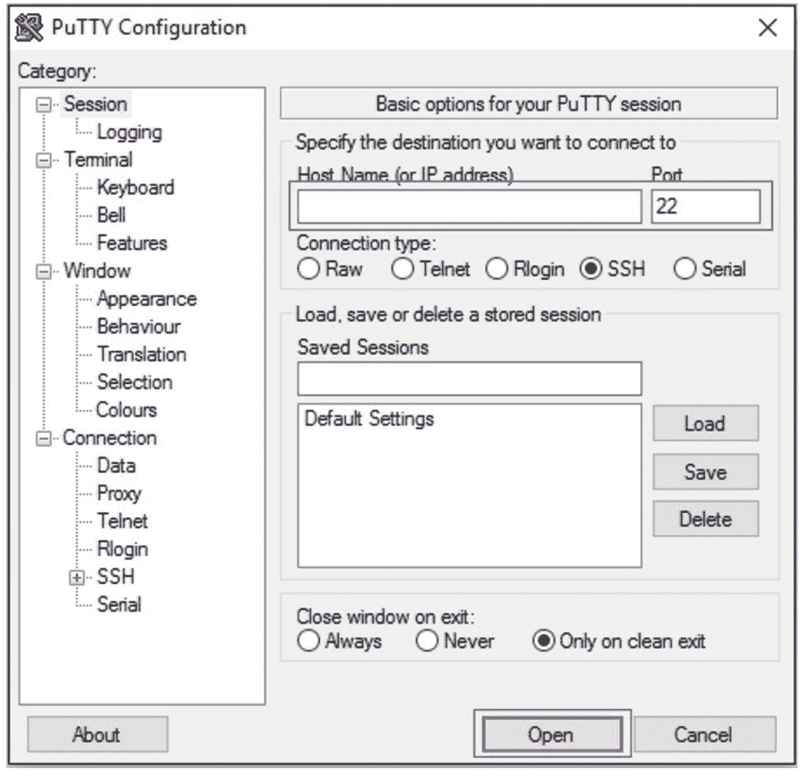

以下说明适用于所有操作系统用户（OS X，Linux 和 Windows），因为我们通过 SSH 登录到 EC2 实例。接下来需要执行以下命令：

```jsx
[ec2-user@ip-172-31-26-81 ~]$ sudo yum update -y

[ec2-user@ip-172-31-26-81 ~]$ sudo yum install -y docker

[ec2-user@ip-172-31-26-81 ~]$ sudo service docker start

```

这些命令将更新`yum`软件包管理器，并在后台安装和启动 Docker 服务：

```jsx
[ec2-user@ip-172-31-26-81 ~]$ sudo usermod -a -G docker ec2-user

[ec2-user@ip-172-31-26-81 ~]$ exit

> ssh -i pubapp-ec2-key-pair.pem ec2-user@52.29.107.244

[ec2-user@ip-172-31-26-81 ~]$ docker info

```

运行`docker info`命令后，它将显示类似以下输出：

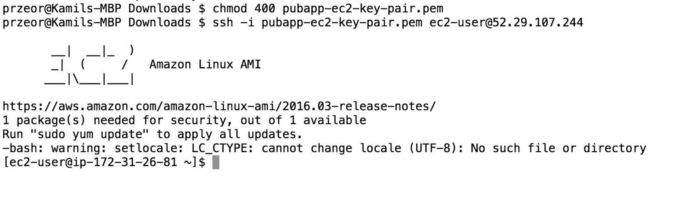

如果您查看前面的截图，您会看到一切都很好，我们可以继续使用以下命令运行发布应用程序的 Docker 容器：

```jsx
    [ec2-user@ip-172-31-26-81 ~]$ docker run -d PORT=80 -e AWS_ACCESS_KEY_ID='AKIMOCKED5JM4VUHA' -e AWS_SECRET_ACCESS_KEY='k3JxMOCKED0oRI5w3ZEmENE1I0l' -e AWS_BUCKET_NAME='publishing-app' -e AWS_REGION_NAME='eu-central-1' -e MONGO_USER='usermlab' -e MONGO_PASS='MOCKEDpassword' -e MONGO_PORT=25732 -e MONGO_ENV='publishingapp' -e MONGO_HOSTNAME='ds025761.mlab.com' -p 80:80 przeor/pub-app-docker npm start

```

确保您已提供正确的`AWS_REGION_NAME`。我的是`eu-central-1`，但您的可能不同。

如您所见，`server/.env`文件中的所有内容都已移至 Bash 终端中的`docker run`命令中：

```jsx
AWS_ACCESS_KEY_ID=<<___AWS_ACCESS_KEY_ID__>>

AWS_SECRET_ACCESS_KEY=<<___AWS_SECRET_ACCESS_KEY__>>

AWS_BUCKET_NAME=publishing-app

AWS_REGION_NAME=eu-central-1

MONGO_USER=<<___your_mlab_mongo_user__>>

MONGO_PASS=<<___your_mlab_mongo_pass__>>

MONGO_PORT=<<___your_mlab_mongo_port__>>

MONGO_ENV=publishingapp

MONGO_HOSTNAME=<<___your_mlab_mongo_hostname__>>

PORT=80

```

还要确保重命名`AWS_BUCKET_NAME`，`AWS_REGION_NAME`或`MONGO_ENV`（如果您设置的不同于前几章建议的）。

然后，为了检查一切是否顺利，您还可以使用以下方法：

```jsx
[ec2-user@ip-172-31-26-81 ~]$ docker ps

```

这个命令将向您显示 Docker 进程是否作为一个分离的容器在后台正确运行。在 10-30 秒后，当`npm start`运行整个项目时，您可以使用以下命令进行测试：

```jsx
[ec2-user@ip-172-31-26-81 ~]$ curl http://localhost

```

应用程序正确引导后，您可以看到类似以下的输出：

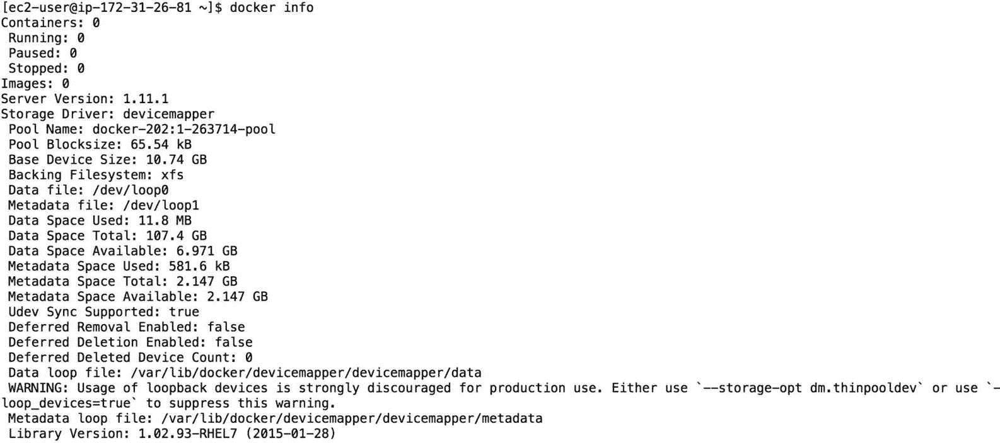

访问 EC2 实例的公共 IP（在我们的示例中，它是`52.29.107.244`）后，您将能够在线找到我们的发布应用程序，因为我们已经将 EC2 实例的安全组设置为向世界公开端口`80`。以下是截图：

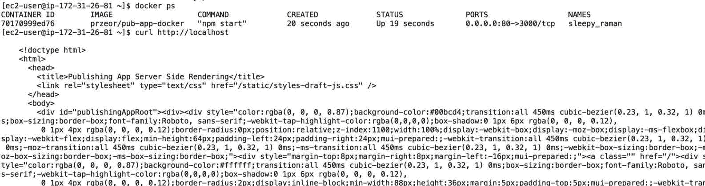

如果您在公共 IP 下看到我们的发布应用程序，那么您刚刚成功在 Amazon AWS EC2 上部署了一个 Docker 容器！

我们刚刚经历的过程非常低效和手动，但确切地显示了在我们开始使用 ECS 时底层发生了什么。

我们当前的方法中缺少以下内容：

+   与其他亚马逊服务集成，如负载平衡、监控、警报、崩溃恢复和路由 53。

+   自动化，因为目前我们无法快速有效地部署 10 个 Docker 容器。如果您想为不同的服务部署不同的 Docker 容器，这也很重要，例如，您可以为前端、后端甚至数据库（在我们的情况下，我们使用 mLab，所以这里不需要）设置单独的容器。

您刚刚学会了亚马逊网络服务的基础知识。

# ECS 的基础知识 - AWS EC2

EC2 容器服务帮助您创建一组 Docker 容器实例（在多个 EC2 实例上有多个相同容器的副本）。每个容器都会自动部署--这意味着您无需像我们在上一章中那样登录任何 EC2 实例进行 SSH（手动方法）。整个工作由 AWS 和 Docker 软件完成，您将在未来学习如何使用它们（更自动化的方法）。

例如，您设置了要有五个不同的 EC2 实例--在端口 80 上公开的 EC2 实例组，这样您就可以在`http://[[EC2_PUBLIC_IP]]`地址下找到发布应用程序。另外，我们在所有 EC2 实例和世界其他地方之间添加了负载均衡器，这样一旦流量激增或任何 EC2 实例出现故障，负载均衡器就会用新的实例替换故障的 EC2 实例，或者根据流量来缩放 EC2 实例的数量。

AWS 负载均衡器的一个很好的特性是，它会使用端口 80 对每个 EC2 实例进行 ping 测试，如果被 ping 的实例没有以正确的代码（200）做出响应，那么它将终止故障实例并启动一个带有我们发布应用程序镜像的 Docker 容器的全新实例。这有助于我们保持应用程序的持续可用性。

另外，我们将使用 Amazon Route 53 来实现高可用性和可扩展的云**域名系统**（**DNS**）网络服务，这样我们就能够设置顶级域名；在我们的案例中，我将使用专门为这本书购买的域名：`http://reactjs.space`。

当然，这将是我们的 HTTP 地址。如果您构建不同的服务，您需要购买自己的域名，以便按照说明学习 Amazon Route 53 的工作原理。

# 与 ECS 一起工作

在我们开始使用 ECS 之前，让我们先了解一些基本的术语：

+   **集群**：这是我们流程的主要部分，它将汇集底层资源，如 EC2 实例和任何附加存储。它将许多 EC2 实例集成为一个容器化应用程序，旨在实现可扩展性。

+   **任务定义**：此任务确定您要在每个 EC2 实例上运行哪些 Docker 容器（即`docker run`命令），并且还可以帮助您定义更高级的选项，例如您想要传递到容器中的环境变量。

+   **服务**：这是集群和任务定义之间的一种粘合剂。服务处理在我们的集群上运行任务的登录。这还包含您想要运行的任务的修订的管理（容器和其设置的组合）。每次更改任务中的任何设置时，它都会创建任务的新修订版。在服务中，您指定要在 ECS 的 EC2 实例上运行的任务及其修订版。

访问 AWS 控制台并找到 ECS。单击链接转到 EC2 容器服务控制台。在那里，您会找到一个名为“开始”的蓝色按钮：

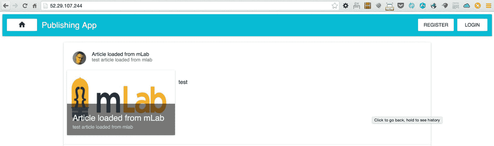

之后，您将看到一个带有以下步骤的 ECS 向导：

1.  创建任务定义。

1.  配置服务。

1.  配置集群。

1.  审查。

# 步骤 1 - 创建任务定义

在 ECS 中，任务定义是容器的配方。它是帮助 ECS 了解您想要在 EC2 实例上运行的 Docker 容器的东西。它是 ECS 自动完成的一系列步骤的配方或蓝图，以成功部署我们的发布应用程序容器。

此步骤的详细信息如下截图所示：

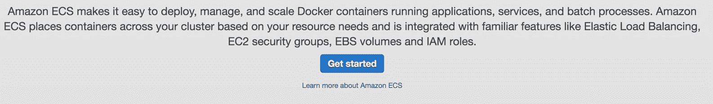

在上述截图中，您可以找到我们的任务定义名称为`pubapp-task`。容器名称为`pubapp-container`。

对于 Image，我们使用与在本地运行`docker run`时相同的参数。在`przeor/pub-app-docker`的情况下，ECS 将知道它必须从[`hub.docker.com/r/przeor/pub-app-docker/`](https://hub.docker.com/r/przeor/pub-app-docker/)下载容器。

目前，让我们将最大内存保持在默认值（`300`）上。将两个端口映射设置为`80`。

在撰写本书时，如果您的容器不公开端口`80`，可能会出现一些问题。这可能是 ECS 向导的一个错误；没有向导，容器上可以使用任何端口。

在任务定义视图中点击高级选项：

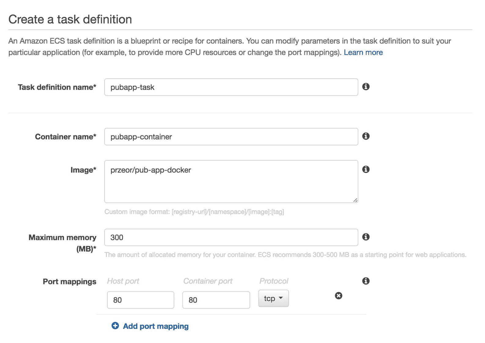

您将看到一个带有附加选项的滑动面板。


我们需要指定以下内容：

+   **命令**：这必须用逗号分隔，所以我们使用`npm,start`。

+   **工作目录**：我们使用`/opt/publishing-app`（Dockerfile 中设置了相同的路径）。

+   环境变量：在这里，我们指定了`server/.env`文件中的所有值。这部分设置非常重要；如果没有通过环境变量提供正确的细节，应用程序将无法正常工作。

+   **其余的值/输入**：保持默认值，不要更改。

添加所有环境变量非常重要。我们需要非常小心，因为很容易在这里犯错，这将导致 EC2 实例内的应用程序崩溃。

在所有这些更改之后，您可以单击“下一步”按钮。

# 第 2 步-配置服务

通常，服务是一种机制，它在同时检查它们的健康状况的同时保持一定数量的 EC2 实例运行（使用**弹性负载均衡**（**ELB**））。ELB 会自动将传入的应用程序流量分布到多个 Amazon EC2 实例上。如果服务器在端口 80 上没有响应（默认值，但可以更改为更高级的健康检查），那么服务将在不健康的实例被关闭时运行一个新的服务。这有助于您为应用程序保持非常高的可用性。

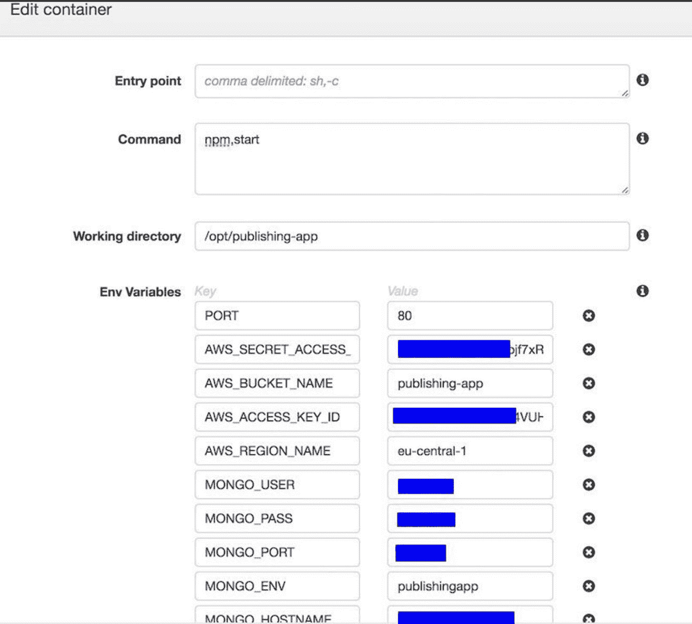

服务名称是`pubapp-service`。在本书中，我们将设置三个不同的 EC2 实例（您可以设置更少或更多；这取决于您），因此这是*所需任务数量*输入的数字。

在同一步骤中，我们还必须设置**弹性负载均衡器**（**ELB**）：

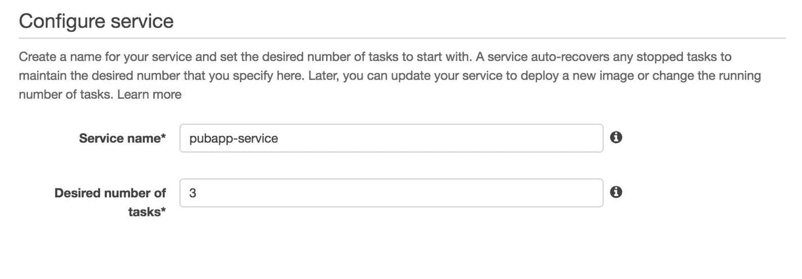

+   容器名称：主机端口：从下拉列表中选择`pubapp-container:80`

+   ELB 监听协议*：HTTP

+   ELB 监听端口*：`80`

+   ELB 健康检查：保持默认值；您可以在向导之外更改它（在特定 ELB 页面上）。

+   服务 IAM 角色：向导将为我们创建这个

在所有这些之后，您可以单击“下一步”按钮继续：

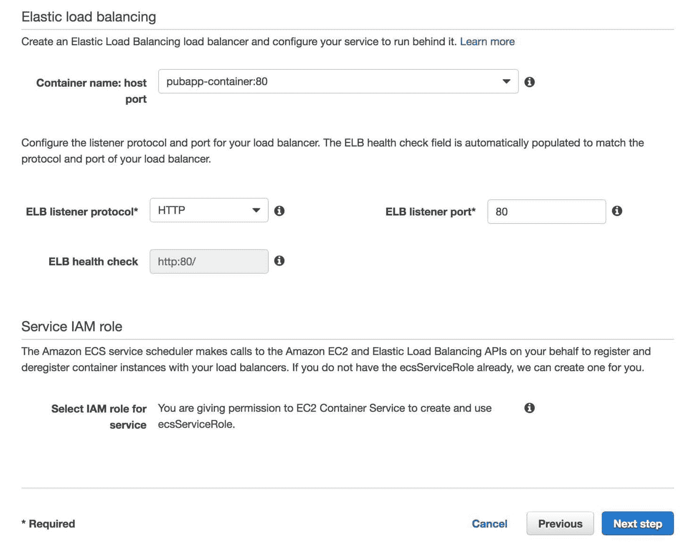

# 第 3 步-配置集群

现在，您将设置 ECS 容器代理的详细信息，称为集群。在这里，您指定了您的集群名称，您想要使用的实例类型，实例数量（必须大于服务所需的数量），以及密钥对。


+   集群名称：我们的集群名称是`pubapp-ecs-cluster`。

+   EC2 实例类型：`t2.micro`（在生产中，使用更大的实例）。

+   实例数量：五个，这意味着服务将保持三个实例处于运行状态，另外两个实例将处于待命状态，等待任何严重情况。我所说的待命是指在某个时刻（根据我们的设置），我们只会使用三个实例，而另外两个实例已准备好使用，但并未被主动使用（流量不会重定向到它们）。

+   密钥对：在本章前面我指定了名为`pubapp-ec2-key-pair`的密钥对。始终将它们放在安全的地方以备将来使用。

在同一页上，您还将找到安全组和容器实例 IAM 角色设置，但我们现在将保持默认设置：

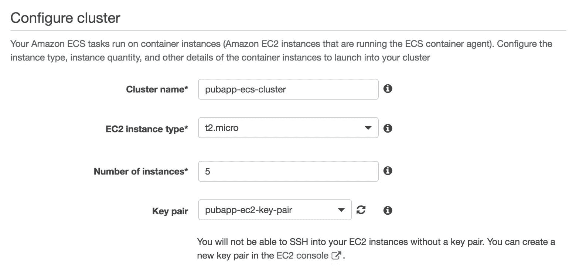

# 第 4 步 - 复习

最后一件事是检查一切是否正常：

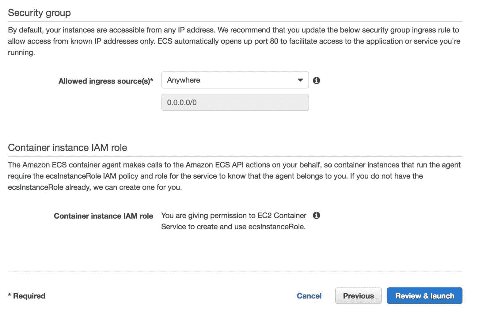

然后，选择“启动实例和运行服务”：

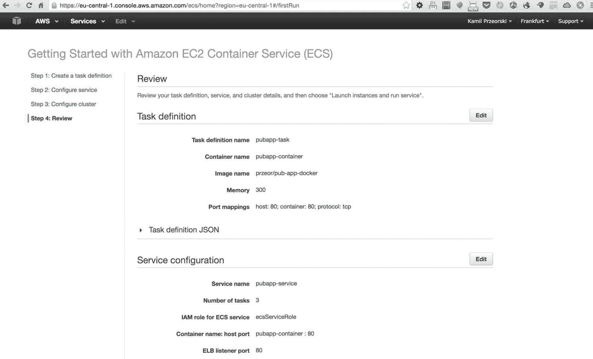

# 启动状态

点击“启动”按钮后，您将找到一个带有状态的页面。保持打开，直到所有框都变成绿色并显示成功指示器：


这是所有运行的样子：

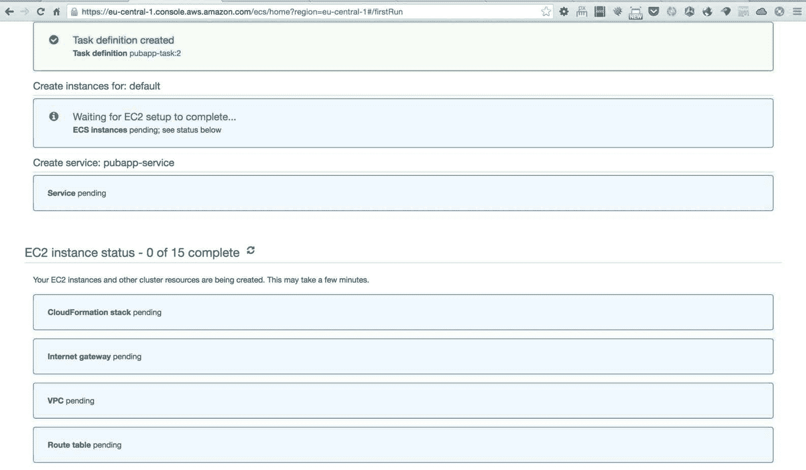

当所有框都有成功指示器后，您将能够点击顶部的“查看服务”按钮：

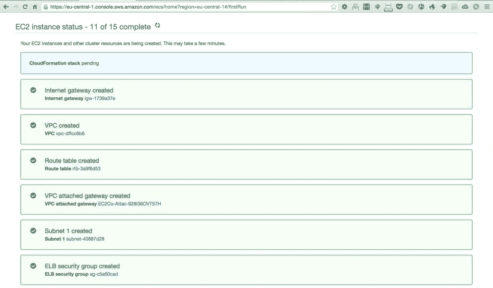

在按钮可用后，点击该按钮（查看服务）。

# 查找负载均衡器地址

点击“查看服务”按钮后，您将看到主要仪表板，其中列出了所有您的集群（目前只会有一个）：

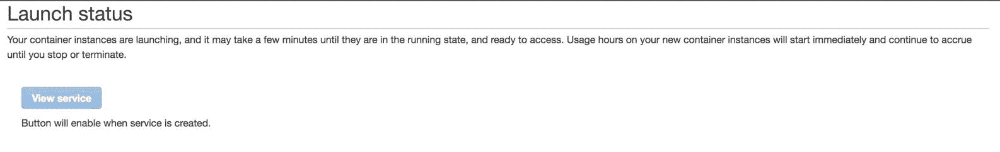

点击 pubapp-ecs-cluster，您将看到以下内容：

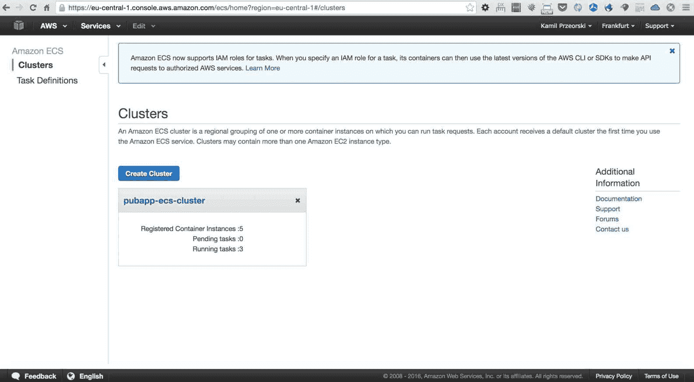

在上一个屏幕上，从列表中选择 pubapp-service：

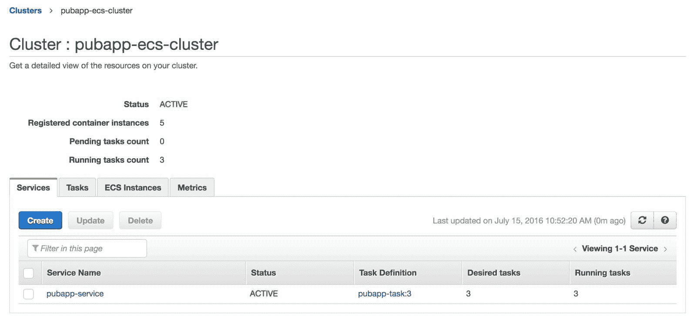

然后，您将看到以下内容：

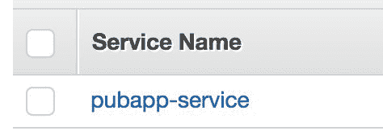

从这个页面，选择弹性负载均衡器：

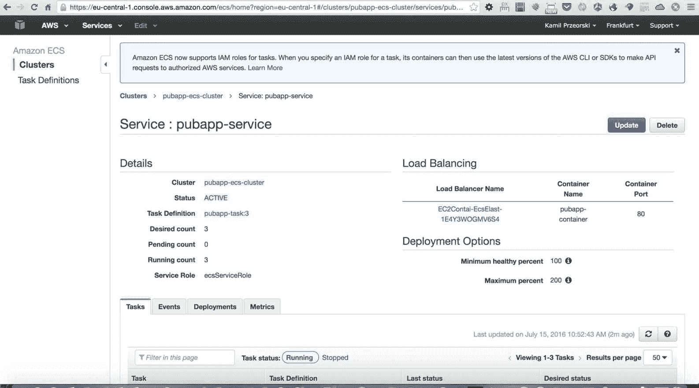

ELB 的最终视图如下：

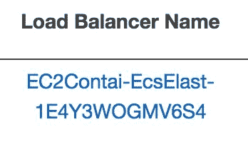

在上一个视图中，您将找到（在描述名称选项卡下）一个弹性负载均衡器地址，就像这样：

```jsx
    DNS name: 

EC2Contai-EcsElast-1E4Y3WOGMV6S4-39378274.eu-central-

    1.elb.amazonaws.com (A Record)

```

如果尝试打开地址失败，请给它更多时间。EC2 实例可能正在运行我们的 Docker 发布应用容器方面取得进展。在我们的 ECS 集群初始运行期间，我们必须要有耐心。

这是您的 ELB 地址，您可以将其放入浏览器中查看发布的应用程序：

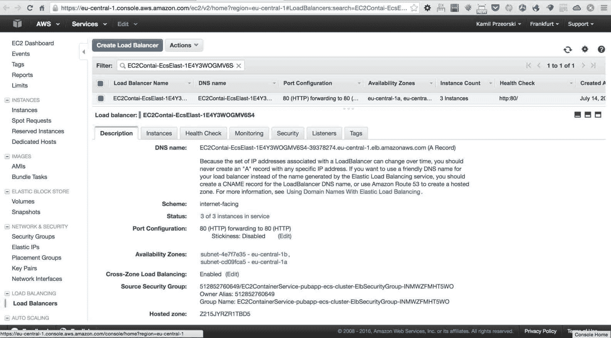

# AWS Route 53

本章中剩下的最后一步是设置 Route 53，这是一个高可用性和可扩展的云 DNS 网络服务。

对于这一步，您有两个选项：

+   已注册您自己的域名

+   通过 Route 53 注册新域名

在接下来的步骤中，我们将使用第一个选项，因此我们假设我们已经注册了`reactjs.space`域名（当然，您需要拥有自己的域名才能成功按照这些步骤进行）。

我们将通过将名称`http://reactjs.space`翻译成我们 ELB 的地址（`EC2Contai-EcsElast-1E4Y3WOGMV6S4-39378274.eu-central-1.elb.amazonaws.com`）来将最终用户路由到发布应用，这样用户将能够通过在浏览器地址栏中输入`reactjs.space`以更加用户友好的方式访问我们的应用。

从 AWS 服务列表中选择 Route 53：

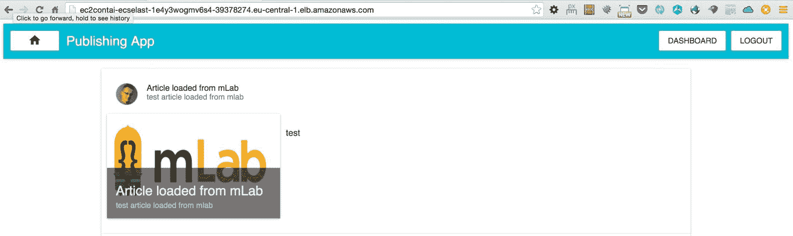

您将能够看到一个类似以下的主页：

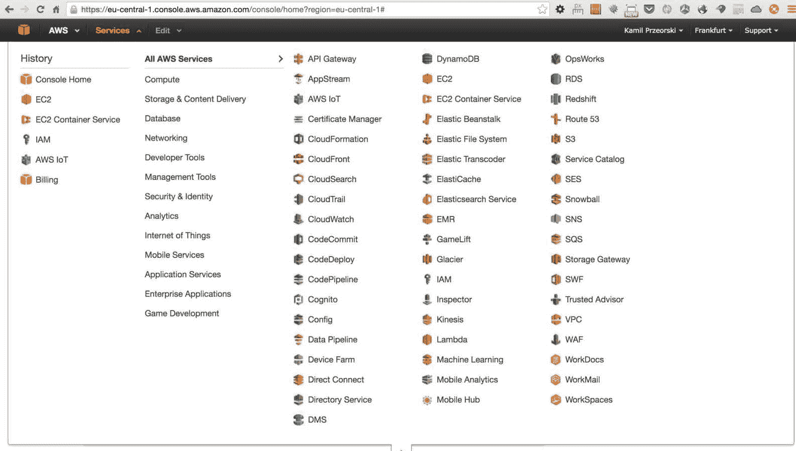

下一步是在 Route 53 上创建一个托管区，因此点击名为 Create Hosted Zone 的蓝色按钮：

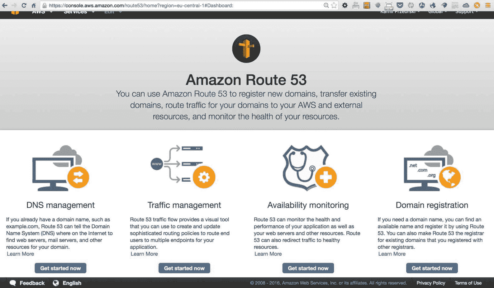

之后，您将不会看到任何托管区，因此再次点击蓝色按钮：

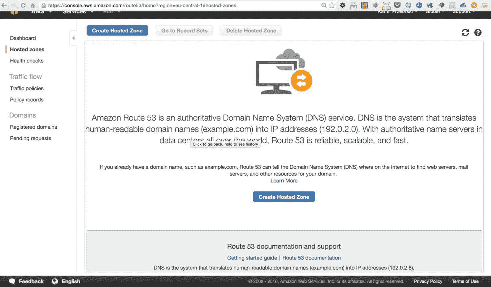

表格将有一个域名字段，在那里您输入您的域名（在我们的情况下，是`reactjs.space`）：

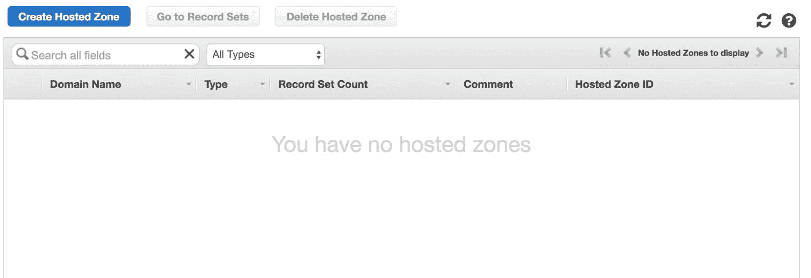

成功！现在您将能够看到您的 DNS 名称：

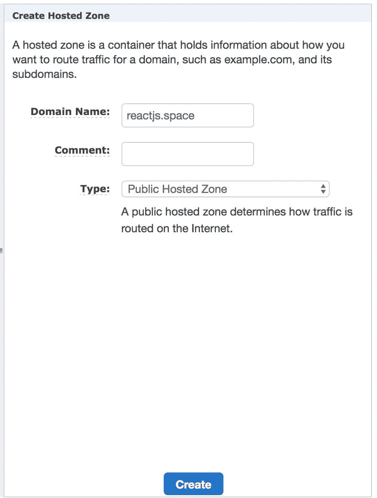

下一步是将 DNS 停放在您的域名提供商那里。最后一步是在您的域名注册商那里更改 DNS 设置；在我的情况下，它们如下（您的将会不同）：

```jsx
ns-1276.awsdns-31.org.

ns-1775.awsdns-29.co.uk.

ns-763.awsdns-31.net.

ns-323.awsdns-40.com.

```

注意末尾的`.`（点）；您可以摆脱它们，因此我们必须更改的最终 DNS 如下：

```jsx
ns-1276.awsdns-31.org

ns-1775.awsdns-29.co.uk

ns-763.awsdns-31.net

ns-323.awsdns-40.com

```

经过所有这些步骤，您可以访问`http://reactjs.space`网站（DNS 更改可能需要最多 48 小时）。

最后一件事是创建指向我们弹性负载均衡器的`reactjs.space`域名的别名。点击以下按钮：

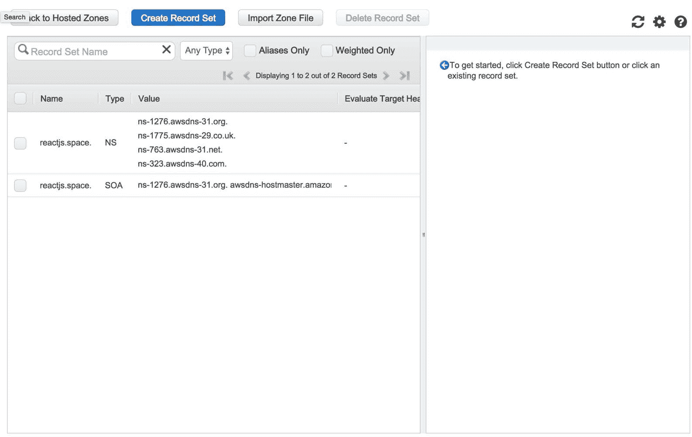

然后，您将看到以下视图：


从别名的单选按钮中选择 Yes，然后从列表中选择 ELB，如下例所示：

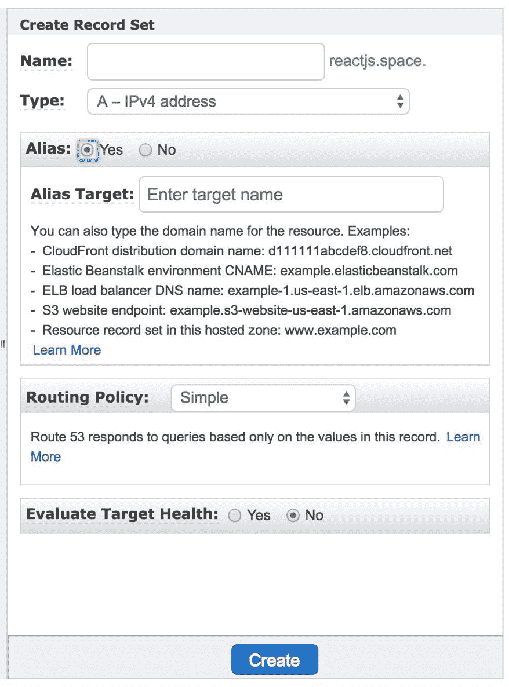

在 DNS 更改完成后（可能需要最多 48 小时），一切都将正常工作。为了改善我们应用的体验，让我们也将`www.reactjs.space`的别名指向`reactjs.space`，这样如果有人在域名前输入`www.`，它将按预期工作。

再次点击名为 Create Record Set 的按钮，选择一个别名，并输入`www`，之后您将能够选择`www.reactjs.space`域名。这样做并点击 Create 按钮：

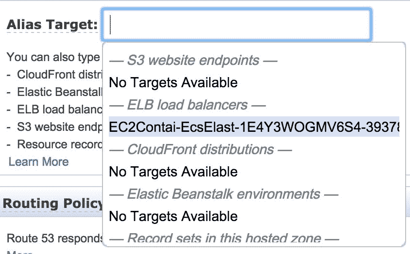

# 总结

我们已经完成了所有的 AWS/Docker 设置。成功更改 DNS 后，您将能够在`http://reactjs.space`地址下找到我们的应用程序：

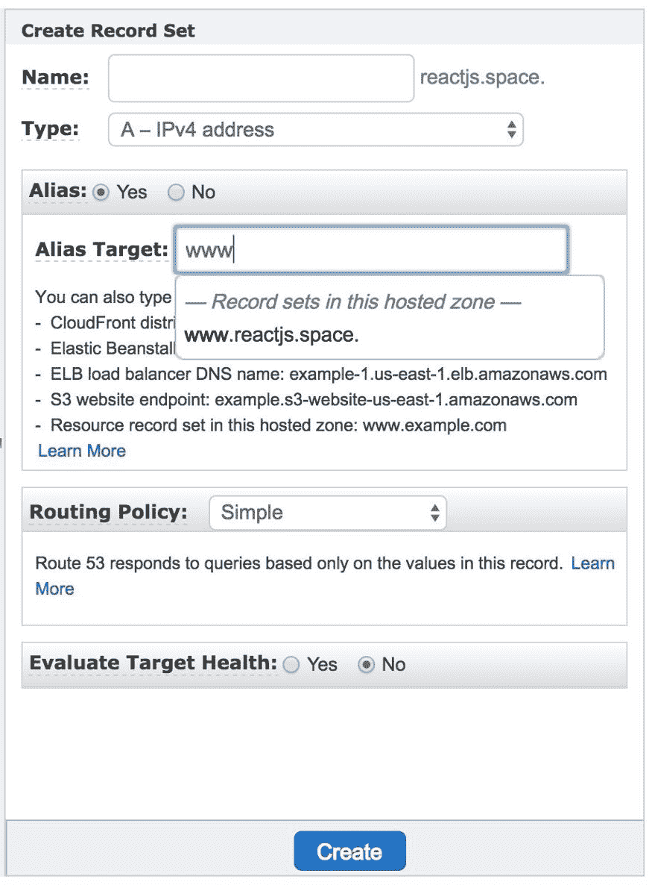

下一章将讨论持续集成的基础知识，并帮助您在应用程序完全生产就绪之前完成剩下的事情（目前还缺少文件压缩）。

让我们在下一章中继续，更详细地描述本书中将涵盖的剩余主题。
