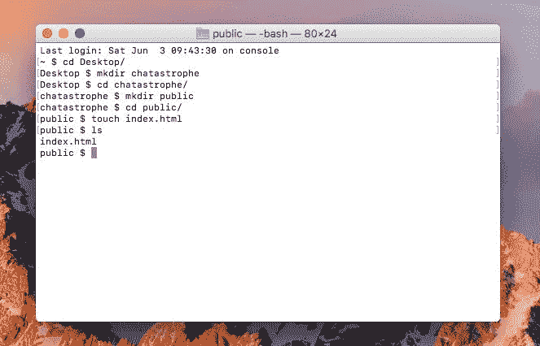
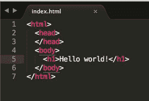
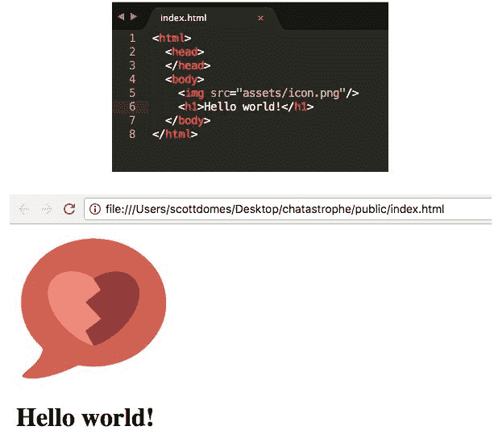
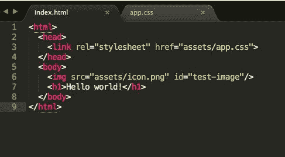
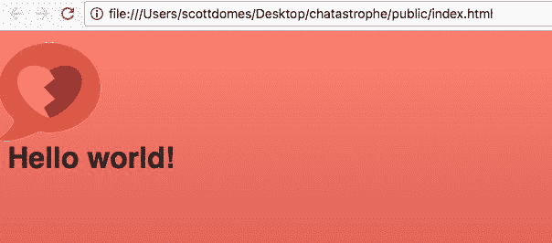
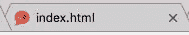
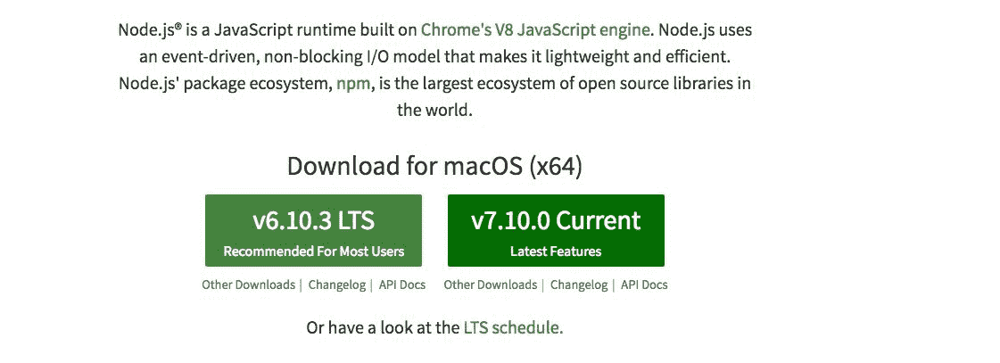
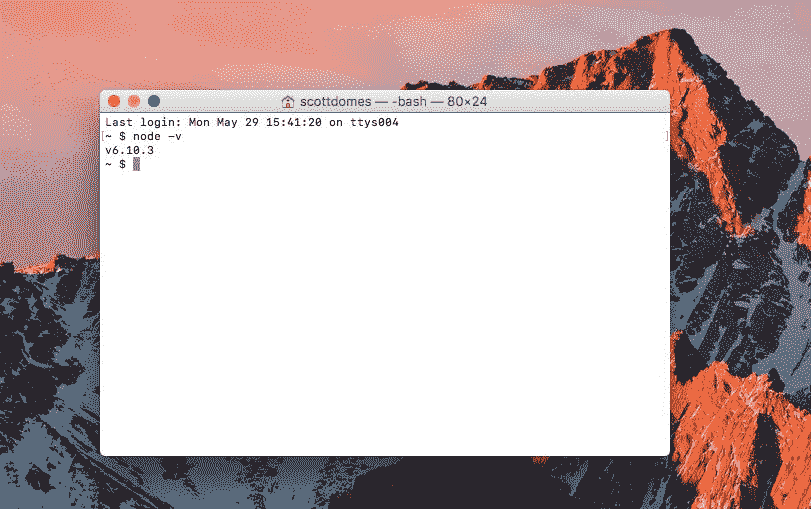
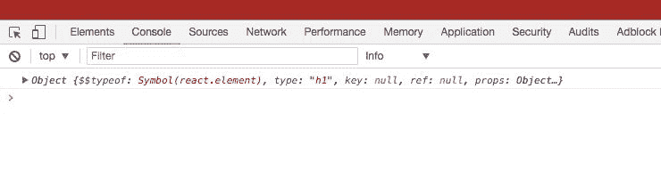

# 第一章：创建我们的应用结构

欢迎来到*使用 React 构建渐进式 Web 应用*！

本书将带您完成构建一个 React 应用程序，同时也作为渐进式 Web 应用程序的整个过程。我们将涵盖构建此类应用程序的“如何”，还将强调最佳实践以及如何衡量您的应用程序，以确保成功实施 PWA 功能。

渐进式 Web 应用程序有望成为 Web 应用程序的未来。它们承诺提供一系列额外功能，如推送通知和可安装性，将它们推向原生 iOS 或 Android 应用程序的领域。此外，对性能的强调（利用尖端的 Web 技术）意味着 PWAs 创建的应用程序对所有人都很快。

我们将深入讨论 PWAs 的每个方面，以及将常规 Web 应用程序转换为渐进式应用程序的过程。我们还将深入研究 React 最佳实践，使用诸如 React Router 之类的库。

要检查本章和未来章节的代码，您可以在[`github.com/scottdomes/chatastrophe/`](https://github.com/scottdomes/chatastrophe/)上查看已完成的项目。该存储库包括每个章节的分支。访问[`github.com/scottdomes/chatastrophe/tree/chapter1`](https://github.com/scottdomes/chatastrophe/tree/chapter1)查看本章的最终代码。

在这一章中，我们将开始应用的基本结构。以下是我们将涵盖的内容：

+   渐进式 Web 应用的用例

+   我们希望我们的应用程序实现的基本用户故事

+   项目结构和基本 HTML

+   安装依赖

+   开始使用 React

首先，让我们为我们应用的旅程设定场景。

# 设定场景

你的一个朋友打电话给你，兴奋地谈论他最新的创业想法（你知道的那个）。你耐心地听他的描述，但尊敬地拒绝成为其中的一部分。他很失望，但理解并承诺会随时向你更新项目的详情。你咕哝着表示同意。

几个月后，他在你的工作地点见到你，并宣布他找到了一群认真的投资者，他需要你帮助他建立他向他们承诺的软件。你再次拒绝，但在讨论报酬时，他提到了一个你无法拒绝的数字。一周后，你坐飞机去了旧金山。

在投资者面前（令你惊讶的是，他们是一个全神贯注的观众），你的朋友向你介绍了应用程序的基础知识。在充斥着流行语（“大规模互联”和“全球社区”）之间，你收集到了足够的信息，可以用一句话总结这个应用程序。

“所以，这是一个聊天室…为世界上的每个人…一次…”

你的朋友微笑着说：“是的。”

你被一百万陌生人同时在同一个应用程序中交谈的画面所困惑，但投资者们却掌声雷动。当你走向门口时，你的朋友再次宣布他们想要补偿你…提到了比之前更高的数字。你坐下来。

# 问题

“问题是，”你的朋友解释道，“这个聊天室必须是为每个人而设的。”

“全球社区，”你带着一个知情的点头说道。

“确切地说。每个人。即使他们在沙漠中的小屋里有糟糕的互联网。他们也应该被包括在内。”

“大规模互联”，你补充道。

“确切地说！所以它需要快速。轻巧。美观。动态。”

“所以每个人都会同时交谈？那不会是-”

“一个全球性的集体，是的。”

# 另一个问题

“另一个问题，”你的朋友宣布道，“是我们的用户大多会使用手机。在路上。”

“所以你想做一个 iOS 和 Android 应用？”

你的朋友挥了挥手。“不，不。没人再下载应用了。尤其是在发展中国家；那需要太多带宽。记住，全球性的集体。”

“所以是一个网页应用。”

“是的。一个网页集体。”

尽管你的直觉告诉你，这个项目很有趣。你如何设计一个网页应用程序尽可能快？如何使它在所有网络条件下工作？如何制作一个具有原生应用所有便利性的聊天应用，但是用于网页？

你叹了口气，握了握他的手。“让我们开始工作吧。”

# 开始工作

欢迎来到渐进式网页应用的世界。

在前面的情景中，你的朋友描述的问题正是**PWA**（渐进式网页应用）被设计解决的问题。

第一个问题是，许多用户将在较差的网络条件下访问你的网页。他们可能是硅谷的技术专家，在咖啡店里用 iPhone，WiFi 信号不好，或者他们可能是孟加拉国的村民在偏远地区。无论如何，如果你的网站对他们没有优化，他们就不会留下来。

您的应用程序加载速度有多快——它的性能——因此成为一个可访问性问题。PWA 通过第一次快速加载，以及之后每次更快地加载来解决这个问题。随着本书的进展，我们将更多地讨论它们是如何做到的。

其次，移动应用程序的安装过程对用户来说是一个障碍。这意味着您的用户需要更加致力于使用您的应用程序——足够多以放弃存储空间和时间，并使自己暴露于恶意和侵入性代码的可能性之中，甚至在他们有机会尝试应用程序之前！

如果我们可以在没有初始投资的情况下提供原生应用程序体验会怎样？PWA 试图弥合这一差距。同样，我们将在随后的章节中讨论它们是如何做到的，以及它们实际上有多成功。然而，这两者都是值得挑战的，并解决这两个问题将对我们的应用程序的用户体验产生巨大的影响。

# 为什么选择渐进式 Web 应用程序？

许多静态网页在性能方面做得非常出色。然而，当您只需要渲染一些 HTML、CSS 和少量 JavaScript 时，在各种网络条件下工作就不那么困难了。

当我们开始谈论 Web 应用程序——大型、复杂的、基于 JavaScript 的工作马——性能就成为一个重大挑战。我们的前端将有大量的代码。如果用户想要充分利用我们的应用程序，他们需要下载所有这些代码。我们如何确保他们不会在空白的加载屏幕前等待十秒，当 500KB 的 JavaScript 初始化时？

因此，我们大部分的性能增强将集中在解决 JavaScript 问题上。这在使用 React 时尤其如此。

# 为什么选择 React？

**React**正在迅速成为前端 Web 应用程序的首选解决方案。为什么？因为它快速、优雅，并且使管理大型应用程序变得容易。

换句话说，它使复杂性变得简单。当然，PWA 不一定要使用 React。PWA 可以是任何 Web 应用程序或网站。

React 确实有一个主要的好处——它的组件模式，其中 UI 被分割成不同的部分。正如我们将看到的，组件模式让我们将界面分解成小的代码块，以减轻之前的 JavaScript 下载问题。然而，除此之外，任何前端框架对于 PWA 来说都同样有效。

React 的优势在于它是构建前端应用程序的一种美丽而有趣的方式。这也是一种需求技能。如果你将对 React 的了解与 PWA 的经验相结合，你将成为快速发展的 Web 开发世界中未来准备的人。

# 换个名字也一样

你告诉你的朋友关于你在 PWA 和 React 上的学习，但在你结束之前，他挥了挥手打断了你。

“是的，是的。嘿，你觉得名字应该是什么？”

再一次，你被一种不安的感觉击中，觉得所有这一切都是一个错误，你永远不应该加入这个可疑的冒险，这个潜在的灾难。

“灾难性的对话”，你脱口而出。

你的朋友微笑着拍了拍你的背。“太棒了。好了，开始反应或者其他什么！”

# 用户故事

在我们开始构建应用程序之前，让我们更深入地了解我们到底想要实现什么。

我们可以从用户故事开始。用户故事是应用程序特定功能的描述，从我们用户的角度出发。

这是由*Jon Dobrowolski*建议的框架：

用户应该能够 _____。

作为用户，我希望做 ___，因为 ____。

假设我正在做 ___，我应该能够 ___ 以便 ___。

不是所有功能都需要整个框架。让我们从一些基本的例子开始：

+   用户应该能够登录和退出应用程序

相当简单。我认为我们不需要为此添加理由，因为这是一个非常基本的功能。

让我们转向更高级的东西：

+   用户应该能够在离线状态下查看他们的消息

+   作为用户，我希望能够在不需要互联网连接的情况下检查我的消息，因为我可能需要在外出时阅读它们

+   假设我在没有互联网访问的情况下启动应用程序，我应该能够查看所有过去的消息

让我们来看看应用程序的一些更基本的功能。用户应该能够实时发送和接收消息。

实时功能将是我们应用程序的关键。除非快速而流畅，否则聊天没有意义：

+   用户应该能够查看特定作者的所有消息

+   作为用户，我希望能够查看特定用户发送的所有消息列表，因为我可能需要查看他们在对话中的贡献，而不受其他消息的干扰

+   假设我点击用户的电子邮件，我应该被带到一个包含他们所有消息的个人资料视图

个人资料视图是您向客户建议管理主要聊天室不可避免的混乱的特殊功能。

让我们添加几个更多的 PWA 特定用户故事：

+   用户应该在其他用户发送消息时收到推送通知

+   作为用户，我希望能够不断更新对话的进展，因为我不想错过任何重要的内容

+   假设聊天室在我的屏幕上没有打开或可见，我应该收到另一个用户发送的每条消息的通知

并安装：

+   用户应该能够在他们的移动设备上安装应用程序

+   作为用户，我希望能够打开应用程序，而不必在浏览器中导航到 URL，因为我希望轻松访问聊天室

+   假设我是第一次注册聊天，我应该被提示在我的设备上安装应用程序

不要担心我们将如何实现这些目标；我们将及时解决这个问题。现在，让我们继续记录我们想要做的事情。

我们的客户非常重视性能，所以让我们指定一些性能特定的目标：

+   用户应该能够在不稳定的网络条件下在 5 秒内加载应用程序

+   作为用户，我希望能够尽快与应用程序交互，因为我不想被困在等待加载的过程中

+   假设我使用较差的互联网连接打开应用程序，我仍然应该在 5 秒内加载

在 5 秒内加载对于我们的应用程序来说仍然有点模糊。我们将在性能章节中更深入地重新讨论这个故事。

前面提到的用户故事涵盖了我们应用程序的基本功能。让我们谈谈这些要点所提出的具体挑战。

# 应用程序挑战

对于以下每一点，我鼓励您考虑如何在 Web 应用程序的背景下解决这些问题。希望这能让您更好地了解我们尝试通过 PWA 实现的目标以及我们面临的困难。

# 即时加载

通过渐进式 Web 应用程序，我们的目标是提供一种更接近原生应用程序（从 Apple 应用商店、Google Play 商店或其他应用商店下载的应用程序）的体验，而不是您典型的 Web 应用程序。当然，原生应用程序的一个优势是所有相关文件都是预先下载和安装的，而每次用户访问 Web 应用程序时，他们可能需要重新下载所有资产。

解决方案？当用户首次访问页面时，下载这些资产然后保存它们以备后用（也称为缓存）。然后，当用户重新打开应用程序时，我们不再通过互联网下载文件（慢），而是从用户设备中检索它们（快）。

然而，这仅适用于用户再次访问应用程序的情况。对于初始访问，我们仍然需要下载所有内容。这种情况特别危险，因为当用户首次访问 Chatastrophe 时，他们还没有意识到其价值，所以如果加载时间太长，他们很可能会离开（永远）。

我们需要确保我们的资产尽可能优化，并且在第一次访问时尽可能少地下载，以便用户留下来。

简而言之，第一次访问快速加载，随后每次访问几乎立即加载。

# 推送通知

没有通知的聊天应用是没有意义的！再次强调，我们正在尝试模拟传统上是原生应用功能的内容--直接向用户设备推送通知。

这个问题比看起来要棘手。推送通知只有在应用程序没有打开时才会收到（毕竟这就是整个目的）。因此，如果我们的网络应用程序没有打开和运行，我们怎么可能运行代码来显示通知呢？

答案是使用一个专门设计用于向注册设备发送通知的第三方服务。因此，设备不再接收通知提醒其用户，而是设备发送消息通知我们的通知服务，然后通知所有相关设备。

我们还需要一段代码，它始终处于“开启”状态，等待从第三方服务接收通知并显示它们。这个挑战最近才通过网络技术得以解决，也是 PWA 如此令人兴奋的原因之一。

现在，如果这种区别还没有“点亮”你，不要担心。我们稍后会更详细地讨论这个问题。现在，重点是推送通知将是我们的网络应用程序的一个有趣挑战。

# 离线访问

即使我们的用户没有连接到互联网，他们也应该能够查看过去的消息并在我们的应用程序中导航。

答案原来与之前关于即时加载的讨论密切相关。我们只需要缓存应用程序运行所需的所有内容，然后按需加载；当然，“简单”是关键词。

# 移动优先设计

多年来，Web 设计的一个大热词一直是响应式——从桌面缩放到移动尺寸时看起来一样好的网站。

PWA 本质上是对响应式设计的加强，将移动设计扩展到应用程序的各个方面，从外观到功能。

然而，归根结底，我们需要确保我们的应用在每种屏幕尺寸上都表现出色。它还需要在我们已经讨论过的限制条件下表现良好。我们不能过分依赖大背景图片或强烈的图形。我们需要一个简单而好看的 UI，既注重外观又注重性能。

# 渐进增强

任何 React 应用程序的性能瓶颈都在于下载和运行 JavaScript。我们整个应用程序的代码将包含在 JavaScript 文件中——直到这些文件被执行，我们的应用程序才能正常工作。这意味着我们的用户可能会被困在一个白屏上（没有任何功能），直到 JavaScript 准备就绪。

**渐进增强**是一种旨在解决这个问题的技术。本质上，它意味着用户的体验应该随着应用程序的下载而逐渐改善，取决于用户的浏览器。换句话说，随着时间的推移（和应用程序的下载量增加）以及用户软件的改进，应用程序体验会变得更好。

拥有最先进的浏览器、最快的互联网连接和完全下载的应用程序的用户将获得最佳体验，但使用过时的浏览器、不稳定的连接并刚刚登陆页面的用户也将获得优质的体验。

这意味着我们的`React.js`应用程序需要在没有任何 JavaScript 的情况下具有一些功能。这是一个有趣的挑战。

把我们的用户体验想象成一系列层次，从好到极好，随着时间的推移逐渐完善。

# 让我们开始吧

希望前面的概述让您对我们尝试实现这个应用程序的目标有了具体的想法，也让您了解了实现这些目标的障碍。虽然有很多挑战，但当我们逐步完成用户故事时，我们将逐个解决它们，直到我们拥有一个快速且功能齐全的渐进式 Web 应用程序。

通过上面提到的挑战，您可以看到一个普遍的趋势：在任何情况下都要有良好的性能和用户体验。这无疑是一个值得追求的目标，也正是为什么 PWA 技术适用于任何 Web 应用程序的原因；它们只是承诺为每个人提供更好的体验。

一旦我们开始构建我们的应用程序，我们还将看到解决这些问题仍然是一个挑战，但使用 React 是完全可以实现的。

下一步是为我们的应用程序设置一切，并使用 HTML 和 CSS 创建基本的文件夹结构。

# 我们的应用程序骨架

首先要做的事情。在我们开始构建 React 应用程序之前，让我们先使用基本的 HTML 和 CSS 进行设置-我们应用程序的骨架，我们将在其上堆叠 React 肌肉：

1.  打开您的终端并切换到您想要存储项目的任何目录。

1.  然后，我们将用`mkdir chatastrophe`创建我们的应用程序目录。让我们进入该文件夹，在其中创建另一个名为**`public`**的文件夹，在**`public`**中创建**`touch index.html`**。如果您使用 Windows，请使用**`type nul > index.html`**而不是**`touch`**：



1.  然后，在您选择的文本编辑器中打开整个`chatastrophe`文件夹。我将在本教程中使用**Sublime Text 3**。打开`index.html`文件，让我们写一些 HTML！

1.  让我们从基本的 HTML 元素开始。创建一个`<html>`标签，在其中是`<head>`和`<body>`。

1.  这不会是一个编程教程，如果没有一个 hello world，在 body 中，让我们在`<h1>`标签中放置`Hello world!`。

1.  然后，在浏览器中打开`index.html`：



本章结束时，我们的目标是显示与前面的插图完全相同的内容，但使用 React 来渲染我们的`<h1>`。

为什么我们把我们的`index.html`放在 public 文件夹里？嗯，当用户访问我们的页面时，我们的 HTML 是他们将下载的第一件事。他们将完全按照我们在这里看到的方式下载它。这与我们的 React JavaScript 形成了鲜明对比，在被提供给客户端之前，它将被转译（在下一章中会详细介绍）。我们编写的 React 代码将是私有的。我们编写的 HTML 将是公开的。

这是一个在我们进入 React 世界时会更有意义的区别，但现在，只需知道惯例是将 HTML 和静态资产放在 public 文件夹中即可。

# CSS 和资产

我们在初创公司的好朋友（现在被称为 Chatastrophe-你做了什么？）已经找了一位设计师为我们提供一些基本资产。这些包括用于我们聊天框的发送图标和应用程序的徽标。你不喜欢这种风格，但*这就是生活*。

让我们去[`github.com/scottdomes/chatastrophe-assets`](https://github.com/scottdomes/chatastrophe-assets)下载图像文件。您可以通过单击克隆或下载按钮，然后选择下载为 Zip 来下载它们。然后，将它们解压缩到`public`文件夹中，一个名为`assets`的新文件夹中（因此所有资产文件应该在`chatastrophe/public/assets`中）。

在继续之前，我们可以通过在`index.html`中测试它们来确保我们的资产看起来还不错。在`<h1>`上面，让我们放一个`img`标签，`src`设置为`/img/logo.png`，ID 设置为`test-image`：

```jsx

```

它应该是这个样子的：



这更加美丽。

我们需要做的最后一件事是添加我们的 CSS。幸运的是，所有的 CSS 都已经神秘地为我们准备好了，省去了我们样式化应用的繁琐任务。我们所要做的就是引入`assets/app.css`。

我们可以通过链接标签将其包含在我们的`index.html`中：



我们应该立即看到页面的变化。背景应该是一个渐变，图片现在应该有一个轻微的脉动动画：



成功了！这就是我们的主要资产。让我们继续进行一些对我们的 HTML 的改进。

# 元标签和网站图标

我们的应用将是以移动设备为先的，正如我们已经讨论过的。为了确保我们的 HTML 完全优化，让我们添加一些更多的标记。

首先，让我们在`index.html`的顶部添加一个`DOCTYPE`声明。这告诉浏览器可以期望什么样的文档。在 HTML 5（最新版本的 HTML）中，它总是这样的：

```jsx
<!DOCTYPE html>
```

接下来，我们需要为`viewport`宽度添加一个元标签。它看起来像这样：

```jsx
<meta name="viewport" content="width=device-width, initial-scale=1">
```

这是做什么的？基本上，它告诉浏览器以与其屏幕相同的宽度显示网页。因此，如果网页看起来是 960px，而我们的设备宽度是 320px，而不是缩小并显示整个页面，它会将所有内容压缩到 320px。

正如你所期望的那样，只有当你的网站是响应式的并且能够适应较小的尺寸时，这才是一个好主意。然而，由于响应性是我们的主要目标之一，让我们从一开始就这样做。在我们文档的`<head>`中添加这个标记。

还有几个标签要添加！我们网页上使用的字符集可以用几种不同的方式进行编码：**Unicode**和**ISO-8859-1**。您可以查阅这些编码以获取更多信息，但长话短说，我们使用 Unicode。让我们像这样添加它，就在前面的`<meta>`标签下面：

```jsx
<meta charset="utf-8">
```

趁热打铁，让我们添加 HTML 所在的语言。在我们现有的`<html>`标签上，添加`lang="en"`：

```jsx
<html lang="en">
```

好的，HTML 的清理工作就到此为止。我们需要的最后一件事是一个**favicon**，这是显示在浏览器标签中标题旁边的小图标。这包含在我们的资产包中，所以我们只需要将其链接起来（就在我们的`<meta>`标签下面）：

```jsx
<link rel="shortcut icon" href="assets/favicon.ico" type="image/x-icon">
```

您的浏览器标签现在应该是这样的：



就这样，我们完成了！

接下来，我们将看看如何在我们的项目中包含 React，以及我们将需要的所有其他依赖项。

# npm 是什么？

React 应用程序主要是 JavaScript。如果您有使用 JavaScript 的经验，您就会知道浏览器完全能够解析和执行 JavaScript。

在大多数基本网站中，我们会在`<script>`标签中链接到页面所需的 JavaScript，然后浏览器会下载并运行它。

我们将在我们的 React 应用程序中做类似的事情（有相当复杂的情况；在第二章*，使用 Webpack 入门*中会详细介绍）。

然而，JavaScript 不再局限于浏览器。越来越多的应用程序也在后端使用 JavaScript，JavaScript 在自己的环境中运行。

长话短说，JavaScript 现在无处不在，这种普及的推动力是`Node.js`，一个 JavaScript 运行时库，它让您可以在浏览器环境之外运行 JavaScript。

好的，这很令人兴奋，但为什么这对我们的 React 项目很重要呢？

Node 还引入了将包的概念引入到 JavaScript 中。包本质上是您可以安装到应用程序中的第三方代码库，然后在需要的地方导入和使用它们。即使您的应用程序不是 Node 应用程序，也可以使用包。

React 就是这样一个包。之前提到的 Webpack 是另一个包。简而言之，为了构建复杂的 Web 应用程序，我们将不可避免地依赖于许多其他人的代码，因此我们需要包，我们需要**Node 的包管理器**（简称**`npm`**）来安装它们。

我们还将使用`npm`来启动我们的应用程序并执行一些基本任务，但它的主要目的是管理包。

# Node 设置

好了，说得够多了。让我们继续安装 Node，它已经捆绑了`npm`：

1.  前往[`nodejs.org`](https://nodejs.org)并下载 Node 的最新稳定版本：



1.  在这里，我会选择 v6.10.3，这是大多数用户推荐的版本。

1.  安装完成后，打开终端并运行**`node -v`**以确认安装：



1.  您还可以通过运行`npm -v`*.*来确认`npm`已经包含在内。

重申一下，Node 是一个 JavaScript 运行时，用于在浏览器之外执行 JavaScript，而`npm`是一种管理 JavaScript 代码模块的方法。在本书中，我们不会直接使用 Node，但我们会经常使用`npm`。

# npm 的黑暗面

在过去的一年里，`npm`因各种原因受到了批评。

+   它可能会很慢（尝试在较差的 Wi-Fi 连接上安装大型包）

+   它的安装过程可能会导致不同开发人员在同一项目上获得不同的结果

+   即使您之前已经下载了包，它也无法离线工作

作为对这些问题的回应，Facebook 推出了一个名为**Yarn**的包管理器。Yarn 本质上是`npm`的一个包装器，提供了相同的基本功能以及额外的好处。让我们安装它，以便可以使用它来管理我们的包！

访问[`yarnpkg.com/en/docs/install`](https://yarnpkg.com/en/docs/install)获取安装说明。对于 macOS，请注意您将需要**Homebrew**（这类似于 macOS 软件包的`npm`-软件包无处不在！），您可以在[`brew.sh/.`](https://brew.sh/)获取它。

# 项目初始化

我们需要做的下一件事是将我们的应用程序初始化为一个`npm`项目。让我们试一试，然后我们将讨论为什么需要这样做：

1.  在您的`project`文件夹中，在终端中输入`yarn init`并按回车键。

1.  它会问您一系列问题。第一个问题最重要--我们应用程序的名称。它应该只是当前文件夹的名称（`chatastrophe`）。如果不是，请输入`chatastrophe`。然后，只需按回车键跳过其余的问题，接受默认答案。如果我们打算发布自己的包，这些问题会更重要，但我们不打算，所以不用担心！

1.  如果你在完成了 yarn init 后查看项目文件夹，你会注意到它添加了一个带有我们项目名称和版本的`package.json`文件。我们的`package.json`很重要，因为它将作为我们依赖项的列表--我们将通过`yarn`安装的包。

不过，足够谈论依赖关系了，让我们安装我们的第一个！有什么比安装 React 更好的选择呢？

# 安装 React

让我们尝试通过在你的`project`文件夹中运行`yarn add react@15.6.1`来安装它。

我们正在安装 React 的特定版本（15.6.1）以确保与其他依赖项的兼容性，并确保在发布新版本时没有意外问题。

安装完成后，你应该看到 React 添加到我们的`package.json`的依赖项中。你还会看到`yarn`生成了一个`node_modules`文件夹和一个`yarn.lock`文件。

`node_modules`文件夹是我们所有包的所在地。如果你打开它，你会看到已经有几个文件夹了。我们不仅安装了 React，还安装了 React 所依赖的一切--依赖的依赖。

你可以想象，`node_modules`文件夹可能会变得相当庞大。因此，我们不会将其检入源代码控制。当新开发人员加入团队并下载项目文件时，他们可以根据`package.json`独立安装依赖项；这样可以节省时间和空间。

然而，我们需要确保他们获得与其他人相同的包和相同的版本；这就是`yarn.lock`文件的作用。

前面提到的设置确保我们已经准备好安全地使用第三方库。我们在项目中有`package.json`、`yarn.lock`和`node_modules`文件夹。在继续之前，让我们确保添加 React 成功了。

# 使用 React

让我们通过使用它来向我们的屏幕渲染一个简单的元素来确认 React 是否在我们的项目中。这将是我们第一次尝试 React，所以要慢慢来，确保你理解每一步。

首先，我们需要将我们刚刚用`yarn`安装的 React 包导入到我们的`index.html`中，以便我们可以在那里使用它。

为了做到这一点，我们在我们的`node-modules`文件夹中添加一个指向主 React 文件的`<script>`标签。这个标签看起来像这样：

```jsx
<script src="../node_modules/react/dist/react.js"></script>
```

将这个放在你的`index.html`中，放在`body`标签的底部（在闭合的`</body>`之前）。

好了，我们有了 React！让我们用它来制作一个简单的`<h1>`标签，就像我们在 HTML 中写的那样。

React 有一个名为`createElement`的函数来实现这一目的。它接受三个参数：元素类型，称为 props 的东西（稍后详细介绍），以及子元素（标记内部的内容）。

对我们来说，它看起来像这样：

```jsx
React.createElement('h1', null, 'Hello from React!')
```

这个函数调用创建了一个如下所示的元素：

```jsx
<h1>Hello from React!</h1>
```

为了确认它是否有效，让我们将其`console.log`出来：

```jsx
<script src="../node_modules/react/dist/react.js"></script>
<script>
  console.log(React.createElement('h1', null, 'Hello from react!'))
</script>
```

重新加载`index.html`，然后右键单击或按住 Control 键单击并选择 Inspect 以在 Chrome 中打开 DevTools 并切换到 Console 选项卡。在那里，我们看到我们的元素……或者没有。而不是 HTML 输出，我们得到了这样的东西：



这不是我们可能期望的 HTML 元素，但我们可以看到 React 以自己的方式工作。我们有一个 JavaScript 对象，其中有一个`h1`类型的字段。让我们看看是否可以将其转换为屏幕上的实际 HTML 标记。

# 欢迎来到 ReactDOM

关于 React 的一个秘密是，它是一个用于创建 UI 的库，但不是用于渲染 UI 的库。它本身没有渲染 UI 到浏览器的机制。

幸运的是，React 的创建者还有一个名为**ReactDOM**的包，专门用于这个目的。让我们安装它，然后看看它是如何工作的。

首先，我们使用**`yarn add react-dom@15.6.1`**来安装它。

然后，在`index.html`中以与 React 类似的方式引入它：

```jsx
<body>
  
  <h1>Hello world!</h1>
  <div id="root"></div>
  <script src="../node_modules/react/dist/react.js"></script>
 <script src="../node_modules/react-dom/dist/react-dom.js"></script>
  <script>
    console.log(React.createElement('h1', null, 'Hello from react!'));
  </script>
</body&gt;
```

ReactDOM 有一个名为`render`的函数，它接受两个参数：要渲染到屏幕上的 React 元素（嘿，我们已经有了！），以及它将被渲染在其中的 HTML 元素。

因此，我们有了第一个参数，但没有第二个。我们需要在我们现有的 HTML 中找到一些东西，可以抓取并连接到其中；ReactDOM 将在其中注入我们的 React 元素。

因此，在现有的`<h1>`标记下面，创建一个 ID 为`root`的空`div`。

然后，在我们的`ReactDOM.render`函数中，我们将传入 React 元素，然后使用`document.getElementById`来获取我们的新`div`。

我们的`index.html`应该如下所示：

```jsx
<!DOCTYPE html>
<html lang="en">
  <head>
    <meta name="viewport" content="width=device-width, initial-scale=1">
    <meta charset="utf-8">
    <link rel="stylesheet" href="assets/app.css">
    <link rel="shortcut icon" href="assets/favicon.ico" type="image/x-icon">
  </head>
  <body>
    
    <h1>Hello world!</h1>
    <div id="root"></div>
    <script src="../node_modules/react/dist/react.js"></script>
    <script src="../node_modules/react-dom/dist/react-dom.js"></script>
    <script>
      ReactDOM.render(React.createElement('h1', null, 'Hello from react!'), 
      document.getElementById('root'));
    </script>
  </body>
</html>
```

重新加载页面，你应该在屏幕中间看到`'Hello from React!'`的文本！

# 总结

成功！

在接下来的几章中，我们将深入（更深入）学习 ReactDOM 和 React。我们将学习如何以更直观的方式创建元素，以及 React 如何使构建 UI 成为一种梦想。

目前，我们已经准备好了项目的框架，这是我们未来应用的基础。干得好！

我们的下一步是完成准备的最后阶段，并深入研究我们最重要的依赖之一——一个名为 Webpack 的工具。
