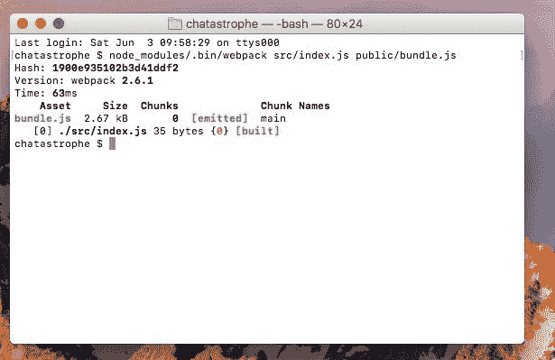
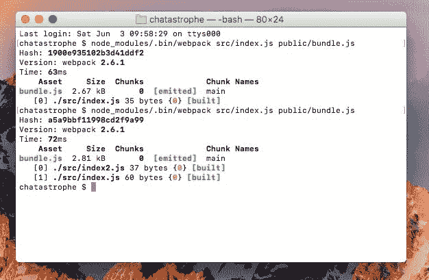
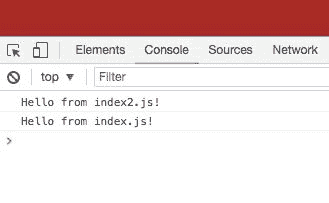
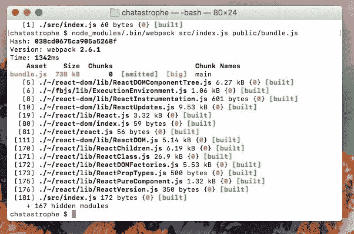
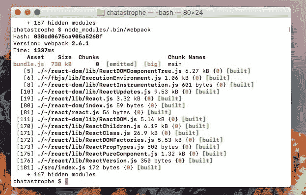
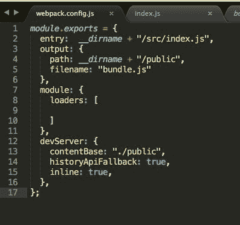
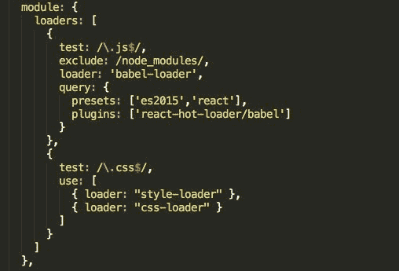
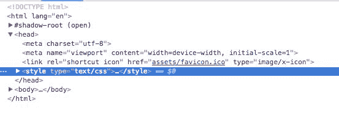

# 第二章：使用 Webpack 入门

本章主要讨论 Webpack：它是什么，如何使用它，以及为什么我们关心。然而，在我们深入研究 Webpack 之前，我有一个坦白要做。

在上一章中，我们在应用程序设置上有点作弊。我们需要添加一个文件夹结构的最后一部分--我们的 React 文件将存放的地方。

正如我们在上一章的*依赖*部分讨论的那样，React 的一个杀手功能是*用户界面的组件化*--将它们拆分成相关 HTML 和 JavaScript 的小块。例如，“保存”按钮可能是一个组件，位于表单组件内部，旁边是个人资料信息组件，依此类推。

组件结构的美妙之处在于与特定 UI 部分相关的所有内容都在一起（关注点分离），而且这些部分都在简洁易读的文件中。作为开发人员，你可以通过浏览文件夹结构轻松找到你要找的内容，而不是在一个庞大的 JavaScript 文件中滚动。

在本章中，我们将涵盖以下主题：

+   如何组织我们的 React 项目

+   设置 Webpack

+   添加一个开发服务器

+   使用 Babel 进行 JavaScript 转译入门

+   激活热重载

+   为生产环境构建

# 我们的项目结构

让我们看看实际操作中是什么样子。在我们的`chatastrophe`项目文件夹中，创建一个`src`文件夹（应该位于项目文件夹根目录中`public`和`node_modules`文件夹旁边）。

`src`文件夹是我们所有 React 文件的存放地。为了说明这将是什么样子，让我们创建一些模拟文件。

在`src`文件夹内，创建另一个名为`components`的文件夹。在该文件夹内，让我们创建三个 JavaScript 文件。你可以随意命名它们，但为了举例，我将称它们为`Component1.js`，`Component2.js`和`Component3.js`。

想象一下，每个组件文件都包含了我们用户界面的一部分。我们需要这三个文件来构建完整的用户界面。我们如何导入它们呢？

嗯，当我们需要使用 JavaScript 文件时，我们可以像迄今为止所做的那样。我们可以为我们`index.html`中的每个组件创建一个`script`标签。这是一种蛮力的方法。

然而，随着我们应用程序的增长，这种方法很快就会变得难以管理。例如，像 Facebook 这样的应用程序将拥有成千上万个组件。我们无法为成千上万个组件编写`script`标签！

理想情况下，我们只有一个`script`标签，所有的 JavaScript 都合并在一起。我们需要一个工具，将我们的各种文件压缩在一起，给我们最好的两个世界--为开发者组织、分离的代码，以及为用户压缩、优化的代码。

“但是，斯科特，”你可能会说，“如果我们把所有的代码放在一个文件中，那不是会让浏览器下载时间更长吗？有小的、分离的文件不是一件好事吗？”

你说得对。最终我们不想回到单一的单文件，但也不想有成千上万个单独的文件。我们需要一个合适的中间地带，有一些代码文件，我们会达到这个中间地带。然而，首先，让我们看看如何使用我们的新朋友--**Webpack**将多个 JavaScript 文件捆绑成一个文件。

# 欢迎来到 Webpack

我们这一节的目标是将我们在`index.html`中的脚本标签中的 JavaScript（负责渲染我们的“Hello from React!”）移到`src`文件夹中的 JavaScript 文件中，然后由 Webpack 捆绑并注入到 HTML 中。

听起来很复杂，但由于 Webpack 的魔力，它比听起来简单。让我们开始吧：

1.  首先，我们需要安装 Webpack：

```jsx
yarn add webpack@3.5.4
```

如果你检查`package.json`，你应该会看到 Webpack 列在我们的依赖项下。在本书中，我将使用**版本 3.5.4**；如果你遇到任何莫名其妙的问题，尝试使用`yarn add webpack@3.5.4`指定这个版本：

1.  现在，我们需要告诉 Webpack 该做什么。让我们先把我们的 React 代码移到`src`文件夹中。在`chatastrophe/src`中创建一个名为`index.js`的文件。

1.  然后，输入以下代码：

```jsx
console.log(‘hello from index.js!’);
```

我们的目标是让这个问候显示在我们的浏览器控制台中。

1.  好的，让我们试试 Webpack。在你的终端中，输入以下内容：

```jsx
node_modules/.bin/webpack src/index.js public/bundle.js
```

你的终端现在应该是这样的：



这样做有什么作用？嗯，它告诉 Webpack 将第一个文件复制（以及它需要的一切，也就是说，它需要的每个文件）到第二个文件中（这是 Webpack 为我们创建的，因为它不存在）。

打开新创建的`public/bundle.js`，你会看到很多 Webpack 样板代码...在底部是我们的`console.log`。

好的，它可以工作；我们可以在我们的`index.html`中引入这个文件来看到我们的`console.log`，但这并没有充分利用 Webpack 的潜力。让我们试试其他的东西。

# 捆绑文件

让我们看看 Webpack 如何将我们的 JavaScript 文件合并在一起。按照以下步骤添加第二个 JavaScript 文件：

1.  在我们的`src`文件夹中，创建另一个文件。让我们称之为`index2.js`，因为缺乏创造力。

1.  在里面，添加第二个`console.log`：

```jsx
console.log(‘Hello from index2.js!’);
```

1.  然后，在`index.js`（第一个）中，我们将按如下方式需要另一个文件：

```jsx
require('./index2.js');
console.log('Hello from index.js!');
```

这基本上意味着`index.js`现在告诉 Webpack，“嘿，我需要另一个 index！”

1.  好的，让我们重新运行与之前相同的 Webpack 命令：

```jsx
node_modules/.bin/webpack src/index.js public/bundle.js
```

再次，我们只会指定`src/index.js`，但是如果你查看控制台输出，你会看到 Webpack 现在也获取了另一个文件：



1.  打开`public/bundle.js`，滚动到底部，你会看到两个控制台日志。

这就是 Webpack 的美妙之处。我们现在可以扩展我们的应用程序以包含任意数量的 JavaScript 文件，并使用 Webpack 将它们合并为一个文件。

1.  好的，让我们确保那些控制台日志能够正常工作。在我们的`public/index.html`中，在其他三个标签下面添加另一个脚本标签：

```jsx
<script src="bundle.js"></script>
```

1.  重新加载页面，打开控制台，你会看到这个：



# 移动我们的 React

够了，现在让我们使用 Webpack 来处理一些有用的代码：

1.  删除我们的`index2.js`，并删除`index.js`中的所有代码。然后，将我们的 React 代码复制粘贴到`index.js`中，并删除`index.html`中的前三个脚本标签。

1.  这样做后，你的`index.html`中应该只有一个脚本标签（用于`bundle.js`），而你的`index.js`应该包含这一行：

```jsx
ReactDOM.render(React.createElement('h1', false, 'Hello from React!'), document.getElementById('root'))
```

1.  在运行 Webpack 之前，我们有一个问题。我们删除了需要 React 和 ReactDOM 的脚本标签，但我们仍然需要一种方法在我们的`index.js`中访问它们。

1.  我们可以以与需要`index2.js`相同的方式来做，也就是，输入`require(‘../node_modules/react/dist/react.js’)`，但那需要大量输入。此外，我们将在我们的代码中使用许多来自`node_modules`的依赖项。

1.  幸运的是，以这种方式需要模块是很常见的，所以`require`函数足够智能，可以根据名称单独获取依赖项，这意味着我们可以将其添加到我们的`index.js`的开头：

```jsx
var React = require('react');
var ReactDOM = require('react-dom');
```

然后，我们可以像以前一样在我们的代码中使用这些包！

1.  好的，让我们试一下。再次运行 Webpack：

```jsx
node_modules/.bin/webpack src/index.js public/bundle.js
```

它将显示以下输出：



现在，你可以在我们的`index.js`中看到 Webpack 捆绑在一起的所有文件：React，它的所有依赖项和 ReactDOM。

重新加载页面，您应该看到没有任何变化。但是，我们的应用程序现在更具可扩展性，我们可以更好地组织我们的文件。当我们添加一个依赖项时，我们不再需要添加另一个`<script>`标签；我们只需在我们使用它的代码中要求它。

# 快捷方式

打出那么长的 Webpack 命令很无聊，也可能导致错误（如果我们误输入了`bundle.js`，最终生成了错误的文件怎么办？）。让我们简化这个过程以保持我们的理智。

首先，让我们决定我们的`index.js`将是我们应用程序的入口点，这意味着它将需要应用程序中的所有其他文件（或者说，它将需要一些需要其他文件的文件，这些文件需要一些其他文件，依此类推）。

相反，我们的`bundle.js`将是我们的输出文件，其中包含我们所有捆绑的代码。

因此，这两个文件将始终是我们在终端中给 Webpack 命令的参数。由于它们不会改变，让我们配置 Webpack 始终使用它们。

在我们的项目文件夹中（不是在`src`中，而是顶层文件夹），创建一个名为`webpack.config.js`的文件。在其中，放入以下内容：

```jsx
module.exports = {
  entry:  __dirname + "/src/index.js",
  output: {
   path: __dirname + "/public",
   filename: "bundle.js",
   publicPath: "/",
  }
};
```

我们将我们的入口点定义为`index.js`的路径（`__dirname`是一个全局变量，它抓取当前目录，也就是说，无论我们在哪里运行`webpack`命令）。然后我们定义我们的输出文件。

现在，我们可以在终端中简单地运行`node_modules/.bin/webpack`，不带任何参数，得到相同的结果：

```jsx
node_modules/.bin/webpack
```



一个很好的改进，但我们是开发人员，所以我们懒惰，想要更多的快捷方式。让我们缩短`node_modules/.bin/webpack`命令。

`npm`的一个很酷的功能是能够编写脚本来执行常用任务。让我们试试。在我们的`package.json`中，创建一个脚本部分；在其中，创建一个名为`build`的脚本，值为`node_modules/.bin/webpack`命令：

```jsx
{
  "name": "chatastrophe",
  "version": "1.0.0",
  "main": "index.js",
  "license": "MIT",
 "scripts": {
 "build": "node_modules/.bin/webpack",
 },
  "dependencies": {
    "react": "15.6.1",
    "react-dom": "15.6.1",
    "webpack": "3.5.4",
  }
}
```

然后，在终端中，您可以运行`npm run build`或`yarn build`。它们做的事情是一样的：运行 Webpack 命令并捆绑我们的文件！

哇，我们的生活变得越来越容易。我们还能更懒吗？

简而言之，是的。

# 我们的开发服务器

如果我们想要更新我们的代码（比如，将我们的`h1`更改为`h2`），我们将不得不进行更改，重新运行`yarn build`，然后重新加载页面以查看我们想要看到的每一个更改。这将大大减慢我们的开发过程。

理想情况下，每当我们更改 JavaScript 时，Webpack 命令将自动重新运行，并重新加载页面。这将是多么奢侈的世界啊！

幸运的是，有一个叫做`webpack-dev-server`的包专门用于这个目的。要安装它，只需运行`yarn add webpack-dev-server`。

在我们深入之前，让我们简要介绍一下 Dev Server 是如何工作的。它在我们的机器后台运行一个小型的 Node 应用程序，提供我们公共文件夹中的文件，以便我们可以通过在浏览器中访问`localhost:3000`来查看它们。同时，它会监视`bundle.js`的源文件，当它们发生变化时重新打包，然后重新加载页面。

为了使其工作，我们需要指定要提供的文件夹（public），然后进行一些基本配置。

在我们的`webpack.config.js`中，在闭合的花括号之前添加以下内容（我们在这里有完整的代码）：

```jsx
devServer: {
  contentBase: "./public",
  historyApiFallback: true,
  inline: true,
}
```

`contentBase`会设置`public`作为要提供的文件夹，`historyApiFallback`让我们的单页应用看起来像多页应用，`inline`是自动刷新文件更改的部分：

```jsx
module.exports = {
  entry: __dirname + "/src/index.js",
  output: {
   path: __dirname + "/public",
   filename: "bundle.js",
   publicPath: "/"
  },
 devServer: {
 contentBase: "./public",
 historyApiFallback: true,
 inline: true,
 }
};
```

好的，让我们试试。首先，我们将在我们的`package.json`中添加一个名为`start`的新脚本：

```jsx
"scripts": {
  "build": "node_modules/.bin/webpack",
  "start": "node_modules/.bin/webpack-dev-server"
},
```

这将运行我们的 Dev Server（确保你首先运行了`yarn add webpack-dev-server`）。在你的终端中，输入**`yarn start`**。你会看到我们的 Webpack 编译，并且会收到一个通知，我们的应用正在端口`8080`上运行。让我们跳转到浏览器中的`http://localhost:8080`，我们应该能看到我们的应用程序。

最后的测试是将我们的`index.js`中的文本从`Hello from React`改为`Hello from Webpack!`。你的浏览器标签应该会自动重新加载并反映出更改，而无需重新运行 Webpack 命令。

# Webpack 加载器

我们即将迈入未来。

到目前为止，在这本书中，我们一直在使用旧形式的 JavaScript。这种语言最近（2015 年）进行了一次整容，增加了一些便利和新功能。这个新版本被称为**ECMAScript 2015**，简称**ES6**。它比旧版 JavaScript（ES5）更加令人愉快，但也存在问题。

所有的互联网浏览器都能够完美运行 JavaScript，但许多用户使用的是旧版本浏览器，还不能运行 ES6。因此，作为开发者，我们想要使用 ES6，但如何才能在旧版本浏览器上使我们的网站正常工作呢？

关键在于 ES6 并没有做太多 ES5 做不到的事情，它只是让编写变得更容易。

例如，以前循环遍历数组是这样做的：

```jsx
var arr = [1, 2, 3, 4];
for (var i = 0; i < arr.length; i++) {
  console.log(arr[i]);
}
```

现在，它是这样做的：

```jsx
[1, 2, 3, 4].forEach(num => console.log(num));
```

一个较旧的浏览器可以理解第一个，但不能理解第二个，但代码的功能是一样的。所以，我们只需要将第二个代码片段转换成第一个。这就是 Babel 的作用。**Babel**是 JavaScript 的转译工具；把它想象成一个翻译器。我们把我们美丽的 ES6 代码给它，它把它转换成更丑陋但更适合浏览器的 ES5 代码。

我们将把 Babel 插入到我们的 Webpack 构建过程中，这样当我们捆绑所有的 JavaScript 文件时，我们也会对它们进行转译。

要开始，我们将安装 Babel，以及一堆插件和附加组件，使其能够与 React 很好地配合。停止你的开发服务器，然后运行以下命令：

```jsx
yarn add babel-core babel-loader babel-preset-es2015 babel-preset-react babel-plugin-transform-class-properties
```

天啊，一次性安装了这么多的包！下一步中重要的是`babel-loader`。这是一个 Webpack 加载器，我们用它来获取（然后转译）我们的 JavaScript 文件，然后将它们传递给 Webpack 进行捆绑。让我们把它插入到 Webpack 中。

在我们的`webpack.config.js`中，创建一个带有加载器数组的模块对象：



然后，我们可以在数组内定义我们的加载器。

我们将创建一个具有四个键的对象：test、exclude、loader 和 query：

+   **Test**是加载器用来确定它应该转译哪些文件的内容。对于 Babel，我们希望运行所有的 JavaScript 文件，所以我们的测试将是以`.js`结尾的文件：

```jsx
test: /\.js$/
```

+   **Exclude**是不需要运行的内容。我们可以跳过整个`node_modules`文件夹，因为这些包已经是 ES5 了：

```jsx
exclude: /node_modules/
```

+   **Loader**就是我们的加载器的名字：

```jsx
loader: ‘babel-loader’
```

+   最后，我们将使用**query**来定义我们的预设（Babel 将用它来转译 JavaScript）：

```jsx
query: {
  presets: ['es2015','react'],
  plugins: ['transform-class-properties']
}
```

完整的文件应该是这样的：

```jsx
module.exports = {
  entry: __dirname + "/src/index.js",
  output: {
   path: __dirname + "/public",
   filename: "bundle.js",
   publicPath: "/"
  },
  module: {
    loaders: [
      {
        test: /\.js$/,
        exclude: /node_modules/,
        loader: 'babel-loader',
        query: {
          presets: ['es2015','react'],
          plugins: ['transform-class-properties']
        }
      },
    ]
  },
  devServer: {
    contentBase: "./public",
    historyApiFallback: true,
    inline: true,
  }
};
```

运行**`yarn start`**并查找错误。如果没有错误，我们可以进行测试并编写一些 ES6 代码。

# 我们的第一个 ES6

让我们打开我们的`src/index.js`并看看我们如何让它更有趣。

首先，我们可以用新的`import`语法替换我们的`require`调用。它看起来像这样：

```jsx
import React from ‘react’;
import ReactDOM from 'react-dom';
```

这样做会更清晰一些，并且让我们可以做一些很酷的东西，我们稍后会看到。

对于 React 和 ReactDOM 都要这样做，然后我们可以最终替换我们的`React.createElement`调用。

你可能会猜到，通过调用`React.createElement`来构建复杂的 UI 会非常笨拙。我们希望拥有 JavaScript 的功能和功能，但又具有 HTML 的可读性。

输入 JSX；**JSX**是一种类似 HTML 的语法，但实际上是 JavaScript。换句话说，它编译成`React.createElement`，就像我们的 ES6 JavaScript 会编译成 ES5 一样。

它也有一些陷阱，因为它不是真正的 HTML，但我们会解决的。最后要注意的是，JSX 让一些开发人员感到非常不舒服；他们说在 JavaScript 内部放置 HTML 看起来很奇怪。我个人不同意，但这是一个观点问题。无论你的审美立场如何，JSX 提供了很多便利，所以让我们试一试。

我们可以简单地将我们的代码行转换为这样：

```jsx
ReactDOM.render(<h1>Hello from ES6!</h1>, document.getElementById('root'));
```

运行`yarn start`（或者，如果已经运行，它应该会自动刷新）。如果 Babel 工作正常，什么都不应该改变。我们的第一个 JSX 完成了！

当然，我们将更多地使用 JSX，看看它与 HTML 的区别，以及作为开发人员它为我们提供了什么优势。但是，现在让我们让我们的生活更加轻松。

# 拆分我们的应用程序

为了更好地组织我们的应用程序（并在下一节中进行一些魔术），让我们将我们的 JSX 从`ReactDOM.render`中移到一个单独的文件中。这将确保我们的文件结构具有良好的关注点分离。

在`src`文件夹的`index.js`旁边，创建一个名为`App.js`的文件。在里面，我们只需创建一个名为`App`的函数，它返回我们的 JSX：

```jsx
import React from 'react';

const App = () => {
  return <h1>Hello from React!!</h1>
};

export default App;
```

请注意底部的`export`语句；这意味着当我们导入我们的文件时，我们将自动获得此函数作为默认导入。我们将在后面看到非默认导入的示例，这将使这一点更清晰。

如果我们回到`index.js`，现在可以从`'./App'`导入`App`。然后，我们渲染它，如下所示：

```jsx
import React from 'react';
import ReactDOM from 'react-dom';
import App from './App'

ReactDOM.render(<App />, document.getElementById('root'));
```

请注意，我们使用它就像 HTML（或者说 JSX）标签一样。我们将在接下来的章节中更多地讨论原因；现在，重要的是我们的应用程序更有组织性，我们的视图逻辑（JSX）与渲染逻辑（`ReactDOM.render`）分开。

# 热重载

我们已经为我们的开发过程取得了一些重大的胜利。在我们深入了解 Webpack 配置之前，我想再添加一个便利。

想象一个应用程序，它包括一个表单，当用户点击编辑按钮时，会弹出一个模态框。当你重新加载页面时，那个模态框会关闭。现在，想象一下你是开发人员，试图微调那个表单。你的开发服务器在每次微调后重新加载页面，迫使你重新打开模态框。在这种情况下，这可能有点烦人，但想象一下像浏览器游戏这样的东西，要回到之前的状态需要点击好几次。

简而言之，我们需要一种方法在保留应用程序当前状态的同时重新加载我们的 JavaScript，而不重新加载页面本身；这被称为**热重载**。我们使用 Webpack 来替换已更改的 UI 部分，而不重新加载所有内容。

为了这样做，我们将使用*Dan Abramov*的`react-hot-loader`包。让我们安装它并看看我们将如何配置 Webpack 以使其与之良好地配合。

要安装，输入`yarn add react-hot-loader@3.0.0`。在撰写本文时，版本 3 仍处于测试阶段；如果 yarn 提示您选择 3.0 的测试版本，请选择最新版本（对我来说，我选择了 beta.7）：

```jsx
yarn add react-hot-loader@3.0.0
```

为了使它工作，我们需要做四件事：

1.  启用 Webpack 自己的热模块替换插件。

1.  将 React Hot Loader 用作我们应用程序的入口点，以便 Webpack 查找源文件。

1.  将 React Hot Loader 连接到 Babel。

1.  在我们的开发服务器上启用热重载。

安装 Webpack 的`HMR`插件实际上非常容易。在我们的`webpack.config.js`中，首先在文件顶部要求 Webpack，以便我们可以访问该包：

```jsx
var webpack = require('webpack');
```

我们的 Webpack 文件不会被 Babel 处理，所以我们仍然会使用`require`而不是`import`。

然后，在我们的`devServer`键上面，添加一个名为`plugins`的新键，其值为一个数组，其中包括`new webpack.HotModuleReplacementPlugin()`作为唯一的项：

```jsx
module: {
  loaders: [
    {
      test: /\.js$/,
      exclude: /node_modules/,
      loader: 'babel-loader',
      query: {
        presets: ['es2015','react'],
        plugins: ['transform-class-properties']
      }
    },
  ]
},
plugins: [
 new webpack.HotModuleReplacementPlugin()
],
devServer: {
  contentBase: "./public",
  historyApiFallback: true,
  inline: true,
}
```

重新启动服务器以检查错误，然后继续进行第二步。

现在，我们的`index.js`是 Webpack 的入口点；它执行该文件中的代码，并从该执行中使用的文件的捆绑文件中派生。我们想要首先执行`react-hot-loader`包。让我们修改我们的入口键如下：

```jsx
entry: [
  'react-hot-loader/patch',
  __dirname + "/src/index.js"
 ],
```

为了使它与我们的开发服务器配合使用，我们需要添加一些代码：

```jsx
entry: [
   'react-hot-loader/patch',
   'webpack-dev-server/client?http://localhost:8080',
   'webpack/hot/only-dev-server',
   __dirname + "/src/index.js"
 ],
```

这个配置意味着 Webpack 会在移动到我们的代码之前执行这些路径中的代码。

再次尝试重新启动服务器。如果有错误，请检查拼写错误；否则，继续！

接下来，我们想要添加一个 Babel 插件，以便我们的热重新加载文件使用`babel-loader`进行编译。只需更新我们的 Babel 配置，如下所示，使用`react-hot-loader`中包含的 Babel 插件：

```jsx
loaders: [
  {
    test: /\.js$/,
    exclude: /node_modules/,
    loader: 'babel-loader',
    query: {
      presets: ['es2015','react'],
      plugins: ['react-hot-loader/babel', 'transform-class-properties']
    }
  },
]
```

我们还需要在我们的开发服务器中打开热重新加载；通过在我们的`devServer`配置中添加`hot: true`来实现：

```jsx
devServer: {
  contentBase: "./public",
  historyApiFallback: true,
  inline: true,
  hot: true
},
```

作为最后一步，我们需要在我们的`index.js`中添加一些代码。在文件底部添加以下内容：

```jsx
if (module.hot) {
  module.hot.accept('./App', () => {
    const NextApp = require('./App').default;
    ReactDOM.render(
     <App/>,
     document.getElementById('root')
    );
  });
}
```

上述代码基本上在文件更改时向`ReactDOM.render`发送我们应用程序的新版本。

好的，让我们试一试。重新启动服务器，然后打开`localhost:8080`。尝试编辑文本`Hello from React!`，看看 HTML 在不重新加载页面的情况下更新；很棒。

**热模块替换**将使我们的生活变得更加轻松，特别是当我们开始用不同的状态构建我们的应用程序时--重新加载页面将重置状态。

# 为生产构建

到目前为止，我们完全专注于在开发环境中使用 Webpack，但我们还需要考虑将我们的应用程序部署到生产环境中，以及可能涉及的内容。

当我们将我们的应用程序发送到全球网络时，我们不想发送任何不必要的东西（记住我们的目标是性能）；我们想要部署最少的内容。

这是我们需要的：

+   一个`index.html`页面（经过压缩）

+   一个 CSS 文件（经过压缩）

+   一个 JavaScript 文件（经过压缩）

+   所有图像资产

+   一个资产清单（上述静态文件的列表）

我们有一些这样的文件，但不是全部。让我们使用 Webpack 自动生成一个带有所有这些文件的`build`文件夹，以便稍后部署。

首先，一个经过压缩的`index.html`。我们希望 Webpack 获取我们的`public/index.html`文件，对其进行压缩，自动添加适当的脚本和 CSS 链接，然后将其添加到`build`文件夹中。

由于我们的生产环境中的 Webpack 流程将与开发环境不同，让我们制作一个`webpack.config.js`的副本，并将其命名为`webpack.config.prod.js`。在本章的大部分时间里，我们将使用`webpack.config.prod.js`，而不是`webpack.config.js`。

首先，从`webpack.config.prod.js`中删除`devServer`键。我们不会在生产中使用开发服务器，也不会使用热重新加载。我们需要删除`entry`下的两行`devServer`特定行，以及热重新加载行，使其看起来像这样：

```jsx
entry: __dirname + "/src/index.js",
```

此外，在我们的`webpack.config.prod.js`中，让我们指定我们的输出文件夹现在是`chatastrophe/build`，通过更改输出下面的这行：

```jsx
path: __dirname + "/public",
```

需要更改为这样：

```jsx
path: __dirname + "/build",
```

我们还需要添加一个`publicPath`，这样我们`build`文件夹中的`index.html`就知道在同一个文件夹中查找捆绑的 JavaScript：

```jsx
output: {
  path: __dirname + "/build",
  filename: "bundle.js",
  publicPath: './'
},
```

让我们将环境设置为生产环境，这样 React 就不会显示它的（在开发中很有帮助的）警告。我们还可以移除`HotModuleReplacementPlugin`：

```jsx
plugins: [
  new webpack.DefinePlugin({
    'process.env': {
      NODE_ENV: JSON.stringify('production')
    }
  }),
],
```

接下来，我们将使用一个新的 Webpack 插件，称为`HtmlWebpackPlugin`。它做起来就像它的名字一样--为我们打包 HTML！让我们使用`yarn add html-webpack-plugin`来安装它，然后使用以下选项添加它：

```jsx
plugins: [
  new webpack.DefinePlugin({
    'process.env': {
      NODE_ENV: JSON.stringify('production')
    }
  }),
  new HtmlWebpackPlugin({
    inject: true,
    template: __dirname + "/public/index.html",
    minify: {
      removeComments: true,
      collapseWhitespace: true,
      removeRedundantAttributes: true,
      useShortDoctype: true,
      removeEmptyAttributes: true,
      removeStyleLinkTypeAttributes: true,
      keepClosingSlash: true,
      minifyJS: true,
      minifyCSS: true,
      minifyURLs: true,
    },
  }),
],
```

不要忘记在`webpack.config.prod.js`的顶部要求它，就像我们要求 Webpack 一样：

```jsx
var HtmlWebpackPlugin = require('html-webpack-plugin');
```

是时候来测试一下了！在你的`package.json`中，更新我们的构建脚本以使用我们的新配置，如下所示：

```jsx
"build": "node_modules/.bin/webpack --config webpack.config.prod.js",
```

然后运行`yarn build`。

您应该在项目目录中看到一个`build`文件夹出现。如果您打开`build/index.html`，您会看到它被整合在一起。但是，有一个问题；在那个压缩的代码中，您应该看到两个脚本标签，都需要`bundle.js`。

这是我们之前指定的`HtmlWebpackPlugin`选项的结果。插件为我们添加了脚本标签！多么方便，除了我们已经在`public/index.html`中自己添加了它。

这里有一个简单的解决方案--让我们将我们的`HtmlWebpackPlugin`配置（和 require 语句）复制到`webpack.config.js`（我们的原始配置文件）中。但是，我们可以删除`minify`键及其所有选项，因为在开发中这是不必要的：

```jsx
// webpack.config.js
plugins: [
  new webpack.HotModuleReplacementPlugin(),
  new HtmlWebpackPlugin({
    inject: true,
    template: __dirname + '/public/index.html',
  })
],
```

然后，从`public/index.html`中删除脚本标签，然后再次尝试`yarn start`来测试我们的开发环境是否工作正常，以及`yarn build`来测试我们的生产构建。

好的，我们在我们的构建中有一个被压缩的 HTML 文件，并且我们也稍微改进了我们的开发启动过程。下一个任务是确保我们的 CSS 也被压缩并复制到我们的构建文件夹中。

在我们的 webpack 配置中（生产和开发环境都是），我们使用`babel-loader`来加载我们的 JavaScript 文件；我们将类似的方法用于 CSS。

为此，我们将结合两个加载器：`css-loader`和`style-loader`。

您可以在[`github.com/webpack-contrib/style-loader`](https://github.com/webpack-contrib/style-loader)的 style-loader GitHub 页面上阅读更多关于为什么建议同时使用两者的信息。

使用以下命令安装两者：

```jsx
 yarn add css-loader style-loader
```

让我们将它们添加到我们的`webpack.config.prod.js`和`webpack.config.js`中，通过在我们的`babel-loader`配置下添加以下代码：



这些插件的作用是将我们的 React 代码所需的 CSS 文件转换为注入到我们的 HTML 中的`<style>`标签。现在，这对我们来说没有太大作用，因为我们的 CSS 目前位于我们的`public`/`assets`文件夹中。让我们将它移到`src`中，然后在`App.js`中引入它：

```jsx
import React from 'react';
import './app.css';

const App = () => {
  return <h1>Hello from React!!</h1>
};

export default App;
```

然后，我们可以从我们的`public/index.html`中删除我们的链接标签，并重新启动我们的服务器。

如果我们在浏览器中检查我们的 HTML 的头部，我们应该会看到一个包含所有 CSS 的`<style>`标签。很整洁！：



现在，当我们刷新页面时，你可能会注意到有一些未经样式化的内容闪烁；这是因为我们的应用现在需要 React 在添加样式之前启动。我们将在接下来的章节中解决这个问题，放心。

运行`yarn build`，看一下`bundle.js`。如果你搜索"Start initial styles"，你会看到我们的 CSS 是如何捆绑在我们的 JavaScript 中的。另外，请注意我们的 JavaScript 相对于我们的 HTML 来说是相对可读的。下一步是对其进行缩小处理！

幸运的是，这样做非常容易。我们只需要在我们的`production`文件中添加另一个 Webpack 插件。在`HtmlWebpackPlugin`之后，添加以下内容：

```jsx
plugins: [
  new HtmlWebpackPlugin({
    inject: true,
    template: __dirname + '/public/index.html',
    minify: {
      removeComments: true,
      collapseWhitespace: true,
      removeRedundantAttributes: true,
      useShortDoctype: true,
      removeEmptyAttributes: true,
      removeStyleLinkTypeAttributes: true,
      keepClosingSlash: true,
      minifyJS: true,
      minifyCSS: true,
      minifyURLs: true
    }
  }),
  new webpack.optimize.UglifyJsPlugin({
    compress: {
      warnings: false,
      reduce_vars: false
    },
    output: {
      comments: false
    },
    sourceMap: true
  })
]
```

再次运行`yarn build`，你会看到我们的`bundle.js`已经变成了一行。这对人类来说不太好，但对浏览器来说更快。

好的，我们离结束越来越近了。接下来，我们要确保所有的资产文件都被复制到我们的`build`文件夹中。

我们可以通过向我们的 Webpack 配置添加另一个加载器来实现，称为`file-loader`。我们将使用`yarn add file-loader@0.11.2`来安装它。让我们看看代码是什么样子的（请注意，这仅适用于我们的`webpack.config.prod.js`文件）：

```jsx
module: {
  loaders: [
    {
      test: /\.js$/,
      exclude: /node_modules/,
      loader: 'babel-loader',
      query: {
        presets: ['es2015', 'react'],
        plugins: ['react-hot-loader/babel', 'transform-class-properties']
      }
    },
    {
      test: /\.css$/,
      use: [{ loader: 'style-loader' }, { loader: 'css-loader' }]
    },
 {
 exclude: [/\.html$/, /\.(js|jsx)$/, /\.css$/, /\.json$/],
 loader: 'file-loader',
 options: {
 name: 'static/media/[name].[ext]'
 }
 }</strong>
  ]
},
```

请注意，我们排除了 HTML、CSS、JSON 和 JS 文件。这些都已经被我们的其他加载器覆盖了，所以我们不想重复文件。

我们还将这些资产放在一个`static`文件夹中，就像我们的`public`文件夹中的`assets`文件夹一样。

然而，`file-loader`只会应用于我们的 JavaScript 代码所需的文件。我们有我们的 favicon 和图标，目前只在我们的`index.html`中使用，所以 Webpack 找不到它们。

为了做到这一点，我们将使用 JavaScript 而不是 Webpack（因为 Webpack 只关注我们的`src`文件夹）。

# 创建一个自定义脚本

在你的目录根目录下新建一个名为`scripts`的文件夹。在里面，创建一个名为`copy_assets.js`的文件。

在这里，我们将把`public`中的所有内容复制到`build`中，但不包括我们的`index.html`。

为了做到这一点（你猜对了），我们需要另一个包；运行 `yarn add fs-extra`。

然后，在 `copy_assets.js` 中引入它，如下所示：

```jsx
var fs = require('fs-extra');
```

`fs-extra` 是一个用于在 Node 环境中操作文件的包。它有一个叫做 `copySync` 的方法，我们将在这里使用它。

代码相当简单明了：

```jsx
fs.copySync('public', 'build', {
 dereference: true,
 filter: file => file !== 'public/index.html'
});
```

这意味着复制 `public` 文件夹中的所有内容到 `build` 文件夹，除了 `index.html` 文件。

如果你在之前的 Webpack 配置中的 `public` 文件夹中有一个 `bundle.js`，现在可以删除它了。

现在，要在构建时运行此命令，请将其添加到 `package.json` 中的构建脚本中：

```jsx
 "scripts": {
   "build": "node scripts/copy_assets.js && node_modules/.bin/webpack --config 
    webpack.config.prod.js",
   "start": "node_modules/.bin/webpack-dev-server"
 },
```

把 `copy_assets` 命令放在我们的 Webpack 命令之前是个好主意，这样可以确保我们不会在 `public` 中意外复制任何未经转译的 JavaScript 资源。

# 创建一个资产清单

作为最后一步，我们想要一个我们正在生成的所有静态资产的清单。一旦我们开始缓存它们以节省加载时间，这将会很有用。幸运的是，这是一个简单的步骤，另一个插件！

`yarn add webpack-manifest-plugin` 并将其添加到 `webpack.config.prod.js` 中的插件下，使用以下配置：

```jsx
var ManifestPlugin = require('webpack-manifest-plugin');
// Then, under plugins: new ManifestPlugin({
  fileName: 'asset-manifest.json',
}),
```

好的，让我们一起试试。运行 **`yarn build`**，然后在浏览器中打开 `index.html`。它应该看起来和运行 **`yarn start`** 一样。你还应该在我们的 `build` 文件夹中看到一个 `index.html`，一个 `bundle.js`，一个 `asset-manifest.json`，和一个 `assets` 文件夹。

# 总结

哇！那是很多的配置。好消息是现在我们已经完全准备好开始编写 React 并构建我们的应用程序了。这就是我们接下来要做的！

在本章中，我们涵盖了与 Webpack 相关的一切，添加了一堆方便的功能来加快我们的开发速度。在下一章中，我们将开始开发过程，并开始构建我们的 React 应用程序。这就是乐趣开始的地方！
