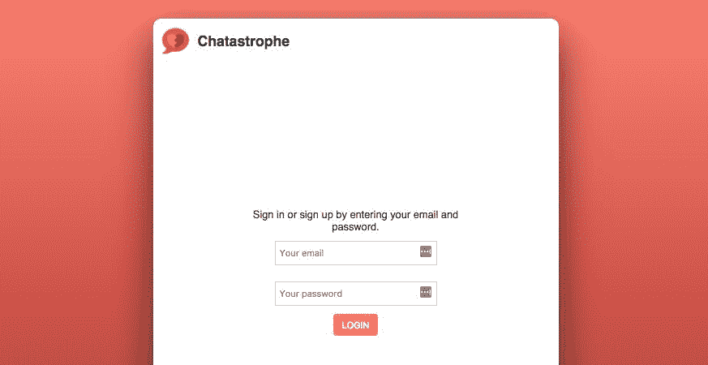

# 第三章：我们的应用程序的登录页面

在过去的几章中，我们已经完全准备好了使用 React 进行开发。现在，让我们全力以赴地构建我们的应用程序。

在本章中，我们将在 React 中创建我们应用程序的登录页面。最后，你应该对基本的 React 语法感到舒适。

我们将涵盖以下关键的 React 概念：

+   将 UI 分成组件

+   编写 JSX

+   函数组件与类组件

+   组件状态

+   创建可重用的组件

# 什么是 React 组件？

**React 组件**，在最基本的层面上，是用户界面的一部分，更具体地说，是专门用于单一目的的 UI 部分。

在 React 中，你的 UI 被分成了各个部分，这些部分又包含在其他部分中，依此类推；你明白了吧。每个部分都是自己的组件，并且存在于单独的文件中。

这个系统的美妙之处现在可能并不明显，但一旦我们深入了解，你会发现它使我们的应用程序更易理解，也就是说，在开发过程中更容易理解和导航。我们只会构建一个包含几个组件的小应用程序。当你的应用程序增长到数百个组件时，效果会更加明显。

让我们来看一个将 UI 拆分成组件的快速示例。这是 Packt 的在线商店，也是这本书的出版商：


如果我们要在 React 中重建这个 UI，我们将首先将 UI 分成有意义的部分。哪些部分涉及不同的目的？

请注意，这个问题并没有一个正确的答案；不同的开发人员会有不同的做法，但是以下的划分对我来说是有意义的：将其分成**FilterControl**、**SearchBar**和**ResultsGrid**：


我的想法是——**FilterControl**（在顶部）与排序和分页有关，**SearchSideBar** 是搜索特定结果的功能，**ResultsGrid** 则是显示匹配结果的功能。每个组件都有非常具体和明确的目的。

然后，在这三个组件中，我们可以进行更小的划分。**ResultsGrid** 中的每本书可以是一个**BookCard**组件，其中包含**BookInfo**和**BookImage**组件，依此类推。

我们想要将这些划分做得多细致，取决于我们自己。一般来说，更多数量的小组件更好，但是随着组件数量的增加，我们需要编写更多的样板代码。

React 组件化的另一个优势是可重用性。假设在我们的**ResultsGrid**中，我们为每个结果制作一个**BookCard**组件。然后，在 Packt 主页上，我们可以重用相同的组件！不再在两个地方重复编写相同的代码：


代码的可重用性也是为什么较小的组件更好。如果您构建组件以最大化可重用性（以适应最多的上下文），您可以利用现有部分构建新功能。这增加了开发速度和便利性。我们将构建一个可重用的组件作为我们登录表单的一部分，并在应用程序扩展时在其他地方使用它。

让我们跳转到我们的`App.js`文件，看看我们构建的第一个组件：

```jsx
import React, { Component } from 'react';
import './app.css';

const App = () => {
  return <h1>Hello from React!!</h1>
};

export default App;
```

我们的`App`组件是一个返回一部分 JSX 的函数。就是这样。这是一种非常方便的思考 React 组件的方式，作为返回视图的一部分的函数。通过按照特定顺序调用某些函数，我们构建我们的 UI。

当然，情况会变得更加复杂。然而，如果你对 React 的语法和概念感到不知所措，请回到这个核心原则：React 组件只是返回 UI 的一部分的函数。

# 争议和关注点的分离

当 React 首次出现时，它非常具有争议性（对许多人来说，它仍然是）。许多开发人员关注的核心问题是 JSX，在 JavaScript 代码中间出现类似 HTML 的东西。

多年来，开发人员一直在不同的文件中编写他们的 HTML、CSS 和 JavaScript。React 违反了这一传统。一些开发人员指责该库违反了**关注点分离**（**SoC**）的编程原则-代码应该分离到各自用于一件事的文件中。从这个意义上讲，他们认为你应该有一个 HTML 文件，一个 CSS 文件和一个 JavaScript 文件-不应该混合 HTML 和 JavaScript。

React 开发人员指出的是，根据类型（HTML 与 JavaScript）分离文件是一种技术上的分离，而不是关注点的分离。HTML 和 JavaScript 都关注于呈现功能性 UI-它们是一体的。

React 提出，如果你有一个按钮，按钮的 HTML 结构和使其功能（点击时发生的事情）应该存在于同一个文件中，因为这都是同一个关注点。

因此，记住 React 的重要事情是关注点的分离——你可以根据组件的目的划定它们之间的界限。

所有这一切的缺失部分当然是 CSS。它不应该在同一个文件中吗？很多人都这么认为，但是尚未出现成熟的解决方案。你可以在[`medium.freecodecamp.org/css-in-javascript-the-future-of-component-based-styling-70b161a79a32`](https://medium.freecodecamp.org/css-in-javascript-the-future-of-component-based-styling-70b161a79a32)阅读更多关于 JS 中的 CSS。

# 类组件与函数组件

我们刚刚将 React 组件定义为返回 UI 片段的函数。这是一种有用的思考方式，对于我们的`App`组件来说当然是正确的。然而，还有另一种编写 React 组件的方式。

现在，我们的`App`组件是一个函数组件。这意味着它实际上是作为一个函数编写的，但你也可以将组件编写为 JavaScript 类。这些被称为**基于类**或**有状态**组件（我们稍后会讨论有状态部分）。

JavaScript 类是 ES6 的一个新特性。它们以一种类似（但不完全相同）的方式工作于其他语言中的类。我们不会在这里深入探讨它们，但是对于我们的目的，你可以做到以下几点：

+   让一个类扩展另一个类（并继承其属性）

+   用 new 关键字创建一个类的实例（即实例化它）

让我们通过将我们的`App`组件转换为基于类的组件来看一个例子。

每个类组件必须做两件事：它必须扩展 React 库中的`Component`类，并且它必须有一个`render`方法。

让我们从 React 中导入`Component`类开始：

```jsx
import React, { Component } from 'react';
```

对于那些对这种语法不熟悉的人来说，这是 ES6 中对象解构的一个例子。考虑以下内容：

```jsx
const property = object.property;
```

对象解构将前面的代码转换为这样，这样可以节省一些输入，但是做的事情是一样的：

```jsx
const { property } = object;
```

无论如何，既然我们已经导入了我们的`Component`类，让我们创建一个扩展它的类；删除我们的`App`函数，并编写以下内容：

```jsx
class App extends Component {

}
```

JavaScript 类的功能很像对象。它们可以有属性，这些属性可以是值或函数（称为方法）。正如我们之前所说，我们需要一个`render`方法。下面是它的样子：

```jsx
class App extends Component {
  render() {

  }
}
```

`render`方法做什么？实质上，当我们将我们的`App`作为一个函数组件编写时，它仅由一个`render`方法组成。整个东西只是一个大的`render()`。因此，`render`方法做了我们从 React 组件中期望的事情：它返回了一部分视图：

```jsx
class App extends Component {
  render() {
    return <h1>Hello from React!!</h1>;
  }
}
```

如果你启动了应用程序（或者它已经在运行），你会注意到什么都没有改变。

那么，类组件和函数组件之间有什么区别呢？

一个最佳实践是尽可能在应用程序中创建尽可能多的小型功能组件。从性能上讲，它们会快一点，而且 React 团队已经表达了对优化函数组件的兴趣。它们也更容易理解。

然而，类组件给了我们很多方便的功能。它们可以有属性，然后我们在`render`方法中使用这些属性：

```jsx
class App extends Component {
  greeting = 'Hello from React!!';

  render() {
    return <h1>{this.greeting}</h1>;
  }
}
```

我们可以从`render`方法中调用方法：

```jsx
class App extends Component {
  logGreeting = () => {
    console.log('Hello!');
  }

  render() {
    this.logGreeting()
    return <h1>Hello from React!!</h1>;
  }
}
```

正如我们之前讨论的那样，类可以被实例化（在诸如`const app = new App()`的语法中）。这就是 React 在我们的`ReactDOM.render`调用中所做的；它实例化我们的`App`，然后调用`render`方法来获取 JSX。

因此，将 React 组件视为返回视图片段的函数仍然是有用的。类组件只是在`render`函数周围添加了一些额外的功能。

# 我们的第二个组件

我们已经制作了一个 React 组件；让我们再制作一个！

正如我们之前讨论的，本章的目标是创建我们应用程序的登录页面。首先，让我们在我们的`src`文件夹中创建一个名为`components/`的文件夹，然后在里面创建一个名为`LoginContainer.js`的文件。

如果你仍然有我们第二章中的文件夹，*开始使用 Webpack*，其中包括`Component1.js`，`Component2.js`和`Component3.js`，现在可以随意删除这些文件。

我们的`LoginContainer`将是另一个类组件，原因我们将在后面看。就像我们的应用程序一样，让我们设置一个基本的类组件框架：

```jsx
import React, { Component } from 'react';

class LoginContainer extends Component {
  render() {

  }
}

export default LoginContainer;
```

让我们在深入研究之前测试一下渲染我们的组件。从我们的`render`方法中返回一个简单的`<h1>Hello from LoginContainer</h1>`；然后，让我们回到我们的`App.js`。

我对代码组织有点挑剔，所以在继续之前，让我们将我们的`App.js`移动到我们的`components`文件夹中。这也意味着我们将不得不更改`index.js`中的导入语句如下：

```jsx
import App from './components/App';
```

还有，将我们的`app.css`移到`components`文件夹中，然后在`index.js`中更改我们的热重载器配置：

```jsx
if (module.hot) {
  module.hot.accept('./components/App', () => {
 const NextApp = require('./components/App').default;
    ReactDOM.render(
      <App/>,
      document.getElementById('root')
    );
  });
}
```

现在我们所有的组件都住在同一个文件夹里，这样好多了。

在`App.js`中，我们首先导入`LoginContainer`：

```jsx
import LoginContainer from './LoginContainer';
```

然后，我们将其`render`而不是`<h1>`：

```jsx
import React, { Component } from 'react';
import LoginContainer from './LoginContainer';
import './app.css';

class App extends Component {
  render() {
    return <LoginContainer />
  }
}

export default App;
```

翻转回到应用程序，你应该看到我们新组件的 LoginContainer 的 Hello：


正如我们在构建更多组件时将看到的那样，我们的`App`将是我们主要`Container`组件的包装器。它将是我们容器的容器。在`App.js`中，让我们为了 CSS 的目的将我们的`LoginContainer`包装在一个`div#container`中：

```jsx
class App extends Component {
  render() {
    return (
      <div id="container" className="inner-container">
        <LoginContainer />
      </div>
    );
  }
}
```

好了，回到`LoginContainer.js`，让我们写一些 JSX！

删除我们的`<h1>`标签，并用以下内容替换它：

```jsx
class LoginContainer extends Component {
  render() {
    return (
      <div id="LoginContainer" className="inner-container">

      </div>
    );
  }
}
```

这是我非常喜欢的一种模式 - 大多数 React 组件都包裹在一个带有类名的`div`中；尽管这只是一种偏好（一种你必须遵循的偏好，因为我写了 CSS！）。

注意 JSX 周围的括号！这种格式使多行 JSX 更易读。

当然，我们登录表单的本质就是一个表单。这个表单将处理登录和注册。以下是基本的 JSX：

```jsx
class LoginContainer extends Component {
   render() {
     return (
       <div id="LoginContainer" className="inner-container">
         <form>
           <p>Sign in or sign up by entering your email and password.</p>
           <input 
             type="text" 
             placeholder="Your email" />
           <input 
             type="password" 
             placeholder="Your password" />
           <button className="red light" type="submit">Login</button>
         </form>
       </div>
     )
  }
}
```

在前面的 JSX 中，你可能注意到我写了`<button>`的`className`而不是 class。记住我说过 JSX 有一些注意事项吗？这就是其中之一：因为 class 是 JavaScript 中的一个受保护的关键字，我们不能使用它，所以我们使用`className`代替。你很快就会习惯的。

注意前面 JSX 中的`ID`和`className`，否则你的 CSS 看起来就不会那么漂亮。

在我们的表单上面，我们将写一个带有我们的标志的基本标题：

```jsx
<div id="LoginContainer" className="inner-container">
  <div id="Header">
    
    <h1>Chatastrophe</h1>
  </div>
  <form>
```

现在你的应用程序应该看起来像这样（如果你还没有这样做，请从`index.html`中删除`<h1>`和``标签）：



看起来漂亮，但它能做什么呢？

# React 中的状态

每个 React 组件都有一个叫做**state**的东西。你可以把它看作是组件在某个特定时间点的配置。

举个例子，当你点击它时变红的心形图标，就像 Twitter 的情况一样。按钮有两种状态：**未点击**和**已点击**。点击按钮会导致它的状态，从而导致它的外观发生变化。

这就是 React 的流程；用户的操作或事件会导致组件状态的改变，从而导致组件的外观改变。

前面的陈述带有大量的“嗯，并不总是……”，但这是理解状态的一个有用的起点：

```jsx
User event -> State change -> Appearance change
```

让我们给我们的`LoginContainer`添加一些`state`，然后从那里开始。

状态很容易定义；它是类的属性的对象。我们可以像这样定义它：

```jsx
class LoginContainer extends Component {
  state = { text: ‘Hello from state!’ }

   render() {
```

我们总是在组件的顶部定义`state`。

然后我们可以在`render`方法中访问我们的`state`：

```jsx
class LoginContainer extends Component {
  state = { text: ‘Hello from state!’ };

  render() {
    return (
      <div id="LoginContainer" className="inner-container">
        <div id="Header">
          
          <h1>{this.state.text}</h1>
        </div>
```

在前面的代码中，JSX 中的花括号表示我们正在插入一些 Javascript 代码。

这是我们初始化`state`的方式，但这个状态并不是很有用，因为没有改变它的机制。

我们需要做的是提供一种响应用户事件并根据它们修改状态的方法。

如果用户点击 Hello from state!时文本发生了变化会怎么样？

让我们给我们的`h1`标签添加一个`onClick`属性，如下所示：

```jsx
<h1 onClick={this.handleClick}>{this.state.text}</h1>
```

它引用了我们类上的一个叫做`handleClick`的方法，我们可以定义如下：

```jsx
class LoginContainer extends Component {
  state = { text: 'Hello from state!' };

  handleClick = () => {
    this.setState({ text: 'State changed!' });
  };

  render() {
```

在`handleClick`中，我们想要改变我们的状态。我们可以通过 React 中的一个叫做`this.setState`的函数来实现这一点，我们将新的状态对象传递给它。

试一试！当你点击 Hello from state!时，它应该立即改变为新的文本。

那么，这是如何工作的呢？`setState`的作用是将传入的对象合并到当前状态中（如果状态中有多个属性，但只传入一个属性的对象给`setState`，它将只改变该属性，而不是覆盖其他属性）。然后，它再次调用`render()`方法，我们的组件在 DOM 中更新以反映新的状态。

如果这看起来令人困惑，不用担心，我们还有几个例子要讲解，所以你会对组件状态有更多的练习。

我们的`LoginContainer`将有两个状态，一个与每个`<input>`标签配对。我们将在状态中存储用户在电子邮件和密码字段中输入的内容，以便在他们提交表单时我们可以访问它们。

“等一下，斯科特，”你可能会说，“为什么我们不直接进入 DOM，当用户提交表单时抓取每个输入的值，用 jQuery 的方式呢？”

我们当然可以这样做，但这将打破 React 的流程，具体如下：

```jsx
User edits input -> Update state -> Re-render input to reflect new value.
```

这样，我们的输入值就存储在状态中，视图与之保持同步，而不是将输入值存储为 DOM 元素的属性，并在需要时访问它。

这种方法的优势在这一点上可能并不明显，但它使我们的代码更加明确和可理解。

因此，在上述流程中，每当用户更改输入时，我们需要更新我们的状态。首先，让我们改变我们的状态初始化方式：

```jsx
state = { email: '', password: '' };
```

然后，让我们删除`handleClick`并将`handleEmailChange`和`handlePasswordChange`方法添加到我们的组件中：

```jsx
 handleEmailChange = (event) => {
   this.setState({ email: event.target.value });
 };

 handlePasswordChange = (event) => {
   this.setState({ password: event.target.value });
 };
```

上述方法接收一个事件（用户在字段中输入），从事件中获取值，然后将状态设置为该值。

再次注意，我们不必每次调用`setState`时都定义电子邮件和密码；它将合并到现有状态对象的更改，而不会覆盖其他值。

好的，现在是最后一步。让我们为我们的输入添加`onChange`属性，调用我们的 change 处理程序。另一个关键步骤是，我们的输入的`value`必须来源于状态。我们可以这样做：

```jsx
<input
  type="text"
  onChange={this.handleEmailChange}
  value={this.state.email}
  placeholder="Your email"
/>
<input
  type="password"
  onChange={this.handlePasswordChange}
  value={this.state.password}
  placeholder="Your password"
/>
```

您可以将您的`h1`重置为`<h1>Chatastrophe</h1>`。

如果一切顺利，您应该注意到您的输入功能没有任何变化（如果您的代码中有拼写错误，您将无法在其中一个字段中输入）。让我们通过为表单提交添加一个处理程序来确保它实际上是有效的：

```jsx
<form onSubmit={this.handleSubmit}>
```

和我们的方法：

```jsx
handleSubmit = (event) => {
  event.preventDefault();
  console.log(this.state);
};
```

当用户提交表单（点击按钮）时，上述方法将只为我们记录状态，并阻止表单实际提交。

尝试在两个字段中输入，然后单击提交。您应该看到一个带有`state`对象的控制台日志：

```jsx
Object { email: "email@email.com", password: "asdfas" }
```

我们做到了！我们的第一个具有状态的 React 组件。

希望你已经对 React 数据流有了一定的了解。我们的应用程序具有状态（存储在不同的组件中），它会在事件（通常是用户发起的）的响应中更新，这会导致我们应用程序的部分根据新状态重新渲染：

```jsx
Events -> State changes -> Re-render.
```

一旦你理解了这种简单的模式，就很容易追踪你的应用程序在任何时间点看起来的原因。

# 重用组件

在我们完成`LoginContainer`骨架之前，我想再做一个改变。

我们之前谈到过如何使 React 组件可重用，这样你就可以在应用程序的多个地方实现相同的代码。我们应该尽量将我们的 UI 拆分成尽可能多的小而可重用的部分，以节省时间，我在我们的`LoginContainer`中看到了一个很好的候选者。

`LoginContainer`不会是我们唯一的容器。在接下来的几章中，我们将创建具有不同内容的新页面，但我们希望它们具有相同的外观，并且我们希望 Chatastrophe 的标志和标题仍然在顶部的相同位置。

我建议我们制作一个新的`Header`组件，以备将来使用。

现在，我们将`LoginContainer`设置为类组件，因为我们需要使用状态和方法。另一方面，我们的页眉不会有任何状态或功能；它只是一个 UI 元素。最好的选择是将其设置为函数组件，因为我们可以。

类组件与函数组件的规则基本上是，尽可能将组件设置为函数组件，除非你需要状态或方法。

在我们的`src/`组件文件夹中，创建一个名为`Header.js`的新文件。然后，我们可以创建一个函数组件的框架。复制并粘贴`LoginContainer`中相关的`div#Header`，并将其添加为`return`语句：

```jsx
import React from 'react';

const Header = () => {
  return (
    <div id="Header">
      
      <h1>Chatastrophe</h1>
    </div>
  );
};

export default Header;
```

现在，回到我们的`LoginContainer`，我们想要导入我们的页眉，如下所示：

```jsx
import Header from './Header';
```

然后，我们可以用简单的`<Header />`标签替换`div#Header`：

```jsx
render() {
 return (
   <div id="LoginContainer" className="inner-container">
     <Header />
     <form onSubmit={this.handleSubmit}>
```

另一个 JSX 的陷阱是，所有的 JSX 标签都必须关闭。你不能只是使用`<Header>`。

就是这样！制作一个小型、可重用的组件就是这么简单。我们的`LoginContainer`现在看起来更整洁了，而且我们节省了一些将来的打字时间。

我们的登录表单看起来很棒，但有一个问题。当你在 Chatastrophe 总部向团队进行演示时（尽管你是唯一的开发人员，但团队不知何故膨胀到了二十人），一名实习生举手发问：“它实际上是怎么工作的？”

# 总结

我们创建了我们的第一个有状态的 React 组件，一个登录表单。我们学习了关于 React 组件的所有知识，以及创建它们的最佳实践。然后我们构建了我们的登录表单，并介绍了如何处理表单的更改，更新我们的状态。

不幸的是，只记录电子邮件和密码的登录表单并不那么有用（或安全！）。我们的下一步将是设置应用程序的后端，以便用户实际上可以创建账户并登录。
